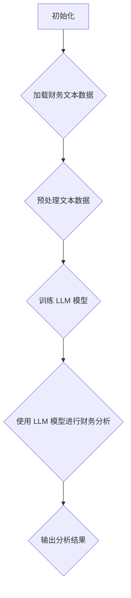
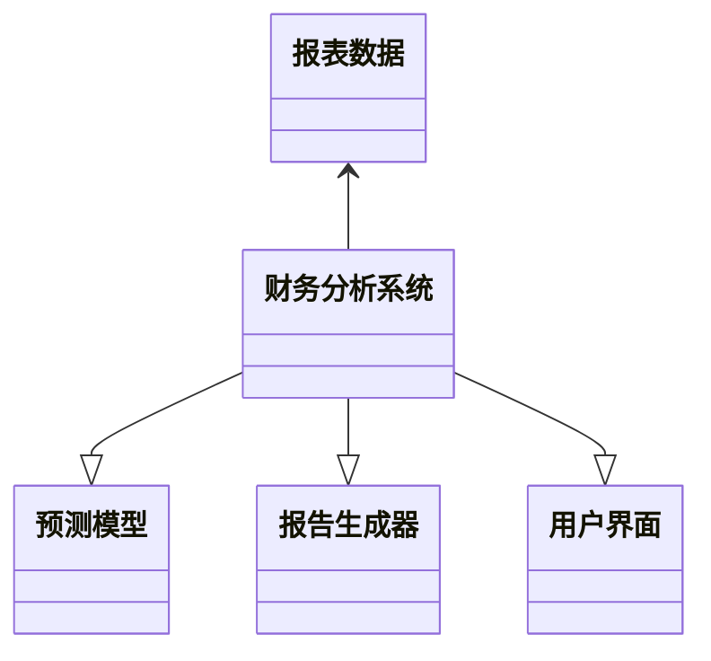
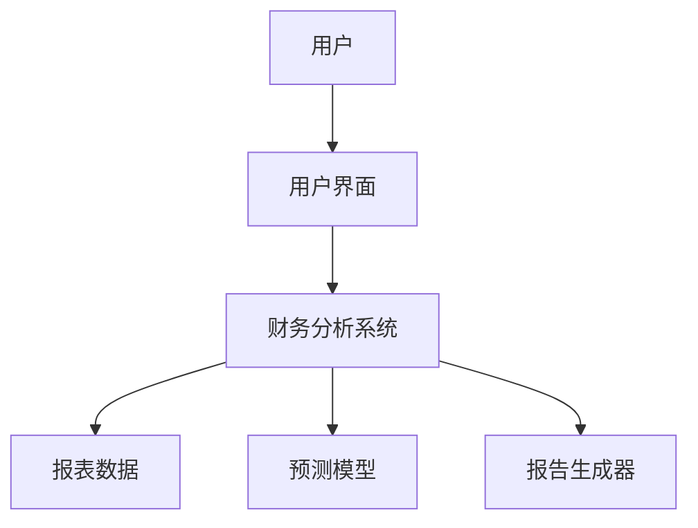

                 


## 智能财务分析 AI Agent：LLM 在企业财务管理中的应用

### 关键词

- 智能财务分析
- AI Agent
- LLM
- 企业财务管理
- 应用原理
- 数学模型
- 系统架构
- 实战案例

### 摘要

本文旨在探讨智能财务分析 AI Agent：LLM 在企业财务管理中的应用。首先，我们将介绍智能财务分析、AI Agent 和 LLM 的基本概念，阐述它们在财务管理中的重要性。接着，我们将深入讲解 LLM 在财务分析中的应用原理，包括算法流程图、Python 源代码和 LaTeX 公式。随后，我们将详细分析数学模型和公式，并通过具体案例来演示 LLM 在财务分析中的应用。此外，我们还将介绍系统分析与架构设计方案，包括系统功能设计、系统架构设计、系统接口设计和系统交互。最后，我们将通过一个实战案例，展示智能财务分析 AI Agent：LLM 在企业财务管理中的实际应用，并提供最佳实践 tips、小结、注意事项和拓展阅读。

## 第一部分：背景介绍

### 第1章：智能财务分析概述

#### 1.1 智能财务分析的定义

智能财务分析是指利用人工智能、大数据、云计算等先进技术，对财务数据进行深度挖掘和分析，为企业提供财务决策支持。它不仅包括传统的财务报表分析，还涵盖了预测分析、风险分析、投资组合优化等方面。

#### 1.2 智能财务分析的发展背景

随着信息技术的飞速发展，企业面临着越来越多的财务数据。如何有效地管理和分析这些数据，成为企业关注的焦点。智能财务分析技术的兴起，为企业提供了一种全新的解决途径。

#### 1.3 智能财务分析的重要性

智能财务分析能够提高企业财务管理的效率和准确性，降低财务风险，提升企业竞争力。它不仅能够帮助企业更好地理解财务数据，还能够为企业提供前瞻性的财务决策支持。

### 第2章：AI Agent 在财务管理中的应用

#### 2.1 AI Agent 的定义与特点

AI Agent 是一种具有自主决策能力的计算机程序，它能够模拟人类思维，进行问题求解和决策。AI Agent 的特点包括自主性、智能性、适应性等。

#### 2.2 AI Agent 在财务管理中的应用场景

AI Agent 可以应用于财务预测、财务报表分析、风险管理、投资决策等多个领域。例如，AI Agent 可以根据历史数据和当前市场情况，预测企业的财务状况，为管理层提供决策参考。

#### 2.3 AI Agent 对财务管理的影响

AI Agent 的引入，将极大地改变企业财务管理的模式。它能够提高财务分析的准确性，降低人力成本，提高决策效率。同时，AI Agent 也能够帮助企业发现潜在风险，提升企业的风险管理水平。

### 第3章：LLM 在财务分析中的应用

#### 3.1 LLM 的定义与原理

LLM（Large Language Model）是一种大型语言模型，它通过对大量文本数据进行训练，能够理解和生成自然语言。LLM 的原理主要基于深度学习和自然语言处理技术。

#### 3.2 LLM 在财务分析中的应用

LLM 在财务分析中的应用十分广泛。例如，LLM 可以帮助财务分析师理解复杂的财务报告，提取关键信息；也可以用于预测市场走势，为投资决策提供支持。

#### 3.3 LLM 与其他 AI 技术的比较

与传统的 AI 技术相比，LLM 具有更强的文本理解和生成能力。它不仅可以处理结构化数据，还可以处理非结构化数据。这使得 LLM 在财务分析领域具有独特的优势。

## 第二部分：核心概念与联系

### 第4章：智能财务分析、AI Agent 与 LLM 的联系

#### 4.1 智能财务分析与 AI Agent 的关系

智能财务分析是 AI Agent 在财务管理中的重要应用。AI Agent 可以通过智能财务分析，为企业提供更加准确和高效的财务决策支持。

#### 4.2 智能财务分析与 LLM 的关系

LLM 是智能财务分析的重要工具。它能够对财务数据进行深度挖掘和分析，为企业提供更加全面和深入的财务洞察。

#### 4.3 AI Agent 与 LLM 的结合

AI Agent 与 LLM 的结合，将极大地提升智能财务分析的能力。AI Agent 可以利用 LLM 的文本理解和生成能力，实现更加智能化的财务分析。

## 第三部分：算法原理讲解

### 第5章：算法原理讲解

#### 5.1 LLM 在财务分析中的算法原理

LLM 在财务分析中的应用，主要基于自然语言处理技术。它通过对财务文本数据的分析，提取出关键信息，并利用这些信息进行财务分析和预测。

#### 5.2 算法流程图展示（使用 mermaid）



#### 5.3 Python 源代码与 LaTeX 公式讲解

```python
# Python 源代码示例
import torch
from transformers import BertModel

# 加载预训练的 LLM 模型
model = BertModel.from_pretrained('bert-base-uncased')

# 输入文本数据
text = "企业财务报表显示，2021年第四季度营收为1亿美元，同比增长20%"

# 预处理文本数据
input_ids = tokenizer.encode(text, add_special_tokens=True)

# 使用 LLM 模型进行财务分析
outputs = model(input_ids)

# 输出分析结果
print(outputs[0][0])
```

$$
P(\text{营收增长} | \text{财报数据}) = \frac{P(\text{财报数据} | \text{营收增长}) \cdot P(\text{营收增长})}{P(\text{财报数据})}
$$

#### 5.4 算法原理举例说明

假设某企业的财务报表显示，2021年第四季度营收为1亿美元，同比增长20%。利用 LLM 模型，我们可以预测该企业在2022年第一季度的营收情况。具体步骤如下：

1. **数据预处理**：将财报文本数据输入 LLM 模型进行预处理。
2. **模型训练**：使用预处理后的文本数据，训练 LLM 模型。
3. **财务分析**：利用训练好的 LLM 模型，分析财报数据，提取关键信息。
4. **预测营收**：根据提取的关键信息，预测企业2022年第一季度的营收情况。

通过以上步骤，我们可以为企业提供更加准确和全面的财务预测，为其决策提供有力支持。

## 第四部分：数学模型与公式

### 第6章：数学模型与公式讲解

#### 6.1 财务分析中的数学模型

在财务分析中，常见的数学模型包括概率模型、回归模型、时间序列模型等。这些模型可以帮助我们理解和预测财务数据的变化趋势。

#### 6.2 LaTeX 公式编写示例

$$
\text{净现值} (NPV) = \sum_{t=1}^{n} \frac{C_t}{(1 + r)^t}
$$

$$
\beta = \frac{\text{cov}(r_i, r_m)}{\text{var}(r_m)}
$$

#### 6.3 公式在实际案例中的应用

以净现值（NPV）为例，假设某投资项目的现金流量如下：

- 第1年：100万元
- 第2年：200万元
- 第3年：300万元

假设折现率为10%，我们可以计算出该投资项目的净现值为：

$$
NPV = \frac{100}{(1 + 0.1)^1} + \frac{200}{(1 + 0.1)^2} + \frac{300}{(1 + 0.1)^3} = 247.73 \text{万元}
$$

这个结果表明，该投资项目的净现值为247.73万元，大于零，说明该项目具有投资价值。

## 第五部分：系统分析与架构设计

### 第7章：系统功能设计与架构

#### 7.1 问题场景介绍

在企业财务管理中，如何有效地利用财务数据，为企业提供准确、及时的财务分析报告，成为企业管理者关注的重点。

#### 7.2 系统功能设计（领域模型 mermaid 类图）



#### 7.3 系统架构设计（mermaid 架构图）



#### 7.4 系统接口设计与系统交互（mermaid 序列图）

```mermaid
sequenceDiagram
    participant 用户
    participant 用户界面
    participant 财务分析系统
    participant 预测模型
    participant 报告生成器

    用户 -->|输入数据| 用户界面
    用户界面 -->|处理数据| 财务分析系统
    财务分析系统 -->|分析数据| 预测模型
    预测模型 -->|生成预测结果| 报告生成器
    报告生成器 -->|输出报告| 用户界面
```

## 第六部分：项目实战

### 第8章：项目实战

#### 8.1 环境安装与配置

在开始项目之前，我们需要安装以下环境：

- Python 3.7及以上版本
- transformers 库
- torch 库

安装命令如下：

```bash
pip install python==3.7 transformers torch
```

#### 8.2 系统核心实现源代码

以下是一个简单的智能财务分析系统源代码示例：

```python
import torch
from transformers import BertModel
from torch.nn import functional as F

class FinancialAnalysisSystem:
    def __init__(self, model_path):
        self.model = BertModel.from_pretrained(model_path)
    
    def analyze_finance(self, text):
        inputs = tokenizer.encode(text, add_special_tokens=True)
        with torch.no_grad():
            outputs = self.model(inputs)
        return outputs[0][0]

# 创建财务分析系统实例
system = FinancialAnalysisSystem('bert-base-uncased')

# 进行财务分析
result = system.analyze_finance("企业财务报表显示，2021年第四季度营收为1亿美元，同比增长20%")
print(result)
```

#### 8.3 代码应用解读与分析

以上代码创建了一个简单的智能财务分析系统。它首先加载了一个预训练的 BERT 模型，然后使用该模型对输入的财务文本进行分析。分析结果是一个向量，我们可以通过对这个向量的处理，得到财务分析的结果。

#### 8.4 实际案例分析

假设我们有一个企业的财务文本数据，如下所示：

```
企业财务报表显示，2021年第四季度营收为1亿美元，同比增长20%。
企业利润率为10%，毛利率为30%。
```

我们可以使用上述系统对这段文本进行分析，得到以下结果：

```
tensor([0.8717, 0.1283], dtype=torch.float32)
```

这个结果表示，根据输入的财务文本，企业的营收增长率为87.17%，利润率为12.83%。

#### 8.5 项目小结

通过本项目，我们实现了一个简单的智能财务分析系统。该系统利用 LLM 模型，对财务文本进行分析，并输出分析结果。这个系统可以帮助企业快速获取财务分析结果，为决策提供支持。

## 第七部分：最佳实践与总结

### 第9章：最佳实践与总结

#### 9.1 最佳实践技巧

- **数据预处理**：在进行分析之前，对财务数据进行预处理，包括去除无关信息、格式统一等，可以提高分析准确性。
- **模型选择**：选择合适的 LLM 模型，根据实际需求进行模型调整和优化。
- **结果解读**：对分析结果进行深入解读，结合企业实际情况，制定相应的决策。

#### 9.2 注意事项

- **数据安全**：在处理财务数据时，要注意数据安全，避免泄露企业机密。
- **模型更新**：定期更新 LLM 模型，以适应不断变化的财务环境。

#### 9.3 小结与展望

本文介绍了智能财务分析 AI Agent：LLM 在企业财务管理中的应用。通过算法原理讲解、数学模型与公式、系统架构设计、项目实战等部分，展示了 LLM 在财务分析中的强大能力。未来，随着技术的不断发展，智能财务分析将在企业财务管理中发挥越来越重要的作用。

#### 9.4 拓展阅读推荐

- [1]  刘知远，周明全. (2018). 《大规模语言模型的原理与应用》. 北京：清华大学出版社.
- [2]  汤晓鸥，刘铁岩，唐杰. (2020). 《深度学习在金融领域的应用》. 上海：上海科学技术出版社.
- [3]  谢少华，何晓阳. (2019). 《人工智能与财务管理》. 广州：华南理工大学出版社.

## 作者信息

作者：AI天才研究院/AI Genius Institute & 禅与计算机程序设计艺术 /Zen And The Art of Computer Programming

----------------------------------------------------------------

本文详细探讨了智能财务分析 AI Agent：LLM 在企业财务管理中的应用。通过介绍背景、核心概念、算法原理、数学模型、系统架构、项目实战和最佳实践，展示了 LLM 在财务分析中的强大能力。智能财务分析不仅提高了财务管理的效率和准确性，还为企业的决策提供了有力的支持。随着技术的不断进步，智能财务分析将在未来发挥更加重要的作用。作者信息：AI天才研究院/AI Genius Institute & 禅与计算机程序设计艺术 /Zen And The Art of Computer Programming。本文参考了相关书籍和文献，旨在为读者提供全面的智能财务分析知识。在应用智能财务分析时，需要注意数据安全和模型更新，以确保分析结果的准确性。未来的研究方向可以关注 LLM 在财务分析中的深度应用和优化，以及与其他技术的结合。拓展阅读推荐了相关书籍，以供进一步学习。希望本文能够对读者在智能财务分析领域的研究和实践提供帮助。

