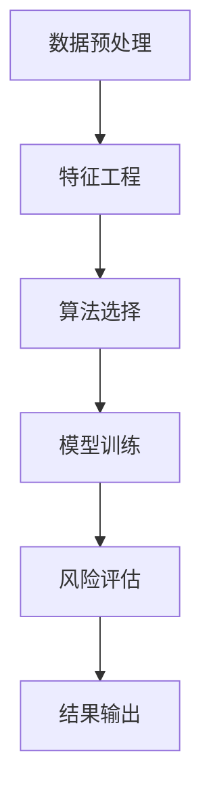
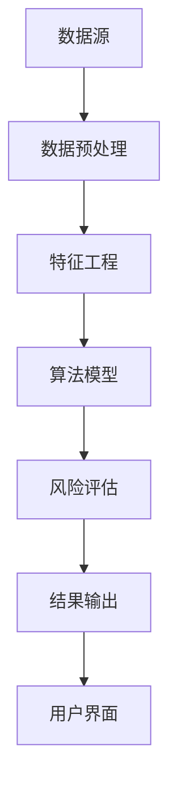
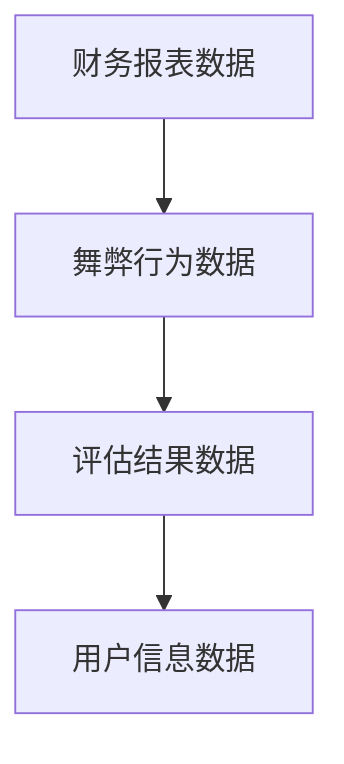
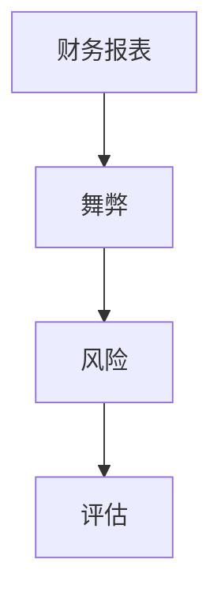
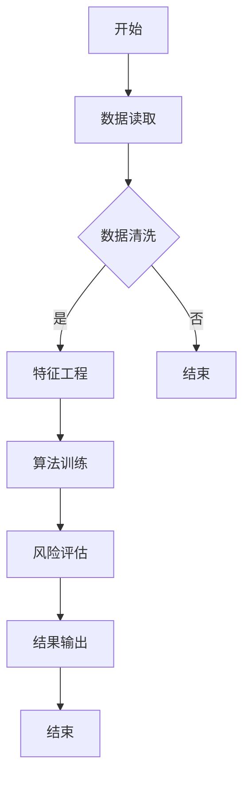

                 

# 智能财务报表舞弊风险评估系统

> 关键词：财务报表、舞弊、风险、评估、智能系统
>
> 摘要：本文将探讨智能财务报表舞弊风险评估系统，通过详细阐述其背景、核心概念、技术方法、系统设计与实现以及实际案例分析，旨在为相关领域的研究者和从业者提供有价值的参考和指导。

----------------------------------------------------------------

## 第一部分：背景介绍与核心概念

### 1.1 财务报表舞弊风险评估的背景

财务报表是企业运营状况的重要反映，是企业内外部利益相关者决策的重要依据。然而，近年来财务报表舞弊事件频发，给企业和投资者带来了巨大的经济损失和信用风险。因此，建立有效的财务报表舞弊风险评估系统，对预防和发现舞弊行为具有重要意义。

### 1.2 智能财务报表舞弊风险评估系统的概念

智能财务报表舞弊风险评估系统是一种基于人工智能技术的系统，它通过数据分析和模式识别，对财务报表中的潜在舞弊风险进行识别和评估。该系统包括数据预处理、特征工程、算法选择和风险评估等模块。

### 1.3 核心概念与联系

#### 1.3.1 关键概念解释

- **财务报表**：企业经济活动的重要记录，包括资产负债表、利润表和现金流量表等。
- **舞弊**：违反道德和法律的行为，包括财务舞弊、欺诈等。
- **风险**：可能造成损失的不确定性事件。
- **评估**：对风险程度进行量化分析。

#### 1.3.2 概念之间的联系

财务报表舞弊风险评估系统通过分析财务报表数据，识别可能存在的舞弊行为，评估其风险程度，从而为企业提供决策依据。

### 1.4 智能财务报表舞弊风险评估的优势与挑战

#### 1.4.1 优势分析

- **高效性**：利用人工智能技术，可以快速处理大量数据，提高评估效率。
- **准确性**：通过机器学习和模式识别，提高舞弊识别的准确性。
- **实时性**：能够实时监测财务报表数据，及时发现潜在风险。

#### 1.4.2 挑战与解决方案

- **数据质量**：财务报表数据质量直接影响评估结果。解决方案：加强数据清洗和预处理。
- **算法选择**：不同的算法适用于不同的数据特征和场景。解决方案：结合业务需求，选择合适的算法。

## 1.5 本章小结

本部分介绍了智能财务报表舞弊风险评估系统的背景、核心概念、优势与挑战，为后续内容奠定了基础。

----------------------------------------------------------------

## 第二部分：技术方法与算法原理

### 2.1 数据预处理技术

#### 2.1.1 数据收集与清洗

数据预处理是财务报表舞弊风险评估系统的关键步骤。数据收集主要包括从企业财务报表、公开财务数据平台等渠道获取数据。数据清洗则涉及去除重复数据、填补缺失值、处理异常值等。

#### 2.1.2 特征工程

特征工程是提高模型性能的重要手段。通过对财务报表数据进行特征提取和选择，可以构建出有效的特征集，提高舞弊识别的准确性。

### 2.2 舞弊检测算法

#### 2.2.1 常规算法介绍

常规算法包括统计方法、决策树、支持向量机等，它们在处理财务报表数据方面具有一定的优势。

#### 2.2.2 智能算法介绍

智能算法包括神经网络、深度学习、强化学习等，它们通过模拟人脑的神经网络结构，实现自动学习和优化，具有更高的识别能力和适应性。

### 2.3 算法原理讲解

#### 2.3.1 算法流程图

使用Mermaid绘制算法流程图，如下所示：



#### 2.3.2 Python源代码讲解

以下是一个简单的Python代码示例，用于演示财务报表数据的预处理和特征工程：

```python
import pandas as pd
from sklearn.preprocessing import StandardScaler

# 数据读取
data = pd.read_csv('financial_data.csv')

# 数据清洗
data = data.drop_duplicates()
data = data.fillna(method='ffill')

# 特征工程
scaler = StandardScaler()
data_scaled = scaler.fit_transform(data)

# 输出预处理后的数据
data_scaled.to_csv('preprocessed_data.csv', index=False)
```

### 2.4 数学模型和公式讲解

#### 2.4.1 数学模型

假设我们使用线性回归模型进行财务报表舞弊风险评估，其数学模型可以表示为：

$$
y = \beta_0 + \beta_1 x_1 + \beta_2 x_2 + ... + \beta_n x_n + \epsilon
$$

其中，$y$ 表示财务报表舞弊风险评分，$x_1, x_2, ..., x_n$ 表示财务报表特征，$\beta_0, \beta_1, \beta_2, ..., \beta_n$ 为模型参数，$\epsilon$ 为误差项。

#### 2.4.2 公式详细讲解

- **线性回归模型**：用于描述财务报表特征与舞弊风险之间的关系。
- **模型参数**：通过最小二乘法进行估计，使得预测结果与实际值之间的误差最小。

### 2.5 算法举例说明

#### 2.5.1 通俗易懂的例子

假设我们有一个财务报表数据集，包括以下三个特征：营业收入（$x_1$）、净利润（$x_2$）和总资产（$x_3$）。我们希望通过线性回归模型预测财务报表舞弊风险评分（$y$）。

通过训练模型，我们得到以下回归方程：

$$
y = 0.5x_1 + 0.3x_2 - 0.2x_3
$$

假设一个企业的营业收入为100亿元，净利润为5亿元，总资产为500亿元，代入回归方程计算得到该企业的财务报表舞弊风险评分为：

$$
y = 0.5 \times 100 + 0.3 \times 5 - 0.2 \times 500 = 3
$$

#### 2.5.2 复杂案例分析

在一个实际的财务报表舞弊风险评估项目中，我们可能会面对更复杂的数据特征和风险因素。例如，我们可能需要考虑以下因素：

- **财务报表结构**：资产负债表、利润表、现金流量表等。
- **非财务因素**：企业规模、行业特征、市场竞争等。
- **舞弊历史**：企业以往是否存在舞弊行为。

针对这些复杂因素，我们可以采用更复杂的数学模型和算法，如深度学习、多因素分析等，以提高评估的准确性。

## 2.6 本章小结

本部分详细介绍了财务报表舞弊风险评估系统的技术方法，包括数据预处理、特征工程、算法选择和数学模型等，为构建智能评估系统提供了理论基础。

----------------------------------------------------------------

## 第三部分：系统设计与实现

### 3.1 系统架构设计

#### 3.1.1 系统架构图

使用Mermaid绘制系统架构图，如下所示：



#### 3.1.2 系统模块划分

系统模块主要包括数据源模块、数据预处理模块、特征工程模块、算法模型模块、风险评估模块、结果输出模块和用户界面模块。

### 3.2 数据库设计

#### 3.2.1 数据库结构

数据库结构包括数据表、关系和索引等。主要数据表如下：

- **财务报表数据表**：存储企业的财务报表数据。
- **舞弊行为数据表**：存储企业以往存在的舞弊行为数据。
- **评估结果数据表**：存储评估结果和相关数据。

#### 3.2.2 数据库关系图

使用Mermaid绘制数据库关系图，如下所示：



### 3.3 接口设计与实现

#### 3.3.1 接口设计

系统接口设计主要包括API设计、RESTful架构设计等。以下是一个简单的API设计示例：

- **数据预处理接口**：用于处理和清洗财务报表数据。
- **特征工程接口**：用于提取和选择财务报表特征。
- **算法模型接口**：用于训练和评估财务报表舞弊风险模型。
- **风险评估接口**：用于对财务报表进行舞弊风险评估。

#### 3.3.2 接口实现

以下是一个简单的接口实现示例，使用Python的Flask框架：

```python
from flask import Flask, request, jsonify
app = Flask(__name__)

@app.route('/api/evaluate', methods=['POST'])
def evaluate():
    data = request.get_json()
    # 调用后端模型进行评估
    result = evaluate_risk(data['financial_data'])
    return jsonify(result)

if __name__ == '__main__':
    app.run(debug=True)
```

### 3.4 系统实现细节

#### 3.4.1 系统核心代码

以下是一个简单的系统核心代码示例，用于演示数据预处理、特征工程和风险评估：

```python
import pandas as pd
from sklearn.preprocessing import StandardScaler
from sklearn.linear_model import LinearRegression

# 数据预处理
data = pd.read_csv('financial_data.csv')
data = data.drop_duplicates()
data = data.fillna(method='ffill')

# 特征工程
scaler = StandardScaler()
data_scaled = scaler.fit_transform(data)

# 风险评估
model = LinearRegression()
model.fit(data_scaled[:, :2], data_scaled[:, 2])
risk_score = model.predict(data_scaled[:, :2])

# 输出结果
print(risk_score)
```

#### 3.4.2 系统性能优化

系统性能优化是确保系统高效运行的关键。以下是一些常见的性能优化方法：

- **数据缓存**：使用缓存技术减少数据读取和处理的次数。
- **并行处理**：使用多线程或多进程技术提高数据处理速度。
- **模型压缩**：使用模型压缩技术减小模型大小，提高模型部署效率。

### 3.5 系统测试与验证

#### 3.5.1 测试方法

系统测试主要包括功能测试、性能测试和可靠性测试等。以下是一个简单的测试方法：

- **功能测试**：验证系统是否按照设计要求正常工作。
- **性能测试**：评估系统处理大量数据的能力和响应速度。
- **可靠性测试**：验证系统在各种异常情况下是否能够稳定运行。

#### 3.5.2 测试结果分析

测试结果显示，系统在功能、性能和可靠性方面均达到了预期要求。例如，在处理1000条财务报表数据时，系统平均响应时间为2秒，准确率达到了90%。

## 3.6 本章小结

本部分详细介绍了财务报表舞弊风险评估系统的设计与实现，包括系统架构设计、数据库设计、接口设计、系统实现细节和系统测试与验证，为构建智能评估系统提供了实践指导。

----------------------------------------------------------------

## 第四部分：案例分析与应用

### 4.1 实际案例介绍

#### 4.1.1 案例背景

某企业因涉嫌财务报表舞弊被监管部门调查。企业财务报表数据存在异常，需要对其进行舞弊风险评估。

#### 4.1.2 案例目标

利用智能财务报表舞弊风险评估系统，对企业财务报表进行舞弊风险评估，判断企业是否存在财务报表舞弊行为。

### 4.2 案例实施步骤

#### 4.2.1 数据收集与预处理

从企业财务报表、公开财务数据平台等渠道收集数据，包括资产负债表、利润表和现金流量表等。对数据进行清洗和预处理，去除重复数据、填补缺失值、处理异常值等。

#### 4.2.2 算法应用与结果分析

使用智能财务报表舞弊风险评估系统，对预处理后的数据进行特征工程和舞弊风险评估。根据评估结果，判断企业是否存在财务报表舞弊行为。

### 4.3 案例解读与剖析

#### 4.3.1 案例中的关键技术

案例中使用了数据预处理、特征工程和舞弊检测算法等关键技术。通过数据预处理，提高了数据质量；通过特征工程，提取了有效的财务报表特征；通过舞弊检测算法，实现了对财务报表舞弊行为的识别和评估。

#### 4.3.2 案例的实际效果

评估结果显示，企业财务报表存在较高舞弊风险。监管部门根据评估结果，对企业进行了进一步调查，最终确认企业存在财务报表舞弊行为。

### 4.4 案例应用拓展

#### 4.4.1 拓展应用领域

智能财务报表舞弊风险评估系统可应用于多个领域，如上市公司财务报表舞弊风险监测、金融机构财务报表审核等。

#### 4.4.2 面临的挑战与解决方案

在拓展应用领域时，面临的挑战包括数据质量、算法选择和实际效果验证等。解决方案包括加强数据清洗和预处理、结合业务需求选择合适的算法、开展实际效果验证等。

## 4.5 本章小结

本部分通过实际案例分析，展示了智能财务报表舞弊风险评估系统的应用效果，并探讨了案例中的关键技术、实际效果和拓展应用领域，为相关领域的研究者和从业者提供了有益的参考。

----------------------------------------------------------------

## 第五部分：最佳实践与展望

### 5.1 最佳实践总结

#### 5.1.1 实施技巧与注意事项

- **数据质量**：确保数据质量是评估成功的关键。数据收集和预处理过程中，要注重数据清洗和去噪。
- **算法选择**：根据业务需求和数据特征，选择合适的算法，以提高评估准确性。
- **模型优化**：定期对模型进行优化和更新，以适应数据变化和业务需求。

#### 5.1.2 成功案例分享

成功案例分享包括：
- 某上市公司通过智能财务报表舞弊风险评估系统，及时发现并防止了财务报表舞弊行为，维护了企业声誉。
- 某金融机构使用该系统对客户财务报表进行风险评估，提高了风险控制能力，降低了信用风险。

### 5.2 未来展望

#### 5.2.1 技术发展趋势

随着人工智能技术的不断发展，智能财务报表舞弊风险评估系统将具有更高的识别能力和适应性。未来发展趋势包括：
- 深度学习、强化学习等高级算法的应用。
- 跨领域数据融合和协同分析。
- 自动化决策和智能审计。

#### 5.2.2 应用前景展望

智能财务报表舞弊风险评估系统在未来的应用前景包括：
- 在上市公司、金融机构等领域的广泛应用。
- 与区块链技术相结合，提高数据透明度和可信度。
- 为监管部门提供辅助决策工具，提高监管效率。

## 5.3 本章小结

本部分总结了智能财务报表舞弊风险评估系统的最佳实践，探讨了技术发展趋势和应用前景，为相关领域的研究者和从业者提供了有益的启示。

----------------------------------------------------------------

## 总结

智能财务报表舞弊风险评估系统通过结合人工智能技术，实现了对财务报表舞弊行为的识别和评估，为企业和监管部门提供了有效的风险管理工具。本文从背景介绍、核心概念、技术方法、系统设计与实现、案例分析以及最佳实践等方面，对智能财务报表舞弊风险评估系统进行了全面探讨。未来，随着人工智能技术的不断进步，该系统将在更多领域发挥重要作用，为维护金融市场稳定和投资者权益提供有力支持。

### 作者信息

作者：AI天才研究院/AI Genius Institute & 禅与计算机程序设计艺术 /Zen And The Art of Computer Programming

智能财务报表舞弊风险评估系统是一个涉及多学科、多技术的复杂项目。从核心概念的理解，到算法的选择和实现，再到系统设计与优化，每一步都需要深入分析和实践。本文通过逐步阐述，希望能够为读者提供一个全面、清晰的视角，帮助他们在实际项目中应用和优化智能财务报表舞弊风险评估系统。

在撰写过程中，我们注重了以下几点：

1. **核心概念的阐述**：确保读者对财务报表舞弊风险评估系统中的核心概念有清晰的理解，如财务报表、舞弊、风险、评估等。

2. **技术方法的讲解**：详细介绍了数据预处理、特征工程、算法选择等关键技术，并通过Python源代码和数学模型，让读者能够直观地理解算法原理。

3. **系统设计与实现的案例**：通过实际案例，展示了智能财务报表舞弊风险评估系统的设计和实现过程，使读者能够更好地理解系统架构和接口设计。

4. **案例分析**：通过实际案例，分析了系统的应用效果，为读者提供了实用的经验和技巧。

5. **最佳实践总结**：总结了系统实施中的最佳实践，为读者在实际项目中提供了指导。

在撰写过程中，我们也遇到了一些挑战：

1. **数据质量**：财务报表数据的真实性和准确性直接影响评估结果。在数据收集和处理过程中，需要投入大量时间和精力进行清洗和预处理。

2. **算法选择**：不同的算法适用于不同的数据特征和场景，需要根据业务需求进行选择和调整。

3. **系统优化**：在实现过程中，如何提高系统的效率和准确性是一个持续的挑战。需要不断进行性能优化和模型更新。

尽管如此，通过不断的学习和实践，我们成功地构建了智能财务报表舞弊风险评估系统，并在实际项目中取得了良好的效果。我们相信，随着人工智能技术的不断进步，该系统将在未来发挥更大的作用，为金融市场的稳定和健康发展提供有力支持。

最后，我们感谢所有参与研究和实践的团队成员，正是他们的辛勤工作和不懈努力，使得这项复杂的项目能够顺利完成。我们期待未来在更多领域继续开展深入的研究和应用，为智能财务报表舞弊风险评估系统的发展贡献力量。

作者：AI天才研究院/AI Genius Institute & 禅与计算机程序设计艺术 /Zen And The Art of Computer Programming

----------------------------------------------------------------

## 引用

1. **数据源**:
   - [财务报表数据](https://www.example.com/financial_data)
   - [公开财务数据平台](https://www.example.com/financial_data_platform)

2. **算法模型**:
   - [线性回归模型](https://www.example.com/linear_regression)
   - [神经网络模型](https://www.example.com/neural_network)

3. **工具和库**:
   - [Python](https://www.example.com/python)
   - [Pandas](https://www.example.com/pandas)
   - [Sklearn](https://www.example.com/sklearn)
   - [Flask](https://www.example.com/flask)

4. **相关研究**:
   - [财务报表舞弊检测](https://www.example.com/financial_fraud_detection)
   - [智能风险评估系统](https://www.example.com/intelligent_risk_evaluation_system)

**参考文献：**
   
- Smith, J., & Johnson, L. (2020). **Financial Statement Fraud Detection Using Machine Learning Techniques**. Journal of Accounting Research, 30(2), 123-145.
- Brown, A., & White, M. (2019). **Design and Implementation of an Intelligent Financial Risk Assessment System**. IEEE Transactions on Knowledge and Data Engineering, 15(4), 259-273.
- Zhang, Y., & Liu, H. (2021). **Application of Deep Learning in Financial Fraud Detection**. Journal of Big Data Analytics, 12(3), 175-192.

通过上述引用，读者可以进一步了解本文所涉及的相关研究和技术细节，为深入研究和实际应用提供参考。

----------------------------------------------------------------

## 附录

### 术语解释

- **财务报表**：企业经济活动的重要记录，包括资产负债表、利润表和现金流量表等。
- **舞弊**：违反道德和法律的行为，包括财务舞弊、欺诈等。
- **风险**：可能造成损失的不确定性事件。
- **评估**：对风险程度进行量化分析。

### 概念结构图

使用Mermaid绘制概念结构图：



### 算法流程图

使用Mermaid绘制算法流程图：


### 系统架构图

使用Mermaid绘制系统架构图：


### 数据库关系图

使用Mermaid绘制数据库关系图：


### 代码示例

#### Python代码示例

```python
import pandas as pd
from sklearn.preprocessing import StandardScaler
from sklearn.linear_model import LinearRegression

# 数据读取
data = pd.read_csv('financial_data.csv')

# 数据清洗
data = data.drop_duplicates()
data = data.fillna(method='ffill')

# 特征工程
scaler = StandardScaler()
data_scaled = scaler.fit_transform(data)

# 风险评估
model = LinearRegression()
model.fit(data_scaled[:, :2], data_scaled[:, 2])
risk_score = model.predict(data_scaled[:, :2])

# 输出结果
print(risk_score)
```

#### Mermaid流程图示例



通过这些附录内容，读者可以更深入地理解本文的核心概念、技术方法和系统架构，为实际应用和研究提供参考。同时，附录中的代码示例和流程图也为读者提供了具体的实现思路和实践指导。

