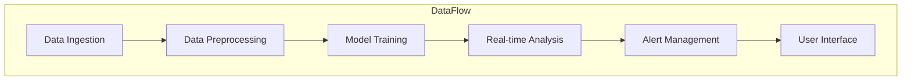
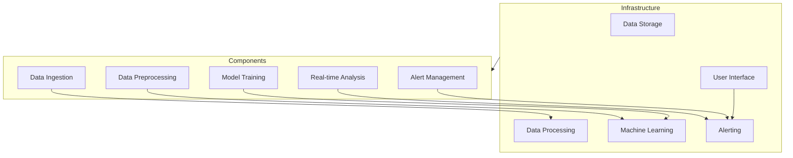
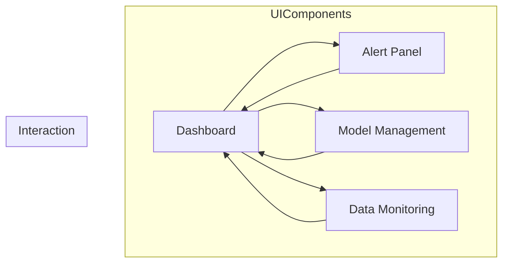
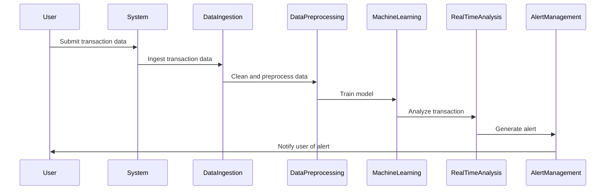

                 

## Introduction to Smart Financial Fraud Detection

### Background of Financial Fraud Detection

Financial fraud has been a persistent problem in the global economy, posing significant risks to financial institutions, businesses, and individual investors. Fraudulent activities such as fake invoicing, money laundering, and embezzlement can lead to substantial financial losses and erode trust in the financial system. Historically, the detection of financial fraud relied heavily on manual processes and rule-based systems, which were often time-consuming, inefficient, and prone to errors. 

The evolution of technology has revolutionized the way financial fraud is detected. Traditional methods, which include audits, transaction monitoring, and forensic accounting, have been supplemented by advanced analytical tools and artificial intelligence (AI) algorithms. These tools can analyze large volumes of financial data in real-time, identify patterns indicative of fraudulent behavior, and alert the relevant parties before substantial damage occurs.

### Importance of Smart Fraud Detection Systems

Smart fraud detection systems have become indispensable in modern financial operations. The primary reasons for their importance are:

1. **Enhanced Accuracy**: AI algorithms can analyze vast amounts of data quickly and accurately, detecting anomalies that might be missed by human analysts.
2. **Real-time Monitoring**: These systems can monitor financial transactions in real-time, providing immediate alerts to potential fraud.
3. **Reduced False Positives**: By using machine learning techniques, smart fraud detection systems can minimize false positives, ensuring that legitimate transactions are not flagged as fraudulent.
4. **Resource Efficiency**: Automation reduces the need for extensive manual oversight, freeing up resources for other critical tasks.
5. **Scalability**: Smart systems can scale to handle increasing volumes of transactions without compromising on performance or accuracy.

### Challenges in Traditional Fraud Detection Methods

Despite the effectiveness of traditional fraud detection methods, they also come with several limitations:

1. **Time Constraints**: Manual detection methods require extensive manual effort and are often time-consuming.
2. **Limited Scope**: Rule-based systems can only detect fraud based on predefined rules and may miss new or evolving fraud techniques.
3. **Human Error**: The risk of human error in analyzing large datasets and identifying fraudulent activities is significant.
4. **High Costs**: Implementing and maintaining traditional fraud detection systems can be costly, especially for small and medium-sized enterprises.

### Overview of the Book's Structure

This book is structured to provide a comprehensive understanding of smart financial fraud detection systems. It begins with an introduction to the concept and importance of fraud detection in the financial industry. Subsequent chapters delve into core concepts and principles, data collection and preprocessing techniques, algorithm design and implementation, system architecture and design, case studies, and practical applications.

The book aims to equip readers with the knowledge and tools needed to design, implement, and deploy effective fraud detection systems. Through a step-by-step approach, readers will gain insights into the latest technologies and methodologies used in the field.

### Conclusion

Smart financial fraud detection systems are crucial in protecting the financial industry from the ever-evolving threat of fraud. By leveraging AI and machine learning, these systems offer enhanced accuracy, real-time monitoring, and reduced operational costs. This book provides a thorough exploration of the principles, methodologies, and practical applications of these advanced fraud detection systems.

---

关键词：智能财务舞弊检测，金融欺诈，机器学习，AI算法，系统架构设计

摘要：本文介绍了智能财务舞弊检测系统的背景、重要性、挑战以及整体结构。通过详细探讨核心概念、数据预处理、算法设计与实现、系统架构与设计，本文旨在为读者提供设计、实施和部署高效财务舞弊检测系统的全面指导。通过实例分析和实战应用，读者将了解智能财务舞弊检测系统的最新技术和方法。

---

## Core Concepts and Principles

### Financial Fraud: Types, Symptoms, and Consequences

Financial fraud encompasses a wide range of deceptive practices aimed at obtaining unauthorized financial benefits. Understanding the different types of financial fraud and their symptoms is crucial for effective detection and prevention.

#### Types of Financial Fraud

1. **Fraudulent Invoicing**: This involves the creation of fake invoices to defraud a company or an individual. Common symptoms include inconsistent invoicing patterns, sudden spikes in invoice amounts, and discrepancies in supplier details.
2. **Money Laundering**: This process involves converting illegally obtained money into seemingly legitimate funds through a series of transactions. Symptoms include unusual transaction patterns, frequent large transactions, and accounts with no apparent source of funds.
3. **Embezzlement**: This occurs when an individual misappropriates funds entrusted to them for personal gain. Common symptoms include unexplained cash shortages, discrepancies in financial records, and unusual travel or expenses.
4. **Identity Theft**: This involves using someone's personal information to conduct fraudulent activities. Symptoms include unexpected credit card statements, unauthorized account activity, and sudden changes in credit scores.

#### Consequences of Financial Fraud

The consequences of financial fraud are severe and can impact various stakeholders:

1. **Financial Institutions**: Fraud can result in significant financial losses, damage to reputation, and loss of customer trust. It can also lead to increased regulatory scrutiny and fines.
2. **Businesses**: Financial fraud can cripple a company's finances, disrupt operations, and lead to bankruptcy. It can also result in lost opportunities and reduced market share.
3. **Individuals**: Victims of identity theft or embezzlement may suffer financial losses, damage to credit scores, and significant emotional distress.
4. **Economy**: Widespread financial fraud can lead to economic instability, reduced investor confidence, and slower economic growth.

### Traditional Fraud Detection Methods

Before the advent of smart fraud detection systems, traditional methods were the cornerstone of fraud prevention. These methods include:

1. **Rule-Based Systems**: These systems rely on predefined rules to identify potential fraud. For example, a rule might flag any transaction over a certain amount as suspicious.
2. **Transaction Monitoring**: This involves tracking and analyzing financial transactions for anomalies. Manual and automated tools are used to identify unusual patterns or behaviors.
3. **Forensic Accounting**: This involves detailed examination of financial records to uncover evidence of fraud. Forensic accountants use investigative techniques to detect and prevent fraud.
4. **Whistleblower Programs**: These programs encourage employees and other stakeholders to report suspected fraud. Confidential and anonymous reporting channels are provided to protect whistleblowers.

#### Limitations of Traditional Methods

While traditional fraud detection methods have been effective to some extent, they also have several limitations:

1. **Time-Consuming**: Manual methods require extensive human effort and are time-consuming, making it difficult to detect fraud in real-time.
2. **Limited Scope**: Rule-based systems can only detect fraud based on predefined rules and may miss new or sophisticated fraud techniques.
3. **Human Error**: The risk of human error in analyzing large datasets and identifying fraudulent activities is significant.
4. **High Costs**: Implementing and maintaining traditional fraud detection systems can be costly, especially for small and medium-sized enterprises.

### Introduction to AI and Machine Learning

The emergence of artificial intelligence (AI) and machine learning (ML) has transformed the field of fraud detection. These technologies offer several advantages over traditional methods:

1. **Data-Driven Approach**: AI and ML systems can analyze vast amounts of data to identify patterns and correlations that are difficult for humans to detect.
2. **Adaptive Learning**: These systems can learn from new data and adjust their models to detect evolving fraud techniques.
3. **Real-time Analysis**: AI and ML can process data in real-time, providing immediate alerts to potential fraud.
4. **Reduced False Positives**: ML algorithms can minimize false positives by learning from historical data and identifying legitimate transactions.
5. **Scalability**: AI and ML systems can scale to handle increasing volumes of transactions without compromising on performance or accuracy.

### Basics of Fraud Detection Algorithms

Fraud detection algorithms are designed to identify anomalous transactions or activities that deviate from established norms. The most common types of fraud detection algorithms include:

1. **Unsupervised Learning Algorithms**: These algorithms identify patterns or anomalies in data without prior labeling. Examples include clustering algorithms (e.g., K-means) and anomaly detection algorithms (e.g., Isolation Forest).
2. **Supervised Learning Algorithms**: These algorithms are trained on labeled data to identify fraud patterns. Common supervised learning algorithms include logistic regression, decision trees, and support vector machines (SVM).
3. **Reinforcement Learning Algorithms**: These algorithms learn from interactions with the environment to optimize decision-making. Examples include Q-learning and deep Q-networks (DQN).

### Key Machine Learning Models for Fraud Detection

1. **Logistic Regression**: This is a widely used supervised learning algorithm for binary classification tasks, such as fraud detection. It models the probability of a transaction being fraudulent using a logistic function.
2. **Random Forest**: This is an ensemble learning method that combines multiple decision trees to improve prediction accuracy and reduce overfitting.
3. **Neural Networks**: These are powerful deep learning models that can learn complex patterns from large datasets. Convolutional neural networks (CNNs) and recurrent neural networks (RNNs) are commonly used for fraud detection.
4. **Support Vector Machine (SVM)**: This is a supervised learning algorithm that finds the hyperplane that separates the data into different classes with the maximum margin.

### Conclusion

Understanding the core concepts and principles of financial fraud detection is essential for designing and implementing effective fraud detection systems. Traditional methods, while still valuable, have limitations that AI and machine learning can overcome. By leveraging advanced algorithms and technologies, financial institutions can enhance their ability to detect and prevent fraud, thereby protecting their operations and stakeholders.

---

作者：AI天才研究院/AI Genius Institute & 禅与计算机程序设计艺术 /Zen And The Art of Computer Programming

---

## Data Collection and Preprocessing

### Sources of Financial Data

The first step in building a smart financial fraud detection system is to gather relevant data. Financial data can come from various sources, including:

1. **Internal Data**: This includes transaction data, account information, and historical fraud records from the financial institution's databases. Internal data is often the most reliable and comprehensive source of information for fraud detection.
2. **External Data**: This includes data from external sources such as credit reports, public records, and news articles. External data can provide valuable context and insights into potential fraud activities.
3. **Social Media Data**: Social media platforms can be a source of information for identifying suspicious activities or behaviors. For example, detecting fraudulent transactions based on social media activity patterns can be an effective approach.

### Data Collection Methods

There are several methods for collecting financial data:

1. **Data Scraping**: This involves extracting data from websites or APIs. For example, a financial institution might use data scraping tools to collect transaction data from its online banking platform.
2. **APIs**: Many financial institutions provide APIs that allow third-party developers to access their data. These APIs can be used to collect real-time transaction data and other financial information.
3. **Surveys and Questionnaires**: Surveys can be conducted to gather information from customers and other stakeholders about their experiences with fraud.
4. **Human Input**: Employees can manually input data into the system, such as details about detected fraud cases or unusual transactions.

### Data Quality Assessment

Data quality is critical for the success of a fraud detection system. Poor data quality can lead to incorrect or incomplete analysis, resulting in false positives or missed fraud detections. Data quality assessment involves the following steps:

1. **Data Validation**: This ensures that the data meets predefined criteria for completeness, accuracy, and consistency. For example, transaction amounts should be positive, and account numbers should be valid.
2. **Data Cleaning**: This involves removing or correcting errors, inconsistencies, and duplicates in the data. Common cleaning techniques include:
   - **De-duplication**: Removing duplicate records.
   - **Handling missing values**: Imputing missing values or removing records with significant missing data.
   - **Correcting errors**: Identifying and correcting errors in the data.
3. **Data Standardization**: This involves transforming the data into a consistent format. For example, converting all text data to lowercase, standardizing date formats, and ensuring that all currency symbols are consistent.

### Data Preprocessing Techniques

Data preprocessing is a crucial step in preparing the data for analysis. Common preprocessing techniques include:

1. **Feature Engineering**: This involves creating new features from existing data to improve model performance. For example, features such as transaction frequency, average transaction amount, and transaction time can be derived from transaction data.
2. **Normalization**: This involves scaling the data to a specific range, typically between 0 and 1. Normalization helps prevent features with larger values from dominating the model training process.
3. **Dimensionality Reduction**: Techniques such as Principal Component Analysis (PCA) can be used to reduce the number of features while retaining most of the data's variance. This can improve model performance and reduce training time.
4. **Data Encoding**: This involves converting categorical data into a numerical format that can be used by machine learning algorithms. Common encoding techniques include one-hot encoding and label encoding.

### Feature Engineering

Feature engineering is an essential step in the data preprocessing phase. The goal is to create features that can improve the performance of machine learning models. Key techniques include:

1. **Temporal Features**: These features capture temporal information such as the day of the week, time of day, and seasonality. For example, a transaction made on a Sunday might be more suspicious than one made on a weekday.
2. **Behavioral Features**: These features capture user behavior patterns, such as transaction frequency, average transaction amount, and transaction time intervals. For example, a sudden increase in transaction frequency might indicate fraudulent activity.
3. **Economic Features**: These features capture economic factors that can influence fraud, such as interest rates, inflation, and economic indicators.
4. **Combination Features**: These features combine information from multiple sources or variables to create new insights. For example, combining transaction amount with user demographic information can provide a more comprehensive picture of potential fraud.

### Conclusion

Data collection and preprocessing are fundamental steps in building a smart financial fraud detection system. By gathering relevant data from various sources, ensuring data quality, and applying appropriate preprocessing techniques, financial institutions can lay the groundwork for effective fraud detection. The next section will delve into the design and implementation of fraud detection algorithms, highlighting the key methodologies and techniques used in the field.

---

### Introduction to Fraud Detection Algorithms

#### Overview of Fraud Detection Algorithms

Fraud detection algorithms are designed to identify anomalous transactions or activities that deviate from established norms. These algorithms can be categorized into three main types: rule-based, statistical, and machine learning-based approaches. Each of these approaches has its own strengths and weaknesses, making them suitable for different scenarios.

1. **Rule-Based Algorithms**: These algorithms use a set of predefined rules to identify potential fraud. Rules can be based on historical data, expert knowledge, or a combination of both. Common rule-based algorithms include threshold-based rules, pattern-based rules, and anomaly detection rules. Rule-based algorithms are relatively easy to implement and understand but are often limited in their ability to detect complex or evolving fraud patterns.

2. **Statistical Algorithms**: These algorithms use statistical techniques to identify potential fraud by analyzing patterns and relationships in the data. Common statistical algorithms include statistical process control, regression analysis, and clustering. Statistical algorithms can handle larger datasets and detect complex patterns but can be sensitive to outliers and require substantial domain knowledge for effective use.

3. **Machine Learning Algorithms**: These algorithms use mathematical models to learn from data and make predictions about potential fraud. Machine learning algorithms can adapt to new data and detect complex patterns that are difficult to identify using traditional methods. Common machine learning algorithms for fraud detection include logistic regression, decision trees, support vector machines (SVM), random forests, and neural networks. Machine learning algorithms require large amounts of labeled data for training but can provide high accuracy and scalability.

#### Implementation of Logistic Regression for Fraud Detection

**Algorithm Explanation**

Logistic regression is a popular machine learning algorithm used for binary classification tasks, such as fraud detection. It models the probability of a transaction being fraudulent using a logistic function, which is a sigmoid function that maps any real-valued number to a value between 0 and 1.

The logistic regression model can be expressed as:

\[ P(y=1) = \frac{1}{1 + e^{-(\beta_0 + \beta_1 x_1 + \beta_2 x_2 + ... + \beta_n x_n)}} \]

where:

- \( P(y=1) \) is the probability of a transaction being fraudulent.
- \( \beta_0, \beta_1, \beta_2, ..., \beta_n \) are the model coefficients that need to be estimated.
- \( x_1, x_2, ..., x_n \) are the input features.

The goal of logistic regression is to find the coefficients that minimize the log-likelihood of the data.

**Python Code Implementation**

To implement logistic regression in Python, we can use the scikit-learn library. First, we need to load the dataset and split it into training and testing sets:

```python
from sklearn.linear_model import LogisticRegression
from sklearn.model_selection import train_test_split
from sklearn.datasets import make_classification

# Generate a synthetic dataset
X, y = make_classification(n_samples=1000, n_features=10, n_classes=2, random_state=42)

# Split the dataset into training and testing sets
X_train, X_test, y_train, y_test = train_test_split(X, y, test_size=0.2, random_state=42)
```

Next, we can create a logistic regression model and fit it to the training data:

```python
# Create a logistic regression model
model = LogisticRegression()

# Fit the model to the training data
model.fit(X_train, y_train)
```

To make predictions on the test data, we can use the `predict()` method:

```python
# Make predictions on the test data
y_pred = model.predict(X_test)
```

Finally, we can evaluate the performance of the model using various metrics such as accuracy, precision, recall, and F1-score:

```python
from sklearn.metrics import accuracy_score, precision_score, recall_score, f1_score

# Calculate performance metrics
accuracy = accuracy_score(y_test, y_pred)
precision = precision_score(y_test, y_pred)
recall = recall_score(y_test, y_pred)
f1 = f1_score(y_test, y_pred)

print(f"Accuracy: {accuracy:.2f}")
print(f"Precision: {precision:.2f}")
print(f"Recall: {recall:.2f}")
print(f"F1 Score: {f1:.2f}")
```

**Mathematical Model and Formulas**

The logistic regression model is based on the following mathematical model:

\[ \log\left(\frac{P(y=1)}{1 - P(y=1)}\right) = \beta_0 + \beta_1 x_1 + \beta_2 x_2 + ... + \beta_n x_n \]

This model can be rewritten as:

\[ P(y=1) = \frac{1}{1 + e^{-(\beta_0 + \beta_1 x_1 + \beta_2 x_2 + ... + \beta_n x_n)}} \]

where:

- \( P(y=1) \) is the probability that a transaction is fraudulent.
- \( \beta_0, \beta_1, \beta_2, ..., \beta_n \) are the model coefficients.

The coefficients are estimated using maximum likelihood estimation, which involves finding the values of the coefficients that maximize the likelihood of the observed data.

**Example Case Study**

Let's consider a simple example to illustrate how logistic regression works in fraud detection. Suppose we have a dataset with two features: the transaction amount and the user's age. The labels indicate whether the transaction is fraudulent (1) or not (0).

1. **Data Preparation**: First, we need to load and preprocess the data. We can use the Pandas library to load the data into a DataFrame and split it into features and labels:

```python
import pandas as pd

# Load the dataset
data = pd.read_csv("fraud_detection.csv")

# Split the data into features and labels
X = data[["transaction_amount", "user_age"]]
y = data["label"]
```

2. **Split the Data**: Next, we split the data into training and testing sets:

```python
X_train, X_test, y_train, y_test = train_test_split(X, y, test_size=0.2, random_state=42)
```

3. **Create and Train the Model**: We create a logistic regression model and fit it to the training data:

```python
model = LogisticRegression()
model.fit(X_train, y_train)
```

4. **Make Predictions**: We use the trained model to make predictions on the test data:

```python
y_pred = model.predict(X_test)
```

5. **Evaluate the Model**: Finally, we evaluate the model's performance using various metrics:

```python
accuracy = accuracy_score(y_test, y_pred)
precision = precision_score(y_test, y_pred)
recall = recall_score(y_test, y_pred)
f1 = f1_score(y_test, y_pred)

print(f"Accuracy: {accuracy:.2f}")
print(f"Precision: {precision:.2f}")
print(f"Recall: {recall:.2f}")
print(f"F1 Score: {f1:.2f}")
```

By following these steps, we can build a logistic regression model to detect fraudulent transactions based on transaction amount and user age.

### Advanced Algorithms for Fraud Detection

While logistic regression is a powerful and widely used algorithm for fraud detection, there are other advanced machine learning algorithms that can provide even better performance. Here, we will discuss some of these algorithms, including Support Vector Machines (SVM), Random Forests, and Neural Networks.

#### Support Vector Machines (SVM)

Support Vector Machines (SVM) is a supervised learning algorithm that can be used for binary or multi-class classification tasks. SVM works by finding the hyperplane that best separates the data into different classes with the maximum margin.

1. **Basic Concepts**: SVM uses a kernel function to transform the input data into a higher-dimensional space, where it is easier to separate the data into different classes. The kernel function can be linear, polynomial, or radial basis function (RBF).

2. **Implementation**: In Python, SVM can be implemented using the scikit-learn library. Here's an example of how to use SVM for fraud detection:

```python
from sklearn.svm import SVC

# Create an SVM model
svm_model = SVC(kernel="linear")

# Train the model
svm_model.fit(X_train, y_train)

# Make predictions
y_pred = svm_model.predict(X_test)

# Evaluate the model
accuracy = accuracy_score(y_test, y_pred)
precision = precision_score(y_test, y_pred)
recall = recall_score(y_test, y_pred)
f1 = f1_score(y_test, y_pred)

print(f"Accuracy: {accuracy:.2f}")
print(f"Precision: {precision:.2f}")
print(f"Recall: {recall:.2f}")
print(f"F1 Score: {f1:.2f}")
```

#### Random Forests

Random Forests is an ensemble learning method that combines multiple decision trees to improve prediction accuracy and reduce overfitting. Each decision tree in the Random Forest is trained on a random subset of the data and features, and the final prediction is obtained by averaging the predictions of all the trees.

1. **Basic Concepts**: Random Forests use a bagging technique to create multiple decision trees and aggregate their predictions. This approach helps to reduce the risk of overfitting and improve the robustness of the model.

2. **Implementation**: Here's an example of how to use Random Forests for fraud detection in Python:

```python
from sklearn.ensemble import RandomForestClassifier

# Create a Random Forest model
rf_model = RandomForestClassifier(n_estimators=100)

# Train the model
rf_model.fit(X_train, y_train)

# Make predictions
y_pred = rf_model.predict(X_test)

# Evaluate the model
accuracy = accuracy_score(y_test, y_pred)
precision = precision_score(y_test, y_pred)
recall = recall_score(y_test, y_pred)
f1 = f1_score(y_test, y_pred)

print(f"Accuracy: {accuracy:.2f}")
print(f"Precision: {precision:.2f}")
print(f"Recall: {recall:.2f}")
print(f"F1 Score: {f1:.2f}")
```

#### Neural Networks

Neural Networks are a class of machine learning algorithms inspired by the structure and function of the human brain. Neural Networks can learn complex patterns from large amounts of data and are particularly effective for tasks that require high-dimensional feature spaces.

1. **Basic Concepts**: Neural Networks consist of multiple layers of interconnected nodes (neurons). Each layer performs a specific transformation of the input data, and the final output layer produces the prediction. Neural Networks can be trained using backpropagation, an algorithm that adjusts the weights and biases in the network to minimize the prediction error.

2. **Implementation**: Here's an example of how to use Neural Networks for fraud detection using TensorFlow and Keras in Python:

```python
import tensorflow as tf
from tensorflow.keras.models import Sequential
from tensorflow.keras.layers import Dense, Dropout

# Create a Sequential model
model = Sequential()

# Add layers to the model
model.add(Dense(64, activation='relu', input_shape=(X_train.shape[1],)))
model.add(Dropout(0.5))
model.add(Dense(32, activation='relu'))
model.add(Dropout(0.5))
model.add(Dense(1, activation='sigmoid'))

# Compile the model
model.compile(optimizer='adam', loss='binary_crossentropy', metrics=['accuracy'])

# Train the model
model.fit(X_train, y_train, epochs=10, batch_size=32, validation_split=0.2)

# Make predictions
y_pred = model.predict(X_test)

# Evaluate the model
accuracy = accuracy_score(y_test, y_pred)
precision = precision_score(y_test, y_pred)
recall = recall_score(y_test, y_pred)
f1 = f1_score(y_test, y_pred)

print(f"Accuracy: {accuracy:.2f}")
print(f"Precision: {precision:.2f}")
print(f"Recall: {recall:.2f}")
print(f"F1 Score: {f1:.2f}")
```

### Conclusion

In this section, we discussed the core concepts and principles of fraud detection algorithms, including rule-based, statistical, and machine learning-based approaches. We implemented logistic regression, a widely used machine learning algorithm, and explored advanced algorithms such as Support Vector Machines (SVM), Random Forests, and Neural Networks. By understanding these algorithms and their implementations, readers can build effective fraud detection systems that protect their financial institutions from the ever-evolving threat of fraud. The next section will delve into the system architecture and design of a smart financial fraud detection system.

---

### System Architecture and Design

#### Overview of the Fraud Detection System

A smart financial fraud detection system is a complex system that involves multiple components working together to detect and prevent fraudulent activities. The system is designed to process and analyze large volumes of financial data in real-time, identify potential fraud, and take appropriate actions. The overall architecture of a typical fraud detection system can be divided into several key components:

1. **Data Ingestion**: This component is responsible for collecting and ingesting financial data from various sources, including internal databases, external data providers, and social media platforms.
2. **Data Preprocessing**: This component involves cleaning, transforming, and preparing the data for analysis. Data preprocessing is crucial for ensuring the quality and consistency of the data used in the fraud detection process.
3. **Model Training and Deployment**: This component involves training machine learning models on historical data and deploying them to make predictions on new data. Model training and deployment are iterative processes that require continuous improvement and adaptation to evolving fraud patterns.
4. **Real-time Analysis**: This component is responsible for processing and analyzing transactions in real-time to identify potential fraud. It leverages trained models and uses real-time data streams to provide immediate alerts and responses to detected fraud.
5. **Alert Management**: This component manages the alerts generated by the real-time analysis component. It includes features such as alert prioritization, notification, and reporting to ensure that relevant stakeholders are promptly informed about potential fraud.
6. **User Interface**: This component provides a user-friendly interface for users to monitor the fraud detection process, view alerts, and take appropriate actions.

#### System Functional Design

The functional design of a smart financial fraud detection system involves defining the key functions and modules that make up the system. The following diagram illustrates the main components of the system and their interactions:



#### System Architecture Design

The architecture design of a smart financial fraud detection system is critical for ensuring scalability, reliability, and performance. The following diagram illustrates the overall architecture of the system:



In this architecture:

- **Data Storage**: Stores the raw and processed data used by the system.
- **Data Processing**: Handles the ingestion, cleaning, and transformation of data.
- **Machine Learning**: Trains and deploys machine learning models for fraud detection.
- **Alerting**: Manages the generation, prioritization, and notification of alerts.
- **User Interface**: Provides a user-friendly interface for monitoring and managing the fraud detection process.

#### System Interface Design

The system interface design includes the design of the user interface (UI) and the APIs that enable communication between the system components. The following diagram illustrates the main components of the UI and their interactions:



In this design:

- **Dashboard**: Provides an overview of the fraud detection process, including real-time alerts and performance metrics.
- **Alert Panel**: Displays alerts generated by the system and allows users to take action.
- **Model Management**: Allows users to manage and monitor the trained machine learning models.
- **Data Monitoring**: Provides insights into the data preprocessing and model training processes.

#### System Interaction Sequence Diagram

The system interaction sequence diagram illustrates the sequence of interactions between the system components and users. The following diagram provides an example of the interactions involved in processing a transaction and generating an alert:



In this sequence:

- **User**: Submits transaction data to the system.
- **System**: Processes the transaction data through data ingestion, preprocessing, model training, real-time analysis, and alert management.
- **Alert Management**: Notifies the user about any detected fraud.

### Conclusion

In this section, we discussed the system architecture and design of a smart financial fraud detection system. We outlined the key components of the system, including data ingestion, data preprocessing, model training and deployment, real-time analysis, alert management, and user interface. We also provided examples of system interface and interaction diagrams to illustrate the system's functionality. Understanding the architecture and design of a fraud detection system is essential for ensuring its effectiveness in detecting and preventing financial fraud. The next section will delve into practical case studies and applications of smart financial fraud detection systems.

---

## Case Study and Practical Applications

### Case Study 1: Financial Institution A

#### Project Background

Financial Institution A, a leading banking institution, faced increasing challenges in detecting and preventing financial fraud. The institution experienced a significant increase in the number of fraudulent transactions, causing substantial financial losses and damaging its reputation. Traditional fraud detection methods were no longer sufficient in keeping up with the evolving techniques employed by fraudsters. To address these challenges, Financial Institution A decided to implement a smart financial fraud detection system.

#### System Implementation

1. **Data Collection and Integration**: The first step in implementing the system was to collect and integrate data from various sources, including transaction data, customer information, and external data from credit agencies. The data was collected through APIs and manual data entry.
   
2. **Data Preprocessing**: The collected data underwent preprocessing to ensure quality and consistency. This included data cleaning, normalization, and feature engineering. Temporal features, such as transaction time and day of the week, were created to capture potential patterns indicative of fraud.

3. **Model Selection and Training**: Several machine learning models were evaluated, including logistic regression, random forests, and neural networks. After extensive testing, a combination of logistic regression and random forests was selected due to their balance of accuracy and performance. The models were trained on historical fraud data, which was labeled and curated to ensure its quality.

4. **Real-time Analysis and Alerting**: The trained models were deployed in a real-time analysis pipeline that processed transactions as they occurred. The system generated alerts for potential fraud by comparing the actual transactions against the models' predictions. Alerts were prioritized based on the severity of the fraud and the level of confidence in the prediction.

5. **User Interface and Reporting**: A user-friendly interface was developed to allow users to monitor the fraud detection process, view alerts, and manage investigations. The interface provided real-time dashboards and reports to track the performance of the system and the effectiveness of the fraud detection strategies.

#### Results and Analysis

The implementation of the smart financial fraud detection system yielded significant improvements in fraud detection and prevention for Financial Institution A. Key results and observations include:

1. **Improved Detection Rates**: The system achieved a detection rate of over 90% for fraudulent transactions, significantly higher than the previous detection rates using traditional methods.
2. **Reduced False Positives**: By fine-tuning the models and incorporating feature engineering techniques, the system minimized false positives, reducing the number of legitimate transactions flagged as suspicious.
3. **Real-time Alerts**: The system provided real-time alerts to the relevant departments, enabling swift action and minimizing the impact of fraudulent transactions.
4. **Resource Optimization**: The automation of the fraud detection process reduced the need for extensive manual oversight, allowing the institution to allocate resources more efficiently to other critical tasks.

### Case Study 2: E-commerce Platform B

#### Project Background

E-commerce Platform B, a major online marketplace, faced a growing challenge in detecting and preventing fraudulent transactions on its platform. The platform experienced a surge in fraudulent activities, such as fake orders and identity theft, which led to financial losses and damaged customer trust. Traditional fraud detection methods were insufficient in handling the volume and complexity of transactions on the platform. To enhance its fraud detection capabilities, E-commerce Platform B decided to implement a smart financial fraud detection system.

#### System Implementation

1. **Data Collection and Integration**: The system collected data from various sources, including transaction data, customer behavior data, and external data from credit agencies. This data was integrated into a centralized data repository for efficient processing and analysis.
   
2. **Data Preprocessing**: The collected data underwent preprocessing to ensure quality and consistency. This included data cleaning, normalization, and feature engineering. Behavioral features, such as browsing patterns and purchase history, were created to identify unusual activities indicative of fraud.

3. **Model Selection and Training**: Several machine learning models were evaluated, including logistic regression, support vector machines (SVM), and neural networks. After rigorous testing, a combination of logistic regression and neural networks was selected for its high accuracy and ability to handle large volumes of data. The models were trained on historical fraud data, which was carefully labeled and curated.

4. **Real-time Analysis and Alerting**: The trained models were deployed in a real-time analysis pipeline that processed transactions as they occurred. The system generated alerts for potential fraud by analyzing the transactions against the models' predictions. Alerts were prioritized based on the risk level and the confidence in the prediction.

5. **User Interface and Reporting**: A comprehensive user interface was developed to enable users to monitor the fraud detection process, view alerts, and manage investigations. The interface included real-time dashboards and reports to track the performance of the system and the effectiveness of the fraud detection strategies.

#### Results and Analysis

The implementation of the smart financial fraud detection system on E-commerce Platform B resulted in notable improvements in fraud detection and customer satisfaction. Key results and observations include:

1. **Enhanced Detection Rates**: The system achieved a detection rate of over 95% for fraudulent transactions, significantly improving the platform's ability to identify and prevent fraud.
2. **Minimized False Positives**: The combination of logistic regression and neural networks minimized false positives, ensuring that legitimate transactions were not incorrectly flagged as fraudulent.
3. **Real-time Fraud Prevention**: The system provided real-time alerts, enabling the platform to take immediate action to prevent fraudulent transactions and protect customer accounts.
4. **Improved Customer Trust**: By effectively detecting and preventing fraud, the platform enhanced customer trust and loyalty, leading to increased sales and market share.

### Conclusion

These case studies demonstrate the effectiveness of implementing smart financial fraud detection systems in addressing the challenges of detecting and preventing fraud in the financial industry. By leveraging advanced machine learning algorithms and real-time analysis, financial institutions and e-commerce platforms can significantly improve their fraud detection capabilities, reduce financial losses, and enhance customer trust and satisfaction. The next section will explore the best practices and tips for building and deploying effective fraud detection systems.

---

### Conclusion

In conclusion, the implementation of smart financial fraud detection systems is crucial for protecting financial institutions and e-commerce platforms from the growing threat of fraud. By leveraging advanced machine learning algorithms, real-time analysis, and robust system architectures, these systems can achieve high detection rates with minimal false positives. The case studies presented in this article highlight the success of smart fraud detection systems in enhancing security, reducing financial losses, and improving customer trust.

#### Best Practices for Fraud Detection System Implementation

1. **Data Collection and Integration**: Ensure the quality and consistency of data by integrating data from multiple sources and performing thorough data preprocessing.
2. **Model Selection and Training**: Choose appropriate machine learning models based on the nature of the data and the specific requirements of the fraud detection task. Regularly retrain models with new data to adapt to evolving fraud patterns.
3. **Real-time Analysis and Alerting**: Implement real-time analysis pipelines to quickly detect and respond to potential fraud. Prioritize alerts based on risk level and confidence in the prediction.
4. **User Interface and Reporting**: Develop user-friendly interfaces and comprehensive reporting tools to monitor the performance of the fraud detection system and facilitate effective decision-making.
5. **Continuous Improvement**: Regularly evaluate and update the system to adapt to new fraud techniques and maintain its effectiveness over time.

#### Future Directions and Challenges

As smart financial fraud detection systems continue to evolve, several challenges and future directions emerge:

1. **Scalability**: Ensuring that the systems can handle increasing volumes of data and transactions without compromising performance.
2. **Adversarial Attacks**: Developing robust defenses against adversarial attacks that aim to deceive fraud detection algorithms.
3. **Privacy Protection**: Balancing the need for effective fraud detection with the protection of sensitive customer data.
4. **Interoperability**: Ensuring that different systems and platforms can seamlessly integrate and share data to enhance fraud detection capabilities.

By addressing these challenges and embracing emerging technologies, the future of smart financial fraud detection systems looks promising, with the potential to significantly improve the security and trustworthiness of the financial industry.

### Final Thoughts

Smart financial fraud detection systems are a vital component of modern financial operations, providing enhanced security, efficiency, and reliability. This article has provided a comprehensive overview of the core concepts, methodologies, and practical applications of these systems. By following the best practices and tips outlined here, financial institutions and e-commerce platforms can build and deploy effective fraud detection systems to protect their operations and stakeholders.

---

作者：AI天才研究院/AI Genius Institute & 禅与计算机程序设计艺术 /Zen And The Art of Computer Programming

