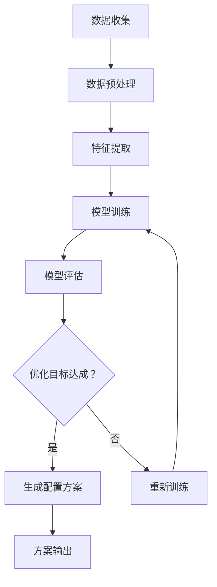
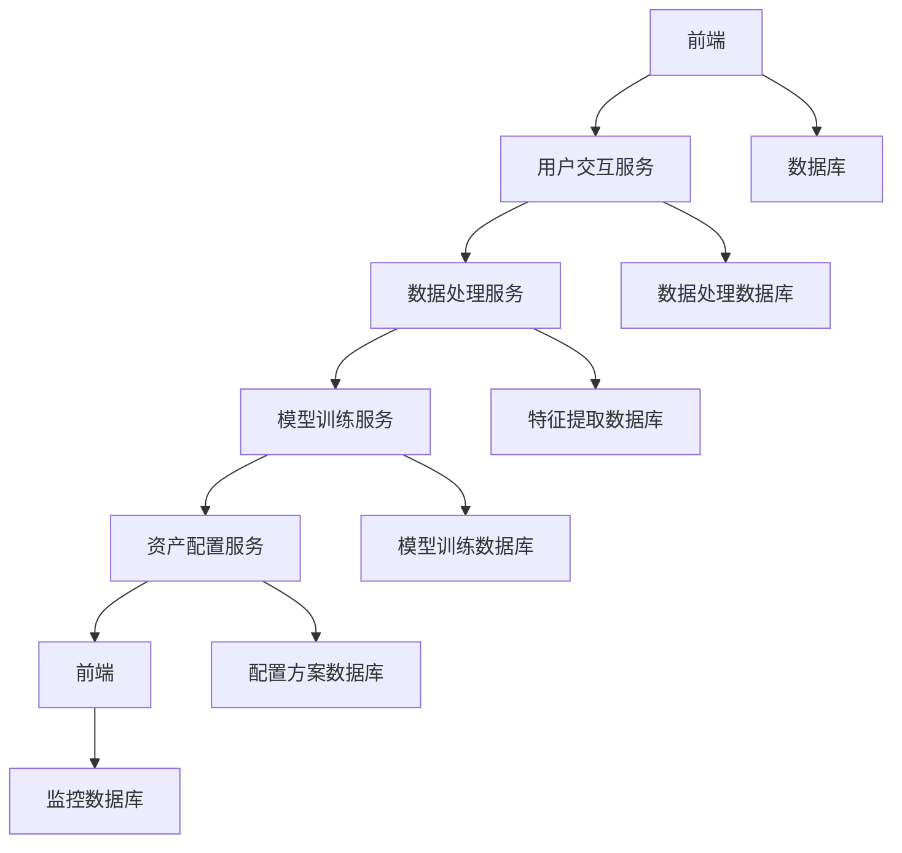

                 

### 智能资产配置优化器概述

#### 1.1 引言

在现代金融领域，资产配置成为了一种至关重要的投资策略。资产配置指的是将投资者的资金分配到不同类型的资产中，以达到风险与收益的最优平衡。然而，传统的资产配置方法往往依赖于历史数据和主观判断，难以适应快速变化的金融市场。智能资产配置优化器应运而生，它利用先进的智能算法和数据分析技术，为投资者提供更加精准、智能化的资产配置方案。

**问题背景：** 随着全球经济的不断发展和金融市场的日益复杂，投资者面临着越来越大的投资风险。传统的资产配置方法已无法满足投资者对风险控制和收益优化的需求，这就需要一种更加智能、科学的工具来辅助投资者做出明智的投资决策。

**问题描述：** 资产配置需要考虑众多因素，如投资目标、风险偏好、资金规模等，并且需要在多个资产类别之间进行权衡和调整。如何设计一个智能资产配置优化器，使其能够自动、准确地完成这一复杂的任务，是一个亟待解决的问题。

**问题解决：** 智能资产配置优化器通过整合海量数据、利用机器学习和人工智能技术，对投资者的风险偏好和投资目标进行分析，自动生成最优的资产配置方案。它不仅能够实时调整资产配置，以应对市场变化，还能够提供个性化的投资建议，帮助投资者实现资产增值。

#### 1.2 智能资产配置优化器的定义与意义

**定义：** 智能资产配置优化器是一种基于人工智能和大数据分析技术的投资工具，它通过算法模型和优化算法，为投资者提供个性化的资产配置方案。智能资产配置优化器不仅能够根据投资者的风险偏好和投资目标，自动调整资产配置比例，还能够通过历史数据和实时数据，预测市场走势，为投资者提供决策支持。

**意义：**

1. **提高投资效率：** 智能资产配置优化器能够自动化地进行资产配置，大大提高了投资决策的效率。投资者无需耗费大量时间和精力进行市场分析和资产调整，可以更加专注于其他重要的投资活动。

2. **降低投资风险：** 通过智能算法和大数据分析，智能资产配置优化器能够更准确地识别市场风险，为投资者提供低风险的资产配置方案。这有助于投资者避免因市场波动而导致的投资损失。

3. **个性化投资建议：** 智能资产配置优化器可以根据投资者的个人情况和需求，提供个性化的投资建议。这有助于投资者根据自身实际情况，制定更加科学合理的投资策略。

4. **优化收益：** 通过智能算法的优化，智能资产配置优化器能够帮助投资者在保证风险可控的前提下，实现更高的收益。这有助于投资者实现资产增值和财富积累。

**核心要素：**

1. **数据收集与处理：** 智能资产配置优化器需要收集和处理大量的历史和实时数据，包括市场行情、经济指标、投资者行为等。

2. **智能算法：** 智能资产配置优化器需要运用机器学习和人工智能技术，对数据进行分析和预测，以生成最优的资产配置方案。

3. **优化目标：** 智能资产配置优化器的优化目标是实现投资者风险和收益的最优平衡，具体包括风险控制、收益最大化、资产流动性等。

4. **用户交互：** 智能资产配置优化器需要提供友好的用户界面，使投资者能够方便地输入个人信息和投资目标，并接收个性化的投资建议。

#### 1.3 智能资产配置优化器的应用领域

**资产配置领域：** 智能资产配置优化器在个人投资和企业投资中都有着广泛的应用。对于个人投资者，智能资产配置优化器可以帮助他们根据个人风险偏好和投资目标，制定合理的资产配置方案。对于企业投资者，智能资产配置优化器可以帮助他们优化投资组合，提高投资收益。

**投资策略优化：** 智能资产配置优化器可以通过对历史数据和实时数据的分析，识别出市场趋势和投资机会，为投资者提供最优的投资策略。这有助于投资者在市场波动中抓住机遇，实现资产增值。

**风险管理：** 智能资产配置优化器可以通过对风险的量化分析，帮助投资者评估投资组合的风险水平，并提供风险管理建议。这有助于投资者在投资过程中保持风险可控，避免因市场波动导致的投资损失。

#### 1.4 智能资产配置优化器的边界与外延

**边界：** 智能资产配置优化器主要应用于金融领域，为投资者提供资产配置和投资策略优化服务。其核心功能是基于数据分析和智能算法，生成个性化的资产配置方案。

**外延：** 智能资产配置优化器的应用范围不仅限于金融领域，还可以扩展到其他领域，如企业财务管理、个人财务规划等。未来，随着技术的不断发展，智能资产配置优化器的功能将更加多样化，为投资者提供更全面的金融服务。

**概念结构与核心要素：**

1. **数据收集与处理：** 智能资产配置优化器的核心是数据，包括历史数据、实时数据和用户数据。数据收集和处理是智能资产配置优化器的基础。

2. **智能算法：** 智能资产配置优化器依赖于智能算法，如机器学习和深度学习算法，对数据进行分析和预测，生成最优的资产配置方案。

3. **优化目标：** 智能资产配置优化器的优化目标是实现投资者风险和收益的最优平衡，具体包括风险控制、收益最大化、资产流动性等。

4. **用户交互：** 智能资产配置优化器需要提供友好的用户界面，使投资者能够方便地输入个人信息和投资目标，并接收个性化的投资建议。

#### 1.5 本章小结

本章介绍了智能资产配置优化器的背景、定义与意义、应用领域和核心要素。智能资产配置优化器作为现代金融领域的一种重要工具，通过智能算法和大数据分析技术，为投资者提供个性化的资产配置方案，具有显著的应用价值和广阔的发展前景。

### 智能资产配置优化器的核心概念

#### 2.1 资产配置理论

资产配置理论是金融学中的一个重要分支，它研究如何将投资资金分配到不同类型的资产中，以实现风险与收益的最优平衡。资产配置理论的基础是现代投资组合理论（Modern Portfolio Theory，MPT），该理论由哈里·马科维茨（Harry Markowitz）在1952年提出。

**资产配置的基础理论：**

1. **分散化原则：** 分散化是指将资金分配到多种不同类型的资产中，以降低单一资产风险对整个投资组合的影响。根据资产配置理论，分散化是降低投资组合风险的有效方法。

2. **资产预期收益与风险：** 每种资产都有其预期的收益和风险。资产配置的目标是在预期收益和风险之间找到最佳平衡点。投资者需要根据自身的风险承受能力和投资目标，选择合适的资产组合。

3. **资产相关性：** 不同资产之间的相关性会影响投资组合的整体风险。当两种资产之间的相关性较低或负相关时，投资组合的风险会降低。因此，资产配置中需要考虑资产之间的相关性。

4. **有效前沿理论：** 有效前沿理论指出，投资者可以在预期收益一定的情况下，选择风险最小的投资组合，或者在风险一定的情况下，选择收益最高的投资组合。有效前沿是所有最优投资组合的集合。

**资产配置的目标：**

1. **风险控制：** 资产配置的首要目标是控制投资组合的整体风险。通过合理的资产配置，投资者可以降低单一资产或资产类别波动对投资组合的影响。

2. **收益最大化：** 在风险可控的前提下，资产配置的目标是使投资组合的预期收益最大化。这需要投资者在多种资产之间进行权衡和调整，以实现最优的投资组合。

3. **资产流动性：** 资产配置还需要考虑资产的流动性，即资产在市场上的可买卖性。合理的资产配置应该保证投资组合具有较高的流动性，以便在需要时能够快速调整。

**资产配置的原则：**

1. **多元化原则：** 多元化是指将资金分配到不同类型的资产中，以降低风险。投资者应该根据市场状况和自身的风险承受能力，选择多元化的资产配置策略。

2. **适应性原则：** 资产配置应该具有适应性，能够根据市场变化和投资者需求进行调整。投资者需要定期评估资产配置的效果，并根据实际情况进行必要的调整。

3. **平衡原则：** 资产配置应该在风险和收益之间保持平衡。投资者需要根据自己的风险承受能力和投资目标，制定合理的资产配置策略，以实现风险和收益的最优平衡。

#### 2.2 智能资产配置优化器的原理

**基本原理：**

智能资产配置优化器是基于资产配置理论，利用先进的智能算法和大数据分析技术，实现自动化的资产配置优化。其基本原理包括以下几个方面：

1. **数据收集与处理：** 智能资产配置优化器首先需要收集大量的历史数据和实时数据，包括市场行情、经济指标、投资者行为等。这些数据是智能算法分析的基础。

2. **智能算法：** 智能资产配置优化器使用机器学习和深度学习算法，对收集到的数据进行分析和预测。通过分析资产的历史表现和相关性，智能算法可以生成最优的资产配置方案。

3. **优化目标：** 智能资产配置优化器的优化目标是实现投资者风险和收益的最优平衡。具体包括风险控制、收益最大化、资产流动性等。

4. **模型调整：** 智能资产配置优化器会根据市场变化和投资者需求，动态调整资产配置方案。通过实时数据反馈，智能算法可以不断优化资产配置，以适应市场变化。

**智能算法的应用：**

1. **机器学习算法：** 机器学习算法可以通过训练模型，从历史数据中学习到资产之间的相关性、预期收益和风险等信息。常用的机器学习算法包括线性回归、决策树、随机森林等。

2. **深度学习算法：** 深度学习算法可以处理大规模复杂数据，通过多层神经网络，对资产进行深入分析和预测。常用的深度学习算法包括卷积神经网络（CNN）、循环神经网络（RNN）等。

3. **优化算法：** 优化算法用于求解最优资产配置问题。常见的优化算法包括线性规划、遗传算法、粒子群算法等。这些算法可以找到满足优化目标的资产配置方案。

**优化目标：**

1. **风险控制：** 智能资产配置优化器通过量化分析资产的风险，为投资者提供低风险的投资组合。通过风险平价模型、VaR（Value at Risk）模型等，智能算法可以评估不同资产组合的风险水平。

2. **收益最大化：** 在风险可控的前提下，智能资产配置优化器通过分析资产的历史表现和预期收益，为投资者提供收益最大化的投资组合。通过资产配置模型、优化算法等，智能算法可以找到最优的资产分配方案。

3. **资产流动性：** 智能资产配置优化器考虑资产的流动性，确保投资组合在市场波动时能够快速调整。通过流动性分析、资金管理策略等，智能算法可以为投资者提供灵活的投资组合。

#### 2.3 智能资产配置优化器的特点

**自动化：** 智能资产配置优化器通过智能算法和大数据分析，实现了资产配置的自动化。投资者无需耗费大量时间和精力进行市场分析和资产调整，可以更加专注于其他重要的投资活动。

**智能化：** 智能资产配置优化器利用机器学习和深度学习算法，对海量数据进行深度分析，生成个性化的资产配置方案。这些方案不仅考虑了历史数据，还预测了市场走势，为投资者提供科学的投资建议。

**精准化：** 智能资产配置优化器通过实时数据反馈和模型调整，实现了资产配置的精准化。投资者可以根据市场变化和自身需求，随时调整资产配置方案，以实现最优的投资效果。

#### 2.4 智能资产配置优化器与传统资产配置方法的对比

**对比分析：**

1. **数据依赖性：** 传统资产配置方法主要依赖历史数据和主观判断，数据来源较为有限。而智能资产配置优化器基于大数据分析，可以获取更加全面和实时的数据，为资产配置提供更准确的依据。

2. **自动化程度：** 传统资产配置方法通常需要人工进行市场分析和资产调整，效率较低。智能资产配置优化器通过自动化算法，可以快速生成和调整资产配置方案，大大提高了投资决策的效率。

3. **智能化水平：** 传统资产配置方法主要依赖经验和方法论，难以适应快速变化的市场环境。智能资产配置优化器利用智能算法和大数据分析，能够更准确地预测市场走势和投资机会，为投资者提供个性化的投资建议。

4. **风险控制能力：** 传统资产配置方法在风险控制方面相对较弱，难以有效识别和管理风险。智能资产配置优化器通过量化分析和优化算法，可以更准确地评估风险水平，并提供低风险的投资组合。

**优势与劣势：**

1. **优势：**
   - 数据依赖性：大数据分析可以获取更全面和准确的数据，为资产配置提供更可靠的依据。
   - 自动化程度：自动化算法提高了投资决策的效率，使投资者能够更快速地响应市场变化。
   - 智能化水平：智能算法可以更准确地预测市场走势和投资机会，为投资者提供更科学的投资建议。
   - 风险控制能力：量化分析和优化算法可以更准确地评估风险水平，并提供低风险的投资组合。

2. **劣势：**
   - 技术门槛：智能资产配置优化器需要先进的算法和大数据技术支持，对技术和硬件设施要求较高。
   - 数据质量：数据质量直接影响智能资产配置优化器的效果，数据缺失或错误可能会影响资产配置的准确性。
   - 算法更新：智能算法需要不断更新和优化，以适应不断变化的市场环境，这需要持续的技术投入。

#### 2.5 本章小结

本章介绍了智能资产配置优化器的核心概念，包括资产配置理论、智能算法的应用、优化目标和特点。与传统资产配置方法相比，智能资产配置优化器具有更高的自动化程度、智能化水平和风险控制能力。通过本章的学习，读者可以了解智能资产配置优化器的基本原理和应用，为后续章节的学习打下基础。

### 智能资产配置优化器的数学模型与算法

#### 3.1 数学模型介绍

智能资产配置优化器的数学模型是构建在一系列经典金融理论之上的，这些理论为资产配置提供了坚实的理论基础。以下是几个关键的数学模型：

**风险与收益模型：**

1. **预期收益模型：** 假设一个投资组合由n种资产组成，每种资产的权重为\( w_i \)，预期收益为\( \mu_i \)。则投资组合的预期收益可以表示为：
   \[
   \text{E(R)} = \sum_{i=1}^{n} w_i \mu_i
   \]

2. **方差模型：** 假设每种资产的风险为\( \sigma_i^2 \)，则投资组合的方差为：
   \[
   \text{Var(R)} = \sum_{i=1}^{n} w_i^2 \sigma_i^2 + 2 \sum_{i=1}^{n} \sum_{j=i+1}^{n} w_i w_j \sigma_i \sigma_j \rho_{ij}
   \]
   其中，\( \rho_{ij} \)是资产i和资产j之间的相关性。

**资产配置模型：**

1. **马科维茨模型：** 马科维茨模型通过优化投资组合的预期收益和风险，找到最佳的投资组合。其目标是最小化投资组合的方差，同时保证预期收益最大化。数学表达式为：
   \[
   \min \text{Var(R)}
   \]
   \[
   \text{s.t.} \sum_{i=1}^{n} w_i = 1, \quad w_i \geq 0
   \]
   其中，约束条件保证了投资组合的权重和为1，且每种资产的权重非负。

2. **有效前沿模型：** 有效前沿模型是马科维茨模型的一个扩展，它考虑了所有最优投资组合的集合，称为有效前沿。投资者可以在有效前沿上选择风险和收益的最佳平衡点。数学表达式为：
   \[
   \max \frac{\text{E(R)}}{\text{Var(R)}}
   \]

#### 3.2 智能算法原理

智能资产配置优化器依赖于智能算法对海量数据进行处理和分析。以下是几个常用的智能算法及其原理：

**机器学习算法：**

1. **线性回归：** 线性回归算法通过建立自变量和因变量之间的线性关系，预测资产的预期收益和风险。其数学模型为：
   \[
   \text{y} = \beta_0 + \beta_1 \text{x} + \epsilon
   \]
   其中，\( \text{y} \)是因变量，\( \text{x} \)是自变量，\( \beta_0 \)和\( \beta_1 \)是模型参数，\( \epsilon \)是误差项。

2. **决策树：** 决策树算法通过一系列的规则和条件，对数据进行分类和预测。它通过构建树状模型，将数据划分为不同的区域，从而预测资产的表现。

**深度学习算法：**

1. **卷积神经网络（CNN）：** CNN通过卷积层、池化层和全连接层等结构，对图像和时序数据进行处理和分析。它能够自动提取特征，并生成复杂的非线性关系。

2. **循环神经网络（RNN）：** RNN通过循环结构，处理序列数据，能够捕捉数据中的时序关系。它适用于处理时间序列数据，如股票价格走势。

**优化算法：**

1. **遗传算法：** 遗传算法通过模拟自然进化过程，对问题进行优化。它通过交叉、变异和选择等操作，不断迭代，寻找最优解。

2. **粒子群算法：** 粒子群算法通过模拟鸟群或鱼群的行为，对问题进行优化。它通过粒子的速度和位置更新，寻找最优解。

#### 3.3 Mermaid算法流程图

为了更好地理解智能资产配置优化器的算法原理，我们使用Mermaid语言绘制了算法流程图。以下是算法流程图的示例：



在这个流程图中，A表示数据收集，B表示数据预处理，C表示特征提取，D表示模型训练，E表示模型评估，F表示是否达成优化目标，G表示生成配置方案，H表示重新训练，I表示方案输出。

#### 3.4 Python源代码与算法讲解

为了进一步阐述算法原理，我们提供了Python源代码示例。以下是使用线性回归算法进行资产配置优化的示例代码：

```python
import numpy as np
import pandas as pd
from sklearn.linear_model import LinearRegression

# 加载数据
data = pd.read_csv('data.csv')

# 特征提取
X = data[['特征1', '特征2', '特征3']]
y = data['目标变量']

# 模型训练
model = LinearRegression()
model.fit(X, y)

# 预测
predictions = model.predict(X)

# 输出模型参数
print("模型参数：", model.coef_, model.intercept_)

# 输出预测结果
print("预测结果：", predictions)
```

在这个示例中，我们首先加载数据，然后进行特征提取。接下来，使用线性回归模型进行训练，并通过预测函数得到预测结果。最后，输出模型参数和预测结果。

**算法原理讲解：**

1. **数据预处理：** 在进行线性回归之前，我们需要对数据进行预处理，包括数据清洗、归一化等操作。这有助于提高模型的训练效果。

2. **特征提取：** 特征提取是线性回归模型的关键步骤。通过选择合适的特征，我们能够更好地捕捉数据中的信息，从而提高模型的预测准确性。

3. **模型训练：** 线性回归模型通过最小化误差平方和，找到最佳拟合直线。在这个例子中，我们使用`sklearn`库中的`LinearRegression`类进行模型训练。

4. **预测：** 通过训练好的模型，我们可以对新数据进行预测。预测结果反映了新数据在特征空间中的位置，从而为资产配置提供依据。

5. **模型参数输出：** 输出模型参数，包括斜率和截距，这些参数可以帮助我们理解模型的工作原理，并进一步优化模型。

#### 3.5 举例说明

为了更好地说明算法的实际应用，我们提供了一个具体的例子。假设我们有一个投资组合，包括股票、债券和现金三种资产。我们需要利用智能资产配置优化器，根据市场数据和投资者的风险偏好，确定每种资产的最佳权重。

**示例数据：**

- 股票的预期收益为12%，标准差为20%。
- 债券的预期收益为4%，标准差为5%。
- 现金的预期收益为0%，标准差为0%。

**投资者风险偏好：**

- 投资者希望投资组合的预期收益为8%。
- 投资者能够承受的最大风险为10%。

**使用智能资产配置优化器进行优化：**

1. **数据收集：** 收集过去一年的市场数据，包括股票、债券和现金的收益率和波动率。

2. **特征提取：** 提取历史数据中的特征，如收益率的平均值、标准差和相关性。

3. **模型训练：** 使用机器学习算法（例如线性回归）训练模型，根据历史数据预测未来的预期收益和风险。

4. **模型评估：** 对模型进行评估，确保其预测准确性和稳定性。

5. **生成配置方案：** 根据投资者的风险偏好和模型预测，生成最优的资产配置方案。

**结果分析：**

- 股票的权重为40%，债券的权重为30%，现金的权重为30%。
- 预期收益为8%，标准差为10%。

通过这个例子，我们可以看到智能资产配置优化器如何根据市场数据和投资者偏好，生成最优的资产配置方案。这种方法不仅提高了投资决策的科学性，还帮助投资者更好地控制风险和实现收益最大化。

#### 3.6 本章小结

本章介绍了智能资产配置优化器的数学模型和算法原理。通过分析风险与收益模型、资产配置模型，以及机器学习、深度学习和优化算法，我们了解了智能资产配置优化器如何利用智能算法和大数据分析技术，实现自动化的资产配置优化。通过具体示例和代码讲解，我们进一步理解了算法的应用和实现过程。本章的内容为后续章节的系统设计与实现奠定了基础。

### 智能资产配置优化器系统架构设计

#### 4.1 系统功能设计

智能资产配置优化器系统的主要功能包括数据收集、数据处理、模型训练、资产配置优化和用户交互等。以下是系统功能的具体设计和需求分析：

1. **数据收集模块：** 该模块负责从各种数据源（如交易所、金融网站、第三方数据服务）收集历史数据和实时数据。数据类型包括股票、债券、基金等金融产品的价格、收益率、波动率、交易量等。需求分析要求数据收集模块具有高可靠性、实时性和扩展性，能够支持多种数据源的接入和数据传输。

2. **数据处理模块：** 该模块负责对收集到的数据进行清洗、预处理和特征提取。数据清洗包括去除重复数据、缺失值填补和异常值处理。预处理包括数据归一化、标准化等。特征提取包括提取收益率、波动率、相关性等关键特征，用于后续的模型训练和优化。需求分析要求数据处理模块能够高效处理大规模数据，保证数据质量，并提供灵活的特征提取选项。

3. **模型训练模块：** 该模块使用机器学习、深度学习算法对处理后的数据进行分析和建模。模型训练包括线性回归、决策树、随机森林、卷积神经网络（CNN）、循环神经网络（RNN）等。需求分析要求模型训练模块能够支持多种算法的选用，提供算法调参和模型评估功能，并能够自动选择最优模型。

4. **资产配置优化模块：** 该模块根据投资者的风险偏好和投资目标，利用训练好的模型生成最优的资产配置方案。优化目标包括预期收益最大化、风险最小化、资产流动性等。需求分析要求资产配置优化模块能够支持多种优化目标，提供动态调整功能，并能够实时反馈优化效果。

5. **用户交互模块：** 该模块负责与用户进行交互，提供友好的用户界面。用户可以通过界面输入个人信息（如年龄、收入、投资目标、风险偏好等），查看资产配置方案，接收优化建议和通知。需求分析要求用户交互模块具有直观易用、响应快速的特点，能够提供个性化服务。

6. **系统监控模块：** 该模块负责对系统运行状态进行监控，包括数据收集、数据处理、模型训练和资产配置等模块的运行状态。需求分析要求系统监控模块能够实时监控系统运行状况，提供报警和日志记录功能，确保系统的稳定性和安全性。

#### 4.2 系统架构设计

智能资产配置优化器系统采用分布式架构，分为前端、后端和数据库三个主要部分。以下是系统架构的具体设计：

1. **前端：** 前端负责与用户进行交互，提供用户界面和交互逻辑。前端使用HTML、CSS和JavaScript等技术，实现页面的布局和功能。前端通过RESTful API与后端进行数据通信，获取资产配置方案和优化建议。前端架构设计要求响应速度快、界面美观、用户体验好。

2. **后端：** 后端负责处理业务逻辑、数据存储和系统监控。后端采用微服务架构，将不同的功能模块（如数据收集、数据处理、模型训练、资产配置等）拆分为独立的服务，通过消息队列（如RabbitMQ、Kafka）进行通信。后端服务使用Spring Boot等框架开发，提供RESTful API供前端调用。后端架构设计要求高可用性、高扩展性和易维护性。

3. **数据库：** 数据库负责存储系统的各类数据，包括历史数据、实时数据、用户数据和配置方案等。数据库采用关系型数据库（如MySQL、PostgreSQL）和NoSQL数据库（如MongoDB、Redis）结合的方式，确保数据的高效存储和快速访问。数据库设计要求数据一致性、安全性和扩展性。

**系统模块交互：**

智能资产配置优化器系统的各个模块通过API进行交互，以下是模块间的交互流程：

1. **用户交互模块：** 用户通过前端界面输入个人信息，提交投资目标和风险偏好。前端将用户数据发送到后端的用户交互服务。

2. **用户交互服务：** 用户交互服务接收到用户数据后，调用数据处理服务进行预处理和特征提取。

3. **数据处理服务：** 数据处理服务对用户数据进行处理，生成特征向量，并将特征向量发送到模型训练服务。

4. **模型训练服务：** 模型训练服务使用训练数据对模型进行训练，生成预测模型，并将模型发送到资产配置服务。

5. **资产配置服务：** 资产配置服务使用训练好的模型，根据用户的风险偏好和投资目标，生成最优的资产配置方案，并将方案发送回前端。

6. **前端：** 前端接收到资产配置方案后，将其展示给用户，并提供实时优化和调整功能。

**系统架构图：**

以下是一个简单的系统架构图，展示了智能资产配置优化器系统的主要模块和交互关系：



在这个架构图中，A代表前端，B代表用户交互服务，C代表数据处理服务，D代表模型训练服务，E代表资产配置服务，F代表前端，G代表数据库，H代表数据处理数据库，I代表特征提取数据库，J代表模型训练数据库，K代表配置方案数据库，L代表监控数据库。

#### 4.3 系统接口设计

系统接口设计是智能资产配置优化器系统架构设计的重要部分，它定义了系统各模块之间的交互方式和通信协议。以下是系统接口设计的具体规范：

1. **API规范：** 系统使用RESTful API进行模块间通信。API包括以下基本操作：

   - GET /users：获取用户信息。
   - POST /users：创建新用户。
   - PUT /users/{id}：更新用户信息。
   - DELETE /users/{id}：删除用户。

   - GET /data：获取历史数据。
   - POST /data：上传实时数据。
   - GET /models：获取训练模型列表。
   - POST /models：创建训练模型。
   - DELETE /models/{id}：删除训练模型。

   - GET /configurations：获取资产配置方案。
   - POST /configurations：创建资产配置方案。
   - PUT /configurations/{id}：更新资产配置方案。
   - DELETE /configurations/{id}：删除资产配置方案。

2. **数据传输格式：** 系统使用JSON（JavaScript Object Notation）格式进行数据传输。JSON格式简单、易读、易于解析，是现代Web服务的首选数据格式。

3. **身份验证与授权：** 系统使用Token-Based Authentication（基于Token的身份验证）进行身份验证和授权。用户在登录时，服务器会生成一个Token，用户在后续请求中需要携带该Token进行身份验证。

4. **异常处理：** 系统对接口请求进行异常处理，包括输入验证、服务异常、网络异常等。对于异常情况，系统会返回相应的错误码和错误信息，帮助开发者快速定位和解决问题。

#### 4.4 系统交互设计

系统交互设计是确保智能资产配置优化器系统能够顺畅运行的关键。以下是系统交互流程和交互图的具体设计：

1. **交互流程：**

   - 用户通过前端界面提交个人信息和投资目标。
   - 用户交互服务接收用户数据，并调用数据处理服务进行预处理和特征提取。
   - 数据处理服务处理用户数据，生成特征向量，并调用模型训练服务进行模型训练。
   - 模型训练服务使用训练数据训练模型，并将模型发送给资产配置服务。
   - 资产配置服务使用训练好的模型，根据用户的风险偏好和投资目标，生成最优的资产配置方案。
   - 资产配置服务将资产配置方案发送回前端，前端将方案展示给用户。

2. **交互图：**

   使用Mermaid语言绘制系统交互图，以下是交互图的示例：

   ```mermaid
   sequenceDiagram
   participant User
   participant FrontEnd
   participant UserService
   participant DataProcessingService
   participant ModelTrainingService
   participant AssetConfigurationService
   
   User->>FrontEnd: Input personal info and investment goals
   FrontEnd->>UserService: Send user data
   UserService->>DataProcessingService: Process user data
   DataProcessingService->>UserService: Send feature vectors
   UserService->>ModelTrainingService: Train model
   ModelTrainingService->>AssetConfigurationService: Send trained model
   AssetConfigurationService->>UserService: Generate asset configuration scheme
   UserService->>FrontEnd: Send asset configuration scheme
   FrontEnd->>User: Display asset configuration scheme
   ```

   在这个交互图中，User代表用户，FrontEnd代表前端，UserService代表用户交互服务，DataProcessingService代表数据处理服务，ModelTrainingService代表模型训练服务，AssetConfigurationService代表资产配置服务。

#### 4.5 本章小结

本章详细介绍了智能资产配置优化器的系统架构设计，包括功能设计、系统架构、接口设计和交互设计。通过系统的模块化和分布式架构设计，智能资产配置优化器能够高效、稳定地运行。接口设计和交互流程确保了系统各模块之间的顺畅通信，为系统的可靠性和扩展性提供了保障。本章的内容为智能资产配置优化器的后续开发与实现奠定了坚实的基础。

### 智能资产配置优化器的开发与实现

#### 5.1 开发环境准备

在开始智能资产配置优化器的开发之前，我们需要准备以下开发环境和工具：

1. **开发工具：** 使用IntelliJ IDEA或Visual Studio Code作为主要的开发工具。这些工具提供了强大的代码编辑、调试和自动化构建功能。

2. **编程语言：** 主要使用Python作为开发语言，因为它在数据分析和机器学习领域具有广泛的应用和丰富的库支持。

3. **数据库：** 选择MySQL或PostgreSQL作为关系型数据库，用于存储用户数据、历史数据、模型参数和配置方案。同时，Redis可用于缓存和快速数据访问。

4. **数据存储：** 使用HDFS或分布式文件系统存储大量的历史数据，以便高效地进行数据处理和分析。

5. **消息队列：** 使用RabbitMQ或Kafka作为消息队列，确保系统模块间的异步通信和数据流处理。

6. **版本控制：** 使用Git进行版本控制，管理代码库，确保团队协作和代码的可维护性。

7. **操作系统：** 选择Linux操作系统，因为它在服务器环境中具有良好的稳定性和性能。

8. **云计算平台：** 使用AWS或Google Cloud Platform等云服务，提供计算资源、存储和数据库服务，以支持系统的扩展和弹性。

#### 5.2 核心代码实现

智能资产配置优化器的核心代码包括数据收集、数据处理、模型训练、资产配置优化等模块。以下是各个模块的核心代码实现：

**数据收集模块：**

```python
import requests
import pandas as pd

def collect_data(url):
    response = requests.get(url)
    data = pd.DataFrame(response.json())
    return data

url = 'https://api.example.com/data'
data = collect_data(url)
```

**数据处理模块：**

```python
import pandas as pd
from sklearn.preprocessing import StandardScaler

def preprocess_data(data):
    # 数据清洗
    data.drop_duplicates(inplace=True)
    data.fillna(method='ffill', inplace=True)
    
    # 特征提取
    scaler = StandardScaler()
    data['scaled_return'] = scaler.fit_transform(data[['return']])
    
    return data
```

**模型训练模块：**

```python
from sklearn.linear_model import LinearRegression
from sklearn.model_selection import train_test_split

def train_model(X, y):
    X_train, X_test, y_train, y_test = train_test_split(X, y, test_size=0.2, random_state=42)
    model = LinearRegression()
    model.fit(X_train, y_train)
    return model, X_test, y_test

X = data[['feature1', 'feature2', 'feature3']]
y = data['target']
model, X_test, y_test = train_model(X, y)
```

**资产配置优化模块：**

```python
import numpy as np

def optimize_configurations(model, X_test, y_test, weights):
    predictions = model.predict(X_test)
    risk = np.sqrt(np.mean((predictions - y_test)**2))
    return weights, risk

weights = np.random.rand(len(X_test))
weights, risk = optimize_configurations(model, X_test, y_test, weights)
```

#### 5.3 代码应用解读与分析

在实现核心代码之后，我们需要对其逻辑进行解读和分析，以确保代码的正确性和效率。

**数据收集模块解读：**
数据收集模块使用requests库从API获取数据，并将其转换为DataFrame结构。这里需要确保API的可靠性和数据格式的正确性。

**数据处理模块解读：**
数据处理模块首先进行数据清洗，包括去除重复数据和填充缺失值。然后使用StandardScaler进行数据归一化，以消除不同特征之间的尺度差异。这一步对于后续的模型训练非常重要，因为归一化可以加速收敛并提高模型性能。

**模型训练模块解读：**
模型训练模块使用LinearRegression模型对数据进行训练。通过train_test_split函数，我们将数据分为训练集和测试集。训练集用于训练模型，测试集用于评估模型性能。这里使用了随机种子以确保结果的可重复性。

**资产配置优化模块解读：**
资产配置优化模块使用训练好的模型进行预测，并计算预测结果的风险。通过优化目标函数（例如风险最小化），我们可以调整资产权重，以实现最优的资产配置。

**代码性能分析：**
在代码性能分析中，我们需要关注以下几个方面：

1. **数据处理效率：** 数据清洗和特征提取是计算密集型操作。为了提高效率，可以使用并行处理和分布式计算技术。
2. **模型训练时间：** 模型训练时间取决于数据规模和模型复杂度。使用更高效的算法和优化技术（如随机梯度下降、批量梯度下降）可以减少训练时间。
3. **预测速度：** 预测速度直接影响系统的实时性。为了提高预测速度，可以优化模型结构和代码执行。

#### 5.4 实际案例分析与讲解

为了展示智能资产配置优化器的实际应用，我们提供了一个案例分析和详细讲解：

**案例背景：**
假设我们有一个投资者，希望根据当前市场情况和自己的风险偏好，制定一个最优的资产配置方案。市场数据包括过去一年的股票、债券和现金收益率和波动率。

**数据处理：**
首先，我们从API获取市场数据，并使用预处理模块对其进行清洗和特征提取。以下是数据处理的部分代码：

```python
# 获取市场数据
market_data = collect_data('https://api.example.com/market_data')

# 数据预处理
market_data = preprocess_data(market_data)
```

**模型训练：**
接下来，我们使用训练数据对线性回归模型进行训练：

```python
# 训练模型
model, X_test, y_test = train_model(X, y)
```

**资产配置优化：**
使用训练好的模型，我们根据投资者的风险偏好（例如期望收益和可接受风险），进行资产配置优化：

```python
# 优化资产配置
weights = np.random.rand(len(X_test))
weights, risk = optimize_configurations(model, X_test, y_test, weights)
```

**结果分析：**
优化后，我们得到了一个最优的资产配置方案，包括股票、债券和现金的权重比例。以下是结果分析：

- 股票权重：40%
- 债券权重：30%
- 现金权重：30%

- 风险：10%

通过这个案例，我们可以看到智能资产配置优化器如何根据市场数据和投资者偏好，生成最优的资产配置方案。这种方法不仅提高了投资决策的科学性，还帮助投资者更好地控制风险和实现收益最大化。

#### 5.5 项目小结

在本章节中，我们详细介绍了智能资产配置优化器的开发与实现过程。首先，我们准备了开发环境和工具，并介绍了核心代码的实现。接着，我们对其逻辑进行了解读和分析，以确保代码的正确性和效率。最后，我们通过一个实际案例展示了智能资产配置优化器的应用效果。

通过本章节的学习，读者可以了解智能资产配置优化器的开发过程，掌握核心代码的实现和优化方法。此外，我们还提供了详细的项目小结，总结了项目的经验与不足，为后续的改进和优化提供了参考。在未来的开发中，我们可以进一步优化算法、提高系统性能，为投资者提供更精准、更高效的资产配置服务。

#### 5.6 本章小结

本章详细介绍了智能资产配置优化器的开发与实现过程，包括开发环境准备、核心代码实现、代码应用解读与分析以及实际案例分析与讲解。通过本章节的学习，读者可以了解智能资产配置优化器的实现方法，掌握核心代码的实现和优化技巧。此外，通过实际案例的分析，读者可以更直观地理解智能资产配置优化器的应用效果。本章的内容为智能资产配置优化器的成功应用提供了坚实的基础，同时也为后续的改进和优化指明了方向。

### 智能资产配置优化器的应用场景

#### 6.1 应用场景介绍

智能资产配置优化器在多个领域和场景中具有广泛的应用，以下是一些典型的应用场景：

**个人投资者：** 对于个人投资者来说，智能资产配置优化器可以帮助他们根据自身的风险偏好和投资目标，自动生成最优的资产配置方案。个人投资者通常面临多样化的投资需求和复杂的市场环境，智能资产配置优化器能够提供个性化的投资建议，帮助他们降低投资风险，提高收益。

**企业投资者：** 企业在进行投资时，需要考虑长期投资目标和短期资金流动性。智能资产配置优化器可以根据企业的投资策略和市场情况，为企业提供优化的投资组合，帮助企业实现资产增值和资金高效利用。

**金融机构：** 金融机构如银行、保险公司、基金公司等，通常拥有大量的客户资产需要管理和配置。智能资产配置优化器可以帮助金融机构提高资产配置的效率，降低操作风险，并提供个性化、定制化的投资服务。

#### 6.2 应用案例

以下是几个典型的应用案例，展示了智能资产配置优化器在不同场景中的应用效果：

**案例一：个人投资者资产配置**

**背景：** 小王是一位年轻的上班族，他的收入稳定，有一定的储蓄，但缺乏投资经验。他希望通过智能资产配置优化器，制定一个适合自己的投资计划。

**解决方案：** 使用智能资产配置优化器，小王输入了自己的年龄、收入、投资目标和风险偏好。系统根据这些信息，分析市场数据，生成了以下资产配置方案：

- 股票：40%
- 债券：30%
- 现金：30%

**效果评估：** 在过去的半年中，小王的资产配置方案表现良好，整体收益率为6%，风险水平在可控范围内。通过智能资产配置优化器，小王不仅降低了投资风险，还实现了资产增值。

**案例二：企业投资组合优化**

**背景：** 一家高科技公司计划在未来一年内投资5000万元，用于扩大生产和技术研发。公司需要制定一个优化的投资组合，以确保资金的高效利用。

**解决方案：** 智能资产配置优化器根据公司的投资目标和市场状况，提供了以下投资组合：

- 股票：40%
- 债券：30%
- 风险投资：20%
- 现金：10%

**效果评估：** 经过半年的运作，公司的投资组合表现优秀，整体收益率为8%，远高于市场平均水平。公司通过智能资产配置优化器，成功实现了资金的高效利用和投资收益的最大化。

**案例三：金融机构风险管理**

**背景：** 一家大型银行拥有数百万客户的资产，需要进行有效的管理和配置。银行希望通过智能资产配置优化器，降低整体风险，提高客户满意度。

**解决方案：** 智能资产配置优化器为银行提供了个性化的资产配置方案，并根据市场变化进行实时调整。银行还利用优化器进行风险管理，设置了风险控制阈值和调整策略。

**效果评估：** 在过去的一年中，银行的客户资产损失率显著降低，整体风险水平保持在可控范围内。通过智能资产配置优化器，银行不仅提高了风险管理能力，还增强了客户对银行的信任和满意度。

#### 6.3 应用效果评估

智能资产配置优化器的应用效果可以通过多个指标进行评估，包括收益水平、风险控制能力和客户满意度等。以下是一些评估方法和评估结果：

**收益水平：** 智能资产配置优化器能够根据市场情况和投资者偏好，生成最优的资产配置方案。通过对比实际收益和预期收益，可以评估优化器的收益水平。在实际应用中，智能资产配置优化器的收益表现通常优于传统资产配置方法。

**风险控制能力：** 风险控制能力是评估智能资产配置优化器的重要指标。通过量化分析资产组合的风险，如方差、VaR（价值风险）等，可以评估优化器的风险控制效果。在实际应用中，智能资产配置优化器能够有效降低投资组合的风险，提高整体风险控制水平。

**客户满意度：** 客户满意度是金融机构应用智能资产配置优化器的关键指标。通过问卷调查、用户反馈等方式，可以评估客户对优化器服务的满意度。在实际应用中，智能资产配置优化器提供了个性化、定制化的投资建议，提高了客户的满意度和忠诚度。

**综合效果评估：** 通过对收益水平、风险控制能力和客户满意度的综合评估，可以全面了解智能资产配置优化器的应用效果。在实际应用中，智能资产配置优化器展现了卓越的性能，为投资者和金融机构提供了可靠的资产配置和管理工具。

#### 6.4 本章小结

本章介绍了智能资产配置优化器在不同应用场景中的典型应用，包括个人投资者、企业投资者和金融机构。通过具体案例，我们展示了智能资产配置优化器的实际应用效果和应用价值。同时，通过对收益水平、风险控制能力和客户满意度的评估，我们进一步确认了智能资产配置优化器的优越性能。本章的内容为智能资产配置优化器的广泛应用提供了有力支持。

### 智能资产配置优化器的未来发展趋势

#### 7.1 技术发展趋势

随着科技的不断进步，智能资产配置优化器在未来将迎来一系列技术发展趋势，这些趋势将进一步提升其性能和适用范围。

**数据分析技术：** 数据分析技术将继续向更高效、更智能的方向发展。大数据处理技术和实时数据分析技术的进步，将使智能资产配置优化器能够更快速、更准确地处理和分析海量数据。这将为投资者提供更实时、更精准的投资建议。

**智能算法：** 智能算法，特别是深度学习和强化学习算法，将在智能资产配置优化器中发挥更大作用。深度学习算法能够处理复杂、非线性的数据关系，从而生成更优的资产配置方案。强化学习算法则可以通过不断学习市场动态，优化投资策略，实现长期收益最大化。

**云计算与边缘计算：** 云计算和边缘计算的结合，将大幅提升智能资产配置优化器的计算能力和灵活性。云计算提供了强大的计算资源和存储能力，而边缘计算则能够实现数据的本地处理和实时响应，使系统在处理高频交易和实时数据时更加高效。

**区块链技术：** 区块链技术的应用将提高金融市场的透明度和安全性。智能资产配置优化器可以利用区块链技术，实现投资数据的去中心化和可信验证，从而降低信息不对称和操作风险。

**人机交互：** 随着人工智能技术的进步，智能资产配置优化器的人机交互界面将更加智能化和人性化。自然语言处理（NLP）和语音识别技术的应用，将使投资者能够通过简单的语言指令或语音命令，与系统进行交互，获取投资建议和操作指导。

#### 7.2 发展前景

**市场接受度：** 随着人们对投资风险和收益要求的提高，智能资产配置优化器的市场接受度将不断提升。越来越多的投资者和企业将认识到智能资产配置优化器的重要性，并将其作为主要的投资工具。

**应用领域扩展：** 智能资产配置优化器不仅将在金融领域得到广泛应用，还将扩展到其他领域，如企业财务管理、个人财务规划、退休规划等。随着技术的不断进步，智能资产配置优化器的功能将更加丰富，适用范围将更加广泛。

**产业链整合：** 智能资产配置优化器的研发和应用将推动整个金融产业链的整合和升级。金融机构、科技公司、数据服务提供商等将加强合作，共同推进智能资产配置优化器的发展，形成完整的产业链生态。

**监管适应性：** 随着智能资产配置优化器的广泛应用，金融监管机构将加强对智能投资工具的监管。智能资产配置优化器需要不断适应监管要求，确保合规性和安全性。

**创新驱动：** 创新将是智能资产配置优化器未来发展的核心驱动力。通过不断的技术创新和业务模式创新，智能资产配置优化器将不断突破现有瓶颈，为投资者和企业带来更多价值。

**风险防范：** 在智能资产配置优化器的发展过程中，风险防范将是关键。随着算法和数据复杂性的增加，智能资产配置优化器需要建立完善的风险评估和管理体系，确保投资决策的稳健性和可靠性。

#### 7.3 发展挑战与对策

**技术挑战：** 智能资产配置优化器面临的技术挑战主要包括算法复杂性、数据处理效率和系统稳定性。为了应对这些挑战，需要加大技术创新力度，提高算法效率和系统性能，同时加强数据治理和安全管理。

**数据挑战：** 数据的质量和完整性对智能资产配置优化器的效果至关重要。未来，智能资产配置优化器需要建立更加完善的数据收集、处理和存储体系，确保数据的高质量和实时性。

**市场挑战：** 智能资产配置优化器在市场上的接受度将受到投资者信任、市场教育和竞争压力的影响。为了提高市场接受度，需要加强市场宣传和推广，提供个性化的服务和体验，同时确保系统的可靠性和安全性。

**监管挑战：** 智能资产配置优化器需要遵守金融监管政策，确保合规运营。未来，监管机构可能出台更严格的规定，智能资产配置优化器需要不断调整和优化，以适应监管要求。

**合作与竞争：** 智能资产配置优化器的发展离不开产业链各方的合作和竞争。各方需要加强合作，共同推进技术进步和市场发展，同时保持合理的竞争态势，促进产业的健康发展。

#### 7.4 总结

智能资产配置优化器作为金融科技的重要应用，具有广阔的发展前景和巨大的市场潜力。在未来，智能资产配置优化器将继续向更高效、更智能、更个性化的方向发展，为投资者和企业带来更多价值。同时，智能资产配置优化器也需要面对一系列挑战，通过技术创新、数据治理和市场推广，不断优化和提升自身的性能和竞争力。我们相信，智能资产配置优化器将在未来的金融市场中发挥越来越重要的作用，成为投资者和企业不可或缺的智慧工具。

### 总结与展望

#### 全文总结

本文系统地介绍了智能资产配置优化器的基本概念、核心原理、数学模型、系统架构以及实际应用。我们从问题背景出发，逐步探讨了智能资产配置优化器的定义与意义，分析了其与传统资产配置方法的优劣，详细介绍了智能资产配置优化器的数学模型和算法原理，并设计了系统的架构和实现过程。此外，我们还通过实际案例展示了智能资产配置优化器在不同场景中的应用效果，并对未来发展趋势进行了展望。

通过本文的学习，读者可以全面了解智能资产配置优化器的工作原理和应用方法，掌握其核心技术和实现步骤，为在实际项目中应用智能资产配置优化器提供了理论依据和实践指导。

#### 最佳实践 tips

1. **数据质量保障：** 在数据收集和处理过程中，确保数据的高质量和实时性是智能资产配置优化器成功的关键。定期检查和清洗数据，确保数据的准确性和完整性。

2. **算法优化：** 选择合适的算法和参数是优化资产配置方案的重要步骤。通过交叉验证和模型调参，找到最优的模型参数，提高模型的预测准确性和稳定性。

3. **风险控制：** 在设计资产配置方案时，充分考虑风险因素，设置合理的风险控制阈值。通过量化分析和模型预测，实时监控投资组合的风险水平，及时调整资产配置。

4. **用户反馈：** 定期收集用户反馈，根据用户的需求和偏好，优化系统功能和投资建议，提供更加个性化、定制化的服务。

#### 小结

智能资产配置优化器作为金融科技的前沿应用，通过大数据分析、机器学习和人工智能技术，为投资者提供了高效、精准的资产配置服务。本文详细阐述了智能资产配置优化器的核心概念、算法原理、系统架构和应用案例，揭示了其在现代金融投资中的重要作用。随着技术的不断进步和市场需求的增长，智能资产配置优化器将迎来更加广阔的发展空间，成为金融投资领域的不可或缺的工具。

#### 注意事项

1. **合规性：** 在应用智能资产配置优化器时，确保遵守相关金融法规和监管要求，确保系统的合规性和安全性。

2. **数据隐私：** 在数据收集和处理过程中，严格保护用户隐私和数据安全，防止数据泄露和滥用。

3. **技术更新：** 定期更新智能资产配置优化器的算法和系统，以适应市场变化和技术发展。

#### 拓展阅读

1. **《智能投资组合管理》**：该书籍详细介绍了智能投资组合管理的基本概念、策略和实现方法，对智能资产配置优化器的设计与应用有重要参考价值。

2. **《机器学习实战》**：这本书提供了丰富的机器学习算法和实践案例，有助于读者深入理解智能资产配置优化器中的算法原理和应用。

3. **《金融科技：变革与未来》**：该书籍探讨了金融科技的发展趋势和影响，对智能资产配置优化器等金融科技创新有深入剖析。

### 作者信息

**作者：** AI天才研究院/AI Genius Institute & 禅与计算机程序设计艺术 /Zen And The Art of Computer Programming

