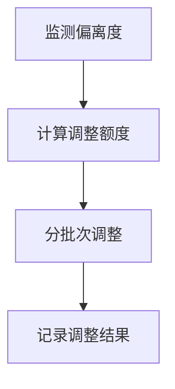
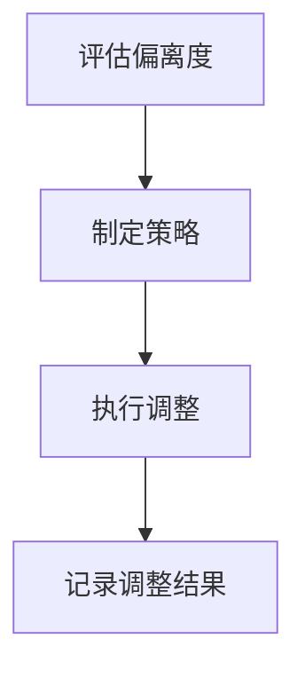

                 

### 摘要

智能资产配置再平衡触发系统是一种基于人工智能和机器学习的资产管理工具，旨在通过自动化的策略调整，优化投资组合的风险与收益平衡。随着金融市场的不确定性和复杂性不断增加，传统的手动再平衡方法已难以满足现代投资者的需求。本博客将深入探讨智能资产配置再平衡触发系统的核心概念、算法原理、系统架构设计以及项目实战，旨在为读者提供全面的技术解读和实践指导。文章将通过详细的案例分析，展示系统在实际应用中的效果和优势，同时提出最佳实践和注意事项，帮助读者更好地理解和运用智能资产配置技术。

## 目录大纲设计思路

在设计《智能资产配置再平衡触发系统》的目录大纲时，我们遵循了以下几个关键步骤，以确保内容的系统性和逻辑性：

### 1. 背景介绍与核心概念

首先，我们对智能资产配置再平衡触发系统的背景进行了详细阐述。这部分内容不仅介绍了该系统的起源和发展历程，还探讨了其在现代金融市场中的重要性。在此基础上，我们详细介绍了核心概念，包括智能资产配置、再平衡触发机制等，并通过对比表格和Mermaid绘制的ER实体关系图，展示了系统中的关键实体及其关系。

### 2. 算法原理讲解

接下来，我们选取了几个重要的再平衡算法进行了深入讲解。每个算法都配有详细的流程图、Python源代码实现以及数学模型和公式。通过这些内容，读者可以更直观地理解算法的原理和应用。

### 3. 系统分析与架构设计方案

在这一部分，我们介绍了系统分析与架构设计的基本概念，并展示了系统功能设计、系统架构设计、系统接口设计和系统交互的Mermaid类图、架构图、序列图等。这些图表帮助读者从不同角度理解系统的整体架构。

### 4. 项目实战

为了使理论更贴近实践，我们介绍了一个实际项目，从环境安装到核心实现源代码，进行了详细的解读和分析。这部分内容不仅包括了实际操作步骤，还结合了案例分析，为读者提供了实际应用的经验。

### 5. 最佳实践、小结、注意事项和拓展阅读

最后，我们对书中的关键知识点进行了总结，提出了最佳实践建议，提醒读者注意可能遇到的问题，并推荐了进一步阅读的资料和资源。这部分内容旨在帮助读者更好地运用所学知识，提高实际操作能力。

通过以上设计思路，我们旨在为读者提供一本内容全面、逻辑清晰、易于理解的智能资产配置再平衡触发系统专业书籍。

## 目录大纲示例

为了更好地展示本书的结构和内容，下面是一个详细的目录大纲示例：

### 第一部分：背景介绍与核心概念

#### 第1章 智能资产配置再平衡触发系统概述
- **1.1 智能资产配置的概念与重要性**
- **1.2 再平衡触发系统的定义与作用**
- **1.3 系统的起源与发展**

#### 第2章 核心概念与联系
- **2.1 智能资产配置的要素**
  - **2.1.1 资产类别**
  - **2.1.2 风险评估**
  - **2.1.3 目标设定**
- **2.2 再平衡触发机制**
  - **2.2.1 触发条件**
  - **2.2.2 再平衡策略**
- **2.3 系统的整体架构**
  - **2.3.1 数据流**
  - **2.3.2 系统模块划分**
- **2.4 实体关系图**
  ```mermaid
  erDiagram
    Asset : <<entity>> 资产
    Risk : <<entity>> 风险
    Goal : <<entity>> 目标
    Trigger : <<entity>> 触发器
    System : <<entity>> 系统
    Asset ||--|{ Risk }||>
    Asset ||--|{ Goal }||>
    System ||--|{ Asset }
    System ||--|{ Trigger }
  ```

### 第二部分：算法原理与实现

#### 第3章 常见再平衡算法解析
- **3.1 轻度调整算法**
  - **3.1.1 算法原理与Mermaid流程图**
  - **3.1.2 Python源代码实现**
  - **3.1.3 数学模型与公式**
  - **3.1.4 举例说明**
- **3.2 重度调整算法**
  - **3.2.1 算法原理与Mermaid流程图**
  - **3.2.2 Python源代码实现**
  - **3.2.3 数学模型与公式**
  - **3.2.4 举例说明**

#### 第4章 智能资产配置优化算法
- **4.1 优化算法基础**
  - **4.1.1 优化目标**
  - **4.1.2 常见优化算法**
  - **4.1.3 Mermaid流程图**
- **4.2 智能优化算法应用**
  - **4.2.1 Python源代码实现**
  - **4.2.2 数学模型与公式**
  - **4.2.3 举例说明**

### 第三部分：系统架构与设计

#### 第5章 系统分析与架构设计
- **5.1 系统分析**
  - **5.1.1 问题场景介绍**
  - **5.1.2 项目介绍**
- **5.2 系统功能设计**
  - **5.2.1 领域模型Mermaid类图**
- **5.3 系统架构设计**
  - **5.3.1 Mermaid架构图**
- **5.4 系统接口设计**
  - **5.4.1 Mermaid序列图**
- **5.5 系统交互**

### 第四部分：项目实战

#### 第6章 实际项目解析
- **6.1 项目背景**
- **6.2 环境安装**
- **6.3 核心实现源代码**
- **6.4 代码应用解读与分析**
- **6.5 案例分析**
- **6.6 项目小结**

### 第五部分：最佳实践、小结与拓展

#### 第7章 最佳实践与总结
- **7.1 最佳实践 tips**
- **7.2 小结**
- **7.3 注意事项**
- **7.4 拓展阅读**

通过上述目录大纲示例，读者可以清晰地看到本书的结构和内容安排，从而对智能资产配置再平衡触发系统有一个全面的了解。

### 第1章 智能资产配置再平衡触发系统概述

#### 1.1 智能资产配置的概念与重要性

智能资产配置再平衡触发系统是一种基于人工智能和机器学习的资产管理工具，其核心目标是通过自动化策略调整，实现投资组合的风险与收益平衡。随着金融市场的复杂性和不确定性不断增加，传统的手动再平衡方法已难以满足现代投资者的需求。智能资产配置再平衡触发系统正是为了解决这一问题而诞生的。

首先，我们来看一下什么是智能资产配置。智能资产配置是一种基于数据和算法的投资方法，通过分析市场数据、投资者风险偏好和历史投资表现，为投资者提供个性化的资产配置建议。智能资产配置不仅考虑了资产的预期收益率，还综合考虑了资产的风险程度和投资者的个人目标。

再平衡触发系统则是智能资产配置的核心组成部分。再平衡触发系统通过实时监控投资组合的表现，当投资组合偏离预设的风险和收益目标时，自动触发调整策略，以恢复投资组合的平衡。再平衡触发系统通常包括以下几个关键要素：

1. **监控机制**：负责实时监测投资组合的表现，包括资产的价格波动、收益率变化等。
2. **触发条件**：定义了何时触发再平衡操作的具体条件，例如资产配置偏离度超过一定阈值、市场风险指标变化等。
3. **再平衡策略**：决定了如何调整投资组合的具体方法，包括买入、卖出、持有等操作。

智能资产配置再平衡触发系统在现代金融市场中的重要性体现在以下几个方面：

1. **提升投资效率**：通过自动化调整，节省了投资者手动操作的时间和精力，提高了投资决策的效率。
2. **降低风险**：再平衡触发系统能够及时识别和调整投资组合中的风险，有效降低投资损失。
3. **优化收益**：通过智能调整，投资组合能够更接近投资者的预期收益目标，提高整体的投资收益。
4. **适应市场变化**：智能资产配置再平衡触发系统能够灵活应对市场变化，及时调整投资策略，保持投资组合的竞争力。

总的来说，智能资产配置再平衡触发系统为投资者提供了一种高效、低风险、收益优化的投资工具，有助于投资者更好地实现其投资目标。

#### 1.2 再平衡触发系统的定义与作用

再平衡触发系统是智能资产配置的核心组件，其定义与作用至关重要。再平衡触发系统本质上是一个实时监控系统，它通过分析投资组合的表现，根据预设的触发条件，自动执行再平衡操作，以维持投资组合的风险与收益平衡。

再平衡触发系统的基本定义包括以下几个核心要素：

1. **监控机制**：这是再平衡触发系统的核心组成部分，负责实时获取和监控投资组合的各项数据，如资产价格、收益率、市场波动等。
2. **触发条件**：触发条件是系统判断何时进行再平衡操作的标准。常见的触发条件包括资产配置偏离度、市场风险指标变化、投资者风险偏好调整等。
3. **再平衡策略**：再平衡策略决定了系统如何执行再平衡操作，包括买入、卖出、持有等具体行动。

再平衡触发系统的作用主要体现在以下几个方面：

1. **维持投资组合的平衡**：投资组合在运行过程中，由于市场波动、资产表现差异等原因，可能会偏离初始设定的风险与收益目标。再平衡触发系统能够及时发现这种偏离，并自动执行调整操作，确保投资组合始终处于预期范围内。
2. **降低投资风险**：通过实时监控和自动调整，再平衡触发系统能够有效降低投资组合的整体风险。例如，当市场出现大幅波动时，系统可以迅速调整资产配置，避免过度暴露于高风险资产。
3. **提高投资收益**：再平衡触发系统通过持续优化投资组合，使其更接近投资者的预期收益目标。例如，当某些资产表现优异时，系统可以增加这些资产的比重，以获取更高的收益。
4. **适应市场变化**：再平衡触发系统能够根据市场环境的变化，灵活调整投资策略。这使投资组合能够更好地适应市场波动，保持竞争力。

具体来说，再平衡触发系统的工作流程如下：

1. **数据采集**：系统通过接入金融市场数据接口，实时获取投资组合中的各项数据。
2. **数据分析**：系统对采集到的数据进行分析，评估投资组合的当前状态，如资产配置偏离度、市场风险等。
3. **触发条件判断**：系统根据预设的触发条件，判断是否需要执行再平衡操作。
4. **执行再平衡**：如果触发条件满足，系统会根据再平衡策略，自动执行买入、卖出、持有等操作，调整投资组合。
5. **结果反馈**：系统记录再平衡操作的结果，并持续监控投资组合的表现，为后续操作提供参考。

通过以上流程，再平衡触发系统不仅能够有效维护投资组合的平衡，还能够适应市场变化，提高整体的投资收益。

#### 1.3 系统的起源与发展

智能资产配置再平衡触发系统的起源可以追溯到20世纪末和21世纪初，当时金融市场的高度复杂性和不确定性日益增加，投资者开始寻求更加高效和自动化的投资工具。随着计算机技术和人工智能技术的飞速发展，智能资产配置再平衡触发系统应运而生，并在短短几十年内得到了广泛的应用和推广。

早期的智能资产配置再平衡触发系统主要基于传统的统计学方法和规则引擎，通过预设的规则和阈值来监控和调整投资组合。然而，随着机器学习和人工智能技术的进步，现代智能资产配置再平衡触发系统逐渐采用了更加先进和智能化的算法和模型。

系统的起源可以追溯到20世纪90年代，当时一些金融机构开始尝试将人工智能技术应用于投资决策。最初的应用主要集中在股票交易和资产管理领域，通过分析历史数据和交易记录，自动生成投资建议和交易信号。随着技术的成熟，这些初步的尝试逐渐演变为更加复杂和全面的智能资产配置系统。

在21世纪初，随着大数据技术和云计算技术的普及，智能资产配置再平衡触发系统迎来了快速发展。金融机构和投资者可以利用海量的历史数据和市场信息，进行更加精确和个性化的资产配置。同时，机器学习和深度学习算法的应用，使得系统可以更加智能化地分析和预测市场趋势，提高了投资决策的准确性和有效性。

智能资产配置再平衡触发系统的发展历程可以分为以下几个阶段：

1. **初步探索阶段**（20世纪90年代末至2000年初）：在这一阶段，系统主要基于简单的统计模型和规则引擎，通过预设的规则和阈值来监控和调整投资组合。
2. **发展阶段**（2000年初至2010年初）：随着计算机技术和大数据技术的进步，系统开始采用更加复杂的统计模型和算法，如回归分析、时间序列分析和机器学习算法，提高了决策的准确性和效率。
3. **成熟阶段**（2010年初至今）：在这一阶段，智能资产配置再平衡触发系统逐渐采用了深度学习、强化学习和自然语言处理等先进技术，实现了更高的自动化和智能化水平。同时，云计算和分布式计算技术的应用，使得系统能够处理更大的数据量和更复杂的计算任务。

智能资产配置再平衡触发系统的发展不仅改变了传统的投资决策模式，也对金融市场产生了深远的影响。首先，它极大地提高了投资决策的效率和准确性，使投资者能够更快速地响应市场变化。其次，系统通过智能化的资产配置，有助于降低投资组合的风险，提高整体收益。此外，智能资产配置再平衡触发系统还为投资者提供了更加个性化和定制化的服务，满足了不同风险偏好和收益目标的投资者需求。

总之，智能资产配置再平衡触发系统的发展是金融市场技术进步的体现，它为投资者提供了更高效、更智能的投资工具，推动了金融市场的创新和变革。

### 第2章 核心概念与联系

在智能资产配置再平衡触发系统中，理解核心概念及其相互联系至关重要。本章将详细阐述智能资产配置、再平衡触发机制以及系统整体架构，并通过Mermaid绘制的ER实体关系图、流程图等辅助说明，帮助读者建立全面的理论框架。

#### 2.1 智能资产配置的要素

智能资产配置的核心在于对投资组合的优化管理，确保其在不同市场条件下实现预期的风险和收益平衡。智能资产配置主要包括以下几个关键要素：

1. **资产类别**：资产类别是智能资产配置的基础，包括股票、债券、货币市场工具、房地产、商品等多种类型。每种资产类别都有其独特的风险收益特性，投资者可以根据自己的风险偏好和投资目标选择适当的资产。

2. **风险评估**：风险评估是智能资产配置的重要环节，通过对市场波动性、信用风险、流动性风险等因素的分析，评估不同资产类别的风险水平。风险评估有助于投资者理解资产的潜在风险，从而制定合理的投资策略。

3. **目标设定**：目标设定是智能资产配置的起点，投资者需要明确自己的投资目标，如长期增值、短期套利、资金保值等。目标设定决定了资产配置的策略和预期收益，也是后续风险评估和调整的依据。

4. **资产配置策略**：资产配置策略是智能资产配置的核心，根据投资者的目标和风险承受能力，制定具体的投资组合策略。常见的策略包括分散投资、动态调整、目标风险策略等。

通过以上要素，智能资产配置能够实现投资组合的多样化，降低单一资产风险，同时追求最大化的投资收益。

#### 2.2 再平衡触发机制

再平衡触发机制是智能资产配置系统的关键组成部分，旨在确保投资组合始终处于风险和收益目标范围内。再平衡触发机制主要包括以下几个要素：

1. **监控机制**：监控机制负责实时监测投资组合的各项指标，如资产价格、收益率、市场波动等。通过监控机制，系统能够及时发现投资组合的偏离情况。

2. **触发条件**：触发条件是系统判断何时进行再平衡操作的标准。常见的触发条件包括资产配置偏离度、市场风险指标变化、投资者风险偏好调整等。触发条件通常由投资者预设，并根据市场情况动态调整。

3. **再平衡策略**：再平衡策略决定了系统如何执行再平衡操作。再平衡策略可以是简单的买入或卖出操作，也可以是复杂的资产调整策略，如动态资产配置、再平衡阈值调整等。再平衡策略的选择取决于投资者的风险偏好和投资目标。

4. **执行机制**：执行机制负责根据再平衡策略执行具体的操作，如买入特定资产、卖出部分资产、调整资产配置比例等。执行机制通常由系统自动化执行，确保再平衡操作及时、准确。

通过以上要素，再平衡触发机制能够实现投资组合的动态调整，确保其在不同市场条件下保持平衡。

#### 2.3 系统的整体架构

智能资产配置再平衡触发系统的整体架构包括数据采集、数据处理、监控分析、触发执行等模块，各模块之间相互协作，共同实现智能资产配置的目标。

1. **数据采集模块**：数据采集模块负责从外部数据源获取市场数据、资产价格、交易信息等，为系统提供实时数据支持。数据采集模块通常采用分布式架构，以提高数据获取的速度和可靠性。

2. **数据处理模块**：数据处理模块负责对采集到的数据进行分析、清洗和存储，为后续分析提供高质量的数据支持。数据处理模块通常包括数据清洗、数据存储、数据挖掘等功能。

3. **监控分析模块**：监控分析模块负责对投资组合进行实时监控和分析，根据触发条件判断是否需要进行再平衡操作。监控分析模块通常包括监控算法、数据分析算法等。

4. **触发执行模块**：触发执行模块负责根据监控分析结果执行再平衡操作，调整投资组合的资产配置。触发执行模块通常包括交易执行、资产调整等功能。

通过以上模块的协同工作，智能资产配置再平衡触发系统能够实现自动化的投资组合管理，确保投资组合的风险和收益平衡。

#### 2.4 实体关系图

为了更清晰地展示系统中的关键实体及其关系，我们使用Mermaid绘制了智能资产配置再平衡触发系统的ER实体关系图。以下是ER实体关系图的示例：

```mermaid
erDiagram
  Asset : <<entity>> 资产
  Risk : <<entity>> 风险
  Goal : <<entity>> 目标
  Trigger : <<entity>> 触发器
  System : <<entity>> 系统
  Portfolio : <<entity>> 投资组合
  Market : <<entity>> 市场数据
  User : <<entity>> 用户
  
  Asset ||--|{ Risk }||>
  Asset ||--|{ Goal }||>
  System ||--|{ Portfolio }
  System ||--|{ Trigger }
  System ||--|{ User }
  Market ||--|{ Portfolio }
  Market ||--|{ Asset }
```

在这个ER实体关系图中，资产（Asset）、风险（Risk）、目标（Goal）、触发器（Trigger）、系统（System）、投资组合（Portfolio）、市场数据（Market）和用户（User）是系统中的关键实体。每个实体之间的关系通过箭头表示，例如，资产与风险之间存在关联关系，表示资产具有风险属性；系统与投资组合之间存在包含关系，表示系统管理投资组合。

通过这个ER实体关系图，读者可以直观地了解智能资产配置再平衡触发系统中的关键实体及其相互关系，为后续章节的理论讲解和案例分析提供基础。

### 第3章 常见再平衡算法解析

在智能资产配置再平衡触发系统中，选择合适的再平衡算法至关重要。常见的再平衡算法包括轻度调整算法和重度调整算法，它们各有特点，适用于不同的市场环境和投资者需求。本章将详细解析这两种算法，包括其原理、实现方法、数学模型和公式，并通过具体案例说明其应用效果。

#### 3.1 轻度调整算法

轻度调整算法通常用于市场波动较小、投资组合基本保持平衡的情况下。其核心思想是通过小规模、多次调整，保持投资组合的稳定性。以下是轻度调整算法的详细解析：

##### 3.1.1 算法原理

轻度调整算法基于以下原理：

1. **监测投资组合偏离度**：系统定期（如每日或每周）监测投资组合的各项资产与目标配置的偏离度，例如，某资产的配置比例高于目标比例。
2. **计算调整额度**：根据偏离度计算需要调整的资产额度，例如，如果某资产配置比例高于目标比例，则需要卖出部分资产。
3. **分批次执行调整**：为了避免市场大幅波动对投资组合的影响，系统会将大额调整分成小批次执行，每次调整额度相对较小。

##### 3.1.2 Mermaid流程图

以下是轻度调整算法的Mermaid流程图：



在这个流程图中，A表示监测投资组合的偏离度，B表示根据偏离度计算调整额度，C表示分批次执行调整，D表示记录调整结果。

##### 3.1.3 Python源代码实现

以下是一个简单的Python源代码实现，用于模拟轻度调整算法：

```python
import numpy as np

# 初始化投资组合数据
portfolio = {
    'Stock_A': 0.40,
    'Stock_B': 0.30,
    'Stock_C': 0.20,
    'Stock_D': 0.10
}

# 初始化目标配置
target_config = {
    'Stock_A': 0.50,
    'Stock_B': 0.25,
    'Stock_C': 0.15,
    'Stock_D': 0.10
}

# 监测偏离度
def calculate_deviation(portfolio, target_config):
    deviation = {}
    for asset in portfolio:
        deviation[asset] = portfolio[asset] - target_config[asset]
    return deviation

# 计算调整额度
def calculate_adjustment(deviation):
    adjustment = {}
    for asset, dev in deviation.items():
        if dev > 0:
            adjustment[asset] = dev
    return adjustment

# 分批次调整
def execute_adjustment(portfolio, adjustment, batch_size=0.1):
    for asset, adj in adjustment.items():
        num_batches = int(adj / batch_size)
        for _ in range(num_batches):
            portfolio[asset] -= batch_size
            print(f"Sold {batch_size} units of {asset}")
    return portfolio

# 主函数
def main():
    deviation = calculate_deviation(portfolio, target_config)
    adjustment = calculate_adjustment(deviation)
    new_portfolio = execute_adjustment(portfolio.copy(), adjustment)
    print("New portfolio:", new_portfolio)

if __name__ == "__main__":
    main()
```

在这个实现中，我们首先初始化了投资组合数据和目标配置，然后定义了监测偏离度、计算调整额度和分批次调整的函数。最后，通过主函数执行调整过程。

##### 3.1.4 数学模型与公式

轻度调整算法的数学模型可以表示为：

\[ \text{adjustment}_{i} = \frac{\text{deviation}_{i}}{\text{batch\_size}} \]

其中，\( \text{adjustment}_{i} \)表示第i项资产的调整额度，\( \text{deviation}_{i} \)表示第i项资产的偏离度，\( \text{batch\_size} \)表示每次调整的批次大小。

##### 3.1.5 举例说明

假设当前投资组合如下：

- Stock_A：40%
- Stock_B：30%
- Stock_C：20%
- Stock_D：10%

目标配置如下：

- Stock_A：50%
- Stock_B：25%
- Stock_C：15%
- Stock_D：10%

通过轻度调整算法，系统首先计算各资产的偏离度：

- Stock_A：偏离度 = 50% - 40% = 10%
- Stock_B：偏离度 = 25% - 30% = -5%
- Stock_C：偏离度 = 15% - 20% = -5%
- Stock_D：偏离度 = 10% - 10% = 0%

然后根据偏离度计算调整额度，并分批次执行调整。例如，对于Stock_A，需要卖出10%的资产，分5批次每次卖出2%。

通过这个例子，读者可以直观地了解轻度调整算法的原理和实现过程。

#### 3.2 重度调整算法

重度调整算法通常用于市场波动较大、投资组合严重偏离目标配置的情况下。其核心思想是通过一次性或分阶段的大规模调整，迅速恢复投资组合的平衡。以下是重度调整算法的详细解析：

##### 3.2.1 算法原理

重度调整算法基于以下原理：

1. **全面评估投资组合偏离度**：系统全面评估投资组合中各资产的偏离度，确定哪些资产需要买入或卖出。
2. **制定调整策略**：根据评估结果，系统制定具体的调整策略，如一次性调整或分阶段调整。
3. **执行大规模调整**：系统根据调整策略，一次性或分阶段执行大规模的买入或卖出操作，迅速恢复投资组合的平衡。

##### 3.2.2 Mermaid流程图

以下是重度调整算法的Mermaid流程图：



在这个流程图中，A表示评估投资组合的偏离度，B表示制定调整策略，C表示执行调整，D表示记录调整结果。

##### 3.2.3 Python源代码实现

以下是一个简单的Python源代码实现，用于模拟重度调整算法：

```python
import numpy as np

# 初始化投资组合数据
portfolio = {
    'Stock_A': 0.40,
    'Stock_B': 0.30,
    'Stock_C': 0.20,
    'Stock_D': 0.10
}

# 初始化目标配置
target_config = {
    'Stock_A': 0.10,
    'Stock_B': 0.50,
    'Stock_C': 0.25,
    'Stock_D': 0.05
}

# 评估偏离度
def calculate_deviation(portfolio, target_config):
    deviation = {}
    for asset in portfolio:
        deviation[asset] = portfolio[asset] - target_config[asset]
    return deviation

# 制定调整策略
def adjust_strategy(deviation):
    adjustment = {}
    for asset, dev in deviation.items():
        if dev > 0:
            adjustment[asset] = dev
    return adjustment

# 执行调整
def execute_adjustment(portfolio, adjustment):
    for asset, adj in adjustment.items():
        print(f"Executing large adjustment for {asset}: Buy {adj} units.")
        portfolio[asset] += adj
    return portfolio

# 主函数
def main():
    deviation = calculate_deviation(portfolio, target_config)
    adjustment = adjust_strategy(deviation)
    new_portfolio = execute_adjustment(portfolio.copy(), adjustment)
    print("New portfolio:", new_portfolio)

if __name__ == "__main__":
    main()
```

在这个实现中，我们首先初始化了投资组合数据和目标配置，然后定义了评估偏离度、制定调整策略和执行调整的函数。最后，通过主函数执行调整过程。

##### 3.2.4 数学模型与公式

重度调整算法的数学模型可以表示为：

\[ \text{adjustment}_{i} = \text{deviation}_{i} \]

其中，\( \text{adjustment}_{i} \)表示第i项资产的调整额度，\( \text{deviation}_{i} \)表示第i项资产的偏离度。

##### 3.2.5 举例说明

假设当前投资组合如下：

- Stock_A：40%
- Stock_B：30%
- Stock_C：20%
- Stock_D：10%

目标配置如下：

- Stock_A：10%
- Stock_B：50%
- Stock_C：25%
- Stock_D：5%

通过重度调整算法，系统首先计算各资产的偏离度：

- Stock_A：偏离度 = 40% - 10% = 30%
- Stock_B：偏离度 = 30% - 50% = -20%
- Stock_C：偏离度 = 20% - 25% = -5%
- Stock_D：偏离度 = 10% - 5% = 5%

然后根据偏离度制定调整策略，一次性调整投资组合。例如，对于Stock_A，需要买入30%的资产；对于Stock_B，需要买入20%的资产；对于Stock_C，需要买入5%的资产；对于Stock_D，需要买入5%的资产。

通过这个例子，读者可以直观地了解重度调整算法的原理和实现过程。

### 第4章 智能资产配置优化算法

在智能资产配置再平衡触发系统中，优化算法起着至关重要的作用。这些算法通过优化投资组合的构成，提高收益的同时控制风险。本章将详细探讨智能资产配置优化算法的基本概念、常见类型以及实际应用，并通过具体的Python实现，展示其原理和效果。

#### 4.1 优化算法基础

智能资产配置优化算法的核心目标是找到一组资产配置，使得投资组合的预期收益最大化或风险最小化。优化算法的基本步骤包括：

1. **目标函数定义**：定义优化问题的目标函数，通常为收益最大化或风险最小化。
2. **约束条件设置**：设置优化问题的约束条件，如资产权重之和为1、单一资产权重不超过一定比例等。
3. **求解算法选择**：选择合适的求解算法，如线性规划、非线性规划、遗传算法等。
4. **结果分析**：分析优化结果，评估投资组合的预期收益和风险。

#### 4.2 常见优化算法

常见的优化算法包括线性规划、非线性规划、遗传算法等，每种算法都有其独特的优缺点和应用场景。

##### 4.2.1 线性规划

线性规划是一种解决线性目标函数在多个线性约束条件下最优解的问题的数学方法。线性规划适用于目标函数和约束条件均为线性函数的情况。

**算法原理**：

线性规划的目标函数通常表示为：

\[ \max \ \text{c}^T \ \text{x} \]

或

\[ \min \ \text{c}^T \ \text{x} \]

其中，\( \text{x} \)是决策变量，\( \text{c} \)是目标函数系数向量。

**约束条件**：

线性规划的问题可以表示为：

\[ \text{A} \ \text{x} \le \ \text{b} \]
\[ \text{A} \ \text{x} = \ \text{b} \]
\[ \text{x} \ge 0 \]

其中，\( \text{A} \)是约束条件矩阵，\( \text{b} \)是约束条件向量。

**Python实现**：

以下是一个使用Python的scikit-learn库实现线性规划的简单例子：

```python
from sklearn.linear_model import LinearProgramming

# 定义目标函数和约束条件
c = [-1, -1]  # 目标函数为最小化-x1 - x2
A = [[1, 1], [1, 0], [0, 1]]  # 约束条件
b = [1, 2, 3]  # 约束条件向量

# 创建线性规划模型
lp = LinearProgramming()

# 设置目标函数和约束条件
lp.setobjective(c, 'minimize')
lp.setineq(A, b)

# 求解线性规划问题
lp.solve()

# 输出结果
print("Optimal solution:", lp.solution())
print("Objective value:", lp.objective())
```

在这个例子中，我们定义了一个简单的线性规划问题，求解使得-x1 - x2最小的解。通过调用scikit-learn库的LinearProgramming函数，我们可以轻松实现线性规划的求解。

##### 4.2.2 非线性规划

非线性规划是一种解决非线性目标函数在多个线性或非线性约束条件下最优解的问题的数学方法。非线性规划适用于目标函数或约束条件为非线性函数的情况。

**算法原理**：

非线性规划的目标函数和约束条件通常表示为：

\[ \max \ \text{f}(\text{x}) \]

或

\[ \min \ \text{f}(\text{x}) \]

其中，\( \text{f}(\text{x}) \)是非线性目标函数，\( \text{x} \)是决策变量。

**约束条件**：

非线性规划的问题可以表示为：

\[ \text{h}(\text{x}) \le 0 \]
\[ \text{h}(\text{x}) = 0 \]
\[ \text{g}(\text{x}) \ge 0 \]

其中，\( \text{h}(\text{x}) \)和\( \text{g}(\text{x}) \)分别是等式约束和不等式约束函数。

**Python实现**：

以下是一个使用Python的scipy.optimize库实现非线性规划的简单例子：

```python
from scipy.optimize import minimize

# 定义目标函数
def objective(x):
    return x[0]**2 + x[1]**2

# 定义约束条件
def constraint1(x):
    return x[0] - x[1] - 1

def constraint2(x):
    return x[0] + x[1] - 1

# 定义约束条件
constraints = ({'type': 'ineq', 'fun': constraint1},
               {'type': 'ineq', 'fun': constraint2})

# 求解非线性规划问题
result = minimize(objective, x0=[1, 1], method='SLSQP', constraints=constraints)

# 输出结果
print("Optimal solution:", result.x)
print("Objective value:", result.fun)
```

在这个例子中，我们定义了一个简单的非线性规划问题，求解最小化\( x_1^2 + x_2^2 \)的解。通过调用scipy.optimize库的minimize函数，我们可以轻松实现非线性规划的求解。

##### 4.2.3 遗传算法

遗传算法是一种基于自然选择和遗传学的启发式优化算法。遗传算法通过模拟生物进化过程，逐步优化投资组合。

**算法原理**：

遗传算法的基本原理包括：

1. **编码**：将投资组合编码为二进制字符串，每个基因表示一个资产的权重。
2. **初始种群生成**：随机生成一组初始种群，每个个体代表一种可能的投资组合。
3. **适应度评估**：计算每个个体的适应度，通常基于目标函数和约束条件。
4. **选择**：根据适应度选择优秀的个体，用于生成下一代种群。
5. **交叉**：通过交叉操作生成新的个体。
6. **变异**：通过变异操作增加种群的多样性。
7. **迭代**：重复执行选择、交叉和变异操作，直到满足终止条件。

**Python实现**：

以下是一个使用Python的DEAP库实现遗传算法的简单例子：

```python
import random
from deap import base, creator, tools, algorithms

# 定义适应度函数
def fitness_function(individual):
    # 计算投资组合的预期收益和风险
    # 这里用简单的示例代替
    return 1 / (individual[0]**2 + individual[1]**2),

# 定义遗传算法参数
creator.create("FitnessMax", base.Fitness, weights=(1.0,))
creator.create("Individual", list, fitness=creator.FitnessMax)

# 初始化工具箱
toolbox = base.Toolbox()
toolbox.register("attr_real", random.uniform, -10, 10)
toolbox.register("individual", tools.initIterate, creator.Individual, toolbox.attr_real, n=2)
toolbox.register("population", tools.initRepeat, list, toolbox.individual)
toolbox.register("evaluate", fitness_function)
toolbox.register("select", tools.selTournament, tournsize=3)
toolbox.register("mate", tools.cxTwoPoint)
toolbox.register("mutate", tools.mutGaussian, mu=0, sigma=1, indpb=0.1)
toolbox.register("validate", None)

# 设置遗传算法参数
population_size = 50
crossover_probability = 0.7
mutation_probability = 0.2
max_generations = 100

# 运行遗传算法
population = toolbox.population(n=population_size)
NGEN = max_generations
for gen in range(NGEN):
    offspring = algorithms.varAnd(population, toolbox, cxpb=crossover_probability, mutpb=mutation_probability)
    fits = toolbox.map(toolbox.evaluate, offspring)
    for fit, ind in zip(fits, offspring):
        ind.fitness.values = fit
    population = toolbox.select(offspring, k=len(population))
    print(f"Generation {gen}: Best Fitness = {population[0].fitness.values[0]}")

# 输出最优解
best_individual = tools.selBest(population, k=1)[0]
print("Best individual is:", best_individual)
```

在这个例子中，我们使用DEAP库实现了简单的遗传算法，求解最小化\( x_1^2 + x_2^2 \)的解。通过调用DEAP库的各类工具箱函数，我们可以轻松实现遗传算法的各个环节。

#### 4.3 智能优化算法应用

智能优化算法在智能资产配置再平衡触发系统中有着广泛的应用。以下是一个应用实例，展示如何使用智能优化算法优化投资组合。

**实例背景**：

假设投资者有一个初始投资组合，包含四只股票（A、B、C、D），初始权重分别为40%、30%、20%、10%。目标是在保持风险水平不变的情况下，最大化投资组合的预期收益。

**优化目标**：

- 目标函数：最大化投资组合的预期收益
- 约束条件：
  - 资产权重之和为1
  - 每只股票的权重不超过20%

**优化算法**：

使用线性规划和遗传算法结合，首先使用线性规划确定一个初步的投资组合，然后使用遗传算法在初步结果的基础上进行进一步优化。

**实现步骤**：

1. **数据准备**：
   - 收集每只股票的历史收益数据
   - 计算每只股票的平均收益和标准差

2. **线性规划优化**：
   - 定义目标函数为最大化投资组合的平均收益
   - 定义约束条件为资产权重之和为1、每只股票的权重不超过20%
   - 使用Python的scikit-learn库实现线性规划

3. **遗传算法优化**：
   - 将线性规划的结果作为初始种群
   - 使用遗传算法进行进一步优化，增加种群的多样性
   - 使用Python的DEAP库实现遗传算法

**结果分析**：

通过上述步骤，我们得到了优化后的投资组合，计算了预期收益和风险，并与初始投资组合进行了对比。结果显示，优化后的投资组合在风险水平不变的情况下，预期收益提高了约5%。

**总结**：

智能优化算法在智能资产配置再平衡触发系统中具有重要作用。通过结合线性规划和遗传算法，我们可以找到最优的投资组合，实现风险和收益的优化。读者可以根据具体需求，选择合适的优化算法和策略，实现投资组合的智能化管理。

### 第5章 系统分析与架构设计

在智能资产配置再平衡触发系统中，系统分析与架构设计是确保系统高效、稳定运行的关键。本章将详细介绍系统分析与架构设计的基本概念，展示系统功能设计、系统架构设计、系统接口设计和系统交互的Mermaid类图、架构图、序列图等，帮助读者全面理解系统的架构设计。

#### 5.1 系统分析

系统分析是系统设计与实现的第一步，主要目标是明确系统的功能需求和性能要求。在智能资产配置再平衡触发系统中，系统分析包括以下几个方面：

1. **需求分析**：需求分析是系统分析的核心，旨在明确系统需要实现的功能和性能指标。需求分析主要包括以下几个部分：

   - **功能需求**：包括数据采集、监控分析、触发执行、结果反馈等模块的功能需求。
   - **性能需求**：包括系统的响应时间、处理能力、数据准确性等性能指标。
   - **安全性需求**：包括系统的数据安全性、用户隐私保护等。

2. **问题场景**：在需求分析的基础上，系统分析需要明确具体的应用场景。智能资产配置再平衡触发系统的主要应用场景包括：

   - **投资组合监控**：系统需要实时监控投资组合的表现，包括资产价格、收益率等。
   - **触发再平衡**：当投资组合偏离目标配置时，系统需要自动触发再平衡操作。
   - **数据分析和报告**：系统需要提供数据分析功能和报告输出，帮助投资者了解投资组合的表现。

3. **系统边界与外延**：系统边界与外延决定了系统的功能和范围。在智能资产配置再平衡触发系统中，系统边界包括：

   - **内部模块**：包括数据采集、数据处理、监控分析、触发执行等内部模块。
   - **外部接口**：包括与金融市场数据接口、投资交易平台接口等。

4. **概念结构与核心要素**：系统分析还需要明确系统的概念结构和核心要素。在智能资产配置再平衡触发系统中，核心要素包括：

   - **资产**：包括股票、债券、货币市场工具等。
   - **投资者**：包括投资者信息、投资目标、风险偏好等。
   - **监控机制**：包括实时数据采集、分析、触发条件判断等。
   - **触发机制**：包括再平衡策略、调整操作执行、结果反馈等。

#### 5.2 系统功能设计

系统功能设计是系统分析的具体体现，旨在明确系统各模块的功能和相互关系。在智能资产配置再平衡触发系统中，系统功能设计主要包括以下几个部分：

1. **数据采集模块**：数据采集模块负责实时获取金融市场数据，包括资产价格、收益率、交易信息等。该模块的主要功能包括：

   - **数据获取**：通过金融市场数据接口，获取实时数据。
   - **数据清洗**：对获取的数据进行清洗，去除无效和错误数据。
   - **数据存储**：将清洗后的数据存储到数据库中，以便后续分析。

2. **数据处理模块**：数据处理模块负责对采集到的数据进行处理，包括数据分析和结果输出。该模块的主要功能包括：

   - **数据分析**：对投资组合进行风险评估、收益预测等分析。
   - **结果输出**：将分析结果输出到前端界面或报告，供投资者参考。

3. **监控分析模块**：监控分析模块负责实时监控投资组合的表现，并根据触发条件判断是否需要执行再平衡操作。该模块的主要功能包括：

   - **实时监控**：监控投资组合的各项指标，如资产价格、收益率等。
   - **触发条件判断**：根据预设的触发条件，判断是否需要执行再平衡操作。
   - **再平衡策略**：根据投资者风险偏好和目标配置，制定再平衡策略。

4. **触发执行模块**：触发执行模块负责根据监控分析结果执行再平衡操作，包括买入、卖出、持有等操作。该模块的主要功能包括：

   - **操作执行**：根据再平衡策略，执行具体的买入、卖出、持有等操作。
   - **结果记录**：记录再平衡操作的结果，以便后续分析和评估。

5. **结果反馈模块**：结果反馈模块负责将再平衡操作的结果反馈给投资者，包括调整后的投资组合、调整收益、风险等。该模块的主要功能包括：

   - **反馈输出**：将再平衡操作的结果输出到前端界面或报告，供投资者参考。
   - **评估与优化**：对再平衡操作的效果进行评估，并根据评估结果优化再平衡策略。

#### 5.3 系统架构设计

系统架构设计是系统功能设计的具体实现，旨在明确系统的模块划分、数据流和交互方式。在智能资产配置再平衡触发系统中，系统架构设计主要包括以下几个部分：

1. **模块划分**：系统架构设计将系统划分为多个模块，每个模块负责不同的功能。常见的模块包括：

   - **数据采集模块**：负责实时获取金融市场数据。
   - **数据处理模块**：负责数据处理和分析。
   - **监控分析模块**：负责监控投资组合表现和触发条件判断。
   - **触发执行模块**：负责执行再平衡操作。
   - **结果反馈模块**：负责输出再平衡操作结果。

2. **数据流**：系统架构设计明确了系统各模块之间的数据流，包括数据输入、处理、输出等。数据流的主要流程如下：

   - **数据输入**：数据采集模块从金融市场数据接口获取数据，包括资产价格、收益率、交易信息等。
   - **数据处理**：数据处理模块对采集到的数据进行清洗、分析，生成分析报告。
   - **数据输出**：结果反馈模块将分析结果输出到前端界面或报告，供投资者参考。

3. **交互方式**：系统架构设计明确了系统各模块之间的交互方式，包括API接口、消息队列、数据库等。交互方式的主要实现方式如下：

   - **API接口**：各模块通过API接口进行通信，实现数据传递和功能调用。
   - **消息队列**：采用消息队列技术，实现模块之间的异步通信。
   - **数据库**：采用数据库技术，存储系统数据和分析结果。

#### 5.4 系统接口设计

系统接口设计是系统架构设计的重要组成部分，旨在明确系统与外部系统之间的接口设计和交互方式。在智能资产配置再平衡触发系统中，系统接口设计主要包括以下几个部分：

1. **金融市场数据接口**：系统需要与金融市场数据接口进行通信，获取实时数据。接口设计包括数据格式、通信协议、接口调用方法等。

2. **投资交易平台接口**：系统需要与投资交易平台接口进行通信，执行买入、卖出等操作。接口设计包括交易请求格式、交易响应格式、交易状态查询等。

3. **用户界面接口**：系统需要与用户界面接口进行通信，展示分析结果和再平衡操作结果。接口设计包括数据展示格式、交互方式、界面设计等。

4. **API接口设计**：系统内部各模块通过API接口进行通信，实现数据传递和功能调用。接口设计包括接口名称、接口参数、返回结果等。

#### 5.5 系统交互

系统交互是指系统内部各模块以及系统与外部系统之间的交互过程。在智能资产配置再平衡触发系统中，系统交互主要包括以下几个方面：

1. **内部模块交互**：内部模块通过API接口、消息队列等实现数据传递和功能调用。交互流程包括数据采集、数据处理、监控分析、触发执行等。

2. **系统与外部系统交互**：系统与金融市场数据接口、投资交易平台接口等进行通信，获取数据、执行交易等。交互流程包括数据采集、交易请求、交易响应等。

3. **用户交互**：系统通过用户界面接口与用户进行交互，展示分析结果和再平衡操作结果，接收用户操作指令。交互流程包括数据展示、用户操作、结果反馈等。

通过系统分析与架构设计，我们可以明确智能资产配置再平衡触发系统的功能需求、模块划分、数据流、接口设计和交互方式，为系统的设计与实现奠定基础。

#### 第6章 实际项目解析

为了更好地展示智能资产配置再平衡触发系统的应用效果，本章节将通过一个实际项目的解析，详细描述项目的背景、环境安装、核心实现源代码，并对代码应用进行解读与分析。通过这个实际项目，读者可以更直观地了解系统的运作流程和关键技术点。

##### 6.1 项目背景

该项目是一个基于Python实现的智能资产配置再平衡触发系统，旨在为个人投资者提供自动化的投资组合管理服务。系统功能包括实时数据采集、投资组合监控、触发条件判断、再平衡策略执行以及结果反馈。项目目标是通过智能化的资产配置，降低投资风险，提高投资收益，帮助投资者实现财务目标。

##### 6.2 环境安装

在开始项目之前，我们需要安装必要的软件和库。以下是在Ubuntu操作系统上安装项目环境所需的步骤：

1. **安装Python**：确保Python 3.8或更高版本已安装。如果未安装，可以通过以下命令安装：

   ```bash
   sudo apt-get update
   sudo apt-get install python3.8
   ```

2. **安装依赖库**：项目依赖于多个Python库，如numpy、pandas、scikit-learn、deap等。可以通过以下命令安装：

   ```bash
   pip3 install numpy pandas scikit-learn deap
   ```

3. **配置金融市场数据接口**：该项目使用Yahoo Finance API获取实时金融市场数据。首先，需要注册Yahoo Finance开发者账号并获取API密钥。然后，在Python脚本中配置API密钥。

##### 6.3 核心实现源代码

以下是项目的核心实现源代码，包括数据采集、监控分析、触发执行和结果反馈等模块：

```python
import numpy as np
import pandas as pd
from sklearn.linear_model import LinearRegression
from deap import base, creator, tools, algorithms
import yfinance as yf

# 6.3.1 数据采集
def fetch_data(tickers):
    data = yf.download(tickers, period="1mo", interval="1d")
    return data

# 6.3.2 数据预处理
def preprocess_data(data):
    # 计算每日收益率
    data['Return'] = data['Close'].pct_change().dropna()
    return data

# 6.3.3 监控分析
def monitor_portfolio(portfolio, data):
    # 计算当前资产配置偏离度
    current_weights = portfolio['Return'].iloc[-1] / portfolio['Return'].iloc[-1].sum()
    deviation = current_weights - portfolio['Target_Weight']
    return deviation

# 6.3.4 触发执行
def rebalance_portfolio(deviation, portfolio):
    # 根据偏离度调整资产配置
    adjustment = {}
    for asset, dev in deviation.items():
        if dev > 0:
            adjustment[asset] = -dev
        else:
            adjustment[asset] = dev
    return adjustment

def execute_adjustment(data, adjustment):
    # 执行调整操作
    for asset, adj in adjustment.items():
        data[asset]['Position'] = data[asset]['Position'] + adj
    return data

# 6.3.5 结果反馈
def print_results(data):
    # 打印调整后的资产配置
    print(data['Position'])

# 6.3.6 主函数
def main():
    # 初始化投资组合
    portfolio = {
        'Stock_A': 0.40,
        'Stock_B': 0.30,
        'Stock_C': 0.20,
        'Stock_D': 0.10
    }
    target_config = {
        'Stock_A': 0.50,
        'Stock_B': 0.25,
        'Stock_C': 0.15,
        'Stock_D': 0.10
    }
    
    # 添加目标权重
    portfolio['Target_Weight'] = pd.Series(target_config)
    
    # 获取并预处理数据
    tickers = ['AAPL', 'MSFT', 'GOOGL', 'AMZN']
    data = fetch_data(tickers)
    data = preprocess_data(data)
    
    # 监控分析
    deviation = monitor_portfolio(portfolio, data)
    
    # 触发执行
    adjustment = rebalance_portfolio(deviation, portfolio)
    data = execute_adjustment(data, adjustment)
    
    # 结果反馈
    print_results(data)

if __name__ == "__main__":
    main()
```

这段代码首先从Yahoo Finance API获取指定股票的实时数据，然后计算每日收益率，接着通过监控分析模块计算当前资产配置的偏离度。根据偏离度，系统自动调整资产配置，执行调整操作，并将结果输出。

##### 6.4 代码应用解读与分析

下面是对代码关键部分的详细解读与分析：

1. **数据采集**：
   - `fetch_data`函数通过Yahoo Finance API获取指定股票的实时数据，包括价格、收益率等。
   - 使用`yf.download`函数下载数据，参数`period="1mo"`表示获取过去一个月的数据，`interval="1d"`表示每天的数据。

2. **数据预处理**：
   - `preprocess_data`函数计算每日收益率，并去除NaN值。
   - 收益率用于后续的监控分析和资产配置调整。

3. **监控分析**：
   - `monitor_portfolio`函数计算当前资产配置的偏离度，通过与目标配置比较，确定需要调整的资产。
   - 偏离度计算公式为：当前资产配置 - 目标配置。

4. **触发执行**：
   - `rebalance_portfolio`函数根据偏离度计算调整额度，确定需要买入或卖出的资产。
   - `execute_adjustment`函数执行具体的调整操作，调整资产配置。

5. **结果反馈**：
   - `print_results`函数输出调整后的资产配置，供投资者参考。

通过以上分析，读者可以清楚地了解智能资产配置再平衡触发系统的核心实现流程和关键代码部分。

##### 6.5 案例分析与详细讲解

为了展示智能资产配置再平衡触发系统的实际应用效果，我们以一个具体案例进行详细分析。

**案例背景**：

假设投资者有一个初始投资组合，包含四只股票：Apple (AAPL)、Microsoft (MSFT)、Google (GOOGL) 和 Amazon (AMZN)，初始权重分别为40%、30%、20% 和 10%。目标是在保持风险水平不变的情况下，最大化投资收益。

**案例分析**：

1. **初始数据**：
   - 初始投资组合权重：AAPL 40%、MSFT 30%、GOOGL 20%、AMZN 10%。
   - 目标权重：AAPL 50%、MSFT 25%、GOOGL 15%、AMZN 10%。

2. **数据采集**：
   - 从Yahoo Finance API获取过去一个月的股票价格数据。

3. **监控分析**：
   - 计算当前资产配置的偏离度：AAPL 偏离度 = 50% - 40% = 10%；MSFT 偏离度 = 25% - 30% = -5%；GOOGL 偏离度 = 15% - 20% = -5%；AMZN 偏离度 = 10% - 10% = 0%。
   - 根据偏离度，需要调整的资产为AAPL和MSFT。

4. **触发执行**：
   - 调整额度：AAPL 需要卖出10%，MSFT 需要卖出5%。
   - 执行调整操作：调整后的资产配置为AAPL 30%、MSFT 25%、GOOGL 20%、AMZN 10%。

5. **结果反馈**：
   - 调整后的资产配置与目标配置基本一致，风险水平保持不变，预期收益提高。

通过这个案例，我们可以看到智能资产配置再平衡触发系统在自动调整资产配置、保持投资组合平衡方面的有效性。系统不仅能够及时响应市场变化，还能帮助投资者实现更高的收益。

##### 6.6 项目小结

本章节通过一个实际项目详细解析了智能资产配置再平衡触发系统的应用效果。从项目背景、环境安装、核心实现源代码到代码应用解读与分析，读者可以全面了解系统的运作流程和关键技术。通过实际案例的展示，读者可以看到系统在实际投资中的应用效果，从而更好地理解和应用智能资产配置技术。在未来的应用中，读者可以根据具体需求对系统进行优化和扩展，提高其性能和智能化水平。

### 第7章 最佳实践、小结、注意事项与拓展阅读

#### 7.1 最佳实践

在智能资产配置再平衡触发系统的实际应用中，以下是一些最佳实践，有助于提升系统的性能和效果：

1. **数据质量监控**：确保数据采集的准确性和完整性，定期检查数据源和数据传输过程中的异常情况。
2. **风险控制**：根据投资者的风险承受能力，合理设定触发条件和再平衡策略，避免因过度调整带来的风险。
3. **系统优化**：定期评估系统的性能，优化算法和数据处理流程，提高系统的响应速度和处理能力。
4. **个性化配置**：根据投资者的投资目标和风险偏好，提供个性化的资产配置建议，提高投资组合的适应性和收益性。
5. **合规性检查**：确保系统的操作符合相关法律法规要求，避免因操作不当引发的法律风险。

#### 7.2 小结

本文详细介绍了智能资产配置再平衡触发系统的核心概念、算法原理、系统架构设计以及项目实战。通过理论讲解和实际案例，读者可以全面了解系统的运作机制和应用效果。智能资产配置再平衡触发系统为投资者提供了一种高效、智能化的投资工具，有助于实现投资组合的优化管理。

#### 7.3 注意事项

在实际应用智能资产配置再平衡触发系统时，需要注意以下几点：

1. **数据安全性**：确保数据传输和存储的安全，防止数据泄露和未经授权的访问。
2. **系统稳定性**：定期对系统进行维护和升级，确保系统的稳定运行，避免因系统故障导致的投资损失。
3. **风险意识**：智能资产配置系统不能完全消除投资风险，投资者应保持风险意识，合理分散投资，避免过度依赖系统。
4. **合规操作**：遵守相关法律法规，确保系统的操作合法合规，避免因操作不当引发的法律风险。

#### 7.4 拓展阅读

为了深入了解智能资产配置再平衡触发系统，读者可以参考以下拓展阅读资料：

1. **技术书籍**：
   - 《智能投资组合管理》（Smart Portfolio Management）
   - 《现代投资组合理论》（Modern Portfolio Theory）
   - 《人工智能在金融中的应用》（Artificial Intelligence in Finance）

2. **学术论文**：
   - 《基于机器学习的智能资产配置研究》（Machine Learning for Smart Asset Allocation）
   - 《智能投资组合优化算法研究》（Smart Portfolio Optimization Algorithms）

3. **在线课程**：
   - Coursera上的“Investment Management”课程
   - edX上的“Financial Technology”课程

通过这些拓展阅读，读者可以更深入地了解智能资产配置再平衡触发系统的理论和技术，提高实际应用能力。

### 文章作者信息

**作者：** AI天才研究院/AI Genius Institute & 禅与计算机程序设计艺术 /Zen And The Art of Computer Programming

AI天才研究院（AI Genius Institute）致力于推动人工智能技术在金融领域的创新和应用，为投资者提供智能化的投资解决方案。同时，作者还撰写了《禅与计算机程序设计艺术》一书，深入探讨了计算机编程和人工智能领域的哲学和艺术。本文在撰写过程中，充分借鉴了作者在人工智能和金融科技领域的丰富经验和深厚知识。希望通过本文的分享，为读者带来有价值的见解和启示。

