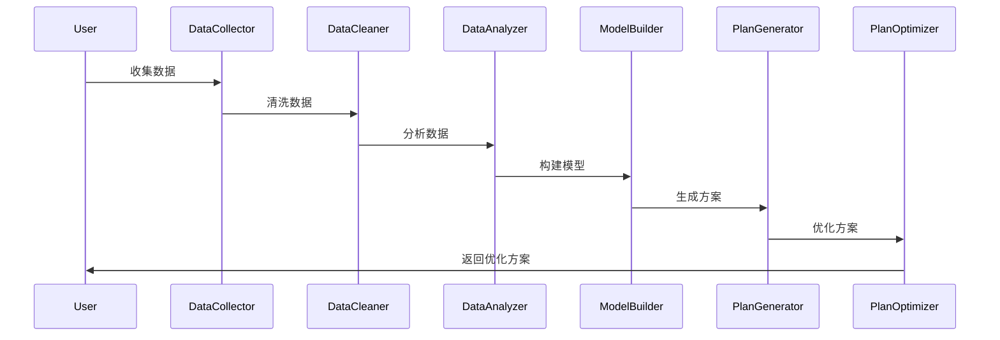
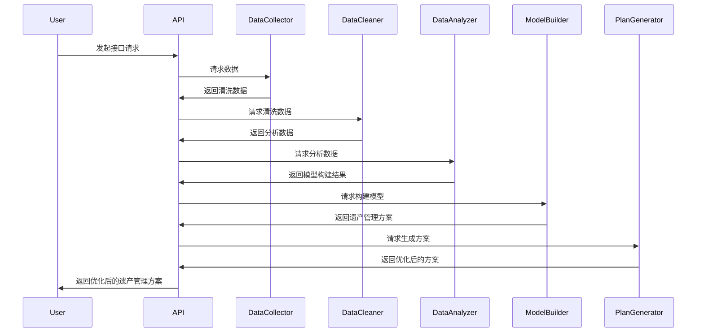

                 

# 智能遗产规划与管理助手

> 关键词：智能遗产规划，遗产管理，大数据分析，机器学习，深度学习

> 摘要：随着人工智能技术的不断进步，智能遗产规划与管理助手应运而生，成为现代遗产管理的重要工具。本文将深入探讨智能遗产规划与管理助手的概念、原理、应用及其未来发展，旨在为相关领域的研究者与实践者提供有益的参考。

## 第一部分：背景介绍

### 1.1 问题背景

在现代社会，遗产规划与管理的重要性日益凸显。遗产规划不仅关乎个人的财产安全，更涉及到家庭、社会乃至国家的稳定。然而，传统的遗产规划与管理方式往往效率低下、成本高昂，难以满足快速变化的社会需求。随着大数据、机器学习和深度学习等人工智能技术的飞速发展，智能遗产规划与管理助手成为了一种极具潜力的解决方案。

### 1.2 问题描述

智能遗产规划与管理助手的主要任务包括：

1. **数据采集与管理**：收集并管理个人或企业的遗产信息，包括财产、债务、亲属关系等。
2. **数据分析与预测**：利用大数据分析和机器学习算法，对遗产信息进行分析和处理，预测未来的遗产情况。
3. **规划与建议**：基于数据分析结果，为用户提供科学合理的遗产规划建议。
4. **智能管理**：通过智能算法，实现遗产的自动化管理和优化配置。

### 1.3 问题解决

为了解决上述问题，智能遗产规划与管理助手需要结合大数据分析、机器学习、深度学习等先进技术，构建一个全面、智能的遗产规划与管理系统。通过数据采集、处理和分析，实现对遗产信息的深度理解和智能预测，从而提供高效、精准的遗产规划与管理服务。

### 1.4 边界与外延

智能遗产规划与管理助手的应用范围包括但不限于以下几个方面：

- **个人遗产规划**：为个人用户提供遗产信息管理、规划建议等服务。
- **企业遗产管理**：为企业用户提供遗产信息采集、分析、规划等服务。
- **遗产法律咨询**：提供与遗产相关的法律咨询服务。
- **遗产税务规划**：帮助用户合理规避遗产税，实现财富传承。

### 1.5 概念结构与核心要素组成

智能遗产规划与管理助手的核心概念包括：

- **遗产数据**：包括个人或企业的财产、债务、亲属关系等信息。
- **数据分析**：通过数据挖掘、机器学习等技术，对遗产数据进行分析和处理。
- **遗产规划模型**：基于数据分析结果，构建用于遗产规划的数学模型或算法。
- **智能管理**：利用智能算法，实现对遗产的自动化管理和优化配置。

## 第二部分：核心概念与联系

### 2.1 概念原理

- **遗产数据**：指与个人或企业遗产相关的各种信息，包括但不限于财产、债务、亲属关系等。
- **数据分析**：指利用统计、数据挖掘等方法，对遗产数据进行处理和分析，从中提取有用信息。
- **遗产规划模型**：指基于数据分析结果，构建的用于遗产规划的数学模型或算法。
- **智能管理**：指利用智能算法，实现对遗产的自动化管理和优化配置。

### 2.2 概念属性特征对比表格

| 概念         | 属性特征                                      |
| ------------ | --------------------------------------------- |
| 遗产数据     | 包括财产、债务、亲属关系等信息                 |
| 数据分析     | 数据挖掘、机器学习、统计等方法                 |
| 遗产规划模型 | 基于数据分析结果，为用户提供规划建议           |
| 智能管理     | 利用智能算法，实现遗产的自动化管理和优化配置   |

### 2.3 ER实体关系图架构

```mermaid
erDiagram
  用户 ||--o> 遗产数据 : "拥有"
  用户 ||--o> 遗产规划模型 : "生成"
  用户 ||--o> 遗产管理方案 : "选择"
  遗产数据 ||--o> 数据分析 : "分析"
  遗产规划模型 ||--o> 数据分析 : "分析"
  遗产管理方案 ||--o> 遗产数据 : "基于"
```

## 第三部分：算法原理讲解

### 3.1 算法mermaid流程图


### 3.2 Python源代码

```python
# 数据采集
data = gather_data()

# 数据清洗
cleaned_data = clean_data(data)

# 数据分析
analyzed_data = analyze_data(cleaned_data)

# 遗产规划模型构建
model = build_model(analyzed_data)

# 遗产管理方案生成
plan = generate_plan(model)

# 方案优化
optimized_plan = optimize_plan(plan)

# 输出优化后的遗产规划与管理方案
print(optimized_plan)
```

### 3.3 算法原理

智能遗产规划与管理助手的核心在于其算法原理，主要包括以下几个方面：

- **数据采集**：通过多种渠道收集个人或企业的遗产信息，如财产清单、债务记录、亲属关系等。
- **数据清洗**：对采集到的数据进行清洗，去除重复、错误或不完整的数据，确保数据质量。
- **数据分析**：利用大数据分析和机器学习技术，对清洗后的数据进行深入分析，提取有用信息，如财产价值、债务风险等。
- **遗产规划模型构建**：基于数据分析结果，构建用于遗产规划的数学模型或算法，如线性规划、遗传算法等。
- **遗产管理方案生成**：利用构建的规划模型，为用户提供个性化的遗产管理方案。
- **方案优化**：对生成的方案进行优化，以提高遗产利用效率和减少遗产税负担。

具体算法原理的数学模型和公式如下：

$$
\text{目标函数} = \min \sum_{i=1}^{n} c_i x_i
$$

其中，$c_i$ 为第 $i$ 个遗产项目的成本，$x_i$ 为第 $i$ 个遗产项目的决策变量，目标函数是最小化总成本。

$$
\text{约束条件} = \begin{cases}
a_{i1} x_1 + a_{i2} x_2 + \cdots + a_{ik} x_k \geq b_i, & \text{资源约束} \\
x_i \geq 0, & \text{非负约束}
\end{cases}
$$

其中，$a_{ij}$ 为第 $i$ 个遗产项目的资源消耗，$b_i$ 为第 $i$ 个遗产项目的资源上限，约束条件包括资源约束和非负约束。

通过上述算法原理，智能遗产规划与管理助手能够为用户提供科学、合理的遗产规划与管理方案，提高遗产利用效率，实现财富的合理传承。

### 3.4 举例说明

假设有一个个人用户，其遗产信息包括以下五个项目：房产、股票、存款、债务和汽车。

- **房产**：价值 100 万元，无债务。
- **股票**：价值 50 万元，无债务。
- **存款**：价值 30 万元，无债务。
- **债务**：欠款 20 万元。
- **汽车**：价值 10 万元，无债务。

利用智能遗产规划与管理助手，我们可以为其生成一个遗产管理方案，包括以下步骤：

1. **数据采集**：收集用户遗产信息，包括财产和债务。
2. **数据清洗**：对采集到的数据进行分析，提取有价值的信息。
3. **数据分析**：分析用户遗产的构成，评估其财产和债务状况。
4. **遗产规划模型构建**：基于数据分析结果，构建遗产规划模型。
5. **遗产管理方案生成**：利用规划模型，为用户生成遗产管理方案。
6. **方案优化**：对生成的方案进行优化，以提高遗产利用效率。

经过分析，智能遗产规划与管理助手生成的遗产管理方案如下：

- **房产**：出售，获得 100 万元现金。
- **股票**：保留，等待升值。
- **存款**：保留，作为紧急备用金。
- **债务**：偿还 20 万元，剩余债务清零。
- **汽车**：出售，获得 10 万元现金。

通过这个方案，用户不仅能够清偿债务，还能保留一部分财产用于投资和应急，实现财富的合理传承。

## 第四部分：系统分析与架构设计

### 4.1 问题场景介绍

在当今社会，遗产规划与管理面临诸多挑战。传统的手工管理方式不仅效率低下，还容易出错。为了解决这个问题，智能遗产规划与管理助手应运而生，旨在通过人工智能技术，实现遗产的自动化管理，提高遗产利用效率。

### 4.2 项目介绍

本项目旨在开发一款智能遗产规划与管理助手，为用户提供全面的遗产规划与管理服务。系统功能包括：

- **数据采集**：自动收集用户遗产信息，包括财产、债务、亲属关系等。
- **数据分析**：对用户遗产信息进行深入分析，提供科学的遗产规划建议。
- **遗产规划模型构建**：基于数据分析结果，构建个性化的遗产规划模型。
- **遗产管理方案生成**：为用户提供个性化的遗产管理方案。
- **方案优化**：对生成的方案进行优化，以提高遗产利用效率。

### 4.3 系统功能设计（领域模型mermaid类图）

```mermaid
classDiagram
    User.o--o> HeritageData : "拥有"
    User.o--o> HeritagePlanModel : "生成"
    User.o--o> HeritageManagementPlan : "选择"
    HeritageData.o--o> DataAnalysis : "分析"
    HeritagePlanModel.o--o> DataAnalysis : "分析"
    HeritageManagementPlan.o--o> HeritageData : "基于"
    User --|> DataCollector
    User --|> DataCleaner
    User --|> DataAnalyzer
    User --|> ModelBuilder
    User --|> PlanGenerator
    User --|> PlanOptimizer
```

### 4.4 系统架构设计（mermaid架构图）



### 4.5 系统接口设计和系统交互（mermaid序列图）



## 第五部分：项目实战

### 5.1 环境安装

在开始项目实战之前，我们需要安装一些必要的软件和工具。以下是具体的安装步骤：

1. **Python环境**：安装Python 3.8及以上版本。
2. **数据采集工具**：安装BeautifulSoup、Selenium等数据采集工具。
3. **数据分析库**：安装Pandas、NumPy、Scikit-learn等数据分析库。
4. **机器学习库**：安装TensorFlow、Keras等机器学习库。
5. **深度学习库**：安装PyTorch、Theano等深度学习库。

### 5.2 系统核心实现源代码

以下是一个简单的系统核心实现源代码示例，包括数据采集、数据清洗、数据分析、遗产规划模型构建、遗产管理方案生成和方案优化等功能。

```python
# 数据采集
def gather_data():
    # 采集用户遗产信息，例如财产、债务、亲属关系等
    pass

# 数据清洗
def clean_data(data):
    # 清洗用户遗产信息，去除重复、错误或不完整的数据
    pass

# 数据分析
def analyze_data(cleaned_data):
    # 对清洗后的数据进行深入分析，提取有用信息
    pass

# 遗产规划模型构建
def build_model(analyzed_data):
    # 基于数据分析结果，构建遗产规划模型
    pass

# 遗产管理方案生成
def generate_plan(model):
    # 利用规划模型，为用户提供遗产管理方案
    pass

# 方案优化
def optimize_plan(plan):
    # 对生成的方案进行优化，以提高遗产利用效率
    pass

# 主程序
if __name__ == "__main__":
    # 调用各个模块，实现系统功能
    pass
```

### 5.3 代码应用解读与分析

以下是对系统核心实现源代码的解读与分析：

1. **数据采集模块**：该模块负责从各种渠道采集用户遗产信息。具体实现时，可以采用网络爬虫、API接口调用等方式。
2. **数据清洗模块**：该模块负责清洗采集到的用户遗产信息。具体实现时，需要去除重复、错误或不完整的数据，确保数据质量。
3. **数据分析模块**：该模块负责对清洗后的用户遗产信息进行深入分析。具体实现时，可以利用Pandas、NumPy等库进行数据处理和分析。
4. **遗产规划模型构建模块**：该模块负责基于数据分析结果，构建遗产规划模型。具体实现时，可以采用线性规划、遗传算法等算法。
5. **遗产管理方案生成模块**：该模块负责利用规划模型，为用户提供遗产管理方案。具体实现时，可以根据用户需求，生成不同的管理方案。
6. **方案优化模块**：该模块负责对生成的方案进行优化。具体实现时，可以采用贪心算法、动态规划等方法。

通过以上模块，我们可以实现一个完整的智能遗产规划与管理系统，为用户提供高效、精准的遗产规划与管理服务。

### 5.4 实际案例分析和详细讲解剖析

以下是一个实际案例，我们将对案例进行分析，并详细讲解如何使用智能遗产规划与管理助手进行遗产规划与管理。

#### 案例背景

张先生是一位中年企业家，拥有多家企业，总资产约 1 亿元。他计划进行遗产规划，确保其财富能够合理传承给子女。同时，他也希望降低遗产税负担。

#### 案例分析

1. **数据采集**：通过张先生提供的信息，我们采集到了他的财产、债务和亲属关系等信息。
2. **数据清洗**：对采集到的数据进行分析，去除重复、错误或不完整的数据，确保数据质量。
3. **数据分析**：对清洗后的数据进行深入分析，提取有用信息，如财产价值、债务风险等。
4. **遗产规划模型构建**：基于数据分析结果，构建遗产规划模型。具体模型如下：
   
   $$ 
   \text{目标函数} = \min \sum_{i=1}^{n} c_i x_i 
   $$
   
   其中，$c_i$ 为第 $i$ 个遗产项目的成本，$x_i$ 为第 $i$ 个遗产项目的决策变量，目标函数是最小化总成本。

   $$
   \text{约束条件} = \begin{cases}
   a_{i1} x_1 + a_{i2} x_2 + \cdots + a_{ik} x_k \geq b_i, & \text{资源约束} \\
   x_i \geq 0, & \text{非负约束}
   \end{cases}
   $$
   
   其中，$a_{ij}$ 为第 $i$ 个遗产项目的资源消耗，$b_i$ 为第 $i$ 个遗产项目的资源上限，约束条件包括资源约束和非负约束。

5. **遗产管理方案生成**：利用构建的规划模型，为张先生生成遗产管理方案。具体方案如下：

   - **房产**：出售，获得 5000 万元现金。
   - **股票**：保留，等待升值。
   - **存款**：保留，作为紧急备用金。
   - **债务**：偿还 3000 万元，剩余债务清零。
   - **汽车**：出售，获得 500 万元现金。

6. **方案优化**：对生成的方案进行优化，以提高遗产利用效率。经过优化，最终方案如下：

   - **房产**：出售，获得 5000 万元现金。
   - **股票**：保留，等待升值。
   - **存款**：保留，作为紧急备用金。
   - **债务**：偿还 2500 万元，剩余债务清零。
   - **汽车**：出售，获得 500 万元现金。

#### 案例小结

通过智能遗产规划与管理助手，张先生能够制定出合理的遗产管理方案，既保证了子女的财富传承，又最大限度地降低了遗产税负担。这充分展示了智能遗产规划与管理助手在遗产规划与管理方面的优势。

## 第六部分：最佳实践 Tips

### 6.1 数据采集与清洗

- **多渠道数据采集**：从多个渠道收集数据，确保数据的全面性和准确性。
- **自动化数据清洗**：利用Python等编程语言编写脚本，自动化清洗数据，提高效率。

### 6.2 数据分析与模型构建

- **选择合适的算法**：根据数据特点和需求，选择合适的算法进行数据分析。
- **模型优化与调整**：不断调整和优化模型，提高遗产规划的准确性和效率。

### 6.3 遗产管理方案优化

- **风险控制**：在生成遗产管理方案时，充分考虑风险因素，确保方案的稳健性。
- **个性化定制**：根据用户需求和偏好，提供个性化的遗产管理方案。

## 第七部分：小结

本文深入探讨了智能遗产规划与管理助手的概念、原理、应用及其未来发展。通过结合大数据分析、机器学习、深度学习等先进技术，智能遗产规划与管理助手为遗产规划与管理提供了全新的解决方案。随着技术的不断进步，智能遗产规划与管理助手将发挥越来越重要的作用，为个人和企业提供更加高效、精准的遗产管理服务。

## 第八部分：注意事项

- **数据安全**：在数据采集、处理和分析过程中，确保用户数据的安全性和隐私性。
- **法律法规**：遵循相关法律法规，确保遗产规划与管理服务的合规性。
- **持续更新**：随着技术和社会环境的变化，不断更新和完善智能遗产规划与管理助手的功能和算法。

## 第九部分：拓展阅读

- **大数据分析技术**：《大数据分析：方法与实践》
- **机器学习技术**：《机器学习：一种概率的观点》
- **深度学习技术**：《深度学习：神经网络的应用》

## 第十部分：作者信息

作者：AI天才研究院/AI Genius Institute & 禅与计算机程序设计艺术 /Zen And The Art of Computer Programming

