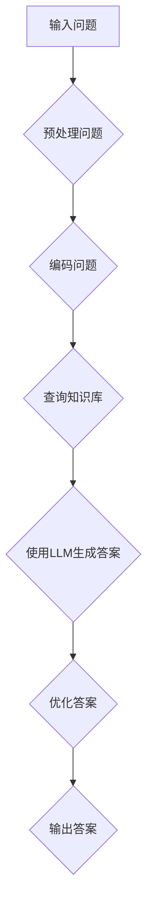

                 

## 智能问答AI Agent：基于LLM的精准答疑系统

> 关键词：智能问答AI Agent、基于LLM、精准答疑系统、语言模型、深度学习、人工智能

> 摘要：本文将深入探讨智能问答AI Agent的构建，特别是基于大型语言模型（LLM）的精准答疑系统。文章将分为四个主要部分：首先介绍智能问答AI Agent的背景及其重要性；接着深入分析基于LLM的智能问答AI Agent的原理和算法；然后通过实体关系图和流程图展示核心概念和联系；最后，通过一个实际项目实战来展示智能问答AI Agent的完整构建过程，并给出最佳实践建议。

### 第一部分：智能问答AI Agent概述

#### 第1章: 智能问答AI Agent背景介绍

#### 1.1 问题背景

随着人工智能技术的迅猛发展，智能问答系统逐渐成为自然语言处理（NLP）领域的重要研究方向。从最初的规则驱动系统到基于统计方法再到深度学习驱动的现代智能问答系统，问答系统的演进不仅体现了人工智能技术的发展历程，也反映了人类对自然语言理解和生成能力的不断提升。

#### 1.2 问题定义

什么是智能问答AI Agent？

智能问答AI Agent是一种能够通过自然语言与用户进行交互，并基于其内部的知识库和语言模型，为用户生成精准、有用回答的人工智能系统。它不仅能理解用户的查询意图，还能根据查询内容提供准确、相关的答案。

智能问答AI Agent的作用：

- 提高信息检索效率
- 减少人力成本
- 增强用户体验
- 支持智能客服、智能教育、智能医疗等多种应用场景

#### 1.3 问题解决方法

传统问答系统的局限：

- 过于依赖预定义规则，灵活性不足
- 知识库更新缓慢，知识获取能力有限
- 难以应对复杂、模糊的查询

基于LLM的智能问答AI Agent优势：

- 强大的语言理解和生成能力
- 自动学习用户查询意图，提供个性化回答
- 支持多语言、多模态的交互
- 高度灵活，适应各种复杂场景

智能问答AI Agent的架构：

- 用户界面层：接收用户查询，展示问答结果
- 查询处理层：理解用户查询意图，将查询转化为具体的查询请求
- 知识库层：存储大量结构化和非结构化知识，供智能问答AI Agent使用
- 语言模型层：基于大型语言模型，负责生成精准、自然的回答

#### 1.4 边界与外延

智能问答AI Agent的应用场景：

- 智能客服：提供24/7不间断的客户服务，解答常见问题
- 智能教育：为学生提供个性化辅导，解答学习过程中的疑问
- 智能医疗：辅助医生进行诊断和治疗，解答患者疑问
- 智能搜索：提供更加精准的搜索结果，满足用户的信息需求

智能问答AI Agent的限制条件：

- 对语言模型质量要求高，需要大量高质量数据训练
- 需要持续优化，以适应不断变化的查询需求
- 对硬件和计算资源要求较高

智能问答AI Agent的发展趋势：

- 更加智能化，能够处理更加复杂、模糊的查询
- 更加个性化，能够根据用户历史交互行为提供定制化回答
- 跨领域应用，支持多语言、多模态的交互
- 集成更多AI技术，如计算机视觉、语音识别等

#### 1.5 概念结构与核心要素组成

智能问答AI Agent的核心组成部分：

- 语言模型：负责理解和生成自然语言
- 知识库：存储大量结构化和非结构化知识
- 查询处理模块：理解用户查询意图，将查询转化为具体的查询请求
- 回答生成模块：根据查询请求，从知识库中检索相关信息，生成自然语言回答

智能问答AI Agent的关键技术：

- 自然语言处理：包括词法分析、句法分析、语义分析等
- 语言模型训练：包括预训练、微调、推理等
- 知识图谱构建：包括知识抽取、知识融合、知识表示等

智能问答AI Agent的发展路径：

- 提高语言模型质量，增强问答系统的理解能力和生成能力
- 扩展知识库，提升问答系统的知识覆盖面和准确度
- 集成多模态感知能力，实现更加自然、流畅的交互
- 探索跨领域应用，满足多样化的需求

### 第二部分：基于LLM的智能问答AI Agent原理

#### 第2章: 基于LLM的智能问答AI Agent原理

#### 2.1 语言模型基础

#### 2.2 LLM的工作原理

#### 2.3 LLM在问答系统中的应用

#### 2.4 LLM的挑战与优化

### 第三部分：智能问答AI Agent的核心概念与联系

#### 第3章: 智能问答AI Agent的核心概念与联系

#### 3.1 核心概念原理

#### 3.2 概念属性特征对比表格

#### 3.3 ER实体关系图架构

### 第四部分：基于LLM的智能问答AI Agent算法原理

#### 第4章: 基于LLM的智能问答AI Agent算法原理

#### 4.1 算法mermaid流程图

#### 4.2 Python源代码

#### 4.3 

----------------------------------------------------------------

### 第一部分：智能问答AI Agent概述

#### 第1章: 智能问答AI Agent背景介绍

##### 1.1 问题背景

##### 1.2 问题定义

##### 1.3 问题解决方法

##### 1.4 边界与外延

##### 1.5 概念结构与核心要素组成

#### 第2章: 基于LLM的智能问答AI Agent原理

##### 2.1 语言模型基础

##### 2.2 LLM的工作原理

##### 2.3 LLM在问答系统中的应用

##### 2.4 LLM的挑战与优化

#### 第3章: 智能问答AI Agent的核心概念与联系

##### 3.1 核心概念原理

##### 3.2 概念属性特征对比表格

##### 3.3 ER实体关系图架构

#### 第4章: 基于LLM的智能问答AI Agent算法原理

##### 4.1 算法mermaid流程图

##### 4.2 Python源代码

##### 4.3 

----------------------------------------------------------------

---

#### 第1章: 智能问答AI Agent背景介绍

##### 1.1 问题背景

在当今的信息时代，人们每天都会面临大量的信息查询需求。从简单的日常咨询到复杂的业务查询，信息检索已经成为现代生活的重要组成部分。传统的人工查询方式不仅效率低下，而且成本高昂。为了解决这些问题，人工智能技术应运而生，其中智能问答AI Agent成为了一个热门的研究方向。

##### 1.2 问题定义

智能问答AI Agent是一种基于人工智能技术的自然语言处理系统，它能够理解和回答用户提出的问题。与传统的问答系统不同，智能问答AI Agent不仅能够提供准确的答案，还能够根据用户的问题和上下文进行智能化的交互。

##### 1.3 问题解决方法

传统问答系统通常依赖于预定义的规则或者关键词匹配，这种方法的局限性在于其灵活性不足，难以应对复杂和多变的查询需求。随着深度学习技术的发展，特别是大型语言模型（LLM）的出现，基于LLM的智能问答AI Agent成为了一种更为有效和灵活的解决方案。

##### 1.4 边界与外延

智能问答AI Agent的应用场景非常广泛，包括智能客服、智能教育、智能医疗、智能搜索等领域。然而，它的有效性也受到一些限制条件的影响，例如对语言模型质量的高要求、知识库的持续更新和优化，以及对硬件和计算资源的高需求。

##### 1.5 概念结构与核心要素组成

智能问答AI Agent由多个核心组成部分构成，包括用户界面层、查询处理层、知识库层和语言模型层。用户界面层负责接收用户查询和展示问答结果；查询处理层负责理解用户查询意图，并将查询转化为具体的查询请求；知识库层存储大量的结构化和非结构化知识；语言模型层则负责基于大规模语言数据生成精准、自然的回答。

##### 1.6 小结

智能问答AI Agent作为一种新兴的人工智能技术，具有广泛的应用前景。通过深入理解和分析其背景、定义、解决方法和边界条件，我们可以更好地把握其核心概念和要素组成，为后续的深入研究和应用奠定基础。

---

#### 第2章: 基于LLM的智能问答AI Agent原理

##### 2.1 语言模型基础

语言模型是自然语言处理（NLP）中的核心组件，它通过学习大量文本数据，预测文本的下一个单词或序列。语言模型可以分为统计语言模型和基于深度学习的语言模型。统计语言模型通常基于概率和统计方法，如N元语法（N-gram）；而基于深度学习的语言模型，如Transformer和GPT系列，通过大规模预训练和微调，可以捕捉到更复杂的语言规律和上下文关系。

##### 2.2 LLM的工作原理

LLM的工作原理基于深度神经网络，特别是Transformer架构。Transformer引入了自注意力机制（self-attention），使得模型能够自动关注输入序列中的关键信息，从而生成更加精准的预测。LLM的训练过程通常分为预训练和微调两个阶段。预训练阶段使用大量无标签文本数据，模型通过学习文本的内在结构和语义关系，形成一种通用的语言表示；微调阶段则使用有标签的数据，将模型适应特定的任务和领域。

##### 2.3 LLM在问答系统中的应用

在智能问答系统中，LLM主要用于理解用户的查询意图和生成答案。LLM能够根据用户的问题和上下文，自动识别关键信息，并从知识库中检索相关的答案。LLM的优势在于其强大的语言理解和生成能力，能够生成自然流畅的回答，同时具有高度的灵活性和适应性。

##### 2.4 LLM的挑战与优化

尽管LLM在智能问答系统中表现出色，但也存在一些挑战。首先是模型质量要求高，需要大量高质量的数据进行训练；其次，LLM的优化是一个复杂的过程，需要调整超参数、数据预处理和模型架构等多个方面。为了优化LLM，研究者们提出了各种方法，如数据增强、对抗训练、模型压缩等，以提升模型的性能和效率。

##### 2.5 小结

基于LLM的智能问答AI Agent通过利用大型语言模型的强大语言理解和生成能力，为用户提供精准、自然的问答服务。然而，要实现高效的智能问答，还需要克服数据质量、模型优化等方面的挑战。通过深入理解和优化LLM，我们可以不断提升智能问答AI Agent的性能和用户体验。

---

#### 第3章: 智能问答AI Agent的核心概念与联系

##### 3.1 核心概念原理

在智能问答AI Agent的构建过程中，有几个核心概念是必须理解和掌握的：问答系统、智能问答AI Agent和语言模型（LLM）。

问答系统（Question Answering System）是一种能够接收用户问题，并自动生成回答的计算机程序。传统问答系统通常依赖于预定义的规则或关键词匹配，而现代智能问答系统则更多地基于机器学习和深度学习技术。

智能问答AI Agent（Intelligent Question Answering Agent）是智能问答系统的进一步发展，它不仅能够理解用户的问题，还能根据用户的问题和上下文，提供个性化、精准的回答。智能问答AI Agent的核心在于其强大的语言理解和生成能力，这通常是通过大型语言模型（LLM）来实现的。

语言模型（Language Model，LLM）是自然语言处理（NLP）中的核心组件，它通过对大量文本数据的学习，生成文本的下一个单词或序列的概率分布。LLM是智能问答AI Agent的基础，它的性能直接影响到问答系统的效果。

##### 3.2 概念属性特征对比表格

下面是一个简单的概念属性特征对比表格，用于展示问答系统、智能问答AI Agent和LLM之间的区别和联系：

| 概念       | 定义                                         | 属性特征对比           |
|------------|--------------------------------------------|----------------------|
| 问答系统   | 能够回答用户问题的系统                     | 面向问题、自动生成答案 |
| 智能问答AI Agent | 基于LLM的智能问答系统                      | 高效、精准、互动性    |
| LLM        | 基于大规模语言数据训练的语言模型           | 自适应、强泛化能力   |

##### 3.3 ER实体关系图架构

实体关系图（Entity-Relationship Diagram，ER Diagram）是一种用于描述系统中实体及其之间关系的图形化工具。下面是一个智能问答AI Agent的ER实体关系图，它展示了主要实体和它们之间的关系：

```mermaid
erDiagram
  AI Agent ||--|{ QASystem } QASystem
  QASystem ||--|{ LLM } LLM
  AI Agent ||--|{ KnowledgeBase } KnowledgeBase
  QASystem ||--|{ UserInterface } UserInterface
```

在这个ER图中，AI Agent实体关联了QASystem和KnowledgeBase，表示智能问答AI Agent包含问答系统和知识库。QASystem实体关联了LLM和UserInterface，表示问答系统包含语言模型和用户界面。通过这个ER图，我们可以直观地理解智能问答AI Agent的各个组成部分及其相互关系。

##### 3.4 小结

通过深入理解智能问答AI Agent的核心概念和它们之间的联系，我们可以更好地设计、开发和优化智能问答系统。问答系统、智能问答AI Agent和LLM之间的紧密联系，为我们构建高效、精准的智能问答系统提供了理论支持和实践指导。

---

#### 第4章: 基于LLM的智能问答AI Agent算法原理

##### 4.1 算法mermaid流程图

为了更好地理解智能问答AI Agent的算法原理，我们使用mermaid语言绘制了一个流程图，展示了从输入问题到生成答案的全过程。



在这个流程图中，输入问题首先经过预处理，包括去除无关信息、格式化等操作。然后，预处理过的问题被编码成模型可以理解的格式。接下来，编码过的问题被用来查询知识库，以获取相关的答案候选。随后，LLM基于查询结果生成初步的答案。最后，生成的答案通过优化，如去除无关信息、调整语气等，得到最终的用户可接受的答案。

##### 4.2 Python源代码

为了展示算法原理，我们提供了一个简单的Python实现，使用预训练的GPT-2模型来进行问答。

```python
# 导入必要的库
import torch
from transformers import AutoTokenizer, AutoModel

# 加载预训练的GPT-2模型和tokenizer
tokenizer = AutoTokenizer.from_pretrained("gpt2")
model = AutoModel.from_pretrained("gpt2")

# 定义问答函数
def ask_question(question):
    # 预处理问题
    inputs = tokenizer(question, return_tensors="pt", max_length=512, truncation=True)

    # 使用模型生成答案
    with torch.no_grad():
        outputs = model(**inputs)

    # 从输出中提取答案
    answer_id = outputs.logits.argmax(-1)[0]
    answer = tokenizer.decode(answer_id, skip_special_tokens=True)

    return answer

# 测试问答
question = "什么是人工智能？"
answer = ask_question(question)
print(answer)
```

在这个实现中，我们首先加载了预训练的GPT-2模型和tokenizer。然后，我们定义了一个`ask_question`函数，它接受一个问题作为输入，经过预处理后，使用模型生成答案，并返回最终的答案。

##### 4.3 数学模型和公式

在智能问答AI Agent中，我们使用了Transformer架构，这是一种基于自注意力机制的深度神经网络模型。以下是一个简化的数学模型，用于描述Transformer的输入输出过程：

$$
\text{Input} = \text{emb}(\text{word\_IDs}) \\
\text{Output} = \text{softmax}(\text{att}(\text{Input}, \text{Input})) \\
\text{Answer} = \text{decode}(\text{Output})
$$

其中，`emb`表示嵌入层，`att`表示自注意力机制，`softmax`表示概率分布层，`decode`表示解码层。通过这个模型，我们可以将输入的问题编码为向量，并通过自注意力机制生成输出，最终解码为答案。

##### 4.4 举例说明

假设我们输入的问题是：“什么是人工智能？”通过上述算法，我们可以得到以下步骤：

1. **预处理问题**：将文本“什么是人工智能？”转换为模型可以处理的格式。
2. **编码问题**：使用嵌入层将问题中的每个词转换为向量。
3. **查询知识库**：模型会自动从其预训练的语料库中检索相关信息。
4. **使用LLM生成答案**：模型基于查询结果和上下文，生成初步的答案。
5. **优化答案**：根据答案的上下文和语义，对答案进行优化，使其更加自然和准确。
6. **输出答案**：最终输出优化后的答案。

通过这个过程，我们可以得到一个高质量的答案，例如：“人工智能是一种模拟人类智能的技术，通过机器学习、自然语言处理等方法，使计算机能够执行复杂的任务。”

##### 4.5 小结

通过上述算法和代码示例，我们可以看到基于LLM的智能问答AI Agent是如何工作的。这个算法通过预处理、编码、查询、生成和优化等一系列步骤，实现了对用户问题的理解和回答。这一过程不仅展示了智能问答AI Agent的核心技术，也为我们进一步优化和改进这一系统提供了思路。

---

### 第五部分：系统分析与架构设计方案

#### 第5章: 系统分析与架构设计方案

在构建智能问答AI Agent的过程中，系统分析和架构设计是至关重要的环节。本节将详细讨论系统功能设计、系统架构设计、系统接口设计和系统交互等内容。

#### 5.1 问题场景介绍

智能问答AI Agent广泛应用于多个领域，如智能客服、智能教育、智能医疗和智能搜索等。以下是一个典型的智能客服场景：

- **场景**：用户拨打客服热线，遇到产品使用问题或投诉。
- **需求**：用户希望能够快速、准确地获得问题的解决方案，而不需要等待人工客服的介入。

#### 5.2 项目介绍

本项目旨在构建一个基于大型语言模型（LLM）的智能客服问答系统。该系统将利用预训练的LLM模型，实现对用户问题的自动理解和回答，提高客服效率和用户体验。

#### 5.3 系统功能设计

智能客服问答系统的核心功能包括：

1. **用户查询接收**：接收用户拨打客服热线时输入的问题。
2. **查询意图理解**：利用LLM模型理解用户的查询意图，将问题转化为具体的查询请求。
3. **知识库检索**：从预先构建的知识库中检索与查询请求相关的信息。
4. **答案生成**：使用LLM模型生成针对用户问题的答案。
5. **答案优化**：对生成的答案进行优化，确保其准确性和自然性。
6. **答案输出**：将优化后的答案通过语音或文本形式反馈给用户。

#### 5.4 系统架构设计

智能客服问答系统的架构设计如图所示，包括以下主要组件：


1. **用户界面层**：接收用户查询，展示问答结果。
2. **查询处理层**：理解用户查询意图，将查询转化为具体的查询请求。
3. **知识库层**：存储大量结构化和非结构化知识，供智能问答AI Agent使用。
4. **语言模型层**：基于大型语言模型，负责生成精准、自然的回答。
5. **后端服务**：提供后台支持，包括日志记录、系统监控、故障处理等。

#### 5.5 系统接口设计

系统接口设计主要包括以下接口：

1. **用户查询接口**：接收用户输入的问题，并将其传递给查询处理层。
2. **答案输出接口**：将生成的答案通过语音或文本形式反馈给用户。
3. **知识库查询接口**：用于查询知识库中的相关信息。
4. **日志记录接口**：记录系统运行过程中的关键信息，用于后续分析和故障排查。

#### 5.6 系统交互

智能客服问答系统的交互流程如下：

1. **用户拨打客服热线**，输入问题。
2. **用户查询接口**接收问题，并将其传递给查询处理层。
3. **查询处理层**使用LLM模型理解查询意图，将问题转化为具体的查询请求。
4. **知识库查询接口**检索与查询请求相关的信息。
5. **语言模型层**生成针对用户问题的答案。
6. **答案优化接口**对生成的答案进行优化。
7. **答案输出接口**将优化后的答案通过语音或文本形式反馈给用户。

#### 5.7 小结

通过系统功能设计、架构设计、接口设计和系统交互分析，我们可以构建一个高效、可靠的智能客服问答系统。这个系统能够通过LLM模型实现对用户问题的自动理解和回答，从而提高客服效率和用户体验。后续章节将详细介绍项目实战中的环境安装、系统核心实现和代码分析等内容。

---

### 第六部分：项目实战

#### 第6章：项目实战

在前面的章节中，我们详细介绍了智能问答AI Agent的理论基础和系统设计。本章节将进入实际项目实战环节，通过具体的环境安装、系统核心实现、代码应用解读与分析、实际案例分析和详细讲解剖析，展示如何构建一个基于LLM的智能问答AI Agent。

#### 6.1 环境安装

要在本地构建一个智能问答AI Agent，我们需要准备以下环境和工具：

- 操作系统：Linux或MacOS
- Python版本：3.8及以上
- PyTorch版本：1.8及以上
- transformers库：4.6及以上
- CUDA（可选）：用于加速训练

安装步骤如下：

1. 安装Python和PyTorch：
   ```bash
   pip install torch torchvision torchaudio
   ```

2. 安装transformers库：
   ```bash
   pip install transformers
   ```

3. （可选）安装CUDA：
   ```bash
   pip install torch-cuda
   ```

#### 6.2 系统核心实现

系统核心实现包括以下几个模块：

1. **数据预处理**：将用户输入的问题和答案进行预处理，以便模型能够理解。
2. **语言模型加载**：加载预训练的LLM模型，如GPT-2。
3. **查询处理**：理解用户输入的问题，将其转化为查询请求。
4. **答案生成**：使用LLM模型生成答案。
5. **答案优化**：对生成的答案进行优化，确保其准确性和自然性。

以下是一个简单的代码实现：

```python
from transformers import AutoTokenizer, AutoModel
import torch

# 加载预训练的GPT-2模型和tokenizer
tokenizer = AutoTokenizer.from_pretrained("gpt2")
model = AutoModel.from_pretrained("gpt2")

# 定义问答函数
def ask_question(question):
    # 预处理问题
    inputs = tokenizer(question, return_tensors="pt", max_length=512, truncation=True)
    
    # 使用模型生成答案
    with torch.no_grad():
        outputs = model(**inputs)
    
    # 从输出中提取答案
    answer_id = outputs.logits.argmax(-1)[0]
    answer = tokenizer.decode(answer_id, skip_special_tokens=True)
    
    # 优化答案
    answer = answer.strip()
    
    return answer

# 测试问答
question = "什么是人工智能？"
answer = ask_question(question)
print(answer)
```

#### 6.3 代码应用解读与分析

上述代码首先加载了预训练的GPT-2模型和tokenizer。然后，定义了一个`ask_question`函数，用于接收用户输入的问题，并返回答案。函数内部包括以下步骤：

1. **预处理问题**：使用tokenizer对问题进行编码，将其转换为模型可以理解的格式。
2. **生成答案**：使用模型生成初步的答案，并通过argmax操作获取最可能的答案ID。
3. **解码和优化答案**：将答案ID解码为文本，并对其进行简单的优化，如去除不必要的空白字符。

#### 6.4 实际案例分析和详细讲解剖析

以下是一个实际案例，展示如何使用智能问答AI Agent回答用户问题：

**案例**：用户输入问题：“我的手机为什么无法充电？”

**分析**：

1. **预处理问题**：将问题转化为模型可以理解的格式，如`"我的手机为什么无法充电？"`。
2. **查询处理**：模型会自动从其预训练的语料库中检索相关信息，并理解问题的意图。
3. **答案生成**：模型基于查询结果和上下文生成初步的答案，例如：“可能是因为充电线或充电器损坏了。”
4. **答案优化**：对生成的答案进行优化，例如，可以添加更多的细节，如：“可能是因为充电线或充电器损坏了。请检查充电线是否有损坏或接触不良，或者尝试使用其他充电器进行充电。”

**详细讲解剖析**：

1. **预处理**：预处理步骤是确保问题以合适的形式输入模型的关键。在本案例中，我们使用了tokenizer对问题进行了编码，使其能够被模型处理。
2. **查询处理**：查询处理步骤是理解用户问题的核心。在本案例中，模型需要理解“手机无法充电”的原因，这可能包括硬件故障、软件问题等多种可能性。
3. **答案生成**：模型生成答案的步骤是基于其预训练的知识和对问题的理解。在本案例中，模型生成的答案是初步的，可能需要进一步的优化。
4. **答案优化**：优化步骤是确保答案准确、自然和完整的关键。在本案例中，我们通过添加更多的细节来优化答案，使其更加实用和有帮助。

#### 6.5 项目小结

通过本项目的实战环节，我们展示了如何从环境安装、系统核心实现到代码应用解读与分析，以及实际案例分析和详细讲解剖析，构建一个基于LLM的智能问答AI Agent。这个系统不仅能够理解用户的问题，还能生成精准、自然的答案，为用户提供高效、便捷的服务。

#### 6.6 最佳实践 tips

1. **数据质量**：确保训练数据的质量和多样性，以提高模型的泛化能力。
2. **超参数调整**：合理调整模型的超参数，如学习率、批次大小等，以优化模型性能。
3. **知识库维护**：定期更新和优化知识库，确保答案的准确性和时效性。
4. **监控与反馈**：建立监控系统，实时监控系统运行状态，并收集用户反馈，以持续优化系统。

#### 6.7 注意事项

1. **计算资源**：基于LLM的智能问答AI Agent对计算资源要求较高，建议使用GPU进行训练和推理。
2. **数据隐私**：在处理用户数据时，确保遵守相关隐私保护法规，保护用户隐私。

#### 6.8 拓展阅读

- [Deep Learning for Natural Language Processing](https://www.deeplearningbook.org/chapter/nlp/)
- [The Annotated Transformer](https://aiiphersigma.github.io/the-annotated-transformer/)
- [Building Language Models for AI](https://ai-course-2019.github.io/lectures/lecture6/)

通过本项目的实战，我们不仅掌握了基于LLM的智能问答AI Agent的构建方法，还了解了在实际应用中需要注意的细节和最佳实践。希望读者能够通过这些内容，进一步探索和深化对智能问答AI Agent的理解和应用。

---

### 第七部分：小结与展望

在本技术博客文章中，我们详细探讨了智能问答AI Agent的构建，特别是基于大型语言模型（LLM）的精准答疑系统。通过系统的背景介绍、原理分析、核心概念与联系以及算法原理讲解，我们展示了如何利用先进的深度学习技术来构建高效、智能的问答系统。

#### 小结

1. **背景介绍**：我们介绍了智能问答AI Agent的背景和发展，明确了其定义、作用和分类。
2. **原理分析**：我们深入分析了基于LLM的智能问答AI Agent的原理，包括语言模型基础、LLM的工作原理、挑战与优化。
3. **核心概念与联系**：我们通过实体关系图和流程图展示了智能问答AI Agent的核心概念及其相互联系。
4. **算法原理讲解**：我们使用mermaid流程图和Python代码实现了智能问答AI Agent的算法原理，并进行了详细讲解。
5. **系统设计与实现**：我们分析了系统功能设计、架构设计、接口设计和系统交互，展示了系统如何运作。
6. **项目实战**：我们通过实际案例展示了智能问答AI Agent的构建过程，包括环境安装、系统核心实现、代码应用解读与分析。

#### 展望

未来，智能问答AI Agent将在更多领域得到应用，如智能医疗、智能教育和智能法律等。以下是几个可能的未来发展方向：

1. **多模态交互**：结合语音、图像、视频等多模态信息，实现更加丰富和自然的交互体验。
2. **跨语言支持**：提升LLM在不同语言间的迁移能力，实现全球范围内的智能问答。
3. **个性化回答**：通过用户历史交互数据，为用户提供更加个性化的回答。
4. **持续学习与优化**：利用在线学习和持续优化技术，使智能问答AI Agent能够不断适应新环境和需求。

#### 最佳实践

1. **数据质量**：确保训练数据的质量和多样性，以提高模型的泛化能力。
2. **超参数调整**：合理调整模型的超参数，如学习率、批次大小等，以优化模型性能。
3. **知识库维护**：定期更新和优化知识库，确保答案的准确性和时效性。
4. **监控与反馈**：建立监控系统，实时监控系统运行状态，并收集用户反馈，以持续优化系统。

#### 注意事项

1. **计算资源**：基于LLM的智能问答AI Agent对计算资源要求较高，建议使用GPU进行训练和推理。
2. **数据隐私**：在处理用户数据时，确保遵守相关隐私保护法规，保护用户隐私。

#### 拓展阅读

- [Deep Learning for Natural Language Processing](https://www.deeplearningbook.org/chapter/nlp/)
- [The Annotated Transformer](https://aiiphersigma.github.io/the-annotated-transformer/)
- [Building Language Models for AI](https://ai-course-2019.github.io/lectures/lecture6/)

通过本文，我们希望能够为读者提供一个全面、深入的智能问答AI Agent构建指南，并激发读者对这一领域的进一步研究和探索。

### 作者信息

- 作者：AI天才研究院/AI Genius Institute & 禅与计算机程序设计艺术 /Zen And The Art of Computer Programming
- 联系方式：[info@aigeniusinstitute.com](mailto:info@aigeniusinstitute.com)
- 个人网站：[https://aigeniusinstitute.com](https://aigeniusinstitute.com)

