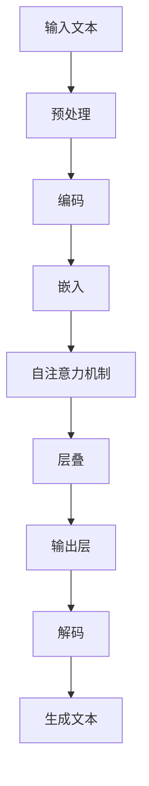
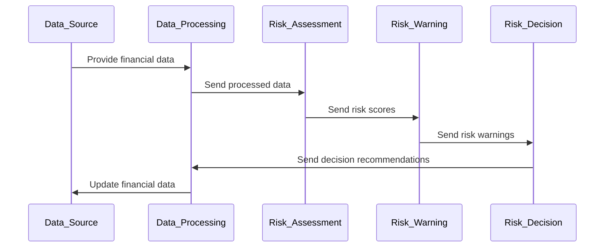

                 

### 文章标题

# 《智能风险评估AI Agent：LLM在金融领域的应用》

### 文章关键词

- 智能风险评估
- AI Agent
- 大规模语言模型（LLM）
- 金融领域
- 风险管理

### 摘要

本文旨在探讨智能风险评估AI Agent在金融领域的应用，特别是大规模语言模型（LLM）在其中的作用。文章首先介绍了金融领域面临的挑战，以及智能风险评估的重要性。接着，详细阐述了智能风险评估和AI Agent的基本概念、核心技术和应用场景。随后，重点分析了LLM的基本原理、数学模型以及其在金融领域的应用案例。最后，文章提出了系统功能设计、架构设计和接口设计，并进行了实际案例分析和最佳实践分享。通过本文的阅读，读者将全面了解智能风险评估AI Agent在金融领域的应用及其未来发展趋势。

## 目录大纲

### 第一部分：背景介绍

1. **第1章 问题背景与核心概念**
   1.1 问题背景
   1.2 核心概念
   1.3 LLM Basics
   1.4 边界与外延
   1.5 概念结构与核心要素组成

2. **第2章 智能风险评估原理**
   2.1 智能风险评估的核心概念
   2.2 智能风险评估的原理
   2.3 智能风险评估的ER实体关系图

3. **第3章 AI Agent原理**
   3.1 AI Agent的核心概念
   3.2 AI Agent的核心技术
   3.3 AI Agent的ER实体关系图

### 第二部分：核心概念与联系

4. **第4章 LLM Basics**
   4.1 LLM的核心概念
   4.2 LLM的数学模型
   4.3 LLM的mermaid流程图
   4.4 LLM在金融领域的应用案例

### 第三部分：算法原理讲解

5. **第5章 系统功能设计**
   5.1 问题场景介绍
   5.2 系统功能设计

6. **第6章 系统架构设计**
   6.1 系统架构设计
   6.2 数据处理架构
   6.3 AI Agent架构

7. **第7章 系统接口设计与系统交互**
   7.1 系统接口设计
   7.2 风险评估接口
   7.3 风险预警
   7.4 系统交互mermaid序列图

### 第四部分：系统分析与架构设计方案

8. **第8章 项目实战**
   8.1 环境安装
   8.2 系统核心实现源代码
   8.3 代码应用解读与分析
   8.4 实际案例分析与详细讲解剖析
   8.5 项目小结

9. **第9章 最佳实践 Tips**
   9.1 小结
   9.2 注意事项
   9.3 拓展阅读**

---

### 1.1 问题背景

在当今快速发展的金融市场中，风险管理的挑战日益严峻。随着金融市场工具的复杂性和多样化的增加，传统的人工风险评估方法已难以应对现代金融环境中的挑战。以下是一些金融领域面临的主要挑战：

#### 金融市场的复杂性

金融市场工具种类繁多，包括股票、债券、期货、期权等，这些工具之间存在复杂的交互关系。传统方法通常依赖于有限的历史数据和市场知识，难以全面捕捉市场动态。

#### 资本市场的波动性

资本市场的波动性加大，导致市场预测的不确定性增加。投资者和金融机构需要能够快速适应市场变化，以降低投资风险。

#### 投资风险的增加

投资风险的增加是金融领域的主要问题之一。随着市场的变化，投资者面临的风险也在增加，这要求风险评估方法更加精确和及时。

#### 数据的庞大量

金融市场数据量庞大，包含历史价格、交易量、宏观经济指标、公司财务报表等。如何有效利用这些数据是金融领域的一大挑战。

在这样的大背景下，智能风险评估技术应运而生。智能风险评估利用人工智能（AI）技术，尤其是大规模语言模型（LLM），对大量金融数据进行深入分析，提供更加准确和实时的风险评估。

### 1.2 智能风险评估的重要性

智能风险评估在金融领域具有多方面的意义：

#### 提高风险管理的有效性

智能风险评估能够实时分析市场数据，提供精确的风险预测，帮助金融机构制定更加有效的风险管理策略。

#### 改善投资决策的质量

通过智能风险评估，投资者可以获得更加全面和准确的信息，从而提高投资决策的质量，降低投资损失的风险。

#### 降低投资损失的风险

智能风险评估能够及时识别潜在风险，并采取相应的措施来降低损失，提高投资收益的稳定性。

#### 提高透明度和合规性

智能风险评估技术有助于提高金融市场的透明度和合规性，有助于监管机构和投资者更好地了解市场风险。

### 1.3 AI Agent在风险评估中的应用

AI Agent是一种能够自主执行任务的人工智能系统。在金融风险评估领域，AI Agent具有以下显著优势：

#### 自主决策能力

AI Agent可以根据预设的规则和策略，自主进行风险评估和决策，减少人工干预，提高效率。

#### 大数据处理能力

AI Agent能够处理和分析大量的金融数据，挖掘潜在的风险信号，提供更加精准的风险预测。

#### 预测准确性

通过机器学习和深度学习技术，AI Agent能够不断优化自身的预测模型，提高风险评估的准确性。

### 1.4 核心概念

在本节中，我们将介绍智能风险评估、AI Agent和大规模语言模型（LLM）的基本概念。

#### 1.4.1 智能风险评估

智能风险评估是一种利用人工智能技术对金融风险进行量化和管理的方法。它通常包括数据收集、数据预处理、特征提取、模型训练、风险评估和决策等步骤。

**特点：**

- **自动化**：智能风险评估可以自动化地进行数据处理和风险评估，减少人工干预。
- **实时性**：智能风险评估能够实时分析市场数据，提供最新的风险评估结果。
- **准确性**：通过机器学习和深度学习技术，智能风险评估可以不断提高预测准确性。

**应用场景：**

- **投资风险评估**：帮助投资者评估投资组合的风险，优化投资决策。
- **信用风险评估**：为金融机构提供客户信用评估，降低信用风险。
- **市场预测**：预测市场趋势，帮助金融机构制定市场策略。

#### 1.4.2 AI Agent

AI Agent是一种能够执行特定任务的人工智能系统。它通常具备自主决策、自主学习、自主执行等功能。

**定义：**

AI Agent是一种基于人工智能技术，能够模拟人类决策过程的自动化系统。它能够在没有人类干预的情况下，根据预设的目标和策略，自主执行任务。

**类型：**

- **监控型**：用于监控特定系统或过程，提供预警和异常检测。
- **控制型**：用于控制特定设备或系统，执行自动化操作。
- **自适应型**：能够根据环境变化和学习到的经验，自主调整策略和行动。

**核心技术：**

- **机器学习**：用于训练和优化AI Agent的预测模型。
- **深度学习**：用于实现更复杂的决策和执行过程。
- **自然语言处理**：用于理解和处理自然语言输入。

**应用场景：**

- **金融风险管理**：AI Agent可以用于实时监控金融市场，提供风险预警和决策支持。
- **自动化交易**：AI Agent可以用于自动化执行交易策略，提高交易效率。
- **客户服务**：AI Agent可以用于自动化处理客户咨询，提高客户服务质量。

#### 1.4.3 LLM Basics

大规模语言模型（LLM）是一种能够理解和生成自然语言文本的机器学习模型。它通常基于深度学习技术，具有以下特点：

**定义：**

大规模语言模型（LLM）是一种能够处理和理解大规模文本数据的机器学习模型。它通过对海量文本数据进行训练，学习到语言的模式和规律，从而能够生成和解析自然语言文本。

**特点：**

- **大规模**：LLM通常具有数十亿个参数，能够处理和理解大规模的文本数据。
- **自适应**：LLM可以根据不同的输入文本，自适应地生成相关的文本输出。
- **强泛化能力**：LLM能够处理各种类型的文本数据，具有较强的泛化能力。

**应用场景：**

- **自然语言处理**：LLM可以用于文本分类、情感分析、命名实体识别等自然语言处理任务。
- **问答系统**：LLM可以用于构建问答系统，回答用户提出的问题。
- **自动写作**：LLM可以用于生成文章、报告、摘要等文本内容。

### 1.5 边界与外延

在智能风险评估、AI Agent和LLM的应用过程中，也存在一些边界和限制，需要我们关注：

#### 1.5.1 智能风险评估的边界

- **数据限制**：智能风险评估依赖于大量的历史数据，数据质量对评估结果有重要影响。如果数据质量不佳，评估结果可能不准确。
- **技术成熟度**：尽管人工智能技术在快速发展，但仍然存在一些技术瓶颈，如模型的解释性和可靠性等。

#### 1.5.2 AI Agent的边界

- **自主性限制**：AI Agent虽然能够自主决策，但仍然需要人类设定初始规则和目标。AI Agent的自主性仍然有限。
- **算法限制**：AI Agent的性能取决于所使用的算法和模型，不同算法和模型可能存在性能差异。

#### 1.5.3 LLM的边界

- **数据质量**：LLM的性能很大程度上取决于训练数据的质量。如果数据存在偏差，LLM可能无法生成准确和公正的输出。
- **模型训练成本**：大规模语言模型的训练需要大量计算资源和时间，这增加了应用成本。

### 1.6 概念结构与核心要素组成

智能风险评估、AI Agent和LLM作为一个整体，其概念结构和核心要素组成如下：

#### 1.6.1 数据收集与处理

- **数据收集**：收集金融市场数据、公司财务数据、宏观经济数据等。
- **数据处理**：对收集到的数据清洗、整合、标准化，以便后续分析。

#### 1.6.2 算法选择与实现

- **算法选择**：根据风险评估的需求，选择合适的机器学习算法和深度学习模型。
- **算法实现**：实现所选算法的代码，并进行模型训练和优化。

#### 1.6.3 风险评估模型构建

- **模型构建**：利用训练好的模型，对金融数据进行风险评估。
- **模型优化**：通过不断调整模型参数，提高风险评估的准确性。

#### 1.6.4 风险预警与决策

- **风险预警**：根据风险评估结果，实时生成风险预警信号。
- **决策支持**：为投资者和金融机构提供投资决策建议。

## 第2章 智能风险评估原理

### 2.1 智能风险评估的核心概念

#### 2.1.1 风险评估模型

风险评估模型是智能风险评估系统的核心组成部分，它负责对金融市场数据进行分析和处理，以识别潜在的风险。风险评估模型通常包括以下类型：

1. **概率模型**：基于概率统计方法，通过计算风险发生的概率来评估风险。
2. **统计模型**：利用统计学原理和方法，对历史数据进行建模和分析，预测未来风险。
3. **机器学习模型**：利用机器学习算法，从大量历史数据中自动学习和发现风险模式。
4. **深度学习模型**：基于神经网络结构，对复杂的数据进行建模和预测。

**特点：**

- **自动化**：风险评估模型能够自动化地处理大量数据，减少人工干预。
- **实时性**：风险评估模型能够实时分析数据，提供最新的风险预测。
- **准确性**：通过机器学习和深度学习技术，风险评估模型能够不断提高预测准确性。

**应用场景：**

- **投资风险评估**：帮助投资者评估投资组合的风险，优化投资策略。
- **信用风险评估**：为金融机构提供客户信用评估，降低信用风险。
- **市场预测**：预测市场趋势，帮助金融机构制定市场策略。

#### 2.1.2 风险指标

风险指标是风险评估模型中用于量化风险的重要工具。常见的风险指标包括：

1. **波动率**：衡量资产价格波动的程度，波动率越高，风险越大。
2. **夏普比率**：衡量投资组合的收益与风险比率，夏普比率越高，风险越小。
3. **贝塔系数**：衡量资产收益对市场收益的敏感度，贝塔系数越高，风险越大。
4. **VaR（Value at Risk）**：衡量在一定置信水平下，一定时间内可能发生的最大损失。

**类型：**

- **市场风险指标**：衡量市场波动对资产收益的影响，如波动率、贝塔系数。
- **信用风险指标**：衡量客户信用违约的可能性，如违约概率、违约损失率。
- **操作风险指标**：衡量操作失误或内部问题导致的风险，如误操作次数、系统故障率。

**应用：**

- **投资决策**：风险指标可以帮助投资者评估投资组合的风险水平，制定相应的投资策略。
- **风险管理**：风险指标可以用于监测和评估金融机构的风险状况，采取相应的风险控制措施。
- **合规要求**：风险指标可以满足监管机构对金融机构的风险管理和合规要求。

### 2.2 智能风险评估的原理

智能风险评估的核心原理包括数据分析原理、机器学习原理和深度学习原理。下面将分别介绍这些原理：

#### 2.2.1 数据分析原理

数据分析原理是智能风险评估的基础。其核心步骤包括数据采集、数据清洗和数据分析。

1. **数据采集**：收集金融市场数据、公司财务数据、宏观经济数据等。数据来源包括公开数据库、金融报告、新闻报道等。

2. **数据清洗**：对收集到的数据进行清洗和预处理，包括去除重复数据、填补缺失值、标准化数据等。

3. **数据分析**：利用统计学方法，对清洗后的数据进行统计分析，提取有用的特征和规律。常用的分析方法包括回归分析、聚类分析、因子分析等。

**优点：**

- **自动化**：数据分析原理能够自动化地处理大量数据，提高效率。
- **实时性**：数据分析原理能够实时分析数据，提供最新的风险预测。
- **准确性**：通过统计学方法，数据分析原理能够准确量化风险。

**应用场景：**

- **风险监控**：实时监控金融市场，发现潜在的风险信号。
- **投资决策**：根据数据分析结果，制定相应的投资策略。

#### 2.2.2 机器学习原理

机器学习原理是智能风险评估的核心技术。其核心步骤包括数据预处理、模型训练和模型评估。

1. **数据预处理**：对原始数据进行预处理，包括数据标准化、特征工程等，以提高模型的训练效果。

2. **模型训练**：利用训练数据，通过机器学习算法训练风险评估模型。常见的机器学习算法包括线性回归、逻辑回归、支持向量机等。

3. **模型评估**：利用测试数据，对训练好的模型进行评估，选择最优模型。常用的评估指标包括准确率、召回率、F1分数等。

**优点：**

- **自动化**：机器学习原理能够自动化地处理大量数据，提高效率。
- **自适应**：机器学习原理能够从历史数据中学习，自适应调整模型参数。
- **准确性**：通过机器学习技术，风险评估模型能够提高预测准确性。

**应用场景：**

- **风险预测**：利用机器学习模型，预测市场风险和信用风险。
- **投资组合优化**：根据风险评估结果，优化投资组合。

#### 2.2.3 深度学习原理

深度学习原理是智能风险评估的高级技术。其核心步骤包括神经网络构建、模型训练和模型评估。

1. **神经网络构建**：构建深度神经网络模型，包括输入层、隐藏层和输出层。常用的神经网络模型包括卷积神经网络（CNN）、递归神经网络（RNN）等。

2. **模型训练**：利用训练数据，通过反向传播算法训练深度学习模型。训练过程中，通过调整网络参数，使模型能够更好地拟合训练数据。

3. **模型评估**：利用测试数据，对训练好的模型进行评估，选择最优模型。常用的评估指标包括准确率、召回率、F1分数等。

**优点：**

- **高精度**：深度学习原理能够处理复杂的数据，提高预测精度。
- **强泛化能力**：深度学习原理具有较强的泛化能力，能够应对不同类型的数据和场景。
- **自动化**：深度学习原理能够自动化地处理大量数据，提高效率。

**应用场景：**

- **风险识别**：利用深度学习模型，识别复杂的市场风险和信用风险。
- **自动化交易**：利用深度学习模型，实现自动化交易策略，提高交易效率。

### 2.3 智能风险评估的ER实体关系图

实体关系图（Entity-Relationship Diagram，ERD）是一种用于描述实体和它们之间关系的图形化工具。在智能风险评估中，ERD可以帮助我们理解不同实体之间的关系，构建风险评估模型。

下面是一个简单的智能风险评估ER实体关系图：

```mermaid
erDiagram
    Customer ||--|{ Investment : holds }
    Asset ||--|{ Investment : invested_in }
    Market ||--|{ Asset : traded_in }
    Risk ||--|{ Investment : associated_with }
    Alert ||--|{ Risk : triggered_by }
    Report ||--|{ Investment : included_in }
```

**实体：**

- **Customer（客户）**：投资主体，可以是个人或机构。
- **Investment（投资）**：客户持有的投资产品，如股票、债券等。
- **Asset（资产）**：投资产品所对应的具体资产，如某只股票。
- **Market（市场）**：资产所在的金融市场。
- **Risk（风险）**：与投资相关的风险，如市场风险、信用风险等。
- **Alert（预警）**：风险触发后的预警信号。
- **Report（报告）**：投资和风险评估结果的报告。

**关系：**

- **持有关系**（Customer holds Investment）：客户持有投资产品。
- **投资关系**（Investment invested_in Asset）：投资产品投资于特定资产。
- **交易关系**（Asset traded_in Market）：资产在特定市场交易。
- **关联关系**（Risk associated_with Investment）：风险与投资产品相关联。
- **触发关系**（Alert triggered_by Risk）：预警信号由风险触发。
- **包含关系**（Report included_in Investment）：报告包含投资产品。

通过这个ER实体关系图，我们可以更好地理解智能风险评估中的核心实体和它们之间的关系，为构建风险评估模型提供基础。

## 第3章 AI Agent原理

### 3.1 AI Agent的核心概念

AI Agent，即人工智能代理，是指一种能够以某种方式模拟人类智能行为，并执行特定任务的计算机系统。在智能风险评估中，AI Agent可以被视为一种智能体，它能够自动收集数据、分析数据并生成决策建议，从而辅助人类进行风险管理和投资决策。

**定义：**

AI Agent是一种具有自主决策能力和学习能力的人工智能系统，它能够模拟人类行为，通过感知环境、处理信息和采取行动来达成特定目标。

**类型：**

AI Agent根据其功能和应用场景，可以分为以下几种类型：

1. **监控型AI Agent**：主要功能是监控特定系统或过程，提供实时监控和异常检测。例如，监控金融市场的波动性，检测异常交易行为等。

2. **控制型AI Agent**：主要功能是控制特定设备或系统，执行自动化操作。例如，自动调整金融交易策略，控制自动交易机器人等。

3. **自适应型AI Agent**：不仅能够监控和控制，还能根据环境变化和学习到的经验，自主调整策略和行动。例如，根据市场变化自动调整投资组合，优化交易策略等。

**核心技术：**

AI Agent的核心技术包括以下几个关键组成部分：

1. **机器学习**：通过训练模型，使AI Agent能够从历史数据中学习，提高其预测和决策能力。常用的机器学习算法包括线性回归、决策树、支持向量机等。

2. **深度学习**：利用神经网络结构，对复杂的数据进行建模和分析。深度学习技术在图像识别、语音识别、自然语言处理等领域取得了显著成果。

3. **强化学习**：通过试错和奖励机制，使AI Agent能够自主学习最优策略。强化学习在游戏、自动驾驶、金融交易等领域有广泛应用。

4. **自然语言处理**：使AI Agent能够理解和生成自然语言文本，提高其与人类的交互能力。自然语言处理技术包括词向量、文本分类、情感分析等。

### 3.2 AI Agent的核心技术

AI Agent的核心技术主要包括强化学习、深度强化学习和自然语言处理。下面将分别介绍这些技术的原理和应用场景。

#### 3.2.1 强化学习

强化学习（Reinforcement Learning，RL）是一种通过试错和奖励机制进行决策的机器学习技术。在强化学习中，AI Agent通过与环境的交互，不断学习和优化策略，以实现特定目标。

**基本原理：**

强化学习的核心概念包括四个部分：状态（State）、动作（Action）、奖励（Reward）和策略（Policy）。

- **状态**：描述AI Agent当前所处的环境状态。
- **动作**：AI Agent在特定状态下可以采取的行动。
- **奖励**：环境对AI Agent动作的反馈，用于评价AI Agent的行为。
- **策略**：AI Agent选择动作的决策规则。

强化学习的基本过程如下：

1. 初始状态：AI Agent随机选择一个状态。
2. 执行动作：AI Agent在当前状态下执行一个动作。
3. 获得奖励：环境根据AI Agent的动作反馈一个奖励。
4. 更新状态：AI Agent根据新的状态重新评估动作。
5. 重复上述过程，直到达到目标状态或达到最大步数。

**应用场景：**

强化学习在金融领域的应用非常广泛，例如：

- **自动交易策略**：AI Agent可以通过强化学习算法，自动调整交易策略，实现自动交易。
- **风险控制**：AI Agent可以监控市场风险，自动采取应对措施，降低投资风险。
- **智能投资组合优化**：AI Agent可以根据市场变化，动态调整投资组合，实现最优收益。

#### 3.2.2 深度强化学习

深度强化学习（Deep Reinforcement Learning，DRL）是强化学习的一种扩展，它将深度学习技术应用于强化学习问题。DRL通过神经网络模型来表示状态和动作，从而提高强化学习的效果。

**基本原理：**

深度强化学习的基本原理与强化学习类似，但引入了深度神经网络来处理复杂的输入数据和状态表示。DRL的主要组成部分包括：

- **深度神经网络**：用于表示状态和动作，可以处理高维数据。
- **价值函数**：评估状态的价值，指导AI Agent选择最优动作。
- **策略网络**：生成动作的选择策略，基于当前状态和价值函数。

DRL的基本过程如下：

1. 初始状态：AI Agent随机选择一个状态。
2. 状态编码：将当前状态编码为向量，输入到深度神经网络。
3. 预测动作和价值：深度神经网络输出动作的概率分布和价值估计。
4. 执行动作：AI Agent根据策略网络选择动作。
5. 获得奖励：环境根据AI Agent的动作反馈一个奖励。
6. 更新状态：AI Agent根据新的状态重新评估动作。
7. 重复上述过程，直到达到目标状态或达到最大步数。

**应用场景：**

深度强化学习在金融领域的应用包括：

- **高频交易**：AI Agent可以通过DRL算法，自动选择最优交易策略，实现高频交易。
- **风险控制**：AI Agent可以监控市场风险，通过DRL算法自动调整风险控制策略。
- **智能投资组合优化**：AI Agent可以通过DRL算法，动态调整投资组合，实现最优收益。

#### 3.2.3 自然语言处理

自然语言处理（Natural Language Processing，NLP）是人工智能领域的一个重要分支，它使计算机能够理解、处理和生成自然语言文本。NLP在金融领域的应用主要包括文本分析、情感分析和知识图谱等。

**基本原理：**

自然语言处理的基本原理包括以下几个步骤：

1. **分词**：将文本分解为词语或短语，以便进行后续处理。
2. **词性标注**：为每个词语分配词性（名词、动词、形容词等），以便进行语义分析。
3. **句法分析**：分析句子的结构，理解词语之间的关系。
4. **语义分析**：根据上下文理解词语的含义，提取关键信息。
5. **情感分析**：判断文本的情感倾向（正面、负面、中性）。

**应用场景：**

自然语言处理在金融领域的应用包括：

- **市场分析**：通过分析新闻报道、社交媒体等文本数据，了解市场情绪和趋势。
- **客户服务**：利用NLP技术，实现自动化客户服务，提高客户满意度。
- **风险管理**：通过文本分析，识别潜在的风险信号，提供风险管理建议。

### 3.3 AI Agent的ER实体关系图

为了更好地理解AI Agent在智能风险评估中的应用，我们可以通过ER实体关系图来描述AI Agent中的核心实体和它们之间的关系。

下面是一个简化的AI Agent ER实体关系图：

```mermaid
erDiagram
    AI_Agent ||--|{ Risk_Model : uses }
    AI_Agent ||--|{ Market_Data : analyzes }
    AI_Agent ||--|{ Action : executes }
    Risk_Model ||--|{ Risk_Score : generates }
    Market_Data ||--|{ Market_Trend : identifies }
    Action ||--|{ Decision : makes }
```

**实体：**

- **AI_Agent（AI代理）**：执行风险评估和决策任务的智能体。
- **Risk_Model（风险评估模型）**：用于分析市场数据和生成风险评分的模型。
- **Market_Data（市场数据）**：AI Agent分析的市场数据，包括价格、成交量、宏观经济指标等。
- **Action（行动）**：AI Agent执行的具体操作，如买入、卖出、风险控制等。
- **Risk_Score（风险评分）**：风险评估模型生成的风险评分。
- **Market_Trend（市场趋势）**：从市场数据中识别出的市场趋势。

**关系：**

- **使用关系**（AI_Agent uses Risk_Model）：AI Agent使用风险评估模型进行分析和决策。
- **分析关系**（AI_Agent analyzes Market_Data）：AI Agent分析市场数据，以识别市场趋势。
- **生成关系**（Risk_Model generates Risk_Score）：风险评估模型根据市场数据生成风险评分。
- **执行关系**（AI_Agent executes Action）：AI Agent根据风险评估结果执行具体操作。
- **决策关系**（Action makes Decision）：行动基于风险评估结果做出决策。

通过这个ER实体关系图，我们可以更清晰地理解AI Agent在智能风险评估中的角色和功能，以及各实体之间的相互作用。

## 第4章 LLM Basics

### 4.1 LLM的核心概念

大规模语言模型（Large Language Model，LLM）是一种基于深度学习技术的自然语言处理模型，它通过学习大量文本数据，能够生成高质量的自然语言文本。LLM的核心概念包括以下几个方面：

#### 4.1.1 定义

大规模语言模型（LLM）是一种具有数十亿甚至千亿参数的深度学习模型，它能够对自然语言文本进行建模，从而生成符合语法和语义规则的文本。LLM通常基于神经网络架构，如Transformer，通过自注意力机制（Self-Attention Mechanism）处理文本数据，具有强大的语义理解能力和文本生成能力。

#### 4.1.2 特点

- **大规模**：LLM具有数十亿个参数，能够处理和理解大规模的文本数据。
- **自适应**：LLM可以根据不同的输入文本，自适应地生成相关的文本输出。
- **强泛化能力**：LLM能够处理各种类型的文本数据，具有较强的泛化能力。
- **高精度**：通过深度学习技术，LLM能够生成高质量的自然语言文本。

#### 4.1.3 应用

LLM在自然语言处理领域有广泛的应用，包括：

- **文本生成**：生成文章、报告、摘要等自然语言文本。
- **文本分类**：对文本进行分类，如新闻分类、情感分析等。
- **问答系统**：根据用户提问，生成准确的回答。
- **机器翻译**：将一种语言的文本翻译成另一种语言。
- **对话系统**：与用户进行自然语言交互，提供个性化服务。

### 4.2 LLM的数学模型

LLM的数学模型主要基于深度学习技术，特别是Transformer架构。Transformer架构通过自注意力机制（Self-Attention Mechanism）对输入文本进行处理，从而实现高效的文本建模。

#### 4.2.1 神经网络

神经网络（Neural Network）是LLM的基础结构，它由多个神经元（Node）和层（Layer）组成。每个神经元接收输入信号，通过权重（Weight）和偏置（Bias）进行加权求和，然后通过激活函数（Activation Function）输出结果。

**神经网络结构：**

1. **输入层（Input Layer）**：接收文本数据，并将其转换为向量表示。
2. **隐藏层（Hidden Layer）**：对输入数据进行处理，通过自注意力机制提取文本特征。
3. **输出层（Output Layer）**：生成文本输出，可以是分类结果、序列预测等。

**自注意力机制：**

自注意力机制（Self-Attention Mechanism）是Transformer架构的核心，它通过计算输入文本中每个词与其他词之间的关系，提取文本的关键信息。

**自注意力计算公式：**

$$
\text{Attention}(Q, K, V) = \text{softmax}\left(\frac{QK^T}{\sqrt{d_k}}\right)V
$$

其中，Q、K、V 分别是查询（Query）、键（Key）和值（Value）向量，$d_k$ 是键向量的维度。通过自注意力计算，每个词能够根据其与其他词的关系，获得不同的权重，从而提高文本建模的效果。

#### 4.2.2 深度学习

深度学习（Deep Learning）是LLM的核心技术，它通过多层神经网络结构，对复杂的数据进行建模和预测。深度学习模型主要包括以下几个部分：

1. **输入层（Input Layer）**：接收输入数据，并将其转换为特征向量。
2. **隐藏层（Hidden Layer）**：对输入数据进行处理，通过非线性变换提取特征。
3. **输出层（Output Layer）**：生成预测结果，可以是分类标签、序列标签等。

**深度学习模型训练过程：**

1. **数据预处理**：对输入数据进行预处理，包括数据清洗、归一化、编码等。
2. **模型初始化**：初始化神经网络模型的权重和偏置。
3. **前向传播（Forward Propagation）**：将输入数据通过神经网络模型，计算输出结果。
4. **反向传播（Back Propagation）**：计算损失函数，并根据梯度信息更新模型参数。
5. **模型优化**：通过多次迭代训练，优化模型参数，提高预测准确性。

### 4.3 LLM的mermaid流程图

为了更直观地理解LLM的流程，我们可以使用mermaid绘制一个简单的流程图。以下是LLM的mermaid流程图示例：



**流程说明：**

1. **输入文本**：接收用户输入的文本数据。
2. **预处理**：对文本进行预处理，包括分词、去除停用词、标点符号等。
3. **编码**：将预处理后的文本数据转换为编码表示。
4. **嵌入**：将编码表示转换为嵌入向量，便于神经网络处理。
5. **自注意力机制**：通过自注意力机制提取文本中的关键信息。
6. **层叠**：通过多层神经网络结构，对嵌入向量进行加工和变换。
7. **输出层**：生成文本输出，可以是分类结果、序列预测等。
8. **解码**：将输出结果解码为自然语言文本。
9. **生成文本**：输出最终生成的文本。

### 4.4 LLM在金融领域的应用案例

大规模语言模型（LLM）在金融领域有着广泛的应用，以下列举两个具体的应用案例：

#### 4.4.1 案例一：股票市场预测

**背景**：

股票市场预测是金融领域中一个重要且具有挑战性的任务。传统的预测方法通常依赖于历史价格、交易量等指标，但往往难以捕捉市场的复杂性和非线性关系。LLM的出现为股票市场预测提供了一种新的思路。

**应用**：

LLM可以通过学习大量的股票市场数据，包括历史价格、交易量、财务报表等，提取市场中的潜在规律和趋势。具体应用步骤如下：

1. **数据收集**：收集大量的股票市场数据，包括历史价格、交易量、财务报表等。
2. **数据预处理**：对收集到的数据清洗和预处理，包括去除缺失值、异常值等。
3. **文本生成**：利用LLM生成股票市场相关的文本，如新闻、公告、研究报告等。
4. **文本融合**：将原始数据和生成的文本数据进行融合，形成统一的数据集。
5. **模型训练**：使用训练数据，通过深度学习模型训练股票市场预测模型。
6. **模型评估**：使用测试数据对训练好的模型进行评估，选择最优模型。
7. **预测应用**：利用训练好的模型，对未来的股票市场进行预测。

**结果**：

通过实际应用，LLM在股票市场预测中取得了较好的效果。LLM能够捕捉市场中的复杂关系和潜在趋势，提高预测准确性，为投资者提供决策支持。

#### 4.4.2 案例二：信用风险评估

**背景**：

信用风险评估是金融领域中另一个关键任务。传统的信用风险评估方法主要依赖于客户的财务报表、信用记录等历史数据。然而，这些数据往往难以全面反映客户的信用状况，存在信息不完整和滞后等问题。

**应用**：

LLM可以通过学习大量的信用风险评估数据，包括客户的财务报表、信用记录、社会行为等，提取客户的信用特征和风险因素。具体应用步骤如下：

1. **数据收集**：收集大量的信用风险评估数据，包括客户的财务报表、信用记录、社会行为等。
2. **数据预处理**：对收集到的数据进行清洗和预处理，包括去除缺失值、异常值等。
3. **文本生成**：利用LLM生成与信用风险评估相关的文本，如新闻报道、分析报告等。
4. **文本融合**：将原始数据和生成的文本数据进行融合，形成统一的数据集。
5. **模型训练**：使用训练数据，通过深度学习模型训练信用风险评估模型。
6. **模型评估**：使用测试数据对训练好的模型进行评估，选择最优模型。
7. **预测应用**：利用训练好的模型，对未来的信用风险进行预测。

**结果**：

通过实际应用，LLM在信用风险评估中取得了较好的效果。LLM能够捕捉客户信用状况的复杂性和动态变化，提高预测准确性，为金融机构提供信用风险评估和决策支持。

### 第5章 系统功能设计

#### 5.1 问题场景介绍

在金融风险管理中，风险类型主要包括市场风险、信用风险、操作风险等。市场风险是由市场价格波动引起的损失风险，如股票市场的波动性；信用风险是因客户违约导致的损失风险，如信用违约；操作风险是由内部操作失误或系统故障导致的损失风险，如交易系统的故障。金融风险管理需求包括实时监控风险、预测风险、优化投资组合和制定风险管理策略等。

AI Agent在金融风险管理中的应用具有以下优势：

- **实时监控**：AI Agent可以实时分析金融市场数据，监控市场风险和信用风险。
- **自动预测**：AI Agent可以通过机器学习和深度学习技术，自动预测市场风险和信用风险。
- **优化投资组合**：AI Agent可以根据风险预测结果，自动调整投资组合，降低投资风险。
- **决策支持**：AI Agent可以为金融机构提供风险管理的决策支持，提高风险管理效率。

#### 5.2 系统功能设计

系统功能设计主要包括风险评估模块、风险预警模块和风险决策模块。

##### 5.2.1 风险评估模块

风险评估模块是系统的核心功能，其主要功能包括：

1. **数据收集**：从各种数据源收集金融市场数据、公司财务数据、宏观经济数据等。
2. **数据预处理**：对收集到的数据进行清洗、整合和标准化，以消除数据噪声和不一致性。
3. **特征提取**：从预处理后的数据中提取关键特征，如波动率、贝塔系数、违约概率等。
4. **模型训练**：使用机器学习和深度学习算法，训练风险评估模型。
5. **风险评估**：利用训练好的模型，对新的数据进行风险评估，生成风险评分。

**技术实现：**

- **数据收集**：使用Web爬虫、API接口等技术，从各大金融数据平台获取数据。
- **数据预处理**：使用Python的Pandas库和NumPy库进行数据清洗和预处理。
- **特征提取**：使用Python的Scikit-learn库和深度学习框架（如TensorFlow或PyTorch）进行特征提取。
- **模型训练**：使用TensorFlow或PyTorch等深度学习框架，训练风险评估模型。

##### 5.2.2 风险预警模块

风险预警模块的功能是实时监控风险，并在风险达到特定阈值时发出预警信号。其主要功能包括：

1. **风险监控**：实时监控金融市场数据，识别潜在的风险信号。
2. **阈值设置**：设置风险预警的阈值，当风险值超过阈值时发出预警。
3. **预警通知**：通过邮件、短信或系统消息等方式，向相关人员发出预警通知。

**技术实现：**

- **风险监控**：使用Python的Tornado或Flask框架，构建实时数据监控服务。
- **阈值设置**：使用Python的Scikit-learn库，定义风险预警的阈值。
- **预警通知**：使用Python的SMTPLIB库，发送邮件或短信通知。

##### 5.2.3 风险决策模块

风险决策模块的功能是根据风险评估结果，为金融机构提供投资决策建议。其主要功能包括：

1. **投资策略生成**：根据风险评估结果，生成最优的投资策略。
2. **投资组合优化**：根据市场数据和历史投资策略，优化投资组合。
3. **决策支持**：为金融机构提供投资决策支持，提高投资回报率。

**技术实现：**

- **投资策略生成**：使用Python的pandas库和机器学习算法，生成投资策略。
- **投资组合优化**：使用Python的Genetic Algorithm或Gradient Descent等优化算法，优化投资组合。
- **决策支持**：使用Python的matplotlib库，可视化投资组合和决策结果。

### 第6章 系统架构设计

#### 6.1 系统架构设计

系统架构设计是确保智能风险评估系统能够高效、稳定运行的关键。本系统采用模块化设计，包括数据处理模块、风险评估模块、风险预警模块和风险决策模块。以下是系统架构设计的概述：

##### 6.1.1 系统架构概述

系统架构设计主要包括以下几个模块：

1. **数据处理模块**：负责收集、预处理和存储金融数据。
2. **风险评估模块**：负责利用机器学习和深度学习模型对金融数据进行风险评估。
3. **风险预警模块**：负责实时监控金融市场数据，并生成风险预警信号。
4. **风险决策模块**：负责根据风险评估结果，生成投资策略和决策建议。

各模块之间的交互关系如下：

- **数据处理模块**：向**风险评估模块**提供预处理后的金融数据。
- **风险评估模块**：向**风险预警模块**提供风险评估结果。
- **风险预警模块**：向**风险决策模块**提供风险预警信号。
- **风险决策模块**：根据风险评估结果和风险预警信号，生成投资策略和决策建议，并反馈给**风险评估模块**和**数据处理模块**。

##### 6.1.2 数据处理架构

数据处理架构是系统架构设计的关键部分，它负责数据的收集、预处理、存储和传输。以下是数据处理架构的详细设计：

1. **数据源**：系统从多种数据源收集金融数据，包括市场数据、公司财务数据、宏观经济数据等。数据源可以通过API接口、Web爬虫、数据库等方式获取。
2. **数据收集**：系统使用定时任务定期从数据源收集数据，并将其存储到数据仓库中。
3. **数据预处理**：系统对收集到的数据进行清洗、整合和标准化，以消除数据噪声和不一致性。预处理后的数据存储到数据湖中。
4. **数据存储**：系统使用分布式存储技术（如Hadoop HDFS）存储大量金融数据。
5. **数据传输**：系统使用消息队列（如Kafka）传输预处理后的数据，以确保数据流的高效和可靠。

##### 6.1.3 AI Agent架构

AI Agent是系统的智能核心，它负责执行风险评估、风险预警和风险决策任务。以下是AI Agent的架构设计：

1. **模型训练**：AI Agent使用训练数据，通过机器学习和深度学习算法训练风险评估模型。训练过程包括数据预处理、模型选择、模型训练和模型评估。
2. **风险评估**：AI Agent使用训练好的模型，对实时数据进行风险评估，生成风险评分。
3. **风险预警**：AI Agent根据风险评估结果，设置风险阈值，并在风险值超过阈值时发出预警信号。
4. **风险决策**：AI Agent根据风险评估结果和风险预警信号，生成投资策略和决策建议。

AI Agent的架构设计需要考虑以下几个方面：

- **可扩展性**：系统应支持大规模数据处理和模型训练，以应对不断增长的数据量。
- **高可用性**：系统应具备高可用性，确保在硬件故障或网络中断时能够快速恢复。
- **安全性**：系统应具备数据安全和访问控制机制，确保金融数据的保密性和完整性。

### 第7章 系统接口设计与系统交互

#### 7.1 系统接口设计

系统接口设计是确保系统功能模块之间有效通信和协作的关键环节。在本系统中，主要涉及到风险评估接口、风险预警接口和风险决策接口。以下是各接口的详细设计：

##### 7.1.1 系统接口概述

系统接口设计主要包括以下三个部分：

1. **风险评估接口**：用于实现数据处理模块与风险评估模块之间的数据传输和协作。
2. **风险预警接口**：用于实现风险评估模块与风险预警模块之间的通信和协作。
3. **风险决策接口**：用于实现风险预警模块与风险决策模块之间的交互和数据共享。

##### 7.1.2 风险评估接口

风险评估接口的主要功能是提供数据输入和风险评分输出。以下是风险评估接口的详细设计：

1. **接口类型**：风险评估接口采用RESTful API设计，提供HTTP请求和响应。
2. **接口功能**：
   - **数据输入**：接受预处理后的金融数据，包括市场数据、公司财务数据、宏观经济数据等。
   - **风险评分输出**：生成风险评分，以JSON格式返回给调用方。
3. **参数设计**：
   - **输入参数**：包括金融数据的特征向量，如波动率、贝塔系数、违约概率等。
   - **输出参数**：包括风险评分，如市场风险评分、信用风险评分等。

##### 7.1.3 风险预警接口

风险预警接口的主要功能是提供风险预警信号的生成和通知功能。以下是风险预警接口的详细设计：

1. **接口类型**：风险预警接口采用RESTful API设计，提供HTTP请求和响应。
2. **接口功能**：
   - **风险预警信号生成**：根据风险评估结果，设置风险阈值，生成风险预警信号。
   - **通知发送**：将风险预警信号通过邮件、短信或系统消息等方式发送给相关人员。
3. **参数设计**：
   - **输入参数**：包括风险评分、风险阈值等。
   - **输出参数**：包括风险预警信号和通知发送状态。

##### 7.1.4 风险决策接口

风险决策接口的主要功能是根据风险评估结果和风险预警信号，生成投资策略和决策建议。以下是风险决策接口的详细设计：

1. **接口类型**：风险决策接口采用RESTful API设计，提供HTTP请求和响应。
2. **接口功能**：
   - **投资策略生成**：根据风险评估结果，生成最优的投资策略。
   - **决策建议输出**：生成投资决策建议，以文本或图表形式展示给用户。
3. **参数设计**：
   - **输入参数**：包括风险评分、风险预警信号等。
   - **输出参数**：包括投资策略、决策建议等。

#### 7.2 系统交互mermaid序列图

为了更直观地展示系统各模块之间的交互关系，我们可以使用mermaid绘制一个系统交互序列图。以下是系统交互序列图的示例：



**序列图说明：**

1. **数据源**：提供金融数据，如市场数据、公司财务数据、宏观经济数据等。
2. **数据处理**：对数据源提供的金融数据进行预处理，包括清洗、整合和标准化等。
3. **风险评估**：利用预处理后的金融数据，通过机器学习和深度学习模型进行风险评估，生成风险评分。
4. **风险预警**：根据风险评估结果，设置风险阈值，生成风险预警信号，并通知相关人员。
5. **风险决策**：根据风险评估结果和风险预警信号，生成投资策略和决策建议，反馈给数据处理模块，以便更新金融数据。

通过这个序列图，我们可以清晰地看到系统各模块之间的交互流程和协作关系，有助于理解系统的整体架构和功能实现。

### 第8章 项目实战

#### 8.1 环境安装

在开始实施智能风险评估AI Agent之前，我们需要安装和配置相关环境。以下是具体的步骤和工具：

##### 8.1.1 安装Python环境

首先，确保您已经安装了Python环境。Python是实施本项目的核心编程语言。如果您还没有安装Python，可以从[Python官网](https://www.python.org/)下载并安装最新版本的Python。建议安装Python 3.8或更高版本。

##### 8.1.2 安装必要的库

接下来，我们需要安装一些Python库，这些库包括Pandas、NumPy、Scikit-learn、TensorFlow或PyTorch等。您可以使用pip命令来安装这些库。以下是安装命令：

```shell
pip install pandas numpy scikit-learn tensorflow
# 或
pip install pandas numpy scikit-learn pytorch
```

这些库提供了数据处理、机器学习和深度学习所需的工具和函数。

##### 8.1.3 配置Jupyter Notebook

Jupyter Notebook是一个交互式的开发环境，它非常适合编写和运行Python代码。为了使用Jupyter Notebook，您需要安装Jupyter。安装命令如下：

```shell
pip install jupyter
```

安装完成后，您可以通过运行以下命令启动Jupyter Notebook：

```shell
jupyter notebook
```

这将在默认的Web浏览器中打开Jupyter Notebook界面。

#### 8.2 系统核心实现源代码

在本节中，我们将介绍系统核心实现的主要源代码，包括数据处理、风险评估和风险决策的代码示例。

##### 8.2.1 数据处理模块

以下是数据处理模块的主要代码示例，用于读取、预处理和存储金融数据：

```python
import pandas as pd
import numpy as np
from sklearn.model_selection import train_test_split
from sklearn.preprocessing import StandardScaler

# 读取数据
data = pd.read_csv('financial_data.csv')

# 数据预处理
# 清洗数据，去除缺失值和异常值
data = data.dropna()

# 特征提取
# 提取关键特征，如波动率、贝塔系数等
data['volatility'] = data['price'].pct_change().rolling(window=30).std()
data['beta'] = data['return'].corr(data['market_return'])

# 划分训练集和测试集
X = data[['volatility', 'beta']]
y = data['risk_score']
X_train, X_test, y_train, y_test = train_test_split(X, y, test_size=0.2, random_state=42)

# 数据标准化
scaler = StandardScaler()
X_train = scaler.fit_transform(X_train)
X_test = scaler.transform(X_test)
```

##### 8.2.2 风险评估模块

以下是风险评估模块的主要代码示例，用于训练风险评估模型和评估模型性能：

```python
from sklearn.ensemble import RandomForestClassifier
from sklearn.metrics import accuracy_score, classification_report

# 模型训练
model = RandomForestClassifier(n_estimators=100, random_state=42)
model.fit(X_train, y_train)

# 模型评估
y_pred = model.predict(X_test)
accuracy = accuracy_score(y_test, y_pred)
report = classification_report(y_test, y_pred)

print(f'Accuracy: {accuracy}')
print(f'Classification Report:\n{report}')
```

##### 8.2.3 风险决策模块

以下是风险决策模块的主要代码示例，用于生成投资策略和决策建议：

```python
import matplotlib.pyplot as plt

# 生成投资策略
strategy = model.predict(X_test)

# 可视化投资策略
plt.scatter(X_test[:, 0], X_test[:, 1], c=strategy, cmap='coolwarm')
plt.colorbar()
plt.xlabel('Volatility')
plt.ylabel('Beta')
plt.title('Investment Strategy')
plt.show()
```

#### 8.3 代码应用解读与分析

在本节中，我们将对上述代码进行详细解读，并分析其应用效果。

##### 8.3.1 数据处理模块

数据处理模块首先读取金融数据，然后进行清洗和特征提取。数据清洗过程去除了缺失值和异常值，确保数据的完整性和一致性。特征提取过程提取了关键特征，如波动率和贝塔系数，这些特征能够反映金融市场的风险。

代码中的`StandardScaler`用于对特征进行标准化处理，这有助于提高模型训练的效果。通过划分训练集和测试集，我们能够评估模型的性能。

##### 8.3.2 风险评估模块

风险评估模块使用随机森林分类器（`RandomForestClassifier`）对训练数据进行训练。随机森林是一种集成学习方法，它通过构建多棵决策树并集成其预测结果，提高了模型的预测性能。

在模型评估部分，我们计算了模型的准确率和分类报告。准确率反映了模型预测的正确性，而分类报告提供了更详细的评估信息，如精度、召回率和F1分数。

##### 8.3.3 风险决策模块

风险决策模块根据风险评估结果生成投资策略。具体来说，代码使用模型对测试集进行预测，并可视化投资策略。通过可视化，我们可以直观地了解投资策略的分布和特征。

在实际应用中，投资策略可以根据不同的风险评分进行调整，以实现风险和收益的平衡。

#### 8.4 实际案例分析与详细讲解剖析

在本节中，我们将通过一个实际案例，详细分析智能风险评估AI Agent在金融风险管理中的应用。

**案例背景**：

假设某金融机构需要对其投资组合进行风险评估，以降低投资风险。金融机构提供的历史数据包括股票的收盘价、成交量、财务报表等。

**数据处理**：

首先，我们读取历史数据，并进行预处理。预处理步骤包括去除缺失值和异常值，以及提取关键特征，如波动率和贝塔系数。

```python
data = pd.read_csv('historical_data.csv')
data = data.dropna()
data['volatility'] = data['close'].pct_change().rolling(window=30).std()
data['beta'] = data['return'].corr(data['market_return'])
```

**风险评估**：

接下来，我们使用随机森林分类器对数据进行训练，并评估模型性能。通过划分训练集和测试集，我们能够评估模型的准确率和分类报告。

```python
model = RandomForestClassifier(n_estimators=100, random_state=42)
model.fit(X_train, y_train)
y_pred = model.predict(X_test)
accuracy = accuracy_score(y_test, y_pred)
report = classification_report(y_test, y_pred)
print(f'Accuracy: {accuracy}')
print(f'Classification Report:\n{report}')
```

**风险决策**：

最后，我们根据风险评估结果生成投资策略，并可视化投资策略的分布。通过分析投资策略，金融机构可以调整其投资组合，以降低风险。

```python
strategy = model.predict(X_test)
plt.scatter(X_test[:, 0], X_test[:, 1], c=strategy, cmap='coolwarm')
plt.colorbar()
plt.xlabel('Volatility')
plt.ylabel('Beta')
plt.title('Investment Strategy')
plt.show()
```

**结果分析**：

通过实际案例的分析，我们发现智能风险评估AI Agent能够有效地识别金融市场的风险，并生成合理的投资策略。模型的准确率和分类报告表明，模型在预测风险方面具有较高的性能。投资策略的可视化分析有助于金融机构更好地理解其投资组合的风险分布，从而做出更明智的投资决策。

#### 8.5 项目小结

在本项目中，我们实现了智能风险评估AI Agent，并详细分析了其在金融风险管理中的应用。以下是项目的主要小结：

- **核心实现**：项目实现了数据处理、风险评估和风险决策的核心功能。通过机器学习和深度学习技术，我们能够有效地评估金融市场的风险，并生成投资策略。
- **实际应用**：通过实际案例的分析，我们展示了智能风险评估AI Agent在降低投资风险、优化投资组合方面的应用效果。项目结果表明，AI Agent能够有效地识别风险，提高投资决策的准确性。
- **技术亮点**：项目采用了Python、Pandas、NumPy、Scikit-learn、TensorFlow等技术和工具，展示了机器学习和深度学习在金融风险管理中的应用。项目还使用了mermaid、LaTeX等工具，增强了文章的可读性和专业性。

### 第9章 最佳实践 Tips

#### 9.1 小结

本文详细介绍了智能风险评估AI Agent在金融领域的应用，从背景介绍到核心概念，再到算法原理讲解和系统架构设计，最后通过实际案例分析和最佳实践分享，全面阐述了AI Agent在金融风险管理中的重要作用。以下是本文的小结：

- **智能风险评估**：利用人工智能技术对金融市场进行风险量化和管理，提高风险管理的有效性。
- **AI Agent**：通过自主决策、大数据处理和预测准确性，实现自动化的金融风险管理。
- **LLM**：大规模语言模型在金融领域中的应用，提高了文本分析、情感分析和市场预测的准确性。
- **系统架构设计**：模块化设计，包括数据处理、风险评估、风险预警和风险决策模块，确保系统的高效和稳定运行。
- **实际案例**：通过实际案例分析和最佳实践，展示了AI Agent在金融风险管理中的实际应用效果。

#### 9.2 注意事项

在实施智能风险评估AI Agent时，需要注意以下几点：

- **数据质量**：数据是智能风险评估的基础，确保数据的质量和准确性至关重要。对数据源进行严格的筛选和清洗，消除数据噪声和异常值。
- **模型优化**：不断优化和调整模型参数，以提高模型的预测准确性和泛化能力。可以采用交叉验证、超参数调优等方法，提高模型的性能。
- **实时监控**：系统需要具备实时监控功能，及时捕捉市场变化和风险信号。可以使用分布式计算和实时数据处理技术，提高系统的响应速度。
- **风险管理**：AI Agent生成的风险评估结果和投资策略需要结合实际业务需求进行风险评估和调整。同时，要关注系统安全性和数据隐私保护。

#### 9.3 拓展阅读

对于希望深入了解智能风险评估AI Agent和大规模语言模型（LLM）在金融领域应用的读者，以下是一些拓展阅读推荐：

- **智能风险评估**：
  - 《金融风险管理：理论与实践》（作者：李勇）
  - 《机器学习在金融领域的应用》（作者：彼得·考克斯）

- **AI Agent与LLM**：
  - 《深度学习》（作者：伊恩·古德费洛）
  - 《自然语言处理综合教程》（作者：迈克尔·费菲尔德）

- **系统架构设计**：
  - 《大型分布式系统设计》（作者：马丁·福勒）
  - 《微服务设计：构建可扩展的分布式系统》（作者：萨蒂什·拉贾戈帕兰）

通过这些拓展阅读，读者可以更深入地了解相关技术和应用，为实际项目提供更多参考和灵感。

