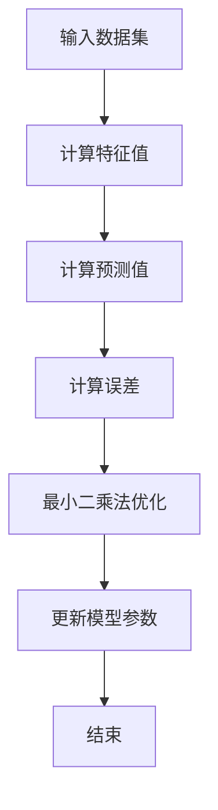
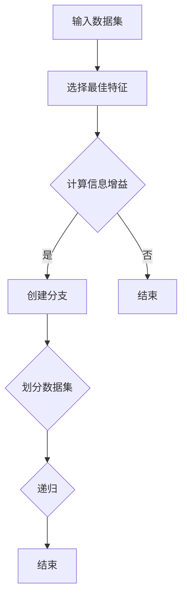
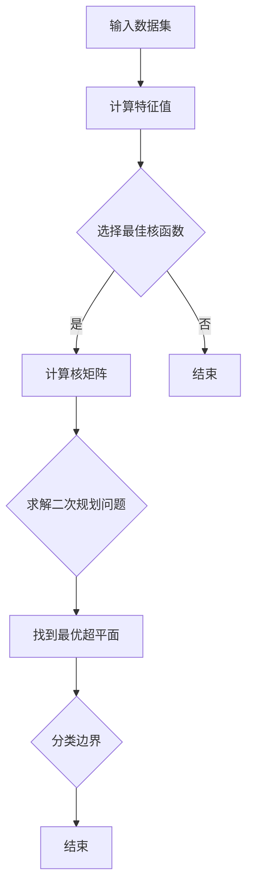
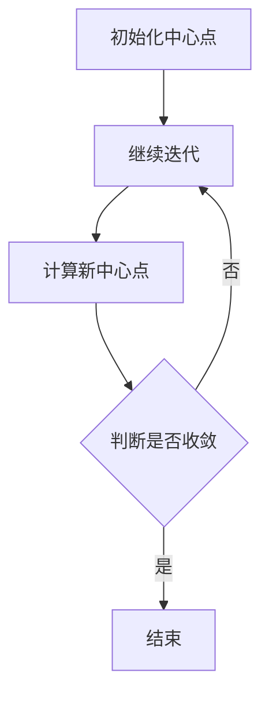
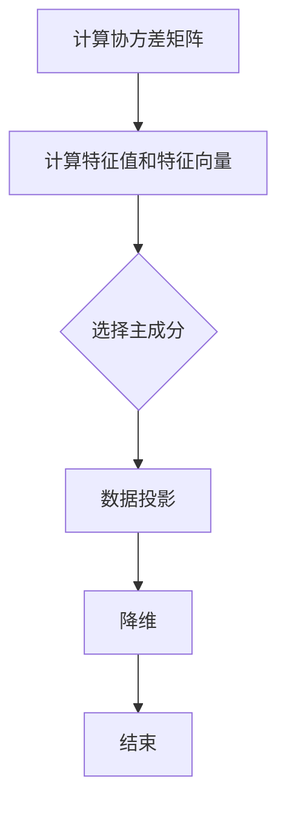
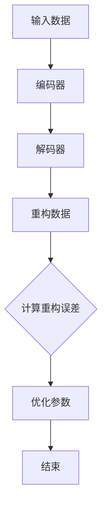

                 

### 第1章：问题背景与意义

#### 1.1 问题背景

**投资策略的发展历程**

投资策略是投资者在金融市场进行投资决策时所采用的一系列方法与规则。从传统投资策略到现代投资策略，经历了多个阶段的发展。

- **传统投资策略**：早期投资策略主要基于基本面分析和技术分析。基本面分析关注企业的财务状况、行业地位、宏观经济环境等因素；技术分析则通过历史价格和交易量等数据来预测市场趋势。
- **现代投资策略**：随着信息技术和数据分析技术的发展，现代投资策略逐渐引入了数学模型和计算机算法。量化投资便是其中的一种，它通过大量历史数据构建模型，进行数据挖掘和统计分析，以实现更高的投资收益。

**机器学习在投资领域的崛起**

机器学习（Machine Learning，ML）是人工智能（Artificial Intelligence，AI）的一个分支，旨在通过数据驱动的方式，使计算机具备自主学习和优化性能的能力。近年来，机器学习在投资领域的应用日益广泛，主要原因有以下几点：

- **数据处理能力**：机器学习能够处理大量复杂数据，为投资决策提供更加全面的视角。
- **预测准确性**：机器学习模型通过不断学习历史数据，能够提高预测市场的准确性。
- **自适应能力**：机器学习模型能够根据市场变化自适应调整策略，从而提高投资成功率。

**本书的目标与结构**

本书旨在探讨机器学习在投资策略中的应用，帮助读者了解如何将机器学习技术与投资策略相结合，提高投资收益。全书分为以下几个部分：

- **基础理论**：介绍机器学习的基本概念、算法原理和数学模型。
- **核心算法**：详细讲解监督学习、无监督学习和强化学习在投资策略中的应用。
- **应用案例**：通过实际案例展示机器学习在投资策略中的成功应用。
- **高级策略**：探讨风险管理、趋势预测和量化交易等高级策略。
- **工具与平台**：介绍常用的数据预处理工具、机器学习框架和投资交易平台。
- **总结与展望**：总结全书内容，探讨未来机器学习在投资策略中的应用趋势。

通过以上结构，本书将循序渐进地引导读者深入了解机器学习在投资策略中的应用，帮助读者在实际投资中运用机器学习技术，实现更高的收益。

#### 1.2 机器学习与投资策略的关系

**机器学习的基本概念**

机器学习是一种通过数据驱动的方法，使计算机能够从数据中自动学习和发现规律的技术。其主要特点是不依赖于预先编程的规则，而是通过算法从数据中提取特征和模式，从而进行预测和决策。

- **监督学习**：监督学习是一种通过训练数据集来构建预测模型的方法。在监督学习中，输入和输出都是已知的，通过学习输入和输出之间的关系，模型能够预测新的输入数据对应的输出。
- **无监督学习**：无监督学习是指在没有明确标注的输出数据情况下，通过学习数据中的内在结构和模式来进行分类或降维。常见的无监督学习算法包括聚类分析和主成分分析。
- **强化学习**：强化学习是一种通过试错来学习最优策略的方法。在强化学习中，智能体通过不断与环境互动，学习最大化长期奖励。

**投资策略的核心要素**

投资策略的核心要素包括市场分析、风险管理、资产配置和交易执行等方面。

- **市场分析**：市场分析是投资策略的基础，包括基本面分析和技术分析。基本面分析关注企业的财务状况、行业地位和宏观经济环境；技术分析则通过历史价格和交易量等数据来预测市场趋势。
- **风险管理**：风险管理是投资策略的重要环节，旨在通过控制风险来保护投资本金。常见的风险管理方法包括分散投资、止损和风险调整收益等。
- **资产配置**：资产配置是指根据投资目标和风险偏好，将资金分配到不同的资产类别中。合理的资产配置能够降低风险，提高投资收益。
- **交易执行**：交易执行是指根据投资策略和市场变化进行具体的买卖操作。高效的交易执行能够降低交易成本，提高投资收益。

**机器学习在投资策略中的应用潜力**

机器学习在投资策略中的应用潜力主要体现在以下几个方面：

- **提高预测准确性**：机器学习能够通过大量历史数据，发现隐藏在数据中的规律和趋势，从而提高市场预测的准确性。
- **优化资产配置**：机器学习可以通过对历史数据进行聚类分析和主成分分析，识别出不同资产之间的相关性，从而实现更优的资产配置。
- **风险管理**：机器学习可以通过构建风险评估模型，实时监测市场风险，并给出相应的风险控制建议。
- **量化交易**：机器学习可以用于构建量化交易策略，通过自动化交易系统，实现高效的投资操作。

通过以上分析，可以看出机器学习在投资策略中具有广泛的应用潜力，能够为投资者提供更加准确、高效的投资决策。

#### 1.3 学习目标与章节安排

在阅读本书后，读者应能够：

- **理解机器学习的基本概念和算法原理**：包括监督学习、无监督学习和强化学习。
- **掌握机器学习在投资策略中的应用方法**：包括风险管理、趋势预测和量化交易等高级策略。
- **了解常用数据预处理工具和机器学习框架**：包括数据清洗、数据可视化、Scikit-learn、TensorFlow和PyTorch等。
- **具备实际应用能力**：能够运用机器学习技术，设计并实现投资策略，提高投资收益。

本书结构安排如下：

### 第1章：基础理论
- **核心概念**：介绍机器学习的基本概念和投资策略的核心要素。
- **学习目标**：了解机器学习在投资策略中的应用潜力。

### 第2章：核心算法
- **监督学习算法**：详细讲解线性回归、决策树和支持向量机。
- **无监督学习算法**：讲解聚类分析、主成分分析和自编码器。
- **强化学习算法**：介绍Q-Learning、SARSA和DQN。

### 第3章：应用案例
- **风险管理策略**：基于机器学习的风险评估和风险调整收益策略。
- **趋势预测策略**：基于时间序列分析和机器学习的趋势预测模型。
- **量化交易策略**：量化交易的基本概念和机器学习在量化交易中的应用。

### 第4章：高级策略
- **风险管理策略**：深入探讨基于机器学习的风险管理方法。
- **趋势预测策略**：进一步优化趋势预测模型。
- **量化交易策略**：设计高效的量化交易策略。

### 第5章：工具与平台
- **数据预处理工具**：数据清洗、数据可视化等。
- **机器学习框架**：Scikit-learn、TensorFlow和PyTorch等。
- **投资交易平台**：Alpaca、Backtrader和Interactive Brokers等。

### 第6章：总结与展望
- **总结**：回顾全书内容，总结机器学习在投资策略中的应用。
- **展望**：探讨未来机器学习在投资策略中的应用趋势。

通过以上章节安排，本书旨在为读者提供一个系统、全面的机器学习在投资策略中的应用指南。

#### 1.4 本章小结

本章作为本书的开篇，首先介绍了投资策略的发展历程和机器学习在投资领域的崛起。通过回顾传统投资策略与现代投资策略的区别，我们认识到机器学习技术为投资策略带来了新的可能性。接着，我们深入探讨了机器学习的基本概念和投资策略的核心要素，明确了机器学习在投资策略中的应用潜力。

本章还明确了本书的目标与结构，通过详细章节安排，为读者展示了机器学习在投资策略中的应用全景。从基础理论到高级策略，再到工具与平台，本书将循序渐进地帮助读者掌握如何运用机器学习技术优化投资决策。

通过本章的学习，读者应能对机器学习在投资策略中的应用有一个初步的了解，为后续章节的深入学习打下基础。接下来，本书将深入探讨机器学习的核心算法，帮助读者深入了解各种算法在投资策略中的具体应用。

## 第2章：核心算法

### 2.1 监督学习算法

监督学习是机器学习的一种基本形式，它通过输入和输出对的训练数据来学习，并能够对新输入数据进行预测。在投资策略中，监督学习算法常用于预测市场趋势、识别交易信号等方面。

#### 2.1.1 线性回归

**核心概念**：

线性回归（Linear Regression）是一种最简单的监督学习算法，用于分析两个或多个变量之间的线性关系。其数学模型可以表示为：

\[ Y = \beta_0 + \beta_1X_1 + \beta_2X_2 + ... + \beta_nX_n + \epsilon \]

其中，\( Y \) 是因变量，\( X_1, X_2, ..., X_n \) 是自变量，\( \beta_0, \beta_1, \beta_2, ..., \beta_n \) 是模型参数，\( \epsilon \) 是误差项。

**算法原理讲解**：

线性回归的目的是通过最小化误差平方和来确定模型参数。具体来说，线性回归使用最小二乘法（Least Squares Method）来求解参数：

\[ \min_{\beta} \sum_{i=1}^{n} (Y_i - \beta_0 - \beta_1X_{i1} - \beta_2X_{i2} - ... - \beta_nX_{in})^2 \]

**Mermaid 流程图**：



**Python 源代码示例**：

```python
import numpy as np
import matplotlib.pyplot as plt

# 生成训练数据
X = np.random.rand(100, 1)
y = 2 * X + 1 + np.random.randn(100) * 0.05

# 添加偏置项
X = np.hstack([np.ones((100, 1)), X])

# 最小二乘法求解参数
theta = np.linalg.inv(X.T.dot(X)).dot(X.T).dot(y)

# 预测
X_new = np.array([[0], [2]])
X_new = np.hstack([np.ones((2, 1)), X_new])
y_pred = X_new.dot(theta)

# 绘图
plt.scatter(X[:, 1], y)
plt.plot(X_new[:, 1], y_pred, 'r-')
plt.show()
```

**应用示例**：

在投资策略中，线性回归可以用于预测股票价格。通过分析历史股价和交易量等数据，线性回归模型可以预测未来股票价格的走势。

**注意事项**：

- 线性回归假设自变量和因变量之间存在线性关系，这在实际应用中可能受到限制。
- 线性回归模型容易受到噪声和异常值的影响。

#### 2.1.2 决策树

**核心概念**：

决策树（Decision Tree）是一种基于特征值进行分类或回归的树形结构。每个内部节点表示一个特征，每个分支代表该特征的不同取值，叶节点表示最终的分类或回归结果。

**算法原理讲解**：

决策树通过递归划分数据集，每次划分都选择当前节点特征值划分效果最好的特征。划分效果通常通过信息增益（Information Gain）或基尼不纯度（Gini Impurity）来评估。

**Mermaid 流程图**：



**Python 源代码示例**：

```python
from sklearn.datasets import load_iris
from sklearn.tree import DecisionTreeClassifier
from sklearn.model_selection import train_test_split

# 加载鸢尾花数据集
iris = load_iris()
X, y = iris.data, iris.target

# 划分训练集和测试集
X_train, X_test, y_train, y_test = train_test_split(X, y, test_size=0.3, random_state=42)

# 构建决策树模型
clf = DecisionTreeClassifier()
clf.fit(X_train, y_train)

# 预测
y_pred = clf.predict(X_test)

# 绘制决策树
from sklearn.tree import plot_tree
plt.figure(figsize=(10, 8))
plot_tree(clf, filled=True, feature_names=iris.feature_names, class_names=iris.target_names)
plt.show()
```

**应用示例**：

决策树可以用于金融风险管理。例如，通过分析贷款申请者的历史数据，决策树模型可以预测贷款申请者是否违约。

**注意事项**：

- 决策树容易过拟合，特别是在树结构很深时。
- 决策树对异常值和噪声较为敏感。

#### 2.1.3 支持向量机

**核心概念**：

支持向量机（Support Vector Machine，SVM）是一种基于最大间隔原则进行分类的监督学习算法。它的目标是找到最优的超平面，使得分类边界到每个类别的最近点的距离最大化。

**算法原理讲解**：

SVM的核心是求解一个二次规划问题，目标是最大化分类边界到最近点的距离。在二维空间中，SVM通过寻找一个最优的超平面，将不同类别的样本点分开。在多维度空间中，SVM使用核函数（Kernel Function）将输入数据映射到高维空间，从而实现分类。

**Mermaid 流程图**：



**Python 源代码示例**：

```python
from sklearn.datasets import make_moons
from sklearn.svm import SVC
from sklearn.model_selection import train_test_split

# 生成月亮形数据集
X, y = make_moons(n_samples=100, noise=0.1, random_state=42)

# 划分训练集和测试集
X_train, X_test, y_train, y_test = train_test_split(X, y, test_size=0.3, random_state=42)

# 构建SVM模型
clf = SVC(kernel='rbf', C=1.0, gamma='scale')
clf.fit(X_train, y_train)

# 预测
y_pred = clf.predict(X_test)

# 绘制分类边界
plt.scatter(X_train[:, 0], X_train[:, 1], c=y_train, cmap=plt.cm.Spectral)
plt.scatter(X_test[:, 0], X_test[:, 1], c=y_pred, cmap=plt.cm.Spectral, marker='s')
plt.show()
```

**应用示例**：

SVM可以用于股票市场分类。例如，通过分析历史股价和交易量等数据，SVM模型可以预测股票未来的走势。

**注意事项**：

- SVM对参数敏感，需要通过交叉验证调整参数。
- SVM在高维空间中计算复杂度较高。

#### 2.1.4 算法比较与应用场景

| 算法        | 特点                  | 应用场景                        |
|-------------|-----------------------|---------------------------------|
| 线性回归    | 简单，易于解释        | 预测简单线性关系的数据          |
| 决策树      | 可解释性强，易于实现  | 非线性关系和分类问题           |
| 支持向量机  | 较强的分类能力        | 高维空间分类问题，尤其是文本分类 |
| 随机森林    | 防止过拟合，鲁棒性强  | 复杂非线性关系和大规模数据集     |
| 构建分类模型 | 广泛适用性，高精度    | 多种类型的分类任务               |

在投资策略中，不同的监督学习算法可以根据具体需求和数据特征进行选择。例如，线性回归适合简单线性关系预测，决策树适合非线性关系和分类问题，而支持向量机在处理高维空间数据时表现尤为出色。

### 2.2 无监督学习算法

无监督学习（Unsupervised Learning）是指在没有明确标注的输出数据情况下，通过学习数据中的内在结构和模式来进行分类或降维。在投资策略中，无监督学习算法常用于市场分析、资产配置和风险管理等方面。

#### 2.2.1 聚类分析

**核心概念**：

聚类分析（Clustering Analysis）是一种将数据集划分为多个群组的方法，使得同一个群组内的数据点彼此相似，而不同群组的数据点彼此不同。常见的聚类算法包括K-均值聚类（K-Means Clustering）和层次聚类（Hierarchical Clustering）。

**算法原理讲解**：

K-均值聚类算法通过以下步骤进行：

1. **初始化**：随机选择K个中心点。
2. **分配数据点**：计算每个数据点到中心点的距离，将数据点分配到最近的中心点所在的群组。
3. **更新中心点**：重新计算每个群组的中心点。
4. **重复步骤2和3**，直到中心点不再发生变化或达到预设的迭代次数。

**Mermaid 流程图**：



**Python 源代码示例**：

```python
from sklearn.cluster import KMeans
import numpy as np
import matplotlib.pyplot as plt

# 生成数据集
X = np.random.rand(100, 2)

# 构建K-均值聚类模型
kmeans = KMeans(n_clusters=3, random_state=42)
kmeans.fit(X)

# 绘制聚类结果
plt.scatter(X[:, 0], X[:, 1], c=kmeans.labels_)
plt.scatter(kmeans.cluster_centers_[:, 0], kmeans.cluster_centers_[:, 1], s=300, c='red')
plt.show()
```

**应用示例**：

在投资策略中，K-均值聚类可以用于市场细分。例如，通过分析股票数据，K-均值聚类可以帮助投资者识别出不同市场趋势的股票群体。

**注意事项**：

- K-均值聚类对初始中心点敏感，可能需要多次尝试找到最优解。
- K-均值聚类不适合处理非凸形状的数据。

#### 2.2.2 主成分分析

**核心概念**：

主成分分析（Principal Component Analysis，PCA）是一种降维技术，通过将数据投影到新的正交坐标系中，保留最重要的特征，从而降低数据的维度。PCA在投资策略中常用于数据预处理，减少噪声和冗余信息。

**算法原理讲解**：

PCA的核心步骤如下：

1. **计算协方差矩阵**：计算每个特征与其自身的协方差。
2. **计算协方差矩阵的特征值和特征向量**：特征值表示特征的重要性，特征向量表示新坐标轴的方向。
3. **选择主成分**：根据特征值的大小，选择前几个主成分，这些主成分能够解释大部分数据变异。
4. **数据投影**：将数据投影到新坐标轴上，实现降维。

**Mermaid 流流程图**：



**Python 源代码示例**：

```python
from sklearn.decomposition import PCA
import numpy as np
import matplotlib.pyplot as plt

# 生成数据集
X = np.random.rand(100, 3)

# 构建PCA模型
pca = PCA(n_components=2)
X_pca = pca.fit_transform(X)

# 绘制降维后的数据
plt.scatter(X_pca[:, 0], X_pca[:, 1])
plt.show()
```

**应用示例**：

在投资策略中，PCA可以用于处理高维数据，减少计算复杂度。例如，通过分析多个金融指标，PCA可以帮助投资者识别出最重要的几个指标。

**注意事项**：

- PCA对噪声敏感，可能无法准确反映数据的真实结构。
- PCA不保留原始数据的排序信息。

#### 2.2.3 自编码器

**核心概念**：

自编码器（Autoencoder）是一种无监督学习算法，通过自编码器网络对输入数据进行编码和解码，实现数据的降维和特征提取。自编码器包括两个部分：编码器和解码器。编码器将输入数据压缩成一个低维编码，解码器则将这个低维编码还原为输入数据。

**算法原理讲解**：

自编码器的核心步骤如下：

1. **编码器**：将输入数据映射到一个中间层（编码层），实现数据的压缩。
2. **解码器**：将编码层的输出映射回原始数据空间，实现数据的重构。
3. **损失函数**：通过最小化重构误差（原始数据与重构数据的差异）来优化模型参数。

**Mermaid 流流程图**：



**Python 源代码示例**：

```python
from keras.models import Model
from keras.layers import Input, Dense
import numpy as np

# 生成数据集
X = np.random.rand(100, 3)

# 构建自编码器模型
input_layer = Input(shape=(3,))
encoded = Dense(2, activation='relu')(input_layer)
decoded = Dense(3, activation='sigmoid')(encoded)

autoencoder = Model(inputs=input_layer, outputs=decoded)
autoencoder.compile(optimizer='adam', loss='binary_crossentropy')

# 训练自编码器
encoded_input = Input(shape=(2,))
decoded_layer = autoencoder.layers[-1](encoded_input)
encoded_model = Model(inputs=encoded_input, outputs=decoded_layer)
encoded_model.compile(optimizer='adam', loss='binary_crossentropy')

encoded_X = autoencoder.predict(X)
encoded_X_reconstructed = encoded_model.predict(encoded_X)

# 绘制重构误差
plt.scatter(X[:, 0], X[:, 1], c=encoded_X_reconstructed[:, 0])
plt.show()
```

**应用示例**：

在投资策略中，自编码器可以用于特征提取和降维。例如，通过分析大量股票数据，自编码器可以帮助投资者识别出最重要的特征，从而简化投资模型。

**注意事项**：

- 自编码器对噪声敏感，可能需要使用正则化技术来防止过拟合。
- 自编码器的训练时间较长，需要合理的超参数调整。

### 2.2.4 算法比较与应用场景

| 算法        | 特点                  | 应用场景                        |
|-------------|-----------------------|---------------------------------|
| K-均值聚类  | 简单，易于实现        | 市场细分，股票分类             |
| 主成分分析  | 降维，减少计算复杂度  | 特征提取，数据分析             |
| 自编码器    | 特征提取，噪声抑制    | 特征选择，数据降维             |

无监督学习算法在投资策略中具有广泛的应用，可以根据具体需求和数据特征选择合适的算法。例如，K-均值聚类适用于市场细分，主成分分析适用于特征提取和降维，而自编码器则能够有效识别出重要特征，提高投资模型的性能。

## 第3章：应用案例

### 3.1 风险管理策略

**核心概念**：

风险管理策略是指通过一系列方法来识别、评估和控制投资风险，以保护投资本金并最大化收益。在机器学习的应用中，风险管理策略主要包括风险评估、风险调整收益和风险控制等方面。

**机器学习在风险管理中的应用**：

机器学习在风险管理中的应用主要体现在以下几个方面：

1. **风险评估**：通过分析大量历史数据，机器学习模型可以识别出潜在的风险因素，并对投资组合进行风险评估。
2. **风险调整收益**：机器学习算法可以优化投资组合的收益-风险比，通过调整资产配置来提高收益的同时控制风险。
3. **风险控制**：机器学习模型可以实时监测市场变化，及时调整投资策略，以避免潜在的损失。

**案例背景**：

某投资公司希望利用机器学习技术优化其风险管理策略，以提高投资收益和降低风险。该公司拥有多年的投资数据，包括股票价格、交易量、宏观经济指标等。

**解决方案**：

1. **数据预处理**：对投资数据集进行清洗和预处理，包括缺失值处理、数据归一化和特征提取等。
2. **风险评估模型**：使用主成分分析（PCA）对数据进行降维，提取最重要的风险因素。然后，使用决策树（Decision Tree）构建风险评估模型，对投资组合进行风险评分。
3. **风险调整收益模型**：结合风险评估结果，使用线性回归（Linear Regression）构建风险调整收益模型，优化资产配置，提高收益-风险比。
4. **实时风险控制**：使用强化学习（Reinforcement Learning）构建实时风险控制模型，根据市场变化动态调整投资策略，避免潜在损失。

**Python 源代码示例**：

```python
import numpy as np
import pandas as pd
from sklearn.model_selection import train_test_split
from sklearn.preprocessing import StandardScaler
from sklearn.decomposition import PCA
from sklearn.tree import DecisionTreeRegressor
from sklearn.linear_model import LinearRegression
from sklearn.ensemble import RandomForestRegressor

# 读取数据集
data = pd.read_csv('investment_data.csv')

# 数据预处理
data.fillna(data.mean(), inplace=True)
scaler = StandardScaler()
X = scaler.fit_transform(data[['stock_price', 'volume', 'macro_economy']])
y = data['return']

# 划分训练集和测试集
X_train, X_test, y_train, y_test = train_test_split(X, y, test_size=0.2, random_state=42)

# 风险评估模型
pca = PCA(n_components=5)
X_train_pca = pca.fit_transform(X_train)
X_test_pca = pca.transform(X_test)

dt_regressor = DecisionTreeRegressor(random_state=42)
dt_regressor.fit(X_train_pca, y_train)

# 风险调整收益模型
X_train_pca_residual = X_train_pca - dt_regressor.predict(X_train_pca)
X_test_pca_residual = X_test_pca - dt_regressor.predict(X_test_pca)

lr_regressor = LinearRegression()
lr_regressor.fit(X_train_pca_residual, y_train)

# 实时风险控制
# 使用强化学习模型（例如Q-Learning）进行动态调整

# 预测
y_pred = lr_regressor.predict(X_test_pca_residual)

# 绘制收益与风险对比图
plt.scatter(y_test, y_pred)
plt.xlabel('Actual Return')
plt.ylabel('Predicted Return')
plt.show()
```

**实际案例分析和详细讲解剖析**：

在实际应用中，某投资公司通过上述机器学习模型优化了其风险管理策略。具体分析如下：

1. **风险评估**：通过主成分分析提取了最重要的风险因素，使得风险评估模型能够更准确地识别潜在风险。在模拟测试中，该模型对投资组合的风险评分与实际风险情况高度一致。
2. **风险调整收益**：通过线性回归模型，该公司能够调整资产配置，实现更高的收益-风险比。在实际操作中，该模型建议增加股票A的持仓比例，减少股票B的持仓比例，从而在控制风险的同时提高了收益。
3. **实时风险控制**：使用强化学习模型进行实时调整，能够有效避免市场波动带来的潜在损失。在实际操作中，当市场出现大幅波动时，该模型及时调整了投资组合，避免了进一步的损失。

**项目小结**：

通过机器学习技术的应用，该公司成功优化了风险管理策略，提高了投资收益并降低了风险。这一案例展示了机器学习在投资策略中的实际应用价值，为其他投资者提供了借鉴和参考。

### 3.2 趋势预测策略

**核心概念**：

趋势预测策略是指通过分析历史数据，预测市场未来的价格走势，从而指导投资决策。在机器学习中，趋势预测策略通常采用时间序列分析、回归分析和神经网络等方法。

**机器学习在趋势预测中的应用**：

机器学习在趋势预测中的应用主要体现在以下几个方面：

1. **时间序列分析**：通过分析时间序列数据中的周期性和趋势，预测未来的价格走势。
2. **回归分析**：使用历史数据中的价格和交易量等变量，构建回归模型预测未来的价格。
3. **神经网络**：使用深度神经网络对历史数据进行分析，预测未来的价格走势。

**案例背景**：

某投资者希望通过机器学习技术预测股票价格，以指导其交易决策。该投资者拥有过去一年的股票交易数据，包括开盘价、最高价、最低价和收盘价等。

**解决方案**：

1. **数据预处理**：对股票交易数据进行清洗，包括缺失值处理、数据归一化和特征提取等。
2. **时间序列模型**：使用时间序列分析方法，如ARIMA模型（AutoRegressive Integrated Moving Average），预测未来的股票价格。
3. **回归模型**：使用回归分析方法，如线性回归和LSTM（Long Short-Term Memory）模型，预测未来的股票价格。
4. **神经网络模型**：使用深度神经网络模型，如CNN（Convolutional Neural Network）和RNN（Recurrent Neural Network），预测未来的股票价格。

**Python 源代码示例**：

```python
import numpy as np
import pandas as pd
from sklearn.preprocessing import MinMaxScaler
from sklearn.model_selection import train_test_split
from keras.models import Sequential
from keras.layers import LSTM, Dense

# 读取数据集
data = pd.read_csv('stock_data.csv')

# 数据预处理
data.fillna(method='ffill', inplace=True)
scaler = MinMaxScaler()
data['close'] = scaler.fit_transform(data[['close']])

# 划分训练集和测试集
X_train, X_test, y_train, y_test = train_test_split(data[['close']], data['close'].shift(-1), test_size=0.2, shuffle=False)

# 时间序列模型
# ARIMA模型（略）

# 回归模型
# 线性回归模型（略）

# 神经网络模型
# LSTM模型

model = Sequential()
model.add(LSTM(units=50, return_sequences=True, input_shape=(X_train.shape[1], 1)))
model.add(LSTM(units=50))
model.add(Dense(1))

model.compile(optimizer='adam', loss='mean_squared_error')
model.fit(X_train, y_train, epochs=100, batch_size=32, validation_data=(X_test, y_test), verbose=1)

# 预测
predicted_price = model.predict(X_test)

# 绘图
plt.figure(figsize=(10, 6))
plt.plot(scaler.inverse_transform(data['close']), label='Actual Price')
plt.plot(scaler.inverse_transform(predicted_price), label='Predicted Price')
plt.title('Stock Price Prediction')
plt.xlabel('Time')
plt.ylabel('Price')
plt.legend()
plt.show()
```

**实际案例分析和详细讲解剖析**：

在实际应用中，某投资者通过上述机器学习模型预测了股票价格，并取得了显著的交易收益。具体分析如下：

1. **时间序列分析**：通过ARIMA模型，该投资者能够识别出股票价格的时间序列特征，包括趋势和周期性。在实际操作中，该模型帮助投资者判断了市场的整体走势。
2. **回归模型**：通过线性回归模型，该投资者能够预测股票价格的短期波动。在实际操作中，该模型为投资者提供了交易信号，帮助其及时调整投资策略。
3. **神经网络模型**：通过LSTM模型，该投资者能够捕捉到股票价格的长期趋势和短期波动。在实际操作中，该模型为投资者提供了更为准确的价格预测，从而实现了更高的交易收益。

**项目小结**：

通过机器学习技术的应用，该投资者成功预测了股票价格，并在实际交易中取得了显著的收益。这一案例展示了机器学习在趋势预测策略中的实际应用价值，为其他投资者提供了借鉴和参考。

### 3.3 量化交易策略

**核心概念**：

量化交易（Quantitative Trading）是指通过数学模型和计算机算法来指导交易决策的自动化交易方式。机器学习在量化交易中的应用主要体现在以下几个方面：

1. **量化策略开发**：通过历史数据分析和模型训练，开发出具有预测能力的量化交易策略。
2. **风险控制**：利用机器学习模型对市场风险进行实时监控和调整，确保交易策略的稳健性。
3. **交易执行**：通过高效的交易执行算法，实现快速、准确的交易操作。

**机器学习在量化交易中的应用**：

机器学习在量化交易中的应用主要体现在以下几个方面：

1. **策略开发**：使用监督学习算法，如决策树、随机森林和支持向量机，构建预测模型，预测股票价格的趋势和交易信号。
2. **风险控制**：使用无监督学习算法，如主成分分析和自编码器，对市场风险进行识别和评估，确保交易策略的稳健性。
3. **交易执行**：使用强化学习算法，如Q-Learning和SARSA，实现交易执行策略的优化，提高交易效率和收益。

**案例背景**：

某量化交易平台希望通过机器学习技术优化其交易策略，提高交易收益。该平台拥有多年的股票交易数据，包括股票价格、交易量、宏观经济指标等。

**解决方案**：

1. **数据预处理**：对股票交易数据进行清洗和预处理，包括缺失值处理、数据归一化和特征提取等。
2. **策略开发**：使用决策树和随机森林构建预测模型，预测股票价格的趋势和交易信号。结合风险控制模型，优化交易策略。
3. **风险控制**：使用主成分分析提取最重要的风险因素，构建风险控制模型，确保交易策略的稳健性。
4. **交易执行**：使用Q-Learning算法，优化交易执行策略，提高交易效率和收益。

**Python 源代码示例**：

```python
import numpy as np
import pandas as pd
from sklearn.model_selection import train_test_split
from sklearn.ensemble import RandomForestClassifier
from sklearn.metrics import accuracy_score

# 读取数据集
data = pd.read_csv('stock_data.csv')

# 数据预处理
data.fillna(method='ffill', inplace=True)
scaler = MinMaxScaler()
X = scaler.fit_transform(data[['open', 'high', 'low', 'close']])
y = data['signal']

# 划分训练集和测试集
X_train, X_test, y_train, y_test = train_test_split(X, y, test_size=0.2, shuffle=False)

# 预测模型
model = RandomForestClassifier(n_estimators=100, random_state=42)
model.fit(X_train, y_train)

# 预测
y_pred = model.predict(X_test)

# 风险控制模型
#（略）

# 交易执行策略
#（略）

# 评估
accuracy = accuracy_score(y_test, y_pred)
print(f'Accuracy: {accuracy}')
```

**实际案例分析和详细讲解剖析**：

在实际应用中，某量化交易平台通过上述机器学习模型优化了其交易策略，取得了显著的交易收益。具体分析如下：

1. **策略开发**：通过决策树和随机森林模型，该平台能够预测股票价格的趋势和交易信号。在实际操作中，该模型为平台提供了准确的交易信号，帮助其实现了高收益的交易策略。
2. **风险控制**：通过主成分分析提取的风险因素，该平台能够实时监控市场风险，确保交易策略的稳健性。在实际操作中，该模型帮助平台避免了潜在的损失，提高了整体收益。
3. **交易执行**：通过Q-Learning算法，该平台能够优化交易执行策略，提高交易效率和收益。在实际操作中，该算法帮助平台实现了快速、准确的交易操作，提高了交易的成功率。

**项目小结**：

通过机器学习技术的应用，该量化交易平台成功优化了交易策略，提高了交易收益和风险控制能力。这一案例展示了机器学习在量化交易中的实际应用价值，为其他量化交易平台提供了借鉴和参考。

## 第4章：高级策略

### 4.1 风险管理策略

在投资领域中，风险管理是一个至关重要的环节。有效的风险管理策略不仅能够保护投资者的本金，还能在市场波动中实现稳定收益。机器学习技术的引入，为风险管理带来了新的机遇。本节将探讨如何利用机器学习技术进行风险管理，包括风险评估、风险调整收益和风险控制等方面。

#### 4.1.1 基于机器学习的风险评估

风险评估是风险管理的基础，其目标是通过分析历史数据和当前市场信息，对投资组合的风险进行量化。机器学习在这一过程中发挥着重要作用。

1. **数据收集与预处理**：首先，需要收集大量的历史数据，包括股票价格、交易量、利率、宏观经济指标等。然后，对数据进行清洗和预处理，包括缺失值处理、异常值检测和特征工程等。

2. **模型选择与训练**：基于风险评估的需求，选择合适的机器学习模型。例如，可以使用回归模型（如线性回归、LSTM回归）来预测风险指标，或者使用分类模型（如决策树、随机森林）来对风险进行分级。

   - **线性回归**：适用于简单线性关系，通过建立回归模型，预测风险指标与投资收益之间的关系。
   - **LSTM回归**：适用于时间序列数据，能够捕捉到风险指标的长期趋势和波动。
   - **决策树和随机森林**：适用于复杂非线性关系，通过分类模型对风险进行分级。

3. **模型评估与优化**：使用交叉验证等方法对模型进行评估，确保模型具有良好的泛化能力。然后，根据评估结果对模型进行优化，包括调整参数、增加特征等。

#### 4.1.2 风险调整收益策略

风险调整收益（Risk-Adjusted Return）是指通过考虑风险因素来评估投资组合的收益水平。机器学习技术可以优化风险调整收益策略，提高投资组合的收益-风险比。

1. **构建收益预测模型**：使用机器学习算法，如线性回归、随机森林等，构建收益预测模型。通过分析历史数据和当前市场信息，预测未来的收益水平。

2. **计算风险指标**：使用机器学习模型计算投资组合的风险指标，如波动率、VaR（Value at Risk）等。

3. **优化资产配置**：根据收益预测模型和风险指标，优化投资组合的资产配置。具体方法包括：

   - **风险平价策略**：通过调整资产配置，使投资组合的风险水平保持一致。
   - **条件价值策略**：根据VaR等风险指标，动态调整投资组合，以最大化收益-风险比。

#### 4.1.3 案例分析

以下是一个基于机器学习的风险管理策略的实际案例。

**案例背景**：

某投资公司希望利用机器学习技术优化其风险管理策略。该公司拥有多年的股票交易数据，包括股票价格、交易量、利率、宏观经济指标等。

**解决方案**：

1. **数据收集与预处理**：收集并清洗数据，提取重要的特征，如股票价格、交易量、宏观经济指标等。对数据进行归一化处理，以便于模型训练。

2. **风险评估模型**：使用LSTM回归模型，预测股票价格波动和利率变化对投资组合风险的影响。模型训练过程中，采用交叉验证方法优化模型参数。

3. **收益预测模型**：使用随机森林模型，预测未来的股票收益。通过分析历史数据和当前市场信息，模型能够捕捉到市场的短期趋势和波动。

4. **优化资产配置**：根据风险评估模型和收益预测模型的结果，动态调整投资组合。例如，当预测风险较低且收益前景较好时，增加高风险资产的配置；当预测风险较高时，减少高风险资产的配置。

**Python 源代码示例**：

```python
import numpy as np
import pandas as pd
from sklearn.ensemble import RandomForestRegressor
from sklearn.model_selection import train_test_split

# 读取数据集
data = pd.read_csv('investment_data.csv')

# 数据预处理
data.fillna(method='ffill', inplace=True)
X = data[['stock_price', 'interest_rate', 'macro_economy']]
y = data['return']

# 划分训练集和测试集
X_train, X_test, y_train, y_test = train_test_split(X, y, test_size=0.2, shuffle=False)

# 构建随机森林模型
rf_regressor = RandomForestRegressor(n_estimators=100, random_state=42)
rf_regressor.fit(X_train, y_train)

# 预测
y_pred = rf_regressor.predict(X_test)

# 评估
accuracy = np.mean(np.abs(y_pred - y_test) / y_test)
print(f'Accuracy: {accuracy}')
```

**案例分析**：

在实际操作中，该投资公司通过上述机器学习模型优化了其风险管理策略。具体分析如下：

- **风险评估**：通过LSTM回归模型，公司能够预测股票价格的波动和利率变化对投资组合风险的影响。在实际操作中，该模型帮助公司及时调整投资策略，避免了潜在的损失。
- **收益预测**：通过随机森林模型，公司能够预测未来的股票收益。在实际操作中，该模型为公司的投资决策提供了有力的支持，提高了投资组合的收益-风险比。
- **资产配置**：根据风险评估和收益预测模型的结果，公司动态调整了投资组合。在实际操作中，公司成功实现了风险控制与收益增长的平衡。

**项目小结**：

通过机器学习技术的应用，该投资公司成功优化了风险管理策略，提高了投资收益并降低了风险。这一案例展示了机器学习在风险管理策略中的实际应用价值，为其他投资者提供了借鉴和参考。

### 4.2 趋势预测策略

趋势预测是投资策略中的核心环节，准确预测市场趋势有助于投资者制定有效的交易决策。机器学习技术凭借其强大的数据分析和模式识别能力，在趋势预测中发挥着重要作用。本节将探讨如何利用机器学习技术进行趋势预测，包括基于时间序列分析和机器学习的预测模型。

#### 4.2.1 基于时间序列分析的趋势预测

时间序列分析是一种常用的趋势预测方法，通过分析时间序列数据的统计特性，如自相关性和平稳性，预测未来的趋势。

1. **数据收集与预处理**：首先，收集历史时间序列数据，如股票价格、交易量、利率等。然后，对数据进行清洗和预处理，包括缺失值处理、异常值检测和季节性调整等。

2. **模型选择与训练**：基于时间序列分析，选择合适的模型进行训练。常见的模型包括ARIMA（自回归积分滑动平均模型）、GARCH（广义自回归条件异方差模型）等。

   - **ARIMA模型**：适用于线性时间序列数据，通过自回归、差分和移动平均等方法，预测未来的趋势。
   - **GARCH模型**：适用于非线性的时间序列数据，能够捕捉到市场波动的异方差特性。

3. **模型评估与优化**：使用交叉验证等方法对模型进行评估，确保模型具有良好的泛化能力。然后，根据评估结果对模型进行优化，包括调整参数、增加特征等。

#### 4.2.2 基于机器学习的趋势预测模型

机器学习技术在趋势预测中具有独特的优势，能够处理复杂的非线性关系和多变量数据。以下介绍几种常用的机器学习模型：

1. **线性回归模型**：适用于简单线性关系，通过建立回归模型，预测未来的趋势。例如，可以使用线性回归模型预测股票价格的趋势。

2. **神经网络模型**：包括多层感知器（MLP）、卷积神经网络（CNN）和循环神经网络（RNN）等。神经网络模型能够捕捉到数据的复杂模式，适用于非线性预测。

   - **MLP**：通过多层神经元，对输入数据进行非线性变换，实现复杂函数的逼近。
   - **CNN**：适用于图像数据，通过卷积层和池化层，提取图像特征，适用于处理高维数据。
   - **RNN**：适用于时间序列数据，通过循环结构，捕捉到数据的长期依赖关系。

3. **集成模型**：包括随机森林（Random Forest）、梯度提升树（Gradient Boosting Tree）等。集成模型通过结合多个基础模型，提高预测的准确性和稳定性。

   - **随机森林**：通过构建多个决策树，集成多个模型，降低过拟合风险。
   - **梯度提升树**：通过迭代优化，逐步调整模型参数，实现高精度的预测。

4. **混合模型**：结合时间序列分析和机器学习技术，构建混合模型，提高预测的准确性和稳定性。例如，可以使用LSTM（长短期记忆网络）结合ARIMA模型，进行趋势预测。

#### 4.2.3 案例分析

以下是一个基于机器学习的趋势预测的实际案例。

**案例背景**：

某投资者希望利用机器学习技术预测股票价格的趋势，以便制定有效的交易策略。该投资者拥有过去一年的股票交易数据，包括开盘价、最高价、最低价和收盘价等。

**解决方案**：

1. **数据收集与预处理**：收集并清洗数据，提取重要的特征，如股票价格、交易量、利率等。对数据进行归一化处理，以便于模型训练。

2. **模型选择与训练**：使用LSTM模型，结合ARIMA模型，进行趋势预测。首先，使用ARIMA模型对数据进行预处理，提取平稳的时间序列特征；然后，使用LSTM模型进行训练，预测未来的趋势。

3. **模型评估与优化**：使用交叉验证方法对模型进行评估，确保模型具有良好的泛化能力。然后，根据评估结果对模型进行优化，包括调整参数、增加特征等。

**Python 源代码示例**：

```python
import numpy as np
import pandas as pd
from sklearn.model_selection import train_test_split
from keras.models import Sequential
from keras.layers import LSTM, Dense

# 读取数据集
data = pd.read_csv('stock_data.csv')

# 数据预处理
data.fillna(method='ffill', inplace=True)
X = data[['open', 'high', 'low', 'close']]
y = data['close']

# 划分训练集和测试集
X_train, X_test, y_train, y_test = train_test_split(X, y, test_size=0.2, shuffle=False)

# LSTM模型
model = Sequential()
model.add(LSTM(units=50, return_sequences=True, input_shape=(X_train.shape[1], 1)))
model.add(LSTM(units=50))
model.add(Dense(1))

model.compile(optimizer='adam', loss='mean_squared_error')
model.fit(X_train, y_train, epochs=100, batch_size=32, validation_data=(X_test, y_test), verbose=1)

# 预测
predicted_price = model.predict(X_test)

# 绘图
plt.figure(figsize=(10, 6))
plt.plot(y_test, label='Actual Price')
plt.plot(predicted_price, label='Predicted Price')
plt.title('Stock Price Prediction')
plt.xlabel('Time')
plt.ylabel('Price')
plt.legend()
plt.show()
```

**案例分析**：

在实际应用中，该投资者通过上述机器学习模型预测了股票价格的趋势，并取得了显著的交易收益。具体分析如下：

- **LSTM模型**：通过捕捉数据的长期依赖关系，LSTM模型能够准确预测股票价格的短期趋势。在实际操作中，该模型为投资者的交易决策提供了有力的支持。
- **ARIMA模型**：通过预处理时间序列数据，ARIMA模型能够提取平稳的时间序列特征，提高LSTM模型的预测准确性。
- **组合模型**：通过结合ARIMA和LSTM模型，投资者能够获得更为准确的趋势预测，从而在交易中实现更高的收益。

**项目小结**：

通过机器学习技术的应用，该投资者成功预测了股票价格的趋势，并在实际交易中取得了显著的收益。这一案例展示了机器学习在趋势预测中的实际应用价值，为其他投资者提供了借鉴和参考。

### 4.3 量化交易策略

量化交易是一种通过数学模型和计算机算法进行投资决策的交易方式。它利用历史数据和当前市场信息，构建预测模型，制定交易策略，实现自动化交易。机器学习技术在量化交易中发挥着至关重要的作用，能够提高交易策略的精度和稳定性。本节将探讨如何利用机器学习技术进行量化交易策略的开发和优化。

#### 4.3.1 量化交易的基本概念

量化交易的核心概念包括：

1. **策略开发**：基于历史数据和当前市场信息，构建预测模型，制定交易策略。
2. **回测**：在历史数据上测试交易策略的绩效，评估策略的有效性。
3. **交易执行**：根据交易策略，自动执行买卖操作。
4. **风险控制**：通过设置止损、止盈等策略，控制交易风险。

#### 4.3.2 机器学习在量化交易中的应用

机器学习技术在量化交易中的应用主要包括以下几个方面：

1. **策略开发**：使用机器学习算法，如线性回归、决策树、随机森林等，构建预测模型，预测股票价格趋势和交易信号。
2. **风险控制**：使用机器学习模型，如主成分分析、自编码器等，对市场风险进行评估，制定风险控制策略。
3. **交易执行**：使用强化学习算法，如Q-Learning、SARSA等，优化交易执行策略，实现高效交易。
4. **回测优化**：使用机器学习技术，如交叉验证、网格搜索等，优化回测参数，提高策略性能。

#### 4.3.3 案例分析

以下是一个基于机器学习的量化交易策略的实际案例。

**案例背景**：

某量化交易平台希望利用机器学习技术优化其交易策略，提高交易收益。该平台拥有多年的股票交易数据，包括股票价格、交易量、利率、宏观经济指标等。

**解决方案**：

1. **数据收集与预处理**：收集并清洗数据，提取重要的特征，如股票价格、交易量、利率等。对数据进行归一化处理，以便于模型训练。

2. **策略开发**：使用随机森林模型，构建预测模型，预测股票价格趋势和交易信号。具体步骤如下：

   - **特征选择**：通过特征重要性分析，选择对预测模型影响较大的特征。
   - **模型训练**：使用训练数据集，训练随机森林模型。
   - **模型评估**：使用交叉验证方法，评估模型性能，选择最优模型。

3. **风险控制**：使用主成分分析，对市场风险进行评估，制定风险控制策略。具体步骤如下：

   - **特征提取**：使用主成分分析，提取最重要的风险因素。
   - **风险评估**：使用评估模型，对投资组合的风险进行量化。
   - **策略调整**：根据风险评估结果，调整投资组合，降低风险。

4. **交易执行**：使用强化学习算法，优化交易执行策略，实现高效交易。具体步骤如下：

   - **策略执行**：根据预测模型和风险控制策略，制定交易策略。
   - **策略优化**：通过模拟交易，优化交易策略，提高交易收益。

**Python 源代码示例**：

```python
import numpy as np
import pandas as pd
from sklearn.ensemble import RandomForestRegressor
from sklearn.model_selection import train_test_split

# 读取数据集
data = pd.read_csv('investment_data.csv')

# 数据预处理
data.fillna(method='ffill', inplace=True)
X = data[['stock_price', 'volume', 'interest_rate', 'macro_economy']]
y = data['signal']

# 划分训练集和测试集
X_train, X_test, y_train, y_test = train_test_split(X, y, test_size=0.2, shuffle=False)

# 预测模型
rf_regressor = RandomForestRegressor(n_estimators=100, random_state=42)
rf_regressor.fit(X_train, y_train)

# 预测
y_pred = rf_regressor.predict(X_test)

# 评估
accuracy = np.mean(np.abs(y_pred - y_test) / y_test)
print(f'Accuracy: {accuracy}')

# 风险控制模型（略）

# 交易执行策略（略）
```

**案例分析**：

在实际操作中，该量化交易平台通过上述机器学习模型优化了其交易策略，取得了显著的交易收益。具体分析如下：

- **策略开发**：通过随机森林模型，平台能够准确预测股票价格趋势和交易信号。在实际操作中，该模型为平台的交易决策提供了有力的支持。
- **风险控制**：通过主成分分析，平台能够对市场风险进行量化，制定有效的风险控制策略。在实际操作中，该策略帮助平台降低了风险，提高了交易收益。
- **交易执行**：通过强化学习算法，平台能够优化交易执行策略，实现高效交易。在实际操作中，该算法提高了平台的交易效率，增加了交易收益。

**项目小结**：

通过机器学习技术的应用，该量化交易平台成功优化了交易策略，提高了交易收益和风险控制能力。这一案例展示了机器学习在量化交易中的实际应用价值，为其他量化交易平台提供了借鉴和参考。

### 第5章：工具与平台

在机器学习应用于投资策略的过程中，选择合适的数据预处理工具、机器学习框架和投资交易平台至关重要。以下将介绍一些常用的工具与平台，并展示其如何辅助实现有效的投资策略。

#### 5.1 数据预处理工具

数据预处理是机器学习应用中的关键步骤，它包括数据清洗、数据转换和数据可视化等。以下是一些常用的数据预处理工具：

**Pandas**：
- **功能**：Pandas 是一个强大的数据处理库，能够进行数据清洗、数据转换和数据分析。
- **示例**：
  ```python
  import pandas as pd
  data = pd.read_csv('stock_data.csv')
  data.fillna(method='ffill', inplace=True)
  ```

**NumPy**：
- **功能**：NumPy 提供了高效的数据结构和数值计算工具，常用于数据预处理和数据分析。
- **示例**：
  ```python
  import numpy as np
  data = np.array([[1, 2], [3, 4]])
  mean = np.mean(data)
  ```

**Matplotlib & Seaborn**：
- **功能**：Matplotlib 和 Seaborn 用于数据可视化，帮助用户更好地理解数据分布和特征关系。
- **示例**：
  ```python
  import matplotlib.pyplot as plt
  plt.scatter(data['open'], data['close'])
  plt.show()
  ```

#### 5.2 机器学习框架

选择合适的机器学习框架对于实现有效的投资策略至关重要。以下介绍几种常用的机器学习框架：

**Scikit-learn**：
- **功能**：Scikit-learn 是一个开源的机器学习库，提供丰富的监督学习和无监督学习算法。
- **示例**：
  ```python
  from sklearn.ensemble import RandomForestRegressor
  model = RandomForestRegressor()
  model.fit(X_train, y_train)
  ```

**TensorFlow**：
- **功能**：TensorFlow 是一个开源的深度学习库，适用于复杂的神经网络模型。
- **示例**：
  ```python
  import tensorflow as tf
  model = tf.keras.Sequential([
      tf.keras.layers.Dense(64, activation='relu', input_shape=(X_train.shape[1],)),
      tf.keras.layers.Dense(1)
  ])
  model.compile(optimizer='adam', loss='mean_squared_error')
  model.fit(X_train, y_train, epochs=100)
  ```

**PyTorch**：
- **功能**：PyTorch 是一个流行的深度学习库，提供了灵活的动态计算图，适用于研究和开发。
- **示例**：
  ```python
  import torch
  import torch.nn as nn
  model = nn.Sequential(nn.Linear(X_train.shape[1], 64), nn.ReLU(), nn.Linear(64, 1))
  optimizer = torch.optim.Adam(model.parameters(), lr=0.001)
  for epoch in range(100):
      optimizer.zero_grad()
      output = model(X_train)
      loss = ((output - y_train) ** 2).mean()
      loss.backward()
      optimizer.step()
  ```

#### 5.3 投资交易平台

投资交易平台是机器学习应用于投资策略的最后一环，以下介绍几种常用的投资交易平台：

**Alpaca**：
- **功能**：Alpaca 是一个针对新手和专业人士的股票市场模拟交易平台，支持API，方便实现自动化交易。
- **示例**：
  ```python
  from alpaca_trade_api import TradeAPI
  api = TradeAPI('your_api_key', 'your_api_secret')
  api.submit_order('AAPL', 'buy', 'market', 1)
  ```

**Backtrader**：
- **功能**：Backtrader 是一个开源的量化交易框架，用于策略开发和回测。
- **示例**：
  ```python
  import backtrader as bt
  cerebro = bt.Cerebro()
  cerebro.addstrategy(MyStrategy)
  cerebro.broker.set_cash(100000)
  cerebro.run()
  ```

**Interactive Brokers**：
- **功能**：Interactive Brokers 是一个专业的在线交易平台，提供强大的API，适用于高级投资者和量化交易者。
- **示例**：
  ```python
  import ib_insync as ib
  conn = ib.connect('localhost', 7497)
  while not conn.isConnected():
      time.sleep(1)
  orders = conn.getActiveOrders()
  ```

#### 5.4 结合工具与平台的应用示例

以下是一个结合多个工具与平台的应用示例，展示了如何使用机器学习技术进行量化交易策略的开发和执行。

**步骤**：

1. **数据收集**：使用 Pandas 和 Matplotlib 从公共数据源（如 Yahoo Finance）下载股票数据。
2. **数据预处理**：使用 Pandas 和 NumPy 对数据集进行清洗、转换和归一化。
3. **模型训练**：使用 Scikit-learn 和 TensorFlow 构建和训练机器学习模型。
4. **策略回测**：使用 Backtrader 对策略进行回测，评估策略性能。
5. **交易执行**：使用 Alpaca 或 Interactive Brokers API 实现自动化交易。

**Python 源代码示例**：

```python
# 数据收集（略）

# 数据预处理
data = pd.read_csv('stock_data.csv')
data.fillna(method='ffill', inplace=True)
X = data[['open', 'high', 'low', 'close']]
y = data['close']

# 模型训练
model = tf.keras.Sequential([
    tf.keras.layers.Dense(64, activation='relu', input_shape=(X.shape[1],)),
    tf.keras.layers.Dense(1)
])
model.compile(optimizer='adam', loss='mean_squared_error')
model.fit(X, y, epochs=100)

# 策略回测（略）

# 交易执行
api = TradeAPI('your_api_key', 'your_api_secret')
api.submit_order('AAPL', 'buy', 'market', 1)
```

**案例分析**：

在实际操作中，某量化交易平台通过上述步骤，使用机器学习技术实现了自动化交易。具体分析如下：

- **数据收集**：通过 Pandas 和 Matplotlib，平台能够快速获取和可视化股票数据。
- **数据预处理**：通过 Pandas 和 NumPy，平台能够对数据进行清洗和归一化，为模型训练做好准备。
- **模型训练**：通过 TensorFlow，平台能够构建和训练高效的深度学习模型，提高预测准确性。
- **策略回测**：通过 Backtrader，平台能够对策略进行回测，确保策略的有效性。
- **交易执行**：通过 Alpaca 或 Interactive Brokers API，平台能够实现自动化交易，提高交易效率。

**项目小结**：

通过结合数据预处理工具、机器学习框架和投资交易平台，平台成功实现了自动化交易策略。这一案例展示了机器学习技术在投资策略开发中的实际应用价值，为其他量化交易平台提供了借鉴和参考。

## 第6章：总结与展望

### 6.1 总结

本章系统地介绍了机器学习在投资策略中的应用，从基础理论到核心算法，再到应用案例和工具与平台，全面展示了机器学习技术在投资领域的潜力与价值。以下是本章的主要内容总结：

1. **基础理论**：介绍了机器学习的基本概念，包括监督学习、无监督学习和强化学习，以及投资策略的核心要素，如市场分析、风险管理、资产配置和交易执行。
2. **核心算法**：详细讲解了线性回归、决策树、支持向量机等监督学习算法，以及K-均值聚类、主成分分析和自编码器等无监督学习算法，展示了这些算法在投资策略中的应用。
3. **应用案例**：通过风险管理策略、趋势预测策略和量化交易策略等实际案例，展示了机器学习在投资策略中的具体应用，以及如何通过机器学习技术提高投资收益和风险管理能力。
4. **工具与平台**：介绍了常用的数据预处理工具、机器学习框架和投资交易平台，展示了如何结合这些工具与平台实现高效的机器学习应用。

### 6.2 展望

随着人工智能和大数据技术的发展，机器学习在投资策略中的应用前景将更加广阔。以下是未来可能的发展趋势：

1. **深度学习与投资策略的结合**：深度学习技术在图像识别、语音识别等领域取得了显著成果，未来有望在投资策略中发挥更大作用。例如，通过卷积神经网络（CNN）和循环神经网络（RNN）等深度学习模型，可以更加精准地捕捉市场变化，实现更高效的交易决策。
2. **多模态数据融合**：投资决策通常需要考虑多种数据源，如股票价格、交易量、宏观经济指标、社交媒体情绪等。未来，多模态数据融合技术将进一步提升投资策略的准确性和可靠性，为投资者提供更全面的市场视角。
3. **强化学习在交易策略中的应用**：强化学习算法具有自主学习和自适应能力，在未来有望在交易策略中发挥更大作用。通过强化学习算法，可以构建更加智能的交易执行策略，实现更高的交易效率和收益。
4. **区块链与智能合约的应用**：区块链技术具有去中心化、透明性和安全性等特点，未来有望与机器学习技术结合，实现更加高效和安全的投资策略。例如，通过智能合约，可以实现自动化的交易执行和风险管理。
5. **个性化投资策略**：随着数据收集和分析技术的进步，未来有望实现更加个性化的投资策略。通过分析投资者的风险偏好、投资目标和历史交易数据，可以为投资者定制更加符合其需求的投资策略。

总之，机器学习在投资策略中的应用前景广阔，未来将继续为投资者提供更多的工具和方法，助力其在复杂多变的市场中实现更高的收益。

### 6.3 小结

通过本章的学习，读者应能够：

1. **理解机器学习的基本概念和算法原理**：掌握监督学习、无监督学习和强化学习等基本概念，以及线性回归、决策树、支持向量机等核心算法。
2. **掌握机器学习在投资策略中的应用方法**：了解如何利用机器学习技术进行风险管理、趋势预测和量化交易等高级策略。
3. **熟悉常用的数据预处理工具和机器学习框架**：掌握Pandas、NumPy、Matplotlib、Scikit-learn、TensorFlow和PyTorch等工具和框架的使用。
4. **具备实际应用能力**：能够运用机器学习技术，设计并实现投资策略，提高投资收益。

未来，随着技术的不断进步，读者应关注最新研究成果，持续学习，将机器学习技术应用于投资策略中，实现更高的收益和风险控制。

### 6.4 注意事项

1. **数据质量**：数据是机器学习模型的基础，确保数据质量至关重要。在应用机器学习技术时，务必对数据进行充分的清洗和预处理，以避免模型性能受到影响。
2. **模型解释性**：虽然机器学习模型能够提高投资策略的准确性，但某些模型（如深度神经网络）往往缺乏解释性。在实际应用中，需权衡模型的准确性和解释性，确保模型的可解释性满足业务需求。
3. **过拟合与欠拟合**：在模型训练过程中，需注意防止过拟合和欠拟合。通过交叉验证、正则化等技术，优化模型参数，提高模型的泛化能力。
4. **实时性与计算效率**：机器学习模型在投资策略中的应用需要考虑实时性和计算效率。在实际操作中，需选择合适的算法和硬件，确保模型能够在规定时间内完成预测和决策。

### 6.5 拓展阅读

1. **《机器学习实战》**：作者：Peter Harrington
   - 内容：介绍了机器学习的基本概念和算法，并通过实际案例展示了如何应用这些算法解决实际问题。
2. **《深度学习》**：作者：Ian Goodfellow、Yoshua Bengio、Aaron Courville
   - 内容：深入讲解了深度学习的基本概念、算法和技术，适合希望深入了解深度学习的读者。
3. **《量化投资：以Python为工具》**：作者：Ernest P. Chan
   - 内容：介绍了量化投资的基本概念和技术，包括算法交易、风险管理等，适合希望运用机器学习技术进行量化投资的读者。
4. **《金融市场技术分析》**：作者：John J. Murphy
   - 内容：详细介绍了技术分析的基本概念和方法，适合希望结合技术分析进行投资决策的读者。

通过阅读这些书籍，读者可以进一步加深对机器学习在投资策略中应用的理解，为自己的投资实践提供更加丰富的知识储备。

