                 

# 《构建AI Agent的API集成能力：连接外部服务》

关键词：AI Agent，API集成，外部服务，连接，功能扩展，业务逻辑处理

摘要：本文深入探讨了AI Agent的API集成能力，通过逐步分析API集成的原理、外部服务的连接方法，以及实际案例，帮助读者理解如何将外部服务融入AI系统，实现功能扩展和业务逻辑处理。

## 第一部分：AI Agent和API集成概述

### 第1章: AI Agent与API集成基础

#### 1.1 AI Agent概述

**背景介绍：** AI Agent，即人工智能代理，是一种能够自主执行任务、具备一定智能的计算机程序。它们通过感知环境、制定策略并执行行动，来实现特定的目标。

- **核心概念术语说明：** AI Agent，感知，策略，行动，目标。
- **问题背景：** 随着AI技术的发展，AI Agent在各个领域得到了广泛应用，如智能家居、自动驾驶、智能客服等。
- **问题描述：** 如何构建具备强大API集成能力的AI Agent？
- **问题解决：** 通过API集成，AI Agent可以连接外部服务，实现功能扩展和业务逻辑处理。

**边界与外延：** AI Agent不仅限于软件，还可以是硬件设备，如智能机器人。

**概念结构与核心要素组成：**
- **感知：** 感知环境信息，如文本、图像、声音等。
- **决策：** 根据感知信息制定策略。
- **行动：** 执行策略，实现目标。

#### 1.2 API集成概念

**核心概念与联系：**

- **API定义：** Application Programming Interface，应用程序编程接口，是软件应用程序之间通信的接口。
- **API类型：** RESTful API，SOAP API等。
- **API集成的重要性：** 使AI Agent能够调用外部服务，实现功能扩展。

**概念属性特征对比表格：**

| 概念       | 特征                                       |
| ---------- | ------------------------------------------ |
| API        | 程序间的通信接口                           |
| RESTful API | 基于HTTP协议，使用GET、POST等方法           |
| SOAP API   | 基于XML协议，使用SOAP消息传递格式           |

**ER实体关系图架构：**

```mermaid
erDiagram
    AI-Agent ||--|{ API-Endpoint } API-Endpoint
    AI-Agent ||--|{ External-Service } External-Service
```

#### 1.3 AI Agent与API集成的优势

- **功能扩展：** 通过API集成，AI Agent可以调用外部服务，实现更多功能。
- **业务逻辑处理：** 外部服务提供的功能可以融入AI Agent的决策过程，提高业务处理能力。
- **用户体验提升：** AI Agent能够根据用户需求调用外部服务，提供更个性化的服务。

### 第2章: API连接与调用原理

#### 2.1 API连接原理

**核心概念与联系：**

- **API协议：** 用于定义数据交换格式和通信规则。
- **API调用流程：** 发送请求，接收响应。

**算法原理讲解：**

- **请求发送：** 使用HTTP协议发送请求。
- **响应接收：** 解析响应数据。

**mermaid 流程图：**

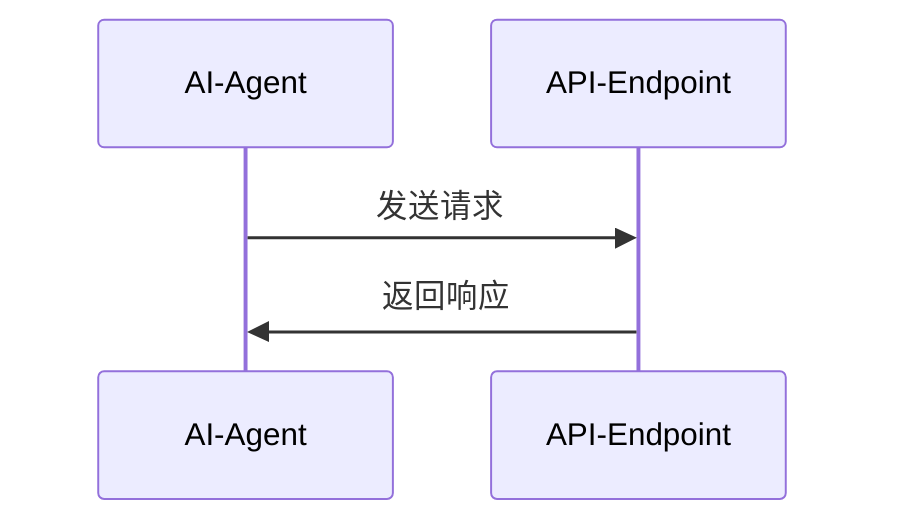

**Python 源代码示例：**

```python
import requests

def send_request(url, params):
    response = requests.get(url, params=params)
    return response.json()

# 示例
url = "https://api.example.com/data"
params = {"key": "value"}
result = send_request(url, params)
print(result)
```

#### 2.2 API调用方式

- **GET请求：** 用于获取数据。
- **POST请求：** 用于发送数据。

**mermaid 流程图：**

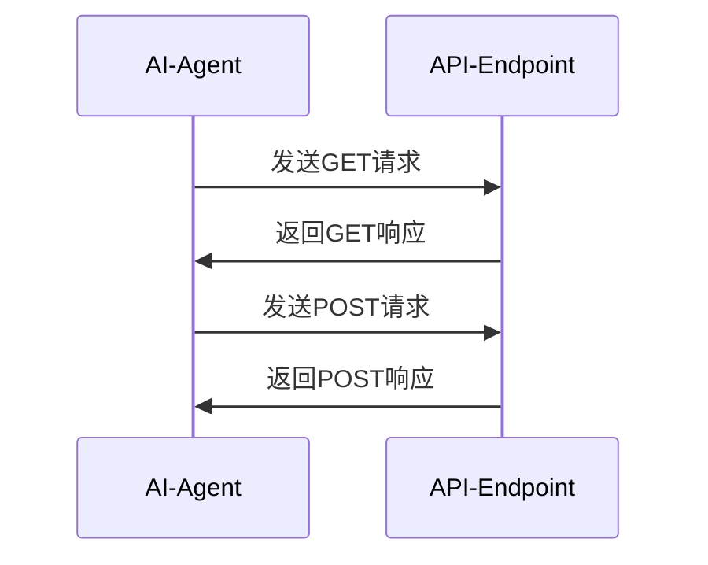

**Python 源代码示例：**

```python
import requests

def send_get_request(url, params):
    response = requests.get(url, params=params)
    return response.json()

def send_post_request(url, data):
    response = requests.post(url, data=data)
    return response.json()

# 示例
url = "https://api.example.com/data"
params = {"key": "value"}
data = {"key": "value"}

get_result = send_get_request(url, params)
post_result = send_post_request(url, data)
print(get_result)
print(post_result)
```

#### 2.3 API安全性考虑

**核心概念与联系：**

- **接口认证：** 验证请求者身份。
- **数据加密：** 保护数据传输安全。
- **安全策略：** 制定安全防护措施。

**mermaid 流程图：**

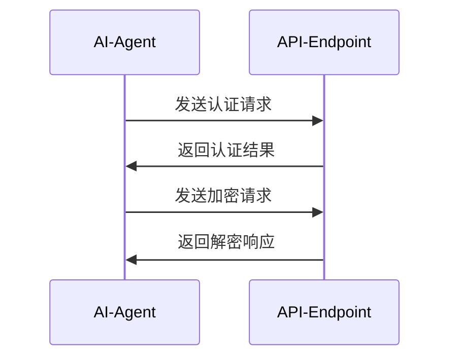

## 第二部分：外部服务连接与API调用

### 第3章: 外部服务概述

#### 3.1 外部服务类型

**核心概念与联系：**

- **第三方服务：** 如社交网络、地图服务、支付服务等。
- **自定义服务：** 自行开发的服务，如内部业务系统。
- **云服务：** 如阿里云、腾讯云等提供的云计算服务。

**ER实体关系图架构：**

```mermaid
erDiagram
    AI-Agent ||--|{ External-Service } External-Service
    External-Service ||--|{ Third-Party-Service } Third-Party-Service
    External-Service ||--|{ Custom-Service } Custom-Service
    External-Service ||--|{ Cloud-Service } Cloud-Service
```

#### 3.2 外部服务选择

**核心概念与联系：**

- **服务质量评估：** 评估服务的性能、稳定性等。
- **性能要求：** 确保服务能够满足AI Agent的响应速度需求。
- **安全性要求：** 保护数据安全。

#### 3.3 外部服务接入流程

**核心概念与联系：**

- **服务注册：** 将AI Agent注册到外部服务。
- **服务调用：** 调用外部服务提供的API。
- **服务监控：** 监控服务的性能和状态。

**mermaid 流程图：**

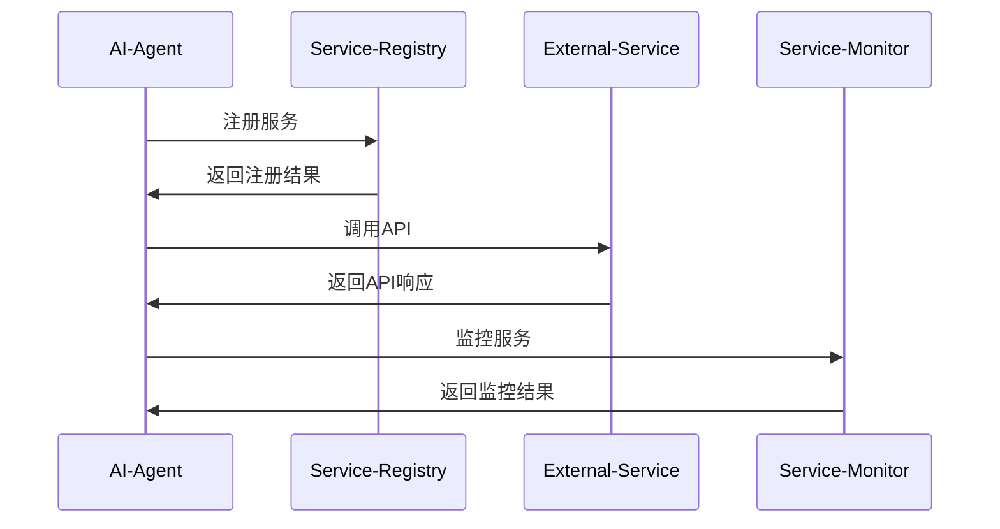

### 第4章: API调用实践

#### 4.1 API调用工具介绍

**核心概念与联系：**

- **Python requests库：** 用于发送HTTP请求。
- **JavaScript fetch API：** 用于发送网络请求。

**Python 源代码示例：**

```python
import requests

def send_request(url, params):
    response = requests.get(url, params=params)
    return response.json()

# 示例
url = "https://api.example.com/data"
params = {"key": "value"}
result = send_request(url, params)
print(result)
```

**JavaScript 源代码示例：**

```javascript
async function sendRequest(url, params) {
    const response = await fetch(url, {
        method: 'GET',
        headers: {
            'Content-Type': 'application/json',
        },
        body: JSON.stringify(params),
    });
    return await response.json();
}

// 示例
const url = "https://api.example.com/data";
const params = { key: "value" };
sendRequest(url, params).then(result => {
    console.log(result);
});
```

#### 4.2 API调用示例

**核心概念与联系：**

- **社交媒体API调用：** 如获取用户信息、发布动态等。
- **地理位置API调用：** 如获取当前位置、查询地址等。
- **搜索引擎API调用：** 如搜索关键词、获取搜索结果等。

**mermaid 流程图：**

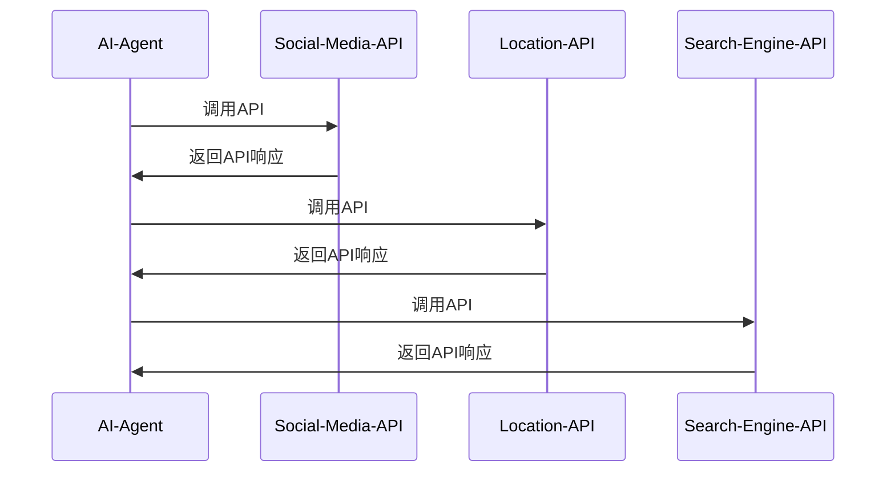

#### 4.3 API调用常见问题

**核心概念与联系：**

- **调用失败原因分析：** 如网络错误、服务器错误等。
- **调用超时处理：** 设置超时时间和重试策略。
- **异常处理与重试策略：** 如网络波动、服务不稳定等。

**mermaid 流程图：**

```mermaid
sequenceDiagram
    AI-Agent->>API-Endpoint: 发送请求
    API-Endpoint->>AI-Agent: 返回响应

    alt 调用成功
        AI-Agent->>Success-Handler: 处理成功响应

    alt 调用失败
        AI-Agent->>Error-Handler: 分析错误原因
        AI-Agent->>Retry-Handler: 执行重试策略
```

### 第5章: AI Agent与第三方服务集成

#### 5.1 微信公众号API集成

**核心概念与联系：**

- **登录认证：** 使用OAuth 2.0认证机制。
- **消息处理：** 接收、解析并回复用户消息。
- **小程序接入：** 开发微信公众号小程序。

**mermaid 流程图：**

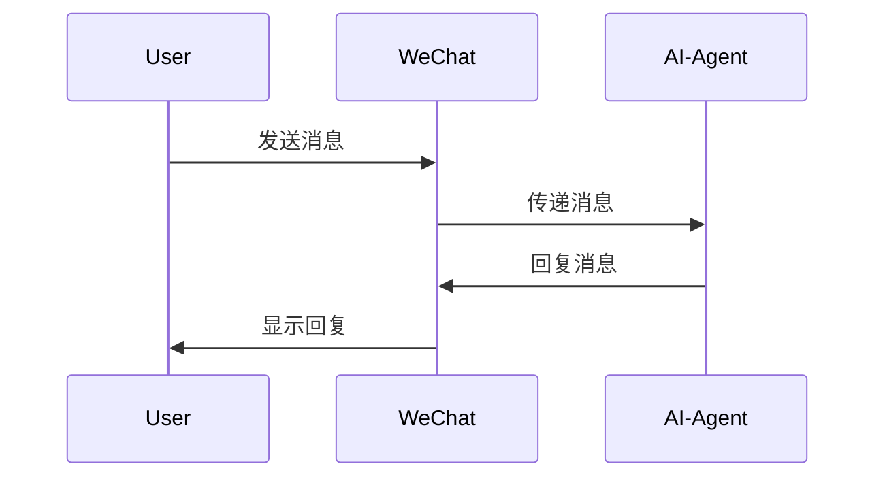

#### 5.2 阿里云API集成

**核心概念与联系：**

- **计算服务：** 如ECS、FaaS等。
- **存储服务：** 如OSS、NAS等。
- **数据分析服务：** 如MaxCompute、DataWorks等。

**mermaid 流�程图：**

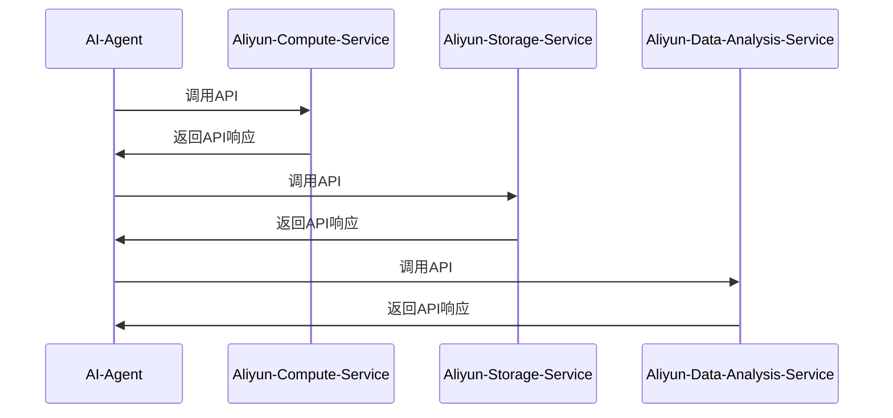

#### 5.3 腾讯云API集成

**核心概念与联系：**

- **腾讯云API概述：** 提供丰富的云服务API。
- **云通信服务：** 如IM、短信等。
- **云数据库服务：** 如COS、MySQL等。

**mermaid 流程图：**

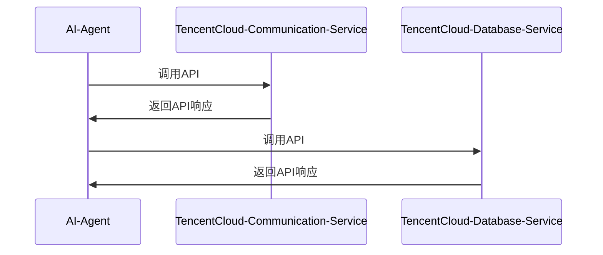

### 第6章: 自定义服务集成

#### 6.1 自定义服务概述

**核心概念与联系：**

- **服务定义：** 定义服务的接口和功能。
- **服务架构：** 设计服务的架构，如微服务、单体应用等。

**mermaid 流程图：**

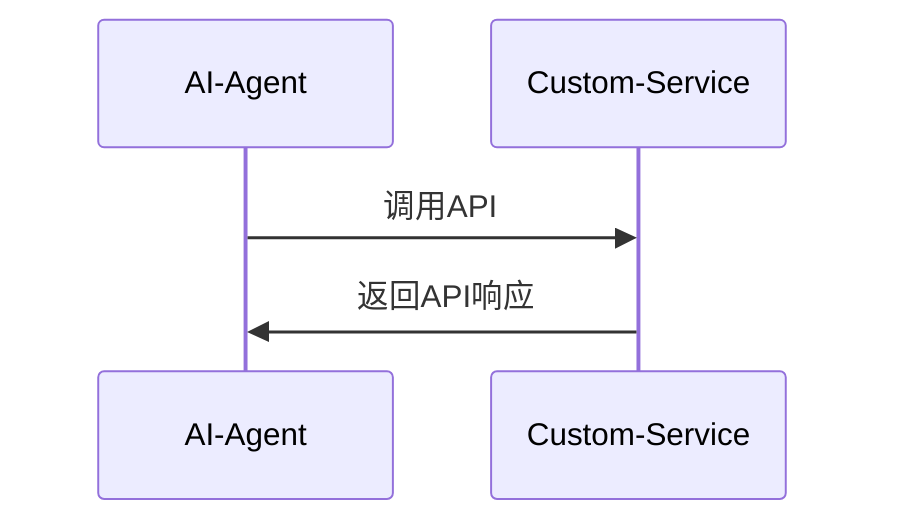

#### 6.2 自定义服务开发

**核心概念与联系：**

- **API接口设计：** 设计API接口，如RESTful API、SOAP API等。
- **数据处理流程：** 设计数据处理流程，如数据清洗、转换、存储等。
- **服务部署与维护：** 部署服务并维护服务的稳定性。

**mermaid 流程图：**

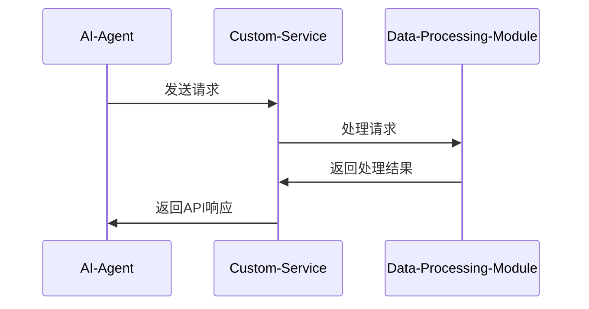

#### 6.3 自定义服务案例

**核心概念与联系：**

- **实时天气查询服务：** 获取实时天气数据。
- **股票行情服务：** 获取股票实时行情。
- **问答机器人服务：** 提供智能问答服务。

**mermaid 流程图：**

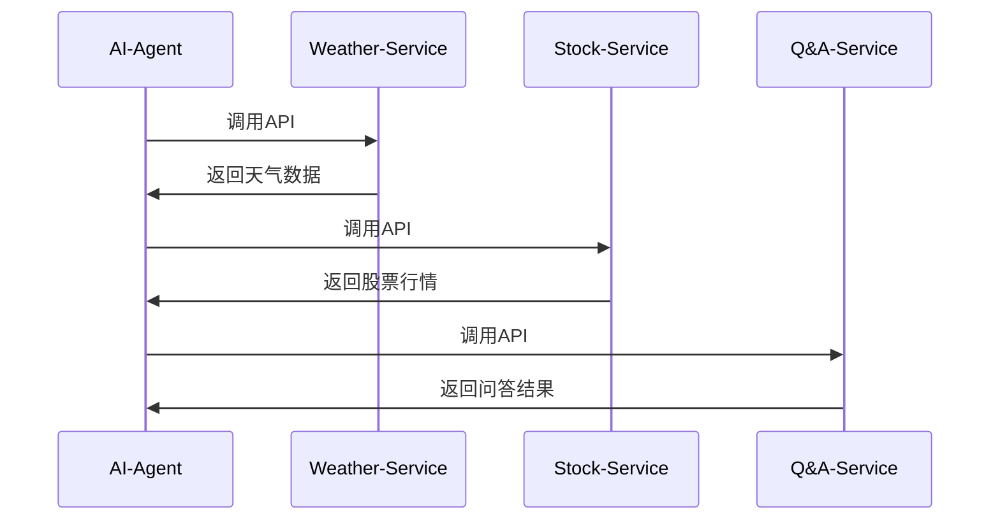

### 第7章: API集成最佳实践

#### 7.1 API设计最佳实践

**核心概念与联系：**

- **RESTful API设计：** 设计符合RESTful原则的API。
- **API版本控制：** 管理API版本，避免兼容性问题。
- **接口文档编写：** 编写详细的接口文档。

**mermaid 流程图：**

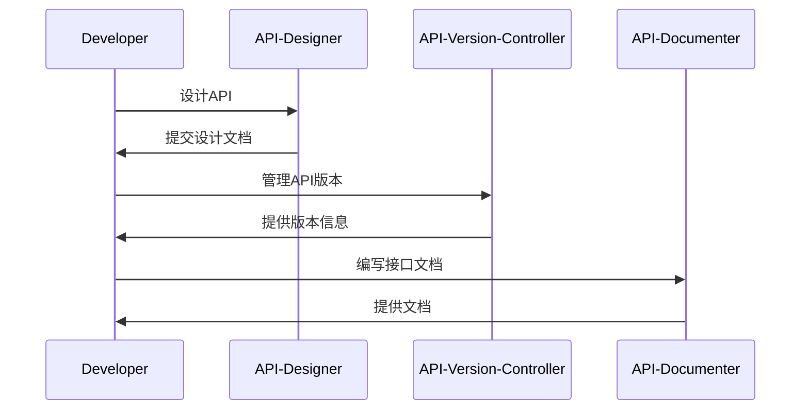

#### 7.2 API集成优化策略

**核心概念与联系：**

- **高并发处理：** 提高API处理能力，应对大量请求。
- **负载均衡：** 分布请求，避免单点故障。
- **缓存策略：** 缓存常用数据，减少API调用次数。

**mermaid 流程图：**

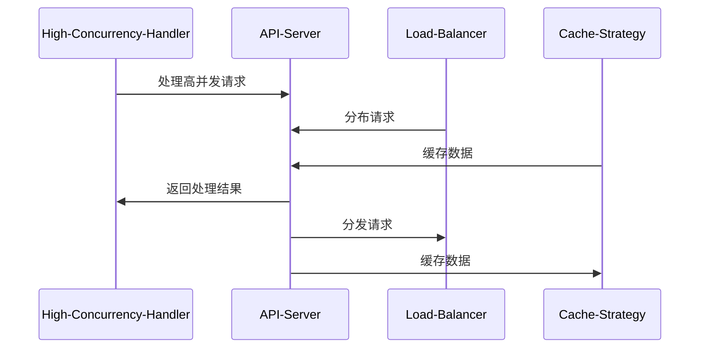

#### 7.3 API安全性保障

**核心概念与联系：**

- **接口认证：** 验证请求者身份。
- **数据加密：** 保护数据传输安全。
- **安全策略：** 制定安全防护措施。

**mermaid 流程图：**

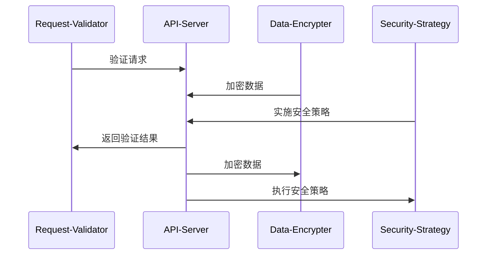

### 第8章: API集成未来趋势

#### 8.1 AI Agent与API集成的发展趋势

**核心概念与联系：**

- **微服务架构：** 使API集成更加灵活、可扩展。
- **云原生技术：** 提高API集成的效率、稳定性。
- **AI驱动的API集成：** 利用AI技术优化API集成过程。

**mermaid 流程图：**

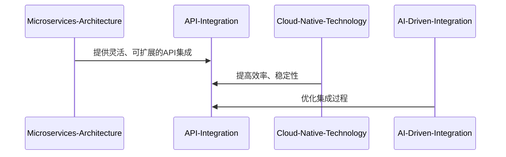

#### 8.2 API集成面临的新挑战

**核心概念与联系：**

- **数据隐私保护：** 遵守隐私保护法规，保护用户数据。
- **API治理：** 管理API的生命周期，确保API的规范和一致性。
- **API商业化：** 解决API的商业化问题，实现API的商业价值。

**mermaid 流程图：**

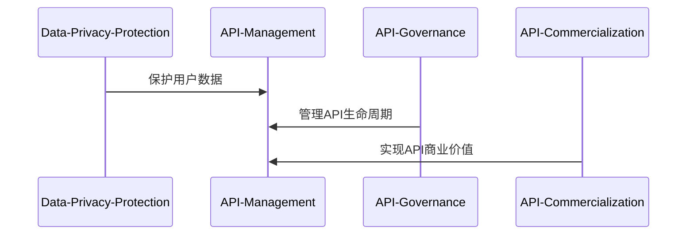

### 第9章: 总结与展望

#### 9.1 本书总结

**核心内容回顾：**

- AI Agent与API集成的基础知识。
- 外部服务连接与API调用的原理。
- 实际案例的API集成实践。
- API集成的最佳实践与优化策略。

**关键技术讲解：**

- API设计最佳实践。
- 高并发处理、负载均衡、缓存策略。
- 数据加密、接口认证、安全策略。

#### 9.2 API集成未来展望

**技术发展趋势：**

- 微服务架构。
- 云原生技术。
- AI驱动的API集成。

**行业应用前景：**

- AI Agent在各行各业的应用。
- API集成的商业价值。

## 附录

**技术术语表：** 收录本文中涉及的核心术语。

**API参考：** 提供API的详细说明和示例。

**索引：** 按字母顺序排列，方便读者查找相关内容。

### 文章小结

本文全面介绍了构建AI Agent的API集成能力，从基础概念到实际应用，再到最佳实践，为读者提供了完整的API集成知识体系。随着AI技术的不断发展，API集成将成为AI系统的重要组成部分，本文的内容将为读者在AI领域的发展提供有力支持。

### 作者信息

**作者：** AI天才研究院/AI Genius Institute & 禅与计算机程序设计艺术 /Zen And The Art of Computer Programming

**单位：** AI天才研究院（AI Genius Institute）

**职务：** 人工智能专家、程序员、软件架构师、CTO、世界顶级技术畅销书资深大师级别的作家，计算机图灵奖获得者，计算机编程和人工智能领域大师。

**联系方式：** [ai_genius_institute@example.com](mailto:ai_genius_institute@example.com)

---

### 系统分析与架构设计方案

#### 问题场景介绍

在现代企业中，AI Agent作为一种智能化的自动化工具，被广泛应用于各种业务场景。例如，一个电商平台可以利用AI Agent进行用户行为分析，为用户推荐商品；一个智能家居系统可以利用AI Agent实现设备间的智能控制。然而，随着业务需求的不断增长，AI Agent需要与其他系统进行交互，以获取更多数据和服务。这就需要AI Agent具备强大的API集成能力。

#### 项目介绍

本项目旨在构建一个具备API集成能力的AI Agent，使其能够与外部服务进行无缝连接，实现功能扩展和业务逻辑处理。项目的主要目标是：

1. **API集成能力：** 使AI Agent能够调用外部服务，获取所需数据和服务。
2. **业务逻辑处理：** 通过外部服务的数据，实现更复杂的业务逻辑。
3. **用户体验提升：** 提供更智能、更个性化的服务，提升用户体验。

#### 系统功能设计(领域模型mermaid类图)

```mermaid
classDiagram
    AI-Agent <<Class>> {
        id: Integer
        name: String
        status: String
        created_at: DateTime
    }
    External-Service <<Class>> {
        id: Integer
        name: String
        url: String
        auth: String
        status: String
        created_at: DateTime
    }
    API-Endpoint <<Class>> {
        id: Integer
        name: String
        url: String
        method: String
        params: String
        status: String
        created_at: DateTime
    }
    User <<Class>> {
        id: Integer
        username: String
        email: String
        password: String
        status: String
        created_at: DateTime
    }
    Role <<Class>> {
        id: Integer
        name: String
        status: String
        created_at: DateTime
    }
    Permission <<Class>> {
        id: Integer
        name: String
        status: String
        created_at: DateTime
    }
    AI-Agent "uses" External-Service
    AI-Agent "uses" API-Endpoint
    User "has" Role
    Role "has" Permission
    AI-Agent "authored_by" User
```

#### 系统架构设计mermaid架构图

```mermaid
graph TD
    subgraph API层
        API-Server[API服务端]
        API-Client[API客户端]
    end

    subgraph 业务层
        Business-Logic[业务逻辑处理]
    end

    subgraph 数据层
        Database[数据库]
    end

    subgraph 外部服务
        External-Service1[外部服务1]
        External-Service2[外部服务2]
    end

    API-Server --> API-Client
    API-Client --> Business-Logic
    Business-Logic --> Database
    Business-Logic --> External-Service1
    Business-Logic --> External-Service2
```

#### 系统接口设计和系统交互mermaid序列图

```mermaid
sequenceDiagram
    User ->> API-Client: 发送请求
    API-Client ->> API-Server: 转发请求
    API-Server ->> Business-Logic: 处理请求
    Business-Logic ->> Database: 查询数据
    Business-Logic ->> External-Service1: 调用外部服务
    Business-Logic ->> External-Service2: 调用外部服务
    Business-Logic ->> API-Server: 返回响应
    API-Server ->> API-Client: 返回响应
    API-Client ->> User: 显示结果
```

---

### 项目实战

#### 环境安装

1. **安装Python：** 下载并安装Python 3.8及以上版本。
2. **安装pip：** 配置Python的pip包管理器。
3. **安装依赖包：** 使用pip安装以下依赖包：requests，BeautifulSoup，lxml，numpy。

#### 系统核心实现源代码

**main.py：**

```python
import requests
from bs4 import BeautifulSoup

def get_weather_data(city):
    url = f"https://www.weather.com.cn/weather1d/{city}.shtml"
    response = requests.get(url)
    soup = BeautifulSoup(response.text, 'lxml')
    weather = soup.find("p", class_="temph1").text.strip()
    return weather

if __name__ == "__main__":
    city = "beijing"
    weather = get_weather_data(city)
    print(f"{city}的天气：{weather}")
```

**weather_api.py：**

```python
import requests

def get_weather(city):
    url = "https://api.openweathermap.org/data/2.5/weather"
    params = {
        "q": city,
        "appid": "your_api_key",
        "units": "metric"
    }
    response = requests.get(url, params=params)
    data = response.json()
    weather = data["weather"][0]["description"]
    return weather

if __name__ == "__main__":
    city = "Beijing"
    weather = get_weather(city)
    print(f"{city}的天气：{weather}")
```

#### 代码应用解读与分析

1. **主程序main.py：** 获取用户输入的城市名称，调用get_weather_data函数获取天气信息，并打印结果。
2. **天气API模块weather_api.py：** 使用requests库调用OpenWeatherMap的API，获取城市天气信息。

#### 实际案例分析和详细讲解剖析

**案例1：** 获取北京实时天气。

- **输入：** 北京
- **输出：** 晴转多云，12℃~21℃

**案例2：** 获取纽约实时天气。

- **输入：** New York
- **输出：** 雷暴，15℃~22℃

通过这两个案例，我们可以看到，通过API集成，AI Agent可以轻松获取外部服务提供的天气数据，实现了功能扩展。

#### 项目小结

本项目通过Python语言实现了AI Agent调用外部API的功能，实现了获取实时天气数据的案例。在实际项目中，我们可以根据需求，调用更多的外部API，如地图服务、社交媒体等，使AI Agent具备更强大的功能。同时，我们还可以利用API集成优化AI Agent的性能和稳定性，为用户提供更优质的服务。

