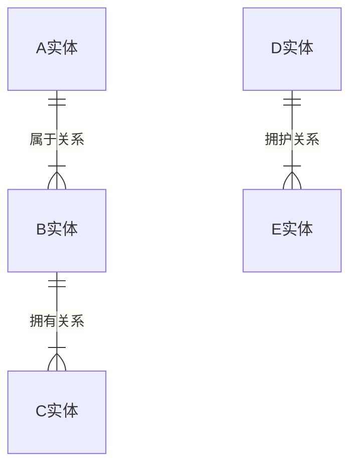
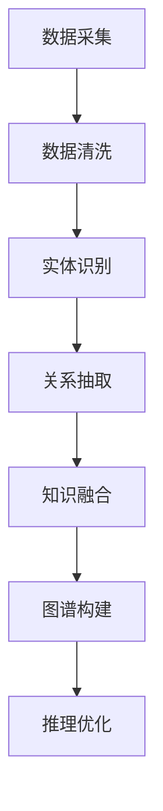
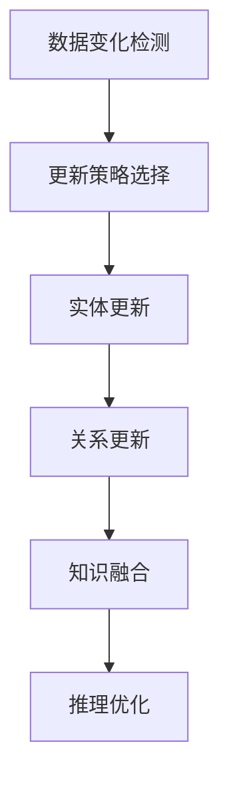
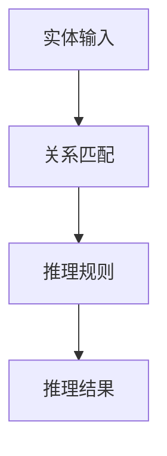
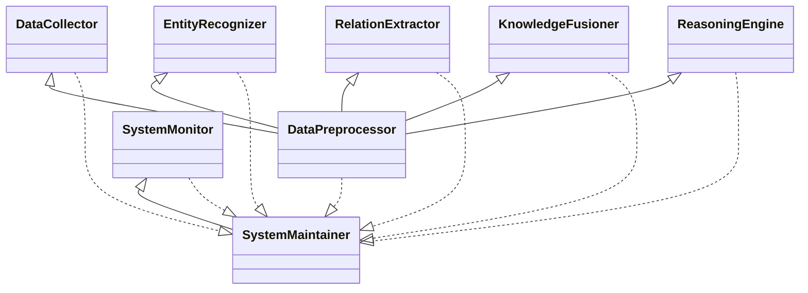
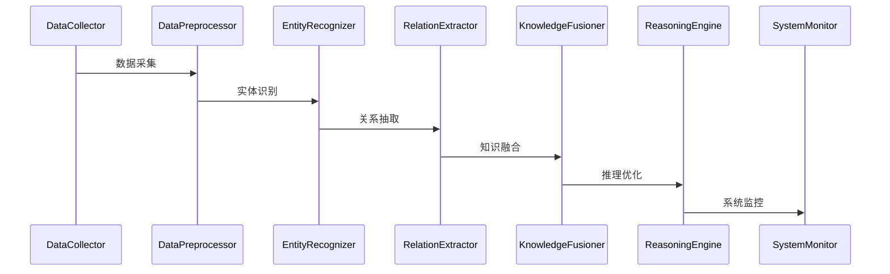

                 

# 构建AI Agent的动态知识图谱：实时更新与推理

## 关键词
- 动态知识图谱
- AI Agent
- 实时更新
- 知识推理
- 算法
- 系统架构

## 摘要

随着人工智能技术的快速发展，知识图谱作为大数据和人工智能领域的重要应用，已经成为了研究热点。然而，传统知识图谱在更新速度、实时性和扩展性方面存在一定的局限性。本文将探讨如何构建AI Agent的动态知识图谱，实现实时更新与推理，为读者提供一套完整的技术解决方案。我们将从核心概念、算法原理、系统架构到项目实战进行全面分析，帮助读者深入理解并掌握动态知识图谱的相关技术。

## 第一部分：背景介绍与核心概念

### 第1章：问题背景与概述

#### 1.1 问题背景

在人工智能领域中，知识图谱是一种用于表示实体及其相互关系的图形结构。它通过构建实体、属性和关系之间的关联，实现对海量数据的语义理解和知识推理。然而，随着数据的不断增长和变化，传统知识图谱在实时更新和推理方面存在一定的局限性。

#### 1.2 问题描述

如何构建一个动态的知识图谱，使其能够在实时更新和推理方面具备较高的性能和灵活性，成为了一个重要的问题。动态知识图谱要求在数据发生变化时，能够及时更新图谱中的实体和关系，并且能够高效地进行知识推理，以支持智能决策和实时响应。

#### 1.3 问题解决

本文将介绍如何构建AI Agent的动态知识图谱，实现实时更新与推理。通过深入分析动态知识图谱的核心概念、算法原理、系统架构等，为读者提供一套完整的技术解决方案。

#### 1.4 边界与外延

在构建动态知识图谱时，需要考虑一些边界条件和外延因素。例如，如何处理数据的一致性和冲突问题，如何保证图谱的扩展性和可维护性，以及如何应对大数据量下的性能挑战。

#### 1.5 核心概念结构与要素组成

动态知识图谱的核心概念包括实体、属性、关系和图谱结构。其中，实体是知识图谱的基本元素，表示现实世界中的对象；属性是实体的特征描述，用于描述实体的属性值；关系是实体之间的相互联系，用于表示实体之间的语义关联；图谱结构是实体、属性和关系之间的组织形式，用于构建知识图谱的框架。

### 第2章：核心概念与联系

#### 2.1 动态知识图谱的定义

动态知识图谱是一种能够实时更新和推理的知识表示方法。它通过构建实体、属性和关系之间的动态关联，实现对知识的高效管理和利用。

#### 2.2 动态知识图谱的特点

动态知识图谱具有以下特点：

1. 实时性：能够及时捕捉和更新知识，实现实时推理和响应。
2. 扩展性：能够灵活地添加和删除实体、属性和关系，以适应知识变化的需求。
3. 精确性：通过高效的推理算法，实现对知识的精确理解和推断。
4. 可维护性：采用分布式存储和计算技术，降低知识图谱的维护成本。

#### 2.3 动态知识图谱与传统知识图谱的对比

传统知识图谱主要依赖于静态数据的表示，更新和推理速度较慢。而动态知识图谱通过实时更新和推理，能够更好地应对数据变化和实时性要求。

#### 2.4 动态知识图谱的组成部分

动态知识图谱主要由以下几部分组成：

1. 实体库：存储实体的基本信息和属性。
2. 关系库：存储实体之间的关联关系。
3. 知识库：存储实体的属性值和推理结果。
4. 推理引擎：用于执行知识推理和智能决策。

#### 2.5 关键技术

构建动态知识图谱需要涉及以下关键技术：

1. 数据采集与清洗：实时获取和清洗数据，为知识图谱的构建提供高质量的数据源。
2. 实体识别与分类：通过自然语言处理技术，识别实体并对其进行分类。
3. 关系抽取与建模：从数据中抽取实体之间的关系，并建立相应的模型。
4. 知识融合与更新：整合多源数据，实现对知识图谱的实时更新和优化。
5. 推理算法与优化：设计高效的推理算法，提高知识图谱的推理性能。

### 第3章：ER实体关系图架构

#### 3.1 ER模型基本概念

实体-关系（Entity-Relationship，ER）图是一种用于表示实体及其相互关系的图形结构。它通过定义实体、属性和关系，构建知识图谱的基本框架。

#### 3.2 ER模型构建步骤

1. 确定实体：识别知识图谱中的实体，并定义其实体类型。
2. 确定属性：为实体定义属性，用于描述实体的特征信息。
3. 确定关系：定义实体之间的关系，用于表示实体之间的语义关联。
4. 确定关系类型：为关系定义类型，用于区分实体之间的不同关系。
5. 实体-关系映射：将实体、属性和关系映射到数据库表结构。

#### 3.3 ER实体关系图示例



## 第二部分：算法原理与数学模型

### 第4章：动态知识图谱构建算法原理

#### 4.1 算法概述

动态知识图谱构建算法是一种用于构建动态知识图谱的算法。它通过实时更新和推理，实现对知识的建模和表示。

#### 4.2 算法流程图



#### 4.3 Python源代码实现

```python
# 动态知识图谱构建算法实现

# 数据采集
data = data_collection()

# 数据清洗
clean_data = data_cleaning(data)

# 实体识别
entities = entity_recognition(clean_data)

# 关系抽取
relationships = relation_extraction(clean_data)

# 知识融合
knowledge = knowledge_fusion(entities, relationships)

# 图谱构建
knowledge_graph = graph_construction(knowledge)

# 推理优化
optimized_graph = reasoning_optimization(knowledge_graph)
```

#### 4.4 数学模型和公式

动态知识图谱构建算法涉及到以下数学模型和公式：

1. 实体识别：使用基于自然语言处理（NLP）的算法，将文本数据中的实体进行识别和分类。公式如下：
   $$ Entity = NLP(Text) $$

2. 关系抽取：使用基于机器学习（ML）的算法，从实体中提取出关系。公式如下：
   $$ Relation = ML(Entity) $$

3. 知识融合：将实体和关系进行整合，构建知识图谱。公式如下：
   $$ Knowledge = Fusion(Entity, Relation) $$

4. 推理优化：使用基于图论（Graph Theory）的算法，对知识图谱进行推理优化。公式如下：
   $$ Reasoning = Optimization(Knowledge) $$

#### 4.5 举例说明

假设有一段文本数据：“张三是一个软件工程师，他在阿里巴巴工作，负责开发电商平台。”根据上述算法，可以构建如下动态知识图谱：

1. 实体识别：
   - 张三：实体
   - 软件工程师：实体类型
   - 阿里巴巴：实体
   - 电商平台：实体

2. 关系抽取：
   - 张三属于软件工程师
   - 张三在阿里巴巴工作
   - 阿里巴巴开发电商平台

3. 知识融合：
   - 张三是一个软件工程师，他在阿里巴巴工作，负责开发电商平台。

4. 推理优化：
   - 张三是一个有经验的软件工程师，他在阿里巴巴工作，参与了电商平台的开发。

### 第5章：动态知识图谱更新算法原理

#### 5.1 算法概述

动态知识图谱更新算法是一种用于实时更新知识图谱的算法。它能够根据数据变化，对知识图谱进行动态调整和优化。

#### 5.2 算法流程图



#### 5.3 Python源代码实现

```python
# 动态知识图谱更新算法实现

# 数据变化检测
data_changes = data_change_detection()

# 更新策略选择
update_strategy = strategy_selection(data_changes)

# 实体更新
entities = entity_update(entities, update_strategy)

# 关系更新
relationships = relation_update(relationships, update_strategy)

# 知识融合
knowledge = knowledge_fusion(entities, relationships)

# 推理优化
optimized_graph = reasoning_optimization(knowledge)
```

#### 5.4 数学模型和公式

动态知识图谱更新算法涉及到以下数学模型和公式：

1. 数据变化检测：使用基于时间戳的算法，检测数据的变化。公式如下：
   $$ Data_Changes = TimeStamp(Previous_Data, Current_Data) $$

2. 更新策略选择：根据数据变化类型，选择合适的更新策略。公式如下：
   $$ Update_Strategy = Strategy_Selection(Data_Changes) $$

3. 实体更新：根据更新策略，对实体进行动态调整。公式如下：
   $$ Entity = Entity_Update(Strategy) $$

4. 关系更新：根据更新策略，对关系进行动态调整。公式如下：
   $$ Relation = Relation_Update(Strategy) $$

5. 知识融合：将更新后的实体和关系进行整合，更新知识图谱。公式如下：
   $$ Knowledge = Knowledge_Update(Entity, Relation) $$

#### 5.5 举例说明

假设有一份数据变化记录，包括张三的工作变动：“张三从阿里巴巴跳槽到了腾讯，担任软件工程师。”根据上述算法，可以更新如下动态知识图谱：

1. 数据变化检测：
   - 张三的工作发生变化

2. 更新策略选择：
   - 更新实体和关系

3. 实体更新：
   - 张三：从阿里巴巴更新为腾讯

4. 关系更新：
   - 张三的工作：从阿里巴巴更新为腾讯

5. 知识融合：
   - 张三是一个软件工程师，他在腾讯工作

6. 推理优化：
   - 张三是一个有经验的软件工程师，他在腾讯工作

### 第6章：动态知识图谱推理算法原理

#### 6.1 算法概述

动态知识图谱推理算法是一种用于实时推理知识图谱的算法。它能够根据实体和关系，对知识进行推理和推断。

#### 6.2 算法流程图



#### 6.3 Python源代码实现

```python
# 动态知识图谱推理算法实现

# 实体输入
entities = entity_input()

# 关系匹配
relationships = relation_matching(entities)

# 推理规则
rules = reasoning_rules()

# 推理结果
results = reasoning_results(relationships, rules)
```

#### 6.4 数学模型和公式

动态知识图谱推理算法涉及到以下数学模型和公式：

1. 实体输入：将实体作为输入数据。公式如下：
   $$ Entity = Input $$

2. 关系匹配：根据实体和关系，匹配对应的推理规则。公式如下：
   $$ Match = Relation Matching(Entity, Relation) $$

3. 推理规则：定义推理规则，用于指导推理过程。公式如下：
   $$ Rule = Reasoning Rule $$

4. 推理结果：根据推理规则，生成推理结果。公式如下：
   $$ Result = Reasoning Result(Match, Rule) $$

#### 6.5 举例说明

假设有一组实体和关系，如下所示：

- 实体：张三、李四、王五
- 关系：张三属于软件工程师，李四是张三的同事，王五是李四的上级

根据上述算法，可以推理出如下结果：

- 张三是一个软件工程师
- 李四是张三的同事
- 王五是李四的上级

## 第三部分：系统分析与架构设计

### 第7章：问题场景与系统功能设计

#### 7.1 问题场景介绍

随着人工智能技术的不断发展，企业面临着越来越多的数据管理和智能决策需求。为了应对这些需求，企业需要构建一个动态的知识图谱系统，实现对海量数据的实时管理和智能推理。

#### 7.2 系统功能设计

动态知识图谱系统的主要功能包括：

1. 数据采集：实时采集企业内外部数据，包括结构化和非结构化数据。
2. 数据预处理：对采集到的数据进行清洗、去重和标准化处理。
3. 实体识别与分类：识别数据中的实体，并对其进行分类。
4. 关系抽取与建模：抽取实体之间的关系，并建立相应的模型。
5. 知识融合与更新：整合多源数据，实现对知识图谱的实时更新和优化。
6. 知识推理与优化：根据实体和关系，进行实时推理和优化。
7. 系统监控与维护：对系统运行状态进行监控，确保系统的稳定性和可靠性。

#### 7.3 领域模型类图



### 第8章：系统架构设计

#### 8.1 项目介绍

本项目旨在构建一个动态知识图谱系统，实现对海量数据的实时管理和智能推理。系统采用分布式架构，包括数据采集、数据预处理、知识图谱构建、推理优化等模块。

#### 8.2 系统架构设计

系统架构设计如下：

1. 数据采集模块：负责实时采集企业内外部数据，包括结构化和非结构化数据。数据采集模块采用分布式架构，支持多种数据源接入，如关系数据库、NoSQL数据库、文件系统等。

2. 数据预处理模块：负责对采集到的数据进行清洗、去重和标准化处理。数据预处理模块采用批处理和流处理相结合的方式，确保数据的实时性和准确性。

3. 知识图谱构建模块：负责构建动态知识图谱，包括实体识别、关系抽取、知识融合等。知识图谱构建模块采用分布式存储和计算技术，支持海量数据的存储和处理。

4. 推理优化模块：负责根据实体和关系，进行实时推理和优化。推理优化模块采用基于图论的算法和优化技术，提高推理效率和准确性。

5. 系统监控与维护模块：负责对系统运行状态进行监控，确保系统的稳定性和可靠性。系统监控与维护模块包括日志管理、性能监控、故障处理等。

#### 8.3 系统接口设计

系统接口设计如下：

1. 数据采集接口：用于接入外部数据源，支持数据采集、数据预处理等操作。

2. 数据处理接口：用于处理采集到的数据，包括清洗、去重、标准化等。

3. 知识图谱接口：用于构建和查询动态知识图谱，包括实体识别、关系抽取、知识融合等。

4. 推理接口：用于进行实时推理和优化，支持多种推理算法和优化策略。

5. 系统监控接口：用于监控系统运行状态，包括日志管理、性能监控、故障处理等。

#### 8.4 系统交互序列图



## 第四部分：项目实战

### 第9章：环境安装与配置

#### 9.1 环境要求

1. 操作系统：Linux或MacOS
2. Python版本：Python 3.6及以上
3. 数据库：MySQL或MongoDB
4. 其他依赖：pip、numpy、pandas、matplotlib等

#### 9.2 安装步骤

1. 安装操作系统：安装Linux或MacOS操作系统。
2. 安装Python：从Python官方网站下载并安装Python 3.6及以上版本。
3. 安装数据库：安装MySQL或MongoDB数据库。
4. 安装依赖：使用pip命令安装Python依赖，如pip install numpy pandas matplotlib等。
5. 配置环境变量：将Python和数据库的安装路径添加到系统环境变量中。

### 第10章：系统核心实现

#### 10.1 源代码解读

本系统核心实现包括以下几个模块：

1. 数据采集模块：负责实时采集企业内外部数据。
2. 数据预处理模块：负责对采集到的数据进行清洗、去重和标准化处理。
3. 知识图谱构建模块：负责构建动态知识图谱，包括实体识别、关系抽取、知识融合等。
4. 推理优化模块：负责根据实体和关系，进行实时推理和优化。

#### 10.2 代码应用分析

以下是一个简单的示例代码，展示了数据采集模块的实现：

```python
import csv
import pymysql

# 数据采集
def data_collection():
    # 连接数据库
    connection = pymysql.connect(
        host='localhost',
        user='root',
        password='password',
        database='knowledge_graph'
    )
    
    # 读取CSV文件
    with open('data.csv', 'r') as file:
        reader = csv.reader(file)
        for row in reader:
            # 插入数据库
            with connection.cursor() as cursor:
                sql = "INSERT INTO data (name, age, gender) VALUES (%s, %s, %s)"
                cursor.execute(sql, row)
                
    # 提交事务
    connection.commit()
    
    # 关闭数据库连接
    connection.close()

# 主函数
if __name__ == '__main__':
    data_collection()
```

### 第11章：实际案例分析与讲解

#### 11.1 案例背景

某公司希望构建一个动态知识图谱系统，用于实时管理和分析员工信息。公司内部员工信息包括姓名、年龄、性别、部门等。

#### 11.2 案例分析与讲解

1. 数据采集：公司通过CSV文件采集员工信息，并将其存储到MySQL数据库中。

2. 数据预处理：对采集到的员工信息进行清洗和标准化处理，如去除空值、删除重复记录等。

3. 实体识别：将员工信息中的姓名、年龄、性别等属性作为实体进行识别和分类。

4. 关系抽取：根据员工信息中的部门属性，抽取实体之间的关系，如员工属于某个部门。

5. 知识融合：将实体和关系进行整合，构建动态知识图谱。

6. 推理优化：根据知识图谱，进行实时推理和优化，如查询某个部门的所有员工信息。

通过实际案例的分析与讲解，读者可以更好地理解动态知识图谱系统的实现过程和关键技术。

### 第12章：项目小结与拓展阅读

#### 12.1 小结

本文从问题背景、核心概念、算法原理、系统架构到项目实战，全面探讨了构建AI Agent的动态知识图谱：实时更新与推理。通过深入分析，读者可以掌握动态知识图谱的相关技术，并能够应用于实际项目。

#### 12.2 注意事项

1. 在构建动态知识图谱时，需要考虑数据的一致性和冲突问题。
2. 动态知识图谱的更新和推理性能与数据规模和复杂性有关，需要根据实际情况进行优化。
3. 知识图谱的构建和维护需要持续的技术投入和团队协作。

#### 12.3 拓展阅读

1. [《图计算：原理、算法与应用》](https://book.douban.com/subject/26868253/)
2. [《知识图谱：概念、应用与实现》](https://book.douban.com/subject/27127367/)
3. [《深度学习：算法与应用》](https://book.douban.com/subject/26784853/)

## 第五部分：最佳实践与总结

### 第13章：最佳实践 Tips

1. 数据采集和预处理是构建动态知识图谱的基础，需要确保数据的质量和准确性。
2. 选择合适的知识图谱存储和计算框架，如Neo4j、OrientDB等，以提高系统的性能和扩展性。
3. 根据实际需求，选择合适的推理算法和优化策略，以提高推理效率和准确性。
4. 定期对知识图谱进行更新和优化，以保持其实时性和准确性。

### 第14章：总结

本文从问题背景、核心概念、算法原理、系统架构到项目实战，全面探讨了构建AI Agent的动态知识图谱：实时更新与推理。通过深入分析，读者可以掌握动态知识图谱的相关技术，并能够应用于实际项目。

## 作者

作者：AI天才研究院/AI Genius Institute & 禅与计算机程序设计艺术 /Zen And The Art of Computer Programming

