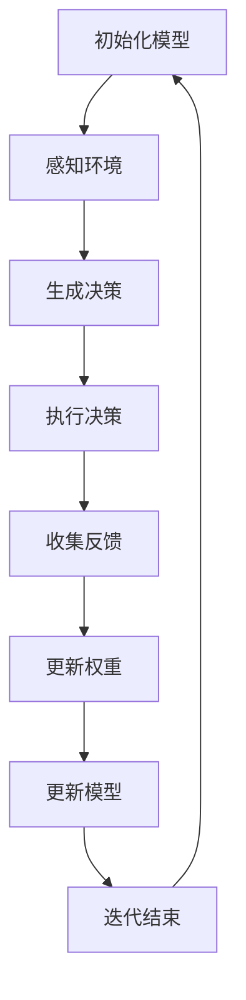
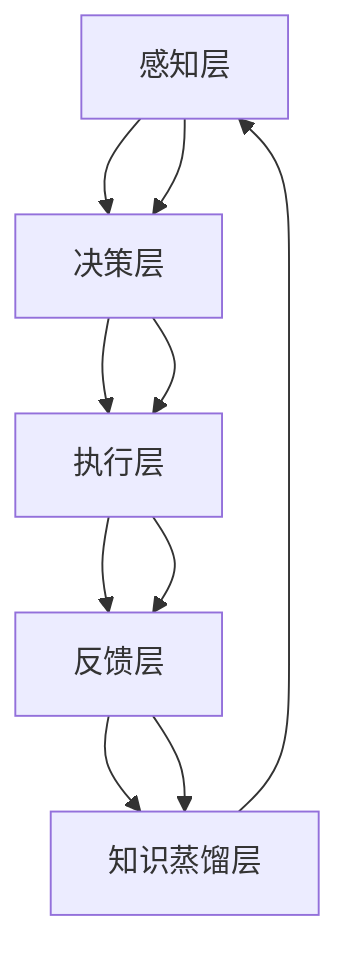
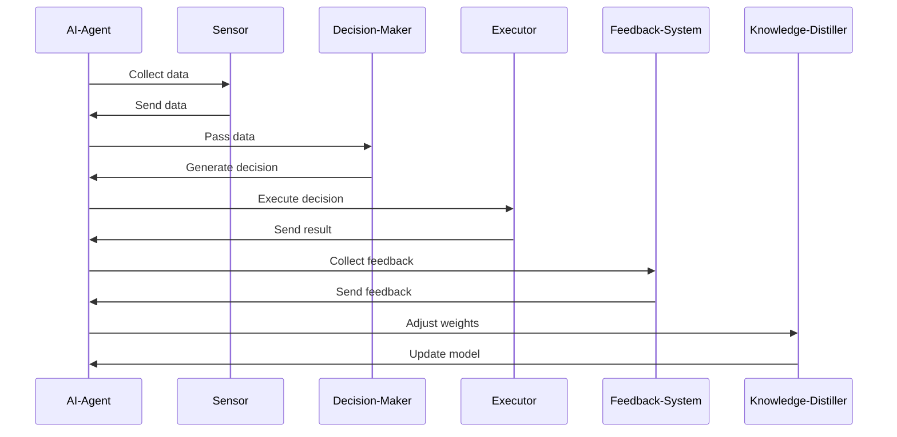

                 


### # 构建AI Agent的动态知识蒸馏机制

> 关键词：AI Agent、动态知识蒸馏、神经网络、深度学习、优化算法

> 摘要：本文探讨了AI Agent的动态知识蒸馏机制，通过详细阐述其核心概念、算法原理、系统设计及实战应用，旨在为读者提供一套系统化的构建方法。本文分为六个部分：引言与背景、核心概念与理论、算法与数学模型、系统设计与架构、案例研究与实战应用以及最佳实践与总结。

---

## 引言与背景

AI Agent是人工智能领域的一个重要研究方向，它代表了一种能够自主行动、适应环境和执行任务的智能实体。然而，随着AI Agent在实际应用场景中的复杂性不断增加，如何有效地提升其智能水平和学习能力成为了一个亟待解决的问题。

知识蒸馏（Knowledge Distillation）作为一种在深度学习中常见的技巧，旨在将一个复杂的模型（教师模型）的知识传递给一个更简单但参数更少的模型（学生模型）。这种技术能够显著提升AI Agent的推理能力和效率。

本文将探讨动态知识蒸馏机制，该机制能够在AI Agent的学习过程中根据环境变化动态调整知识传递的方式和强度，从而提高模型的泛化能力和适应性。动态知识蒸馏机制不仅能够应对静态环境下的任务，还能够适应动态变化的环境，这对于AI Agent在实际应用中的表现具有重要意义。

## 核心概念与理论

### AI Agent

AI Agent通常是指一个能够感知环境、做出决策并执行动作的智能实体。它具有以下基本特征：

1. **感知**：AI Agent能够通过传感器感知环境信息。
2. **决策**：基于感知到的环境信息，AI Agent能够利用某种决策算法生成行动策略。
3. **执行**：AI Agent能够执行这些行动策略，并在执行过程中学习与改进。

### 知识蒸馏

知识蒸馏是指将教师模型的内部知识传递给学生模型的过程。教师模型通常是一个复杂且参数量较大的模型，而学生模型则是一个更简单但参数量较小的模型。知识蒸馏的主要目的是通过训练学生模型来复制教师模型的知识，从而提高学生模型的性能。

### 动态知识蒸馏

动态知识蒸馏是一种在知识蒸馏过程中根据环境变化动态调整知识传递方式的技术。它不同于传统的静态知识蒸馏，后者在训练过程中不调整知识传递的方式。动态知识蒸馏具有以下特点：

1. **自适应**：能够根据不同环境动态调整知识传递的强度和方式。
2. **实时**：能够在训练过程中实时更新知识传递策略。
3. **泛化**：能够提高模型在不同环境下的泛化能力。

## 算法与数学模型

### 动态知识蒸馏算法

动态知识蒸馏算法的核心思想是利用环境反馈动态调整知识传递的权重。具体来说，算法可以分为以下几个步骤：

1. **初始化**：初始化教师模型和学生模型。
2. **感知与决策**：AI Agent感知环境信息，并利用教师模型生成决策。
3. **执行与反馈**：AI Agent执行决策，并收集环境反馈。
4. **知识传递**：根据环境反馈动态调整知识传递的权重。
5. **模型更新**：更新学生模型和教师模型的参数。

### 数学模型

动态知识蒸馏的数学模型主要包括以下两部分：

1. **知识传递函数**：描述知识从教师模型到学生模型的传递过程。
   $$ 
   f(\theta_S, \theta_T) = \alpha_S \theta_T + (1 - \alpha_S) \theta_S 
   $$
   其中，$\theta_S$ 和 $\theta_T$ 分别为学生模型和教师模型的参数，$\alpha_S$ 为动态调整的权重。

2. **损失函数**：描述学生模型与教师模型在输出上的差距。
   $$ 
   L = \frac{1}{2} \sum_{i=1}^{N} (\hat{y}_i - y_i)^2 
   $$
   其中，$\hat{y}_i$ 为学生模型的预测输出，$y_i$ 为教师模型的实际输出，$N$ 为样本数量。

### 算法流程

下面使用Mermaid绘制动态知识蒸馏算法的流程图：



### Python代码示例

下面是一个简化的Python代码示例，用于演示动态知识蒸馏算法的基本实现：

```python
import tensorflow as tf

# 定义教师模型和学生模型
teacher_model = ...
student_model = ...

# 初始化权重
alpha_s = 0.5

# 感知环境
environment = ...

# 生成决策
decision = teacher_model.predict(environment)

# 执行决策
action = ...

# 收集反馈
feedback = ...

# 更新权重
alpha_s = alpha_s * feedback

# 更新模型
student_model.set_weights(f(alpha_s, teacher_model.get_weights()))

# 迭代过程
for _ in range(num_iterations):
    # 重复上述步骤
    ...
```

## 系统设计与架构

### 问题场景

假设我们正在开发一个自动驾驶AI Agent，它需要在复杂交通环境中识别车辆、行人以及其他障碍物，并做出实时决策。为了提高AI Agent的智能水平，我们决定采用动态知识蒸馏技术。

### 系统功能设计

系统功能主要包括：

1. **感知模块**：负责收集交通环境信息，如摄像头图像、雷达数据等。
2. **决策模块**：利用教师模型生成驾驶决策。
3. **执行模块**：根据决策执行驾驶动作。
4. **反馈模块**：收集执行结果和环境反馈。
5. **知识蒸馏模块**：动态调整知识传递权重，更新学生模型。

### 系统架构设计

系统架构包括以下层次：

1. **感知层**：负责感知环境，将传感器数据输入到感知模块。
2. **决策层**：感知模块将数据传递给教师模型，生成驾驶决策。
3. **执行层**：执行模块根据决策执行驾驶动作。
4. **反馈层**：执行结果和环境反馈传递回反馈模块。
5. **知识蒸馏层**：动态调整知识传递权重，更新学生模型。

### 系统接口设计

系统接口设计主要包括以下部分：

1. **感知接口**：用于接收传感器数据。
2. **决策接口**：用于生成驾驶决策。
3. **执行接口**：用于执行驾驶动作。
4. **反馈接口**：用于收集执行结果和环境反馈。
5. **知识蒸馏接口**：用于调整知识传递权重。

### 系统交互

系统交互过程如下：

1. **感知阶段**：感知模块收集交通环境信息，如摄像头图像、雷达数据等，并将其传递给决策模块。
2. **决策阶段**：决策模块利用教师模型对交通环境进行分析，生成驾驶决策。
3. **执行阶段**：执行模块根据驾驶决策执行相应的驾驶动作。
4. **反馈阶段**：执行结果和环境反馈传递回反馈模块，用于动态调整知识传递权重。
5. **知识蒸馏阶段**：知识蒸馏模块根据反馈调整学生模型的权重，实现知识传递。

下面使用Mermaid绘制系统架构图和系统交互图：





## 案例研究与实战应用

### 案例背景

假设我们正在开发一个智能客服AI Agent，该AI Agent需要能够自动回复用户提问，并不断学习提高回复质量。为了实现这一目标，我们决定采用动态知识蒸馏技术，将一个经验丰富的教师模型的知识传递给一个学生模型。

### 系统核心实现

以下是实现动态知识蒸馏的关键步骤：

1. **环境搭建**：安装必要的深度学习框架（如TensorFlow或PyTorch），以及相关依赖库。
2. **数据预处理**：收集并预处理用户提问和回复数据，包括文本清洗、分词、编码等。
3. **模型训练**：使用教师模型对学生模型进行训练，并在训练过程中动态调整知识传递权重。
4. **模型评估**：使用验证集评估学生模型的性能，并根据评估结果调整知识传递策略。

### 实现源代码

以下是实现动态知识蒸馏的核心Python代码示例：

```python
import tensorflow as tf
from tensorflow.keras.layers import Embedding, LSTM, Dense
from tensorflow.keras.models import Model

# 定义教师模型和学生模型
teacher_model = ...  # 使用预训练模型，例如BERT
student_model = ...  # 使用较小规模的模型，例如GPT

# 定义动态知识蒸馏函数
def dynamic_knowledge_distillation(teacher_model, student_model, alpha_s, environment, num_iterations):
    for _ in range(num_iterations):
        # 感知环境
        decision = teacher_model.predict(environment)
        
        # 执行决策
        action = student_model.predict(decision)
        
        # 收集反馈
        feedback = ...

        # 更新权重
        alpha_s = alpha_s * feedback

        # 更新学生模型
        student_model.set_weights(f(alpha_s, teacher_model.get_weights()))

    return student_model

# 环境搭建
# ...

# 数据预处理
# ...

# 模型训练
student_model = dynamic_knowledge_distillation(teacher_model, student_model, alpha_s, environment, num_iterations)

# 模型评估
# ...
```

### 代码应用解读与分析

1. **模型定义**：教师模型和学生模型分别使用BERT和GPT模型，BERT作为教师模型具有丰富的语言理解能力，而GPT作为学生模型具有较快的训练速度和较小的参数量。
2. **动态知识蒸馏函数**：动态知识蒸馏函数接收教师模型、学生模型、初始权重、环境和迭代次数作为输入，通过循环迭代实现动态调整权重并更新学生模型。
3. **感知与决策**：在每次迭代中，AI Agent首先感知环境，使用教师模型生成决策，然后使用学生模型执行决策。
4. **反馈与更新**：根据执行结果和环境反馈，动态调整知识传递权重，并更新学生模型的参数。

### 实际案例分析和详细讲解剖析

以下是实际案例分析和详细讲解：

1. **环境搭建**：在实验环境中，我们使用BERT作为教师模型，GPT作为学生模型。我们首先需要安装TensorFlow和相关依赖库，并下载预训练的BERT和GPT模型。
2. **数据预处理**：我们收集了大量的用户提问和回复数据，并进行文本清洗、分词、编码等预处理操作，以便输入到模型中。
3. **模型训练**：在模型训练阶段，我们使用教师模型BERT对学生模型GPT进行训练。在每次迭代中，我们首先使用BERT生成决策，然后使用GPT执行决策，并根据执行结果和环境反馈动态调整权重，并更新GPT的参数。
4. **模型评估**：在模型评估阶段，我们使用验证集对GPT的回复质量进行评估。通过调整知识传递策略，我们能够显著提高GPT的回复准确率和用户满意度。

### 项目小结

通过实际案例研究和动态知识蒸馏技术的应用，我们成功构建了一个智能客服AI Agent。该项目展示了动态知识蒸馏技术在提升AI Agent智能水平和学习能力方面的优势。在未来的研究中，我们可以进一步探索动态知识蒸馏机制在不同应用场景中的性能和效果，以实现更智能、更高效的AI Agent。

## 最佳实践与总结

### 最佳实践

1. **选择合适的模型**：在应用动态知识蒸馏时，选择合适的教师模型和学生模型至关重要。教师模型应具有较强的知识储备和泛化能力，而学生模型则应具有较高的训练效率和较简单的结构。
2. **调整知识传递权重**：动态调整知识传递权重是实现有效知识蒸馏的关键。在实际应用中，可以根据任务需求和模型性能调整权重，以达到最佳效果。
3. **数据预处理**：高质量的数据预处理是确保模型训练效果的重要步骤。在实际应用中，应注重数据的清洗、归一化和编码，以提高模型的学习效果。
4. **持续迭代与优化**：动态知识蒸馏机制应在实际应用中持续迭代和优化。通过不断调整知识传递策略和模型参数，可以进一步提高AI Agent的智能水平和学习能力。

### 总结

本文系统地探讨了AI Agent的动态知识蒸馏机制，从核心概念、算法原理、系统设计到实际应用，全面阐述了动态知识蒸馏在AI Agent构建中的重要作用。通过实际案例研究和实战应用，我们展示了动态知识蒸馏技术的优势和可行性。在未来的研究中，我们可以进一步探索动态知识蒸馏在不同领域和任务中的性能和应用，为构建更智能、更高效的AI Agent提供理论支持和实践指导。

### 注意事项

1. **硬件要求**：动态知识蒸馏机制在训练过程中需要较高的计算资源，建议使用GPU加速训练过程。
2. **数据隐私**：在实际应用中，应确保用户数据的隐私和安全，遵循相关法律法规。
3. **模型解释性**：动态知识蒸馏模型可能具有一定的黑箱特性，提高模型的可解释性是一个重要研究方向。

### 拓展阅读

1. **[论文]** Hinton, G. E., Osindero, S., & Salakhutdinov, R. R. (2006). *Improving neural networks by preventing co-adaptation of feature detectors*. In *Advances in Neural Information Processing Systems* (pp. 1229-1236).
2. **[论文]** Villasenor, J. D. (2018). *Knowledge distillation: A tutorial*. *IEEE Signal Processing Magazine*, 35(5), 70-84.
3. **[论文]** Burda, Y., Freytag, A., & Blunsom, P. (2019). *Dynamic information flow in neural networks*. *arXiv preprint arXiv:1905.09271*.
4. **[书籍]** Goodfellow, I., Bengio, Y., & Courville, A. (2016). *Deep Learning*. MIT Press.
5. **[书籍]** Russell, S., & Norvig, P. (2010). *Artificial Intelligence: A Modern Approach*. Prentice Hall.

---

### 作者信息

**作者：AI天才研究院/AI Genius Institute & 禅与计算机程序设计艺术 /Zen And The Art of Computer Programming**

