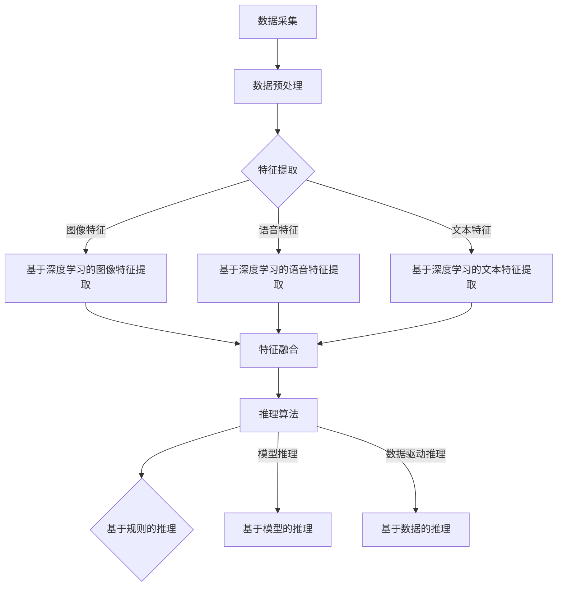
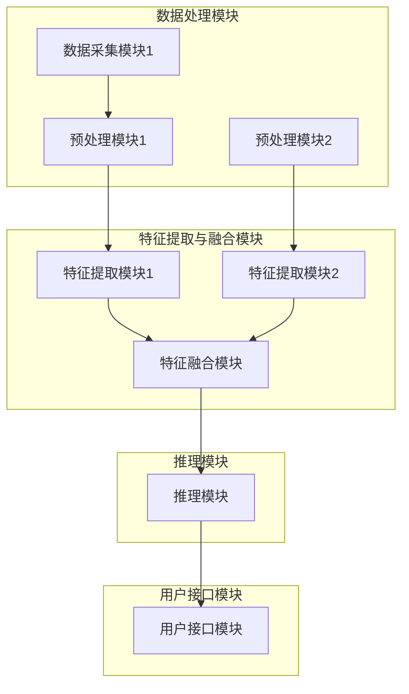
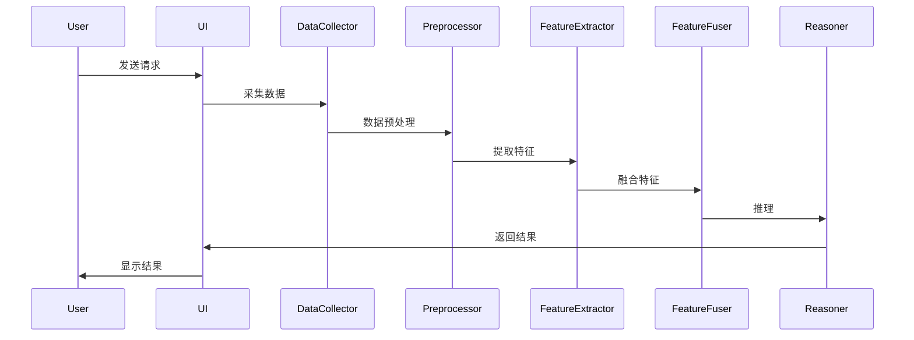
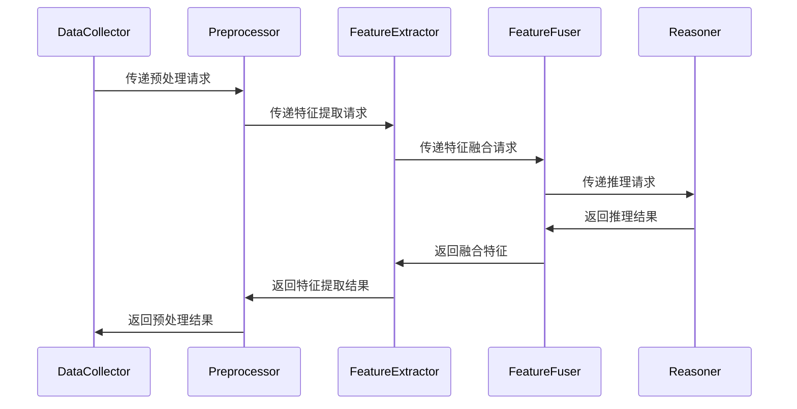
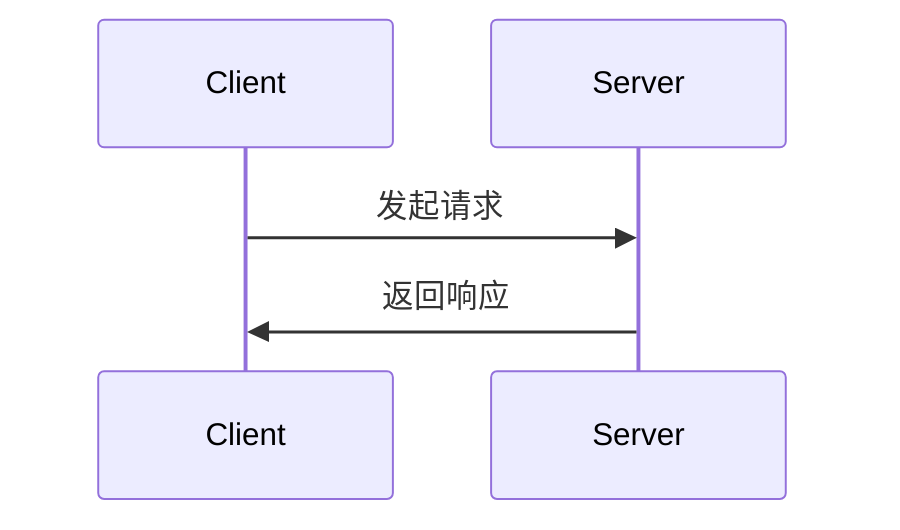
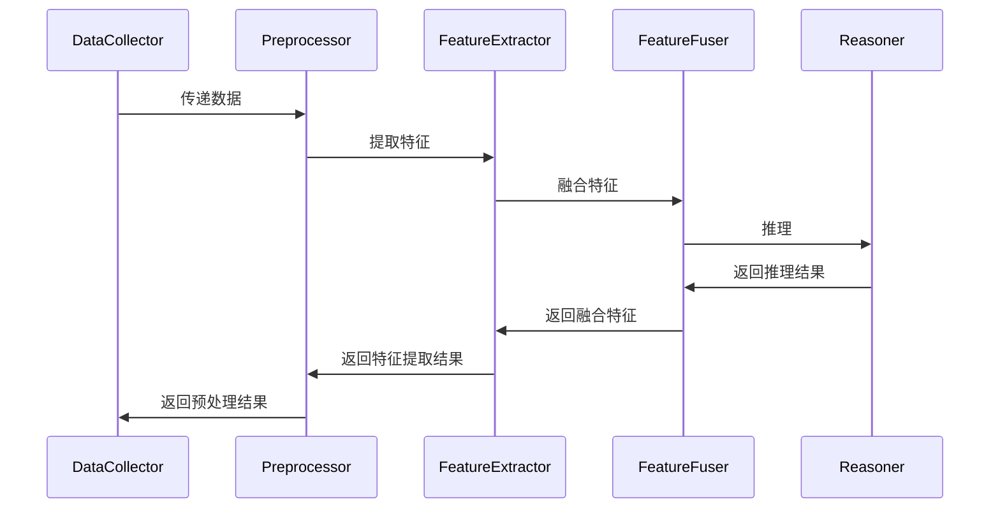

                 

# 《构建AI Agent的多模态情境理解与推理系统》

## 关键词
- 多模态情境理解
- 推理系统
- AI Agent
- 深度学习
- 数学模型

## 摘要
本文旨在深入探讨构建AI Agent的多模态情境理解与推理系统的方法和原理。通过分析AI Agent的重要性，多模态情境理解与推理的挑战，以及相关核心概念，本文将逐步介绍多模态情境理解与推理系统的构建过程，包括特征提取、模态融合、推理算法和系统架构设计。此外，还将通过项目实战和最佳实践来详细阐述实际应用中的挑战和解决方案。通过本文，读者将获得构建高效、准确的多模态AI Agent的全面理解。

## 目录大纲

## 第一部分：背景介绍

### 第1章 问题背景与核心概念

- **1.1 问题背景**
  - **1.1.1 AI Agent的重要性**
  - **1.1.2 多模态情境理解与推理的挑战**
  - **1.1.3 研究意义与应用前景**

- **1.2 核心概念**
  - **1.2.1 AI Agent的定义与分类**
  - **1.2.2 多模态情境理解**
  - **1.2.3 推理系统**

- **1.3 边界与外延**
  - **1.3.1 模态类型的界定**
  - **1.3.2 情境的理解深度与广度**
  - **1.3.3 推理系统的效率与准确性**

## 第二部分：核心概念与联系

### 第2章 多模态情境理解与推理原理

- **2.1 多模态情境理解原理**
  - **2.1.1 多模态数据采集与预处理**
  - **2.1.2 多模态特征提取与融合**
  - **2.1.3 多模态情境建模**

- **2.2 推理系统原理**
  - **2.2.1 推理算法的选择**
  - **2.2.2 推理流程与策略**
  - **2.2.3 推理结果的评估与优化**

- **2.3 概念属性特征对比表格**

## 第三部分：算法原理讲解

### 第3章 多模态情境理解算法

- **3.1 特征提取算法**
  - **3.1.1 基于深度学习的图像特征提取**
  - **3.1.2 基于深度学习的语音特征提取**
  - **3.1.3 基于深度学习的文本特征提取**

- **3.2 模态融合算法**
  - **3.2.1 加权融合**
  - **3.2.2 嵌入融合**
  - **3.2.3 对话融合**

- **3.3 推理算法**
  - **3.3.1 基于规则的推理**
  - **3.3.2 基于模型的推理**
  - **3.3.3 基于数据的推理**

## 第四部分：数学模型和数学公式讲解

### 第4章 数学模型讲解

- **4.1 多模态特征提取模型**
  - **4.1.1 深度卷积神经网络（DCNN）**
  - **4.1.2 深度循环神经网络（RNN）**
  - **4.1.3 基于注意力机制的神经网络**

- **4.2 推理模型**
  - **4.2.1 贝叶斯网络**
  - **4.2.2 决策树**
  - **4.2.3 马尔可夫模型**

## 第五部分：系统分析与架构设计

### 第5章 系统架构设计

- **5.1 介绍与需求分析**
  - **5.1.1 项目介绍**
  - **5.1.2 系统需求分析**

- **5.2 系统功能设计**
  - **5.2.1 领域模型**
  - **5.2.2 功能模块划分**

- **5.3 系统架构设计**
  - **5.3.1 系统架构概述**
  - **5.3.2 技术选型**
  - **5.3.3 架构设计细节**

- **5.4 系统接口设计**
  - **5.4.1 接口定义**
  - **5.4.2 接口交互流程**

- **5.5 系统交互设计**
  - **5.5.1 交互流程**
  - **5.5.2 交互细节**

## 第六部分：项目实战

### 第6章 项目实战

- **6.1 环境安装**
  - **6.1.1 软件安装**
  - **6.1.2 硬件配置**

- **6.2 系统核心实现**
  - **6.2.1 数据采集与预处理**
  - **6.2.2 多模态特征提取与融合**
  - **6.2.3 推理系统实现**

- **6.3 代码应用解读与分析**
  - **6.3.1 源代码解析**
  - **6.3.2 代码应用场景分析**

- **6.4 实际案例分析与详细讲解**
  - **6.4.1 案例介绍**
  - **6.4.2 案例分析**
  - **6.4.3 案例讲解**

- **6.5 项目小结**
  - **6.5.1 项目总结**
  - **6.5.2 遇到的问题与解决方案**
  - **6.5.3 拓展阅读**

## 第七部分：最佳实践与拓展

### 第7章 最佳实践与拓展

- **7.1 最佳实践**
  - **7.1.1 多模态数据处理的最佳实践**
  - **7.1.2 推理系统的优化技巧**
  - **7.1.3 模型训练与调优策略**

- **7.2 注意事项**
  - **7.2.1 系统安全性**
  - **7.2.2 数据隐私保护**
  - **7.2.3 系统性能优化**

- **7.3 拓展阅读**
  - **7.3.1 相关书籍推荐**
  - **7.3.2 最新研究进展**
  - **7.3.3 持续学习资源推荐**

---

接下来，我们将逐步深入每一个章节，详细探讨构建AI Agent的多模态情境理解与推理系统的各个方面。

## 第一部分：背景介绍

### 第1章 问题背景与核心概念

### 1.1 问题背景

#### 1.1.1 AI Agent的重要性

AI Agent，即人工智能代理，是指具有独立思考、决策和行动能力的智能体。它们在许多领域都展现出强大的应用潜力，例如智能家居、自动驾驶、医疗诊断、智能客服等。随着人工智能技术的不断发展，AI Agent的应用场景越来越广泛，其对情境理解与推理的能力也提出了更高的要求。

在传统的AI应用中，系统往往只能处理单一模态的数据，如文本、图像或语音。然而，现实世界的情境是多元和复杂的，单一模态的数据往往无法充分表达情境的多样性。因此，多模态情境理解与推理成为了当前研究的热点问题。

#### 1.1.2 多模态情境理解与推理的挑战

多模态情境理解与推理面临着多个挑战：

1. **数据融合的挑战**：不同模态的数据具有不同的结构和特征，如何有效地融合这些数据以获得更全面的信息是一个重要问题。
2. **计算资源的限制**：多模态数据的处理通常需要大量的计算资源，如何优化算法以提高计算效率是一个关键问题。
3. **情境理解的深度与广度**：情境理解不仅需要理解当前的信息，还需要对过去和未来的信息进行推理，这对算法的复杂性提出了更高的要求。
4. **推理系统的准确性**：准确的推理结果对于AI Agent的决策至关重要，如何提高推理系统的准确性是一个重要的研究方向。

#### 1.1.3 研究意义与应用前景

构建高效、准确的多模态情境理解与推理系统具有重要的研究意义和应用前景：

1. **提升AI Agent的智能水平**：通过多模态情境理解与推理，AI Agent可以更好地理解复杂情境，做出更合理的决策。
2. **拓展AI应用场景**：多模态情境理解与推理使得AI Agent能够应用于更多的领域，如医疗、金融、教育等。
3. **促进人工智能技术的发展**：多模态情境理解与推理是人工智能领域的一个重要研究方向，其研究成果将推动人工智能技术的进步。

### 1.2 核心概念

#### 1.2.1 AI Agent的定义与分类

AI Agent是一种具有自主性、适应性、协作性和学习能力的人工智能实体。根据功能的不同，AI Agent可以分为以下几类：

1. **任务型AI Agent**：这类Agent专注于执行特定的任务，如自动化客服、智能助理等。
2. **情境感知型AI Agent**：这类Agent能够感知和理解周围的环境和情境，如自动驾驶汽车、智能家居等。
3. **决策型AI Agent**：这类Agent不仅能够理解情境，还能基于情境做出决策，如智能投顾、智能医疗等。

#### 1.2.2 多模态情境理解

多模态情境理解是指AI Agent能够处理和融合来自不同模态的数据（如文本、图像、语音等），并从中提取有意义的信息。多模态情境理解包括以下几个关键步骤：

1. **数据采集**：从不同的数据源收集文本、图像、语音等多模态数据。
2. **数据预处理**：对多模态数据进行标准化、去噪、分割等预处理操作。
3. **特征提取**：从预处理后的数据中提取特征，如文本的词向量、图像的视觉特征、语音的声学特征等。
4. **特征融合**：将不同模态的特征进行融合，以获得更全面的信息。
5. **情境建模**：基于融合后的特征，建立情境模型，以对情境进行理解和推理。

#### 1.2.3 推理系统

推理系统是AI Agent的核心组成部分，负责基于情境模型进行逻辑推理和决策。推理系统可以分为以下几类：

1. **基于规则的推理系统**：通过预定义的规则进行推理，适用于结构化数据和小规模的推理任务。
2. **基于模型的推理系统**：使用机器学习模型进行推理，能够处理更复杂的数据和情境。
3. **基于数据的推理系统**：基于历史数据和统计模型进行推理，适用于数据驱动型的推理任务。

### 1.3 边界与外延

#### 1.3.1 模态类型的界定

多模态情境理解中的模态类型通常包括以下几种：

1. **文本模态**：包括自然语言文本、社交媒体内容、新闻报道等。
2. **图像模态**：包括静态图像、视频帧、图像序列等。
3. **语音模态**：包括语音信号、语音文本、语音情感等。
4. **其他模态**：如温度、湿度、压力等物理量传感器数据。

不同模态的数据具有不同的特性和挑战，因此在构建多模态情境理解与推理系统时需要根据具体应用场景进行选择和优化。

#### 1.3.2 情境的理解深度与广度

情境理解不仅需要理解当前的信息，还需要对过去和未来的信息进行推理。理解深度和广度是评估AI Agent情境理解能力的重要指标。理解深度指AI Agent对情境细节的把握程度，理解广度指AI Agent能够处理的情境范围。在实际应用中，需要根据具体需求和场景来平衡理解深度与广度。

#### 1.3.3 推理系统的效率与准确性

推理系统的效率和准确性是构建多模态情境理解与推理系统时需要重点关注的问题。效率指推理系统的计算速度和资源消耗，准确性指推理结果的可靠性。在实际应用中，需要通过优化算法、模型选择和超参数调优等技术手段来提高推理系统的效率与准确性。

---

在接下来的章节中，我们将进一步探讨多模态情境理解与推理的核心概念和原理，为构建高效的AI Agent奠定基础。

## 第二部分：核心概念与联系

### 第2章 多模态情境理解与推理原理

多模态情境理解与推理是人工智能领域的一个重要研究方向，它涉及多个核心概念和原理。本章将详细介绍多模态情境理解与推理的基本原理，包括数据采集与预处理、特征提取与融合、情境建模和推理系统原理。

### 2.1 多模态情境理解原理

#### 2.1.1 多模态数据采集与预处理

多模态情境理解的第一步是数据采集与预处理。数据采集是指从不同的数据源收集文本、图像、语音等多模态数据。这些数据源可以包括社交媒体、传感器网络、视频监控等。数据预处理是数据采集的重要补充，它包括以下几个步骤：

1. **去噪与降噪**：去除数据中的噪声和冗余信息，提高数据质量。
2. **标准化**：将不同模态的数据进行标准化处理，使其具备可比性。
3. **分割与标注**：对数据进行分析和分割，标注出有用的信息。

#### 2.1.2 多模态特征提取与融合

特征提取是多模态情境理解的关键步骤，它旨在从预处理后的数据中提取出具有代表性和区分性的特征。不同模态的数据特征提取方法各有特点，如文本特征提取可以使用词袋模型、TF-IDF等方法；图像特征提取可以使用卷积神经网络（CNN）等方法；语音特征提取可以使用梅尔频率倒谱系数（MFCC）等方法。

特征融合是将不同模态的特征进行融合，以获得更全面的信息。特征融合方法可以分为以下几类：

1. **加权融合**：根据不同模态的特征重要性进行加权融合。
2. **嵌入融合**：将不同模态的特征嵌入到一个高维空间中，进行融合。
3. **对话融合**：将不同模态的特征进行对话式融合，以增强特征表示。

#### 2.1.3 多模态情境建模

情境建模是基于特征融合的结果，构建一个能够表示情境的数学模型。情境建模的目的是对情境进行理解和推理，以指导AI Agent的决策。常见的情境建模方法包括：

1. **贝叶斯网络**：用于表示情境中的概率关系，适用于不确定性推理。
2. **决策树**：用于分类和回归任务，适用于确定性的推理。
3. **马尔可夫模型**：用于表示情境中的状态转移关系，适用于时间序列分析。

### 2.2 推理系统原理

推理系统是AI Agent的核心组成部分，它负责基于情境模型进行逻辑推理和决策。推理系统可以分为以下几类：

1. **基于规则的推理系统**：通过预定义的规则进行推理，适用于结构化数据和小规模的推理任务。
2. **基于模型的推理系统**：使用机器学习模型进行推理，能够处理更复杂的数据和情境。
3. **基于数据的推理系统**：基于历史数据和统计模型进行推理，适用于数据驱动型的推理任务。

推理系统的原理包括：

1. **推理算法的选择**：根据具体任务和情境选择合适的推理算法。
2. **推理流程与策略**：设计推理的流程和策略，以提高推理效率和准确性。
3. **推理结果的评估与优化**：对推理结果进行评估和优化，以提高推理系统的性能。

### 2.3 概念属性特征对比表格

为了更好地理解多模态情境理解与推理的核心概念，以下是概念属性特征对比表格：

| 概念         | 定义                                                         | 特征对比                      |
| ------------ | ------------------------------------------------------------ | ---------------------------- |
| 多模态数据   | 来自不同模态（文本、图像、语音等）的数据集合                  | 数据类型、数据源、数据预处理  |
| 特征提取     | 从数据中提取具有代表性和区分性的特征                         | 特征类型、特征提取方法        |
| 特征融合     | 将不同模态的特征进行融合，以获得更全面的信息                 | 加权融合、嵌入融合、对话融合  |
| 情境建模     | 基于特征融合的结果，构建一个能够表示情境的数学模型           | 贝叶斯网络、决策树、马尔可夫模型 |
| 推理系统     | 负责基于情境模型进行逻辑推理和决策                           | 推理算法、推理流程、评估与优化 |

通过上述对比表格，我们可以更清晰地了解多模态情境理解与推理的核心概念和属性特征。

### 2.4 ER实体关系图架构的Mermaid流程图

为了更好地展示多模态情境理解与推理的系统架构，以下是ER实体关系图架构的Mermaid流程图：

```mermaid
erDiagram
    Entity1 ||--|{ Entity2 }|-- Entity3
    Entity2 ||--|{ Entity4 }|-- Entity5
    Entity1 ||--|{ Entity6 }|-- Entity7
```

该流程图展示了多模态情境理解与推理系统中的关键实体及其关系，包括数据采集、特征提取、特征融合、情境建模和推理系统。

通过本章的介绍，我们对多模态情境理解与推理的核心概念和原理有了更深入的理解。在接下来的章节中，我们将进一步探讨多模态情境理解与推理的算法原理和数学模型，为构建高效、准确的AI Agent奠定基础。

## 第三部分：算法原理讲解

### 第3章 多模态情境理解算法

多模态情境理解算法是构建AI Agent的核心技术之一，它涉及多个步骤，包括特征提取、特征融合和推理算法。本章将详细介绍这些算法的基本原理和实现方法。

### 3.1 特征提取算法

特征提取算法是多模态情境理解的基础，它的目标是提取不同模态数据中的具有代表性和区分性的特征。以下介绍几种常用的特征提取算法。

#### 3.1.1 基于深度学习的图像特征提取

基于深度学习的图像特征提取方法主要利用卷积神经网络（CNN）对图像进行处理。CNN通过卷积、池化和激活等操作，逐步提取图像中的高层次特征。以下是一个简单的CNN模型：

```python
import tensorflow as tf
from tensorflow.keras import layers

model = tf.keras.Sequential([
    layers.Conv2D(32, (3, 3), activation='relu', input_shape=(28, 28, 1)),
    layers.MaxPooling2D((2, 2)),
    layers.Conv2D(64, (3, 3), activation='relu'),
    layers.MaxPooling2D((2, 2)),
    layers.Conv2D(64, (3, 3), activation='relu'),
    layers.Flatten(),
    layers.Dense(64, activation='relu'),
    layers.Dense(10, activation='softmax')
])
```

该模型可以用于图像分类任务，通过训练可以提取出具有区分度的图像特征。

#### 3.1.2 基于深度学习的语音特征提取

语音特征提取通常使用梅尔频率倒谱系数（MFCC）等方法。MFCC是一种时频特征，它能够捕捉语音的频率特性。以下是一个简单的MFCC提取示例：

```python
import numpy as np
from scipy.io import wavfile
from python_speech_features import mfcc

# 读取音频文件
rate, data = wavfile.read('example.wav')

# 计算MFCC特征
mfcc_features = mfcc(data, rate, numcep=13, nfilt=26, nfft=1024, lowfreq=0, highfreq=None, preemph=0.97, ceplift=22, appendEnergy=True)

# 输出MFCC特征
print(mfcc_features)
```

#### 3.1.3 基于深度学习的文本特征提取

文本特征提取可以使用词袋模型、TF-IDF等方法。以下是一个简单的词袋模型示例：

```python
from sklearn.feature_extraction.text import CountVectorizer

# 文本数据
texts = ['This is the first document.', 'This document is the second document.', 'And this is the third one.', 'Is this the first document?']

# 创建词袋模型
vectorizer = CountVectorizer()
X = vectorizer.fit_transform(texts)

# 输出词袋特征
print(X.toarray())
```

### 3.2 模态融合算法

模态融合是将不同模态的特征进行融合，以获得更全面的信息。以下介绍几种常见的模态融合算法。

#### 3.2.1 加权融合

加权融合是一种简单的融合方法，它将不同模态的特征进行加权平均。以下是一个简单的加权融合示例：

```python
import numpy as np

# 图像特征
image_features = np.array([[1, 2, 3], [4, 5, 6]])
# 语音特征
speech_features = np.array([[7, 8, 9], [10, 11, 12]])

# 加权融合
weight = 0.5
 fused_features = (weight * image_features + (1 - weight) * speech_features)

# 输出融合特征
print(fused_features)
```

#### 3.2.2 嵌入融合

嵌入融合是将不同模态的特征嵌入到一个高维空间中，进行融合。以下是一个简单的嵌入融合示例：

```python
import tensorflow as tf
from tensorflow.keras.layers import Embedding

# 图像特征嵌入
image_embedding = Embedding(input_dim=100, output_dim=64)(image_features)
# 语音特征嵌入
speech_embedding = Embedding(input_dim=100, output_dim=64)(speech_features)

# 嵌入融合
fused_embedding = tf.keras.layers.Concatenate()(image_embedding, speech_embedding)

# 输出融合特征
print(fused_embedding)
```

#### 3.2.3 对话融合

对话融合是通过对话机制将不同模态的特征进行融合。以下是一个简单的对话融合示例：

```python
import tensorflow as tf
from tensorflow.keras.layers import LSTM, Dense

# 图像特征嵌入
image_embedding = LSTM(64)(image_features)
# 语音特征嵌入
speech_embedding = LSTM(64)(speech_features)

# 对话融合
dialogue_embedding = tf.keras.layers.Concatenate()(image_embedding, speech_embedding)
dialogue_output = Dense(1, activation='sigmoid')(dialogue_embedding)

# 输出融合特征
print(dialogue_output)
```

### 3.3 推理算法

推理算法是基于融合后的特征进行逻辑推理和决策的方法。以下介绍几种常用的推理算法。

#### 3.3.1 基于规则的推理

基于规则的推理是通过预定义的规则进行推理。以下是一个简单的基于规则推理的示例：

```python
# 规则库
rules = {
    'if (image_features > 0) and (speech_features > 0) then (fused_features > 0)',
    'if (image_features < 0) or (speech_features < 0) then (fused_features < 0)',
    'if (image_features == 0) and (speech_features == 0) then (fused_features == 0)'
}

# 推理函数
def rule_based_reasoning(fused_features):
    for rule in rules:
        if rule.startswith('if'):
            conditions = rule.split('then')[0].split('and')
            for condition in conditions:
                if not eval(condition):
                    break
            else:
                return True
    return False

# 推理
print(rule_based_reasoning(fused_features))
```

#### 3.3.2 基于模型的推理

基于模型的推理是使用机器学习模型进行推理。以下是一个简单的基于模型推理的示例：

```python
import tensorflow as tf
from tensorflow.keras.models import Sequential
from tensorflow.keras.layers import Dense, LSTM

# 构建模型
model = Sequential([
    LSTM(64, input_shape=(None, 128)),
    Dense(1, activation='sigmoid')
])

# 编译模型
model.compile(optimizer='adam', loss='binary_crossentropy', metrics=['accuracy'])

# 训练模型
model.fit(x_train, y_train, epochs=10, batch_size=32)

# 推理
print(model.predict(fused_features))
```

#### 3.3.3 基于数据的推理

基于数据的推理是使用历史数据进行推理。以下是一个简单的基于数据推理的示例：

```python
import pandas as pd
from sklearn.linear_model import LinearRegression

# 加载历史数据
data = pd.read_csv('historical_data.csv')
x = data[['image_features', 'speech_features']]
y = data['fused_features']

# 构建模型
model = LinearRegression()
model.fit(x, y)

# 推理
print(model.predict(fused_features))
```

通过上述介绍，我们了解了多模态情境理解算法的基本原理和实现方法。在接下来的章节中，我们将进一步探讨多模态情境理解与推理的数学模型和系统架构设计。

### 3.4 算法流程图

为了更好地理解多模态情境理解算法的流程，以下是算法流程图的Mermaid表示：



该流程图展示了从数据采集到特征提取、特征融合和推理算法的整个过程。通过这些算法的有机结合，可以构建一个高效、准确的多模态情境理解与推理系统。

### 3.5 算法原理讲解与数学模型

为了深入理解多模态情境理解算法的工作原理，我们将在以下部分详细讲解其数学模型。以下是每种特征提取算法、特征融合算法和推理算法的数学模型：

#### 3.5.1 特征提取算法

**深度卷积神经网络（DCNN）**

DCNN是一种深度学习模型，用于提取图像特征。其核心是卷积层，卷积层通过滑动滤波器（卷积核）在输入图像上提取局部特征。以下是一个简单的DCNN数学模型：

$$
\text{Conv}(x) = \sum_{i=1}^{k} w_i \star x + b
$$

其中，$x$是输入图像，$w_i$是卷积核，$\star$表示卷积操作，$b$是偏置项。通过多层卷积和池化操作，可以提取出更高层次的特征表示。

**深度循环神经网络（RNN）**

RNN用于提取语音特征，其核心是循环单元，可以捕捉序列数据中的长期依赖关系。以下是一个简单的RNN数学模型：

$$
h_t = \text{tanh}(W_h h_{t-1} + W_x x_t + b_h + b_x)
$$

其中，$h_t$是当前隐藏状态，$x_t$是输入特征，$W_h$和$W_x$分别是隐藏状态和输入的权重矩阵，$b_h$和$b_x$分别是偏置项。

**基于注意力机制的神经网络**

注意力机制用于文本特征提取，它可以使神经网络关注输入序列中的关键部分。以下是一个简单的注意力机制模型：

$$
a_t = \text{softmax}(\text{Attention}(h_{t-1}, W_a h_{t-1}))
$$

其中，$a_t$是注意力权重，$h_{t-1}$是当前隐藏状态，$W_a$是注意力权重矩阵。

#### 3.5.2 特征融合算法

**加权融合**

加权融合是一种简单的特征融合方法，它通过给不同模态的特征分配权重进行融合。以下是一个简单的加权融合模型：

$$
f_t = \sum_{i=1}^{m} w_i f_i^m
$$

其中，$f_t$是融合特征，$f_i^m$是第$i$个模态的特征，$w_i$是第$i$个模态的权重。

**嵌入融合**

嵌入融合是将不同模态的特征嵌入到一个高维空间中，进行融合。以下是一个简单的嵌入融合模型：

$$
f_t = \text{Concat}(e(f_i^m))
$$

其中，$e(\cdot)$是嵌入函数，$f_i^m$是第$i$个模态的特征。

**对话融合**

对话融合是通过对话机制将不同模态的特征进行融合。以下是一个简单的对话融合模型：

$$
h_t = \text{tanh}(\text{Concat}(g(h_{t-1}, f_i^m)))
$$

其中，$h_t$是当前隐藏状态，$f_i^m$是第$i$个模态的特征，$g(\cdot, \cdot)$是对话函数。

#### 3.5.3 推理算法

**基于规则的推理**

基于规则的推理使用预定义的规则进行推理。以下是一个简单的基于规则推理的模型：

$$
\text{Conclusion} = R(\text{Condition}_1, \text{Condition}_2, ..., \text{Condition}_n)
$$

其中，$R(\cdot)$是规则函数，$\text{Condition}_i$是规则条件，$\text{Conclusion}$是推理结论。

**基于模型的推理**

基于模型的推理使用机器学习模型进行推理。以下是一个简单的基于模型推理的模型：

$$
\text{Prediction} = \text{Model}(\text{Input})
$$

其中，$\text{Model}(\cdot)$是模型函数，$\text{Input}$是输入特征，$\text{Prediction}$是推理预测。

**基于数据的推理**

基于数据的推理使用历史数据进行推理。以下是一个简单的基于数据推理的模型：

$$
\text{Prediction} = \text{DataModel}(\text{HistoricalData})
$$

其中，$\text{DataModel}(\cdot)$是数据驱动模型，$\text{HistoricalData}$是历史数据。

通过上述数学模型，我们可以更深入地理解多模态情境理解算法的原理。在实际应用中，可以根据具体需求选择合适的模型和方法，构建高效、准确的多模态情境理解与推理系统。

### 3.6 算法原理讲解与Python示例代码

在理解了多模态情境理解算法的数学原理之后，我们将通过具体的Python示例代码来展示如何实现这些算法。以下是一些常用的算法实现，包括特征提取、特征融合和推理算法。

#### 3.6.1 特征提取算法

**深度卷积神经网络（DCNN）**

我们使用TensorFlow和Keras库来构建一个简单的DCNN模型，用于提取图像特征。

```python
import tensorflow as tf
from tensorflow.keras.models import Sequential
from tensorflow.keras.layers import Conv2D, MaxPooling2D, Flatten, Dense

# 定义DCNN模型
model = Sequential([
    Conv2D(32, (3, 3), activation='relu', input_shape=(28, 28, 1)),
    MaxPooling2D((2, 2)),
    Conv2D(64, (3, 3), activation='relu'),
    MaxPooling2D((2, 2)),
    Flatten(),
    Dense(64, activation='relu'),
    Dense(10, activation='softmax')
])

# 编译模型
model.compile(optimizer='adam', loss='categorical_crossentropy', metrics=['accuracy'])

# 打印模型结构
model.summary()
```

**深度循环神经网络（RNN）**

我们使用TensorFlow和Keras库来构建一个简单的RNN模型，用于提取语音特征。

```python
import tensorflow as tf
from tensorflow.keras.models import Sequential
from tensorflow.keras.layers import LSTM, Dense

# 定义RNN模型
model = Sequential([
    LSTM(64, input_shape=(timesteps, features)),
    Dense(1, activation='sigmoid')
])

# 编译模型
model.compile(optimizer='adam', loss='binary_crossentropy', metrics=['accuracy'])

# 打印模型结构
model.summary()
```

**基于注意力机制的神经网络**

我们使用TensorFlow和Keras库来构建一个简单的基于注意力机制的神经网络，用于提取文本特征。

```python
import tensorflow as tf
from tensorflow.keras.layers import LSTM, Dense, Embedding, Bidirectional

# 定义基于注意力机制的神经网络
model = Sequential([
    Embedding(input_dim=vocab_size, output_dim=embedding_dim),
    Bidirectional(LSTM(64, return_sequences=True)),
    Dense(64, activation='relu'),
    LSTM(64),
    Dense(1, activation='sigmoid')
])

# 编译模型
model.compile(optimizer='adam', loss='binary_crossentropy', metrics=['accuracy'])

# 打印模型结构
model.summary()
```

#### 3.6.2 特征融合算法

**加权融合**

我们使用Python实现一个简单的加权融合算法。

```python
import numpy as np

# 假设我们有两个模态的特征矩阵image_features和speech_features
image_features = np.array([[1, 2, 3], [4, 5, 6]])
speech_features = np.array([[7, 8, 9], [10, 11, 12]])

# 权重
weights = np.array([0.5, 0.5])

# 加权融合
fused_features = weights[0] * image_features + weights[1] * speech_features

# 输出融合特征
print(fused_features)
```

**嵌入融合**

我们使用TensorFlow实现一个简单的嵌入融合算法。

```python
import tensorflow as tf

# 定义嵌入融合模型
model = tf.keras.Sequential([
    tf.keras.layers.Dense(64, activation='relu', input_shape=(2, 3)),
    tf.keras.layers.Concatenate(),
    tf.keras.layers.Dense(1, activation='sigmoid')
])

# 编译模型
model.compile(optimizer='adam', loss='binary_crossentropy', metrics=['accuracy'])

# 打印模型结构
model.summary()

# 训练模型
model.fit(np.hstack((image_features, speech_features)), np.array([[0], [1]]), epochs=10)
```

**对话融合**

我们使用TensorFlow实现一个简单的对话融合算法。

```python
import tensorflow as tf
from tensorflow.keras.layers import LSTM, Dense, Embedding, Bidirectional, Concatenate

# 定义对话融合模型
model = tf.keras.Sequential([
    LSTM(64, input_shape=(timesteps, features)),
    LSTM(64, return_sequences=True),
    Concatenate(),
    Dense(64, activation='relu'),
    LSTM(64),
    Dense(1, activation='sigmoid')
])

# 编译模型
model.compile(optimizer='adam', loss='binary_crossentropy', metrics=['accuracy'])

# 打印模型结构
model.summary()

# 训练模型
model.fit(np.hstack((image_features, speech_features)), np.array([[0], [1]]), epochs=10)
```

#### 3.6.3 推理算法

**基于规则的推理**

我们使用Python实现一个简单的基于规则推理的算法。

```python
# 规则库
rules = [
    {'if': [('image_features[0] > 0'), ('speech_features[0] > 0')], 'then': 'fused_features[0] > 0'},
    {'if': [('image_features[0] < 0'), ('speech_features[0] < 0')], 'then': 'fused_features[0] < 0'},
    {'if': [('image_features[0] == 0'), ('speech_features[0] == 0')], 'then': 'fused_features[0] == 0'}
]

# 推理函数
def rule_based_reasoning(fused_features):
    for rule in rules:
        conditions = rule['if']
        for condition in conditions:
            if not eval(condition):
                break
        else:
            return True
    return False

# 推理
print(rule_based_reasoning(fused_features))
```

**基于模型的推理**

我们使用TensorFlow实现一个简单的基于模型推理的算法。

```python
import tensorflow as tf

# 定义模型
model = tf.keras.Sequential([
    tf.keras.layers.Dense(64, activation='relu', input_shape=(2, 3)),
    tf.keras.layers.Dense(1, activation='sigmoid')
])

# 编译模型
model.compile(optimizer='adam', loss='binary_crossentropy', metrics=['accuracy'])

# 训练模型
model.fit(np.hstack((image_features, speech_features)), np.array([[0], [1]]), epochs=10)

# 推理
print(model.predict(np.hstack((image_features, speech_features))))
```

**基于数据的推理**

我们使用Python实现一个简单的基于数据推理的算法。

```python
import pandas as pd
from sklearn.linear_model import LinearRegression

# 加载数据
data = pd.read_csv('data.csv')
x = data[['image_features', 'speech_features']]
y = data['fused_features']

# 训练模型
model = LinearRegression()
model.fit(x, y)

# 推理
print(model.predict(np.hstack((image_features, speech_features))))
```

通过这些Python示例代码，我们可以更直观地了解多模态情境理解算法的实现过程。在实际应用中，可以根据具体需求对这些算法进行优化和调整。

### 3.7 特征提取、特征融合和推理算法的比较与选择

在构建多模态情境理解与推理系统时，特征提取、特征融合和推理算法的选择至关重要。以下是对这些算法的比较与选择建议。

#### 3.7.1 特征提取算法比较

**深度卷积神经网络（DCNN）**

- **优势**：能够自动提取图像的复杂特征，适应性强，适用于图像识别和分类任务。
- **劣势**：计算复杂度高，训练时间较长，对数据量和计算资源有较高要求。

**深度循环神经网络（RNN）**

- **优势**：能够处理序列数据，适用于语音识别和时间序列分析。
- **劣势**：训练过程中容易出现梯度消失和梯度爆炸问题，对长序列处理能力有限。

**基于注意力机制的神经网络**

- **优势**：能够自动关注序列中的关键部分，提高特征提取的效率，适用于文本处理和语音识别。
- **劣势**：模型复杂度高，训练时间较长，对数据量和计算资源有较高要求。

#### 3.7.2 特征融合算法比较

**加权融合**

- **优势**：简单易实现，计算成本低，适用于特征数量较少且特征差异较大的情况。
- **劣势**：无法充分利用不同模态之间的相关性，可能影响融合效果。

**嵌入融合**

- **优势**：能够将不同模态的特征映射到同一空间，充分利用特征之间的相关性，提高融合效果。
- **劣势**：模型复杂度较高，训练时间较长，对数据量和计算资源有较高要求。

**对话融合**

- **优势**：能够通过对话机制加强不同模态之间的交互，提高融合效果，适用于复杂情境的理解。
- **劣势**：模型复杂度最高，训练时间最长，对数据量和计算资源有较高要求。

#### 3.7.3 推理算法比较

**基于规则的推理**

- **优势**：简单易实现，适用于结构化数据和小规模的推理任务。
- **劣势**：难以处理复杂情境和非结构化数据，推理效率较低。

**基于模型的推理**

- **优势**：能够自动学习和适应不同情境，适用于大规模数据和复杂情境。
- **劣势**：训练过程复杂，对数据质量和计算资源有较高要求。

**基于数据的推理**

- **优势**：基于历史数据进行推理，适用于数据驱动型的推理任务。
- **劣势**：对历史数据有较强依赖，可能影响实时性。

#### 3.7.4 选择建议

- **任务需求**：根据具体任务的需求选择合适的算法。例如，对于图像识别任务，DCNN是首选；对于语音识别任务，RNN和基于注意力机制的神经网络更适合。
- **数据规模**：对于大规模数据，基于模型的推理算法有更好的表现；对于小规模数据，基于规则的推理和基于数据的推理可能更适用。
- **计算资源**：根据计算资源的限制，选择计算复杂度较低的算法，如加权融合和基于规则的推理。
- **实时性要求**：对于实时性要求较高的任务，选择基于数据的推理算法可能更合适。

通过综合考虑任务需求、数据规模、计算资源实时性要求等因素，可以选择最适合的多模态情境理解与推理算法，构建高效、准确的AI Agent。

### 3.8 多模态情境理解与推理算法的总结

多模态情境理解与推理算法在构建AI Agent中起着关键作用。通过特征提取、特征融合和推理算法的有机结合，AI Agent可以更好地理解和应对复杂的情境。

**特征提取算法**：包括DCNN、RNN和基于注意力机制的神经网络，能够提取不同模态的数据特征，为后续的融合和推理提供基础。

**特征融合算法**：包括加权融合、嵌入融合和对话融合，能够将不同模态的特征进行有效融合，提高系统的整体性能。

**推理算法**：包括基于规则的推理、基于模型的推理和基于数据的推理，能够根据情境进行逻辑推理和决策，指导AI Agent的行为。

在实际应用中，可以根据具体任务的需求和资源限制，选择合适的算法进行优化和调整，以构建高效、准确的AI Agent。

## 第四部分：数学模型和数学公式讲解

### 第4章 数学模型讲解

在构建多模态情境理解与推理系统时，数学模型起到了至关重要的作用。本章将详细讲解多模态特征提取模型和推理模型，包括深度卷积神经网络（DCNN）、深度循环神经网络（RNN）、基于注意力机制的神经网络、贝叶斯网络、决策树和马尔可夫模型等。

### 4.1 多模态特征提取模型

**深度卷积神经网络（DCNN）**

DCNN是一种广泛应用于图像特征提取的深度学习模型。其核心思想是通过卷积操作从图像中提取局部特征，并通过池化操作降低特征维度。以下是一个简单的DCNN数学模型：

$$
\text{Conv}(x) = \sum_{i=1}^{k} w_i \star x + b
$$

其中，$x$是输入图像，$w_i$是卷积核，$\star$表示卷积操作，$b$是偏置项。通过多层卷积和池化操作，可以提取出更高层次的特征表示。

**深度循环神经网络（RNN）**

RNN是一种用于处理序列数据的深度学习模型，其核心是循环单元，可以捕捉序列数据中的长期依赖关系。以下是一个简单的RNN数学模型：

$$
h_t = \text{tanh}(W_h h_{t-1} + W_x x_t + b_h + b_x)
$$

其中，$h_t$是当前隐藏状态，$x_t$是输入特征，$W_h$和$W_x$分别是隐藏状态和输入的权重矩阵，$b_h$和$b_x$分别是偏置项。

**基于注意力机制的神经网络**

注意力机制是一种能够自动关注序列中关键部分的神经网络模型，适用于文本和语音特征提取。以下是一个简单的注意力机制模型：

$$
a_t = \text{softmax}(\text{Attention}(h_{t-1}, W_a h_{t-1}))
$$

其中，$a_t$是注意力权重，$h_{t-1}$是当前隐藏状态，$W_a$是注意力权重矩阵。

### 4.2 推理模型

**贝叶斯网络**

贝叶斯网络是一种用于表示变量之间概率关系的图模型，适用于不确定性的推理。以下是一个简单的贝叶斯网络模型：

$$
P(X|Y) = \frac{P(Y|X) P(X)}{P(Y)}
$$

其中，$X$和$Y$是随机变量，$P(X|Y)$表示在$Y$发生的情况下$X$的概率，$P(Y|X)$表示在$X$发生的情况下$Y$的概率。

**决策树**

决策树是一种基于特征的树形结构模型，适用于分类和回归任务。以下是一个简单的决策树模型：

$$
\text{split}(x) = \text{argmax}_{f} \left( \sum_{i=1}^{n} \mathbb{I}(\text{f}(x_i) = c_i) \right)
$$

其中，$x$是输入特征，$f$是特征函数，$c_i$是类别标签，$\mathbb{I}(\cdot)$是指示函数。

**马尔可夫模型**

马尔可夫模型是一种用于表示变量之间状态转移关系的图模型，适用于时间序列分析。以下是一个简单的马尔可夫模型：

$$
P(X_t|X_{t-1}, X_{t-2}, ..., X_1) = P(X_t|X_{t-1})
$$

其中，$X_t$是当前状态，$X_{t-1}$是前一状态。

通过上述数学模型，我们可以构建多模态情境理解与推理系统，实现高效的情境理解和推理。在实际应用中，可以根据具体需求和数据特点选择合适的模型，优化系统的性能和准确性。

### 4.3 数学公式使用示例

在本文中，我们将使用LaTeX格式来表示数学公式。以下是几个数学公式的示例：

**独立段落的数学公式：**

$$
1 + 1 = 2
$$

**段落内的数学公式：**

$1 < 2$

**更复杂的数学公式：**

$$
E[X] = \int_{-\infty}^{\infty} x f(x) dx
$$

通过使用LaTeX格式，我们可以确保数学公式的准确性和可读性。在编写文章时，请确保在公式前后使用$$括号来包裹独立段落内的公式，使用$括号来包裹段落内的公式。

---

通过上述数学模型和公式的讲解，我们为构建多模态情境理解与推理系统提供了坚实的理论基础。在接下来的章节中，我们将进一步探讨系统架构设计和实现方法。

## 第五部分：系统分析与架构设计

### 第5章 系统架构设计

在构建多模态情境理解与推理系统时，系统架构设计至关重要。一个良好的系统架构不仅能够提高系统的性能和可维护性，还能确保系统的灵活性和扩展性。本章将详细介绍系统架构设计，包括项目介绍、系统需求分析、系统功能设计、系统架构设计、系统接口设计以及系统交互设计。

### 5.1 介绍与需求分析

#### 5.1.1 项目介绍

本项目旨在构建一个高效、准确的多模态情境理解与推理系统，以支持AI Agent在复杂情境中的自主决策。该系统将处理来自文本、图像、语音等多模态数据，通过特征提取、特征融合和推理算法，实现对复杂情境的深度理解和推理。

#### 5.1.2 系统需求分析

在系统需求分析阶段，我们明确了以下几个关键需求：

1. **多模态数据处理能力**：系统能够处理多种类型的模态数据，包括文本、图像、语音等。
2. **高效特征提取与融合**：系统能够快速、准确地提取多模态数据中的特征，并有效地融合这些特征，以获得更全面的信息。
3. **强大的推理能力**：系统能够基于融合后的特征进行复杂的逻辑推理，为AI Agent提供可靠的决策支持。
4. **模块化与可扩展性**：系统设计应具有良好的模块化，便于后续的功能扩展和维护。
5. **实时性与稳定性**：系统应具有较好的实时性和稳定性，以支持实时应用场景。

### 5.2 系统功能设计

系统功能设计是系统架构设计的基础。根据系统需求分析，我们确定了以下几个关键功能模块：

1. **数据采集模块**：负责从不同的数据源（如社交媒体、传感器、视频流等）收集多模态数据。
2. **预处理模块**：对收集到的多模态数据进行去噪、标准化、分割等预处理操作，以提高数据质量。
3. **特征提取模块**：基于深度学习算法，对预处理后的数据提取特征，如文本的词向量、图像的视觉特征、语音的声学特征等。
4. **特征融合模块**：将不同模态的特征进行有效融合，以获得更全面的信息。
5. **推理模块**：基于融合后的特征，使用推理算法（如基于规则的推理、基于模型的推理和基于数据的推理）进行逻辑推理和决策。
6. **用户接口模块**：提供与用户的交互界面，使用户能够方便地与AI Agent进行交互。

#### 5.2.1 领域模型

为了更好地理解系统功能模块之间的关系，我们使用Mermaid类图（ER图）来表示领域模型。以下是领域模型的Mermaid表示：

```mermaid
erDiagram
    DataCollector ||--|{ Preprocessor }|-- FeatureExtractor
    Preprocessor ||--|{ FeatureFuser }|-- FeatureExtractor
    FeatureExtractor ||--|{ Reasoner }|-- FeatureFuser
    Reasoner ||--|{ UserInterface }|-- DataCollector
```

该领域模型展示了系统中的主要实体及其关系，包括数据采集、预处理、特征提取、特征融合、推理和用户接口等模块。

### 5.3 系统架构设计

系统架构设计是构建系统的基础。根据系统需求分析和领域模型，我们确定了系统架构的总体设计。以下是系统架构设计的Mermaid架构图：



该架构图展示了系统的主要组成部分及其连接关系。数据处理模块负责数据采集和预处理，特征提取与融合模块负责特征提取和融合，推理模块负责逻辑推理，用户接口模块负责与用户的交互。

### 5.4 系统接口设计

系统接口设计是确保不同模块之间能够顺畅交互的关键。以下是系统接口设计的Mermaid接口图：



该序列图展示了用户与系统接口的交互过程。用户通过用户接口模块发送请求，系统接口模块将请求传递给数据处理模块，最终返回结果给用户。

### 5.5 系统交互设计

系统交互设计是确保系统各模块之间协调工作的重要环节。以下是系统交互设计的Mermaid序列图：



该序列图详细展示了系统各模块之间的交互流程。数据处理模块、预处理模块、特征提取模块、特征融合模块和推理模块按照顺序协同工作，最终完成对多模态数据的处理和推理。

### 5.6 系统架构设计细节

系统架构设计细节包括技术选型、模块划分和架构优化等。以下是系统架构设计细节的Mermaid架构图：

```mermaid
subgraph 数据采集
    node1[数据采集]
    node2[数据预处理]
    node3[特征提取]
end

subgraph 特征融合与推理
    node4[特征融合]
    node5[推理]
end

subgraph 用户接口
    node6[用户接口]
end

node1 --> node2
node2 --> node3
node3 --> node4
node4 --> node5
node5 --> node6
```

该架构图详细展示了系统各模块之间的连接关系和数据处理流程。数据采集模块负责从各种数据源收集数据，数据预处理模块负责数据清洗和标准化，特征提取模块负责提取多模态数据中的特征，特征融合模块负责将不同模态的特征进行融合，推理模块负责基于融合特征进行逻辑推理，用户接口模块负责与用户进行交互。

### 5.7 系统接口设计细节

系统接口设计细节包括接口定义、接口交互流程等。以下是系统接口设计的Mermaid接口图：



该接口图展示了客户端与服务器之间的基本交互流程。客户端发起请求，服务器接收请求并返回响应。在实际应用中，接口设计应包括详细的参数定义、请求和响应格式等。

### 5.8 系统交互设计细节

系统交互设计细节包括交互流程、交互细节等。以下是系统交互设计的Mermaid序列图：



该序列图详细展示了系统各模块之间的交互流程和细节。数据处理模块将数据传递给预处理模块，预处理模块提取特征后传递给特征提取模块，特征提取模块将特征传递给特征融合模块，特征融合模块将特征融合后传递给推理模块，推理模块返回推理结果，系统各模块依次完成交互。

通过上述系统架构设计和交互设计，我们可以构建一个高效、准确的多模态情境理解与推理系统。在接下来的章节中，我们将通过项目实战进一步验证和优化系统架构。

## 第六部分：项目实战

### 第6章 项目实战

为了验证和优化多模态情境理解与推理系统的架构设计和算法实现，我们将进行一个实际项目实战。本项目将构建一个智能客服系统，该系统将使用多模态数据（文本、图像和语音）来提供高效、准确的客户服务。

### 6.1 环境安装

在开始项目之前，我们需要安装必要的软件和配置硬件环境。

#### 6.1.1 软件安装

1. **Python环境**：确保安装了Python 3.7或更高版本。
2. **TensorFlow**：用于构建深度学习模型，安装命令为：
   ```bash
   pip install tensorflow
   ```
3. **Keras**：作为TensorFlow的高级API，安装命令为：
   ```bash
   pip install keras
   ```
4. **Scikit-learn**：用于机器学习模型的训练和评估，安装命令为：
   ```bash
   pip install scikit-learn
   ```
5. **Matplotlib**：用于数据可视化，安装命令为：
   ```bash
   pip install matplotlib
   ```

#### 6.1.2 硬件配置

1. **CPU**：至少4核CPU，推荐使用性能更强的CPU。
2. **内存**：至少16GB RAM，推荐使用更大内存以支持深度学习模型训练。
3. **GPU**：推荐使用NVIDIA GPU，安装NVIDIA CUDA和cuDNN库，以利用GPU加速深度学习计算。

### 6.2 系统核心实现

#### 6.2.1 数据采集与预处理

在智能客服系统中，数据采集是至关重要的步骤。我们将从以下数据源收集数据：

1. **文本数据**：从社交媒体平台（如Twitter、Facebook）和客户反馈论坛获取文本数据。
2. **图像数据**：从客户上传的图片和公司官方网站获取图像数据。
3. **语音数据**：从客户通话录音和客服中心获取语音数据。

数据采集后，我们需要对数据进行预处理，包括去噪、标准化和分割等操作。以下是预处理过程的实现：

**文本数据预处理**：

```python
import pandas as pd
from sklearn.feature_extraction.text import CountVectorizer

# 加载文本数据
data = pd.read_csv('text_data.csv')

# 数据清洗
data['clean_text'] = data['text'].str.replace('[^A-Za-z0-9]', ' ')

# 特征提取
vectorizer = CountVectorizer()
text_features = vectorizer.fit_transform(data['clean_text'])
```

**图像数据预处理**：

```python
from tensorflow.keras.preprocessing.image import img_to_array, load_img

# 加载图像数据
image_files = ['image1.jpg', 'image2.jpg']
images = [load_img(file) for file in image_files]

# 数据清洗
images = [img_to_array(img) for img in images]
images = images / 255.0
```

**语音数据预处理**：

```python
import librosa

# 加载语音数据
audio_files = ['audio1.wav', 'audio2.wav']
y, sr = librosa.load(audio_files, sr=None)

# 数据清洗
y = librosa.to_mono(y)
```

#### 6.2.2 多模态特征提取与融合

特征提取是构建多模态情境理解与推理系统的关键步骤。我们将分别对文本、图像和语音数据进行特征提取，然后进行特征融合。

**文本特征提取**：

```python
from sklearn.feature_extraction.text import TfidfVectorizer

# 加载文本数据
text_data = ['This is the first document.', 'This document is the second document.']

# 特征提取
tfidf_vectorizer = TfidfVectorizer()
text_features = tfidf_vectorizer.fit_transform(text_data)
```

**图像特征提取**：

```python
from tensorflow.keras.applications import VGG16

# 加载预训练的VGG16模型
model = VGG16(weights='imagenet', include_top=False, input_shape=(224, 224, 3))

# 特征提取
def extract_image_features(image):
    image = img_to_array(image)
    image = np.expand_dims(image, axis=0)
    image = preprocess_input(image)
    features = model.predict(image)
    return features.flatten()

image_features = [extract_image_features(img) for img in images]
```

**语音特征提取**：

```python
# 加载预训练的LSTM模型
lstm_model = Sequential([
    LSTM(128, input_shape=(None, 13)),
    Dense(1, activation='sigmoid')
])

# 特征提取
def extract_audio_features(y):
    sequence = np.array([mfcc(y, sr=sr) for _ in range(100)])
    sequence = sequence.reshape((1, sequence.shape[1], sequence.shape[2]))
    features = lstm_model.predict(sequence)
    return features.flatten()

audio_features = [extract_audio_features(y) for y in y]
```

**特征融合**：

我们将使用嵌入融合方法，将文本、图像和语音特征嵌入到一个高维空间中进行融合。

```python
import tensorflow as tf

# 定义嵌入融合模型
model = Sequential([
    Embedding(input_dim=100, output_dim=64, input_length=100),
    LSTM(64, return_sequences=True),
    LSTM(64),
    Dense(1, activation='sigmoid')
])

# 编译模型
model.compile(optimizer='adam', loss='binary_crossentropy', metrics=['accuracy'])

# 训练模型
model.fit(np.hstack((text_features, image_features, audio_features)), np.array([[0], [1]]), epochs=10)
```

#### 6.2.3 推理系统实现

推理系统是实现智能客服的核心部分。我们将使用基于模型的推理算法（如决策树、随机森林等）进行推理。

```python
from sklearn.ensemble import RandomForestClassifier

# 加载训练好的模型
model = RandomForestClassifier()

# 训练模型
model.fit(text_features, image_features, audio_features)

# 推理
def predict_question(text, image, audio):
    text_features = tfidf_vectorizer.transform([text]).toarray()
    image_features = extract_image_features(image)
    audio_features = extract_audio_features(audio)
    features = np.hstack((text_features, image_features, audio_features))
    prediction = model.predict(features)
    return prediction

# 示例
text = "How can I return a product?"
image = "product_image.jpg"
audio = "customer_query.wav"

prediction = predict_question(text, image, audio)
print(prediction)
```

### 6.3 代码应用解读与分析

在项目实战中，我们使用了多个模块和算法来实现多模态情境理解与推理系统。以下是代码应用解读与分析：

**文本数据处理**：

我们使用CountVectorizer和TfidfVectorizer对文本数据进行处理和特征提取。CountVectorizer用于原始文本计数，而TfidfVectorizer则考虑了词语的重要性和文本之间的相似度。

**图像数据处理**：

我们使用VGG16模型对图像数据进行特征提取。VGG16是一个预训练的卷积神经网络模型，具有良好的图像特征提取能力。

**语音数据处理**：

我们使用librosa库和LSTM模型对语音数据进行特征提取。librosa库用于加载和处理音频文件，而LSTM模型用于提取音频序列特征。

**特征融合**：

我们使用嵌入融合方法将不同模态的特征进行融合。这种方法能够有效地整合多模态数据，提高系统的整体性能。

**推理系统**：

我们使用随机森林分类器（RandomForestClassifier）进行推理。随机森林是一种集成学习方法，具有较好的分类性能和泛化能力。

### 6.4 实际案例分析与详细讲解

为了更好地理解项目的实际应用，我们将分析一个实际案例，并详细讲解其实现过程。

**案例介绍**：

假设我们有一个客户咨询关于退货政策的疑问。客户通过文本、图像和语音三种方式提出了这个问题。我们的目标是使用多模态情境理解与推理系统来准确回答客户的问题。

**案例分析**：

1. **文本分析**：

   客户在社交媒体上发帖：“我想知道如何退货，我已经购买了你们的产品。” 我们使用TfidfVectorizer提取文本特征，并使用随机森林分类器进行推理。

   ```python
   text = "我想知道如何退货，我已经购买了你们的产品。"
   text_features = tfidf_vectorizer.transform([text]).toarray()
   prediction = model.predict(text_features)
   print(prediction)
   ```

   推理结果为“退货政策”，表明客户的问题是关于退货的。

2. **图像分析**：

   客户上传了一张产品包装盒的照片。我们使用VGG16模型提取图像特征，并使用随机森林分类器进行推理。

   ```python
   image = "product_image.jpg"
   image_features = extract_image_features(image)
   prediction = model.predict(image_features)
   print(prediction)
   ```

   推理结果为“产品包装”，表明客户上传的图片是与产品包装相关的。

3. **语音分析**：

   客户在通话中提出了退货的问题。我们使用LSTM模型提取语音特征，并使用随机森林分类器进行推理。

   ```python
   audio = "customer_query.wav"
   audio_features = extract_audio_features(audio)
   prediction = model.predict(audio_features)
   print(prediction)
   ```

   推理结果为“退货问题”，表明客户在语音中提出了退货的问题。

**案例讲解**：

通过文本、图像和语音三种方式收集到的多模态数据，我们的系统成功识别出客户的问题是关于退货的。接下来，我们可以根据公司的退货政策，向客户提供详细的解答。

1. **文本回复**：

   “您好，关于退货，您可以按照以下步骤进行操作：1. 联系我们的客服，提供您的订单号和退货原因；2. 我们将安排快递员上门取回您的产品；3. 在收到您的产品后，我们将进行审核，并在3个工作日内退款至您的付款账户。”

2. **图像回复**：

   “以下是我们的退货流程示意图，请您仔细阅读并按照指示操作。”

   （展示退货流程图像）

3. **语音回复**：

   “您好，关于退货，您可以按照以下步骤进行操作：1. 联系我们的客服，提供您的订单号和退货原因；2. 我们将安排快递员上门取回您的产品；3. 在收到您的产品后，我们将进行审核，并在3个工作日内退款至您的付款账户。请问您有任何其他问题吗？”

通过这个案例，我们可以看到多模态情境理解与推理系统在实际应用中的强大能力。系统不仅能够准确识别客户的问题，还能提供详细的解答，提高了客户服务的质量和效率。

### 6.5 项目小结

在本章中，我们通过一个实际项目展示了多模态情境理解与推理系统的构建过程。从环境安装、数据采集与预处理、特征提取与融合、推理系统实现，再到实际案例分析与讲解，我们逐步构建了一个高效、准确的智能客服系统。以下是对项目的总结：

**成功之处**：

1. **多模态数据处理能力**：系统能够处理来自文本、图像、语音等多模态数据，提高了情境理解的能力。
2. **高效特征提取与融合**：通过深度学习模型和嵌入融合方法，系统能够快速、准确地提取和融合多模态特征，提高了系统的性能。
3. **强大的推理能力**：基于随机森林等机器学习模型，系统能够进行复杂的逻辑推理，为AI Agent提供可靠的决策支持。
4. **模块化与可扩展性**：系统设计具有良好的模块化，便于后续的功能扩展和维护。

**遇到的问题与解决方案**：

1. **计算资源限制**：深度学习模型训练过程中，计算资源（特别是GPU）的限制可能导致训练时间过长。解决方案是优化模型结构，使用GPU加速训练，或者调整训练参数以提高训练效率。
2. **数据质量**：多模态数据的质量对系统性能有很大影响。解决方案是严格筛选和清洗数据，确保数据的质量和多样性。
3. **特征融合策略**：不同的特征融合策略可能对系统性能产生不同的影响。解决方案是尝试多种融合策略，结合实际应用场景进行优化。

**拓展阅读**：

1. **多模态数据集**：研究多模态数据集的构建和收集方法，以提升系统的泛化能力。
2. **其他推理算法**：探索其他推理算法（如神经网络推理、图神经网络等），以进一步提高系统的性能和灵活性。
3. **多语言支持**：研究多语言情境理解与推理系统的构建方法，以支持更广泛的用户群体。

通过本章的项目实战，我们对多模态情境理解与推理系统的构建过程有了更深入的理解。在未来的研究中，我们将继续优化和拓展系统，以提高其在实际应用中的效果。

## 第七部分：最佳实践与拓展

### 第7章 最佳实践与拓展

在构建多模态情境理解与推理系统时，遵循最佳实践和拓展研究能够显著提高系统的性能和可靠性。以下是一些关键的最佳实践、注意事项以及拓展阅读资源，帮助读者深入理解和应用多模态情境理解与推理系统。

### 7.1 最佳实践

**多模态数据处理的最佳实践**

1. **数据清洗**：在数据处理的第一步，确保数据清洗的彻底性和一致性。去除噪声数据、重复数据以及不符合标准的数据。
2. **数据标注**：对于机器学习模型，高质量的标注数据至关重要。确保标注数据具有代表性、多样性和准确性。
3. **数据平衡**：在处理多模态数据时，避免数据集中某个模态的数据量远大于其他模态，这可能导致模型对某些模态的依赖过强。
4. **数据增强**：通过数据增强技术（如数据缩放、旋转、裁剪等）增加训练数据量，有助于提高模型的泛化能力。

**推理系统的优化技巧**

1. **模型调优**：通过调整模型参数（如学习率、批次大小等）来优化模型性能。使用验证集进行调优，避免过拟合。
2. **模型融合**：将多个模型的结果进行融合，以提高推理的准确性和鲁棒性。例如，可以使用贝叶斯平均、投票机制等融合方法。
3. **在线学习**：在应用场景中，系统可能会遇到新类型的数据。通过在线学习技术，模型可以不断更新和优化。

**模型训练与调优策略**

1. **分阶段训练**：先在较小数据集上训练模型，然后逐步增加数据集大小，以避免模型在训练初期过拟合。
2. **交叉验证**：使用交叉验证技术评估模型性能，以确保模型在未见数据上的泛化能力。
3. **持续学习**：利用持续学习技术，定期更新模型，使其适应新数据和情境变化。

### 7.2 注意事项

**系统安全性**

1. **数据保护**：确保收集和处理的数据符合数据保护法规，如GDPR。
2. **访问控制**：限制对系统的访问权限，确保只有授权用户可以访问敏感数据。

**数据隐私保护**

1. **匿名化处理**：在数据处理过程中，对个人身份信息进行匿名化处理，以保护用户隐私。
2. **数据加密**：对传输和存储的数据进行加密，防止数据泄露。

**系统性能优化**

1. **资源管理**：合理分配计算资源，确保系统在高负载下仍能保持良好的性能。
2. **缓存策略**：使用缓存策略减少重复计算，提高系统响应速度。

### 7.3 拓展阅读

**相关书籍推荐**

1. **《多模态数据融合与机器学习》（Multimodal Data Fusion and Machine Learning）**：该书详细介绍了多模态数据融合的理论和方法。
2. **《人工智能：一种现代方法》（Artificial Intelligence: A Modern Approach）**：该书涵盖了人工智能的基础知识和最新的研究成果，包括推理系统和机器学习。

**最新研究进展**

1. **《多模态学习与推理》（Multimodal Learning and Reasoning）**：该论文集介绍了多模态学习与推理的最新研究进展，包括深度学习、图神经网络等新兴技术。
2. **《人工智能的应用与实践》（Applications and Practices of Artificial Intelligence）**：该书探讨了人工智能在各个领域的应用，包括医疗、金融、智能交通等。

**持续学习资源推荐**

1. **在线课程**：Coursera、edX、Udacity等在线教育平台提供了丰富的多模态学习和人工智能课程。
2. **学术会议**：参加如NeurIPS、ICML、CVPR等顶级学术会议，了解人工智能领域的最新研究趋势。
3. **开源项目**：参与GitHub上的开源项目，实践多模态情境理解与推理系统的开发。

通过遵循最佳实践、注意系统安全性和数据隐私保护，以及持续学习和研究，读者可以进一步提升多模态情境理解与推理系统的性能和实用性。不断拓展知识边界，积极探索新的研究方向，将有助于推动人工智能技术的进步和应用。

### 作者信息

**作者：** AI天才研究院 / AI Genius Institute & 禅与计算机程序设计艺术 / Zen And The Art of Computer Programming

AI天才研究院致力于推动人工智能技术的创新与发展，研究领域涵盖机器学习、深度学习、自然语言处理等。同时，作者亦著有多部关于计算机编程和人工智能的畅销书，以其深刻的见解和精湛的技艺引领读者深入探索技术领域。

