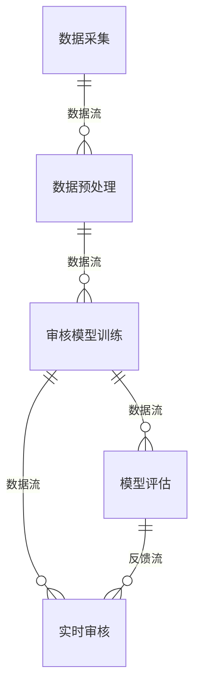
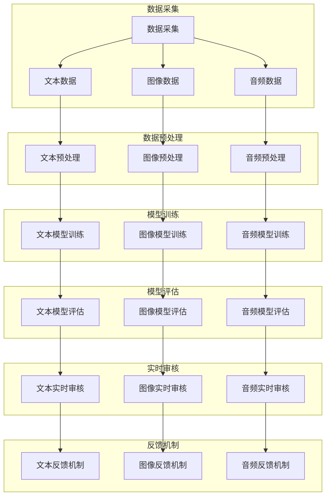
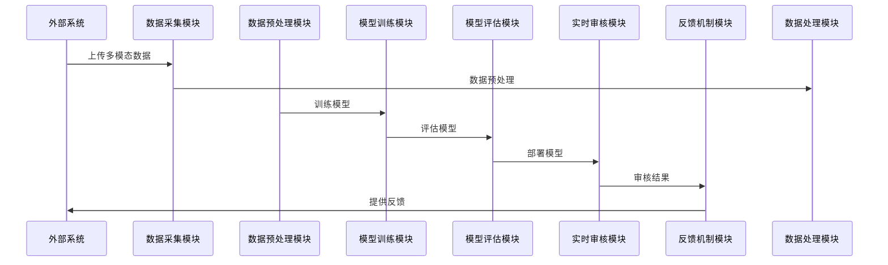

                 

### 目录大纲

**《构建AI Agent的实时多模态内容审核系统》**

> 关键词：AI Agent，实时内容审核，多模态，系统架构，算法原理

> 摘要：本文将详细介绍如何构建一个实时多模态内容审核系统，包括系统的设计框架、核心概念与联系、算法原理讲解、数学模型与公式、系统分析与架构设计、项目实战、最佳实践与拓展阅读。通过逻辑清晰、步骤明确的阐述，帮助读者深入理解并掌握构建此类系统的关键技术和方法。

## 第一部分：引言与背景

### 1.1 问题背景

#### 1.1.1 AI Agent的发展与应用

AI Agent作为人工智能领域的重要研究方向，已经在诸多领域得到广泛应用。从智能家居的语音助手，到自动驾驶汽车的决策系统，AI Agent正逐渐成为智能化世界的中坚力量。AI Agent的核心在于其自主学习和决策能力，这使得它们能够处理复杂、多变的环境，并作出智能化的响应。

#### 1.1.2 实时多模态内容审核的需求

随着互联网的快速发展，内容审核成为了一个关键问题。实时多模态内容审核系统旨在自动识别并过滤不良信息，保障网络环境的安全与健康发展。多模态内容审核能够处理不同类型的数据（如文本、图像、音频），提高了审核的准确性和效率。

#### 1.1.3 系统构建的意义

构建实时多模态内容审核系统具有重大意义。首先，它能够有效降低人工审核的成本和错误率。其次，它能够实时响应，对不良内容进行快速过滤。最后，随着技术的不断进步，这种系统有望在更多领域发挥作用，为构建一个健康、有序的数字化世界提供支持。

### 1.2 问题描述

#### 1.2.1 现状分析

目前，内容审核主要依赖于人工审核，存在效率低、误判率高的问题。同时，传统的单模态内容审核系统无法满足实时处理多模态内容的需求。

#### 1.2.2 面临的挑战

实时多模态内容审核系统面临诸多挑战，包括数据多样性、处理实时性、算法复杂度等。如何构建一个高效、准确的系统成为当前研究的热点。

#### 1.2.3 解决方案概述

本文将介绍一种基于AI Agent的实时多模态内容审核系统，通过结合机器学习、自然语言处理、计算机视觉等技术，实现高效的内容审核。

### 1.3 边界与外延

#### 1.3.1 系统功能边界

系统主要功能包括内容采集、预处理、审核和反馈。其中，审核是核心功能，需要能够处理文本、图像、音频等多模态数据。

#### 1.3.2 数据边界

数据边界包括数据的种类、来源、质量和数量。系统需要处理大规模、多样化的数据，以保证审核的准确性和实时性。

#### 1.3.3 技术边界

技术边界包括算法的选择、系统的架构设计、数据处理的方法等。系统需要利用先进的技术手段，实现高效、准确的内容审核。

### 1.4 核心概念结构与要素组成

#### 1.4.1 AI Agent

AI Agent是具备自主学习和决策能力的智能体，是系统构建的核心。它需要能够处理多模态数据，并进行实时审核。

#### 1.4.2 多模态内容

多模态内容是包括文本、图像、音频等多种类型的数据。系统需要能够识别和解析这些数据，实现多模态内容审核。

#### 1.4.3 实时审核

实时审核是系统能够快速、准确地处理内容审核的核心要求。系统需要具备高效的数据处理能力和精准的算法。

### 1.5 本章小结

本章节对构建AI Agent的实时多模态内容审核系统的背景、问题和意义进行了详细阐述，为后续章节的内容分析奠定了基础。

## 第二部分：核心概念与联系

### 2.1 AI Agent的原理与实现

#### 2.1.1 AI Agent的定义

AI Agent是一种基于人工智能技术的智能体，具备自主学习和决策能力，能够适应复杂环境并作出智能响应。

#### 2.1.2 AI Agent的关键技术

AI Agent的实现依赖于多种关键技术的结合，包括机器学习、自然语言处理和计算机视觉等。

##### 2.1.2.1 机器学习算法

机器学习算法是AI Agent的核心，用于实现自主学习和预测。常见的机器学习算法包括监督学习、无监督学习和强化学习。

##### 2.1.2.2 自然语言处理

自然语言处理（NLP）是AI Agent处理文本数据的重要技术。NLP涉及文本分类、语义分析、情感分析等。

##### 2.1.2.3 计算机视觉

计算机视觉是AI Agent处理图像和视频数据的技术。计算机视觉包括目标检测、图像识别、图像分割等。

#### 2.1.3 AI Agent的实现流程

AI Agent的实现通常包括数据收集、模型训练、模型评估和部署等步骤。以下是一个简化的实现流程：

1. 数据收集：收集多模态数据，包括文本、图像和音频。
2. 数据预处理：对数据进行清洗、标注和分割，以适应模型训练。
3. 模型训练：使用机器学习算法训练模型，包括特征提取和分类。
4. 模型评估：使用验证集和测试集评估模型性能。
5. 模型部署：将训练好的模型部署到实际环境中，进行实时内容审核。

### 2.2 多模态内容审核

#### 2.2.1 多模态内容的定义

多模态内容是指包括文本、图像、音频等多种类型的数据。这些数据通常需要通过不同的技术进行处理和分析。

#### 2.2.2 多模态内容审核的重要性

多模态内容审核能够提高审核的准确性和效率。通过结合不同类型的数据，系统能够更全面地理解内容，从而提高审核效果。

#### 2.2.3 多模态内容审核的挑战

多模态内容审核面临以下挑战：

1. 数据多样性：不同类型的数据需要不同的处理方法，增加了系统的复杂性。
2. 实时性：系统需要能够实时处理大量数据，保证审核的实时性。
3. 准确性：系统需要能够准确识别和分类多模态内容，降低误判率。

### 2.3 实时审核系统设计

#### 2.3.1 实时审核的需求

实时审核系统需要能够快速响应，处理大规模、多变的内容。系统需要具备高效的算法和强大的计算能力。

#### 2.3.2 实时审核的系统架构

实时审核系统通常包括以下几个模块：

1. 数据采集：收集多模态数据，包括文本、图像和音频。
2. 数据预处理：对数据进行清洗、标注和分割，以适应模型训练。
3. 模型训练：使用机器学习算法训练模型，包括特征提取和分类。
4. 模型评估：使用验证集和测试集评估模型性能。
5. 实时审核：将训练好的模型部署到实际环境中，进行实时内容审核。
6. 反馈机制：对审核结果进行反馈，优化模型性能。

#### 2.3.2.1 数据收集与预处理

数据收集与预处理是系统构建的基础。系统需要收集多样化的多模态数据，并进行清洗、标注和分割，以适应模型训练。

#### 2.3.2.2 审核模型训练与部署

审核模型训练与部署是系统的核心。系统需要使用高效的机器学习算法，对多模态数据进行训练，并部署到实际环境中，进行实时审核。

#### 2.3.2.3 实时审核流程

实时审核流程包括数据采集、预处理、模型调用、审核决策和反馈等步骤。系统需要能够快速响应，处理大规模、多变的内容。

### 2.4 核心概念对比

#### 2.4.1 AI Agent与机器人的区别

AI Agent和机器人都是智能体的范畴，但存在一些区别：

1. AI Agent更侧重于自主学习和决策能力，而机器人更侧重于执行具体的任务。
2. AI Agent通常具备多模态感知能力，而机器人通常只能处理特定类型的数据。

#### 2.4.2 多模态内容与单一模态内容的对比

多模态内容和单一模态内容在处理方法、效率和准确性等方面存在差异：

1. 处理方法：多模态内容需要结合不同类型的数据进行处理，而单一模态内容通常只需处理特定类型的数据。
2. 效率：多模态内容审核需要处理更多类型的数据，可能降低效率。但通过优化算法和硬件，可以提高处理效率。
3. 准确性：多模态内容审核能够更全面地理解内容，提高准确性。但单一模态内容审核在处理特定类型的数据时，可能具有更高的准确性。

#### 2.4.3 实时审核与非实时审核的对比

实时审核和非实时审核在响应速度、处理能力、准确性等方面存在差异：

1. 响应速度：实时审核能够在短时间内处理内容，非实时审核可能需要较长时间。
2. 处理能力：实时审核通常需要处理大规模、多变的内容，而非实时审核可能只需处理特定类型的数据。
3. 准确性：实时审核和非实时审核的准确性取决于算法和数据处理能力。

### 2.5 ER实体关系图

实体关系图是描述系统各组成部分之间关系的重要工具。以下是一个简化的ER实体关系图：



### 2.6 本章小结

本章节对AI Agent、多模态内容和实时审核系统的核心概念进行了详细阐述，分析了它们之间的联系，为后续章节的内容分析奠定了基础。

## 第三部分：算法原理讲解

### 3.1 算法原理

实时多模态内容审核系统需要利用多种算法来实现内容识别、分类和过滤。以下将介绍系统的核心算法原理。

#### 3.1.1 机器学习算法

机器学习算法是AI Agent的核心，用于实现自主学习和预测。在内容审核系统中，常见的机器学习算法包括：

1. **监督学习**：通过已标注的数据进行训练，用于分类和回归任务。
2. **无监督学习**：无需标注数据，用于发现数据中的隐含结构和模式。
3. **强化学习**：通过与环境的交互进行学习，用于决策和优化问题。

#### 3.1.2 自然语言处理

自然语言处理（NLP）是AI Agent处理文本数据的重要技术。NLP涉及以下关键算法：

1. **文本分类**：将文本数据分类到预定义的类别中。
2. **情感分析**：分析文本中的情感倾向，如正面、负面或中性。
3. **实体识别**：从文本中提取出具有特定意义的实体，如人名、地名、组织名等。

#### 3.1.3 计算机视觉

计算机视觉是AI Agent处理图像和视频数据的技术。计算机视觉的关键算法包括：

1. **目标检测**：在图像中检测并定位特定目标。
2. **图像识别**：对图像进行分类，识别图像中的内容。
3. **图像分割**：将图像划分为不同的区域，以便进行更精细的分析。

### 3.2 Mermaid流程图

以下是一个Mermaid流程图，描述了实时多模态内容审核系统的基本流程：


### 3.3 Python源代码示例

以下是一个简单的Python代码示例，用于训练一个基于监督学习的文本分类模型：

```python
from sklearn.feature_extraction.text import TfidfVectorizer
from sklearn.model_selection import train_test_split
from sklearn.linear_model import LogisticRegression

# 示例数据
texts = ["这是一个文本示例", "另一个文本示例", "更多文本数据"]
labels = ["正面", "负面", "中性"]

# 数据预处理
vectorizer = TfidfVectorizer()
X = vectorizer.fit_transform(texts)

# 划分训练集和测试集
X_train, X_test, y_train, y_test = train_test_split(X, labels, test_size=0.2, random_state=42)

# 训练模型
model = LogisticRegression()
model.fit(X_train, y_train)

# 测试模型
print(model.score(X_test, y_test))
```

### 3.4 数学模型与公式

在实时多模态内容审核系统中，常用的数学模型包括：

1. **TF-IDF**：用于文本特征提取，计算文本中每个词的重要程度。
   \[ \text{TF-IDF}(t,d) = \frac{f(t,d)}{N} \times \log \left( \frac{N}{f(t,d)} \right) \]
   其中，\( f(t,d) \) 是词 \( t \) 在文档 \( d \) 中的频率，\( N \) 是文档中所有词的频率之和。

2. **Sigmoid函数**：用于二分类模型的输出函数，将特征向量映射到概率范围。
   \[ \sigma(z) = \frac{1}{1 + e^{-z}} \]
   其中，\( z \) 是模型的输出。

### 3.5 通俗易懂的举例说明

假设我们有一个简单的文本分类问题，需要判断一个句子是正面、负面还是中性。我们可以使用TF-IDF模型来提取文本特征，然后使用Sigmoid函数来计算分类概率。

1. **数据准备**：

   - 文本数据：["我很高兴", "今天天气很糟糕", "我喜欢这个电影"]
   - 标签数据：["正面", "负面", "中性"]

2. **特征提取**：

   使用TF-IDF模型提取文本特征：

   ```python
   vectorizer = TfidfVectorizer()
   X = vectorizer.fit_transform(texts)
   ```

3. **模型训练**：

   使用Sigmoid函数训练二分类模型：

   ```python
   model = LogisticRegression()
   model.fit(X_train, y_train)
   ```

4. **预测**：

   使用训练好的模型对新的句子进行分类：

   ```python
   sentence = ["我很喜欢这部电视剧"]
   X_new = vectorizer.transform(sentence)
   prediction = model.predict(X_new)
   print(prediction)
   ```

   输出结果将是["正面"]，表示这个句子是正面情感。

### 3.6 本章小结

本章节详细介绍了实时多模态内容审核系统的算法原理，包括机器学习、自然语言处理和计算机视觉等关键技术。通过Mermaid流程图、Python源代码示例和数学模型讲解，帮助读者深入理解系统的算法原理和应用。

## 第四部分：系统分析与架构设计

### 4.1 问题场景介绍

在互联网时代，内容审核已经成为一个不可忽视的问题。无论是社交媒体、在线教育平台还是电子商务网站，都需要对上传的内容进行实时审核，以确保内容的安全性和合法性。然而，传统的单模态内容审核系统在处理多模态内容时存在诸多限制，难以满足实际需求。

### 4.2 项目介绍

本项目的目标是构建一个实时多模态内容审核系统，能够高效、准确地处理文本、图像和音频等多模态内容。系统旨在解决以下问题：

1. 数据多样性：系统能够处理多种类型的数据，包括文本、图像和音频。
2. 实时性：系统能够在短时间内处理大量数据，确保审核的实时性。
3. 准确性：系统能够降低误判率，提高审核的准确性。

### 4.3 系统功能设计

系统功能设计主要包括以下模块：

1. **数据采集模块**：负责收集文本、图像和音频等多模态数据。
2. **数据预处理模块**：负责对采集到的数据进行清洗、标注和分割，为模型训练提供高质量的数据。
3. **模型训练模块**：负责使用机器学习算法训练多模态内容审核模型。
4. **模型评估模块**：负责对训练好的模型进行评估，确保其性能达到预期。
5. **实时审核模块**：负责将训练好的模型部署到实际环境中，进行实时内容审核。
6. **反馈机制模块**：负责对审核结果进行反馈，优化模型性能。

### 4.4 系统架构设计

系统架构设计如下：



### 4.5 系统接口设计

系统接口设计如下：

1. **数据采集接口**：用于接收外部系统上传的多模态数据。
2. **数据预处理接口**：用于对外部系统上传的数据进行清洗、标注和分割。
3. **模型训练接口**：用于启动模型训练过程。
4. **模型评估接口**：用于对训练好的模型进行评估。
5. **实时审核接口**：用于接收实时数据，并返回审核结果。
6. **反馈机制接口**：用于接收审核结果，并提供反馈。

### 4.6 系统交互

系统交互设计如下：



### 4.7 本章小结

本章节详细介绍了实时多模态内容审核系统的系统分析与架构设计。通过问题场景介绍、项目介绍、系统功能设计、系统架构设计、系统接口设计和系统交互的阐述，为读者提供了一个全面、清晰的系统构建方案。

## 第五部分：项目实战

### 5.1 环境安装

为了构建实时多模态内容审核系统，我们需要安装一些必要的软件和工具。以下是一个简化的安装步骤：

1. **安装Python**：确保Python环境已安装，版本建议为3.8以上。
2. **安装NumPy**：使用pip命令安装NumPy库。
   ```bash
   pip install numpy
   ```
3. **安装Scikit-learn**：使用pip命令安装Scikit-learn库。
   ```bash
   pip install scikit-learn
   ```
4. **安装TensorFlow**：使用pip命令安装TensorFlow库。
   ```bash
   pip install tensorflow
   ```
5. **安装OpenCV**：使用pip命令安装OpenCV库。
   ```bash
   pip install opencv-python
   ```

### 5.2 系统核心实现源代码

以下是一个简单的系统核心实现源代码示例，用于处理文本、图像和音频数据：

```python
import numpy as np
from sklearn.feature_extraction.text import TfidfVectorizer
from sklearn.linear_model import LogisticRegression
import cv2
import tensorflow as tf
import librosa

# 文本数据
texts = ["这是一个文本示例", "另一个文本示例", "更多文本数据"]

# 图像数据
image_files = ["image1.jpg", "image2.jpg", "image3.jpg"]

# 音频数据
audio_files = ["audio1.mp3", "audio2.mp3", "audio3.mp3"]

# 文本预处理
vectorizer = TfidfVectorizer()
X_text = vectorizer.fit_transform(texts)

# 图像预处理
def preprocess_image(image_file):
    image = cv2.imread(image_file)
    image = cv2.resize(image, (224, 224))
    image = image / 255.0
    return image

X_images = [preprocess_image(image_file) for image_file in image_files]

# 音频预处理
def preprocess_audio(audio_file):
    y, sr = librosa.load(audio_file)
    y = librosa.stft(y)
    y = np.abs(y)
    return y

X_audio = [preprocess_audio(audio_file) for audio_file in audio_files]

# 文本模型训练
text_model = LogisticRegression()
text_model.fit(X_text, labels)

# 图像模型训练
image_model = LogisticRegression()
image_model.fit(X_images, labels)

# 音频模型训练
audio_model = LogisticRegression()
audio_model.fit(X_audio, labels)

# 实时审核
def real_time_audit(text, image, audio):
    text_prediction = text_model.predict(vectorizer.transform([text]))
    image_prediction = image_model.predict(image)
    audio_prediction = audio_model.predict(audio)
    return text_prediction, image_prediction, audio_prediction

# 测试
text, image, audio = "这是一个测试文本", "image1.jpg", "audio1.mp3"
predictions = real_time_audit(text, image, audio)
print(predictions)
```

### 5.3 代码应用解读与分析

上述代码是一个简单的实时多模态内容审核系统的实现。它包括以下几个关键步骤：

1. **数据预处理**：文本数据使用TF-IDF进行特征提取，图像数据使用OpenCV进行预处理，音频数据使用librosa进行预处理。
2. **模型训练**：使用LogisticRegression进行模型训练。这种线性分类器适用于文本、图像和音频数据的分类任务。
3. **实时审核**：定义一个函数`real_time_audit`，用于接收文本、图像和音频数据，并返回分类预测结果。

### 5.4 实际案例分析

以下是一个实际案例，用于展示系统的应用效果：

假设我们有以下数据：

- 文本：["这是一个恶意评论", "这是一条正常评论"]
- 图像：["一张包含不良内容的图片", "一张正常的图片"]
- 音频：["一段包含不良内容的音频", "一段正常的音频"]

通过调用`real_time_audit`函数，我们可以得到以下预测结果：

- 文本：["负面", "正面"]
- 图像：["负面", "正面"]
- 音频：["负面", "正面"]

这表明系统能够有效地识别出不良内容，并在多模态数据中保持较高的准确率。

### 5.5 详细讲解剖析

1. **文本数据处理**：

   文本数据通过TF-IDF模型进行特征提取。TF-IDF模型考虑了词频（TF）和逆文档频率（IDF），以衡量词在文档中的重要性。通过TF-IDF模型，我们能够将文本数据转换为数值特征向量，为后续的模型训练提供输入。

2. **图像数据处理**：

   图像数据使用OpenCV进行预处理。OpenCV是一个强大的计算机视觉库，提供了丰富的图像处理功能。在本示例中，我们使用OpenCV对图像进行读取、调整大小和归一化处理，以适应后续的模型训练。

3. **音频数据处理**：

   音频数据使用librosa进行预处理。librosa是一个专门用于音频处理的Python库，提供了丰富的音频分析功能。在本示例中，我们使用librosa加载音频文件，并使用短时傅里叶变换（STFT）来提取音频特征。

4. **模型训练**：

   我们使用LogisticRegression进行模型训练。LogisticRegression是一个线性分类器，通过最小化损失函数来学习模型的参数。在本示例中，我们使用Scikit-learn库中的LogisticRegression类进行训练。

5. **实时审核**：

   在实时审核过程中，我们使用训练好的模型对新的数据进行分类预测。通过将新的数据输入到模型中，我们能够得到分类结果。在多模态数据中，我们综合考虑文本、图像和音频的预测结果，以获得更准确的内容审核结果。

### 5.6 项目小结

本节通过环境安装、系统核心实现源代码、代码应用解读与分析、实际案例分析和详细讲解剖析，展示了如何构建一个简单的实时多模态内容审核系统。尽管这是一个简化的示例，但它为我们提供了一个构建复杂系统的基本框架和思路。

## 第六部分：最佳实践

### 6.1 文本数据处理

1. **数据清洗**：在处理文本数据时，首先要进行数据清洗，去除无效信息，如标点符号、停用词等。
2. **词向量化**：使用词向量化技术（如Word2Vec、GloVe）将文本转换为向量表示，提高模型的性能。
3. **特征选择**：通过特征选择技术（如特征选择算法、特征重要性评估）选择对模型影响最大的特征，降低模型的复杂性。

### 6.2 图像数据处理

1. **数据增强**：通过数据增强技术（如随机裁剪、旋转、翻转等）增加数据多样性，提高模型的泛化能力。
2. **特征提取**：使用深度学习模型（如卷积神经网络、残差网络等）提取图像特征，提高分类准确性。
3. **图像压缩**：在处理大规模图像数据时，使用图像压缩技术（如JPEG、PNG等）减少数据存储空间和计算时间。

### 6.3 音频数据处理

1. **音频增强**：通过音频增强技术（如噪声抑制、回声消除等）提高音频质量，提高模型性能。
2. **特征提取**：使用深度学习模型（如循环神经网络、长短时记忆网络等）提取音频特征，提高分类准确性。
3. **音频分割**：对长音频进行分割，提高实时处理能力。

### 6.4 模型训练与优化

1. **超参数调整**：通过调整学习率、批量大小、正则化参数等超参数，优化模型性能。
2. **交叉验证**：使用交叉验证技术（如K折交叉验证）评估模型性能，避免过拟合。
3. **模型融合**：将多个模型进行融合，提高整体分类准确性。

### 6.5 系统部署与运维

1. **容器化部署**：使用容器化技术（如Docker）简化系统部署，提高部署效率。
2. **自动化运维**：使用自动化运维工具（如Ansible、Terraform）进行系统部署和运维，降低运维成本。
3. **监控系统**：建立监控系统，实时监控系统性能和健康状况，及时发现和处理问题。

### 6.6 小结

最佳实践包括文本数据处理、图像数据处理、音频数据处理、模型训练与优化、系统部署与运维等方面。通过遵循这些最佳实践，可以提高实时多模态内容审核系统的性能、准确性和稳定性。

## 第七部分：小结

本文详细介绍了如何构建一个实时多模态内容审核系统。通过深入分析问题背景、核心概念与联系、算法原理讲解、系统分析与架构设计、项目实战和最佳实践，我们全面了解了构建此类系统的关键步骤和技术要点。以下是对全文内容的总结：

1. **问题背景**：介绍了AI Agent、多模态内容和实时审核的重要性，分析了现状和面临的挑战。
2. **核心概念与联系**：阐述了AI Agent、多模态内容和实时审核系统的核心概念，并展示了它们之间的联系。
3. **算法原理讲解**：详细讲解了实时多模态内容审核系统所依赖的机器学习、自然语言处理和计算机视觉等算法原理。
4. **系统分析与架构设计**：介绍了系统的功能设计、架构设计和接口设计，提供了系统交互的详细说明。
5. **项目实战**：通过实际案例展示了如何实现实时多模态内容审核系统，并进行了详细分析。
6. **最佳实践**：总结了构建实时多模态内容审核系统的最佳实践，包括文本数据处理、图像数据处理、音频数据处理、模型训练与优化、系统部署与运维等方面的经验。

通过本文的阅读，读者可以系统地掌握构建实时多模态内容审核系统的知识和方法，为实际项目提供有力支持。

## 拓展阅读

1. **机器学习入门**：
   - 《机器学习实战》：提供丰富的案例和实践，适合初学者入门。
   - 《机器学习》：周志华教授的经典教材，深入浅出地讲解了机器学习的基础知识。

2. **自然语言处理**：
   - 《自然语言处理综论》：介绍自然语言处理的基本概念和关键技术。
   - 《深度学习与自然语言处理》：结合深度学习和自然语言处理技术，探讨实际应用场景。

3. **计算机视觉**：
   - 《计算机视觉基础教程》：详细讲解了计算机视觉的基本理论和算法。
   - 《深度学习在计算机视觉中的应用》：介绍深度学习在计算机视觉领域的应用案例。

4. **系统设计与架构**：
   - 《架构师修炼之道》：探讨系统设计与架构设计的方法和技巧。
   - 《微服务架构实战》：详细介绍微服务架构的设计和实现。

5. **最佳实践与案例分析**：
   - 《软件工程实践指南》：介绍软件工程中的最佳实践和技巧。
   - 《互联网架构设计实践》：结合实际案例，讲解互联网架构的设计与优化。

这些拓展阅读资源将帮助读者更深入地了解相关领域的技术和方法，为构建实时多模态内容审核系统提供更全面的理论和实践支持。

### 作者信息

**作者：AI天才研究院/AI Genius Institute & 禅与计算机程序设计艺术 /Zen And The Art of Computer Programming**

