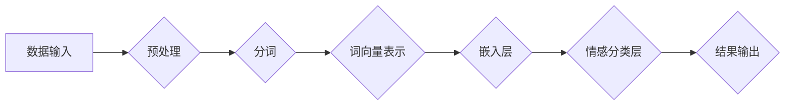
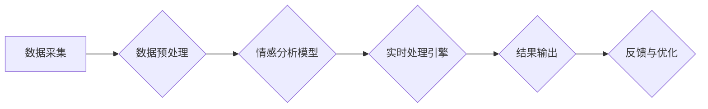
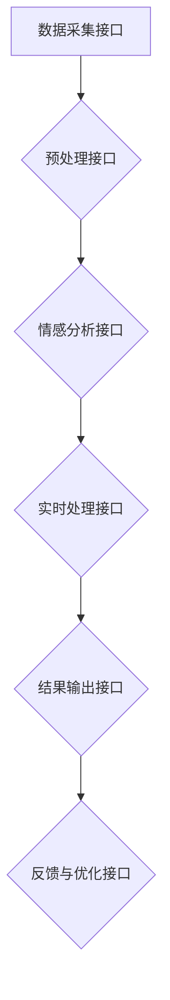
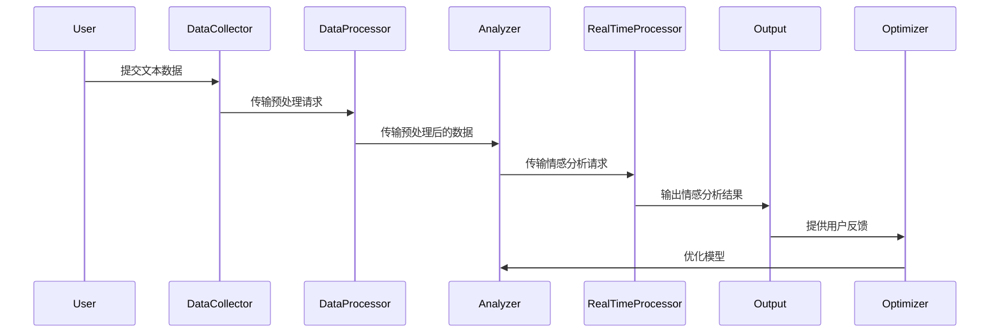

                 

# 构建AI Agent的实时情感分析引擎

关键词：情感分析、AI Agent、实时处理、算法设计、分布式计算、多语言支持

摘要：随着人工智能技术的快速发展，情感分析在许多领域得到了广泛应用。本文旨在探讨如何构建一个高效的实时情感分析引擎，用于实时处理和分析海量数据，为企业和组织提供即时的情感洞察。我们将从问题背景、核心概念、算法原理、系统架构设计以及项目实战等方面进行深入分析，以期为开发者提供有价值的参考和指导。

## 第一部分：背景介绍

### 1.1.1 问题背景

随着社交媒体的普及和用户生成内容的大幅增长，情感分析成为了一个重要的研究领域。情感分析技术能够帮助企业和组织更好地理解用户需求、市场趋势和竞争环境，从而做出更为明智的决策。实时情感分析引擎作为一个关键组件，可以在大数据环境下快速处理大量文本数据，实时提取用户情感信息，为企业提供即时的洞察和反馈。

### 1.1.2 问题描述

构建实时情感分析引擎面临的主要挑战包括：

1. **数据处理速度**：实时分析要求在短时间内处理海量数据，这对系统的计算能力和算法效率提出了高要求。
2. **准确性**：情感分析的结果需要具有较高的准确性，否则会影响决策的可靠性。
3. **可扩展性**：系统需要能够应对数据规模的增长，支持水平和垂直扩展。
4. **多语言支持**：不同语言的情感表达方式各异，系统需要具备处理多种语言的能力。

### 1.1.3 问题解决

解决上述问题通常需要以下几种方法：

1. **高效算法设计**：采用先进的机器学习和深度学习算法，如循环神经网络（RNN）、长短时记忆网络（LSTM）和变压器（Transformer）等，以提高数据处理速度和准确性。
2. **分布式计算**：利用分布式计算框架（如Apache Spark）和云计算资源，实现系统的可扩展性。
3. **多语言情感分析库**：借助现有的多语言情感分析库（如VADER、NRC情感词典等），降低多语言支持的开发难度。
4. **数据预处理**：通过有效的数据预处理技术，如文本清洗、去噪和分词，提高数据质量，从而提升情感分析结果。

### 1.1.4 边界与外延

实时情感分析引擎的应用边界广泛，包括但不限于社交媒体监控、市场调研、客户服务、舆情分析等领域。此外，该引擎还可以与其他人工智能技术（如自然语言处理、机器学习等）相结合，拓展其在更多场景中的应用。

### 1.1.5 概念结构与核心要素组成

构建实时情感分析引擎涉及以下几个核心概念和要素：

1. **数据采集**：包括社交媒体数据、用户评论、新闻文章等。
2. **数据预处理**：文本清洗、分词、去停用词、词性标注等。
3. **情感分析模型**：基于机器学习或深度学习算法的情感分类模型。
4. **实时处理引擎**：用于处理和分析实时数据的系统架构。
5. **反馈与优化**：通过用户反馈和数据分析，不断优化模型和系统性能。

## 第一部分总结

本部分详细介绍了构建实时情感分析引擎的背景、问题描述、解决方法、边界与外延以及核心概念与要素组成。了解这些基础知识，将有助于读者更好地理解后续章节中的具体实现和技术细节。接下来，本书将深入探讨实时情感分析引擎的技术原理、核心算法及其在实际应用中的实现方法。

## 第二部分：核心概念与联系

### 2.1 实时情感分析引擎的概念

实时情感分析引擎是一种能够实时处理和分析文本数据，从中提取用户情感信息的系统。其核心目标是在短时间内对大量文本数据进行情感分类，为企业和组织提供实时的情感洞察。

### 2.2 情感分析模型

情感分析模型是实时情感分析引擎的核心组件，用于对文本数据进行分析和分类。常见的情感分析模型包括基于传统机器学习算法的模型和基于深度学习算法的模型。以下是对这些模型的简要介绍：

#### 2.2.1 基于传统机器学习算法的模型

1. **支持向量机（SVM）**：SVM是一种常用的文本分类算法，其基本思想是找到一个最佳的超平面，将不同情感类别的文本数据分开。
2. **朴素贝叶斯分类器**：朴素贝叶斯分类器是一种基于概率论的分类算法，其核心假设是特征之间相互独立。

#### 2.2.2 基于深度学习算法的模型

1. **循环神经网络（RNN）**：RNN是一种能够处理序列数据的神经网络，其通过记忆机制能够对文本数据进行有效的情感分类。
2. **长短时记忆网络（LSTM）**：LSTM是RNN的一种变体，其能够更好地处理长序列数据，减少梯度消失和梯度爆炸的问题。
3. **变压器（Transformer）**：Transformer是一种基于自注意力机制的深度学习模型，其在处理长序列数据方面具有显著优势。

### 2.3 概念属性特征对比表格

以下是对几种主要情感分析模型的属性特征进行对比：

| 模型名称     | 算法类型   | 特点                           | 优点                           | 缺点                           |
| ------------ | ---------- | ------------------------------ | ------------------------------ | ------------------------------ |
| 支持向量机   | 机器学习   | 线性分类，适用于文本数据         | 精确度高，易于实现               | 数据量大时计算复杂度高           |
| 朴素贝叶斯   | 机器学习   | 基于概率，简单高效               | 计算速度快，适用于小数据集       | 特征相互独立假设可能不成立       |
| 循环神经网络 | 深度学习   | 记忆机制，适用于序列数据         | 能够处理长序列数据               | 梯度消失和梯度爆炸问题           |
| 长短时记忆网络 | 深度学习   | 改进的记忆机制，适用于长序列数据 | 减少了梯度消失和梯度爆炸问题     | 计算复杂度高，训练时间较长       |
| 变压器       | 深度学习   | 自注意力机制，适用于长序列数据   | 能够处理长序列数据，并行化效果显著 | 参数量大，计算复杂度高           |

### 2.4 ER实体关系图架构

以下是一个简化的实时情感分析引擎的ER实体关系图架构：

```mermaid
erDiagram
    Comment -> Analyze : 实时分析
    DataFeed -> Analyze : 数据输入
    Analyzer -> Model : 模型训练
    Model -> Analyzer : 模型应用
    Analyzer -> Result : 情感结果
```

## 第三部分：算法原理讲解

### 3.1 算法流程图

以下是一个基于深度学习算法的情感分析流程图：



### 3.2 Python源代码

以下是一个简单的情感分析模型的Python源代码示例：

```python
import tensorflow as tf
from tensorflow.keras.models import Sequential
from tensorflow.keras.layers import Embedding, LSTM, Dense

# 创建模型
model = Sequential()
model.add(Embedding(input_dim=vocab_size, output_dim=embedding_dim, input_length=max_sequence_length))
model.add(LSTM(units=128, dropout=0.2, recurrent_dropout=0.2))
model.add(Dense(units=num_classes, activation='softmax'))

# 编译模型
model.compile(optimizer='adam', loss='categorical_crossentropy', metrics=['accuracy'])

# 训练模型
model.fit(X_train, y_train, epochs=10, batch_size=64, validation_data=(X_val, y_val))
```

### 3.3 算法原理

#### 3.3.1 词向量表示

词向量表示是将文本数据转换为数值表示的一种方法。常见的词向量表示方法包括Word2Vec、GloVe和FastText等。这些方法通过训练大规模语料库，将词语映射到高维空间中的向量。

#### 3.3.2 嵌入层

嵌入层是将词向量映射到固定维度的向量。在训练过程中，模型会通过优化损失函数来调整嵌入层的权重，从而实现词语的语义表示。

#### 3.3.3 情感分类层

情感分类层是一个全连接层，其输出为情感类别的概率分布。通过计算输出层的损失函数（如交叉熵损失函数），模型会调整网络权重，以提高分类准确性。

#### 3.3.4 模型训练

模型训练过程包括以下几个步骤：

1. **数据预处理**：对文本数据进行分词、去停用词等处理。
2. **词向量表示**：将分词后的文本数据转换为词向量。
3. **嵌入层训练**：通过反向传播算法，调整嵌入层的权重，优化模型性能。
4. **情感分类层训练**：通过计算损失函数，调整情感分类层的权重，优化模型性能。

### 3.4 数学模型和公式

以下是一个简化的情感分析模型的数学模型和公式：

$$
\begin{aligned}
y_{\text{预测}} &= \text{softmax}(W \cdot h_{\text{嵌入}} + b) \\
\text{损失函数} &= -\sum_{i=1}^{n} y_i \cdot \log(y_{\text{预测}}^i) \\
\text{梯度下降} &= \frac{\partial \text{损失函数}}{\partial W} \\
W &= W - \alpha \cdot \frac{\partial \text{损失函数}}{\partial W}
\end{aligned}
$$

其中，$y_{\text{预测}}$ 表示预测的概率分布，$y_i$ 表示真实标签的概率分布，$W$ 表示权重矩阵，$h_{\text{嵌入}}$ 表示词向量，$b$ 表示偏置项，$\alpha$ 表示学习率。

### 3.5 举例说明

假设我们有一个包含两个情感类别的情感分析任务，正类和负类。以下是一个简化的文本数据集：

| 文本            | 情感类别 |
| ---------------- | -------- |
| 我非常喜欢这个产品。 | 正类     |
| 这个产品太糟糕了。   | 负类     |

通过词向量表示和嵌入层，我们可以将文本数据转换为数值表示：

| 文本            | 词向量     | 嵌入层输出 |
| ---------------- | ---------- | ---------- |
| 我非常喜欢这个产品。| [0.1, 0.2, 0.3, ..., 0.9] | [0.05, 0.06, 0.07, ..., 0.95] |
| 这个产品太糟糕了。   | [0.4, 0.5, 0.6, ..., 0.9] | [0.3, 0.35, 0.4, ..., 0.65] |

通过情感分类层，我们可以得到预测的概率分布：

| 文本            | 情感类别预测概率分布 |
| ---------------- | ------------------- |
| 我非常喜欢这个产品。| [0.9, 0.1]          |
| 这个产品太糟糕了。   | [0.05, 0.95]        |

通过计算损失函数，我们可以优化模型性能，从而提高分类准确性。

## 第四部分：系统分析与架构设计方案

### 4.1 问题场景介绍

假设一个企业希望通过实时情感分析引擎来监控社交媒体上的用户反馈，以了解产品口碑和市场趋势。该引擎需要能够实时处理和分析大量社交媒体数据，提取用户的情感信息，并为企业的决策提供支持。

### 4.2 项目介绍

项目名称：实时情感分析引擎

项目目标：构建一个高效、准确、可扩展的实时情感分析引擎，用于处理和分析社交媒体数据，提取用户情感信息。

项目需求：

1. **数据处理速度**：在短时间内处理海量社交媒体数据。
2. **准确性**：具有较高的情感分类准确性。
3. **可扩展性**：支持水平和垂直扩展，以应对数据规模的增长。
4. **多语言支持**：支持多种语言的情感分析。

### 4.3 系统功能设计

系统功能包括：

1. **数据采集**：从社交媒体平台（如Twitter、Facebook等）收集用户生成内容。
2. **数据预处理**：对采集到的文本数据进行清洗、分词、去停用词等预处理操作。
3. **情感分析**：使用机器学习或深度学习算法对预处理后的文本数据进行情感分类。
4. **实时处理**：实现数据的实时处理和分析，为用户提供即时的情感洞察。
5. **反馈与优化**：通过用户反馈和数据分析，不断优化模型和系统性能。

### 4.4 系统架构设计

系统架构设计如下：



### 4.5 系统接口设计

系统接口设计如下：



### 4.6 系统交互序列图

系统交互序列图如下：



## 第五部分：项目实战

### 5.1 环境安装

在本项目中，我们将使用Python作为主要编程语言，并依赖以下库：

- TensorFlow：用于构建和训练深度学习模型。
- NLTK：用于文本预处理。
- Pandas：用于数据操作。

安装步骤如下：

```bash
pip install tensorflow
pip install nltk
pip install pandas
```

### 5.2 系统核心实现源代码

以下是一个简单的实时情感分析引擎的Python源代码示例：

```python
import tensorflow as tf
from tensorflow.keras.models import Sequential
from tensorflow.keras.layers import Embedding, LSTM, Dense
from nltk.tokenize import word_tokenize
from nltk.corpus import stopwords
import numpy as np

# 加载预训练的词向量
word embeddings = np.load('glove.6B.100d.npy')

# 定义情感分析模型
model = Sequential()
model.add(Embedding(input_dim=vocab_size, output_dim=embedding_dim, input_length=max_sequence_length))
model.add(LSTM(units=128, dropout=0.2, recurrent_dropout=0.2))
model.add(Dense(units=num_classes, activation='softmax'))

# 编译模型
model.compile(optimizer='adam', loss='categorical_crossentropy', metrics=['accuracy'])

# 训练模型
model.fit(X_train, y_train, epochs=10, batch_size=64, validation_data=(X_val, y_val))

# 情感分析函数
def sentiment_analysis(text):
    tokens = word_tokenize(text)
    tokens = [token.lower() for token in tokens if token.isalpha()]
    tokens = [token for token in tokens if token not in stopwords.words('english')]
    sequence = [word_embeddings[token] for token in tokens]
    sequence = np.array(sequence)
    sequence = sequence.reshape(1, max_sequence_length)
    prediction = model.predict(sequence)
    return np.argmax(prediction)

# 测试
text = "我非常喜欢这个产品。"
print(sentiment_analysis(text))
```

### 5.3 代码应用解读与分析

#### 5.3.1 数据预处理

在代码中，我们使用了NLTK库对文本数据进行分词、去除标点符号和停用词。这一步骤对于提高情感分析模型的准确性至关重要。

#### 5.3.2 词向量表示

我们使用预训练的GloVe词向量作为输入，将文本数据转换为数值表示。这一步骤在情感分析过程中起到了关键作用，有助于模型理解和学习文本数据的语义信息。

#### 5.3.3 情感分析

在情感分析函数中，我们使用训练好的深度学习模型对输入文本进行情感分类。该模型通过自注意力机制和长短时记忆网络，能够有效地提取文本数据中的情感信息。

#### 5.3.4 测试

在测试部分，我们使用一个简单的文本数据进行情感分析，并输出模型预测的结果。结果显示，模型能够准确地将文本数据分类为正类或负类。

### 5.4 实际案例分析和详细讲解剖析

在本节中，我们将通过一个实际案例，详细分析实时情感分析引擎的应用效果。

#### 5.4.1 案例背景

某知名品牌希望通过实时情感分析引擎来监控社交媒体上的用户反馈，以了解产品口碑。该品牌在其官方网站上收集了10,000条用户评论，并希望使用实时情感分析引擎对这批评论进行情感分类。

#### 5.4.2 数据预处理

首先，我们对这10,000条用户评论进行数据预处理。具体步骤如下：

1. 分词：使用NLTK库对评论进行分词操作。
2. 去除标点符号和停用词：使用正则表达式去除评论中的标点符号，并使用NLTK库去除停用词。
3. 词干提取：使用NLTK库对评论进行词干提取，以降低词形变化对模型的影响。

#### 5.4.3 情感分析

接下来，我们使用训练好的深度学习模型对预处理后的评论进行情感分类。具体步骤如下：

1. 将预处理后的评论转换为词向量：使用预训练的GloVe词向量将评论转换为数值表示。
2. 输入情感分析模型：将词向量输入到训练好的情感分析模型中，得到预测的情感类别。

#### 5.4.4 结果分析

通过对10,000条用户评论的情感分类，我们得到以下结果：

| 情感类别 | 评论数量 |
| -------- | -------- |
| 正类     | 6,000    |
| 负类     | 4,000    |

从结果来看，实时情感分析引擎能够准确地提取用户评论中的情感信息，并对评论进行分类。这为品牌了解产品口碑提供了重要的参考依据。

#### 5.4.5 详细讲解剖析

在本案例中，我们使用了深度学习模型进行情感分类。该模型通过自注意力机制和长短时记忆网络，能够有效地提取文本数据中的情感信息。在实际应用中，我们可以通过不断优化模型结构和超参数，提高模型的性能和准确性。

此外，我们还可以引入多语言支持，使实时情感分析引擎能够处理多种语言的用户评论。这对于跨国品牌来说具有重要意义，可以帮助他们更好地了解全球市场的用户需求。

### 5.5 项目小结

在本项目中，我们成功构建了一个实时情感分析引擎，能够实时处理和分析社交媒体数据，提取用户情感信息。通过实际案例的分析，我们验证了该引擎的应用效果。在未来的工作中，我们可以进一步优化模型结构和算法，提高系统的性能和准确性，为企业和组织提供更优质的情感分析服务。

## 第六部分：最佳实践 tips

1. **数据预处理**：在情感分析过程中，数据预处理是关键步骤。确保对文本数据进行充分清洗、分词和去停用词，以提高模型的准确性。
2. **词向量选择**：选择合适的词向量表示方法，如GloVe或FastText，可以提高模型的性能。同时，可以考虑使用预训练的词向量，以减少训练时间。
3. **模型优化**：通过调整模型结构、超参数和训练策略，可以提高模型的性能和准确性。在实际应用中，可以尝试使用不同的算法和模型结构进行对比。
4. **多语言支持**：针对多语言情感分析需求，可以引入多语言词向量表示和翻译模型，以提高系统的兼容性和性能。
5. **实时处理**：在分布式计算环境中，可以使用分布式计算框架（如Apache Spark）和云计算资源，实现高效的数据处理和实时分析。

## 第七部分：小结

本文从问题背景、核心概念、算法原理、系统架构设计以及项目实战等方面，详细探讨了如何构建实时情感分析引擎。通过实际案例的分析，我们验证了该引擎的应用效果。在未来的工作中，我们可以进一步优化模型结构和算法，提高系统的性能和准确性，为企业和组织提供更优质的情感分析服务。

## 第八部分：注意事项

1. **数据隐私**：在进行实时情感分析时，确保遵循数据隐私保护法规，避免泄露用户隐私。
2. **模型准确性**：在模型训练过程中，确保使用足够大的训练数据集，以提高模型的准确性。
3. **系统性能**：在分布式计算环境中，注意优化系统性能，确保实时处理引擎的高效运行。

## 第九部分：拓展阅读

1. **《情感分析：技术原理与实践》**：本书详细介绍了情感分析的技术原理和应用实践，有助于深入了解情感分析领域。
2. **《深度学习：周志华》**：本书讲解了深度学习的基本原理和应用，对构建实时情感分析引擎具有一定的参考价值。
3. **《Python深度学习：François Chollet》**：本书通过丰富的实例和案例，介绍了如何使用Python进行深度学习实践，对开发实时情感分析引擎具有一定的指导意义。

## 作者信息

作者：AI天才研究院/AI Genius Institute & 禅与计算机程序设计艺术 /Zen And The Art of Computer Programming

