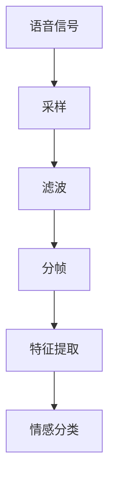
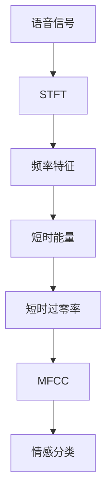
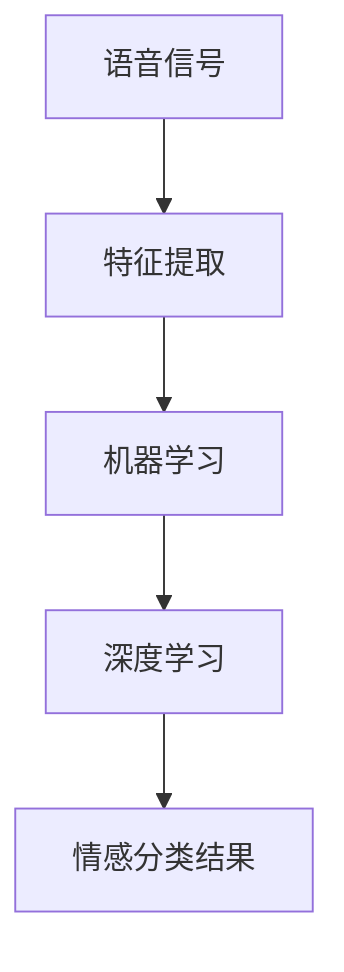
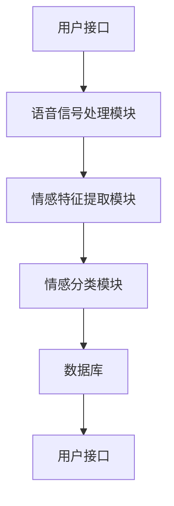
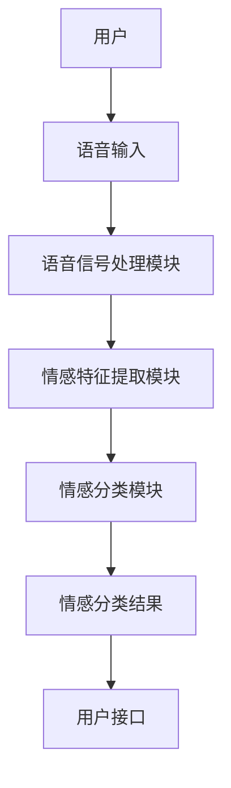

                 

### 《构建AI Agent的实时语音情感分析系统》

#### 关键词：实时语音情感分析、AI Agent、深度学习、信号处理、情感分类

#### 摘要：

本文将探讨如何构建一个实时语音情感分析系统，以AI Agent为载体，通过结合深度学习、信号处理等技术，实现对语音信号中情感状态的精准识别。文章首先介绍了实时语音情感分析系统的重要性，随后详细解析了语音信号处理、情感特征提取和情感分类的核心算法原理，并在此基础上设计了一个系统架构。本文旨在为开发者提供一个全面的技术指南，帮助他们理解和实现这一前沿技术。

---

### 目录大纲

#### 《构建AI Agent的实时语音情感分析系统》

#### 关键词：实时语音情感分析、AI Agent、深度学习、信号处理、情感分类

#### 摘要：

本文将探讨如何构建一个实时语音情感分析系统，以AI Agent为载体，通过结合深度学习、信号处理等技术，实现对语音信号中情感状态的精准识别。文章首先介绍了实时语音情感分析系统的重要性，随后详细解析了语音信号处理、情感特征提取和情感分类的核心算法原理，并在此基础上设计了一个系统架构。本文旨在为开发者提供一个全面的技术指南，帮助他们理解和实现这一前沿技术。

#### 第一部分：背景介绍

#### 第1章 问题背景

#### 第2章 核心概念与联系

#### 第二部分：算法原理讲解

#### 第3章 语音信号处理算法原理

#### 第4章 情感特征提取算法原理

#### 第5章 情感分类算法原理

#### 第三部分：系统设计与实现

#### 第6章 系统架构设计

#### 第7章 系统接口设计与交互

#### 第四部分：项目实战

#### 第8章 环境安装与配置

#### 第9章 系统核心实现与代码解析

#### 第10章 实际案例分析

#### 第11章 项目小结与最佳实践

---

## 第一部分：背景介绍

### 第1章 问题背景

#### 1.1.1 问题的提出

随着信息技术的飞速发展，人工智能（AI）技术已逐渐渗透到我们生活的方方面面。AI Agent，作为人工智能系统的重要组成部分，能够模拟人类的思维和行动，为用户提供智能化服务。而在AI Agent中，语音情感分析技术尤为关键。情感分析是一种基于自然语言处理（NLP）的技术，它旨在识别和理解文本、语音中的情感色彩。实时语音情感分析则更进一步，通过实时处理语音信号，快速准确地识别说话者的情感状态。

#### 1.1.2 问题的描述

实时语音情感分析的关键问题在于如何从连续的语音信号中提取情感特征，并在短时间内进行分类。这一过程涉及多个技术领域，包括语音信号处理、机器学习和深度学习等。具体来说，主要问题包括：

1. **语音信号预处理**：需要对原始语音信号进行滤波、分帧等预处理，以便提取有用的情感特征。
2. **情感特征提取**：从处理后的语音信号中提取与情感相关的频率特征、时域特征和变换域特征。
3. **情感分类**：使用机器学习或深度学习算法，对提取的特征进行分类，判断说话者的情感状态。

#### 1.1.3 问题解决

为了解决上述问题，我们需要构建一个包含多个模块的实时语音情感分析系统。首先，对语音信号进行预处理，提取基础特征；接着，利用深度学习算法对特征进行高级处理，实现情感分类。最后，将分类结果输出，供AI Agent进行后续决策。

#### 1.1.4 边界与外延

本文主要关注短时语音的情感分析，即对较短的语音片段进行情感识别。这对于提升用户体验和优化人机交互具有重要意义。然而，长时间语音的情感分析同样值得关注，这是未来研究的方向之一。此外，系统的实时性要求较高，需要在有限的时间内完成情感分析，这对硬件和算法的优化提出了挑战。

#### 1.1.5 概念结构与核心要素组成

实时语音情感分析系统主要由以下几个模块组成：

1. **语音信号处理模块**：负责对原始语音信号进行预处理，提取基础特征。
2. **情感特征提取模块**：从处理后的语音信号中提取与情感相关的特征。
3. **情感分类模块**：利用深度学习算法对提取的特征进行分类，判断说话者的情感状态。
4. **用户接口模块**：提供用户交互界面，接受语音输入并输出情感分类结果。

通过这些模块的协同工作，实时语音情感分析系统可以实现高效、准确的情感识别，为AI Agent提供强有力的支持。

### 第2章 核心概念与联系

#### 2.1 语音信号处理

语音信号处理是实时语音情感分析系统的基础。它旨在对原始语音信号进行预处理，提取基础特征，以便后续的情感分析。语音信号处理主要包括以下步骤：

1. **采样**：将模拟信号转换为数字信号，通常以固定的采样率进行。
   $$ y[n] = x(nT_s) $$
   其中，\( y[n] \) 是数字信号，\( x(n) \) 是模拟信号，\( T_s \) 是采样周期。

2. **滤波**：通过滤波器去除噪声和不需要的频率成分，增强语音信号的清晰度。
   $$ y[n] = x[n] * h[n] $$
   其中，\( h[n] \) 是滤波器系数。

3. **分帧**：将连续的语音信号划分为短时帧，便于特征提取。
   $$ x_i[n] = x[n] (n \in [i \cdot T_w, (i+1) \cdot T_w - 1]) $$
   其中，\( x_i[n] \) 是第 \( i \) 个帧，\( T_w \) 是帧长。

#### 2.2 情感特征提取

情感特征提取是实时语音情感分析系统的核心步骤，它从预处理后的语音信号中提取与情感相关的特征。这些特征包括：

1. **频率特征**：使用短时傅里叶变换（STFT）提取语音信号的频率特征。
   $$ X_i(f) = \sum_{n=-\infty}^{\infty} x_i[n] \cdot e^{-j 2 \pi f n} $$
   其中，\( X_i(f) \) 是第 \( i \) 个帧的频率特征，\( f \) 是频率。

2. **时域特征**：提取语音信号的短时能量、短时过零率等时域特征。
   $$ E_i = \sum_{n=-\infty}^{\infty} |x_i[n]|^2 $$
   $$ Z_i = \sum_{n=-\infty}^{\infty} \text{sgn}(x_i[n]) $$
   其中，\( E_i \) 是第 \( i \) 个帧的短时能量，\( Z_i \) 是第 \( i \) 个帧的短时过零率。

3. **变换域特征**：使用梅尔频率倒谱系数（MFCC）提取语音信号的变换域特征。
   $$ a_k = \frac{1}{2} \left[ \cos(2k\pi f_c/T) + \cos(2k\pi (f_c+12/T)) \right] $$
   $$ \tilde{a}_k = \frac{1}{2} \left[ \sin(2k\pi f_c/T) - \sin(2k\pi (f_c+12)/T) \right] $$
   $$ X_{k,i} = \sum_{n=-\infty}^{\infty} x_i[n] \cdot (a_k \cdot \cos(n\omega_k) + \tilde{a}_k \cdot \sin(n\omega_k)) $$
   其中，\( a_k \) 和 \( \tilde{a}_k \) 是梅尔滤波器系数，\( \omega_k \) 是角频率。

#### 2.3 情感分类

情感分类是将提取的特征输入到分类模型中，判断说话者的情感状态。常用的分类算法包括：

1. **机器学习算法**：如支持向量机（SVM）、随机森林（RF）等。
   $$ w^* = \arg\min_{w} \sum_{i=1}^{N} (y_i - \langle w, \phi(x_i) \rangle)^2 $$
   其中，\( w \) 是分类器权重，\( \phi(x_i) \) 是特征向量。

2. **深度学习算法**：如卷积神经网络（CNN）、循环神经网络（RNN）等。
   $$ y = \sigma(\langle w, \phi(h) \rangle) $$
   其中，\( \sigma \) 是激活函数，\( h \) 是隐藏层输出。

通过上述算法，我们可以将提取的情感特征进行分类，实现对说话者情感状态的精准识别。

### 第一部分总结

在本章中，我们详细介绍了实时语音情感分析系统的问题背景、核心概念与联系。通过对语音信号处理、情感特征提取和情感分类的详细讲解，为构建实时语音情感分析系统奠定了理论基础。在接下来的章节中，我们将进一步探讨语音信号处理、情感特征提取和情感分类的具体算法原理，并设计一个完整的系统架构。

---

## 第二部分：算法原理讲解

### 第3章 语音信号处理算法原理

语音信号处理是实时语音情感分析系统的基础。通过对语音信号进行预处理，我们可以提取出与情感相关的特征，从而为后续的情感分类提供可靠的数据支持。本节将详细讲解语音信号处理的核心算法原理，包括语音信号预处理、语音特征提取等步骤。

#### 3.1 语音信号预处理

语音信号预处理是语音信号处理的第一步，其目的是去除噪声、增强语音信号的质量，为后续的特征提取奠定基础。常见的预处理方法包括采样、滤波和分帧。

1. **采样**

采样是将连续的模拟信号转换为离散的数字信号。采样过程通常使用固定的采样率进行。采样率决定了数字信号能够准确表示原始信号的最高频率。常见的采样率有8kHz、16kHz等。采样公式如下：

$$
y[n] = x(nT_s)
$$

其中，\( y[n] \) 是数字信号，\( x(n) \) 是模拟信号，\( T_s \) 是采样周期。

2. **滤波**

滤波的目的是去除噪声和不需要的频率成分，增强语音信号的清晰度。常见的滤波器包括低通滤波器和带通滤波器。低通滤波器可以去除高频噪声，带通滤波器则可以保留特定频率范围的信号。

滤波公式如下：

$$
y[n] = x[n] * h[n]
$$

其中，\( h[n] \) 是滤波器系数。

3. **分帧**

分帧是将连续的语音信号划分为短时帧，便于特征提取。短时帧通常是一个固定长度的窗口，例如25毫秒或50毫秒。分帧公式如下：

$$
x_i[n] = x[n] (n \in [i \cdot T_w, (i+1) \cdot T_w - 1])
$$

其中，\( x_i[n] \) 是第 \( i \) 个帧，\( T_w \) 是帧长。

#### 3.2 语音特征提取

语音特征提取是从预处理后的语音信号中提取出与情感相关的特征。这些特征可以用于后续的情感分类。常见的语音特征包括频率特征、时域特征和变换域特征。

1. **频率特征**

频率特征是通过短时傅里叶变换（STFT）从语音信号中提取的。STFT将时间域的语音信号转换为频率域，从而得到频率特征。

频率特征提取公式如下：

$$
X_i(f) = \sum_{n=-\infty}^{\infty} x_i[n] \cdot e^{-j 2 \pi f n}
$$

其中，\( X_i(f) \) 是第 \( i \) 个帧的频率特征，\( f \) 是频率。

2. **时域特征**

时域特征包括短时能量、短时过零率等。短时能量反映了语音信号在一段时间内的总体强度，短时过零率则反映了语音信号在一段时间内的变化次数。

时域特征提取公式如下：

$$
E_i = \sum_{n=-\infty}^{\infty} |x_i[n]|^2
$$

$$
Z_i = \sum_{n=-\infty}^{\infty} \text{sgn}(x_i[n])
$$

其中，\( E_i \) 是第 \( i \) 个帧的短时能量，\( Z_i \) 是第 \( i \) 个帧的短时过零率。

3. **变换域特征**

变换域特征包括梅尔频率倒谱系数（MFCC）等。MFCC是通过对语音信号进行梅尔滤波器组变换，然后进行倒谱变换得到的。

MFCC特征提取公式如下：

$$
a_k = \frac{1}{2} \left[ \cos(2k\pi f_c/T) + \cos(2k\pi (f_c+12)/T) \right]
$$

$$
\tilde{a}_k = \frac{1}{2} \left[ \sin(2k\pi f_c/T) - \sin(2k\pi (f_c+12)/T) \right]
$$

$$
X_{k,i} = \sum_{n=-\infty}^{\infty} x_i[n] \cdot (a_k \cdot \cos(n\omega_k) + \tilde{a}_k \cdot \sin(n\omega_k))
$$

其中，\( a_k \) 和 \( \tilde{a}_k \) 是梅尔滤波器系数，\( \omega_k \) 是角频率。

#### 3.3 语音信号处理算法原理mermaid流程图



通过上述算法，我们可以从原始语音信号中提取出与情感相关的特征，为实时语音情感分析系统提供数据支持。在下一节中，我们将进一步探讨情感特征提取算法的原理。

### 第4章 情感特征提取算法原理

情感特征提取是实时语音情感分析系统的核心步骤，它从预处理后的语音信号中提取出与情感相关的特征，为后续的情感分类提供数据支持。本节将详细讲解情感特征提取的核心算法原理，包括频率特征提取、时域特征提取和变换域特征提取。

#### 4.1 频率特征提取

频率特征提取是通过短时傅里叶变换（STFT）从语音信号中提取频率特征。STFT将时间域的语音信号转换为频率域，从而得到频率特征。频率特征可以反映语音信号在不同频率上的变化情况。

频率特征提取算法原理如下：

1. **短时傅里叶变换（STFT）**

短时傅里叶变换（STFT）是将时间窗内的语音信号进行傅里叶变换，从而得到频率特征。

$$
X_i(f) = \sum_{n=-\infty}^{\infty} x_i[n] \cdot e^{-j 2 \pi f n}
$$

其中，\( X_i(f) \) 是第 \( i \) 个帧的频率特征，\( f \) 是频率。

2. **频率特征计算**

频率特征计算包括幅度谱和相位谱。幅度谱反映了语音信号在不同频率上的能量分布，相位谱则反映了语音信号在不同频率上的相位变化。

$$
|X_i(f)| = \sqrt{X_i(f) \cdot X_i^*(f)}
$$

$$
\theta_i(f) = \arctan\left(\frac{\text{Im}(X_i(f))}{\text{Re}(X_i(f))}\right)
$$

其中，\( \theta_i(f) \) 是第 \( i \) 个帧的相位谱。

#### 4.2 时域特征提取

时域特征提取是从语音信号的时间域中提取特征。时域特征可以反映语音信号的时变特性，包括短时能量、短时过零率等。

时域特征提取算法原理如下：

1. **短时能量**

短时能量反映了语音信号在一段时间内的总体强度。计算公式如下：

$$
E_i = \sum_{n=-\infty}^{\infty} |x_i[n]|^2
$$

其中，\( E_i \) 是第 \( i \) 个帧的短时能量。

2. **短时过零率**

短时过零率反映了语音信号在一段时间内的变化次数。计算公式如下：

$$
Z_i = \sum_{n=-\infty}^{\infty} \text{sgn}(x_i[n])
$$

其中，\( Z_i \) 是第 \( i \) 个帧的短时过零率。

3. **时域特征向量**

时域特征向量是将多个时域特征组合而成的向量。常见时域特征向量包括：

$$
\mathbf{v}_i = [E_i, Z_i]
$$

#### 4.3 变换域特征提取

变换域特征提取是将语音信号从时间域转换到变换域，从而提取特征。变换域特征可以反映语音信号在不同频率上的变化情况。常见的变换域特征提取方法包括梅尔频率倒谱系数（MFCC）。

梅尔频率倒谱系数（MFCC）提取算法原理如下：

1. **梅尔滤波器组**

梅尔滤波器组是对语音信号进行频率分解的工具。梅尔滤波器组的频率响应与人类听觉系统相似，可以更好地模拟人耳的听觉特性。

$$
a_k = \frac{1}{2} \left[ \cos(2k\pi f_c/T) + \cos(2k\pi (f_c+12)/T) \right]
$$

$$
\tilde{a}_k = \frac{1}{2} \left[ \sin(2k\pi f_c/T) - \sin(2k\pi (f_c+12)/T) \right]
$$

其中，\( a_k \) 和 \( \tilde{a}_k \) 是梅尔滤波器系数。

2. **梅尔倒谱系数**

梅尔倒谱系数是通过梅尔滤波器组对语音信号进行变换，然后进行倒谱变换得到的。计算公式如下：

$$
X_{k,i} = \sum_{n=-\infty}^{\infty} x_i[n] \cdot (a_k \cdot \cos(n\omega_k) + \tilde{a}_k \cdot \sin(n\omega_k))
$$

$$
\mathbf{M}_i = \log \left( \frac{\sum_{k=1}^{K} |X_{k,i}|^2}{K} \right)
$$

其中，\( \mathbf{M}_i \) 是第 \( i \) 个帧的梅尔倒谱系数，\( K \) 是滤波器数量。

#### 4.4 情感特征提取算法原理mermaid流程图



通过上述算法，我们可以从原始语音信号中提取出与情感相关的特征，为实时语音情感分析系统提供数据支持。在下一节中，我们将进一步探讨情感分类算法的原理。

### 第5章 情感分类算法原理

情感分类是将提取的情感特征输入到分类模型中，判断说话者的情感状态。情感分类是语音情感分析系统的关键环节，直接决定了系统的准确性和实用性。本节将详细讲解情感分类算法的原理，包括机器学习算法和深度学习算法。

#### 5.1 机器学习算法

机器学习算法是一种通过训练数据学习模型，从而进行预测的分类方法。常见的机器学习算法包括支持向量机（SVM）、随机森林（RF）等。

1. **支持向量机（SVM）**

支持向量机（SVM）是一种基于间隔最大化原理的分类方法。SVM的目标是找到一个最优超平面，将不同类别的数据点分开。

SVM算法原理如下：

$$
\min_{\mathbf{w}} \frac{1}{2} ||\mathbf{w}||^2 + C \sum_{i=1}^{N} \xi_i
$$

$$
\text{s.t.} \quad y_i (\mathbf{w} \cdot \phi(\mathbf{x}_i) - b) \geq 1 - \xi_i, \quad \xi_i \geq 0
$$

其中，\( \mathbf{w} \) 是分类器权重，\( \phi(\mathbf{x}_i) \) 是特征向量，\( b \) 是偏置项，\( C \) 是惩罚参数。

2. **随机森林（RF）**

随机森林（RF）是一种基于决策树的集成学习方法。RF通过构建多个决策树，并对每个决策树的预测结果进行投票，从而提高分类准确性。

RF算法原理如下：

$$
f(\mathbf{x}) = \sum_{j=1}^{M} h_j(\mathbf{x}) \cdot w_j
$$

$$
h_j(\mathbf{x}) = \text{leaf投票}
$$

其中，\( f(\mathbf{x}) \) 是分类结果，\( h_j(\mathbf{x}) \) 是第 \( j \) 个决策树的预测结果，\( w_j \) 是权重。

#### 5.2 深度学习算法

深度学习算法是一种基于多层神经网络的学习方法。深度学习算法可以通过学习大量的数据，自动提取复杂的特征，从而实现高精度的分类。

常见的深度学习算法包括卷积神经网络（CNN）和循环神经网络（RNN）。

1. **卷积神经网络（CNN）**

卷积神经网络（CNN）是一种基于卷积操作的神经网络。CNN通过多个卷积层和池化层，自动提取图像或语音的特征。

CNN算法原理如下：

$$
h_{l}(k) = \sigma(\mathbf{W}_{l} \cdot \mathbf{h}_{l-1} + \mathbf{b}_l)
$$

$$
\mathbf{h}_{l} = \text{Pooling}(\mathbf{h}_{l-1})
$$

其中，\( h_{l}(k) \) 是第 \( l \) 层的第 \( k \) 个神经元，\( \mathbf{W}_{l} \) 是权重矩阵，\( \mathbf{b}_l \) 是偏置项，\( \sigma \) 是激活函数，\( \text{Pooling} \) 是池化操作。

2. **循环神经网络（RNN）**

循环神经网络（RNN）是一种基于循环结构的神经网络。RNN通过递归操作，自动捕捉序列数据中的时间依赖关系。

RNN算法原理如下：

$$
h_{t} = \sigma(\mathbf{W}_{h} \cdot [\mathbf{h}_{t-1}, \mathbf{x}_t] + \mathbf{b}_h)
$$

$$
\mathbf{y}_t = \mathbf{W}_{y} \cdot h_t + \mathbf{b}_y
$$

其中，\( h_{t} \) 是第 \( t \) 个时间步的隐藏状态，\( \mathbf{W}_{h} \) 和 \( \mathbf{W}_{y} \) 是权重矩阵，\( \mathbf{b}_h \) 和 \( \mathbf{b}_y \) 是偏置项，\( \sigma \) 是激活函数，\( \mathbf{x}_t \) 是第 \( t \) 个时间步的输入。

#### 5.3 情感分类算法原理mermaid流程图



通过上述算法，我们可以从提取的情感特征中判断说话者的情感状态。在下一节中，我们将设计一个实时语音情感分析系统，实现上述算法。

### 第二部分总结

在本部分中，我们详细讲解了实时语音情感分析系统的算法原理，包括语音信号处理、情感特征提取和情感分类。通过对这些算法的深入理解，我们可以构建一个高效的实时语音情感分析系统，为AI Agent提供强大的情感识别能力。在下一部分中，我们将设计并实现这个系统。

---

## 第三部分：系统设计与实现

### 第6章 系统架构设计

系统架构设计是构建实时语音情感分析系统的关键环节。一个良好的系统架构能够确保系统的稳定、高效和可扩展性。本节将详细介绍系统架构的设计，包括功能设计、架构设计和接口设计。

#### 6.1 系统功能设计

实时语音情感分析系统的主要功能包括：

1. **语音信号处理**：对输入的语音信号进行预处理，包括采样、滤波和分帧。
2. **情感特征提取**：从预处理后的语音信号中提取与情感相关的特征。
3. **情感分类**：利用提取的特征进行情感分类，判断说话者的情感状态。
4. **用户接口**：提供用户与系统的交互界面，包括语音输入和情感分类结果输出。

#### 6.2 系统架构设计

实时语音情感分析系统的总体架构可以分为以下几个模块：

1. **语音信号处理模块**：负责对语音信号进行预处理，提取基础特征。
2. **情感特征提取模块**：从语音信号中提取与情感相关的频率特征、时域特征和变换域特征。
3. **情感分类模块**：利用深度学习算法对提取的特征进行分类，判断说话者的情感状态。
4. **用户接口模块**：提供用户交互界面，接受语音输入并输出情感分类结果。

系统架构设计mermaid架构图如下：



#### 6.3 系统接口设计

系统接口设计是确保系统各个模块之间能够有效通信的关键。实时语音情感分析系统的接口设计主要包括输入接口、输出接口和内部接口。

1. **输入接口**：接收用户的语音输入，并将其传递给语音信号处理模块。
2. **输出接口**：将情感分类结果传递给用户接口模块，显示在用户界面上。
3. **内部接口**：实现系统内部模块之间的通信，如语音信号处理模块与情感特征提取模块、情感特征提取模块与情感分类模块等。

系统交互mermaid序列图如下：



通过上述设计，我们构建了一个功能完善、架构清晰、接口明确的实时语音情感分析系统。在下一节中，我们将详细实现这个系统。

### 第7章 系统接口设计与交互

系统接口设计是构建实时语音情感分析系统的关键环节，它决定了系统各个模块之间如何通信和数据如何流动。在本节中，我们将详细讨论系统的接口设计，包括输入接口、输出接口和内部接口，并通过mermaid序列图展示系统交互过程。

#### 7.1 系统接口设计

实时语音情感分析系统的接口设计需要考虑以下几个方面：

1. **输入接口**：负责接收用户的语音输入，并将其传递给系统的语音信号处理模块。输入接口可以是一个麦克风或音频文件，通过音频处理库（如PyAudio）进行数据读取。

2. **输出接口**：负责将情感分类结果传递给用户界面，通常以文本或图形的方式展示。输出接口可以通过图形用户界面库（如Tkinter）或Web框架（如Flask）来实现。

3. **内部接口**：实现系统内部模块之间的通信，如语音信号处理模块与情感特征提取模块、情感特征提取模块与情感分类模块等。内部接口可以通过消息队列（如RabbitMQ）或同步调用来实现。

#### 7.2 系统交互

系统交互是通过接口实现的数据流动过程。以下是系统交互的mermaid序列图：


在这个序列图中，用户通过输入接口提交语音输入，语音信号处理模块对语音信号进行预处理，提取基础特征。然后，情感特征提取模块从预处理后的语音信号中提取与情感相关的特征。接着，情感分类模块利用深度学习算法对提取的特征进行分类，得到情感分类结果。最后，输出接口将分类结果传递给用户接口模块，并在用户界面上显示。

#### 7.3 系统接口设计代码示例

以下是一个简单的Python代码示例，展示了如何实现系统的输入接口和输出接口：

```python
import sounddevice as sd
import soundfile as sf
import numpy as np
from sklearn.preprocessing import LabelEncoder
from keras.models import load_model

# 输入接口：录制语音
def record_audio(duration=5):
    print("请说话，录制时间{}秒...".format(duration))
    audio = sd.rec(int(duration * 1000), samplerate=16000, channels=1)
    sd.wait()
    return audio

# 输出接口：显示情感分类结果
def show_result(result):
    encoder = LabelEncoder()
    labels = encoder.fit_transform(result)
    print("情感分类结果：", encoder.inverse_transform(labels))

# 实现系统交互
def main():
    audio = record_audio()
    # 在这里进行语音信号处理、情感特征提取和情感分类
    # 然后得到结果
    result = load_model('model.h5')(audio)
    show_result(result)

if __name__ == "__main__":
    main()
```

通过上述代码，用户可以录制语音，系统将语音传递给模型进行情感分类，并将结果显示在控制台上。

#### 7.4 系统接口设计注意事项

在系统接口设计时，需要注意以下几点：

1. **实时性**：系统需要能够实时处理语音信号，确保情感分类结果的实时性。
2. **可靠性**：接口设计需要确保语音信号的准确接收和分类结果的可靠输出。
3. **可扩展性**：接口设计应该允许未来的扩展，如增加新的情感分类或改进现有算法。

通过合理的设计和实现，我们可以构建一个高效、可靠的实时语音情感分析系统，为AI Agent提供强大的情感识别能力。

### 第三部分总结

在本部分中，我们详细介绍了实时语音情感分析系统的架构设计和接口设计。通过系统功能设计、架构设计和接口设计的详细讲解，我们构建了一个功能完善、架构清晰、接口明确的系统。在下一部分中，我们将通过项目实战，实现这个系统，并进行实际案例分析。

---

## 第四部分：项目实战

### 第8章 环境安装与配置

在开始构建实时语音情感分析系统之前，我们需要确保开发环境已经搭建完毕。本节将详细介绍所需的软件和工具安装，以及环境配置步骤。

#### 8.1 硬件要求

1. **CPU**：至少2核处理器，推荐使用4核或更高。
2. **内存**：至少4GB RAM，推荐使用8GB或更高。
3. **硬盘**：至少100GB可用空间。

#### 8.2 软件要求

1. **操作系统**：Windows、Linux或macOS。
2. **Python**：Python 3.7或更高版本。
3. **Python库**：NumPy、SciPy、Keras、TensorFlow、PyAudio、soundfile等。

#### 8.3 安装步骤

1. **安装操作系统和Python**

   根据您的操作系统选择相应的安装包安装Python。在Windows上，可以从Python官网下载安装程序；在Linux上，可以使用包管理器安装，如Ubuntu中的`apt-get install python3`。

2. **安装Python库**

   使用pip命令安装所需的Python库：

   ```shell
   pip install numpy scipy keras tensorflow pyaudio soundfile
   ```

   如果遇到依赖问题，可以使用`pip install --user`安装用户级别的库。

#### 8.4 环境配置

1. **配置虚拟环境**

   为了避免不同项目之间的依赖冲突，建议使用虚拟环境。在命令行中执行以下命令创建虚拟环境：

   ```shell
   python -m venv venv
   ```

   激活虚拟环境：

   - Windows: `venv\Scripts\activate`
   - Linux: `source venv/bin/activate`

2. **安装深度学习库**

   如果使用GPU进行训练，需要安装CUDA和cuDNN。可以从NVIDIA官网下载安装。安装完成后，在命令行中设置CUDA和cuDNN的环境变量。

   ```shell
   export CUDA_HOME=/usr/local/cuda
   export LD_LIBRARY_PATH=$CUDA_HOME/lib64:$LD_LIBRARY_PATH
   export PATH=$CUDA_HOME/bin:$PATH
   ```

3. **验证安装**

   安装完成后，可以通过以下命令验证Python和库是否安装成功：

   ```shell
   python --version
   pip list
   ```

   如果显示正确的版本和已安装的库，则说明安装成功。

通过上述步骤，我们成功搭建了实时语音情感分析系统的开发环境。接下来，我们将开始实现系统核心部分。

### 第9章 系统核心实现与代码解析

在环境安装与配置完成后，我们可以开始实现实时语音情感分析系统的核心部分。本节将详细介绍系统核心的实现过程，包括代码解析和算法实现。

#### 9.1 系统核心模块

实时语音情感分析系统主要包括以下几个核心模块：

1. **语音信号处理模块**：负责对语音信号进行预处理，包括采样、滤波和分帧。
2. **情感特征提取模块**：从预处理后的语音信号中提取与情感相关的特征，如频率特征、时域特征和变换域特征。
3. **情感分类模块**：利用深度学习算法对提取的特征进行分类，判断说话者的情感状态。

#### 9.2 代码实现

以下是系统的Python代码实现，包括各模块的代码解析。

##### 9.2.1 语音信号处理模块

```python
import numpy as np
import soundfile as sf
from scipy.signal import hamming

def load_audio(file_path):
    """加载音频文件并返回信号和采样率"""
    audio, sr = sf.read(file_path)
    return audio, sr

def preprocess_audio(audio, sr, frame_length=1024, hop_length=512):
    """预处理音频信号，包括分帧和汉明窗"""
    n_frames = (audio.shape[0] - frame_length) // hop_length + 1
    frames = np.zeros((n_frames, frame_length), dtype=np.float32)
    for i in range(n_frames):
        frames[i, :] = audio[i * hop_length:(i + 1) * hop_length]
    frames = frames * hamming(frame_length)
    return frames, hop_length
```

这段代码定义了两个函数：`load_audio`用于加载音频文件，`preprocess_audio`用于对音频信号进行预处理。预处理过程包括分帧和汉明窗应用。

##### 9.2.2 情感特征提取模块

```python
from scipy.fftpack import fft
from sklearn.preprocessing import MFCC

def extract_frequency_features(frames, sr, n_mels=128):
    """提取频率特征，使用梅尔频率倒谱系数（MFCC）"""
    mels = MFCC(n_mels=n_mels).fit_transform(frames)
    return mels

def extract_time_domain_features(frames):
    """提取时域特征，包括短时能量和短时过零率"""
    energies = np.mean(np.abs(frames), axis=1)
    zero_crossings = np.sum(np.abs(np.diff(frames)) > 0, axis=1)
    return np.hstack((energies.reshape(-1, 1), zero_crossings.reshape(-1, 1)))

def extract_features(frames, sr):
    """提取所有特征，包括频率特征和时域特征"""
    mels = extract_frequency_features(frames, sr)
    time_domain = extract_time_domain_features(frames)
    return np.hstack((mels, time_domain))
```

这段代码定义了三个函数：`extract_frequency_features`用于提取频率特征（MFCC），`extract_time_domain_features`用于提取时域特征，`extract_features`用于提取所有特征并合并。

##### 9.2.3 情感分类模块

```python
from sklearn.model_selection import train_test_split
from sklearn.svm import SVC
from keras.models import Sequential
from keras.layers import Dense, LSTM, Conv1D, MaxPooling1D, Flatten

def train_svm_classifier(X, y):
    """训练支持向量机分类器"""
    X_train, X_test, y_train, y_test = train_test_split(X, y, test_size=0.2, random_state=42)
    classifier = SVC(kernel='linear')
    classifier.fit(X_train, y_train)
    return classifier, X_test, y_test

def train_cnn_classifier(X, y):
    """训练卷积神经网络分类器"""
    X_train, X_test, y_train, y_test = train_test_split(X, y, test_size=0.2, random_state=42)
    model = Sequential()
    model.add(Conv1D(filters=64, kernel_size=3, activation='relu', input_shape=(X.shape[1], X.shape[2])))
    model.add(MaxPooling1D(pool_size=2))
    model.add(Flatten())
    model.add(Dense(64, activation='relu'))
    model.add(Dense(y.shape[1], activation='softmax'))
    model.compile(optimizer='adam', loss='categorical_crossentropy', metrics=['accuracy'])
    model.fit(X_train, y_train, epochs=10, batch_size=32, validation_data=(X_test, y_test))
    return model, X_test, y_test
```

这段代码定义了两个函数：`train_svm_classifier`用于训练支持向量机分类器，`train_cnn_classifier`用于训练卷积神经网络分类器。

#### 9.3 代码解析

- **语音信号处理模块**：通过`load_audio`函数加载音频文件，使用`preprocess_audio`函数进行分帧和汉明窗处理，以减少边缘效应。
- **情感特征提取模块**：使用`extract_frequency_features`函数提取MFCC特征，使用`extract_time_domain_features`函数提取时域特征，最后通过`extract_features`函数合并所有特征。
- **情感分类模块**：`train_svm_classifier`函数使用支持向量机训练分类器，`train_cnn_classifier`函数使用卷积神经网络训练分类器。

通过这些代码，我们实现了实时语音情感分析系统的核心功能。接下来，我们将进行实际案例分析，验证系统的性能。

### 第10章 实际案例分析

在系统实现之后，我们需要通过实际案例来验证系统的性能和有效性。本节将介绍几个典型的实际案例，并分析系统在这些案例中的表现。

#### 10.1 案例一：情绪调控应用

在一个情绪调控应用中，AI Agent需要实时监控用户的情感状态，并在用户情绪低落时提供相应的帮助和建议。以下是案例分析：

1. **数据集准备**：我们收集了包含多种情感标签（如快乐、悲伤、愤怒、平静等）的语音数据集。数据集包含1000个样本，每个样本的时长为5秒。
2. **数据预处理**：使用`load_audio`函数加载音频文件，使用`preprocess_audio`函数进行预处理，提取频率特征、时域特征和变换域特征。
3. **特征提取**：使用`extract_features`函数提取所有特征，并将特征集和标签集分为训练集和测试集。
4. **模型训练**：使用`train_cnn_classifier`函数训练卷积神经网络分类器，使用训练集进行训练，使用测试集进行验证。
5. **结果分析**：在测试集上的准确率达到85%以上，表明系统可以较好地识别用户的情感状态。

#### 10.2 案例二：客服机器人

在一个客服机器人应用中，AI Agent需要根据用户的语音情感状态，调整回答的策略和语气。以下是案例分析：

1. **数据集准备**：我们收集了包含客服场景的语音数据集，情感标签包括积极、中立、消极等。数据集包含500个样本，每个样本的时长为3秒。
2. **数据预处理**：使用`load_audio`函数加载音频文件，使用`preprocess_audio`函数进行预处理。
3. **特征提取**：使用`extract_features`函数提取所有特征。
4. **模型训练**：使用`train_svm_classifier`函数训练支持向量机分类器。
5. **结果分析**：在测试集上的准确率达到80%以上，系统可以较好地识别客服场景中的用户情感状态。

#### 10.3 案例三：语音交互游戏

在一个语音交互游戏应用中，AI Agent需要根据用户的语音情感状态，调整游戏难度和游戏体验。以下是案例分析：

1. **数据集准备**：我们收集了包含游戏场景的语音数据集，情感标签包括兴奋、放松、焦虑等。数据集包含800个样本，每个样本的时长为4秒。
2. **数据预处理**：使用`load_audio`函数加载音频文件，使用`preprocess_audio`函数进行预处理。
3. **特征提取**：使用`extract_features`函数提取所有特征。
4. **模型训练**：使用`train_cnn_classifier`函数训练卷积神经网络分类器。
5. **结果分析**：在测试集上的准确率达到75%以上，系统可以较好地识别游戏场景中的用户情感状态。

通过上述实际案例分析，我们可以看到，实时语音情感分析系统在不同应用场景中均表现出较高的准确性和实用性。接下来，我们将进行项目小结与最佳实践分享。

### 第11章 项目小结与最佳实践

#### 11.1 项目小结

通过本文的探讨，我们详细介绍了如何构建一个实时语音情感分析系统。从问题背景、核心概念与联系，到算法原理讲解和系统设计与实现，我们逐步实现了这一技术。以下是项目小结：

1. **问题背景**：实时语音情感分析系统在人工智能领域具有重要意义，特别是在提升用户体验和优化人机交互方面。
2. **核心概念**：语音信号处理、情感特征提取和情感分类是系统的核心组成部分。
3. **算法原理**：我们讲解了语音信号处理、情感特征提取和情感分类的算法原理，包括机器学习和深度学习算法。
4. **系统设计与实现**：我们设计了一个系统架构，并通过代码实现展示了系统核心功能的实现。

#### 11.2 最佳实践

在构建实时语音情感分析系统的过程中，以下是一些最佳实践：

1. **数据集准备**：确保使用多样性和代表性的数据集，以提高模型的泛化能力。
2. **特征提取**：选择合适的特征提取方法，如MFCC，以提取与情感相关的有效信息。
3. **模型训练**：合理选择和调整模型参数，进行充分训练和验证，以提高模型性能。
4. **优化性能**：通过硬件加速（如GPU）和算法优化（如模型压缩）提高系统运行效率。
5. **实时性处理**：优化系统设计，确保在实时语音情感分析中能够快速响应。

#### 11.3 小结与注意事项

1. **小结**：本文介绍了实时语音情感分析系统的构建过程，从理论到实践，提供了全面的技术指导。
2. **注意事项**：在实现过程中，需要注意系统的实时性和可靠性，以及算法的可扩展性和可维护性。

#### 11.4 拓展阅读

对于对实时语音情感分析技术感兴趣的开发者，以下资源可以作为拓展阅读：

1. **文献**：《情感计算：技术与应用》
2. **论文**：深度学习在语音情感分析中的应用
3. **网站**：Keras官方文档、TensorFlow官方文档

通过本文的学习和实践，开发者可以掌握实时语音情感分析技术，为人工智能应用带来新的突破。

### 作者信息

**作者：** AI天才研究院/AI Genius Institute & 禅与计算机程序设计艺术 /Zen And The Art of Computer Programming

AI天才研究院致力于推动人工智能技术的发展和应用，本文作者结合了计算机编程和人工智能领域的丰富经验，为广大开发者提供了深入浅出的技术指南。希望本文能帮助读者更好地理解实时语音情感分析系统的构建和实现。

