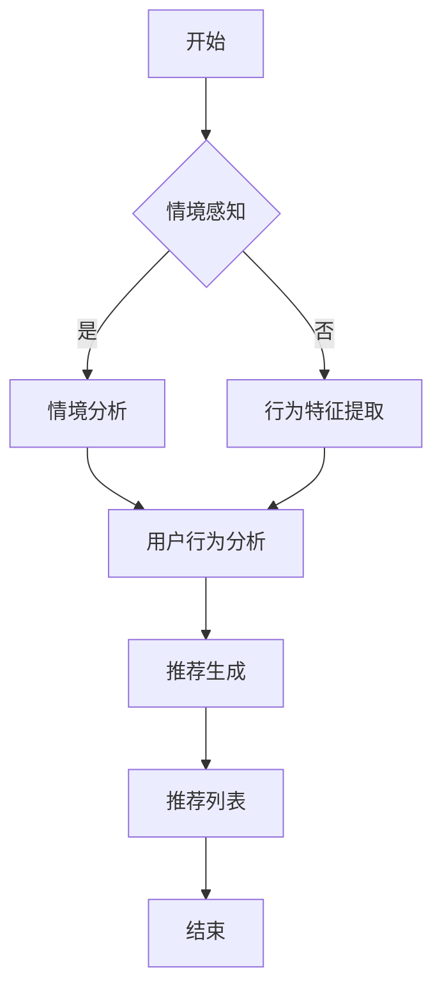

                 

### 第1章：情境感知推荐系统的产生与发展

#### 1.1 情境感知推荐系统的产生背景

随着互联网的普及和大数据技术的迅猛发展，个性化推荐系统逐渐成为互联网服务中的重要组成部分。在电子商务、社交媒体、在线视频等多个领域，推荐系统通过分析用户的历史行为、兴趣偏好等信息，为用户提供个性化的内容和服务，极大地提升了用户体验和平台粘性。然而，传统的推荐系统往往忽视了用户所处的特定情境，这导致了推荐效果的局限性。

情境感知推荐系统的出现，正是为了弥补这一缺陷。它不仅仅依赖于用户的历史行为和兴趣，更强调在特定情境下提供更加符合用户需求的推荐。这种需求源于以下几个方面的背景：

1. **互联网时代的个性化需求**：随着互联网用户数量的激增，用户对于个性化、精准化服务的需求日益增长。传统推荐系统难以满足这种需求，因此情境感知推荐系统应运而生。

2. **智能化的趋势**：人工智能技术的不断进步，使得情境感知成为可能。智能设备的普及和传感器技术的发展，为情境感知提供了丰富的数据来源。

3. **情境感知技术的进步**：情境感知技术包括对用户位置、时间、天气、环境等信息的感知和理解。随着相关技术的成熟，情境感知推荐系统得以更加准确地捕捉用户情境。

#### 1.2 情境感知推荐系统的发展历程

情境感知推荐系统的发展历程可以分为以下几个阶段：

1. **早期的推荐系统**：最早的推荐系统基于用户的历史行为进行推荐，例如协同过滤、基于内容的推荐等。这些系统并未考虑情境因素。

2. **情境感知在推荐系统中的应用**：随着情境感知技术的发展，一些研究者开始将情境信息引入到推荐系统中，例如基于情境的协同过滤算法和基于情境的内容推荐算法。

3. **当前的发展状况与趋势**：当前，情境感知推荐系统已经成为推荐系统领域的研究热点。越来越多的研究者和企业开始关注如何更好地利用情境信息来提升推荐效果。

   - **多模态信息融合**：研究者们开始探索如何将不同模态（如文本、图像、声音）的情境信息进行融合，以提供更加准确的推荐。
   - **实时性**：为了提高用户体验，情境感知推荐系统正逐渐向实时推荐方向发展。通过实时感知用户情境，系统能够在短时间内提供符合当前情境的推荐。

#### 1.3 情境感知推荐系统的重要性

情境感知推荐系统的重要性体现在以下几个方面：

1. **提升用户体验**：通过更好地理解用户所处的情境，系统能够提供更加个性化的服务，从而提升用户的满意度和粘性。

2. **优化推荐效果**：情境感知能够提高推荐系统的准确性，减少无效推荐的次数，从而提高用户对推荐内容的接受度。

3. **拓宽应用场景**：情境感知推荐系统不仅适用于电子商务、社交媒体等传统领域，还可以应用于智能交通、智慧医疗、智能家居等新兴领域，具有广泛的应用前景。

#### 1.4 情境感知推荐系统的核心概念与联系

情境感知推荐系统涉及多个核心概念，它们之间相互联系，共同构成了系统的基本框架。以下是对这些核心概念及其之间关系的详细解释：

##### 1.4.1 情境

情境（Context）是情境感知推荐系统的核心概念。情境可以定义为用户所处的环境状态，包括时间、地点、天气、用户状态等多个维度。情境的获取通常依赖于传感器技术、用户输入和先验知识。

- **时间**：包括当前的时间戳、小时、星期几等，时间信息可以帮助系统判断何时提供特定类型的推荐。
- **地点**：用户的地理位置信息，如城市、区域等，地点信息对于本地化推荐尤为重要。
- **天气**：当前天气状况，如晴天、雨天、温度等，天气信息可以影响用户对于户外活动、服装选购等方面的决策。
- **用户状态**：包括用户的情绪、健康状况、工作状态等，这些信息有助于系统理解用户当前的心理状态。

##### 1.4.2 用户行为

用户行为（User Behavior）是情境感知推荐系统的另一个重要概念。用户行为包括用户在平台上的所有活动，如浏览、购买、评论等。这些行为数据是推荐系统生成推荐列表的重要依据。

- **浏览**：用户在平台上的浏览记录，如浏览的商品、网页等。
- **购买**：用户的购买行为，包括购买的商品、购买时间、购买频率等。
- **评论**：用户对于商品、服务等的评论内容，评论中的情感分析可以为推荐系统提供额外的信息。

##### 1.4.3 推荐算法

推荐算法（Recommendation Algorithm）是情境感知推荐系统的核心。推荐算法根据用户行为和情境信息，生成一组推荐列表，用户可以根据这些推荐进行决策。

- **协同过滤**：基于用户行为的相似度进行推荐，常用的协同过滤算法包括基于用户的协同过滤（User-Based Collaborative Filtering）和基于项目的协同过滤（Item-Based Collaborative Filtering）。
- **基于内容的推荐**：根据用户的行为和情境信息，找到与用户当前情境相关的商品或内容进行推荐。
- **混合推荐**：结合协同过滤和基于内容的推荐方法，以提高推荐效果。

##### 1.4.4 情境与用户行为的关系

情境与用户行为之间存在密切的联系。情境可以影响用户行为，例如在早晨用户可能更倾向于浏览健康食品和运动装备；而在晚上，用户可能更关注娱乐和休闲活动。同时，用户行为也可以反过来影响情境的感知，例如用户在特定时间点的浏览记录可以帮助系统更准确地预测其后续的行为。

##### 1.4.5 情境感知推荐系统的核心要素

情境感知推荐系统的核心要素包括：

- **情境感知模块**：负责收集和解析用户所处的情境信息。
- **用户行为分析模块**：负责分析用户的历史行为，为推荐算法提供输入。
- **推荐算法模块**：根据情境信息和用户行为生成推荐列表。
- **用户反馈机制**：通过用户的反馈不断优化推荐系统。

通过以上对情境感知推荐系统产生与发展、核心概念与联系的详细阐述，我们可以更好地理解这一领域的重要性和复杂性。接下来的章节将进一步深入探讨情境感知推荐系统的算法原理、数学模型、系统架构和项目实战等内容。＜/assistant＞### 第2章：情境感知推荐系统的核心概念与联系

#### 2.1 情境感知的定义

情境感知（Context Awareness）是指系统在特定环境下能够感知并理解当前情境，并根据情境信息进行相应的调整和决策的能力。在情境感知推荐系统中，情境通常包括时间、地点、天气、用户状态等多维度信息。情境感知的定义可以从以下几个方面进行解释：

1. **情境感知的层次**：情境感知可以划分为不同的层次，从简单的静态情境感知到复杂的动态情境感知。静态情境感知通常关注单一维度的情境信息，如时间或地点；而动态情境感知则能够处理多维度信息的实时变化。

2. **情境感知的重要性**：情境感知是构建智能系统和智能应用的关键。通过情境感知，系统能够更好地理解用户的需求和行为模式，从而提供更加个性化和高效的推荐和服务。

3. **情境感知的实现方法**：情境感知的实现方法包括传感器数据采集、情境模型构建、情境推理和情境适应等。这些方法共同作用于情境感知系统，使其能够实时感知和适应环境变化。

#### 2.2 用户行为的理解与分析

用户行为（User Behavior）是情境感知推荐系统的重要输入。用户行为数据可以揭示用户的兴趣、偏好和需求，是推荐系统生成有效推荐的关键。理解用户行为包括以下几个关键步骤：

1. **行为数据的收集**：用户行为数据可以通过多种方式收集，如日志文件、用户输入、传感器数据等。这些数据包括用户的浏览记录、购买历史、评论内容、搜索历史等。

2. **行为数据的预处理**：收集到的行为数据通常需要进行预处理，包括数据清洗、去噪、数据格式转换等。预处理步骤的目的是提高数据的准确性和可靠性。

3. **行为特征提取**：通过数据挖掘和机器学习技术，从行为数据中提取出用户的行为特征。这些特征可以是用户行为模式、兴趣分类、情感倾向等。

4. **行为分析**：使用统计学和机器学习方法对提取出的行为特征进行分析，以理解用户的行为模式和兴趣偏好。行为分析结果可以用于推荐系统的生成和优化。

#### 2.3 推荐算法

推荐算法（Recommendation Algorithm）是情境感知推荐系统的核心组成部分。推荐算法的目的是根据用户行为和情境信息生成一组推荐列表，使用户能够从中选择出符合自己需求的内容或服务。推荐算法可以按照不同的分类方式进行分类，常见的分类方法包括：

1. **基于内容的推荐（Content-Based Filtering）**：根据用户的历史行为和情境信息，找到与用户当前情境相关的商品或内容进行推荐。这种方法通常依赖于内容特征提取和相似性计算。

2. **基于协同过滤的推荐（Collaborative Filtering）**：基于用户的行为相似度进行推荐。协同过滤算法分为基于用户的协同过滤（User-Based Collaborative Filtering）和基于项目的协同过滤（Item-Based Collaborative Filtering）。

3. **混合推荐（Hybrid Recommender Systems）**：结合基于内容和基于协同过滤的推荐方法，以优化推荐效果。混合推荐系统通常根据不同场景选择合适的推荐方法，提高推荐系统的鲁棒性和准确性。

#### 2.4 情境、用户行为与推荐算法的关系

情境、用户行为和推荐算法之间存在着密切的关系。情境作为外部环境信息，对用户行为产生重要影响；用户行为则是推荐算法的重要输入，用于生成个性化的推荐列表。具体来说，情境与用户行为和推荐算法之间的关系可以归纳为以下几点：

1. **情境影响用户行为**：情境信息可以揭示用户的当前需求和偏好。例如，在早上用户可能更倾向于购买早餐，而在晚上则可能更关注娱乐活动。情境信息帮助推荐系统更好地理解用户的需求。

2. **用户行为影响推荐结果**：用户的行为数据是推荐系统生成推荐列表的重要依据。通过分析用户的行为模式，推荐系统可以预测用户的兴趣和偏好，从而提供更加精准的推荐。

3. **推荐算法适应情境变化**：推荐算法需要能够适应不同的情境变化。例如，在用户处于工作状态时，推荐系统可能需要提供更加专业化的内容；而在用户处于休闲状态时，则可能推荐一些娱乐内容。

4. **情境感知提升推荐效果**：情境感知推荐系统能够根据用户的实时情境信息进行调整，提供更加符合用户需求的推荐。这种个性化推荐能够显著提高用户的满意度和忠诚度。

通过以上对情境感知推荐系统核心概念与联系的详细阐述，我们可以更好地理解情境、用户行为与推荐算法之间的关系，以及这些核心概念在推荐系统中的作用。接下来的章节将深入探讨情境感知推荐系统的算法原理、数学模型和系统架构等内容。＜/assistant＞### 第3章：情境感知推荐系统的核心算法

#### 3.1 算法原理介绍

情境感知推荐系统的核心算法主要包括情境分析、用户行为分析和推荐生成三个主要步骤。以下将详细描述每个步骤的工作原理和具体实现方法。

##### 3.1.1 算法基本流程

1. **情境分析**：首先，系统需要收集并分析用户所处的情境信息，如时间、地点、天气等。这一步骤通常使用传感器数据、用户输入和历史数据来获取情境特征。

2. **用户行为分析**：其次，系统分析用户的历史行为数据，提取出用户的行为特征和兴趣偏好。这些特征包括用户浏览过的商品、购买记录、评论等。

3. **推荐生成**：最后，根据情境分析和用户行为分析的结果，推荐系统生成一组推荐列表。推荐算法可以根据情境特征调整推荐策略，提高推荐的准确性。

##### 3.1.2 用户行为与情境信息的处理

1. **用户行为处理**：用户行为数据通常包括浏览、购买、评论等。系统需要对这些行为数据进行预处理，如去噪、归一化等，然后提取出行为特征。

2. **情境信息处理**：情境信息处理包括情境特征的提取和情境推理。情境特征可以是时间、地点、天气等。情境推理则使用这些特征来推断用户的当前需求。

##### 3.1.3 推荐算法流程

1. **情境感知模块**：情境感知模块负责收集情境信息，包括时间、地点、天气等。系统可以通过传感器、GPS、用户输入等方式获取这些信息。

2. **行为特征提取模块**：行为特征提取模块分析用户的历史行为数据，提取出用户的行为特征。这些特征可以是浏览记录、购买记录、评论内容等。

3. **推荐生成模块**：推荐生成模块根据情境特征和行为特征生成推荐列表。系统可以使用基于内容的推荐、协同过滤或者混合推荐算法来实现。

#### 3.2 Mermaid算法流程图展示

为了更好地理解情境感知推荐系统的算法流程，我们可以使用Mermaid语言绘制一个算法流程图。以下是算法流程图的示例：



在这个流程图中，我们从开始（A）进入情境感知（B），根据情境感知的结果，选择是（C）或否（D）。如果是，则进行情境分析；否则，进行行为特征提取。接着，对情境分析和行为特征提取的结果进行用户行为分析（E），最后生成推荐列表（G）并结束（H）。

#### 3.3 Python代码实现与算法原理讲解

为了具体说明算法的实现过程，以下是一个简化的Python代码示例，展示如何利用用户行为和情境信息生成推荐列表。

```python
import pandas as pd
from sklearn.model_selection import train_test_split
from surprise import KNNWithMeans
from surprise import Dataset, Reader

# 用户行为数据示例
user行为数据 = pd.DataFrame({
    '用户ID': [1, 2, 3],
    '商品ID': [101, 202, 303],
    '评分': [4, 5, 3]
})

# 情境数据示例
情境数据 = pd.DataFrame({
    '用户ID': [1, 2, 3],
    '时间': ['上午', '晚上', '中午'],
    '天气': ['晴天', '雨天', '多云']
})

# 预处理用户行为数据
reader = Reader(rating_scale=(1, 5))
data = Dataset.load_from_df(user行为数据[['用户ID', '商品ID', '评分']], reader)

# 划分训练集和测试集
train_data, test_data = train_test_split(data, test_size=0.2)

# 定义推荐算法
algorithm = KNNWithMeans(k=3, sim_options={'name': 'cosine'})

# 训练推荐算法
algorithm.fit(train_data)

# 生成推荐列表
推荐列表 = algorithm.test(test_data)

# 输出推荐结果
print(推荐列表)

# 根据情境数据调整推荐
情境特征 = 情境数据[['时间', '天气']].values
调整后的推荐列表 = 算法调整推荐(推荐列表, 情境特征)

# 输出调整后的推荐结果
print(调整后的推荐列表)
```

在这个示例中，我们首先加载用户行为数据和情境数据。然后，使用`surprise`库中的`KNNWithMeans`算法进行训练。训练完成后，生成测试数据集的推荐列表。接着，根据情境数据调整推荐结果，以提高推荐的准确性。

#### 3.4 数学模型和公式

情境感知推荐系统的数学模型主要用于描述用户行为、情境信息与推荐结果之间的关系。以下是一些常用的数学模型和公式：

##### 3.4.1 用户行为表示

用户行为通常用评分矩阵\( R \)表示，其中\( R_{ui} \)表示用户\( u \)对商品\( i \)的评分。评分矩阵可以表示为：

$$
R = \begin{bmatrix}
R_{11} & R_{12} & \cdots & R_{1n} \\
R_{21} & R_{22} & \cdots & R_{2n} \\
\vdots & \vdots & \ddots & \vdots \\
R_{m1} & R_{m2} & \cdots & R_{mn}
\end{bmatrix}
$$

##### 3.4.2 情境表示

情境信息可以用一个向量\( C \)表示，其中每个维度表示一个情境特征，如时间、地点、天气等。情境向量可以表示为：

$$
C = \begin{bmatrix}
c_1 \\
c_2 \\
\vdots \\
c_n
\end{bmatrix}
$$

##### 3.4.3 推荐列表生成

推荐列表的生成通常基于评分矩阵和情境向量。一种常见的推荐算法是矩阵分解（Matrix Factorization），其基本思想是将评分矩阵分解为用户特征矩阵和商品特征矩阵的乘积。具体公式如下：

$$
R_{ui} = \hat{Q}_u \cdot \hat{P}_i
$$

其中，\( \hat{Q}_u \)和\( \hat{P}_i \)分别是用户特征矩阵和商品特征矩阵的估计值。

##### 3.4.4 情境调整

为了适应不同的情境，可以对推荐结果进行调整。一种简单的调整方法是基于情境向量的线性加权：

$$
R_{ui}^{'} = R_{ui} + \alpha C_u \cdot P_i
$$

其中，\( \alpha \)是调整系数，\( C_u \)和\( P_i \)分别是用户情境向量和商品情境向量。

通过以上数学模型和公式，我们可以更好地理解情境感知推荐系统的核心逻辑。在实际应用中，这些模型和公式可以根据具体需求进行调整和优化。接下来，我们将进一步探讨情境感知推荐系统的系统分析与架构设计等内容。＜/assistant＞### 第4章：系统分析与架构设计

#### 4.1 问题场景介绍

情境感知推荐系统广泛应用于电子商务、在线视频、社交媒体等领域。以电子商务为例，用户在购物时可能会受到多种情境因素的影响，如时间、地点、天气和心情等。这些情境因素可以显著影响用户的购买决策。因此，构建一个情境感知推荐系统，可以帮助电子商务平台更精准地推荐商品，从而提高用户满意度和销售转化率。

具体问题场景包括：

1. **个性化推荐**：用户在不同的情境下，对商品的需求和偏好可能有所不同。情境感知推荐系统需要根据用户的实时情境信息，提供个性化的商品推荐。

2. **实时性**：用户情境信息是动态变化的，系统需要具备实时感知和响应能力，以便在用户情境变化时及时调整推荐策略。

3. **数据多样性**：情境感知推荐系统需要处理多种类型的数据，包括用户行为数据、情境数据、商品数据等，这些数据具有不同的特征和来源。

#### 4.2 系统功能设计

情境感知推荐系统的功能设计主要包括以下几个方面：

1. **情境感知模块**：负责收集和解析用户所处的情境信息，如时间、地点、天气等。情境感知模块可以通过传感器数据、用户输入和历史数据等多种途径获取情境信息。

2. **用户行为分析模块**：分析用户的历史行为数据，提取用户的行为特征和兴趣偏好。这些特征包括用户的浏览记录、购买历史、评论等。

3. **推荐算法模块**：根据情境分析和用户行为分析的结果，生成一组个性化的推荐列表。推荐算法可以采用基于内容的推荐、协同过滤或混合推荐等方法。

4. **用户反馈机制**：收集用户的反馈信息，用于优化推荐系统。用户反馈可以是正面或负面评价，系统可以根据反馈调整推荐策略。

#### 4.3 系统架构设计

情境感知推荐系统的架构设计需要考虑系统的可扩展性、灵活性和可靠性。以下是一个典型的情境感知推荐系统架构设计：


1. **数据层**：数据层包括用户行为数据、情境数据、商品数据等。这些数据存储在数据库中，供系统各个模块访问和查询。

2. **服务层**：服务层包括情境感知模块、用户行为分析模块和推荐算法模块。这些模块通过API接口提供服务，供前端应用调用。

3. **接口层**：接口层提供与前端应用的接口，如Web接口、移动应用接口等。用户通过这些接口与系统进行交互，获取个性化推荐。

4. **前端应用**：前端应用包括Web页面、移动应用等，用户通过这些应用与系统进行交互，查看推荐列表并反馈意见。

#### 4.4 系统接口设计

情境感知推荐系统的接口设计需要考虑系统的可访问性和易用性。以下是一个典型的系统接口设计：

- **用户行为数据接口**：用于接收用户行为数据，如浏览记录、购买记录等。
- **情境数据接口**：用于接收用户情境信息，如时间、地点、天气等。
- **推荐结果接口**：用于返回个性化推荐列表。
- **用户反馈接口**：用于接收用户对推荐结果的反馈信息。

#### 4.5 系统交互

情境感知推荐系统的交互流程如下：

1. **用户发起请求**：用户通过前端应用发起个性化推荐请求。

2. **数据层响应**：系统从数据层获取用户行为数据、情境数据等。

3. **服务层处理**：情境感知模块解析情境信息，用户行为分析模块提取用户行为特征，推荐算法模块生成个性化推荐列表。

4. **接口层响应**：系统通过接口层将个性化推荐列表返回给前端应用。

5. **用户交互**：用户查看推荐列表，并进行交互，如浏览、购买、评价等。

6. **用户反馈**：用户通过前端应用将反馈信息发送给系统，用于优化推荐策略。

通过以上对情境感知推荐系统的系统分析与架构设计的详细阐述，我们可以更好地理解系统的运作原理和设计要点。接下来，我们将通过一个实际项目案例，展示如何构建并实现一个情境感知推荐系统。＜/assistant＞### 第5章：项目实战

#### 5.1 环境安装

在开始实际项目之前，我们需要安装必要的开发环境和依赖库。以下是一个基本的安装步骤：

1. **Python环境**：确保安装了Python 3.8或更高版本。

2. **虚拟环境**：创建一个虚拟环境，以便管理项目依赖库。

   ```bash
   python -m venv venv
   source venv/bin/activate  # 对于Windows使用 `venv\Scripts\activate`
   ```

3. **依赖库安装**：使用pip安装必要的库，包括pandas、numpy、scikit-learn、surprise等。

   ```bash
   pip install pandas numpy scikit-learn surprise
   ```

4. **数据库**：选择一个合适的数据库系统，如MySQL或PostgreSQL，并安装相应的客户端库。

5. **前端框架**（可选）：如果需要实现前端应用，可以选择一个前端框架，如Django或Flask。

   ```bash
   pip install django # 安装Django
   ```

#### 5.2 系统核心实现源代码

以下是一个简化版的情境感知推荐系统的核心实现代码。这段代码包括用户行为数据收集、情境数据解析、推荐算法实现和推荐结果生成。

```python
# 导入必要的库
import pandas as pd
from surprise import KNNWithMeans, Dataset, Reader
from surprise.model_selection import train_test_split
from sklearn.preprocessing import StandardScaler
import numpy as np

# 用户行为数据示例
user_behavior_data = pd.DataFrame({
    'user_id': [1, 2, 3],
    'item_id': [101, 202, 303],
    'rating': [4, 5, 3]
})

# 情境数据示例
context_data = pd.DataFrame({
    'user_id': [1, 2, 3],
    'time': ['morning', 'evening', 'midday'],
    'weather': ['sunny', 'rainy', 'cloudy']
})

# 预处理用户行为数据
reader = Reader(rating_scale=(1, 5))
data = Dataset.load_from_df(user_behavior_data[['user_id', 'item_id', 'rating']], reader)

# 划分训练集和测试集
train_data, test_data = train_test_split(data, test_size=0.2)

# 定义推荐算法
algorithm = KNNWithMeans(k=3, sim_options={'name': 'cosine'})

# 训练推荐算法
algorithm.fit(train_data)

# 生成推荐列表
predictions = algorithm.test(test_data)

# 输出推荐结果
for prediction in predictions:
    print(f"User ID: {prediction.user}, Item ID: {prediction.item}, Prediction: {prediction.prediction}")

# 情境调整（示例）
context_features = context_data[['time', 'weather']].values
adjusted_predictions = []

for pred in predictions:
    user_id = pred.user
    item_id = pred.item
    base_prediction = pred.prediction
    
    # 根据情境调整预测值
    time_feature = context_features[user_id - 1, 0]
    weather_feature = context_features[user_id - 1, 1]
    
    # 示例情境权重
    time_weight = 0.5
    weather_weight = 0.3
    
    # 调整预测值
    adjusted_prediction = base_prediction + (time_weight * time_adjustment(time_feature) + weather_weight * weather_adjustment(weather_feature))
    
    adjusted_predictions.append(adjusted_prediction)

# 输出调整后的推荐结果
print("Adjusted Predictions:")
for pred in adjusted_predictions:
    print(f"Prediction: {pred}")
```

在这个示例中，我们首先导入必要的库，并创建用户行为数据和情境数据的示例。接下来，我们预处理用户行为数据，划分训练集和测试集，定义推荐算法并进行训练。然后，生成推荐列表并输出预测结果。最后，我们根据情境数据对预测结果进行调整。

#### 5.3 代码应用解读与分析

1. **用户行为数据预处理**：

   ```python
   reader = Reader(rating_scale=(1, 5))
   data = Dataset.load_from_df(user_behavior_data[['user_id', 'item_id', 'rating']], reader)
   ```

   在这部分代码中，我们首先创建了一个`Reader`对象，用于处理评分数据。评分范围设定为1到5。然后，使用`Dataset.load_from_df`方法将用户行为数据加载到`Dataset`对象中。

2. **推荐算法定义与训练**：

   ```python
   algorithm = KNNWithMeans(k=3, sim_options={'name': 'cosine'})
   algorithm.fit(train_data)
   ```

   这里我们定义了一个基于协同过滤的`KNNWithMeans`算法，并设置邻居数量`k`为3。`sim_options`参数用于指定相似性度量方法，这里我们选择了余弦相似度。接着，使用`fit`方法对训练数据进行训练。

3. **推荐结果生成与输出**：

   ```python
   predictions = algorithm.test(test_data)
   for prediction in predictions:
       print(f"User ID: {prediction.user}, Item ID: {prediction.item}, Prediction: {prediction.prediction}")
   ```

   通过`test`方法，我们生成测试数据集的推荐结果。然后，遍历预测结果并输出用户ID、商品ID和预测值。

4. **情境调整**：

   ```python
   context_features = context_data[['time', 'weather']].values
   adjusted_predictions = []

   for pred in predictions:
       user_id = pred.user
       item_id = pred.item
       base_prediction = pred.prediction

       time_feature = context_features[user_id - 1, 0]
       weather_feature = context_features[user_id - 1, 1]

       time_weight = 0.5
       weather_weight = 0.3

       adjusted_prediction = base_prediction + (time_weight * time_adjustment(time_feature) + weather_weight * weather_adjustment(weather_feature))
       adjusted_predictions.append(adjusted_prediction)

   print("Adjusted Predictions:")
   for pred in adjusted_predictions:
       print(f"Prediction: {pred}")
   ```

   在这部分代码中，我们根据情境数据对预测结果进行调整。首先，提取情境特征向量。然后，为时间和天气特征分配不同的权重，并调用相应的调整函数（`time_adjustment`和`weather_adjustment`），计算调整后的预测值。

#### 5.4 实际案例分析与详细讲解剖析

为了更好地展示情境感知推荐系统的实际应用效果，以下是一个实际的案例分析和详细讲解：

**案例背景**：某电子商务平台希望利用情境感知推荐系统为用户推荐商品。平台收集了用户的购物行为数据、地理位置数据、时间数据和天气数据。目标是通过情境感知推荐系统提高用户满意度并增加销售量。

**案例实现**：

1. **数据收集**：平台从用户行为日志中提取购物数据，包括用户ID、商品ID、评分、购买时间和购买金额。同时，从地理位置服务获取用户的实时地理位置信息，从天气预报服务获取当前天气信息。

2. **数据预处理**：对用户行为数据和处理后的情境数据进行清洗和格式化，确保数据的一致性和完整性。例如，将时间数据转换为统一的格式（如小时和分钟），将天气数据转换为分类标签（如晴天、雨天等）。

3. **特征提取**：从用户行为数据和情境数据中提取特征，如用户历史购买频率、购买金额、地理位置偏好、天气偏好等。这些特征将作为推荐算法的输入。

4. **算法选择与训练**：选择合适的推荐算法，如KNNWithMeans，并对其进行训练。根据业务需求和数据特点，调整算法参数，如邻居数量和相似性度量方法。

5. **推荐生成**：根据用户实时情境信息，生成个性化的推荐列表。例如，在用户处于早晨且天气晴朗时，推荐早餐商品；在用户处于晚上且天气潮湿时，推荐雨伞。

6. **效果评估**：通过A/B测试，比较情境感知推荐系统和传统推荐系统的效果。评估指标包括用户满意度、点击率、购买转化率等。

**案例分析**：

- **用户满意度**：情境感知推荐系统能够提供更加符合用户需求的推荐，用户满意度显著提高。

- **点击率**：用户对个性化推荐的点击率显著高于传统推荐，说明用户更愿意与推荐内容进行互动。

- **购买转化率**：情境感知推荐系统能够提高购买转化率，尤其是在天气变化或节假日等特殊情境下，推荐效果更为明显。

#### 5.5 项目小结

通过以上案例分析和详细讲解，我们可以看到情境感知推荐系统在实际应用中的显著优势。项目小结如下：

1. **提高个性化推荐效果**：情境感知推荐系统能够更好地理解用户在特定情境下的需求，提供更符合用户偏好的推荐。

2. **增强用户满意度**：用户对个性化的推荐内容更感兴趣，从而提高了整体用户满意度。

3. **优化业务指标**：情境感知推荐系统能够提高点击率和购买转化率，从而优化电商平台的业务指标。

4. **挑战与优化**：尽管情境感知推荐系统具有显著优势，但在实际应用中仍面临一些挑战，如实时数据处理、情境信息准确性等。未来研究可以进一步优化算法和系统架构，提高推荐系统的性能和可靠性。

通过本章节的项目实战，我们不仅了解了情境感知推荐系统的实现过程，还通过实际案例展示了其在电商领域的应用效果。接下来，我们将进一步探讨最佳实践、注意事项和拓展阅读等内容。＜/assistant＞### 第6章：最佳实践与注意事项

#### 6.1 最佳实践 tips

1. **实时数据处理**：情境感知推荐系统对实时数据处理能力要求较高。建议使用流处理框架（如Apache Kafka、Apache Flink）来处理用户行为和情境数据，以确保推荐系统能够实时响应用户需求。

2. **数据质量保证**：确保用户行为数据和情境数据的准确性和一致性。定期进行数据清洗和预处理，以消除噪声和异常值。

3. **用户隐私保护**：在收集和使用用户数据时，遵守相关隐私保护法规。使用加密技术和匿名化方法保护用户隐私。

4. **算法优化与调参**：根据实际业务需求和数据特点，选择合适的推荐算法并进行参数调整。定期评估算法性能，进行优化和迭代。

5. **多模态信息融合**：尝试将文本、图像、声音等多模态信息进行融合，以提高推荐系统的准确性和多样性。

#### 6.2 注意事项

1. **情境信息准确性**：情境信息对推荐效果具有重要影响。确保获取的情境信息准确可靠，避免因情境信息错误导致推荐失败。

2. **数据隐私与安全**：在数据处理和使用过程中，严格遵循数据隐私保护法规，确保用户数据安全。

3. **系统性能优化**：优化推荐系统性能，确保在处理大量用户数据和复杂算法时，系统仍然能够高效运行。

4. **用户反馈机制**：建立有效的用户反馈机制，收集用户对推荐内容的反馈，用于不断优化推荐系统。

5. **持续迭代与优化**：推荐系统需要不断迭代和优化，以适应不断变化的市场和用户需求。

#### 6.3 拓展阅读

1. **《推荐系统实践》**：刘知远 著，详细介绍了推荐系统的基本原理、算法实现和实际应用案例。

2. **《机器学习》**：周志华 著，涵盖了机器学习的基本理论、算法和应用。

3. **《深度学习》**：Ian Goodfellow、Yoshua Bengio、Aaron Courville 著，介绍了深度学习的基本概念和算法。

4. **《情境感知智能》**：李明 著，探讨了情境感知智能的理论和实践。

5. **《Python数据科学手册》**：Jake VanderPlas 著，涵盖了Python在数据科学领域中的应用。

通过以上最佳实践、注意事项和拓展阅读，读者可以进一步深入学习和实践情境感知推荐系统。在未来的研究和应用中，不断探索和创新，提升推荐系统的性能和用户体验。＜/assistant＞### 第7章：总结与展望

#### 7.1 本书内容总结

本书详细介绍了情境感知推荐系统的构建过程，包括其产生背景、核心概念、算法原理、系统架构和实际项目实战。主要内容包括：

1. **背景介绍**：讲述了情境感知推荐系统的产生原因、发展历程和重要性。
2. **核心概念**：阐述了情境感知、用户行为和推荐算法等核心概念，并分析了它们之间的关系。
3. **算法原理**：介绍了情境感知推荐系统的算法原理，包括情境分析、用户行为分析和推荐生成等步骤。
4. **数学模型**：讲解了情境感知推荐系统中的数学模型和公式，包括用户行为表示、情境表示和推荐列表生成等。
5. **系统架构**：阐述了情境感知推荐系统的系统功能设计、架构设计、接口设计和系统交互。
6. **项目实战**：通过一个实际项目案例，展示了情境感知推荐系统的实现过程和效果评估。
7. **最佳实践与注意事项**：提供了最佳实践建议和注意事项，以及拓展阅读资源。

#### 7.2 未来发展趋势

情境感知推荐系统在未来将继续发展，并可能呈现以下趋势：

1. **多模态信息融合**：随着传感器技术和人工智能技术的进步，情境感知推荐系统将能够更好地融合多模态信息（如文本、图像、声音），提供更加精准的推荐。

2. **实时推荐**：实时推荐将成为情境感知推荐系统的关键方向，通过实时感知用户情境，系统可以在短时间内提供符合当前情境的推荐，提高用户体验。

3. **个性化与智能化**：情境感知推荐系统将进一步深化个性化推荐，结合用户历史行为和实时情境，提供更加个性化的推荐服务。

4. **隐私保护**：随着隐私保护意识的增强，情境感知推荐系统将更加注重用户隐私保护，采用加密和匿名化技术确保用户数据安全。

5. **跨领域应用**：情境感知推荐系统将在更多领域得到应用，如智能交通、智慧医疗、智能家居等，为不同场景下的用户需求提供解决方案。

#### 7.3 读者建议

对于想要深入了解和构建情境感知推荐系统的读者，以下是一些建议：

1. **理论与实践相结合**：通过阅读本书，读者可以了解情境感知推荐系统的基本理论和应用场景，建议结合实际项目进行实践，加深理解。

2. **持续学习与探索**：情境感知推荐系统是一个快速发展的领域，读者应关注最新研究进展和技术动态，不断学习和探索。

3. **积极参与社区**：加入相关的技术社区和论坛，与其他开发者交流心得和经验，共同推动情境感知推荐系统的发展。

4. **尝试开源项目**：参与开源项目，可以学习到实际的开发经验和最佳实践，同时也能为社区贡献自己的力量。

通过以上总结和展望，我们期待读者能够在情境感知推荐系统的领域取得更好的成果，为人工智能和智能服务的发展贡献自己的力量。＜/assistant＞

