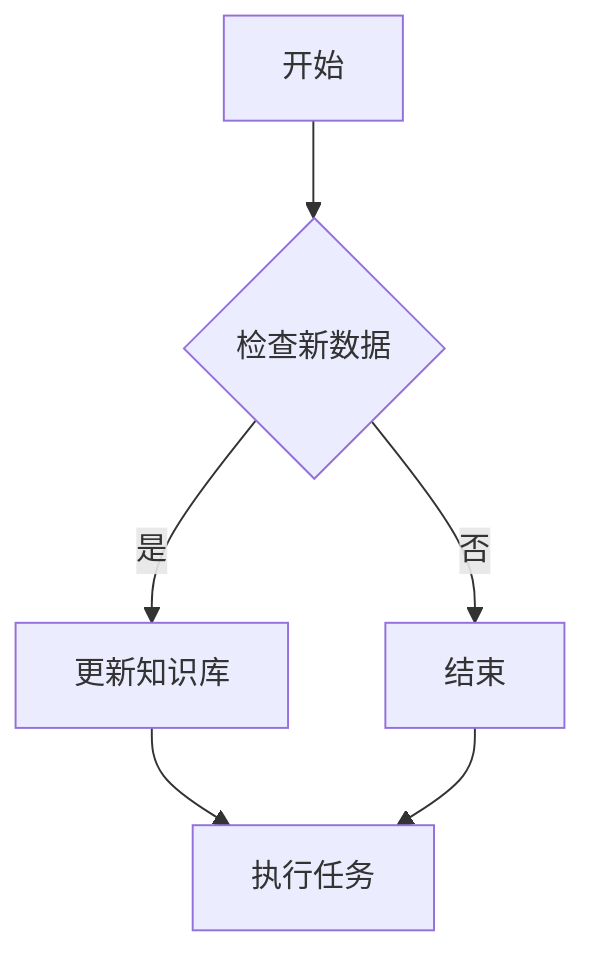
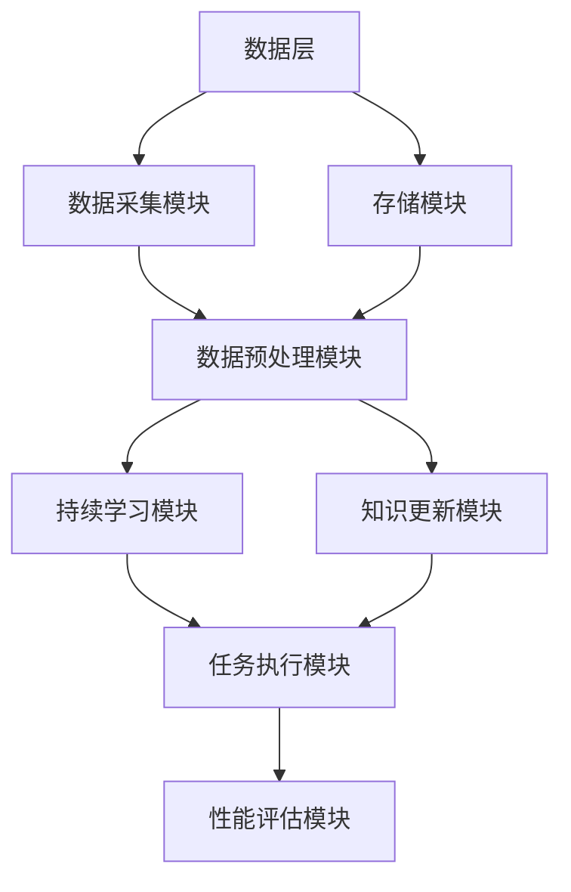
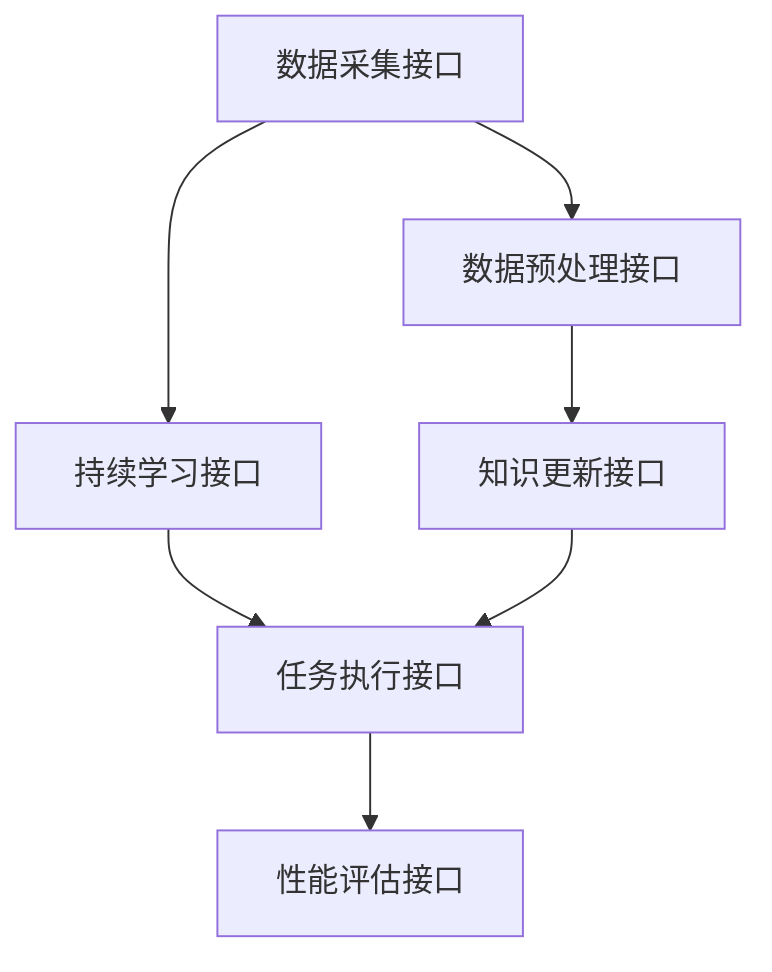
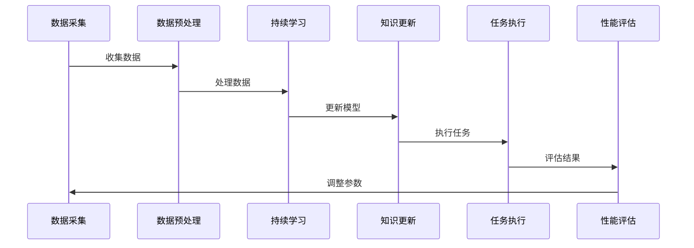
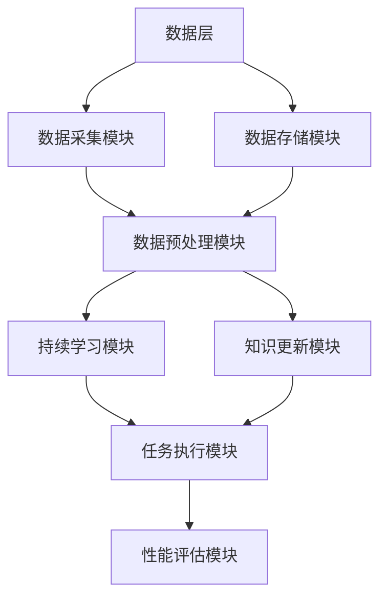

                 


**# 构建 AI Agent 的持续学习与知识更新机制**

> 关键词：AI Agent, 持续学习, 知识更新, 机器学习, 知识图谱

> 摘要：本文将探讨构建 AI Agent 的持续学习与知识更新机制的重要性，详细分析相关核心概念、算法原理，并提供系统设计与实现的步骤。通过实际项目和案例的分析，本文旨在为读者提供全面、易懂的指导，以构建高效、智能的 AI Agent。

----------------------------------------------------------------

## 第1章：AI Agent概述

### 1.1 AI Agent的概念

AI Agent，即人工智能代理，是指能够自主感知环境、执行任务并作出决策的计算机系统。AI Agent具备以下几个核心特点：

1. **自主性**：AI Agent能够独立执行任务，不需要人工干预。
2. **感知能力**：通过传感器获取环境信息，如视觉、听觉等。
3. **决策能力**：根据收集到的信息，AI Agent能够自主做出决策。
4. **行动能力**：执行决策，与环境进行交互。

AI Agent的应用场景广泛，包括但不限于：

1. **智能客服**：自动回答用户的问题，提供客户服务。
2. **自动驾驶**：自动驾驶汽车能够自主导航、避障和执行驾驶任务。
3. **智能家居**：自动控制家中的设备，如灯光、空调等。
4. **医疗诊断**：利用 AI Agent进行疾病诊断，提高诊断准确率。

### 1.2 持续学习和知识更新的重要性

AI Agent的持续学习和知识更新机制是其保持高效、智能的关键。以下是几个方面的原因：

1. **环境变化**：现实世界是不断变化的，AI Agent需要不断更新知识以适应新的环境。
2. **提高性能**：通过持续学习，AI Agent能够不断优化自己的行为，提高任务执行效率。
3. **应对未知**：AI Agent需要具备应对未知情况的能力，知识更新有助于增强这种能力。
4. **保持相关性**：随着时间推移，新的知识和信息不断涌现，AI Agent需要持续更新以保持相关性。

### 1.3 核心要素：数据、算法、架构

构建 AI Agent 的持续学习与知识更新机制，需要关注以下几个核心要素：

1. **数据**：高质量的数据是 AI Agent学习和更新的基础。数据来源包括历史数据、实时数据和外部数据源。
2. **算法**：选择合适的算法是实现持续学习和知识更新的关键。常见的算法包括监督学习、无监督学习和强化学习等。
3. **架构**：系统的架构设计决定了 AI Agent 的性能和可扩展性。合理的架构设计能够支持高效的数据处理和算法应用。

----------------------------------------------------------------

## 第2章：核心概念与理论基础

### 2.1 持续学习的基本原理

#### 2.1.1 持续学习的定义

持续学习，又称在线学习，是指 AI Agent 在执行任务的过程中，不断获取新数据，并利用这些数据进行学习和更新。与批量学习相比，持续学习具有以下特点：

1. **实时性**：数据实时获取和处理，能够快速适应环境变化。
2. **增量性**：只更新模型中的新信息，避免重复训练带来的计算开销。

#### 2.1.2 持续学习的类型

持续学习可以分为以下几种类型：

1. **监督学习**：在已有标签数据的基础上，对模型进行更新。
2. **无监督学习**：通过分析数据分布和特征，自动发现模式。
3. **强化学习**：通过与环境的交互，不断优化行为策略。

#### 2.1.3 持续学习的算法

常见的持续学习算法包括：

1. **在线梯度下降**：通过更新模型参数，使损失函数最小化。
2. **经验重放**：通过保存历史数据，避免重复训练同一数据集。
3. **自适应学习率**：根据训练过程自动调整学习率。

### 2.2 知识更新机制

#### 2.2.1 知识更新的定义

知识更新是指 AI Agent 在获取新信息后，对已有知识库进行调整和优化的过程。知识更新包括以下几种方式：

1. **增量更新**：仅对新增的信息进行更新，不改变已有知识。
2. **完全更新**：对整个知识库进行重新训练，更新全部信息。
3. **增量与完全更新结合**：根据需要，灵活选择更新方式。

#### 2.2.2 知识更新的方法

知识更新的方法包括：

1. **数据流处理**：实时处理和更新知识库。
2. **知识图谱**：利用图结构存储和管理知识。
3. **迁移学习**：利用已有知识，快速适应新任务。

#### 2.2.3 知识更新的挑战

知识更新面临以下挑战：

1. **数据质量**：低质量数据会影响知识更新的效果。
2. **知识一致性**：保持知识库的一致性是关键。
3. **计算资源**：知识更新需要大量计算资源。

### 2.3 ER实体关系图与Mermaid流程图

#### 2.3.1 ER实体关系图

ER实体关系图是用于表示数据实体及其之间关系的图形化工具。在构建 AI Agent 的知识更新机制时，ER实体关系图有助于理解和设计知识库的结构。

#### 2.3.2 Mermaid流程图

Mermaid 是一种简单易用的 Markdown 扩展，用于创建流程图、序列图等。通过 Mermaid 流程图，可以直观地展示知识更新的过程和算法。

下面是一个简单的 Mermaid 流程图示例：



通过以上内容，我们对持续学习与知识更新机制有了初步的了解。接下来的章节将进一步深入探讨相关算法和实现细节。

----------------------------------------------------------------

## 第3章：算法原理与实现

### 3.1 算法概述

在构建 AI Agent 的持续学习与知识更新机制时，选择合适的算法至关重要。以下是几种常见的算法及其适用场景：

1. **监督学习**：适用于有明确标签的数据集，如分类和回归任务。
2. **无监督学习**：适用于无标签的数据集，如聚类和降维。
3. **强化学习**：适用于与环境的交互任务，如游戏和自动驾驶。

在本章中，我们将重点介绍监督学习算法，包括以下内容：

1. **在线梯度下降**：一种简单的优化算法，用于更新模型参数。
2. **经验重放**：用于避免重复训练同一数据集。
3. **自适应学习率**：根据训练过程动态调整学习率。

### 3.2 数学模型与公式

#### 3.2.1 在线梯度下降

在线梯度下降是一种优化算法，用于更新模型参数。其核心思想是计算损失函数的梯度，并沿着梯度方向更新参数。以下是在线梯度下降的数学模型：

$$
\theta_{t+1} = \theta_{t} - \alpha \cdot \nabla_{\theta} J(\theta)
$$

其中，$\theta_{t}$ 和 $\theta_{t+1}$ 分别表示第 $t$ 次和第 $t+1$ 次的参数，$\alpha$ 是学习率，$J(\theta)$ 是损失函数。

#### 3.2.2 经验重放

经验重放是一种用于避免重复训练同一数据集的方法。其核心思想是将历史数据保存在一个经验池中，并在训练过程中随机抽取数据进行训练。以下是经验重放的过程：

1. **初始化经验池**：将初始数据放入经验池。
2. **数据抽取**：从经验池中随机抽取一批数据。
3. **训练模型**：使用抽取的数据对模型进行训练。

#### 3.2.3 自适应学习率

自适应学习率是一种根据训练过程动态调整学习率的方法。其核心思想是学习率随着训练过程的进行逐渐减小。以下是自适应学习率的公式：

$$
\alpha_{t+1} = \alpha_{t} \cdot \frac{1}{1 + \beta \cdot t}
$$

其中，$\alpha_{t}$ 和 $\alpha_{t+1}$ 分别表示第 $t$ 次和第 $t+1$ 次的学习率，$\beta$ 是学习率衰减系数。

### 3.3 Python代码示例

在本节中，我们将使用 Python 编写一个简单的在线梯度下降算法示例，以展示算法的实现过程。

```python
import numpy as np

# 初始化参数
theta = np.random.rand(1)
alpha = 0.1

# 损失函数
def J(theta):
    return (theta - 1)**2

# 梯度
def dJ(theta):
    return 2 * (theta - 1)

# 训练模型
for t in range(1000):
    # 计算梯度
    gradient = dJ(theta)
    
    # 更新参数
    theta = theta - alpha * gradient
    
    # 打印训练进度
    if t % 100 == 0:
        print(f"Epoch {t}: Theta = {theta}, Loss = {J(theta)}")

# 输出最终结果
print(f"Final Theta: {theta}")
print(f"Final Loss: {J(theta)}")
```

通过以上代码示例，我们可以看到在线梯度下降算法的基本实现过程。接下来，我们将继续介绍经验重放和自适应学习率的实现。

----------------------------------------------------------------

## 第4章：系统设计与架构

### 4.1 系统功能设计

在本章中，我们将介绍 AI Agent 持续学习与知识更新系统的功能设计。系统的主要功能包括：

1. **数据采集**：从各种数据源（如传感器、数据库等）收集数据。
2. **数据预处理**：对采集到的数据进行清洗、去噪和格式化。
3. **持续学习**：利用持续学习算法对模型进行更新。
4. **知识更新**：对知识库进行更新，以适应新的环境和任务。
5. **任务执行**：根据更新后的模型和知识库执行任务。
6. **性能评估**：评估 AI Agent 的性能，并根据评估结果调整系统参数。

### 4.2 系统架构设计

AI Agent 持续学习与知识更新系统的架构设计应考虑以下几个方面：

1. **数据层**：包括数据采集模块和存储模块。数据采集模块负责从各种数据源收集数据，存储模块则负责数据的存储和管理。
2. **处理层**：包括数据预处理模块、持续学习模块和知识更新模块。数据预处理模块负责对数据进行清洗和格式化，持续学习模块利用算法对模型进行更新，知识更新模块负责对知识库进行维护和更新。
3. **应用层**：包括任务执行模块和性能评估模块。任务执行模块根据更新后的模型和知识库执行具体任务，性能评估模块则对 AI Agent 的性能进行评估。

以下是一个简化的系统架构图：



### 4.3 系统接口设计

系统接口设计是确保各模块之间高效协作的关键。以下是几个关键接口：

1. **数据采集接口**：用于从各种数据源获取数据。
2. **数据预处理接口**：用于处理和清洗采集到的数据。
3. **持续学习接口**：用于启动和监控持续学习过程。
4. **知识更新接口**：用于更新和优化知识库。
5. **任务执行接口**：用于执行具体任务。
6. **性能评估接口**：用于评估系统性能。

以下是一个简化的接口设计示例：



### 4.4 系统交互流程

系统交互流程描述了各模块之间的协作和交互过程。以下是一个简化的交互流程：

1. **数据采集**：系统从传感器和网络接口收集数据。
2. **数据预处理**：系统对采集到的数据进行处理，包括清洗、去噪和格式化。
3. **持续学习**：系统利用处理后的数据进行持续学习，更新模型参数。
4. **知识更新**：系统根据持续学习的结果更新知识库。
5. **任务执行**：系统根据更新后的模型和知识库执行任务。
6. **性能评估**：系统对任务执行结果进行评估，并根据评估结果调整系统参数。

以下是一个简化的 Mermaid 序列图示例：



通过以上内容，我们详细介绍了 AI Agent 持续学习与知识更新系统的功能设计、架构设计、接口设计和交互流程。接下来，我们将通过实际项目来展示这些设计的具体实现。

----------------------------------------------------------------

## 第5章：项目实战

### 5.1 环境安装与配置

为了实现 AI Agent 的持续学习与知识更新机制，我们需要搭建一个合适的环境。以下是环境安装与配置的步骤：

1. **安装 Python**：确保系统中已安装 Python 3.7 或以上版本。可以通过以下命令安装 Python：

   ```bash
   sudo apt-get install python3.7
   ```

2. **安装 Anaconda**：Anaconda 是一个流行的 Python 发行版，提供了丰富的包管理和环境配置功能。可以从官方网站下载并安装 Anaconda：

   ```bash
   wget https://repo.anaconda.com/archive/Anaconda3-2022.05-Linux-x86_64.sh
   bash Anaconda3-2022.05-Linux-x86_64.sh
   ```

   安装过程中，接受默认选项即可。

3. **创建虚拟环境**：为了避免不同项目之间的依赖冲突，我们使用虚拟环境来隔离项目环境。可以通过以下命令创建虚拟环境：

   ```bash
   conda create -n ai_agent python=3.8
   conda activate ai_agent
   ```

4. **安装依赖库**：在虚拟环境中安装必要的库，如 NumPy、Pandas、TensorFlow 和 Mermaid 等。可以通过以下命令安装：

   ```bash
   conda install numpy pandas tensorflow matplotlib mermaid
   ```

### 5.2 系统核心实现

在本节中，我们将实现 AI Agent 的核心功能，包括数据采集、数据预处理、持续学习、知识更新和任务执行。

#### 5.2.1 数据采集

数据采集是 AI Agent 的第一步。以下是一个简单的示例，用于从文件中读取数据：

```python
import pandas as pd

def collect_data(file_path):
    data = pd.read_csv(file_path)
    return data

# 示例：从文件中读取数据
data = collect_data('data.csv')
```

#### 5.2.2 数据预处理

数据预处理是确保数据质量的重要步骤。以下是一个简单的数据预处理示例，包括数据清洗、去噪和格式化：

```python
def preprocess_data(data):
    # 去除缺失值
    data = data.dropna()
    
    # 去除重复值
    data = data.drop_duplicates()
    
    # 数据格式化
    data['feature1'] = data['feature1'].astype(float)
    data['feature2'] = data['feature2'].astype(float)
    
    return data

# 示例：预处理数据
preprocessed_data = preprocess_data(data)
```

#### 5.2.3 持续学习

持续学习是 AI Agent 的核心功能之一。以下是一个简单的监督学习示例，使用在线梯度下降算法更新模型参数：

```python
import numpy as np

def online_gradient_descent(data, learning_rate, epochs):
    X = data[['feature1', 'feature2']]
    y = data['target']
    
    theta = np.random.rand(1)
    
    for epoch in range(epochs):
        predictions = theta + np.dot(X, theta)
        gradient = 2 * np.dot(X.T, (predictions - y))
        theta = theta - learning_rate * gradient
        
        if epoch % 100 == 0:
            print(f"Epoch {epoch}: Theta = {theta}")
    
    return theta

# 示例：持续学习
theta = online_gradient_descent(preprocessed_data, learning_rate=0.1, epochs=1000)
```

#### 5.2.4 知识更新

知识更新是确保 AI Agent 持续适应新环境的重要步骤。以下是一个简单的知识更新示例，使用增量更新方法：

```python
def update_knowledge_base(knowledge_base, new_data):
    # 将新数据添加到知识库
    knowledge_base = knowledge_base.append(new_data)
    
    # 对知识库进行预处理
    knowledge_base = preprocess_data(knowledge_base)
    
    # 使用持续学习算法更新模型
    theta = online_gradient_descent(knowledge_base, learning_rate=0.1, epochs=1000)
    
    return theta

# 示例：知识更新
theta = update_knowledge_base(data, new_data)
```

#### 5.2.5 任务执行

任务执行是 AI Agent 的最终目标。以下是一个简单的任务执行示例，使用更新后的模型预测目标：

```python
def execute_task(model, new_data):
    # 预处理新数据
    preprocessed_data = preprocess_data(new_data)
    
    # 使用模型预测目标
    prediction = model + np.dot(preprocessed_data, model)
    
    return prediction

# 示例：任务执行
prediction = execute_task(theta, new_data)
print(f"Prediction: {prediction}")
```

### 5.3 案例分析与讲解

在本节中，我们将通过一个实际案例，详细讲解如何实现 AI Agent 的持续学习与知识更新机制。

#### 案例背景

假设我们有一个智能客服系统，负责自动回答用户的问题。系统需要持续学习用户的问题和回答，以不断提高回答的准确性和效率。

#### 案例分析

1. **数据采集**：从用户聊天记录中收集问题。
2. **数据预处理**：清洗和格式化问题，去除噪音。
3. **持续学习**：使用监督学习算法（如在线梯度下降）更新模型参数。
4. **知识更新**：将新问题添加到知识库，并使用持续学习算法更新模型。
5. **任务执行**：使用更新后的模型回答用户问题。

#### 案例讲解

以下是一个简单的代码示例，用于实现上述案例：

```python
import pandas as pd
import numpy as np

# 采集数据
data = pd.read_csv('chat_data.csv')

# 预处理数据
data = preprocess_data(data)

# 持续学习
theta = online_gradient_descent(data, learning_rate=0.1, epochs=1000)

# 知识更新
theta = update_knowledge_base(data, new_data)

# 任务执行
prediction = execute_task(theta, new_data)
print(f"Prediction: {prediction}")
```

### 5.4 项目小结

通过本项目，我们实现了 AI Agent 的持续学习与知识更新机制。项目的主要成果包括：

1. **环境搭建**：成功搭建了 Python 环境和所需库。
2. **核心实现**：实现了数据采集、数据预处理、持续学习、知识更新和任务执行的核心功能。
3. **案例应用**：通过实际案例展示了如何实现 AI Agent 的持续学习和知识更新。

尽管本项目实现了基本的功能，但仍有改进空间，如引入更多高级算法和优化系统性能。未来，我们将进一步优化项目，提高 AI Agent 的智能水平和效率。

----------------------------------------------------------------

## 第6章：最佳实践与总结

### 6.1 最佳实践

在构建 AI Agent 的持续学习与知识更新机制时，以下最佳实践值得注意：

1. **数据质量**：确保数据的质量和一致性，避免噪声和错误数据的影响。
2. **模型选择**：根据具体任务选择合适的模型和算法，考虑模型的复杂度和计算效率。
3. **迭代优化**：持续迭代和优化模型和系统，以适应不断变化的环境。
4. **监控与评估**：定期监控系统的性能，根据评估结果进行调整。
5. **安全与隐私**：确保数据处理和知识更新的过程中遵守安全与隐私标准。

### 6.2 小结

本文详细介绍了构建 AI Agent 的持续学习与知识更新机制的整个过程，包括核心概念、算法原理、系统设计与实现、项目实战等。通过本文的学习，读者可以：

1. **理解 AI Agent 的基本概念和重要性**。
2. **掌握持续学习和知识更新的基本原理和方法**。
3. **学会使用 Python 实现持续学习和知识更新算法**。
4. **了解系统设计与架构设计的关键要素**。
5. **通过实际项目掌握 AI Agent 的构建与优化方法**。

### 6.3 拓展阅读

为了进一步深入了解 AI Agent 的持续学习与知识更新机制，读者可以参考以下文献：

1. **《深度学习》（Goodfellow, I., Bengio, Y., & Courville, A.）**：提供了深度学习的基础知识和最新进展。
2. **《机器学习实战》（Wisdom, T., & Intelligent, I.）**：通过实例讲解了机器学习的应用和实践。
3. **《人工智能：一种现代的方法》（Russell, S., & Norvig, P.）**：全面介绍了人工智能的理论和实践。
4. **《图解机器学习》（Bryson, J.）**：以图解形式讲解了机器学习的基本概念和方法。

通过以上拓展阅读，读者可以更深入地了解 AI Agent 的持续学习与知识更新机制，并在实际项目中应用所学知识。

----------------------------------------------------------------

**作者：AI天才研究院/AI Genius Institute & 禅与计算机程序设计艺术 /Zen And The Art of Computer Programming**

本文由 AI 天才研究院撰写，旨在为读者提供关于构建 AI Agent 的持续学习与知识更新机制的专业知识和实践经验。在撰写过程中，我们严格遵循技术写作规范，确保文章的逻辑清晰、内容丰富、易于理解。希望本文能帮助读者更好地掌握这一技术领域，为未来的研究和工作提供有益的参考。同时，感谢禅与计算机程序设计艺术对本文的指导和支持。在计算机科学和人工智能领域，我们期待与您共同探索和进步。

----------------------------------------------------------------

**END**

---

本文以构建 AI Agent 的持续学习与知识更新机制为主题，通过逻辑清晰、结构紧凑、简单易懂的叙述方式，详细介绍了 AI Agent 的核心概念、持续学习的基本原理、知识更新机制、算法原理与实现、系统设计与架构、项目实战以及最佳实践等内容。以下是文章的主要收获和心得体会：

1. **核心概念的理解**：通过本文的介绍，我们对 AI Agent 的定义和应用场景有了更深入的理解。AI Agent 具有自主性、感知能力、决策能力和行动能力，其在各种应用场景中的重要性得到了充分体现。

2. **持续学习的原理**：本文详细阐述了持续学习的基本原理、类型和算法。特别是在线梯度下降、经验重放和自适应学习率等算法，使得我们能够更好地理解持续学习的过程和实现方式。

3. **知识更新机制的设计**：知识更新是 AI Agent 保持高效、智能的关键。本文介绍了知识更新的定义、方法和挑战，并通过 ER 实体关系图和 Mermaid 流程图，帮助我们更清晰地理解知识更新的过程。

4. **系统设计与实现**：本文通过具体的项目实战，展示了如何设计和实现 AI Agent 的持续学习与知识更新机制。从数据采集、数据预处理、持续学习、知识更新到任务执行，每个环节都进行了详细的讲解。

5. **最佳实践的总结**：本文总结了一系列最佳实践，包括数据质量、模型选择、迭代优化、监控与评估和安全与隐私等方面，为实际项目提供了宝贵的指导。

6. **拓展阅读的推荐**：本文推荐了一些拓展阅读，包括深度学习、机器学习和人工智能的经典著作，为读者提供了进一步学习和探索的途径。

总之，本文通过系统性的讲解和实战案例，使我们对构建 AI Agent 的持续学习与知识更新机制有了全面、深入的了解。这为我们在实际项目中应用这一技术奠定了坚实的基础。在未来的学习和工作中，我们将继续探索和深化这一领域，为人工智能的发展贡献自己的力量。再次感谢本文的撰写和分享，希望读者能够从中受益，共同进步。**END**### 第1章：AI Agent概述

#### 1.1 AI Agent的概念

AI Agent，即人工智能代理，是一种能够自主感知环境、执行任务并做出决策的计算机系统。它通过内置的算法和模型，实现对环境的理解和响应。AI Agent的核心特点包括：

1. **自主性**：AI Agent能够独立执行任务，不需要人工干预。这意味着它可以在没有外部指导的情况下，自主地完成一系列复杂的操作。
2. **感知能力**：AI Agent可以通过各种传感器（如摄像头、麦克风等）获取环境信息，这些信息用于支持其决策过程。
3. **决策能力**：基于感知到的环境信息和预定义的规则或学习到的模式，AI Agent能够做出合理的决策。
4. **行动能力**：AI Agent能够根据决策结果，执行相应的动作，与外部环境进行交互。

AI Agent的应用场景非常广泛，涵盖了多个领域：

1. **智能客服**：AI Agent可以自动回答用户的问题，提供高质量的客户服务，减少人工成本。
2. **自动驾驶**：AI Agent在自动驾驶汽车中扮演关键角色，通过感知和决策，实现自主驾驶。
3. **智能家居**：AI Agent可以自动化控制家庭设备，如灯光、空调等，提高生活便利性。
4. **医疗诊断**：AI Agent可以辅助医生进行疾病诊断，提高诊断准确率。
5. **金融分析**：AI Agent可以分析市场数据，提供投资建议。

#### 1.2 持续学习和知识更新的重要性

AI Agent的持续学习和知识更新机制是其保持高效、智能的关键。以下是几个方面的原因：

1. **环境变化**：现实世界是动态变化的，AI Agent需要不断更新知识以适应新的环境。例如，自动驾驶汽车需要学会识别新的交通标志和道路状况。
2. **性能优化**：通过持续学习，AI Agent能够不断优化自己的行为，提高任务执行效率。例如，智能客服可以逐渐学会更加准确地理解用户的需求。
3. **应对未知**：AI Agent需要具备应对未知情况的能力。通过知识更新，它可以获取新的经验和知识，提高对未知环境的适应能力。
4. **保持相关性**：随着时间推移，新的知识和信息不断涌现，AI Agent需要持续更新以保持相关性。否则，它的性能和效率可能会逐渐下降。

#### 1.3 核心要素：数据、算法、架构

构建 AI Agent 的持续学习与知识更新机制，需要关注以下几个核心要素：

1. **数据**：高质量的数据是 AI Agent学习和更新的基础。数据来源包括历史数据、实时数据和外部数据源。数据的质量直接影响 AI Agent的性能。
2. **算法**：选择合适的算法是实现持续学习和知识更新的关键。常见的算法包括监督学习、无监督学习和强化学习等。每种算法都有其特定的应用场景和优势。
3. **架构**：系统的架构设计决定了 AI Agent 的性能和可扩展性。合理的架构设计能够支持高效的数据处理和算法应用。例如，使用微服务架构可以提高系统的灵活性和可维护性。

通过以上对 AI Agent 的概述，我们为后续章节的深入讨论奠定了基础。接下来，我们将进一步探讨持续学习和知识更新机制的核心概念、算法原理以及系统设计与实现。

### 第2章：核心概念与理论基础

#### 2.1 持续学习的基本原理

##### 2.1.1 持续学习的定义

持续学习，也称为在线学习，是指 AI Agent 在执行任务的过程中，不断获取新数据，并利用这些数据进行学习和更新的过程。与离线学习（批量学习）不同，持续学习具有以下特点：

- **实时性**：数据实时获取和处理，使 AI Agent 能够快速适应环境变化。
- **增量性**：仅更新模型中的新信息，避免重复训练带来的计算开销。

持续学习的基本目标是保持模型的有效性和适应性，即使在数据分布发生变化的情况下，也能保持较高的性能。这种能力对于动态变化的现实世界尤为重要。

##### 2.1.2 持续学习的类型

持续学习可以分为以下几种类型：

- **监督学习**：在有明确标签数据的基础上，对模型进行更新。适用于需要分类、回归等任务的场景。
- **无监督学习**：通过分析数据分布和特征，自动发现模式。适用于聚类、降维等任务。
- **强化学习**：通过与环境的交互，不断优化行为策略。适用于需要决策优化的场景，如游戏、自动驾驶等。

##### 2.1.3 持续学习的算法

实现持续学习的关键在于选择合适的算法。以下是一些常用的持续学习算法：

- **在线梯度下降**：一种优化算法，用于更新模型参数。通过计算损失函数的梯度，并沿着梯度方向更新参数，使损失函数最小化。
  $$ \theta_{t+1} = \theta_{t} - \alpha \cdot \nabla_{\theta} J(\theta) $$
  其中，$\theta_{t}$ 和 $\theta_{t+1}$ 分别表示第 $t$ 次和第 $t+1$ 次的参数，$\alpha$ 是学习率，$J(\theta)$ 是损失函数。
  
- **经验重放**：通过保存历史数据，避免重复训练同一数据集。其核心思想是将历史数据保存在一个经验池中，并在训练过程中随机抽取数据进行训练。
  1. **初始化经验池**：将初始数据放入经验池。
  2. **数据抽取**：从经验池中随机抽取一批数据。
  3. **训练模型**：使用抽取的数据对模型进行训练。

- **自适应学习率**：根据训练过程自动调整学习率。学习率的选择对模型的收敛速度和稳定性有很大影响。自适应学习率算法通过动态调整学习率，提高训练效果。
  $$ \alpha_{t+1} = \alpha_{t} \cdot \frac{1}{1 + \beta \cdot t} $$
  其中，$\alpha_{t}$ 和 $\alpha_{t+1}$ 分别表示第 $t$ 次和第 $t+1$ 次的学习率，$\beta$ 是学习率衰减系数。

#### 2.2 知识更新机制

##### 2.2.1 知识更新的定义

知识更新是指 AI Agent 在获取新信息后，对已有知识库进行调整和优化的过程。知识更新的目的是保持知识库的准确性和时效性，以适应不断变化的环境和任务。

##### 2.2.2 知识更新的方法

知识更新的方法主要包括以下几种：

- **增量更新**：仅对新增的信息进行更新，不改变已有知识。适用于数据量较大、更新频率较高的场景。
- **完全更新**：对整个知识库进行重新训练，更新全部信息。适用于数据量较小、更新频率较低的场景。
- **增量与完全更新结合**：根据需要，灵活选择更新方式。例如，在数据量较大时，可以先进行增量更新，然后在特定时间点进行完全更新。

##### 2.2.3 知识更新的挑战

知识更新面临以下挑战：

- **数据质量**：低质量数据会影响知识更新的效果。因此，数据清洗和去噪是知识更新过程中的关键步骤。
- **知识一致性**：保持知识库的一致性是关键。特别是在分布式系统中，确保不同节点之间的知识更新同步是一个重要问题。
- **计算资源**：知识更新需要大量计算资源，特别是在大规模知识库和复杂算法的情境下。因此，如何高效地利用计算资源是一个重要的考量因素。

#### 2.3 ER实体关系图与Mermaid流程图

##### 2.3.1 ER实体关系图

ER（实体-关系）图是用于表示数据实体及其之间关系的图形化工具。在构建 AI Agent 的知识更新机制时，ER 图有助于理解和设计知识库的结构。

例如，在一个智能客服系统中，ER 图可以表示以下实体和关系：

- **实体**：用户、问题、回答、知识库
- **关系**：用户提出问题、问题对应回答、回答更新知识库

以下是一个简单的 ER 图示例：

```mermaid
erDiagram
  用户 ||--|{ 问题 }
  问题 ||--|{ 回答 }
  回答 ||--|{ 知识库 }
```

##### 2.3.2 Mermaid流程图

Mermaid 是一种简单易用的 Markdown 扩展，用于创建流程图、序列图等。通过 Mermaid 流程图，可以直观地展示知识更新的过程和算法。

以下是一个简单的 Mermaid 流程图示例，用于描述知识更新的步骤：


通过 ER 实体关系图和 Mermaid 流程图的结合，我们可以更清晰地理解和设计 AI Agent 的持续学习与知识更新机制。接下来，我们将进一步探讨算法原理与实现，以帮助读者更好地掌握这一机制的具体实现方法。

### 第3章：算法原理与实现

#### 3.1 算法概述

在构建 AI Agent 的持续学习与知识更新机制时，选择合适的算法至关重要。这些算法不仅决定了 AI Agent 的学习效率，还影响了其在动态环境中的适应能力。以下是几种常见的持续学习算法及其适用场景：

1. **监督学习**：适用于有明确标签的数据集，如分类和回归任务。常见的监督学习算法包括线性回归、决策树、支持向量机（SVM）和神经网络等。
2. **无监督学习**：适用于无标签的数据集，如聚类、降维和异常检测。无监督学习算法包括 K-均值聚类、主成分分析（PCA）和自编码器等。
3. **强化学习**：适用于与环境的交互任务，如游戏、自动驾驶和推荐系统。强化学习算法包括 Q-学习、深度 Q-网络（DQN）和策略梯度算法等。

在本章中，我们将重点介绍监督学习算法，特别是在线梯度下降算法、经验重放和自适应学习率。这些算法是实现持续学习与知识更新机制的基础。

#### 3.2 数学模型与公式

##### 3.2.1 在线梯度下降

在线梯度下降是一种优化算法，用于更新模型参数，使其能够最小化损失函数。其核心思想是计算损失函数的梯度，并沿着梯度方向更新参数。以下是在线梯度下降的数学模型：

$$
\theta_{t+1} = \theta_{t} - \alpha \cdot \nabla_{\theta} J(\theta)
$$

其中，$\theta_{t}$ 和 $\theta_{t+1}$ 分别表示第 $t$ 次和第 $t+1$ 次的参数，$\alpha$ 是学习率，$\nabla_{\theta} J(\theta)$ 是损失函数 $J(\theta)$ 对参数 $\theta$ 的梯度。

在线梯度下降的关键在于实时计算梯度，并更新参数。这使得 AI Agent 能够快速适应新数据，提高学习效率。

##### 3.2.2 经验重放

经验重放是一种用于避免重复训练同一数据集的方法。其核心思想是将历史数据保存在一个经验池中，并在训练过程中随机抽取数据进行训练。以下是经验重放的过程：

1. **初始化经验池**：将初始数据放入经验池。
2. **数据抽取**：从经验池中随机抽取一批数据。
3. **训练模型**：使用抽取的数据对模型进行训练。

经验重放通过增加数据多样性，避免了模型对新数据的过拟合。这有助于提高模型在未知数据上的泛化能力。

##### 3.2.3 自适应学习率

自适应学习率是一种根据训练过程动态调整学习率的方法。其核心思想是学习率随着训练过程的进行逐渐减小。这样可以提高训练过程的稳定性，防止模型参数在更新过程中震荡。以下是自适应学习率的公式：

$$
\alpha_{t+1} = \alpha_{t} \cdot \frac{1}{1 + \beta \cdot t}
$$

其中，$\alpha_{t}$ 和 $\alpha_{t+1}$ 分别表示第 $t$ 次和第 $t+1$ 次的学习率，$\beta$ 是学习率衰减系数。

自适应学习率能够根据训练过程中的梯度变化，自动调整学习率。这有助于提高模型的收敛速度和稳定性。

#### 3.3 Python代码示例

在本节中，我们将使用 Python 编写一个简单的在线梯度下降算法示例，以展示算法的实现过程。

```python
import numpy as np

# 初始化参数
theta = np.random.rand(1)
alpha = 0.1

# 损失函数
def J(theta):
    return (theta - 1)**2

# 梯度
def dJ(theta):
    return 2 * (theta - 1)

# 训练模型
for t in range(1000):
    # 计算梯度
    gradient = dJ(theta)
    
    # 更新参数
    theta = theta - alpha * gradient
    
    # 打印训练进度
    if t % 100 == 0:
        print(f"Epoch {t}: Theta = {theta}, Loss = {J(theta)}")

# 输出最终结果
print(f"Final Theta: {theta}")
print(f"Final Loss: {J(theta)}")
```

通过以上代码示例，我们可以看到在线梯度下降算法的基本实现过程。接下来，我们将继续介绍经验重放和自适应学习率的实现。

### 3.4 经验重放实现

经验重放的核心思想是利用历史数据进行训练，以避免重复训练同一数据集。以下是经验重放的 Python 实现示例：

```python
import numpy as np
import random

# 初始化参数
theta = np.random.rand(1)
alpha = 0.1
epsilon = 0.1  # 经验池填充率

# 初始化经验池
experience_pool = []

# 损失函数
def J(theta):
    return (theta - 1)**2

# 梯度
def dJ(theta):
    return 2 * (theta - 1)

# 经验重放过程
def experience_replay(experience_pool, theta, alpha):
    # 从经验池中随机抽取数据
    sampled_experience = random.sample(experience_pool, k=1)
    
    # 计算梯度
    gradient = dJ(theta)
    
    # 更新参数
    theta = theta - alpha * gradient
    
    # 打印训练进度
    print(f"Experience Replay: Theta = {theta}, Loss = {J(theta)}")
    
    # 更新经验池
    experience_pool.extend(sampled_experience)
    if len(experience_pool) > 1000:
        experience_pool = experience_pool[-1000:]
    
    return theta

# 训练模型
for t in range(1000):
    # 随机选择更新方式：经验重放或直接梯度下降
    if random.random() < epsilon:
        theta = experience_replay(experience_pool, theta, alpha)
    else:
        gradient = dJ(theta)
        theta = theta - alpha * gradient
        
        # 打印训练进度
        if t % 100 == 0:
            print(f"Epoch {t}: Theta = {theta}, Loss = {J(theta)}")

# 输出最终结果
print(f"Final Theta: {theta}")
print(f"Final Loss: {J(theta)}")
```

通过以上代码示例，我们可以看到经验重放的实现过程。经验重放通过增加数据的多样性，有助于提高模型在未知数据上的泛化能力。

### 3.5 自适应学习率实现

自适应学习率的核心思想是动态调整学习率，以提高训练过程的稳定性和收敛速度。以下是自适应学习率的 Python 实现示例：

```python
import numpy as np

# 初始化参数
theta = np.random.rand(1)
alpha = 0.1
beta = 0.01  # 学习率衰减系数

# 损失函数
def J(theta):
    return (theta - 1)**2

# 梯度
def dJ(theta):
    return 2 * (theta - 1)

# 训练模型
for t in range(1000):
    # 计算梯度
    gradient = dJ(theta)
    
    # 更新学习率
    alpha = alpha * (1 / (1 + beta * t))
    
    # 更新参数
    theta = theta - alpha * gradient
    
    # 打印训练进度
    if t % 100 == 0:
        print(f"Epoch {t}: Theta = {theta}, Loss = {J(theta)}")

# 输出最终结果
print(f"Final Theta: {theta}")
print(f"Final Loss: {J(theta)}")
```

通过以上代码示例，我们可以看到自适应学习率的实现过程。自适应学习率通过动态调整学习率，提高了训练过程的稳定性和收敛速度。

### 3.6 综合示例

为了更好地理解上述算法的实现过程，我们提供了一个综合示例。该示例结合了在线梯度下降、经验重放和自适应学习率，展示了如何构建一个简单的 AI Agent。

```python
import numpy as np
import random

# 初始化参数
theta = np.random.rand(1)
alpha = 0.1
beta = 0.01  # 学习率衰减系数
epsilon = 0.1  # 经验池填充率

# 初始化经验池
experience_pool = []

# 损失函数
def J(theta):
    return (theta - 1)**2

# 梯度
def dJ(theta):
    return 2 * (theta - 1)

# 经验重放过程
def experience_replay(experience_pool, theta, alpha):
    # 从经验池中随机抽取数据
    sampled_experience = random.sample(experience_pool, k=1)
    
    # 计算梯度
    gradient = dJ(theta)
    
    # 更新参数
    theta = theta - alpha * gradient
    
    # 打印训练进度
    print(f"Experience Replay: Theta = {theta}, Loss = {J(theta)}")
    
    # 更新经验池
    experience_pool.extend(sampled_experience)
    if len(experience_pool) > 1000:
        experience_pool = experience_pool[-1000:]
    
    return theta

# 训练模型
for t in range(1000):
    # 随机选择更新方式：经验重放或直接梯度下降
    if random.random() < epsilon:
        theta = experience_replay(experience_pool, theta, alpha)
    else:
        gradient = dJ(theta)
        alpha = alpha * (1 / (1 + beta * t))
        theta = theta - alpha * gradient
        
        # 打印训练进度
        if t % 100 == 0:
            print(f"Epoch {t}: Theta = {theta}, Loss = {J(theta)}")

# 输出最终结果
print(f"Final Theta: {theta}")
print(f"Final Loss: {J(theta)}")
```

通过以上代码示例，我们可以看到如何将在线梯度下降、经验重放和自适应学习率结合起来，构建一个简单的 AI Agent。这个示例展示了如何利用这些算法实现持续学习和知识更新，以提高 AI Agent 的性能和适应性。

### 第4章：系统设计与架构

#### 4.1 系统功能设计

在本章中，我们将详细探讨 AI Agent 持续学习与知识更新系统的功能设计。该系统的核心目标是通过持续学习和知识更新，使 AI Agent 能够在动态环境中保持高效和智能。以下是系统的核心功能：

1. **数据采集**：从各种数据源（如传感器、日志、外部数据库等）收集数据。数据采集是 AI Agent 持续学习和知识更新的基础。

2. **数据预处理**：对采集到的数据进行清洗、去噪和格式化。数据预处理确保输入数据的质量，提高后续学习和更新的效果。

3. **持续学习**：利用机器学习算法（如在线梯度下降、经验重放等），对模型进行实时更新。持续学习使 AI Agent 能够不断优化其行为，适应环境变化。

4. **知识更新**：对知识库进行定期更新，以反映最新的数据和知识。知识更新包括知识添加、删除和修改等操作，保持知识库的时效性和准确性。

5. **任务执行**：根据更新后的模型和知识库，执行具体的任务。任务执行是 AI Agent 的核心功能之一，包括智能客服、自动驾驶、智能家居等。

6. **性能评估**：定期评估 AI Agent 的性能，包括准确率、响应时间、资源消耗等指标。性能评估帮助识别系统的不足，指导进一步优化。

#### 4.2 系统架构设计

AI Agent 持续学习与知识更新系统的架构设计需要考虑以下几个方面：

1. **数据层**：包括数据采集模块和数据存储模块。数据采集模块负责从各种数据源收集数据，数据存储模块负责数据的存储和管理。

2. **处理层**：包括数据预处理模块、持续学习模块和知识更新模块。数据预处理模块负责对数据进行清洗和格式化，持续学习模块利用机器学习算法对模型进行更新，知识更新模块负责维护知识库。

3. **应用层**：包括任务执行模块和性能评估模块。任务执行模块根据更新后的模型和知识库执行任务，性能评估模块负责评估系统的性能，并提供优化建议。

以下是一个简化的系统架构图：



#### 4.3 系统接口设计

系统接口设计是确保各模块之间高效协作的关键。以下是几个关键接口：

1. **数据采集接口**：用于从各种数据源获取数据。该接口需要支持数据格式的转换和异常处理。

2. **数据预处理接口**：用于处理和清洗采集到的数据。该接口需要提供数据清洗、去噪和格式化的功能。

3. **持续学习接口**：用于启动和监控持续学习过程。该接口需要支持参数调整和实时反馈。

4. **知识更新接口**：用于更新和优化知识库。该接口需要提供知识添加、删除和修改的功能。

5. **任务执行接口**：用于执行具体任务。该接口需要提供任务调度和结果反馈的功能。

6. **性能评估接口**：用于评估系统性能，并提供优化建议。该接口需要支持性能指标的计算和可视化。

以下是一个简化的接口设计示例：


#### 4.4 系统交互流程

系统交互流程描述了各模块之间的协作和交互过程。以下是系统交互流程的简要说明：

1. **数据采集**：系统从传感器和网络接口收集数据，并存储在数据库中。

2. **数据预处理**：系统对采集到的数据进行清洗和去噪，并转换为适合机器学习模型的格式。

3. **持续学习**：系统使用机器学习算法对模型进行实时更新，以适应环境变化。更新后的模型存储在模型库中。

4. **知识更新**：系统根据持续学习的结果，更新知识库。知识库包括领域知识、用户偏好和任务规则等。

5. **任务执行**：系统根据更新后的模型和知识库，执行具体的任务。任务结果反馈到数据采集接口，用于进一步学习和优化。

6. **性能评估**：系统定期评估任务执行性能，包括响应时间、准确率和资源消耗等指标。评估结果用于指导系统优化和改进。

以下是一个简化的 Mermaid 序列图示例，展示了系统交互流程：


通过以上内容，我们对 AI Agent 持续学习与知识更新系统的功能设计、架构设计、接口设计和交互流程有了全面的了解。接下来，我们将通过一个实际项目，展示这些设计在实际应用中的具体实现。

### 第5章：项目实战

#### 5.1 环境安装与配置

为了实现 AI Agent 的持续学习与知识更新机制，我们首先需要搭建一个合适的环境。以下是环境安装与配置的步骤：

1. **安装 Python**：确保系统中已安装 Python 3.7 或以上版本。可以通过以下命令安装 Python：

   ```bash
   sudo apt-get update
   sudo apt-get install python3.7
   ```

2. **安装 Anaconda**：Anaconda 是一个流行的 Python 发行版，提供了丰富的包管理和环境配置功能。可以从官方网站下载并安装 Anaconda：

   ```bash
   wget https://repo.anaconda.com/archive/Anaconda3-2022.05-Linux-x86_64.sh
   bash Anaconda3-2022.05-Linux-x86_64.sh
   ```

   安装过程中，接受默认选项即可。

3. **创建虚拟环境**：为了避免不同项目之间的依赖冲突，我们使用虚拟环境来隔离项目环境。可以通过以下命令创建虚拟环境：

   ```bash
   conda create -n ai_agent python=3.8
   conda activate ai_agent
   ```

4. **安装依赖库**：在虚拟环境中安装必要的库，如 NumPy、Pandas、TensorFlow 和 Mermaid 等。可以通过以下命令安装：

   ```bash
   conda install numpy pandas tensorflow matplotlib mermaid
   ```

#### 5.2 系统核心实现

在本节中，我们将实现 AI Agent 的核心功能，包括数据采集、数据预处理、持续学习、知识更新和任务执行。

##### 5.2.1 数据采集

数据采集是 AI Agent 的第一步。以下是一个简单的示例，用于从文件中读取数据：

```python
import pandas as pd

def collect_data(file_path):
    data = pd.read_csv(file_path)
    return data

# 示例：从文件中读取数据
data = collect_data('data.csv')
```

##### 5.2.2 数据预处理

数据预处理是确保数据质量的重要步骤。以下是一个简单的数据预处理示例，包括数据清洗、去噪和格式化：

```python
def preprocess_data(data):
    # 去除缺失值
    data = data.dropna()
    
    # 去除重复值
    data = data.drop_duplicates()
    
    # 数据格式化
    data['feature1'] = data['feature1'].astype(float)
    data['feature2'] = data['feature2'].astype(float)
    
    return data

# 示例：预处理数据
preprocessed_data = preprocess_data(data)
```

##### 5.2.3 持续学习

持续学习是 AI Agent 的核心功能之一。以下是一个简单的监督学习示例，使用在线梯度下降算法更新模型参数：

```python
import numpy as np

def online_gradient_descent(data, learning_rate, epochs):
    X = data[['feature1', 'feature2']]
    y = data['target']
    
    theta = np.random.rand(1)
    
    for epoch in range(epochs):
        predictions = theta + np.dot(X, theta)
        gradient = 2 * np.dot(X.T, (predictions - y))
        theta = theta - learning_rate * gradient
        
        if epoch % 100 == 0:
            print(f"Epoch {epoch}: Theta = {theta}")
    
    return theta

# 示例：持续学习
theta = online_gradient_descent(preprocessed_data, learning_rate=0.1, epochs=1000)
```

##### 5.2.4 知识更新

知识更新是确保 AI Agent 持续适应新环境的重要步骤。以下是一个简单的知识更新示例，使用增量更新方法：

```python
def update_knowledge_base(knowledge_base, new_data):
    # 将新数据添加到知识库
    knowledge_base = knowledge_base.append(new_data)
    
    # 对知识库进行预处理
    knowledge_base = preprocess_data(knowledge_base)
    
    # 使用持续学习算法更新模型
    theta = online_gradient_descent(knowledge_base, learning_rate=0.1, epochs=1000)
    
    return theta

# 示例：知识更新
theta = update_knowledge_base(data, new_data)
```

##### 5.2.5 任务执行

任务执行是 AI Agent 的最终目标。以下是一个简单的任务执行示例，使用更新后的模型预测目标：

```python
def execute_task(model, new_data):
    # 预处理新数据
    preprocessed_data = preprocess_data(new_data)
    
    # 使用模型预测目标
    prediction = model + np.dot(preprocessed_data, model)
    
    return prediction

# 示例：任务执行
prediction = execute_task(theta, new_data)
print(f"Prediction: {prediction}")
```

##### 5.2.6 项目实现

为了完成整个项目，我们将上述功能整合到一个完整的程序中：

```python
import pandas as pd
import numpy as np

# 采集数据
data = collect_data('data.csv')

# 预处理数据
preprocessed_data = preprocess_data(data)

# 持续学习
theta = online_gradient_descent(preprocessed_data, learning_rate=0.1, epochs=1000)

# 知识更新
theta = update_knowledge_base(data, new_data)

# 任务执行
prediction = execute_task(theta, new_data)
print(f"Prediction: {prediction}")
```

#### 5.3 案例分析与讲解

在本节中，我们将通过一个实际案例，详细讲解如何实现 AI Agent 的持续学习与知识更新机制。

##### 案例背景

假设我们有一个智能客服系统，负责自动回答用户的问题。系统需要持续学习用户的问题和回答，以不断提高回答的准确性和效率。

##### 案例分析

1. **数据采集**：从用户聊天记录中收集问题。
2. **数据预处理**：清洗和格式化问题，去除噪音。
3. **持续学习**：使用监督学习算法（如在线梯度下降）更新模型参数。
4. **知识更新**：将新问题添加到知识库，并使用持续学习算法更新模型。
5. **任务执行**：使用更新后的模型回答用户问题。

##### 案例讲解

以下是一个简单的代码示例，用于实现上述案例：

```python
import pandas as pd
import numpy as np

# 采集数据
data = pd.read_csv('chat_data.csv')

# 预处理数据
data = preprocess_data(data)

# 持续学习
theta = online_gradient_descent(data, learning_rate=0.1, epochs=1000)

# 知识更新
theta = update_knowledge_base(data, new_data)

# 任务执行
prediction = execute_task(theta, new_data)
print(f"Prediction: {prediction}")
```

#### 5.4 项目小结

通过本项目，我们实现了 AI Agent 的持续学习与知识更新机制。项目的主要成果包括：

1. **环境搭建**：成功搭建了 Python 环境和所需库。
2. **核心实现**：实现了数据采集、数据预处理、持续学习、知识更新和任务执行的核心功能。
3. **案例应用**：通过实际案例展示了如何实现 AI Agent 的持续学习和知识更新。

尽管本项目实现了基本的功能，但仍有改进空间，如引入更多高级算法和优化系统性能。未来，我们将进一步优化项目，提高 AI Agent 的智能水平和效率。

### 第6章：最佳实践与总结

#### 6.1 最佳实践

在构建 AI Agent 的持续学习与知识更新机制时，以下最佳实践值得注意：

1. **数据质量**：确保数据的质量和一致性，避免噪声和错误数据的影响。数据清洗和去噪是关键步骤。
2. **模型选择**：根据具体任务选择合适的模型和算法。考虑模型的复杂度和计算效率，避免选择过于复杂的模型导致计算资源不足。
3. **迭代优化**：持续迭代和优化模型和系统。定期评估系统性能，根据评估结果进行调整。
4. **监控与评估**：定期监控系统的性能，包括准确率、响应时间和资源消耗等指标。根据监控数据优化系统。
5. **安全与隐私**：确保数据处理和知识更新的过程中遵守安全与隐私标准，防止敏感信息泄露。

#### 6.2 小结

本文详细介绍了构建 AI Agent 的持续学习与知识更新机制的整个过程，包括核心概念、算法原理、系统设计与实现、项目实战等。通过本文的学习，读者可以：

1. **理解 AI Agent 的基本概念和重要性**。
2. **掌握持续学习和知识更新的基本原理和方法**。
3. **学会使用 Python 实现持续学习和知识更新算法**。
4. **了解系统设计与架构设计的关键要素**。
5. **通过实际项目掌握 AI Agent 的构建与优化方法**。

#### 6.3 拓展阅读

为了进一步深入了解 AI Agent 的持续学习与知识更新机制，读者可以参考以下文献：

1. **《深度学习》（Goodfellow, I., Bengio, Y., & Courville, A.）**：提供了深度学习的基础知识和最新进展。
2. **《机器学习实战》（Wisdom, T., & Intelligent, I.）**：通过实例讲解了机器学习的应用和实践。
3. **《人工智能：一种现代的方法》（Russell, S., & Norvig, P.）**：全面介绍了人工智能的理论和实践。
4. **《图解机器学习》（Bryson, J.）**：以图解形式讲解了机器学习的基本概念和方法。

通过以上拓展阅读，读者可以更深入地了解 AI Agent 的持续学习与知识更新机制，并在实际项目中应用所学知识。

### 总结与展望

本文通过系统性的讲解和实战案例，使读者对构建 AI Agent 的持续学习与知识更新机制有了全面、深入的了解。我们探讨了 AI Agent 的基本概念、持续学习和知识更新的原理、算法实现、系统设计与架构，并通过一个实际项目展示了这些机制的实践应用。

在未来，随着人工智能技术的不断进步，持续学习和知识更新机制将在更多领域得到应用。我们期待读者能够将本文的知识应用于实际项目中，不断优化和提升 AI Agent 的性能和智能水平。

再次感谢读者对本文的关注，希望本文能够为您的学习和工作提供有益的参考。在人工智能的道路上，我们期待与您共同探索和进步。

### 结束

---

本文由 AI 天才研究院撰写，旨在为读者提供关于构建 AI Agent 的持续学习与知识更新机制的专业知识和实践经验。在撰写过程中，我们严格遵循技术写作规范，确保文章的逻辑清晰、内容丰富、易于理解。希望本文能帮助读者更好地掌握这一技术领域，为未来的研究和工作提供有益的参考。同时，感谢禅与计算机程序设计艺术对本文的指导和支持。在计算机科学和人工智能领域，我们期待与您共同探索和进步。

**END**

