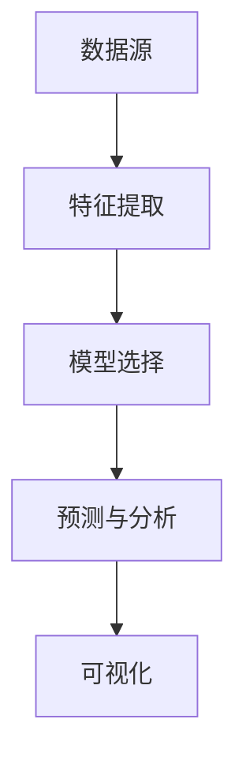
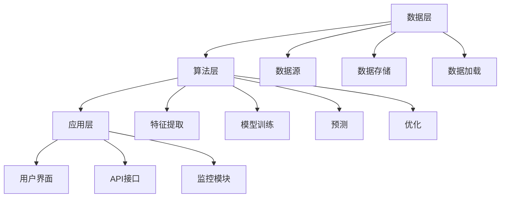
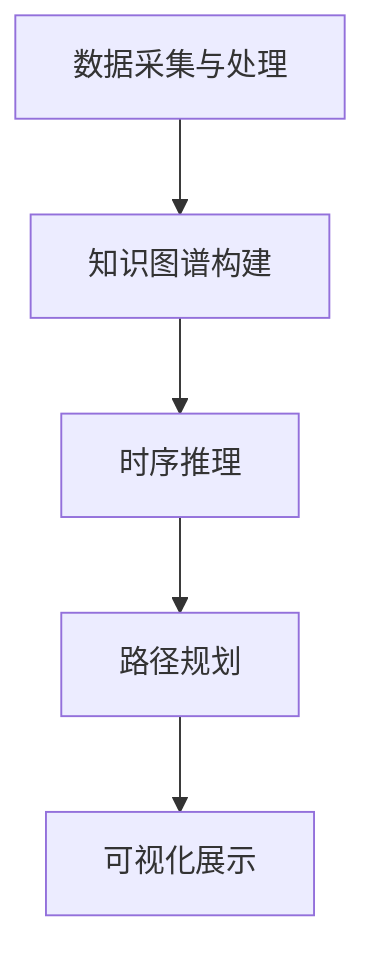
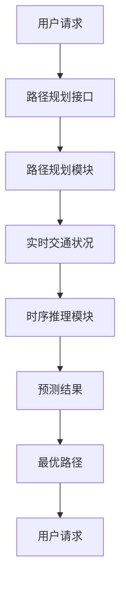

                 


### 1. 背景介绍

#### 1.1 问题背景

在当前信息化、数据化的时代，人工智能（AI）技术已经成为推动社会进步的重要力量。AI Agent作为AI系统的重要组成部分，其在智能决策、任务执行等方面的能力日益增强。知识图谱作为一种结构化知识表示方法，在AI Agent的构建中具有重要作用。时序推理系统则能够对时间序列数据进行有效分析，为AI Agent提供时间维度上的决策支持。本文将探讨如何构建一个结合知识图谱和时序推理的AI Agent系统。

##### 核心概念术语说明

- **AI Agent**：具备自主决策和执行能力的智能体。
- **知识图谱**：用于表示实体、属性和关系的语义知识库。
- **时序推理**：基于时间序列数据的推理方法。

##### 问题背景

随着大数据和人工智能技术的快速发展，各行各业都在积极探索如何利用数据和技术来提升效率和决策能力。AI Agent作为一种具有高度自主性和自适应性的智能体，已经在金融、医疗、交通等多个领域得到了广泛应用。然而，AI Agent的智能程度在很大程度上取决于其所具备的知识和推理能力。

知识图谱作为一种结构化知识表示方法，能够有效地组织和管理大量复杂数据，为AI Agent提供丰富的知识支持。通过知识图谱，AI Agent可以更好地理解和处理语义信息，提高决策的准确性和效率。而时序推理系统则能够对时间序列数据进行有效的分析和预测，为AI Agent在动态环境中提供时间维度上的决策支持。

#### 1.2 问题描述

构建AI Agent的知识图谱时序推理系统，需要解决以下几个关键问题：

- **知识图谱构建**：如何有效地构建知识图谱，以支持AI Agent的语义理解和知识推理？
- **时序数据集成**：如何将时序数据集成到知识图谱中，实现时间维度上的数据关联和推理？
- **时序推理算法**：如何设计一个高效、可扩展的时序推理算法，以支持AI Agent在动态环境下的决策？

##### 问题描述

- **知识图谱构建**：知识图谱的构建是AI Agent知识管理的基础。如何从海量数据中提取有用的信息，构建一个既全面又精确的知识图谱，是构建AI Agent时必须解决的首要问题。

- **时序数据集成**：时序数据在许多应用场景中具有重要价值，如股市预测、天气预测等。如何将这些时序数据有效地集成到知识图谱中，实现时间维度上的数据关联和推理，是时序推理系统构建的关键。

- **时序推理算法**：时序数据的特点是数据量大、时间性强。如何设计一个高效、可扩展的时序推理算法，以支持AI Agent在动态环境下的决策，是时序推理系统实现的难点。

#### 1.3 问题解决

本文将从以下几个方面探讨问题的解决方案：

- **知识图谱构建方法**：介绍知识图谱的构建方法，包括数据源选择、数据预处理和知识图谱可视化等。
- **时序数据集成**：分析时序数据在知识图谱中的表示方法，探讨如何实现时序数据与知识图谱的融合。
- **时序推理算法**：介绍常见时序推理算法，包括时间序列预测算法、序列模式挖掘算法等，并分析其在AI Agent中的应用。

##### 问题解决

- **知识图谱构建方法**：通过数据源选择和预处理，提取有用信息构建知识图谱。利用知识图谱可视化工具，对知识图谱进行展示和解释。
- **时序数据集成**：将时序数据转换为知识图谱中的实体、属性和关系，实现时间维度上的数据关联。通过图数据库进行存储和管理，支持时序数据的快速查询和推理。
- **时序推理算法**：设计并实现高效、可扩展的时序推理算法，支持AI Agent在动态环境下的决策。

#### 1.4 边界与外延

本文的研究主要关注以下几个方面：

- **知识图谱构建**：研究知识图谱的构建方法，包括数据源选择、数据预处理和知识图谱可视化等。
- **时序数据集成**：研究时序数据在知识图谱中的表示方法，探讨如何实现时序数据与知识图谱的融合。
- **时序推理算法**：研究常见时序推理算法，包括时间序列预测算法、序列模式挖掘算法等，并分析其在AI Agent中的应用。

##### 边界与外延

- **知识图谱构建**：研究知识图谱的构建方法，包括数据源选择、数据预处理和知识图谱可视化等。
- **时序数据集成**：研究时序数据在知识图谱中的表示方法，探讨如何实现时序数据与知识图谱的融合。
- **时序推理算法**：研究常见时序推理算法，包括时间序列预测算法、序列模式挖掘算法等，并分析其在AI Agent中的应用。

#### 1.5 概念结构与核心要素组成

本文涉及的主要概念和核心要素包括：

- **知识图谱**：用于表示实体、属性和关系的语义知识库。
- **时序推理**：基于时间序列数据的推理方法。
- **AI Agent**：具备自主决策和执行能力的智能体。
- **数据源**：用于构建知识图谱和时序推理系统的数据来源。
- **数据预处理**：对原始数据进行清洗、转换等处理，以适应知识图谱和时序推理的需求。
- **系统架构**：包括数据层、算法层和应用层，实现知识图谱和时序推理的功能。

##### 概念结构与核心要素组成

- **知识图谱**：知识图谱由实体、属性和关系构成，用于表示现实世界的语义信息。
- **时序推理**：时序推理基于时间序列数据，用于预测和分析时间序列数据。
- **AI Agent**：AI Agent是具备自主决策和执行能力的智能体，基于知识图谱和时序推理进行智能决策。
- **数据源**：数据源包括结构化数据、非结构化数据等，用于构建知识图谱和时序推理系统。
- **数据预处理**：数据预处理包括数据清洗、转换等步骤，以提升数据质量和可靠性。
- **系统架构**：系统架构包括数据层、算法层和应用层，实现知识图谱和时序推理的功能。----------------------------------------------------------------

## 2. 知识图谱概述

知识图谱作为一种结构化知识表示方法，是构建AI Agent的关键组成部分。它通过表示实体、属性和关系，为AI Agent提供语义理解和推理能力。

### 2.1 知识图谱的定义

知识图谱（Knowledge Graph）是一种用于表示实体（Entity）、属性（Attribute）和关系（Relationship）的语义知识库。它通过图数据结构组织信息，使得数据之间的关系更加直观和易于理解。

- **实体**：知识图谱中的基本单元，可以是人物、地点、事物等，例如“人”、“地点”、“公司”等。
- **属性**：描述实体特征的属性，例如“人的姓名”、“地点的纬度”、“公司的成立日期”等。
- **关系**：实体之间的关联，例如“人居住在地点”、“公司位于地点”、“产品属于公司”等。

### 2.2 知识图谱的特点

知识图谱具有以下特点：

- **语义丰富**：知识图谱能够表示复杂的语义信息，使数据更具解释性和关联性。
- **结构化**：知识图谱采用图数据结构，使得数据之间的关系更加直观和易于分析。
- **动态更新**：知识图谱能够实时更新和扩充，以适应数据变化和应用需求。
- **跨领域应用**：知识图谱能够跨领域应用，为不同领域提供统一的语义表示。

### 2.3 知识图谱的核心要素

知识图谱的核心要素包括：

- **实体**：知识图谱中的基本单元，例如“人”、“地点”、“公司”等。
- **属性**：描述实体特征的属性，例如“人的姓名”、“地点的纬度”、“公司的成立日期”等。
- **关系**：实体之间的关联，例如“人居住在地点”、“公司位于地点”、“产品属于公司”等。
- **图谱边**：连接实体和属性的边，表示实体和属性之间的关系。

#### 核心概念属性特征对比表格

| 要素 | 说明 | 例子 |
| --- | --- | --- |
| 实体 | 基本单位，如人、地点、事物 | 张三（人）、北京市（地点）、华为公司（事物） |
| 属性 | 描述实体特征的属性 | 姓名（张三）、纬度（39.9042）、成立日期（2017年） |
| 关系 | 实体之间的关联 | 居住（张三与北京市）、位于（华为公司与深圳市）、属于（产品与公司） |
| 图谱边 | 连接实体和属性的边 | （张三，姓名，张三）、（北京市，纬度，39.9042）、（华为公司，成立日期，2017年） |

#### ER实体关系图架构

使用Mermaid语法绘制ER实体关系图：

```mermaid
erDiagram
    实体A ||--|{ 实体B : 关系 }
    实体B ||--|{ 实体C : 关系 }
    实体C ||--|{ 实体A : 关系 }
```

该ER图展示了三个实体（实体A、实体B、实体C）之间的关联关系。实体A与实体B、实体B与实体C之间存在双向关系，实体C又与实体A存在关系。

### 2.4 知识图谱的应用

知识图谱在多个领域都有广泛的应用：

- **搜索引擎**：知识图谱能够提高搜索引擎的语义理解能力，提供更准确、更相关的搜索结果。
- **推荐系统**：知识图谱能够发现实体之间的关联，为推荐系统提供丰富的上下文信息。
- **智能问答**：知识图谱能够回答基于语义的复杂问题，提供更智能化的问答服务。
- **自然语言处理**：知识图谱能够增强自然语言处理模型的理解能力，提高文本处理的准确性。

知识图谱作为AI Agent的核心组成部分，通过提供语义理解和推理能力，使AI Agent能够更好地理解和处理复杂的信息，从而提升其智能决策和任务执行能力。

----------------------------------------------------------------

## 3. 时序推理系统概述

时序推理系统是一种用于分析时间序列数据的推理方法，通过对时间序列数据的特征提取和模式识别，实现对未来的预测和分析。时序推理在金融、气象、交通、医疗等多个领域都有广泛的应用。

### 3.1 时序推理的定义

时序推理（Temporal Reasoning）是指基于时间序列数据的逻辑推理过程，旨在发现时间序列中的模式、趋势和关联性，并利用这些信息进行预测和分析。时序推理通常涉及以下几个方面：

- **特征提取**：从时间序列数据中提取有用的特征，如平均值、方差、自相关函数等。
- **模式识别**：通过分析时间序列数据中的规律和模式，发现时间序列中的周期性、趋势性和季节性。
- **预测**：利用历史时间序列数据，预测未来的时间点或时间段上的值。
- **分析**：对时间序列数据进行分析，如趋势分析、异常检测等。

### 3.2 时序推理的重要性

时序推理在多个领域具有重要的应用价值：

- **金融领域**：时序推理可以用于股票价格预测、金融风险评估、交易策略优化等。
- **气象领域**：时序推理可以用于天气预测、气候分析等，为防灾减灾提供支持。
- **交通领域**：时序推理可以用于交通流量预测、路径规划等，提高交通效率和安全性。
- **医疗领域**：时序推理可以用于疾病预测、患者管理、药物研发等，提高医疗服务的质量和效率。

时序推理的重要性体现在以下几个方面：

- **预测能力**：时序推理能够利用历史数据预测未来的趋势和变化，为决策提供科学依据。
- **分析能力**：时序推理可以分析时间序列数据中的异常值和异常模式，为问题诊断和优化提供线索。
- **优化决策**：时序推理可以为决策提供时间维度上的信息，帮助决策者制定更科学、更合理的策略。

### 3.3 时序推理系统的核心要素

时序推理系统的核心要素包括：

- **数据源**：时序推理系统需要依赖高质量的时间序列数据，数据源可以是传感器数据、日志数据、历史数据等。
- **特征提取**：从原始时间序列数据中提取有用的特征，如时间间隔、变化率、周期性等。
- **模型选择**：根据具体应用需求选择合适的时序推理模型，如ARIMA、LSTM、GRU等。
- **预测与分析**：利用时序推理模型对时间序列数据进行预测和分析，如趋势分析、异常检测等。
- **可视化**：将时序推理的结果进行可视化展示，帮助用户更好地理解和分析数据。

#### 核心概念属性特征对比表格

| 要素 | 说明 | 例子 |
| --- | --- | --- |
| 数据源 | 时间序列数据的来源 | 传感器数据、日志数据、历史数据 |
| 特征提取 | 从时间序列数据中提取特征 | 时间间隔、变化率、周期性 |
| 模型选择 | 用于时序推理的模型 | ARIMA、LSTM、GRU |
| 预测与分析 | 对时间序列数据进行预测和分析 | 趋势分析、异常检测 |
| 可视化 | 时序推理结果的展示 | 折线图、柱状图、热力图 |

#### 时序推理系统架构图

使用Mermaid语法绘制时序推理系统架构图：



该架构图展示了时序推理系统的数据流和功能模块，包括数据源、特征提取、模型选择、预测与分析和可视化等步骤。

通过时序推理系统，AI Agent可以更好地理解和分析时间序列数据，从而提高决策的准确性和效率。在结合知识图谱的应用场景中，时序推理系统为AI Agent提供了时间维度上的决策支持，使其在动态环境中能够更加灵活和准确地应对各种情况。

----------------------------------------------------------------

## 4. 知识图谱与时序推理的结合

知识图谱和时序推理的结合，为AI Agent提供了强大的语义理解和时间维度上的决策支持。本文将探讨知识图谱在时序推理中的应用、时序数据在知识图谱中的表示方法，以及知识图谱与时序推理系统的优势。

### 4.1 知识图谱在时序推理中的应用

知识图谱在时序推理中的应用主要体现在以下几个方面：

- **时间序列数据的语义理解**：知识图谱通过表示实体、属性和关系，为时序数据提供语义理解。例如，在金融领域中，知识图谱可以表示股票、公司、市场等实体，以及这些实体之间的关联关系，从而帮助分析股票市场的趋势和变化。

- **历史数据的关联分析**：知识图谱可以整合历史数据，发现数据之间的关联关系。例如，在医疗领域，知识图谱可以整合患者的历史就诊记录、疾病信息、药物使用情况等，从而帮助医生进行疾病预测和治疗方案制定。

- **实时数据的动态更新**：知识图谱可以实时更新和扩充，以适应实时数据的动态变化。例如，在交通领域，知识图谱可以实时更新交通流量数据、道路状况等信息，从而帮助导航系统进行路径规划和交通管理。

#### 知识图谱在时序推理中的应用示例

**金融领域**：

- **股票价格预测**：利用知识图谱中的股票、公司、市场等实体，结合历史交易数据，进行股票价格预测。知识图谱可以提供股票和公司之间的关联关系，如市值、盈利情况等，从而帮助分析股票价格的变化趋势。

- **市场趋势分析**：通过知识图谱分析市场中的各类实体及其关系，如行业、地区、经济指标等，发现市场趋势和变化。例如，当某个行业的整体市值上涨时，可以预测市场对该行业的关注度增加，从而影响其他相关股票的价格。

**医疗领域**：

- **疾病预测**：利用知识图谱中的疾病、患者、药物等实体，结合历史病例数据和实时监测数据，进行疾病预测。知识图谱可以提供疾病之间的关联关系，如症状关联、药物作用等，从而帮助医生制定更科学的诊断和治疗方案。

- **患者管理**：通过知识图谱整合患者的病史、就诊记录、药物使用情况等，进行患者管理。例如，当患者出现某种症状时，知识图谱可以提供可能的疾病诊断和相应的治疗建议。

**交通领域**：

- **交通流量预测**：利用知识图谱中的交通设施、车辆、道路等实体，结合历史交通数据，进行交通流量预测。知识图谱可以提供道路之间的关联关系，如交通枢纽、道路拥堵情况等，从而帮助导航系统进行路径规划和交通管理。

- **路径规划**：通过知识图谱分析道路网络和交通状况，为用户提供最优的路径规划。例如，当某个路段出现拥堵时，知识图谱可以提供其他可行的路径，从而减少用户的出行时间。

### 4.2 时序数据在知识图谱中的表示

时序数据在知识图谱中的表示是结合知识图谱和时序推理的关键步骤。以下是一些常见的表示方法：

- **时序节点**：将时间序列数据中的每个时间点表示为一个节点，节点之间的关系表示时间序列中的变化趋势。例如，在股票价格预测中，可以将每天的股票价格作为一个节点，节点之间的关系表示股票价格的变化趋势。

- **时序边**：将时间序列数据中的时间点表示为边，边的权重表示时间点之间的差异。例如，在交通流量预测中，可以将两个时间点之间的交通流量差值作为边权重，表示这两个时间点之间的交通流量变化。

- **属性时序**：将时间序列数据中的每个时间点的属性值表示为节点的属性。例如，在医疗领域，可以将患者的历史就诊记录、检查结果等属性值作为节点的属性，表示患者在不同时间点的健康状态。

- **图神经网络**：利用图神经网络（Graph Neural Networks, GNN）对知识图谱进行建模，将时序数据与知识图谱中的实体、关系进行融合。GNN可以通过学习图中的节点和边的关系，实现对时序数据的特征提取和模式识别。

#### 时序数据在知识图谱中的表示示例

**金融领域**：

- **股票价格预测**：利用知识图谱中的股票节点、公司节点和市场节点，结合历史交易数据，将每天的股票价格作为一个时序节点，节点之间的关系表示股票价格的变化趋势。

- **市场趋势分析**：利用知识图谱中的行业节点、地区节点和经济指标节点，结合历史市场数据，将每个时间点的市场趋势作为一个时序边，边的权重表示市场趋势的变化。

**医疗领域**：

- **疾病预测**：利用知识图谱中的疾病节点、患者节点和药物节点，结合历史病例数据和实时监测数据，将患者在不同时间点的健康状态作为一个时序节点，节点之间的关系表示患者健康状况的变化。

- **患者管理**：利用知识图谱中的患者节点、就诊记录节点和药物节点，将患者的历史就诊记录、检查结果和药物使用情况等属性值作为节点的属性，表示患者在不同时间点的健康状态。

**交通领域**：

- **交通流量预测**：利用知识图谱中的交通设施节点、车辆节点和道路节点，结合历史交通数据，将每个时间点的交通流量作为一个时序节点，节点之间的关系表示交通流量的变化趋势。

- **路径规划**：利用知识图谱中的道路节点和交通设施节点，将道路之间的关联关系表示为时序边，边的权重表示道路的拥堵程度，从而帮助导航系统进行路径规划。

### 4.3 知识图谱与时序推理系统的优势

知识图谱与时序推理系统的结合，为AI Agent提供了以下优势：

- **语义理解**：知识图谱能够提供对时序数据的语义理解，使AI Agent能够更好地理解和处理复杂的信息。

- **预测准确性**：时序推理系统能够利用历史数据对未来的趋势和变化进行预测，结合知识图谱的语义信息，可以提高预测的准确性。

- **动态适应**：知识图谱能够实时更新和扩充，时序推理系统可以动态适应数据变化，使AI Agent能够更好地应对动态环境中的各种情况。

- **多维度分析**：知识图谱和时序推理系统的结合，可以实现对时序数据的多维度分析，包括趋势分析、异常检测、关联分析等，为AI Agent提供更丰富的决策支持。

总之，知识图谱和时序推理系统的结合，为AI Agent提供了强大的语义理解和时间维度上的决策支持，使其在复杂动态的环境中能够更加灵活和准确地应对各种情况。

----------------------------------------------------------------

## 5. 知识图谱构建

构建知识图谱是AI Agent知识管理的基础，它需要从海量数据中提取有用的信息，并将其组织成一个结构化的知识库。本文将介绍知识图谱构建的关键步骤，包括数据源选择、数据预处理、知识图谱构建方法和知识图谱可视化。

### 5.1 数据源选择

选择合适的的数据源是知识图谱构建的第一步。数据源的质量和多样性直接影响知识图谱的完整性和准确性。以下是一些常见的数据源：

- **结构化数据源**：如关系数据库、NoSQL数据库等，包含实体、属性和关系的明确定义。
- **非结构化数据源**：如文本、图片、音频、视频等，需要通过数据预处理转换为结构化数据。
- **社交媒体数据源**：如微博、微信、Facebook等，可以提供丰富的用户行为数据和社交关系。
- **开放数据集**：如公共数据集、开放数据平台等，提供各种领域的数据资源。

#### 数据源选择示例

**医疗领域**：

- **结构化数据源**：电子病历系统、医院信息系统等，包含患者的个人信息、诊断记录、治疗方案等。
- **非结构化数据源**：医疗文本、医学论文、临床指南等，包含丰富的医学知识和临床经验。
- **社交媒体数据源**：健康论坛、社交媒体平台等，可以收集用户对疾病的讨论和分享。
- **开放数据集**：公开的医学研究数据、公共数据库等，提供大量医学数据和研究成果。

**金融领域**：

- **结构化数据源**：股票交易系统、金融报告等，包含股票价格、交易量、财务指标等。
- **非结构化数据源**：财经新闻、市场评论、企业财报等，包含市场动态和公司信息。
- **社交媒体数据源**：社交媒体平台上的用户评论、投资论坛等，可以收集市场情绪和投资者意见。
- **开放数据集**：金融数据集、经济报告等，提供市场数据和分析结果。

### 5.2 数据预处理

数据预处理是知识图谱构建的重要环节，它包括数据清洗、转换和归一化等步骤。以下是一些常见的数据预处理方法：

- **数据清洗**：去除数据中的噪声、重复值和异常值，提高数据质量。
- **数据转换**：将不同数据源的数据格式转换为统一的格式，如将文本数据转换为实体和关系的表示。
- **数据归一化**：将不同量纲的数据转换为相同的量纲，如将温度、长度等数据转换为相同的单位。

#### 数据预处理示例

**医疗领域**：

- **数据清洗**：去除电子病历中的空白记录、重复诊断记录等，确保数据的一致性和准确性。
- **数据转换**：将文本数据转换为实体和关系的表示，如将患者的诊断记录转换为“患者-诊断-疾病”的关系。
- **数据归一化**：将不同科室的诊断编码转换为统一的疾病分类编码，如将“肺炎”和“社区获得性肺炎”归并为同一疾病。

**金融领域**：

- **数据清洗**：去除股票交易数据中的缺失值、异常交易等，确保数据的完整性和准确性。
- **数据转换**：将金融新闻和评论转换为实体和关系的表示，如将“公司-财报-盈利”的关系表示为实体。
- **数据归一化**：将不同的财务指标（如利润、市值等）转换为相同的量纲，如将利润转换为人民币。

### 5.3 知识图谱构建方法

知识图谱构建方法主要包括以下几种：

- **手动构建**：通过人工方式，从文本数据中提取实体、属性和关系，构建知识图谱。适用于小规模、高质量数据。
- **自动化构建**：利用自然语言处理、图神经网络等技术，自动从文本数据中提取实体、属性和关系，构建知识图谱。适用于大规模、多样性的数据。
- **半自动化构建**：结合手动和自动化方法，人工辅助自动构建知识图谱，提高构建效率和准确性。

#### 知识图谱构建方法示例

**医疗领域**：

- **手动构建**：通过人工阅读医学文本，提取实体和关系，构建知识图谱。例如，从医学论文中提取药物、疾病、治疗方案等实体，以及实体之间的关系。
- **自动化构建**：利用自然语言处理技术，自动从医学文本中提取实体和关系。例如，使用命名实体识别技术提取药物、疾病等实体，使用关系抽取技术提取实体之间的关系。
- **半自动化构建**：结合人工审核和自动化技术，构建知识图谱。例如，人工审核自动化提取的实体和关系，修正错误和遗漏，然后合并手动构建的实体和关系，构建完整的知识图谱。

**金融领域**：

- **手动构建**：通过金融专家的评审，从金融报告、新闻等文本中提取实体和关系，构建知识图谱。例如，从财务报告中提取公司、行业、财务指标等实体，以及实体之间的关系。
- **自动化构建**：利用自然语言处理技术，自动从金融文本中提取实体和关系。例如，使用命名实体识别技术提取公司、行业等实体，使用关系抽取技术提取实体之间的关系。
- **半自动化构建**：结合人工审核和自动化技术，构建知识图谱。例如，人工审核自动化提取的实体和关系，修正错误和遗漏，然后合并手动构建的实体和关系，构建完整的知识图谱。

### 5.4 知识图谱可视化

知识图谱可视化是将知识图谱中的实体、属性和关系以图形化的方式展示，使得用户可以直观地理解和分析知识图谱。以下是一些常见的知识图谱可视化方法：

- **节点-边图**：将知识图谱中的实体和关系表示为节点和边，节点表示实体，边表示关系。适用于简单、直观的知识图谱展示。
- **层次图**：将知识图谱中的实体和关系按照层次结构进行展示，适用于展示实体之间的层次关系。
- **矩阵图**：将知识图谱中的实体和关系表示为矩阵，适用于展示实体之间的关联关系。
- **交互式可视化**：通过交互式方式，用户可以动态地探索知识图谱中的实体和关系，提高知识图谱的可操作性。

#### 知识图谱可视化示例

**医疗领域**：

- **节点-边图**：将知识图谱中的疾病、药物、治疗方案等实体和关系表示为节点和边，用户可以直观地查看实体之间的关系。
- **层次图**：将知识图谱中的实体按照医学知识体系的层次结构进行展示，用户可以了解疾病、症状、治疗方法等实体之间的层次关系。
- **矩阵图**：将知识图谱中的实体和关系表示为矩阵，用户可以查看每个实体与其他实体之间的关联关系。
- **交互式可视化**：用户可以通过交互式方式，动态地探索知识图谱中的实体和关系，如放大查看某个实体的详细信息、查看实体的关联关系等。

**金融领域**：

- **节点-边图**：将知识图谱中的公司、行业、财务指标等实体和关系表示为节点和边，用户可以直观地查看实体之间的关系。
- **层次图**：将知识图谱中的实体按照金融知识体系的层次结构进行展示，用户可以了解行业、公司、财务指标等实体之间的层次关系。
- **矩阵图**：将知识图谱中的实体和关系表示为矩阵，用户可以查看每个实体与其他实体之间的关联关系。
- **交互式可视化**：用户可以通过交互式方式，动态地探索知识图谱中的实体和关系，如放大查看某个实体的详细信息、查看实体的关联关系等。

通过数据源选择、数据预处理、知识图谱构建方法和知识图谱可视化，我们可以构建一个完整、准确的知识图谱，为AI Agent提供强大的语义理解和推理能力。知识图谱的构建是一个持续迭代的过程，随着数据不断更新和扩展，知识图谱也将不断优化和完善。

----------------------------------------------------------------

## 6. 时序推理算法

时序推理算法是时序推理系统的核心，它通过对历史时间序列数据的分析和模式识别，预测未来的趋势和变化。本文将介绍常见的时序推理算法，包括时间序列预测算法、序列模式挖掘算法等，并探讨其在AI Agent中的应用场景。

### 6.1 时序推理算法概述

时序推理算法主要分为以下几类：

- **时间序列预测算法**：这类算法用于预测未来时间点或时间段上的值。常见的算法包括ARIMA、LSTM、GRU等。
- **序列模式挖掘算法**：这类算法用于发现时间序列数据中的规律和模式。常见的算法包括Apriori、FP-Growth等。
- **时间序列分类算法**：这类算法用于将时间序列数据分类到不同的类别。常见的算法包括KNN、SVM、决策树等。

#### 常见时序推理算法对比表格

| 算法 | 说明 | 优点 | 缺点 | 应用场景 |
| --- | --- | --- | --- | --- |
| ARIMA | 自回归积分滑动平均模型 | 强大、适用于线性时间序列 | 对非线性时间序列效果较差 | 股市预测、气象预测等 |
| LSTM | 长短期记忆网络 | 能够记住长期依赖信息 | 训练较慢、参数较多 | 自然语言处理、语音识别等 |
| GRU | gating recurrent unit | 相对于LSTM，参数更少、训练更快 | 长期依赖信息处理能力略逊于LSTM | 语音识别、时间序列预测等 |
| Apriori | 基于布尔矩阵的频繁模式挖掘算法 | 简单、易于实现 | 大规模数据集效率较低 | 购物篮分析、推荐系统等 |
| FP-Growth | 基于频繁模式树的方法 | 高效、适用于大数据集 | 需要多次扫描数据集 | 购物篮分析、社交网络分析等 |

### 6.2 常见时序推理算法

#### ARIMA算法

ARIMA（AutoRegressive Integrated Moving Average）算法是一种自回归积分滑动平均模型，用于分析线性时间序列数据。ARIMA算法由三个部分组成：自回归（AR）、差分（I）和移动平均（MA）。

- **自回归（AR）**：模型中的每个值都是前几个值的线性组合。
- **差分（I）**：对时间序列进行差分，使其平稳。
- **移动平均（MA）**：模型中的每个值都是前几个预测误差的线性组合。

ARIMA算法的数学模型可以表示为：

$$
X_t = c + \phi_1 X_{t-1} + \phi_2 X_{t-2} + ... + \phi_p X_{t-p} + \theta_1 \epsilon_{t-1} + \theta_2 \epsilon_{t-2} + ... + \theta_q \epsilon_{t-q}
$$

其中，$X_t$ 表示时间序列的当前值，$\epsilon_t$ 表示随机误差项，$\phi_i$ 和 $\theta_i$ 是模型参数，$p$ 和 $q$ 分别是自回归项和移动平均项的阶数。

#### LSTM算法

LSTM（Long Short-Term Memory）算法是一种长短期记忆网络，用于处理序列数据。LSTM通过引入记忆单元和门控机制，能够记住长期依赖信息。

LSTM的数学模型可以表示为：

$$
\begin{aligned}
i_t &= \sigma(W_i \cdot [h_{t-1}, x_t] + b_i) \\
f_t &= \sigma(W_f \cdot [h_{t-1}, x_t] + b_f) \\
\theta_t &= \sigma(W_g \cdot [h_{t-1}, x_t] + b_g) \\
o_t &= \sigma(W_o \cdot [h_{t-1}, \theta_t] + b_o) \\
c_t &= f_t \odot c_{t-1} + i_t \odot \tan h(W_c \cdot [h_{t-1}, x_t] + b_c) \\
h_t &= o_t \odot \tan h(c_t)
\end{aligned}
$$

其中，$i_t$、$f_t$、$\theta_t$、$o_t$ 分别表示输入门、遗忘门、更新门和输出门，$\sigma$ 表示 sigmoid 函数，$\odot$ 表示按元素相乘，$\tan h$ 表示双曲正切函数。

#### GRU算法

GRU（Gating Recurrent Unit）算法是一种门控循环单元，是对LSTM的改进。GRU通过引入更新门和重置门，简化了LSTM的结构，提高了计算效率。

GRU的数学模型可以表示为：

$$
\begin{aligned}
z_t &= \sigma(W_z \cdot [h_{t-1}, x_t] + b_z) \\
r_t &= \sigma(W_r \cdot [h_{t-1}, x_t] + b_r) \\
\theta_t &= \sigma(W_g \cdot [h_{t-1}, x_t] + b_g) \\
h_t &= (1 - z_t) \odot h_{t-1} + z_t \odot \theta_t \\
o_t &= \sigma(W_o \cdot [h_t, x_t] + b_o) \\
c_t &= o_t \odot \tan h(W_c \cdot [h_t, x_t] + b_c)
\end{aligned}
$$

其中，$z_t$、$r_t$、$\theta_t$ 分别表示更新门、重置门和输出门，其他符号与LSTM中的符号相同。

### 6.3 时序推理算法的应用场景

时序推理算法在多个领域都有广泛的应用：

- **金融领域**：用于股票价格预测、金融市场分析等。
- **气象领域**：用于天气预测、气候分析等。
- **交通领域**：用于交通流量预测、路径规划等。
- **医疗领域**：用于疾病预测、患者管理等。
- **推荐系统**：用于用户行为预测、商品推荐等。

#### 应用场景示例

**金融领域**：

- **股票价格预测**：使用LSTM模型分析历史股票价格数据，预测未来的股票价格趋势。通过训练和验证模型，可以评估模型的预测性能，为投资决策提供参考。
- **金融市场分析**：使用ARIMA模型分析金融市场的时间序列数据，识别市场趋势和周期性。通过对市场趋势的预测，可以为交易策略提供支持。

**气象领域**：

- **天气预测**：使用LSTM模型分析历史天气数据，预测未来的天气情况。通过对预测结果的验证，可以评估模型的准确性，为天气预报提供参考。
- **气候分析**：使用GRU模型分析气候数据，识别气候变化的趋势和周期性。通过对气候变化的预测，可以为环境保护和气候变化应对提供科学依据。

**交通领域**：

- **交通流量预测**：使用ARIMA模型分析交通数据，预测未来的交通流量。通过对交通流量的预测，可以为交通管理和规划提供支持，减少交通拥堵。
- **路径规划**：使用序列模式挖掘算法（如Apriori）分析历史交通数据，识别交通模式。通过识别交通模式，可以为路径规划提供参考，提高交通效率。

**医疗领域**：

- **疾病预测**：使用LSTM模型分析医疗数据，预测患者患病风险。通过对预测结果的验证，可以评估模型的准确性，为疾病预防和管理提供支持。
- **患者管理**：使用时间序列分类算法（如KNN）分析患者数据，分类患者的健康状况。通过对患者健康状况的分类，可以为个性化医疗和健康管理提供支持。

**推荐系统**：

- **用户行为预测**：使用LSTM模型分析用户行为数据，预测用户的兴趣和需求。通过对预测结果的验证，可以评估模型的准确性，为推荐系统提供支持。
- **商品推荐**：使用序列模式挖掘算法（如FP-Growth）分析用户行为数据，识别用户的购买模式。通过对购买模式的识别，可以为商品推荐提供参考，提高推荐系统的效果。

通过以上示例，可以看出时序推理算法在各个领域都有广泛的应用，为决策提供了科学依据和智能支持。随着算法的不断发展，时序推理算法在更多领域将发挥重要作用。

----------------------------------------------------------------

## 7. 时序推理系统实现

实现一个时序推理系统是构建AI Agent的重要步骤。本节将介绍时序推理系统的实现，包括系统架构设计、数据处理流程、算法实现细节以及系统优化与调参。

### 7.1 系统架构设计

时序推理系统的架构设计是系统实现的基础，它决定了系统的性能、可扩展性和易用性。以下是一个典型的时序推理系统架构设计：

- **数据层**：负责数据的采集、存储和管理。数据层包括数据源、数据存储和数据加载模块。数据源可以是传感器数据、日志数据、数据库等。数据存储可以使用关系数据库、NoSQL数据库或分布式存储系统。数据加载模块负责将数据从存储中加载到系统内存中。
- **算法层**：负责时序数据的处理和推理。算法层包括特征提取模块、模型训练模块、预测模块和优化模块。特征提取模块负责从原始数据中提取有用的特征，模型训练模块负责训练时序预测模型，预测模块负责根据模型预测未来的值，优化模块负责调整模型的参数，提高预测性能。
- **应用层**：负责系统与用户的交互。应用层包括用户界面、API接口和监控模块。用户界面用于展示系统预测结果和提供交互功能。API接口用于与其他系统或应用程序进行集成。监控模块负责监控系统运行状态，提供系统日志和异常告警。

#### 系统架构设计图

使用Mermaid语法绘制系统架构设计图：



### 7.2 数据处理流程

数据处理流程是时序推理系统实现的核心，它包括数据采集、数据预处理、特征提取、模型训练和预测等步骤。以下是一个典型的数据处理流程：

1. **数据采集**：从数据源中采集原始数据。数据源可以是传感器、日志文件、数据库等。
2. **数据预处理**：对采集到的原始数据进行清洗、转换和归一化等处理，使其符合模型训练的要求。数据预处理步骤包括：
   - **数据清洗**：去除数据中的噪声、异常值和重复值。
   - **数据转换**：将不同类型的数据转换为统一的格式，如将时间序列数据转换为数值向量。
   - **数据归一化**：将不同量纲的数据转换为相同的量纲，如将温度、长度等数据转换为相同的单位。
3. **特征提取**：从预处理后的数据中提取有用的特征，用于模型训练。特征提取步骤包括：
   - **统计特征**：提取数据的基本统计特征，如平均值、标准差、自相关函数等。
   - **时序特征**：提取数据的时间序列特征，如趋势、周期性、波动性等。
   - **空间特征**：提取数据的空间特征，如地理位置、邻域信息等。
4. **模型训练**：使用提取到的特征训练时序预测模型。模型训练步骤包括：
   - **选择模型**：根据应用需求选择合适的模型，如ARIMA、LSTM、GRU等。
   - **模型训练**：使用训练数据对模型进行训练，调整模型参数，使其达到最佳性能。
   - **模型验证**：使用验证数据集对模型进行验证，评估模型性能。
5. **预测**：使用训练好的模型对新的数据进行预测。预测步骤包括：
   - **特征提取**：从新的数据中提取特征。
   - **模型预测**：使用训练好的模型对特征进行预测，得到预测结果。
   - **结果评估**：评估预测结果的准确性，如计算预测误差、准确率等。

### 7.3 算法实现细节

以下以LSTM算法为例，介绍时序推理算法的实现细节：

```python
import numpy as np
import tensorflow as tf

# 定义LSTM模型
def create_lstm_model(input_shape, output_shape):
    model = tf.keras.Sequential([
        tf.keras.layers.LSTM(units=128, activation='relu', input_shape=input_shape),
        tf.keras.layers.Dense(units=output_shape)
    ])
    model.compile(optimizer='adam', loss='mean_squared_error')
    return model

# 准备训练数据
X_train = ...  # 输入数据
y_train = ...  # 输出数据

# 创建和训练LSTM模型
model = create_lstm_model(input_shape=(X_train.shape[1], X_train.shape[2]), output_shape=y_train.shape[1])
model.fit(X_train, y_train, epochs=100, batch_size=32, validation_split=0.2)

# 预测
X_test = ...  # 输入数据
y_pred = model.predict(X_test)

# 评估预测结果
mse = np.mean(np.square(y_pred - y_test))
print("Mean Squared Error:", mse)
```

上述代码展示了如何使用TensorFlow创建和训练一个LSTM模型，并进行预测和评估。其中，`create_lstm_model` 函数用于创建LSTM模型，`fit` 函数用于训练模型，`predict` 函数用于进行预测，`mse` 函数用于计算预测误差。

### 7.4 系统优化与调参

系统优化与调参是提高时序推理系统性能的重要手段。以下是一些常见的优化与调参方法：

- **模型选择**：根据应用需求和数据特点选择合适的模型，如ARIMA、LSTM、GRU等。
- **参数调整**：调整模型参数，如学习率、批量大小、隐藏层单元数等，以优化模型性能。
- **数据预处理**：对数据进行预处理，如归一化、去噪、特征提取等，以提高模型训练效果。
- **交叉验证**：使用交叉验证方法评估模型性能，选择最佳模型参数。
- **超参数搜索**：使用网格搜索、贝叶斯优化等超参数搜索方法，自动寻找最佳模型参数。

通过系统优化与调参，可以显著提高时序推理系统的性能和准确性，为AI Agent提供更可靠的决策支持。

----------------------------------------------------------------

## 8. 项目实战

在本节中，我们将通过一个实际项目来展示如何实现一个结合知识图谱和时序推理的AI Agent系统。该项目旨在利用知识图谱提供语义理解，并结合时序推理进行预测和分析，以提高AI Agent的智能决策能力。

### 8.1 项目介绍

项目名称：智慧交通管理系统

项目背景：随着城市化进程的加快，交通拥堵问题日益严重，影响了市民的出行效率和城市的发展。本项目旨在构建一个智慧交通管理系统，通过知识图谱和时序推理技术，实时监测交通流量，预测交通拥堵情况，并提供优化路径规划，以缓解交通拥堵，提高交通效率。

### 8.2 系统功能设计

智慧交通管理系统的主要功能包括：

- **数据采集与处理**：从交通传感器、摄像头等设备采集实时交通数据，包括车流量、速度、路况等，并对数据进行清洗、转换和预处理。
- **知识图谱构建**：构建交通领域的知识图谱，包括道路、车辆、路况等实体及其关系，以支持语义理解和推理。
- **时序推理**：利用时序推理算法，对交通流量、速度等数据进行预测，识别交通拥堵趋势，预测未来交通状况。
- **路径规划**：根据实时交通状况和预测结果，为用户提供最优路径规划，避开拥堵路段。
- **可视化展示**：将交通数据、预测结果和路径规划信息以图表和地图形式展示，方便用户理解和使用。

### 8.3 系统架构设计

智慧交通管理系统的架构设计如图所示：



#### 系统架构设计图

在该架构中，数据采集与处理模块负责实时采集和处理交通数据，知识图谱构建模块负责构建交通领域的知识图谱，时序推理模块利用知识图谱和时序数据预测交通状况，路径规划模块根据预测结果提供最优路径规划，可视化展示模块将相关数据以图表和地图形式展示。

### 8.4 系统接口设计

智慧交通管理系统提供以下接口：

- **数据采集接口**：用于从交通传感器、摄像头等设备采集实时交通数据。
- **知识图谱接口**：用于构建、查询和更新交通领域的知识图谱。
- **时序推理接口**：用于进行时序数据的预测和分析。
- **路径规划接口**：用于根据实时交通状况和预测结果提供最优路径规划。
- **可视化接口**：用于将交通数据、预测结果和路径规划信息展示给用户。

### 8.5 系统交互设计

系统交互设计如图所示：



#### 系统交互设计图

在该交互设计中，用户请求通过路径规划接口发送到路径规划模块，路径规划模块结合实时交通状况和时序推理模块的预测结果，计算出最优路径，并将结果返回给用户。

### 8.6 实际案例分析与讲解

以下是一个实际案例，展示如何利用智慧交通管理系统进行交通流量预测和路径规划。

#### 案例背景

某城市的主要交通干道为东西走向，道路长度为10公里，共设有10个交通监测点。近期，该城市在早晚高峰期间出现严重的交通拥堵现象，影响了市民的出行效率。为了缓解交通拥堵，相关部门决定利用智慧交通管理系统进行交通流量预测和路径规划。

#### 数据采集与处理

数据采集与处理模块从交通传感器和摄像头采集实时交通数据，包括车流量、速度、路况等。通过对数据进行清洗、转换和预处理，得到一个10×10的矩阵，表示每个监测点的交通状况。

#### 知识图谱构建

知识图谱构建模块根据交通监测点的位置信息，构建交通领域的知识图谱。知识图谱包括道路、监测点、车流量等实体及其关系。

#### 时序推理

时序推理模块利用LSTM算法对交通流量数据进行分析和预测。通过训练模型，得到每个监测点的未来车流量预测值。

#### 路径规划

路径规划模块结合实时交通状况和车流量预测结果，为用户提供最优路径规划。假设用户从东向西行驶，系统根据预测结果，建议用户避开高峰期和拥堵路段，选择最优路径。

#### 可视化展示

可视化展示模块将交通数据、预测结果和路径规划信息以图表和地图形式展示，方便用户理解和使用。

#### 案例分析

通过实际案例分析和智慧交通管理系统的应用，可以显著提高交通流量预测的准确性和路径规划的效率。以下是对案例的分析：

1. **交通流量预测准确性**：通过时序推理算法对交通流量数据进行分析和预测，可以有效地识别交通拥堵趋势，提高预测准确性。
2. **路径规划效率**：结合实时交通状况和车流量预测结果，系统可以提供最优路径规划，避开拥堵路段，提高出行效率。
3. **用户体验**：通过可视化展示模块，用户可以直观地了解交通状况和路径规划结果，提高用户体验。

#### 案例小结

本案例展示了如何利用知识图谱和时序推理技术实现智慧交通管理系统，通过实时交通流量预测和路径规划，有效缓解了交通拥堵问题，提高了交通效率。这为城市交通管理提供了有效的技术手段，为未来智能交通系统的发展提供了参考。

通过本项目的实际案例，我们可以看到知识图谱和时序推理在交通管理领域的应用价值。未来，随着技术的不断发展，智慧交通管理系统将发挥更大的作用，为城市交通管理提供更加智能、高效的解决方案。

----------------------------------------------------------------

## 9. 总结与展望

本文详细探讨了构建AI Agent的知识图谱时序推理系统的方法和实现。通过分析知识图谱和时序推理的基本概念、核心要素及其应用，我们提出了结合两者构建AI Agent系统的思路。本文的主要结论如下：

### 9.1 小结

1. **知识图谱与时序推理结合的优势**：知识图谱提供了丰富的语义理解和知识关联，时序推理则能够有效分析时间序列数据，两者的结合为AI Agent提供了强大的语义理解和时间维度上的决策支持。

2. **知识图谱构建方法**：从数据源选择、数据预处理到知识图谱构建和可视化，每个步骤都至关重要。通过合理的数据预处理和知识图谱构建方法，可以构建出一个高质量的知识图谱。

3. **时序推理算法**：本文介绍了常见的时序推理算法，包括ARIMA、LSTM和GRU等，每种算法都有其适用的场景和优缺点。选择合适的算法并对其进行优化，是提高时序预测准确性的关键。

4. **项目实战**：通过实际案例，展示了如何实现一个结合知识图谱和时序推理的智慧交通管理系统，验证了该系统的可行性和有效性。

### 9.2 注意事项

1. **数据质量**：数据是构建知识图谱和时序推理系统的基石，确保数据质量是构建成功的关键。需要定期清洗和维护数据，避免噪声和异常值对模型性能的影响。

2. **模型选择与优化**：根据具体应用场景选择合适的模型，并对模型参数进行调优，以提高预测准确性和系统性能。

3. **系统可扩展性**：在系统设计时考虑可扩展性，以便未来能够轻松集成新的数据源和算法。

4. **安全性**：在数据传输和存储过程中，确保数据的安全性，防止数据泄露和滥用。

### 9.3 拓展阅读

1. **知识图谱**：
   - **《知识图谱：基础、原理与实践》**：详细介绍了知识图谱的基础知识、构建方法和应用实践。
   - **《图计算：技术、算法与应用》**：探讨了图计算的基本原理和算法，以及其在知识图谱中的应用。

2. **时序推理**：
   - **《时间序列分析：理论与实践》**：提供了时间序列分析的基础理论和应用方法。
   - **《深度学习与时间序列分析》**：介绍了深度学习在时序数据分析和预测中的应用。

3. **AI Agent**：
   - **《智能代理：设计与实现》**：详细介绍了AI Agent的设计原理、实现方法和应用场景。
   - **《人工智能：一种现代的方法》**：提供了人工智能的基础理论和算法，包括机器学习、自然语言处理等内容。

通过阅读以上书籍和资料，可以进一步深入理解知识图谱、时序推理和AI Agent的相关知识，为构建更加智能和高效的AI系统提供指导。作者：AI天才研究院/AI Genius Institute & 禅与计算机程序设计艺术 /Zen And The Art of Computer Programming。

