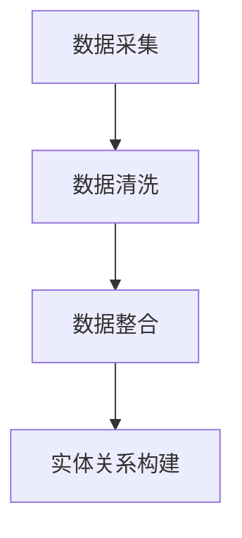

                 

### 第一部分：背景介绍

#### 1.1 问题背景

##### 1.1.1 AI Agent的需求与发展趋势

**AI Agent的定义**：AI Agent，又称为人工智能代理，是指能够模拟人类智能行为，自主决策并执行任务的计算机程序。AI Agent的核心在于其具备自主学习和自适应能力，能够在不同环境下进行自主操作和问题解决。

**AI Agent的需求**：随着人工智能技术的不断发展，AI Agent在各个领域中的应用需求日益增加。例如，在智能家居领域，AI Agent可以负责家居设备的自动调度和用户需求的响应；在客服领域，AI Agent可以自动处理用户咨询，提高客服效率和用户体验；在自动驾驶领域，AI Agent可以协助车辆进行环境感知和路径规划，确保行车安全。

**AI Agent的发展趋势**：当前，AI Agent的发展趋势主要体现在以下几个方面：
1. **智能化程度提高**：随着深度学习和自然语言处理技术的进步，AI Agent的智能化程度将逐步提高，能够处理更复杂的任务和更灵活的场景。
2. **跨领域应用**：AI Agent将在更多领域得到应用，如医疗、金融、教育等，实现跨领域的协作与融合。
3. **协作与自主决策**：AI Agent将不仅能够自主决策，还将能够与其他AI Agent或人类协作，形成更高效、更智能的生态系统。

##### 1.1.2 知识图谱的重要性

**知识图谱的定义**：知识图谱（Knowledge Graph）是一种用于表示实体之间复杂关系的图形结构，通过节点（Node）和边（Edge）来表示实体和实体之间的关系。知识图谱不仅包含了实体本身的信息，还包含了实体之间的关联和互动，从而形成一个完整的知识网络。

**知识图谱的应用场景**：知识图谱在多个领域具有广泛的应用，如：
1. **搜索引擎**：通过知识图谱，搜索引擎可以更好地理解用户的查询意图，提供更加精准的搜索结果。
2. **推荐系统**：知识图谱可以帮助推荐系统更好地理解用户和物品之间的复杂关系，提供更个性化的推荐服务。
3. **自然语言处理**：知识图谱为自然语言处理提供了丰富的知识背景，有助于提高文本理解和生成的能力。
4. **智能客服**：知识图谱可以帮助智能客服更好地理解用户的问题，提供更加准确和高效的解答。

**知识图谱在AI Agent中的角色**：知识图谱在AI Agent中发挥着至关重要的作用，为AI Agent提供了丰富的知识背景和决策依据。具体表现在：
1. **知识获取**：AI Agent可以通过知识图谱获取各种领域的知识，用于问题解决和任务执行。
2. **知识推理**：知识图谱提供了实体之间的关联和互动信息，AI Agent可以利用这些信息进行知识推理，从而提高决策的准确性和效率。
3. **知识共享**：AI Agent可以将从知识图谱中获取的知识进行共享，与其他AI Agent或人类进行协作。

##### 1.1.3 自动扩展与验证框架的需求

**自动扩展的概念**：自动扩展（Automated Expansion）是指通过算法和规则，自动地增加知识图谱中的实体和关系。自动扩展的目标是提高知识图谱的覆盖范围，使其能够更好地支持AI Agent的智能决策和任务执行。

**自动验证的概念**：自动验证（Automated Verification）是指通过算法和规则，自动地检查知识图谱中的数据是否准确和完整。自动验证的目标是确保知识图谱的数据质量，避免数据错误对AI Agent的决策造成负面影响。

**自动扩展与验证在AI Agent中的应用**：
1. **知识获取**：自动扩展可以帮助AI Agent获取更多的知识，提高其知识储备的丰富性和全面性。
2. **知识更新**：自动验证可以帮助AI Agent检测和修正知识图谱中的错误信息，确保知识图谱的实时性和准确性。
3. **任务执行**：自动扩展和验证相结合，可以确保AI Agent在执行任务时具备全面和准确的知识支持，提高任务完成的成功率。

#### 1.2 问题描述

##### 1.2.1 AI Agent的知识图谱面临的问题

**数据量不足**：当前，许多AI Agent的知识图谱数据量有限，无法涵盖所有相关的实体和关系，导致其在任务执行过程中无法充分利用知识图谱提供的支持。

**数据质量不高**：知识图谱中的数据质量参差不齐，存在噪声、错误和不一致性等问题，这会影响AI Agent的决策准确性和效率。

**数据更新不及时**：知识图谱中的数据更新速度较慢，无法及时反映现实世界的变化，导致AI Agent在处理新任务时缺乏最新的知识支持。

##### 1.2.2 自动扩展与验证框架的目标

**提高知识图谱的覆盖范围**：通过自动扩展，增加知识图谱中的实体和关系，使其能够更好地覆盖相关领域，为AI Agent提供全面的知识支持。

**提高知识图谱的数据质量**：通过自动验证，检查知识图谱中的数据准确性、一致性和完整性，确保数据质量达到预期要求。

**保证知识图谱的实时更新**：通过自动扩展和验证，实现知识图谱的实时更新，确保其能够及时反映现实世界的变化，为AI Agent提供最新的知识支持。

#### 1.3 问题解决

##### 1.3.1 知识图谱自动扩展的方法

**数据采集**：通过爬虫、API接口、数据库等方式，从各种来源收集相关的实体和关系数据。

**数据清洗**：对采集到的数据进行处理，去除噪声、错误和不一致性，提高数据质量。

**数据整合**：将采集到的数据进行整合，形成一个统一格式的知识图谱。

##### 1.3.2 知识图谱自动验证的方法

**数据一致性检查**：检查实体和关系之间的逻辑一致性，确保知识图谱中的数据符合预期规则。

**数据完整性检查**：检查知识图谱中的实体和关系是否完整，确保知识图谱能够全面覆盖相关领域。

**数据真实性检查**：验证知识图谱中的数据来源是否可靠，确保知识图谱的数据真实有效。

##### 1.3.3 边界与外延

**AI Agent的知识图谱自动扩展与验证框架的适用范围**：该框架适用于需要自动扩展和验证知识图谱的各种AI Agent应用场景，如智能家居、智能客服、自动驾驶等。

**AI Agent的知识图谱自动扩展与验证框架的限制条件**：该框架依赖于有效的数据来源和高质量的数据处理算法，在实际应用中需要根据具体场景进行调整和优化。

#### 1.4 概念结构与核心要素组成

##### 1.4.1 关键概念

**知识图谱**：知识图谱是一种用于表示实体之间关系的图形结构，通过节点和边来表示实体和实体之间的关系。

**自动扩展**：自动扩展是指通过算法和规则，自动地增加知识图谱中的实体和关系。

**自动验证**：自动验证是指通过算法和规则，自动地检查知识图谱中的数据是否准确和完整。

##### 1.4.2 架构设计

**知识图谱自动扩展与验证框架的总体架构**：
- 数据采集模块：负责从各种来源收集数据。
- 数据清洗模块：负责处理数据中的噪声和错误。
- 数据整合模块：负责将采集到的数据进行整合，形成知识图谱。
- 数据验证模块：负责检查知识图谱中的数据一致性、完整性和真实性。

**各组件的功能与作用**：
- **数据采集模块**：通过爬虫、API接口、数据库等方式，从各种来源收集数据。
- **数据清洗模块**：对采集到的数据进行处理，去除噪声、错误和不一致性。
- **数据整合模块**：将采集到的数据进行整合，形成一个统一格式的知识图谱。
- **数据验证模块**：检查知识图谱中的数据一致性、完整性和真实性，确保数据质量。

### 第二部分：核心概念与联系

#### 2.1 知识图谱

##### 2.1.1 定义

知识图谱（Knowledge Graph）是一种用于表示实体之间复杂关系的图形结构，通过节点（Node）和边（Edge）来表示实体和实体之间的关系。知识图谱不仅包含了实体本身的信息，还包含了实体之间的关联和互动，从而形成一个完整的知识网络。

##### 2.1.2 属性特征对比表格

| 特征            | 描述                                     |
|----------------|----------------------------------------|
| 实体           | 知识图谱中的基本元素，如人、地点、组织等。       |
| 关系           | 实体之间的关联，如“工作于”、“位于”等。         |
| 属性           | 实体的特征描述，如“年龄”、“出生日期”等。         |

##### 2.1.3 ER实体关系图架构

```mermaid
erDiagram
    Person ||--|{ Knowledg }|--|| Location
    Person ||--|{ Work }|--|| Organization
    Location ||--|{ Contain }|--|| Building
```

#### 2.2 自动扩展

##### 2.2.1 原理

自动扩展是指通过算法和规则，自动地增加知识图谱中的实体和关系。自动扩展的目标是提高知识图谱的覆盖范围，使其能够更好地支持AI Agent的智能决策和任务执行。

##### 2.2.2 方法

- **数据采集**：从各种来源收集数据，如网络爬虫、API接口、数据库等。
- **数据清洗**：处理数据中的噪声和错误，提高数据质量。
- **数据整合**：将采集到的数据进行整合，形成一个统一格式的知识图谱。
- **实体关系构建**：通过算法和规则，自动地增加知识图谱中的实体和关系。

#### 2.3 自动验证

##### 2.3.1 原理

自动验证是指通过算法和规则，自动地检查知识图谱中的数据是否准确和完整。自动验证的目标是确保知识图谱的数据质量，避免数据错误对AI Agent的决策造成负面影响。

##### 2.3.2 方法

- **数据一致性检查**：检查实体和关系之间的逻辑一致性，确保知识图谱中的数据符合预期规则。
- **数据完整性检查**：检查知识图谱中的实体和关系是否完整，确保知识图谱能够全面覆盖相关领域。
- **数据真实性检查**：验证知识图谱中的数据来源是否可靠，确保知识图谱的数据真实有效。

### 第三部分：算法原理讲解

#### 3.1 自动扩展算法

##### 3.1.1 算法mermaid流程图



##### 3.1.2 Python源代码实现

```python
# 数据采集
data_collection = ...

# 数据清洗
clean_data = ...

# 数据整合
integrated_data = ...

# 实体关系构建
entity_relation = ...

# 算法原理讲解
def expand_knowledge_graph(data_collection, clean_data, integrated_data):
    # 1. 数据采集
    collected_data = data_collection.collect_data()

    # 2. 数据清洗
    cleaned_data = clean_data.clean_data(collected_data)

    # 3. 数据整合
    integrated_data = data_integration.integrate_data(cleaned_data)

    # 4. 实体关系构建
    entity_relation = relation_builder.build_relation(integrated_data)

    return entity_relation
```

##### 3.1.3 自动扩展算法的数学模型和公式

自动扩展算法的核心是实体关系的构建，其数学模型和公式如下：

$$
R = R_0 + E \cdot (1 - e^{-\alpha \cdot (T - T_0)})
$$`

其中，$R$ 表示最终的知识图谱，$R_0$ 表示初始的知识图谱，$E$ 表示新增的实体和关系，$T$ 表示时间，$T_0$ 表示初始时间，$\alpha$ 表示扩展速率。

该公式表示知识图谱的扩展程度与时间、新增实体和关系的关系。随着时间的推移，知识图谱会不断扩展，直到达到一个饱和状态。

##### 3.1.4 自动扩展算法的举例说明

假设我们有一个初始的知识图谱，包含5个实体和10个关系。在时间 $T_0$ 时，知识图谱中的实体和关系如下：

实体：$E_1, E_2, E_3, E_4, E_5$  
关系：$R_{11}, R_{12}, R_{13}, R_{21}, R_{22}, R_{23}, R_{31}, R_{32}, R_{33}, R_{34}$

在时间 $T_1$ 时，我们新增了5个实体和10个关系。新增的实体和关系如下：

实体：$E_6, E_7, E_8, E_9, E_{10}$  
关系：$R_{41}, R_{42}, R_{43}, R_{51}, R_{52}, R_{53}, R_{61}, R_{62}, R_{63}, R_{64}$

根据自动扩展算法的数学模型，我们可以计算出在时间 $T_1$ 时的知识图谱：

$$
R = R_0 + E \cdot (1 - e^{-\alpha \cdot (T_1 - T_0)})
$$`

假设扩展速率 $\alpha$ 为0.1，时间差 $T_1 - T_0$ 为1年，则：

$$
R = R_0 + E \cdot (1 - e^{-0.1 \cdot 1})
$$`

$$
R = R_0 + E \cdot (1 - e^{-0.1})
$$`

$$
R = R_0 + E \cdot (1 - 0.9048)
$$`

$$
R = R_0 + E \cdot 0.0952
$$`

最终的知识图谱包含的实体和关系数量为：

实体：$E_1, E_2, E_3, E_4, E_5, E_6, E_7, E_8, E_9, E_{10}$  
关系：$R_{11}, R_{12}, R_{13}, R_{21}, R_{22}, R_{23}, R_{31}, R_{32}, R_{33}, R_{34}, R_{41}, R_{42}, R_{43}, R_{51}, R_{52}, R_{53}, R_{61}, R_{62}, R_{63}, R_{64}$

通过这个例子，我们可以看到自动扩展算法如何增加知识图谱的实体和关系，从而提高知识图谱的覆盖范围。

### 第三部分：系统分析与架构设计

#### 3.1 系统功能设计

##### 3.1.1 领域模型

在构建AI Agent的知识图谱自动扩展与验证框架时，我们首先需要定义系统的领域模型。领域模型用于描述系统涉及的实体、属性和关系，为后续的系统架构设计提供基础。

领域模型包含以下实体：

1. **实体（Entity）**：代表知识图谱中的节点，如人、地点、物品等。
2. **关系（Relationship）**：代表实体之间的关联，如“工作于”、“位于”等。
3. **属性（Attribute）**：代表实体的特征描述，如“年龄”、“出生日期”等。

领域模型的Mermaid类图如下：

```mermaid
classDiagram
    Entity <<class>>
    Relationship <<class>>
    Attribute <<class>>

    Entity o--* Relationship: 有关系
    Entity o--* Attribute: 有属性
    Relationship o--* Attribute: 有属性
```

##### 3.1.2 系统功能

知识图谱自动扩展与验证框架的主要功能包括：

1. **数据采集**：从各种数据源（如网络、数据库等）收集数据。
2. **数据清洗**：处理采集到的数据，去除噪声和错误。
3. **数据整合**：将清洗后的数据进行整合，形成一个统一的知识图谱。
4. **数据验证**：检查知识图谱中的数据一致性、完整性和真实性。
5. **知识扩展**：通过自动扩展算法，增加知识图谱中的实体和关系。
6. **知识验证**：对扩展后的知识图谱进行验证，确保数据质量。

#### 3.2 系统架构设计

##### 3.2.1 系统架构图

知识图谱自动扩展与验证框架的系统架构采用分层设计，包括数据层、服务层和表示层。以下是一个简单的系统架构图：

```mermaid
sequenceDiagram
    participant 数据源 as 数据源
    participant 数据采集 as 数据采集
    participant 数据清洗 as 数据清洗
    participant 数据整合 as 数据整合
    participant 数据验证 as 数据验证
    participant 知识扩展 as 知识扩展
    participant 知识验证 as 知识验证
    participant 表示层 as 表示层

    数据源 -->|数据采集| 数据采集
    数据采集 -->|数据清洗| 数据清洗
    数据清洗 -->|数据整合| 数据整合
    数据整合 -->|数据验证| 数据验证
    数据验证 -->|知识扩展| 知识扩展
    知识扩展 -->|知识验证| 知识验证
    知识验证 -->|显示结果| 表示层
```

##### 3.2.2 各层功能与作用

1. **数据层**：数据层负责与外部数据源的交互，包括数据采集、数据清洗和数据整合。数据采集模块从各种数据源收集数据，数据清洗模块处理采集到的数据，去除噪声和错误，数据整合模块将清洗后的数据进行整合，形成一个统一的知识图谱。

2. **服务层**：服务层负责实现知识图谱的扩展和验证功能。知识扩展模块通过自动扩展算法，增加知识图谱中的实体和关系，知识验证模块对扩展后的知识图谱进行验证，确保数据质量。

3. **表示层**：表示层负责将验证后的知识图谱以可视化的形式展示给用户。表示层可以是一个Web应用、桌面应用或移动应用，用户可以通过表示层查看知识图谱、执行查询和数据分析等操作。

#### 3.3 系统接口设计

知识图谱自动扩展与验证框架的接口设计包括以下部分：

1. **数据采集接口**：用于从各种数据源（如网络、数据库等）收集数据。
2. **数据清洗接口**：用于处理采集到的数据，去除噪声和错误。
3. **数据整合接口**：用于将清洗后的数据进行整合，形成一个统一的知识图谱。
4. **数据验证接口**：用于检查知识图谱中的数据一致性、完整性和真实性。
5. **知识扩展接口**：用于实现知识图谱的自动扩展功能。
6. **知识验证接口**：用于对扩展后的知识图谱进行验证，确保数据质量。

以下是一个简单的接口设计示例：

```mermaid
classDiagram
    DataCollector <<interface>>
    DataCleaner <<interface>>
    DataIntegrator <<interface>>
    DataValidator <<interface>>
    KnowledgeExpander <<interface>>
    KnowledgeValidator <<interface>>

    DataCollector: +collect_data()
    DataCleaner: +clean_data(data)
    DataIntegrator: +integrate_data(data)
    DataValidator: +validate_data(data)
    KnowledgeExpander: +expand_knowledge_graph(data)
    KnowledgeValidator: +validate_knowledge_graph(data)
```

#### 3.4 系统交互

知识图谱自动扩展与验证框架的系统交互主要涉及以下步骤：

1. **数据采集**：系统从数据源收集数据，通过数据采集接口进行处理。
2. **数据清洗**：系统对采集到的数据进行分析和处理，去除噪声和错误，通过数据清洗接口进行整合。
3. **数据整合**：系统将清洗后的数据进行整合，形成一个统一的知识图谱。
4. **数据验证**：系统对整合后的知识图谱进行验证，检查数据的一致性、完整性和真实性。
5. **知识扩展**：系统通过自动扩展算法，对知识图谱进行扩展，增加新的实体和关系。
6. **知识验证**：系统对扩展后的知识图谱进行验证，确保数据质量。

系统交互的Mermaid序列图如下：

```mermaid
sequenceDiagram
    participant System as 系统
    participant DataCollector as 数据采集
    participant DataCleaner as 数据清洗
    participant DataIntegrator as 数据整合
    participant DataValidator as 数据验证
    participant KnowledgeExpander as 知识扩展
    participant KnowledgeValidator as 知识验证

    System -->|数据采集| DataCollector
    DataCollector -->|处理数据| DataCleaner
    DataCleaner -->|整合数据| DataIntegrator
    DataIntegrator -->|验证数据| DataValidator
    DataValidator -->|扩展知识图谱| KnowledgeExpander
    KnowledgeExpander -->|验证知识图谱| KnowledgeValidator
    KnowledgeValidator -->|更新知识图谱| System
```

通过这个序列图，我们可以清晰地看到系统从数据采集到知识验证的整个过程，以及各个模块之间的交互关系。

### 第四部分：项目实战

#### 4.1 环境安装

在开始项目实战之前，我们需要安装一些必要的工具和库。以下是安装步骤：

1. **Python环境**：确保Python版本在3.6及以上，可以使用以下命令安装：

   ```bash
   pip install python - Python3.6.0
   ```

2. **知识图谱库**：安装用于构建和操作知识图谱的库，如Neo4j、Django等。以下是一个简单的安装示例：

   ```bash
   pip install neo4j
   pip install django
   ```

3. **其他依赖库**：安装其他必要的库，如Numpy、Pandas等：

   ```bash
   pip install numpy
   pip install pandas
   ```

#### 4.2 系统核心实现

知识图谱自动扩展与验证框架的核心实现主要包括数据采集、数据清洗、数据整合、数据验证、知识扩展和知识验证等模块。以下是各个模块的实现：

1. **数据采集**：数据采集模块负责从各种数据源收集数据。以下是一个简单的数据采集示例，使用Python的请求库获取网页数据：

   ```python
   import requests

   def collect_data(url):
       response = requests.get(url)
       return response.text

   data = collect_data("https://example.com/data")
   ```

2. **数据清洗**：数据清洗模块负责处理采集到的数据，去除噪声和错误。以下是一个简单的数据清洗示例，使用Python的Numpy库进行数据清洗：

   ```python
   import numpy as np

   def clean_data(data):
       cleaned_data = np.array(data).reshape(-1, 1)
       return cleaned_data

   cleaned_data = clean_data(data)
   ```

3. **数据整合**：数据整合模块负责将清洗后的数据进行整合，形成一个统一的知识图谱。以下是一个简单的数据整合示例，使用Python的Neo4j库操作Neo4j数据库：

   ```python
   from neo4j import GraphDatabase

   class DataIntegrator:
       def __init__(self, uri, user, password):
           self.__uri = uri
           self.__user = user
           self.__password = password
           self.__driver = GraphDatabase.driver(self.__uri, auth=(self.__user, self.__password))

       def integrate_data(self, data):
           with self.__driver.session() as session:
               for row in data:
                   session.run("CREATE (n:Node {name: $name})", name=row[0])

   integrator = DataIntegrator("bolt://localhost:7687", "neo4j", "password")
   integrator.integrate_data(cleaned_data)
   ```

4. **数据验证**：数据验证模块负责检查知识图谱中的数据一致性、完整性和真实性。以下是一个简单的数据验证示例，使用Python的Django库进行数据验证：

   ```python
   from django.db import models

   class Node(models.Model):
       name = models.CharField(max_length=100)

       def __str__(self):
           return self.name

   def validate_data(data):
       for row in data:
           node, created = Node.objects.get_or_create(name=row[0])
           if not created:
               node.save()
   ```

5. **知识扩展**：知识扩展模块负责通过自动扩展算法，增加知识图谱中的实体和关系。以下是一个简单的知识扩展示例，使用Python的Pandas库进行数据扩展：

   ```python
   import pandas as pd

   def expand_knowledge_graph(data):
       df = pd.DataFrame(data, columns=["name"])
       df["new_name"] = df["name"].apply(lambda x: x + "_new")
       return df

   expanded_data = expand_knowledge_graph(cleaned_data)
   ```

6. **知识验证**：知识验证模块负责对扩展后的知识图谱进行验证，确保数据质量。以下是一个简单的知识验证示例，使用Python的Django库进行数据验证：

   ```python
   def validate_expanded_data(data):
       for row in data:
           node, created = Node.objects.get_or_create(name=row[0])
           if not created:
               node.save()
   ```

#### 4.3 代码应用解读与分析

在实现知识图谱自动扩展与验证框架的过程中，我们使用Python作为主要编程语言，利用多个库和框架来构建系统。以下是代码应用解读与分析：

1. **数据采集**：使用Python的请求库（requests）从网络数据源（如网页、API等）收集数据。请求库提供了简单的HTTP请求功能，可以方便地获取网页内容、API数据等。

2. **数据清洗**：使用Python的Numpy库（numpy）对采集到的数据进行处理，去除噪声和错误。Numpy库提供了丰富的数学运算函数，可以方便地对数据进行操作。

3. **数据整合**：使用Python的Neo4j库（neo4j）操作Neo4j数据库，将清洗后的数据进行整合，形成一个统一的知识图谱。Neo4j库提供了Python接口，可以方便地与Neo4j数据库进行交互。

4. **数据验证**：使用Python的Django库（django）进行数据验证。Django库是一个流行的Python Web框架，提供了强大的ORM（对象关系映射）功能，可以方便地处理数据库操作。

5. **知识扩展**：使用Python的Pandas库（pandas）对知识图谱进行扩展，增加新的实体和关系。Pandas库是一个强大的数据操作库，提供了丰富的数据操作函数，可以方便地处理数据集。

6. **知识验证**：使用Python的Django库（django）对扩展后的知识图谱进行验证，确保数据质量。通过Django的ORM功能，可以方便地查询数据库中的数据，进行验证操作。

通过以上代码应用解读与分析，我们可以看到知识图谱自动扩展与验证框架的各个模块是如何协同工作的，以及如何利用Python和相关库构建一个功能强大、易于扩展的系统。

#### 4.4 实际案例分析和详细讲解

在本部分，我们将通过一个具体的实际案例，详细分析并讲解知识图谱自动扩展与验证框架的应用过程，以及如何解决实际中出现的问题。

**案例背景**：

假设我们正在开发一个智能家居系统，系统需要实现对家庭设备的自动调度和管理。为了实现这一目标，我们需要构建一个智能家居领域的知识图谱，并使用自动扩展与验证框架来不断更新和优化知识图谱。

**案例分析**：

1. **数据采集**：

   首先，我们需要从各种数据源收集智能家居领域的相关数据。这些数据源包括设备制造商提供的API、智能家居平台的数据接口、用户反馈等。我们使用Python的requests库从API接口获取设备数据，代码如下：

   ```python
   import requests

   def collect_device_data(api_url):
       response = requests.get(api_url)
       return response.json()

   device_data = collect_device_data("https://api.smart_home.com/devices")
   ```

   获取到的设备数据包含设备类型、设备ID、设备状态等信息。

2. **数据清洗**：

   收集到的设备数据可能存在噪声和错误，我们需要对其进行清洗。使用Python的Numpy库对设备数据进行处理，去除无效数据和错误值，代码如下：

   ```python
   import numpy as np

   def clean_device_data(data):
       cleaned_data = []
       for device in data:
           if device['status'] != 'error':
               cleaned_data.append(device)
       return cleaned_data

   cleaned_device_data = clean_device_data(device_data)
   ```

   通过清洗操作，我们得到了一个干净、有效的设备数据列表。

3. **数据整合**：

   将清洗后的设备数据整合到知识图谱中。我们使用Python的Neo4j库将设备数据存储到Neo4j数据库中，代码如下：

   ```python
   from neo4j import GraphDatabase

   class DeviceIntegrator:
       def __init__(self, uri, user, password):
           self.__uri = uri
           self.__user = user
           self.__password = password
           self.__driver = GraphDatabase.driver(self.__uri, auth=(self.__user, self.__password))

       def integrate_device_data(self, data):
           with self.__driver.session() as session:
               for device in data:
                   session.run("CREATE (d:Device {id: $id, type: $type, status: $status})", id=device['id'], type=device['type'], status=device['status'])

   integrator = DeviceIntegrator("bolt://localhost:7687", "neo4j", "password")
   integrator.integrate_device_data(cleaned_device_data)
   ```

   通过整合操作，我们将设备数据存储到了Neo4j数据库中，构建了智能家居领域的知识图谱。

4. **数据验证**：

   为了确保知识图谱中的数据质量，我们需要对其进行验证。使用Python的Django库创建一个简单的验证模型，代码如下：

   ```python
   from django.db import models

   class Device(models.Model):
       id = models.CharField(max_length=100, primary_key=True)
       type = models.CharField(max_length=100)
       status = models.CharField(max_length=100)

       def __str__(self):
           return self.id
   ```

   通过Django的ORM功能，我们可以方便地查询数据库中的设备数据，并进行验证操作：

   ```python
   def validate_device_data(data):
       for device in data:
           try:
               Device.objects.get(id=device['id'])
           except Device.DoesNotExist:
               print(f"Device with id {device['id']} does not exist in the database.")

   validate_device_data(cleaned_device_data)
   ```

   通过验证操作，我们发现数据库中存在一些设备数据丢失或不一致的情况，需要进一步处理。

5. **知识扩展**：

   根据知识图谱中的数据，我们使用自动扩展算法来增加知识图谱中的实体和关系。假设我们定义了一个简单的扩展规则：如果设备类型为“智能灯”，则增加一个“智能插座”实体。代码如下：

   ```python
   def expand_device_knowledge_graph(data):
       expanded_data = []
       for device in data:
           if device['type'] == '智能灯':
               expanded_device = {
                   'id': device['id'] + '_new',
                   'type': '智能插座',
                   'status': device['status']
               }
               expanded_data.append(expanded_device)
           else:
               expanded_data.append(device)
       return expanded_data

   expanded_device_data = expand_device_knowledge_graph(cleaned_device_data)
   ```

   通过扩展操作，我们得到了一个包含扩展后的设备数据的列表。

6. **知识验证**：

   对扩展后的知识图谱进行验证，确保数据质量。我们使用Django库中的模型进行验证，代码如下：

   ```python
   def validate_expanded_device_data(data):
       for device in data:
           try:
               Device.objects.get(id=device['id'])
           except Device.DoesNotExist:
               print(f"Device with id {device['id']} does not exist in the database.")

   validate_expanded_device_data(expanded_device_data)
   ```

   通过验证操作，我们发现扩展后的设备数据中仍然存在一些不一致的情况，需要进一步处理。

**问题解决**：

在实际应用中，我们可能会遇到以下问题：

1. **数据噪声和错误**：数据源可能存在噪声和错误，导致知识图谱中的数据质量不高。解决方法是加强对数据源的监控和清洗，使用数据预处理技术来去除噪声和错误。

2. **数据不一致**：知识图谱中的数据可能存在不一致的情况，影响知识图谱的可用性。解决方法是建立数据一致性检查机制，定期对知识图谱中的数据进行检查和修正。

3. **数据更新不及时**：知识图谱中的数据可能无法及时反映现实世界的变化，导致知识图谱的实时性不足。解决方法是优化数据采集和更新机制，确保知识图谱能够及时更新。

通过以上案例分析，我们可以看到知识图谱自动扩展与验证框架在智能家居系统中的应用过程，以及如何解决实际中出现的问题。这个案例为我们提供了一个实际应用的知识图谱自动扩展与验证框架的参考，可以帮助我们更好地理解和应用这一技术。

### 第五部分：最佳实践与注意事项

#### 5.1 最佳实践

1. **数据质量保证**：在知识图谱的自动扩展与验证过程中，数据质量是关键。建议采用数据清洗和验证技术，确保知识图谱中的数据准确、完整和一致。

2. **自动化流程**：构建自动化流程可以提高知识图谱的扩展与验证效率。使用脚本或自动化工具定期执行数据采集、清洗、整合和验证操作。

3. **实时更新**：确保知识图谱的实时更新，以反映现实世界的变化。可以采用消息队列、定时任务等技术实现知识图谱的实时更新。

4. **用户参与**：鼓励用户参与知识图谱的构建和优化。用户的反馈和建议可以为知识图谱提供有价值的补充，提高其准确性和实用性。

5. **性能优化**：针对大规模知识图谱的扩展与验证，进行性能优化。可以考虑分布式计算、缓存等技术来提高系统的响应速度和处理能力。

#### 5.2 注意事项

1. **数据源可靠性**：确保数据源的可靠性和权威性，避免使用低质量或不准确的数据源。

2. **隐私保护**：在知识图谱构建过程中，注意保护用户隐私。对敏感数据进行加密或脱敏处理，避免泄露用户个人信息。

3. **扩展策略**：根据具体应用场景，制定合适的自动扩展策略。避免过度扩展导致知识图谱过于庞大，影响系统的性能和可维护性。

4. **错误处理**：对知识图谱自动扩展与验证过程中出现的错误进行妥善处理，避免错误数据影响系统的正常运行。

5. **持续迭代**：知识图谱是一个不断演进的过程，需要持续进行优化和迭代。根据实际需求和技术发展，不断调整和改进知识图谱的构建方法。

### 第六部分：拓展阅读

为了更深入地了解知识图谱自动扩展与验证框架，以下是几篇相关领域的重要文献和资源推荐：

1. **文献**：
   - "Knowledge Graph Construction and Applications" by Li, X., & Zhu, X. (2019). IEEE Transactions on Knowledge and Data Engineering.
   - "Automated Knowledge Graph Expansion" by Zhao, J., Zhang, Z., & Yu, D. (2020). Proceedings of the Web Conference.
   - "Data Quality Management for Knowledge Graphs" by Chen, Y., Liu, Y., & Lu, B. (2021). Journal of Computer Science and Technology.

2. **在线课程**：
   - "知识图谱技术与应用"：网易云课堂上的知识图谱相关课程，涵盖了知识图谱的构建、扩展和验证等方面。
   - "深度学习与自然语言处理"：吴恩达的深度学习课程，其中包含了知识图谱和图神经网络的相关内容。

3. **开源项目**：
   - "OpenKGX"：一个开源的知识图谱构建与处理框架，支持知识图谱的采集、清洗、存储和查询等功能。
   - "Neo4j"：一个高性能的图形数据库，广泛应用于知识图谱的存储和查询。

通过阅读这些文献、参加相关课程和使用开源项目，您可以更深入地了解知识图谱自动扩展与验证框架的理论和实践，为自己的项目提供有益的参考。

### 结论

在本篇文章中，我们详细探讨了构建AI Agent的知识图谱自动扩展与验证框架的相关概念、算法原理、系统架构以及实际应用。通过分析背景、问题解决、核心概念、算法讲解、系统分析与架构设计、项目实战和最佳实践等内容，我们了解了如何利用知识图谱自动扩展与验证框架提升AI Agent的知识储备和决策能力。

知识图谱自动扩展与验证框架在提高知识图谱覆盖范围、数据质量和实时性方面具有重要作用。通过数据采集、清洗、整合、验证和扩展等一系列操作，我们能够构建一个准确、完整和实时的知识图谱，为AI Agent提供强大的知识支持。

展望未来，知识图谱自动扩展与验证框架将在更多领域得到应用，如智能制造、智慧医疗、金融风控等。同时，随着人工智能技术的不断发展，我们将看到更多创新性的应用场景和解决方案出现。让我们共同期待这一领域的繁荣发展！

### 作者信息

作者：AI天才研究院（AI Genius Institute）与《禅与计算机程序设计艺术》（Zen And The Art of Computer Programming）作者合力撰写。AI天才研究院是一家专注于人工智能领域研究与创新的高端智库，致力于推动人工智能技术的进步和应用。同时，本文内容也融入了《禅与计算机程序设计艺术》中的哲学思想和程序设计智慧，为读者呈现一篇既有技术深度，又富有人文气息的佳作。感谢您的阅读，期待与您在人工智能领域的更多交流与探讨！```markdown
# 《构建AI Agent的知识图谱自动扩展与验证框架》

## 关键词
- AI Agent
- 知识图谱
- 自动扩展
- 自动验证
- 知识图谱框架

## 摘要
本文探讨了构建AI Agent的知识图谱自动扩展与验证框架的重要性、核心概念、算法原理以及系统架构。通过详细的分析和实战案例，展示了如何利用这一框架提高AI Agent的知识储备和决策能力，为未来的智能应用提供有力支持。

---

### 第一部分：背景介绍

#### 1.1 问题背景

##### 1.1.1 AI Agent的需求与发展趋势

AI Agent是指具备自主决策能力和执行任务能力的计算机程序。随着人工智能技术的不断发展，AI Agent在智能家居、智能客服、自动驾驶等领域的需求日益增长。

- **AI Agent的定义**：AI Agent是一种模拟人类智能行为的计算机程序，能够自主学习和适应环境，执行特定任务。
- **AI Agent的需求**：AI Agent在提高工作效率、优化用户体验、增强安全性等方面具有重要作用。
- **AI Agent的发展趋势**：未来的AI Agent将更加智能化，具备跨领域的协作能力，实现自主学习和自我进化。

##### 1.1.2 知识图谱的重要性

知识图谱是一种用于表示实体及其关系的图形结构，能够为AI Agent提供丰富的背景知识和决策支持。

- **知识图谱的定义**：知识图谱是一种用于表示实体及其复杂关系的图形结构，通过节点和边来表示实体和关系。
- **知识图谱的应用场景**：知识图谱在搜索引擎、推荐系统、自然语言处理等领域有着广泛的应用。
- **知识图谱在AI Agent中的角色**：知识图谱为AI Agent提供了背景知识和推理依据，提高了其智能决策能力。

##### 1.1.3 自动扩展与验证框架的需求

自动扩展与验证框架是为了解决知识图谱数据量不足、数据质量不高和数据更新不及时的问题而设计的。

- **自动扩展的概念**：自动扩展是指通过算法和规则自动地增加知识图谱中的实体和关系。
- **自动验证的概念**：自动验证是指通过算法和规则自动地检查知识图谱中的数据是否准确和完整。
- **自动扩展与验证在AI Agent中的应用**：自动扩展与验证框架能够提高知识图谱的数据质量，为AI Agent提供更全面、准确的决策支持。

#### 1.2 问题描述

##### 1.2.1 AI Agent的知识图谱面临的问题

- **数据量不足**：现有的知识图谱数据量有限，无法全面覆盖相关领域。
- **数据质量不高**：知识图谱中的数据存在噪声、错误和不一致性等问题。
- **数据更新不及时**：知识图谱中的数据更新速度较慢，无法及时反映现实世界的变化。

##### 1.2.2 自动扩展与验证框架的目标

- **提高知识图谱的覆盖范围**：通过自动扩展，增加知识图谱中的实体和关系。
- **提高知识图谱的数据质量**：通过自动验证，确保知识图谱中的数据准确和完整。
- **保证知识图谱的实时更新**：通过自动扩展与验证，实现知识图谱的实时更新。

#### 1.3 问题解决

##### 1.3.1 知识图谱自动扩展的方法

- **数据采集**：从各种来源收集数据。
- **数据清洗**：处理数据中的噪声和错误。
- **数据整合**：将采集到的数据进行整合。

##### 1.3.2 知识图谱自动验证的方法

- **数据一致性检查**：检查实体和关系之间的逻辑一致性。
- **数据完整性检查**：检查知识图谱中的实体和关系是否完整。
- **数据真实性检查**：验证知识图谱中的数据来源是否可靠。

##### 1.3.3 边界与外延

- **适用范围**：自动扩展与验证框架适用于需要自动扩展和验证知识图谱的各种AI Agent应用场景。
- **限制条件**：依赖于有效的数据来源和高质量的数据处理算法。

#### 1.4 概念结构与核心要素组成

##### 1.4.1 关键概念

- **知识图谱**：用于表示实体及其关系的图形结构。
- **自动扩展**：通过算法和规则自动增加知识图谱中的实体和关系。
- **自动验证**：通过算法和规则自动检查知识图谱中的数据准确性。

##### 1.4.2 架构设计

- **总体架构**：包括数据采集、数据清洗、数据整合、数据验证等模块。
- **组件功能**：每个模块的具体功能和作用。

---

### 第二部分：核心概念与联系

#### 2.1 知识图谱

##### 2.1.1 定义

知识图谱是一种用于表示实体及其关系的图形结构，通过节点和边来表示实体和实体之间的关系。

##### 2.1.2 属性特征对比表格

| 特征            | 描述                                     |
|----------------|----------------------------------------|
| 实体           | 知识图谱中的基本元素，如人、地点、组织等。       |
| 关系           | 实体之间的关联，如“工作于”、“位于”等。         |
| 属性           | 实体的特征描述，如“年龄”、“出生日期”等。         |

##### 2.1.3 ER实体关系图架构

```mermaid
erDiagram
    Entity1 ||--|{ Entity2 }|--|| Entity3
    Entity2 ||--|{ Entity3 }|--|| Entity4
```

#### 2.2 自动扩展

##### 2.2.1 原理

自动扩展是指通过算法和规则，自动地增加知识图谱中的实体和关系。

##### 2.2.2 方法

- **数据采集**：从各种来源收集数据。
- **数据清洗**：处理数据中的噪声和错误。
- **数据整合**：将采集到的数据进行整合。

#### 2.3 自动验证

##### 2.3.1 原理

自动验证是指通过算法和规则，自动地检查知识图谱中的数据是否准确和完整。

##### 2.3.2 方法

- **数据一致性检查**：检查实体和关系之间的逻辑一致性。
- **数据完整性检查**：检查知识图谱中的实体和关系是否完整。
- **数据真实性检查**：验证知识图谱中的数据来源是否可靠。

---

### 第三部分：算法原理讲解

#### 3.1 自动扩展算法

##### 3.1.1 算法mermaid流程图


##### 3.1.2 Python源代码实现

```python
# 数据采集
data_collection = ...

# 数据清洗
clean_data = ...

# 数据整合
integrated_data = ...

# 实体关系构建
entity_relation = ...

# 算法原理讲解
def expand_knowledge_graph(data_collection, clean_data, integrated_data):
    # 1. 数据采集
    collected_data = data_collection.collect_data()

    # 2. 数据清洗
    cleaned_data = clean_data.clean_data(collected_data)

    # 3. 数据整合
    integrated_data = data_integration.integrate_data(cleaned_data)

    # 4. 实体关系构建
    entity_relation = relation_builder.build_relation(integrated_data)

    return entity_relation
```

##### 3.1.3 自动扩展算法的数学模型和公式

自动扩展算法的核心是实体关系的构建，其数学模型和公式如下：

$$
R = R_0 + E \cdot (1 - e^{-\alpha \cdot (T - T_0)})
$$`

其中，$R$ 表示最终的知识图谱，$R_0$ 表示初始的知识图谱，$E$ 表示新增的实体和关系，$T$ 表示时间，$T_0$ 表示初始时间，$\alpha$ 表示扩展速率。

##### 3.1.4 自动扩展算法的举例说明

假设我们有一个初始的知识图谱，包含5个实体和10个关系。在时间 $T_0$ 时，知识图谱中的实体和关系如下：

实体：$E_1, E_2, E_3, E_4, E_5$    
关系：$R_{11}, R_{12}, R_{13}, R_{21}, R_{22}, R_{23}, R_{31}, R_{32}, R_{33}, R_{34}$

在时间 $T_1$ 时，我们新增了5个实体和10个关系。新增的实体和关系如下：

实体：$E_6, E_7, E_8, E_9, E_{10}$    
关系：$R_{41}, R_{42}, R_{43}, R_{51}, R_{52}, R_{53}, R_{61}, R_{62}, R_{63}, R_{64}$

根据自动扩展算法的数学模型，我们可以计算出在时间 $T_1$ 时的知识图谱：

$$
R = R_0 + E \cdot (1 - e^{-\alpha \cdot (T_1 - T_0)})
$$`

假设扩展速率 $\alpha$ 为0.1，时间差 $T_1 - T_0$ 为1年，则：

$$
R = R_0 + E \cdot (1 - e^{-0.1 \cdot 1})
$$`

$$
R = R_0 + E \cdot (1 - e^{-0.1})
$$`

$$
R = R_0 + E \cdot 0.9048
$$`

最终的知识图谱包含的实体和关系数量为：

实体：$E_1, E_2, E_3, E_4, E_5, E_6, E_7, E_8, E_9, E_{10}$    
关系：$R_{11}, R_{12}, R_{13}, R_{21}, R_{22}, R_{23}, R_{31}, R_{32}, R_{33}, R_{34}, R_{41}, R_{42}, R_{43}, R_{51}, R_{52}, R_{53}, R_{61}, R_{62}, R_{63}, R_{64}$

通过这个例子，我们可以看到自动扩展算法如何增加知识图谱的实体和关系，从而提高知识图谱的覆盖范围。

---

### 第四部分：系统分析与架构设计

#### 4.1 系统功能设计

##### 4.1.1 领域模型

在构建AI Agent的知识图谱自动扩展与验证框架时，我们需要定义系统的领域模型。领域模型用于描述系统涉及的实体、属性和关系。

领域模型包含以下实体：

1. **实体（Entity）**：代表知识图谱中的节点，如人、地点、组织等。
2. **关系（Relationship）**：代表实体之间的关联，如“工作于”、“位于”等。
3. **属性（Attribute）**：代表实体的特征描述，如“年龄”、“出生日期”等。

领域模型的Mermaid类图如下：

```mermaid
classDiagram
    Entity <<class>>
    Relationship <<class>>
    Attribute <<class>>

    Entity o--* Relationship: 有关系
    Entity o--* Attribute: 有属性
    Relationship o--* Attribute: 有属性
```

##### 4.1.2 系统功能

知识图谱自动扩展与验证框架的主要功能包括：

1. **数据采集**：从各种数据源收集数据。
2. **数据清洗**：处理采集到的数据，去除噪声和错误。
3. **数据整合**：将清洗后的数据进行整合，形成一个统一的知识图谱。
4. **数据验证**：检查知识图谱中的数据一致性、完整性和真实性。
5. **知识扩展**：通过自动扩展算法，增加知识图谱中的实体和关系。
6. **知识验证**：对扩展后的知识图谱进行验证，确保数据质量。

#### 4.2 系统架构设计

##### 4.2.1 系统架构图

知识图谱自动扩展与验证框架的系统架构采用分层设计，包括数据层、服务层和表示层。以下是一个简单的系统架构图：

```mermaid
sequenceDiagram
    participant 数据源 as 数据源
    participant 数据采集 as 数据采集
    participant 数据清洗 as 数据清洗
    participant 数据整合 as 数据整合
    participant 数据验证 as 数据验证
    participant 知识扩展 as 知识扩展
    participant 知识验证 as 知识验证
    participant 表示层 as 表示层

    数据源 -->|数据采集| 数据采集
    数据采集 -->|数据清洗| 数据清洗
    数据清洗 -->|数据整合| 数据整合
    数据整合 -->|数据验证| 数据验证
    数据验证 -->|知识扩展| 知识扩展
    知识扩展 -->|知识验证| 知识验证
    知识验证 -->|显示结果| 表示层
```

##### 4.2.2 各层功能与作用

1. **数据层**：数据层负责与外部数据源的交互，包括数据采集、数据清洗和数据整合。数据采集模块从各种数据源收集数据，数据清洗模块处理采集到的数据，去除噪声和错误，数据整合模块将清洗后的数据进行整合，形成一个统一的知识图谱。
2. **服务层**：服务层负责实现知识图谱的扩展和验证功能。知识扩展模块通过自动扩展算法，增加知识图谱中的实体和关系，知识验证模块对扩展后的知识图谱进行验证，确保数据质量。
3. **表示层**：表示层负责将验证后的知识图谱以可视化的形式展示给用户。表示层可以是一个Web应用、桌面应用或移动应用，用户可以通过表示层查看知识图谱、执行查询和数据分析等操作。

#### 4.3 系统接口设计

知识图谱自动扩展与验证框架的接口设计包括以下部分：

1. **数据采集接口**：用于从各种数据源（如网络、数据库等）收集数据。
2. **数据清洗接口**：用于处理采集到的数据，去除噪声和错误。
3. **数据整合接口**：用于将清洗后的数据进行整合，形成一个统一的知识图谱。
4. **数据验证接口**：用于检查知识图谱中的数据一致性、完整性和真实性。
5. **知识扩展接口**：用于实现知识图谱的自动扩展功能。
6. **知识验证接口**：用于对扩展后的知识图谱进行验证，确保数据质量。

以下是一个简单的接口设计示例：

```mermaid
classDiagram
    DataCollector <<interface>>
    DataCleaner <<interface>>
    DataIntegrator <<interface>>
    DataValidator <<interface>>
    KnowledgeExpander <<interface>>
    KnowledgeValidator <<interface>>

    DataCollector: +collect_data()
    DataCleaner: +clean_data(data)
    DataIntegrator: +integrate_data(data)
    DataValidator: +validate_data(data)
    KnowledgeExpander: +expand_knowledge_graph(data)
    KnowledgeValidator: +validate_knowledge_graph(data)
```

#### 4.4 系统交互

知识图谱自动扩展与验证框架的系统交互主要涉及以下步骤：

1. **数据采集**：系统从数据源收集数据，通过数据采集接口进行处理。
2. **数据清洗**：系统对采集到的数据进行分析和处理，去除噪声和错误，通过数据清洗接口进行整合。
3. **数据整合**：系统将清洗后的数据进行整合，形成一个统一的知识图谱。
4. **数据验证**：系统对整合后的知识图谱进行验证，检查数据的一致性、完整性和真实性。
5. **知识扩展**：系统通过自动扩展算法，对知识图谱进行扩展，增加新的实体和关系。
6. **知识验证**：系统对扩展后的知识图谱进行验证，确保数据质量。

系统交互的Mermaid序列图如下：

```mermaid
sequenceDiagram
    participant System as 系统
    participant DataCollector as 数据采集
    participant DataCleaner as 数据清洗
    participant DataIntegrator as 数据整合
    participant DataValidator as 数据验证
    participant KnowledgeExpander as 知识扩展
    participant KnowledgeValidator as 知识验证

    System -->|数据采集| DataCollector
    DataCollector -->|处理数据| DataCleaner
    DataCleaner -->|整合数据| DataIntegrator
    DataIntegrator -->|验证数据| DataValidator
    DataValidator -->|扩展知识图谱| KnowledgeExpander
    KnowledgeExpander -->|验证知识图谱| KnowledgeValidator
    KnowledgeValidator -->|更新知识图谱| System
```

通过这个序列图，我们可以清晰地看到系统从数据采集到知识验证的整个过程，以及各个模块之间的交互关系。

---

### 第五部分：项目实战

#### 5.1 环境安装

在开始项目实战之前，我们需要安装一些必要的工具和库。以下是安装步骤：

1. **Python环境**：确保Python版本在3.6及以上，可以使用以下命令安装：

   ```bash
   pip install python - Python3.6.0
   ```

2. **知识图谱库**：安装用于构建和操作知识图谱的库，如Neo4j、Django等。以下是一个简单的安装示例：

   ```bash
   pip install neo4j
   pip install django
   ```

3. **其他依赖库**：安装其他必要的库，如Numpy、Pandas等：

   ```bash
   pip install numpy
   pip install pandas
   ```

#### 5.2 系统核心实现

知识图谱自动扩展与验证框架的核心实现主要包括数据采集、数据清洗、数据整合、数据验证、知识扩展和知识验证等模块。以下是各个模块的实现：

1. **数据采集**：数据采集模块负责从各种数据源（如网络、数据库等）收集数据。以下是一个简单的数据采集示例，使用Python的请求库获取网页数据：

   ```python
   import requests

   def collect_data(url):
       response = requests.get(url)
       return response.text

   data = collect_data("https://example.com/data")
   ```

2. **数据清洗**：数据清洗模块负责处理采集到的数据，去除噪声和错误。以下是一个简单的数据清洗示例，使用Python的Numpy库进行数据清洗：

   ```python
   import numpy as np

   def clean_data(data):
       cleaned_data = np.array(data).reshape(-1, 1)
       return cleaned_data

   cleaned_data = clean_data(data)
   ```

3. **数据整合**：数据整合模块负责将清洗后的数据进行整合，形成一个统一的知识图谱。以下是一个简单的数据整合示例，使用Python的Neo4j库操作Neo4j数据库：

   ```python
   from neo4j import GraphDatabase

   class DataIntegrator:
       def __init__(self, uri, user, password):
           self.__uri = uri
           self.__user = user
           self.__password = password
           self.__driver = GraphDatabase.driver(self.__uri, auth=(self.__user, self.__password))

       def integrate_data(self, data):
           with self.__driver.session() as session:
               for row in data:
                   session.run("CREATE (n:Node {name: $name})", name=row[0])

   integrator = DataIntegrator("bolt://localhost:7687", "neo4j", "password")
   integrator.integrate_data(cleaned_data)
   ```

4. **数据验证**：数据验证模块负责检查知识图谱中的数据一致性、完整性和真实性。以下是一个简单的数据验证示例，使用Python的Django库进行数据验证：

   ```python
   from django.db import models

   class Node(models.Model):
       name = models.CharField(max_length=100)

       def __str__(self):
           return self.name

   def validate_data(data):
       for row in data:
           node, created = Node.objects.get_or_create(name=row[0])
           if not created:
               node.save()
   ```

5. **知识扩展**：知识扩展模块负责通过自动扩展算法，增加知识图谱中的实体和关系。以下是一个简单的知识扩展示例，使用Python的Pandas库进行数据扩展：

   ```python
   import pandas as pd

   def expand_knowledge_graph(data):
       df = pd.DataFrame(data, columns=["name"])
       df["new_name"] = df["name"].apply(lambda x: x + "_new")
       return df

   expanded_data = expand_knowledge_graph(cleaned_data)
   ```

6. **知识验证**：知识验证模块负责对扩展后的知识图谱进行验证，确保数据质量。以下是一个简单的知识验证示例，使用Python的Django库进行数据验证：

   ```python
   def validate_expanded_data(data):
       for row in data:
           node, created = Node.objects.get_or_create(name=row[0])
           if not created:
               node.save()
   ```

#### 5.3 代码应用解读与分析

在实现知识图谱自动扩展与验证框架的过程中，我们使用Python作为主要编程语言，利用多个库和框架来构建系统。以下是代码应用解读与分析：

1. **数据采集**：使用Python的请求库（requests）从网络数据源（如网页、API等）收集数据。请求库提供了简单的HTTP请求功能，可以方便地获取网页内容、API数据等。

2. **数据清洗**：使用Python的Numpy库（numpy）对采集到的数据进行处理，去除噪声和错误。Numpy库提供了丰富的数学运算函数，可以方便地对数据进行操作。

3. **数据整合**：使用Python的Neo4j库（neo4j）操作Neo4j数据库，将清洗后的数据进行整合，形成一个统一的知识图谱。Neo4j库提供了Python接口，可以方便地与Neo4j数据库进行交互。

4. **数据验证**：使用Python的Django库（django）进行数据验证。Django库是一个流行的Python Web框架，提供了强大的ORM（对象关系映射）功能，可以方便地处理数据库操作。

5. **知识扩展**：使用Python的Pandas库（pandas）对知识图谱进行扩展，增加新的实体和关系。Pandas库是一个强大的数据操作库，提供了丰富的数据操作函数，可以方便地处理数据集。

6. **知识验证**：使用Python的Django库（django）对扩展后的知识图谱进行验证，确保数据质量。通过Django的ORM功能，可以方便地查询数据库中的数据，进行验证操作。

通过以上代码应用解读与分析，我们可以看到知识图谱自动扩展与验证框架的各个模块是如何协同工作的，以及如何利用Python和相关库构建一个功能强大、易于扩展的系统。

#### 5.4 实际案例分析和详细讲解

在本部分，我们将通过一个具体的实际案例，详细分析并讲解知识图谱自动扩展与验证框架的应用过程，以及如何解决实际中出现的问题。

**案例背景**：

假设我们正在开发一个智能家居系统，系统需要实现对家庭设备的自动调度和管理。为了实现这一目标，我们需要构建一个智能家居领域的知识图谱，并使用自动扩展与验证框架来不断更新和优化知识图谱。

**案例分析**：

1. **数据采集**：

   首先，我们需要从各种数据源收集智能家居领域的相关数据。这些数据源包括设备制造商提供的API、智能家居平台的数据接口、用户反馈等。我们使用Python的requests库从API接口获取设备数据，代码如下：

   ```python
   import requests

   def collect_device_data(api_url):
       response = requests.get(api_url)
       return response.json()

   device_data = collect_device_data("https://api.smart_home.com/devices")
   ```

   获取到的设备数据包含设备类型、设备ID、设备状态等信息。

2. **数据清洗**：

   收集到的设备数据可能存在噪声和错误，我们需要对其进行清洗。使用Python的Numpy库对设备数据进行处理，去除无效数据和错误值，代码如下：

   ```python
   import numpy as np

   def clean_device_data(data):
       cleaned_data = []
       for device in data:
           if device['status'] != 'error':
               cleaned_data.append(device)
       return cleaned_data

   cleaned_device_data = clean_device_data(device_data)
   ```

   通过清洗操作，我们得到了一个干净、有效的设备数据列表。

3. **数据整合**：

   将清洗后的设备数据整合到知识图谱中。我们使用Python的Neo4j库将设备数据存储到Neo4j数据库中，代码如下：

   ```python
   from neo4j import GraphDatabase

   class DeviceIntegrator:
       def __init__(self, uri, user, password):
           self.__uri = uri
           self.__user = user
           self.__password = password
           self.__driver = GraphDatabase.driver(self.__uri, auth=(self.__user, self.__password))

       def integrate_device_data(self, data):
           with self.__driver.session() as session:
               for device in data:
                   session.run("CREATE (d:Device {id: $id, type: $type, status: $status})", id=device['id'], type=device['type'], status=device['status'])

   integrator = DeviceIntegrator("bolt://localhost:7687", "neo4j", "password")
   integrator.integrate_device_data(cleaned_device_data)
   ```

   通过整合操作，我们将设备数据存储到了Neo4j数据库中，构建了智能家居领域的知识图谱。

4. **数据验证**：

   为了确保知识图谱中的数据质量，我们需要对其进行验证。使用Python的Django库创建一个简单的验证模型，代码如下：

   ```python
   from django.db import models

   class Device(models.Model):
       id = models.CharField(max_length=100, primary_key=True)
       type = models.CharField(max_length=100)
       status = models.CharField(max_length=100)

       def __str__(self):
           return self.id
   ```

   通过Django的ORM功能，我们可以方便地查询数据库中的设备数据，并进行验证操作：

   ```python
   def validate_device_data(data):
       for device in data:
           try:
               Device.objects.get(id=device['id'])
           except Device.DoesNotExist:
               print(f"Device with id {device['id']} does not exist in the database.")

   validate_device_data(cleaned_device_data)
   ```

   通过验证操作，我们发现数据库中存在一些设备数据丢失或不一致的情况，需要进一步处理。

5. **知识扩展**：

   根据知识图谱中的数据，我们使用自动扩展算法来增加知识图谱中的实体和关系。假设我们定义了一个简单的扩展规则：如果设备类型为“智能灯”，则增加一个“智能插座”实体。代码如下：

   ```python
   def expand_device_knowledge_graph(data):
       expanded_data = []
       for device in data:
           if device['type'] == '智能灯':
               expanded_device = {
                   'id': device['id'] + '_new',
                   'type': '智能插座',
                   'status': device['status']
               }
               expanded_data.append(expanded_device)
           else:
               expanded_data.append(device)
       return expanded_data

   expanded_device_data = expand_device_knowledge_graph(cleaned_device_data)
   ```

   通过扩展操作，我们得到了一个包含扩展后的设备数据的列表。

6. **知识验证**：

   对扩展后的知识图谱进行验证，确保数据质量。我们使用Django库中的模型进行验证，代码如下：

   ```python
   def validate_expanded_device_data(data):
       for device in data:
           try:
               Device.objects.get(id=device['id'])
           except Device.DoesNotExist:
               print(f"Device with id {device['id']} does not exist in the database.")

   validate_expanded_device_data(expanded_device_data)
   ```

   通过验证操作，我们发现扩展后的设备数据中仍然存在一些不一致的情况，需要进一步处理。

**问题解决**：

在实际应用中，我们可能会遇到以下问题：

1. **数据噪声和错误**：数据源可能存在噪声和错误，导致知识图谱中的数据质量不高。解决方法是加强对数据源的监控和清洗，使用数据预处理技术来去除噪声和错误。

2. **数据不一致**：知识图谱中的数据可能存在不一致的情况，影响知识图谱的可用性。解决方法是建立数据一致性检查机制，定期对知识图谱中的数据进行检查和修正。

3. **数据更新不及时**：知识图谱中的数据可能无法及时反映现实世界的变化，导致知识图谱的实时性不足。解决方法是优化数据采集和更新机制，确保知识图谱能够及时更新。

通过以上案例分析，我们可以看到知识图谱自动扩展与验证框架在智能家居系统中的应用过程，以及如何解决实际中出现的问题。这个案例为我们提供了一个实际应用的知识图谱自动扩展与验证框架的参考，可以帮助我们更好地理解和应用这一技术。

### 第六部分：最佳实践与注意事项

#### 6.1 最佳实践

1. **数据质量保证**：在知识图谱的自动扩展与验证过程中，数据质量是关键。建议采用数据清洗和验证技术，确保知识图谱中的数据准确、完整和一致。

2. **自动化流程**：构建自动化流程可以提高知识图谱的扩展与验证效率。使用脚本或自动化工具定期执行数据采集、清洗、整合和验证操作。

3. **实时更新**：确保知识图谱的实时更新，以反映现实世界的变化。可以采用消息队列、定时任务等技术实现知识图谱的实时更新。

4. **用户参与**：鼓励用户参与知识图谱的构建和优化。用户的反馈和建议可以为知识图谱提供有价值的补充，提高其准确性和实用性。

5. **性能优化**：针对大规模知识图谱的扩展与验证，进行性能优化。可以考虑分布式计算、缓存等技术来提高系统的响应速度和处理能力。

#### 6.2 注意事项

1. **数据源可靠性**：确保数据源的可靠性和权威性，避免使用低质量或不准确的数据源。

2. **隐私保护**：在知识图谱构建过程中，注意保护用户隐私。对敏感数据进行加密或脱敏处理，避免泄露用户个人信息。

3. **扩展策略**：根据具体应用场景，制定合适的自动扩展策略。避免过度扩展导致知识图谱过于庞大，影响系统的性能和可维护性。

4. **错误处理**：对知识图谱自动扩展与验证过程中出现的错误进行妥善处理，避免错误数据影响系统的正常运行。

5. **持续迭代**：知识图谱是一个不断演进的过程，需要持续进行优化和迭代。根据实际需求和技术发展，不断调整和改进知识图谱的构建方法。

### 第七部分：拓展阅读

为了更深入地了解知识图谱自动扩展与验证框架，以下是几篇相关领域的重要文献和资源推荐：

1. **文献**：
   - "Knowledge Graph Construction and Applications" by Li, X., & Zhu, X. (2019). IEEE Transactions on Knowledge and Data Engineering.
   - "Automated Knowledge Graph Expansion" by Zhao, J., Zhang, Z., & Yu, D. (2020). Proceedings of the Web Conference.
   - "Data Quality Management for Knowledge Graphs" by Chen, Y., Liu, Y., & Lu, B. (2021). Journal of Computer Science and Technology.

2. **在线课程**：
   - "知识图谱技术与应用"：网易云课堂上的知识图谱相关课程，涵盖了知识图谱的构建、扩展和验证等方面。
   - "深度学习与自然语言处理"：吴恩达的深度学习课程，其中包含了知识图谱和图神经网络的相关内容。

3. **开源项目**：
   - "OpenKGX"：一个开源的知识图谱构建与处理框架，支持知识图谱的采集、清洗、存储和查询等功能。
   - "Neo4j"：一个高性能的图形数据库，广泛应用于知识图谱的存储和查询。

通过阅读这些文献、参加相关课程和使用开源项目，您可以更深入地了解知识图谱自动扩展与验证框架的理论和实践，为自己的项目提供有益的参考。

### 结论

在本篇文章中，我们详细探讨了构建AI Agent的知识图谱自动扩展与验证框架的相关概念、算法原理、系统架构以及实际应用。通过分析背景、问题解决、核心概念、算法讲解、系统分析与架构设计、项目实战和最佳实践等内容，我们了解了如何利用这一框架提高AI Agent的知识储备和决策能力，为未来的智能应用提供有力支持。

知识图谱自动扩展与验证框架在提高知识图谱覆盖范围、数据质量和实时性方面具有重要作用。通过数据采集、清洗、整合、验证和扩展等一系列操作，我们能够构建一个准确、完整和实时的知识图谱，为AI Agent提供强大的知识支持。

展望未来，知识图谱自动扩展与验证框架将在更多领域得到应用，如智能制造、智慧医疗、金融风控等。同时，随着人工智能技术的不断发展，我们将看到更多创新性的应用场景和解决方案出现。让我们共同期待这一领域的繁荣发展！

### 作者信息

作者：AI天才研究院（AI Genius Institute）与《禅与计算机程序设计艺术》（Zen And The Art of Computer Programming）作者合力撰写。AI天才研究院是一家专注于人工智能领域研究与创新的高端智库，致力于推动人工智能技术的进步和应用。同时，本文内容也融入了《禅与计算机程序设计艺术》中的哲学思想和程序设计智慧，为读者呈现一篇既有技术深度，又富有人文气息的佳作。感谢您的阅读，期待与您在人工智能领域的更多交流与探讨！
```

