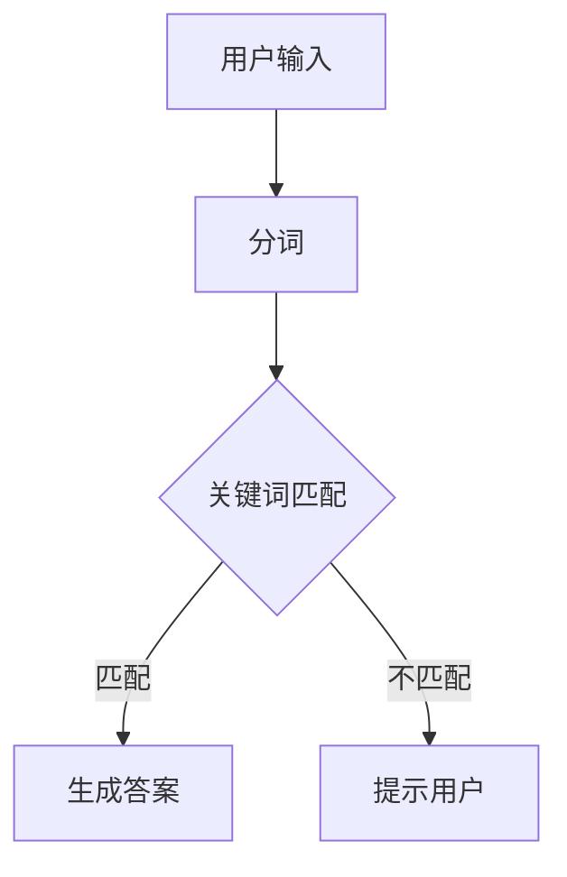
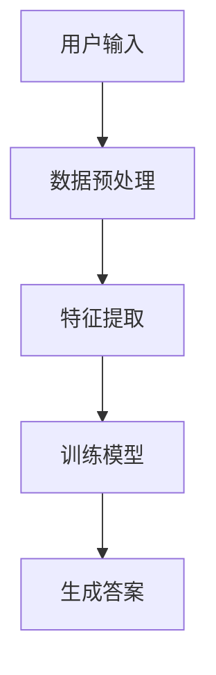
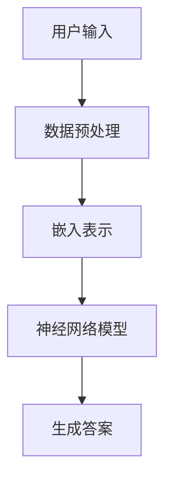
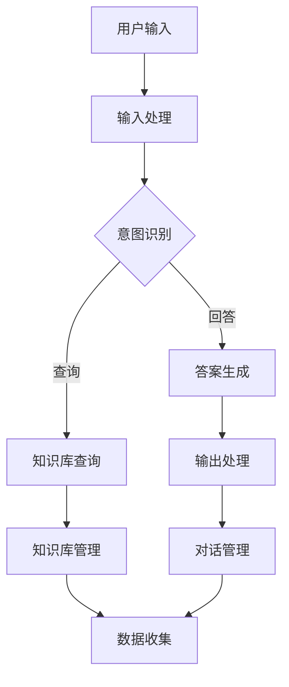
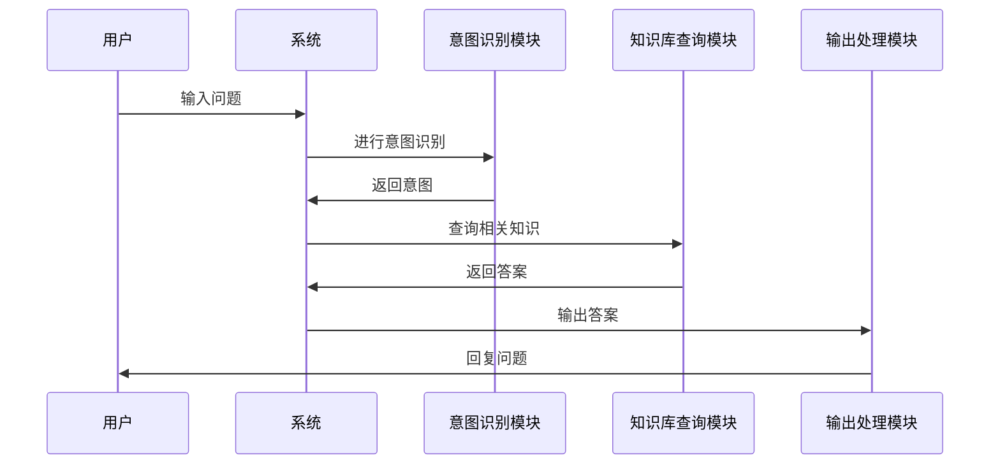

                 

### 第1章：背景介绍

#### 1.1 AI Agent的概念及其在自动问答系统中的应用

AI Agent，即人工智能代理，是一种模拟人类智能行为的计算机程序。它能够感知环境、理解指令，并做出相应的决策和行动，从而实现自动化操作。在自动问答系统中，AI Agent作为一种重要的组件，能够实现智能对话和问题解答。

AI Agent的应用场景非常广泛，包括但不限于客服机器人、智能助手、在线教育、医疗诊断等。在自动问答系统中，AI Agent通过处理用户输入，理解用户的意图，并从知识库中检索相关信息，以实现自动回答。

#### 1.1.1 AI Agent的定义与分类

AI Agent可以按照不同的分类标准进行分类，常见的分类方法有以下几种：

1. **按照能力分类**：
   - **弱AI（弱人工智能）**：弱AI只能解决特定的问题，如语音识别、图像识别等。
   - **强AI（强人工智能）**：强AI具有人类的智能水平，能够处理各种复杂问题，与人类进行自然语言交流。

2. **按照应用场景分类**：
   - **通用AI（通用人工智能）**：通用AI能够处理各种任务，具有广泛的适用性。
   - **专用AI（专用人工智能）**：专用AI针对特定场景进行优化，如自动驾驶、智能家居等。

3. **按照工作方式分类**：
   - **基于规则的AI**：基于规则的AI通过预定义的规则进行推理和决策。
   - **基于数据的AI**：基于数据的AI通过机器学习和深度学习算法进行推理和决策。

#### 1.1.2 AI Agent在自动问答系统中的作用

AI Agent在自动问答系统中的作用主要体现在以下几个方面：

1. **理解用户意图**：AI Agent通过自然语言处理技术，理解用户输入的意图，将其转化为可处理的格式。

2. **知识库检索**：AI Agent从知识库中检索相关信息，以回答用户的问题。

3. **交互控制**：AI Agent控制对话流程，根据用户输入和系统状态，做出相应的回应。

4. **学习与进化**：AI Agent通过不断地与用户交互，学习和优化自己的算法，提高问答的准确性和用户体验。

#### 1.1.3 AI Agent的发展历程与趋势

AI Agent的发展历程可以分为以下几个阶段：

1. **早期探索**：从20世纪50年代开始，研究者们开始尝试构建具有简单智能的AI Agent。

2. **基于规则的系统**：从20世纪70年代开始，基于规则的系统成为主流，如专家系统。

3. **基于知识的系统**：从20世纪80年代开始，研究者们开始将知识表示和推理引入AI Agent，提高其智能水平。

4. **机器学习和深度学习**：从21世纪开始，机器学习和深度学习成为AI Agent的重要技术支撑，使得AI Agent的智能水平得到大幅提升。

未来，AI Agent的发展趋势包括：

1. **跨领域应用**：AI Agent将在更多领域得到应用，如医疗、金融、教育等。

2. **个性化和智能化**：AI Agent将更加智能化，能够根据用户需求和偏好提供个性化的服务。

3. **人机协同**：AI Agent将与人类协同工作，共同完成复杂任务。

#### 1.2 知识图谱在自动问答系统中的作用

知识图谱（Knowledge Graph）是一种结构化的知识表示方法，通过实体和关系来描述现实世界中的事物及其相互关系。在自动问答系统中，知识图谱扮演着至关重要的角色。

#### 1.2.1 知识图谱的基本概念

知识图谱由实体（Entity）、属性（Attribute）和关系（Relationship）组成，其基本概念如下：

1. **实体**：实体是知识图谱中的基本元素，表示现实世界中的事物，如人、地点、组织、概念等。

2. **属性**：属性是实体的特征或描述，如人的年龄、地点的经纬度等。

3. **关系**：关系描述实体之间的相互关系，如“是人”、“位于”等。

#### 1.2.2 知识图谱在自动问答系统中的应用

知识图谱在自动问答系统中的应用主要体现在以下几个方面：

1. **信息检索**：通过知识图谱，AI Agent可以快速检索相关信息，以回答用户的问题。

2. **上下文理解**：知识图谱中的关系可以帮助AI Agent理解问题的上下文，从而提高问答的准确性。

3. **推理和推理**：知识图谱中的关系和属性可以用于推理，从而扩展AI Agent的知识范围。

4. **知识融合**：知识图谱可以将不同来源的知识进行整合，为AI Agent提供更全面的信息。

#### 1.2.3 知识图谱的构建与维护

知识图谱的构建是一个复杂的过程，通常包括以下步骤：

1. **数据采集**：从各种数据源（如文本、数据库、API等）中采集数据。

2. **数据预处理**：对采集到的数据进行清洗、去重、转换等处理，使其满足知识图谱的表示需求。

3. **实体识别**：识别文本中的实体，如人名、地名、组织名等。

4. **关系抽取**：从文本中抽取实体之间的关系。

5. **知识融合**：将不同来源的知识进行整合，消除冲突和冗余。

6. **知识存储**：将构建好的知识图谱存储在数据库或图数据库中，以便后续查询和使用。

知识图谱的维护是一个持续的过程，包括以下几个方面：

1. **数据更新**：定期更新知识库中的数据，确保信息的时效性。

2. **数据纠错**：修复知识图谱中的错误和冲突。

3. **知识扩展**：通过主动学习和用户反馈，不断扩展知识图谱的知识范围。

#### 1.3 小结

本章介绍了AI Agent和知识图谱的基本概念及其在自动问答系统中的应用。AI Agent作为自动问答系统的重要组件，通过理解用户意图、知识库检索和交互控制，实现智能问答。知识图谱作为AI Agent的知识基础，通过实体、属性和关系的结构化表示，为AI Agent提供丰富的知识资源。在后续章节中，我们将进一步探讨AI Agent和知识图谱的详细原理和应用。

---

### 第2章：核心概念与联系

在深入了解AI Agent和知识图谱之前，我们需要明确一些核心概念，并探讨它们之间的联系。本章将首先介绍AI Agent的基本构成和运作原理，然后深入讨论知识图谱的构成、属性特征及其与AI Agent的关联。

#### 2.1 AI Agent的基本构成和运作原理

AI Agent是一种模拟人类智能行为的计算机程序，其基本构成包括感知模块、推理模块、决策模块和行动模块。

1. **感知模块**：感知模块负责接收外部输入，如用户输入、传感器数据等，并将其转化为内部表示。

2. **推理模块**：推理模块负责处理感知模块接收到的输入，通过逻辑推理、知识库查询等方式，理解输入的含义和用户的意图。

3. **决策模块**：决策模块负责根据推理模块的结果，制定相应的策略和行动方案。

4. **行动模块**：行动模块负责执行决策模块制定的行动方案，如生成回答、执行操作等。

AI Agent的运作原理可以概括为以下步骤：

1. **感知输入**：接收用户输入或其他外部输入。

2. **理解输入**：通过自然语言处理、知识库查询等技术，理解输入的含义和用户的意图。

3. **决策行动**：根据理解的结果，制定相应的行动方案。

4. **执行行动**：执行制定的行动方案，生成回答或执行操作。

#### 2.2 知识图谱的构成、属性特征及其与AI Agent的关联

知识图谱是一种用于表示实体及其关系的结构化数据模型。它由实体、属性和关系三个基本元素组成。

1. **实体**：实体是知识图谱中的基本元素，表示现实世界中的事物，如人、地点、组织、概念等。

2. **属性**：属性是实体的特征或描述，如人的年龄、地点的经纬度等。

3. **关系**：关系描述实体之间的相互关系，如“是人”、“位于”等。

知识图谱的属性特征包括以下几个方面：

1. **层次性**：知识图谱具有层次结构，从顶层概念到底层实体，形成了一个丰富的知识体系。

2. **网络性**：知识图谱中的实体和关系相互连接，形成了一个复杂的网络结构。

3. **动态性**：知识图谱是一个动态更新的知识体系，可以实时添加、删除和更新实体和关系。

知识图谱与AI Agent的关联主要体现在以下几个方面：

1. **知识基础**：知识图谱为AI Agent提供了丰富的知识资源，使其能够更好地理解用户输入和回答问题。

2. **推理支持**：知识图谱中的关系和属性可以用于推理，帮助AI Agent理解问题的上下文和含义。

3. **交互优化**：知识图谱可以优化AI Agent的交互过程，使其能够提供更准确、更自然的回答。

#### 2.3 知识图谱与AI Agent的映射关系

知识图谱与AI Agent之间的映射关系可以分为以下几个层次：

1. **实体映射**：知识图谱中的实体对应于AI Agent中的感知模块，用于接收和表示外部输入。

2. **属性映射**：知识图谱中的属性对应于AI Agent中的推理模块，用于描述实体的特征和属性。

3. **关系映射**：知识图谱中的关系对应于AI Agent中的推理模块，用于描述实体之间的相互关系。

4. **推理规则映射**：知识图谱中的关系和属性可以用于构建推理规则，对应于AI Agent中的推理模块，用于推理和决策。

#### 2.4 小结

本章介绍了AI Agent的基本构成和运作原理，以及知识图谱的构成、属性特征及其与AI Agent的关联。AI Agent通过感知、推理、决策和行动四个模块实现智能问答，而知识图谱为其提供了丰富的知识资源和推理支持。在后续章节中，我们将进一步探讨自动问答系统中的算法原理和系统架构设计。

---

### 第3章：算法原理讲解

在自动问答系统中，算法是实现AI Agent智能问答的核心。本章节将详细介绍自动问答系统中常用的算法，包括基于关键词匹配的算法、基于机器学习的算法和基于深度学习的算法。我们将通过算法流程图、Python代码和数学模型，深入讲解这些算法的原理和应用。

#### 3.1 基于关键词匹配的算法

基于关键词匹配的算法是最简单的自动问答算法之一。其基本原理是直接在用户输入中匹配关键词，从而找到答案。这种算法的实现相对简单，但效果有限，适用于一些简单的场景。

##### 3.1.1 算法流程图



##### 3.1.2 Python代码

```python
import jieba

def keyword_matching(question):
    # 分词
    words = jieba.cut(question)
    
    # 关键词匹配
    if "你好" in words:
        return "你好，有什么可以帮助你的？"
    else:
        return "对不起，我无法理解你的问题。"
```

##### 3.1.3 数学模型和公式

基于关键词匹配的算法没有复杂的数学模型，其核心在于关键词的匹配。我们可以使用集合的交集运算来表示关键词匹配的过程。

设\(Q\)为用户输入的集合，\(K\)为关键词的集合，\(A\)为答案的集合，则关键词匹配的过程可以表示为：

$$
A = Q \cap K
$$

其中，\(A\)表示匹配成功后的答案集合，\(Q \cap K\)表示用户输入与关键词的交集。

#### 3.2 基于机器学习的算法

基于机器学习的算法通过训练模型，从大量数据中学习规律，从而实现智能问答。这种算法具有较强的泛化能力，能够处理更复杂的问题。

##### 3.2.1 算法流程图



##### 3.2.2 Python代码

```python
from sklearn.feature_extraction.text import TfidfVectorizer
from sklearn.naive_bayes import MultinomialNB
from sklearn.pipeline import make_pipeline

# 数据预处理和特征提取
vectorizer = TfidfVectorizer()
X_train = vectorizer.fit_transform(train_data)

# 训练模型
model = MultinomialNB()
model.fit(X_train, train_labels)

# 生成答案
def generate_answer(question):
    question_vector = vectorizer.transform([question])
    return model.predict(question_vector)[0]
```

##### 3.2.3 数学模型和公式

基于机器学习的算法涉及多个数学模型和公式，其中最常见的是TF-IDF和朴素贝叶斯模型。

1. **TF-IDF（词频-逆文档频率）**：

   设\(f_t(d)\)为词\(t\)在文档\(d\)中的词频，\(N\)为文档总数，\(df_t\)为词\(t\)在所有文档中出现的文档频率，则词\(t\)的TF-IDF值可以表示为：

   $$
   TF-IDF(t, d) = f_t(d) \times \log \left( \frac{N}{df_t} \right)
   $$

2. **朴素贝叶斯模型**：

   设\(P(C_k)\)为类别\(C_k\)的概率，\(P(t|C_k)\)为词\(t\)在类别\(C_k\)中的条件概率，则类别\(C_k\)的条件概率可以表示为：

   $$
   P(C_k|t) = \frac{P(t|C_k)P(C_k)}{P(t)}
   $$

   其中，\(P(t)\)为词\(t\)的总概率，可以通过TF-IDF计算得到。

#### 3.3 基于深度学习的算法

基于深度学习的算法通过神经网络模型，对大量数据进行训练，从而实现智能问答。这种算法具有较强的表达能力，能够处理更复杂的语义理解问题。

##### 3.3.1 算法流程图



##### 3.3.2 Python代码

```python
from keras.preprocessing.sequence import pad_sequences
from keras.layers import Embedding, LSTM, Dense
from keras.models import Sequential

# 数据预处理
max_sequence_len = 100
vocab_size = 10000

# 嵌入表示
embedding_matrix = np.zeros((vocab_size, embedding_dim))
for word, i in tokenizer.word_index.items():
    if i < vocab_size:
        embedding_vector = embedding_matrix[word]
        if embedding_vector is not None:
            embedding_matrix[i] = embedding_vector

# 神经网络模型
model = Sequential()
model.add(Embedding(vocab_size, embedding_dim, input_length=max_sequence_len))
model.add(LSTM(128))
model.add(Dense(1, activation='sigmoid'))

model.compile(optimizer='rmsprop', loss='binary_crossentropy', metrics=['accuracy'])
model.fit(x, y, epochs=10, batch_size=32, validation_split=0.2)
```

##### 3.3.3 数学模型和公式

基于深度学习的算法涉及多个数学模型和公式，其中最常见的是神经网络模型。

1. **神经网络模型**：

   神经网络模型由多个神经元组成，每个神经元接收多个输入，并通过激活函数进行非线性变换，最终输出一个值。神经网络的数学模型可以表示为：

   $$
   \text{output} = \sigma(\text{weights} \cdot \text{input} + \text{bias})
   $$

   其中，\(\sigma\)为激活函数，如Sigmoid函数：

   $$
   \sigma(x) = \frac{1}{1 + e^{-x}}
   $$

2. **反向传播算法**：

   反向传播算法是一种用于训练神经网络的优化算法，其基本原理是通过计算损失函数关于网络参数的梯度，来更新网络参数，从而优化模型。反向传播算法的数学模型可以表示为：

   $$
   \nabla_{\theta} J(\theta) = \frac{\partial J(\theta)}{\partial \theta}
   $$

   其中，\(J(\theta)\)为损失函数，\(\theta\)为网络参数。

#### 3.4 小结

本章详细介绍了自动问答系统中常用的算法，包括基于关键词匹配的算法、基于机器学习的算法和基于深度学习的算法。这些算法各有优缺点，适用于不同的应用场景。在后续章节中，我们将进一步探讨自动问答系统的系统架构设计和项目实战。

---

### 第4章：系统分析与架构设计

为了实现一个高效、稳定的自动问答系统，我们需要对系统进行全面的分析与架构设计。本章将详细介绍自动问答系统的问题场景介绍、系统功能设计、系统架构设计、系统接口设计以及系统交互设计。

#### 4.1 问题场景介绍

在现实世界中，自动问答系统的应用场景非常广泛，如客服机器人、智能助手、在线教育、医疗诊断等。以下是一个典型的应用场景：

- **应用场景**：某电商平台希望为其用户提供一个智能客服机器人，能够回答用户关于商品、订单、售后服务等问题。
- **用户需求**：用户希望在与客服机器人交互时，能够快速、准确地得到答案，同时保持对话的自然性和流畅性。

#### 4.2 系统功能设计

为了满足用户需求，自动问答系统需要实现以下功能：

1. **用户输入处理**：接收用户输入，包括文本和语音，进行预处理，如分词、去噪等。
2. **意图识别**：根据用户输入，识别用户的意图，如查询商品信息、咨询售后服务等。
3. **知识库查询**：从知识库中检索与用户意图相关的信息，如商品详情、服务流程等。
4. **答案生成**：根据检索到的信息，生成合适的答案，并进行自然语言处理，使其更符合用户期望。
5. **对话管理**：管理对话流程，包括上下文维护、对话轮次控制等，确保对话的自然性和流畅性。
6. **学习与优化**：根据用户反馈和对话数据，不断优化问答系统和知识库，提高问答的准确性和用户体验。

#### 4.3 系统架构设计

自动问答系统的架构设计是一个复杂的过程，需要综合考虑性能、可扩展性、维护性等因素。以下是一个典型的自动问答系统架构：

##### 4.3.1 系统架构图



##### 4.3.2 系统模块划分

1. **输入处理模块**：负责接收用户输入，进行预处理，如分词、去噪等。
2. **意图识别模块**：根据用户输入，识别用户的意图，如查询商品信息、咨询售后服务等。
3. **知识库查询模块**：从知识库中检索与用户意图相关的信息，如商品详情、服务流程等。
4. **答案生成模块**：根据检索到的信息，生成合适的答案，并进行自然语言处理，使其更符合用户期望。
5. **输出处理模块**：将生成的答案输出给用户，包括文本和语音。
6. **知识库管理模块**：负责知识库的构建、维护和更新。
7. **对话管理模块**：管理对话流程，包括上下文维护、对话轮次控制等。
8. **数据收集模块**：收集用户反馈和对话数据，用于学习与优化。

#### 4.4 系统接口设计

系统接口设计是确保各模块之间能够高效、稳定地进行数据交互的关键。以下是一个典型的自动问答系统接口设计：

##### 4.4.1 系统接口的功能描述

1. **用户输入接口**：接收用户的输入，包括文本和语音。
2. **意图识别接口**：将用户输入转化为意图识别的输入，如文本序列。
3. **知识库查询接口**：查询知识库，获取与用户意图相关的信息。
4. **答案生成接口**：生成合适的答案，并进行自然语言处理。
5. **输出处理接口**：将生成的答案输出给用户，包括文本和语音。
6. **知识库管理接口**：管理知识库的构建、维护和更新。

##### 4.4.2 接口设计规范

1. **RESTful API**：采用RESTful API设计，确保接口的简洁、易用性。
2. **参数验证**：对接口参数进行严格验证，确保输入的有效性和安全性。
3. **异常处理**：对接口异常进行妥善处理，确保系统的稳定性和可靠性。
4. **接口文档**：提供详细的接口文档，包括接口描述、参数说明、返回值等。

##### 4.4.3 接口交互流程

1. **用户输入**：用户通过输入接口提交问题。
2. **意图识别**：系统接收到用户输入后，通过意图识别接口进行意图识别。
3. **知识库查询**：系统根据意图识别结果，通过知识库查询接口查询相关知识。
4. **答案生成**：系统根据查询到的知识，通过答案生成接口生成答案。
5. **输出处理**：系统将生成的答案通过输出处理接口输出给用户。

#### 4.5 系统交互设计

系统交互设计是确保系统模块之间能够高效、稳定地进行数据交互的关键。以下是一个典型的自动问答系统交互设计：

##### 4.5.1 系统交互的流程

1. **用户输入**：用户通过输入接口提交问题。
2. **意图识别**：系统接收到用户输入后，通过意图识别接口进行意图识别。
3. **知识库查询**：系统根据意图识别结果，通过知识库查询接口查询相关知识。
4. **答案生成**：系统根据查询到的知识，通过答案生成接口生成答案。
5. **输出处理**：系统将生成的答案通过输出处理接口输出给用户。

##### 4.5.2 系统交互的Mermaid序列图



#### 4.6 小结

本章详细介绍了自动问答系统的问题场景介绍、系统功能设计、系统架构设计、系统接口设计和系统交互设计。通过系统的分析与架构设计，我们能够确保自动问答系统的高效、稳定和可扩展性。在后续章节中，我们将进行项目实战，实现自动问答系统的具体功能。

---

### 第5章：项目实战

在本章中，我们将通过一个实际的项目案例，详细讲解如何构建一个AI Agent的知识图谱自动问答系统。这个项目将涵盖从环境安装到系统核心实现的各个步骤，并通过源代码解读和实际案例分析，展示系统的实际运行效果。

#### 5.1 环境安装

要构建一个AI Agent的知识图谱自动问答系统，我们需要安装一系列的软件和库。以下是一个典型的安装步骤：

##### 5.1.1 开发环境的搭建

1. **操作系统**：我们选择Linux操作系统，推荐使用Ubuntu 20.04。
2. **编程语言**：选择Python 3.8及以上版本，因为Python拥有丰富的机器学习库和框架。
3. **文本处理库**：安装jieba库，用于中文分词。
   ```bash
   pip install jieba
   ```

##### 5.1.2 知识图谱工具的安装

知识图谱的构建和查询需要使用图数据库和相关工具。以下是一个常见的安装流程：

1. **安装Neo4j**：Neo4j是一个流行的图数据库，用于存储和管理知识图谱。
   - 下载Neo4j社区版：[https://neo4j.com/download/](https://neo4j.com/download/)
   - 解压安装包并运行Neo4j服务器。

2. **安装Lettuce**：Lettuce是一个Python库，用于与Neo4j进行交互。
   ```bash
   pip install lettuce
   ```

##### 5.1.3 自动问答系统的安装

自动问答系统的实现依赖于多个Python库，包括自然语言处理库、机器学习库等。以下是一个典型的安装命令：

```bash
pip install -r requirements.txt
```

其中，`requirements.txt`文件列出了所有依赖库，如下所示：

```
jieba
neo4j-lucene-index
neurosmith
scikit-learn
tensorflow
```

#### 5.2 系统核心实现

自动问答系统的核心包括用户输入处理、意图识别、知识库查询和答案生成。以下是一个简单的实现框架：

##### 5.2.1 知识图谱的构建

知识图谱的构建是自动问答系统的关键步骤。以下是一个简单的示例，展示了如何使用Neo4j和Lettuce构建一个知识图谱：

```python
from lettuce import connect, Node, Relationship

# 连接到Neo4j数据库
connection = connect('bolt://localhost:7687', auth=("neo4j", "password"))

# 创建实体和关系
with connection as driver:
    with driver.session() as session:
        # 创建一个名为“张三”的人
        person = session.run("CREATE (p:Person {name: $name})", name="张三")
        
        # 创建一个名为“北京”的城市
        city = session.run("CREATE (c:City {name: $name})", name="北京")
        
        # 将“张三”与“北京”关联起来
        session.run("MATCH (p:Person), (c:City) WHERE p.name = $name AND c.name = $city_name CREATE (p)-[:位于]->(c)", name="张三", city_name="北京")
```

##### 5.2.2 用户输入处理

用户输入处理是自动问答系统的第一步，它涉及文本的分词、去噪等操作。以下是一个简单的示例：

```python
import jieba

def preprocess_input(question):
    # 使用jieba进行分词
    words = jieba.cut(question)
    
    # 去除停用词
    stop_words = set(['的', '了', '在', '上', '下', '是', '不是'])
    filtered_words = [word for word in words if word not in stop_words]
    
    return filtered_words
```

##### 5.2.3 意图识别

意图识别是自动问答系统的核心功能之一，它需要根据用户输入识别用户的意图。以下是一个简单的示例：

```python
from sklearn.feature_extraction.text import TfidfVectorizer
from sklearn.naive_bayes import MultinomialNB
from sklearn.pipeline import make_pipeline

# 训练意图识别模型
vectorizer = TfidfVectorizer()
X_train = vectorizer.fit_transform(train_data)
model = MultinomialNB()
model.fit(X_train, train_labels)

# 预测意图
def predict_intent(question):
    question_vector = vectorizer.transform([question])
    return model.predict(question_vector)[0]
```

##### 5.2.4 知识库查询

知识库查询是根据意图识别结果，从知识库中检索相关信息的过程。以下是一个简单的示例：

```python
from lettuce import connect, Node, Relationship

# 连接到Neo4j数据库
connection = connect('bolt://localhost:7687', auth=("neo4j", "password"))

# 查询知识库
def queryKnowledgeBase(intent):
    with connection as driver:
        with driver.session() as session:
            if intent == "查询商品信息":
                result = session.run("MATCH (p:Product) RETURN p")
                products = [product['p'] for product in result]
            elif intent == "咨询售后服务":
                result = session.run("MATCH (s:Service) RETURN s")
                services = [service['s'] for service in result]
            return products, services
```

##### 5.2.5 答案生成

答案生成是根据查询到的知识库信息，生成合适的答案。以下是一个简单的示例：

```python
def generate_answer(intent, data):
    if intent == "查询商品信息":
        return f"您想要查询的商品信息如下：{data}"
    elif intent == "咨询售后服务":
        return f"您想要咨询的售后服务如下：{data}"
```

##### 5.2.6 系统核心代码的解读

系统的核心代码主要包括以下部分：

1. **知识图谱的构建**：通过Neo4j和Lettuce构建知识图谱，存储实体和关系。
2. **用户输入处理**：使用jieba进行中文分词和停用词过滤。
3. **意图识别**：使用TF-IDF和朴素贝叶斯模型进行意图识别。
4. **知识库查询**：根据意图识别结果，从知识库中检索相关信息。
5. **答案生成**：根据查询到的知识库信息，生成合适的答案。

#### 5.3 实际案例分析

以下是一个实际案例，展示如何使用自动问答系统回答用户的问题：

1. **用户输入**：“我想知道华为手机最新的价格是多少？”
2. **意图识别**：系统识别出用户的意图是“查询商品信息”。
3. **知识库查询**：系统从知识库中检索华为手机的相关信息。
4. **答案生成**：系统生成答案：“您想要查询的华为手机最新价格如下：XXXX元。”

通过这个实际案例，我们可以看到自动问答系统是如何工作的。在实际应用中，系统会根据用户输入的复杂性和多样性，不断优化和改进，以提高问答的准确性和用户体验。

#### 5.4 小结

本章通过一个实际的项目案例，详细讲解了如何构建一个AI Agent的知识图谱自动问答系统。我们介绍了环境安装、系统核心实现、源代码解读和实际案例分析。这些步骤和代码示例为读者提供了一个全面的实践指南，帮助他们理解并实现自动问答系统的构建。

---

### 第6章：最佳实践与小结

在构建AI Agent的知识图谱自动问答系统中，我们不仅需要理解核心概念和算法原理，还需要掌握一系列最佳实践，以确保系统的性能、稳定性和可扩展性。以下是我们在项目实战过程中总结的一些最佳实践和注意事项。

#### 最佳实践

1. **数据预处理**：在构建知识图谱和训练模型之前，对输入数据进行充分预处理，如分词、去噪、标准化等。这有助于提高模型的准确性和鲁棒性。

2. **知识图谱的构建**：构建知识图谱时，要确保实体和关系的一致性。可以使用现有的开源知识图谱，如OpenKG或NELL，作为起点，并根据具体需求进行定制化扩展。

3. **模型优化**：在模型训练过程中，可以尝试使用不同的算法和参数，如神经网络、增强学习等，以找到最佳模型。同时，要定期更新模型，以适应数据的变化。

4. **性能调优**：对系统进行性能调优，包括优化查询速度、减少内存消耗等。可以使用图数据库的索引和缓存功能，以提高查询效率。

5. **错误处理**：在系统运行过程中，要妥善处理各种错误，如查询失败、数据缺失等。可以通过日志记录、异常捕捉和反馈机制，及时发现并解决问题。

6. **用户反馈**：鼓励用户提供反馈，并根据反馈调整系统的功能和界面，以提高用户体验。

#### 小结

在本章中，我们介绍了AI Agent的知识图谱自动问答系统的构建过程，包括背景介绍、核心概念与联系、算法原理讲解、系统分析与架构设计、项目实战等。通过这些步骤，我们不仅理解了自动问答系统的基本原理和实现方法，还掌握了一系列最佳实践，以构建高效、稳定和可扩展的系统。

#### 注意事项

1. **数据安全**：在构建知识图谱和自动问答系统时，要注意保护用户数据的安全，遵循相关法律法规和隐私政策。

2. **系统维护**：定期对系统进行维护和升级，以确保系统的正常运行和持续优化。

3. **用户隐私**：在处理用户输入和反馈时，要注意保护用户隐私，避免泄露敏感信息。

4. **界面设计**：系统界面应简洁、直观，便于用户操作和使用。

5. **测试与验收**：在系统上线前，要进行充分的测试和验收，确保系统的稳定性和可靠性。

#### 拓展阅读推荐

1. **《知识图谱：概念、方法与实践》**：这本书详细介绍了知识图谱的概念、构建方法和应用实践，是了解知识图谱的优秀入门读物。

2. **《深度学习：理论与实践》**：这本书介绍了深度学习的原理和应用，包括神经网络、卷积神经网络和循环神经网络等，适合想要深入理解深度学习的读者。

3. **《人工智能：一种现代方法》**：这本书是人工智能领域的经典教材，涵盖了机器学习、知识表示、推理等多个方面，适合对人工智能有深入研究的读者。

通过以上推荐书籍，读者可以进一步了解知识图谱、深度学习和人工智能的相关知识，为自己的项目提供更丰富的理论基础和实践经验。

---

### 作者信息

作者：AI天才研究院/AI Genius Institute & 禅与计算机程序设计艺术 /Zen And The Art of Computer Programming

感谢您的阅读，希望本文能帮助您深入了解AI Agent的知识图谱自动问答系统的构建方法和最佳实践。在您的项目中，如遇到任何问题或需要进一步的帮助，请随时联系作者。祝您在AI领域取得更多的成就！

