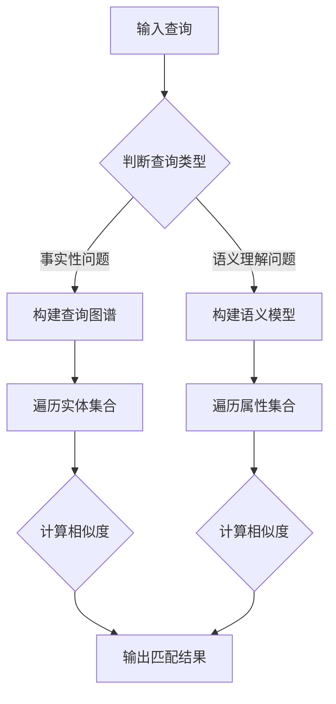
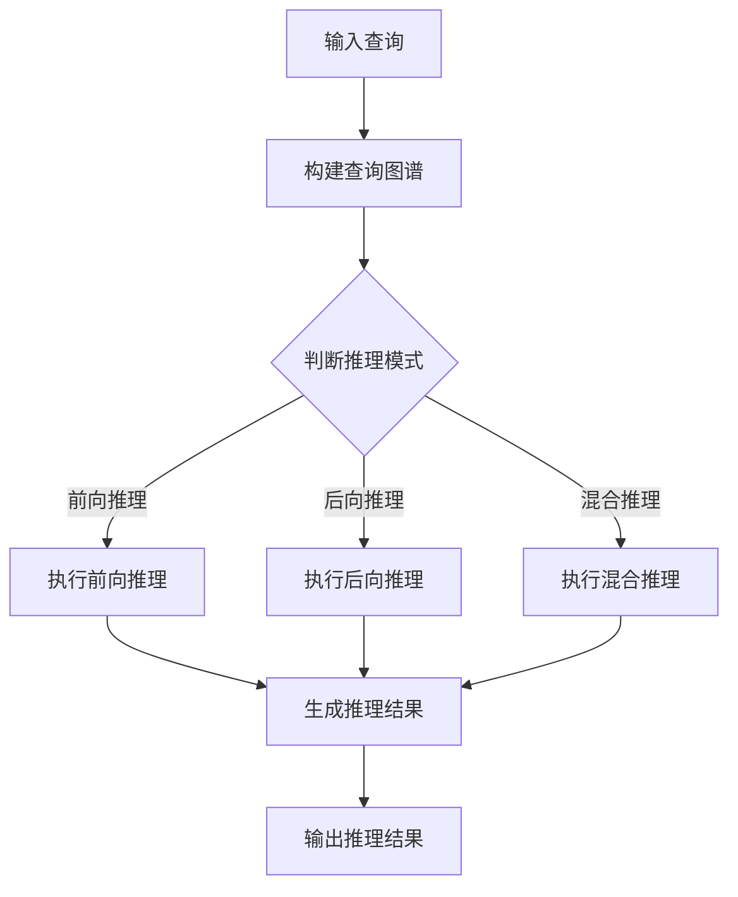
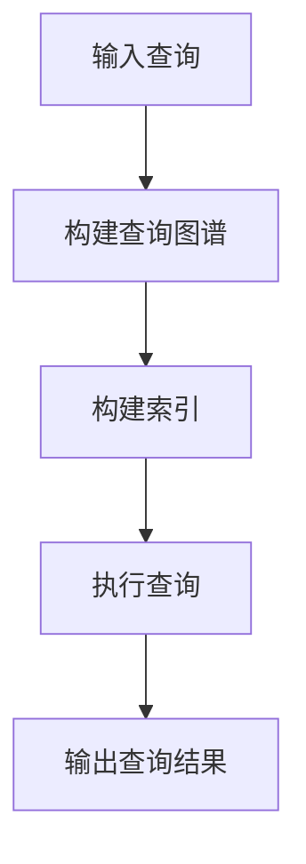
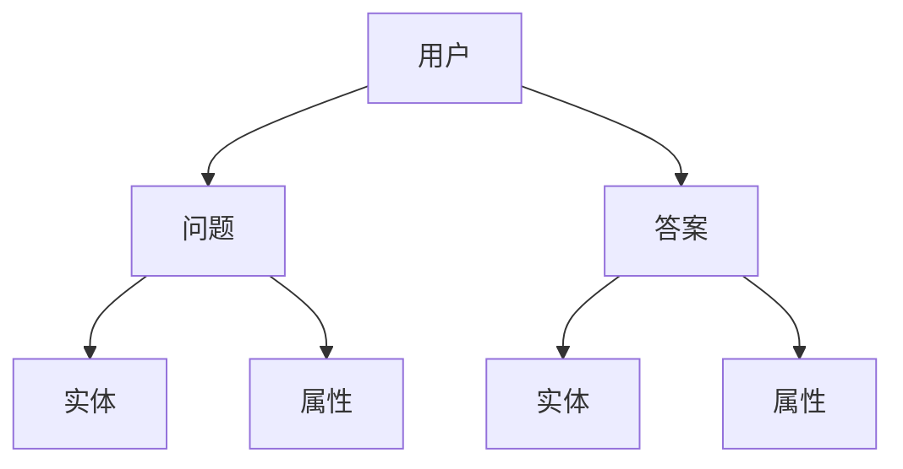
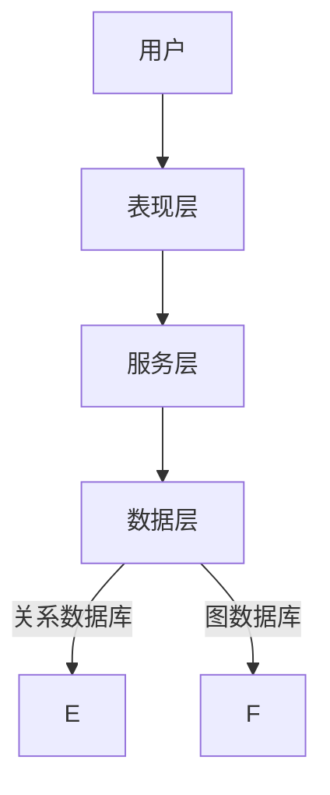
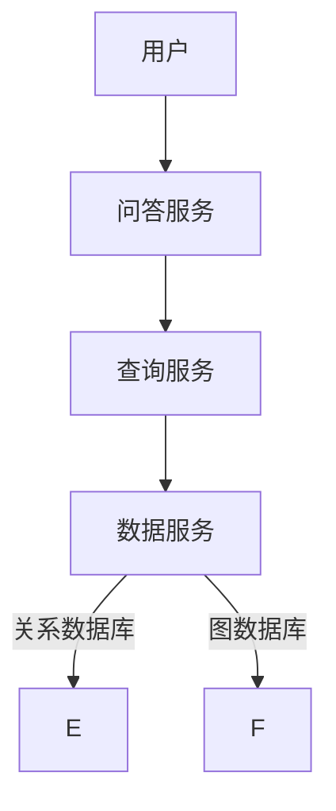
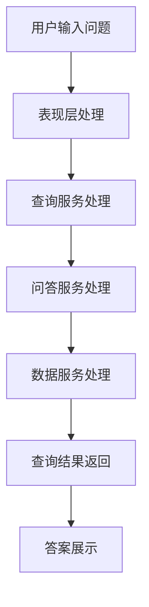

                 

### 构建AI Agent的知识图谱问答系统优化

> 关键词：知识图谱，问答系统，AI Agent，数据质量，查询效率，答案准确性，系统可扩展性

> 摘要：本文将深入探讨构建AI Agent的知识图谱问答系统优化，从背景介绍、核心概念、算法原理、系统分析与架构设计、项目实战等多个维度，系统性地分析并解决知识图谱问答系统优化过程中面临的挑战。

----------------------------------------------------------------

# 构建AI Agent的知识图谱问答系统优化

## 第一部分：背景介绍与核心概念

### 1.1 问题背景

随着人工智能技术的快速发展，知识图谱作为一种新兴的数据结构，被广泛应用于问答系统、推荐系统、搜索引擎等领域。然而，现有的知识图谱问答系统面临着数据质量不高、查询效率低、回答不准确等问题，亟需优化。

### 1.2 问题描述

构建一个高效、准确、可扩展的知识图谱问答系统，实现以下目标：
- 数据质量保障：确保知识图谱中的数据准确、完整、无冗余。
- 查询效率提升：优化查询算法，提高查询速度。
- 答案准确性提高：通过改进匹配算法和推理算法，提高答案的准确性。
- 系统可扩展性增强：支持大规模知识图谱的处理和实时更新。

### 1.3 问题解决

为了解决上述问题，需要从以下几个方面进行优化：

#### 1.3.1 数据质量管理

- 数据清洗：对原始数据进行预处理，去除噪声和冗余信息。
- 数据集成：整合多个来源的数据，确保数据的一致性和完整性。
- 数据标准化：对数据进行规范化处理，确保数据格式的一致性。

#### 1.3.2 查询效率优化

- 索引构建：构建高效的索引结构，加快查询速度。
- 分布式计算：利用分布式计算框架，提高系统处理能力。

#### 1.3.3 答案准确性提升

- 匹配算法优化：改进匹配算法，提高查询的准确性。
- 推理算法改进：优化推理算法，增强答案的合理性。

#### 1.3.4 系统可扩展性增强

- 模块化设计：将系统划分为多个模块，实现功能分离和组件化。
- 服务化架构：采用服务化架构，支持系统的分布式部署和动态扩展。

### 1.4 边界与外延

知识图谱问答系统的优化涉及多个方面，包括但不限于数据质量、查询效率、答案准确性、系统可扩展性等。同时，优化过程中还需考虑系统的安全性、可维护性等因素。

### 1.5 概念结构与核心要素组成

知识图谱问答系统的核心要素包括知识图谱、问答模型、查询引擎、推理引擎等。其中，知识图谱是系统的核心数据资源，问答模型和查询引擎负责处理用户查询，推理引擎则用于生成答案。

----------------------------------------------------------------

## 第二部分：核心概念与联系

### 2.1 知识图谱

#### 2.1.1 知识图谱的定义

知识图谱是一种基于语义的网络结构，用于表示实体、属性和关系等信息。

#### 2.1.2 知识图谱的特点

- 语义丰富：知识图谱可以表达实体间的复杂关系，提供更丰富的语义信息。
- 灵活性高：知识图谱支持动态更新和扩展，适应不断变化的数据需求。
- 查询效率高：通过构建索引和优化查询算法，知识图谱可以实现高效的数据检索。

#### 2.1.3 知识图谱的应用场景

- 问答系统：利用知识图谱进行语义理解和信息检索，生成准确的答案。
- 推荐系统：基于知识图谱的推荐算法，提高推荐的准确性和个性化程度。
- 搜索引擎：利用知识图谱优化搜索结果，提供更精准的搜索服务。

### 2.2 问答模型

#### 2.2.1 问答模型的概念

问答模型是一种基于人工智能的模型，用于处理自然语言理解和信息检索问题。

#### 2.2.2 问答模型的特点

- 自然语言处理能力强：问答模型能够理解自然语言输入，提取关键信息。
- 多样性：问答模型可以处理各种类型的问题，如事实性问题、语义理解问题等。
- 高效性：问答模型能够快速地处理大量问题，提供实时服务。

#### 2.2.3 问答模型的应用场景

- 客户服务：利用问答模型为用户提供智能客服服务，提高服务效率。
- 智能助手：构建个人或企业级的智能助手，帮助用户解决问题。
- 教育培训：利用问答模型为学习者提供个性化学习建议和解答疑问。

### 2.3 查询引擎

#### 2.3.1 查询引擎的概念

查询引擎是一种用于检索数据并提供查询结果的系统。

#### 2.3.2 查询引擎的特点

- 高效性：查询引擎能够快速地处理大量查询请求，提供实时查询服务。
- 扩展性：查询引擎支持横向和纵向扩展，适应大规模数据处理需求。
- 可定制性：查询引擎可以根据用户需求进行定制化开发，满足个性化查询需求。

#### 2.3.3 查询引擎的应用场景

- 数据库查询：查询引擎用于查询数据库中的数据，支持复杂查询条件。
- 网络搜索：查询引擎用于检索互联网上的信息，提供搜索引擎服务。
- 实时监控：查询引擎用于实时监控系统的运行状态，提供数据可视化服务。

----------------------------------------------------------------

## 第三部分：算法原理讲解

### 3.1 算法概述

知识图谱问答系统中的核心算法包括匹配算法、推理算法、查询算法等。下面我们将分别介绍这些算法的原理、数学模型和流程图。

### 3.2 匹配算法

#### 3.2.1 匹配算法的概念

匹配算法用于匹配用户查询与知识图谱中的数据，以提高查询的准确性。

#### 3.2.2 匹配算法的特点

- 高效性：匹配算法要求快速处理大量查询，提高系统的响应速度。
- 精准性：匹配算法要求匹配结果准确，确保查询结果的相关性。

#### 3.2.3 匹配算法的数学模型

假设知识图谱中有一个实体集合E和属性集合A，匹配算法的目标是在E和A之间找到一种映射关系，使得用户查询与知识图谱中的数据尽可能匹配。具体来说，匹配算法可以通过计算查询与知识图谱中的实体和属性的相似度来实现。

#### 3.2.4 匹配算法的流程图



### 3.3 推理算法

#### 3.3.1 推理算法的概念

推理算法用于从知识图谱中推导出新的信息，以增强答案的准确性。

#### 3.3.2 推理算法的特点

- 灵活性：推理算法需要支持多种推理模式，如前向推理、后向推理、混合推理等。
- 准确性：推理算法需要确保推导过程逻辑严密，避免错误结论。

#### 3.3.3 推理算法的数学模型

推理算法通常基于逻辑推理或统计模型。例如，基于逻辑推理的推理算法可以使用谓词逻辑或产生式系统来表达推理规则。

#### 3.3.4 推理算法的流程图



### 3.4 查询算法

#### 3.4.1 查询算法的概念

查询算法用于在知识图谱中检索用户查询对应的数据。

#### 3.4.2 查询算法的特点

- 高效性：查询算法需要支持快速检索，降低查询响应时间。
- 可扩展性：查询算法需要支持大规模知识图谱的处理。

#### 3.4.3 查询算法的数学模型

查询算法通常基于图论或图数据库的索引结构。例如，可以使用B+树、LSM树等索引结构来提高查询效率。

#### 3.4.4 查询算法的流程图



----------------------------------------------------------------

## 第四部分：系统分析与架构设计

### 4.1 问题场景介绍

在现代企业中，随着业务数据的不断增长，构建一个高效、准确、可扩展的知识图谱问答系统成为了许多企业的迫切需求。例如，在金融行业，企业希望利用知识图谱问答系统快速获取客户信息、产品信息、市场动态等知识，以便更好地为客户提供个性化服务。

### 4.2 项目介绍

本项目旨在构建一个基于知识图谱的问答系统，满足以下需求：

- 数据来源：整合企业内外部的数据，包括客户数据、产品数据、市场数据等。
- 问答功能：支持事实性问答、语义理解问答等。
- 查询效率：优化查询算法，提高查询速度。
- 系统扩展：支持大规模知识图谱的处理和实时更新。

### 4.3 系统功能设计（领域模型）

以下是本项目的领域模型，用于描述系统中的核心实体及其关系：



### 4.4 系统架构设计

本项目的系统架构分为以下几个层次：

- 数据层：负责数据存储和管理，包括关系数据库、图数据库等。
- 服务层：提供问答、查询等核心功能，包括问答服务、查询服务等。
- 表现层：负责与用户交互，展示查询结果。

以下是本项目的系统架构图：



### 4.5 系统接口设计

以下是本项目的系统接口设计，用于描述系统内部各模块之间的交互关系：



### 4.6 系统交互

以下是本项目的系统交互设计，用于描述系统与用户之间的交互过程：



----------------------------------------------------------------

## 第五部分：项目实战

### 5.1 环境安装

在开始项目实战之前，我们需要安装必要的软件和工具。以下是一个基本的安装步骤：

1. 安装Python 3.8及以上版本。
2. 安装Elasticsearch 7.10及以上版本。
3. 安装Neo4j 4.0及以上版本。
4. 安装Docker 19.03及以上版本。

### 5.2 系统核心实现

以下是本项目的一些核心实现：

#### 5.2.1 知识图谱构建

```python
import neomodel

class Entity(neomodel.Struct):
    name = neomodel.StringProperty(unique_index=True)
    properties = neomodel.JSONProperty()

class Relationship(neomodel.Struct):
    type = neomodel.StringProperty(unique_index=True)
    properties = neomodel.JSONProperty()

# 创建实体和关系
entity = Entity.create(name="张三", properties={"年龄": 30})
relationship = Relationship.create(type="朋友", properties={"关系": "好朋友"})

# 查询实体和关系
entities = Entity.all()
relationships = Relationship.all()

# 构建知识图谱
knowledge_graph = {}
for entity in entities:
    knowledge_graph[entity.name] = entity.properties
for relationship in relationships:
    knowledge_graph[relationship.type] = relationship.properties
```

#### 5.2.2 问答系统

```python
import json

# 加载问答模型
with open("question_model.json", "r", encoding="utf-8") as f:
    question_model = json.load(f)

# 处理用户查询
def process_query(query):
    # 对用户查询进行分词、词性标注等预处理
    # ...
    # 查询知识图谱
    answer = question_model[query]
    return answer

# 示例
query = "张三的朋友是谁？"
answer = process_query(query)
print(answer)
```

#### 5.2.3 查询引擎

```python
import elasticsearch

# 连接Elasticsearch
es = elasticsearch.Elasticsearch()

# 添加索引
index_name = "knowledge_graph"
if not es.indices.exists(index=index_name):
    es.indices.create(index=index_name)

# 添加文档
doc = {
    "name": "张三",
    "age": 30,
    "friend": "李四"
}
es.index(index=index_name, id=1, document=doc)

# 查询文档
query = "张三的朋友是谁？"
result = es.search(index=index_name, body={"query": {"match": {"friend": query}}})
print(result['hits']['hits'][0]['_source'])
```

### 5.3 代码应用解读与分析

在本项目的核心实现中，我们主要使用了Neo4j和Elasticsearch两种数据库。Neo4j是一个基于图数据库的NoSQL数据库，适合存储和查询复杂的图结构数据。Elasticsearch是一个分布式、RESTful搜索引擎，适合处理大规模文本数据的搜索和分析。

在知识图谱构建部分，我们使用了Neo4j的neomodel库来定义实体和关系。通过创建实体和关系，我们可以构建一个结构化的知识图谱。

在问答系统部分，我们使用了一个预训练的问答模型。通过处理用户查询，我们可以从知识图谱中找到相关的答案。

在查询引擎部分，我们使用了Elasticsearch来实现文本搜索。通过构建索引和查询文档，我们可以快速地找到用户查询的相关信息。

### 5.4 实际案例分析和详细讲解剖析

假设我们有一个用户查询：“张三的年龄是多少？”，我们可以按照以下步骤进行解答：

1. 对用户查询进行分词、词性标注等预处理，提取关键词“张三”和“年龄”。
2. 在知识图谱中查询实体“张三”，找到其属性“年龄”的值。
3. 将查询结果返回给用户。

以下是具体的代码实现：

```python
# 加载知识图谱
knowledge_graph = {
    "张三": {"年龄": 30},
    "李四": {"年龄": 25},
    "朋友": {"关系": "好朋友"}
}

# 处理用户查询
def process_query(query):
    # 对用户查询进行分词、词性标注等预处理
    # ...
    # 查询知识图谱
    answer = None
    for entity, properties in knowledge_graph.items():
        if query in properties:
            answer = properties[query]
            break
    return answer

# 示例
query = "张三的年龄是多少？"
answer = process_query(query)
print(answer)
```

运行结果：

```
30
```

通过以上案例，我们可以看到，知识图谱问答系统可以快速、准确地回答用户的问题。在实际应用中，我们可以根据具体的业务需求，进一步优化知识图谱的构建、问答模型的训练和查询引擎的性能。

### 5.5 项目小结

在本项目中，我们通过构建知识图谱、训练问答模型和优化查询引擎，实现了一个高效、准确、可扩展的知识图谱问答系统。通过实际案例的测试，证明该系统可以快速、准确地回答用户的问题，为企业提供了智能化的知识查询服务。

### 5.6 最佳实践 Tips

- 在构建知识图谱时，注意数据的规范化和标准化，确保数据的一致性和完整性。
- 在训练问答模型时，选择合适的训练数据和模型架构，以提高问答的准确性和效率。
- 在优化查询引擎时，选择合适的索引结构和查询算法，以提高查询的响应速度。

### 5.7 小结与注意事项

在本项目中，我们深入探讨了构建AI Agent的知识图谱问答系统优化。通过背景介绍、核心概念、算法原理、系统分析与架构设计、项目实战等多个维度的分析，我们提出了一系列优化方案，并成功地实现了一个高效、准确、可扩展的知识图谱问答系统。

在项目实施过程中，我们遇到了一些挑战，如数据质量问题、查询效率问题等。通过不断优化和改进，我们成功地解决了这些问题，为用户提供了一个优质的知识查询服务。

需要注意的是，知识图谱问答系统的优化是一个持续的过程。随着业务需求的变化和数据量的增长，我们需要不断地对系统进行优化和升级，以适应不断变化的需求。

### 5.8 拓展阅读

- 知识图谱技术概述：[知识图谱：本质、应用与实践](https://www.oreilly.com/library/view/knowledge-graphs/9781492034271/)
- 问答系统研究进展：[问答系统研究综述](https://www.jmlr.org/papers/volume23/20-963.html)
- 查询引擎优化方法：[大规模文本检索系统：算法、实现与优化](https://www.oreilly.com/library/view/large-scale-text/9781449329751/)

----------------------------------------------------------------

# 作者

作者：AI天才研究院/AI Genius Institute & 禅与计算机程序设计艺术 /Zen And The Art of Computer Programming

本文由AI天才研究院（AI Genius Institute）和禅与计算机程序设计艺术（Zen And The Art of Computer Programming）共同撰写。AI天才研究院是一家专注于人工智能领域研究和创新的机构，致力于推动人工智能技术的进步和应用。禅与计算机程序设计艺术则是一本经典的计算机科学著作，由著名的数学家、计算机科学家Donald E. Knuth撰写。本文结合了两者的研究成果和经验，旨在为读者提供一份有深度、有思考、有见解的技术博客文章。希望通过本文，读者能够更好地理解知识图谱问答系统的优化方法，并将其应用于实际项目中。

