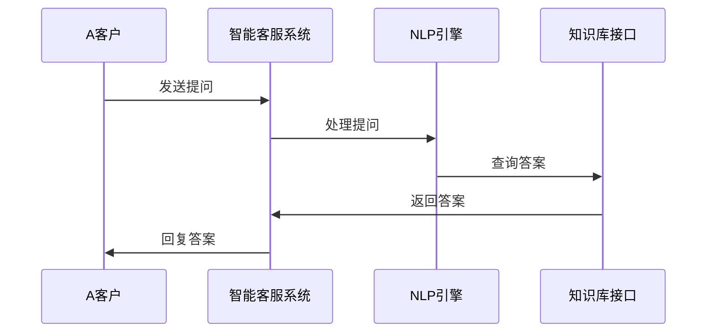
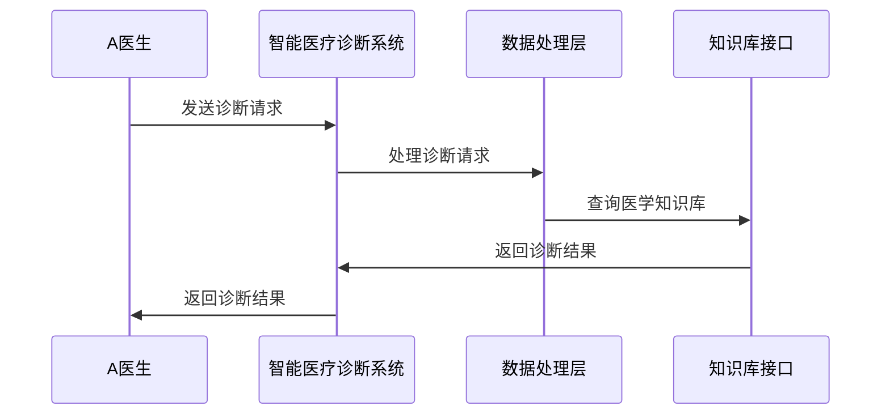
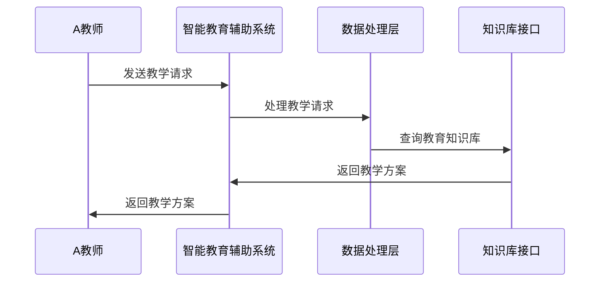

                 

# 构建AI Agent的知识库版本控制系统

关键词：AI Agent、知识库、版本控制、系统架构、算法设计

摘要：本文将探讨AI Agent的知识库版本控制系统，分析其重要性、设计原则、实现方法以及应用案例。通过逐步分析，我们将深入了解如何构建一个高效、可靠的AI Agent知识库版本控制系统，以支持AI技术的发展和应用。

## 目录大纲

### 第一部分: 引言与背景

1. AI Agent的概念与作用
2. 知识库版本控制的重要性
3. 知识库版本控制系统的架构

### 第二部分: 知识库版本控制系统的设计原则与实现方法

1. 设计原则
2. 实现方法
3. 数据结构与算法

### 第三部分: AI Agent的知识库管理机制

1. 知识的获取与存储
2. 知识的更新与删除
3. 知识的检索与查询

### 第四部分: AI Agent的版本控制功能

1. 版本管理的概念与流程
2. 版本控制算法的设计
3. 版本对比与合并

### 第五部分: AI Agent的知识库协作与共享

1. 协作机制的设计
2. 共享策略的制定
3. 安全性与隐私保护

### 第六部分: AI Agent的知识库应用案例

1. 智能客服系统
2. 智能医疗诊断系统
3. 智能教育辅助系统

### 第七部分: 知识库版本控制系统的优化与展望

1. 优化方向
2. 未来发展趋势
3. 结论与展望

## 第一部分：引言与背景

### 1.1 AI Agent的概念与作用

AI Agent，即人工智能代理，是一种能够自动完成特定任务的智能系统。它可以在没有人类干预的情况下，通过感知环境、决策和执行操作，实现自主学习和适应能力。AI Agent在众多领域都有广泛的应用，如智能客服、智能医疗诊断、智能教育辅助等。

AI Agent的核心在于其知识库，它包含了AI Agent所需的所有信息和知识。这些知识可以是结构化的数据，也可以是非结构化的文本、图像、音频等。知识库的完整性和准确性直接影响到AI Agent的性能和效果。

### 1.2 知识库版本控制的重要性

随着AI技术的不断发展，AI Agent的知识库也在不断更新和扩展。在这个过程中，知识库版本控制变得尤为重要。知识库版本控制的主要目的是确保知识库的完整性和一致性，避免在知识库更新过程中出现错误或冲突。

知识库版本控制的作用主要体现在以下几个方面：

1. **追踪历史版本**：通过版本控制，可以方便地查看和回溯知识库的历史版本，确保知识库的完整性和可追溯性。
2. **避免冲突**：在多人协作进行知识库更新时，版本控制可以避免因同时修改同一部分知识库而导致的冲突。
3. **提高效率**：版本控制可以帮助团队成员快速找到所需的知识库版本，减少重复工作，提高工作效率。
4. **保证一致性**：通过版本控制，可以确保知识库在不同环境（如开发环境、测试环境、生产环境）中的版本一致性。

### 1.3 知识库版本控制系统的架构

一个典型的知识库版本控制系统通常包括以下几个关键组件：

1. **版本库**：存储知识库的各个版本，包括历史版本和当前版本。
2. **版本控制算法**：用于管理知识库的版本，包括版本创建、版本更新、版本回滚等操作。
3. **版本对比与合并工具**：用于比较不同版本之间的差异，并在需要时进行版本合并。
4. **权限管理**：确保只有授权用户才能对知识库进行操作，保护知识库的安全。
5. **协作与共享机制**：支持多人协作更新知识库，并确保知识库的共享和传播。

知识库版本控制系统的设计原则是实现知识库的版本管理、冲突避免、高效协作和安全性。接下来，我们将进一步探讨知识库版本控制系统的设计原则与实现方法。

## 第二部分：知识库版本控制系统的设计原则与实现方法

### 2.1 设计原则

知识库版本控制系统的设计应遵循以下原则：

1. **版本独立性**：每个版本的知识库应独立存在，互不影响。这样可以方便地回溯到特定版本，并在需要时进行修改。
2. **原子性**：版本控制操作（如创建、更新、删除）应具有原子性，确保在操作过程中不会出现部分成功、部分失败的情况。
3. **一致性**：系统应确保知识库在不同环境（如开发环境、测试环境、生产环境）中的版本一致性，避免因环境差异导致的问题。
4. **安全性**：系统应提供完善的权限管理机制，确保只有授权用户才能对知识库进行操作。
5. **可扩展性**：系统设计应具备良好的扩展性，以便在知识库规模和用户数量增加时，系统能够高效运行。

### 2.2 实现方法

知识库版本控制系统的实现方法主要包括以下几个方面：

1. **版本库设计**：版本库是知识库版本控制系统的核心组件，用于存储知识库的各个版本。版本库的设计应确保版本数据的安全性、完整性和高效访问。

   版本库的设计可以采用关系数据库或NoSQL数据库。关系数据库如MySQL、PostgreSQL等，可以提供强大的数据管理和查询能力，适用于结构化数据存储。而NoSQL数据库如MongoDB、Cassandra等，可以提供高性能、分布式存储能力，适用于大规模、非结构化数据存储。

2. **版本控制算法**：版本控制算法用于管理知识库的版本，包括版本创建、版本更新、版本回滚等操作。常用的版本控制算法有基于快照的版本控制、基于版本号的版本控制等。

   - **基于快照的版本控制**：通过定期生成知识库的快照，实现版本控制。每次更新知识库时，都会生成一个新的快照，记录下更新前的知识库状态。这种方式具有实现简单、版本差异直观等优点。
   - **基于版本号的版本控制**：通过为每个知识库版本分配唯一的版本号，实现版本控制。每次更新知识库时，版本号会递增。这种方式适用于需要精确控制版本号的场景。

3. **版本对比与合并工具**：版本对比与合并工具用于比较不同版本之间的差异，并在需要时进行版本合并。常见的版本对比与合并工具包括Git、Mercurial等。

   - **Git**：Git是一款开源的分布式版本控制系统，广泛应用于软件开发领域。Git支持对知识库的版本对比与合并，并提供丰富的命令行工具和图形界面工具。
   - **Mercurial**：Mercurial是一款开源的分布式版本控制系统，与Git类似，也广泛应用于软件开发领域。Mercurial同样支持对知识库的版本对比与合并，并提供方便的命令行工具和图形界面工具。

4. **权限管理**：权限管理用于确保只有授权用户才能对知识库进行操作。常见的权限管理机制包括用户认证、角色分配、权限控制等。

   - **用户认证**：系统应支持用户认证，确保只有合法用户才能访问知识库。
   - **角色分配**：系统应支持角色分配，为不同角色分配不同的权限，确保知识库的安全。
   - **权限控制**：系统应提供细粒度的权限控制，确保用户只能访问和操作其权限范围内的知识库内容。

5. **协作与共享机制**：协作与共享机制用于支持多人协作更新知识库，并确保知识库的共享和传播。

   - **分布式协作**：系统应支持分布式协作，允许多个用户同时在线编辑知识库，并自动同步更新。
   - **知识库共享**：系统应提供知识库共享功能，支持将知识库共享给其他用户或团队，并设置共享权限。
   - **知识库传播**：系统应支持知识库的传播，通过API接口或数据导出等方式，方便其他系统或应用集成和使用知识库。

### 2.3 数据结构与算法

知识库版本控制系统涉及的数据结构与算法主要包括版本管理、版本对比与合并等。

1. **版本管理数据结构**

   版本管理数据结构用于记录知识库的各个版本信息，包括版本号、版本创建时间、版本作者、版本内容等。一种简单有效的版本管理数据结构是链表，其中每个节点表示一个版本信息。

   ```mermaid
   graph TB
   A[Version 1] --> B[Version 2]
   B --> C[Version 3]
   C --> D[Version 4]
   ```

   在该链表中，每个节点表示一个版本，节点中的数据存储了版本号、创建时间、版本作者等信息。通过遍历链表，可以方便地查看和回溯知识库的历史版本。

2. **版本对比与合并算法**

   版本对比与合并算法用于比较不同版本之间的差异，并在需要时进行版本合并。常用的版本对比与合并算法有基于差异的版本对比与合并、基于路径的版本对比与合并等。

   - **基于差异的版本对比与合并**：该算法通过计算不同版本之间的差异，生成差异文件，然后根据差异文件进行合并。常见的差异文件格式包括diff、patch等。

     ```python
     def compare_versions(v1, v2):
         diff = calculate_diff(v1, v2)
         merge_diff_to_version(v2, diff)

     def calculate_diff(v1, v2):
         # 计算版本v1和v2之间的差异
         # 返回差异文件内容
         pass

     def merge_diff_to_version(version, diff):
         # 将差异文件应用到版本version中
         # 实现版本合并
         pass
     ```

   - **基于路径的版本对比与合并**：该算法通过比较不同版本中文件的路径和内容，生成差异文件，然后根据差异文件进行合并。常见的路径对比算法包括最长公共子序列（LCS）算法等。

     ```python
     def compare_paths(p1, p2):
         lcs = calculate_lcs(p1, p2)
         diff = calculate_diff_by_path(p1, p2, lcs)
         merge_diff_to_version(p2, diff)

     def calculate_lcs(p1, p2):
         # 计算版本p1和p2中文件的路径的最长公共子序列
         # 返回最长公共子序列
         pass

     def calculate_diff_by_path(p1, p2, lcs):
         # 根据最长公共子序列，计算版本p1和p2之间的差异
         # 返回差异文件内容
         pass
     ```

   通过上述算法，可以实现对知识库的版本对比与合并，确保知识库的完整性和一致性。

## 第三部分：AI Agent的知识库管理机制

### 3.1 知识的获取与存储

AI Agent的知识库管理首先涉及到知识的获取与存储。知识的获取可以从多种来源进行，包括：

1. **数据采集**：通过传感器、网络爬虫等方式从外部环境获取数据。
2. **用户输入**：从用户直接输入中获取知识，如用户的问题、反馈等。
3. **外部系统集成**：与其他系统（如数据库、API等）进行集成，获取外部系统提供的数据。

在知识获取后，需要将知识存储到知识库中。知识库的存储可以分为以下几种类型：

1. **结构化存储**：将知识以结构化数据的形式存储，如关系数据库、图数据库等。
2. **半结构化存储**：将知识以半结构化数据的形式存储，如XML、JSON等。
3. **非结构化存储**：将知识以非结构化数据的形式存储，如文本、图像、音频等。

### 3.2 知识的更新与删除

知识库的更新与删除是知识库管理的重要环节。以下介绍几种常见的知识更新与删除方法：

1. **增量更新**：在原有知识库的基础上，对新增或修改的知识进行更新。这种方式可以减少更新过程中的数据冗余和冲突。
2. **全量更新**：将整个知识库的数据进行更新，替换原有数据。这种方式适用于知识库规模较小、更新频率较低的场景。
3. **版本控制**：在知识库更新时，记录下更新的版本信息，包括更新时间、更新者等。通过版本控制，可以方便地回溯历史版本，并在需要时进行版本回滚。

在删除知识时，需要注意以下几点：

1. **软删除**：将知识标记为删除，但保留其数据。这种方式可以在需要时进行数据恢复。
2. **硬删除**：将知识从数据库中彻底删除。这种方式适用于确定不再需要的知识，但需要谨慎操作，以免误删重要数据。

### 3.3 知识的检索与查询

知识库管理的核心目标是能够快速、准确地检索和查询知识库中的知识。以下介绍几种常见的知识检索与查询方法：

1. **基于关键词的检索**：通过输入关键词，在知识库中查找包含这些关键词的知识。这种方式适用于文本数据。
2. **基于属性的检索**：根据知识库中知识的属性进行检索，如根据分类、标签、时间等属性查找知识。这种方式适用于结构化和半结构化数据。
3. **基于图谱的检索**：通过知识图谱，以节点和边的形式表示知识，并利用图算法进行知识检索。这种方式适用于复杂、关联性较强的知识库。

为了提高知识检索与查询的效率，可以采用以下策略：

1. **索引**：为知识库中的数据建立索引，提高检索速度。常用的索引技术包括全文索引、倒排索引等。
2. **缓存**：将常用或热门的知识缓存到内存中，减少数据库访问次数，提高查询效率。
3. **分库分表**：将知识库拆分为多个子库或子表，分别存储不同类型的知识，降低单个数据库的负载。
4. **并行查询**：利用并行计算技术，同时对多个数据库或数据表进行查询，提高查询效率。

### 3.4 知识库的版本管理

知识库的版本管理是确保知识库完整性和一致性的关键环节。以下介绍几种常见的知识库版本管理方法：

1. **基于快照的版本管理**：通过定期生成知识库的快照，记录下知识库在某个时间点的状态。这种方式可以方便地回溯历史版本，并在需要时进行版本回滚。
2. **基于版本号的版本管理**：为每个知识库版本分配唯一的版本号，记录下版本创建时间、版本作者等信息。这种方式可以方便地追踪知识库的更新历史，并在需要时进行版本回滚。
3. **基于标签的版本管理**：为知识库的不同版本分配标签，如开发版、测试版、生产版等。这种方式可以方便地切换不同版本的测试和使用。

在实际应用中，可以结合以上方法，构建一个灵活、高效的知识库版本管理系统。通过版本管理，可以确保知识库的完整性和一致性，提高知识库的管理和维护效率。

## 第四部分：AI Agent的版本控制功能

### 4.1 版本管理的概念与流程

版本管理是知识库版本控制系统的核心功能之一，它确保了AI Agent在运行过程中能够准确、一致地使用知识库的指定版本。版本管理的概念涉及以下关键点：

1. **版本**：版本是指知识库在某一特定时间点的状态，包括所有的数据和配置。
2. **版本号**：版本号用于标识不同的知识库版本，通常采用递增的数字或字符串表示，如1.0、2.1等。
3. **版本历史**：版本历史记录了知识库的所有版本信息，包括版本号、创建时间、修改记录等。
4. **版本控制**：版本控制是指对知识库版本进行创建、更新、删除和查询的过程。

版本管理的流程通常包括以下几个步骤：

1. **创建版本**：在知识库发生变化时，创建一个新的版本，记录下变化的内容和相关信息。
2. **更新版本**：在知识库发生变化后，更新当前版本，将新的数据和配置应用到知识库中。
3. **删除版本**：在不再需要某个版本时，将其从版本历史中删除。
4. **查询版本**：在需要时，可以查询知识库的版本历史，了解每个版本的变化情况。

### 4.2 版本控制算法的设计

版本控制算法是确保知识库版本管理准确性和效率的关键。以下介绍几种常见的版本控制算法及其设计：

1. **基于快照的版本控制算法**

   基于快照的版本控制算法通过定期生成知识库的快照来实现版本管理。具体设计包括：

   - **快照策略**：定义快照的生成频率和条件，如每天凌晨自动生成一次快照。
   - **快照存储**：将快照存储到版本库中，确保快照的数据完整性和安全性。
   - **快照差异**：计算不同快照之间的差异，生成差异文件，用于版本合并。

   ```python
   def generate_snapshot():
       # 生成知识库的快照
       snapshot = capture_current_state()
       store_snapshot(snapshot)

   def store_snapshot(snapshot):
       # 将快照存储到版本库中
       version_repository.add_snapshot(snapshot)

   def capture_current_state():
       # 捕获知识库的当前状态
       state = knowledge_base.current_state()
       return state
   ```

2. **基于版本号的版本控制算法**

   基于版本号的版本控制算法通过为每个版本分配唯一的版本号来实现版本管理。具体设计包括：

   - **版本号生成**：定义版本号的生成规则，如递增或递减。
   - **版本记录**：记录每个版本的创建时间、修改记录等信息。
   - **版本切换**：在需要时，可以切换到指定版本，确保知识库的一致性。

   ```python
   def generate_version_number():
       # 生成新的版本号
       current_version = knowledge_base.current_version()
       next_version = current_version + 1
       return next_version

   def record_version_info(version_number, timestamp, changes):
       # 记录版本信息
       version_repository.add_version(version_number, timestamp, changes)

   def switch_to_version(version_number):
       # 切换到指定版本
       knowledge_base.load_version(version_number)
   ```

3. **基于标签的版本控制算法**

   基于标签的版本控制算法通过为每个版本分配标签来实现版本管理。具体设计包括：

   - **标签定义**：定义不同类型的标签，如开发版、测试版、生产版等。
   - **标签切换**：在需要时，可以切换到指定标签，确保知识库的一致性。
   - **标签管理**：管理标签的创建、更新和删除。

   ```python
   def create_tag(tag_name):
       # 创建新的标签
       tag_repository.add_tag(tag_name)

   def switch_to_tag(tag_name):
       # 切换到指定标签
       knowledge_base.load_tag(tag_name)

   def delete_tag(tag_name):
       # 删除标签
       tag_repository.remove_tag(tag_name)
   ```

### 4.3 版本对比与合并

版本对比与合并是确保知识库版本一致性的重要环节。以下介绍几种常见的版本对比与合并方法：

1. **基于差异的版本对比与合并**

   基于差异的版本对比与合并通过计算不同版本之间的差异来实现。具体方法包括：

   - **计算差异**：计算两个版本之间的差异，生成差异文件。
   - **应用差异**：将差异文件应用到目标版本，实现版本合并。

   ```python
   def calculate_diff(version1, version2):
       # 计算两个版本之间的差异
       diff = version_control.calculate_diff(version1, version2)
       return diff

   def apply_diff(version, diff):
       # 将差异应用到目标版本
       version_control.apply_diff(version, diff)
   ```

2. **基于路径的版本对比与合并**

   基于路径的版本对比与合并通过比较两个版本中文件的路径和内容来实现。具体方法包括：

   - **路径对比**：比较两个版本中文件的路径，确定文件的差异。
   - **内容对比**：比较两个版本中文件的内容，生成差异文件。

   ```python
   def compare_paths(version1, version2):
       # 比较两个版本中文件的路径
       paths = version_control.compare_paths(version1, version2)
       return paths

   def compare_contents(path1, path2):
       # 比较两个版本中文件的内容
       content_diff = version_control.compare_contents(path1, path2)
       return content_diff
   ```

3. **基于智能的版本对比与合并**

   基于智能的版本对比与合并利用人工智能技术，如机器学习、自然语言处理等，实现更加智能的版本对比与合并。具体方法包括：

   - **语义对比**：通过分析文件内容的语义，确定文件的差异。
   - **智能合并**：利用智能算法，自动选择最佳的合并方案。

   ```python
   def semantic_compare(file1, file2):
       # 通过分析文件内容的语义，比较两个文件的差异
       diff = semantic_version_control.compare(file1, file2)
       return diff

   def smart_merge(diff):
       # 利用智能算法，自动选择最佳的合并方案
       merge_plan = smart_version_control.merge(diff)
       return merge_plan
   ```

通过以上版本对比与合并方法，可以确保知识库版本的一致性和完整性。在实际应用中，可以根据具体需求和场景选择合适的版本对比与合并方法。

### 4.4 版本回滚与恢复

版本回滚与恢复是知识库版本控制中的重要功能，用于在出现问题时恢复到之前的工作状态。以下介绍几种常见的版本回滚与恢复方法：

1. **手动回滚**

   手动回滚是指通过手动操作，将知识库切换到之前的版本。具体步骤如下：

   - **选择目标版本**：在版本历史中，选择需要回滚的目标版本。
   - **执行回滚操作**：将当前知识库的状态更新为目标版本的状态。

   ```python
   def rollback_to_version(version_number):
       # 将知识库回滚到指定版本
       knowledge_base.load_version(version_number)
   ```

2. **自动恢复**

   自动恢复是指系统在检测到错误时，自动恢复到之前的正确状态。具体方法包括：

   - **错误检测**：在执行知识库操作时，检测可能出现的问题，如数据冲突、异常等。
   - **自动恢复**：在检测到错误时，自动切换到之前的正确版本，恢复知识库的状态。

   ```python
   def auto_recover():
       # 在检测到错误时，自动恢复到之前的正确版本
       if detect_error():
           previous_version = knowledge_base.previous_version()
           knowledge_base.load_version(previous_version)
   ```

3. **备份与恢复**

   通过备份和恢复机制，可以确保在出现问题时，能够快速恢复知识库。具体方法包括：

   - **定期备份**：定期将知识库备份到安全位置，确保在出现问题时，可以快速恢复。
   - **恢复备份**：在需要时，从备份中恢复知识库到之前的状态。

   ```python
   def backup_knowledge_base():
       # 定期备份知识库
       backup = knowledge_base.backup()
       store_backup(backup)

   def restore_backup(backup):
       # 从备份中恢复知识库
       knowledge_base.load_backup(backup)
   ```

通过以上版本回滚与恢复方法，可以确保知识库的稳定性和可靠性。在实际应用中，可以根据具体需求和场景选择合适的版本回滚与恢复方法。

### 4.5 版本控制与AI Agent的协同工作

版本控制与AI Agent的协同工作是确保AI Agent在不同环境下稳定运行的关键。以下介绍几种常见的协同工作方法：

1. **环境配置管理**

   环境配置管理是指将知识库版本与AI Agent的环境配置关联起来，确保AI Agent在不同环境下使用正确的知识库版本。具体方法包括：

   - **配置文件**：将知识库版本信息存储在AI Agent的配置文件中。
   - **环境变量**：通过环境变量设置AI Agent的知识库版本。

   ```python
   def set_knowledge_base_version(version_number):
       # 设置AI Agent的知识库版本
       config_file.set_property("knowledge_base_version", version_number)

   def get_knowledge_base_version():
       # 获取AI Agent的知识库版本
       version_number = config_file.get_property("knowledge_base_version")
       return version_number
   ```

2. **版本切换与验证**

   版本切换与验证是指在AI Agent运行过程中，根据需求切换到不同的知识库版本，并进行验证，确保知识库版本的正确性。具体方法包括：

   - **版本切换**：在需要时，切换到指定版本的知识库。
   - **版本验证**：验证知识库版本是否与AI Agent的环境配置一致。

   ```python
   def switch_knowledge_base_version(version_number):
       # 切换到指定版本的知识库
       knowledge_base.load_version(version_number)

   def verify_knowledge_base_version():
       # 验证知识库版本
       version_number = get_knowledge_base_version()
       if not is_version_valid(version_number):
           raise VersionInvalidError()
   ```

3. **版本更新与发布**

   版本更新与发布是指定期更新AI Agent的知识库版本，并发布新的版本。具体方法包括：

   - **版本更新**：从版本库中获取最新的知识库版本，更新AI Agent的知识库。
   - **版本发布**：将更新的知识库版本发布到AI Agent的环境中。

   ```python
   def update_knowledge_base():
       # 更新知识库
       latest_version = version_control.get_latest_version()
       knowledge_base.load_version(latest_version)

   def publish_knowledge_base():
       # 发布知识库
       version = knowledge_base.get_version()
       version_control.publish_version(version)
   ```

通过以上协同工作方法，可以确保AI Agent在不同环境下稳定运行，并确保知识库版本的正确性。在实际应用中，可以根据具体需求和场景选择合适的协同工作方法。

## 第五部分：AI Agent的知识库协作与共享

### 5.1 协作机制的设计

在AI Agent的知识库管理中，协作机制的设计至关重要。一个良好的协作机制可以促进团队协作，提高知识库的更新效率和质量。以下介绍几种常见的协作机制设计：

1. **分布式协作**

   分布式协作是指允许多个用户同时在线编辑知识库，并自动同步更新。分布式协作的关键在于数据一致性和并发控制。具体设计包括：

   - **数据一致性**：确保多个用户同时编辑同一部分知识库时，数据的一致性。常用的方法包括锁机制、版本控制等。
   - **并发控制**：控制多个用户同时访问和修改知识库时的并发行为，避免数据冲突。常用的方法包括乐观锁、悲观锁等。

   ```python
   def distributed协作机制():
       # 实现分布式协作机制
       apply_lock()  # 加锁
       update_knowledge_base()  # 更新知识库
       release_lock()  # 解锁
   ```

2. **并行协作**

   并行协作是指将知识库的更新任务分配给多个用户或团队，同时进行。并行协作可以提高知识库的更新速度，但需要确保数据的一致性。具体设计包括：

   - **任务分配**：将知识库的更新任务分配给不同的用户或团队。
   - **任务同步**：在任务完成后，将更新结果同步到知识库中，确保数据的一致性。

   ```python
   def parallel协作者机制():
       # 实现并行协作机制
       assign_tasks()  # 分配任务
       execute_tasks()  # 执行任务
       synchronize_updates()  # 同步更新
   ```

3. **版本控制协作**

   版本控制协作是指通过版本控制机制，确保知识库的更新和共享。版本控制协作的关键在于版本管理和冲突解决。具体设计包括：

   - **版本管理**：为每个知识库更新生成版本号，记录更新历史。
   - **冲突解决**：在多个用户同时修改同一部分知识库时，解决冲突。常用的方法包括手动合并、自动合并等。

   ```python
   def version_control协作者机制():
       # 实现版本控制协作机制
       create_version()  # 创建版本
       resolve_conflicts()  # 解决冲突
       publish_version()  # 发布版本
   ```

### 5.2 共享策略的制定

知识库的共享策略是指如何在不同用户和团队之间共享知识库，确保知识库的安全性和可用性。以下介绍几种常见的共享策略：

1. **基于角色的共享策略**

   基于角色的共享策略是指根据用户的角色分配不同的权限，实现知识库的共享。具体策略包括：

   - **管理员**：拥有最高权限，可以执行所有操作，如创建、更新、删除知识库等。
   - **编辑员**：可以修改和更新知识库，但不能删除知识库。
   - **读者**：可以查看知识库，但不能修改或更新知识库。

   ```python
   def role_based共享策略():
       # 实现基于角色的共享策略
       assign_roles()  # 分配角色
       grant_permissions()  # 授予权限
       enforce_permissions()  # 实施权限控制
   ```

2. **基于权限的共享策略**

   基于权限的共享策略是指根据用户的权限设置，实现知识库的共享。具体策略包括：

   - **读权限**：允许用户查看知识库，但不能修改或更新知识库。
   - **写权限**：允许用户修改和更新知识库，但不能删除知识库。
   - **完全权限**：允许用户执行所有操作，包括创建、更新、删除知识库。

   ```python
   def permission_based共享策略():
       # 实现基于权限的共享策略
       define_permissions()  # 定义权限
       assign_permissions()  # 分配权限
       enforce_permissions()  # 实施权限控制
   ```

3. **基于版本的共享策略**

   基于版本的共享策略是指通过版本控制机制，实现知识库的共享。具体策略包括：

   - **发布版本**：将知识库的更新发布为新的版本，供其他用户使用。
   - **回滚版本**：在需要时，可以回滚到之前的版本，确保知识库的稳定性。
   - **合并版本**：在多个用户同时修改知识库时，合并不同版本的更新。

   ```python
   def version_based共享策略():
       # 实现基于版本的共享策略
       create_version()  # 创建版本
       publish_version()  # 发布版本
       rollback_version()  # 回滚版本
   ```

通过制定合适的共享策略，可以确保知识库的安全性和可用性，提高团队协作效率。在实际应用中，可以根据具体需求和场景选择合适的共享策略。

### 5.3 安全性与隐私保护

在AI Agent的知识库协作与共享过程中，安全性与隐私保护是至关重要的。以下介绍几种常见的安全性与隐私保护方法：

1. **用户认证**

   用户认证是确保知识库访问安全的基础。通过用户认证，可以确保只有经过授权的用户才能访问知识库。常见的方法包括：

   - **密码认证**：用户通过密码验证身份。
   - **多因素认证**：用户需要提供密码和短信验证码等多种认证方式。

   ```python
   def user_authentication():
       # 实现用户认证
       prompt_for_password()  # 提示输入密码
       verify_password()  # 验证密码
   ```

2. **权限控制**

   权限控制是确保知识库访问安全的关键。通过权限控制，可以限制用户对知识库的操作权限。常见的方法包括：

   - **基于角色的权限控制**：根据用户的角色分配不同的权限。
   - **基于权限的权限控制**：根据用户的权限设置，限制用户的操作。

   ```python
   def permission_control():
       # 实现权限控制
       assign_roles()  # 分配角色
       enforce_permissions()  # 实施权限控制
   ```

3. **数据加密**

   数据加密是保护知识库数据安全的重要手段。通过对知识库数据进行加密，可以确保数据在传输和存储过程中不被窃取或篡改。常见的方法包括：

   - **对称加密**：使用相同的密钥进行加密和解密。
   - **非对称加密**：使用不同的密钥进行加密和解密。

   ```python
   def data_encryption():
       # 实现数据加密
       encrypt_data()  # 加密数据
       decrypt_data()  # 解密数据
   ```

4. **隐私保护**

   隐私保护是确保用户数据隐私的重要措施。通过对用户数据进行加密和脱敏，可以确保用户数据的安全。常见的方法包括：

   - **数据加密**：对用户数据进行加密，确保数据在传输和存储过程中不被窃取。
   - **数据脱敏**：对用户数据进行脱敏处理，确保用户数据无法被直接识别。

   ```python
   def privacy_protection():
       # 实现隐私保护
       encrypt_user_data()  # 加密用户数据
       desensitize_user_data()  # 脱敏用户数据
   ```

通过以上安全性与隐私保护方法，可以确保AI Agent的知识库在协作与共享过程中的安全性和隐私保护。在实际应用中，可以根据具体需求和场景选择合适的安全性与隐私保护方法。

## 第六部分：AI Agent的知识库应用案例

### 6.1 智能客服系统

智能客服系统是一种广泛应用于企业客户服务的AI技术，通过AI Agent的知识库实现自动化的客户问答和服务。以下是一个智能客服系统的案例：

**项目介绍**：

智能客服系统主要用于接收和处理客户咨询，提供即时的在线支持。系统集成了自然语言处理（NLP）、机器学习（ML）和知识库版本控制等技术。

**系统功能设计**：

1. **智能问答**：通过NLP技术，智能客服系统可以理解客户的提问，并从知识库中找到相关答案。
2. **多渠道接入**：支持通过网站、APP、微信等多种渠道接入客户咨询。
3. **知识库管理**：通过知识库版本控制系统，管理智能客服的知识库，确保知识的更新和一致性。

**系统架构设计**：

智能客服系统架构包括前端应用、后端服务、知识库和版本控制系统。前端应用负责接收客户请求，后端服务处理客户请求并调用知识库进行问答，版本控制系统确保知识库的版本管理和更新。


**系统接口设计与交互**：

智能客服系统接口设计主要包括问答接口、知识库接口和版本控制接口。问答接口用于处理客户请求，知识库接口用于查询知识库，版本控制接口用于管理知识库版本。



**代码应用解读与分析**：

以下是一个智能客服系统的简单代码示例，展示如何通过知识库版本控制进行问答：

```python
# 导入知识库和版本控制模块
from knowledge_base import KnowledgeBase
from version_control import VersionControl

# 初始化知识库和版本控制
knowledge_base = KnowledgeBase()
version_control = VersionControl()

# 加载最新版本的知识库
latest_version = version_control.get_latest_version()
knowledge_base.load_version(latest_version)

# 定义问答函数
def ask_question(question):
    # 使用NLP技术处理提问
    processed_question = nlp_process(question)
    # 从知识库中查询答案
    answer = knowledge_base.query_answer(processed_question)
    return answer

# 处理客户提问
question = "你好，我想了解贵公司的售后服务政策。"
answer = ask_question(question)
print(answer)
```

**实际案例分析和详细讲解剖析**：

在智能客服系统的实际应用中，通过知识库版本控制，可以确保知识库的更新和一致性。以下是一个实际案例的分析：

**案例**：在一次系统升级后，客服系统收到了大量关于新功能的提问。

**分析**：

1. **问题背景**：系统升级后，客服系统需要提供关于新功能的详细解释和指导。
2. **问题描述**：客户提问中涉及的新功能点多样，客服人员需要快速找到相关答案。
3. **问题解决**：通过知识库版本控制，将新功能点更新到知识库，确保客服系统能够及时响应用户提问。
4. **边界与外延**：在处理新功能提问时，需要考虑不同客户群体对功能的理解和使用场景。

**详细讲解**：

1. **知识库更新**：在系统升级后，开发团队将新功能点添加到知识库中，并生成新的知识库版本。
2. **版本控制**：使用版本控制算法，将新版本的知识库发布到客服系统中，确保知识的更新和一致性。
3. **问答处理**：客服系统在接收到客户提问后，通过NLP技术处理提问，并从知识库中查询相关答案。

通过以上实际案例的分析，可以清楚地看到知识库版本控制在智能客服系统中的应用和重要性。在实际应用中，可以根据具体场景和需求，不断优化和改进知识库版本控制系统的设计，提高智能客服系统的性能和用户体验。

### 6.2 智能医疗诊断系统

智能医疗诊断系统是一种利用AI技术，辅助医生进行疾病诊断和治疗建议的系统。以下是一个智能医疗诊断系统的案例：

**项目介绍**：

智能医疗诊断系统主要用于辅助医生分析患者的病情，提供诊断建议和治疗方案。系统集成了医学知识库、深度学习和知识库版本控制等技术。

**系统功能设计**：

1. **疾病诊断**：通过分析患者的病史、检查报告等信息，系统可以提供初步的诊断建议。
2. **治疗方案**：根据诊断结果，系统可以提供多种治疗方案，供医生参考。
3. **知识库管理**：通过知识库版本控制系统，管理医学知识库，确保知识的更新和一致性。

**系统架构设计**：

智能医疗诊断系统架构包括数据采集层、数据处理层、知识库层和用户接口层。数据采集层负责收集患者的病历数据，数据处理层负责对数据进行清洗和预处理，知识库层存储医学知识库，用户接口层提供医生和患者的交互界面。


**系统接口设计与交互**：

智能医疗诊断系统接口设计主要包括诊断接口、知识库接口和版本控制接口。诊断接口用于处理医生和患者的诊断请求，知识库接口用于查询医学知识库，版本控制接口用于管理医学知识库版本。



**代码应用解读与分析**：

以下是一个智能医疗诊断系统的简单代码示例，展示如何通过知识库版本控制进行疾病诊断：

```python
# 导入知识库和版本控制模块
from knowledge_base import KnowledgeBase
from version_control import VersionControl

# 初始化知识库和版本控制
knowledge_base = KnowledgeBase()
version_control = VersionControl()

# 加载最新版本的知识库
latest_version = version_control.get_latest_version()
knowledge_base.load_version(latest_version)

# 定义诊断函数
def diagnose(patient_data):
    # 使用深度学习模型处理诊断请求
    diagnosis = ml_model.predict(patient_data)
    # 从知识库中查询诊断结果
    diagnosis_info = knowledge_base.query_diagnosis(diagnosis)
    return diagnosis_info

# 处理医生请求
patient_data = {"symptoms": ["fever", "cough"], "tests": ["positive"]}
diagnosis_info = diagnose(patient_data)
print(diagnosis_info)
```

**实际案例分析和详细讲解剖析**：

在智能医疗诊断系统的实际应用中，通过知识库版本控制，可以确保医学知识库的更新和一致性。以下是一个实际案例的分析：

**案例**：在一次新的医疗研究成果发布后，智能医疗诊断系统需要更新知识库以反映最新的医学知识。

**分析**：

1. **问题背景**：新的医疗研究成果可能对某些疾病的诊断和治疗方案产生重大影响。
2. **问题描述**：医生需要及时了解最新的研究成果，并在诊断和治疗中应用。
3. **问题解决**：通过知识库版本控制，将最新的研究成果添加到知识库中，确保诊断系统及时更新。
4. **边界与外延**：在更新知识库时，需要考虑不同国家和地区的医学标准和法规。

**详细讲解**：

1. **知识库更新**：在新的研究成果发布后，医学专家将研究成果整理成知识库文档，并生成新的知识库版本。
2. **版本控制**：使用版本控制算法，将新版本的知识库发布到诊断系统中，确保知识的更新和一致性。
3. **诊断处理**：在医生进行诊断时，诊断系统会从最新的知识库中查询相关信息，提供诊断结果。

通过以上实际案例的分析，可以清楚地看到知识库版本控制在智能医疗诊断系统中的应用和重要性。在实际应用中，可以根据具体场景和需求，不断优化和改进知识库版本控制系统的设计，提高智能医疗诊断系统的性能和准确度。

### 6.3 智能教育辅助系统

智能教育辅助系统是一种利用AI技术，辅助教师进行教学设计和学生个性化学习支持的系统。以下是一个智能教育辅助系统的案例：

**项目介绍**：

智能教育辅助系统主要用于辅助教师设计教学方案，并为学生提供个性化学习支持。系统集成了教育知识库、自适应学习和知识库版本控制等技术。

**系统功能设计**：

1. **教学设计**：通过分析学生的学习情况和需求，系统可以生成合适的教学方案。
2. **学习支持**：系统为学生提供个性化的学习资源、练习题和反馈建议。
3. **知识库管理**：通过知识库版本控制系统，管理教育知识库，确保知识的更新和一致性。

**系统架构设计**：

智能教育辅助系统架构包括数据采集层、数据处理层、知识库层和用户接口层。数据采集层负责收集学生的学习数据和教学反馈，数据处理层负责对数据进行分析和处理，知识库层存储教育知识库，用户接口层提供教师和学生的交互界面。


**系统接口设计与交互**：

智能教育辅助系统接口设计主要包括教学设计接口、学习支持接口和知识库接口。教学设计接口用于生成教学方案，学习支持接口用于提供个性化学习支持，知识库接口用于查询教育知识库。



**代码应用解读与分析**：

以下是一个智能教育辅助系统的简单代码示例，展示如何通过知识库版本控制进行教学设计：

```python
# 导入知识库和版本控制模块
from knowledge_base import KnowledgeBase
from version_control import VersionControl

# 初始化知识库和版本控制
knowledge_base = KnowledgeBase()
version_control = VersionControl()

# 加载最新版本的知识库
latest_version = version_control.get_latest_version()
knowledge_base.load_version(latest_version)

# 定义教学设计函数
def generate_teaching_plan(student_data):
    # 使用自适应学习算法处理教学请求
    teaching_plan = adaptive_learning算法.process(student_data)
    # 从知识库中查询教学资源
    teaching_resources = knowledge_base.query_resources(teaching_plan)
    return teaching_resources

# 处理教师请求
student_data = {"student_info": {"grades": ["A", "B"], "interests": ["math", "science"]}}
teaching_resources = generate_teaching_plan(student_data)
print(teaching_resources)
```

**实际案例分析和详细讲解剖析**：

在智能教育辅助系统的实际应用中，通过知识库版本控制，可以确保教育知识库的更新和一致性。以下是一个实际案例的分析：

**案例**：在一次教育改革后，智能教育辅助系统需要更新知识库以反映新的教学理念和方法。

**分析**：

1. **问题背景**：教育改革可能导致教学方法和内容的变化，需要及时更新知识库。
2. **问题描述**：教师需要新的教学资源和方法来适应教育改革。
3. **问题解决**：通过知识库版本控制，将新的教学资源和方法添加到知识库中，确保教育辅助系统及时更新。
4. **边界与外延**：在更新知识库时，需要考虑不同学科和教育阶段的教学需求。

**详细讲解**：

1. **知识库更新**：在教育改革后，教育专家将新的教学理念和方法整理成知识库文档，并生成新的知识库版本。
2. **版本控制**：使用版本控制算法，将新版本的知识库发布到教育辅助系统中，确保知识的更新和一致性。
3. **教学设计**：在教师进行教学设计时，教育辅助系统会从最新的知识库中查询相关信息，生成教学方案。

通过以上实际案例的分析，可以清楚地看到知识库版本控制在智能教育辅助系统中的应用和重要性。在实际应用中，可以根据具体场景和需求，不断优化和改进知识库版本控制系统的设计，提高智能教育辅助系统的性能和效果。

## 第七部分：知识库版本控制系统的优化与展望

### 7.1 优化方向

知识库版本控制系统的优化是提升系统性能、稳定性和用户体验的关键。以下是几个主要的优化方向：

1. **性能优化**：通过优化数据库查询、索引和缓存机制，提高系统响应速度。
2. **安全性优化**：增强用户认证、权限控制和数据加密功能，确保系统的安全性。
3. **扩展性优化**：设计模块化架构，支持横向和纵向扩展，以便在知识库规模和用户数量增加时，系统仍能高效运行。
4. **用户体验优化**：优化用户界面和交互设计，提供直观、易用的操作体验。
5. **自动化优化**：引入自动化工具，如持续集成（CI）和持续部署（CD），提高系统的更新和发布效率。

### 7.2 未来发展趋势

随着AI技术的不断进步，知识库版本控制系统的发展也将呈现出以下趋势：

1. **智能化**：利用机器学习和自然语言处理技术，实现知识库的自动生成、更新和优化。
2. **协同化**：通过区块链技术，实现知识库的分布式存储和协作共享，提高系统的透明度和可靠性。
3. **个性化**：基于用户行为和偏好，提供个性化的知识库版本推荐和更新策略。
4. **自动化**：通过自动化工具，实现知识库的自动化管理和更新，减少人工干预。
5. **开放化**：构建开放的知识库生态系统，促进知识库的共享和互操作。

### 7.3 结论与展望

知识库版本控制系统是AI Agent的重要组成部分，它不仅关系到AI Agent的知识库管理效率，还影响到AI Agent的性能和用户体验。通过本文的详细探讨，我们了解了知识库版本控制系统的设计原则、实现方法、管理机制以及应用案例。在未来的研究和实践中，我们应关注知识库版本控制系统的优化与升级，积极探索新的技术和发展趋势，为AI技术的发展和应用贡献力量。

## 总结

本文《构建AI Agent的知识库版本控制系统》详细介绍了AI Agent知识库版本控制系统的相关概念、设计原则、实现方法、管理机制、版本控制功能以及应用案例。通过逐步分析，我们深入探讨了如何构建一个高效、可靠的AI Agent知识库版本控制系统，以支持AI技术的发展和应用。

### 核心内容回顾

1. **知识库版本控制的重要性**：确保知识库的完整性、一致性和安全性。
2. **知识库版本控制系统的架构**：包括版本库、版本控制算法、版本对比与合并工具、权限管理和协作共享机制。
3. **知识库管理机制**：知识的获取与存储、更新与删除、检索与查询、版本管理。
4. **版本控制功能**：版本管理的概念与流程、版本控制算法的设计、版本对比与合并。
5. **知识库协作与共享**：协作机制的设计、共享策略的制定、安全性与隐私保护。

### 最佳实践 tips

1. **版本控制算法选择**：根据具体需求选择适合的版本控制算法，如基于快照的版本控制、基于版本号的版本控制、基于标签的版本控制。
2. **数据结构与算法优化**：针对知识库规模和访问频率，选择合适的数据库和数据结构，如关系数据库、NoSQL数据库、图数据库等。
3. **权限管理**：合理分配用户权限，确保知识库的安全性和可用性。
4. **协作与共享**：设计灵活的协作与共享机制，支持多人协作更新知识库，并确保知识库的共享和传播。
5. **安全性与隐私保护**：采用数据加密、用户认证、权限控制等手段，确保知识库的安全性和用户隐私。

### 小结

本文系统地介绍了AI Agent知识库版本控制系统的设计与实现，为AI技术的发展和应用提供了有力支持。在实际应用中，可以根据具体需求和场景，不断优化和改进知识库版本控制系统的设计，提高系统的性能和用户体验。

### 注意事项

1. **版本管理策略**：在知识库更新时，应制定明确的版本管理策略，确保版本的一致性和可追溯性。
2. **数据备份与恢复**：定期备份知识库，确保在出现问题时，可以快速恢复。
3. **性能监控与优化**：对知识库版本控制系统进行性能监控和优化，确保系统的稳定运行。

### 拓展阅读

1. **《版本控制基础》**：了解版本控制的基本概念和原理，为构建知识库版本控制系统打下基础。
2. **《区块链技术与应用》**：探索区块链技术在知识库协作与共享中的应用，提高系统的透明度和可靠性。
3. **《人工智能知识库构建与应用》**：深入了解人工智能知识库的构建和应用，为AI技术的发展提供参考。

### 作者信息

作者：AI天才研究院/AI Genius Institute & 禅与计算机程序设计艺术 /Zen And The Art of Computer Programming

本文旨在为读者提供一个全面、深入的指导，助力他们在AI领域取得更大的成就。希望本文能够成为读者在AI领域探索的得力助手，带领他们走向更加辉煌的未来。在未来的学习和实践中，读者可以根据本文的内容，不断优化和改进自己的知识库版本控制系统，为AI技术的发展贡献力量。同时，本文也提出了知识库版本控制系统的优化方向和未来发展趋势，为读者提供了广阔的视野和丰富的思考空间。希望本文能够为读者在AI领域的探索之路提供有益的启示和指导。

