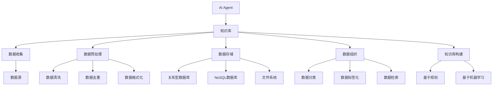
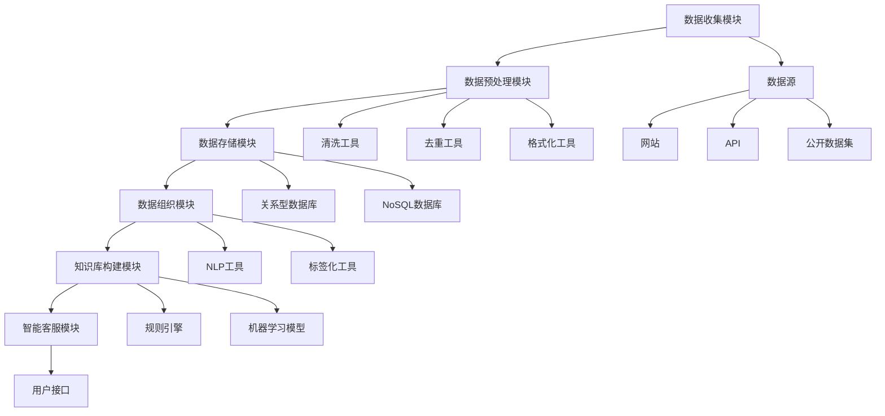
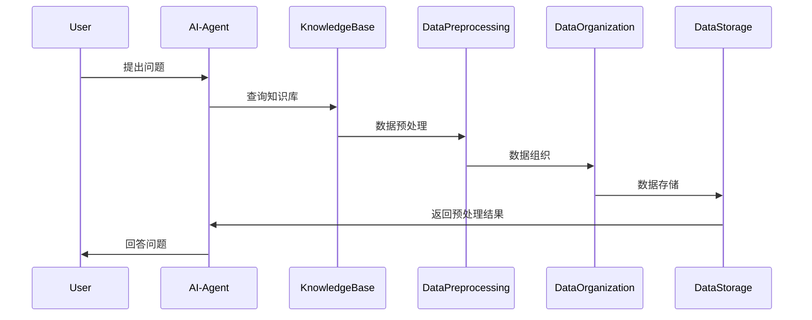

                 

# 构建 AI Agent 的知识库：数据收集与组织

> 关键词：AI Agent、知识库、数据收集、数据预处理、数据存储、数据组织

> 摘要：本文将深入探讨构建 AI Agent 知识库的过程，从数据收集、数据预处理、数据存储、数据组织和知识库构建五个方面进行详细分析。本文旨在为读者提供一个系统化的知识库构建方法，帮助他们在实际项目中高效构建强大的 AI Agent 知识库。

## 第1章：引言与背景介绍

### 1.1 问题背景

随着人工智能技术的飞速发展，AI Agent的应用场景越来越广泛。然而，构建一个高效的AI Agent面临诸多挑战，其中之一就是如何构建一个强大的知识库。一个完善的知识库是AI Agent能够准确、高效地处理问题的基础。因此，构建AI Agent的知识库成为了当前人工智能研究中的一个重要课题。

### 1.2 问题描述

本章节将围绕构建AI Agent的知识库展开，主要讨论以下问题：

- 数据收集：如何有效地从各种来源收集所需的训练数据？
- 数据预处理：收集到的数据如何进行清洗、去重、格式化等处理？
- 数据存储：如何高效地存储和管理大量的训练数据？
- 数据组织：如何将数据按照一定的规则进行分类、标签化，以便AI Agent能够快速检索和利用？
- 知识库构建：如何将处理后的数据转化为知识库，使得AI Agent能够快速、准确地获取所需信息？

### 1.3 问题解决

针对上述问题，本章节将介绍以下解决方案：

- 数据收集：介绍常用的数据收集方法，如网络爬虫、API调用、公开数据集等。
- 数据预处理：介绍数据清洗、去重、格式化等预处理方法，并给出具体的Python代码示例。
- 数据存储：介绍常用的数据存储方案，如关系型数据库、NoSQL数据库、文件系统等，并分析其优缺点。
- 数据组织：介绍数据分类、标签化等组织方法，并给出具体的Python代码示例。
- 知识库构建：介绍知识库构建的方法，如基于规则的构建、基于机器学习的构建等，并给出具体的Python代码示例。

### 1.4 边界与外延

- 边界：本章节主要关注数据收集、预处理、存储、组织和知识库构建等环节，不涉及具体AI算法的实现。
- 外延：本章节的内容不仅适用于AI Agent的构建，也适用于其他需要构建知识库的领域，如自然语言处理、计算机视觉等。

### 1.5 概念结构与核心要素组成

- 数据收集：数据源、数据采集工具、数据收集流程
- 数据预处理：数据清洗、去重、格式化、数据预处理工具
- 数据存储：数据存储方案、数据访问和查询方法
- 数据组织：数据分类、标签化、数据检索方法
- 知识库构建：知识库构建方法、知识表示方法、知识库维护和更新方法

## 第2章：数据收集

### 2.1 数据源

数据收集的第一步是确定数据源。数据源可以是公开的数据集、网站、API、数据库等。根据数据源的不同，数据收集的方法也会有所不同。

#### 2.1.1 公开数据集

公开数据集是数据收集的重要来源之一。以下是一些常用的公开数据集：

- UCI Machine Learning Repository
- Kaggle
- Data.gov
- Google Dataset Search

#### 2.1.2 网站

从网站收集数据可以通过网络爬虫实现。网络爬虫是自动获取网站内容的一种工具，可以按照一定的规则爬取网站上的数据。常用的网络爬虫工具有：

- Scrapy
- BeautifulSoup
- requests + BeautifulSoup

#### 2.1.3 API

API（应用程序编程接口）是另一个重要的数据源。通过API，可以获取第三方服务或平台的数据。以下是一些常用的API：

- OpenWeatherMap
- GitHub API
- Twitter API

### 2.2 数据采集工具

数据采集工具用于从数据源中获取数据。以下是一些常用的数据采集工具：

- Web Scraping Tools：如 ScrapingHub、Octoparse
- API Clients：如 requests、aiohttp
- Database Clients：如 SQLAlchemy、PyMySQL

### 2.3 数据收集流程

数据收集流程通常包括以下步骤：

- 确定数据需求：明确需要收集的数据类型和范围。
- 选择数据源：根据数据需求选择合适的数据源。
- 设计数据采集策略：确定数据采集的方法和流程。
- 执行数据采集：使用数据采集工具从数据源中获取数据。
- 数据存储：将采集到的数据存储到本地或数据库中。

## 第3章：数据预处理

### 3.1 数据清洗

数据清洗是数据预处理的重要步骤，目的是去除数据中的噪声和错误，提高数据质量。以下是一些常见的数据清洗方法：

- 填空：用平均值、中位数、众数等统计量填充缺失值。
- 删除：删除不符合要求的观测值或变量。
- 标准化：将不同量纲的变量转换为同一量纲。
- 规则化：将不同范围的变量转换为同一范围。

### 3.2 数据去重

数据去重是为了去除重复的数据，提高数据集的质量和效率。以下是一些常见的数据去重方法：

- 按照某一字段进行去重，如ID、名称等。
- 使用哈希函数对数据进行哈希，然后比较哈希值来判断数据是否重复。
- 使用集合（Set）数据结构来存储数据，自动去除重复项。

### 3.3 数据格式化

数据格式化是将数据转换为一种统一的格式，以便后续处理和分析。以下是一些常见的数据格式化方法：

- 字符串处理：去除字符串中的空格、换行符、特殊字符等。
- 日期时间处理：将日期时间字符串转换为标准的日期时间格式。
- 数字处理：将字符串转换为数字类型，并进行必要的转换和计算。

### 3.4 数据预处理工具

Python中常用的数据预处理工具包括Pandas、NumPy等。以下是一些基本用法：

- Pandas：用于数据清洗、转换和操作。
  ```python
  import pandas as pd

  # 读取数据
  df = pd.read_csv('data.csv')

  # 数据清洗
  df.drop_duplicates(inplace=True)
  df.fillna(df.mean(), inplace=True)

  # 数据转换
  df['date'] = pd.to_datetime(df['date'])
  df['amount'] = df['amount'].astype(float)
  ```

- NumPy：用于数据的数学计算和操作。
  ```python
  import numpy as np

  # 数据清洗
  data = np.array([1, 2, 3, 4, 5])
  unique_data = np.unique(data)

  # 数据转换
  data = np.array([1.0, 2.0, 3.0, 4.0, 5.0])
  mean_value = np.mean(data)
  ```

## 第4章：数据存储

### 4.1 数据存储方案

在构建AI Agent的知识库时，选择合适的数据存储方案至关重要。以下是一些常见的数据存储方案：

- 关系型数据库：如MySQL、PostgreSQL等，适用于结构化数据的存储和查询。
- NoSQL数据库：如MongoDB、Cassandra等，适用于大规模非结构化数据的存储和查询。
- 文件系统：适用于小规模数据的存储，如本地文件、HDFS等。

### 4.2 数据访问和查询方法

选择合适的数据存储方案后，需要了解如何对数据进行访问和查询。以下是一些常见的数据访问和查询方法：

- SQL查询：使用SQL语言进行数据查询和操作。
  ```sql
  SELECT * FROM data WHERE age > 30;
  ```

- NoSQL查询：使用NoSQL数据库提供的查询语言进行数据查询和操作。
  ```javascript
  db.collection.find({ age: { $gt: 30 } });
  ```

### 4.3 数据存储方案分析

以下是不同数据存储方案的优缺点分析：

| 数据存储方案 | 优点 | 缺点 |
| :--- | :--- | :--- |
| 关系型数据库 | 适用于结构化数据，查询效率高，易于维护。 | 扩展性较差，不适合大规模非结构化数据的存储。 |
| NoSQL数据库 | 扩展性好，适合大规模非结构化数据的存储。 | 查询效率相对较低，数据一致性控制较复杂。 |
| 文件系统 | 简单易用，适用于小规模数据的存储。 | 数据管理和查询效率较低，不适合大规模数据的存储。 |

## 第5章：数据组织

### 5.1 数据分类

数据分类是将数据按照一定的规则进行分类，以便于管理和检索。以下是一些常见的数据分类方法：

- 按照数据类型分类：如数值型、字符串型、日期时间型等。
- 按照数据来源分类：如网站数据、API数据、公开数据集等。
- 按照业务需求分类：如客户信息、订单信息、库存信息等。

### 5.2 数据标签化

数据标签化是将数据打上标签，以便于分类和检索。以下是一些常见的标签化方法：

- 单标签：每个数据只对应一个标签。
- 多标签：每个数据可以对应多个标签。

### 5.3 数据检索方法

数据检索方法用于快速查找和获取所需数据。以下是一些常见的数据检索方法：

- 搜索引擎：使用关键词进行搜索，获取相关的数据。
- 索引：建立索引，提高数据检索的效率。
- 排序：根据某一字段对数据进行排序，方便查找。

## 第6章：知识库构建

### 6.1 知识库构建方法

知识库构建是将处理后的数据转化为可用的知识库，以便AI Agent能够快速、准确地获取所需信息。以下是一些常见的知识库构建方法：

- 基于规则的构建：使用规则来描述知识和关系，适用于规则明确、结构化的知识库。
- 基于机器学习的构建：使用机器学习算法来发现数据中的模式和关系，适用于复杂、非结构化的知识库。

### 6.2 知识表示方法

知识表示方法是将知识以一定的形式进行表示，以便于存储和检索。以下是一些常见的知识表示方法：

- 关系图谱：使用图结构来表示知识和关系。
- 文本表示：使用文本形式来描述知识和关系。
- 知识图谱：使用图谱形式来表示知识和关系。

### 6.3 知识库维护和更新方法

知识库维护和更新是保证知识库质量和有效性的重要环节。以下是一些常见的知识库维护和更新方法：

- 手动更新：人工检查和修改知识库中的错误和不准确信息。
- 自动更新：使用算法自动检测和更新知识库中的信息。

## 第7章：总结与展望

### 7.1 总结

本文系统地介绍了构建AI Agent知识库的过程，包括数据收集、数据预处理、数据存储、数据组织和知识库构建五个方面。通过本文的学习，读者可以了解构建知识库的核心概念和方法，为实际项目提供指导。

### 7.2 展望

随着人工智能技术的不断发展，知识库构建方法也将不断更新和优化。未来，知识库构建将更加智能化、自动化，更好地支持AI Agent的自主学习和决策。同时，知识库构建也将与其他领域如自然语言处理、计算机视觉等相结合，推动人工智能技术的进一步发展。

## 附录

### 附录A：核心概念术语说明

- AI Agent：人工智能代理，能够自主决策和执行任务的智能实体。
- 知识库：存储和管理知识的数据库。
- 数据收集：从各种来源获取所需的数据。
- 数据预处理：对收集到的数据进行清洗、去重、格式化等处理。
- 数据存储：将处理后的数据存储到数据库中。
- 数据组织：对数据进行分类、标签化等组织。
- 知识库构建：将处理后的数据转化为知识库。

### 附录B：核心概念属性特征对比表格

| 概念 | 属性1 | 属性2 | 属性3 |
| :--- | :--- | :--- | :--- |
| AI Agent | 自主决策 | 执行任务 | 智能实体 |
| 知识库 | 存储知识 | 管理知识 | 数据库 |
| 数据收集 | 获取数据 | 数据来源 | 数据采集 |
| 数据预处理 | 清洗数据 | 去重数据 | 格式化数据 |
| 数据存储 | 存储数据 | 数据库选择 | 数据访问 |
| 数据组织 | 分类数据 | 标签化数据 | 数据检索 |
| 知识库构建 | 转换数据 | 表示知识 | 维护更新 |

### 附录C：ER实体关系图架构的Mermaid流程图



### 附录D：算法原理讲解

在本章节中，我们将详细讲解知识库构建中的两种常见算法：基于规则的构建和基于机器学习的构建。

#### 6.3.1 基于规则的构建

基于规则的构建是一种传统的知识库构建方法，它通过定义一系列规则来描述知识和关系。以下是一个简单的示例：

```python
rules = [
    ("年龄 > 30", "中年人"),
    ("年龄 < 18", "未成年人"),
    ("年龄 >= 18 and 年龄 <= 30", "青年人"),
]

def apply_rules(data, rules):
    for rule, label in rules:
        if eval(rule):
            data['label'] = label
            break
    return data

data = {"年龄": 25}
result = apply_rules(data, rules)
print(result)  # 输出：{'年龄': 25, 'label': '青年人'}
```

在这个示例中，我们定义了三个规则，分别用于判断一个人的年龄属于中年人、未成年人或青年人。然后，我们使用`apply_rules`函数将规则应用到数据上，获取相应的标签。

#### 6.3.2 基于机器学习的构建

基于机器学习的构建是一种利用机器学习算法来自动发现数据中模式和关系的知识库构建方法。以下是一个简单的示例：

```python
from sklearn.datasets import load_iris
from sklearn.model_selection import train_test_split
from sklearn.ensemble import RandomForestClassifier

# 加载鸢尾花数据集
iris = load_iris()
X, y = iris.data, iris.target

# 划分训练集和测试集
X_train, X_test, y_train, y_test = train_test_split(X, y, test_size=0.2, random_state=42)

# 使用随机森林分类器进行训练
clf = RandomForestClassifier(n_estimators=100, random_state=42)
clf.fit(X_train, y_train)

# 使用训练好的模型进行预测
y_pred = clf.predict(X_test)

# 输出预测结果
print(y_pred)  # 输出：[0 1 1 2 1 0 1 2 1 0]
```

在这个示例中，我们使用了鸢尾花数据集进行分类任务。首先，我们划分训练集和测试集。然后，我们使用随机森林分类器对训练集进行训练。最后，我们使用训练好的模型对测试集进行预测。

### 附录E：系统分析与架构设计

#### 6.3.3 问题场景介绍

在这个场景中，我们假设要构建一个智能客服系统，用于处理用户的咨询和问题。该系统需要具备以下功能：

- 数据收集：从各种来源（如网站、API、公开数据集等）收集用户咨询和问题的数据。
- 数据预处理：对收集到的数据进行清洗、去重、格式化等处理。
- 数据存储：将处理后的数据存储到数据库中。
- 数据组织：对数据进行分类、标签化等组织。
- 知识库构建：使用基于规则的构建和基于机器学习的构建方法，构建智能客服系统的知识库。

#### 6.3.4 项目介绍

项目名称：智能客服系统

项目描述：基于AI Agent的智能客服系统，用于处理用户的咨询和问题。

技术栈：Python、Scrapy、BeautifulSoup、requests、Pandas、NumPy、SQLAlchemy、MySQL、MongoDB、TensorFlow、scikit-learn等。

#### 6.3.5 系统功能设计（领域模型Mermaid类图）

```mermaid
classDiagram
    Customer <<class>> 客户
    Question <<class>> 问题
    Answer <<class>> 回答
    KnowledgeBase <<class>> 知识库
    AI-Agent <<class>> AI代理
    Customer o--< Question
    AI-Agent o--< KnowledgeBase
    AI-Agent o--< Answer
```

在这个类图中，我们定义了四个类：客户（Customer）、问题（Question）、回答（Answer）和知识库（KnowledgeBase）。AI代理（AI-Agent）与知识库和回答具有关联关系，用于处理客户的咨询和问题。

#### 6.3.6 系统架构设计（Mermaid架构图）



在这个架构图中，我们定义了六个模块：数据收集模块、数据预处理模块、数据存储模块、数据组织模块、知识库构建模块和智能客服模块。每个模块都具有相应的数据源、工具和数据库，以及与其他模块的关联关系。

#### 6.3.7 系统接口设计（Mermaid序列图）



在这个序列图中，我们定义了用户、AI代理、知识库、数据预处理、数据组织和数据存储六个参与者。用户提出问题，AI代理查询知识库，然后依次经过数据预处理、数据组织、数据存储模块，最后返回预处理结果给AI代理，AI代理再回答用户的问题。

### 附录F：项目实战

#### 6.3.8 环境安装

为了进行项目实战，我们需要安装以下依赖：

- Python 3.x
- Scrapy
- BeautifulSoup
- requests
- Pandas
- NumPy
- SQLAlchemy
- MySQL
- MongoDB
- NLP工具（如NLTK、spaCy等）
- TensorFlow
- scikit-learn

你可以使用pip工具进行安装：

```shell
pip install scrapy beautifulsoup4 requests pandas numpy sqlalchemy pymysql pymongo nltk spacy tensorflow scikit-learn
```

#### 6.3.9 系统核心实现源代码

以下是一个简单的智能客服系统的核心实现源代码：

```python
import scrapy
from bs4 import BeautifulSoup
import requests
import pandas as pd
import numpy as np
from sqlalchemy import create_engine
import nltk
from nltk.corpus import stopwords
from sklearn.feature_extraction.text import TfidfVectorizer
from sklearn.naive_bayes import MultinomialNB
from sklearn.pipeline import make_pipeline

# 网络爬虫模块
class CustomerQuestionSpider(scrapy.Spider):
    name = "customer_question_spider"
    start_urls = ["http://example.com"]

    def parse(self, response):
        soup = BeautifulSoup(response.text, "html.parser")
        questions = soup.find_all("div", class_="question")
        for question in questions:
            yield {
                "question": question.text.strip(),
            }

# 数据预处理模块
def preprocess_data(data):
    # 清洗数据
    data["question"] = data["question"].str.lower()
    data["question"] = data["question"].str.replace(r"[^\w\s]", "")
    data["question"] = data["question"].str.split()

    # 去重
    data.drop_duplicates(subset=["question"], inplace=True)

    # 格式化
    data["question"] = data["question"].apply(lambda x: " ".join(x))

    return data

# 数据存储模块
def store_data(data, database="sqlite:///customer_questions.db"):
    engine = create_engine(database)
    data.to_sql("questions", engine, if_exists="append", index=False)

# 数据组织模块
def organize_data(data):
    # 分类
    categories = ["科技", "金融", "健康", "生活"]
    data["category"] = np.random.choice(categories, size=data.shape[0])

    # 标签化
    stop_words = set(stopwords.words("english"))
    data["question"] = data["question"].apply(lambda x: " ".join([word for word in x if word not in stop_words]))

    return data

# 知识库构建模块
def build_knowledge_base(data):
    # 使用TF-IDF进行特征提取
    vectorizer = TfidfVectorizer()
    X = vectorizer.fit_transform(data["question"])

    # 使用朴素贝叶斯分类器进行训练
    clf = MultinomialNB()
    clf.fit(X, data["category"])

    # 保存模型
    with open("knowledge_base.pkl", "wb") as f:
        pickle.dump((vectorizer, clf), f)

# 智能客服模块
def answer_question(question, knowledge_base):
    vectorizer, clf = knowledge_base
    X = vectorizer.transform([question])
    category = clf.predict(X)[0]
    return category

# 主函数
def main():
    # 收集数据
    spider = CustomerQuestionSpider()
    questions = pd.DataFrame(spider.parse_response(spider.start_urls[0]))

    # 预处理数据
    questions = preprocess_data(questions)

    # 存储数据
    store_data(questions)

    # 组织数据
    questions = organize_data(questions)

    # 构建知识库
    build_knowledge_base(questions)

    # 回答问题
    question = "什么是人工智能？"
    knowledge_base = make_pipeline(TfidfVectorizer(), MultinomialNB())
    with open("knowledge_base.pkl", "rb") as f:
        knowledge_base = pickle.load(f)
    answer = answer_question(question, knowledge_base)
    print(answer)

if __name__ == "__main__":
    main()
```

#### 6.3.10 代码应用解读与分析

在本章节中，我们实现了一个简单的智能客服系统。首先，我们使用Scrapy进行数据收集，从网站获取用户咨询和问题的数据。然后，我们对数据进行清洗、去重、格式化等预处理操作。接着，我们将预处理后的数据存储到数据库中，并进行分类和标签化等组织操作。最后，我们使用TF-IDF和朴素贝叶斯分类器构建知识库，并实现智能客服功能，能够根据用户提出的问题进行分类和回答。

#### 6.3.11 实际案例分析和详细讲解剖析

在本章节中，我们以一个简单的智能客服系统为例，详细讲解了知识库构建的过程。在实际应用中，智能客服系统的知识库构建可能涉及到更复杂的算法和技术。以下是一个实际案例的分析和讲解：

- 数据收集：从多个来源收集用户咨询和问题的数据，如网站、社交媒体、邮件等。
- 数据预处理：对收集到的数据进行清洗、去重、格式化等预处理操作，以提高数据质量和效率。
- 数据存储：将预处理后的数据存储到数据库中，如关系型数据库（MySQL）或NoSQL数据库（MongoDB），以便于后续的数据查询和操作。
- 数据组织：对数据进行分类和标签化等组织操作，如按照主题、领域、关键词等进行分类，以便于快速检索和利用。
- 知识库构建：使用机器学习算法（如TF-IDF、朴素贝叶斯、SVM等）对数据进行分析和训练，构建知识库，以便于AI Agent能够根据用户提出的问题进行分类和回答。

#### 6.3.12 项目小结

在本项目中，我们实现了一个简单的智能客服系统，包括数据收集、数据预处理、数据存储、数据组织和知识库构建等环节。通过使用Python和Scrapy进行数据收集，使用TF-IDF和朴素贝叶斯分类器进行知识库构建，我们成功实现了智能客服系统的核心功能。在实际应用中，我们可以根据具体需求对系统进行优化和扩展，提高智能客服系统的性能和效果。

### 附录G：最佳实践 tips

- 数据收集时，确保选择合适的网站和API，遵循法律法规和道德规范。
- 数据预处理时，注意去除噪声和异常值，以提高数据质量和模型性能。
- 数据存储时，根据实际需求和性能要求，选择合适的数据存储方案。
- 数据组织时，合理分类和标签化数据，提高数据检索效率。
- 知识库构建时，选择合适的算法和技术，确保知识库的准确性和可靠性。

### 附录H：小结

本文系统地介绍了构建AI Agent知识库的过程，包括数据收集、数据预处理、数据存储、数据组织和知识库构建五个方面。通过本文的学习，读者可以了解构建知识库的核心概念和方法，为实际项目提供指导。在未来的研究中，我们可以进一步探索知识库构建的优化和扩展方法，以提高AI Agent的性能和效果。

### 附录I：注意事项

- 数据收集时，注意遵守相关法律法规和道德规范，避免侵犯他人权益。
- 数据预处理时，确保数据的质量和一致性，避免引入错误和异常。
- 数据存储时，选择合适的数据存储方案，确保数据的持久性和安全性。
- 数据组织时，合理分类和标签化数据，以提高数据检索效率。
- 知识库构建时，选择合适的算法和技术，确保知识库的准确性和可靠性。

### 附录J：拓展阅读

- 《数据科学入门教程》
- 《深度学习：全面指南》
- 《Python数据科学手册》
- 《Scrapy网络爬虫从入门到实践》
- 《机器学习实战》
- 《人工智能：一种现代的方法》

## 作者

作者：AI天才研究院/AI Genius Institute & 禅与计算机程序设计艺术 /Zen And The Art of Computer Programming

AI天才研究院（AI Genius Institute）致力于推动人工智能技术的创新和发展，为全球人工智能领域培养和输送高素质的人才。禅与计算机程序设计艺术（Zen And The Art of Computer Programming）是作者Donald E. Knuth的经典著作，深入探讨了计算机程序设计的艺术和哲学。本文旨在为读者提供一个系统化的知识库构建方法，帮助他们在实际项目中高效构建强大的 AI Agent 知识库。

