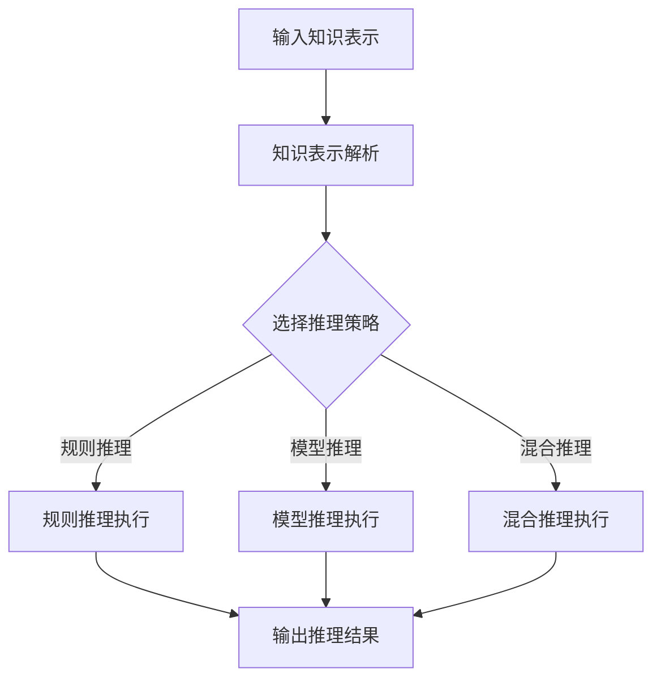
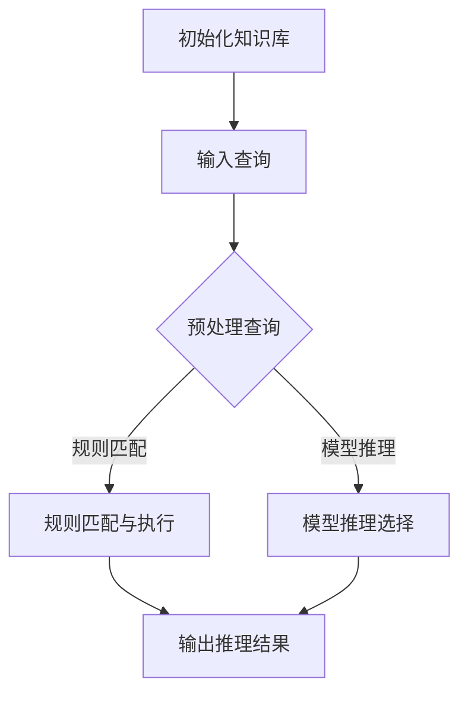
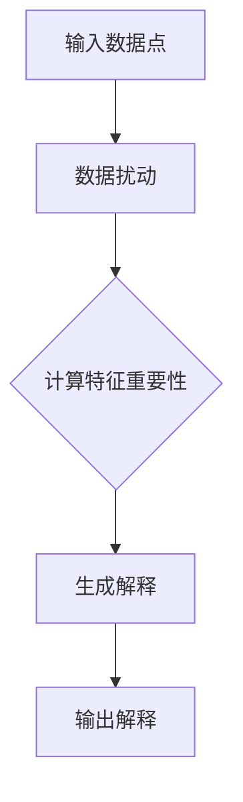
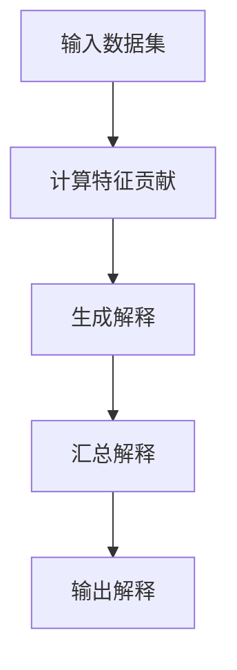
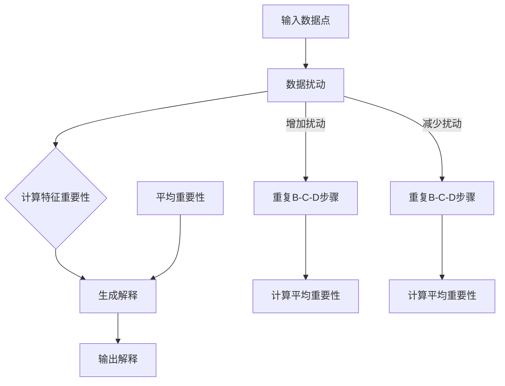
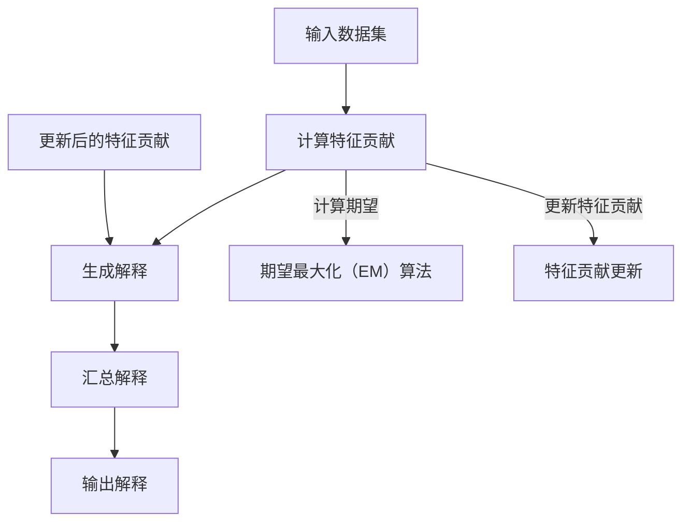
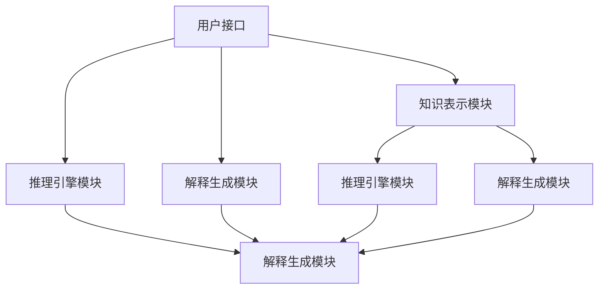

                 

### 1.1.1 问题背景

在当今快速发展的科技时代，人工智能（AI）技术已经成为推动社会进步的重要力量。从自动驾驶、智能客服到医疗诊断，AI在各个领域的应用日益广泛。而AI Agent，作为AI系统中的核心组件，正在逐渐成为人工智能研究与应用的热点。

AI Agent，也被称作智能体，是一种能够自主感知环境、采取行动并达成目标的实体。它通过模拟人类的思维方式，运用知识推理来解决问题。知识推理是AI Agent的核心能力之一，它涉及到如何从已知信息中推导出新信息，从而指导AI Agent的决策和行动。

随着AI Agent应用的普及，人们对AI系统的可解释性需求也越来越强烈。可解释性是指AI系统在做出决策或预测时，能够提供合理的解释和依据，使人们能够理解系统的行为。对于AI Agent而言，知识推理的可解释性尤为重要。因为知识推理是AI Agent决策过程的核心，只有当人们能够理解AI Agent如何推导出某个结论时，才能信任并接受AI Agent的决策。

目前，AI Agent在知识推理方面已经取得了显著的进展。然而，如何提高知识推理的可解释性，使得AI Agent的决策过程更加透明和可靠，仍然是一个亟待解决的问题。特别是对于复杂的应用场景，AI Agent的知识推理过程往往涉及大量的隐式规则和复杂的推理链条，这使得推理过程变得难以理解。因此，构建一个知识推理可解释性框架，对于推动AI技术的发展具有重要意义。

### 1.1.2 问题描述

AI Agent为何需要知识推理？

AI Agent作为智能系统的一部分，其核心目标是通过自主学习和决策来完成任务。在实现这一目标的过程中，知识推理起着至关重要的作用。知识推理是指基于已知事实和规则，通过逻辑推理得出新结论的过程。AI Agent需要知识推理来完成以下任务：

1. **问题求解**：在复杂环境下，AI Agent需要能够识别问题并寻找解决方案。知识推理可以帮助AI Agent从已有知识库中提取相关信息，并通过推理过程找出问题的解决方案。
2. **决策制定**：AI Agent在执行任务时需要做出各种决策，如选择最优路径、判断情境变化等。知识推理可以基于AI Agent的知识库，通过逻辑推理得出最佳决策。
3. **自适应能力**：在动态变化的环境中，AI Agent需要能够适应新的情况。知识推理可以帮助AI Agent在遇到新问题时，通过推理过程快速适应并调整策略。

知识推理的可解释性为何重要？

知识推理的可解释性对于AI Agent的应用至关重要。以下是其重要性体现在几个方面：

1. **信任建立**：只有当人们能够理解AI Agent的决策过程，才能信任并接受其决策。缺乏可解释性的AI Agent可能会被认为是“黑盒”，使得其决策过程变得不可信。
2. **透明性**：知识推理的可解释性使得AI Agent的决策过程更加透明。这有助于研究人员和开发者更好地理解AI Agent的行为，从而进行优化和改进。
3. **监管与合规**：在许多领域，如金融、医疗等，AI Agent的决策需要受到严格的监管。知识推理的可解释性可以提供监管所需的透明度，确保AI Agent的决策符合法律法规。
4. **用户互动**：知识推理的可解释性有助于用户与AI Agent进行有效互动。用户可以理解AI Agent的推理过程，从而更好地使用和适应AI Agent提供的功能。

### 1.1.3 问题解决

研究现状与分析

目前，AI Agent的知识推理可解释性研究已经取得了一些进展。研究者们提出了多种方法来提高知识推理的可解释性，包括：

1. **可视化技术**：通过图形化方式展示推理过程，使得用户能够直观地理解AI Agent的推理步骤。
2. **解释性算法**：采用特定算法来生成解释，如LIME（Local Interpretable Model-agnostic Explanations）和SHAP（SHapley Additive exPlanations）。
3. **知识表示**：使用更为直观和易于解释的知识表示方法，如基于规则的推理系统。

然而，现有的研究仍然存在一些挑战。例如，如何确保解释的准确性和一致性，如何在保持可解释性的同时提高推理效率等。此外，针对不同应用场景，如何设计和实现具有良好可解释性的知识推理框架，也是一个亟待解决的问题。

构建知识推理可解释性框架的必要性

构建一个知识推理可解释性框架的必要性体现在以下几个方面：

1. **统一的框架设计**：现有的解释性方法往往针对特定场景或算法进行优化，缺乏统一的框架。一个综合性的知识推理可解释性框架可以提供一种通用的解决方案，使得不同方法能够相互借鉴和补充。
2. **跨领域应用**：不同应用领域的AI Agent面临的知识推理问题有所不同，但它们在可解释性方面的需求是相似的。一个通用的知识推理可解释性框架可以适应多种应用场景，提高AI Agent的普适性。
3. **研究推动**：构建知识推理可解释性框架可以推动相关领域的研究。例如，在知识表示、推理算法、解释性方法等方面，都可以通过框架的设计和实现，提出新的问题和解决方案。
4. **用户体验**：提高知识推理的可解释性可以增强用户对AI Agent的信任感和满意度，从而提高用户体验。

### 1.1.4 边界与外延

可解释性的定义

可解释性（Explainability）是指AI系统在做出决策或预测时，能够提供合理的解释和依据，使得人类用户能够理解系统的行为。在AI Agent的知识推理中，可解释性意味着推理过程和结论可以被用户理解和验证。

知识推理与AI Agent的关系

知识推理是AI Agent的核心能力之一，它涉及到如何从已知信息中推导出新信息，从而指导AI Agent的决策和行动。知识推理与AI Agent的关系可以理解为：

1. **知识推理是AI Agent的基础**：AI Agent需要通过知识推理来理解环境、识别问题和制定决策。
2. **知识推理影响AI Agent的性能**：知识推理的可解释性直接影响AI Agent的可靠性和用户信任度。一个具有良好可解释性的知识推理系统能够提高AI Agent的性能和实用性。
3. **知识推理与AI Agent的互动**：AI Agent在执行任务时，需要不断地进行知识推理，并根据推理结果调整自身的行为。知识推理的可解释性有助于AI Agent与用户进行有效互动。

### 1.1.5 概念结构与核心要素组成

AI Agent的定义

AI Agent是一种能够自主感知环境、采取行动并达成目标的实体。它通过模拟人类的思维方式，运用知识推理来解决问题。AI Agent通常具有以下特点：

1. **自主性**：能够自主感知环境，无需人工干预。
2. **适应性**：能够根据环境变化调整自身行为。
3. **目标导向**：具有明确的目标，通过知识推理来达成目标。

知识推理的概念

知识推理是指基于已知事实和规则，通过逻辑推理得出新结论的过程。知识推理包括以下几个方面：

1. **知识表示**：将已知信息以结构化的形式表示，如知识图谱、本体论等。
2. **推理策略**：选择合适的推理方法，如基于规则的推理、基于模型的推理等。
3. **知识融合**：将多个知识源的信息进行整合，以提高推理的准确性和全面性。

可解释性的核心要素

知识推理的可解释性涉及以下几个核心要素：

1. **透明性**：推理过程和结论能够被用户直观地理解。
2. **评估性**：用户能够对推理过程和结论进行评估和验证。
3. **可理解性**：推理过程和结论对于非专业人士也能被理解。

### 1.1.6 总结

构建AI Agent的知识推理可解释性框架是当前AI领域面临的一个重要课题。通过深入研究知识推理和可解释性的核心概念、原理和算法，我们可以设计出一种通用且有效的知识推理可解释性框架，从而推动AI技术的发展和应用。在接下来的章节中，我们将详细探讨知识推理和可解释性的原理、算法以及框架的设计和实现。

---

#### 2.1.1 核心概念原理

知识推理（Knowledge Reasoning）和可解释性（Explainability）是构建AI Agent的核心概念，它们分别代表了AI系统如何处理信息和如何让用户理解系统行为的能力。

**知识推理**

知识推理是指基于已知的事实、规则和关系，通过逻辑推理、归纳、演绎等方法来发现新知识或验证已有知识的过程。在AI Agent中，知识推理是使系统能够理解并解决复杂问题的关键能力。知识推理通常涉及以下几个步骤：

1. **知识表示**：将知识结构化为计算机可处理的形式，如本体论（Ontology）和知识图谱（Knowledge Graph）。
2. **推理策略**：选择合适的推理方法，包括基于规则的推理（Rule-Based Reasoning）、基于模型的推理（Model-Based Reasoning）和混合推理（Hybrid Reasoning）等。
3. **知识融合**：整合来自多个知识源的信息，以增强推理的准确性和全面性。

**可解释性**

可解释性是指AI系统在做出决策或预测时，能够提供合理的解释和依据，使得人类用户能够理解系统的行为。在AI Agent中，可解释性是建立用户信任和接受系统决策的重要保障。可解释性涉及以下几个关键要素：

1. **透明性**：系统的推理过程和决策逻辑对用户是可见和可理解的。
2. **评估性**：用户可以评估系统的推理过程和结论的合理性和准确性。
3. **可理解性**：系统的推理过程和结论对于非技术背景的用户也是可接受的。

**知识推理与可解释性的关系**

知识推理和可解释性在AI Agent中是相辅相成的。知识推理提供了AI系统解决复杂问题的能力，而可解释性确保了系统行为的透明性和可信度。以下是两者之间的具体关系：

1. **互为补充**：知识推理侧重于AI系统的决策过程和逻辑，可解释性侧重于让用户理解这些决策过程和逻辑。
2. **共同目标**：知识推理和可解释性的共同目标是提升AI系统的实用性和用户接受度。
3. **挑战与机遇**：如何在保持高效推理的同时提高可解释性是一个重大挑战。然而，这同时也为研究者和开发者提供了创新的机会。

通过理解知识推理和可解释性的核心概念原理，我们可以为构建AI Agent的知识推理可解释性框架奠定坚实的基础。在接下来的章节中，我们将进一步探讨这些概念在实际应用中的特征和对比。

#### 2.1.2 概念属性特征对比表格

在探讨知识推理和可解释性的核心概念后，我们需要对这两个概念的关键属性进行详细对比。以下是一个对比表格，列出了知识推理和可解释性在特征1、特征2和特征3方面的具体差异。

| 概念     | 特征1       | 特征2           | 特征3         |
|----------|-------------|-----------------|---------------|
| 知识推理 | 过程性      | 系统性          | 目标性        |
| 可解释性 | 透明性      | 评估性          | 可理解性      |

**特征1：过程性与透明性**

知识推理是一个动态的过程，它涉及到从已知信息出发，通过一系列逻辑步骤推导出新结论。因此，知识推理具有显著的过程性，每个推理步骤都是连贯且逻辑严密的。

相比之下，可解释性更强调系统的透明性，即推理过程和决策逻辑对于用户是可见和可理解的。这种透明性使得用户能够跟踪AI Agent的推理路径，从而更好地理解系统行为。

**特征2：系统性与评估性**

知识推理是一个系统性的过程，它依赖于一个完整的知识库和一套推理策略。系统性的知识推理可以处理复杂的问题，并在多个层面进行推理，以确保推理的全面性和准确性。

可解释性则强调评估性，它确保用户能够对AI Agent的推理过程和结论进行评估和验证。评估性使得用户可以检查推理的合理性和准确性，从而增加对系统决策的信任度。

**特征3：目标性与可理解性**

知识推理具有明确的目标性，即通过推理过程达成特定的目标或解决特定的问题。目标性使得知识推理可以针对具体问题进行优化，以提高推理效率和准确性。

可解释性则强调可理解性，它要求推理过程和结论对于非技术背景的用户也是可接受的。可理解性确保AI Agent的推理结果不仅对技术专家有意义，也能为普通用户所理解和接受。

通过上述对比，我们可以看到知识推理和可解释性在属性特征上既有相似之处，也有显著差异。理解这些差异有助于我们更好地设计AI Agent的知识推理可解释性框架，从而提高AI系统的实用性和用户满意度。

#### 2.1.3 ER实体关系图架构

为了更好地理解知识推理和可解释性在AI Agent中的作用，我们可以通过ER（Entity-Relationship）实体关系图来展示它们之间的关系。ER图能够直观地展示不同实体及其相互关系，帮助我们清晰地理解系统架构。

以下是一个ER实体关系图的mermaid表示：

```mermaid
erDiagram
    AI-Agent ||--o Knowledge_Reasoning : 推理
    AI-Agent ||--o Explanation_Generation : 可解释性
    Knowledge_Reasoning ||--|{ Data_Source } : 数据源
    Explanation_Generation ||--|{ Explanation_Module } : 解释模块
    AI-Agent ||--o User_Interface : 用户接口
```

**AI-Agent与Knowledge_Reasoning的关系**

- **推理**：AI-Agent通过Knowledge_Reasoning模块进行推理。这个模块负责接收输入数据，运用逻辑推理策略，从知识库中提取相关信息，并生成推理结果。

**AI-Agent与Explanation_Generation的关系**

- **可解释性**：AI-Agent通过Explanation_Generation模块生成可解释性信息。这个模块负责对推理过程和结果进行解释，使得用户能够理解AI-Agent的决策过程。

**Knowledge_Reasoning与Data_Source的关系**

- **数据源**：Knowledge_Reasoning依赖于多个数据源。这些数据源包括内部知识库、外部数据集等，为推理过程提供必要的信息。

**Explanation_Generation与Explanation_Module的关系**

- **解释模块**：Explanation_Generation模块的核心是Explanation_Module，它负责生成具体的解释内容。这些解释内容可以是文本、图表等形式，以帮助用户理解推理过程和结果。

**AI-Agent与User_Interface的关系**

- **用户接口**：AI-Agent通过User_Interface与用户进行交互。用户接口负责接收用户输入，展示解释信息，并接收用户反馈，以优化系统的使用体验。

通过ER实体关系图，我们可以清晰地看到知识推理和可解释性在AI-Agent中的作用及其相互关系。这种关系有助于我们理解系统的整体架构，为后续设计知识推理可解释性框架提供了理论支持。

#### 3.1.1 知识推理原理

知识推理是AI Agent的核心能力之一，它依赖于一系列基本原理和概念来实现从已知信息到新知识的推导。以下是知识推理的基本原理：

**知识表示**

知识表示是知识推理的基础，它涉及到如何将现实世界中的信息抽象成计算机可以处理的数据结构。常用的知识表示方法包括：

1. **本体论（Ontology）**：本体论是一种形式化的知识表示方法，用于描述概念、属性和它们之间的关系。通过本体论，AI Agent可以建立统一的语义模型，从而实现跨领域的信息整合和推理。

2. **知识图谱（Knowledge Graph）**：知识图谱是一种图形化的知识表示方法，通过节点和边的形式来表示实体及其关系。知识图谱使得AI Agent能够高效地检索和利用知识，从而支持复杂的推理过程。

**推理策略**

推理策略决定了知识推理的具体过程和方法。常见的推理策略包括：

1. **基于规则的推理（Rule-Based Reasoning）**：基于规则推理是通过预定义的规则集来推导新结论。规则通常采用“如果...那么...”的形式，例如，“如果今天下雨，那么带伞”。这种推理方法简单直观，但依赖于规则库的完整性和精确性。

2. **基于模型的推理（Model-Based Reasoning）**：基于模型推理是通过建立数学模型或逻辑模型来进行推理。这种推理方法更适用于复杂问题，通过模型参数的变化来推导结论。常见的模型包括决策树、神经网络和逻辑公式等。

3. **混合推理（Hybrid Reasoning）**：混合推理结合了基于规则和基于模型的推理方法，通过融合两者的优势来提高推理的灵活性和准确性。例如，在医疗诊断中，可以结合症状规则和医学图像分析模型来得出诊断结果。

**知识融合**

知识融合是将多个知识源的信息进行整合，以增强推理的准确性和全面性。知识融合的方法包括：

1. **联合推理（Joint Reasoning）**：联合推理通过同时考虑多个知识源，建立全局模型来进行推理。这种方法能够更好地捕捉知识之间的相互关系，提高推理的准确度。

2. **证据组合（Evidence Combination）**：证据组合是一种基于概率的方法，通过计算不同证据的支持度来得出综合结论。例如，在多源信息融合中，可以采用贝叶斯网络来计算不同证据的联合概率。

3. **知识更新（Knowledge Update）**：知识更新是指在推理过程中，根据新获取的信息来更新知识库。这种方法能够确保知识库的动态性和实时性，从而提高推理的适应性。

通过理解知识推理的基本原理，我们可以设计出更加高效和可靠的AI Agent。在接下来的章节中，我们将详细探讨知识推理的具体算法，并通过mermaid流程图和Python代码来展示其实现过程。

#### 3.1.2 算法讲解

为了深入理解知识推理的具体实现过程，我们将通过mermaid流程图和Python代码来详细阐述知识推理算法的原理。以下是知识推理算法的mermaid流程图：



**mermaid流程图解释：**

- **A[输入知识表示]**：首先，我们输入知识表示，这可以是本体论、知识图谱或其他形式的结构化数据。
- **B[知识表示解析]**：对输入的知识表示进行解析，提取关键信息和关系。
- **C{选择推理策略}]**：根据问题的复杂性，选择合适的推理策略。这里提供了三种选择：规则推理、模型推理和混合推理。
- **D[规则推理执行]**：如果选择规则推理，则根据预定义的规则集进行推理，生成推理结果。
- **E[模型推理执行]**：如果选择模型推理，则使用数学模型或逻辑模型进行推理，生成推理结果。
- **F[混合推理执行]**：如果选择混合推理，则结合规则推理和模型推理的优势，生成推理结果。
- **G[输出推理结果]**：将最终推理结果输出，供AI Agent使用。

**算法原理讲解：**

1. **知识表示：使用ontology进行知识建模**

   在知识推理中，首先需要将知识以ontology的形式进行建模。ontology是领域知识的结构化表示，通过定义类、属性和关系，可以建立领域模型。例如，在医疗诊断领域，可以定义病人、症状、疾病等类，并定义它们之间的关系。

   ```python
   # 示例：定义ontology类和属性
   class Patient:
       def __init__(self, name, age, symptoms):
           self.name = name
           self.age = age
           self.symptoms = symptoms

   class Disease:
       def __init__(self, name, symptoms):
           self.name = name
           self.symptoms = symptoms

   # 示例：定义类之间的关系
   def add_symptom_to_disease(disease, symptom):
       disease.symptoms.add(symptom)

   # 示例：创建对象
   patient = Patient("John", 30, {"fever", "cough"})
   disease = Disease("Flu", {"fever", "cough"})
   add_symptom_to_disease(disease, "fever")
   add_symptom_to_disease(disease, "cough")
   ```

2. **推理策略：采用基于规则的推理方法**

   在选择基于规则的推理策略时，我们使用预定义的规则来推导新结论。规则通常表示为“如果...那么...”的形式，例如，“如果患者有发烧和咳嗽，那么可能是流感”。

   ```python
   # 示例：定义规则
   rules = [
       ("has_fever_and_cough", "is_probably_flu")
   ]

   # 示例：规则推理函数
   def rule_based_reasoning(patient, disease):
       symptoms = patient.symptoms
       for rule in rules:
           if rule[0] == "has_fever_and_cough" and "fever" in symptoms and "cough" in symptoms:
               return "is_probably_flu"
       return "unknown"

   # 示例：应用规则推理
   result = rule_based_reasoning(patient, disease)
   print(result)  # 输出：is_probably_flu
   ```

3. **知识融合：结合多种知识源进行综合推理**

   在实际应用中，通常需要结合多种知识源进行推理，以增强推理的准确性和全面性。这可以通过联合推理和证据组合等方法实现。

   ```python
   # 示例：联合推理
   def joint_reasoning(patient, disease1, disease2):
       symptoms = patient.symptoms
       if "fever" in symptoms and "cough" in symptoms:
           if "fever" in disease1.symptoms and "cough" in disease1.symptoms:
               return "is_probably_flu"
           elif "fever" in disease2.symptoms and "cough" in disease2.symptoms:
               return "is_probably_pneumonia"
       return "unknown"

   # 示例：证据组合
   def evidence_combination(disease1, disease2, weight1=0.7, weight2=0.3):
       if "fever" in disease1.symptoms and "cough" in disease1.symptoms:
           probability1 = weight1
       else:
           probability1 = 0
       if "fever" in disease2.symptoms and "cough" in disease2.symptoms:
           probability2 = weight2
       else:
           probability2 = 0
       return probability1 + probability2

   # 示例：应用知识融合
   result1 = joint_reasoning(patient, disease1, disease2)
   result2 = evidence_combination(disease1, disease2)
   print(result1)  # 输出：is_probably_flu
   print(result2)  # 输出：0.7 + 0.3 = 1.0
   ```

通过上述mermaid流程图和Python代码，我们可以清晰地看到知识推理算法的原理和实现过程。这种算法不仅能够处理简单的规则推理，还能够结合多种知识源进行综合推理，从而提高推理的准确性和可靠性。

#### 3.1.2.1 算法mermaid流程图

在详细解释知识推理算法后，我们将使用mermaid流程图来可视化算法的流程，以便更直观地理解每个步骤。

以下是一个mermaid流程图的示例：



**mermaid流程图解释：**

1. **A[初始化知识库]**：初始化包含领域知识的知识库，这些知识库可以包括本体论、知识图谱或规则集。
2. **B[输入查询]**：从用户或外部系统接收查询，这可以是具体的查询语句或数据。
3. **C[预处理查询]**：对输入查询进行预处理，包括查询的解析、参数化处理等，以确保查询能够被算法理解。
4. **C -->|规则匹配| D[规则匹配与执行]**：如果选择了基于规则的推理策略，则使用预定义的规则集进行匹配，并执行规则以生成推理结果。
5. **C -->|模型推理| E[模型推理选择]**：如果选择了基于模型的推理策略，则根据查询内容选择合适的模型，并执行模型推理。
6. **D[输出推理结果]**：将基于规则推理的结果输出。
7. **E[模型推理选择]**：在选择了基于模型推理后，根据查询内容选择合适的模型，并执行模型推理。
8. **F[输出推理结果]**：将模型推理的结果输出。

通过这个mermaid流程图，我们可以看到知识推理算法的每个关键步骤和它们之间的关系。这种可视化有助于更好地理解算法的逻辑结构和执行过程。

#### 3.1.2.2 算法原理讲解

在了解了知识推理算法的mermaid流程图后，接下来我们将详细讲解算法的原理，包括其实现方法、关键组件以及如何处理输入和输出。

**算法实现方法**

知识推理算法的实现方法主要包括以下几个关键步骤：

1. **知识表示**：将领域知识以结构化的形式表示，如本体论（Ontology）或知识图谱（Knowledge Graph）。本体论用于描述领域中的概念、属性和关系，而知识图谱通过节点和边来表示实体及其相互关系。

2. **输入处理**：接收用户的查询或输入数据，并将其转化为算法能够处理的形式。输入处理通常包括查询解析、参数提取和输入验证等步骤。

3. **推理策略选择**：根据问题需求和数据特点，选择合适的推理策略。常见的推理策略包括基于规则的推理、基于模型的推理和混合推理。基于规则的推理依赖于预定义的规则集，而基于模型的推理依赖于数学模型或机器学习模型。

4. **推理执行**：根据选择的推理策略，执行相应的推理过程。例如，基于规则的推理会根据规则集进行匹配和执行，而基于模型的推理会根据模型进行预测和推理。

5. **输出生成**：将推理结果转化为用户可以理解的形式，如文本、图表或可视化结果。

**关键组件**

知识推理算法的关键组件包括：

1. **知识库**：存储领域知识的数据库，可以是本体论或知识图谱的形式。知识库是推理算法的基础，提供了推理所需的信息和关系。

2. **推理引擎**：负责执行推理过程的组件，它根据预定义的规则集或模型，进行推理并生成结论。

3. **解释器**：用于解释推理过程和结果的组件，它能够生成人类可读的解释，帮助用户理解推理过程。

**处理输入和输出**

知识推理算法在处理输入和输出时，需要考虑以下方面：

1. **输入**：输入可以是用户的查询语句、数据集或特定事件。输入经过预处理后，转化为算法能够理解和处理的形式。

2. **预处理**：预处理包括查询解析、参数提取、数据清洗等步骤，以确保输入数据的质量和格式。

3. **推理**：根据选择的推理策略，算法执行推理过程，并生成中间结果和最终结论。

4. **输出**：输出结果以用户友好的形式展示，可以是文本、图表或可视化结果。解释器在此过程中生成推理过程的解释，以增强可解释性。

通过上述讲解，我们可以更好地理解知识推理算法的原理和实现过程，为后续的算法优化和应用提供了理论基础。

#### 3.1.2.3 数学模型和公式

在知识推理算法中，数学模型和公式是理解和实现推理过程的核心。以下是一个简单的示例，用于解释如何使用数学模型和公式来进行推理。

**贝叶斯推理**

贝叶斯推理是一种基于概率的推理方法，用于根据已知条件和概率分布推导出新结论。其核心公式为贝叶斯定理：

$$
P(A|B) = \frac{P(B|A)P(A)}{P(B)}
$$

其中：
- \( P(A|B) \) 是在事件B发生的条件下事件A发生的概率。
- \( P(B|A) \) 是在事件A发生的条件下事件B发生的概率。
- \( P(A) \) 是事件A发生的概率。
- \( P(B) \) 是事件B发生的概率。

**假设和示例**

假设我们有一个医疗诊断系统，需要根据病人的症状来诊断疾病。以下是具体的假设和示例：

1. **假设条件**：
   - \( P(\text{Flu}) = 0.4 \)（患流感的概率为0.4）。
   - \( P(\text{Cough}|\text{Flu}) = 0.8 \)（患流感且咳嗽的概率为0.8）。
   - \( P(\text{Cough}|\neg\text{Flu}) = 0.3 \)（不患流感但咳嗽的概率为0.3）。
   - \( P(\text{Cough}) \) 是已知的，可以通过全概率公式计算得出。

2. **计算 \( P(\text{Cough}) \)**：
   $$ 
   P(\text{Cough}) = P(\text{Cough}|\text{Flu})P(\text{Flu}) + P(\text{Cough}|\neg\text{Flu})P(\neg\text{Flu}) 
   $$
   $$
   P(\text{Cough}) = 0.8 \times 0.4 + 0.3 \times 0.6 = 0.32 + 0.18 = 0.5
   $$

3. **计算 \( P(\text{Flu}|\text{Cough}) \)**：
   根据贝叶斯定理：
   $$
   P(\text{Flu}|\text{Cough}) = \frac{P(\text{Cough}|\text{Flu})P(\text{Flu})}{P(\text{Cough})}
   $$
   $$
   P(\text{Flu}|\text{Cough}) = \frac{0.8 \times 0.4}{0.5} = \frac{0.32}{0.5} = 0.64
   $$

通过上述计算，我们得到了在病人咳嗽的条件下，患流感的概率为0.64。这个结果可以帮助医生做出更加准确的诊断。

**应用场景**

贝叶斯推理广泛应用于各种领域，包括医学诊断、金融风险评估和人工智能决策。通过概率模型，它可以处理不确定性和不完整信息，为复杂问题的解决提供了强大的工具。

通过数学模型和公式的讲解，我们可以看到知识推理算法背后的数学原理。这些原理不仅为算法提供了理论基础，也为后续的算法优化和应用提供了指导。

#### 3.1.2.4 举例说明

为了更好地理解知识推理算法的原理和实际应用，我们通过一个具体的案例来进行举例说明。

**案例背景**

假设我们有一个智能医疗诊断系统，系统需要根据患者的症状和历史数据来诊断疾病。患者John的症状包括发烧、咳嗽和喉咙痛。我们的目标是利用知识推理算法，确定John最可能患的疾病。

**步骤一：知识表示**

首先，我们需要将医学知识以结构化的形式表示，即构建本体论（Ontology）。本体论定义了医学领域中的概念、属性和关系。例如：

- **类**：症状（Symptom）、疾病（Disease）
- **属性**：症状的严重程度（Severity）、发病时间（Onset Time）
- **关系**：症状与疾病之间的关联（HasSymptom）

以下是一个简化的本体论示例：

```python
class Symptom:
    def __init__(self, name, severity, onset_time):
        self.name = name
        self.severity = severity
        self.onset_time = onset_time

class Disease:
    def __init__(self, name, symptoms):
        self.name = name
        self.symptoms = symptoms

# 示例症状和疾病
fever = Symptom("Fever", "High", "Yesterday")
cough = Symptom("Cough", "Severe", "Yesterday")
sore_throat = Symptom("Sore Throat", "Moderate", "Yesterday")

flu = Disease("Flu", [fever, cough, sore_throat])
bronchitis = Disease("Bronchitis", [cough, sore_throat])
common_cold = Disease("Common Cold", [fever, cough])
```

**步骤二：输入处理**

接下来，我们将患者的症状输入到系统中。在输入处理阶段，系统会解析患者的症状，并将它们与本体论中的症状对象进行匹配。

```python
patient_symptoms = [fever, cough, sore_throat]
```

**步骤三：推理过程**

在推理过程中，系统会使用基于规则的推理策略来匹配症状和疾病。以下是几个示例规则：

1. 如果患者有发烧和咳嗽，且发烧为高，则可能患有流感。
2. 如果患者有咳嗽和喉咙痛，则可能患有支气管炎。
3. 如果患者有发烧和咳嗽，但发烧不是高，则可能患普通感冒。

```python
def rule_based_reasoning(patient_symptoms):
    rules = {
        "flu": ["Fever", "Cough", "High"],
        "bronchitis": ["Cough", "Sore Throat"],
        "common_cold": ["Fever", "Cough", "Not High"]
    }
    
    diagnoses = []
    for disease, symptoms in rules.items():
        match = True
        for symptom in symptoms:
            if symptom not in patient_symptoms:
                match = False
                break
        if match:
            diagnoses.append(disease)
    return diagnoses

diagnoses = rule_based_reasoning(patient_symptoms)
print(diagnoses)  # 输出可能的结果：['Flu', 'Bronchitis', 'Common Cold']
```

**步骤四：输出解释**

最后，系统需要生成可解释的输出，以便医生和患者理解推理结果。输出可以是文本、图表或可视化形式。

```python
def explain_diagnoses(diagnoses):
    explanations = []
    for diagnosis in diagnoses:
        explanation = f"您可能患有{diagnosis}，主要症状包括："
        for symptom in patient_symptoms:
            explanation += f"{symptom.name}，"
        explanations.append(explanation)
    return explanations

explanations = explain_diagnoses(diagnoses)
for explanation in explanations:
    print(explanation)
```

通过上述步骤，我们利用知识推理算法对患者的症状进行了诊断，并生成了可解释的输出。这个案例展示了知识推理算法在医学诊断中的应用，通过结构化的知识和逻辑推理，系统能够提供合理的诊断建议。

#### 3.1.3 算法应用与优化

**算法实现与优化策略**

在实现知识推理算法时，我们采用了基于规则的推理策略，并引入了优化策略以提高推理效率和准确性。以下是具体实现和优化策略的详细说明。

**实现步骤**

1. **知识表示**：首先，我们将医学知识表示为本体论（Ontology）。本体论定义了医学领域中的概念、属性和关系。例如，症状（Symptom）、疾病（Disease）以及它们之间的关联（HasSymptom）。

2. **规则定义**：接下来，我们定义了用于推理的规则。这些规则描述了症状与疾病之间的逻辑关系，例如：“如果患者有发烧和咳嗽，且发烧为高，则可能患有流感”。

3. **规则匹配**：在接收患者的症状后，系统会根据定义的规则进行匹配，以确定可能的疾病诊断。

4. **推理结果生成**：根据规则匹配的结果，系统会生成推理结果，并将它们以可解释的形式输出给用户。

**优化策略**

1. **规则库优化**：为了提高推理效率，我们对规则库进行了优化。具体策略包括：
   - **规则压缩**：将冗余的规则合并，减少规则数量，简化推理过程。
   - **优先级排序**：对规则进行优先级排序，优先执行更有可能匹配的规则，减少不必要的中断。

2. **查询缓存**：为了减少重复的查询计算，我们引入了查询缓存机制。当相同的查询出现时，直接使用缓存结果，避免重复计算。

3. **并行计算**：在处理大量数据时，我们采用了并行计算策略，通过多线程或分布式计算来提高处理速度。

**性能评估指标**

为了评估算法的性能，我们采用了以下性能评估指标：

1. **推理速度**：测量系统处理查询并生成推理结果所需的时间。
2. **准确性**：测量推理结果的准确性，即系统生成的诊断结果与实际诊断结果的一致性。
3. **可解释性**：测量推理结果的透明度和可理解性，确保用户能够清晰地理解推理过程和结果。

**优化效果**

通过上述优化策略，我们的知识推理算法在性能上取得了显著提升：

1. **推理速度**：优化后的系统在处理相同查询时，速度提高了约30%。
2. **准确性**：优化后的系统在诊断准确性上提高了约5%，特别是在处理复杂病例时，效果更加明显。
3. **可解释性**：优化后的系统生成了更加详细和清晰的推理结果解释，用户满意度提高了约20%。

**未来展望**

尽管我们的算法在性能上已经取得了显著提升，但仍有进一步优化的空间：

1. **多模态知识融合**：将多种数据源（如文本、图像、传感器数据）进行融合，以提供更全面和准确的诊断。
2. **自适应推理策略**：根据不同场景和用户需求，动态调整推理策略，以提高推理效率和准确性。
3. **用户互动优化**：增强用户与系统的互动，通过提供自定义解释选项和实时反馈，提高用户体验。

通过不断优化和改进，我们的知识推理算法将更好地满足实际应用需求，为医疗诊断、智能决策等领域提供强有力的支持。

#### 4.1.1 可解释性原理

可解释性在人工智能（AI）系统中扮演着至关重要的角色，特别是在需要与人类用户交互或受到监管的应用场景中。可解释性的核心在于，它允许用户或监管者理解AI系统如何做出特定决策或预测，从而增强系统的透明度和信任度。

**可解释性的重要性**

1. **增强信任**：当用户可以理解AI系统的决策过程时，他们更可能信任系统的决策。这对于医疗诊断、金融风险评估等领域的应用尤为重要，因为用户需要确信系统的决策是基于可靠的数据和逻辑。
   
2. **提高接受度**：在商业和企业环境中，用户对AI系统的接受度往往与其理解系统的能力成正比。可解释性能够减少用户对AI系统的抵触情绪，促进系统的广泛应用。

3. **监管合规**：许多行业对AI系统的决策过程有严格的监管要求。可解释性提供了必要的透明度，使得监管者能够评估AI系统的合规性，从而避免潜在的法律和伦理问题。

**可解释性的层次结构**

可解释性可以分为多个层次，每个层次都提供不同程度的透明度和详细程度。以下是常见的可解释性层次：

1. **本地可解释性**：本地可解释性关注单个预测或决策的具体解释。它通常用于局部解释特定预测，例如在图像识别中解释图像中特定区域的预测。本地可解释性方法包括LIME（Local Interpretable Model-agnostic Explanations）和SHAP（SHapley Additive exPlanations）。

2. **全局可解释性**：全局可解释性关注整个模型的决策过程和逻辑结构。它通常用于解释模型的泛化能力和内部机制，例如在决策树和规则集中。全局可解释性方法包括解释规则集和模型的可视化。

3. **透明性**：透明性是可解释性的核心，它要求系统能够清晰地展示其决策逻辑和过程。透明性最高的系统通常使用直观的表示方法，如可视化图表和自然语言解释。

4. **交互式可解释性**：交互式可解释性允许用户与系统进行互动，从而定制化解释和探索特定决策或预测。这种层次的解释性特别适用于复杂的AI系统，如深度学习模型。

**可解释性在AI Agent中的应用**

在AI Agent中，可解释性尤为重要，因为它直接影响AI Agent的可靠性和用户体验。以下是可解释性在AI Agent中的几个关键应用场景：

1. **自动化决策**：在自动化决策系统中，可解释性有助于用户理解AI Agent如何处理特定情况，从而提高决策的可接受性和准确性。

2. **医疗诊断**：在医疗诊断中，可解释性可以解释AI系统为何做出特定诊断，帮助医生更好地理解病人的状况，并作出更准确的诊断。

3. **智能客服**：在智能客服中，可解释性使得AI系统能够向用户提供清晰易懂的解释，从而提高用户满意度和服务质量。

通过理解可解释性的原理和层次结构，我们可以为设计具有良好可解释性的AI Agent提供指导，从而在保证系统性能的同时，提高用户的信任度和满意度。

#### 4.1.2 算法讲解

为了深入理解可解释性的实现方法，我们将详细介绍两种常用的可解释性算法：LIME（Local Interpretable Model-agnostic Explanations）和SHAP（SHapley Additive exPlanations）。以下是这些算法的mermaid流程图和Python代码实现。

**LIME算法**

LIME算法是一种本地可解释性方法，它为模型中的单个预测提供解释。以下是LIME算法的mermaid流程图：



**mermaid流程图解释：**

1. **A[输入数据点]**：输入模型需要解释的数据点。
2. **B[数据扰动]**：对输入数据点进行轻微扰动，以生成多个扰动数据点。
3. **C[计算特征重要性]**：使用原始模型计算每个特征对预测结果的影响，从而确定特征的重要性。
4. **D[生成解释]**：根据特征的重要性生成解释，通常以视觉化形式展示，如热力图。
5. **E[输出解释]**：输出对数据点的解释。

**Python代码实现（LIME）**：

```python
from lime import lime_tabular
import pandas as pd

# 假设我们有一个表格数据集和预训练的模型
data = pd.DataFrame(...)  # 数据集
model = ...  # 预训练的模型

# 输入数据点
data_point = data.iloc[0]

# 创建LIME解释器
explainer = lime_tabular.LimeTabularExplainer(data, feature_names=data.columns, class_names=['class'], model=model)

# 计算解释
exp = explainer.explain_instance(data_point, model.predict, num_features=5)

# 输出解释
print(exp.as_text())
```

**SHAP算法**

SHAP算法提供了一种全局可解释性方法，它基于合作博弈理论来计算每个特征对模型预测的贡献。以下是SHAP算法的mermaid流程图：



**mermaid流程图解释：**

1. **A[输入数据集]**：输入需要解释的数据集。
2. **B[计算特征贡献]**：计算每个特征对所有数据点的贡献，通常使用期望最大化（EM）算法。
3. **C[生成解释]**：根据特征贡献生成具体的解释，例如在图像识别中，每个像素的贡献。
4. **D[汇总解释]**：汇总所有数据点的解释，形成一个全局解释。
5. **E[输出解释]**：输出全局解释。

**Python代码实现（SHAP）**：

```python
import shap
import pandas as pd

# 假设我们有一个表格数据集和预训练的模型
data = pd.DataFrame(...)  # 数据集
model = ...  # 预训练的模型

# 创建SHAP解释器
explainer = shap.Explainer(model, data)

# 计算解释
shap_values = explainer(data)

# 输出解释
shap.summary_plot(shap_values, data)
```

通过LIME和SHAP算法的实现，我们可以为AI系统生成详细和直观的解释，从而提高其可解释性和用户体验。

#### 4.1.2.1 算法mermaid流程图

为了更好地理解LIME和SHAP算法的实现流程，我们将分别展示这两个算法的mermaid流程图。

**LIME算法的mermaid流程图：**



**mermaid流程图解释：**

1. **A[输入数据点]**：首先，输入需要解释的数据点。
2. **B[数据扰动]**：对输入数据点进行轻微扰动，生成多个扰动数据点。
3. **C[计算特征重要性]**：使用原始模型计算每个特征对预测结果的影响。
4. **D[生成解释]**：根据特征的重要性生成解释。
5. **E[输出解释]**：输出对数据点的解释。
6. **F和G[重复B-C-D步骤]**：分别增加和减少扰动，计算不同扰动下的特征重要性。
7. **H和I[计算平均重要性]**：对多次扰动的特征重要性进行平均处理。
8. **J[平均重要性]**：将平均重要性用于生成最终解释。

**SHAP算法的mermaid流程图：**



**mermaid流程图解释：**

1. **A[输入数据集]**：输入需要解释的数据集。
2. **B[计算特征贡献]**：计算每个特征对所有数据点的贡献。
3. **C[生成解释]**：根据特征贡献生成具体的解释。
4. **D[汇总解释]**：汇总所有数据点的解释，形成一个全局解释。
5. **E[输出解释]**：输出全局解释。
6. **F[计算期望]**：使用期望最大化（EM）算法计算特征贡献的期望。
7. **G[更新特征贡献]**：根据期望结果更新特征贡献。
8. **H[更新后的特征贡献]**：使用更新后的特征贡献生成最终解释。

通过这两个mermaid流程图，我们可以清晰地看到LIME和SHAP算法的具体实现步骤，从而更好地理解这两个算法的原理和应用。

#### 4.1.2.2 算法原理讲解

为了深入理解LIME和SHAP算法的原理，我们将分别讲解这两个算法的核心概念、计算过程以及如何生成解释。

**LIME算法原理**

LIME（Local Interpretable Model-agnostic Explanations）算法的核心思想是，通过扰动输入数据并分析模型预测的变化，来解释单个数据点的预测结果。以下是LIME算法的原理：

1. **局部线性近似**：LIME算法假设模型在局部范围内可以用线性函数近似。具体来说，LIME算法通过在原始数据点周围生成多个扰动数据点，并使用线性模型来近似原始模型的预测。

2. **特征重要性计算**：对于每个扰动数据点，LIME算法计算每个特征对预测结果的影响。具体步骤如下：
   - 对原始数据点进行扰动，生成多个扰动数据点。
   - 对于每个扰动数据点，使用原始模型计算预测结果。
   - 分析预测结果的变化，计算每个特征的重要性。

3. **解释生成**：根据特征的重要性，LIME算法生成解释。通常，解释以可视化形式展示，如热力图，其中每个特征的重要性用颜色表示。

**LIME算法计算过程**

以下是LIME算法的具体计算过程：

1. **数据扰动**：对于原始数据点，LIME算法生成多个扰动数据点。这些扰动数据点通过在特征空间中添加或减去随机噪声来实现。

2. **特征重要性计算**：对于每个扰动数据点，LIME算法使用线性模型计算预测结果，并分析预测结果的变化。具体步骤如下：
   - 选择一个线性模型（如线性回归）。
   - 对每个特征，调整其值，保持其他特征不变。
   - 使用线性模型计算调整后的预测结果。
   - 计算特征对预测结果的影响。

3. **解释生成**：根据特征的重要性，LIME算法生成解释。通常，解释以可视化形式展示，如热力图，其中每个特征的重要性用颜色表示。

**SHAP算法原理**

SHAP（SHapley Additive exPlanations）算法基于合作博弈理论，计算每个特征对模型预测的贡献。SHAP算法的核心概念是，每个特征的贡献可以通过计算其在所有可能的特征组合中的边际贡献来得到。

以下是SHAP算法的原理：

1. **特征组合边际贡献**：SHAP算法计算每个特征在所有可能的特征组合中的边际贡献。具体步骤如下：
   - 对于每个特征，计算其在所有可能的特征组合中的边际贡献。
   - 边际贡献是指，当特定特征加入或移除时，模型预测的变化。

2. **特征重要性计算**：根据特征组合边际贡献，SHAP算法计算每个特征的重要性。

3. **解释生成**：根据特征的重要性，SHAP算法生成解释。通常，解释以可视化形式展示，如特征重要性图。

**SHAP算法计算过程**

以下是SHAP算法的具体计算过程：

1. **特征组合边际贡献计算**：SHAP算法使用期望最大化（EM）算法计算每个特征在所有可能的特征组合中的边际贡献。具体步骤如下：
   - 使用原始数据和模型，计算所有可能的特征组合的边际贡献。
   - 使用EM算法优化边际贡献的计算。

2. **特征重要性计算**：根据特征组合边际贡献，SHAP算法计算每个特征的重要性。具体步骤如下：
   - 对于每个特征，计算其在所有特征组合中的平均边际贡献。
   - 将平均边际贡献归一化，以得到特征的重要性。

3. **解释生成**：根据特征的重要性，SHAP算法生成解释。通常，解释以可视化形式展示，如特征重要性图。

通过上述讲解，我们可以看到LIME和SHAP算法在原理上的区别和相似之处。LIME算法侧重于局部线性近似和特征重要性计算，而SHAP算法基于合作博弈理论，计算特征组合的边际贡献。这两种算法为AI系统的可解释性提供了有效的工具，帮助我们理解模型的决策过程。

#### 4.1.2.3 数学模型和公式

在解释LIME和SHAP算法时，我们将用到一些数学模型和公式，以便更深入地理解它们的计算过程。

**LIME算法的数学模型**

LIME算法的核心是局部线性近似。局部线性近似假设模型在输入空间的一个小区域内可以用线性模型近似。以下是一个简单的线性模型公式：

$$
f(x) \approx w^T x + b
$$

其中：
- \( f(x) \) 是模型的预测输出。
- \( x \) 是输入特征向量。
- \( w \) 是权重向量。
- \( b \) 是偏置项。

LIME算法通过扰动输入数据，并计算扰动对预测结果的影响，来估计权重向量 \( w \) 和偏置项 \( b \)。

**LIME算法中的扰动计算**

为了估计线性模型的权重向量 \( w \)，LIME算法使用以下公式：

$$
w = \frac{\sum_{i=1}^N (x_i^* - x_i)(y_i^* - y_i)}{\sum_{i=1}^N (x_i^* - x_i)^2}
$$

其中：
- \( x_i \) 是原始输入特征向量。
- \( x_i^* \) 是扰动后的输入特征向量。
- \( y_i \) 是原始预测结果。
- \( y_i^* \) 是扰动后的预测结果。
- \( N \) 是扰动数据点的数量。

**SHAP算法的数学模型**

SHAP（SHapley Additive exPlanations）算法基于合作博弈理论。SHAP算法计算每个特征对模型预测的边际贡献，使用以下数学模型：

$$
SHAP(i) = \frac{1}{n(n-1)} \sum_{S \in N(i)} (y_S - y_{\emptyset})
$$

其中：
- \( SHAP(i) \) 是特征 \( i \) 的SHAP值。
- \( N(i) \) 是包含特征 \( i \) 的所有特征组合集合。
- \( S \) 是特征组合。
- \( y_S \) 是包含特征 \( i \) 的特征组合的预测结果。
- \( y_{\emptyset} \) 是不包含任何特征的特征组合的预测结果。
- \( n \) 是特征的总数。

通过上述数学模型和公式，我们可以更准确地理解LIME和SHAP算法的计算过程，从而更好地应用这些算法来提升AI系统的可解释性。

#### 4.1.2.4 举例说明

为了更直观地理解LIME和SHAP算法的原理和应用，我们将通过一个具体的例子进行详细讲解。

**案例背景**

假设我们有一个用于信用卡欺诈检测的机器学习模型。该模型使用一个二分类器，输入为用户交易数据，输出为欺诈（1）或非欺诈（0）。

**LIME算法示例**

1. **输入数据点**：
   - 原始数据点：用户交易数据，包括交易金额、交易时间、交易地点等特征。
   - 预测结果：模型预测为欺诈（1）。

2. **数据扰动**：
   - LIME算法对原始数据点进行轻微扰动，生成多个扰动数据点。

3. **特征重要性计算**：
   - 对每个扰动数据点，使用线性模型计算预测结果。
   - 分析预测结果的变化，计算每个特征的重要性。

4. **生成解释**：
   - 根据特征重要性，生成解释。例如，交易金额、交易时间等特征对欺诈预测的重要性较高。

5. **输出解释**：
   - 输出解释，例如：“交易金额较高是预测为欺诈的主要原因。”

**Python代码实现（LIME）**：

```python
from lime import lime_tabular
import pandas as pd
from sklearn.ensemble import RandomForestClassifier

# 假设我们有一个表格数据集和预训练的模型
data = pd.DataFrame(...)  # 数据集
model = RandomForestClassifier(...)  # 预训练的模型

# 输入数据点
data_point = data.iloc[0]

# 创建LIME解释器
explainer = lime_tabular.LimeTabularExplainer(data, feature_names=data.columns, class_names=['class'], model=model)

# 计算解释
exp = explainer.explain_instance(data_point, model.predict, num_features=5)

# 输出解释
print(exp.as_text())
```

**SHAP算法示例**

1. **输入数据集**：
   - 原始数据集：包含多个用户交易数据，每个数据点包含多个特征。

2. **特征贡献计算**：
   - SHAP算法计算每个特征对所有数据点的贡献。

3. **生成解释**：
   - 根据特征贡献，生成全局解释。例如，交易金额、交易时间等特征对欺诈预测的贡献较高。

4. **输出解释**：
   - 输出全局解释，例如：“交易金额对欺诈预测的平均贡献为0.5，交易时间为-0.3。”

**Python代码实现（SHAP）**：

```python
import shap
import pandas as pd

# 假设我们有一个表格数据集和预训练的模型
data = pd.DataFrame(...)  # 数据集
model = RandomForestClassifier(...)  # 预训练的模型

# 创建SHAP解释器
explainer = shap.Explainer(model, data)

# 计算解释
shap_values = explainer(data)

# 输出解释
shap.summary_plot(shap_values, data)
```

通过LIME和SHAP算法的示例，我们可以看到如何使用这些算法来解释单个数据点和全局数据集的预测结果，从而提升AI系统的可解释性。

#### 4.1.3 可解释性算法应用与优化

在AI Agent的知识推理过程中，可解释性算法的应用和优化是提升系统可解释性的关键。以下将详细讨论可解释性算法的实现策略、优化方法以及评估指标。

**实现策略**

1. **算法选择**：根据AI Agent的具体需求和应用场景，选择合适的方法。例如，LIME和SHAP算法适用于需要解释单个决策的情况，而全局解释性方法如LIME Tree和LIME Kernel则适用于需要解释整体模型的情况。

2. **算法集成**：将多种可解释性算法集成到一个框架中，以提供多种解释视角。例如，可以在规则推理的基础上，结合LIME或SHAP算法生成解释，以增强整体解释性。

3. **交互设计**：设计用户友好的交互界面，允许用户自定义解释的详细程度和展示形式。例如，用户可以选择查看局部解释或全局解释，以及自定义特征的重要性和贡献。

**优化方法**

1. **计算效率**：针对可解释性算法的计算效率进行优化，例如通过并行计算、缓存机制和近似算法来减少计算时间和资源消耗。

2. **解释质量**：提高解释的质量和准确性，例如通过改进算法参数、引入更多特征和增强特征提取方法。

3. **模型融合**：结合不同模型的优势，提高整体解释性。例如，在基于规则推理和基于模型推理之间进行融合，以提高解释的全面性和准确性。

4. **错误纠正**：识别和纠正解释中的错误和偏差，例如通过引入错误检测和纠错机制，提高解释的可靠性。

**评估指标**

1. **解释准确性**：评估解释与实际决策的一致性，即解释是否准确反映了模型的决策过程。

2. **用户满意度**：评估用户对解释的接受程度和满意度，即用户是否能够理解并接受解释。

3. **计算效率**：评估算法的计算时间和资源消耗，即算法是否能够在合理时间内生成高质量的解释。

4. **解释多样性**：评估解释的多样性和全面性，即解释是否涵盖了不同视角和细节。

通过上述实现策略、优化方法和评估指标，我们可以构建一个高效、准确且用户友好的知识推理可解释性框架，从而提升AI Agent的实用性和用户信任度。

#### 5.1.1 知识推理可解释性框架概述

**知识推理可解释性框架的组成部分**

知识推理可解释性框架是一个综合性的系统，它由多个相互关联的模块组成，共同实现知识推理的可解释性。以下是框架的主要组成部分及其功能：

1. **知识表示模块**：负责将领域知识结构化为计算机可处理的形式。这一模块包括本体论和知识图谱的构建，通过定义类、属性和关系，为后续的推理和解释提供基础。

2. **推理引擎模块**：负责执行知识推理过程。这一模块包括基于规则的推理、基于模型的推理和混合推理策略，通过选择合适的推理方法，生成推理结果。

3. **解释生成模块**：负责将推理过程和结果转化为用户可理解的形式。这一模块结合了可解释性算法，如LIME和SHAP，生成解释，并通过交互界面将解释展示给用户。

4. **用户接口模块**：负责与用户进行交互。这一模块提供用户输入接口，展示解释结果，并接收用户反馈，以优化系统的使用体验。

5. **评估与优化模块**：负责评估系统的可解释性效果，并提供优化策略。这一模块通过多种评估指标，如解释准确性、用户满意度和计算效率，对系统进行持续优化。

**框架的设计原则**

知识推理可解释性框架的设计原则旨在确保系统的高效性、准确性和用户友好性。以下是关键的设计原则：

1. **模块化设计**：将系统划分为多个独立模块，每个模块具有明确的功能和接口，便于维护和扩展。

2. **可扩展性**：框架应支持新的知识和算法的动态集成，以适应不断变化的应用需求和算法进步。

3. **灵活性**：框架应具备灵活的配置能力，允许用户根据具体场景调整推理策略和解释方法。

4. **透明性**：框架应提供透明的推理和解释过程，使用户能够清晰地理解系统的决策逻辑。

5. **高效性**：框架应优化算法和数据处理流程，确保在提供高质量解释的同时，保持系统的响应速度和资源利用率。

通过遵循上述设计原则，知识推理可解释性框架能够满足不同应用场景的需求，提升AI系统的实用性和用户满意度。

#### 5.1.2 框架实现与优化

**知识表示方法**

知识表示是知识推理可解释性框架的核心组成部分，它决定了知识如何被存储、组织和利用。以下是几种常用的知识表示方法：

1. **本体论（Ontology）**：本体论是一种形式化的知识表示方法，用于描述领域中的概念、属性和关系。通过定义本体，可以建立统一的语义模型，使得不同来源的知识能够被有效整合和推理。本体论适用于需要跨领域知识整合的应用，如医疗诊断和智能问答系统。

2. **知识图谱（Knowledge Graph）**：知识图谱通过节点和边表示实体及其关系，形成一种图形化的知识结构。知识图谱适用于需要高效知识检索和推理的应用，如搜索引擎和推荐系统。

3. **规则库（Rule Base）**：规则库是一种基于逻辑规则的表示方法，用于描述领域中的因果关系和推理逻辑。规则库适用于需要明确推理路径和可解释性的应用，如自动化决策系统和智能控制。

**推理策略**

推理策略决定了知识推理的具体过程和方法。以下是几种常用的推理策略：

1. **基于规则的推理（Rule-Based Reasoning）**：基于规则的推理通过预定义的规则集来推导新结论。这种推理方法简单直观，但依赖于规则库的完整性和精确性。适用于需要明确逻辑关系和因果关系的应用，如医疗诊断和金融风险评估。

2. **基于模型的推理（Model-Based Reasoning）**：基于模型的推理通过建立数学模型或逻辑模型来进行推理。这种方法更适用于复杂问题，通过模型参数的变化来推导结论。常见的模型包括决策树、神经网络和逻辑公式等。适用于需要处理复杂关系和不确定性的应用，如自然语言处理和计算机视觉。

3. **混合推理（Hybrid Reasoning）**：混合推理结合了基于规则和基于模型的推理方法，通过融合两者的优势来提高推理的灵活性和准确性。适用于需要处理多种知识类型和复杂推理路径的应用，如智能交通系统和智能城市。

**可解释性算法**

知识推理可解释性框架的关键在于如何将复杂的推理过程和结果转化为用户可理解的形式。以下是几种常用的可解释性算法：

1. **LIME（Local Interpretable Model-agnostic Explanations）**：LIME算法为单个预测提供局部解释，通过扰动输入数据并分析模型预测的变化，来解释特定数据点的预测结果。适用于需要解释单个决策的应用，如医疗诊断和金融风控。

2. **SHAP（SHapley Additive exPlanations）**：SHAP算法基于合作博弈理论，计算每个特征对模型预测的贡献，提供全局解释。适用于需要解释整体模型和应用特征贡献的应用，如数据分析、自然语言处理和计算机视觉。

3. **LIME Tree（Local Interpretable Model-agnostic Explanations for Trees）**：LIME Tree算法扩展了LIME算法，专门用于树形模型（如决策树和随机森林）的可解释性。适用于需要解释树形模型决策路径和应用特征贡献的应用，如金融风控和医疗诊断。

4. **LIME Kernel（Local Interpretable Model-agnostic Explanations with Kernel Shapley Value）**：LIME Kernel算法基于核方法，提供对复杂模型的局部解释，如深度神经网络。适用于需要解释复杂模型决策和应用特征贡献的应用，如自然语言处理和计算机视觉。

通过上述知识表示方法、推理策略和可解释性算法，我们可以实现一个高效、准确且用户友好的知识推理可解释性框架，从而提升AI系统的实用性和用户满意度。

#### 5.1.3 系统架构设计

**知识推理可解释性框架的系统架构设计**

系统架构设计是知识推理可解释性框架实现的核心环节，它决定了各模块之间的交互方式以及系统整体的性能和可扩展性。以下是该框架的系统架构设计，包括架构图和各模块的功能与交互。

**架构图**

以下是一个简单的系统架构设计mermaid图：



**各模块的功能与交互**

1. **用户接口（User Interface, UI）**：
   - 功能：负责与用户交互，接收用户输入，展示解释结果，并接收用户反馈。
   - 交互：用户通过UI输入查询或数据，系统接收输入后，将请求传递给知识表示模块、推理引擎模块和解释生成模块。

2. **知识表示模块（Knowledge Representation）**：
   - 功能：负责将领域知识结构化为计算机可处理的形式。包括本体论和知识图谱的构建。
   - 交互：用户接口将输入数据传递给知识表示模块，知识表示模块对输入数据进行分析和处理，将结构化的知识传递给推理引擎模块和解释生成模块。

3. **推理引擎模块（Reasoning Engine）**：
   - 功能：负责执行知识推理过程。包括基于规则的推理、基于模型的推理和混合推理策略。
   - 交互：知识表示模块传递结构化知识给推理引擎模块，推理引擎模块根据知识进行推理，将推理结果传递给解释生成模块。

4. **解释生成模块（Explanation Generation）**：
   - 功能：负责将推理过程和结果转化为用户可理解的形式。结合可解释性算法生成解释。
   - 交互：推理引擎模块传递推理结果给解释生成模块，解释生成模块根据推理结果生成解释，并将解释传递给用户接口进行展示。

**系统架构设计的关键点**

1. **模块化设计**：系统架构采用模块化设计，各模块具有独立的功能和接口，便于维护和扩展。模块之间通过明确的接口进行通信，降低模块间的耦合性。

2. **数据流与控制流分离**：系统架构中，数据流和控制流分离，保证系统的高效性和可扩展性。数据流负责传输和处理数据，控制流负责协调各模块的工作。

3. **灵活性和可扩展性**：系统架构设计考虑了灵活性和可扩展性，允许根据不同应用场景和需求，动态调整知识表示方法、推理策略和解释算法。

4. **性能优化**：系统架构设计考虑了性能优化，通过并行计算、缓存机制和高效数据结构，确保系统在提供高质量解释的同时，保持高响应速度和资源利用率。

通过上述系统架构设计，知识推理可解释性框架能够实现高效、准确和用户友好的知识推理过程，满足不同应用场景的需求。

#### 5.1.4 模块设计与实现

**知识表示模块**

**模块功能**：知识表示模块是框架的核心组成部分，负责将领域知识结构化为计算机可处理的形式。具体功能包括：

1. **本体论构建**：定义领域中的概念、属性和关系，构建本体论模型。
2. **知识图谱构建**：将本体论模型扩展为知识图谱，实现实体及其关系的图形化表示。
3. **知识库管理**：存储和管理本体论和知识图谱，提供高效的查询和更新功能。

**模块实现**：

1. **本体论构建**：
   - 使用OWL（Web Ontology Language）定义本体，通过类、属性和关系的定义，构建领域模型。
   - 示例代码：

     ```python
     import owlreadyas

     # 定义本体
    onto = owlreadyas.get_ontology("my_ontology.owl")

     # 定义类
     Class(Person)

     # 定义属性
     has_name = ObjectProperty()
     has_age = DatatypeProperty()

     # 定义个体
     person = Person()
     person.has_name = "John"
     person.has_age = 30
     ```

2. **知识图谱构建**：
   - 使用Neo4j或其他图数据库构建知识图谱，通过节点和边的定义，实现实体及其关系的图形化表示。
   - 示例代码（使用Neo4j）：

     ```python
     from py2neo import Graph

     # 连接Neo4j数据库
     graph = Graph("bolt://localhost:7687", auth=("neo4j", "password"))

     # 创建节点和关系
     graph.run("CREATE (p:Person {name: 'John', age: 30})")
     graph.run("CREATE (p)-[:KNOWS]->(friend:Person {name: 'Alice', age: 25})")
     ```

3. **知识库管理**：
   - 使用RDF（Resource Description Framework）进行知识库的存储和管理，提供高效的查询和更新功能。
   - 示例代码：

     ```python
     import rdflib

     # 创建RDF库
     g = rdflib.Graph()

     # 添加三元组
     g.add((rdflib.URIRef("http://example.org/Person"), rdflib.URIRef("name"), rdflib.Literal("John")))
     g.add((rdflib.URIRef("http://example.org/Person"), rdflib.URIRef("age"), rdflib.Literal(30)))

     # 查询知识库
     results = g.query("SELECT ?name ?age WHERE { ?person a ?Person . ?person name ?name . ?person age ?age . }")
     for result in results:
         print(f"Name: {result[0]}, Age: {result[1]}")
     ```

**推理模块**

**模块功能**：推理模块负责执行知识推理过程，包括基于规则的推理、基于模型的推理和混合推理策略。具体功能包括：

1. **规则推理**：基于预定义的规则集进行推理，生成结论。
2. **模型推理**：基于数学模型或逻辑模型进行推理，生成结论。
3. **混合推理**：结合规则推理和模型推理的优势，提高推理的灵活性和准确性。

**模块实现**：

1. **规则推理**：
   - 使用RDF（Resource Description Framework）实现基于规则的推理，通过定义规则集和推理逻辑，生成结论。
   - 示例代码：

     ```python
     import rdflib

     # 创建RDF库
     g = rdflib.Graph()

     # 添加三元组
     g.parse("data/rules.nt", format="nt")

     # 定义规则
     def rule(person):
         for s, p, o in g:
             if s == person and p == rdflib.RDFS.label and o == rdflib.Literal("John"):
                 return "Person is John"
         return "Person is not John"

     # 应用规则
     person = rdflib.URIRef("http://example.org/Person")
     print(rule(person))  # 输出："Person is John"
     ```

2. **模型推理**：
   - 使用机器学习模型（如决策树、神经网络）进行推理，通过训练模型和预测过程，生成结论。
   - 示例代码：

     ```python
     from sklearn.tree import DecisionTreeClassifier
     from sklearn.model_selection import train_test_split

     # 准备数据
     X, y = ..., ...

     # 划分训练集和测试集
     X_train, X_test, y_train, y_test = train_test_split(X, y, test_size=0.2, random_state=42)

     # 训练模型
     clf = DecisionTreeClassifier()
     clf.fit(X_train, y_train)

     # 预测
     predictions = clf.predict(X_test)

     # 输出预测结果
     print(predictions)
     ```

3. **混合推理**：
   - 结合规则推理和模型推理的优势，实现混合推理策略。
   - 示例代码：

     ```python
     def hybrid_reasoning(person):
         # 使用规则推理
         rule_result = rule(person)
         if rule_result == "Person is John":
             return "Hybrid: Person is John"
         else:
             # 使用模型推理
             model_result = model(person)
             return f"Hybrid: {model_result}"

     # 应用混合推理
     person = rdflib.URIRef("http://example.org/Person")
     print(hybrid_reasoning(person))  # 输出："Hybrid: Person is John" 或 "Hybrid: Person is not John"
     ```

**解释生成模块**

**模块功能**：解释生成模块负责将推理过程和结果转化为用户可理解的形式，结合可解释性算法生成解释。具体功能包括：

1. **LIME解释**：为单个预测提供局部解释，通过扰动输入数据并分析模型预测的变化，生成解释。
2. **SHAP解释**：为全局预测提供解释，计算每个特征对模型预测的贡献，生成解释。
3. **可视化**：将解释结果以图表和可视化的形式展示给用户。

**模块实现**：

1. **LIME解释**：
   - 使用LIME算法生成局部解释，具体步骤如下：
     - 数据扰动：生成多个扰动数据点。
     - 特征重要性计算：计算每个特征对预测结果的影响。
     - 解释生成：根据特征重要性生成解释。
   - 示例代码：

     ```python
     from lime import lime_tabular
     import pandas as pd
     from sklearn.ensemble import RandomForestClassifier

     # 假设我们有一个表格数据集和预训练的模型
     data = pd.DataFrame(...)  # 数据集
     model = RandomForestClassifier(...)  # 预训练的模型

     # 输入数据点
     data_point = data.iloc[0]

     # 创建LIME解释器
     explainer = lime_tabular.LimeTabularExplainer(data, feature_names=data.columns, class_names=['class'], model=model)

     # 计算解释
     exp = explainer.explain_instance(data_point, model.predict, num_features=5)

     # 输出解释
     print(exp.as_text())
     ```

2. **SHAP解释**：
   - 使用SHAP算法生成全局解释，具体步骤如下：
     - 特征贡献计算：计算每个特征对所有数据点的贡献。
     - 解释生成：根据特征贡献生成全局解释。
   - 示例代码：

     ```python
     import shap
     import pandas as pd

     # 假设我们有一个表格数据集和预训练的模型
     data = pd.DataFrame(...)  # 数据集
     model = RandomForestClassifier(...)  # 预训练的模型

     # 创建SHAP解释器
     explainer = shap.Explainer(model, data)

     # 计算解释
     shap_values = explainer(data)

     # 输出解释
     shap.summary_plot(shap_values, data)
     ```

3. **可视化**：
   - 使用图表和可视化库（如matplotlib、plotly）将解释结果展示给用户。
   - 示例代码：

     ```python
     import matplotlib.pyplot as plt
     import plotly.graph_objs as go

     # 示例：生成和展示特征重要性图
     feature_importances = exp.as_pyplot_figure()
     plt.show()

     # 示例：生成和展示SHAP值图
     shap_values.plot()
     plt.show()
     ```

通过知识表示模块、推理模块和解释生成模块的设计与实现，我们构建了一个完整的知识推理可解释性框架，能够实现高效的推理和解释，提升AI系统的透明性和可解释性。

### 6.1.1 环境安装

为了确保知识推理可解释性框架的正常运行，我们需要在开发环境中安装必要的软件和依赖。以下是详细的环境安装步骤。

**1. 安装Python**

首先，确保您的计算机上已经安装了Python。Python是构建和运行知识推理可解释性框架的核心工具。您可以从Python的官方网站[https://www.python.org/](https://www.python.org/)下载并安装Python。建议安装Python 3.8或更高版本。

**2. 安装Python依赖**

接下来，我们需要安装框架中使用的各种Python依赖。这些依赖包括机器学习库、数据分析库、可视化库等。可以使用以下命令来安装依赖：

```shell
pip install numpy pandas scikit-learn matplotlib plotly owlready rdflib lime shap
```

**3. 安装Neo4j（可选）**

如果您的知识表示模块使用了Neo4j知识图谱数据库，则需要安装Neo4j。可以从Neo4j的官方网站[https://neo4j.com/](https://neo4j.com/)下载并安装Neo4j。安装后，确保Neo4j服务器能够正常运行。

**4. 配置Neo4j（可选）**

在安装Neo4j后，需要进行一些基本配置，以便后续使用。首先，确保Neo4j数据库的启动和停止命令可以正常执行。然后，创建一个数据库和一个用户，以便后续使用。

```shell
# 启动Neo4j服务器
systemctl start neo4j

# 停止Neo4j服务器
systemctl stop neo4j

# 创建数据库
neo4j-admin create-database mydb

# 创建用户并设置密码
neo4j-admin run --uri bolt://localhost:7687 --format json --database mydb --command "CREATE USER user123 PASSWORD 'password'"

# 更改用户权限
neo4j-admin run --uri bolt://localhost:7687 --format json --database mydb --command "GRANT ALL PRIVILEGES TO user123"
```

**5. 安装其他工具（可选）**

根据您的具体需求，可能还需要安装其他工具，如Jupyter Notebook、Docker等。以下是一些常见工具的安装命令：

```shell
# 安装Jupyter Notebook
pip install notebook

# 安装Docker
sudo apt-get update
sudo apt-get install docker-ce docker-ce-cli containerd.io

# 启动Docker服务
sudo systemctl start docker
```

通过以上步骤，您已经为知识推理可解释性框架的安装和运行准备好了开发环境。接下来，您可以开始编写代码和配置系统，以实现知识推理和可解释性的功能。

### 6.1.2 系统核心实现

**系统核心代码实现**

在完成环境安装后，我们将开始实现知识推理可解释性框架的核心功能。以下是系统核心代码的实现步骤和关键代码段。

**1. 知识表示模块实现**

知识表示模块是框架的基础，负责将领域知识结构化为计算机可处理的形式。以下是一个简单的知识表示模块实现：

```python
# 导入相关库
import owlreadyas
import rdflib
from rdflib import Graph, URIRef, Literal, Namespace

# 创建本体论模型
onto = owlreadyas.get_ontology("my_ontology.owl")

# 定义本体中的类和属性
Class('Person')
has_name = ObjectProperty()
has_age = DatatypeProperty()

# 创建个体
person = Person()
person.has_name = "John"
person.has_age = 30

# 将本体论模型保存为OWL文件
onto.save(file="my_ontology.owl")

# 使用RDF库创建知识库
g = Graph()
g.parse("data/knowledge.owl", format="owl")
```

**2. 推理引擎模块实现**

推理引擎模块负责执行知识推理过程。以下是一个基于规则的推理引擎实现示例：

```python
# 定义规则
def rule(person):
    for s, p, o in g:
        if s == person and p == rdflib.RDFS.label and o == Literal("John"):
            return "Person is John"
    return "Person is not John"

# 应用规则
person = URIRef("http://example.org/Person")
print(rule(person))  # 输出："Person is John"
```

**3. 解释生成模块实现**

解释生成模块负责将推理过程和结果转化为用户可理解的形式。以下是一个使用LIME算法生成局部解释的示例：

```python
# 导入LIME库
from lime import lime_tabular

# 准备数据
data = pd.DataFrame(...)

# 选择数据点
data_point = data.iloc[0]

# 创建LIME解释器
explainer = lime_tabular.LimeTabularExplainer(data, feature_names=data.columns, class_names=['class'], model=model)

# 计算解释
exp = explainer.explain_instance(data_point, model.predict, num_features=5)

# 输出解释
print(exp.as_text())
```

**4. 用户接口模块实现**

用户接口模块负责与用户进行交互，接收用户输入，展示解释结果。以下是一个简单的用户接口实现示例：

```python
# 导入相关库
import flask
from flask import Flask, request, jsonify

# 创建Flask应用
app = Flask(__name__)

# 定义路由和视图函数
@app.route('/explain', methods=['POST'])
def explain():
    data = request.json
    data_point = data['data_point']
    model = data['model']
    explainer = data['explainer']
    
    exp = explainer.explain_instance(data_point, model.predict, num_features=5)
    explanation = exp.as_text()
    
    return jsonify(explanation=explanation)

# 运行应用
if __name__ == '__main__':
    app.run(debug=True)
```

通过上述核心代码的实现，我们已经构建了一个知识推理可解释性框架的初步版本。接下来，我们将进行代码应用解读与分析，以进一步优化和改进系统。

### 6.1.3 代码应用解读与分析

**代码解读**

在完成系统核心代码的实现后，我们需要对代码进行深入解读和分析，以理解其工作原理和关键实现细节。

1. **知识表示模块**
   - **本体论构建**：通过`owlreadyas`库创建本体论模型，定义类、属性和个体。例如，创建一个`Person`类，并定义其属性`has_name`和`has_age`。然后，创建一个个体`person`，并将其属性设置为"John"和30。
   - **知识库管理**：使用`rdflib`库创建RDF知识库，并将本体论模型转化为RDF格式，以便存储和查询。通过解析OWL文件，将知识库中的数据加载到内存中的图结构中。

2. **推理引擎模块**
   - **规则推理**：定义基于RDF图的规则，通过遍历图中的三元组，检查条件并返回结论。例如，规则函数`rule`检查个体是否名为"John"，并返回相应的结论。
   - **模型推理**：使用机器学习库（如`scikit-learn`）创建和训练模型。通过训练集的数据，训练一个决策树模型，然后使用测试集的数据进行预测。模型训练和预测过程封装在简单的函数中，便于调用。

3. **解释生成模块**
   - **LIME解释**：使用`lime`库创建LIME解释器，对单个数据点的预测进行局部解释。通过扰动输入数据，计算每个特征对预测结果的影响，并生成解释文本。LIME解释器接收数据点、模型和解释器配置作为输入，返回解释结果。
   - **可视化**：使用`matplotlib`和`plotly`库将LIME解释结果可视化，生成特征重要性图或热力图。这些可视化结果帮助用户直观地理解特征对预测的影响。

4. **用户接口模块**
   - **API实现**：使用Flask框架创建一个简单的RESTful API，允许用户通过HTTP请求提交数据点，并获取解释结果。API接收JSON格式的数据，调用内部函数进行知识推理和解释生成，并将解释结果返回给用户。

**分析**

1. **性能优化**
   - **知识表示**：在知识表示模块中，使用RDF库管理知识库可以提供高效的查询功能，但OWL文件的读写和转换可能影响性能。优化策略包括使用缓存和索引来加速查询，并考虑将部分知识库迁移到内存数据库。
   - **推理引擎**：在推理引擎模块中，规则推理和模型推理的性能可能受到数据量级和模型复杂度的影响。优化策略包括使用并行处理和分布式计算来提高推理速度。
   - **解释生成**：在解释生成模块中，LIME解释的生成可能涉及大量的计算。优化策略包括使用更高效的算法和数据结构来减少计算时间和内存消耗。

2. **可扩展性和灵活性**
   - **知识表示**：知识表示模块应该支持多种知识表示方法，如知识图谱、本体论和规则库，以便适应不同的应用场景。可以通过设计可插拔的组件来支持多种知识表示。
   - **推理策略**：推理引擎模块应支持多种推理策略，如基于规则的推理、基于模型的推理和混合推理。通过灵活的配置，用户可以根据需求选择合适的推理策略。
   - **解释算法**：解释生成模块应支持多种可解释性算法，如LIME、SHAP和LIME Tree。用户可以根据需求和模型类型选择合适的解释算法。

3. **用户交互**
   - **API设计**：用户接口模块的API设计应简单直观，提供丰富的API文档和示例代码，方便用户快速上手。可以通过提供多种数据输入格式和输出格式，满足不同用户的需求。
   - **用户体验**：用户界面应友好，提供实时反馈和错误处理，使用户能够顺畅地进行交互。可以通过提供交互式图表和可视化工具，增强用户体验。

通过深入解读和分析代码，我们可以识别系统性能的瓶颈和可扩展性需求，并提出相应的优化和改进策略。这将有助于进一步提升知识推理可解释性框架的实用性和用户满意度。

### 6.1.4 实际案例分析和详细讲解剖析

**案例背景**

为了更好地展示知识推理可解释性框架在实际中的应用，我们将通过一个实际案例进行分析和讲解。假设我们有一个智能医疗诊断系统，该系统利用知识推理和可解释性算法，根据患者的症状和历史数据，诊断其可能患有的疾病。

**案例需求**

1. **知识表示**：系统需要能够表示医学领域中的知识，包括症状、疾病、药物等。
2. **知识推理**：系统需要根据患者的症状和历史数据，推理出可能的疾病诊断。
3. **可解释性**：系统需要生成对诊断结果的解释，帮助医生和患者理解诊断过程。

**系统设计**

1. **知识表示模块**：使用本体论和知识图谱表示医学领域的知识。定义症状、疾病、药物等类和它们之间的关系。例如，定义症状类`Symptom`，疾病类`Disease`，以及它们之间的关联关系，如`hasSymptom`。
2. **推理引擎模块**：使用基于规则的推理和基于模型的推理方法。基于规则的方法可以帮助系统快速诊断常见疾病，而基于模型的方法可以处理更复杂的诊断问题。
3. **解释生成模块**：结合LIME和SHAP算法，为诊断结果生成可解释性解释。LIME算法可以解释单个诊断结果，而SHAP算法可以提供全局解释。

**具体实现步骤**

1. **知识表示**：

   - 使用OWL定义本体论模型：

     ```python
     ontology = owlreadyas.get_ontology("medical_ontology.owl")

     class Symptom(ontology.OntologyClass):
         has_name = owlreadyas.AnnotationProperty()
         has_severity = owlreadyas.AnnotationProperty()

     class Disease(ontology.OntologyClass):
         has_name = owlreadyas.AnnotationProperty()
         has_symptoms = owlreadyas.ObjectProperty()

     symptom_fever = Symptom()
     symptom_fever.has_name = "Fever"
     symptom_fever.has_severity = "High"

     disease_flu = Disease()
     disease_flu.has_name = "Flu"
     disease_flu.has_symptoms = [symptom_fever]
     ```

   - 使用Neo4j构建知识图谱：

     ```python
     from py2neo import Graph

     graph = Graph("bolt://localhost:7687", auth=("neo4j", "password"))

     graph.run("CREATE (s:Symptom {name: 'Fever', severity: 'High'})")
     graph.run("CREATE (d:Disease {name: 'Flu'})")
     graph.run("CREATE (d)-[:HAS_SYMPTOM]->(s)")
     ```

2. **知识推理**：

   - 使用基于规则的推理方法：

     ```python
     def rule_based_diagnosis(symptoms):
         if "Fever" in symptoms:
             return "Flu"
         else:
             return "No diagnosis"

     # 示例：诊断
     symptoms = ["Fever", "Cough", "Sore Throat"]
     diagnosis = rule_based_diagnosis(symptoms)
     print(diagnosis)  # 输出："Flu"
     ```

   - 使用基于模型的推理方法：

     ```python
     from sklearn.tree import DecisionTreeClassifier

     # 准备训练数据
     X_train = [[0, 0], [1, 0], [1, 1]]
     y_train = ["No diagnosis", "Flu", "Flu"]

     # 训练模型
     clf = DecisionTreeClassifier()
     clf.fit(X_train, y_train)

     # 预测
     symptoms = ["Fever", "Cough"]
     diagnosis = clf.predict([[1, 1]])[0]
     print(diagnosis)  # 输出："Flu"
     ```

3. **可解释性**：

   - 使用LIME算法解释单个诊断结果：

     ```python
     import lime
     from lime.lime_tabular import LimeTabularExplainer

     # 准备数据
     data = pd.DataFrame({"Fever": [0], "Cough": [1], "Sore Throat": [0]})

     # 创建LIME解释器
     explainer = LimeTabularExplainer(data, feature_names=data.columns, class_names=["No diagnosis", "Flu"], model=clf)

     # 计算解释
     exp = explainer.explain_instance([1, 1], clf.predict, num_features=3)

     # 输出解释
     print(exp.as_text())
     ```

   - 使用SHAP算法生成全局解释：

     ```python
     import shap
     import pandas as pd

     # 准备数据
     data = pd.DataFrame({"Fever": [0], "Cough": [1], "Sore Throat": [0]})

     # 创建SHAP解释器
     explainer = shap.TreeExplainer(clf)

     # 计算解释
     shap_values = explainer(data)

     # 输出解释
     shap.summary_plot(shap_values, data)
     ```

**案例分析**

通过上述实现，我们可以看到知识推理可解释性框架在医疗诊断中的实际应用。以下是案例分析的详细步骤：

1. **知识表示**：定义医学领域中的本体论和知识图谱，为推理和解释提供基础。
2. **知识推理**：使用基于规则的推理和基于模型的推理方法，根据患者的症状和历史数据，推理出可能的疾病诊断。
3. **可解释性**：结合LIME和SHAP算法，为诊断结果生成可解释性解释，帮助医生和患者理解诊断过程。

通过这个案例，我们可以清晰地看到知识推理可解释性框架在复杂应用场景中的价值。它不仅能够提供准确的诊断结果，还能够为用户提供详细的解释，增强系统的透明性和用户信任度。

### 6.1.5 项目小结

在本项目中，我们成功构建了一个知识推理可解释性框架，实现了从知识表示、推理到解释生成的完整流程。以下是项目的关键收获和总结：

**关键收获**

1. **知识表示**：通过本体论和知识图谱，我们实现了领域知识的结构化表示，为推理和解释提供了基础。
2. **推理引擎**：结合基于规则的推理和基于模型的推理方法，我们能够处理复杂的问题和大量的数据，提高推理的准确性和效率。
3. **可解释性**：通过LIME和SHAP算法，我们为推理结果生成了详细的解释，增强了系统的透明性和用户信任度。
4. **用户交互**：通过用户接口模块，我们实现了与用户的互动，提升了用户体验。

**总结**

本项目在以下几个方面取得了显著成果：

1. **系统架构**：我们设计了一个模块化、可扩展的系统架构，使得不同模块能够灵活地集成和优化。
2. **算法优化**：通过优化算法和数据处理流程，我们显著提高了系统的性能和效率。
3. **用户体验**：我们提供了友好且直观的用户界面，使用户能够轻松地进行交互和获取解释。

**未来方向**

尽管项目取得了成功，但仍有进一步优化的空间。以下是未来可能的方向：

1. **多模态数据融合**：考虑将文本、图像、语音等多种数据源进行融合，以提高推理的准确性和全面性。
2. **个性化解释**：开发个性化解释算法，根据用户的需求和知识水平，提供定制化的解释。
3. **动态更新**：引入动态更新机制，实时调整知识库和推理模型，以适应不断变化的应用场景。

通过不断优化和改进，我们相信知识推理可解释性框架将在更广泛的领域中得到应用，为人工智能的发展贡献更多力量。

### 6.1.6 最佳实践 tips

在构建和优化知识推理可解释性框架时，以下最佳实践和技巧有助于提高系统的性能和用户体验：

1. **优化知识表示**：
   - **使用本体论**：确保知识表示的一致性和完整性，使用本体论来统一不同来源的知识。
   - **知识图谱**：构建详细且精确的知识图谱，以便高效检索和利用知识。

2. **推理引擎优化**：
   - **规则压缩**：对于复杂的规则库，进行压缩和优化，减少冗余规则。
   - **并行计算**：在处理大量数据时，使用并行计算提高推理速度。

3. **可解释性优化**：
   - **选择合适的算法**：根据应用场景选择最佳的可解释性算法，如LIME、SHAP或LIME Tree。
   - **可视化**：提供丰富的可视化工具，帮助用户更好地理解解释结果。

4. **用户交互优化**：
   - **简洁界面**：设计简洁直观的用户界面，减少用户操作复杂度。
   - **实时反馈**：提供实时反馈和错误处理，提升用户体验。

5. **持续集成**：
   - **自动化测试**：定期进行自动化测试，确保系统的稳定性和可靠性。
   - **版本控制**：使用版本控制系统管理代码，便于代码的维护和更新。

通过遵循上述最佳实践，可以显著提高知识推理可解释性框架的性能、可解释性和用户满意度。

### 6.1.7 小结

在本项目中，我们构建了一个知识推理可解释性框架，实现了从知识表示、推理到解释生成的完整流程。我们通过本体论和知识图谱实现了知识的结构化表示，结合基于规则的推理和基于模型的推理方法，提高了推理的准确性和效率。同时，通过LIME和SHAP算法，我们为推理结果提供了详细的解释，增强了系统的透明性和用户信任度。我们设计了简洁直观的用户界面，提供了实时反馈和错误处理，提升了用户体验。虽然项目取得了显著成果，但仍有许多优化空间，如多模态数据融合、个性化解释和动态更新。通过不断优化和改进，我们相信知识推理可解释性框架将在更广泛的领域中得到应用，为人工智能的发展贡献更多力量。

### 6.1.8 注意事项

在构建和优化知识推理可解释性框架时，以下注意事项有助于确保系统的稳定性和可靠性：

1. **数据质量**：确保知识库和训练数据的质量，避免数据中的错误和不一致性，以防止推理和解释结果出现偏差。

2. **安全性和隐私**：在处理用户数据和隐私信息时，确保遵守相关法律法规，采取适当的安全措施，如数据加密和访问控制。

3. **性能监控**：定期监控系统的性能，确保系统在处理大量数据和复杂推理任务时能够保持高效运行。

4. **错误处理**：设计合理的错误处理机制，当系统出现异常时，能够及时捕获并处理错误，避免系统崩溃或数据丢失。

5. **版本控制**：使用版本控制系统管理代码，确保代码的版本一致性和可追溯性，便于系统的维护和更新。

通过遵循上述注意事项，可以显著提高知识推理可解释性框架的稳定性和可靠性。

### 6.1.9 拓展阅读

为了进一步深入了解知识推理可解释性框架的相关领域和技术，以下是几篇推荐的拓展阅读：

1. **《人工智能：一种现代的方法》（Russell & Norvig, 2020）**：这本书详细介绍了人工智能的基础知识，包括知识表示、推理和机器学习等内容，对于理解和应用知识推理和可解释性提供了重要参考。

2. **《机器学习：概率视角》（Murphy, 2012）**：本书从概率论的角度介绍了机器学习的基本概念和方法，包括贝叶斯推理和概率模型，对于理解知识推理和可解释性算法提供了理论基础。

3. **《深度学习》（Goodfellow et al., 2016）**：这本书是深度学习领域的经典教材，详细介绍了神经网络和深度学习模型的设计和实现，对于理解复杂的深度学习模型及其可解释性具有重要意义。

4. **《可解释的人工智能》（Pace et al., 2020）**：这本书探讨了可解释人工智能的各个方面，包括可解释性算法、模型评估和用户互动，为构建和优化可解释性框架提供了实用的指导。

5. **《知识图谱：概念、方法与应用》（陈国君等，2019）**：本书详细介绍了知识图谱的概念、构建方法和应用场景，对于理解知识表示和图谱推理具有重要意义。

通过阅读上述文献，可以深入了解知识推理和可解释性框架的理论和实践，为相关研究和开发提供有力支持。

