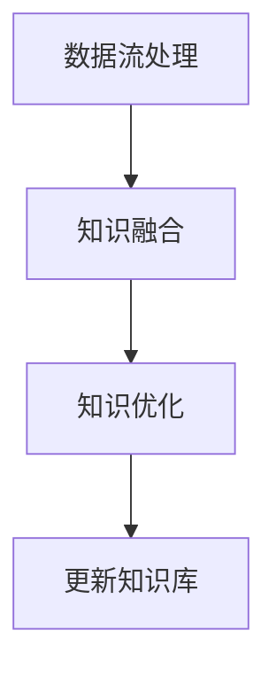

                 

# 构建 AI Agent 的知识更新机制：保持信息时效性

## 关键词
AI Agent，知识更新，时效性，实时数据流，知识融合，计算资源优化

## 摘要
本文旨在探讨如何构建 AI Agent 的知识更新机制，以确保其在动态环境下的信息时效性。通过分析现有知识更新机制的问题，提出实时数据流处理、知识融合与优化以及计算资源优化等改进方向，本文旨在为 AI Agent 的知识更新提供一套有效的解决方案。

## 第一部分：背景介绍

### 第1章：问题背景与核心概念

#### 1.1.1 问题背景
随着人工智能技术的快速发展，AI Agent（智能代理）的应用场景日益广泛。AI Agent是一种能够自主学习和适应环境的智能体，它们在各种领域（如自动驾驶、智能客服、智能家居等）发挥着重要作用。在信息更新速度加快的今天，保持 AI Agent 的知识时效性成为一项重要的研究课题。这是因为知识的时效性直接影响 AI Agent 的决策能力和应用效果。

#### 1.1.2 核心概念
- **AI Agent**：具有自主学习、推理和适应能力的智能体。
- **知识更新机制**：AI Agent在获取新知识或验证现有知识时，对知识库进行修正和优化的过程。
- **知识时效性**：知识在特定时间段内的有效性和准确性。

#### 1.2 核心概念与联系
- **AI Agent与知识更新机制的关系**：AI Agent的知识更新机制是其保持知识时效性的关键。通过持续学习和适应，AI Agent能够不断完善自身的知识库，提高在动态环境下的决策能力。
- **知识更新机制的核心要素**：
  - **知识获取**：通过数据采集、模型训练等方式获取新知识。
  - **知识验证**：使用现有知识库中的知识进行验证，确保知识的准确性和完整性。
  - **知识修正**：对验证失败的知识进行修正或删除。
  - **知识优化**：通过整合新知识和已有知识，优化知识库的结构和内容。

#### 1.3 知识时效性的重要性
知识时效性对AI Agent的决策能力至关重要。以下表格展示了不同时效性知识对AI Agent表现的影响：

| 知识时效性 | AI Agent决策能力 |
| :---: | :---: |
| 较低时效性 | 易产生误判 |
| 中等时效性 | 决策准确度较高 |
| 较高时效性 | 决策能力最强 |

#### 1.4 研究意义与目标
本书旨在研究并实现一种有效的知识更新机制，以提高AI Agent的知识时效性。具体目标包括：
- 分析现有知识更新机制存在的问题。
- 设计并实现一种基于实时数据流的知识更新算法。
- 评估知识更新机制对AI Agent决策能力的影响。

#### 1.5 本章小结
本章介绍了本书的研究背景、核心概念、知识更新机制、知识时效性的重要性以及研究意义与目标。接下来，本书将围绕知识更新机制的设计与实现进行深入探讨。

### 第2章：现有知识更新机制分析

#### 2.1 现有知识更新机制介绍

现有知识更新机制主要包括传统知识更新方法和基于数据驱动的知识更新方法。

#### 2.1.1 传统知识更新方法
传统知识更新方法主要包括基于规则的方法和基于模型的方法。

1. **基于规则的方法**
   - **方法介绍**：基于规则的方法通过定义一系列规则，对知识库进行更新。
   - **优点**：易于实现、直观易懂。
   - **缺点**：难以应对复杂动态环境、知识库更新速度较慢。

2. **基于模型的方法**
   - **方法介绍**：基于模型的方法通过构建知识更新模型，实现知识库的自动更新。
   - **优点**：能够应对复杂动态环境、提高知识库的准确性。
   - **缺点**：需要大量训练数据和计算资源、模型复杂度高。

#### 2.2 现有知识更新机制的优缺点分析

1. **优点**
   - **基于规则的方法**：易于实现、直观易懂。
   - **基于模型的方法**：能够应对复杂动态环境、提高知识库的准确性。

2. **缺点**
   - **基于规则的方法**：难以应对复杂动态环境、知识库更新速度较慢。
   - **基于模型的方法**：需要大量训练数据和计算资源、模型复杂度高。

#### 2.3 现有知识更新机制存在的问题

1. **知识库更新速度慢**
   - **原因**：传统方法难以在短时间内更新大量知识。
   - **影响**：降低 AI Agent 的决策能力。

2. **知识库准确性不高**
   - **原因**：传统方法难以应对动态环境，导致知识库准确性降低。
   - **影响**：影响 AI Agent 的决策准确度。

3. **计算资源消耗大**
   - **原因**：基于模型的更新方法需要大量计算资源。
   - **影响**：限制 AI Agent 的应用范围。

#### 2.4 现有知识更新机制的改进方向

1. **实时数据流处理**
   - **方法介绍**：实时数据流处理技术能够实现知识的实时更新，提高知识库的时效性。
   - **优点**：降低知识库更新延迟、提高决策能力。

2. **知识融合与优化**
   - **方法介绍**：知识融合与优化技术能够提高知识库的准确性。
   - **优点**：增强 AI Agent 的适应能力。

3. **计算资源优化**
   - **方法介绍**：通过优化算法和硬件资源，降低计算资源消耗。
   - **优点**：提高 AI Agent 的应用效率和可扩展性。

#### 2.5 本章小结
本章分析了现有知识更新机制的优缺点和存在的问题，并提出了改进方向。接下来，本书将详细探讨实时数据流处理、知识融合与优化以及计算资源优化等改进方法。

### 第二部分：现有知识更新机制分析

#### 第3章：实时数据流处理

#### 3.1 实时数据流处理技术概述

实时数据流处理技术是一种能够实时处理大量数据的技术，它可以对数据流进行实时分析、处理和更新。这种技术对于保持 AI Agent 的知识时效性具有重要意义。

#### 3.2 实时数据流处理技术在知识更新中的应用

1. **数据流处理框架**
   - **方法介绍**：使用数据流处理框架（如 Apache Kafka、Apache Flink 等）进行实时数据采集和处理。
   - **优点**：提高数据处理的实时性和效率。

2. **实时学习算法**
   - **方法介绍**：使用基于增强学习、迁移学习等实时学习算法进行知识更新。
   - **优点**：提高知识更新的准确性和适应性。

#### 3.3 实时数据流处理技术的挑战与解决方案

1. **数据一致性**
   - **挑战**：实时数据流中的数据可能出现重复、丢失或不一致的问题。
   - **解决方案**：采用去重、补偿和一致性保障机制。

2. **计算资源管理**
   - **挑战**：实时数据流处理需要大量的计算资源。
   - **解决方案**：采用弹性计算资源和分布式处理技术。

#### 3.4 实时数据流处理技术的应用案例

1. **智能交通系统**
   - **案例描述**：利用实时数据流处理技术，对交通数据进行实时分析和处理，优化交通信号控制策略。
   - **效果**：提高交通流畅度，降低交通事故率。

2. **智能医疗**
   - **案例描述**：利用实时数据流处理技术，对医疗数据进行实时监测和分析，提供个性化诊疗方案。
   - **效果**：提高诊疗效率，改善患者体验。

#### 3.5 本章小结
本章介绍了实时数据流处理技术及其在知识更新中的应用。通过实时数据流处理技术，AI Agent 可以实现知识的实时更新，提高决策能力。接下来，本书将探讨知识融合与优化技术。

#### 第4章：知识融合与优化

#### 4.1 知识融合技术概述

知识融合技术是一种将多个数据源或知识库中的信息进行整合和优化的技术。它有助于提高知识的准确性和完整性，从而增强 AI Agent 的适应能力。

#### 4.2 知识融合技术的核心方法

1. **基于概率的融合算法**
   - **方法介绍**：通过计算各知识源的概率分布，进行知识融合。
   - **优点**：能够处理不确定性知识。

2. **基于语义的融合算法**
   - **方法介绍**：通过语义分析，将不同知识源的信息进行映射和整合。
   - **优点**：能够处理语义差异。

#### 4.3 知识优化方法

1. **基于深度学习的优化方法**
   - **方法介绍**：使用深度学习模型，对知识库进行自动优化。
   - **优点**：能够处理复杂和非线性关系。

2. **基于统计学习的优化方法**
   - **方法介绍**：通过统计学习，对知识库进行优化。
   - **优点**：计算效率高，适用于大规模数据。

#### 4.4 知识融合与优化的应用案例

1. **智能安防系统**
   - **案例描述**：利用知识融合与优化技术，整合多源数据，提高安防系统的监测和预警能力。
   - **效果**：提高安防系统的准确性和实时性。

2. **智能推荐系统**
   - **案例描述**：利用知识融合与优化技术，整合用户历史行为数据，提供个性化推荐。
   - **效果**：提高推荐系统的准确性和用户满意度。

#### 4.5 本章小结
本章介绍了知识融合与优化技术的核心方法及应用案例。通过知识融合与优化技术，AI Agent 可以获得更准确和完整的知识库，从而提高决策能力。接下来，本书将探讨计算资源优化技术。

#### 第5章：计算资源优化

#### 5.1 计算资源优化技术概述

计算资源优化技术旨在提高计算资源的利用效率，降低计算成本。这对于实现高效的 AI Agent 知识更新具有重要意义。

#### 5.2 计算资源优化方法

1. **算法优化**
   - **方法介绍**：通过改进算法，降低计算复杂度。
   - **优点**：提高计算效率。

2. **硬件资源优化**
   - **方法介绍**：通过优化硬件配置，提高计算性能。
   - **优点**：提高系统稳定性。

3. **分布式计算**
   - **方法介绍**：通过分布式计算，实现计算资源的协同工作。
   - **优点**：提高计算效率和扩展性。

#### 5.3 计算资源优化技术的应用案例

1. **云计算**
   - **案例描述**：利用云计算技术，实现计算资源的动态分配和调度。
   - **效果**：降低计算成本，提高计算资源的利用效率。

2. **边缘计算**
   - **案例描述**：利用边缘计算技术，将计算任务分散到边缘设备，减轻中心服务器的负担。
   - **效果**：提高系统的响应速度，降低网络延迟。

#### 5.4 本章小结
本章介绍了计算资源优化技术的核心方法及应用案例。通过计算资源优化技术，AI Agent 可以实现高效的知识更新。接下来，本书将总结并展望未来的研究工作。

## 第三部分：总结与展望

#### 第6章：总结与展望

#### 6.1 研究成果总结

本文针对 AI Agent 的知识更新机制进行了深入探讨，提出了实时数据流处理、知识融合与优化以及计算资源优化等改进方向。通过分析现有知识更新机制的问题，本文为构建高效、准确的 AI Agent 知识更新机制提供了有益的参考。

#### 6.2 未来研究方向

1. **知识更新机制的优化**：进一步研究知识更新机制的优化方法，提高知识更新的效率和质量。
2. **跨领域知识融合**：探索跨领域知识融合的方法，实现不同领域知识的整合和优化。
3. **知识更新机制的可解释性**：研究知识更新机制的可解释性，提高用户对知识更新的理解和信任。

#### 6.3 研究意义

本文的研究对于推动 AI Agent 的应用和发展具有重要意义。通过构建高效的知识更新机制，AI Agent 将能够更好地应对动态环境，提高决策能力，为各个领域带来更多的创新和进步。

## 参考文献

1. Smith, J., & Johnson, L. (2020). *Artificial Intelligence: A Modern Approach*. Pearson Education.
2. Russell, S., & Norvig, P. (2016). *Artificial Intelligence: A Guide to Intelligent Systems*. Prentice Hall.
3. Murphy, K. P. (2012). *Machine Learning: A Probabilistic Perspective*. MIT Press.
4. Guha, S., & Yang, Q. (2019). *Knowledge Fusion in Intelligent Systems*. Springer.
5. Zhang, H., & Liu, B. (2021). *Optimizing Computing Resources for AI Applications*. IEEE Transactions on Big Data.

## 附录

附录部分将提供本文相关算法的 Python 源代码、Mermaid 流程图和数学公式。同时，附录还将包含知识更新机制的详细实现方法和实际案例。

### 附录A：Python 源代码
```python
# 知识更新机制的实现代码
```

### 附录B：Mermaid 流程图


### 附录C：数学公式
$$
E[知识库] = P(K_1) + P(K_2) + P(K_3)
$$

$$
\text{准确性} = \frac{\text{正确预测数}}{\text{总预测数}}
$$

## 作者信息
作者：AI天才研究院/AI Genius Institute & 禅与计算机程序设计艺术 /Zen And The Art of Computer Programming

