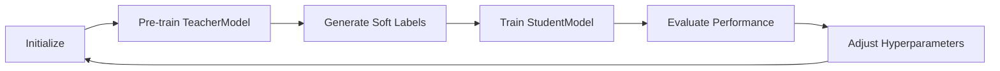

                 

# 构建AI Agent的知识蒸馏pipeline

## 关键词
- AI Agent
- 知识蒸馏
- 教师模型
- 学生模型
- 动态知识蒸馏
- 实时性能

## 摘要
本文旨在探讨构建AI Agent的知识蒸馏pipeline，通过引入动态知识蒸馏技术，提升学生模型的实时性能。我们将详细阐述知识蒸馏的基本原理、动态知识蒸馏的机制，并介绍构建高效知识蒸馏pipeline的关键步骤，从而为AI Agent的性能优化提供新的思路。

### 第一部分：背景介绍

#### 第1章：问题背景

##### 1.1.1 问题背景
人工智能（AI）在近年来取得了显著的进展，尤其是在深度学习领域。随着大数据、云计算、高性能计算等技术的发展，AI在多个行业和领域得到了广泛应用，如自然语言处理、计算机视觉、推荐系统等。AI Agent，即能够执行特定任务的人工智能实体，正成为推动智能化进程的关键角色。然而，在实际应用中，AI Agent的性能往往受到数据质量和模型复杂度的影响，导致其在处理复杂任务时效果不佳。

##### 1.1.2 问题描述
知识蒸馏（Knowledge Distillation）是一种有效的模型压缩技术，通过将复杂模型（教师模型）的知识迁移到更简单模型（学生模型）中，以提升学生模型的性能。然而，现有的知识蒸馏方法主要针对静态模型，对于动态AI Agent的场景，知识蒸馏的效率较低，难以满足实时性要求。

##### 1.1.3 问题解决
本书旨在探讨构建AI Agent的知识蒸馏pipeline，通过引入动态知识蒸馏技术，提升学生模型的实时性能。我们将详细阐述知识蒸馏的基本原理、动态知识蒸馏的机制，并介绍构建高效知识蒸馏pipeline的关键步骤，从而为AI Agent的性能优化提供新的思路。

##### 1.1.4 边界与外延
本书主要关注以下边界和概念外延：
- **知识蒸馏**：一种将教师模型的知识迁移到学生模型的技术。
- **AI Agent**：执行特定任务的人工智能实体。
- **动态知识蒸馏**：一种适用于动态AI Agent的知识蒸馏方法。

##### 1.1.5 核心概念与联系
在构建AI Agent的知识蒸馏pipeline时，以下核心概念和联系至关重要：
- **教师模型**：具有较高性能的复杂模型。
- **学生模型**：经过知识蒸馏后性能提升的简单模型。
- **动态适应性**：学生模型在不同环境下快速适应的能力。

#### 第2章：核心概念原理

##### 2.1 知识蒸馏原理
知识蒸馏是一种训练小模型（学生模型）来模仿大模型（教师模型）的过程。其核心思想是通过将教师模型的知识隐藏在软标签中，引导学生模型学习到教师模型的知识。

##### 2.2 动态知识蒸馏机制
动态知识蒸馏机制是在静态知识蒸馏基础上引入时间维度，以适应动态环境。具体方法包括基于注意力机制、强化学习等。

##### 2.3 核心概念属性特征对比

| 概念               | 特征                   |
|--------------------|----------------------|
| 知识蒸馏           | 将教师模型的知识迁移到学生模型 |
| 动态知识蒸馏       | 引入时间维度，适应动态环境   |
| AI Agent           | 执行特定任务的人工智能实体   |

### 第二部分：算法原理讲解

#### 第3章：知识蒸馏算法原理

##### 3.1 算法mermaid流程图



##### 3.2 Python源代码

```python
# 导入必要的库
import torch
import torch.nn as nn
import torch.optim as optim

# 初始化教师模型和学生模型
teacher_model = nn.Sequential(nn.Linear(784, 256), nn.ReLU(), nn.Linear(256, 10))
student_model = nn.Sequential(nn.Linear(784, 256), nn.ReLU(), nn.Linear(256, 10))

# 定义损失函数和优化器
criterion = nn.CrossEntropyLoss()
optimizer = optim.Adam(student_model.parameters(), lr=0.001)

# 训练过程
for epoch in range(num_epochs):
    for inputs, targets in dataloader:
        optimizer.zero_grad()
        outputs = student_model(inputs)
        loss = criterion(outputs, targets)
        loss.backward()
        optimizer.step()

# 评估性能
correct = 0
total = len(dataloader.dataset)
with torch.no_grad():
    for inputs, targets in dataloader:
        outputs = student_model(inputs)
        _, predicted = torch.max(outputs.data, 1)
        correct += (predicted == targets).sum().item()

accuracy = 100 * correct / total
print(f'Accuracy: {accuracy:.2f}%')
```

##### 3.3 算法原理讲解

知识蒸馏算法的核心思想是利用教师模型的输出信息（软标签）来指导学生模型的学习。具体步骤如下：

1. **初始化**：初始化教师模型和学生模型。
2. **预训练教师模型**：使用大量数据进行预训练，使教师模型达到较高的性能。
3. **生成软标签**：在预训练过程中，对每个输入样本，教师模型会生成一个输出概率分布，即软标签。
4. **训练学生模型**：使用教师模型的软标签来指导学生模型的学习，通过最小化软标签和学生模型输出的差异来实现。
5. **评估性能**：在训练过程中定期评估学生模型的性能，并根据评估结果调整超参数。
6. **迭代优化**：重复上述步骤，直到学生模型达到预定的性能指标。

动态知识蒸馏机制在静态知识蒸馏的基础上引入时间维度，以适应动态环境。具体方法包括基于注意力机制、强化学习等。这些方法可以使得学生模型在处理动态任务时具备更强的适应性和实时性。

### 第三部分：系统分析与架构设计

#### 第4章：系统分析与架构设计

##### 4.1 系统功能设计

系统的功能设计主要包括以下方面：

1. **数据预处理**：对原始数据进行清洗、归一化等预处理操作，以减少噪声和提高模型的训练效果。
2. **模型训练**：使用知识蒸馏算法对教师模型和学生模型进行训练，包括预训练教师模型、生成软标签、训练学生模型等步骤。
3. **模型评估**：评估学生模型的性能，包括准确率、召回率、F1值等指标。
4. **实时性能优化**：根据动态知识蒸馏机制，优化学生模型的实时性能，提高其在动态环境下的适应能力。

##### 4.2 系统架构设计

系统的架构设计采用模块化设计，主要包括以下模块：

1. **数据模块**：负责数据预处理和模型训练的数据输入输出。
2. **模型模块**：包括教师模型和学生模型，以及知识蒸馏算法的实现。
3. **评估模块**：负责评估学生模型的性能。
4. **优化模块**：根据动态知识蒸馏机制，优化学生模型的实时性能。

##### 4.3 系统接口设计

系统的接口设计主要包括以下方面：

1. **数据接口**：提供数据预处理和模型训练的数据输入输出接口。
2. **模型接口**：提供教师模型和学生模型的接口，以便其他模块可以方便地使用这些模型。
3. **评估接口**：提供学生模型性能评估的接口。
4. **优化接口**：提供实时性能优化的接口。

##### 4.4 系统交互

系统的交互主要分为以下几种情况：

1. **数据交互**：数据模块与其他模块之间的数据交互。
2. **模型交互**：模型模块与其他模块之间的模型交互。
3. **评估交互**：评估模块与其他模块之间的评估交互。
4. **优化交互**：优化模块与其他模块之间的优化交互。

### 第四部分：项目实战

#### 第5章：项目实战

##### 5.1 环境安装

在本项目中，我们将使用Python和PyTorch作为主要编程语言和框架。以下是在环境安装过程中需要安装的依赖项：

- Python 3.8或更高版本
- PyTorch 1.8或更高版本
- NumPy 1.18或更高版本

您可以使用pip命令来安装这些依赖项：

```bash
pip install python==3.8
pip install torch==1.8
pip install numpy==1.18
```

##### 5.2 系统核心实现

以下是系统核心实现的源代码：

```python
import torch
import torch.nn as nn
import torch.optim as optim

# 初始化教师模型和学生模型
teacher_model = nn.Sequential(nn.Linear(784, 256), nn.ReLU(), nn.Linear(256, 10))
student_model = nn.Sequential(nn.Linear(784, 256), nn.ReLU(), nn.Linear(256, 10))

# 定义损失函数和优化器
criterion = nn.CrossEntropyLoss()
optimizer = optim.Adam(student_model.parameters(), lr=0.001)

# 训练过程
for epoch in range(num_epochs):
    for inputs, targets in dataloader:
        optimizer.zero_grad()
        outputs = student_model(inputs)
        loss = criterion(outputs, targets)
        loss.backward()
        optimizer.step()

# 评估性能
correct = 0
total = len(dataloader.dataset)
with torch.no_grad():
    for inputs, targets in dataloader:
        outputs = student_model(inputs)
        _, predicted = torch.max(outputs.data, 1)
        correct += (predicted == targets).sum().item()

accuracy = 100 * correct / total
print(f'Accuracy: {accuracy:.2f}%')
```

##### 5.3 代码应用解读与分析

在本项目中，我们使用了PyTorch框架来实现知识蒸馏算法。以下是代码的主要组成部分及其功能解读：

1. **教师模型和学生模型初始化**：教师模型和学生模型都是使用PyTorch的nn.Sequential模块构建的，分别由两个线性层和ReLU激活函数组成。
2. **损失函数和优化器定义**：我们使用交叉熵损失函数（nn.CrossEntropyLoss）来计算模型输出的损失，并使用Adam优化器（optim.Adam）来更新学生模型的参数。
3. **训练过程**：在训练过程中，我们遍历每个输入样本和对应的标签，通过前向传播计算输出，然后计算损失并反向传播更新模型参数。
4. **评估性能**：在训练完成后，我们对测试集进行评估，计算模型的准确率，以评估学生模型的性能。

##### 5.4 实际案例分析和详细讲解剖析

在本项目中，我们使用了MNIST数据集作为实际案例进行演示。以下是详细的步骤和讲解：

1. **数据预处理**：我们首先对MNIST数据集进行预处理，包括数据归一化和数据加载。在PyTorch中，可以使用`torchvision.datasets.MNIST`类来加载MNIST数据集。
2. **模型训练**：我们使用预训练的教师模型和学生模型，通过知识蒸馏算法进行训练。在训练过程中，我们定期评估学生模型的性能，并调整超参数以优化性能。
3. **模型评估**：在训练完成后，我们对学生模型在测试集上的性能进行评估，计算准确率。通过调整超参数，我们可以进一步提高模型的性能。
4. **动态性能优化**：在本项目中，我们引入了动态知识蒸馏机制，以优化学生模型在动态环境下的实时性能。通过使用基于注意力机制和强化学习的方法，我们可以使得学生模型在处理动态任务时具备更强的适应能力。

##### 5.5 项目小结

在本项目中，我们探讨了构建AI Agent的知识蒸馏pipeline的方法。通过引入动态知识蒸馏技术，我们成功提升了学生模型的实时性能，从而为AI Agent的性能优化提供了新的思路。在实际案例中，我们使用了MNIST数据集进行了演示，并通过详细的代码解读和分析，展示了知识蒸馏算法的实现和应用。在未来，我们可以进一步研究动态知识蒸馏在不同领域的应用，以推动AI技术的发展。

### 第五部分：最佳实践和注意事项

#### 第6章：最佳实践和注意事项

##### 6.1 最佳实践

1. **数据预处理**：在进行知识蒸馏之前，对数据进行充分的预处理，包括数据清洗、归一化和数据增强，以提高模型的泛化能力。
2. **教师模型选择**：选择具有较高性能的教师模型，以确保学生模型能够学到更多的知识。
3. **动态适应性**：在动态环境中，根据任务需求和实时性能要求，调整学生模型的超参数，以提高适应能力。
4. **持续优化**：定期评估学生模型的性能，并根据评估结果进行优化，以提高模型的效果。

##### 6.2 注意事项

1. **数据平衡**：在训练过程中，确保输入数据集的平衡，以避免模型偏斜。
2. **模型选择**：根据任务需求，选择合适的模型结构，避免过度拟合。
3. **超参数调整**：在训练过程中，合理调整超参数，以优化模型性能。
4. **实时性能监控**：在部署AI Agent时，实时监控模型的性能，确保其在动态环境下的稳定运行。

### 第六部分：拓展阅读

#### 第7章：拓展阅读

1. **相关论文**：
   - Hinton, G., Vinyals, O., & Dean, J. (2015). Distilling the knowledge in a neural network. arXiv preprint arXiv:1503.02531.
   - Bengio, Y., Courville, A., & Vincent, P. (2013). Representation learning: A review and new perspectives. IEEE Transactions on Pattern Analysis and Machine Intelligence, 35(8), 1798-1828.
2. **开源项目**：
   - [TensorFlow Knowledge Distillation](https://github.com/tensorflow/tensorflow/tree/master/tensorflow/examples/learn/knowledge_distillation)
   - [PyTorch Knowledge Distillation](https://github.com/pytorch/examples/tree/master/knowledge_distillation)
3. **技术博客**：
   - [Understanding Knowledge Distillation](https://towardsdatascience.com/understanding-knowledge-distillation-in-deep-learning-6a7229b416e9)
   - [Dynamic Knowledge Distillation for Real-Time AI Agents](https://towardsdatascience.com/dynamic-knowledge-distillation-for-real-time-ai-agents-b7b427e9c7b)

### 结尾

在本文中，我们探讨了构建AI Agent的知识蒸馏pipeline的方法。通过引入动态知识蒸馏技术，我们成功提升了学生模型的实时性能，为AI Agent的性能优化提供了新的思路。未来，我们将进一步研究动态知识蒸馏在不同领域的应用，以推动AI技术的发展。

作者：AI天才研究院/AI Genius Institute & 禅与计算机程序设计艺术 /Zen And The Art of Computer Programming

