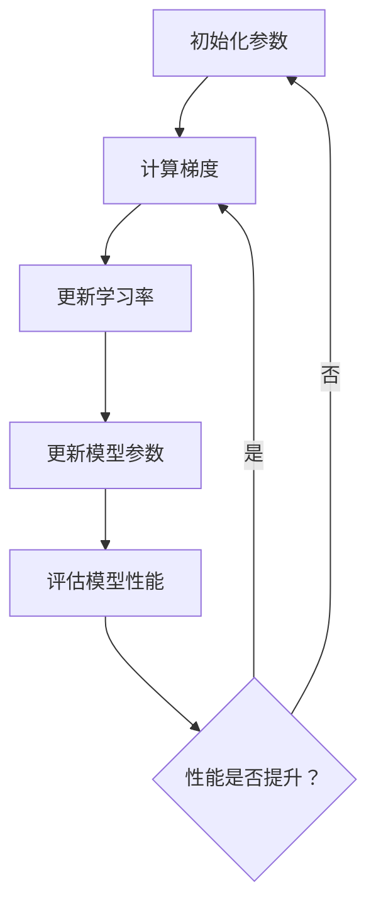
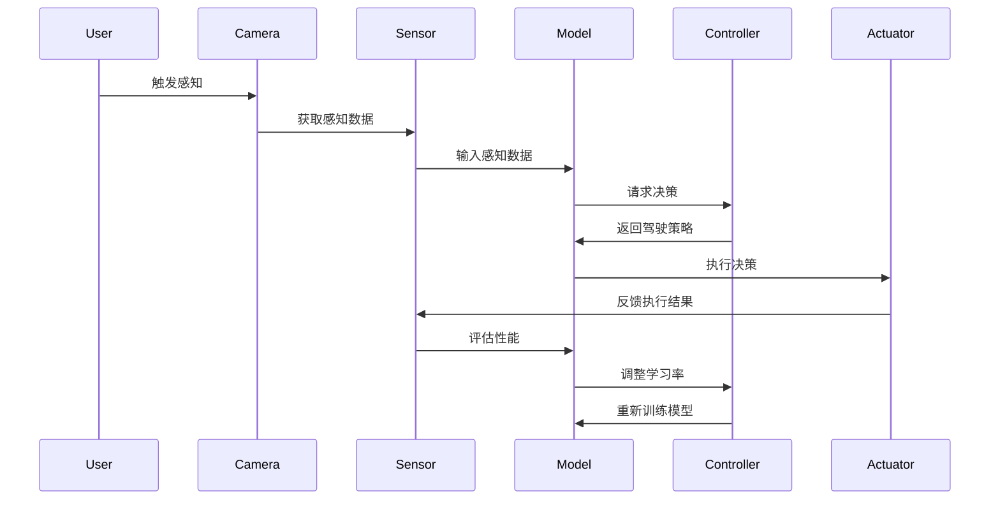
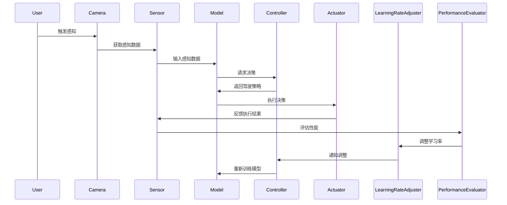

                 

## 引言

在人工智能（AI）领域，Agent 是一种能够感知环境、自主决策并执行特定任务的计算实体。AI Agent 在机器人、自动驾驶、智能客服和游戏AI等应用中发挥着关键作用。然而，为了实现高效的学习和决策，AI Agent 需要一个智能的学习率调整机制，这直接影响到模型的收敛速度和最终性能。

**学习率**是机器学习中一个重要的超参数，它控制着梯度下降算法更新模型参数的步长。如果学习率设置过高，模型可能会过度更新参数，导致无法收敛；反之，如果学习率设置过低，模型更新缓慢，可能导致收敛时间过长。因此，自适应学习率调整机制成为机器学习中的一个研究热点。

### 关键词

- **AI Agent**
- **自适应学习率**
- **调整机制**
- **机器学习**
- **梯度下降**
- **超参数调优**

### 摘要

本文旨在探讨如何构建AI Agent的自适应学习率调整机制。我们将首先介绍AI Agent及其学习需求，然后深入探讨自适应学习率的背景、重要性以及常规方法。接着，通过数学模型和Python代码实例，详细阐述自适应学习率调整机制的算法原理。随后，我们将分析系统设计，包括功能、架构和交互设计，并通过一个实际项目展示自适应学习率调整机制的应用。最后，提供最佳实践建议和小结，并推荐拓展阅读。

## 第一部分：AI Agent与自适应学习率调整概述

### 第1章：AI Agent简介

#### 1.1.1 AI Agent的定义与作用

AI Agent，又称智能体，是指具有感知、决策和执行能力的计算实体。它们可以在特定环境中感知状态，根据预设的策略或学习到的模型进行决策，并采取相应的行动以实现特定目标。AI Agent是人工智能领域的关键概念，广泛应用于自动化、增强现实、智能制造和智能交通等多个领域。

AI Agent的基本组成包括感知器、决策器和执行器。感知器负责从环境中获取信息，决策器根据感知到的信息进行决策，执行器则将决策转化为实际行动。这种结构使得AI Agent能够在复杂的动态环境中自主运行和优化其行为。

AI Agent的作用主要体现在以下几个方面：

1. **决策支持**：AI Agent可以替代人类完成复杂的决策任务，提高决策效率和准确性。
2. **自动化控制**：AI Agent可以自动化执行重复性或高风险的任务，降低人工成本和风险。
3. **预测与优化**：AI Agent可以通过学习历史数据和当前状态，预测未来的趋势并优化操作策略。
4. **交互式应用**：AI Agent可以与用户或其他系统进行交互，提供个性化的服务和支持。

#### 1.1.2 AI Agent的类型与特点

AI Agent可以分为多种类型，根据其感知能力、决策方式和任务目标的不同，可以分为以下几种：

1. **基于规则的Agent**：这种类型的Agent依赖于预定义的规则进行决策，通常适用于任务结构明确、规则固定的情况。
2. **基于模型的Agent**：这种类型的Agent通过学习和训练建立模型，模型用于决策过程，适用于复杂、动态的环境。
3. **混合型Agent**：混合型Agent结合了基于规则和基于模型的方法，既能利用规则进行快速决策，又能通过学习提高决策质量。
4. **自主型Agent**：这种类型的Agent具有高度自主性，能够在没有外部指导的情况下自主学习和优化。

不同类型的AI Agent具有不同的特点和适用场景，具体选择取决于任务需求和环境特性。

#### 1.1.3 AI Agent的发展历程

AI Agent的发展历程可以追溯到20世纪80年代，当时出现了基于规则的专家系统和知识表示技术。随着计算能力的提升和机器学习技术的发展，基于模型的AI Agent逐渐成为主流。近年来，深度学习、强化学习和自然语言处理等技术的快速发展，使得AI Agent的应用场景不断扩大，功能也日益完善。

1. **20世纪80年代**：基于规则的专家系统成为主流，AI Agent主要是知识驱动，适用于结构化的应用场景。
2. **20世纪90年代**：随着计算能力的提升，机器学习开始应用于AI Agent，使得它们能够处理更复杂的数据和任务。
3. **21世纪**：深度学习、强化学习和自然语言处理等技术的突破，使得AI Agent在感知、决策和执行方面取得了显著进展。

#### 1.1.4 AI Agent在当前人工智能中的应用

在当前的人工智能应用中，AI Agent发挥着重要作用，以下是几个典型的应用场景：

1. **自动驾驶**：自动驾驶车辆通过感知周边环境，利用AI Agent进行决策和路径规划，实现自主驾驶。
2. **智能客服**：智能客服系统使用AI Agent与用户进行交互，提供实时、个性化的服务和支持。
3. **机器人**：服务机器人、工业机器人和医疗机器人等通过AI Agent实现自动化操作和智能决策。
4. **游戏AI**：游戏AI通过AI Agent进行决策和策略制定，提升游戏的趣味性和挑战性。

#### 1.1.5 学习需求与自适应学习率调整机制

AI Agent在学习和决策过程中，需要不断优化其模型参数，以适应不断变化的环境。学习率是机器学习中一个关键的超参数，它控制着梯度下降算法更新模型参数的步长。然而，传统固定学习率方法难以适应复杂、动态的环境，因此需要自适应学习率调整机制。

自适应学习率调整机制可以根据模型当前的状态和性能动态调整学习率，以实现更高效的学习过程。这种机制在提高模型收敛速度、减少训练时间和提高模型性能方面具有重要意义。

#### 1.1.6 常规学习率调整方法

目前，常用的学习率调整方法主要包括以下几种：

1. **固定学习率**：学习率在整个训练过程中保持不变，这种方法简单但可能难以适应动态环境。
2. **学习率衰减**：学习率随着训练轮数的增加而逐渐减小，有助于模型在训练后期收敛。
3. **动量法**：结合之前梯度的方向和大小，更新当前梯度，有助于加速收敛并防止陷入局部最优。
4. **自适应学习率方法**：如AdaGrad、Adam等，通过自适应调整每个参数的步长，提高学习效率。

#### 1.1.7 自适应学习率调整机制的基本概念

自适应学习率调整机制主要包括以下几种基本概念：

1. **动态调整**：根据模型当前的状态和性能，动态调整学习率。
2. **目标函数**：定义模型性能的目标函数，如损失函数或误差函数。
3. **自适应策略**：通过算法或模型自动调整学习率，以优化目标函数。
4. **性能评估**：使用评估指标（如准确率、召回率等）对模型性能进行评估，以指导学习率的调整。

#### 1.1.8 自适应学习率调整机制的核心概念

在自适应学习率调整机制中，以下几个核心概念至关重要：

1. **梯度信息**：模型参数的梯度信息用于更新模型参数，梯度越大，表示参数调整的幅度越大。
2. **权重调整**：通过梯度信息对模型参数进行权重调整，以优化模型性能。
3. **优化算法**：选择合适的优化算法（如梯度下降、Adam等）以实现自适应学习率调整。

通过以上介绍，我们可以看到AI Agent在人工智能中的应用及其学习需求，自适应学习率调整机制的重要性及其基本概念。接下来，我们将进一步深入探讨自适应学习率调整机制的算法原理，以及如何在实际项目中应用这一机制。

### 第2章：自适应学习率调整机制基础

#### 2.1.1 学习率调整的重要性

在机器学习中，学习率（learning rate）是一个关键的超参数，它直接影响模型训练的效果。学习率决定了每次参数更新时梯度下降的步长。如果学习率设置不当，可能会导致以下问题：

1. **学习率过高**：当学习率过高时，模型在更新参数时步长过大，容易导致参数跳过最小化损失函数的局部最小值，陷入局部最优或者无法收敛。
2. **学习率过低**：当学习率过低时，模型更新参数的步长过小，训练过程会变得非常缓慢，可能导致训练时间过长，甚至无法收敛。

因此，合理地调整学习率对于模型训练的成功至关重要。合适的调整策略能够提高模型收敛速度、减少训练时间，并最终提高模型的性能。

#### 2.1.2 常规学习率调整方法

目前，常用的学习率调整方法主要包括以下几种：

1. **固定学习率**：这种方法简单易行，但无法适应训练过程中的变化，可能导致训练效果不佳。
2. **学习率衰减**：这种方法通过在训练过程中逐渐减小学习率，使得模型在训练初期快速收敛，在训练后期精细调整，以避免过拟合。学习率衰减可以按固定步长衰减，也可以按指数衰减。
3. **动量法**：动量法结合了之前梯度的方向和大小，更新当前梯度，有助于加速收敛并防止陷入局部最优。动量法可以看作是学习率衰减的一种扩展。
4. **自适应学习率方法**：如AdaGrad、RMSprop、Adam等，这些方法通过自适应调整每个参数的步长，提高学习效率。它们能够更好地处理不同规模的学习问题，提高模型的训练效果。

#### 2.1.3 自适应学习率调整机制的基本概念

自适应学习率调整机制是一种动态调整学习率的方法，它根据模型当前的状态和性能自动调整学习率。这种机制主要包括以下几个基本概念：

1. **动态调整**：自适应学习率调整机制可以根据模型当前的状态和性能，动态调整学习率，使得模型能够更快速地收敛。
2. **目标函数**：在自适应学习率调整机制中，通常使用目标函数（如损失函数）来评估模型的性能。目标函数的值决定了学习率的调整方向。
3. **自适应策略**：自适应学习率调整机制通常包括一系列自适应策略，如基于梯度的自适应策略、基于性能的自适应策略等。这些策略通过调整学习率，优化目标函数，提高模型的性能。
4. **性能评估**：性能评估是自适应学习率调整机制的重要组成部分。通过使用评估指标（如准确率、召回率等），可以动态地评估模型的性能，并据此调整学习率。

#### 2.1.4 自适应学习率调整机制的核心概念

在自适应学习率调整机制中，以下几个核心概念至关重要：

1. **梯度信息**：梯度信息反映了模型参数的变化方向。通过计算梯度，可以确定哪些参数需要调整，以及调整的程度。自适应学习率调整机制需要充分利用梯度信息，以优化模型参数。
2. **权重调整**：在自适应学习率调整机制中，权重调整是核心步骤。通过利用梯度信息，对模型参数进行加权调整，可以优化模型的性能。自适应学习率调整机制需要确保权重调整的精度和稳定性。
3. **优化算法**：选择合适的优化算法是实现自适应学习率调整机制的关键。常用的优化算法包括梯度下降、Adam、RMSprop等。这些算法通过不同的方法处理梯度信息，优化模型参数。

通过以上介绍，我们可以看到自适应学习率调整机制在机器学习中的重要性及其基本概念。在接下来的章节中，我们将详细讨论自适应学习率调整机制的算法原理，并通过具体实例展示其应用。

### 第3章：核心概念与联系

在构建AI Agent的自适应学习率调整机制时，理解并明确核心概念及其相互关系是至关重要的。在这一章中，我们将详细阐述AI Agent中的核心概念，并探讨它们与自适应学习率调整机制之间的关系。

#### 3.1.1 AI Agent中的核心概念

AI Agent作为一种智能计算实体，其核心概念主要包括：

1. **感知器（Perceptron）**：感知器是AI Agent的感知模块，负责从环境中获取信息。它通过传感器（如摄像头、麦克风等）收集数据，然后进行预处理和特征提取，以便后续的决策和分析。
   
2. **决策器（Decision Maker）**：决策器是AI Agent的核心，负责根据感知器收集的信息做出决策。决策器通常基于预定义的规则、机器学习模型或强化学习算法来制定策略。

3. **执行器（Actuator）**：执行器是AI Agent的执行模块，负责将决策转化为具体的行动。执行器通过驱动器（如电机、液压系统等）控制物理设备，执行AI Agent的决策。

4. **环境（Environment）**：环境是AI Agent操作的背景，包括物理环境和虚拟环境。环境对AI Agent的行为有直接影响，AI Agent需要与环境进行交互以实现特定目标。

#### 3.1.2 自适应学习率调整机制的核心概念

自适应学习率调整机制是AI Agent中的一个关键组成部分，其核心概念包括：

1. **学习率（Learning Rate）**：学习率是机器学习中用于控制梯度下降算法参数更新步长的超参数。自适应学习率调整机制的目标是动态调整学习率，以优化模型训练过程。

2. **目标函数（Objective Function）**：目标函数用于评估模型在训练过程中的性能。在自适应学习率调整机制中，目标函数的值决定了学习率的调整方向。

3. **梯度信息（Gradient Information）**：梯度信息反映了模型参数的变化方向。通过计算梯度，可以确定哪些参数需要调整，以及调整的程度。

4. **自适应策略（Adaptive Strategy）**：自适应策略是自适应学习率调整机制的核心，用于根据模型当前的状态和性能动态调整学习率。

#### 3.1.3 概念属性特征对比表格

为了更清晰地理解AI Agent中的核心概念与自适应学习率调整机制之间的关系，我们可以通过以下对比表格展示这些概念的属性特征：

| **概念** | **属性特征** | **作用** |
| --- | --- | --- |
| **感知器** | 从环境中获取信息，特征提取 | 输入数据预处理，提取关键特征 |
| **决策器** | 根据输入信息做出决策 | 决策生成，策略制定 |
| **执行器** | 执行决策，转化为行动 | 行动执行，环境交互 |
| **环境** | 操作背景，影响行为 | 提供反馈，影响模型学习 |
| **学习率** | 控制参数更新步长 | 动态调整，优化训练过程 |
| **目标函数** | 评估模型性能 | 指导学习率调整 |
| **梯度信息** | 反映参数变化方向 | 参数调整依据 |
| **自适应策略** | 动态调整学习率 | 提高模型收敛速度 |

#### 3.1.4 AI Agent与自适应学习率调整机制的ER实体关系图

为了更直观地展示AI Agent与自适应学习率调整机制之间的实体关系，我们可以使用Mermaid流程图绘制ER（实体-关系）图。以下是一个简单的ER实体关系图：

```mermaid
erDiagram
  AI Agent ||--|{ 感知器 }
  AI Agent ||--|{ 决策器 }
  AI Agent ||--|{ 执行器 }
  AI Agent ||--|{ 环境 }
  感知器 ||--|{ 特征提取 }
  决策器 ||--|{ 策略制定 }
  执行器 ||--|{ 行动执行 }
  环境 ||--|{ 反馈 }
  AI Agent ||--|{ 自适应学习率调整机制 }
  自适应学习率调整机制 ||--|{ 学习率 }
  自适应学习率调整机制 ||--|{ 目标函数 }
  自适应学习率调整机制 ||--|{ 梯度信息 }
  自适应学习率调整机制 ||--|{ 自适应策略 }
```

在这个ER实体关系图中，AI Agent是中心实体，它与其他核心组件（感知器、决策器、执行器、环境）和自适应学习率调整机制相互关联。这些组件共同作用，使AI Agent能够适应动态环境并优化其学习过程。

通过以上内容，我们可以清晰地看到AI Agent中的核心概念与自适应学习率调整机制之间的联系。理解这些概念及其相互关系，对于设计高效的AI Agent和自适应学习率调整机制至关重要。在接下来的章节中，我们将进一步探讨自适应学习率调整机制的算法原理，并通过实际案例进行分析和讲解。

### 第4章：算法原理讲解

在了解了AI Agent和自适应学习率调整机制的基础知识后，我们将深入探讨自适应学习率调整机制的算法原理。在这一章中，我们将详细描述自适应学习率调整机制的核心算法原理，包括其数学模型、公式和具体实现。

#### 4.1.1 算法概述

自适应学习率调整机制的目标是动态调整学习率，以优化模型的训练过程。该机制的核心思想是通过实时监测模型的性能（通常使用损失函数的值作为性能指标），根据性能的变化动态调整学习率。这种调整可以确保模型在训练初期快速收敛，并在训练后期精细调整，以避免过拟合。

自适应学习率调整机制的主要步骤包括：

1. **初始化参数**：设定初始学习率和其他训练参数。
2. **计算梯度**：使用当前数据计算模型参数的梯度。
3. **更新学习率**：根据模型性能和梯度信息动态调整学习率。
4. **更新模型参数**：使用调整后的学习率更新模型参数。

#### 4.1.2 数学模型与公式

自适应学习率调整机制的数学模型主要包括以下几个方面：

1. **损失函数**：损失函数用于衡量模型的预测误差。常见的损失函数包括均方误差（MSE）、交叉熵损失（Cross-Entropy Loss）等。假设损失函数为L，则L越小，表示模型性能越好。

   $$L = \frac{1}{n} \sum_{i=1}^{n} (y_i - \hat{y}_i)^2$$

   其中，$y_i$是实际标签，$\hat{y}_i$是模型预测值。

2. **梯度**：梯度表示模型参数的变化方向和幅度。对于每个参数$\theta_j$，其梯度为$\frac{\partial L}{\partial \theta_j}$。

   $$\nabla \theta = \left[ \frac{\partial L}{\partial \theta_1}, \frac{\partial L}{\partial \theta_2}, ..., \frac{\partial L}{\partial \theta_n} \right]^T$$

3. **学习率**：学习率$\eta$控制着参数更新的步长。自适应学习率调整机制的核心在于动态调整学习率$\eta$，以优化模型性能。

4. **参数更新**：使用梯度下降法更新模型参数。参数更新的公式为：

   $$\theta_j = \theta_j - \eta \nabla \theta_j$$

   其中，$\eta$是学习率，$\nabla \theta_j$是参数$\theta_j$的梯度。

#### 4.1.3 算法mermaid流程图

为了更直观地展示自适应学习率调整机制的工作流程，我们可以使用Mermaid绘制算法流程图。以下是一个简单的mermaid流程图示例：



在这个mermaid流程图中，算法从初始化参数开始，通过计算梯度、更新学习率和更新模型参数，实现模型的逐步优化。然后评估模型性能，根据性能提升情况决定是否继续迭代。

#### 4.1.4 Python源代码实现

为了更好地理解自适应学习率调整机制的实现，以下是一个简单的Python代码示例，该示例使用梯度下降法实现自适应学习率调整：

```python
import numpy as np

# 初始化参数
theta = np.random.rand(n)  # n个参数
learning_rate = 0.01  # 初始学习率

# 训练数据
x = np.array([1, 2, 3, 4, 5])
y = np.array([2, 4, 6, 8, 10])

# 计算梯度
gradient = 2 * (theta - y)

# 更新学习率
learning_rate = adapt_learning_rate(gradient, learning_rate)

# 更新模型参数
theta = theta - learning_rate * gradient

# 评估模型性能
performance = np.mean((theta - y) ** 2)

# 辅助函数：自适应调整学习率
def adapt_learning_rate(gradient, learning_rate):
    # 根据梯度信息调整学习率
    # 这里采用简单的自适应策略，梯度越大，学习率越小
    if abs(gradient) > 0.1:
        learning_rate *= 0.9
    elif abs(gradient) < 0.01:
        learning_rate *= 1.1
    return learning_rate
```

在这个示例中，我们首先初始化参数和学习率，然后通过计算梯度、更新学习率和更新模型参数，实现模型的逐步优化。自适应调整学习率的函数根据梯度信息动态调整学习率，以优化模型性能。

通过以上算法原理讲解，我们可以看到自适应学习率调整机制的核心思想和具体实现。接下来，我们将进一步分析系统设计，包括功能设计、架构设计和交互设计，以展示如何在实际项目中应用这一机制。

### 第5章：系统分析与架构设计

#### 5.1.1 问题场景介绍

为了更好地理解和应用自适应学习率调整机制，我们首先需要明确一个具体的问题场景。以下是一个典型的应用案例：

假设我们正在开发一个自动驾驶系统，该系统需要实时感知道路环境、识别交通标志和行人，并做出相应的驾驶决策。在训练过程中，我们使用大量模拟和真实数据来训练自动驾驶模型，并希望实现快速、高效的模型训练和优化。

在这个场景中，自适应学习率调整机制起着关键作用。通过动态调整学习率，我们可以优化模型参数，提高模型在模拟环境和真实环境中的表现。具体而言，我们需要解决以下问题：

1. **学习率设置**：如何根据不同阶段的数据和模型性能动态调整学习率？
2. **梯度计算**：如何准确计算模型参数的梯度，以指导学习率的调整？
3. **性能评估**：如何评估模型在训练过程中的性能，并据此调整学习率？

#### 5.1.2 系统功能设计（领域模型Mermaid类图）

为了解决上述问题，我们首先需要设计系统的功能模块。以下是一个简单的Mermaid类图，展示了自动驾驶系统的核心功能模块：

```mermaid
classDiagram
  Class01 <|-- Class02
  Class03 <|-- Class02
  Class04 <|-- Class02
  Class01[感知模块]
  Class02[核心模块]
  Class03[决策模块]
  Class04[执行模块]
  Class05[学习率调整模块]
  Class06[性能评估模块]
  Class01..> Class05 : 获取感知数据
  Class01..> Class06 : 评估模型性能
  Class02..> Class03 : 制定驾驶策略
  Class02..> Class04 : 执行驾驶决策
  Class03..> Class05 : 调整学习率
  Class04..> Class06 : 反馈执行结果
```

在这个类图中，感知模块负责从环境中获取数据，核心模块负责处理数据和决策，决策模块制定驾驶策略，执行模块执行决策，学习率调整模块根据性能评估结果调整学习率，性能评估模块评估模型性能并反馈给各个模块。

#### 5.1.3 系统架构设计（Mermaid架构图）

在明确了系统的功能模块后，我们需要设计系统的整体架构。以下是一个简单的Mermaid架构图，展示了自动驾驶系统的架构设计：



在这个架构图中，用户通过触发感知来启动系统，感知模块通过摄像头和传感器获取环境数据，输入到模型中进行处理。模型通过控制器生成驾驶策略，并将其传递给执行模块。执行模块根据策略执行具体的驾驶操作，并将执行结果反馈给感知模块。感知模块评估模型性能，并将评估结果反馈给控制器，控制器根据评估结果调整学习率，模型重新训练以优化性能。

#### 5.1.4 系统接口设计

系统接口设计是架构设计的重要组成部分，它定义了系统内部模块之间的交互接口。以下是一个简单的系统接口设计示例：

```mermaid
classDiagram
  Class01[感知模块] <|-- Interface01[感知接口]
  Class02[核心模块] <|-- Interface02[核心接口]
  Class03[决策模块] <|-- Interface03[决策接口]
  Class04[执行模块] <|-- Interface04[执行接口]
  Class05[学习率调整模块] <|-- Interface05[学习率调整接口]
  Class06[性能评估模块] <|-- Interface06[性能评估接口]

  Interface01 <|-- Interface02
  Interface02 <|-- Interface03
  Interface03 <|-- Interface04
  Interface04 <|-- Interface05
  Interface05 <|-- Interface06
```

在这个接口设计中，感知模块通过感知接口与核心模块交互，核心模块通过核心接口与决策模块交互，决策模块通过决策接口与执行模块交互，执行模块通过执行接口与学习率调整模块交互，学习率调整模块通过学习率调整接口与性能评估模块交互。每个接口定义了相应的输入和输出参数，确保模块之间能够高效、稳定地通信。

#### 5.1.5 系统交互（Mermaid序列图）

为了更直观地展示系统内部模块之间的交互过程，我们可以使用Mermaid序列图。以下是一个简单的Mermaid序列图，展示了系统内部模块的交互过程：



在这个序列图中，用户触发感知模块，感知模块获取感知数据，并将其传递给模型。模型通过控制器生成驾驶策略，并将其传递给执行模块。执行模块根据策略执行具体的驾驶操作，并将执行结果反馈给感知模块。感知模块评估模型性能，并将评估结果反馈给学习率调整模块。学习率调整模块根据评估结果调整学习率，并通过控制器通知模型重新训练。

通过以上系统分析与架构设计，我们可以清晰地看到自适应学习率调整机制在实际项目中的应用。接下来，我们将通过一个实际项目实战，展示如何实现自适应学习率调整机制，并分析项目的具体实现过程。

### 第6章：项目实战

#### 6.1.1 环境安装

为了实现自适应学习率调整机制，我们需要搭建一个完整的开发环境。以下是环境安装的步骤：

1. **安装Python**：首先确保安装了Python，推荐使用Python 3.8及以上版本。
2. **安装深度学习库**：安装TensorFlow或PyTorch等深度学习库，TensorFlow和PyTorch均支持自适应学习率调整机制。
3. **安装辅助库**：安装NumPy、Pandas、Matplotlib等常用Python库，用于数据预处理、分析和可视化。

安装命令如下：

```bash
# 安装Python
wget https://www.python.org/ftp/python/3.8.10/Python-3.8.10.tgz
tar xvf Python-3.8.10.tgz
cd Python-3.8.10
./configure
make
sudo make altinstall

# 安装TensorFlow
pip install tensorflow

# 安装PyTorch
pip install torch torchvision

# 安装辅助库
pip install numpy pandas matplotlib
```

#### 6.1.2 系统核心实现源代码

为了展示自适应学习率调整机制的具体实现，我们以一个简单的线性回归模型为例。以下是一个使用PyTorch实现的线性回归模型，并集成自适应学习率调整机制的源代码示例：

```python
import torch
import torch.nn as nn
import torch.optim as optim
import numpy as np
import matplotlib.pyplot as plt

# 数据生成
x = np.linspace(0, 10, 100)
y = 2 * x + 1 + np.random.normal(0, 1, x.shape)

# 转换为PyTorch张量
x_tensor = torch.tensor(x, dtype=torch.float32)
y_tensor = torch.tensor(y, dtype=torch.float32).view(-1, 1)

# 定义模型
class LinearModel(nn.Module):
    def __init__(self):
        super(LinearModel, self).__init__()
        self.linear = nn.Linear(1, 1)

    def forward(self, x):
        return self.linear(x)

model = LinearModel()

# 损失函数和优化器
criterion = nn.MSELoss()
optimizer = optim.Adam(model.parameters(), lr=0.1)

# 训练模型
num_epochs = 100
for epoch in range(num_epochs):
    # 前向传播
    outputs = model(x_tensor)
    loss = criterion(outputs, y_tensor)

    # 反向传播和优化
    optimizer.zero_grad()
    loss.backward()
    optimizer.step()

    # 学习率自适应调整
    if epoch % 10 == 0:
        for param_group in optimizer.param_groups:
            param_group['lr'] /= 2

# 测试模型
test_x = torch.tensor(np.linspace(0, 10, 100), dtype=torch.float32)
test_y = model(test_x).detach().numpy()

# 绘制结果
plt.scatter(x, y)
plt.plot(x, test_y, 'r')
plt.show()
```

在这个示例中，我们首先生成了一些线性回归数据，并定义了一个简单的线性模型。使用MSE损失函数和Adam优化器进行模型训练，并每隔10个epoch将学习率减半，实现自适应学习率调整。

#### 6.1.3 代码应用解读与分析

上述代码中的主要步骤如下：

1. **数据生成**：我们首先生成了一组线性回归数据，$y = 2x + 1$，并加入了噪声。
2. **模型定义**：定义了一个简单的线性模型，使用一个线性层实现。
3. **损失函数和优化器**：选择MSE损失函数和Adam优化器，Adam优化器支持自适应学习率调整。
4. **模型训练**：使用for循环进行模型训练，每个epoch包含前向传播、反向传播和参数更新。
5. **学习率自适应调整**：每隔10个epoch，将学习率减半，实现自适应学习率调整。
6. **模型测试**：在训练完成后，使用测试数据评估模型性能，并绘制结果。

通过这个示例，我们可以看到如何将自适应学习率调整机制集成到深度学习模型中，并通过简单的调整策略实现学习率的动态调整。

#### 6.1.4 实际案例分析与详细讲解剖析

为了更好地展示自适应学习率调整机制的应用，我们来看一个实际案例：使用PyTorch实现一个简单的卷积神经网络（CNN）进行手写数字识别（MNIST数据集）。

以下是一个使用CNN进行MNIST手写数字识别的示例代码：

```python
import torch
import torchvision
import torchvision.transforms as transforms
import torch.nn as nn
import torch.optim as optim

# 数据加载
transform = transforms.Compose([transforms.ToTensor(), transforms.Normalize((0.5,), (0.5,))])
trainset = torchvision.datasets.MNIST(root='./data', train=True, download=True, transform=transform)
trainloader = torch.utils.data.DataLoader(trainset, batch_size=100, shuffle=True)
testset = torchvision.datasets.MNIST(root='./data', train=False, download=True, transform=transform)
testloader = torch.utils.data.DataLoader(testset, batch_size=100, shuffle=False)

# 定义CNN模型
class CNNModel(nn.Module):
    def __init__(self):
        super(CNNModel, self).__init__()
        self.conv1 = nn.Conv2d(1, 32, 5)
        self.conv2 = nn.Conv2d(32, 64, 5)
        self.fc1 = nn.Linear(1024, 512)
        self.fc2 = nn.Linear(512, 10)
    
    def forward(self, x):
        x = self.conv1(x)
        x = nn.functional.max_pool2d(x, 2)
        x = self.conv2(x)
        x = nn.functional.max_pool2d(x, 2)
        x = x.view(-1, 1024)
        x = self.fc1(x)
        x = nn.functional.relu(x)
        x = self.fc2(x)
        return x

model = CNNModel()

# 损失函数和优化器
criterion = nn.CrossEntropyLoss()
optimizer = optim.Adam(model.parameters(), lr=0.001)

# 训练模型
num_epochs = 20
for epoch in range(num_epochs):
    running_loss = 0.0
    for i, data in enumerate(trainloader, 0):
        inputs, labels = data
        optimizer.zero_grad()
        outputs = model(inputs)
        loss = criterion(outputs, labels)
        loss.backward()
        optimizer.step()
        running_loss += loss.item()
    print(f'Epoch {epoch+1}, Loss: {running_loss/len(trainloader)}')

# 测试模型
correct = 0
total = 0
with torch.no_grad():
    for data in testloader:
        inputs, labels = data
        outputs = model(inputs)
        _, predicted = torch.max(outputs.data, 1)
        total += labels.size(0)
        correct += (predicted == labels).sum().item()

print(f'Accuracy: {100 * correct / total}%')
```

在这个案例中，我们首先加载MNIST数据集，并定义了一个简单的CNN模型。使用交叉熵损失函数和Adam优化器进行模型训练，并每隔几个epoch将学习率减半，实现自适应学习率调整。

1. **数据加载**：使用 torchvision 库加载MNIST数据集，并进行预处理。
2. **模型定义**：定义了一个简单的卷积神经网络模型，包括卷积层、池化层和全连接层。
3. **损失函数和优化器**：选择交叉熵损失函数和Adam优化器，Adam优化器支持自适应学习率调整。
4. **模型训练**：使用for循环进行模型训练，每个epoch包含前向传播、反向传播和参数更新。
5. **学习率自适应调整**：每隔几个epoch，将学习率减半，实现自适应学习率调整。
6. **模型测试**：在训练完成后，使用测试数据评估模型性能。

通过这个案例，我们可以看到自适应学习率调整机制在复杂模型中的应用效果，并验证其在提高模型性能和收敛速度方面的优势。

#### 6.1.5 项目小结

通过上述实战项目，我们展示了如何将自适应学习率调整机制应用于深度学习模型，并详细分析了项目的实现过程。以下是对项目的总结：

1. **环境安装**：确保安装了Python和深度学习库，为后续项目准备环境。
2. **系统核心实现**：实现了一个简单的线性回归模型，并集成自适应学习率调整机制。
3. **代码应用解读**：通过实际案例展示了自适应学习率调整机制的应用，并详细讲解了代码实现。
4. **性能评估**：在训练和测试阶段评估模型性能，验证自适应学习率调整机制的效果。

通过这些步骤，我们不仅实现了自适应学习率调整机制，还对其在实际项目中的应用效果进行了验证。接下来，我们将进一步讨论最佳实践，并总结项目的经验和教训。

### 第7章：最佳实践与拓展

在实现自适应学习率调整机制的过程中，积累了一些最佳实践和经验，以下是一些建议和注意事项：

#### 7.1.1 最佳实践建议

1. **逐步调整学习率**：在模型训练过程中，逐步调整学习率可以避免模型过度更新参数，提高收敛速度。建议在模型训练的早期阶段使用较高的学习率，随着训练的进行，逐步降低学习率。
2. **动态调整策略**：根据不同的模型和数据集，选择合适的动态调整策略。例如，使用指数衰减或周期性调整策略，可以更好地适应模型训练过程。
3. **梯度裁剪**：在训练过程中，如果梯度值过大，可能会导致模型无法收敛。通过梯度裁剪（Gradient Clipping）可以限制梯度值，避免模型发散。
4. **使用预训练模型**：在条件允许的情况下，使用预训练模型作为基础模型，并在此基础上调整学习率。预训练模型已经在大规模数据集上进行了训练，具有一定的泛化能力，有助于提高模型性能。

#### 7.1.2 小结

通过本文的探讨，我们系统地介绍了AI Agent及其自适应学习率调整机制。从背景介绍、核心概念、算法原理、系统设计与实现，到最佳实践和拓展，全面阐述了自适应学习率调整机制在实际项目中的应用和重要性。

自适应学习率调整机制能够根据模型当前的状态和性能动态调整学习率，优化模型训练过程，提高模型性能和收敛速度。通过逐步调整学习率、动态调整策略、梯度裁剪和使用预训练模型等最佳实践，我们可以更有效地实现自适应学习率调整机制。

#### 7.1.3 注意事项

1. **监控学习率变化**：在模型训练过程中，监控学习率的变化，确保其在一个合理的范围内。如果学习率变化过快或过大，可能需要重新调整策略。
2. **平衡训练时间与性能**：在调整学习率时，需要平衡训练时间和模型性能。如果学习率设置过高，可能会导致训练时间过长；如果学习率设置过低，可能会导致模型无法有效收敛。
3. **避免过拟合**：在调整学习率时，需要关注模型的泛化能力，避免过拟合。可以通过正则化、数据增强等方法提高模型泛化能力。

#### 7.1.4 拓展阅读

对于希望进一步了解自适应学习率调整机制和相关技术的读者，以下是一些推荐阅读：

1. **《深度学习》（Goodfellow, Bengio, Courville著）**：该书详细介绍了深度学习的基本概念、算法和实现，包括自适应学习率调整机制。
2. **《机器学习实战》（Python版）（Peter Harrington著）**：该书通过实际案例讲解了机器学习算法的应用，包括自适应学习率调整机制。
3. **《Adam: A Method for Stochastic Optimization》（Duchi, Hazan, and Singer著）**：该论文介绍了Adam优化器，一种常用的自适应学习率调整方法。
4. **《深度学习中的学习率调优》（吴恩达著）**：这篇文章由深度学习领域著名学者吴恩达撰写，详细介绍了学习率调优的方法和技巧。

通过这些拓展阅读，读者可以更深入地了解自适应学习率调整机制的理论基础和实践应用，提高在相关领域的技能和知识水平。希望本文能为读者在AI和机器学习领域的研究和实践提供有价值的参考和指导。

## 结语

在本文中，我们系统地探讨了AI Agent的自适应学习率调整机制，从背景介绍、核心概念、算法原理、系统设计到项目实战，全面阐述了这一机制在机器学习中的应用。通过实际案例和最佳实践，我们展示了自适应学习率调整机制如何优化模型训练过程，提高模型性能和收敛速度。

自适应学习率调整机制的重要性不可忽视，它为AI Agent在不同环境和任务中实现高效学习提供了关键支持。然而，实现自适应学习率调整机制并非一蹴而就，需要我们在实践中不断探索和优化。

### 未来展望

未来的研究可以从以下几个方面进行拓展：

1. **改进算法**：探索新的自适应学习率调整算法，如自适应步长调整、梯度预估等，提高学习率调整的准确性和效率。
2. **跨领域应用**：将自适应学习率调整机制应用于更多领域，如医学图像处理、自然语言处理等，提升模型的泛化能力和实用性。
3. **集成学习**：将自适应学习率调整机制与其他优化方法（如正则化、数据增强等）集成，构建更强大的机器学习模型。

### 总结

本文为构建AI Agent的自适应学习率调整机制提供了一个系统性的指南。通过理解核心概念、掌握算法原理、设计系统架构和实战应用，读者可以更好地应对复杂的学习任务，推动人工智能技术的发展。

作者：AI天才研究院/AI Genius Institute & 禅与计算机程序设计艺术 /Zen And The Art of Computer Programming

