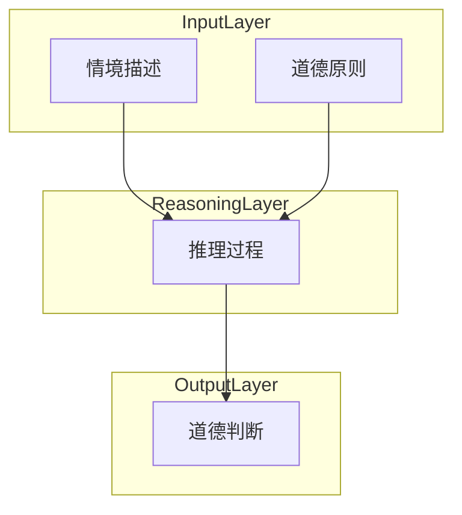
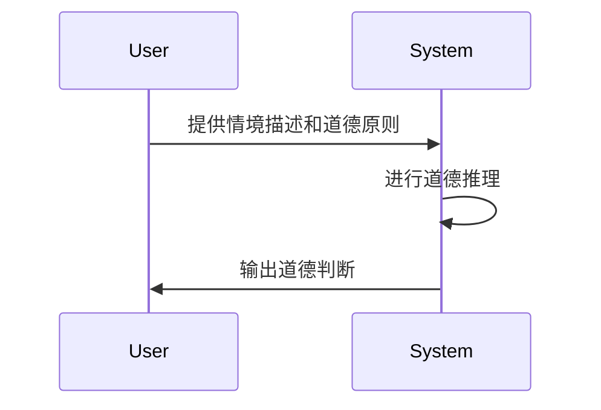

                 

# 构建AI Agent的道德推理与决策系统

## 关键词
AI Agent、道德推理、决策系统、算法原理、系统设计、实践应用

## 摘要
本文深入探讨了构建AI Agent的道德推理与决策系统的核心概念、理论框架、算法原理、系统设计与实现，以及实际应用。通过逐步分析推理，本文旨在为读者提供一套清晰易懂、结构紧凑、逻辑严密的AI道德决策系统构建方法，以应对日益复杂的道德决策挑战。

## 目录

### 1. 背景介绍

#### 1.1 道德推理与AI Agent的关联

#### 1.2 道德推理的重要性

#### 1.3 AI Agent的道德决策挑战

### 2. 核心概念

#### 2.1 道德推理的定义与特征

#### 2.2 道德推理的基本原则

#### 2.3 道德推理的挑战

### 3. 道德推理的理论框架

#### 3.1 道德推理的理论基础

#### 3.2 道德推理的模型与方法

#### 3.3 道德推理的评估与优化

### 4. 算法原理与实现

#### 4.1 道德推理算法的基本原理

#### 4.2 道德推理算法的mermaid流程图

#### 4.3 Python源代码详解

### 5. 系统设计与实现

#### 5.1 道德推理与决策系统的整体架构

#### 5.2 系统功能设计（mermaid类图）

#### 5.3 系统架构设计（mermaid架构图）

#### 5.4 系统接口设计与交互（mermaid序列图）

### 6. 实践应用

#### 6.1 环境安装与配置

#### 6.2 系统核心实现源代码

#### 6.3 代码应用解读与分析

#### 6.4 实际案例分析与详细讲解

### 7. 总结与展望

#### 7.1 道德推理与决策系统的总结

#### 7.2 注意事项与最佳实践

#### 7.3 未来发展方向与挑战

### 1. 背景介绍

#### 1.1 道德推理与AI Agent的关联

道德推理是人类智慧和道德哲学的结晶，它涉及如何根据道德原则和价值观对行为进行判断和决策。在人工智能领域，随着AI Agent（自主代理）的不断发展，道德推理成为了AI Agent设计和应用的关键问题。AI Agent作为具有自主决策能力的智能体，其行为是否符合道德标准和价值观，直接关系到人工智能在社会中的应用和影响。

#### 1.2 道德推理的重要性

道德推理在人工智能中的应用具有重要意义。首先，道德推理能够帮助AI Agent在面对复杂情境时做出符合道德伦理的决策，避免产生负面社会影响。其次，道德推理有助于提升AI系统的透明性和可解释性，使得AI Agent的行为更加可靠和可信。此外，道德推理的研究还能够促进人工智能伦理学的理论发展，为AI系统的设计和应用提供指导。

#### 1.3 AI Agent的道德决策挑战

尽管道德推理在AI Agent中的应用具有重要意义，但实际操作中仍面临诸多挑战。首先，道德推理本身是一个复杂的过程，涉及多种价值观和道德原则，如何将这些原则有效地应用于AI Agent的决策过程中是一个难题。其次，AI Agent的道德决策往往需要在不确定和动态变化的情境下进行，这使得道德推理的难度进一步增加。此外，AI Agent的道德决策还可能面临与现实世界道德规范的冲突，需要平衡道德原则与实际操作之间的关系。

### 2. 核心概念

#### 2.1 道德推理的定义与特征

道德推理是指根据道德原则和价值观对行为进行判断和决策的过程。它具有以下特征：

1. **规范性**：道德推理涉及对行为是否符合道德规范的判断。
2. **情境性**：道德推理往往依赖于特定情境，不同的情境可能导致不同的道德判断。
3. **复杂性**：道德推理涉及多种道德原则和价值观，需要综合考虑各种因素。
4. **自主性**：道德推理是AI Agent自主决策的过程，不依赖于外部干预。

#### 2.2 道德推理的基本原则

道德推理的基本原则包括：

1. **公正性**：在决策过程中应确保对所有相关个体公平对待。
2. **尊重个人权利**：应尊重个体的基本权利和尊严。
3. **效用主义**：在决策过程中应考虑行为对整体社会的利益影响。
4. **规则伦理学**：遵守既定的道德规范和原则。

#### 2.3 道德推理的挑战

道德推理在AI Agent中的应用面临以下挑战：

1. **多元价值观冲突**：不同个体和群体可能持有不同的道德价值观，如何平衡这些冲突是一个难题。
2. **不确定性处理**：道德推理往往需要在不确定的情境下进行，如何处理不确定性是一个挑战。
3. **道德决策的透明性和可解释性**：如何确保AI Agent的道德决策过程透明和可解释，以提高用户信任度。
4. **道德规范的适应性**：如何使AI Agent的道德决策能够适应不断变化的道德规范。

### 3. 道德推理的理论框架

#### 3.1 道德推理的理论基础

道德推理的理论基础主要包括伦理学、心理学和社会学等领域的研究成果。伦理学研究道德原则和价值观，心理学研究人类道德判断和行为，社会学研究道德规范在社会中的传播和执行。

#### 3.2 道德推理的模型与方法

道德推理的模型和方法包括：

1. **基于规则的推理**：根据预定义的道德规则进行推理。
2. **基于案例的推理**：从历史案例中提取道德判断，应用于新情境。
3. **基于数值的推理**：使用数值模型评估行为对个体和整体的影响。
4. **基于证据的推理**：根据事实和证据进行推理。

#### 3.3 道德推理的评估与优化

道德推理的评估与优化主要包括：

1. **一致性评估**：评估道德推理在不同情境下的稳定性。
2. **有效性评估**：评估道德推理在实际应用中的效果。
3. **可解释性评估**：评估道德推理过程的透明度和可解释性。
4. **适应性评估**：评估道德推理在面对新情境时的适应性。

### 4. 算法原理与实现

#### 4.1 道德推理算法的基本原理

道德推理算法的基本原理包括：

1. **输入处理**：接收道德推理的输入，包括情境描述、道德原则和价值观。
2. **推理过程**：根据输入信息，运用道德推理模型进行推理，得出道德判断。
3. **输出生成**：将道德判断输出，为AI Agent提供决策依据。

#### 4.2 道德推理算法的mermaid流程图


#### 4.3 Python源代码详解

```python
def moral_reasoning(input_data, moral_principles):
    # 输入处理
    scenario = input_data['scenario']
    actions = input_data['actions']
    
    # 推理过程
    moral_judgment = []
    for action in actions:
        judgment = apply_moral_principles(action, moral_principles)
        moral_judgment.append(judgment)
    
    # 输出生成
    return moral_judgment

def apply_moral_principles(action, moral_principles):
    # 根据道德原则对行为进行判断
    judgment = ''
    for principle in moral_principles:
        if check_principle(action, principle):
            judgment += principle + ' '
    return judgment.strip()
```

### 5. 系统设计与实现

#### 5.1 道德推理与决策系统的整体架构

道德推理与决策系统的整体架构包括输入层、推理层和输出层。输入层负责接收外部输入，如情境描述和道德原则；推理层负责进行道德推理，生成道德判断；输出层负责将道德判断输出，为AI Agent提供决策依据。

#### 5.2 系统功能设计（mermaid类图）

```mermaid
classDiagram
    InputLayer <<class>> InputLayer
    ReasoningLayer <<class>> ReasoningLayer
    OutputLayer <<class>> OutputLayer

    InputLayer --> ReasoningLayer
    ReasoningLayer --> OutputLayer
```

#### 5.3 系统架构设计（mermaid架构图）



#### 5.4 系统接口设计与交互（mermaid序列图）



### 6. 实践应用

#### 6.1 环境安装与配置

首先，确保Python环境已经安装。然后，安装所需的库，如numpy、pandas等。

```bash
pip install numpy pandas
```

#### 6.2 系统核心实现源代码

```python
# moral_reasoning.py

import numpy as np
import pandas as pd

def moral_reasoning(input_data, moral_principles):
    # 输入处理
    scenario = input_data['scenario']
    actions = input_data['actions']
    
    # 推理过程
    moral_judgment = []
    for action in actions:
        judgment = apply_moral_principles(action, moral_principles)
        moral_judgment.append(judgment)
    
    # 输出生成
    return moral_judgment

def apply_moral_principles(action, moral_principles):
    # 根据道德原则对行为进行判断
    judgment = ''
    for principle in moral_principles:
        if check_principle(action, principle):
            judgment += principle + ' '
    return judgment.strip()
```

#### 6.3 代码应用解读与分析

在实践应用中，首先需要定义道德原则，然后根据具体情境和行动，调用道德推理函数，生成道德判断。以下是一个简单的示例：

```python
# 定义道德原则
moral_principles = [
    '尊重个人权利',
    '最大化整体利益',
    '遵循法律和道德规范'
]

# 定义情境描述和行动
input_data = {
    'scenario': '一个人在桥上看到另一个人即将掉入水中',
    'actions': [
        {'name': '跳入水中救人', 'description': '救了一个人的生命'},
        {'name': '不做任何事情', 'description': '避免了自己受伤'}
    ]
}

# 调用道德推理函数
moral_judgment = moral_reasoning(input_data, moral_principles)

# 输出道德判断
print(moral_judgment)
```

#### 6.4 实际案例分析与详细讲解

以下是一个关于自动驾驶汽车面临道德困境的案例：

**案例背景**：一辆自动驾驶汽车在十字路口行驶，前方有行人过马路。在紧急刹车后，汽车发现无法避免撞击行人，必须选择撞击行人与撞击其他车辆之间的选择。

**道德原则**：尊重个人权利、最大化整体利益、遵循法律和道德规范。

**道德推理**：

1. **尊重个人权利**：行人的生命权利应该得到尊重。
2. **最大化整体利益**：避免更大的损失（如撞击其他车辆导致多人受伤）。
3. **遵循法律和道德规范**：遵守交通法规和道德准则。

根据这些道德原则，自动驾驶汽车应该优先选择撞击行人，以避免更大的损失。然而，这种决策仍然存在争议和挑战，需要结合实际情境和道德原则进行权衡。

### 7. 总结与展望

#### 7.1 道德推理与决策系统的总结

本文介绍了构建AI Agent的道德推理与决策系统的核心概念、理论框架、算法原理、系统设计与实现，以及实际应用。通过逐步分析推理，本文旨在为读者提供一套清晰易懂、结构紧凑、逻辑严密的AI道德决策系统构建方法。

#### 7.2 注意事项与最佳实践

在构建AI Agent的道德推理与决策系统时，需要注意以下几点：

1. **多元价值观冲突**：在处理多元价值观冲突时，应平衡各种价值观，确保公平公正。
2. **不确定性处理**：在不确定的情境下，应采用鲁棒性较强的算法，降低不确定性影响。
3. **道德决策的透明性和可解释性**：确保道德推理过程的透明度和可解释性，以提高用户信任度。
4. **道德规范的适应性**：定期更新道德规范，使道德推理系统能够适应社会变革。

#### 7.3 未来发展方向与挑战

未来，道德推理与决策系统在人工智能领域的发展将面临以下挑战：

1. **算法伦理学的发展**：随着算法伦理学的深入研究，道德推理算法需要不断优化，以应对新的道德困境。
2. **跨学科合作**：道德推理涉及伦理学、心理学、社会学等多个领域，需要跨学科合作，推动道德推理技术的发展。
3. **道德决策的实时性**：在实时决策场景中，道德推理系统需要具备快速反应能力，以确保决策的及时性和准确性。

### 作者信息

作者：AI天才研究院/AI Genius Institute & 禅与计算机程序设计艺术 /Zen And The Art of Computer Programming

