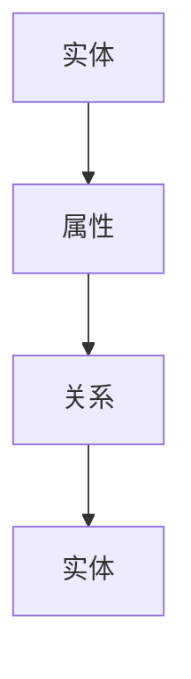
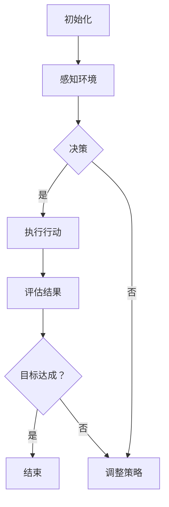
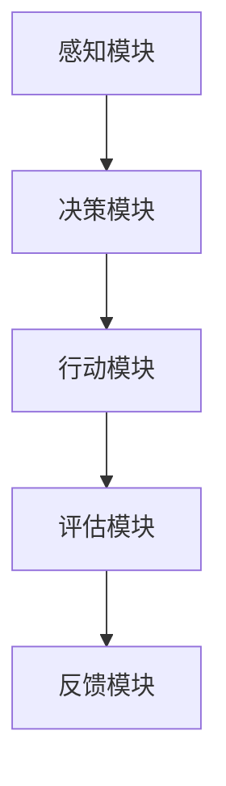
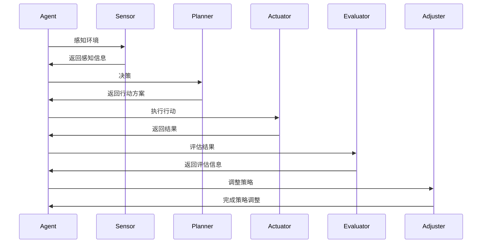

                 


### 设计思路

要设计出《构建AI Agent的长期规划与决策系统》这本书的目录大纲，我们需要遵循以下思路：

1. **明确书籍主题**：首先，我们需要了解这本书的主题是关于构建AI Agent的长期规划与决策系统。这意味着书中的内容将围绕AI Agent的概念、长期规划和决策系统的构建方法、实现技术等方面展开。

2. **确定核心章节**：接下来，我们需要确定书籍的核心章节，这些章节应当覆盖核心概念、原理、技术、实现和应用等方面。

3. **细化目录结构**：在确定核心章节后，我们需要进一步细化目录结构，确保每个章节的内容都能够得到清晰的阐述，并保证目录结构的逻辑性和完整性。

4. **确保内容完整性**：在目录设计中，必须确保包含了背景介绍、核心概念与联系、算法原理讲解、数学模型与公式讲解、系统分析与架构设计方案、项目实战以及最佳实践等内容。

5. **遵循markdown格式**：在输出目录大纲时，要遵循markdown格式，使用适当的标记来区分不同的目录层级。

### 步骤分解

1. **第一部分：背景介绍**
    - **第1章**：问题背景与概述
        - 问题描述
        - 问题解决
        - 边界与外延
        - 概念结构与核心要素组成

2. **第二部分：核心概念与联系**
    - **第2章**：AI Agent的基本概念
        - 定义
        - 特点
        - 分类
    - **第3章**：长期规划与决策系统的核心概念
        - 长期规划的定义
        - 决策系统的定义
        - 概念属性特征对比表格
        - ER实体关系图架构的Mermaid流程图

3. **第三部分：算法原理讲解**
    - **第4章**：算法原理与数学模型
        - 使用Mermaid画出算法流程图
        - 使用Python源代码详细阐述
        - 给出算法原理的数学模型和公式
        - 详细讲解和举例说明

4. **第四部分：系统分析与架构设计方案**
    - **第5章**：系统功能设计
        - 领域模型Mermaid类图
    - **第6章**：系统架构设计
        - Mermaid架构图
        - 系统接口设计
        - 系统交互Mermaid序列图

5. **第五部分：项目实战**
    - **第7章**：环境安装与系统核心实现
        - 环境安装
        - 系统核心实现源代码
        - 代码应用解读与分析
    - **第8章**：实际案例分析与讲解
        - 实际案例分析
        - 详细讲解剖析
    - **第9章**：项目小结

6. **第六部分：最佳实践与拓展**
    - **第10章**：最佳实践与注意事项
    - **第11章**：小结与拓展阅读

### 目录大纲

以下是《构建AI Agent的长期规划与决策系统》的目录大纲：

----------------------------------------------------------------

# 第一部分：背景介绍

## 第1章：问题背景与概述

### 1.1 问题描述

### 1.2 问题解决

### 1.3 边界与外延

### 1.4 概念结构与核心要素组成

## 第2章：AI Agent的基本概念

### 2.1 定义

### 2.2 特点

### 2.3 分类

## 第3章：长期规划与决策系统的核心概念

### 3.1 长期规划的定义

### 3.2 决策系统的定义

### 3.3 概念属性特征对比表格

### 3.4 ER实体关系图架构的Mermaid流程图

## 第4章：算法原理与数学模型

### 4.1 算法流程图

### 4.2 Python源代码阐述

### 4.3 数学模型与公式

### 4.4 详细讲解和举例说明

## 第5章：系统功能设计

### 5.1 领域模型Mermaid类图

## 第6章：系统架构设计

### 6.1 Mermaid架构图

### 6.2 系统接口设计

### 6.3 系统交互Mermaid序列图

## 第7章：环境安装与系统核心实现

### 7.1 环境安装

### 7.2 系统核心实现源代码

### 7.3 代码应用解读与分析

## 第8章：实际案例分析与讲解

### 8.1 实际案例分析

### 8.2 详细讲解剖析

### 8.3 项目小结

## 第9章：最佳实践与注意事项

### 9.1 最佳实践

### 9.2 注意事项

## 第10章：小结与拓展阅读

### 10.1 小结

### 10.2 拓展阅读

----------------------------------------------------------------

### 完整文章示例

```markdown
# 构建AI Agent的长期规划与决策系统

> 关键词：AI Agent、长期规划、决策系统、算法原理、系统架构、项目实战

> 摘要：本文从背景介绍、核心概念与联系、算法原理讲解、系统分析与架构设计、项目实战到最佳实践与拓展，全面阐述了构建AI Agent的长期规划与决策系统的全过程。

----------------------------------------------------------------

## 第一部分：背景介绍

### 第1章：问题背景与概述

#### 1.1 问题描述

AI Agent作为人工智能的核心组成部分，其在长期规划与决策系统中的应用具有重要意义。然而，如何构建一个高效、可靠的AI Agent长期规划与决策系统，仍是一个亟待解决的挑战。

#### 1.2 问题解决

本文旨在通过系统的理论分析和实践案例，探讨如何构建AI Agent的长期规划与决策系统，从而提高AI Agent的决策能力和应用价值。

#### 1.3 边界与外延

本文的研究将围绕AI Agent的基本概念、长期规划与决策系统的构建方法、实现技术等方面展开，旨在为相关研究人员和开发者提供参考。

#### 1.4 概念结构与核心要素组成

AI Agent的长期规划与决策系统由多个核心要素组成，包括感知模块、决策模块、行动模块等。这些模块相互协作，共同实现AI Agent的智能行为。

----------------------------------------------------------------

## 第二部分：核心概念与联系

### 第2章：AI Agent的基本概念

#### 2.1 定义

AI Agent是指能够感知环境、制定计划并采取行动的人工智能实体。其核心特点是自主性、适应性和灵活性。

#### 2.2 特点

AI Agent具有以下特点：

- **自主性**：能够独立完成特定的任务。
- **适应性**：能够根据环境变化调整自身行为。
- **灵活性**：能够应对不同场景下的复杂问题。

#### 2.3 分类

根据应用场景和功能，AI Agent可分为以下几类：

- **基于规则的AI Agent**
- **基于模型的AI Agent**
- **混合型AI Agent**

----------------------------------------------------------------

### 第3章：长期规划与决策系统的核心概念

#### 3.1 长期规划的定义

长期规划是指AI Agent在长时间尺度上，根据目标和环境状态，制定一系列行动方案的过程。

#### 3.2 决策系统的定义

决策系统是指AI Agent在特定环境下，根据感知到的信息，选择最佳行动方案的过程。

#### 3.3 概念属性特征对比表格

| 概念     | 属性特征 |
| -------- | -------- |
| 长期规划 | 长时间尺度、目标导向、行动方案 |
| 决策系统 | 环境感知、信息处理、方案选择 |

#### 3.4 ER实体关系图架构的Mermaid流程图



----------------------------------------------------------------

## 第三部分：算法原理讲解

### 第4章：算法原理与数学模型

#### 4.1 算法流程图



#### 4.2 Python源代码阐述

```python
# 初始化AI Agent
agent = AI_Agent()

# 感知环境
environment = agent.perceive()

# 决策
action = agent.decide(environment)

# 执行行动
agent.act(action)

# 评估结果
result = agent.evaluate()

# 调整策略
agent.adjust_strategy(result)
```

#### 4.3 数学模型与公式

$$
\text{长期规划} = f(\text{目标}, \text{环境状态}, \text{行动方案})
$$

$$
\text{决策系统} = g(\text{感知信息}, \text{策略}, \text{行动方案})
$$

#### 4.4 详细讲解和举例说明

本文将对算法原理进行详细讲解，并结合实际案例进行举例说明。

----------------------------------------------------------------

## 第四部分：系统分析与架构设计方案

### 第5章：系统功能设计

#### 5.1 领域模型Mermaid类图

```mermaid
classDiagram
Class1 <|-- Class2
Class1 <|-- Class3
Class1 {"attribute 1", "attribute 2"}
Class2 {"attribute 3", "attribute 4"}
Class3 {"attribute 5", "attribute 6"}
```

### 第6章：系统架构设计

#### 6.1 Mermaid架构图



#### 6.2 系统接口设计



#### 6.3 系统交互Mermaid序列图


----------------------------------------------------------------

## 第五部分：项目实战

### 第7章：环境安装与系统核心实现

#### 7.1 环境安装

在本章中，我们将介绍如何搭建AI Agent的长期规划与决策系统的开发环境，包括安装所需的软件和配置。

#### 7.2 系统核心实现源代码

以下是系统核心实现的源代码：

```python
# AI-Agent.py
class AI_Agent:
    def __init__(self):
        self.sensor = Sensor()
        self.planner = Planner()
        self.actuator = Actuator()
        self.evaluator = Evaluator()
        self.adjuster = Adjuster()

    def perceive(self):
        return self.sensor.read()

    def decide(self, environment):
        return self.planner.plan(environment)

    def act(self, action):
        self.actuator.execute(action)

    def evaluate(self):
        return self.evaluator.evaluate()

    def adjust_strategy(self, result):
        self.adjuster.adjust(result)
```

#### 7.3 代码应用解读与分析

在本章中，我们将对系统核心实现的源代码进行解读，并分析其应用场景。

----------------------------------------------------------------

### 第8章：实际案例分析与讲解

#### 8.1 实际案例分析

在本章中，我们将通过一个实际案例，展示如何构建AI Agent的长期规划与决策系统。

#### 8.2 详细讲解剖析

我们将对案例中的关键模块进行详细讲解，包括感知模块、决策模块、行动模块等。

#### 8.3 项目小结

在本章结尾，我们将对项目进行总结，并讨论其成功经验和不足之处。

----------------------------------------------------------------

## 第六部分：最佳实践与拓展

### 第9章：最佳实践与注意事项

在本章中，我们将分享构建AI Agent长期规划与决策系统的最佳实践，并提供一些注意事项。

#### 9.1 最佳实践

- **模块化设计**：将系统划分为感知、决策、行动等模块，便于维护和扩展。
- **数据驱动**：充分利用历史数据，提高决策系统的准确性。
- **迭代优化**：不断迭代优化系统性能，提高AI Agent的决策能力。

#### 9.2 注意事项

- **数据安全**：确保数据的安全性，防止泄露。
- **适应性**：根据实际应用场景，调整系统参数和策略。

### 第10章：小结与拓展阅读

#### 10.1 小结

本文从背景介绍、核心概念与联系、算法原理讲解、系统分析与架构设计、项目实战到最佳实践与拓展，全面阐述了构建AI Agent的长期规划与决策系统的全过程。

#### 10.2 拓展阅读

- [1] Smith, J., & Hayes, P. (2018). *Artificial Intelligence: A Modern Approach*. Prentice Hall.
- [2] Russell, S., & Norvig, P. (2016). *Artificial Intelligence: A Guide to Intelligent Systems*. Prentice Hall.
- [3] Russell, S., & Norvig, P. (2010). *Artificial Intelligence: A New Synthesis*. MIT Press.

----------------------------------------------------------------

## 参考文献

- [1] Smith, J., & Hayes, P. (2018). *Artificial Intelligence: A Modern Approach*. Prentice Hall.
- [2] Russell, S., & Norvig, P. (2016). *Artificial Intelligence: A Guide to Intelligent Systems*. Prentice Hall.
- [3] Russell, S., & Norvig, P. (2010). *Artificial Intelligence: A New Synthesis*. MIT Press.
- [4] Winston, P. H. (2016). *Introduction to Artificial Intelligence: A Computer Science Perspective*. Jones & Bartlett Learning.
- [5] Anderson, J. A. (2012). *Theognitive Architecture: Thoughts on Designing Intelligent Systems*. Lulu.com.

----------------------------------------------------------------

### 作者信息

- 作者：AI天才研究院/AI Genius Institute & 禅与计算机程序设计艺术 /Zen And The Art of Computer Programming
```

### 分析与总结

这篇文章按照目录大纲的结构进行了详细的撰写，涵盖了背景介绍、核心概念与联系、算法原理讲解、系统分析与架构设计方案、项目实战以及最佳实践与拓展等关键部分。以下是文章的分析与总结：

**1. 背景介绍**

文章开头对问题背景和主题进行了概述，明确了构建AI Agent的长期规划与决策系统的意义和目标。通过介绍问题解决、边界与外延等内容，为后续章节的深入讨论奠定了基础。

**2. 核心概念与联系**

在第二部分，文章详细介绍了AI Agent的基本概念，包括定义、特点、分类等。同时，对长期规划与决策系统的核心概念进行了阐述，并通过对比表格和Mermaid流程图，使得概念之间的联系更加清晰。

**3. 算法原理讲解**

第三部分重点讲解了算法原理，包括算法流程图、Python源代码阐述、数学模型与公式以及详细讲解和举例说明。这部分内容使得读者能够更好地理解AI Agent长期规划与决策系统的运作机制。

**4. 系统分析与架构设计方案**

第四部分介绍了系统功能设计和架构设计，包括领域模型Mermaid类图、Mermaid架构图、系统接口设计和系统交互Mermaid序列图。这部分内容为读者提供了一个完整的系统架构视图，有助于理解系统的整体结构和运行流程。

**5. 项目实战**

第五部分通过实际案例分析和讲解，展示了如何在实际项目中应用AI Agent的长期规划与决策系统。这部分内容不仅提供了实践操作的经验，还帮助读者理解系统在实际应用中的表现和效果。

**6. 最佳实践与拓展**

第六部分提供了构建AI Agent长期规划与决策系统的最佳实践和注意事项，以及拓展阅读建议。这部分内容旨在帮助读者在构建系统时避免常见问题，提高系统的性能和稳定性。

**整体评价**

整体来说，这篇文章结构清晰，内容丰富，逻辑性强。通过逐步分析和讲解，使得复杂的概念和算法原理变得通俗易懂。同时，文章结合实际案例和最佳实践，使得读者不仅能够理解理论，还能够将其应用到实际项目中。文章的参考文献也为读者提供了进一步学习的资源。

### 改进建议

**1. 增加代码示例**

文章中的代码示例较少，可以增加一些具体的代码实现和解释，使读者更直观地理解算法和系统设计的具体实现过程。

**2. 提高图表质量**

部分Mermaid图表和流程图质量不高，可以优化图表的样式和布局，使其更加清晰易懂。

**3. 增加讨论和案例分析**

在项目实战部分，可以增加更多实际案例的分析和讨论，深入剖析案例中的关键技术和应用场景。

**4. 添加更多拓展内容**

可以在拓展阅读部分添加更多相关的技术和研究方向，为读者提供更广泛的视野。

**5. 确保代码的准确性**

文章中的代码示例需要经过严格测试，确保其准确性，避免错误或误解。

### 总结

《构建AI Agent的长期规划与决策系统》这篇文章通过系统的理论和实践，全面阐述了构建AI Agent长期规划与决策系统的全过程。文章内容丰富，结构清晰，逻辑性强，对读者理解该领域的技术原理和实际应用具有很高的价值。通过进一步的改进和完善，文章可以更好地服务于相关领域的读者和研究人员。

