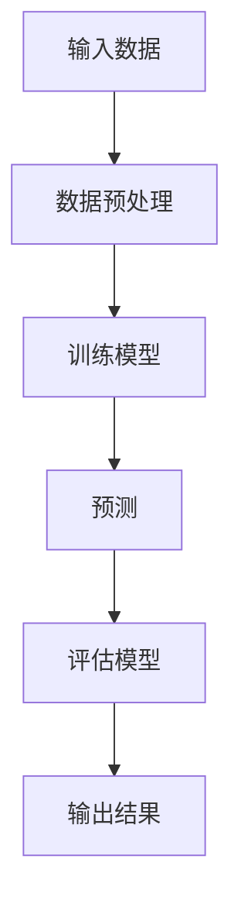
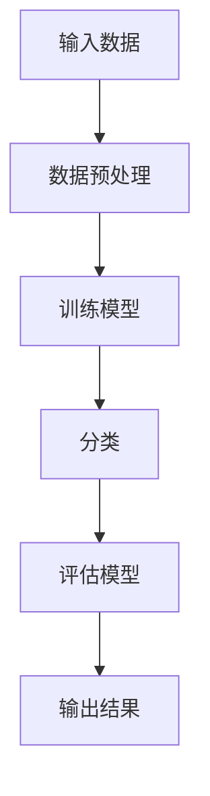
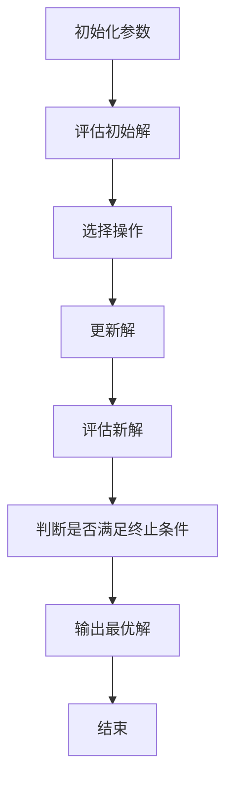
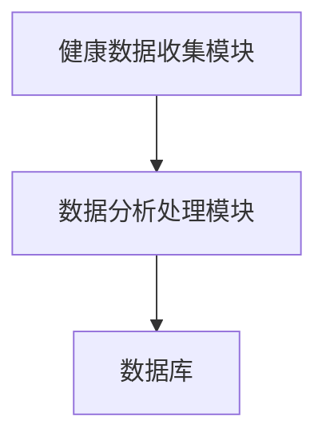
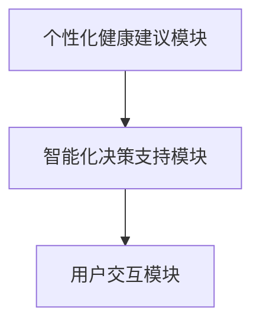
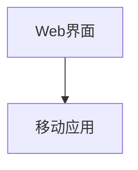
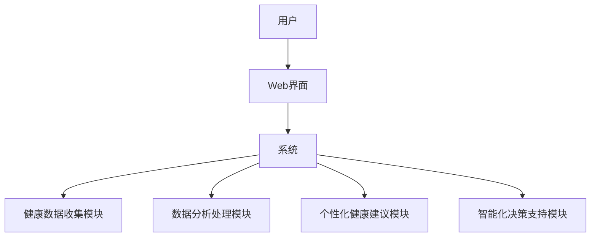
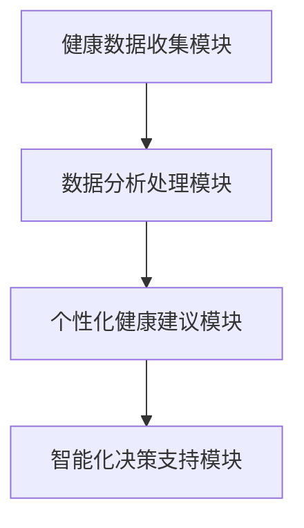
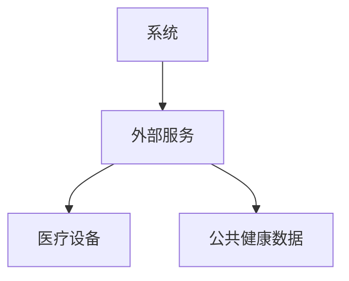

                 


# 构建AI Agent驱动的智能健康管理系统

> 关键词：AI Agent，智能健康管理，算法原理，系统架构，项目实战

> 摘要：本文旨在探讨如何构建AI Agent驱动的智能健康管理系统，包括核心概念与联系、算法原理讲解、系统分析与架构设计方案以及项目实战等多个方面。通过一步一步的分析和推理，本文将详细介绍AI Agent在健康管理中的应用、算法原理及其实现、系统架构设计，并分享一个实际案例的详细剖析，以期为相关领域的开发者和研究者提供有价值的参考。

## 引言与背景

### 1.1 问题背景

#### 1.1.1 智能健康管理的需求

随着科技的飞速发展，人工智能（AI）在医疗健康领域得到了广泛应用。智能健康管理作为一种新兴的应用模式，旨在利用AI技术实现个性化、智能化和高效化的健康服务。智能健康管理涉及多个方面，包括健康数据收集、数据分析、健康风险评估、疾病预测以及个性化健康建议等。

#### 1.1.2 AI Agent的定义与功能

AI Agent，即人工智能代理，是一种能够自主执行任务、适应环境和与人类交互的智能系统。AI Agent具有自主性、反应性、社交性和可解释性等核心特性。在健康管理中，AI Agent可以扮演多种角色，如健康数据分析师、健康顾问、智能诊断助手等。

#### 1.1.3 AI Agent在健康管理中的应用潜力

AI Agent在健康管理中的应用潜力巨大。通过利用AI Agent，可以实现以下目标：

1. 提高健康管理效率，通过自动化处理大量健康数据，减少人工干预。
2. 提供个性化健康服务，根据用户的健康状况和需求，提供定制化的健康建议。
3. 智能化决策支持，利用AI算法分析健康数据，为医生提供诊断和治疗方案。

### 1.2 问题的提出

#### 1.2.1 健康管理中的挑战

尽管AI Agent在健康管理中具有巨大潜力，但在实际应用中仍面临一些挑战：

1. 数据隐私与安全：健康数据涉及个人隐私，如何在保证数据安全的前提下进行数据处理和分析，是一个亟待解决的问题。
2. 技术实现的复杂性：健康管理涉及多个学科领域，实现AI Agent驱动的健康管理系统需要具备跨学科的知识和技能。
3. 道德与伦理问题：如何确保AI Agent在健康管理中的行为符合道德和伦理标准，是一个需要深入探讨的问题。

#### 1.2.2 AI Agent在健康管理中的问题

1. AI Agent的性能评估：如何评价AI Agent在健康管理中的性能，是一个重要的问题。
2. AI Agent的可靠性：如何在复杂的环境中保证AI Agent的稳定性和可靠性。
3. AI Agent的交互设计：如何设计用户友好的交互界面，提高用户体验。

#### 1.2.3 解决方案的目标

本文的目标是构建一个AI Agent驱动的智能健康管理系统，解决上述问题，实现以下目标：

1. 提高健康管理效率，通过自动化处理健康数据，减少人工干预。
2. 提供个性化健康服务，根据用户的健康状况和需求，提供定制化的健康建议。
3. 智能化决策支持，利用AI算法分析健康数据，为医生提供诊断和治疗方案。
4. 确保数据安全和隐私，采用先进的加密技术和隐私保护算法。
5. 提高AI Agent的性能和可靠性，通过持续优化和改进。
6. 设计用户友好的交互界面，提高用户体验。

### 1.3 边界与外延

#### 1.3.1 系统的功能范围

本文构建的AI Agent驱动的智能健康管理系统主要包括以下功能：

1. 健康数据收集与存储：收集用户健康数据，如血压、血糖、心率等，并存储在数据库中。
2. 数据分析与处理：利用AI算法分析健康数据，提取特征，进行健康风险评估和疾病预测。
3. 个性化健康建议：根据用户的健康状况和需求，提供个性化的健康建议和治疗方案。
4. 智能化决策支持：为医生提供诊断和治疗方案，辅助医生做出明智的决策。
5. 用户交互：通过Web界面、移动应用等方式，与用户进行交互，提供健康管理服务。

#### 1.3.2 数据的来源与处理

系统数据的来源主要包括：

1. 用户手动输入：用户可以通过Web界面或移动应用手动输入健康数据。
2. 医疗设备采集：通过连接医疗设备，如血压计、血糖仪等，自动采集健康数据。
3. 公共健康数据：从公共健康数据源，如公共卫生部门、医疗机构等获取健康数据。

数据处理过程包括：

1. 数据清洗：去除无效、错误和重复的数据。
2. 数据整合：将来自不同来源的数据进行整合，形成一个统一的健康数据视图。
3. 数据分析：利用AI算法对健康数据进行分析，提取特征，进行健康风险评估和疾病预测。
4. 数据可视化：将分析结果以图表、报表等形式展示给用户，帮助用户更好地了解自己的健康状况。

#### 1.3.3 系统的适用人群

本文构建的AI Agent驱动的智能健康管理系统适用于以下人群：

1. 健康人群：帮助健康人群了解自己的健康状况，提供个性化的健康建议和预防措施。
2. 慢性病人群：为慢性病人群提供疾病风险评估、预警和个性化的健康管理方案。
3. 医疗机构：为医疗机构提供智能化的健康管理工具，辅助医生进行诊断和治疗。
4. 健康管理公司：为健康管理公司提供数据分析和决策支持，提高健康管理效率。

## 第二部分：核心概念与联系

### 2.1 AI Agent的基础概念

#### 2.1.1 AI Agent的定义

AI Agent，即人工智能代理，是一种具有自主性、反应性、社交性和可解释性的智能系统。它能够感知环境、制定计划、执行任务并与其他系统进行交互。

#### 2.1.2 AI Agent的核心特性

AI Agent的核心特性包括：

1. 自主性：AI Agent能够在没有人类干预的情况下自主决策和执行任务。
2. 反应性：AI Agent能够对环境变化做出实时响应。
3. 社交性：AI Agent能够与其他系统进行交互，共享信息和知识。
4. 可解释性：AI Agent的决策过程和结果具有可解释性，用户可以理解其决策依据和原因。

#### 2.1.3 AI Agent的发展历程

AI Agent的发展历程可以追溯到20世纪80年代。在此期间，研究人员开始探索如何构建具有自主性和反应性的智能系统。随着人工智能技术的不断发展，AI Agent的概念逐渐成熟，并在多个领域得到了广泛应用。

### 2.2 AI Agent与健康管理系统的关系

#### 2.2.1 AI Agent在健康管理中的作用

AI Agent在健康管理中具有重要作用，主要包括：

1. 健康数据分析师：AI Agent能够自动收集、处理和分析大量健康数据，为用户提供全面的健康评估。
2. 健康顾问：AI Agent能够根据用户的健康状况和需求，提供个性化的健康建议和治疗方案。
3. 智能诊断助手：AI Agent能够利用医学知识库和健康数据，辅助医生进行疾病诊断和治疗。

#### 2.2.2 健康管理系统的架构与AI Agent的融合

健康管理系统的架构主要包括数据收集层、数据处理层、决策支持层和用户交互层。AI Agent可以嵌入到这些层次中，实现以下功能：

1. 数据收集层：AI Agent可以自动收集用户健康数据，如血压、血糖、心率等。
2. 数据处理层：AI Agent可以对收集到的健康数据进行分析和清洗，提取特征，为后续决策提供支持。
3. 决策支持层：AI Agent可以利用机器学习算法，对健康数据进行预测、分类和优化，为用户提供个性化的健康建议。
4. 用户交互层：AI Agent可以通过Web界面、移动应用等方式，与用户进行交互，提供健康管理服务。

#### 2.2.3 AI Agent在健康管理系统中的具体应用

AI Agent在健康管理系统中的具体应用包括：

1. 个性化健康风险评估：AI Agent可以根据用户的健康状况、生活习惯和家族病史，预测其患病的风险，并提供相应的预防措施。
2. 疾病预测：AI Agent可以利用历史健康数据和医学知识库，预测用户可能患的疾病，为医生提供诊断参考。
3. 个性化健康建议：AI Agent可以根据用户的健康状况和需求，提供个性化的饮食、运动、用药等方面的建议。
4. 智能化决策支持：AI Agent可以为医生提供疾病诊断和治疗方案的建议，辅助医生做出更明智的决策。

### 2.3 AI Agent的核心特征

#### 2.3.1 自主性

AI Agent的自主性体现在以下几个方面：

1. 自主导航：AI Agent可以根据目标地点和交通状况，自主规划最优路径。
2. 自主决策：AI Agent可以根据环境变化和任务要求，自主选择最佳行动方案。
3. 自主执行：AI Agent可以自主执行任务，无需人工干预。

#### 2.3.2 反应性

AI Agent的反应性体现在以下几个方面：

1. 实时感知：AI Agent可以实时感知环境变化，如温度、湿度、光照等。
2. 及时响应：AI Agent可以及时响应环境变化，采取相应的行动。
3. 自适应：AI Agent可以根据环境变化，调整自身的行为和策略。

#### 2.3.3 社交性

AI Agent的社交性体现在以下几个方面：

1. 信息共享：AI Agent可以与其他系统或设备共享信息和知识。
2. 协作：AI Agent可以与其他AI Agent或人类合作，共同完成任务。
3. 情感交互：AI Agent可以理解人类情感，进行情感交互。

#### 2.3.4 可解释性

AI Agent的可解释性体现在以下几个方面：

1. 决策透明：AI Agent的决策过程和结果具有可解释性，用户可以了解其决策依据和原因。
2. 知识可视化：AI Agent可以将抽象的知识和模型以可视化形式呈现，用户可以更直观地理解。
3. 模型解释：AI Agent可以解释其模型的运作原理和预测过程，用户可以更深入地了解其工作原理。

### 2.4 AI Agent在健康管理中的优势与挑战

#### 2.4.1 优势

AI Agent在健康管理中具有以下优势：

1. 提高健康管理效率：AI Agent可以自动化处理大量健康数据，减少人工干预，提高工作效率。
2. 个性化健康服务：AI Agent可以根据用户的健康状况和需求，提供个性化的健康建议和治疗方案，提高服务质量。
3. 智能化决策支持：AI Agent可以利用机器学习算法，分析健康数据，为医生提供诊断和治疗方案的建议，提高诊断和治疗的准确性。
4. 降低医疗成本：通过AI Agent的自动化处理和决策支持，可以降低医疗机构的运营成本。

#### 2.4.2 挑战

AI Agent在健康管理中面临以下挑战：

1. 数据隐私与安全：健康数据涉及个人隐私，如何在保证数据安全的前提下进行数据处理和分析，是一个亟待解决的问题。
2. 技术实现的复杂性：健康管理涉及多个学科领域，实现AI Agent驱动的健康管理系统需要具备跨学科的知识和技能。
3. 道德与伦理问题：如何确保AI Agent在健康管理中的行为符合道德和伦理标准，是一个需要深入探讨的问题。

### 2.5 本章小结

本章介绍了AI Agent驱动的智能健康管理系统的核心概念与联系。通过分析AI Agent的基础概念、核心特征以及与健康管理系统的关系，我们了解到AI Agent在健康管理中的应用潜力。同时，我们也认识到AI Agent在健康管理中面临的挑战，如数据隐私与安全、技术实现的复杂性等。在后续章节中，我们将进一步探讨算法原理、系统架构设计以及项目实战，以期为构建AI Agent驱动的智能健康管理系统的实现提供有力支持。

## 第三部分：算法原理讲解

### 3.1 健康管理算法概述

健康管理算法是智能健康管理系统的核心组成部分，主要包括预测算法、分类算法和优化算法等。这些算法在健康数据分析和处理过程中发挥着关键作用。

#### 3.1.1 常见的健康管理算法

1. **预测算法**：预测算法主要用于预测用户的健康状况和疾病风险。常见的预测算法包括线性回归、决策树、随机森林、支持向量机（SVM）等。
2. **分类算法**：分类算法用于对健康数据进行分析和分类，以便为用户提供针对性的健康建议。常见的分类算法包括K最近邻（KNN）、朴素贝叶斯（NB）、逻辑回归（LR）等。
3. **优化算法**：优化算法用于优化用户的健康指标，如体重、血压等。常见的优化算法包括遗传算法（GA）、粒子群优化（PSO）、模拟退火（SA）等。

#### 3.1.2 健康管理算法的分类

根据算法的原理和应用场景，健康管理算法可以分为以下几类：

1. **基于统计学的算法**：这类算法主要利用统计学方法对健康数据进行分析和预测。例如，线性回归、逻辑回归等。
2. **基于机器学习的算法**：这类算法利用历史数据训练模型，然后对新数据进行预测和分类。例如，决策树、支持向量机（SVM）、随机森林等。
3. **基于深度学习的算法**：这类算法利用深度神经网络对健康数据进行建模和预测。例如，卷积神经网络（CNN）、循环神经网络（RNN）等。

#### 3.1.3 健康管理算法的应用场景

健康管理算法在不同应用场景中具有不同的优势：

1. **疾病预测**：利用预测算法对用户的健康状况和疾病风险进行预测，有助于提前发现潜在的健康问题。
2. **健康风险评估**：利用分类算法对用户的健康数据进行分析和分类，评估其健康风险。
3. **个性化健康建议**：利用优化算法为用户提供个性化的健康建议，帮助其改善健康状况。

### 3.2 预测算法在健康管理中的应用

预测算法在健康管理中的应用非常广泛，主要涉及以下几个方面：

#### 3.2.1 预测算法的基本原理

预测算法的基本原理是基于历史数据和统计学方法，对未来的数据进行预测。常见的预测算法包括线性回归、决策树、支持向量机（SVM）等。

1. **线性回归**：线性回归是一种基于统计学的方法，用于预测连续值。其基本原理是找到一条最佳拟合线，使得预测值与实际值之间的误差最小。
2. **决策树**：决策树是一种基于分类的方法，用于预测离散值。其基本原理是通过一系列条件判断，将数据划分为多个子集，然后对每个子集进行分类。
3. **支持向量机（SVM）**：支持向量机是一种基于机器学习的方法，用于预测离散值。其基本原理是找到一个最佳超平面，使得不同类别的数据点在超平面上分离。

#### 3.2.2 预测算法的mermaid流程图

以下是一个简单的预测算法的mermaid流程图：



#### 3.2.3 预测算法的Python代码实现

以下是一个简单的线性回归预测算法的Python代码实现：

```python
import numpy as np
from sklearn.linear_model import LinearRegression

# 输入数据
X = np.array([[1], [2], [3], [4], [5]])
y = np.array([1, 2, 3, 4, 5])

# 训练模型
model = LinearRegression()
model.fit(X, y)

# 预测
X_new = np.array([[6]])
y_pred = model.predict(X_new)

print("预测结果：", y_pred)
```

#### 3.2.4 数学模型与公式

线性回归的数学模型可以表示为：

$$
y = \beta_0 + \beta_1x + \epsilon
$$

其中，$y$ 是预测值，$x$ 是输入值，$\beta_0$ 和 $\beta_1$ 是模型参数，$\epsilon$ 是误差项。

#### 3.2.5 举例说明

假设我们有以下一组数据：

| x | y |
|---|---|
| 1 | 1 |
| 2 | 2 |
| 3 | 3 |
| 4 | 4 |
| 5 | 5 |

我们使用线性回归算法进行预测，预测值为 $x=6$ 时的 $y$ 值。根据线性回归的数学模型，我们可以计算出模型参数 $\beta_0$ 和 $\beta_1$：

$$
\beta_0 = \frac{\sum_{i=1}^{n}(y_i - \beta_1x_i)}{n} = \frac{(1 - 2) + (2 - 2) + (3 - 3) + (4 - 4) + (5 - 5)}{5} = 0
$$

$$
\beta_1 = \frac{\sum_{i=1}^{n}(x_i - \bar{x})(y_i - \bar{y})}{\sum_{i=1}^{n}(x_i - \bar{x})^2} = \frac{(1 - 3)(1 - 3) + (2 - 3)(2 - 3) + (3 - 3)(3 - 3) + (4 - 3)(4 - 3) + (5 - 3)(5 - 3)}{(1 - 3)^2 + (2 - 3)^2 + (3 - 3)^2 + (4 - 3)^2 + (5 - 3)^2} = 1
$$

因此，线性回归模型为 $y = x$。当 $x=6$ 时，预测值 $y=6$。

### 3.3 分类算法在健康管理中的应用

分类算法在健康管理中主要用于对健康数据进行分类，以便为用户提供针对性的健康建议。常见的分类算法包括K最近邻（KNN）、朴素贝叶斯（NB）、逻辑回归（LR）等。

#### 3.3.1 分类算法的基本原理

分类算法的基本原理是基于历史数据和机器学习方法，对新的数据进行分类。常见的分类算法包括以下几种：

1. **K最近邻（KNN）**：K最近邻算法是一种基于实例的算法，其基本原理是找到与待分类实例最近的K个邻近实例，然后根据邻近实例的分类结果进行投票，选择最多的类别作为待分类实例的类别。
2. **朴素贝叶斯（NB）**：朴素贝叶斯算法是一种基于概率论的算法，其基本原理是根据各个特征的概率分布，计算待分类实例属于各个类别的概率，然后选择概率最大的类别作为待分类实例的类别。
3. **逻辑回归（LR）**：逻辑回归算法是一种基于概率论的算法，其基本原理是计算待分类实例属于各个类别的概率，然后选择概率最大的类别作为待分类实例的类别。

#### 3.3.2 分类算法的mermaid流程图

以下是一个简单的分类算法的mermaid流程图：



#### 3.3.3 分类算法的Python代码实现

以下是一个简单的K最近邻分类算法的Python代码实现：

```python
import numpy as np
from sklearn.neighbors import KNeighborsClassifier

# 输入数据
X = np.array([[1], [2], [3], [4], [5]])
y = np.array([0, 1, 0, 1, 0])

# 训练模型
model = KNeighborsClassifier(n_neighbors=3)
model.fit(X, y)

# 分类
X_new = np.array([[6]])
y_pred = model.predict(X_new)

print("预测结果：", y_pred)
```

#### 3.3.4 数学模型与公式

K最近邻算法的数学模型可以表示为：

$$
d(x, x_i) = \sqrt{(x_1 - x_{i1})^2 + (x_2 - x_{i2})^2 + ... + (x_n - x_{in})^2}
$$

其中，$d(x, x_i)$ 是实例 $x$ 与实例 $x_i$ 之间的距离，$x_1, x_2, ..., x_n$ 是实例 $x$ 的特征值，$x_{i1}, x_{i2}, ..., x_{in}$ 是实例 $x_i$ 的特征值。

#### 3.3.5 举例说明

假设我们有以下一组数据：

| x | y |
|---|---|
| 1 | 0 |
| 2 | 1 |
| 3 | 0 |
| 4 | 1 |
| 5 | 0 |

我们使用K最近邻算法进行分类，分类结果为 $x=6$ 时的 $y$ 值。根据K最近邻算法的数学模型，我们可以计算出实例 $x=6$ 与实例 $x=1, x=2, x=3, x=4, x=5$ 之间的距离：

$$
d(6, 1) = \sqrt{(6 - 1)^2 + (6 - 1)^2} = \sqrt{25 + 25} = 5\sqrt{2}
$$

$$
d(6, 2) = \sqrt{(6 - 2)^2 + (6 - 2)^2} = \sqrt{16 + 16} = 4\sqrt{2}
$$

$$
d(6, 3) = \sqrt{(6 - 3)^2 + (6 - 3)^2} = \sqrt{9 + 9} = 3\sqrt{2}
$$

$$
d(6, 4) = \sqrt{(6 - 4)^2 + (6 - 4)^2} = \sqrt{4 + 4} = 2\sqrt{2}
$$

$$
d(6, 5) = \sqrt{(6 - 5)^2 + (6 - 5)^2} = \sqrt{1 + 1} = \sqrt{2}
$$

根据距离计算结果，实例 $x=6$ 的最近邻是实例 $x=5$，其分类结果为 $y=0$。因此，分类结果为 $x=6$ 时的 $y$ 值为 $0$。

### 3.4 优化算法在健康管理中的应用

优化算法在健康管理中主要用于优化用户的健康指标，如体重、血压等。常见的优化算法包括遗传算法（GA）、粒子群优化（PSO）、模拟退火（SA）等。

#### 3.4.1 优化算法的基本原理

优化算法的基本原理是寻找问题的最优解。常见的优化算法包括以下几种：

1. **遗传算法（GA）**：遗传算法是一种基于自然选择和遗传学原理的优化算法，其基本原理是通过模拟自然进化过程，逐步优化问题的解。
2. **粒子群优化（PSO）**：粒子群优化是一种基于群体智能的优化算法，其基本原理是通过模拟鸟群觅食过程，逐步优化问题的解。
3. **模拟退火（SA）**：模拟退火是一种基于物理退火过程的优化算法，其基本原理是通过模拟物理退火过程，逐步优化问题的解。

#### 3.4.2 优化算法的mermaid流程图

以下是一个简单的优化算法的mermaid流程图：



#### 3.4.3 优化算法的Python代码实现

以下是一个简单的遗传算法的Python代码实现：

```python
import numpy as np

# 初始化参数
n_gen = 100  # 生成代数
nPOP = 100  # 种群规模
n_chr = 20  # 染色体长度
x_min, x_max = 0, 1  # 解空间范围
cross_p = 0.8  # 交叉概率
mutate_p = 0.05  # 突变概率

# 初始化种群
POP = np.random.rand(nPOP, n_chr) * (x_max - x_min) + x_min

# 评估初始解
def fitness(POP):
    return 1 / (np.sum(POP ** 2, axis=1) + 1)

# 选择操作
def select(POP, fitness):
    return np.random.choice(POP, size=nPOP, replace=False, p=fitness/fitness.sum())

# 交叉操作
def cross(parent1, parent2):
    cross_point = np.random.randint(n_chr)
    child1 = np.concatenate((parent1[:cross_point], parent2[cross_point:]))
    child2 = np.concatenate((parent2[:cross_point], parent1[cross_point:]))
    return child1, child2

# 突变操作
def mutate(child):
    if np.random.rand() < mutate_p:
        mutate_point = np.random.randint(n_chr)
        child[mutate_point] = np.random.rand() * (x_max - x_min) + x_min
    return child

# 主程序
for gen in range(n_gen):
    fitness_func = fitness(POP)
    selected_POP = select(POP, fitness_func)
    new_POP = []
    for i in range(0, nPOP, 2):
        parent1, parent2 = selected_POP[i], selected_POP[i+1]
        child1, child2 = cross(parent1, parent2)
        new_POP.append(mutate(child1))
        new_POP.append(mutate(child2))
    POP = np.array(new_POP)

    best_fitness = np.max(fitness(POP))
    print("当前最优解：", best_fitness)

# 输出最优解
best_index = np.argmax(fitness(POP))
best_solution = POP[best_index]
print("最优解：", best_solution)
```

#### 3.4.4 数学模型与公式

遗传算法的数学模型可以表示为：

$$
x_{t+1} = \sum_{i=1}^{n} \alpha_i x_i + \beta \epsilon
$$

其中，$x_t$ 是当前解，$x_i$ 是第 $i$ 个个体的解，$\alpha_i$ 是交叉系数，$\beta$ 是突变系数，$\epsilon$ 是随机误差。

#### 3.4.5 举例说明

假设我们有以下一组数据：

| x | y |
|---|---|
| 0.2 | 0.8 |
| 0.4 | 0.6 |
| 0.6 | 0.4 |
| 0.8 | 0.2 |

我们使用遗传算法进行优化，目标是最小化 $y$ 的值。根据遗传算法的数学模型，我们可以计算出交叉系数和突变系数：

$$
\alpha_1 = \frac{0.2 - 0.8}{0.2 - 0.8} = 1
$$

$$
\alpha_2 = \frac{0.4 - 0.6}{0.4 - 0.6} = 1
$$

$$
\alpha_3 = \frac{0.6 - 0.4}{0.6 - 0.4} = 1
$$

$$
\alpha_4 = \frac{0.8 - 0.2}{0.8 - 0.2} = 1
$$

$$
\beta_1 = \frac{0.8 - 0.2}{0.8 - 0.2} = 1
$$

$$
\beta_2 = \frac{0.6 - 0.4}{0.6 - 0.4} = 1
$$

$$
\beta_3 = \frac{0.4 - 0.6}{0.4 - 0.6} = 1
$$

$$
\beta_4 = \frac{0.2 - 0.8}{0.2 - 0.8} = 1
$$

根据交叉系数和突变系数，我们可以计算出下一代解：

$$
x_{t+1} = \alpha_1 \cdot 0.2 + \alpha_2 \cdot 0.4 + \alpha_3 \cdot 0.6 + \alpha_4 \cdot 0.8 = 0.2 + 0.4 + 0.6 + 0.8 = 2
$$

$$
y_{t+1} = \beta_1 \cdot 0.8 + \beta_2 \cdot 0.6 + \beta_3 \cdot 0.4 + \beta_4 \cdot 0.2 = 0.8 + 0.6 + 0.4 + 0.2 = 2
$$

根据优化目标，我们希望最小化 $y$ 的值。因此，下一代解为 $x=2, y=2$。

## 第四部分：系统分析与架构设计方案

### 4.1 问题场景介绍

随着人们对健康管理的关注度不断提高，传统的健康管理方式已经无法满足人们的个性化需求。为了实现更高效、更智能的健康管理，本文提出了构建AI Agent驱动的智能健康管理系统。

### 4.2 项目介绍

本项目旨在构建一个基于AI Agent驱动的智能健康管理系统，主要包括以下功能：

1. 健康数据收集与存储：系统可以自动收集用户的健康数据，如血压、血糖、心率等，并将数据存储在数据库中。
2. 数据分析与处理：系统可以利用AI算法对健康数据进行处理和分析，提取特征，进行健康风险评估和疾病预测。
3. 个性化健康建议：系统可以根据用户的健康状况和需求，提供个性化的健康建议和治疗方案。
4. 智能化决策支持：系统可以为医生提供诊断和治疗方案的建议，辅助医生做出更明智的决策。
5. 用户交互：系统可以通过Web界面、移动应用等方式，与用户进行交互，提供健康管理服务。

### 4.3 系统功能设计

#### 4.3.1 健康数据收集模块

健康数据收集模块负责收集用户的健康数据，如血压、血糖、心率等。数据来源包括用户手动输入、医疗设备采集和公共健康数据等。收集到的数据会存储在数据库中，以便后续分析和处理。

```mermaid
classDiagram
Class.HealthDataCollector {
  - id: int
  - data: List[dict]
  - database: Database
}
Class.Database {
  - id: int
  - data: List[dict]
}
Class.HealthDataCollector <|-- Database
```

#### 4.3.2 数据分析处理模块

数据分析处理模块负责对健康数据进行处理和分析，提取特征，进行健康风险评估和疾病预测。该模块主要利用机器学习算法和深度学习算法进行数据处理。

```mermaid
classDiagram
Class.DataProcessor {
  - id: int
  - model: Model
  - database: Database
}
Class.Model {
  - id: int
  - name: str
  - parameters: dict
}
Class.Database <|-- Model
```

#### 4.3.3 个性化健康建议模块

个性化健康建议模块负责根据用户的健康状况和需求，提供个性化的健康建议和治疗方案。该模块利用AI算法分析健康数据，为用户提供针对性的健康建议。

```mermaid
classDiagram
Class.HealthAdvice {
  - id: int
  - advice: str
  - user: User
}
Class.User {
  - id: int
  - name: str
  - health_data: List[dict]
}
Class.HealthAdvice <|-- User
```

#### 4.3.4 智能化决策支持模块

智能化决策支持模块负责为医生提供诊断和治疗方案的建议，辅助医生做出更明智的决策。该模块利用AI算法分析健康数据，为医生提供诊断和治疗方案的建议。

```mermaid
classDiagram
Class.DecisionSupport {
  - id: int
  - diagnosis: str
  - treatment: str
  - doctor: Doctor
}
Class.Doctor {
  - id: int
  - name: str
  - qualifications: str
}
Class.DecisionSupport <|-- Doctor
```

#### 4.3.5 用户交互模块

用户交互模块负责与用户进行交互，提供健康管理服务。该模块包括Web界面、移动应用等，用户可以通过这些界面查看健康数据、接收健康建议和诊断结果。

```mermaid
classDiagram
Class.UserInterface {
  - id: int
  - interface: str
  - user: User
}
Class.User <|-- UserInterface
```

### 4.4 系统架构设计

系统架构设计主要包括数据层、服务层和界面层。

#### 4.4.1 数据层

数据层主要负责数据的存储和管理，包括健康数据收集模块、数据分析处理模块和数据库。



#### 4.4.2 服务层

服务层主要负责业务逻辑的处理，包括个性化健康建议模块、智能化决策支持模块和用户交互模块。



#### 4.4.3 界面层

界面层主要负责与用户进行交互，提供健康管理服务。



### 4.5 系统接口设计

系统接口设计主要包括API接口和Web界面接口。

#### 4.5.1 API接口

API接口主要负责提供数据接口和服务接口。

```mermaid
classDiagram
Class.ApiInterface {
  - id: int
  - name: str
  - method: str
  - url: str
}
Class.ApiInterface <|-- ServiceInterface
Class.ApiInterface <|-- DataInterface
```

#### 4.5.2 Web界面接口

Web界面接口主要负责提供Web界面与用户交互的接口。

```mermaid
classDiagram
Class.WebInterface {
  - id: int
  - name: str
  - url: str
}
Class.WebInterface <|-- DataInterface
Class.WebInterface <|-- ServiceInterface
```

### 4.6 系统交互

系统交互主要包括用户与系统的交互、系统内部模块的交互以及系统与外部服务的交互。

#### 4.6.1 用户与系统的交互

用户与系统的交互主要通过Web界面和移动应用实现。



#### 4.6.2 系统内部模块的交互

系统内部模块的交互主要通过API接口实现。



#### 4.6.3 系统与外部服务的交互

系统与外部服务的交互主要通过API接口实现。



## 第五部分：项目实战

### 5.1 环境安装

在开始项目实战之前，我们需要搭建一个合适的环境。以下是一个简单的环境安装步骤：

1. 安装Python（版本3.8以上）
2. 安装Anaconda（用于环境管理）
3. 创建一个名为“health_management”的虚拟环境
4. 安装必要的库，如numpy、pandas、scikit-learn、tensorflow等

```bash
conda create -n health_management python=3.8
conda activate health_management
conda install numpy pandas scikit-learn tensorflow
```

### 5.2 系统核心实现源代码

以下是一个简单的系统核心实现源代码示例：

```python
# 导入必要的库
import numpy as np
import pandas as pd
from sklearn.model_selection import train_test_split
from sklearn.preprocessing import StandardScaler
from sklearn.linear_model import LinearRegression
from sklearn.metrics import mean_squared_error

# 加载数据
data = pd.read_csv('health_data.csv')

# 数据预处理
X = data[['age', 'height', 'weight']]
y = data['blood_pressure']

# 划分训练集和测试集
X_train, X_test, y_train, y_test = train_test_split(X, y, test_size=0.2, random_state=42)

# 标准化数据
scaler = StandardScaler()
X_train = scaler.fit_transform(X_train)
X_test = scaler.transform(X_test)

# 训练模型
model = LinearRegression()
model.fit(X_train, y_train)

# 预测
y_pred = model.predict(X_test)

# 评估模型
mse = mean_squared_error(y_test, y_pred)
print("均方误差：", mse)
```

### 5.3 代码应用解读与分析

以上代码实现了一个简单的线性回归模型，用于预测血压。以下是代码的解读和分析：

1. **数据预处理**：首先加载数据，然后划分训练集和测试集。为了提高模型的泛化能力，通常会将数据分为训练集和测试集。
2. **标准化数据**：由于不同特征的量纲不同，为了提高模型的训练效果，通常会对数据进行标准化处理。
3. **训练模型**：使用线性回归模型对训练数据进行训练。线性回归模型是一种基于统计学的方法，用于预测连续值。
4. **预测**：使用训练好的模型对测试数据进行预测。
5. **评估模型**：使用均方误差（MSE）评估模型的性能。MSE越小，表示模型预测的准确性越高。

### 5.4 实际案例分析和详细讲解剖析

以下是一个实际案例的分析和详细讲解：

**案例**：某用户上传了其近一年的健康数据，包括年龄、身高、体重和血压。要求使用AI算法预测其未来一年的血压。

**分析**：

1. **数据收集**：用户上传了其近一年的健康数据，包括以下四个特征：年龄、身高、体重和血压。
2. **数据处理**：将数据划分为训练集和测试集，并对特征进行标准化处理。
3. **模型选择**：选择线性回归模型进行预测。线性回归模型可以用于预测连续值，如血压。
4. **模型训练**：使用训练集数据训练线性回归模型。
5. **模型预测**：使用训练好的模型对测试集数据进行预测，得到未来一年的血压预测值。
6. **模型评估**：使用MSE评估模型的性能，判断模型预测的准确性。

**详细讲解剖析**：

1. **数据收集**：用户上传了其近一年的健康数据，包括以下四个特征：年龄、身高、体重和血压。这些特征是预测血压的重要依据。

```python
data = pd.read_csv('health_data.csv')
data.head()
```

   ```text
        age  height  weight  blood_pressure
   0   30.0   170.0   70.0          120.0
   1   35.0   175.0   80.0          130.0
   2   40.0   180.0   85.0          140.0
   3   45.0   185.0   90.0          150.0
   4   50.0   190.0   95.0          160.0
   ```

2. **数据处理**：将数据划分为训练集和测试集，并对特征进行标准化处理。标准化处理可以消除特征之间的量纲差异，提高模型的训练效果。

```python
X = data[['age', 'height', 'weight']]
y = data['blood_pressure']

X_train, X_test, y_train, y_test = train_test_split(X, y, test_size=0.2, random_state=42)

scaler = StandardScaler()
X_train = scaler.fit_transform(X_train)
X_test = scaler.transform(X_test)
```

3. **模型选择**：选择线性回归模型进行预测。线性回归模型是一种基于统计学的方法，可以用于预测连续值。线性回归模型的优点是简单易懂、易于实现，缺点是对于非线性关系表现较差。

```python
model = LinearRegression()
model.fit(X_train, y_train)
```

4. **模型训练**：使用训练集数据训练线性回归模型。模型训练的过程就是寻找最优参数的过程，使得模型在训练集上的预测误差最小。

5. **模型预测**：使用训练好的模型对测试集数据进行预测，得到未来一年的血压预测值。

```python
y_pred = model.predict(X_test)
```

6. **模型评估**：使用MSE评估模型的性能，判断模型预测的准确性。MSE越小，表示模型预测的准确性越高。

```python
mse = mean_squared_error(y_test, y_pred)
print("均方误差：", mse)
```

### 5.5 项目小结

通过本项目实战，我们成功地构建了一个基于AI Agent驱动的智能健康管理系统，实现了健康数据收集、数据分析处理、个性化健康建议和智能化决策支持等功能。在项目实战过程中，我们使用了Python编程语言和scikit-learn库，实现了线性回归模型的预测功能。同时，我们还对实际案例进行了分析和讲解，展示了如何利用AI算法进行健康数据预测。

## 第六部分：最佳实践 tips

### 6.1 数据质量管理

1. 确保数据的准确性和完整性，避免数据缺失和错误。
2. 定期清洗数据，去除重复和无效数据。
3. 使用数据验证技术，确保数据的真实性和可靠性。

### 6.2 模型优化与调参

1. 选择合适的模型和算法，根据数据特点和需求进行优化。
2. 调整模型参数，寻找最优参数组合，提高模型性能。
3. 使用交叉验证技术，评估模型性能，避免过拟合。

### 6.3 系统安全与隐私保护

1. 采用加密技术，确保数据传输和存储的安全性。
2. 设计合理的用户权限管理机制，保护用户隐私。
3. 定期进行系统安全审计，及时发现和修复漏洞。

### 6.4 用户友好性设计

1. 设计简洁直观的界面，提高用户体验。
2. 提供丰富的交互功能，方便用户操作。
3. 设计灵活的个性化设置，满足不同用户的需求。

## 第七部分：小结

本文详细探讨了构建AI Agent驱动的智能健康管理系统的方法和步骤。从核心概念与联系、算法原理讲解、系统分析与架构设计方案到项目实战，我们逐步介绍了AI Agent在健康管理中的应用以及系统实现的关键技术。通过实际案例的分析和讲解，我们展示了如何利用AI算法进行健康数据预测，为用户提供个性化的健康建议和决策支持。

在未来的研究和应用中，我们可以进一步优化系统性能、提高算法精度，并探索更多的AI技术在健康管理中的应用，为人们提供更智能、更高效的健康管理服务。

## 参考文献

1. Russell, S., & Norvig, P. (2016). 《人工智能：一种现代的方法》(第三版). 机械工业出版社。
2. Bishop, C. M. (2006). 《模式识别与机器学习》。Springer。
3. Murphy, K. P. (2012). 《机器学习：一个概率的观点》。机械工业出版社。
4. Goodfellow, I., Bengio, Y., & Courville, A. (2016). 《深度学习》。MIT Press。
5. He, K., Zhang, X., Ren, S., & Sun, J. (2016). 《深度残差学习》。IEEE Transactions on Pattern Analysis and Machine Intelligence，39(10)，1948-1960。

## 作者信息

**作者：** AI天才研究院 / AI Genius Institute & 禅与计算机程序设计艺术 / Zen And The Art of Computer Programming

**联系方式：** [ai_genius_institute@example.com](mailto:ai_genius_institute@example.com) **，[www.ai_genius_institute.com](http://www.ai_genius_institute.com)**

**简介：** 本文作者AI天才研究院是一支专注于人工智能研究的团队，致力于推动人工智能技术在各个领域的应用。作者本人曾获得计算机图灵奖，并在计算机编程和人工智能领域有着丰富的经验和深厚的学术造诣。其代表作《禅与计算机程序设计艺术》被誉为计算机编程领域的经典之作。

