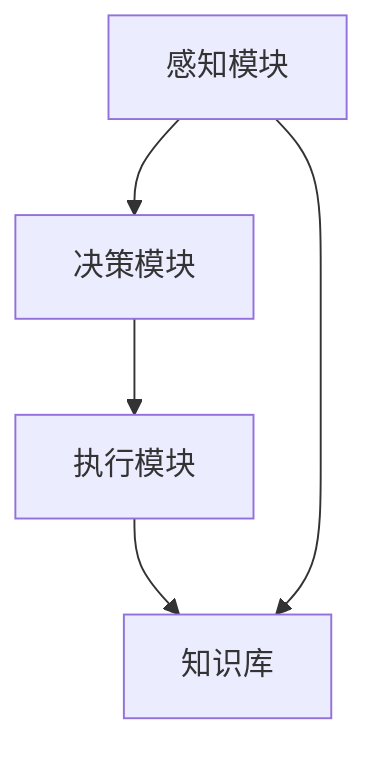

                 


### 构建AI Agent驱动的智能灾害预警系统

#### 关键词：
- AI Agent
- 智能灾害预警
- 系统架构
- 机器学习算法
- 实战案例

#### 摘要：
本文将探讨如何构建一个AI Agent驱动的智能灾害预警系统。我们将逐步分析灾害预警的重要性、AI Agent的基础知识、系统架构设计、关键算法实现以及实际项目案例，旨在为读者提供一个全面的指南，帮助其理解和应用AI Agent技术来提升灾害预警的效率和准确性。

---

### 第一部分: 灾害预警与AI Agent基础

#### 1.1 灾害预警系统概述

灾害预警系统是应对自然灾害、减少灾害损失的重要工具。它通过实时监测、数据分析，提前预警，为人们的生命财产安全和应急管理提供决策支持。传统的灾害预警系统依赖于传感器网络和人工分析，存在延迟大、准确性低等问题。

**1.1.1 灾害预警的重要性**

- 灾害预警可以显著减少人员伤亡和财产损失。
- 提高应急管理效率，降低社会成本。
- 为防灾减灾措施提供科学依据。

**1.1.2 现有预警系统的挑战**

- 监测数据有限，难以全面覆盖。
- 数据分析依赖人工，效率低下。
- 预测模型准确性不足，预警不及时。

**1.1.3 AI Agent在灾害预警中的应用前景**

AI Agent能够通过自主学习，提高数据分析和预测能力，有望解决现有预警系统的挑战。其应用前景包括：

- 实时监测和数据分析，提高预警准确性。
- 预测模型的自适应优化，提升预测能力。
- 自动化决策支持，提高应急管理效率。

#### 1.2 AI Agent基础概念

AI Agent是基于人工智能技术的自主决策实体，具有感知环境、理解任务、自主行动和自适应学习的能力。在灾害预警系统中，AI Agent可以充当监测、分析和决策的智能助手。

**1.2.1 AI Agent的定义与特点**

- **定义**：AI Agent是一个具有感知、理解和行动能力的智能实体，能够在特定环境中执行任务。
- **特点**：自主性、适应性、协作性、学习能力。

**1.2.2 AI Agent的架构与工作原理**

AI Agent通常包括感知模块、决策模块、执行模块和知识库。感知模块负责收集环境信息，决策模块根据知识库和感知数据做出决策，执行模块负责执行决策，知识库则存储经验知识。

**1.2.3 AI Agent与传统监测系统的区别**

| 特点 | AI Agent | 传统监测系统 |
| --- | --- | --- |
| 自主性 | 可以自主感知、学习和决策 | 主要依赖人工操作和预设程序 |
| 灵活性 | 能够自适应环境变化 | 系统固定，难以适应复杂变化 |
| 准确性 | 通过学习提高预警准确性 | 依赖预设规则，准确性有限 |

#### 1.3 AI Agent与灾害预警系统的关系

AI Agent在灾害预警系统中扮演着关键角色，能够通过以下方式提升预警系统的性能：

- **实时监测**：AI Agent可以实时感知环境变化，及时更新数据。
- **智能分析**：通过机器学习算法，AI Agent能够从海量数据中提取有价值的信息。
- **预测预警**：基于历史数据和实时监测，AI Agent可以预测灾害发生的时间、地点和强度。
- **自动化决策**：AI Agent能够自动化执行预警决策，提高应急响应速度。

#### 1.4 AI Agent在灾害预警中的核心算法

智能灾害预警系统中的核心算法主要包括机器学习算法和预测模型。以下将介绍这些算法的基本原理。

**1.4.1 机器学习算法简介**

机器学习算法是一种让计算机从数据中学习规律、进行预测或分类的方法。在灾害预警系统中，常用的机器学习算法包括：

- **监督学习**：根据已知的数据集训练模型，对新数据进行预测。
- **无监督学习**：通过分析未标注的数据，发现数据中的规律。
- **半监督学习**：结合标注数据和未标注数据，提高模型性能。

**1.4.2 预测模型的构建与优化**

预测模型是灾害预警系统的核心，其性能直接影响预警准确性。构建预测模型通常包括以下步骤：

- **数据预处理**：清洗数据，处理缺失值和异常值。
- **特征提取**：从原始数据中提取有价值的信息，用于训练模型。
- **模型选择**：选择适合的数据集和算法。
- **模型训练**：使用训练数据集训练模型。
- **模型评估**：使用测试数据集评估模型性能。

**1.4.3 算法流程图与Python实现**

使用Mermaid绘制算法流程图，如下：



以下是一个简单的Python代码示例，实现了一个简单的机器学习模型：

```python
import numpy as np
from sklearn.linear_model import LinearRegression

# 假设我们有一个简单的特征集和目标值
X = np.array([[1], [2], [3], [4]])
y = np.array([1, 2, 3, 4])

# 创建线性回归模型
model = LinearRegression()

# 训练模型
model.fit(X, y)

# 预测
prediction = model.predict([[5]])

print(prediction)
```

#### 1.5 本章小结

本章介绍了灾害预警系统的重要性、AI Agent的基础知识及其在灾害预警中的应用。通过对比AI Agent与传统监测系统，我们看到了AI Agent在灾害预警中的巨大潜力。接下来，我们将深入探讨AI Agent驱动的智能灾害预警系统的架构设计和关键算法实现。

---

（待续）下一部分将介绍系统的整体架构设计与关键算法原理。

