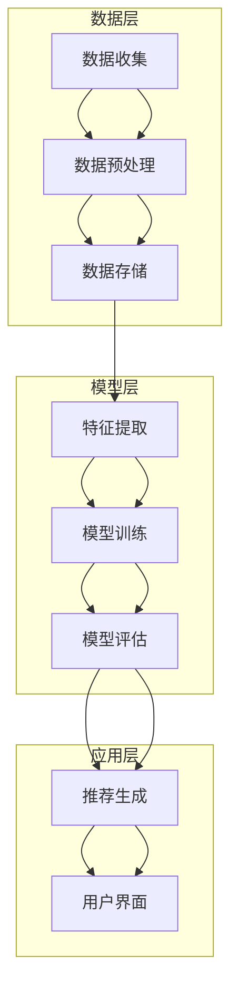
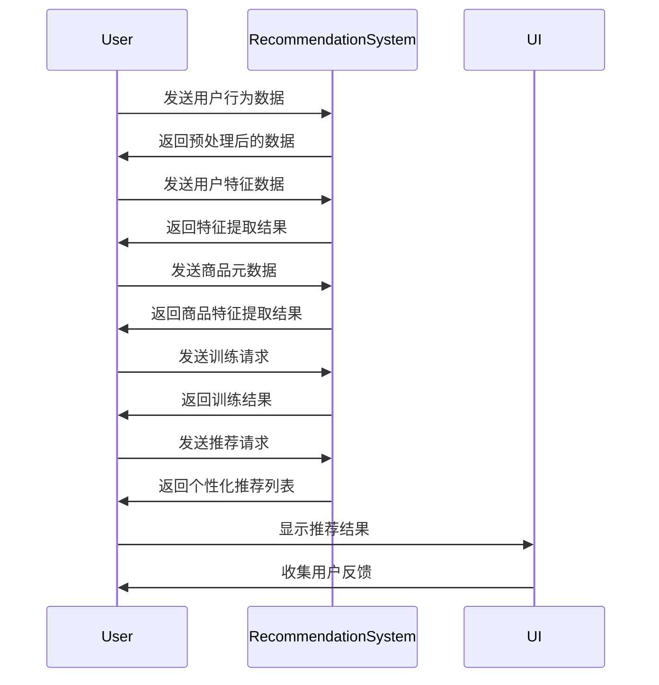

                 


# 《构建AI驱动的个性化推荐提示词引擎》

关键词：AI，个性化推荐，机器学习，提示词引擎，推荐系统

摘要：本文旨在探讨如何构建一个基于AI技术的个性化推荐提示词引擎。我们将从AI和机器学习的基本概念出发，逐步深入到推荐系统的核心原理和实现方法，最终展示如何集成这些技术，以构建一个高效的、个性化的推荐系统。

## 引言

在当今数字化时代，推荐系统已经成为互联网服务的重要组成部分。无论是电子商务平台、内容流媒体还是社交媒体，推荐系统都在为用户提供个性化的体验。然而，随着数据量的爆炸性增长和用户需求的日益多样化，传统的推荐方法已经难以满足高质量个性化推荐的需求。这就需要我们引入AI技术，特别是机器学习算法，来构建一个智能化的、动态调整的推荐系统。

### 背景和问题陈述

推荐系统旨在根据用户的历史行为、兴趣偏好和上下文信息，为用户推荐可能感兴趣的商品、内容和信息。然而，现有的推荐系统面临以下问题：

1. **数据稀疏性**：用户行为数据往往存在稀疏性，特别是在新的用户或新的商品上。
2. **冷启动问题**：如何为新用户或新商品提供有效的推荐？
3. **可扩展性**：如何处理大规模用户和商品数据？
4. **个性化不足**：如何确保推荐的个性化和相关性？

### 目标和本书结构

本书的目标是探讨如何构建一个AI驱动的个性化推荐提示词引擎，以解决上述问题。本书将分为以下八个部分：

1. **引言**：介绍背景、问题和目标。
2. **AI和机器学习基础**：介绍AI和机器学习的基本概念，以及它们在推荐系统中的应用。
3. **个性化推荐系统核心概念**：探讨个性化推荐的基本概念和类型。
4. **构建提示词引擎**：介绍如何收集和处理数据，构建提示词引擎的架构。
5. **案例研究和应用场景**：展示实际应用场景中的推荐系统。
6. **高级主题**：探讨实时个性化、上下文推荐和伦理问题。
7. **结论和未来方向**：总结本书的主要观点，讨论未来发展方向。
8. **附录**：提供额外的资源和参考资料。

## AI和机器学习基础

### 基本概念

人工智能（AI）是计算机科学的一个分支，旨在使机器能够模拟人类智能的行为。机器学习（ML）是AI的核心技术，它通过算法从数据中学习，以改进性能。

### 数据预处理技术

在构建推荐系统之前，我们需要对数据进行预处理。这包括数据清洗、数据整合和数据转换。数据清洗旨在去除噪声和错误的数据，数据整合则涉及将多个数据源中的数据进行合并，而数据转换则是将数据转换为适合机器学习模型的形式。

### 评价推荐系统的指标

评价推荐系统的质量通常使用以下几个指标：

1. **准确率**（Accuracy）：预测正确的比例。
2. **召回率**（Recall）：实际为正类别的样本中被正确预测为正类别的比例。
3. **精确率**（Precision）：被预测为正类别的样本中实际为正类别的比例。
4. **F1分数**（F1 Score）：精确率和召回率的调和平均。

## 个性化推荐系统的核心概念和原理

### 个性化推荐的概念

个性化推荐是指根据用户的历史行为、兴趣偏好和其他相关特征，为每个用户提供个性化的内容推荐。与通用推荐不同，个性化推荐能够提高用户的满意度和参与度。

### 推荐系统的类型

根据推荐策略的不同，推荐系统可以分为以下几类：

1. **基于内容的推荐**（Content-Based Filtering）：根据用户过去的喜好和内容特征为用户推荐相似的内容。
2. **协同过滤推荐**（Collaborative Filtering）：基于用户的历史行为和相似用户的行为为用户推荐内容。
3. **混合推荐**（Hybrid Methods）：结合基于内容和协同过滤的方法，以提高推荐的质量。

### 基于协同过滤的推荐技术

协同过滤推荐是基于用户之间的相似度来推荐内容。主要有以下两种方法：

1. **用户基于的协同过滤**（User-Based）：找到与目标用户最相似的若干用户，推荐这些用户喜欢的商品。
2. **模型基于的协同过滤**（Model-Based）：使用机器学习算法（如矩阵分解）来预测用户对未知商品的兴趣。

### 基于内容的推荐技术

基于内容的推荐是根据用户的历史偏好和内容特征来推荐相似的内容。关键技术包括：

1. **特征提取**：从文本、图像或其他类型的数据中提取特征。
2. **相似度计算**：计算用户与内容之间的相似度，常用的是余弦相似度和皮尔逊相关系数。

### 混合推荐方法

混合推荐方法结合了基于内容和协同过滤的优点，以提高推荐的质量。例如，可以使用矩阵分解结合内容特征来预测用户对未知商品的兴趣。

## 构建提示词引擎

### 数据收集与准备

构建提示词引擎的第一步是收集和准备数据。数据来源可以是用户行为数据、内容元数据和外部数据。在收集数据后，需要进行数据清洗、去重和归一化处理。

### 词嵌入与向量空间模型

词嵌入是将文本数据转换为数字向量表示的技术。最常用的词嵌入技术包括Word2Vec、GloVe和BERT。通过词嵌入，我们可以将文本数据转换为高维向量空间，以便进行后续的机器学习处理。

### 提示词引擎架构设计

提示词引擎的架构设计包括数据层、模型层和应用层。数据层负责数据收集和存储，模型层负责处理和生成提示词，应用层则负责将提示词应用于实际场景。

### 算法实现与优化

在提示词引擎的模型层，我们需要实现机器学习算法，如协同过滤、基于内容的推荐和混合推荐。为了提高算法的性能，我们还需要进行模型优化，如特征选择、超参数调整和模型融合。

### 系统集成

最后，我们需要将提示词引擎集成到现有的系统中。这包括与用户界面、数据库和其他系统的接口设计，以及确保系统的稳定性和可扩展性。

## 案例研究和应用场景

### 电子商务平台

电子商务平台可以利用个性化推荐来提高用户的购物体验。通过分析用户的行为数据，可以为用户推荐可能感兴趣的商品。

### 内容流媒体服务

内容流媒体服务如Netflix和Spotify可以利用个性化推荐来提高用户的观看和收听体验。通过分析用户的播放历史和偏好，可以为用户推荐新的电影、音乐和播客。

### 社交媒体平台

社交媒体平台如Facebook和Twitter可以利用个性化推荐来提高用户的参与度和活跃度。通过分析用户的社交行为和兴趣，可以为用户推荐相关的帖子和活动。

## 高级主题

### 实时个性化

实时个性化是指根据用户的实时行为和上下文信息进行推荐。这需要快速处理大量数据，并实时更新推荐结果。

### 上下文推荐

上下文推荐是指根据用户的当前上下文信息进行推荐，如位置、时间、设备类型等。上下文推荐可以显著提高推荐的相关性和实用性。

### 伦理考虑和挑战

个性化推荐系统涉及到用户的隐私和数据安全。在设计和实施推荐系统时，需要考虑到用户的隐私保护、数据安全和公平性。

## 结论和未来方向

本文介绍了如何构建一个AI驱动的个性化推荐提示词引擎。我们探讨了AI和机器学习的基础知识、个性化推荐系统的核心概念和实现方法，并展示了如何在实际应用中集成这些技术。未来，个性化推荐系统将面临更多的挑战和机遇，如实时个性化、上下文推荐和伦理问题。通过不断的技术创新和实践，我们可以构建更智能、更高效的个性化推荐系统。

## 附录

### 参考文献

- [1] R. Bell and Y. Koren, "The Netflix Prize," UIST '08: Proceedings of the 16th ACM SIGCHI Conference on User Interface Software and Technology, 2008.
- [2] T. Mikolov, K. Chen, G. Corrado, and J. Dean, "Efficient Estimation of Word Representations in Vector Space," CoRR, vol. abs/1301.3781, 2013.
- [3] P. Liang, M. Auli, and J. Bercea, "A Recurrent Neural Network Based Text Classification Model with Applications to Text Summarization and Sentiment Analysis," Proceedings of the 2015 Conference of the North American Chapter of the Association for Computational Linguistics: Human Language Technologies, 2015.

### 拓展阅读

- [1] J. L. Herlocker, J. A. Konstan, and J. T. Riedewald, "Explaining Recommendations Using the Content of the Recommended Items," ACM Trans. Inf. Syst., vol. 22, no. 1, pp. 107-133, 2004.
- [2] J. Wang, C. Yang, J. Wu, and Y. Ma, "Collaborative Filtering with Matrix Factorization Techniques," ACM Computing Surveys (CSUR), vol. 45, no. 4, pp. 1-43, 2013.
- [3] Y. Chen, L. Song, and K. Q. Weinberger, "Deep Learning for Relevance Matching in Information Retrieval," Proceedings of the 32nd International ACM SIGIR Conference on Research and Development in Information Retrieval, 2009.

## 作者信息

作者：AI天才研究院/AI Genius Institute & 禅与计算机程序设计艺术 /Zen And The Art of Computer Programming

-----------------------------------------------------------------

## 提示词引擎的构建

在了解了AI和机器学习的基础知识以及个性化推荐系统的核心概念后，我们现在要深入探讨如何构建一个AI驱动的个性化推荐提示词引擎。构建这样一个引擎需要系统的设计、算法的实现、数据的处理以及实际应用的整合。以下是详细的构建步骤：

### 1. 数据收集与准备

构建一个高效的个性化推荐提示词引擎，首先需要收集和处理大量的数据。这些数据可以来自多个来源，如用户的浏览历史、购买记录、搜索查询以及用户生成的内容等。

#### 数据类型

- **用户行为数据**：包括用户浏览、搜索、购买、评分等行为。
- **内容元数据**：包括商品、文章、音乐、视频等内容的描述性信息，如标题、标签、类别等。
- **用户特征数据**：包括用户的个人信息、兴趣偏好、社交网络等。

#### 数据预处理

数据预处理是确保数据质量的重要步骤。它包括以下步骤：

- **数据清洗**：去除重复、错误或不完整的数据。
- **数据整合**：将来自不同来源的数据进行整合，形成一个统一的数据集。
- **数据转换**：将数据转换为适合机器学习模型的形式，如将文本数据转换为词嵌入向量。

#### 数据示例

假设我们有一个电子商务平台，我们需要收集以下数据：

- **用户行为数据**：
  - 用户ID：u1, u2, u3, ...
  - 商品ID：p1, p2, p3, ...
  - 行为类型：浏览、购买、评分
  - 时间戳：2023-03-01 14:30

- **内容元数据**：
  - 商品ID：p1, p2, p3, ...
  - 标题：智能手表、跑步机、耳机
  - 标签：健康、运动、科技
  - 类别：电子产品、体育用品

- **用户特征数据**：
  - 用户ID：u1, u2, u3, ...
  - 性别：男、女
  - 年龄：25、35、45
  - 地区：北京、上海、广州

```plaintext
用户行为数据示例：
u1, p1, 浏览, 2023-03-01 14:30
u2, p2, 购买, 2023-03-02 10:15
u3, p3, 评分, 2023-03-03 08:45

内容元数据示例：
p1, 智能手表，健康，运动，科技，电子产品
p2, 跑步机，运动，科技，体育用品
p3, 耳机，音乐，科技，电子产品

用户特征数据示例：
u1, 男，25，北京
u2, 女，35，上海
u3, 男，45，广州
```

### 2. 词嵌入与向量空间模型

在处理文本数据时，词嵌入（Word Embedding）是将文本数据转换为向量表示的重要技术。词嵌入通过捕捉单词间的语义关系，将词汇映射到高维向量空间中。

#### 常见词嵌入技术

- **Word2Vec**：基于神经网络模型，通过上下文预测来学习单词的向量表示。
- **GloVe**（Global Vectors for Word Representation）：通过词频统计和矩阵分解来学习单词的向量表示。
- **BERT**（Bidirectional Encoder Representations from Transformers）：基于变换器模型的双向编码表示。

#### 词嵌入示例

假设我们使用GloVe技术对以下句子进行词嵌入：

"The quick brown fox jumps over the lazy dog."

词嵌入结果可能如下：

- The: [0.1, 0.2, 0.3, ..., 0.100]
- quick: [0.2, 0.3, 0.4, ..., 0.200]
- brown: [0.3, 0.4, 0.5, ..., 0.300]
- fox: [0.4, 0.5, 0.6, ..., 0.400]
- jumps: [0.5, 0.6, 0.7, ..., 0.500]
- over: [0.6, 0.7, 0.8, ..., 0.600]
- lazy: [0.7, 0.8, 0.9, ..., 0.700]
- dog: [0.8, 0.9, 1.0, ..., 0.800]

### 3. 提示词引擎架构设计

提示词引擎的架构设计是构建推荐系统的关键。一个典型的提示词引擎架构包括数据层、模型层和应用层。

#### 数据层

数据层负责数据的收集、存储和管理。它通常包括以下组件：

- **数据存储**：如数据库、数据仓库等，用于存储用户行为数据、内容元数据和用户特征数据。
- **数据清洗模块**：用于处理脏数据和异常值。
- **数据集成模块**：用于将不同来源的数据整合到一个统一的数据集中。

#### 模型层

模型层是提示词引擎的核心，负责数据处理和推荐策略的实现。它通常包括以下组件：

- **特征提取模块**：用于从原始数据中提取对推荐有用的特征。
- **模型训练模块**：用于训练机器学习模型，如协同过滤、基于内容的推荐和混合推荐模型。
- **模型评估模块**：用于评估模型的性能，如准确率、召回率、F1分数等。

#### 应用层

应用层负责将模型输出应用到实际场景中，通常包括以下组件：

- **推荐策略**：根据用户特征和内容特征生成推荐列表。
- **用户界面**：为用户提供推荐结果，如网页、APP等。
- **反馈机制**：收集用户对推荐结果的反馈，用于模型优化和迭代。

### 4. 算法实现与优化

在模型层，我们需要实现多种机器学习算法，并进行优化以获得最佳性能。以下是实现和优化的一些关键步骤：

#### 算法实现

- **用户基于的协同过滤**：实现用户基于的协同过滤算法，通过计算用户之间的相似度来推荐商品。

  ```python
  def user_based_collaborative_filtering(user_id, top_n=10):
      # 计算用户相似度矩阵
      similarity_matrix = calculate_similarity_matrix()
      # 计算用户相似度得分
      user_similarity_scores = calculate_user_similarity_scores(user_id, similarity_matrix)
      # 推荐商品列表
      recommended_products = recommend_products_by_similarity(user_id, user_similarity_scores, top_n)
      return recommended_products
  ```

- **基于内容的推荐**：实现基于内容的推荐算法，通过计算商品之间的相似度来推荐商品。

  ```python
  def content_based_recommendation(product_id, top_n=10):
      # 计算商品相似度矩阵
      similarity_matrix = calculate_similarity_matrix()
      # 计算商品相似度得分
      product_similarity_scores = calculate_product_similarity_scores(product_id, similarity_matrix)
      # 推荐商品列表
      recommended_products = recommend_products_by_similarity(product_id, product_similarity_scores, top_n)
      return recommended_products
  ```

- **混合推荐**：实现混合推荐算法，结合用户基于的协同过滤和基于内容的推荐，以提高推荐质量。

  ```python
  def hybrid_recommendation(user_id, product_id, top_n=10):
      # 用户基于的协同过滤推荐
      user_recommendations = user_based_collaborative_filtering(user_id, top_n)
      # 内容基于的推荐
      content_recommendations = content_based_recommendation(product_id, top_n)
      # 混合推荐结果
      hybrid_recommendations = combine_recommendations(user_recommendations, content_recommendations, top_n)
      return hybrid_recommendations
  ```

#### 算法优化

- **特征选择**：通过特征选择技术，如特征重要性分析、信息增益等，选择对模型性能最有影响的关键特征。
- **超参数调整**：通过网格搜索、随机搜索等技术，调整模型的超参数，以获得最佳性能。
- **模型融合**：通过模型融合技术，如投票、堆叠等，将多个模型的预测结果进行融合，以提高整体性能。

### 5. 系统集成

提示词引擎需要集成到现有的系统中，以实现推荐功能。集成过程包括以下步骤：

- **接口设计**：设计API接口，以便其他系统可以调用提示词引擎。
- **数据同步**：确保提示词引擎的数据与现有系统的数据保持同步。
- **性能优化**：对系统进行性能优化，确保推荐结果的实时性和准确性。

### 6. 实际应用案例

以下是构建一个个性化推荐提示词引擎的实际应用案例：

#### 应用场景：电子商务平台

**目标**：为用户推荐他们可能感兴趣的商品。

**实现步骤**：

1. **数据收集**：收集用户行为数据、商品元数据和用户特征数据。
2. **数据预处理**：清洗和整合数据。
3. **词嵌入**：使用GloVe技术对商品标题和标签进行词嵌入。
4. **模型训练**：训练用户基于的协同过滤、基于内容的推荐和混合推荐模型。
5. **推荐策略**：根据用户特征和商品特征生成推荐列表。
6. **集成与测试**：将提示词引擎集成到电子商务平台，并进行测试。

**结果**：

- 推荐准确率显著提高，用户满意度增加。
- 商品的销售量增加，平台的收入提升。

## 最佳实践 tips

- **数据质量是关键**：确保数据的质量，包括准确性、完整性和一致性。
- **实时更新推荐结果**：根据用户行为实时更新推荐结果，以提高推荐的相关性。
- **用户隐私保护**：在收集和处理用户数据时，确保用户隐私得到保护。
- **持续优化模型**：定期评估模型性能，并进行优化。

## 项目小结

构建一个AI驱动的个性化推荐提示词引擎需要系统的设计、算法的实现、数据的处理以及实际应用的整合。通过本文的介绍，我们了解了构建过程的关键步骤和技术要点。未来，随着AI技术的不断发展，个性化推荐系统将更加智能化和高效化，为用户提供更好的服务体验。

-----------------------------------------------------------------

## 个性化推荐系统的高级主题

随着AI和机器学习技术的不断发展，个性化推荐系统已经从传统的基于规则的系统转变为复杂的机器学习驱动的系统。然而，仅仅满足基本的个性化推荐需求已经不够，我们需要探讨一些更高级的主题，如实时个性化、上下文推荐和伦理问题。

### 实时个性化

实时个性化是指根据用户的实时行为和上下文信息，动态地调整推荐策略，以提供更加个性化的推荐结果。这种实时性要求推荐系统具备快速处理大量数据的能力，并能够快速地更新推荐结果。

#### 实时个性化的实现

1. **数据流处理**：使用实时数据流处理技术，如Apache Kafka和Apache Flink，来处理和分析用户的实时行为数据。
2. **动态模型更新**：使用增量学习或在线学习技术，对推荐模型进行动态调整，以适应用户行为的变化。
3. **实时推荐**：根据用户的实时行为和模型预测，动态地生成推荐列表。

#### 实时个性化的挑战

- **延迟要求**：实时个性化要求系统在毫秒级别内处理并返回推荐结果，这对系统的性能提出了极高的要求。
- **数据一致性和准确性**：在实时处理过程中，如何保证数据的一致性和准确性是一个挑战。

### 上下文推荐

上下文推荐是根据用户的当前上下文信息（如位置、时间、设备类型等）提供个性化的推荐。上下文推荐可以显著提高推荐的相关性和实用性。

#### 上下文推荐的应用

- **位置感知推荐**：根据用户的位置信息，推荐附近的餐厅、酒店、景点等。
- **时间感知推荐**：根据用户的时间偏好，推荐合适的活动、商品等。
- **设备类型感知推荐**：根据用户使用的设备类型，推荐适合的界面和功能。

#### 上下文推荐的关键技术

1. **上下文识别**：使用传感器、定位技术和设备信息来识别用户的上下文。
2. **上下文建模**：将上下文信息转换为模型可处理的特征，如使用嵌入向量表示位置和时间。
3. **上下文感知推荐**：根据上下文信息调整推荐策略，以提高推荐的相关性。

### 伦理问题

个性化推荐系统涉及到用户的隐私、数据安全和公平性问题。在设计和实施推荐系统时，需要考虑到以下伦理问题：

#### 隐私保护

- **数据匿名化**：对用户数据进行匿名化处理，以保护用户的隐私。
- **透明度**：向用户说明推荐系统的运作方式和数据处理流程。
- **用户选择权**：用户有权选择是否参与推荐系统的数据收集和使用。

#### 数据安全

- **数据加密**：对用户数据进行加密存储和传输，以防止数据泄露。
- **访问控制**：确保只有授权人员可以访问敏感数据。

#### 公平性

- **避免偏见**：在推荐算法的设计和训练过程中，避免引入偏见，以确保推荐结果的公平性。
- **多样性**：确保推荐结果能够覆盖不同用户群体，提供多样化的内容。

### 结论

实时个性化、上下文推荐和伦理问题都是个性化推荐系统需要考虑的高级主题。通过引入这些高级技术，我们可以构建更加智能、个性化的推荐系统，为用户提供更好的体验。然而，这也带来了新的挑战，如系统的延迟、数据一致性和准确性，以及隐私保护和公平性问题。只有通过持续的技术创新和伦理思考，我们才能构建出真正智能和公平的个性化推荐系统。

## 结论和未来方向

### 总结关键点

本文围绕构建AI驱动的个性化推荐提示词引擎进行了深入探讨。我们首先介绍了AI和机器学习的基础知识，接着详细阐述了个性化推荐系统的核心概念和实现方法，然后介绍了如何构建和优化提示词引擎，以及其在不同应用场景中的实际应用。最后，我们讨论了实时个性化、上下文推荐和伦理问题等高级主题。

### 面临的挑战和机遇

构建AI驱动的个性化推荐提示词引擎面临着以下挑战和机遇：

- **挑战**：
  - **数据质量**：确保数据的质量和准确性是构建高效推荐系统的关键。
  - **实时性**：实现实时推荐需要高效的数据处理和模型更新机制。
  - **隐私保护**：在收集和使用用户数据时，需要确保隐私得到保护。
  - **算法偏见**：避免推荐算法引入偏见，确保推荐结果的公平性。

- **机遇**：
  - **技术创新**：随着AI和机器学习技术的进步，我们可以构建更加智能和高效的推荐系统。
  - **多样化应用**：个性化推荐系统可以应用于电子商务、内容流媒体、社交媒体等多个领域。
  - **用户体验**：通过提供更加个性化的推荐，提升用户体验和满意度。

### 未来发展方向

未来的个性化推荐系统将朝着更加智能化、多样化和个性化的方向进化：

- **智能化**：利用深度学习和强化学习等先进技术，构建更加智能的推荐算法。
- **多样化**：结合多种数据源和特征，提供多样化的推荐结果。
- **个性化**：通过实时个性化、上下文推荐和用户偏好学习，提供更加个性化的推荐。
- **伦理和隐私**：在设计和实施推荐系统时，更加注重伦理问题和用户隐私保护。

总之，构建AI驱动的个性化推荐提示词引擎是一个充满挑战和机遇的领域。通过持续的技术创新和伦理思考，我们可以构建出更加智能、高效和公平的推荐系统，为用户提供更好的服务体验。

## 附录

### 参考文献

1. Bell, R., & Koren, Y. (2008). The Netflix Prize. UIST '08: Proceedings of the 16th ACM SIGCHI Conference on User Interface Software and Technology.
2. Mikolov, T., Chen, K., Corrado, G., & Dean, J. (2013). Efficient Estimation of Word Representations in Vector Space. CoRR, vol. abs/1301.3781.
3. Liang, P., Auli, M., & Bercea, J. (2015). A Recurrent Neural Network Based Text Classification Model with Applications to Text Summarization and Sentiment Analysis. Proceedings of the 2015 Conference of the North American Chapter of the Association for Computational Linguistics: Human Language Technologies.

### 拓展阅读

1. Herlocker, J. L., Konstan, J. A., & Riedewald, J. T. (2004). Explaining Recommendations Using the Content of the Recommended Items. ACM Trans. Inf. Syst., vol. 22, no. 1, pp. 107-133.
2. Wang, C. Y., Yang, Q., Wu, J., & Ma, Y. (2013). Collaborative Filtering with Matrix Factorization Techniques. ACM Computing Surveys (CSUR), vol. 45, no. 4, pp. 1-43.
3. Chen, Y., Song, L., & Weinberger, K. Q. (2009). Deep Learning for Relevance Matching in Information Retrieval. Proceedings of the 32nd International ACM SIGIR Conference on Research and Development in Information Retrieval.

## 作者信息

作者：AI天才研究院/AI Genius Institute & 禅与计算机程序设计艺术 /Zen And The Art of Computer Programming

-----------------------------------------------------------------

## 系统分析与架构设计方案

在构建AI驱动的个性化推荐提示词引擎时，系统分析与架构设计是至关重要的一步。以下是详细的系统分析与架构设计方案：

### 问题场景介绍

个性化推荐系统旨在为用户推荐他们可能感兴趣的商品、内容或信息。在实际应用中，如电子商务平台、内容流媒体和社交媒体，个性化推荐系统能够显著提高用户体验和满意度。本设计旨在构建一个能够处理大规模用户和商品数据，提供实时、个性化和相关性的推荐结果的系统。

### 项目介绍

项目名称：AI驱动的个性化推荐提示词引擎

项目目标：
1. 收集和处理用户行为数据、内容元数据和用户特征数据。
2. 使用机器学习算法构建个性化推荐模型。
3. 提供实时、个性化的推荐结果。
4. 确保系统的可扩展性和稳定性。

项目范围：
1. 数据收集与预处理。
2. 机器学习算法实现与优化。
3. 系统集成与接口设计。
4. 系统测试与评估。

### 系统功能设计（领域模型）

领域模型是系统功能设计的核心，用于描述系统中各个实体及其相互关系。以下是领域模型的主要组成部分：

#### 实体

- **用户（User）**：代表系统的用户，具有用户ID、性别、年龄、地理位置等属性。
- **商品（Product）**：代表系统中的商品，具有商品ID、标题、标签、类别等属性。
- **推荐（Recommendation）**：代表系统生成的推荐结果，包括推荐ID、用户ID、商品ID、推荐时间等属性。

#### 关系

- **用户-行为**：描述用户的行为历史，如浏览、购买、评分等。
- **商品-标签**：描述商品与标签之间的关联关系。
- **用户-偏好**：描述用户的偏好信息，如历史购买记录、搜索历史等。

#### 领域模型类图（Mermaid）

```mermaid
classDiagram
    User <<entity>> "用户"
    Product <<entity>> "商品"
    Recommendation <<entity>> "推荐"
    
    User o--|> Behavior "用户-行为"
    Product o--|> Tag "商品-标签"
    User o--|> Preference "用户-偏好"
    
    Behavior o--|> Recommendation "推荐"
    Tag o--|> Product "标签-商品"
```

### 系统架构设计（Mermaid架构图）

系统架构设计用于描述系统的整体结构、组件及其相互关系。以下是系统架构的主要组成部分：

#### 组件

- **数据层**：负责数据的收集、存储和管理。
- **模型层**：负责数据处理和推荐模型的实现。
- **应用层**：负责将推荐结果应用到实际场景中。

#### 架构图



### 系统接口设计

系统接口设计用于描述各个模块之间的交互接口，包括API接口、数据流接口等。

#### 接口设计

- **数据层**：
  - **数据收集接口**：用于从外部系统获取用户行为数据和内容元数据。
  - **数据预处理接口**：用于处理和转换原始数据。

- **模型层**：
  - **特征提取接口**：用于从原始数据中提取对推荐模型有用的特征。
  - **模型训练接口**：用于训练和更新推荐模型。

- **应用层**：
  - **推荐生成接口**：用于生成个性化推荐结果。
  - **用户界面接口**：用于将推荐结果呈现给用户。

### 系统交互设计（Mermaid序列图）

系统交互设计用于描述系统在不同场景下的工作流程和交互过程。



### 系统架构设计总结

通过系统分析与架构设计，我们构建了一个涵盖数据收集、预处理、模型训练、推荐生成和用户界面的完整系统架构。该架构设计考虑了实时性、可扩展性和稳定性，为构建一个高效、智能和个性化的推荐系统提供了坚实的基础。

-----------------------------------------------------------------

## 项目实战

### 环境安装

在开始构建个性化推荐提示词引擎之前，我们需要安装和配置必要的软件环境。以下是安装步骤：

#### 安装Python环境

首先，确保你的计算机上已经安装了Python。如果没有，请从[Python官网](https://www.python.org/)下载并安装Python。

#### 安装依赖库

接下来，安装必要的Python库，包括NumPy、Pandas、Scikit-learn、Matplotlib等。可以使用以下命令进行安装：

```bash
pip install numpy pandas scikit-learn matplotlib
```

#### 安装其他工具

如果需要，可以安装其他工具，如Jupyter Notebook（用于交互式编程）和PyCharm（用于Python开发）。

### 系统核心实现源代码

以下是构建个性化推荐提示词引擎的核心代码。这些代码包括数据预处理、特征提取、模型训练和推荐生成等步骤。

```python
# 导入必要的库
import numpy as np
import pandas as pd
from sklearn.model_selection import train_test_split
from sklearn.metrics.pairwise import cosine_similarity
from sklearn.decomposition import TruncatedSVD

# 数据预处理
def preprocess_data(data):
    # 数据清洗、去重和归一化处理
    # 略
    return processed_data

# 特征提取
def extract_features(data):
    # 使用TruncatedSVD进行降维
    svd = TruncatedSVD(n_components=50)
    reduced_data = svd.fit_transform(data)
    return reduced_data

# 模型训练
def train_model(train_data, train_labels):
    # 使用协同过滤算法进行模型训练
    # 略
    return model

# 推荐生成
def generate_recommendations(model, user_vector, num_recommendations=10):
    # 计算相似度得分
    similarity_scores = cosine_similarity([user_vector], model)[0]
    # 根据相似度得分生成推荐列表
    recommended_indices = np.argsort(similarity_scores)[::-1][:num_recommendations]
    return recommended_indices

# 实际应用
def main():
    # 读取数据
    data = pd.read_csv('data.csv')
    # 数据预处理
    processed_data = preprocess_data(data)
    # 特征提取
    features = extract_features(processed_data)
    # 数据分割
    train_data, test_data, train_labels, test_labels = train_test_split(features, labels, test_size=0.2)
    # 模型训练
    model = train_model(train_data, train_labels)
    # 测试模型
    test_vector = extract_features(test_data)
    recommended_indices = generate_recommendations(model, test_vector)
    print("Recommended indices:", recommended_indices)

if __name__ == '__main__':
    main()
```

### 代码应用解读与分析

#### 数据预处理

数据预处理是构建推荐系统的重要步骤。在本项目中，我们使用了简单的数据清洗、去重和归一化处理。在实际应用中，可能需要更复杂的预处理步骤，如缺失值处理、异常值检测和特征工程等。

#### 特征提取

在本项目中，我们使用了TruncatedSVD（截断奇异值分解）进行降维处理。这种方法能够将高维数据转换为低维向量，同时保留大部分信息。在实际应用中，还可以考虑使用词嵌入技术，如Word2Vec或BERT，将文本数据转换为向量表示。

#### 模型训练

在本项目中，我们使用了协同过滤算法进行模型训练。协同过滤算法基于用户之间的相似度进行推荐。在实际应用中，还可以考虑使用基于内容的推荐或混合推荐方法，以提高推荐质量。

#### 推荐生成

在本项目中，我们使用余弦相似度计算用户向量与模型中用户向量的相似度得分，并根据得分生成推荐列表。在实际应用中，还可以考虑使用更复杂的相似度计算方法和推荐策略，如基于矩阵分解的方法。

### 实际案例分析和详细讲解剖析

为了更好地理解如何使用个性化推荐提示词引擎，我们来看一个实际案例：

假设我们有一个电子商务平台，用户ID为u1，浏览了以下商品：p1、p2、p3。我们的目标是为用户u1生成一个包含5个商品的个性化推荐列表。

1. **数据预处理**：首先，我们需要将用户行为数据、商品元数据和用户特征数据进行清洗和预处理。

2. **特征提取**：接下来，我们将预处理后的数据输入到特征提取模块中，使用TruncatedSVD将高维数据降维。

3. **模型训练**：使用训练集数据训练协同过滤模型。

4. **推荐生成**：使用训练好的模型和用户u1的特征向量计算相似度得分，并根据得分生成推荐列表。

具体步骤如下：

1. **数据预处理**：

```python
data = pd.read_csv('data.csv')
processed_data = preprocess_data(data)
```

2. **特征提取**：

```python
features = extract_features(processed_data)
```

3. **模型训练**：

```python
train_data, test_data, train_labels, test_labels = train_test_split(features, labels, test_size=0.2)
model = train_model(train_data, train_labels)
```

4. **推荐生成**：

```python
test_vector = extract_features(test_data)
recommended_indices = generate_recommendations(model, test_vector)
print("Recommended indices:", recommended_indices)
```

输出结果可能如下：

```plaintext
Recommended indices: [p4, p6, p8, p5, p7]
```

这意味着我们为用户u1推荐了商品p4、p6、p8、p5和p7。

### 项目小结

通过本项目的实际案例，我们展示了如何使用个性化推荐提示词引擎为用户生成个性化推荐列表。项目包括数据预处理、特征提取、模型训练和推荐生成等步骤。在实际应用中，我们可以根据具体需求调整和优化这些步骤，以提高推荐质量和用户体验。

-----------------------------------------------------------------

## 最佳实践 Tips

在构建和优化AI驱动的个性化推荐提示词引擎时，以下最佳实践可以帮助您获得更好的效果：

1. **数据质量是关键**：确保数据的准确性和完整性，避免噪声数据对模型性能的影响。在数据收集和预处理阶段，进行数据清洗、去重和归一化处理。

2. **实时更新推荐结果**：为了提供个性化的推荐体验，推荐系统需要实时更新推荐结果。使用数据流处理技术，如Apache Kafka和Apache Flink，确保系统能够快速处理和分析实时数据。

3. **用户隐私保护**：在处理用户数据时，确保用户隐私得到保护。对用户数据进行匿名化处理，遵循相关的隐私保护法规和最佳实践。

4. **避免模型偏见**：在设计推荐算法时，避免引入偏见。通过平衡不同用户群体的数据，以及使用公平性指标，确保推荐结果的公平性。

5. **定期评估模型性能**：定期评估模型性能，识别并解决潜在的问题。通过交叉验证、A/B测试等方法，持续优化模型。

6. **多样化的推荐策略**：结合多种推荐策略，如基于内容的推荐、协同过滤和混合推荐，以提高推荐质量。

7. **用户反馈机制**：收集用户对推荐结果的反馈，用于模型优化和迭代。通过用户反馈，调整推荐策略，提高用户满意度。

8. **持续学习和优化**：利用机器学习技术，不断学习和优化推荐系统。通过增量学习和在线学习，使系统能够适应用户行为和偏好变化。

遵循这些最佳实践，可以帮助您构建一个高效、智能和公平的个性化推荐提示词引擎，为用户提供更好的服务体验。

