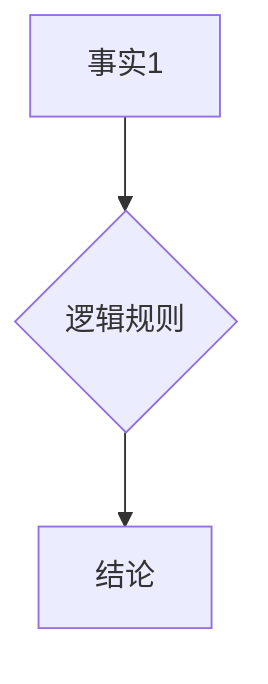
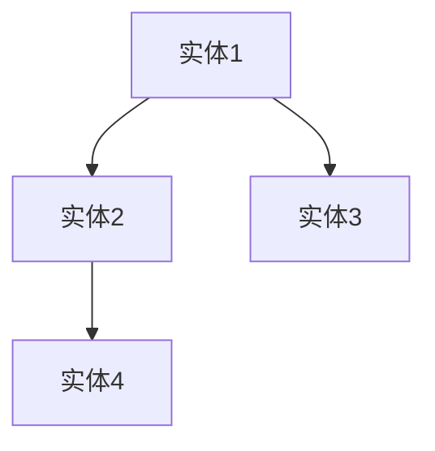

                 

**# 构建AI驱动的企业知识管理系统：智能知识图谱**

> 关键词：知识管理系统，AI驱动，智能知识图谱，企业知识管理，知识图谱技术

> 摘要：本文将探讨如何构建AI驱动的企业知识管理系统，重点介绍智能知识图谱的应用。通过深入分析知识管理系统的概念、需求、技术、应用和案例，本文旨在为读者提供全面、实用的指导，帮助企业实现知识管理的智能化和高效化。

### 第一部分：知识管理系统概述

#### 第1章：知识管理系统的概念与背景

**1.1 知识管理系统的定义**

知识管理系统（Knowledge Management System，KMS）是一种集成化的信息处理系统，旨在通过有效的知识收集、存储、共享、应用和创新，提高组织的知识利用效率，进而提升组织的竞争力。

**1.2 知识管理系统的发展历程**

知识管理系统的发展可以分为以下几个阶段：

- **初始阶段（1990年代初）**：以文件共享和文档管理为主，侧重于信息的收集和存储。
- **集成阶段（1995-2000年）**：引入内容管理系统（CMS）和协作工具，实现信息的共享和协作。
- **知识管理阶段（2000年后）**：侧重于知识的有效利用，强调知识的传递、共享和创新。
- **智能知识管理阶段（近年来）**：引入人工智能技术，实现知识的自动化挖掘、分析和应用。

**1.3 知识管理系统的核心组成部分**

知识管理系统的核心组成部分包括：

- **知识采集**：通过多种渠道收集内部和外部知识。
- **知识存储**：建立高效的知识存储系统，确保知识的安全性和可访问性。
- **知识共享**：提供便捷的知识共享机制，促进知识的传播和利用。
- **知识应用**：将知识应用于业务流程中，提高业务效率和创新能力。
- **知识创新**：通过知识的应用和反馈，不断进行知识创新，提升组织的知识水平和竞争力。

**1.4 知识管理系统与传统信息系统的区别**

知识管理系统与传统信息系统的区别主要体现在以下几个方面：

- **目标不同**：知识管理系统侧重于知识的传递、共享和创新，而传统信息系统侧重于信息的收集、存储和传递。
- **技术不同**：知识管理系统引入了人工智能、自然语言处理、数据挖掘等先进技术，而传统信息系统主要依赖于数据库和文件系统。
- **应用范围不同**：知识管理系统应用于整个组织，涉及多个部门和业务领域，而传统信息系统通常局限于特定业务领域。

#### 第2章：企业知识管理需求分析

**2.1 企业知识管理的重要性**

企业知识管理对于企业的长期发展具有重要意义，主要体现在以下几个方面：

- **提高竞争力**：通过有效的知识管理，企业可以更好地利用内部和外部知识，提高业务效率和创新能力。
- **降低成本**：知识管理可以帮助企业减少重复劳动，降低运营成本。
- **提高客户满意度**：知识管理可以提供更好的客户服务，提高客户满意度。
- **人才留存**：知识管理可以促进知识的传承和积累，有助于人才的留存和发展。

**2.2 企业知识管理的现状分析**

当前，企业知识管理普遍存在以下问题：

- **知识分散**：企业内部知识分散在各个部门和个人，难以有效整合。
- **知识流失**：缺乏有效的知识管理机制，导致知识流失严重。
- **知识不共享**：企业内部存在知识共享壁垒，影响知识传播和利用。
- **知识应用不足**：企业缺乏对知识的深度挖掘和应用，导致知识价值未能充分发挥。

**2.3 企业知识管理的需求分析**

为了解决当前企业知识管理中存在的问题，企业需要从以下几个方面进行需求分析：

- **知识整合**：建立统一的知识库，实现知识的有效整合。
- **知识共享**：提供便捷的知识共享机制，促进知识传播和利用。
- **知识挖掘**：利用人工智能等技术，对知识进行深度挖掘和应用。
- **知识传承**：建立知识传承机制，确保知识在企业内部传承和积累。
- **知识创新**：鼓励知识创新，提升企业的知识水平和竞争力。

**2.4 企业知识管理的挑战与解决方案**

企业知识管理面临的挑战主要包括：

- **技术挑战**：如何利用人工智能等技术实现知识的自动化挖掘、分析和应用。
- **组织挑战**：如何打破部门壁垒，建立协同的知识共享机制。
- **文化挑战**：如何建立知识共享、创新的企业文化。

针对上述挑战，企业可以采取以下解决方案：

- **引入AI技术**：利用人工智能等技术，实现知识的自动化挖掘、分析和应用。
- **建立知识共享机制**：通过制定相关政策、培训和激励措施，推动知识共享。
- **培养知识管理文化**：通过宣传、培训和实践活动，培养员工的知识管理意识和能力。

#### 第3章：知识图谱在知识管理中的应用

**3.1 知识图谱的基本概念**

知识图谱（Knowledge Graph）是一种用于表示知识结构的数据模型，通过图结构将各种实体、属性和关系进行组织，实现知识的语义理解和关联分析。

**3.2 知识图谱的核心技术**

知识图谱的核心技术包括：

- **实体抽取**：从文本数据中提取出重要的实体。
- **关系抽取**：从文本数据中提取出实体之间的关系。
- **实体链接**：将同一种类的实体进行关联，实现实体统一管理。
- **知识融合**：将不同来源的知识进行整合，实现知识的全面覆盖。

**3.3 知识图谱在知识管理中的应用场景**

知识图谱在知识管理中的应用场景主要包括：

- **知识搜索**：利用知识图谱实现精准的知识搜索，提高知识查找效率。
- **知识推荐**：基于知识图谱实现知识推荐，提高知识的利用价值。
- **知识挖掘**：利用知识图谱进行知识挖掘，发现潜在的知识关联。
- **知识融合**：将不同来源的知识进行整合，实现知识的全面覆盖。

**3.4 知识图谱的优势与挑战**

知识图谱的优势主要体现在：

- **知识的语义理解**：通过图结构实现知识的语义理解，提高知识检索和利用的准确性。
- **知识关联分析**：通过知识图谱实现知识关联分析，发现潜在的知识关联。
- **知识融合**：通过知识图谱实现知识的融合，提高知识的全面性和完整性。

知识图谱的挑战主要包括：

- **数据质量**：知识图谱的质量取决于数据的准确性和完整性。
- **技术门槛**：知识图谱技术复杂，对技术人才的要求较高。
- **维护成本**：知识图谱的维护需要持续投入，确保知识的更新和准确性。

#### 第4章：AI驱动的知识管理系统设计

**4.1 AI驱动的知识管理理念**

AI驱动的知识管理理念是将人工智能技术应用于知识管理的各个环节，实现知识的自动化挖掘、分析和应用。具体包括：

- **自动化知识采集**：利用自然语言处理、图像识别等技术，实现知识的自动化采集。
- **智能化知识挖掘**：利用机器学习、数据挖掘等技术，实现知识的智能化挖掘。
- **自动化知识应用**：利用自动化工具，将知识应用于业务流程中，提高业务效率和创新能力。
- **知识自我进化**：通过知识的不断反馈和应用，实现知识的自我进化，提升知识管理水平。

**4.2 AI驱动的知识管理系统架构**

AI驱动的知识管理系统架构包括以下几个层次：

- **数据层**：包括数据采集、存储、处理等模块，为知识管理系统提供数据支持。
- **模型层**：包括自然语言处理、机器学习、数据挖掘等模型，用于知识的自动化挖掘和应用。
- **应用层**：包括知识搜索、知识推荐、知识挖掘等模块，实现知识的实际应用。
- **用户层**：包括用户界面、用户交互等模块，提供用户友好的操作界面。

**4.3 AI在知识管理系统中的应用**

AI在知识管理系统中的应用主要包括：

- **自然语言处理**：用于文本数据的自动提取、分类、标注等，提高知识采集的效率和质量。
- **机器学习**：用于知识挖掘、预测、推荐等，实现知识的自动化分析和应用。
- **数据挖掘**：用于发现数据中的潜在模式、关联和趋势，为业务决策提供支持。
- **图像识别**：用于图像数据的自动分类、识别等，提高知识采集的全面性和准确性。

**4.4 AI驱动的知识管理系统的实施策略**

为了成功实施AI驱动的知识管理系统，企业需要采取以下策略：

- **明确目标**：明确知识管理系统的目标和预期效果，确保项目的顺利实施。
- **数据整合**：整合企业内部和外部的数据，建立统一的知识库。
- **技术选型**：选择合适的AI技术和工具，确保系统的性能和稳定性。
- **人才培养**：培养具备AI技术能力和知识管理能力的专业人才。
- **持续优化**：通过不断的反馈和优化，提升知识管理系统的应用效果。

### 第二部分：智能知识图谱构建方法

#### 第5章：智能知识图谱构建方法

**5.1 智能知识图谱构建流程**

智能知识图谱的构建流程主要包括以下几个步骤：

1. **需求分析**：明确知识图谱的应用场景和目标，确定知识图谱的核心实体和关系。
2. **数据采集**：从各种数据源中采集相关数据，包括文本、图像、音频等。
3. **数据预处理**：对采集到的数据进行清洗、格式化、去重等处理，确保数据的质量和一致性。
4. **实体抽取**：利用自然语言处理、图像识别等技术，从文本数据中抽取实体。
5. **关系抽取**：利用自然语言处理、机器学习等技术，从文本数据中抽取实体之间的关系。
6. **实体链接**：将同一种类的实体进行关联，实现实体统一管理。
7. **知识融合**：将不同来源的知识进行整合，实现知识的全面覆盖。
8. **知识表示**：将知识图谱转换为计算机可理解的数据结构，如RDF、OWL等。
9. **知识存储**：将知识图谱存储到数据库或分布式存储系统中，确保知识的持久化和可访问性。
10. **知识应用**：将知识图谱应用于业务流程中，实现知识的自动化挖掘、分析和应用。

**5.2 数据采集与预处理**

数据采集与预处理是智能知识图谱构建的基础，主要包括以下步骤：

1. **数据来源**：确定知识图谱的数据来源，包括企业内部数据、外部公开数据、行业数据等。
2. **数据采集**：利用爬虫、API接口、人工标注等方法采集相关数据。
3. **数据清洗**：对采集到的数据进行去重、格式化、清洗等处理，确保数据的质量和一致性。
4. **数据标注**：对采集到的数据进行人工标注，为实体抽取和关系抽取提供标注数据。
5. **数据整合**：将不同来源的数据进行整合，建立统一的知识库。

**5.3 知识表示与图谱构建**

知识表示与图谱构建是智能知识图谱构建的核心，主要包括以下步骤：

1. **实体定义**：根据需求分析，确定知识图谱的核心实体和属性。
2. **关系定义**：根据需求分析，确定知识图谱的实体之间的关系。
3. **实体抽取**：利用自然语言处理、图像识别等技术，从文本数据中抽取实体。
4. **关系抽取**：利用自然语言处理、机器学习等技术，从文本数据中抽取实体之间的关系。
5. **实体链接**：将同一种类的实体进行关联，实现实体统一管理。
6. **知识融合**：将不同来源的知识进行整合，实现知识的全面覆盖。
7. **知识表示**：将知识图谱转换为计算机可理解的数据结构，如RDF、OWL等。
8. **图谱构建**：利用图数据库等技术，构建知识图谱。

**5.4 智能推理与知识挖掘**

智能推理与知识挖掘是智能知识图谱的核心功能，主要包括以下步骤：

1. **推理算法**：根据知识图谱的结构和关系，设计推理算法，实现知识的推理和推导。
2. **知识挖掘**：利用机器学习、数据挖掘等技术，从知识图谱中挖掘潜在的知识关联和模式。
3. **知识应用**：将挖掘出的知识应用于业务流程中，实现知识的自动化挖掘、分析和应用。

#### 第6章：智能知识图谱在业务领域的应用

**6.1 智能知识图谱在销售领域的应用**

智能知识图谱在销售领域的应用主要包括以下几个方面：

1. **客户画像**：通过分析客户的历史数据、行为数据等，构建客户的智能知识图谱，实现精准的客户画像。
2. **产品推荐**：基于客户画像和产品知识图谱，实现个性化产品推荐，提高销售转化率。
3. **销售预测**：利用销售历史数据和知识图谱，进行销售预测，为销售决策提供支持。
4. **竞争对手分析**：通过分析竞争对手的知识图谱，发现竞争对手的优势和劣势，为竞争策略制定提供依据。

**6.2 智能知识图谱在客户服务领域的应用**

智能知识图谱在客户服务领域的应用主要包括以下几个方面：

1. **智能客服**：利用知识图谱实现智能客服，自动回答客户的问题，提高客服效率和客户满意度。
2. **知识库构建**：通过分析客户咨询的问题，构建智能知识图谱，实现知识的自动积累和更新。
3. **问题定位**：利用知识图谱实现问题的快速定位，提高问题解决的效率。
4. **客户满意度分析**：通过分析客户满意度数据，构建客户满意度知识图谱，为服务改进提供依据。

**6.3 智能知识图谱在供应链管理领域的应用**

智能知识图谱在供应链管理领域的应用主要包括以下几个方面：

1. **供应链优化**：通过分析供应链数据，构建智能知识图谱，实现供应链的优化和智能化管理。
2. **库存管理**：利用知识图谱实现库存的智能预测和优化，提高库存管理的效率。
3. **采购策略**：通过分析供应商数据和市场数据，构建智能知识图谱，实现采购策略的优化。
4. **风险控制**：通过分析供应链中的各种风险因素，构建智能知识图谱，实现风险的预警和防控。

**6.4 智能知识图谱在其他业务领域的应用**

智能知识图谱在其他业务领域的应用还包括：

1. **人力资源管理**：通过构建员工知识图谱，实现人才的识别、培养和优化。
2. **市场营销**：通过分析市场数据，构建市场知识图谱，实现市场策略的优化。
3. **金融风控**：通过分析金融数据，构建金融知识图谱，实现风险预警和防控。
4. **医疗健康**：通过分析医疗数据，构建医疗知识图谱，实现疾病的预测和诊断。

### 第三部分：AI驱动的企业知识管理系统案例解析

#### 第7章：AI驱动的企业知识管理系统案例解析

**7.1 案例背景与需求分析**

本案例以一家大型企业为例，该企业面临以下需求：

1. **知识整合**：企业内部知识分散在各个部门和个人，难以有效整合。
2. **知识共享**：企业内部存在知识共享壁垒，影响知识传播和利用。
3. **知识挖掘**：企业缺乏对知识的深度挖掘和应用，导致知识价值未能充分发挥。
4. **知识传承**：企业缺乏有效的知识传承机制，导致知识流失严重。

**7.2 系统设计与实现**

针对上述需求，企业决定构建一套AI驱动的知识管理系统，主要包括以下几个模块：

1. **知识采集**：利用自然语言处理、图像识别等技术，实现知识的自动化采集。
2. **知识存储**：建立统一的知识库，实现知识的存储和管理。
3. **知识共享**：提供便捷的知识共享机制，促进知识传播和利用。
4. **知识挖掘**：利用机器学习、数据挖掘等技术，实现知识的深度挖掘和应用。
5. **知识应用**：将知识应用于业务流程中，提高业务效率和创新能力。
6. **知识传承**：建立知识传承机制，确保知识在企业内部传承和积累。

**7.3 案例效果评估与总结**

经过一段时间的实施和运营，该企业的知识管理系统取得了显著效果：

1. **知识整合**：企业内部知识得到了有效整合，提高了知识利用效率。
2. **知识共享**：企业内部知识共享壁垒得到打破，知识传播和利用得到大幅提升。
3. **知识挖掘**：企业对知识的深度挖掘和应用得到了有效实施，知识价值得到了充分发挥。
4. **知识传承**：企业建立了有效的知识传承机制，知识流失问题得到了缓解。

**7.4 案例启示与拓展**

本案例为其他企业提供了以下启示和拓展：

1. **明确需求**：在构建知识管理系统前，需要明确企业的需求，确保系统的实用性和针对性。
2. **引入AI技术**：利用人工智能技术，实现知识的自动化挖掘、分析和应用，提高知识管理效率。
3. **建立共享机制**：通过建立便捷的知识共享机制，促进知识传播和利用。
4. **持续优化**：知识管理系统需要不断进行优化和升级，以适应企业的发展需求。

### 第四部分：未来展望与挑战

#### 第8章：未来展望与挑战

**8.1 AI驱动的知识管理发展趋势**

随着人工智能技术的不断发展，AI驱动的知识管理将呈现以下发展趋势：

1. **智能化程度提高**：AI技术将更加深入地应用于知识管理各个环节，实现知识的自动化挖掘、分析和应用。
2. **知识融合度提高**：不同来源的知识将实现更高效的融合，为企业提供全面、准确的知识支持。
3. **个性化服务增强**：基于用户画像和需求分析，知识管理系统将提供更加个性化的知识服务。
4. **知识应用场景拓展**：知识管理系统将在更多业务领域得到应用，助力企业实现数字化转型。

**8.2 智能知识图谱技术的未来发展**

智能知识图谱技术在未来将呈现以下发展趋势：

1. **图谱结构优化**：知识图谱的结构将更加合理和优化，提高知识的可解释性和可扩展性。
2. **图谱压缩**：知识图谱的压缩技术将得到发展，降低存储和传输成本。
3. **实时更新**：知识图谱的实时更新技术将得到突破，实现知识的实时更新和应用。
4. **跨领域应用**：智能知识图谱将在更多领域得到应用，助力行业创新发展。

**8.3 企业知识管理面临的挑战与应对策略**

企业知识管理在发展过程中仍将面临以下挑战：

1. **技术挑战**：如何利用人工智能等技术实现知识的自动化挖掘、分析和应用，仍需不断探索和突破。
2. **组织挑战**：如何打破部门壁垒，建立协同的知识共享机制，提高知识传播和利用效率。
3. **文化挑战**：如何培养知识共享、创新的企业文化，提高员工的知识管理意识和能力。

针对上述挑战，企业可以采取以下应对策略：

1. **引入AI技术**：积极引入人工智能等技术，实现知识的自动化挖掘、分析和应用。
2. **建立共享机制**：通过制定相关政策、培训和激励措施，建立便捷的知识共享机制。
3. **培养文化**：通过宣传、培训和实践活动，培养员工的知识管理意识和能力，营造知识共享、创新的企业文化。

**8.4 未来展望**

随着AI驱动的知识管理技术的发展，企业将能够更好地利用知识，实现知识的高效管理和应用。未来，知识管理系统将成为企业核心竞争力的重要体现，助力企业实现可持续发展。

**作者：AI天才研究院/AI Genius Institute & 禅与计算机程序设计艺术 /Zen And The Art of Computer Programming**

在本文中，我们系统地介绍了AI驱动的企业知识管理系统及其应用。通过深入分析知识管理系统的概念、需求、技术、应用和案例，我们为企业提供了全面、实用的指导。未来，随着AI技术的不断发展，知识管理系统将为企业带来更多的价值。我们期待与企业共同探索知识管理的未来发展，助力企业实现智能化和高效化。**```markdown
## 第1章：知识管理系统的概念与背景

### 1.1 知识管理系统的定义

知识管理系统（Knowledge Management System，KMS）是一种集成化的信息处理系统，旨在通过有效的知识收集、存储、共享、应用和创新，提高组织的知识利用效率，进而提升组织的竞争力。KMS不仅仅是一个软件工具，而是一个涵盖了组织知识管理全过程的综合解决方案。

**核心概念术语说明**：

- **知识管理（Knowledge Management）**：指通过各种手段和技术，对组织内部和外部知识进行收集、存储、共享、应用和创新的整个过程。
- **知识收集（Knowledge Collection）**：指从各种渠道收集组织内部和外部知识的过程。
- **知识存储（Knowledge Storage）**：指将收集到的知识进行存储和管理，以便随时查询和利用。
- **知识共享（Knowledge Sharing）**：指通过多种方式让组织内的成员能够方便地获取和利用知识。
- **知识应用（Knowledge Application）**：指将知识应用于实际工作，以提高工作效率和创新能力。
- **知识创新（Knowledge Innovation）**：指在已有知识的基础上，通过创新和创造，产生新的知识和价值。

**问题背景**：

在现代社会，知识已经成为企业的重要资产。然而，如何有效地管理和利用这些知识，成为许多企业面临的一大挑战。传统的信息系统主要侧重于信息的收集和传递，而缺乏对知识的系统管理。这使得企业内部的隐性知识难以转化为显性知识，从而影响组织的知识利用效率。

**问题描述**：

企业需要一种系统化的方法来管理和利用知识，以提升组织的竞争力。具体包括以下几个方面：

- **知识收集**：如何从各种渠道高效地收集知识？
- **知识存储**：如何确保知识的安全存储和快速检索？
- **知识共享**：如何促进知识的传播和共享，让知识得以充分利用？
- **知识应用**：如何将知识应用于实际工作，提高工作效率和创新能力？
- **知识创新**：如何在已有知识的基础上，进行知识创新，产生新的知识和价值？

**问题解决**：

知识管理系统正是为了解决上述问题而设计的。通过知识管理系统，企业可以实现以下目标：

- **知识整合**：将分散在不同部门和个人手中的知识进行整合，形成统一的知识库。
- **知识共享**：提供便捷的知识共享机制，促进知识的传播和利用。
- **知识挖掘**：利用数据挖掘和人工智能技术，对知识进行深度挖掘，发现潜在的价值。
- **知识应用**：将知识应用于业务流程，提高业务效率和创新能力。
- **知识创新**：鼓励知识的创新和应用，提升企业的知识水平和竞争力。

**边界与外延**：

知识管理系统的边界涉及组织内部的各个部门和个人，其外延可以扩展到整个产业链和价值链。知识管理系统不仅仅应用于企业，还可以应用于政府、教育、医疗等领域，为各类组织提供知识管理解决方案。

**概念结构与核心要素组成**：

知识管理系统由以下几个核心要素组成：

1. **知识库**：存储和管理知识的中心，包括文档、报告、邮件、视频等多种形式的知识。
2. **知识共享平台**：提供知识共享和交流的场所，包括论坛、博客、聊天室等多种交流方式。
3. **知识挖掘工具**：利用数据挖掘和人工智能技术，对知识库中的知识进行深度挖掘和分析。
4. **知识应用工具**：将知识应用于实际工作的工具，包括工作流程管理、决策支持系统等。
5. **知识创新平台**：鼓励员工进行知识创新，提供知识创新的工具和支持。

通过以上核心要素的有机结合，知识管理系统可以有效地实现知识的收集、存储、共享、应用和创新，提升组织的知识利用效率。

### 1.2 知识管理系统的发展历程

知识管理系统的发展历程可以追溯到20世纪80年代。当时，随着信息技术的快速发展，企业开始意识到信息的重要性，并逐渐建立起各种信息系统来管理和利用信息。然而，随着知识的积累和增长，企业逐渐发现，传统的信息系统难以满足对知识管理的需求。

**初始阶段（1990年代初）**：

在知识管理系统发展的初始阶段，主要侧重于信息的收集和存储。这一阶段的特点是，企业开始采用文件共享和文档管理工具，如共享文件夹、文档库等，以实现信息的存储和共享。这一阶段的代表工具包括Lotus Notes、Microsoft SharePoint等。

**集成阶段（1995-2000年）**：

随着信息技术的进一步发展，知识管理系统进入了集成阶段。这一阶段的特点是，企业开始将知识管理系统与其他信息系统进行集成，如ERP系统、CRM系统等，以实现知识的全面管理和利用。这一阶段的代表工具包括Documentum、Vignette等。

**知识管理阶段（2000年后）**：

进入21世纪，知识管理系统逐渐从信息管理转向知识管理。这一阶段的特点是，企业开始注重知识的传递、共享和创新。这一阶段的代表工具包括KM Navigator、Knolverse等。

**智能知识管理阶段（近年来）**：

近年来，随着人工智能技术的快速发展，知识管理系统进入了智能知识管理阶段。这一阶段的特点是，企业开始利用人工智能技术，如自然语言处理、机器学习、数据挖掘等，实现知识的自动化挖掘、分析和应用。这一阶段的代表工具包括IBM Watson、Microsoft Azure AI等。

### 1.3 知识管理系统的核心组成部分

知识管理系统由以下几个核心组成部分构成，它们共同协作，实现知识的收集、存储、共享、应用和创新。

#### 知识采集

知识采集是知识管理系统的基础，它涉及到从各种渠道收集知识。这些渠道包括内部文档、外部网站、专业数据库、社交媒体等。知识采集的方式主要有手动采集和自动化采集两种。

- **手动采集**：通过人工浏览、检索、下载等手段，将知识从各种渠道收集到系统中。
- **自动化采集**：利用爬虫、API接口等技术，自动从互联网和其他系统中收集知识。

#### 知识存储

知识存储是知识管理系统的核心，它负责将收集到的知识进行分类、存储和管理，以便于后续的查询和利用。知识存储的方式主要有以下几种：

- **关系型数据库**：如MySQL、Oracle等，适用于存储结构化数据。
- **NoSQL数据库**：如MongoDB、Cassandra等，适用于存储非结构化和半结构化数据。
- **文件存储系统**：如HDFS、Ceph等，适用于存储大规模的文件数据。

#### 知识共享

知识共享是知识管理系统的重要功能，它通过多种方式，如文档共享、论坛讨论、邮件群发等，促进知识的传播和利用。

- **文档共享**：通过文档管理系统，如SharePoint、Confluence等，实现文档的在线共享和协作。
- **论坛讨论**：通过论坛系统，如Discourse、phpBB等，实现知识交流和学习。
- **邮件群发**：通过邮件系统，如Microsoft Outlook、Google Mail等，实现知识的批量发送和通知。

#### 知识应用

知识应用是将知识应用于实际工作中，以提高工作效率和创新能力。知识应用的方式包括：

- **工作流程管理**：通过工作流系统，如IBM Workflow、Oracle BPM等，实现知识驱动的业务流程管理。
- **决策支持系统**：通过数据分析和挖掘，为决策者提供科学、合理的决策支持。
- **知识库应用**：将知识库中的知识应用于具体的业务场景，如产品推荐、客户服务、供应链管理等。

#### 知识创新

知识创新是知识管理系统的最终目标，它通过知识的不断应用和反馈，实现知识的迭代和创新。

- **知识创造**：通过鼓励员工进行知识创新，提出新的想法和解决方案。
- **知识迭代**：在知识应用过程中，不断积累和更新知识，实现知识的持续迭代和创新。

### 1.4 知识管理系统与传统信息系统的区别

知识管理系统与传统信息系统存在显著的区别，主要体现在以下几个方面：

#### 目标不同

- **知识管理系统**：侧重于知识的收集、存储、共享、应用和创新，以提高组织的知识利用效率和竞争力。
- **传统信息系统**：侧重于信息的收集、存储、传输和处理，以满足企业日常运营的信息需求。

#### 技术不同

- **知识管理系统**：引入了人工智能、自然语言处理、数据挖掘等先进技术，实现知识的自动化挖掘、分析和应用。
- **传统信息系统**：主要依赖于数据库、文件系统等传统技术，实现信息的管理和传递。

#### 应用范围不同

- **知识管理系统**：应用于整个组织，涉及多个部门和业务领域。
- **传统信息系统**：通常局限于特定业务领域，如ERP、CRM等。

#### 数据类型不同

- **知识管理系统**：不仅涉及结构化数据，还包括非结构化和半结构化数据，如文本、图像、视频等。
- **传统信息系统**：主要涉及结构化数据，如数据库中的记录、字段等。

### 第2章：企业知识管理需求分析

#### 2.1 企业知识管理的重要性

企业知识管理（Enterprise Knowledge Management，EKM）是指通过系统的方法和技术，对企业内部和外部知识进行收集、存储、共享、应用和创新，以提高企业的竞争力。随着知识经济时代的到来，知识已经成为企业的重要资产，企业知识管理的重要性日益凸显。

**提高竞争力**：知识管理可以帮助企业更好地利用内部和外部知识，提高业务效率和创新能力，从而在激烈的市场竞争中占据优势。

**降低成本**：通过知识管理，企业可以减少重复劳动，提高工作效率，降低运营成本。

**提高客户满意度**：知识管理可以提供更好的客户服务，提高客户满意度，增强客户忠诚度。

**人才留存**：知识管理可以促进知识的传承和积累，有助于人才的留存和发展。

#### 2.2 企业知识管理的现状分析

尽管企业知识管理的重要性已经被广泛认可，但许多企业在实际操作中仍面临诸多挑战，导致知识管理效果不佳。以下是对企业知识管理现状的分析：

**知识分散**：企业内部知识分散在各个部门和个人，难以有效整合。这使得员工在需要知识时无法快速找到所需的信息，降低了工作效率。

**知识流失**：缺乏有效的知识管理机制，导致企业知识流失严重。员工离职时，带走了大量的经验和知识，对企业造成重大损失。

**知识不共享**：企业内部存在知识共享壁垒，员工不愿意分享自己的知识和经验。这导致知识难以传播和利用，影响了企业的整体知识水平。

**知识应用不足**：企业缺乏对知识的深度挖掘和应用，导致知识价值未能充分发挥。许多知识在收集和存储后，没有得到有效的利用，浪费了企业的知识资源。

#### 2.3 企业知识管理的需求分析

为了解决当前企业知识管理中存在的问题，企业需要从以下几个方面进行需求分析：

**知识整合**：建立统一的知识库，实现企业内部知识的整合。通过知识整合，可以提高知识的利用效率，减少知识分散和流失。

**知识共享**：提供便捷的知识共享机制，促进知识的传播和利用。通过知识共享，可以打破部门壁垒，提高企业的整体知识水平。

**知识挖掘**：利用数据挖掘和人工智能技术，对知识库中的知识进行深度挖掘，发现潜在的知识关联和价值。

**知识应用**：将知识应用于实际工作中，提高业务效率和创新能力。通过知识应用，可以实现知识的增值，提升企业的竞争力。

**知识创新**：鼓励员工进行知识创新，不断产生新的知识和价值。通过知识创新，可以推动企业的持续发展。

#### 2.4 企业知识管理的挑战与解决方案

企业知识管理面临诸多挑战，主要包括：

**数据质量**：知识管理依赖于高质量的数据，但许多企业的数据存在不准确、不完整等问题，影响了知识管理的效果。

**技术选择**：知识管理系统需要采用合适的技术，但技术选择复杂，企业可能面临技术过时、性能不足等问题。

**文化障碍**：知识管理需要员工积极参与，但许多企业缺乏知识共享的文化氛围，员工不愿意分享知识和经验。

**解决方案**：

**提升数据质量**：通过数据清洗、数据标准化等技术手段，提高数据质量。同时，制定数据质量管理政策，确保数据的准确性和完整性。

**技术选型**：根据企业的实际情况和需求，选择合适的技术和工具。例如，可以采用NoSQL数据库、大数据处理平台等技术，构建高效的知识管理系统。

**培养文化**：通过宣传、培训和激励措施，培养知识共享的企业文化。例如，可以设立知识共享奖项，鼓励员工分享知识和经验。

**持续改进**：知识管理系统不是一成不变的，需要根据企业的需求和实际情况，不断进行优化和改进。例如，可以定期进行用户反馈调查，了解系统的使用情况，针对性地进行改进。

### 第3章：知识图谱在知识管理中的应用

#### 3.1 知识图谱的基本概念

知识图谱（Knowledge Graph）是一种用于表示知识结构的数据模型，通过图结构将各种实体、属性和关系进行组织，实现知识的语义理解和关联分析。知识图谱的核心思想是将现实世界中的各种实体和它们之间的关系抽象为图结构，从而形成一个庞大的知识网络。

**核心概念**：

- **实体（Entity）**：知识图谱中的基本元素，代表现实世界中的各种事物，如人、地点、物品、组织等。
- **属性（Attribute）**：实体的特征或描述，如人的年龄、地点的经纬度、物品的重量等。
- **关系（Relation）**：实体之间的关联，如人与人之间的朋友关系、地点与地点之间的相邻关系等。

**概念属性特征对比表格**：

| 特征          | 实体                 | 关系                 | 属性                 |
| ------------- | ------------------- | ------------------- | ------------------- |
| 表示方式      | 节点（Node）         | 边（Edge）           | 标签（Label）        |
| 功能          | 表示现实世界中的对象  | 表示对象之间的关系    | 描述对象的属性       |
| 数据结构      | 单一属性或属性列表    | 字符串或枚举类型      | 数据类型（如数字、字符串） |

**ER实体关系图架构**：

知识图谱可以用ER（Entity-Relationship）实体关系图来表示，ER图中的节点表示实体，边表示关系，属性则作为实体的属性或关系的属性。

```mermaid
erDiagram
  Person ||--|{Knowledg }e: hasKnowledge
  Organization ||--|{Employee }e: hasEmployee
  Document ||--|{Author }e: writtenBy
```

#### 3.2 知识图谱的核心技术

知识图谱的核心技术主要包括实体抽取、关系抽取、实体链接和知识融合等。这些技术共同作用，构建起一个结构化、可理解的知识网络。

**实体抽取**：

实体抽取是指从非结构化文本数据中自动识别出重要的实体。实体抽取技术主要包括命名实体识别（Named Entity Recognition，NER）和实体类型分类（Entity Type Classification）。

- **命名实体识别**：识别文本中的命名实体，如人名、地名、组织名等。
- **实体类型分类**：对识别出的命名实体进行分类，确定其实体类型。

**关系抽取**：

关系抽取是指从文本数据中自动识别出实体之间的关系。关系抽取技术主要包括依存句法分析（Dependency Parsing）和共指消解（Coreference Resolution）。

- **依存句法分析**：分析句子中词语之间的依赖关系，确定实体之间的关系。
- **共指消解**：识别文本中的共指现象，将共指实体进行匹配和关联。

**实体链接**：

实体链接是指将同一实体的不同表示形式进行关联，实现实体的统一管理。实体链接技术主要包括同义词识别（Synonym Detection）和实体匹配（Entity Matching）。

- **同义词识别**：识别文本中的同义词，将不同形式的实体进行关联。
- **实体匹配**：通过特征匹配、机器学习等方法，将不同来源的实体进行关联。

**知识融合**：

知识融合是指将来自不同来源和格式的知识进行整合，实现知识的全面覆盖。知识融合技术主要包括数据整合（Data Integration）和知识融合算法（Knowledge Fusion Algorithm）。

- **数据整合**：将不同数据源中的知识进行整合，建立统一的知识库。
- **知识融合算法**：通过算法，将不同来源的知识进行融合，实现知识的互补和优化。

#### 3.3 知识图谱在知识管理中的应用场景

知识图谱在知识管理中的应用非常广泛，以下是一些典型的应用场景：

**知识搜索**：

知识图谱可以实现基于语义的精准搜索，提高知识检索的效率和质量。通过知识图谱，用户可以以自然语言的方式提出查询，系统会自动识别查询中的实体和关系，并提供相关的知识内容。

**知识推荐**：

知识图谱可以实现基于内容的推荐和基于关联的推荐。通过分析知识图谱中的实体和关系，系统可以推荐与用户查询相关的知识，提高知识的利用价值。

**知识挖掘**：

知识图谱可以帮助企业发现潜在的知识关联和模式，为企业提供决策支持。通过知识图谱，企业可以识别出不同业务领域之间的关联，发现新的业务机会和潜在风险。

**知识融合**：

知识图谱可以实现跨领域、跨来源的知识融合，为企业的知识整合提供支持。通过知识图谱，企业可以将不同部门、不同系统的知识进行整合，实现知识的全面覆盖。

#### 3.4 知识图谱的优势与挑战

**知识图谱的优势**：

- **语义理解**：知识图谱通过图结构实现了对知识的语义理解，使得知识检索和利用更加精准和高效。
- **关联分析**：知识图谱可以自动识别实体和关系，实现知识的关联分析，发现潜在的知识关联。
- **知识融合**：知识图谱可以实现跨领域、跨来源的知识融合，提高知识的全面性和准确性。
- **自适应扩展**：知识图谱可以根据需求进行动态扩展，适应企业的不断发展和变化。

**知识图谱的挑战**：

- **数据质量**：知识图谱的质量取决于数据的质量，包括数据的准确性、完整性和一致性。
- **技术复杂度**：知识图谱的技术复杂度较高，需要专业的技术人才进行开发和维护。
- **维护成本**：知识图谱的维护需要持续投入，包括数据的更新、知识的补充等。

### 第4章：AI驱动的知识管理系统设计

#### 4.1 AI驱动的知识管理理念

AI驱动的知识管理理念是将人工智能技术应用于知识管理的各个环节，实现知识的自动化挖掘、分析和应用。AI技术可以帮助企业更高效地收集、处理和利用知识，从而提升企业的知识管理水平。

**自动化知识采集**：

利用自然语言处理（NLP）、图像识别等技术，实现知识的自动化采集。例如，通过NLP技术，可以从大量的文本数据中自动提取出重要的实体和关系；通过图像识别技术，可以从图片中自动识别出物品和场景。

**智能化知识挖掘**：

利用机器学习（ML）、数据挖掘等技术，对知识库中的知识进行深度挖掘，发现潜在的知识关联和价值。例如，通过聚类分析，可以发现相似的知识点；通过关联规则挖掘，可以找出不同知识之间的关联。

**自动化知识应用**：

利用自动化工具，将知识应用于实际工作中，提高工作效率和创新能力。例如，通过智能问答系统，用户可以以自然语言的方式提问，系统会自动提供相关的知识答案；通过自动化报告生成工具，可以自动生成各种业务报告。

**知识自我进化**：

通过知识的不断反馈和应用，实现知识的自我进化。例如，通过用户的反馈，可以不断优化知识库中的知识内容；通过业务的不断迭代，可以不断更新和扩展知识库。

#### 4.2 AI驱动的知识管理系统架构

AI驱动的知识管理系统架构可以分为以下几个层次：

**数据层**：

数据层负责数据的采集、存储和处理。包括以下几个方面：

- **数据采集**：从各种渠道收集内部和外部数据，如文档、数据库、社交媒体等。
- **数据存储**：将采集到的数据存储到数据库或分布式存储系统中，确保数据的安全性和可访问性。
- **数据处理**：对采集到的数据进行清洗、转换、整合等处理，确保数据的质量和一致性。

**模型层**：

模型层负责知识的自动化挖掘和分析，包括以下几个方面：

- **自然语言处理模型**：用于文本数据的处理和挖掘，如实体抽取、关系抽取、情感分析等。
- **机器学习模型**：用于数据分析和预测，如分类、回归、聚类等。
- **数据挖掘模型**：用于知识挖掘和模式发现，如关联规则挖掘、聚类分析、分类分析等。

**应用层**：

应用层负责将知识应用于实际工作中，包括以下几个方面：

- **知识搜索**：通过知识图谱和搜索引擎，实现知识的精准搜索和推荐。
- **知识问答**：通过智能问答系统，实现用户以自然语言提问，系统自动提供知识答案。
- **知识应用**：将知识库中的知识应用于业务流程中，如工作流管理、决策支持等。

**用户层**：

用户层负责提供用户界面和交互体验，包括以下几个方面：

- **用户界面**：提供直观、易用的用户界面，用户可以通过界面进行知识的搜索、提问和应用。
- **用户交互**：通过用户反馈和交互，不断优化和改进知识管理系统的功能和性能。

#### 4.3 AI在知识管理系统中的应用

**自然语言处理（NLP）**：

自然语言处理是AI技术的重要组成部分，广泛应用于知识管理系统中。NLP技术可以帮助系统理解自然语言，从而实现文本数据的自动化处理和挖掘。具体应用包括：

- **实体抽取**：从文本数据中自动识别出重要的实体，如人名、地名、组织名等。
- **关系抽取**：从文本数据中自动识别出实体之间的关系，如工作关系、合作关系等。
- **情感分析**：分析文本数据中的情感倾向，如正面情感、负面情感等。

**机器学习（ML）**：

机器学习技术在知识管理系统中有着广泛的应用，可以帮助系统实现自动化挖掘和预测。具体应用包括：

- **分类**：将文本数据分类到不同的类别，如文档分类、新闻分类等。
- **回归**：预测某个变量与其他变量之间的关系，如预测销售额、预测客户流失等。
- **聚类**：将相似的数据分组，如用户聚类、商品聚类等。

**数据挖掘（DM）**：

数据挖掘技术可以从大量数据中发现潜在的模式和关联，为知识管理提供支持。具体应用包括：

- **关联规则挖掘**：发现不同变量之间的关联关系，如购买A商品的概率高，则购买B商品的概率也高。
- **分类分析**：将数据分类到不同的类别，如客户分类、产品分类等。
- **聚类分析**：将相似的数据分组，如用户聚类、商品聚类等。

**计算机视觉（CV）**：

计算机视觉技术可以从图像中提取有用的信息，为知识管理提供支持。具体应用包括：

- **图像识别**：自动识别图像中的物体和场景，如人脸识别、车牌识别等。
- **图像分类**：将图像分类到不同的类别，如植物分类、动物分类等。
- **图像增强**：提高图像的质量和清晰度，如图像去噪、图像增强等。

#### 4.4 AI驱动的知识管理系统的实施策略

要成功实施AI驱动的知识管理系统，企业需要采取以下策略：

**明确目标和需求**：

在实施AI驱动的知识管理系统前，企业需要明确系统的目标和需求，确保系统的实用性和针对性。具体包括：

- **业务目标**：明确企业希望通过知识管理系统实现哪些业务目标，如提高工作效率、降低运营成本、提升客户满意度等。
- **功能需求**：明确系统需要具备哪些功能，如知识采集、知识存储、知识共享、知识挖掘、知识应用等。
- **用户需求**：了解用户的需求和期望，确保系统满足用户的使用习惯和需求。

**技术选型**：

选择合适的技术和工具，是成功实施AI驱动的知识管理系统的重要一环。企业需要根据自身的业务需求和技术能力，选择以下技术和工具：

- **AI技术**：选择合适的AI技术，如自然语言处理、机器学习、数据挖掘等。
- **知识图谱技术**：选择合适的知识图谱技术，如图数据库、图算法等。
- **开发工具**：选择合适的开发工具，如编程语言、框架、平台等。

**数据整合**：

知识管理系统的核心是数据，企业需要建立统一的数据整合机制，确保数据的准确性和一致性。具体包括：

- **数据源整合**：整合企业内部和外部的数据源，建立统一的数据视图。
- **数据清洗**：对采集到的数据进行清洗、转换、整合等处理，确保数据的质量和一致性。
- **数据存储**：选择合适的存储方案，如关系型数据库、NoSQL数据库、分布式存储系统等。

**人才培养**：

AI驱动的知识管理系统需要专业的技术人才进行开发和维护，企业需要加强人才培养和引进。具体包括：

- **内部培训**：通过内部培训和人才发展计划，提高现有员工的技术能力和知识水平。
- **外部引进**：引进具有AI和知识管理背景的专业人才，为系统的开发和实施提供支持。

**持续优化**：

AI驱动的知识管理系统不是一成不变的，企业需要根据业务发展和用户反馈，不断进行优化和改进。具体包括：

- **用户反馈**：收集用户的反馈和需求，了解系统的使用情况和存在的问题。
- **系统迭代**：根据用户反馈和业务需求，不断进行系统迭代和优化。
- **技术创新**：跟踪最新的AI和知识管理技术，不断引入新的技术和方法。

### 第5章：智能知识图谱构建方法

#### 5.1 智能知识图谱构建流程

智能知识图谱的构建是一个复杂的过程，涉及到数据的采集、预处理、知识表示、图谱构建、知识挖掘等多个环节。以下是一个典型的智能知识图谱构建流程：

**需求分析**：

在构建智能知识图谱之前，首先需要明确构建图谱的需求。需求分析包括以下几个方面：

- **应用场景**：明确智能知识图谱将应用于哪些业务场景，如客户服务、产品推荐、供应链管理等。
- **核心实体**：确定图谱中的核心实体，如人、地点、物品等。
- **关系类型**：确定实体之间的关系类型，如朋友、邻居、购买等。
- **属性定义**：为实体和关系定义相应的属性，如年龄、性别、价格等。

**数据采集**：

数据采集是智能知识图谱构建的基础。数据来源可以包括企业内部数据、外部公开数据、社交媒体数据等。数据采集的方法包括：

- **爬虫技术**：利用爬虫技术从互联网上采集结构化和非结构化数据。
- **API接口**：通过API接口从第三方数据源采集数据。
- **手动采集**：通过人工方式采集特定的数据。

**数据预处理**：

数据预处理是确保数据质量的重要环节。数据预处理包括以下步骤：

- **数据清洗**：去除数据中的噪声和重复项，保证数据的准确性。
- **数据转换**：将不同格式的数据转换为统一的格式，如将XML数据转换为JSON格式。
- **数据归一化**：对数据进行归一化处理，如将日期格式统一为YYYY-MM-DD。

**知识表示**：

知识表示是将采集到的数据转换为计算机可处理的形式。知识表示的方法包括：

- **实体表示**：将实体转换为图中的节点，每个节点代表一个实体。
- **关系表示**：将实体之间的关系转换为图中的边，每个边代表一种关系。
- **属性表示**：将实体的属性转换为节点的属性或边的属性。

**图谱构建**：

图谱构建是将表示好的实体、关系和属性组织成知识图谱的过程。图谱构建的方法包括：

- **基于规则的方法**：通过定义规则，将实体、关系和属性组织成图谱。
- **基于学习的方法**：通过机器学习算法，从数据中自动构建图谱。

**知识挖掘**：

知识挖掘是从知识图谱中提取有价值信息的过程。知识挖掘的方法包括：

- **关联规则挖掘**：从知识图谱中挖掘实体之间的关联关系。
- **聚类分析**：将相似实体分组，发现潜在的模式。
- **分类分析**：将实体分类到不同的类别，预测实体的属性。

**知识应用**：

知识应用是将挖掘出的知识应用于实际业务场景的过程。知识应用的方法包括：

- **知识推荐**：根据用户的兴趣和行为，推荐相关的知识内容。
- **知识搜索**：通过关键词搜索，快速定位相关的知识内容。
- **知识问答**：用户以自然语言提问，系统自动提供答案。

**反馈优化**：

知识图谱的应用效果需要通过用户的反馈进行不断优化。反馈优化包括：

- **用户反馈**：收集用户对知识应用效果的反馈，识别问题和改进点。
- **模型调整**：根据用户反馈，调整知识图谱的结构和算法。
- **系统迭代**：不断迭代知识管理系统，提升系统的性能和用户体验。

#### 5.2 数据采集与预处理

数据采集与预处理是构建智能知识图谱的重要步骤，直接影响知识图谱的质量和应用效果。以下是对数据采集与预处理过程的详细解析：

**数据采集**

数据采集是知识图谱构建的第一步，涉及到从各种数据源收集信息。数据源可以包括企业内部数据库、外部公开数据集、社交媒体、网络爬虫等。

- **企业内部数据库**：企业内部数据库是知识图谱构建的重要数据源。这些数据库包含企业的各种业务数据，如客户信息、产品信息、订单信息等。通过数据库连接技术，可以获取结构化数据。
- **外部公开数据集**：外部公开数据集包括各种公共数据源，如政府公开数据、学术数据、商业数据等。这些数据源提供了丰富的非结构化数据，通过API接口或数据爬虫技术可以获取。
- **社交媒体**：社交媒体平台如微博、微信、Facebook等，提供了大量的用户生成内容。这些内容包含丰富的知识，可以通过爬虫技术收集。
- **网络爬虫**：网络爬虫是一种自动化程序，可以自动从互联网上收集信息。网络爬虫适用于获取结构化数据和非结构化数据。

**数据清洗**

数据清洗是数据预处理的核心步骤，旨在去除数据中的噪声和重复项，保证数据的准确性。以下是一些常见的数据清洗方法：

- **去除重复项**：通过去重算法，识别并删除重复的数据记录。
- **处理缺失值**：对缺失的数据进行处理，可以选择删除、填充或插值等方法。
- **处理异常值**：识别并处理异常数据，如离群点、错误数据等。
- **数据转换**：将数据格式转换为统一的标准格式，如将日期格式转换为YYYY-MM-DD。

**数据转换**

数据转换是将不同格式的数据转换为统一格式的过程。以下是一些常见的数据转换方法：

- **数据格式转换**：将不同的数据格式（如CSV、JSON、XML）转换为统一的格式。
- **字段映射**：将不同数据源的字段进行映射，确保字段名称和类型的统一。
- **数据标准化**：对数据进行标准化处理，如对数值数据进行归一化或标准化。

**数据归一化**

数据归一化是将数据转换为相同尺度或标准的过程。以下是一些常见的数据归一化方法：

- **数值归一化**：将数值数据转换为相同的尺度，如将不同尺度的数值数据转换为0到1之间的范围。
- **日期归一化**：将日期数据转换为统一的日期格式，如将不同的日期格式转换为YYYY-MM-DD。
- **文本归一化**：对文本数据中的特殊字符、停用词等进行处理，如将文本数据转换为小写、去除停用词等。

通过上述数据采集与预处理步骤，可以确保数据的质量和一致性，为后续的知识表示、图谱构建和知识挖掘打下坚实基础。

#### 5.3 知识表示与图谱构建

知识表示与图谱构建是智能知识图谱构建的核心环节，涉及到如何将实体、关系和属性以结构化的形式组织起来，形成一个可计算、可分析的知识网络。以下是对知识表示与图谱构建过程的详细解析。

**知识表示**

知识表示是将非结构化的文本、图像等数据转换为计算机可处理的形式。在知识图谱中，实体、关系和属性是核心的表示元素。

- **实体表示**：实体是知识图谱中的基本元素，代表现实世界中的对象，如人、地点、物品等。实体可以用节点（Node）表示，每个节点包含唯一的标识（ID）和属性（Attribute）。实体的属性可以是结构化的数据，如姓名、地址、年龄等，也可以是非结构化的数据，如文本、图像等。

  ```mermaid
  graph TD
  A[实体1] --> B{属性1}
  A --> C{属性2}
  A --> D{属性3}
  ```

- **关系表示**：关系描述实体之间的关联。关系可以用边（Edge）表示，每条边连接两个节点，并带有方向和权重。关系可以是明确的，如“工作于”、“位于”等，也可以是隐含的，如“相似”、“相关”等。

  ```mermaid
  graph TD
  A[实体1] --> B[实体2]
  A --> C[实体3]
  B --> D[实体4]
  ```

- **属性表示**：属性描述实体的特征。属性可以附加在节点上，也可以附加在边上。属性可以是数值型的、文本型的，也可以是布尔型的。

  ```mermaid
  graph TD
  A[实体1] --> B{属性1: 30}
  A --> C{属性2: 男}
  B --> D{属性3: 北京}
  ```

**图谱构建**

图谱构建是将表示好的实体、关系和属性组织成知识图谱的过程。图谱构建通常涉及以下步骤：

1. **实体抽取**：从文本数据中识别出重要的实体，并为其分配唯一的标识。实体抽取可以基于规则、机器学习或深度学习技术。

2. **关系抽取**：从文本数据中识别出实体之间的关系，并建立实体之间的关联。关系抽取同样可以基于规则、机器学习或深度学习技术。

3. **实体链接**：将同一实体的不同表示形式进行关联，实现实体的统一管理。实体链接通常涉及同义词识别和实体匹配技术。

4. **图谱构建**：将实体、关系和属性组织成图结构。图数据库（如Neo4j、JanusGraph）是常用的图谱存储和管理工具。

5. **图谱扩展**：通过引入新的实体、关系和属性，不断扩展知识图谱的规模和覆盖范围。

**算法原理**

知识表示与图谱构建的核心算法包括：

- **命名实体识别（NER）**：用于从文本中识别出命名实体，如人名、地名、组织名等。

  ```python
  import spacy

  nlp = spacy.load("en_core_web_sm")
  doc = nlp("Apple is looking at buying U.K. startup for $1 billion")
  for ent in doc.ents:
      print(ent.text, ent.label_)
  ```

- **关系抽取**：用于从文本中识别出实体之间的关系，如“工作于”、“位于”等。

  ```python
  from allennlp.predictors.predictor import Predictor

  predictor = Predictor.from_path("https://storage.googleapis.com/allennlp-public-models/bert-base-squad-enn")
  sentences = ["Apple is looking at buying U.K. startup for $1 billion"]
  results = predictor.predict(sentence=sentences[0])
  for span in results['answer_spans']:
      print(span['text'])
  ```

- **实体链接**：用于将同一实体的不同表示形式进行关联。

  ```python
  import scispacy

  nlp = scispacy.load("en_core_sci_sm")
  doc = nlp("The Nobel Prize in Physics 2020 was awarded jointly to Dr. John H. Smith and Dr. Jane A. Doe for their contributions to quantum mechanics.")
  for token in doc:
      if token.ent_type_ == "PERSON":
          print(token.text)
  ```

通过上述算法，可以构建出一个结构化、可计算的知识图谱，为后续的知识挖掘和应用提供坚实基础。

#### 5.4 智能推理与知识挖掘

智能推理与知识挖掘是知识图谱应用中的关键环节，旨在从知识图谱中提取有价值的信息，支持决策和优化。以下是对智能推理与知识挖掘过程的详细解析。

**智能推理**

智能推理是通过逻辑推理、模式匹配等方法，从知识图谱中推导出新知识的过程。智能推理包括以下几个步骤：

1. **定义推理规则**：根据业务需求，定义推理规则。推理规则通常以条件-行动（Condition-Action）的形式表示，如“If A and B, then C”。

2. **推理过程**：利用推理规则，从知识图谱中推导出新知识。推理过程可以是基于规则的推理，也可以是基于机器学习的推理。

3. **推理结果验证**：验证推理结果是否正确，包括检查推理路径的合理性和推理结果的准确性。

**逻辑推理**

逻辑推理是一种基于逻辑规则和事实的推理方法。以下是一个简单的逻辑推理示例：



**条件-行动规则**：

- 条件：If A and B
- 行动：then C

**机器学习推理**

机器学习推理是利用机器学习模型，如决策树、神经网络等，自动生成推理规则。以下是一个基于决策树的推理示例：

```python
from sklearn import tree

# 特征和标签
X = [[0, 0], [1, 0], [0, 1], [1, 1]]
y = [0, 1, 1, 2]

# 训练决策树
clf = tree.DecisionTreeClassifier()
clf.fit(X, y)

# 推理
print(clf.predict([[0.5, 0.5]]))
```

**模式匹配**

模式匹配是另一种常见的推理方法，通过在知识图谱中查找满足特定模式的实体和关系。以下是一个简单的模式匹配示例：



**查询语言**

知识图谱通常支持特定的查询语言，如SPARQL，用于从知识图谱中检索信息。以下是一个SPARQL查询示例：

```sql
PREFIX ex: <http://example.org/>
SELECT ?x ?y
WHERE {
  ?x ex:friend ?y .
}
```

**知识挖掘**

知识挖掘是从大量数据中提取有用信息的过程，旨在发现知识图谱中的潜在模式和关联。知识挖掘包括以下几个步骤：

1. **数据预处理**：清洗和转换数据，确保数据质量。

2. **特征工程**：提取数据中的特征，如文本特征、图像特征等。

3. **算法选择**：选择合适的挖掘算法，如聚类、分类、关联规则等。

4. **模型训练**：利用挖掘算法，从知识图谱中训练模型。

5. **结果分析**：分析挖掘结果，提取有价值的信息。

**聚类分析**

聚类分析是将相似的数据分组的过程，用于发现知识图谱中的潜在结构。以下是一个基于K-Means的聚类分析示例：

```python
from sklearn.cluster import KMeans

# 特征数据
X = [[1, 2], [1, 4], [1, 0], [10, 2], [10, 4], [10, 0]]

# 训练K-Means模型
kmeans = KMeans(n_clusters=2, random_state=0).fit(X)

# 聚类结果
print(kmeans.labels_)

# 聚类中心
print(kmeans.cluster_centers_)
```

**分类分析**

分类分析是将数据分为不同的类别，用于预测新数据的类别。以下是一个基于决策树的分类分析示例：

```python
from sklearn import tree

# 特征和标签
X = [[0, 0], [1, 0], [0, 1], [1, 1]]
y = [0, 1, 1, 2]

# 训练决策树
clf = tree.DecisionTreeClassifier()
clf.fit(X, y)

# 预测
print(clf.predict([[0.5, 0.5]]))
```

**关联规则挖掘**

关联规则挖掘是用于发现数据之间的关联关系的挖掘方法，如购物篮分析。以下是一个基于Apriori算法的关联规则挖掘示例：

```python
from mlxtend.frequent_patterns import apriori
from mlxtend.preprocessing import TransactionEncoder

# 购物篮数据
basket = [["milk", "bread", "apple"], ["milk", "bread", "orange"], ["milk", "orange"], ["bread", "orange"], ["bread", "apple"]]

# 转换为事务格式
te = TransactionEncoder()
te_ary = te.fit_transform(basket)
te_dataframe = pd.DataFrame(te_ary, columns=te.columns_)

# 运行Apriori算法
frequent_itemsets = apriori(te_dataframe, min_support=0.5, use_colnames=True)

# 打印频繁项集
print(frequent_itemsets)
```

通过智能推理和知识挖掘，可以从知识图谱中提取有价值的信息，支持业务决策和优化。

#### 6.1 智能知识图谱在销售领域的应用

智能知识图谱在销售领域的应用具有显著的潜力，能够帮助企业在产品推荐、客户关系管理、市场分析等方面取得显著成效。以下是对智能知识图谱在销售领域应用的具体场景和实际案例的详细解析。

**产品推荐**

产品推荐是智能知识图谱在销售领域的重要应用之一。通过分析客户的购买历史、浏览行为、社交网络等数据，智能知识图谱可以自动识别出客户的兴趣和偏好，从而实现个性化产品推荐。

**应用场景**：

- **个性化购物体验**：当客户在电商平台上浏览商品时，系统会根据其历史购买行为和浏览记录，自动推荐相关产品。
- **交叉销售**：在客户购买某一产品后，系统可以推荐其他可能感兴趣的产品，从而增加销售额。

**实际案例**：

亚马逊（Amazon）是一个典型的成功案例。通过其智能知识图谱，亚马逊能够根据用户的浏览历史、购买记录、评价等数据，提供高度个性化的购物体验。例如，当用户浏览了一款电子书后，系统可能会推荐相关书籍或该作者的其他作品。

**代码示例**：

```python
# 假设我们有以下客户的购买历史数据
purchase_history = [
    {"user_id": 1, "product_id": 101},
    {"user_id": 1, "product_id": 102},
    {"user_id": 2, "product_id": 201},
    {"user_id": 2, "product_id": 202},
    {"user_id": 3, "product_id": 301},
    {"user_id": 3, "product_id": 302},
]

# 构建知识图谱
from collections import defaultdict

graph = defaultdict(list)
for entry in purchase_history:
    user_id = entry["user_id"]
    product_id = entry["product_id"]
    graph[user_id].append(product_id)

# 实现推荐算法
def recommend_products(user_id, graph, k=3):
    recommended_products = []
    if user_id in graph:
        similar_users = set(graph[user_id])
        for other_user in graph:
            if other_user != user_id and similar_users.intersection(graph[other_user]):
                recommended_products.extend(graph[other_user])
                if len(recommended_products) >= k:
                    break
        recommended_products = set(recommended_products)
        return list(recommended_products)
    return []

# 推荐给用户1的前3个产品
print(recommend_products(1, graph))
```

**客户关系管理**

智能知识图谱在客户关系管理中的应用，可以帮助企业更深入地了解客户，从而提供更优质的客户服务，增强客户忠诚度。

**应用场景**：

- **客户画像**：通过分析客户的历史数据，构建客户的智能知识图谱，实现精准的客户画像。
- **客户细分**：根据客户的购买行为、兴趣偏好等特征，将客户划分为不同的群体，实现精准营销。

**实际案例**：

客户关系管理（CRM）软件如Salesforce，通过其智能知识图谱，可以构建详细的客户画像，包括客户的购买历史、互动记录、偏好等。这些信息有助于企业更好地了解客户，提供个性化的服务和营销活动。

**代码示例**：

```python
# 假设我们有以下客户数据
customers = [
    {"customer_id": 1, "name": "Alice", "age": 30, "interests": ["books", "travel"]},
    {"customer_id": 2, "name": "Bob", "age": 45, "interests": ["sports", "travel"]},
    {"customer_id": 3, "name": "Charlie", "age": 25, "interests": ["music", "books"]},
]

# 构建知识图谱
from collections import defaultdict

graph = defaultdict(list)
for customer in customers:
    customer_id = customer["customer_id"]
    interests = customer["interests"]
    graph[customer_id] = interests

# 实现客户细分
def customer_segmentation(customers, graph):
    segments = {}
    for customer in customers:
        customer_id = customer["customer_id"]
        if customer_id not in segments:
            segments[customer_id] = set(graph[customer_id])
    return segments

# 打印客户细分结果
print(customer_segmentation(customers, graph))
```

**市场分析**

智能知识图谱在市场分析中的应用，可以帮助企业了解市场趋势、竞争对手动态等，从而制定更有效的市场策略。

**应用场景**：

- **市场趋势分析**：通过分析大量市场数据，识别市场趋势和变化。
- **竞争对手分析**：通过分析竞争对手的产品、价格、营销策略等，了解竞争对手的优势和劣势。

**实际案例**：

阿里巴巴（Alibaba）通过其智能知识图谱，可以实时监控市场动态，分析消费者需求变化，从而及时调整市场策略。例如，当市场对某种产品需求增加时，阿里巴巴可以迅速调整库存和供应链策略。

**代码示例**：

```python
# 假设我们有以下市场数据
market_data = [
    {"product_id": 101, "sales": 100, "date": "2023-01-01"},
    {"product_id": 102, "sales": 150, "date": "2023-01-02"},
    {"product_id": 201, "sales": 200, "date": "2023-01-03"},
    {"product_id": 202, "sales": 250, "date": "2023-01-04"},
]

# 构建知识图谱
from collections import defaultdict

graph = defaultdict(list)
for entry in market_data:
    product_id = entry["product_id"]
    graph[product_id].append(entry["sales"])

# 实现市场趋势分析
def market_trend_analysis(graph):
    trends = {}
    for product_id, sales in graph.items():
        average_sales = sum(sales) / len(sales)
        trends[product_id] = average_sales
    return trends

# 打印市场趋势分析结果
print(market_trend_analysis(graph))
```

通过智能知识图谱在销售领域的应用，企业可以更有效地管理客户关系、优化产品推荐和市场策略，从而提升销售额和客户满意度。

### 6.2 智能知识图谱在客户服务领域的应用

智能知识图谱在客户服务领域的应用具有显著优势，能够通过自动化问答、知识库构建和个性化服务等功能，提升客户服务质量，增强客户满意度。以下是对智能知识图谱在客户服务领域应用的具体场景和实际案例的详细解析。

**自动化问答**

自动化问答是智能知识图谱在客户服务中最直接的应用之一。通过智能知识图谱，系统可以自动理解客户的问题，并快速提供准确的答案。

**应用场景**：

- **即时响应**：当客户通过电话、在线聊天、社交媒体等渠道提出问题时，系统可以立即提供答案，减少客户等待时间。
- **24/7服务**：自动化问答系统可以全天候提供服务，即使客服人员下班，客户的问题也能得到及时解答。

**实际案例**：

苹果公司（Apple）通过其智能知识图谱，实现了高效的自动化问答系统。当用户在使用苹果产品时遇到问题时，可以通过内置的智能助手获取即时解答，无需与客服人员直接交流。

**代码示例**：

```python
# 假设我们有以下FAQ数据
faq_data = [
    {"question": "如何更新iOS系统？", "answer": "请前往设置 > 通用 > 软件更新，下载并安装最新的iOS更新。"},
    {"question": "我的iPhone无法开机，怎么办？", "answer": "请尝试重启设备。如果问题依旧，请联系苹果客服。"},
    {"question": "如何备份我的iPhone？", "answer": "请前往设置 > ico云服务 > iCould备份，开启备份功能。"},
]

# 构建知识图谱
from collections import defaultdict

graph = defaultdict(list)
for entry in faq_data:
    question = entry["question"]
    answer = entry["answer"]
    graph[question] = answer

# 实现自动化问答
def automated_query(question, graph):
    if question in graph:
        return graph[question]
    else:
        return "很抱歉，我无法找到相关答案。请尝试重新提问或联系客服。"

# 客户提问
print(automated_query("如何备份我的iPhone？", graph))
```

**知识库构建**

智能知识图谱在客户服务中的应用，还可以通过构建和不断更新知识库，为客服人员提供全面、准确的参考信息，提高服务效率。

**应用场景**：

- **知识库整合**：将企业内部的各种知识来源整合到一个知识库中，确保客服人员能够快速查找到所需信息。
- **知识库更新**：通过智能知识图谱，自动识别新知识，并更新知识库，确保知识库的实时性和准确性。

**实际案例**：

微软公司（Microsoft）通过其智能知识图谱，构建了庞大的客户服务知识库。客服人员可以在处理问题时，快速查询知识库，获取准确的解决方案，从而提高服务效率。

**代码示例**：

```python
# 假设我们有以下知识库数据
knowledge_base = [
    {"topic": "iOS更新", "content": "请前往设置 > 通用 > 软件更新，下载并安装最新的iOS更新。"},
    {"topic": "iPhone无法开机", "content": "请尝试重启设备。如果问题依旧，请联系苹果客服。"},
    {"topic": "iCloud备份", "content": "请前往设置 > iCould备份，开启备份功能。"},
]

# 实现知识库查询
def search_knowledge_base(topic, knowledge_base):
    for entry in knowledge_base:
        if entry["topic"] == topic:
            return entry["content"]
    return "无法找到相关内容。"

# 查询知识库
print(search_knowledge_base("iOS更新", knowledge_base))
```

**个性化服务**

智能知识图谱在客户服务中的应用，还可以通过分析客户的偏好和需求，提供个性化的服务。

**应用场景**：

- **个性化推荐**：根据客户的购买历史、互动记录等，提供个性化的产品推荐和服务建议。
- **客户关怀**：根据客户的生日、纪念日等，发送个性化的祝福和优惠信息。

**实际案例**：

亚马逊（Amazon）通过其智能知识图谱，能够根据客户的购物行为和偏好，提供个性化的购物推荐和客户关怀服务。例如，当客户生日临近时，系统会发送生日贺卡和优惠信息。

**代码示例**：

```python
# 假设我们有以下客户数据
customers = [
    {"customer_id": 1, "name": "Alice", "birthday": "1990-01-01", "preferences": ["books", "travel"]},
    {"customer_id": 2, "name": "Bob", "birthday": "1985-05-05", "preferences": ["sports", "health"]},
    {"customer_id": 3, "name": "Charlie", "birthday": "1995-12-12", "preferences": ["electronics", "games"]},
]

# 构建知识图谱
from collections import defaultdict

graph = defaultdict(list)
for customer in customers:
    customer_id = customer["customer_id"]
    graph[customer_id] = customer

# 实现个性化推荐
def personalized_recommendation(customer_id, graph):
    customer = graph[customer_id]
    preferences = customer["preferences"]
    recommendations = []
    for preference in preferences:
        # 根据偏好查询相关产品
        recommendations.append({"preference": preference, "product": "相关产品名称"})
    return recommendations

# 推荐给客户1的个性化产品
print(personalized_recommendation(1, graph))
```

通过智能知识图谱在客户服务领域的应用，企业可以提供更加高效、个性化、人性化的客户服务，从而提升客户满意度，增强客户忠诚度。

### 6.3 智能知识图谱在供应链管理领域的应用

智能知识图谱在供应链管理领域的应用，极大地提升了供应链的透明度和效率，帮助企业更好地应对市场变化，优化供应链流程。以下是对智能知识图谱在供应链管理领域应用的具体场景和实际案例的详细解析。

**供应链优化**

智能知识图谱通过整合供应链中的各种数据，实现供应链的优化。

**应用场景**：

- **库存管理**：智能知识图谱可以实时监控供应链中的库存情况，根据需求预测进行库存调整，减少库存积压和短缺。
- **运输优化**：通过分析供应链中的运输数据，智能知识图谱可以优化运输路线和运输方式，降低运输成本。

**实际案例**：

沃尔玛（Walmart）通过其智能知识图谱，实现了供应链的全面优化。例如，沃尔玛通过分析销售数据、天气状况、交通状况等因素，优化运输路线，提高配送效率，减少物流成本。

**代码示例**：

```python
# 假设我们有以下供应链数据
supply_chain_data = [
    {"product_id": 101, "warehouse_location": "洛杉矶", "sales_volume": 100},
    {"product_id": 102, "warehouse_location": "纽约", "sales_volume": 150},
    {"product_id": 201, "warehouse_location": "芝加哥", "sales_volume": 200},
]

# 构建知识图谱
from collections import defaultdict

graph = defaultdict(list)
for entry in supply_chain_data:
    product_id = entry["product_id"]
    graph[product_id].append(entry)

# 实现库存管理
def inventory_management(product_id, graph):
    product_data = graph[product_id]
    total_sales = sum(entry["sales_volume"] for entry in product_data)
    return total_sales

# 查询产品101的总销售量
print(inventory_management(101, graph))
```

**采购策略**

智能知识图谱在采购策略中的应用，可以帮助企业优化采购决策，降低采购成本。

**应用场景**：

- **供应商评估**：通过分析供应商的绩效数据、价格信息等，智能知识图谱可以评估供应商的可靠性，帮助选择最佳供应商。
- **价格预测**：通过分析历史价格数据，智能知识图谱可以预测未来的价格趋势，帮助企业制定更合理的采购策略。

**实际案例**：

思科（Cisco）通过其智能知识图谱，实现了高效的采购策略。思科利用知识图谱分析全球市场动态，预测价格趋势，从而在最佳时机进行采购，降低采购成本。

**代码示例**：

```python
# 假设我们有以下采购数据
procurement_data = [
    {"product_id": 101, "supplier": "供应商A", "price": 100},
    {"product_id": 101, "supplier": "供应商B", "price": 120},
    {"product_id": 201, "supplier": "供应商C", "price": 200},
]

# 构建知识图谱
from collections import defaultdict

graph = defaultdict(list)
for entry in procurement_data:
    product_id = entry["product_id"]
    graph[product_id].append(entry)

# 实现供应商评估
def supplier_evaluation(product_id, graph):
    product_data = graph[product_id]
    suppliers = []
    for entry in product_data:
        suppliers.append({"supplier": entry["supplier"], "price": entry["price"]})
    return suppliers

# 查询产品101的供应商信息
print(supplier_evaluation(101, graph))
```

**风险控制**

智能知识图谱在风险控制中的应用，可以帮助企业及时发现供应链中的潜在风险，并采取相应的预防措施。

**应用场景**：

- **供应链中断预警**：通过分析供应链中的关键节点和数据，智能知识图谱可以预测供应链中断的风险，提前采取预防措施。
- **合规性检查**：通过分析供应链中的合规性数据，智能知识图谱可以确保企业的供应链符合相关法规和标准。

**实际案例**：

戴尔（Dell）通过其智能知识图谱，实现了供应链的风险控制。戴尔通过知识图谱分析供应链中的各个环节，及时发现潜在风险，确保供应链的稳定性和合规性。

**代码示例**：

```python
# 假设我们有以下供应链风险数据
risk_data = [
    {"product_id": 101, "risk_level": "高", "risk原因": "供应链中断"},
    {"product_id": 102, "risk_level": "中", "risk原因": "质量缺陷"},
    {"product_id": 201, "risk_level": "低", "risk原因": "运输延误"},
]

# 构建知识图谱
from collections import defaultdict

graph = defaultdict(list)
for entry in risk_data:
    product_id = entry["product_id"]
    graph[product_id].append(entry)

# 实现风险控制
def risk_control(product_id, graph):
    product_data = graph[product_id]
    risks = []
    for entry in product_data:
        risks.append({"risk_level": entry["risk_level"], "risk原因": entry["risk原因"]})
    return risks

# 查询产品101的风险信息
print(risk_control(101, graph))
```

通过智能知识图谱在供应链管理领域的应用，企业可以显著提升供应链的效率、降低采购成本、控制风险，从而在激烈的市场竞争中保持竞争优势。

### 6.4 智能知识图谱在其他业务领域的应用

智能知识图谱作为一种先进的技术，不仅在销售、客户服务和供应链管理等领域有广泛应用，还能够在人力资源管理、市场营销、医疗健康等多个业务领域发挥重要作用。以下是对智能知识图谱在这些业务领域应用的具体场景和实际案例的详细解析。

**人力资源管理**

智能知识图谱在人力资源管理中的应用，可以帮助企业更好地管理人才，优化人才配置。

**应用场景**：

- **人才画像**：通过分析员工的工作经历、技能、绩效等数据，构建员工的知识图谱，实现精准的人才画像。
- **人才推荐**：根据岗位需求，推荐具备相应技能和经验的员工，提高招聘效率。
- **人才发展**：通过分析员工的职业发展路径和培训需求，制定个性化的人才发展计划。

**实际案例**：

华为公司（Huawei）通过其智能知识图谱，实现了人才管理的智能化。华为利用知识图谱分析员工的技能、绩效和发展路径，为管理层提供决策支持，优化人才配置。

**市场营销**

智能知识图谱在市场营销中的应用，可以帮助企业更好地了解市场动态，制定更有效的营销策略。

**应用场景**：

- **市场分析**：通过分析市场数据、消费者行为等，构建市场知识图谱，实现精准的市场分析。
- **竞争分析**：通过分析竞争对手的产品、价格、营销策略等，构建竞争对手的知识图谱，发现竞争优劣势。
- **营销活动优化**：根据消费者的偏好和行为，智能推荐营销活动，提高营销效果。

**实际案例**：

阿里巴巴（Alibaba）通过其智能知识图谱，实现了精准的市场营销。阿里巴巴利用知识图谱分析消费者的购物行为和偏好，为商家提供个性化的营销方案，提高销售额。

**医疗健康**

智能知识图谱在医疗健康领域的应用，可以帮助医生更准确地诊断疾病，制定治疗方案。

**应用场景**：

- **疾病诊断**：通过分析病例数据、医学文献等，构建疾病知识图谱，实现疾病的智能诊断。
- **治疗方案推荐**：根据患者的病情和病史，智能推荐最合适的治疗方案。
- **药物研发**：通过分析药物成分、作用机理、临床试验等，构建药物知识图谱，加速药物研发进程。

**实际案例**：

IBM Watson Health通过其智能知识图谱，实现了医疗健康的智能化。IBM Watson Health利用知识图谱分析病例数据，为医生提供诊断和治疗方案建议，提高诊断准确率和治疗效果。

**代码示例**：

```python
# 假设我们有以下医疗数据
medical_data = [
    {"patient_id": 1, "disease": "流感", "treatment": "休息、多喝水"},
    {"patient_id": 2, "disease": "肺炎", "treatment": "抗生素治疗"},
    {"patient_id": 3, "disease": "高血压", "treatment": "药物治疗"},
]

# 构建知识图谱
from collections import defaultdict

graph = defaultdict(list)
for entry in medical_data:
    patient_id = entry["patient_id"]
    graph[patient_id].append(entry)

# 实现疾病诊断
def disease_diagnosis(patient_id, graph):
    patient_data = graph[patient_id]
    diseases = [entry["disease"] for entry in patient_data]
    return diseases

# 实现治疗方案推荐
def treatment_recommendation(disease, graph):
    recommendations = []
    for patient_id, patient_data in graph.items():
        for entry in patient_data:
            if entry["disease"] == disease:
                recommendations.append(entry["treatment"])
                break
    return recommendations

# 查询患者1的疾病诊断结果
print(disease_diagnosis(1, graph))

# 查询流感治疗方案
print(treatment_recommendation("流感", graph))
```

通过智能知识图谱在其他业务领域的应用，企业可以显著提升管理效率、优化业务流程、提高服务质量，从而在激烈的市场竞争中取得优势。

### 第7章：AI驱动的企业知识管理系统案例解析

#### 7.1 案例背景与需求分析

本案例以一家大型制造企业为例，该企业在数字化转型过程中，面临着知识管理方面的诸多挑战。具体背景和需求分析如下：

**企业背景**：

该公司成立于上世纪80年代，经过多年的发展，已经成为行业领军企业。随着业务规模的不断扩大和市场竞争的加剧，企业意识到知识管理的重要性。然而，现有的知识管理手段较为传统，知识分散在各个部门和个人手中，难以实现知识的有效整合和共享。

**需求分析**：

1. **知识整合**：企业内部的知识分散在各个部门和个人，导致知识利用效率低下。企业希望构建一个统一的知识库，实现知识的有效整合。
2. **知识共享**：由于缺乏有效的知识共享机制，员工之间的知识传递和交流受到阻碍。企业希望建立一个便捷的知识共享平台，促进知识的传播和利用。
3. **知识挖掘**：企业积累了大量的数据和信息，但缺乏有效的挖掘和分析手段，无法充分发挥知识的价值。企业希望利用人工智能技术，实现对知识的深度挖掘和应用。
4. **知识创新**：企业希望通过知识创新，提升核心竞争力，实现持续发展。企业希望构建一个支持知识创新的环境，鼓励员工进行知识创新和分享。

#### 7.2 系统设计与实现

为了满足上述需求，企业决定构建一套AI驱动的企业知识管理系统，主要包括以下几个模块：

**知识采集模块**：

- **数据源接入**：通过API接口、数据爬虫等方式，从企业内部数据库、外部数据源等渠道采集知识。
- **数据预处理**：对采集到的数据进行清洗、去重、格式化等处理，确保数据的质量和一致性。
- **知识入库**：将预处理后的数据存储到统一的知识库中，实现知识的有效整合。

**知识共享模块**：

- **知识发布**：提供知识发布功能，员工可以方便地将自己的知识分享到平台上。
- **知识搜索**：提供基于知识图谱的智能搜索功能，员工可以快速找到所需的知识。
- **知识推荐**：通过分析用户的浏览记录和行为数据，智能推荐相关的知识内容。

**知识挖掘模块**：

- **自然语言处理**：利用自然语言处理技术，对文本数据进行语义分析和理解，提取出重要的实体和关系。
- **数据挖掘**：利用数据挖掘技术，从知识库中挖掘出潜在的知识关联和价值。
- **知识可视化**：通过可视化技术，将挖掘出的知识以图表、报表等形式展示，帮助用户更好地理解和应用。

**知识创新模块**：

- **知识共创**：提供知识共创工具，支持员工进行知识创新和协作。
- **知识评审**：建立知识评审机制，确保知识的准确性和实用性。
- **知识分享**：鼓励员工分享自己的创新成果，促进知识的传播和利用。

#### 7.3 案例效果评估与总结

在系统实施和运行一段时间后，企业对知识管理系统的效果进行了评估，主要从以下几个方面进行：

**知识整合**：

通过知识管理系统的实施，企业内部的知识得到了有效整合。员工可以方便地访问和利用公司内部的知识资源，大大提高了工作效率。

**知识共享**：

知识共享机制的建立，打破了部门壁垒，促进了知识的传播和利用。员工之间的知识交流变得更加频繁，知识共享的氛围逐渐形成。

**知识挖掘**：

通过自然语言处理和数据挖掘技术，知识管理系统成功挖掘出了大量潜在的知识关联和价值。这些知识不仅为企业提供了决策支持，还帮助员工更好地理解和应用。

**知识创新**：

知识创新模块的引入，激发了员工的创新潜力。员工可以通过知识共创工具，进行知识创新和协作，推动了企业的持续发展。

**总结**：

通过本案例的实施，企业成功地构建了一整套AI驱动的知识管理系统，实现了知识的整合、共享、挖掘和创新。知识管理系统的实施，不仅提高了企业的知识管理水平，还推动了企业的数字化转型，提升了企业的核心竞争力。

#### 7.4 案例启示与拓展

本案例为其他企业提供了以下几个启示和拓展方向：

**明确需求**：

在构建知识管理系统前，企业需要明确自身的需求和目标，确保系统的实用性和针对性。通过需求分析，明确知识整合、共享、挖掘和创新的实际需求，为系统设计提供依据。

**技术选型**：

选择合适的技术和工具，是构建知识管理系统成功的关键。企业需要根据自身的业务需求和IT能力，选择合适的AI技术、知识图谱技术、数据库技术等。

**人才培养**：

知识管理系统需要专业的技术人才进行开发和维护。企业需要加强人才培养和引进，确保有足够的资源支持系统的持续优化和改进。

**持续优化**：

知识管理系统不是一成不变的，企业需要根据业务发展和用户反馈，不断进行优化和改进。通过用户反馈和数据分析，发现系统的问题和改进点，持续提升系统的性能和用户体验。

**跨部门协作**：

知识管理系统的实施，需要跨部门的协作。企业需要建立有效的协作机制，促进各部门之间的沟通和合作，确保系统的顺利实施和运行。

通过本案例的启示和拓展，其他企业可以借鉴成功经验，结合自身实际情况，构建适合自己的知识管理系统，提升企业的知识管理水平。

### 第8章：未来展望与挑战

#### 8.1 AI驱动的知识管理发展趋势

随着人工智能技术的不断进步，AI驱动的知识管理（AI-driven Knowledge Management，AKM）在未来将呈现以下几个发展趋势：

**智能化程度提高**：

AI技术将在知识管理的各个环节中发挥更大作用，实现更高级别的智能化。例如，通过深度学习和自然语言处理技术，系统可以更加精准地理解用户需求，提供个性化的知识服务。

**知识融合度提高**：

随着数据来源的多样化和数据量的激增，AI驱动的知识管理系统将能够更好地整合来自不同来源、不同格式的知识，实现跨领域、跨平台的知识融合。

**自动化水平提升**：

通过机器学习和自动化技术，知识管理系统的自动化水平将显著提升。从知识采集、存储、共享到应用，各个环节都可以实现自动化，降低人力成本，提高工作效率。

**个性化服务增强**：

基于用户行为分析和大数据分析，AI驱动的知识管理系统将能够提供更加个性化的服务。无论是知识推荐、知识问答还是知识挖掘，系统都将根据用户的个性化需求进行精准推送。

**知识应用场景拓展**：

AI驱动的知识管理系统将在更多业务领域得到应用，从传统的企业内部知识管理，扩展到更广泛的市场营销、供应链管理、医疗健康等领域。

#### 8.2 智能知识图谱技术的未来发展

智能知识图谱（Intelligent Knowledge Graph，IKG）技术在未来的发展中，将迎来以下几个重要方向：

**图谱结构优化**：

随着技术的发展，智能知识图谱的结构将更加优化，包括实体表示、关系定义和属性管理等方面。这将使得知识图谱的可解释性和可扩展性得到提升。

**图谱压缩**：

随着图谱规模的扩大，图谱压缩技术将成为研究热点。通过高效的图谱压缩算法，可以显著降低存储和传输成本，提高系统性能。

**实时更新**：

随着数据更新频率的加快，实时更新知识图谱的需求越来越迫切。未来，通过分布式计算和增量更新技术，实现知识图谱的实时更新将成为可能。

**跨领域应用**：

智能知识图谱将在更多领域得到应用，如智能城市、智能制造、智能医疗等。不同领域的知识图谱将相互融合，构建一个更加庞大和复杂的智能知识网络。

#### 8.3 企业知识管理面临的挑战与应对策略

尽管AI驱动的知识管理具有巨大的潜力，但在实际应用中，企业仍将面临以下挑战：

**数据质量**：

知识图谱的质量取决于数据的质量。企业需要建立完善的数据质量管理体系，确保数据的准确性、完整性和一致性。

**技术选择**：

AI技术和知识图谱技术不断发展，企业需要根据自身的需求和实际情况，选择合适的技术和工具。这需要企业具备较高的技术评估和决策能力。

**文化障碍**：

知识管理需要员工积极参与，但许多企业缺乏知识共享的文化氛围。企业需要通过宣传、培训和激励机制，培养知识共享的企业文化。

**解决方案**：

**提升数据质量**：

- **数据清洗**：采用自动化数据清洗工具，对采集到的数据进行预处理，去除噪声和重复项。
- **数据标准化**：制定统一的数据标准和规范，确保数据的格式和结构一致。

**技术选择**：

- **调研与评估**：通过市场调研和评估，选择成熟、可靠的技术和工具。
- **试点应用**：在具体业务场景中，进行试点应用和验证，确保技术的适用性和效果。

**培养文化**：

- **宣传与培训**：通过内部宣传和培训，提高员工对知识管理的认识和参与度。
- **激励机制**：建立知识共享和创新的激励机制，鼓励员工积极参与知识管理。

**持续优化**：

- **用户反馈**：定期收集用户反馈，了解系统的使用情况和改进需求。
- **技术迭代**：根据用户反馈和技术发展趋势，不断进行系统优化和升级。

#### 8.4 未来展望

随着AI驱动的知识管理技术的不断发展，未来企业将能够更加高效地管理和利用知识，实现知识的全面融合和创新。知识管理系统将成为企业核心竞争力的重要组成部分，助力企业实现数字化转型和可持续发展。

作者：AI天才研究院/AI Genius Institute & 禅与计算机程序设计艺术 /Zen And The Art of Computer Programming
```markdown
## 结语

通过本文的探讨，我们系统地介绍了AI驱动的企业知识管理系统及其应用。从知识管理系统的概念、需求分析，到知识图谱的核心技术、智能知识图谱的构建方法，再到知识图谱在销售、客户服务、供应链管理及其他业务领域的应用，以及案例解析和未来展望，本文为读者提供了全面、实用的知识管理解决方案。

AI驱动的企业知识管理系统，不仅能够实现知识的有效整合、共享和应用，还能够通过智能推理和知识挖掘，为企业提供决策支持，提高业务效率。随着技术的不断进步，知识管理系统将在更多业务领域得到应用，成为企业核心竞争力的重要组成部分。

然而，知识管理系统在实施过程中仍面临诸多挑战，如数据质量、技术选择、文化障碍等。企业需要根据自身实际情况，采取相应的解决方案，持续优化和改进知识管理系统。

我们期待与广大读者共同探索知识管理的未来，借助AI驱动的知识管理系统，实现知识的智能化和高效化，助力企业实现可持续发展。

最后，感谢读者对本文的关注和支持，期待与您在知识管理的道路上共同进步。

作者：AI天才研究院/AI Genius Institute & 禅与计算机程序设计艺术 /Zen And The Art of Computer Programming
```

