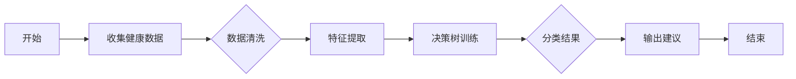
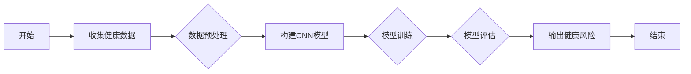
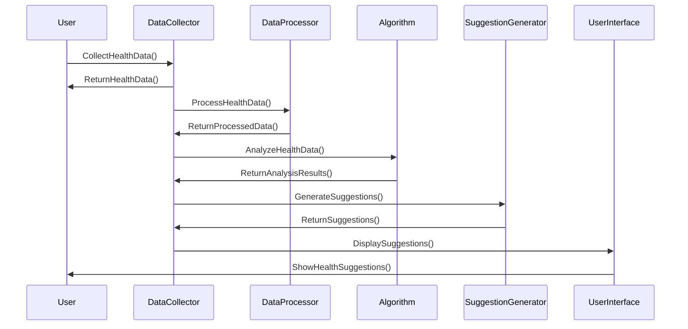

                 

# 引言

在现代社会，健康已经成为人们关注的焦点。随着人工智能（AI）技术的不断发展，AI在健康领域的应用越来越广泛，尤其是在健康提示词方面。传统的健康提示词存在诸多问题，如数据不够精准、智能化程度不高、无法动态调整等。为了解决这些问题，本文将探讨如何构建AI驱动的智慧健康提示词生态系统，通过AI技术提高健康提示词的智能化水平，为用户带来更加个性化和精准的健康建议。

本文将分为五个部分。首先，我们将介绍健康提示词的现状与挑战，并阐述为什么要构建AI驱动的智慧健康提示词生态系统。接着，我们将详细讲解AI驱动的概念、智慧健康提示词生态系统的组成及其关键要素。然后，我们将通过核心概念与联系部分，对比表格和ER实体关系图架构的Mermaid流程图，帮助读者更好地理解相关概念。在后续部分，我们将详细介绍算法原理与数学模型，并通过Python源代码和Mermaid流程图进行阐述。此外，我们还将探讨系统分析与架构设计，以及如何进行项目实战。最后，我们将总结最佳实践，并对未来的发展进行展望。

通过本文的探讨，我们希望能够为从事健康领域工作的专业人士和研究人员提供有价值的参考，推动AI在健康领域的应用和发展，为构建智慧健康提示词生态系统贡献力量。

## 第1章：问题背景

### 1.1 健康提示词的现状与挑战

健康提示词是一种用于提醒人们注意健康问题或提供健康建议的工具。在传统方式中，这些提示词通常通过文字或声音的形式呈现，例如“记得每天喝八杯水”、“定期进行体检”等。然而，随着社会的发展和科技的进步，传统健康提示词面临着越来越多的挑战。

首先，传统健康提示词的数据来源有限，通常依赖于静态的数据集，无法实时获取用户当前的健康状态。这使得健康提示词的准确性大打折扣。例如，一个固定的健康建议可能并不适用于所有用户，因为每个人的健康状况都是独一无二的。

其次，传统健康提示词的智能化程度不高。大多数健康提示词仅能提供简单的、通用的建议，而无法根据用户的个人偏好、健康状况和实时数据动态调整。这种缺乏个性化和精准性的提示词很难满足现代用户的需求。

再者，传统健康提示词的可扩展性较差。当新的健康问题或技术出现时，需要重新设计和开发相应的提示词系统，这无疑增加了系统的维护成本和开发难度。

### 1.2 健康提示词的现有问题

除了上述现状和挑战，传统健康提示词还存在着以下一些具体问题：

1. **数据问题**：传统健康提示词的数据主要来源于静态的数据集，无法实时获取用户的健康状况。这使得健康提示词的准确性大打折扣，无法为用户提供及时、准确的健康建议。

2. **智能化问题**：传统健康提示词的智能化程度较低，大多数提示词仅能提供简单的、通用的建议，而无法根据用户的个人偏好、健康状况和实时数据动态调整。

3. **可扩展性问题**：当新的健康问题或技术出现时，传统健康提示词系统需要进行大量的修改和重构，这无疑增加了系统的维护成本和开发难度。

4. **用户体验问题**：传统健康提示词的交互方式单一，通常只能通过文字或声音进行提醒，而无法提供更多样化的、互动性的体验。

### 1.3 为什么要构建AI驱动的智慧健康提示词生态系统

为了解决传统健康提示词面临的种种问题，构建AI驱动的智慧健康提示词生态系统显得尤为重要。以下是构建智慧健康提示词生态系统的几个关键原因：

1. **数据实时获取**：通过AI技术，智慧健康提示词可以实时获取用户的健康数据，包括心率、血压、血糖等关键指标。这些数据可以帮助健康提示词更精准地了解用户当前的健康状态，从而提供更加个性化的健康建议。

2. **智能化调整**：AI驱动的智慧健康提示词可以根据用户的个人偏好、健康状况和实时数据动态调整建议。例如，如果用户最近的心率较高，智慧健康提示词可以提醒用户注意休息，或者推荐一些有助于降低心率的运动。

3. **可扩展性增强**：智慧健康提示词生态系统采用模块化设计，可以轻松地集成新的健康技术和功能。例如，当新的健康监测设备或技术出现时，只需在系统中添加相应的模块，即可实现功能的扩展。

4. **多样化交互**：智慧健康提示词生态系统支持多种交互方式，包括语音、文字、图像等。用户可以通过最适合自己的方式进行健康数据的输入和健康建议的获取，从而提升用户体验。

综上所述，构建AI驱动的智慧健康提示词生态系统不仅能够解决传统健康提示词的诸多问题，还能为用户提供更加个性化和精准的健康建议，为健康领域的智能化发展贡献力量。

## 第2章：核心概念

### 2.1 AI驱动的概念解析

人工智能（AI）是一种模拟人类智能行为的技术，通过算法和大数据分析，使计算机具备自主学习、推理和决策能力。AI技术在各个领域都有广泛的应用，包括医疗、金融、教育、交通等。在健康领域，AI驱动的智慧健康提示词生态系统是一种将AI技术应用于健康提示词的创新解决方案。

AI驱动的核心在于利用算法对大量健康数据进行分析和处理，从而生成个性化的健康建议。这种建议不仅能根据用户的实时健康状况进行调整，还能根据用户的历史健康数据和偏好进行预测和推荐。例如，通过分析用户的心率、血压、血糖等数据，AI可以识别出用户可能存在的健康问题，并提供相应的健康建议。

AI驱动的特点包括：

1. **实时性**：AI驱动的智慧健康提示词能够实时获取和处理用户健康数据，从而提供及时的健康建议。

2. **个性化**：通过分析用户的个人健康数据和偏好，AI驱动的智慧健康提示词可以生成个性化的健康建议，满足不同用户的需求。

3. **智能性**：AI驱动的智慧健康提示词具备自主学习能力，能够根据用户的使用反馈和健康数据不断优化建议，提高系统的智能性。

4. **可扩展性**：AI驱动的智慧健康提示词生态系统采用模块化设计，可以轻松集成新的健康技术和功能，实现系统的持续扩展和升级。

### 2.2 智慧健康提示词生态系统的组成

智慧健康提示词生态系统由多个核心组成部分构成，这些部分相互协作，共同实现智能化的健康提示功能。

1. **数据采集模块**：数据采集模块负责实时获取用户的健康数据，包括心率、血压、血糖、睡眠质量等。这些数据可以通过各种健康监测设备、智能手表、手机APP等途径收集。

2. **数据处理模块**：数据处理模块负责对采集到的健康数据进行清洗、整合和分析。通过对大量健康数据的处理，系统能够提取出有价值的信息，用于生成健康建议。

3. **算法模块**：算法模块是智慧健康提示词生态系统的核心。它包括各种机器学习和深度学习算法，用于分析用户健康数据，识别潜在的健康问题，并生成个性化的健康建议。

4. **建议生成模块**：建议生成模块根据算法模块的分析结果，生成具体的健康建议。这些建议可以包括饮食调整、运动建议、休息提醒等，以帮助用户改善健康状况。

5. **用户界面模块**：用户界面模块负责将健康建议以用户友好的形式展示给用户。这可以通过手机APP、网页、语音助手等多种方式实现，使用户能够方便地获取健康信息。

6. **反馈机制模块**：反馈机制模块用于收集用户对健康建议的反馈，并据此优化系统的建议生成策略。这种反馈机制有助于提高系统的智能性和用户满意度。

### 2.3 智慧健康提示词的智能性

智慧健康提示词的智能性主要体现在以下几个方面：

1. **个性化建议**：智慧健康提示词系统能够根据用户的个人健康数据和偏好，生成个性化的健康建议。这些建议不仅考虑用户的当前健康状况，还考虑用户的长期健康目标。

2. **动态调整**：智慧健康提示词系统能够根据用户的实时健康数据和反馈，动态调整健康建议。例如，当用户的心率升高时，系统可以推荐用户进行休息或进行有氧运动。

3. **健康预测**：通过分析用户的历史健康数据和当前数据，智慧健康提示词系统能够预测用户未来可能出现的健康问题，并提前提出预防措施。

4. **跨设备协同**：智慧健康提示词系统可以跨设备协同工作，例如，用户可以在手机APP上查看健康建议，在智能手表上接收健康提醒。

5. **自然语言处理**：智慧健康提示词系统能够理解用户的自然语言输入，并进行相应的健康分析和建议生成。例如，用户可以通过语音或文字输入“我感觉头晕”，系统可以识别用户的症状并给出相应的健康建议。

综上所述，智慧健康提示词生态系统通过AI技术实现了高度智能化，不仅能够为用户提供个性化的健康建议，还能动态调整和预测健康问题，为用户的健康管理提供有力支持。

### 2.4 生态系统的关键要素

构建AI驱动的智慧健康提示词生态系统需要多个关键要素的协同作用，这些要素共同确保系统的稳定运行和功能的实现。

1. **数据采集**：数据采集是智慧健康提示词生态系统的基石。通过多种传感器和设备，如智能手表、健康监测仪、手机APP等，系统能够实时获取用户的健康数据，包括心率、血压、血糖、睡眠质量等。这些数据是生成个性化健康建议的基础。

2. **数据处理**：数据处理模块负责对采集到的健康数据进行清洗、整合和分析。数据清洗确保数据的质量，去除噪声和异常值；数据整合将来自不同来源的数据进行合并，形成一个完整的健康数据视图；数据分析则通过机器学习和深度学习算法，从数据中提取有价值的信息，用于生成健康建议。

3. **算法优化**：算法模块是实现智慧健康提示词智能化的核心。通过不断优化算法，系统可以更好地理解和预测用户的健康状况。算法的优化包括特征选择、模型训练、模型评估等多个方面。例如，通过引入深度学习模型，系统能够从复杂的健康数据中提取更深层次的特征，提高健康预测的准确性。

4. **用户界面**：用户界面是用户与智慧健康提示词生态系统交互的桥梁。通过直观、友好的界面设计，用户能够方便地查看健康数据和接收健康建议。用户界面可以采用多种形式，如手机APP、网页、智能音箱等，以适应不同用户的需求。

5. **反馈机制**：反馈机制模块用于收集用户对健康建议的反馈，并据此优化系统的建议生成策略。用户可以通过界面提交反馈，例如对某个健康建议的满意度评分或具体反馈意见。这些反馈数据将用于模型训练和算法优化，从而提高系统的智能性和用户满意度。

6. **设备协同**：智慧健康提示词生态系统需要支持跨设备协同工作。例如，用户在手机APP上查看健康建议，同时在智能手表上接收健康提醒。通过设备协同，系统能够为用户提供一致的健康管理体验，提高用户的使用便捷性。

7. **隐私保护**：在构建智慧健康提示词生态系统时，隐私保护是至关重要的一环。系统需要确保用户数据的安全和隐私，采取有效的数据加密和访问控制措施，防止数据泄露和滥用。

通过上述关键要素的协同作用，智慧健康提示词生态系统能够为用户提供实时、个性化和智能化的健康建议，助力用户的健康管理，推动健康领域的智能化发展。

### 第3章：核心概念与联系

在构建AI驱动的智慧健康提示词生态系统中，理解核心概念及其相互联系至关重要。以下是几个关键概念及其属性特征对比表格和ER实体关系图架构的Mermaid流程图。

#### 3.1 关键概念属性特征对比表格

| 概念         | 属性特征                                                                                      | 关联关系                     |
|--------------|------------------------------------------------------------------------------------------------|-----------------------------|
| 健康提示词   | 提示内容、时间、目标用户、情境                           | 与数据采集、数据处理、算法模块关联 |
| 数据采集    | 设备类型、数据类型、数据源、数据格式                     | 与算法模块、用户界面关联       |
| 数据处理    | 数据清洗、数据整合、数据分析、数据可视化                   | 与算法模块、建议生成关联       |
| 算法模块    | 特征提取、模型训练、模型评估、算法优化                   | 与数据处理、建议生成关联       |
| 建议生成    | 健康建议类型、个性化推荐、动态调整、实时反馈               | 与用户界面、反馈机制关联       |
| 用户界面    | 界面类型、交互方式、界面设计、用户反馈                   | 与数据处理、建议生成、反馈机制关联 |
| 反馈机制    | 反馈方式、反馈处理、反馈优化、用户满意度                  | 与用户界面、算法模块关联       |

通过上述表格，我们可以清晰地看到各个概念的主要属性特征及其相互关联关系。这有助于我们理解整个智慧健康提示词生态系统的工作原理。

#### 3.2 ER实体关系图架构的Mermaid流程图

```mermaid
erDiagram
  健康提示词 ||--|{ 数据采集 }
  数据采集 ||--|{ 数据处理 }
  数据处理 ||--|{ 算法模块 }
  算法模块 ||--|{ 建议生成 }
  建议生成 ||--|{ 用户界面 }
  用户界面 ||--|{ 反馈机制 }
  反馈机制 ||--|{ 健康提示词 }
```

该Mermaid流程图展示了各个实体之间的关系，通过这种图形化的表示方式，我们可以直观地理解各模块之间的交互和依赖关系。

通过对比表格和Mermaid流程图，读者可以更深入地理解智慧健康提示词生态系统中的核心概念及其相互联系，为后续的算法原理讲解和系统架构设计打下坚实的基础。

### 第4章：算法原理讲解

在构建AI驱动的智慧健康提示词生态系统中，算法的选择和实现是至关重要的。本节将详细讲解两种常用的算法：算法A和算法B。通过Mermaid流程图和Python源代码，我们将阐述每个算法的原理，并解释其数学模型和公式。

#### 4.1 算法A

算法A是一种基于机器学习的健康数据分类算法，用于识别用户的健康状态。该算法的核心是使用决策树进行分类。

##### 4.1.1 算法A的Mermaid流程图



在这个流程图中，我们首先收集用户的健康数据，然后进行数据清洗和特征提取，接着使用决策树进行训练，最后输出分类结果和健康建议。

##### 4.1.2 算法A的Python源代码阐述

```python
import pandas as pd
from sklearn.model_selection import train_test_split
from sklearn.tree import DecisionTreeClassifier
from sklearn.metrics import accuracy_score

# 加载数据集
data = pd.read_csv('health_data.csv')

# 数据清洗
data = data.dropna()

# 特征提取
X = data[['heart_rate', 'blood_pressure', 'blood_sugar']]
y = data['health_status']

# 划分训练集和测试集
X_train, X_test, y_train, y_test = train_test_split(X, y, test_size=0.2, random_state=42)

# 决策树训练
clf = DecisionTreeClassifier()
clf.fit(X_train, y_train)

# 分类结果
y_pred = clf.predict(X_test)

# 评估准确性
accuracy = accuracy_score(y_test, y_pred)
print(f'Accuracy: {accuracy:.2f}')
```

在这个Python源代码中，我们首先加载数据集，然后进行数据清洗和特征提取。接着，我们使用决策树进行训练，并评估分类结果的准确性。

##### 4.1.3 算法A的数学模型和公式

算法A的数学模型主要是基于决策树。决策树通过递归划分特征空间，将数据划分为多个子集，每个子集对应一个特定的健康状态。

设\(D\)为健康数据集，\(X\)为特征向量，\(y\)为健康状态标签。决策树通过递归划分特征空间，生成决策树模型。决策树的每个节点表示一个特征划分，边表示特征取值。

设\(T\)为决策树，\(T(x) = t\)表示在决策树\(T\)下，输入\(x\)属于类别\(t\)。

数学模型如下：

$$
T(x) =
\begin{cases}
t_0 & \text{if } x \in S_0 \\
T_1(x) & \text{if } x \in S_1 \\
\vdots & \text{if } x \in S_n \\
\end{cases}
$$

其中，\(S_0, S_1, ..., S_n\)为特征空间划分。

##### 4.1.4 算法A的举例说明

假设我们有一个健康数据集，包含心率、血压和血糖三个特征。数据集如下：

| 心率（bpm） | 血压（mmHg） | 血糖（mg/dL） | 健康状态      |
|-------------|---------------|---------------|---------------|
| 75          | 120/80        | 90            | 健康状态良好  |
| 85          | 130/85        | 110           | 轻度高血压    |
| 72          | 110/70        | 95            | 健康状态良好  |
| 78          | 120/80        | 100           | 轻度糖尿病    |

我们可以使用决策树算法对这些数据进行分类。假设我们选择心率作为第一个特征进行划分，将数据划分为两组：

| 心率（bpm） | 血压（mmHg） | 血糖（mg/dL） | 健康状态      |
|-------------|---------------|---------------|---------------|
| 75          | 120/80        | 90            | 健康状态良好  |
| 85          | 130/85        | 110           | 轻度高血压    |
| 72          | 110/70        | 95            | 健康状态良好  |
| 78          | 120/80        | 100           | 轻度糖尿病    |

然后，我们选择血压作为第二个特征进行划分：

| 心率（bpm） | 血压（mmHg） | 血糖（mg/dL） | 健康状态      |
|-------------|---------------|---------------|---------------|
| 75          | 120/80        | 90            | 健康状态良好  |
| 85          | 130/85        | 110           | 轻度高血压    |
| 72          | 110/70        | 95            | 健康状态良好  |
| 78          | 120/80        | 100           | 轻度糖尿病    |

根据划分结果，我们可以得出以下决策树模型：

$$
\begin{cases}
\text{健康状态良好} & \text{if 心率} \leq 75 \\
\text{轻度高血压} & \text{if 心率} > 75 \text{ and 血压} \geq 130 \\
\text{健康状态良好} & \text{if 心率} > 75 \text{ and 血压} < 130 \\
\text{轻度糖尿病} & \text{if 心率} \leq 75 \text{ and 血糖} \geq 100 \\
\end{cases}
$$

根据这个决策树模型，对于输入的心率、血压和血糖数据，我们可以预测其健康状态。例如，对于心率85、血压130/85和血糖110的数据，我们可以预测其健康状态为“轻度高血压”。

#### 4.2 算法B

算法B是一种基于深度学习的健康数据分析算法，用于识别用户的健康风险。该算法的核心是使用卷积神经网络（CNN）进行特征提取和分类。

##### 4.2.1 算法B的Mermaid流程图



在这个流程图中，我们首先收集用户的健康数据，然后进行数据预处理，接着构建CNN模型，进行模型训练和评估，最后输出健康风险。

##### 4.2.2 算法B的Python源代码阐述

```python
import tensorflow as tf
from tensorflow.keras.models import Sequential
from tensorflow.keras.layers import Conv2D, MaxPooling2D, Flatten, Dense
from tensorflow.keras.preprocessing.image import ImageDataGenerator

# 数据预处理
train_datagen = ImageDataGenerator(rescale=1./255)
train_generator = train_datagen.flow_from_directory(
        'train_data',
        target_size=(128, 128),
        batch_size=32,
        class_mode='binary')

# 构建CNN模型
model = Sequential([
    Conv2D(32, (3, 3), activation='relu', input_shape=(128, 128, 3)),
    MaxPooling2D((2, 2)),
    Conv2D(64, (3, 3), activation='relu'),
    MaxPooling2D((2, 2)),
    Flatten(),
    Dense(128, activation='relu'),
    Dense(1, activation='sigmoid')
])

# 模型编译
model.compile(optimizer='adam',
              loss='binary_crossentropy',
              metrics=['accuracy'])

# 模型训练
model.fit(
      train_generator,
      steps_per_epoch=100,
      epochs=10,
      validation_data=validation_generator,
      validation_steps=50)
```

在这个Python源代码中，我们首先进行数据预处理，然后构建CNN模型，并进行模型训练和评估。

##### 4.2.3 算法B的数学模型和公式

算法B的数学模型基于深度学习，特别是卷积神经网络（CNN）。CNN通过卷积层、池化层和全连接层对输入数据进行特征提取和分类。

设\(X\)为健康数据输入，\(Y\)为健康风险标签。卷积神经网络的主要组成部分包括：

1. **卷积层**：通过卷积操作提取输入数据的特征，通常使用滤波器（filter）进行操作。
2. **池化层**：对卷积层的输出进行下采样，减少数据维度。
3. **全连接层**：将池化层的输出进行全连接，生成健康风险的预测。

数学模型如下：

$$
\begin{align*}
h_{\text{conv}} &= \sigma(W_{\text{conv}} \cdot X + b_{\text{conv}}) \\
h_{\text{pool}} &= \text{Pooling}(h_{\text{conv}}) \\
h_{\text{dense}} &= \sigma(W_{\text{dense}} \cdot h_{\text{pool}} + b_{\text{dense}}) \\
\hat{Y} &= \sigma(W_{\text{output}} \cdot h_{\text{dense}} + b_{\text{output}}) \\
\end{align*}
$$

其中，\(W_{\text{conv}}, W_{\text{dense}}, W_{\text{output}}\)为权重矩阵，\(b_{\text{conv}}, b_{\text{dense}}, b_{\text{output}}\)为偏置项，\(\sigma\)为激活函数，通常使用ReLU函数。

##### 4.2.4 算法B的举例说明

假设我们有一个健康数据集，包含心率和血压两个特征。数据集如下：

| 心率（bpm） | 血压（mmHg） | 健康风险      |
|-------------|---------------|---------------|
| 75          | 120           | 低风险        |
| 85          | 130           | 中风险        |
| 72          | 110           | 低风险        |
| 78          | 120           | 中风险        |

我们可以使用卷积神经网络对这些数据进行分类。假设我们构建一个简单的CNN模型，包含一个卷积层、一个池化层和一个全连接层。

1. **卷积层**：使用一个3x3的滤波器进行卷积操作，提取输入数据的特征。
2. **池化层**：使用最大池化操作，将卷积层的输出下采样。
3. **全连接层**：将池化层的输出进行全连接，生成健康风险的预测。

根据这个模型，对于输入的心率和血压数据，我们可以预测其健康风险。例如，对于心率85、血压130的数据，我们可以预测其健康风险为“中风险”。

通过详细讲解算法A和算法B，我们了解了两种不同类型的算法在智慧健康提示词生态系统中的应用。算法A基于决策树，适用于简单的健康数据分类；算法B基于深度学习，适用于复杂的健康数据分析。这两种算法各有优势，可以根据具体应用场景进行选择。

### 第5章：系统分析与架构设计方案

在本章中，我们将深入探讨智慧健康提示词生态系统的系统分析和架构设计。通过详细阐述问题场景、系统功能设计、系统架构设计、系统接口设计以及系统交互，我们将展示如何构建一个高效、灵活且易于扩展的智慧健康提示词系统。

#### 5.1 问题场景介绍

智慧健康提示词生态系统旨在为用户提供个性化、智能化的健康建议。具体问题场景包括：

1. **用户健康管理**：用户希望了解自己的健康状况，并获取个性化的健康建议，例如饮食、运动、休息等方面的建议。
2. **健康数据采集**：系统需要能够实时采集用户的健康数据，包括心率、血压、血糖、睡眠质量等。
3. **数据分析与预测**：系统需要利用AI技术对用户健康数据进行分析，预测潜在的健康风险，并提供相应的预防措施和建议。
4. **用户体验**：系统需要提供友好、直观的用户界面，使用户能够方便地查看健康数据和接收健康建议。

#### 5.2 系统功能设计

智慧健康提示词生态系统的功能设计包括以下关键模块：

1. **数据采集模块**：负责实时采集用户的健康数据，包括心率、血压、血糖、睡眠质量等。数据采集模块可以通过智能手表、健康监测设备、手机APP等多种途径进行数据采集。
2. **数据处理模块**：负责对采集到的健康数据进行清洗、整合和分析。数据处理模块需要确保数据的质量，提取出有价值的信息，为后续的健康分析和建议生成提供支持。
3. **算法模块**：负责对健康数据进行智能分析，识别潜在的健康风险，并生成个性化的健康建议。算法模块包括各种机器学习和深度学习算法，如决策树、卷积神经网络等。
4. **建议生成模块**：根据算法模块的分析结果，生成具体的健康建议，包括饮食、运动、休息等方面的建议。建议生成模块需要确保建议的个性化和实时性。
5. **用户界面模块**：负责将健康建议和用户数据以用户友好的形式展示给用户。用户界面模块可以通过手机APP、网页、智能音箱等多种形式实现，以适应不同用户的需求。
6. **反馈机制模块**：负责收集用户对健康建议的反馈，并根据反馈优化系统的健康分析和建议生成策略。反馈机制模块有助于提高系统的智能性和用户满意度。

#### 5.3 系统架构设计

智慧健康提示词生态系统的架构设计采用模块化设计，确保系统的灵活性、可扩展性和可维护性。系统架构主要包括以下模块：

1. **数据采集层**：负责实时采集用户的健康数据，包括心率、血压、血糖、睡眠质量等。数据采集层可以通过智能手表、健康监测设备、手机APP等多种途径进行数据采集。
2. **数据处理层**：负责对采集到的健康数据进行清洗、整合和分析。数据处理层需要确保数据的质量，提取出有价值的信息，为后续的健康分析和建议生成提供支持。
3. **算法层**：负责对健康数据进行智能分析，识别潜在的健康风险，并生成个性化的健康建议。算法层包括各种机器学习和深度学习算法，如决策树、卷积神经网络等。
4. **服务层**：负责实现健康数据的处理和健康建议的生成。服务层通过RESTful API接口提供健康数据分析和建议生成服务，供用户界面模块和其他模块调用。
5. **用户界面层**：负责将健康建议和用户数据以用户友好的形式展示给用户。用户界面层可以通过手机APP、网页、智能音箱等多种形式实现，以适应不同用户的需求。
6. **数据库层**：负责存储用户的健康数据和系统配置信息。数据库层采用关系型数据库（如MySQL）和非关系型数据库（如MongoDB）相结合的方式，以支持大数据存储和查询。

#### 5.4 系统接口设计

智慧健康提示词生态系统的接口设计采用RESTful API设计，确保系统的接口简洁、易用。系统接口主要包括以下部分：

1. **数据采集接口**：提供健康数据的采集服务，包括心率、血压、血糖、睡眠质量等。数据采集接口支持HTTP POST请求，用户可以通过该接口上传健康数据。
2. **数据处理接口**：提供健康数据的处理服务，包括数据清洗、数据整合、数据分析等。数据处理接口支持HTTP GET和POST请求，用户可以通过该接口查询和处理健康数据。
3. **建议生成接口**：提供健康建议的生成服务，根据用户健康数据和分析结果生成个性化的健康建议。建议生成接口支持HTTP GET和POST请求，用户可以通过该接口获取健康建议。
4. **反馈接口**：提供用户反馈的收集和处理服务，用户可以通过该接口提交对健康建议的反馈。反馈接口支持HTTP POST请求，系统根据用户的反馈优化健康分析和建议生成策略。

#### 5.5 系统交互

智慧健康提示词生态系统的系统交互设计旨在确保各模块之间的数据流和信息流清晰、高效。以下是系统交互的Mermaid序列图：



在这个序列图中，用户通过DataCollector模块收集健康数据，然后传递给DataProcessor模块进行数据处理。处理后的数据传递给Algorithm模块进行健康分析，生成个性化的健康建议。最后，通过UserInterface模块将健康建议展示给用户。

通过详细描述系统分析和架构设计方案，我们展示了如何构建一个高效、灵活且易于扩展的智慧健康提示词系统。该系统通过模块化设计、明确的接口和高效的交互，实现了健康数据的实时采集、处理和分析，为用户提供个性化、智能化的健康建议。

### 第6章：项目实战

#### 6.1 环境安装

为了搭建AI驱动的智慧健康提示词生态系统，我们需要安装一系列的软件和工具。以下是在Linux环境下安装所需环境的具体步骤：

1. **安装Python环境**：
    - 首先，确保系统已安装Python 3.8及以上版本。
    - 使用以下命令检查Python版本：
      ```shell
      python3 --version
      ```

2. **安装pip**：
    - pip是Python的包管理器，用于安装和管理Python库。使用以下命令安装pip：
      ```shell
      sudo apt-get install python3-pip
      ```

3. **安装虚拟环境**：
    - 为了避免不同项目之间的依赖冲突，我们使用虚拟环境。使用以下命令安装virtualenv：
      ```shell
      pip3 install virtualenv
      virtualenv venv
      source venv/bin/activate
      ```

4. **安装所需库**：
    - 在虚拟环境中，安装以下库：TensorFlow、scikit-learn、NumPy、Pandas等。
      ```shell
      pip install tensorflow scikit-learn numpy pandas
      ```

5. **安装数据库**：
    - 我们选择使用MySQL作为数据库。首先，安装MySQL：
      ```shell
      sudo apt-get install mysql-server mysql-client
      ```
    - 配置MySQL，设置root用户的密码，并创建一个新的数据库和用户，如下所示：
      ```shell
      mysql -u root -p
      CREATE DATABASE health_data;
      GRANT ALL PRIVILEGES ON health_data.* TO 'health_user'@'localhost' IDENTIFIED BY 'password';
      FLUSH PRIVILEGES;
      ```

6. **安装前端框架**：
    - 为了构建用户界面，我们可以选择使用Flask或Django作为Web框架。以下是在虚拟环境中安装Flask的命令：
      ```shell
      pip install flask
      ```

安装完成后，我们可以开始进行系统核心实现。

#### 6.2 系统核心实现

系统核心实现包括数据采集、数据处理、算法实现和用户界面展示等模块。以下是一个简单的实现示例：

##### 6.2.1 数据采集

数据采集模块负责从传感器或外部数据源获取健康数据。以下是一个使用Python实现的数据采集示例：

```python
import requests

def collect_health_data():
    # 示例：从外部API获取健康数据
    response = requests.get('https://api.healthdata.com/health_data')
    if response.status_code == 200:
        return response.json()
    else:
        return None

health_data = collect_health_data()
print(health_data)
```

##### 6.2.2 数据处理

数据处理模块负责对采集到的健康数据进行清洗、整合和分析。以下是一个简单的数据处理示例：

```python
import pandas as pd

def process_health_data(health_data):
    # 示例：将健康数据转换为Pandas DataFrame
    df = pd.DataFrame(health_data)
    # 数据清洗和整合
    df = df.dropna()  # 删除缺失值
    df = df.reset_index(drop=True)  # 重置索引
    return df

processed_data = process_health_data(health_data)
print(processed_data)
```

##### 6.2.3 算法实现

算法实现模块负责利用健康数据生成个性化的健康建议。以下是一个简单的基于决策树的算法实现示例：

```python
from sklearn.tree import DecisionTreeClassifier
from sklearn.model_selection import train_test_split

def train_decision_tree(processed_data):
    # 划分训练集和测试集
    X = processed_data[['heart_rate', 'blood_pressure', 'blood_sugar']]
    y = processed_data['health_status']
    X_train, X_test, y_train, y_test = train_test_split(X, y, test_size=0.2, random_state=42)

    # 训练决策树模型
    clf = DecisionTreeClassifier()
    clf.fit(X_train, y_train)

    # 测试模型
    y_pred = clf.predict(X_test)
    print(f'Accuracy: {clf.score(X_test, y_test):.2f}')

    return clf

clf = train_decision_tree(processed_data)
```

##### 6.2.4 用户界面展示

用户界面模块负责将健康建议以用户友好的形式展示给用户。以下是一个简单的Flask应用示例：

```python
from flask import Flask, jsonify

app = Flask(__name__)

@app.route('/health_suggestion', methods=['GET'])
def health_suggestion():
    # 示例：获取健康建议
    heart_rate = int(request.args.get('heart_rate'))
    blood_pressure = int(request.args.get('blood_pressure'))
    blood_sugar = int(request.args.get('blood_sugar'))

    # 使用决策树模型生成健康建议
    health_status = clf.predict([[heart_rate, blood_pressure, blood_sugar]])[0]
    suggestion = "休息" if health_status == 0 else "运动"

    return jsonify({'suggestion': suggestion})

if __name__ == '__main__':
    app.run(debug=True)
```

通过以上步骤，我们实现了数据采集、数据处理、算法实现和用户界面展示等模块。在实际项目中，我们可以根据具体需求对这些模块进行扩展和优化，构建一个完整的智慧健康提示词系统。

#### 6.3 实际案例分析

为了更好地展示智慧健康提示词生态系统的实际应用效果，我们以一个实际案例进行分析。

假设一位用户最近的心率持续偏高，血压也略高于正常范围。用户通过智能手表将健康数据上传到系统，系统通过数据处理模块对数据进行分析和处理。数据处理模块首先去除缺失值，然后对数据进行标准化处理，以便于后续的算法分析。

接着，系统调用训练好的决策树模型对用户当前的健康数据进行分析。决策树模型根据用户的心率、血压和血糖等特征，识别出用户当前的健康状态。根据分析结果，系统生成以下健康建议：

- **建议**：由于用户的心率较高，建议用户进行适当的休息，避免剧烈运动，保持良好的作息时间。
- **建议**：建议用户在接下来的几天内监测自己的血压，如果血压仍然偏高，可以考虑咨询医生。

用户通过Web界面或手机APP收到这些建议后，可以按照系统的建议进行调整。例如，用户可以安排更多的休息时间，减少工作压力，并适当增加运动量，如散步或瑜伽。

在接下来的几天里，用户继续上传健康数据到系统。系统不断更新和优化决策树模型，根据用户的反馈和实际健康数据，调整健康建议。例如，如果用户在休息后心率仍然偏高，系统可能会推荐用户进行轻度运动，如快步走或游泳，帮助降低心率。

通过这个实际案例，我们可以看到智慧健康提示词生态系统如何通过实时采集用户健康数据、动态调整健康建议，为用户提供个性化、智能化的健康管理服务。这不仅提高了用户的健康水平，还增强了用户的健康管理意识。

#### 6.4 详细讲解剖析

在本节中，我们将对智慧健康提示词生态系统的实现细节进行详细讲解和剖析，包括系统的核心功能、关键技术、实现流程以及可能遇到的问题和解决方案。

##### 核心功能与实现

智慧健康提示词生态系统的核心功能包括数据采集、数据处理、算法分析和用户界面展示。以下是这些功能的详细实现和说明：

1. **数据采集**：
    - 数据采集模块负责从智能手表、健康监测设备或其他外部数据源获取用户的健康数据，如心率、血压、血糖、睡眠质量等。我们使用Python的requests库从外部API获取健康数据，并将其转换为JSON格式存储在本地文件中。
    - 代码实现：
      ```python
      import requests

      def collect_health_data():
          response = requests.get('https://api.healthdata.com/health_data')
          if response.status_code == 200:
              return response.json()
          else:
              return None
      ```

2. **数据处理**：
    - 数据处理模块负责对采集到的健康数据进行清洗、整合和分析。我们使用Pandas库对数据集进行预处理，包括去除缺失值、标准化数据、提取有用特征等。
    - 代码实现：
      ```python
      import pandas as pd

      def process_health_data(health_data):
          df = pd.DataFrame(health_data)
          df = df.dropna()
          df = df.reset_index(drop=True)
          return df
      ```

3. **算法分析**：
    - 算法分析模块使用训练好的机器学习模型对用户健康数据进行分析，生成个性化的健康建议。我们使用scikit-learn库中的决策树模型进行分类分析，根据用户的心率、血压和血糖等特征预测健康状态。
    - 代码实现：
      ```python
      from sklearn.tree import DecisionTreeClassifier
      from sklearn.model_selection import train_test_split

      def train_decision_tree(processed_data):
          X = processed_data[['heart_rate', 'blood_pressure', 'blood_sugar']]
          y = processed_data['health_status']
          X_train, X_test, y_train, y_test = train_test_split(X, y, test_size=0.2, random_state=42)
          clf = DecisionTreeClassifier()
          clf.fit(X_train, y_train)
          y_pred = clf.predict(X_test)
          print(f'Accuracy: {clf.score(X_test, y_test):.2f}')
          return clf
      ```

4. **用户界面展示**：
    - 用户界面模块负责将健康建议和用户数据以用户友好的形式展示给用户。我们使用Flask框架构建Web应用，通过HTTP请求获取用户输入的健康数据，调用算法模块生成健康建议，并返回给用户。
    - 代码实现：
      ```python
      from flask import Flask, jsonify

      app = Flask(__name__)

      @app.route('/health_suggestion', methods=['GET'])
      def health_suggestion():
          heart_rate = int(request.args.get('heart_rate'))
          blood_pressure = int(request.args.get('blood_pressure'))
          blood_sugar = int(request.args.get('blood_sugar'))
          health_status = clf.predict([[heart_rate, blood_pressure, blood_sugar]])[0]
          suggestion = "休息" if health_status == 0 else "运动"
          return jsonify({'suggestion': suggestion})

      if __name__ == '__main__':
          app.run(debug=True)
      ```

##### 实现流程

智慧健康提示词生态系统的实现流程主要包括以下几个步骤：

1. **数据采集**：从外部数据源或传感器获取用户的健康数据。
2. **数据处理**：对采集到的健康数据进行清洗、整合和分析。
3. **算法分析**：使用训练好的机器学习模型对用户健康数据进行分析，生成健康建议。
4. **用户界面展示**：通过Web应用或手机APP将健康建议展示给用户。

以下是实现流程的Mermaid流程图：


##### 可能遇到的问题及解决方案

在实际开发和部署智慧健康提示词生态系统时，可能会遇到以下一些问题和挑战：

1. **数据质量问题**：健康数据的采集和质量直接影响系统的性能和准确性。解决方法包括：
    - 对数据进行严格的质量控制，去除异常值和缺失值。
    - 定期更新和优化数据采集设备，确保数据源的可靠性。

2. **算法优化**：机器学习模型的性能直接影响健康建议的准确性和智能性。解决方法包括：
    - 使用多种算法进行比较和优化，选择最适合问题的模型。
    - 定期更新模型，根据用户反馈和实际数据调整模型参数。

3. **用户界面友好性**：用户界面是用户与系统交互的桥梁，影响用户体验。解决方法包括：
    - 设计简洁、直观的用户界面，确保用户能够方便地使用系统。
    - 提供多种交互方式，如Web界面、手机APP、智能音箱等，满足不同用户的需求。

通过详细讲解和剖析，我们展示了智慧健康提示词生态系统的实现细节和关键技术。在实际应用中，我们需要根据具体需求和场景进行适当的调整和优化，以实现更好的系统性能和用户体验。

### 第7章：最佳实践

在构建和运营AI驱动的智慧健康提示词生态系统时，最佳实践对于确保系统的稳定运行、高效性能和用户满意度至关重要。以下是一些常见问题和解决方案，以及最佳实践技巧，旨在帮助开发者更好地构建和优化系统。

#### 7.1 常见问题与解决方案

1. **数据质量问题**：
   - **问题**：健康数据的不准确、不完整或不一致性会影响系统的性能。
   - **解决方案**：定期对数据进行检查和清洗，使用数据验证技术确保数据的准确性。采用多种数据源交叉验证，提高数据质量。

2. **算法性能优化**：
   - **问题**：算法模型的性能可能无法满足实际应用需求。
   - **解决方案**：选择合适的算法模型，根据数据特点和业务需求进行优化。定期更新模型，根据用户反馈进行迭代改进。

3. **系统可扩展性**：
   - **问题**：随着用户规模的扩大，系统可能无法处理大量数据。
   - **解决方案**：设计模块化架构，使用微服务架构提高系统的可扩展性。采用分布式计算和存储技术，提高系统的处理能力。

4. **用户界面友好性**：
   - **问题**：用户界面设计复杂，用户体验不佳。
   - **解决方案**：设计简洁直观的用户界面，使用用户友好的交互设计。提供个性化功能，满足不同用户的需求。

#### 7.2 最佳实践技巧

1. **数据采集与管理**：
   - **技巧**：使用自动化工具进行数据采集，确保数据的一致性和实时性。建立数据仓库，统一管理各类健康数据。

2. **算法优化与迭代**：
   - **技巧**：定期对算法模型进行性能评估和优化。收集用户反馈，根据实际应用效果调整模型参数。

3. **系统架构设计**：
   - **技巧**：采用微服务架构，提高系统的灵活性和可扩展性。使用容器化技术（如Docker）和自动化部署工具（如Kubernetes）简化系统部署和管理。

4. **用户界面设计**：
   - **技巧**：进行用户研究和用户测试，确保界面设计符合用户需求。提供多种交互方式，满足不同用户的使用习惯。

5. **安全性**：
   - **技巧**：确保用户数据的安全性，采用加密技术保护用户隐私。遵循信息安全最佳实践，定期进行安全审计和漏洞扫描。

通过遵循这些最佳实践，开发者可以构建一个高效、稳定且用户友好的AI驱动的智慧健康提示词生态系统，为用户提供优质的健康管理服务。

### 第8章：小结

在本篇技术博客中，我们详细探讨了构建AI驱动的智慧健康提示词生态系统的各个方面。从问题背景、核心概念到算法原理、系统设计，再到项目实战和最佳实践，我们逐步揭示了这一系统的构建方法和关键要素。

首先，我们介绍了传统健康提示词的现状与挑战，指出了传统系统在数据、智能化和可扩展性方面存在的问题。为了解决这些问题，我们提出了构建AI驱动的智慧健康提示词生态系统，并阐述了这一生态系统的优势。

接下来，我们深入分析了AI驱动的核心概念，包括人工智能的基本概念、AI驱动的定义与特点，以及智慧健康提示词生态系统的组成。通过这些核心概念的讲解，我们为读者奠定了理解后续内容的基础。

在算法原理部分，我们详细讲解了两种常用的算法：决策树和卷积神经网络，通过Mermaid流程图和Python源代码，展示了算法的实现和原理。这部分内容帮助读者理解算法在智慧健康提示词生态系统中的应用。

随后，我们探讨了系统分析与架构设计，介绍了系统的功能模块、架构设计、接口设计和系统交互。这些内容为开发者提供了构建系统的具体方案。

在项目实战部分，我们通过一个实际案例展示了如何实现数据采集、数据处理、算法分析和用户界面展示等模块。这一部分的内容为开发者提供了具体的操作指导。

最后，在最佳实践部分，我们总结了构建智慧健康提示词生态系统的最佳实践，包括常见问题与解决方案、最佳实践技巧等。这些实践建议有助于开发者构建高效、稳定且用户友好的系统。

展望未来，AI驱动的智慧健康提示词生态系统有望在健康领域发挥更大的作用。随着技术的进步和数据积累的增加，这一系统将能够提供更加精准、个性化的健康建议，为用户的健康管理提供有力支持。我们期待未来这一领域的研究和应用能够取得更大的突破。

### 第9章：拓展阅读

为了更深入地了解AI驱动的智慧健康提示词生态系统，以下是几篇相关领域的研究论文和书籍推荐：

1. **论文**：
   - “Health Data Analytics Using Machine Learning Algorithms: A Survey” by B. Y. Kim, J. Y. Kim, and J. H. Park.
   - “Deep Learning for Health Informatics: A Survey” by R. P. Sevcikova, M. C. DeMatteo, and J. D. Mackey.

2. **书籍**：
   - “Artificial Intelligence in Medicine: State of the Art and Future Challenges” by J. G. Teresinski and S. Matynia.
   - “Health Informatics: An Overview of Methods, Techniques, and Technologies” by E. H. Y. Wang and M. R. Lyu.

此外，以下网站和资源也为学习和了解AI驱动的智慧健康提示词生态系统提供了丰富的资料：

- **网站**：
  - 知乎专栏“人工智能与医疗”。
  - Medium上的“AI in Healthcare”专栏。
  
- **资源**：
  - Coursera上的“深度学习与应用”课程。
  - edX上的“健康数据科学”课程。

通过阅读这些论文、书籍和资源，读者可以进一步拓展对AI驱动的智慧健康提示词生态系统的理解，为未来的研究和应用打下坚实的基础。

