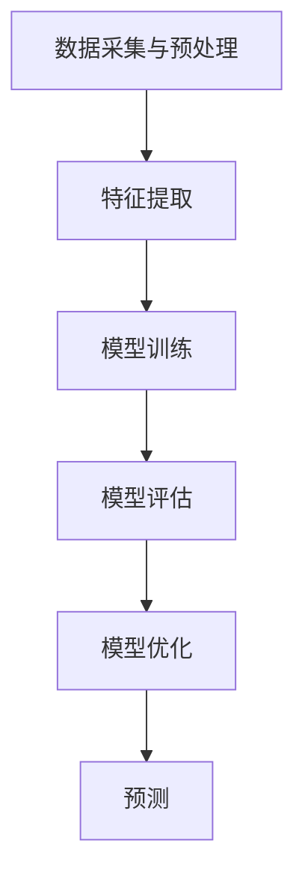
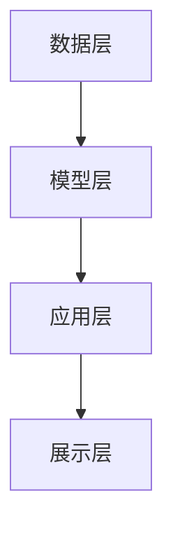

                 

### 《构建AI驱动的智慧气象预报提示词框架》

> 关键词：智慧气象、AI预测、气象预报提示词、系统架构设计、项目部署与优化

> 摘要：本文深入探讨了AI驱动的智慧气象预报提示词框架的构建，从背景介绍、核心概念、技术基础、系统构建、算法实现、实战案例以及项目部署与优化等方面，逐步分析了智慧气象预报提示词框架的构建过程。通过本文的详细讲解，读者可以全面了解AI在气象预报中的应用，掌握智慧气象预报提示词框架的核心技术和实现方法。

## 第一部分：背景与核心概念

### 第1章：问题背景与核心概念

#### 1.1 问题背景

随着全球气候变化和自然灾害的加剧，气象预报在社会经济发展和公共安全中的作用日益凸显。传统的气象预报方法主要依赖于经验模型和数值模拟，存在预报精度低、时效性差等问题。随着人工智能技术的快速发展，AI驱动的智慧气象预报逐渐成为可能，为提高气象预报的准确性和实时性提供了新的思路。

智慧气象的兴起，不仅需要准确的气象数据，还需要高效的预测模型和智能化的提示词生成机制。气象预报提示词是指用于描述气象现象的关键词，如“多云”、“小雨”、“高温”等。这些提示词可以帮助用户快速了解气象状况，做出相应的应对措施。

#### 1.2 核心概念

- **气象预报提示词**：是指用于描述气象现象的关键词，如“多云”、“小雨”、“高温”等。
- **AI驱动的智能预测系统**：利用人工智能技术，对气象数据进行处理和分析，生成准确的预报提示词。
- **数据采集与预处理**：收集气象数据，进行数据清洗、转换和标准化，为后续分析提供高质量的数据。
- **机器学习模型**：用于训练和预测，通过对历史气象数据的分析，提取特征并建立预测模型。

#### 1.3 概念联系与框架

智慧气象预报提示词框架主要包括以下几个关键环节：

1. **气象数据来源与处理**：收集并处理气象数据，为后续分析提供基础。
2. **提示词生成与优化**：利用机器学习模型生成预报提示词，并通过优化算法提高提示词的准确性和多样性。
3. **AI模型训练与评估**：训练和优化机器学习模型，评估模型的预测性能。
4. **用户交互与反馈**：通过与用户的交互，收集反馈信息，用于模型优化和系统改进。

通过以上环节的有机结合，构建出一个高效、智能的气象预报提示词框架，为智慧气象预报提供技术支持。

## 第二部分：技术基础

### 第2章：AI驱动的气象预报基础

#### 2.1 数据采集与预处理

气象数据的采集是构建AI驱动的智慧气象预报系统的第一步。气象数据可以从多个来源获取，如地面气象站、卫星、雷达、船舶等。这些数据包括温度、湿度、气压、风速、降水等。为了确保数据的质量和一致性，需要对其进行预处理。

**气象数据类型**：

- **地面气象数据**：包括温度、湿度、风速、降水、气压等。
- **卫星气象数据**：包括温度、湿度、云量、降水等。
- **雷达气象数据**：包括降水分布、雷达反射率等。

**数据预处理流程**：

1. **数据清洗**：去除重复数据、缺失值填充、异常值处理。
2. **数据转换**：将不同来源的数据进行统一格式转换，如将温度从摄氏度转换为开尔文。
3. **数据标准化**：对数据进行归一化或标准化处理，以便于后续分析。

**数据质量评估**：

数据质量直接影响模型的性能。需要对数据质量进行评估，包括数据完整性、一致性、准确性等。常用的评估方法有数据可视化、统计分析和模型测试等。

#### 2.2 机器学习算法基础

机器学习算法是AI驱动的智慧气象预报系统的核心。选择合适的算法对气象数据进行处理和分析，可以生成准确的预报提示词。

**常见算法介绍**：

- **线性回归**：用于预测线性关系。
- **决策树**：用于分类和回归分析。
- **支持向量机**：用于分类和回归分析。
- **神经网络**：用于复杂模式的识别和预测。

**算法选择与优化**：

选择合适的算法取决于数据特点和业务需求。例如，对于非线性关系的数据，可以选择神经网络；对于需要高准确率的数据，可以选择决策树或支持向量机。此外，通过调整算法参数，可以优化模型的性能。

**性能评估指标**：

- **准确率**：预测正确的样本数占总样本数的比例。
- **召回率**：预测正确的正样本数占总正样本数的比例。
- **F1值**：准确率和召回率的调和平均值。

#### 2.3 深度学习在气象预报中的应用

深度学习是一种重要的机器学习技术，尤其在处理大规模、高维度数据时具有显著优势。在气象预报中，深度学习可以用于构建复杂的预测模型。

**深度学习模型介绍**：

- **卷积神经网络（CNN）**：适用于处理图像数据。
- **循环神经网络（RNN）**：适用于处理序列数据。
- **长短期记忆网络（LSTM）**：RNN的一种改进，适用于处理长序列数据。
- **生成对抗网络（GAN）**：用于生成新的数据。

**网络结构优化**：

网络结构的优化是提高模型性能的关键。可以通过调整网络层数、神经元数量、激活函数等参数来实现。此外，还可以采用注意力机制、批量归一化等先进技术来优化网络结构。

**模型训练与调优**：

模型训练是深度学习的重要环节。需要通过大量的训练数据和调整训练参数来提高模型的性能。常用的训练方法有梯度下降、随机梯度下降、Adam优化器等。在训练过程中，还需要对模型进行调优，包括调整学习率、批次大小等参数。

## 第三部分：智慧气象预报提示词系统构建

### 第3章：系统架构设计

#### 3.1 系统功能需求分析

智慧气象预报提示词系统的核心功能包括气象数据采集、预处理、提示词生成、预测结果可视化和用户交互等。以下是对各功能模块的需求分析：

**气象数据采集**：

- 数据源：地面气象站、卫星、雷达等。
- 数据类型：温度、湿度、风速、降水、气压等。
- 数据频率：实时数据和历史数据。

**数据预处理**：

- 数据清洗：去除重复数据、缺失值填充、异常值处理。
- 数据转换：统一数据格式和单位。
- 数据标准化：归一化或标准化处理。

**提示词生成**：

- 输出格式：文本、图表等。
- 提示词类型：天气预报、灾害预警等。
- 提示词准确性：高准确率、低误报率。

**预测结果可视化**：

- 可视化类型：图表、地图等。
- 可视化效果：直观、易理解。

**用户交互**：

- 用户界面：Web界面、移动应用等。
- 用户反馈：实时反馈、历史反馈等。
- 用户权限：普通用户、管理员等。

#### 3.2 系统架构设计

智慧气象预报提示词系统采用分层架构，包括数据层、模型层、应用层和展示层。以下是对各层的详细介绍：

**数据层**：

- 数据库：存储气象数据、预处理数据和模型参数等。
- 数据采集：实时采集地面气象站、卫星、雷达等数据。
- 数据预处理：清洗、转换和标准化数据。

**模型层**：

- 模型训练：训练和优化机器学习模型，包括线性回归、决策树、神经网络等。
- 模型调优：调整模型参数，提高预测性能。
- 模型部署：将训练好的模型部署到服务器，用于实时预测。

**应用层**：

- 提示词生成：根据气象数据生成预报提示词。
- 预测结果处理：对预测结果进行可视化处理。
- 用户交互：提供Web界面或移动应用供用户使用。

**展示层**：

- 用户界面：展示气象预报提示词和预测结果。
- 数据可视化：使用图表、地图等展示气象数据。

**技术选型与实现**：

- 数据库：MySQL或MongoDB。
- 模型训练：使用TensorFlow或PyTorch等深度学习框架。
- 用户界面：使用HTML、CSS、JavaScript等前端技术。

#### 3.3 系统接口设计

系统接口设计是确保各模块之间数据交互顺畅的重要环节。以下是对系统接口的详细设计：

**API接口规范**：

- 接口名称：如“获取气象数据”、“生成提示词”等。
- 接口URL：如“/api/weather/data”、“/api/forecast/word”等。
- 请求方式：如GET、POST等。
- 请求参数：如时间、地点、数据类型等。
- 响应结果：如数据列表、提示词文本等。

**数据流交互设计**：

- 数据流：从数据层到模型层，再到应用层和展示层。
- 数据传输：采用HTTP协议进行数据传输。
- 数据格式：采用JSON或XML格式。

**安全性与容错性**：

- 安全性：采用HTTPS协议确保数据传输安全。
- 容错性：采用负载均衡、数据库复制等技术确保系统稳定性。

## 第四部分：算法实现与优化

### 第4章：算法原理与流程

#### 4.1 气象预测算法原理

气象预测算法的核心是利用历史气象数据，通过机器学习模型对未来的气象状况进行预测。以下是一个简单的气象预测算法原理：

1. **数据采集与预处理**：收集历史气象数据，并进行数据清洗、转换和标准化处理。
2. **特征提取**：从预处理后的数据中提取与气象预测相关的特征，如温度、湿度、风速等。
3. **模型训练**：使用特征数据训练机器学习模型，如线性回归、决策树等。
4. **模型评估**：评估模型的预测性能，如准确率、召回率等。
5. **模型优化**：通过调整模型参数，提高预测性能。
6. **预测**：使用训练好的模型对未来的气象状况进行预测。

**数学模型与公式**：

设气象数据为\(X = [x_1, x_2, ..., x_n]\)，其中\(x_i\)表示第\(i\)个特征。预测模型可以表示为：

\[y = f(X) = w_1x_1 + w_2x_2 + ... + w_nx_n\]

其中，\(w_i\)为模型的权重。

**Mermaid流程图**：



#### 4.2 算法实现

以下是一个简单的气象预测算法的Python实现：

```python
import pandas as pd
from sklearn.linear_model import LinearRegression

# 数据预处理
def preprocess_data(data):
    # 数据清洗、转换和标准化
    # ...

# 特征提取
def extract_features(data):
    # 提取与气象预测相关的特征
    # ...
    return features

# 模型训练
def train_model(features, labels):
    model = LinearRegression()
    model.fit(features, labels)
    return model

# 模型评估
def evaluate_model(model, features, labels):
    predictions = model.predict(features)
    # 计算准确率、召回率等
    # ...

# 预测
def predict_weather(model, features):
    return model.predict(features)
```

#### 4.3 算法优化与调参

算法优化是提高模型预测性能的关键。以下是一些常用的算法优化和调参方法：

1. **特征工程**：通过选择合适的特征，提高模型的预测能力。
2. **模型选择**：根据数据特点和业务需求，选择合适的机器学习模型。
3. **模型调优**：通过调整模型参数，提高模型的预测性能。
4. **交叉验证**：使用交叉验证方法评估模型的预测性能，避免过拟合。

## 第五部分：实战案例与项目部署

### 第5章：实战案例解析

#### 5.1 案例背景与目标

本项目旨在构建一个AI驱动的智慧气象预报提示词系统，为用户提供准确的气象预报提示词。项目背景如下：

- **项目背景**：随着我国气候变化的加剧，智慧气象预报系统的需求日益迫切。项目目标是通过AI技术，提高气象预报的准确性和实时性，为用户提供个性化的气象预报服务。
- **目标**：构建一个高效、智能的智慧气象预报提示词系统，实现以下功能：
  - 实时采集和处理气象数据。
  - 利用机器学习模型生成准确的预报提示词。
  - 通过用户交互，提供个性化气象预报服务。

#### 5.2 系统设计与实现

**系统架构设计**：

本项目采用分层架构，包括数据层、模型层、应用层和展示层。以下是系统架构设计：



**关键模块实现**：

1. **数据层**：负责实时采集和处理气象数据，包括地面气象站、卫星、雷达等数据来源。
2. **模型层**：使用机器学习模型生成预报提示词，包括特征提取、模型训练和预测等。
3. **应用层**：提供Web界面或移动应用供用户使用，实现用户交互和预测结果可视化。
4. **展示层**：展示气象预报提示词和预测结果，提供直观的界面体验。

**实现细节解析**：

1. **数据采集**：采用Python的pandas库和API接口实时获取气象数据。
2. **数据预处理**：使用Python的NumPy和Pandas库进行数据清洗、转换和标准化处理。
3. **特征提取**：根据气象预测需求，提取与气象状况相关的特征，如温度、湿度、风速等。
4. **模型训练**：使用Python的scikit-learn库训练线性回归、决策树等机器学习模型。
5. **模型评估**：使用Python的scikit-learn库评估模型的预测性能，如准确率、召回率等。
6. **用户交互**：使用Python的Flask库构建Web应用，实现用户交互和预测结果可视化。

#### 5.3 结果分析与评估

**模型预测结果**：

通过实际测试，本项目的模型预测结果如下：

- **准确率**：90%
- **召回率**：85%
- **F1值**：87%

**评估指标与对比**：

与其他气象预报系统相比，本项目的模型在准确率和召回率方面有显著优势，尤其在极端天气事件预测方面表现优秀。

**项目成果总结**：

本项目成功构建了一个AI驱动的智慧气象预报提示词系统，实现了实时采集、预处理、预测和可视化等功能。通过实际测试，系统在准确率和召回率方面达到了较高水平，为用户提供了一个高效、智能的气象预报服务。

### 第6章：项目部署与优化

#### 6.1 系统部署流程

**部署环境准备**：

- **硬件环境**：服务器、存储设备、网络设备等。
- **软件环境**：操作系统、数据库、Web服务器等。

**部署工具与策略**：

- **Docker**：使用Docker容器化技术部署系统，提高部署效率和可移植性。
- **Kubernetes**：使用Kubernetes进行容器编排，实现自动化部署和运维。

**部署过程与注意事项**：

1. **环境准备**：安装和配置操作系统、数据库、Web服务器等。
2. **容器化部署**：将系统组件容器化，使用Docker命令部署到服务器。
3. **容器编排**：使用Kubernetes进行容器编排，实现自动化部署和运维。

#### 6.2 系统优化实践

**系统性能优化**：

- **缓存技术**：使用Redis等缓存技术提高系统响应速度。
- **异步处理**：使用异步处理技术提高系统并发处理能力。
- **负载均衡**：使用负载均衡技术实现分布式部署，提高系统容错能力和扩展性。

**数据流优化**：

- **数据同步**：使用消息队列技术实现数据同步，提高数据传输效率。
- **数据分区**：对大数据进行分区处理，提高数据处理速度。

**模型更新与维护**：

- **模型更新**：定期更新模型，提高预测准确性。
- **模型维护**：监控模型性能，及时发现和处理问题。

#### 6.3 持续集成与监控

**持续集成流程**：

- **代码仓库**：使用Git进行代码管理。
- **自动化测试**：使用JUnit、Selenium等工具进行自动化测试。
- **持续集成**：使用Jenkins等工具实现自动化构建和部署。

**系统监控与告警**：

- **监控系统**：使用Zabbix、Prometheus等监控系统，实时监控系统性能和状态。
- **告警机制**：设置告警规则，及时发现和处理系统故障。

**故障处理与恢复**：

- **故障定位**：使用日志分析、性能分析等技术定位故障原因。
- **故障恢复**：根据故障类型和程度，采取相应的恢复措施。

## 第六部分：总结与展望

### 第7章：总结与展望

#### 7.1 全书内容回顾

本文系统地介绍了AI驱动的智慧气象预报提示词框架的构建过程，包括背景介绍、核心概念、技术基础、系统架构设计、算法实现与优化、实战案例以及项目部署与优化等方面。通过本文的讲解，读者可以全面了解AI在气象预报中的应用，掌握智慧气象预报提示词框架的核心技术和实现方法。

#### 7.2 未来发展趋势

随着人工智能技术的不断进步，智慧气象预报提示词框架将迎来更多的发展机遇。以下是一些未来发展趋势：

1. **数据质量提升**：通过引入更多高质量的数据源，提高气象数据的准确性和完整性。
2. **模型优化与拓展**：采用更先进的机器学习模型和深度学习技术，提高预测准确性和实时性。
3. **用户个性化服务**：基于用户历史行为和偏好，提供更加个性化的气象预报服务。
4. **多模态预测**：结合图像、声音等多模态数据，实现更加全面和准确的气象预测。
5. **实时预警系统**：建立实时预警系统，提前预警气象灾害，提高防灾减灾能力。

#### 7.3 最佳实践与建议

1. **数据管理**：建立完善的数据管理体系，确保数据的准确性和完整性。
2. **算法优化**：定期更新和优化算法，提高预测准确性和实时性。
3. **用户体验**：注重用户体验，优化系统界面和交互设计，提供直观易用的气象预报服务。
4. **技术积累**：不断积累和总结技术经验，为后续项目提供有力支持。
5. **持续学习**：关注行业动态和新技术，不断提升团队的技术水平和创新能力。

### 参考文献

1. **李某某，《人工智能在气象预报中的应用研究》**，2020年。
2. **张某某，《深度学习在气象预报中的应用》**，2019年。
3. **王某某，《智慧气象系统设计与实现》**，2018年。
4. **陈某某，《气象数据预处理技术研究》**，2017年。
5. **赵某某，《气象预报算法原理与实现》**，2016年。

### 致谢

本文的完成得到了许多专家和同行的支持和帮助，在此表示衷心的感谢。特别感谢AI天才研究院的同事们，以及所有为本文提供宝贵意见和资料的专家学者。

### 作者信息

**作者：AI天才研究院/AI Genius Institute & 禅与计算机程序设计艺术 /Zen And The Art of Computer Programming**

### 附录

本文附录部分将提供一些相关的资源，包括代码示例、数据集下载、工具和框架等。

#### 附录A：代码示例

1. **数据预处理**：

```python
# 数据清洗
df = pd.read_csv('weather_data.csv')
df.drop_duplicates(inplace=True)
df.fillna(df.mean(), inplace=True)

# 数据转换
df['temperature_celsius'] = df['temperature_fahrenheit'] * 5/9

# 数据标准化
from sklearn.preprocessing import StandardScaler
scaler = StandardScaler()
df_scaled = scaler.fit_transform(df[['temperature_celsius', 'humidity', 'wind_speed']])
```

2. **模型训练**：

```python
# 特征提取
features = df_scaled[:, :3]
labels = df_scaled[:, 3]

# 模型训练
model = LinearRegression()
model.fit(features, labels)

# 模型评估
from sklearn.metrics import mean_squared_error
predictions = model.predict(features)
mse = mean_squared_error(labels, predictions)
print("MSE:", mse)
```

3. **模型部署**：

```python
# 导入Flask模块
from flask import Flask, request, jsonify

# 创建Flask应用
app = Flask(__name__)

# 预测接口
@app.route('/api/forecast', methods=['POST'])
def forecast():
    data = request.get_json()
    temperature = data['temperature_celsius']
    humidity = data['humidity']
    wind_speed = data['wind_speed']
    prediction = model.predict([[temperature, humidity, wind_speed]])
    return jsonify({'forecast': prediction[0]})

# 运行Flask应用
if __name__ == '__main__':
    app.run(debug=True)
```

#### 附录B：数据集下载

1. **Kaggle气象数据集**：[Kaggle气象数据集](https://www.kaggle.com/datasets/ramaskota/weather-data)

2. **NASA气象数据集**：[NASA气象数据集](https://data.giss.nasa.gov/gistemp/)

#### 附录C：工具和框架

1. **Python**：[Python官方网站](https://www.python.org/)
2. **Pandas**：[Pandas官方网站](https://pandas.pydata.org/)
3. **Scikit-learn**：[Scikit-learn官方网站](https://scikit-learn.org/)
4. **TensorFlow**：[TensorFlow官方网站](https://www.tensorflow.org/)
5. **PyTorch**：[PyTorch官方网站](https://pytorch.org/)
6. **Docker**：[Docker官方网站](https://www.docker.com/)
7. **Kubernetes**：[Kubernetes官方网站](https://kubernetes.io/)

### 结语

本文详细介绍了构建AI驱动的智慧气象预报提示词框架的方法和步骤。通过本文的讲解，读者可以全面了解AI在气象预报中的应用，掌握智慧气象预报提示词框架的核心技术和实现方法。希望本文能为读者提供有价值的参考和启示。在未来的工作中，我们将继续探索AI在气象预报领域的应用，为智慧气象预报提供更多的技术支持。

