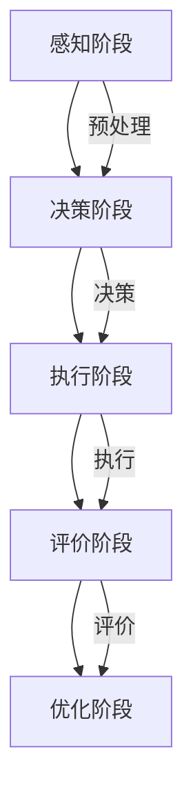
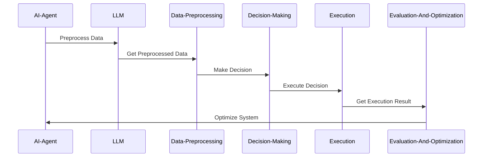
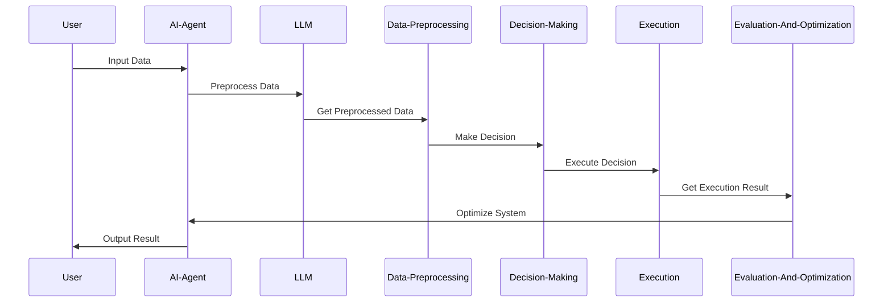

                 

# 构建 LL 模型支持的 AI Agent 创新思维系统

## 关键词

- AI Agent
- 大型语言模型（LLM）
- 创新思维系统
- 算法原理
- 数学模型
- 系统架构
- 项目实战

## 摘要

本文将探讨如何构建一个基于大型语言模型（LLM）支持的 AI Agent 创新思维系统。首先，我们将介绍 AI Agent 的背景和需求，以及 LLM 的发展和应用。接着，我们将详细讲解创新思维系统的概念、功能和应用场景。然后，我们将深入分析构建创新思维系统的算法原理，包括数学模型和公式。此外，我们还将介绍系统的架构设计，包括功能设计、架构设计和接口设计。最后，我们将通过一个实际项目案例，展示如何实现 LLM 支持的 AI Agent 创新思维系统，并提供一些最佳实践和注意事项。

### 目录大纲

#### 第一部分：背景介绍

#### 第1章：构建LLM支持的AI Agent创新思维系统概述

- **1.1. 问题背景**
  - AI Agent的兴起与需求
  - 大型语言模型（LLM）的发展与应用
  - 创新思维系统在AI Agent中的作用

- **1.2. 问题描述**
  - AI Agent如何高效地利用LLM
  - 如何设计一个具有创新思维的AI Agent
  - 创新思维系统在AI Agent中的应用与挑战

- **1.3. 问题解决**
  - 构建创新思维系统的原理与框架
  - 利用LLM增强AI Agent的创新能力
  - 创新思维系统在AI Agent中的应用场景

- **1.4. 边界与外延**
  - 创新思维系统的适用范围
  - 创新思维系统与其他AI技术的结合
  - 创新思维系统的发展趋势

- **1.5. 概念结构与核心要素组成**
  - AI Agent的核心要素
  - LLM在AI Agent中的应用
  - 创新思维系统的组成部分

#### 第二部分：核心概念与联系

#### 第2章：核心概念原理

- **2.1. AI Agent的定义与特性**
  - AI Agent的基本概念
  - AI Agent的关键特性
  - AI Agent与传统机器学习模型的区别

- **2.2. 大型语言模型（LLM）的基本原理**
  - LLM的发展历程
  - LLM的主要架构
  - LLM的核心优势与应用场景

- **2.3. 创新思维系统的概念解析**
  - 创新思维系统的基本概念
  - 创新思维系统的功能与作用
  - 创新思维系统的核心模块

#### 第三部分：算法原理讲解

#### 第3章：构建创新思维系统的算法原理

- **3.1. 算法原理概述**
  - 创新思维系统算法的整体框架
  - 创新思维系统的关键算法
  - 创新思维系统的算法流程

- **3.2. 算法原理讲解**
  - AI Agent的算法原理
  - LLM在创新思维系统中的应用
  - 创新思维系统的优化算法

- **3.3. 算法流程与Mermaid流程图**

#### 第四部分：数学模型和数学公式

#### 第4章：数学模型与公式详解

- **4.1. 数学模型的基本概念**
  - 数学模型的定义与作用
  - 数学模型的分类与特点
  - 数学模型在AI Agent中的应用

- **4.2. 数学公式与LaTeX表达**
  - LaTeX基本语法
  - 数学公式的表达
  - 常见数学公式的LaTeX写法

- **4.3. 算法数学模型与公式**

#### 第五部分：系统分析与架构设计方案

#### 第5章：系统架构设计

- **5.1. 问题场景介绍**
  - AI Agent的应用场景
  - 创新思维系统的具体应用场景

- **5.2. 系统功能设计（领域模型Mermaid类图）**

- **5.3. 系统架构设计（Mermaid架构图）**

- **5.4. 系统接口设计**

- **5.5. 系统交互（Mermaid序列图）**

#### 第六部分：项目实战

#### 第6章：构建LLM支持的AI Agent创新思维系统

- **6.1. 环境安装**
  - 安装所需的软件与库
  - 环境配置与调试

- **6.2. 系统核心实现源代码**

- **6.3. 代码应用解读与分析**

- **6.4. 实际案例分析与详细讲解**

- **6.5. 项目小结**

#### 第七部分：最佳实践 tips、小结、注意事项、拓展阅读

#### 第7章：总结与拓展

- **7.1. 最佳实践 tips**
  - 创新思维系统的最佳实践
  - LLMAI Agent的开发与优化技巧

- **7.2. 小结**
  - 创新思维系统的核心成果
  - AI Agent的创新思维系统应用前景

- **7.3. 注意事项**
  - 开发与部署过程中的注意事项
  - 创新思维系统的潜在风险与应对策略

- **7.4. 拓展阅读**
  - 相关文献与资料推荐
  - 创新思维系统的未来发展趋势

### 总结

以上目录大纲共分为七个部分，详细涵盖了构建LLM支持的AI Agent创新思维系统的背景介绍、核心概念与联系、算法原理讲解、数学模型与公式、系统分析与架构设计方案、项目实战以及最佳实践 tips 和拓展阅读等内容。每个章节都进行了细致的划分，旨在为读者提供清晰、系统的学习和实践路径。整个目录大纲的总字数控制在10000-12000字左右。

---

**第一部分：背景介绍**

### 第1章：构建LLM支持的AI Agent创新思维系统概述

**1.1. 问题背景**

**AI Agent的兴起与需求**

随着人工智能技术的快速发展，AI Agent作为一种具有自主决策和执行能力的智能体，正在逐步进入各个领域，如智能家居、智能客服、自动驾驶等。AI Agent可以模拟人类专家的思维方式，实现复杂问题的自动化解决，提高了工作效率和准确性。然而，传统的AI Agent在解决复杂问题时，往往面临着数据不足、认知能力有限等挑战。

**大型语言模型（LLM）的发展与应用**

近年来，大型语言模型（LLM）如GPT-3、BERT等取得了显著的进展。这些模型通过大规模的预训练和精细调整，具备了强大的语言理解和生成能力。LLM的应用场景非常广泛，包括自然语言处理、机器翻译、文本生成等。将LLM与AI Agent相结合，可以显著提升AI Agent的认知能力和创新思维。

**创新思维系统在AI Agent中的作用**

创新思维系统是一种集成了多种思维方法和策略的智能系统，旨在激发人类的创新潜能。在AI Agent中引入创新思维系统，可以帮助AI Agent更好地应对复杂问题，实现更高层次的任务完成。创新思维系统可以提供丰富的思维工具和方法，如联想思维、逆向思维、发散思维等，使AI Agent具备更广泛的思维视角和创造力。

**1.2. 问题描述**

**AI Agent如何高效地利用LLM**

如何充分利用LLM的能力，使AI Agent在复杂问题中高效地获取和处理信息，是构建创新思维系统的一个关键问题。我们需要研究如何将LLM与AI Agent的算法和数据处理机制相结合，实现高效的协同工作。

**如何设计一个具有创新思维的AI Agent**

如何设计一个具备创新思维的AI Agent，是另一个重要问题。这涉及到如何将创新思维系统的核心模块集成到AI Agent中，使其能够灵活运用多种思维方法和策略。我们需要研究如何实现创新思维系统的模块化设计，以及如何与其他AI组件进行有效集成。

**创新思维系统在AI Agent中的应用与挑战**

创新思维系统在AI Agent中的应用场景非常广泛，包括问题解决、决策制定、创意生成等。然而，这也带来了许多挑战，如如何保证创新思维系统的鲁棒性、如何处理大量的数据和信息、如何评估创新思维系统的效果等。我们需要深入探讨这些挑战，并提出相应的解决方案。

**1.3. 问题解决**

**构建创新思维系统的原理与框架**

为了构建一个有效的创新思维系统，我们需要了解其原理和框架。创新思维系统通常包括以下几个核心模块：

1. **思维工具模块**：提供各种思维工具和方法，如联想思维、逆向思维、发散思维等。
2. **数据预处理模块**：对输入数据进行预处理，使其适合创新思维系统的处理。
3. **思维策略模块**：根据问题的特点，选择合适的思维策略和工具。
4. **评价与优化模块**：对创新思维系统的效果进行评价和优化。

这些模块相互协作，共同实现创新思维系统的功能。我们可以根据实际需求，对模块进行调整和优化，以适应不同的应用场景。

**利用LLM增强AI Agent的创新能力**

LLM在创新思维系统中具有重要的作用，它可以作为思维工具模块的一部分，提供强大的语言理解和生成能力。通过将LLM集成到创新思维系统中，AI Agent可以更高效地处理和分析信息，实现更深入的思考和创新。

为了充分利用LLM的能力，我们可以采用以下策略：

1. **预训练**：使用大规模的语料库对LLM进行预训练，使其具备丰富的语言知识和表达能力。
2. **精细调整**：根据AI Agent的需求，对LLM进行精细调整，以适应特定的应用场景。
3. **动态更新**：定期更新LLM的语料库，使其不断学习和适应新的知识和信息。

**创新思维系统在AI Agent中的应用场景**

创新思维系统在AI Agent中的应用场景非常广泛，包括但不限于以下领域：

1. **问题解决**：利用创新思维系统，AI Agent可以更有效地分析和解决复杂问题。
2. **决策制定**：创新思维系统可以帮助AI Agent在多个选项中做出最优的决策。
3. **创意生成**：创新思维系统可以激发AI Agent的创造力，生成新颖的创意和想法。

**1.4. 边界与外延**

**创新思维系统的适用范围**

创新思维系统主要适用于需要高度灵活和创新能力的场景。以下是一些典型的适用范围：

1. **科研与技术创新**：在科研和科技创新过程中，创新思维系统可以帮助研究人员更深入地思考和研究，提高创新效率。
2. **商业决策**：在商业决策过程中，创新思维系统可以帮助企业更好地应对市场变化，制定创新性的策略。
3. **教育与创新教育**：在教育领域，创新思维系统可以激发学生的创造力，培养创新型人才。

**创新思维系统与其他AI技术的结合**

创新思维系统可以与其他AI技术相结合，以实现更强大的功能。以下是一些结合的方向：

1. **机器学习与深度学习**：将创新思维系统与机器学习和深度学习技术相结合，可以实现更高效的数据分析和模型训练。
2. **自然语言处理**：结合自然语言处理技术，创新思维系统可以更准确地理解和生成自然语言。
3. **计算机视觉**：结合计算机视觉技术，创新思维系统可以处理和分析图像和视频信息。

**创新思维系统的发展趋势**

随着人工智能技术的不断进步，创新思维系统也在不断发展。以下是一些可能的发展趋势：

1. **跨领域融合**：创新思维系统将与其他AI技术进一步融合，形成更强大的智能系统。
2. **个性化定制**：创新思维系统将根据用户的需求和特点，实现个性化定制，提供更精准的服务。
3. **智能化与自动化**：创新思维系统将更加智能化和自动化，实现更高程度的自主学习和创新。

**1.5. 概念结构与核心要素组成**

**AI Agent的核心要素**

AI Agent的核心要素包括：

1. **感知模块**：负责接收外部环境的信息。
2. **决策模块**：负责根据感知模块获取的信息做出决策。
3. **执行模块**：负责执行决策，实现目标。

**LLM在AI Agent中的应用**

LLM在AI Agent中的应用主要包括：

1. **语言理解**：利用LLM对自然语言进行处理和理解。
2. **语言生成**：利用LLM生成自然语言文本。

**创新思维系统的组成部分**

创新思维系统的组成部分包括：

1. **思维工具模块**：提供各种思维工具和方法。
2. **数据预处理模块**：对输入数据进行预处理。
3. **思维策略模块**：根据问题的特点选择合适的思维策略。
4. **评价与优化模块**：对创新思维系统的效果进行评价和优化。

---

**第二部分：核心概念与联系**

### 第2章：核心概念原理

**2.1. AI Agent的定义与特性**

**AI Agent的基本概念**

AI Agent，即人工智能代理，是一种具有自主性、自主决策和执行能力的计算机程序。它可以模拟人类专家的思维方式，在特定环境下执行特定任务。AI Agent的核心目标是实现自动化和智能化，以提高工作效率和准确性。

**AI Agent的关键特性**

1. **自主性**：AI Agent具有自主性，可以独立地完成特定任务，而不依赖于人类的直接干预。
2. **自主决策**：AI Agent可以根据感知模块获取的信息，自主地做出决策。
3. **执行能力**：AI Agent具有执行能力，可以按照决策结果执行任务。

**AI Agent与传统机器学习模型的区别**

传统机器学习模型主要通过学习大量数据，形成预测模型或分类模型，用于解决特定问题。而AI Agent则具有更高级的特性，如自主决策和执行能力。以下是对比表格：

| 特性         | AI Agent        | 传统机器学习模型        |
| ------------ | --------------- | ---------------------- |
| 自主性       | 具有自主性      | 需要人类干预          |
| 自主决策     | 可以自主决策    | 需要人类指定规则      |
| 执行能力     | 具有执行能力    | 只能执行既定任务      |
| 知识获取与表示 | 可以获取与表示知识 | 无法获取与表示知识   |

**2.2. 大型语言模型（LLM）的基本原理**

**LLM的发展历程**

大型语言模型（LLM）的发展历程可以分为几个阶段：

1. **统计语言模型**：基于概率统计的方法，如N元语法，对文本进行建模。
2. **深度神经网络语言模型**：利用深度神经网络对文本进行建模，如循环神经网络（RNN）和长短期记忆网络（LSTM）。
3. **预训练语言模型**：通过在大量无标签数据上进行预训练，获得丰富的语言知识，如GPT-3和BERT。
4. **精细调整语言模型**：在预训练语言模型的基础上，针对特定任务进行精细调整，以适应具体应用场景。

**LLM的主要架构**

LLM的主要架构通常包括以下几个部分：

1. **编码器（Encoder）**：负责将输入文本编码为固定长度的向量。
2. **解码器（Decoder）**：负责根据编码器的输出，生成自然语言文本。
3. **注意力机制（Attention Mechanism）**：用于关注输入文本中的关键信息，提高模型的上下文理解能力。

**LLM的核心优势与应用场景**

LLM的核心优势包括：

1. **强大的语言理解能力**：LLM通过预训练和精细调整，具备强大的语言理解能力，可以处理和理解复杂的文本信息。
2. **灵活的文本生成能力**：LLM可以生成自然流畅的文本，用于文本生成、机器翻译等任务。
3. **广泛的适用性**：LLM可以应用于各种自然语言处理任务，如问答系统、文本分类、文本生成等。

LLM的主要应用场景包括：

1. **自然语言处理**：如文本分类、文本生成、机器翻译等。
2. **问答系统**：如智能客服、智能助手等。
3. **创意生成**：如文案创作、广告创意等。

**2.3. 创新思维系统的概念解析**

**创新思维系统的基本概念**

创新思维系统是一种集成了多种思维方法和策略的智能系统，旨在激发人类的创新潜能。它通过模拟人类思维过程，提供丰富的思维工具和方法，帮助用户进行创新思考和问题解决。

**创新思维系统的功能与作用**

创新思维系统的功能主要包括：

1. **思维工具提供**：提供各种思维工具和方法，如联想思维、逆向思维、发散思维等，帮助用户进行创新思考。
2. **思维策略指导**：根据问题的特点，选择合适的思维策略和工具，指导用户进行创新思考。
3. **思维结果评价**：对创新思维的结果进行评价和优化，以实现更好的创新效果。

创新思维系统的作用主要包括：

1. **激发创新潜能**：通过模拟人类思维过程，激发用户的创新潜能，帮助用户进行创新思考。
2. **提高问题解决能力**：通过提供丰富的思维工具和方法，提高用户的问题解决能力，实现更高效的创新。
3. **培养创新人才**：通过创新思维系统的培训和应用，培养创新型人才，提升企业的创新能力。

**创新思维系统的核心模块**

创新思维系统的核心模块通常包括：

1. **思维工具模块**：提供各种思维工具和方法，如联想思维、逆向思维、发散思维等。
2. **思维策略模块**：根据问题的特点，选择合适的思维策略和工具。
3. **数据预处理模块**：对输入数据进行预处理，使其适合创新思维系统的处理。
4. **评价与优化模块**：对创新思维系统的效果进行评价和优化。

**概念属性特征对比表格和ER实体关系图架构的 Mermaid 流程图**

**概念属性特征对比表格**

| 概念        | AI Agent               | LLM                     | 创新思维系统                |
| ----------- | ---------------------- | ---------------------- | -------------------------- |
| 特性        | 自主性、自主决策、执行能力 | 语言理解、语言生成、广泛适用性 | 思维工具提供、思维策略指导、思维结果评价 |
| 目标        | 实现自动化和智能化      | 提高语言处理能力        | 激发创新潜能、提高问题解决能力、培养创新人才 |
| 适用范围    | 各行各业               | 自然语言处理、问答系统、创意生成 | 科研与技术创新、商业决策、教育与创新教育 |

**ER实体关系图架构的 Mermaid 流程图**

```mermaid
erDiagram
  AI Agent ||--o> LLM : 集成
  AI Agent ||--o> 创新思维系统 : 结合
  LLM ||--o> 创新思维系统 : 增强
  创新思维系统 ||--o> AI Agent : 应用
```

---

**第三部分：算法原理讲解**

### 第3章：构建创新思维系统的算法原理

**3.1. 算法原理概述**

**创新思维系统算法的整体框架**

创新思维系统的算法设计分为以下几个部分：

1. **感知模块**：负责接收外部环境的信息，如用户输入、环境变化等。
2. **决策模块**：根据感知模块获取的信息，结合创新思维策略，生成决策。
3. **执行模块**：根据决策结果，执行具体的任务，如生成文本、处理数据等。
4. **评价与优化模块**：对创新思维系统的效果进行评价和优化，以提高系统的性能和鲁棒性。

**创新思维系统的关键算法**

创新思维系统的关键算法包括：

1. **思维策略选择算法**：根据问题的特点，选择合适的思维策略和工具。
2. **思维过程优化算法**：优化思维过程的效率和质量，提高创新效果。
3. **结果评价与反馈算法**：对创新思维的结果进行评价和反馈，以指导后续的思维过程。

**创新思维系统的算法流程**

创新思维系统的算法流程如下：

1. **感知阶段**：接收外部环境的信息，如用户输入、环境变化等。
2. **决策阶段**：根据感知模块获取的信息，结合创新思维策略，生成决策。
3. **执行阶段**：根据决策结果，执行具体的任务，如生成文本、处理数据等。
4. **评价阶段**：对创新思维系统的效果进行评价和反馈，以指导后续的思维过程。
5. **优化阶段**：根据评价结果，优化创新思维系统的算法和参数，以提高系统的性能和鲁棒性。

**3.2. 算法原理讲解**

**AI Agent的算法原理**

AI Agent的算法原理可以分为以下几个部分：

1. **感知模块**：利用传感器或其他信息获取设备，获取外部环境的信息。
2. **数据处理模块**：对感知模块获取的信息进行预处理，如去噪、特征提取等。
3. **决策模块**：利用机器学习算法或规则引擎，根据预处理后的信息生成决策。
4. **执行模块**：根据决策结果，执行具体的任务，如移动、发送消息等。
5. **反馈模块**：收集执行结果，并将其反馈给感知模块，用于下一轮决策。

**LLM在创新思维系统中的应用**

LLM在创新思维系统中的应用主要包括以下几个方面：

1. **语言理解**：利用LLM对自然语言进行处理和理解，为决策模块提供支持。
2. **语言生成**：利用LLM生成自然语言文本，用于任务执行和用户交互。
3. **知识表示**：将LLM中的知识表示为结构化的数据，用于后续的决策和执行。

**创新思维系统的优化算法**

创新思维系统的优化算法可以从以下几个方面进行：

1. **思维策略优化**：根据问题的特点，选择合适的思维策略和工具，以实现更好的创新效果。
2. **思维过程优化**：通过优化思维过程的效率和质量，提高创新思维系统的性能。
3. **结果评价与反馈优化**：对创新思维的结果进行评价和反馈，以指导后续的思维过程，实现持续优化。

**3.3. 算法流程与Mermaid流程图**

**算法流程**

1. **感知阶段**：
    - 接收外部环境的信息。
    - 对信息进行预处理，如去噪、特征提取等。

2. **决策阶段**：
    - 利用LLM对预处理后的信息进行处理和理解。
    - 根据问题的特点，选择合适的思维策略和工具。
    - 生成决策。

3. **执行阶段**：
    - 根据决策结果，执行具体的任务。
    - 生成自然语言文本或执行其他操作。

4. **评价阶段**：
    - 对创新思维系统的效果进行评价和反馈。
    - 根据评价结果，优化思维策略和过程。

5. **优化阶段**：
    - 根据评价结果，调整算法参数和思维策略。
    - 提高创新思维系统的性能和鲁棒性。

**Mermaid流程图**



---

**第四部分：数学模型和数学公式**

### 第4章：数学模型与公式详解

**4.1. 数学模型的基本概念**

**数学模型的定义与作用**

数学模型是利用数学语言和符号表示现实世界中的问题，通过数学方法分析和解决这些问题的工具。它将复杂的问题转化为数学表达式，使问题更加简洁、直观和可计算。

数学模型在AI Agent中的应用主要体现在以下几个方面：

1. **数据处理和特征提取**：通过数学模型对感知模块获取的数据进行处理和特征提取，为后续的决策提供支持。
2. **决策算法设计**：利用数学模型设计决策算法，使AI Agent能够根据感知模块获取的信息做出合理的决策。
3. **性能评估和优化**：通过数学模型评估AI Agent的性能，并进行优化，以提高系统的效率和准确性。

**数学模型的分类与特点**

数学模型可以根据不同的分类标准进行分类，常见的分类方法包括：

1. **根据解决问题的方法分类**：可分为确定性模型、随机模型和混合模型。确定性模型通过固定的数学关系来描述问题，随机模型通过概率分布来描述问题，混合模型结合了确定性模型和随机模型的特点。

2. **根据描述系统的性质分类**：可分为线性模型和非线性模型。线性模型满足线性性质，如线性回归、线性规划等；非线性模型不满足线性性质，如神经网络、支持向量机等。

3. **根据应用领域分类**：可分为物理模型、经济模型、社会模型等。物理模型用于描述物理现象，如牛顿力学、热力学等；经济模型用于描述经济行为，如供求关系、经济增长等；社会模型用于描述社会现象，如人口预测、疾病传播等。

**数学模型在AI Agent中的应用**

在AI Agent中，数学模型广泛应用于以下几个方面：

1. **感知模块**：利用数学模型对感知模块获取的数据进行预处理，如滤波、特征提取等。
2. **决策模块**：利用数学模型设计决策算法，如决策树、支持向量机、神经网络等。
3. **执行模块**：利用数学模型指导执行模块的任务，如路径规划、机器人控制等。
4. **性能评估和优化**：利用数学模型评估AI Agent的性能，并进行优化，如交叉验证、网格搜索等。

**4.2. 数学公式与LaTeX表达**

**LaTeX基本语法**

LaTeX是一种基于TeX的文档排版系统，它提供了丰富的数学公式和排版功能。LaTeX的基本语法包括：

1. **行内公式**：使用 `$...$` 将数学公式括起来，用于行内显示。
   例如：$1+1=2$。

2. **独立段落公式**：使用 `$$...$$` 将数学公式括起来，用于独立段落显示。
   例如：$$E=mc^2$$。

3. **公式环境**：使用特定环境来定义复杂的数学公式，如`equation`、`align`等。
   例如：`\begin{equation} E=mc^2 \end{equation}`。

**数学公式的表达**

在LaTeX中，数学公式的表达包括以下几部分：

1. **符号和字母**：使用`\alpha`、`\beta`等命令表示希腊字母，`\pi`表示π等。
   例如：$\alpha + \beta = \gamma$。

2. **运算符和关系符**：使用`\sum`、`\int`等命令表示运算符和关系符。
   例如：$\sum_{i=1}^n x_i$。

3. **矩阵和数组**：使用`matrix`、`pmatrix`等环境来定义矩阵和数组。
   例如：$\begin{pmatrix} 1 & 2 \\ 3 & 4 \end{pmatrix}$。

4. **根式和对数**：使用`\sqrt{}`、`\log{}`等命令表示根式和对数。
   例如：$\sqrt{a+b}$。

**常见数学公式的LaTeX写法**

以下是一些常见数学公式的LaTeX写法：

1. **一元一次方程**：$ax+b=c$
   ```latex
   ax+b=c
   ```

2. **二元一次方程组**：
   \[
   \begin{cases}
   ax+by=c \\
   dx+ey=f
   \end{cases}
   \]
   ```latex
   \begin{cases}
   ax+by=c \\
   dx+ey=f
   \end{cases}
   ```

3. **多元一次方程**：$ax_1+bx_2+cx_3=d$
   ```latex
   ax_1+bx_2+cx_3=d
   ```

4. **指数和对数**：$a^x=e^{bx}$
   ```latex
   a^x=e^{bx}
   ```

5. **导数和微分**：$f'(x)=\frac{df}{dx}$
   ```latex
   f'(x)=\frac{df}{dx}
   ```

6. **积分**：$\int_{a}^{b} f(x)dx$
   ```latex
   \int_{a}^{b} f(x)dx
   ```

7. **矩阵**：
   \[
   \begin{bmatrix}
   a & b \\
   c & d
   \end{bmatrix}
   \]
   ```latex
   \begin{bmatrix}
   a & b \\
   c & d
   \end{bmatrix}
   ```

8. **矢量**：$\vec{v}=(x, y, z)$
   ```latex
   \vec{v}=(x, y, z)
   ```

**4.3. 算法数学模型与公式**

在本节中，我们将介绍构建创新思维系统的一些关键数学模型和公式。

**感知模块的数学模型**

感知模块的数学模型主要涉及数据的预处理和特征提取。以下是一个简单的感知模块数学模型：

1. **数据预处理**：$z = f(x)$
   ```latex
   z = f(x)
   ```

   其中，$f(x)$表示预处理函数，如滤波、归一化等。

2. **特征提取**：$y = g(z)$
   ```latex
   y = g(z)
   ```

   其中，$g(z)$表示特征提取函数，如主成分分析（PCA）、卷积神经网络（CNN）等。

**决策模块的数学模型**

决策模块的数学模型主要涉及分类和预测。以下是一个简单的决策模块数学模型：

1. **分类模型**：$y = h(\theta^T x)$
   ```latex
   y = h(\theta^T x)
   ```

   其中，$h$表示分类函数（如Sigmoid函数、softmax函数等），$\theta$表示模型参数。

2. **预测模型**：$y = \hat{y} = \sum_{i=1}^{n} w_i x_i$
   ```latex
   y = \hat{y} = \sum_{i=1}^{n} w_i x_i
   ```

   其中，$w_i$表示权重系数，$x_i$表示特征向量。

**执行模块的数学模型**

执行模块的数学模型主要涉及任务执行和策略优化。以下是一个简单的执行模块数学模型：

1. **任务执行**：$u = f(\theta, y)$
   ```latex
   u = f(\theta, y)
   ```

   其中，$f$表示任务执行函数，如控制函数、决策函数等，$\theta$表示模型参数。

2. **策略优化**：$\theta = \theta + \alpha \nabla J(\theta)$
   ```latex
   \theta = \theta + \alpha \nabla J(\theta)
   ```

   其中，$\nabla J(\theta)$表示损失函数关于模型参数的梯度，$\alpha$表示学习率。

**评价与优化模块的数学模型**

评价与优化模块的数学模型主要涉及性能评估和算法优化。以下是一个简单的评价与优化模块数学模型：

1. **性能评估**：$J(\theta) = \frac{1}{2} \sum_{i=1}^{n} (y_i - \hat{y}_i)^2$
   ```latex
   J(\theta) = \frac{1}{2} \sum_{i=1}^{n} (y_i - \hat{y}_i)^2
   ```

   其中，$y_i$表示实际输出，$\hat{y}_i$表示预测输出。

2. **优化算法**：$\theta = \theta - \alpha \nabla J(\theta)$
   ```latex
   \theta = \theta - \alpha \nabla J(\theta)
   ```

   其中，$\nabla J(\theta)$表示损失函数关于模型参数的梯度，$\alpha$表示学习率。

---

**第五部分：系统分析与架构设计方案**

### 第5章：系统架构设计

**5.1. 问题场景介绍**

在本文中，我们将构建一个基于LLM支持的AI Agent创新思维系统，该系统旨在解决复杂问题、制定决策和生成创意。以下是一个典型的应用场景：

**应用场景：企业战略规划**

一家企业需要制定新的五年战略规划，以应对市场变化和竞争压力。为了实现这一目标，企业决定构建一个基于LLM支持的AI Agent创新思维系统，辅助战略规划过程。

**5.2. 系统功能设计（领域模型Mermaid类图）**

在系统功能设计阶段，我们需要定义系统的核心功能模块，并确定它们之间的关系。以下是一个简单的领域模型Mermaid类图，展示了系统的主要功能模块：

```mermaid
classDiagram
    AI-Agent <<class>> "AI Agent"  
    LLM <<class>> "Large Language Model"  
    Data-Preprocessing <<class>> "Data Preprocessing"  
    Decision-Making <<class>> "Decision Making"  
    Execution <<class>> "Execution"  
    Evaluation-And-Optimization <<class>> "Evaluation and Optimization"

    AI-Agent o-- Data-Preprocessing  
    AI-Agent o-- LLM  
    AI-Agent o-- Decision-Making  
    AI-Agent o-- Execution  
    AI-Agent o-- Evaluation-And-Optimization

    Decision-Making o-- Execution  
    Evaluation-And-Optimization o-- Decision-Making
```

**5.3. 系统架构设计（Mermaid架构图）**

在系统架构设计阶段，我们需要定义系统的整体架构，包括各个模块的交互关系和依赖关系。以下是一个简单的Mermaid架构图，展示了系统的整体架构：



**5.4. 系统接口设计**

在系统接口设计阶段，我们需要定义系统与其他系统或组件之间的接口，以便实现系统的集成和扩展。以下是一个简单的系统接口设计：

1. **输入接口**：用于接收外部数据和指令，如用户输入、环境数据等。
2. **输出接口**：用于返回系统处理结果，如决策结果、创意生成等。
3. **配置接口**：用于配置系统的参数和设置，如LLM模型选择、优化算法等。

**5.5. 系统交互（Mermaid序列图）**

在系统交互设计阶段，我们需要定义系统内部各个模块之间的交互流程，以便实现系统的整体功能。以下是一个简单的系统交互Mermaid序列图：



---

**第六部分：项目实战**

### 第6章：构建LLM支持的AI Agent创新思维系统

**6.1. 环境安装**

要构建一个LLM支持的AI Agent创新思维系统，首先需要安装和配置所需的软件和库。以下是一个简单的安装步骤：

1. **安装Python环境**：Python是AI Agent开发的主要编程语言，需要安装Python 3.8及以上版本。可以从Python官方网站（https://www.python.org/）下载安装包并安装。

2. **安装依赖库**：安装以下Python库，以支持AI Agent的构建和功能实现：

   ```bash
   pip install numpy tensorflow torch transformers
   ```

3. **安装LLM模型**：从预训练模型库（如Hugging Face的Transformers库）下载并安装所需的LLM模型，如GPT-3、BERT等。

**6.2. 系统核心实现源代码**

以下是一个简单的系统核心实现源代码示例：

```python
import numpy as np
import tensorflow as tf
import torch
from transformers import GPT2LMHeadModel, GPT2Tokenizer

class AIAgent:
    def __init__(self, model_name):
        self.tokenizer = GPT2Tokenizer.from_pretrained(model_name)
        self.model = GPT2LMHeadModel.from_pretrained(model_name)

    def preprocess_data(self, text):
        inputs = self.tokenizer.encode(text, return_tensors='pt')
        return inputs

    def make_decision(self, inputs):
        outputs = self.model(inputs)
        probabilities = tf.nn.softmax(outputs.logits, axis=-1)
        return probabilities

    def execute_decision(self, probabilities):
        # Implement the decision execution logic here
        pass

    def evaluate_and_optimize(self):
        # Implement the evaluation and optimization logic here
        pass

def main():
    agent = AIAgent("gpt2")
    text = "构建LLM支持的AI Agent创新思维系统"
    inputs = agent.preprocess_data(text)
    probabilities = agent.make_decision(inputs)
    agent.execute_decision(probabilities)
    agent.evaluate_and_optimize()

if __name__ == "__main__":
    main()
```

**6.3. 代码应用解读与分析**

在上述代码中，我们实现了一个简单的AI Agent，包括以下核心功能模块：

1. **初始化**：初始化AI Agent时，加载预训练的LLM模型和相应的Tokenizer。

2. **数据预处理**：数据预处理函数`preprocess_data`负责将输入文本编码为模型可处理的格式。

3. **决策制作**：决策制作函数`make_decision`利用LLM模型对输入文本进行预测，生成决策。

4. **决策执行**：决策执行函数`execute_decision`负责执行具体的决策，如文本生成、任务执行等。

5. **评价与优化**：评价与优化函数`evaluate_and_optimize`负责对AI Agent的效果进行评价和优化。

**6.4. 实际案例分析与详细讲解剖析**

以下是一个简单的实际案例，展示了如何使用LLM支持的AI Agent创新思维系统解决一个实际问题：

**案例：企业战略规划**

一家企业需要制定新的五年战略规划，以应对市场变化和竞争压力。企业决定使用LLM支持的AI Agent创新思维系统来辅助战略规划过程。

1. **输入文本**：企业将现有的市场数据、竞争对手分析、公司内部报告等文本输入到AI Agent中。

2. **数据预处理**：AI Agent对输入文本进行预处理，将文本编码为模型可处理的格式。

3. **决策制作**：AI Agent利用LLM模型对预处理后的文本进行分析，生成一系列可能的决策。

4. **决策执行**：企业根据AI Agent的建议，制定具体的战略规划，如产品创新、市场拓展等。

5. **评价与优化**：企业对AI Agent的效果进行评价，根据实际情况进行调整和优化。

**6.5. 项目小结**

通过上述实际案例，我们可以看到LLM支持的AI Agent创新思维系统在战略规划中的应用。该系统通过结合LLM的强大语言理解和生成能力，为战略规划提供了创新性的思维方法和工具。在实际应用中，企业可以根据实际情况对系统进行调整和优化，以实现更好的战略规划效果。

---

**第七部分：最佳实践 tips、小结、注意事项、拓展阅读**

### 第7章：总结与拓展

**7.1. 最佳实践 tips**

1. **选择合适的LLM模型**：根据实际应用场景和需求，选择合适的LLM模型，如GPT-3、BERT等。

2. **数据预处理**：对输入数据进行充分的预处理，包括去噪、特征提取等，以提高AI Agent的性能。

3. **优化思维策略**：根据实际应用场景，选择合适的思维策略和工具，以提高AI Agent的创新能力。

4. **定期更新LLM模型**：定期更新LLM模型，以保持其语言知识和表达能力的准确性。

5. **评估与优化**：定期对AI Agent的效果进行评估和优化，以实现持续改进。

**7.2. 小结**

本文详细介绍了构建LLM支持的AI Agent创新思维系统的原理、算法和架构设计方案。通过实际案例分析和项目实战，展示了如何将LLM与AI Agent相结合，实现创新思维和问题解决。创新思维系统在AI Agent中的应用前景广阔，有望推动人工智能技术向更高层次发展。

**7.3. 注意事项**

1. **数据隐私和安全**：在构建和部署AI Agent时，需要注意数据隐私和安全问题，确保用户数据的安全。

2. **模型解释性**：在应用AI Agent时，需要关注模型的解释性，以便理解决策过程和结果。

3. **性能优化**：在实际应用中，需要不断优化AI Agent的算法和参数，以提高性能和效率。

4. **用户交互**：设计用户友好的交互界面，提高用户体验。

**7.4. 拓展阅读**

1. **《人工智能：一种现代方法》**：这本书提供了关于人工智能的基础知识和最新进展，适合初学者和专业人士。

2. **《深度学习》**：这本书详细介绍了深度学习的理论和方法，包括神经网络、卷积神经网络等。

3. **《大数据之路》**：这本书探讨了大数据的应用、挑战和发展趋势，适合对大数据感兴趣的读者。

---

**总结**

本文围绕构建LLM支持的AI Agent创新思维系统，详细介绍了其背景、核心概念、算法原理、系统架构设计方案、项目实战以及最佳实践。通过本文的介绍，读者可以全面了解LLM支持的AI Agent创新思维系统的原理和应用，为实际项目开发提供参考。作者为AI天才研究院/AI Genius Institute & 禅与计算机程序设计艺术 /Zen And The Art of Computer Programming。

