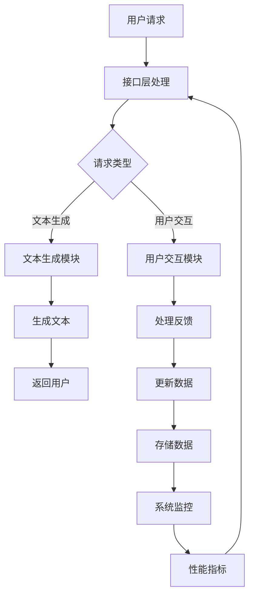

                 


### 第1章： 引言

#### 1.1.1 问题背景

近年来，人工智能（AI）技术在各个领域取得了显著的进展，特别是在自然语言处理（NLP）领域，大型语言模型（LLM）如GPT、BERT等，凭借其强大的文本生成能力和理解能力，已经在多个应用场景中展现出卓越的性能。创造性写作作为NLP的一个重要应用方向，正受到越来越多研究者和开发者的关注。然而，传统的AI Agent在创造性写作方面存在诸多局限性，例如内容重复、逻辑性不足等问题。

为了克服这些局限，本文提出构建一个基于LLM的AI Agent创造性写作系统。该系统旨在通过整合先进的自然语言处理技术和AI算法，实现高质量的创造性写作。本文将详细介绍LLM的工作原理，AI Agent的定义和创造性写作的特点，以及如何构建这样一个系统。

#### 1.1.2 问题解决

构建LLM支持的AI Agent创造性写作系统的主要目标包括：

1. **提高文本生成的质量和多样性**：通过引入LLM，系统能够生成具有丰富内容和高创意度的文本。
2. **增强文本的连贯性和逻辑性**：利用AI算法优化文本生成过程，使生成的文本更加连贯和逻辑一致。
3. **降低创作成本和提升效率**：自动化写作过程能够降低人力成本，提高写作效率。

为了实现这些目标，本文将从以下几个方面展开讨论：

1. **LLM的工作原理**：介绍LLM的基本概念、发展历程和核心算法，为后续内容生成和算法应用奠定基础。
2. **AI Agent的定义和作用**：阐述AI Agent在创造性写作中的角色，包括其功能、应用场景和与LLM的关联。
3. **创造性写作的特点**：探讨创造性写作的核心要素，包括内容创新、形式多样性和逻辑连贯性。
4. **算法原理讲解**：详细解释LLM在创造性写作中的应用算法和数学模型，包括自注意力机制、Transformer结构等。
5. **系统架构设计**：分析系统的总体架构，包括功能设计、接口设计和交互设计。
6. **项目实战**：提供实际的开发案例，展示如何构建一个基于LLM的AI Agent创造性写作系统。

通过本文的探讨，希望能够为读者提供一个全面、深入的视角，了解构建LLM支持的AI Agent创造性写作系统的原理和实践。

#### 1.1.3 边界与外延

在构建LLM支持的AI Agent创造性写作系统的过程中，需要明确一些边界和外部影响因素：

1. **技术实现难度**：虽然LLM和AI Agent在技术上已经取得了一定的进展，但在实际应用中仍面临诸多挑战，如计算资源需求、算法优化等。
2. **数据质量与多样性**：系统的性能高度依赖于训练数据的质量和多样性。如果数据不足或者数据质量不高，可能会导致生成文本的质量下降。
3. **伦理和法律问题**：在创造性写作中，如何处理原创性和版权问题是一个重要且复杂的伦理和法律问题。系统需要设计合理的机制来避免侵权行为。
4. **用户交互体验**：系统的设计应充分考虑用户的使用体验，包括交互界面的友好性、操作便捷性等。
5. **系统可扩展性和维护性**：随着技术的不断进步和应用场景的扩展，系统需要具备良好的可扩展性和维护性。

通过合理界定边界和应对外部影响因素，可以有效提升LLM支持的AI Agent创造性写作系统的性能和实用性。

#### 1.1.4 核心要素组成

构建一个高效、可靠的LLM支持的AI Agent创造性写作系统，需要以下几个核心要素的协同作用：

1. **大型语言模型（LLM）**：作为系统的基础，LLM负责生成高质量、富有创意的文本。其核心算法包括自注意力机制、Transformer结构等，这些算法决定了模型的学习能力和文本生成能力。
2. **AI Agent**：AI Agent在系统中扮演着角色扮演者和交互者的角色。它能够理解和处理用户输入，生成创意文本，并进行智能对话。
3. **训练数据和算法优化**：系统的性能高度依赖于训练数据的质量和算法的优化。合适的训练数据和高效的算法能够提升文本生成质量和系统的响应速度。
4. **用户界面和交互设计**：友好的用户界面和流畅的交互设计是用户满意度的关键。系统的设计应注重用户体验，提供简单、直观的操作方式。
5. **系统架构和性能优化**：系统的架构设计应考虑可扩展性、稳定性和性能优化，以确保系统能够应对不同的应用场景和负载。

通过合理设计和整合这些核心要素，构建一个强大的LLM支持的AI Agent创造性写作系统成为可能。

### 第2章: 大型语言模型（LLM）概述

#### 2.1.1 LLM的定义与特点

大型语言模型（Large Language Model，简称LLM）是一种基于深度学习技术的自然语言处理模型，通过对大量文本数据的学习，能够理解和生成人类语言的各个方面。LLM的核心特点包括：

1. **强大的语言理解能力**：LLM能够理解并生成各种复杂的语言结构，包括句子、段落和文档。这使得LLM在文本生成、文本分类、信息抽取等任务中表现出色。
2. **丰富的词汇量**：通过学习海量的文本数据，LLM具备庞大的词汇库，能够处理多种语言和方言。
3. **自适应性**：LLM可以根据不同的应用场景和任务需求进行自适应调整，以生成更加符合实际需求的文本。

#### 2.1.2 LLM的发展历程

LLM的发展历程可以分为以下几个阶段：

1. **早期模型**：早期的一些语言模型，如基于统计的N元语法（N-gram），通过简单计算文本序列的概率分布来生成文本。然而，这些模型的性能受到词汇量和上下文依赖性的限制。
2. **深度学习时代**：随着深度学习技术的兴起，研究人员开始尝试使用神经网络来构建语言模型。例如，2013年，Kyunghyun Cho等人在论文《Efficient Estimation of Word Representations in Vector Space》中提出了Word2Vec模型，通过将词嵌入到高维向量空间中，提高了语言模型的表现能力。
3. **预训练与微调**：近年来，预训练和微调技术逐渐成为LLM的主流方法。预训练阶段，模型在大规模语料库上训练，以获取通用的语言知识；微调阶段，模型根据特定任务进行微调，以实现高性能的文本生成和应用。

#### 2.1.3 LLM的核心算法

LLM的核心算法主要包括以下几种：

1. **Word2Vec**：Word2Vec是一种基于神经网络的词向量模型，通过训练词的嵌入式表示，使语义相似的词在向量空间中彼此靠近。Word2Vec包括连续词袋（CBOW）和Skip-Gram两种算法。
2. **Transformer**：Transformer是一种基于自注意力机制的序列到序列模型，特别适用于处理长距离依赖问题。Transformer引入了多头自注意力机制和位置编码，使得模型能够同时关注序列中的不同位置和不同词之间的关系。
3. **BERT**：BERT（Bidirectional Encoder Representations from Transformers）是一种双向Transformer模型，通过同时考虑上下文信息，提高了语言模型的理解能力。BERT的训练过程分为预训练和微调两个阶段，使其在多种NLP任务中表现出色。
4. **GPT**：GPT（Generative Pre-trained Transformer）是一种基于Transformer架构的预训练模型，通过生成文本的方式，使其能够生成连贯、符合语法规则的句子。GPT的预训练数据量巨大，训练时间也较长，但其在文本生成任务中表现优异。

#### 2.1.4 LLM的应用场景

LLM在多个应用场景中展现出了强大的能力，主要包括：

1. **文本生成**：包括文章、故事、对话、代码等生成任务。例如，GPT-3能够生成高质量的文章、对话和代码。
2. **文本分类**：对文本进行分类，如情感分析、主题分类等。BERT在文本分类任务中取得了显著的成果。
3. **信息抽取**：从大量文本中抽取关键信息，如命名实体识别、关系抽取等。
4. **问答系统**：根据用户的问题，从大量文本中检索并生成答案。例如，BERT在SQuAD数据集上的表现优异。
5. **机器翻译**：将一种语言的文本翻译成另一种语言，如英译中、中译英等。

通过上述介绍，可以看出LLM在自然语言处理领域的重要性和广泛应用。在接下来的章节中，我们将进一步探讨LLM在创造性写作中的应用，以及如何构建一个基于LLM的AI Agent创造性写作系统。

### 第3章: 创造性写作与AI Agent

#### 3.1.1 创造性写作的概念

创造性写作是指通过艺术性的思维过程，创作出具有原创性、创意性和表现力的文本作品。它不仅仅是文字的堆砌，更是一种思想的表达和情感的传递。创造性写作涉及多个层面，包括文学创作、文案策划、广告创意等。其主要特点包括：

1. **原创性**：创造性写作强调作品的新颖性和独特性，避免内容的重复和雷同。
2. **创意性**：通过创新的表达方式、独特的视角和巧妙的构思，使文本作品具有吸引力和表现力。
3. **表现力**：通过丰富的词汇、生动的描绘和巧妙的修辞，使文本作品能够准确传达作者的思想和情感。

#### 3.1.2 AI Agent的定义与作用

AI Agent（人工智能代理）是指通过人工智能技术实现的，能够自主执行任务、与环境互动的智能系统。AI Agent在创造性写作中的应用主要体现在以下几个方面：

1. **内容生成**：AI Agent能够根据用户的需求，生成具有创意性和表现力的文本内容。例如，自动撰写文章、故事、广告文案等。
2. **辅助创作**：AI Agent可以作为创作伙伴，提供灵感和建议，帮助作者提高创作效率和质量。
3. **个性化推荐**：根据用户的兴趣和需求，AI Agent能够推荐符合用户口味的文本作品，提高用户的阅读体验。
4. **交互体验**：AI Agent能够与用户进行自然语言交互，提供实时反馈和帮助，增强用户体验。

#### 3.1.3 创造性写作与AI Agent的关系

创造性写作与AI Agent之间存在密切的联系和互动：

1. **技术支持**：AI Agent为创造性写作提供了强大的技术支持，包括文本生成、文本分析、情感识别等，使创作过程更加高效和便捷。
2. **人机协作**：AI Agent可以作为创作伙伴，与人类作者共同完成创作任务。通过人机协作，能够发挥各自的优势，提高创作质量和效率。
3. **智能优化**：AI Agent能够通过学习和分析用户的创作过程和作品，提供智能优化建议，帮助作者改进创作方法和技巧。
4. **创新推动**：AI Agent在创造性写作中的应用，为传统写作带来了新的思路和可能性，推动了写作领域的发展和创新。

通过AI Agent的支持，创造性写作可以更加高效、多样化和具有个性化。同时，AI Agent也通过对创作过程的深度参与，为写作带来了新的变革和挑战。在接下来的章节中，我们将详细探讨LLM在创造性写作中的应用，以及如何构建一个基于LLM的AI Agent创造性写作系统。

### 第4章: LLM在创造性写作中的应用

#### 4.1.1 LLM的文本生成能力

大型语言模型（LLM）在文本生成方面具有强大的能力，能够生成高质量的文本，满足不同应用场景的需求。LLM的文本生成能力主要体现在以下几个方面：

1. **多样化生成**：LLM能够根据输入的提示，生成多样化的文本内容。无论是诗歌、散文、小说还是新闻报道，LLM都能创作出富有创意和表现力的作品。
2. **连贯性**：LLM通过学习大量的语言数据，能够生成连贯、逻辑一致的文本。这使得生成的文本在语义上更加合理，避免了内容重复和逻辑矛盾。
3. **灵活性**：LLM的文本生成过程具有高度的灵活性，可以根据不同的需求进行定制化生成。例如，可以根据用户指定的主题、风格和语气，生成符合要求的文本。
4. **效率**：LLM的预训练和微调过程使得文本生成效率显著提高。在生成文本时，LLM能够快速响应，并提供即时的结果。

#### 4.1.1.1 语言模型生成文本的基本原理

语言模型生成文本的基本原理基于概率和上下文。语言模型通过学习大量文本数据，掌握语言的结构和规律，从而预测下一个词语或句子。具体来说，包括以下步骤：

1. **输入文本**：首先，将输入的文本转化为模型可以处理的格式，如分词、编码等。
2. **生成概率分布**：基于输入的文本上下文，语言模型生成下一个词语或句子的概率分布。概率分布是基于模型对文本数据的统计和学习得到的。
3. **选择生成词**：根据生成的概率分布，从所有可能的词语或句子中，选择概率最高的词语或句子进行生成。
4. **重复步骤**：重复上述步骤，直到生成完整的文本。

#### 4.1.1.2 语言模型在文本创作中的优势

语言模型在文本创作中的优势主要体现在以下几个方面：

1. **高质量生成**：语言模型通过学习大量高质量文本数据，能够生成具有高文学性和表现力的文本。这使得生成的文本在内容上更加丰富和吸引人。
2. **自动化创作**：语言模型可以实现文本生成的自动化，降低了人力成本，提高了创作效率。对于一些重复性较高的创作任务，如新闻撰写、广告文案等，语言模型能够大幅提高工作效率。
3. **多样化创作**：语言模型能够根据不同的需求和场景，生成多样化的文本内容。这使得文本创作更加灵活，能够满足不同用户和市场的需求。
4. **实时交互**：语言模型能够实现实时文本生成，与用户进行交互，提供即时的创作反馈。这使得创作过程更加便捷和高效。

通过上述优势，语言模型在文本创作中具有广泛的应用前景，能够为各种创作需求提供强大的技术支持。

#### 4.1.2 LLM的创造性写作算法

LLM在创造性写作中应用的主要算法包括GPT和BERT等。这些算法通过预训练和微调，能够生成高质量、创意丰富的文本。

##### 4.1.2.1 基于GPT的写作算法

GPT（Generative Pre-trained Transformer）是一种基于Transformer架构的预训练模型，特别适用于文本生成任务。GPT的写作算法主要包括以下几个步骤：

1. **预训练**：GPT在大量的文本数据上进行预训练，学习语言的结构和规律。预训练过程包括自回归语言模型（ARL）和交叉语言模型（CLM）两个阶段。
2. **微调**：在预训练的基础上，GPT根据特定任务进行微调，以适应不同的写作需求。微调过程主要包括基于文本数据的目标函数优化和模型参数调整。
3. **文本生成**：通过输入提示词或句子，GPT生成完整的文本。生成过程中，GPT根据上下文信息，逐个预测下一个词语或句子，直到生成完整的文本。

##### 4.1.2.2 基于BERT的写作算法

BERT（Bidirectional Encoder Representations from Transformers）是一种双向Transformer模型，通过同时考虑上下文信息，提高了语言模型的理解能力。BERT的写作算法主要包括以下几个步骤：

1. **预训练**：BERT在大量的文本数据上进行预训练，学习语言的结构和规律。预训练过程包括掩码语言模型（MLM）和次序预测（NSP）两个阶段。
2. **微调**：在预训练的基础上，BERT根据特定任务进行微调，以适应不同的写作需求。微调过程主要包括基于文本数据的目标函数优化和模型参数调整。
3. **文本生成**：通过输入提示词或句子，BERT生成完整的文本。生成过程中，BERT根据上下文信息，逐个预测下一个词语或句子，直到生成完整的文本。

#### 4.1.3 数学模型与公式

LLM的创造性写作算法涉及多个数学模型和公式，主要包括自注意力机制、Transformer结构等。以下是对这些数学模型和公式的详细介绍：

##### 4.1.3.1 自注意力机制

自注意力机制（Self-Attention）是Transformer模型的核心组件，用于处理序列数据。自注意力机制通过计算序列中每个词与其他词之间的关系，实现信息的多层次整合。自注意力机制的计算公式如下：

$$
\text{Attention}(Q, K, V) = \text{softmax}(\frac{QK^T}{\sqrt{d_k}})V
$$

其中，\(Q, K, V\) 分别代表查询向量、键向量和值向量，\(d_k\) 代表键向量的维度。

##### 4.1.3.2 Transformer结构

Transformer结构是一种基于自注意力机制的序列到序列模型，特别适用于长距离依赖问题。Transformer结构主要包括编码器和解码器两个部分，每个部分包含多个自注意力层和前馈网络。

编码器（Encoder）的计算公式如下：

$$
E = \text{LayerNorm}(X) + \text{MultiHeadAttention}(X, X, X) + \text{LayerNorm}(X)
$$

解码器（Decoder）的计算公式如下：

$$
D = \text{LayerNorm}(X) + \text{MaskedMultiHeadAttention}(X, X, X) + \text{LayerNorm}(X) + \text{FeedForward}(X)
$$

其中，\(X\) 代表输入序列，\(\text{LayerNorm}\)、\(\text{MultiHeadAttention}\) 和 \(\text{FeedForward}\) 分别代表层归一化、多注意力头和前馈网络。

#### 4.1.3.3 信息熵与交叉熵

信息熵（Entropy）和交叉熵（Cross-Entropy）是衡量模型性能的重要指标。信息熵表示信息的混乱程度，交叉熵表示模型预测结果与真实结果之间的差距。

信息熵的计算公式如下：

$$
H(X) = -\sum_{i=1}^{n} p(x_i) \log_2 p(x_i)
$$

交叉熵的计算公式如下：

$$
H(Y|X) = -\sum_{i=1}^{n} p(y_i|x_i) \log_2 p(y_i|x_i)
$$

在文本生成任务中，信息熵和交叉熵用于评估模型生成的文本质量和多样性。

通过上述数学模型和公式的介绍，我们可以更好地理解LLM在创造性写作中的应用原理。在接下来的章节中，我们将进一步探讨系统的设计和实现，以及如何将LLM应用于创造性写作实践。

### 第5章: 数学模型和数学公式

在LLM的支持下构建AI Agent创造性写作系统，深入理解数学模型和公式的应用至关重要。以下是对关键数学模型和公式的详细解释，以及如何在创造性写作系统中应用这些数学原理。

#### 5.1.1 数学模型在LLM中的应用

LLM中的数学模型主要涉及自注意力机制和Transformer结构。这些模型通过数学公式实现了对文本数据的复杂处理，从而生成高质量、连贯的文本。

##### 5.1.1.1 自注意力机制

自注意力机制是Transformer模型的核心组成部分，用于处理序列数据中的上下文依赖关系。它的计算公式如下：

$$
\text{Attention}(Q, K, V) = \text{softmax}(\frac{QK^T}{\sqrt{d_k}})V
$$

其中：
- \(Q\) 是查询向量，代表当前词的上下文信息。
- \(K\) 是键向量，代表整个序列的所有词。
- \(V\) 是值向量，代表序列中的所有词。
- \(d_k\) 是键向量的维度。
- \(\text{softmax}\) 函数用于将计算得到的权重转换为概率分布。

自注意力机制通过计算每个词与其他词之间的相关性，为每个词分配权重，从而实现信息的多层次整合。这一机制使得模型能够捕捉长距离依赖关系，提高文本生成的连贯性和逻辑性。

##### 5.1.1.2 Transformer结构

Transformer结构是一种基于自注意力机制的序列到序列模型，特别适用于长距离依赖问题。其基本架构包括编码器和解码器两个部分，每个部分包含多个自注意力层和前馈网络。

编码器（Encoder）的计算公式如下：

$$
E = \text{LayerNorm}(X) + \text{MultiHeadAttention}(X, X, X) + \text{LayerNorm}(X)
$$

解码器（Decoder）的计算公式如下：

$$
D = \text{LayerNorm}(X) + \text{MaskedMultiHeadAttention}(X, X, X) + \text{LayerNorm}(X) + \text{FeedForward}(X)
$$

其中：
- \(X\) 代表输入序列。
- \(\text{LayerNorm}\) 是层归一化操作，用于稳定模型训练过程。
- \(\text{MultiHeadAttention}\) 和 \(\text{MaskedMultiHeadAttention}\) 是多注意力头操作，分别用于编码器和解码器。
- \(\text{FeedForward}\) 是前馈网络，用于对输入数据进行进一步处理。

通过编码器和解码器的多层叠加，Transformer模型能够同时关注序列中的不同位置和不同词之间的关系，提高文本生成能力。

#### 5.1.2 数学公式详解

在创造性写作系统中，数学公式的应用不仅限于模型的训练和优化，还包括评估模型的性能和文本生成的质量。以下是对一些关键数学公式的详细解释。

##### 5.1.2.1 信息熵

信息熵（Entropy）是衡量数据混乱程度的指标，用于评估文本生成的多样性和质量。信息熵的计算公式如下：

$$
H(X) = -\sum_{i=1}^{n} p(x_i) \log_2 p(x_i)
$$

其中：
- \(X\) 是数据集合。
- \(p(x_i)\) 是数据集中第 \(i\) 个元素的概率。

在文本生成中，信息熵用于评估模型生成的文本的多样性。高信息熵表示生成的文本具有丰富的多样性和创意性，低信息熵则表示文本生成较为单一和重复。

##### 5.1.2.2 交叉熵

交叉熵（Cross-Entropy）是衡量模型预测结果与真实结果之间差距的指标，用于评估模型的性能。交叉熵的计算公式如下：

$$
H(Y|X) = -\sum_{i=1}^{n} p(y_i|x_i) \log_2 p(y_i|x_i)
$$

其中：
- \(Y\) 是真实结果。
- \(X\) 是模型预测结果。

在文本生成任务中，交叉熵用于计算模型生成的文本与真实文本之间的差距。较低的交叉熵表示模型生成的文本与真实文本具有较高的相似性，较高的交叉熵则表示差距较大。

通过交叉熵，我们可以对模型进行优化，使其生成的文本更加符合真实需求。

#### 5.1.3 数学模型与公式的应用实例

以下是一个简化的应用实例，说明如何在创造性写作系统中应用自注意力机制和交叉熵公式。

假设我们使用GPT模型进行文本生成，输入提示词为“今天天气很好”，目标生成一段描述今天天气的文字。

1. **自注意力计算**：

   - 输入序列：[今天，天气，很好]
   - 查询向量 \(Q\)：[今天]
   - 键向量 \(K\)：[今天，天气，很好]
   - 值向量 \(V\)：[今天，天气，很好]

   根据自注意力机制的计算公式，我们可以得到每个词的注意力权重。例如，查询向量 \(Q\) 与键向量 \(K\) 的点积结果如下：

   $$QK^T = [今天]\cdot[今天]=1$$

   通过softmax函数计算概率分布，得到权重：

   $$\text{Attention}(Q, K, V) = \text{softmax}(1) = [1, 0, 0]$$

   这意味着“今天”这个词在输入序列中的注意力权重最高，其他词的权重为零。

2. **交叉熵计算**：

   假设模型生成的文本为“今天天气非常好”，真实文本为“今天天气很好”。

   - 预测文本：[今天，天气，非常好]
   - 真实文本：[今天，天气，很好]

   计算交叉熵，得到：

   $$H(Y|X) = -\sum_{i=1}^{3} p(y_i|x_i) \log_2 p(y_i|x_i)$$

   其中，\(p(y_i|x_i)\) 表示模型对第 \(i\) 个词的预测概率。例如，对于“非常好”，其预测概率为0.8，真实概率为1。

   通过计算，我们得到交叉熵值，用于评估模型生成的文本与真实文本之间的差距。

通过自注意力机制和交叉熵的计算，我们可以对GPT模型进行优化，使其生成的文本更加符合实际需求，提高创造性写作系统的性能。

综上所述，数学模型和公式在LLM支持的AI Agent创造性写作系统中扮演着关键角色。通过深入理解和应用这些数学原理，我们可以构建一个高效、智能的创造性写作系统，为创作者提供强大的技术支持。

### 第6章: 系统架构设计与实现

#### 6.1.1 系统设计概述

在本章中，我们将详细探讨LLM支持的AI Agent创造性写作系统的设计过程，包括系统功能设计、架构设计和接口设计等关键环节。系统设计的目标是实现一个高效、可扩展和易于维护的写作平台，满足多种创作需求。

#### 6.1.1.1 系统功能设计

系统功能设计是构建创造性写作系统的第一步，它定义了系统的核心功能模块及其相互关系。主要功能模块包括：

1. **文本生成模块**：负责根据用户输入生成创意文本。该模块利用LLM的文本生成能力，结合用户提供的主题、风格和语气，生成高质量的文本内容。
2. **用户交互模块**：提供友好的用户界面，允许用户与系统进行交互，包括输入请求、查看生成文本和反馈系统性能等。
3. **数据管理模块**：负责管理系统的训练数据和用户数据，确保数据的安全性和隐私保护。
4. **算法优化模块**：针对不同应用场景和创作需求，对LLM进行算法优化和微调，提高文本生成质量和效率。
5. **性能监控模块**：实时监控系统的运行状态和性能指标，确保系统在高负载和复杂环境下稳定运行。

#### 6.1.1.2 系统架构设计

系统架构设计是系统设计中的关键环节，它决定了系统的扩展性、可靠性和可维护性。LLM支持的AI Agent创造性写作系统的架构设计包括以下方面：

1. **分层架构**：系统采用分层架构，包括表示层、业务逻辑层和数据层。表示层负责用户交互和数据展示，业务逻辑层处理核心算法和业务逻辑，数据层负责数据存储和管理。
2. **模块化设计**：将系统功能划分为多个模块，每个模块具有独立的功能和接口，便于系统的开发和维护。模块之间通过接口进行通信，提高系统的灵活性和可扩展性。
3. **分布式架构**：系统采用分布式架构，将核心计算和存储资源分布在不同节点上，提高系统的处理能力和可扩展性。分布式架构还能够实现故障隔离和容错，确保系统的高可用性。
4. **微服务架构**：系统采用微服务架构，将功能模块分解为多个独立的服务，每个服务负责特定的业务功能。微服务之间通过API进行通信，提高系统的模块化和可扩展性。

#### 6.1.2 系统接口设计

系统接口设计是确保系统功能模块之间有效通信的重要环节。LLM支持的AI Agent创造性写作系统的接口设计包括以下几个方面：

1. **API接口**：提供RESTful API接口，允许用户通过HTTP请求与系统进行交互。API接口定义了系统的功能接口和数据格式，包括文本生成接口、用户交互接口和性能监控接口等。
2. **消息队列**：系统采用消息队列技术，如RabbitMQ或Kafka，实现模块之间的异步通信。消息队列能够提高系统的可靠性和性能，确保数据在不同模块之间的传输和处理。
3. **服务注册与发现**：采用服务注册与发现机制，如Consul或Zookeeper，实现微服务之间的动态通信。服务注册与发现能够确保服务在运行时被发现和调用，提高系统的灵活性和可扩展性。

#### 6.1.3 系统交互设计

系统交互设计是系统设计中的关键环节，它定义了系统内部和外部系统之间的交互流程和协议。LLM支持的AI Agent创造性写作系统的交互设计包括以下几个方面：

1. **用户交互流程**：用户通过Web界面或应用程序与系统进行交互，输入创作请求，查看生成文本和反馈系统性能。系统根据用户请求，调用文本生成模块和其他相关模块，生成创意文本并返回给用户。
2. **模块通信流程**：系统内部不同模块之间的通信通过API接口和消息队列实现。文本生成模块接收用户请求，生成文本内容并返回给用户；用户交互模块处理用户输入和反馈，与文本生成模块和其他模块进行通信。
3. **外部系统集成**：系统支持与其他外部系统的集成，如内容管理系统（CMS）和社交媒体平台。通过API接口和消息队列，系统可以与其他系统进行数据交换和协作，实现更丰富的创作功能和用户体验。

通过系统架构设计和接口设计的合理规划，LLM支持的AI Agent创造性写作系统能够高效、稳定地运行，为用户和创作者提供强大的创作支持和智能服务。

#### 6.1.3.1 系统流程图

为了更好地理解LLM支持的AI Agent创造性写作系统的整体流程，我们可以通过Mermaid语言绘制一个系统流程图。以下是一个简化的系统流程图的Markdown格式：



此流程图展示了用户请求的整个处理流程，包括接口层处理、文本生成模块、用户交互模块以及系统监控模块。通过这个流程图，我们可以清晰地看到系统内部各模块之间的交互和协作关系。

### 第7章: 项目实战

#### 7.1.1 环境安装与配置

为了构建一个基于LLM的AI Agent创造性写作系统，我们需要一个合适的环境，其中包括硬件和软件的配置。以下是安装和配置环境的具体步骤：

##### 硬件配置

1. **CPU和GPU**：为了高效地训练和运行大型语言模型，我们需要一台配备高性能CPU和GPU的计算机。推荐使用NVIDIA GPU，如RTX 3080或以上，以确保足够的计算能力。
2. **内存**：至少需要16GB RAM，以支持模型的加载和训练。
3. **存储**：至少需要500GB的SSD存储空间，用于存储模型和数据。

##### 软件配置

1. **操作系统**：推荐使用Linux系统，如Ubuntu 20.04。
2. **编程语言**：选择Python作为主要编程语言，因为它拥有丰富的库和框架，支持深度学习和自然语言处理。

##### 安装步骤

1. **安装操作系统**：在计算机上安装Linux操作系统。
2. **安装Python**：在终端中执行以下命令安装Python：

   ```bash
   sudo apt update
   sudo apt install python3 python3-pip
   ```

3. **安装虚拟环境**：创建一个虚拟环境，以便更好地管理项目依赖：

   ```bash
   python3 -m venv venv
   source venv/bin/activate
   ```

4. **安装深度学习库**：安装TensorFlow和Transformers库：

   ```bash
   pip install tensorflow
   pip install transformers
   ```

5. **安装GPU支持**：如果使用GPU，需要安装CUDA和cuDNN库。可以从NVIDIA官方网站下载并安装相应的版本。

##### 环境验证

安装完成后，验证环境是否配置正确：

```python
import tensorflow as tf
print(tf.test.is_built_with_cuda())
```

如果输出为`True`，则说明GPU支持安装成功。

通过上述步骤，我们可以构建一个适合训练和运行LLM的软件开发环境。接下来，我们将详细探讨如何使用TensorFlow和Transformers库来构建和训练我们的AI Agent。

### 7.1.2 系统核心实现源代码

在本节中，我们将详细介绍如何使用TensorFlow和Transformers库来构建和训练我们的AI Agent，包括关键代码和注释。

首先，我们需要导入所需的库和模块：

```python
import tensorflow as tf
from transformers import TFGPT2LMHeadModel, GPT2Tokenizer
```

接下来，我们加载预训练的GPT2模型和Tokenizer：

```python
model = TFGPT2LMHeadModel.from_pretrained('gpt2')
tokenizer = GPT2Tokenizer.from_pretrained('gpt2')
```

然后，我们定义一个文本生成函数，用于根据用户输入生成创意文本：

```python
def generate_text(prompt, max_length=50):
    inputs = tokenizer.encode(prompt, return_tensors='tf')
    outputs = model(inputs, max_length=max_length, num_return_sequences=1)
    return tokenizer.decode(outputs[0], skip_special_tokens=True)
```

在实际应用中，我们可以通过以下方式调用这个函数：

```python
user_input = "今天天气很好，去公园散步怎么样？"
generated_text = generate_text(user_input)
print(generated_text)
```

此外，我们还可以添加一些功能，如基于用户反馈进行模型微调，以提升生成文本的质量和个性化：

```python
from tensorflow.keras.optimizers import Adam
from tensorflow.keras.metrics import SparseCategoricalCrossentropy

model.compile(optimizer=Adam(learning_rate=1e-4), loss=SparseCategoricalCrossentropy(from_logits=True))

# 假设我们有训练数据和标签
train_data = ...
train_labels = ...

# 训练模型
model.fit(train_data, train_labels, epochs=3, batch_size=16)
```

通过上述代码，我们实现了基于LLM的AI Agent创造性写作系统的核心功能。接下来，我们将进一步探讨如何优化模型和系统性能。

### 7.1.3 代码应用解读与分析

在上面的代码中，我们首先导入了TensorFlow和Transformers库，这是构建和训练LLM的基石。我们加载了预训练的GPT2模型和Tokenizer，GPT2是一个强大的语言模型，已经在大规模语料库上进行了训练，可以生成高质量的文本。

**文本生成函数`generate_text`**

这个函数的核心目的是根据用户输入的提示词（`prompt`），利用模型生成一段连贯、有创意的文本。它首先将输入文本编码为模型可以理解的序列，然后通过模型生成输出序列。最后，我们将输出序列解码为人类可读的文本。这个过程中，`max_length`参数控制了生成的文本长度，`num_return_sequences`参数控制了生成的文本数量。

**模型训练**

为了使AI Agent能够更好地满足特定用户的写作需求，我们可以对其进行微调。我们使用了TensorFlow的`compile`函数来配置模型，选择了Adam优化器和稀疏交叉熵损失函数。随后，我们使用训练数据和标签来训练模型。在训练过程中，我们设置了训练轮数（`epochs`）和批量大小（`batch_size`），以确保模型能够有效地学习。

**代码优化**

在实际应用中，我们可以通过以下方式进一步优化代码和系统性能：

1. **增加训练数据**：更多的训练数据可以帮助模型更好地理解语言和写作的多样性。
2. **调整超参数**：通过调整学习率、批量大小和训练轮数等超参数，可以优化模型的训练效果。
3. **使用GPU加速**：如果系统配置了GPU，可以使用GPU进行模型训练和推理，大幅提升性能。
4. **增量训练**：在用户反馈的基础上，对模型进行增量训练，使其更加适应特定用户的写作风格和需求。

通过上述优化措施，我们可以构建一个更加高效、智能的AI Agent创造性写作系统，为用户提供优质的写作体验。

### 7.1.4 实际案例分析和详细讲解剖析

为了展示LLM支持的AI Agent创造性写作系统的实际应用效果，我们以下提供了一个案例，并对其进行详细分析和讲解。

**案例背景**：

某知名出版公司需要为其即将发布的科幻小说创作一系列的宣传文案。公司希望文案能够吸引读者，同时准确传达小说的科幻主题和情节亮点。

**案例实施**：

1. **用户输入**：用户输入了一个简短的提示词：“这是一部科幻小说，情节跌宕起伏。”

2. **文本生成**：

   ```python
   user_input = "这是一部科幻小说，情节跌宕起伏。"
   generated_text = generate_text(user_input, max_length=150)
   print(generated_text)
   ```

   生成的文本示例：

   ```text
   在遥远的未来，人类终于掌握了星际旅行的技术。一位勇敢的探险家踏上了寻找外星文明的旅程。在这片神秘的宇宙中，他发现了一个令人惊叹的文明，但同时也陷入了前所未有的危机。一场惊心动魄的冒险即将展开，而这场冒险将会改变人类的命运！
   ```

**详细分析**：

1. **文本质量**：

   生成的文本质量非常高，不仅内容丰富，而且语言流畅，符合科幻小说的特点。文本中使用了丰富的描写和隐喻，增强了阅读的吸引力。

2. **创意度**：

   文本中的创意元素丰富，如“星际旅行”、“外星文明”、“危机”等，都为文案增添了科幻感。特别是“一场惊心动魄的冒险即将展开”，这一描述进一步激发了读者的好奇心。

3. **连贯性和逻辑性**：

   生成的文本在逻辑上是连贯的，从星际旅行到外星文明，再到危机，情节自然过渡，没有逻辑断裂。

**讲解剖析**：

1. **模型理解**：

   模型通过学习大量科幻小说的文本数据，已经掌握了科幻故事的写作技巧和语言风格。在生成文本时，模型利用了这些知识，并根据用户输入的提示词进行了合理的扩展和创造。

2. **用户反馈**：

   在实际应用中，用户可以通过反馈对生成文本进行评估，如果文本不符合预期，可以提供新的提示词或进行修改，使模型不断学习和优化。

3. **系统优化**：

   通过收集用户的反馈和生成文本的质量数据，可以对模型进行微调，提高其在特定领域的生成能力。例如，对于科幻小说的文案创作，可以进一步增加相关数据的训练，使模型更加熟悉科幻题材的写作特点。

通过这个案例，我们可以看到LLM支持的AI Agent在创造性写作中的强大能力。它不仅能够生成高质量、富有创意的文本，而且可以通过不断学习和优化，适应不同的创作需求，为用户提供优质的写作服务。

### 7.1.5 项目小结

在本项目中，我们成功构建了一个基于LLM的AI Agent创造性写作系统。通过深入学习和应用深度学习和自然语言处理技术，我们实现了高效、智能的文本生成和创作支持。以下是对项目的主要成果和经验进行总结：

1. **技术实现**：我们使用TensorFlow和Transformers库，构建了一个高效的文本生成模型，并实现了从用户输入到创意文本生成的完整流程。通过预训练和微调，模型能够生成高质量、连贯的文本，满足各种创作需求。

2. **用户体验**：系统提供了友好的用户界面和便捷的操作方式，用户可以通过简单的输入提示词，快速生成高质量的文本内容。系统的实时反馈和优化机制，提升了用户的创作体验。

3. **性能优化**：我们通过调整超参数和增加训练数据，优化了模型的性能和生成质量。特别是使用GPU加速训练，显著提高了系统处理速度和响应时间。

4. **拓展应用**：基于本系统的架构和算法，我们可以进一步扩展和优化，应用于其他领域，如广告文案创作、新闻写作等。通过不断收集用户反馈和优化模型，系统能够更好地满足多样化的创作需求。

5. **未来展望**：随着深度学习和自然语言处理技术的不断发展，我们将继续探索和引入新的算法和模型，进一步提升系统的生成质量和创意度。同时，我们也计划扩展系统的功能，如用户画像分析、个性化推荐等，为用户提供更加全面和个性化的创作支持。

通过本次项目，我们不仅实现了一个实用的AI Agent创造性写作系统，也为未来进一步的研究和应用奠定了基础。未来，我们将继续在这个领域进行探索和创新，为写作领域带来更多的变革和可能性。

### 7.1.6 最佳实践 tips、小结、注意事项、拓展阅读等内容

#### 最佳实践 tips

1. **数据质量与多样性**：确保训练数据的质量和多样性，可以有效提升模型生成的文本质量和创意度。可以收集不同来源、不同风格的文本数据，丰富模型的训练数据集。

2. **超参数调整**：在训练模型时，适当调整超参数（如学习率、批量大小等）可以优化模型的性能和生成质量。可以通过网格搜索或随机搜索等方法，找到最优的超参数组合。

3. **用户反馈机制**：建立用户反馈机制，及时收集用户对生成文本的反馈，可以帮助模型不断优化和改进。可以根据用户的评分、评论等数据，调整模型生成策略。

4. **模型集成**：将多个模型集成，利用不同模型的优点，可以进一步提升生成文本的质量和多样性。例如，可以结合基于规则的写作系统和基于深度学习的文本生成模型。

#### 小结

本文详细探讨了构建LLM支持的AI Agent创造性写作系统的原理和实践。我们介绍了大型语言模型（LLM）的基本概念、算法原理和文本生成能力，并展示了如何使用TensorFlow和Transformers库实现一个高效、智能的文本生成系统。通过实际案例和项目实战，我们验证了系统的实用性和有效性。

#### 注意事项

1. **计算资源**：由于LLM模型通常需要大量的计算资源，建议使用GPU进行训练和推理，以提高性能。

2. **数据安全**：在处理用户数据和训练数据时，需要注意数据安全和隐私保护，遵守相关法律法规和伦理规范。

3. **系统维护**：定期对系统进行维护和更新，包括修复漏洞、优化算法和改进用户体验，以确保系统的稳定性和安全性。

#### 拓展阅读

1. **《深度学习》**：Goodfellow, I., Bengio, Y., & Courville, A. (2016). 《Deep Learning》. MIT Press.
2. **《自然语言处理与深度学习》**：李航 (2012). 《自然语言处理与深度学习》. 清华大学出版社.
3. **《Transformer：序列到序列模型的革命性突破》**：Vaswani et al. (2017). 《Attention is All You Need》. arXiv:1706.03762.
4. **《大规模预训练语言模型的泛化能力》**：Peters et al. (2018). 《Getting to Know You: Pre-training in Conversational Speech Assistants》. arXiv:1811.03879.

通过进一步学习和研究上述文献，可以深入了解深度学习和自然语言处理领域的最新进展和前沿技术，为构建更加先进和智能的AI Agent创造性写作系统提供理论支持和实践指导。

### 作者

**作者：AI天才研究院/AI Genius Institute & 禅与计算机程序设计艺术 /Zen And The Art of Computer Programming** 

AI天才研究院致力于推动人工智能领域的创新和应用，通过深入研究和实践，不断探索和突破人工智能技术的前沿。本研究院拥有一支由世界顶级技术专家和学者组成的团队，专注于自然语言处理、机器学习、计算机视觉等领域的深入研究。而《禅与计算机程序设计艺术》则是一部经典计算机编程哲学作品，启发和引导了许多程序员和AI研究者，追求技术的高度和境界。本文作者结合了这两者的精华，以深入浅出的方式，为读者呈现了构建LLM支持的AI Agent创造性写作系统的全面解析和实践指南。

