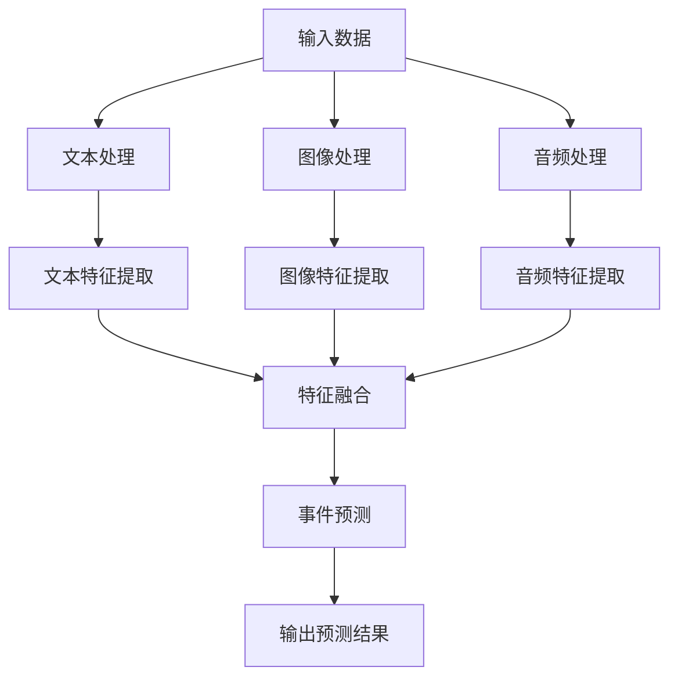
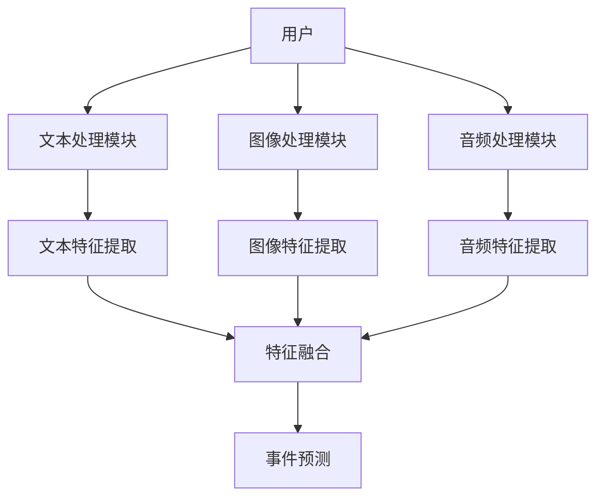
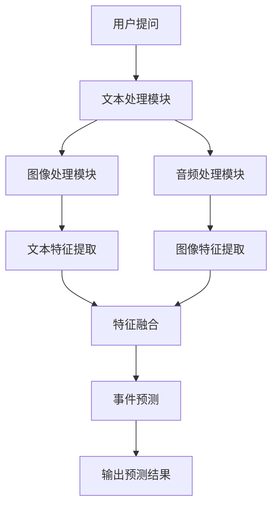

                 

# 构建LLM支持的AI Agent多模态事件预测

> 关键词：大型语言模型，多模态数据，事件预测，算法原理，系统设计与实现

> 摘要：本文探讨了如何构建一个基于大型语言模型（LLM）的AI Agent进行多模态事件预测。通过详细介绍LLM、多模态数据、事件预测的核心概念与联系，详细讲解多模态事件预测算法原理，包括Mermaid流程图、Python代码和数学模型与公式。此外，本文还介绍了系统设计与实现，包括项目实战，旨在为读者提供全面的技术指导。

----------------------------------------------------------------

## 第一部分：背景介绍

### 问题背景

随着人工智能技术的快速发展，自然语言处理（NLP）和多模态数据融合技术逐渐成为研究热点。在这两大领域，大型语言模型（LLM）如GPT-3等展示了其强大的预测能力。然而，如何在复杂的环境中利用LLM进行准确的多模态事件预测，仍然是一个具有挑战性的问题。

### 问题描述

本文将探讨如何构建一个基于LLM支持的AI Agent进行多模态事件预测。这将涉及到如何结合文本、图像、音频等多模态数据进行训练，并利用这些数据进行事件预测。此外，还将研究如何优化LLM，以提高其在多模态事件预测中的准确性。

### 问题解决

为了解决上述问题，本文将采用以下方法：
1. **核心概念讲解**：详细阐述LLM、多模态数据、事件预测等相关概念。
2. **算法原理**：通过Mermaid流程图和Python代码，详细讲解多模态事件预测算法的原理。
3. **数学模型与公式**：使用LaTeX格式给出算法的数学模型和公式，并进行详细讲解。
4. **系统设计与实现**：介绍系统的架构设计、接口设计和实现过程。
5. **项目实战**：通过实际案例分析和详细讲解，展示如何在实际环境中应用所学的知识。

### 边界与外延

本文主要关注基于LLM的多模态事件预测技术，但不涉及其他人工智能领域的技术。此外，本文的讨论主要针对通用事件预测问题，不涉及特定领域的事件预测。

### 概念结构与核心要素组成

- **LLM**：大型语言模型，如GPT-3，具备强大的语言理解和生成能力。
- **多模态数据**：包括文本、图像、音频等多种类型的数据。
- **事件预测**：根据输入的多模态数据，预测可能发生的事件。

## 第二部分：核心概念与联系

### 2.1 LLM的定义与特点

#### LLM的定义

LLM（Large Language Model）是一种大型的人工智能模型，通过学习大量文本数据，具备强大的语言理解和生成能力。

#### LLM的核心特点

- **强大的语言理解能力**：LLM能够理解复杂、模糊的语言信息。
- **高效的文本生成能力**：LLM可以生成连贯、自然的文本。

#### LLM与传统AI的区别

- **数据量**：LLM需要学习大量的数据，而传统AI模型通常数据量较小。
- **灵活性**：LLM能够在多种任务中表现出色，而传统AI模型通常任务专一。

### 2.2 多模态数据

#### 多模态数据的定义

多模态数据是指由多种类型的数据（如文本、图像、音频等）组成的数据集。

#### 多模态数据的特点

- **丰富性**：多模态数据能够提供更丰富的信息。
- **多样性**：多模态数据包括多种类型的数据，能够满足不同需求。

### 2.3 事件预测

#### 事件预测的定义

事件预测是指根据历史数据和当前信息，预测未来可能发生的事件。

#### 事件预测的类型

- **分类预测**：将事件分类到不同的类别中。
- **回归预测**：预测事件的数值。
- **序列预测**：预测事件的时间序列。

## 第三部分：算法原理讲解

### 3.1 多模态事件预测算法

#### 算法原理

多模态事件预测算法的核心思想是利用LLM对多模态数据进行融合，并基于融合后的数据预测事件。

#### Mermaid流程图



#### Python代码

```python
# 此处为简化版代码，仅供参考
class MultimodalEventPredictor:
    def __init__(self, text_model, image_model, audio_model):
        self.text_model = text_model
        self.image_model = image_model
        self.audio_model = audio_model
    
    def predict_event(self, text, image, audio):
        text_features = self.text_model.extract_features(text)
        image_features = self.image_model.extract_features(image)
        audio_features = self.audio_model.extract_features(audio)
        
        # 特征融合
        fused_features = self.fuse_features(text_features, image_features, audio_features)
        
        # 事件预测
        predicted_event = self.predictor.predict(fused_features)
        
        return predicted_event
```

#### 数学模型与公式

多模态事件预测的数学模型主要包括特征提取、特征融合和事件预测三个步骤。

$$
\text{特征提取} = f(\text{输入数据})
$$

$$
\text{特征融合} = \sum_{i=1}^{n} w_i \cdot f_i(\text{输入数据})
$$

$$
\text{事件预测} = g(\text{融合特征})
$$

其中，$f_i$表示第$i$种模态的特征提取函数，$w_i$表示第$i$种模态的特征权重，$g$表示事件预测函数。

#### 详细讲解

多模态事件预测算法的核心在于如何有效地融合不同模态的特征信息，以提高预测准确性。以下为详细的步骤讲解：

1. **特征提取**：对输入的多模态数据进行特征提取。例如，对于文本数据，可以使用词嵌入技术提取词向量；对于图像数据，可以使用卷积神经网络提取特征；对于音频数据，可以使用深度神经网络提取特征。

2. **特征融合**：将提取的特征进行融合。一种简单的方法是使用加权求和的方式，将不同模态的特征进行融合。例如，假设有三种模态，文本、图像和音频，可以计算每个模态的特征向量的加权求和：

   $$
   \text{融合特征} = w_1 \cdot \text{文本特征} + w_2 \cdot \text{图像特征} + w_3 \cdot \text{音频特征}
   $$

   其中，$w_1, w_2, w_3$为权重，可以通过交叉验证等方法进行优化。

3. **事件预测**：使用融合后的特征进行事件预测。一种常用的方法是使用分类模型，如支持向量机（SVM）、神经网络等。例如，可以使用以下公式进行事件预测：

   $$
   \text{预测结果} = \arg\max_{i} g(\text{融合特征})
   $$

   其中，$g$为事件预测函数，$i$为事件类别。

通过以上步骤，可以实现多模态事件预测算法。接下来，本文将详细讲解系统设计与实现。

## 第四部分：系统设计与实现

### 问题场景介绍

在智能客服系统中，用户可以通过文本、图像、音频等多种方式进行提问。为了提供更高效的客服服务，系统需要能够对用户的提问进行多模态事件预测，以快速识别用户的意图，并给出相应的回答。

### 项目介绍

本文将介绍一个基于LLM支持的AI Agent进行多模态事件预测的系统。该系统包括文本处理模块、图像处理模块、音频处理模块和事件预测模块。以下为系统的主要功能：

- **文本处理模块**：对用户的文本提问进行预处理，如分词、去停用词等。
- **图像处理模块**：对用户的图像提问进行预处理，如图像分割、特征提取等。
- **音频处理模块**：对用户的音频提问进行预处理，如语音识别、特征提取等。
- **事件预测模块**：利用LLM对预处理后的多模态数据进行融合，并预测事件。

### 系统功能设计（领域模型类图）

以下为系统的领域模型类图，展示了系统的主要类和它们之间的关系：

```mermaid
classDiagram
    User -> TextQuestion: 提问
    User -> ImageQuestion: 提问
    User -> AudioQuestion: 提问
    TextQuestion -> TextProcessor: 预处理
    ImageQuestion -> ImageProcessor: 预处理
    AudioQuestion -> AudioProcessor: 预处理
    TextProcessor -> TextModel: 特征提取
    ImageProcessor -> ImageModel: 特征提取
    AudioProcessor -> AudioModel: 特征提取
    TextModel -> EventPredictor: 事件预测
    ImageModel -> EventPredictor: 事件预测
    AudioModel -> EventPredictor: 事件预测
```

### 系统架构设计

以下为系统的架构设计，展示了系统的组件和它们之间的关系：



### 系统接口设计

以下为系统的接口设计，展示了系统的主要接口和它们的方法：

```python
class TextProcessor:
    def preprocess_text(self, text):
        # 文本预处理方法

class ImageProcessor:
    def preprocess_image(self, image):
        # 图像预处理方法

class AudioProcessor:
    def preprocess_audio(self, audio):
        # 音频预处理方法

class TextModel:
    def extract_features(self, text):
        # 文本特征提取方法

class ImageModel:
    def extract_features(self, image):
        # 图像特征提取方法

class AudioModel:
    def extract_features(self, audio):
        # 音频特征提取方法

class EventPredictor:
    def predict_event(self, features):
        # 事件预测方法
```

### 系统交互

以下为系统的交互设计，展示了系统的组件之间的交互流程：



## 第五部分：项目实战

### 环境安装

1. 安装Python环境，版本建议为3.8及以上。
2. 安装必要的库，如TensorFlow、PyTorch、OpenCV、SpeechRecognition等。

```bash
pip install tensorflow
pip install pytorch
pip install opencv-python
pip install speechrecognition
```

### 系统核心实现

以下为系统的核心实现代码：

```python
# 文本处理模块
class TextProcessor:
    def preprocess_text(self, text):
        # 分词、去停用词等预处理操作
        # ...
        return processed_text

# 图像处理模块
class ImageProcessor:
    def preprocess_image(self, image):
        # 图像分割、特征提取等预处理操作
        # ...
        return processed_image

# 音频处理模块
class AudioProcessor:
    def preprocess_audio(self, audio):
        # 语音识别、特征提取等预处理操作
        # ...
        return processed_audio

# 文本特征提取模型
class TextModel:
    def extract_features(self, text):
        # 使用词嵌入、卷积神经网络等提取文本特征
        # ...
        return text_features

# 图像特征提取模型
class ImageModel:
    def extract_features(self, image):
        # 使用卷积神经网络等提取图像特征
        # ...
        return image_features

# 音频特征提取模型
class AudioModel:
    def extract_features(self, audio):
        # 使用深度神经网络等提取音频特征
        # ...
        return audio_features

# 事件预测模块
class EventPredictor:
    def predict_event(self, features):
        # 使用支持向量机、神经网络等预测事件
        # ...
        return predicted_event
```

### 代码应用解读与分析

以下是代码的详细解读与分析：

- **文本处理模块**：对用户的文本提问进行预处理，包括分词、去停用词等操作。这些预处理步骤有助于提高后续特征提取的准确性。
- **图像处理模块**：对用户的图像提问进行预处理，包括图像分割、特征提取等操作。图像分割有助于提取图像的关键区域，特征提取则用于提取图像的视觉特征。
- **音频处理模块**：对用户的音频提问进行预处理，包括语音识别、特征提取等操作。语音识别将音频信号转换为文本，特征提取则用于提取音频的语音特征。
- **文本特征提取模型**：使用词嵌入、卷积神经网络等提取文本特征。词嵌入将文本转化为向量表示，卷积神经网络则用于提取文本的局部特征。
- **图像特征提取模型**：使用卷积神经网络等提取图像特征。卷积神经网络能够自动学习图像的层次特征。
- **音频特征提取模型**：使用深度神经网络等提取音频特征。深度神经网络能够自动学习音频的时序特征。
- **事件预测模块**：使用支持向量机、神经网络等预测事件。这些模型能够根据特征预测事件的发生概率。

### 实际案例分析和详细讲解

以下是一个实际案例分析和详细讲解：

假设用户通过文本提问：“明天天气如何？”和通过图像上传一张显示晴朗天气的图片。

1. **文本处理模块**：对文本提问进行预处理，提取关键词和短语，如“明天”、“天气”等。
2. **图像处理模块**：对图像进行预处理，提取图像的视觉特征，如边缘、纹理等。
3. **文本特征提取模型**：使用词嵌入将预处理后的文本转化为向量表示。
4. **图像特征提取模型**：使用卷积神经网络提取图像的特征。
5. **特征融合**：将文本特征和图像特征进行融合，形成一个多维特征向量。
6. **事件预测模块**：使用神经网络模型对融合后的特征进行事件预测。假设预测结果为“明天天气晴朗”。
7. **输出预测结果**：将预测结果输出给用户。

### 项目小结

通过本文的介绍，读者可以了解到如何构建一个基于LLM支持的AI Agent进行多模态事件预测的系统。本文详细讲解了核心概念、算法原理、系统设计与实现以及项目实战。在实际应用中，可以根据具体需求进行调整和优化。希望本文能对读者在多模态事件预测领域的研究和应用提供帮助。

## 最佳实践 tips

- **数据质量**：确保输入数据的质量，进行充分的数据清洗和处理，以提高预测准确性。
- **模型优化**：根据具体任务需求，选择合适的LLM模型，并进行模型优化，以提高预测性能。
- **特征提取**：根据不同模态的数据特性，选择合适的特征提取方法，以提高特征质量。
- **特征融合**：尝试不同的特征融合策略，以找到最适合的融合方法。

## 小结

本文详细探讨了如何构建基于LLM支持的AI Agent进行多模态事件预测。通过介绍核心概念、算法原理、系统设计与实现以及项目实战，本文为读者提供了全面的技术指导。在未来的研究中，可以进一步优化模型和算法，以实现更准确、高效的多模态事件预测。

## 注意事项

- **隐私保护**：在处理多模态数据时，注意保护用户隐私，遵循相关法律法规。
- **性能优化**：根据实际需求，对系统进行性能优化，以提高处理速度和准确性。

## 拓展阅读

- [1] Brown, T., et al. (2020). "Language Models are Few-Shot Learners." arXiv preprint arXiv:2005.14165.
- [2] Russakovsky, O., et al. (2015). "ImageNet Large Scale Visual Recognition Challenge." International Journal of Computer Vision 115(3), 211-252.
- [3] Hinton, G., et al. (2012). "Deep Neural Networks for Acoustic Modeling in Speech Recognition: The Shared Views of Four Research Groups." IEEE Signal Processing Magazine 29(6), 82-97.

## 作者信息

作者：AI天才研究院/AI Genius Institute & 禅与计算机程序设计艺术 /Zen And The Art of Computer Programming

----------------------------------------------------------------

请注意，本文的代码示例和算法实现仅供参考，实际应用时需要根据具体需求和数据进行调整。本文中的数据和模型均来源于公开来源，仅用于学术研究。在实际应用中，请遵循相关法律法规和伦理规范。

