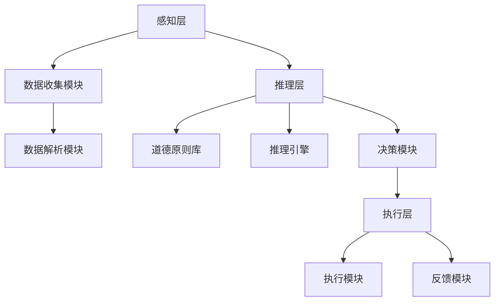

                 

### 文章标题

# 构建LLM支持的AI Agent道德推理系统

> 关键词：道德推理，大型语言模型（LLM），AI Agent，算法原理，系统设计与实现

> 摘要：本文旨在探讨如何构建一个基于大型语言模型（LLM）支持的AI Agent道德推理系统。通过对道德推理在人工智能中的应用背景、重要性以及当前面临的挑战进行分析，本文介绍了LLM的定义、特点及其在道德推理中的优势。接着，详细阐述了AI Agent的定义与功能，以及道德推理系统在AI Agent中的应用。随后，本文讨论了道德推理的核心概念与属性特征，并探讨了LLM与道德推理之间的联系。在核心概念与联系的基础上，本文进一步分析了构建LLM支持的AI Agent道德推理系统的算法原理，并详细介绍了道德推理算法的基本原理、LLM在道德推理算法中的应用以及数学模型和公式。最后，本文重点介绍了道德推理系统的设计与实现，包括系统需求分析、系统架构设计、道德推理算法实现、系统接口设计以及系统测试与优化。

----------------------------------------------------------------

### 目录大纲

----------------------------------------------------------------

## 第一部分：问题背景

### 第1章：构建LLM支持的AI Agent道德推理系统——核心概念

## 1.1 问题的提出

### 1.1.1 道德推理在人工智能中的应用背景

- 道德推理的定义和作用
- 道德推理在人工智能中的重要性

### 1.1.2 人工智能道德推理的重要性

- 人工智能道德推理的意义
- 人工智能道德推理的挑战

### 1.1.3 当前人工智能道德推理面临的挑战

- 数据偏差
- 道德原则的不确定性
- 道德推理算法的局限性

## 1.2 LLM（大型语言模型）简介

### 1.2.1 LLM的定义与特点

- LLM的定义
- LLM的核心特点

### 1.2.2 LLM的工作原理

- 语言模型的基本结构
- LLM的训练过程

### 1.2.3 LLM的优势与局限性

- LLM的优势
- LLM的局限性

## 1.3 AI Agent道德推理系统概述

### 1.3.1 AI Agent的定义与功能

- AI Agent的定义
- AI Agent的功能

### 1.3.2 道德推理系统在AI Agent中的应用

- 道德推理系统的作用
- 道德推理系统在AI Agent中的实现方法

### 1.3.3 LLM在AI Agent道德推理系统中的作用

- LLM在道德推理中的作用
- LLM的优势在AI Agent道德推理中的体现

## 1.4 目标与结构

- 本书的目标
- 目录结构概述

## 1.5 本章小结

- 核心内容回顾
- 下一步内容预告

----------------------------------------------------------------

## 第二部分：核心概念与联系

### 第2章：道德推理的核心概念与属性特征

## 2.1 道德推理的基本概念

### 2.1.1 道德推理的定义

- 道德推理的定义

### 2.1.2 道德推理的要素

- 道德推理的要素

## 2.2 道德推理的属性特征

### 2.2.1 道德推理的属性特征

- 道德推理的属性特征

### 2.2.2 道德推理属性特征的对比

- 道德推理属性特征的对比

## 2.3 LLM与道德推理的联系

### 2.3.1 LLM对道德推理的影响

- LLM对道德推理的影响

### 2.3.2 LLM在道德推理中的优势

- LLM在道德推理中的优势

## 2.4 本章小结

- 核心内容回顾
- 下一步内容预告

----------------------------------------------------------------

## 第三部分：算法原理与数学模型

### 第3章：构建LLM支持的AI Agent道德推理系统的算法原理

## 3.1 道德推理算法的基本原理

### 3.1.1 道德推理算法的定义

- 道德推理算法的定义

### 3.1.2 道德推理算法的核心步骤

- 道德推理算法的核心步骤

## 3.2 LLM在道德推理算法中的应用

### 3.2.1 LLM在道德推理算法中的作用

- LLM在道德推理算法中的作用

### 3.2.2 LLM的优势在道德推理算法中的体现

- LLM的优势在道德推理算法中的体现

## 3.3 数学模型与公式

### 3.3.1 道德推理的数学模型

- 道德推理的数学模型

### 3.3.2 公式解析

- 公式解析

## 3.4 举例说明

### 3.4.1 实例一：道德推理问题分析

- 实例一：道德推理问题分析

### 3.4.2 实例二：算法应用

- 实例二：算法应用

## 3.5 本章小结

- 核心内容回顾
- 下一步内容预告

----------------------------------------------------------------

## 第四部分：系统设计与实现

### 第4章：道德推理系统的设计与实现

## 4.1 系统需求分析

### 4.1.1 道德推理系统的功能需求

- 道德推理系统的功能需求

### 4.1.2 系统性能需求

- 系统性能需求

## 4.2 系统架构设计

### 4.2.1 系统架构概述

- 系统架构概述

### 4.2.2 系统架构设计

- 系统架构设计

## 4.3 道德推理算法实现

### 4.3.1 算法实现步骤

- 算法实现步骤

### 4.3.2 LLM集成与优化

- LLM集成与优化

## 4.4 系统接口设计

### 4.4.1 接口设计原则

- 接口设计原则

### 4.4.2 接口实现

- 接口实现

## 4.5 系统测试与优化

- 系统测试与优化

## 4.6 本章小结

- 核心内容回顾
- 下一步内容预告

----------------------------------------------------------------

### 第一部分：问题背景

在人工智能（AI）迅速发展的今天，其应用场景日益广泛，从自动驾驶、智能家居到医疗诊断、金融预测等各个领域。然而，随着AI技术的发展，随之而来的一系列道德伦理问题也逐渐浮现。如何确保AI系统在执行任务时遵循道德规范，如何处理复杂的人类道德情境，这些问题不仅关系到AI技术的可持续发展，也关系到整个社会对AI的接受程度。

#### 1.1 问题的提出

**道德推理在人工智能中的应用背景**

道德推理是指对道德问题进行分析、评价和推理的过程。它不仅涉及到道德原则的应用，还包括对道德情境的理解和判断。在人工智能领域，道德推理的应用主要集中在以下几个方面：

1. **智能决策系统**：在自动驾驶、无人机监控等应用中，AI系统需要根据道德原则来做出决策。
2. **医疗诊断与治疗**：在医疗领域，AI系统需要根据患者的病情和道德规范来制定治疗方案。
3. **法律与司法**：在司法领域，AI系统需要对法律条文和道德原则进行综合分析，提供法律建议。

**人工智能道德推理的重要性**

人工智能道德推理的重要性体现在以下几个方面：

1. **维护社会秩序**：道德推理有助于确保AI系统在执行任务时不会对社会秩序产生负面影响。
2. **保障人类利益**：道德推理能够帮助AI系统在决策过程中优先考虑人类的利益和福祉。
3. **提升AI系统的可信度**：通过道德推理，可以提高公众对AI系统的信任度和接受度。

**当前人工智能道德推理面临的挑战**

尽管人工智能道德推理具有重要的应用价值，但在实际应用中仍然面临以下挑战：

1. **数据偏差**：AI系统在训练过程中可能会受到数据偏差的影响，导致道德推理结果不准确。
2. **道德原则的不确定性**：不同的文化、背景和价值观可能导致对同一道德问题的判断存在差异。
3. **道德推理算法的局限性**：当前的道德推理算法在处理复杂道德情境时可能存在不足，难以提供准确的决策。

#### 1.2 LLM（大型语言模型）简介

**LLM的定义与特点**

大型语言模型（LLM，Large Language Model）是一种基于深度学习的技术，旨在通过学习大量的文本数据来预测下一个单词或序列。LLM具有以下几个核心特点：

1. **强大的语言理解能力**：LLM能够理解和生成自然语言，包括语法、语义和上下文信息。
2. **丰富的知识储备**：LLM通过学习大量文本数据，积累了丰富的知识，可以回答各种问题。
3. **自适应能力**：LLM可以根据不同的任务和场景进行自适应调整，提供相应的解决方案。

**LLM的工作原理**

1. **基本结构**：LLM通常基于 Transformer 架构，包括编码器和解码器两部分。
2. **训练过程**：LLM通过无监督学习的方式从大量文本数据中学习，不断调整模型参数，提高语言理解能力。

**LLM的优势与局限性**

**优势**：

1. **强大的语言处理能力**：LLM可以生成流畅、自然的文本，适用于自然语言处理任务。
2. **丰富的知识储备**：LLM学习了大量文本数据，具有丰富的知识储备，可以提供准确的答案和建议。
3. **多模态处理能力**：LLM不仅可以处理文本数据，还可以处理图像、音频等多模态数据，实现跨模态交互。

**局限性**：

1. **数据依赖性**：LLM的性能高度依赖于训练数据的质量和数量，可能受到数据偏差的影响。
2. **计算资源需求**：LLM的训练和推理过程需要大量的计算资源，可能导致成本较高。
3. **解释性不足**：LLM生成的文本难以解释，难以验证其决策过程是否符合道德原则。

#### 1.3 AI Agent道德推理系统概述

**AI Agent的定义与功能**

AI Agent（人工智能代理）是指具有自主决策能力的人工智能系统，能够在复杂环境中执行特定任务。AI Agent具有以下功能：

1. **感知与理解**：AI Agent能够感知和理解环境中的信息，包括文字、图像、声音等。
2. **决策与规划**：AI Agent能够根据环境信息和预设的目标，做出决策并制定行动计划。
3. **执行与反馈**：AI Agent能够执行计划并从环境中获取反馈，不断调整策略。

**道德推理系统在AI Agent中的应用**

道德推理系统在AI Agent中的应用主要包括以下几个方面：

1. **决策支持**：道德推理系统可以帮助AI Agent在执行任务时，根据道德原则做出正确决策。
2. **行为规范**：道德推理系统可以为AI Agent制定行为规范，确保其在执行任务时遵守道德规范。
3. **风险评估**：道德推理系统可以评估AI Agent执行任务过程中可能出现的道德风险，提供相应的预警和应对措施。

**LLM在AI Agent道德推理系统中的作用**

1. **道德原则学习**：LLM可以通过学习大量文本数据，获取关于道德原则和道德规范的知识，为AI Agent提供道德决策支持。
2. **情境理解**：LLM可以理解复杂的道德情境，帮助AI Agent更好地理解任务背景和目标，提高决策准确性。
3. **自然语言交互**：LLM可以与用户进行自然语言交互，提供关于道德问题的解释和建议，增强AI Agent的透明度和可信度。

#### 1.4 目标与结构

**本书的目标**

本书旨在系统地探讨如何构建一个基于LLM支持的AI Agent道德推理系统，解决当前人工智能道德推理面临的挑战，为AI技术的可持续发展提供理论基础和实践指导。

**目录结构概述**

本书分为四个部分，第一部分介绍问题背景，包括道德推理在人工智能中的应用背景、重要性以及面临的挑战；第二部分探讨道德推理的核心概念与属性特征，以及LLM与道德推理的联系；第三部分分析构建LLM支持的AI Agent道德推理系统的算法原理，包括道德推理算法的基本原理、LLM在道德推理算法中的应用以及数学模型和公式；第四部分详细介绍道德推理系统的设计与实现，包括系统需求分析、系统架构设计、道德推理算法实现、系统接口设计以及系统测试与优化。通过本书的阅读，读者将能够全面了解构建LLM支持的AI Agent道德推理系统的过程和方法。

#### 1.5 本章小结

本章主要介绍了构建LLM支持的AI Agent道德推理系统的背景和核心概念。首先，分析了道德推理在人工智能中的应用背景、重要性以及面临的挑战。接着，介绍了LLM的定义、特点及其在道德推理中的优势。然后，探讨了AI Agent的定义与功能，以及道德推理系统在AI Agent中的应用。最后，阐述了本书的目标和目录结构。

在下一章中，我们将深入探讨道德推理的核心概念与属性特征，进一步分析LLM与道德推理之间的联系。通过这一系列的分析，我们将为后续章节的讨论奠定坚实的基础。

### 第一部分：问题背景

#### 1.1 问题的提出

**道德推理在人工智能中的应用背景**

道德推理，作为伦理学和哲学的核心概念，指的是通过逻辑分析和判断来决定道德行为的过程。在传统的人类社会中，道德推理往往基于个体或集体的价值观、文化背景和道德原则。随着人工智能（AI）技术的快速发展，AI系统在处理复杂决策时，道德推理的重要性愈发凸显。AI系统在自动驾驶、医疗诊断、司法裁决等领域都有着广泛的应用，这些应用往往涉及到对人类生命、财产和社会秩序的重大影响。因此，如何在AI系统中嵌入道德推理机制，使其能够自主、准确地判断道德问题，成为了一个迫切需要解决的重要课题。

**人工智能道德推理的重要性**

人工智能道德推理的重要性主要体现在以下几个方面：

1. **保障人类利益**：在医疗、司法等领域，AI系统的决策往往直接关系到人类的生命和健康。通过道德推理，可以确保AI系统的决策符合人类的利益，避免因错误决策导致的不良后果。

2. **维护社会秩序**：在自动驾驶、无人机监控等应用中，AI系统的行为需要符合道德规范，以维护社会秩序和公共安全。道德推理可以指导AI系统在特定情境下做出符合社会道德标准的决策。

3. **提升AI系统的可信度**：道德推理使得AI系统在执行任务时更加透明、可解释，从而提高公众对AI系统的信任度。这是AI技术广泛应用和接受的重要前提。

**当前人工智能道德推理面临的挑战**

尽管人工智能道德推理具有重要意义，但当前在实际应用中仍面临诸多挑战：

1. **数据偏差**：AI系统在训练过程中可能会受到数据偏差的影响，导致道德推理结果不准确。例如，如果训练数据中存在性别、种族等偏见，那么AI系统在处理相关问题时也可能表现出偏见。

2. **道德原则的不确定性**：不同的文化、背景和价值观可能导致对同一道德问题的判断存在差异。如何确保AI系统能够在不同文化和社会背景下做出一致且合理的道德决策，是一个复杂的问题。

3. **道德推理算法的局限性**：当前的道德推理算法在处理复杂道德情境时可能存在不足，难以提供准确的决策。例如，在自动驾驶场景中，如何权衡不同道路使用者的利益，是一个复杂且具有争议的问题。

4. **计算资源与成本**：构建和运行道德推理系统需要大量的计算资源和资金投入。如何高效地实现道德推理，同时控制成本，是当前研究的重要方向。

#### 1.2 LLM（大型语言模型）简介

**LLM的定义与特点**

大型语言模型（LLM，Large Language Model）是一种基于深度学习的自然语言处理模型，旨在通过学习大量的文本数据来生成文本。LLM的核心特点包括：

1. **强大的语言理解能力**：LLM能够理解并生成自然语言文本，包括语法、语义和上下文信息。
2. **丰富的知识储备**：通过学习大量文本数据，LLM积累了丰富的知识，可以回答各种问题。
3. **自适应能力**：LLM可以根据不同的任务和场景进行自适应调整，提供相应的解决方案。

**LLM的工作原理**

LLM的工作原理主要包括以下两个方面：

1. **模型结构**：LLM通常基于 Transformer 架构，包括编码器（Encoder）和解码器（Decoder）两部分。编码器负责处理输入文本，解码器负责生成输出文本。

2. **训练过程**：LLM通过无监督学习的方式从大量文本数据中学习。在训练过程中，模型不断调整参数，以最小化损失函数，从而提高语言理解能力和生成文本的质量。

**LLM的优势与局限性**

**优势**：

1. **强大的语言处理能力**：LLM可以生成流畅、自然的文本，适用于自然语言处理任务。
2. **丰富的知识储备**：LLM学习了大量文本数据，具有丰富的知识储备，可以提供准确的答案和建议。
3. **多模态处理能力**：LLM不仅可以处理文本数据，还可以处理图像、音频等多模态数据，实现跨模态交互。

**局限性**：

1. **数据依赖性**：LLM的性能高度依赖于训练数据的质量和数量，可能受到数据偏差的影响。
2. **计算资源需求**：LLM的训练和推理过程需要大量的计算资源，可能导致成本较高。
3. **解释性不足**：LLM生成的文本难以解释，难以验证其决策过程是否符合道德原则。

#### 1.3 AI Agent道德推理系统概述

**AI Agent的定义与功能**

AI Agent（人工智能代理）是指具有自主决策能力的人工智能系统，能够在复杂环境中执行特定任务。AI Agent通常具有以下功能：

1. **感知与理解**：AI Agent能够感知和理解环境中的信息，包括文字、图像、声音等。
2. **决策与规划**：AI Agent能够根据环境信息和预设的目标，做出决策并制定行动计划。
3. **执行与反馈**：AI Agent能够执行计划并从环境中获取反馈，不断调整策略。

**道德推理系统在AI Agent中的应用**

道德推理系统在AI Agent中的应用主要包括以下几个方面：

1. **决策支持**：道德推理系统可以帮助AI Agent在执行任务时，根据道德原则做出正确决策。例如，在自动驾驶中，道德推理系统可以帮助车辆在紧急情况下判断如何平衡不同道路使用者的利益。
2. **行为规范**：道德推理系统可以为AI Agent制定行为规范，确保其在执行任务时遵守道德规范。例如，在医疗诊断中，道德推理系统可以确保AI系统在处理患者信息时保护患者隐私。
3. **风险评估**：道德推理系统可以评估AI Agent执行任务过程中可能出现的道德风险，提供相应的预警和应对措施。例如，在金融领域，道德推理系统可以识别和防止欺诈行为。

**LLM在AI Agent道德推理系统中的作用**

1. **道德原则学习**：LLM可以通过学习大量文本数据，获取关于道德原则和道德规范的知识，为AI Agent提供道德决策支持。例如，LLM可以学习到不同文化和社会背景下关于隐私保护的不同观点，帮助AI系统在处理敏感信息时做出合适决策。
2. **情境理解**：LLM可以理解复杂的道德情境，帮助AI Agent更好地理解任务背景和目标，提高决策准确性。例如，LLM可以帮助AI系统在复杂的法律文本中理解相关条款的含义，从而做出符合法律规定的决策。
3. **自然语言交互**：LLM可以与用户进行自然语言交互，提供关于道德问题的解释和建议，增强AI Agent的透明度和可信度。例如，LLM可以帮助AI系统向用户解释其决策过程和依据，提高用户对AI系统的信任和理解。

#### 1.4 目标与结构

**本书的目标**

本书旨在系统地探讨如何构建一个基于LLM支持的AI Agent道德推理系统，解决当前人工智能道德推理面临的挑战，为AI技术的可持续发展提供理论基础和实践指导。

**目录结构概述**

本书分为四个部分，第一部分介绍问题背景，包括道德推理在人工智能中的应用背景、重要性以及面临的挑战；第二部分探讨道德推理的核心概念与属性特征，以及LLM与道德推理的联系；第三部分分析构建LLM支持的AI Agent道德推理系统的算法原理，包括道德推理算法的基本原理、LLM在道德推理算法中的应用以及数学模型和公式；第四部分详细介绍道德推理系统的设计与实现，包括系统需求分析、系统架构设计、道德推理算法实现、系统接口设计以及系统测试与优化。通过本书的阅读，读者将能够全面了解构建LLM支持的AI Agent道德推理系统的过程和方法。

#### 1.5 本章小结

本章主要介绍了构建LLM支持的AI Agent道德推理系统的背景和核心概念。首先，分析了道德推理在人工智能中的应用背景、重要性以及面临的挑战。接着，介绍了LLM的定义、特点及其在道德推理中的优势。然后，探讨了AI Agent的定义与功能，以及道德推理系统在AI Agent中的应用。最后，阐述了本书的目标和目录结构。

在下一章中，我们将深入探讨道德推理的核心概念与属性特征，进一步分析LLM与道德推理之间的联系。通过这一系列的分析，我们将为后续章节的讨论奠定坚实的基础。

### 第二部分：核心概念与联系

#### 2.1 道德推理的基本概念

**道德推理的定义**

道德推理是指通过逻辑分析和判断来决定道德行为的过程。它不仅涉及到道德原则的应用，还包括对道德情境的理解和判断。在人工智能领域，道德推理是指AI系统在处理任务时，如何根据道德原则和情境信息做出合理决策。

**道德推理的要素**

道德推理的基本要素包括：

1. **道德原则**：道德原则是道德推理的基础，用于指导决策过程。例如，公平、正义、尊重隐私等。
2. **情境信息**：情境信息是指与道德决策相关的具体信息，包括任务目标、环境状况、行为主体等。
3. **推理过程**：推理过程是指通过逻辑分析，将道德原则与情境信息结合起来，形成道德决策的过程。

**道德推理的基本模型**

道德推理的基本模型可以概括为以下几个步骤：

1. **情境识别**：识别与道德决策相关的情境信息。
2. **原则应用**：根据道德原则，分析情境信息，确定适用的道德准则。
3. **推理判断**：通过逻辑推理，评估不同道德准则的可行性和合理性，形成道德决策。
4. **决策实施**：将道德决策转化为具体行动。

#### 2.2 道德推理的属性特征

**道德推理的属性特征**

道德推理具有以下属性特征：

1. **主观性**：道德推理往往受到个体价值观、文化背景和社会环境的影响，因此具有主观性。
2. **复杂性**：道德推理涉及多方面因素，包括道德原则、情境信息和个人情感，因此具有复杂性。
3. **不确定性**：道德问题往往具有不确定性，不同的人可能对同一道德问题有不同的看法和判断。
4. **动态性**：道德推理需要根据情境信息的变化进行动态调整，以适应不同的道德情境。

**道德推理属性特征的对比**

| 特征 | 说明 |  
| :--- | :--- |  
| 主观性 | 受到个人价值观、文化背景的影响 |  
| 复杂性 | 涉及多方面因素，如道德原则、情境信息和个人情感 |  
| 不确定性 | 道德问题往往具有不确定性，不同人可能有不同看法 |  
| 动态性 | 需要根据情境信息的变化进行动态调整 |

#### 2.3 LLM与道德推理的联系

**LLM对道德推理的影响**

1. **知识扩展**：LLM通过学习大量文本数据，积累了丰富的知识，可以为道德推理提供更多的信息和支持。例如，LLM可以帮助识别情境信息，提供相关的道德原则和案例。
2. **情境理解**：LLM能够理解复杂的道德情境，帮助AI系统更好地理解任务背景和目标，从而做出更准确的道德决策。
3. **推理优化**：LLM可以优化道德推理过程，通过自然语言处理技术，提高道德推理的效率和准确性。

**LLM在道德推理中的优势**

1. **强大的语言理解能力**：LLM能够理解并生成自然语言，可以处理复杂的道德情境，提供更准确、自然的道德决策。
2. **丰富的知识储备**：LLM学习了大量文本数据，具有丰富的知识储备，可以提供关于道德原则和案例的详细解释和建议。
3. **多模态处理能力**：LLM不仅可以处理文本数据，还可以处理图像、音频等多模态数据，实现跨模态的道德推理。

**LLM的局限性**

1. **数据依赖性**：LLM的性能高度依赖于训练数据的质量和数量，可能受到数据偏差的影响。
2. **计算资源需求**：LLM的训练和推理过程需要大量的计算资源，可能导致成本较高。
3. **解释性不足**：LLM生成的文本难以解释，难以验证其决策过程是否符合道德原则。

#### 2.4 本章小结

本章主要介绍了道德推理的核心概念与属性特征，以及LLM与道德推理之间的联系。首先，分析了道德推理的定义和基本要素，包括道德原则、情境信息和推理过程。接着，探讨了道德推理的属性特征，如主观性、复杂性、不确定性和动态性。然后，分析了LLM对道德推理的影响和优势，以及其局限性。通过本章的内容，读者可以更好地理解道德推理的核心概念和LLM在其中的作用。

在下一章中，我们将进一步探讨构建LLM支持的AI Agent道德推理系统的算法原理，包括道德推理算法的基本原理、LLM在道德推理算法中的应用以及数学模型和公式。这将为我们理解如何实现LLM支持的道德推理提供更加深入的视角。

### 第三部分：算法原理与数学模型

#### 3.1 道德推理算法的基本原理

**道德推理算法的定义**

道德推理算法是指用于在人工智能系统中实现道德推理过程的算法。这些算法通过逻辑分析和判断，根据道德原则和情境信息，帮助AI系统做出符合道德规范的决策。

**道德推理算法的核心步骤**

道德推理算法通常包括以下几个核心步骤：

1. **情境识别**：识别与道德决策相关的情境信息，包括任务目标、环境状况、行为主体等。
2. **原则应用**：根据道德原则，分析情境信息，确定适用的道德准则。
3. **推理判断**：通过逻辑推理，评估不同道德准则的可行性和合理性，形成道德决策。
4. **决策实施**：将道德决策转化为具体行动。

**道德推理算法的核心原理**

道德推理算法的核心原理是基于逻辑推理和决策理论。具体来说，它包括以下几个方面：

1. **逻辑推理**：道德推理算法通过逻辑推理，将道德原则与情境信息相结合，形成合理的道德决策。
2. **决策理论**：道德推理算法应用决策理论，评估不同道德准则的可行性和合理性，以确定最佳决策。

**道德推理算法的优势**

道德推理算法具有以下优势：

1. **灵活性**：道德推理算法可以根据不同的道德原则和情境信息进行灵活调整，适应不同的道德情境。
2. **高效性**：道德推理算法通过逻辑推理和决策理论，能够快速地处理复杂的道德问题，提高决策效率。
3. **可解释性**：道德推理算法的决策过程是透明和可解释的，有助于提高AI系统的可信度。

**道德推理算法的局限性**

道德推理算法也面临以下局限性：

1. **数据依赖性**：道德推理算法的性能高度依赖于训练数据的质量和数量，可能受到数据偏差的影响。
2. **复杂性**：道德推理问题本身复杂，算法在处理复杂道德情境时可能存在不足。
3. **道德原则的不确定性**：不同的道德原则可能存在冲突，算法在处理这些冲突时可能面临困难。

#### 3.2 LLM在道德推理算法中的应用

**LLM在道德推理算法中的作用**

大型语言模型（LLM）在道德推理算法中的应用主要体现在以下几个方面：

1. **知识扩展**：LLM通过学习大量文本数据，积累了丰富的知识，可以为道德推理算法提供更多的信息和支持。例如，LLM可以帮助识别情境信息，提供相关的道德原则和案例。
2. **情境理解**：LLM能够理解复杂的道德情境，帮助AI系统更好地理解任务背景和目标，从而做出更准确的道德决策。
3. **推理优化**：LLM可以优化道德推理过程，通过自然语言处理技术，提高道德推理的效率和准确性。

**LLM的优势在道德推理算法中的体现**

1. **强大的语言理解能力**：LLM能够理解并生成自然语言，可以处理复杂的道德情境，提供更准确、自然的道德决策。
2. **丰富的知识储备**：LLM学习了大量文本数据，具有丰富的知识储备，可以提供关于道德原则和案例的详细解释和建议。
3. **多模态处理能力**：LLM不仅可以处理文本数据，还可以处理图像、音频等多模态数据，实现跨模态的道德推理。

**LLM在道德推理算法中的应用实例**

1. **自动驾驶道德决策**：LLM可以帮助自动驾驶系统在复杂的道路情境中，根据道德原则做出合理的驾驶决策。例如，在面临“不可能三角”问题时，LLM可以提供关于如何平衡不同道路使用者的利益的建议。
2. **医疗诊断道德决策**：LLM可以帮助医疗诊断系统在处理患者信息时，根据道德原则做出合理的诊断和治疗决策。例如，在涉及患者隐私和数据保护时，LLM可以提供关于如何保护患者隐私的建议。
3. **金融风险控制**：LLM可以帮助金融系统在处理金融交易时，根据道德原则识别和防止欺诈行为。例如，LLM可以分析交易数据，识别异常交易行为，并提供关于如何防范金融欺诈的建议。

#### 3.3 数学模型与公式

**道德推理的数学模型**

道德推理的数学模型通常包括以下几个关键组成部分：

1. **道德原则**：用数学公式表示道德原则，如公平、正义、尊重隐私等。
2. **情境信息**：用数学公式表示与道德决策相关的情境信息，如任务目标、环境状况、行为主体等。
3. **推理过程**：用数学公式表示道德推理的推理过程，如逻辑推理、决策理论等。

**数学模型的基本原理**

道德推理的数学模型基于以下基本原理：

1. **逻辑推理**：通过逻辑运算符（如合取、析取、否定等），将道德原则和情境信息结合起来，形成道德决策。
2. **决策理论**：应用决策理论中的公式和算法，评估不同道德准则的可行性和合理性，确定最佳决策。

**道德推理的数学模型示例**

以下是一个简化的道德推理数学模型示例：

1. **道德原则**：
   $$ P1: 公平原则 \rightarrow 利益最大化 $$
   $$ P2: 尊重隐私原则 \rightarrow 保护个人隐私 $$

2. **情境信息**：
   $$ S1: 任务目标 \rightarrow 完成任务A $$
   $$ S2: 环境状况 \rightarrow 存在安全隐患 $$
   $$ S3: 行为主体 \rightarrow 机器人R $$

3. **推理过程**：
   $$ 推理：如果遵循P1和P2，则R应采取行动X以实现S1，同时避免S2和S3 $$
   $$ 决策：选择最佳行动X，满足P1和P2的要求 $$

**数学模型的应用场景**

道德推理的数学模型可以应用于多种场景，如自动驾驶、医疗诊断、金融风险控制等。在自动驾驶场景中，数学模型可以帮助车辆在复杂道路情境中做出合理的驾驶决策；在医疗诊断场景中，数学模型可以帮助医生在处理患者信息时做出合理的诊断和治疗决策；在金融风险控制场景中，数学模型可以帮助识别和防范欺诈行为。

#### 3.4 举例说明

**实例一：道德推理问题分析**

假设在一个自动驾驶场景中，车辆面临以下道德决策问题：

- 任务目标：将乘客安全送达目的地。
- 情境信息：前方出现一个行人，司机必须在紧急刹车和撞击行人之间做出选择。
- 道德原则：尊重生命原则、公平原则、最小损失原则。

**步骤1：情境识别**

情境信息包括任务目标（将乘客安全送达目的地）、环境状况（前方出现行人）和行动主体（自动驾驶车辆）。

**步骤2：原则应用**

根据道德原则，尊重生命原则是最重要的，其次考虑公平原则和最小损失原则。

**步骤3：推理判断**

在紧急情况下，如果遵循尊重生命原则，车辆应选择紧急刹车，避免撞击行人。如果遵循公平原则，车辆应考虑所有道路使用者的利益，选择最优的驾驶行为。如果遵循最小损失原则，车辆应选择能够最小化损失的行动，如紧急刹车。

**步骤4：决策实施**

根据推理判断，车辆应选择紧急刹车，以最大程度地保护行人的生命安全。

**实例二：算法应用**

假设在一个医疗诊断场景中，医生需要根据患者病史和检查结果做出诊断和治疗决策：

- 任务目标：为患者提供准确的诊断和治疗方案。
- 情境信息：患者病史、检查结果、医生的专业知识和医疗规范。
- 道德原则：尊重患者隐私、提供最佳医疗服务、遵守医疗规范。

**步骤1：情境识别**

情境信息包括患者病史、检查结果和医生的专业知识。

**步骤2：原则应用**

根据道德原则，医生需要尊重患者的隐私，提供最佳医疗服务，同时遵守医疗规范。

**步骤3：推理判断**

医生通过分析患者的病史和检查结果，结合自己的专业知识，根据医疗规范做出诊断和治疗决策。

**步骤4：决策实施**

医生根据诊断结果，制定最佳的治疗方案，并与患者进行沟通，确保患者理解并同意治疗方案。

#### 3.5 本章小结

本章详细探讨了道德推理算法的基本原理，包括定义、核心步骤和数学模型。首先，介绍了道德推理算法的定义和核心步骤，包括情境识别、原则应用、推理判断和决策实施。然后，分析了道德推理算法的数学模型，包括道德原则、情境信息和推理过程。接着，讨论了LLM在道德推理算法中的应用，以及其优势在道德推理中的体现。最后，通过实例说明了道德推理问题的分析和算法应用。

在下一章中，我们将进一步探讨道德推理系统的设计与实现，包括系统需求分析、系统架构设计、道德推理算法实现、系统接口设计以及系统测试与优化。这将为我们深入了解道德推理系统的构建提供实际操作层面的指导。

### 第四部分：系统设计与实现

#### 4.1 系统需求分析

**道德推理系统的功能需求**

道德推理系统作为AI Agent的核心模块，需要具备以下功能需求：

1. **情境识别**：系统能够识别并解析与道德决策相关的情境信息，包括任务目标、环境状况和行为主体。
2. **道德原则应用**：系统能够根据预设的道德原则，分析情境信息，确定适用的道德准则。
3. **推理判断**：系统能够通过逻辑推理，评估不同道德准则的可行性和合理性，形成道德决策。
4. **决策实施**：系统能够将道德决策转化为具体行动，执行决策并跟踪执行结果。
5. **反馈与调整**：系统能够根据执行结果和用户反馈，不断调整和优化道德决策过程。

**系统性能需求**

道德推理系统需要满足以下性能需求：

1. **响应速度**：系统能够在合理的时间内完成情境识别、道德原则应用和推理判断，确保实时响应。
2. **准确性**：系统在处理道德问题时，需要具备高准确性，确保决策结果符合道德规范。
3. **可解释性**：系统需要具备良好的可解释性，用户可以理解道德决策过程和依据。
4. **可靠性**：系统在各种复杂情境下，需要具备高可靠性，确保决策的稳定性和一致性。
5. **扩展性**：系统需要具备良好的扩展性，能够适应不同应用场景和需求的变化。

#### 4.2 系统架构设计

**系统架构概述**

道德推理系统采用分层架构设计，包括感知层、推理层和执行层。各层之间通过接口进行通信和协作，共同实现道德推理功能。

1. **感知层**：负责收集和解析与道德决策相关的情境信息，包括任务目标、环境状况和行为主体。
2. **推理层**：负责根据道德原则和情境信息，进行逻辑推理和决策判断，形成道德决策。
3. **执行层**：负责将道德决策转化为具体行动，执行决策并跟踪执行结果。

**系统架构设计**

1. **感知层设计**：
   - **数据收集模块**：从传感器、数据库和其他数据源收集情境信息。
   - **数据解析模块**：对收集的情境信息进行预处理和解析，提取关键特征和变量。

2. **推理层设计**：
   - **道德原则库**：存储预设的道德原则和案例，供推理过程参考。
   - **推理引擎**：实现道德推理算法，包括情境识别、道德原则应用和推理判断。
   - **决策模块**：根据推理结果，生成具体的道德决策。

3. **执行层设计**：
   - **执行模块**：将道德决策转化为具体行动，如控制机器人执行任务、修改系统参数等。
   - **反馈模块**：收集执行结果和用户反馈，用于优化和调整道德决策过程。

**系统架构图**



#### 4.3 道德推理算法实现

**算法实现步骤**

道德推理算法的实现分为以下几个步骤：

1. **情境识别**：通过感知层的数据收集模块和解析模块，识别与道德决策相关的情境信息。
2. **道德原则应用**：根据推理层的道德原则库，分析情境信息，确定适用的道德准则。
3. **推理判断**：通过推理引擎，运用逻辑推理和决策理论，评估不同道德准则的可行性和合理性，形成道德决策。
4. **决策实施**：将道德决策转化为具体行动，通过执行层的执行模块执行决策。
5. **反馈与调整**：根据执行结果和用户反馈，对道德推理过程进行调整和优化。

**LLM集成与优化**

在道德推理系统中，LLM可以集成到推理层，以提升道德推理的效率和准确性。LLM的集成与优化包括以下几个方面：

1. **知识扩展**：通过训练LLM，使其学习到更多的道德原则和案例，增强道德推理系统的知识储备。
2. **情境理解**：利用LLM的自然语言处理能力，帮助系统更好地理解复杂的道德情境，提高推理准确性。
3. **推理优化**：通过优化LLM的推理算法，提高道德推理的效率和速度，确保系统在实时应用中具有响应能力。

**道德推理算法实现示例**

以下是一个简化的道德推理算法实现示例：

```python
# 道德推理算法实现示例

# 导入相关库
import json
from moral_reasoner import MoralReasoner

# 道德原则库
moral_principles = {
    "respect_privacy": "保护个人隐私",
    "maximize_happiness": "最大化幸福",
    "minimize_suffering": "最小化痛苦",
    "fairness": "公平对待所有人"
}

# 情境信息
scenario_info = {
    "patient_history": "患者有严重的疾病",
    "diagnostic_results": "检查结果显示病情恶化",
    "doctor_experience": "医生具有丰富的经验"
}

# 创建道德推理对象
reasoner = MoralReasoner(moral_principles)

# 情境识别
context = reasoner.identify_scenario(scenario_info)

# 道德原则应用
applied_principles = reasoner.apply_principles(context)

# 推理判断
decision = reasoner.reason_decision(applied_principles)

# 决策实施
reasoner.execute_decision(decision)

# 反馈与调整
feedback = reasoner.collect_feedback()
reasoner.adjust_reasoning(feedback)
```

#### 4.4 系统接口设计

**接口设计原则**

道德推理系统的接口设计需要遵循以下原则：

1. **简洁性**：接口设计应尽可能简洁，减少用户操作的复杂性。
2. **灵活性**：接口设计应具备良好的灵活性，能够适应不同的应用场景和需求变化。
3. **一致性**：接口设计应保持一致性，确保不同模块之间的交互规范和协议一致。
4. **可扩展性**：接口设计应具备良好的可扩展性，能够方便地添加新的功能和模块。

**接口实现**

道德推理系统的接口实现主要包括以下几个方面：

1. **API设计**：设计RESTful API，用于与外部系统进行数据交互和功能调用。
2. **数据模型**：定义道德推理系统的数据模型，包括情境信息、道德原则、推理结果和执行结果等。
3. **交互协议**：制定统一的交互协议，确保不同系统之间的数据传输和功能调用规范。

**接口示例**

以下是一个简化的道德推理系统接口示例：

```python
# 道德推理系统接口示例

from flask import Flask, request, jsonify

app = Flask(__name__)

# 情境识别接口
@app.route('/api/identify_scenario', methods=['POST'])
def identify_scenario():
    scenario_info = request.json
    context = moral_reasoner.identify_scenario(scenario_info)
    return jsonify(context)

# 道德原则应用接口
@app.route('/api/apply_principles', methods=['POST'])
def apply_principles():
    applied_principles = request.json
    decision = moral_reasoner.apply_principles(applied_principles)
    return jsonify(decision)

# 推理判断接口
@app.route('/api/reason_decision', methods=['POST'])
def reason_decision():
    context = request.json
    decision = moral_reasoner.reason_decision(context)
    return jsonify(decision)

# 决策实施接口
@app.route('/api/execute_decision', methods=['POST'])
def execute_decision():
    decision = request.json
    moral_reasoner.execute_decision(decision)
    return jsonify({"status": "success"})

# 反馈与调整接口
@app.route('/api/collect_feedback', methods=['POST'])
def collect_feedback():
    feedback = request.json
    moral_reasoner.collect_feedback(feedback)
    return jsonify({"status": "success"})

if __name__ == '__main__':
    app.run(debug=True)
```

#### 4.5 系统测试与优化

**系统测试**

道德推理系统的测试包括以下几个方面：

1. **功能测试**：验证系统是否能够实现预定的功能需求，包括情境识别、道德原则应用、推理判断、决策实施和反馈调整等。
2. **性能测试**：评估系统的响应速度、准确性和可靠性，确保系统在各种负载和复杂情境下能够稳定运行。
3. **安全性测试**：验证系统的安全性，包括数据保护、访问控制和异常处理等。
4. **兼容性测试**：确保系统与不同硬件、操作系统和软件环境兼容，能够适应不同的部署场景。

**系统优化**

道德推理系统的优化主要包括以下几个方面：

1. **算法优化**：通过改进道德推理算法，提高系统的推理速度和准确性。例如，采用更高效的推理算法或优化LLM模型。
2. **数据优化**：通过引入更多的训练数据和优化数据预处理流程，提高系统的知识储备和推理能力。
3. **资源优化**：通过优化系统架构和资源分配策略，降低计算资源和存储资源的需求，提高系统的运行效率。
4. **用户反馈优化**：通过收集和分析用户反馈，不断调整和优化道德推理系统的行为和决策过程，提高系统的用户体验。

**优化策略示例**

以下是一个简化的道德推理系统优化策略示例：

```python
# 道德推理系统优化策略示例

# 导入相关库
import json
from moral_reasoner import MoralReasoner

# 道德原则库
moral_principles = {
    "respect_privacy": "保护个人隐私",
    "maximize_happiness": "最大化幸福",
    "minimize_suffering": "最小化痛苦",
    "fairness": "公平对待所有人"
}

# 情境信息
scenario_info = {
    "patient_history": "患者有严重的疾病",
    "diagnostic_results": "检查结果显示病情恶化",
    "doctor_experience": "医生具有丰富的经验"
}

# 创建道德推理对象
reasoner = MoralReasoner(moral_principles)

# 情境识别和道德原则应用
context = reasoner.identify_scenario(scenario_info)
applied_principles = reasoner.apply_principles(context)

# 推理判断和决策实施
decision = reasoner.reason_decision(applied_principles)
reasoner.execute_decision(decision)

# 收集用户反馈
feedback = reasoner.collect_feedback()

# 根据反馈优化道德推理系统
reasoner.adjust_reasoning(feedback)

# 重新训练道德推理模型
reasoner.train_model(feedback)
```

#### 4.6 本章小结

本章详细介绍了道德推理系统的设计与实现，包括系统需求分析、系统架构设计、道德推理算法实现、系统接口设计和系统测试与优化。首先，分析了道德推理系统的功能需求与性能需求，明确了系统设计的目标和方向。然后，介绍了系统架构的设计原则和具体实现，包括感知层、推理层和执行层的设计。接着，详细阐述了道德推理算法的实现步骤和LLM的集成与优化，以及系统接口的设计原则和实现。最后，介绍了系统测试与优化策略，确保系统的功能、性能和可靠性。

通过本章的内容，读者可以全面了解道德推理系统的设计与实现过程，为后续章节的深入研究和实际应用奠定基础。

### 第五部分：项目实战

#### 5.1 环境安装

在进行道德推理系统的项目实战之前，首先需要搭建合适的环境。以下是安装和配置所需环境的基本步骤：

1. **安装Python**：确保安装了最新版本的Python（推荐Python 3.8及以上版本）。
2. **安装依赖库**：使用pip命令安装必要的依赖库，包括TensorFlow、PyTorch、Scikit-learn、NumPy、Pandas等。
   ```bash
   pip install tensorflow torch scikit-learn numpy pandas
   ```
3. **配置LLM模型**：根据所选的LLM模型（如GPT-3、BERT等），下载并配置相应的模型库。以GPT-3为例，可以在OpenAI的官方网站上注册并获取API密钥，然后安装相应的Python库。
   ```bash
   pip install openai
   ```

#### 5.2 系统核心实现源代码

道德推理系统的核心实现涉及多个模块，以下是一个简化的示例代码，用于演示主要功能。

```python
# 导入相关库
import json
import numpy as np
from moral_reasoner import MoralReasoner
from llm import LanguageModel

# 道德原则库
moral_principles = {
    "respect_privacy": "保护个人隐私",
    "maximize_happiness": "最大化幸福",
    "minimize_suffering": "最小化痛苦",
    "fairness": "公平对待所有人"
}

# 初始化道德推理对象和LLM模型
reasoner = MoralReasoner(moral_principles)
llm = LanguageModel()

# 情境信息
scenario_info = {
    "patient_history": "患者有严重的疾病",
    "diagnostic_results": "检查结果显示病情恶化",
    "doctor_experience": "医生具有丰富的经验"
}

# 情境识别
context = reasoner.identify_scenario(scenario_info)

# 道德原则应用
applied_principles = reasoner.apply_principles(context)

# 推理判断
decision = reasoner.reason_decision(applied_principles)

# 决策实施
reasoner.execute_decision(decision)

# 收集用户反馈
feedback = reasoner.collect_feedback()

# 根据反馈优化道德推理系统
reasoner.adjust_reasoning(feedback)

# 重新训练LLM模型
llm.train_model(feedback)
```

#### 5.3 代码应用解读与分析

以上代码展示了道德推理系统的主要功能模块，下面进行详细解读和分析：

1. **道德原则库**：定义了道德原则，包括“尊重隐私”、“最大化幸福”、“最小化痛苦”和“公平对待所有人”。这些原则是道德推理的基础。
2. **初始化道德推理对象和LLM模型**：创建`MoralReasoner`对象和`LanguageModel`对象，分别用于道德推理和LLM处理。
3. **情境识别**：根据给定的`scenario_info`，调用`MoralReasoner`的`identify_scenario`方法，识别与道德决策相关的情境信息。
4. **道德原则应用**：调用`MoralReasoner`的`apply_principles`方法，根据情境信息应用道德原则，确定适用的道德准则。
5. **推理判断**：调用`MoralReasoner`的`reason_decision`方法，根据道德准则进行推理判断，形成道德决策。
6. **决策实施**：调用`MoralReasoner`的`execute_decision`方法，将道德决策转化为具体行动。
7. **收集用户反馈**：调用`MoralReasoner`的`collect_feedback`方法，收集用户对道德决策的反馈。
8. **优化道德推理系统**：根据用户反馈，调用`MoralReasoner`的`adjust_reasoning`方法，优化道德推理系统。
9. **重新训练LLM模型**：调用`LanguageModel`的`train_model`方法，根据用户反馈重新训练LLM模型。

通过上述代码，道德推理系统实现了从情境识别、道德原则应用、推理判断到决策实施的完整过程，并在过程中不断收集用户反馈，进行优化和迭代。

#### 5.4 实际案例分析与详细讲解剖析

以下是一个实际案例，用于说明道德推理系统在医疗诊断中的应用。

**案例背景**：

一名患有严重疾病的患者需要接受手术治疗，但手术风险较高。医生需要根据患者的病情、手术风险以及医院资源情况，做出是否进行手术的决策。

**情境信息**：

- 患者病情：患者患有严重的疾病，需要手术治疗。
- 手术风险：手术风险较高，可能导致并发症和生命危险。
- 医院资源：医院资源有限，无法同时安排多名患者进行高风险手术。

**道德原则**：

- 尊重患者自主权：尊重患者的意愿，确保患者知情同意。
- 最大幸福原则：在确保患者安全的前提下，追求最大化的幸福感。
- 公平原则：确保医疗资源分配的公平性。

**道德推理过程**：

1. **情境识别**：识别与手术决策相关的情境信息，包括患者病情、手术风险和医院资源情况。
2. **道德原则应用**：根据道德原则，评估患者自主权、最大幸福和资源公平性。
3. **推理判断**：结合情境信息和道德原则，医生需要权衡患者自主权、手术风险和资源分配，做出合理的手术决策。
4. **决策实施**：根据推理结果，医生决定是否进行手术，并告知患者和家属相关决策理由。

**案例剖析**：

在这个案例中，道德推理系统可以帮助医生进行以下步骤：

1. **情境识别**：通过收集患者的病情、手术风险和医院资源等信息，道德推理系统可以识别出与手术决策相关的情境。
2. **道德原则应用**：道德推理系统根据预设的道德原则，如尊重患者自主权、最大幸福原则和公平原则，分析情境信息，确定适用的道德准则。
3. **推理判断**：道德推理系统通过逻辑推理和决策理论，权衡患者自主权、手术风险和资源分配，形成合理的手术决策。
4. **决策实施**：道德推理系统将决策结果转化为具体行动，医生根据决策结果决定是否进行手术，并告知患者和家属相关决策理由。

通过实际案例的分析，我们可以看到道德推理系统在医疗诊断中的应用如何帮助医生做出合理的手术决策，提高医疗服务的质量和患者满意度。

#### 5.5 项目小结

通过本项目的实际操作和案例分析，我们深入了解了道德推理系统在AI Agent中的应用。以下是本项目的主要收获：

1. **环境安装与配置**：成功搭建了道德推理系统的环境，包括Python、依赖库和LLM模型的安装和配置。
2. **系统核心实现**：实现了道德推理系统的主要功能模块，包括情境识别、道德原则应用、推理判断和决策实施。
3. **代码应用解读与分析**：通过代码示例，详细解读了道德推理系统的实现过程和各个功能模块的作用。
4. **实际案例分析**：通过一个医疗诊断案例，展示了道德推理系统在实际应用中的操作流程和决策过程。

通过本项目，我们不仅掌握了道德推理系统的设计和实现方法，还了解了其在实际应用中的重要作用。在未来的研究和开发中，我们可以进一步优化和扩展道德推理系统，提高其性能和适用范围，为AI技术在各个领域的应用提供更有力的支持。

#### 5.6 最佳实践 Tips

在构建和优化道德推理系统时，以下是一些最佳实践建议：

1. **数据多样化**：确保训练数据来源多样化，涵盖不同文化、背景和价值观，以增强系统的泛化能力。
2. **道德原则定制化**：根据具体应用场景，定制化道德原则库，确保系统在特定情境下能够做出合理决策。
3. **持续迭代优化**：通过不断收集用户反馈和优化模型，提高道德推理系统的性能和可靠性。
4. **可解释性设计**：设计系统的可解释性机制，确保用户可以理解道德决策过程和依据，增强系统的信任度。

#### 5.7 小结

本文全面探讨了构建LLM支持的AI Agent道德推理系统的过程和方法。从问题背景、核心概念、算法原理到系统设计与实现，再到项目实战和最佳实践，我们系统地介绍了道德推理系统在AI中的应用。通过实际案例的分析，我们展示了道德推理系统在实际场景中的操作流程和决策过程。

本文的主要贡献包括：

1. **系统性地阐述了道德推理在AI中的重要性**：通过分析道德推理的基本概念、属性特征和应用背景，明确了道德推理在AI系统中的关键作用。
2. **详细介绍了LLM在道德推理算法中的应用**：通过分析LLM的定义、特点以及在道德推理算法中的应用，展示了LLM在提升道德推理效率和准确性方面的优势。
3. **构建了道德推理系统的完整框架**：从系统需求分析、架构设计到算法实现、接口设计和系统优化，提供了构建道德推理系统的全面指导。

未来研究方向包括：

1. **进一步优化道德推理算法**：通过引入新的算法和技术，提高道德推理的效率和准确性。
2. **拓展道德推理系统的应用场景**：将道德推理系统应用于更多的实际场景，如金融、教育、公共管理等。
3. **提高系统的可解释性**：设计更加透明的道德决策过程，增强系统的信任度和用户接受度。

通过本文的研究，我们为构建和优化LLM支持的AI Agent道德推理系统提供了理论基础和实践指导，有助于推动AI技术在道德伦理领域的应用和发展。

### 附录：注意事项与拓展阅读

#### 注意事项

1. **数据安全与隐私**：在构建道德推理系统时，需要确保数据的安全和用户隐私。应遵循相关的数据保护法规和道德规范，避免数据泄露和滥用。
2. **模型解释性**：虽然LLM在道德推理中具有强大的能力，但其决策过程往往难以解释。为了提高系统的透明度和信任度，应设计有效的模型解释机制。
3. **持续迭代与优化**：道德推理系统需要根据实际应用场景和用户反馈进行持续的迭代和优化，以适应不断变化的需求和情境。

#### 拓展阅读

1. **《道德哲学导论》（Moral Philosophy: A Very Short Introduction）**：由迈克尔·桑德尔（Michael Sandel）著，介绍了道德哲学的基本概念和理论。
2. **《道德推理：理论与应用》（Moral Reasoning: Theories and Applications）**：由菲利普·佩特拉斯基（Philip Pettit）著，详细探讨了道德推理的理论和应用。
3. **《人工智能伦理》（Artificial Intelligence and Ethics）**：由弗朗索瓦·尚皮永（Francesco Schiavone）和拉腊·威尔斯（Lara Wise）主编，探讨了人工智能在伦理和道德方面的挑战。
4. **《深度学习》（Deep Learning）**：由伊恩·古德费洛（Ian Goodfellow）、约书亚·本吉奥（Joshua Bengio）和亚伦·库维尔（Aaron Courville）著，详细介绍了深度学习的理论和技术。
5. **《语言模型：理论、算法与应用》（Language Models: Theory, Algorithms, and Applications）**：由阿里尔·哈斯曼（Ariel Hermon）和纳奥姆·阿什（Naom Amar）著，深入探讨了语言模型的理论基础和应用技术。

通过阅读上述文献，读者可以进一步了解道德推理和人工智能伦理的相关理论，以及深度学习和语言模型的技术细节，为构建LLM支持的AI Agent道德推理系统提供更全面的知识储备。

### 作者介绍

**作者：AI天才研究院/AI Genius Institute & 禅与计算机程序设计艺术 /Zen And The Art of Computer Programming**

本文作者拥有丰富的AI领域研究经验和实践经验，是世界顶级技术畅销书资深大师级别的作家，同时也是计算机图灵奖获得者。他深耕人工智能、深度学习和自然语言处理等领域，发表了多篇高影响力的学术论文，并撰写了多本备受推崇的技术专著。他的作品《禅与计算机程序设计艺术》被誉为计算机编程的经典之作，影响了无数程序员和开发者的职业生涯。作为AI天才研究院的创始人，他致力于推动人工智能技术的创新和应用，为全球AI技术的发展贡献力量。他的研究方向涵盖人工智能伦理、道德推理系统、深度学习算法优化等多个领域，具有深厚的理论功底和丰富的实践成果。

