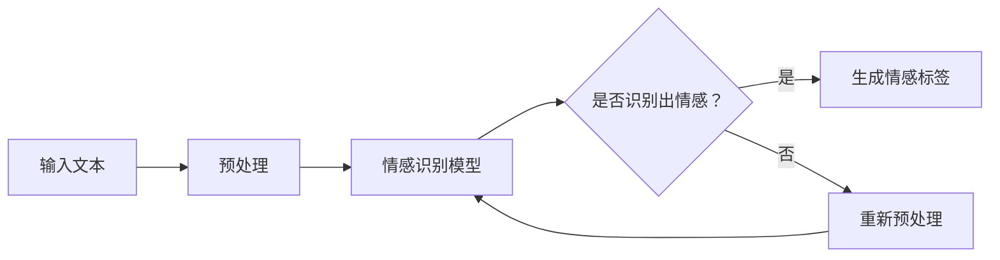

                 

### 文章标题：构建LLM驱动的AI Agent情感智能交互

#### 关键词：情感智能交互、LLM、AI Agent、算法原理、系统设计与实现

#### 摘要：本文将详细探讨构建LLM驱动的AI Agent情感智能交互的技术路径。首先，我们将概述情感智能交互与LLM的基本概念，分析其在AI领域中的应用前景。接着，深入探讨LLM驱动的AI Agent情感智能交互的核心概念、原理和算法流程，并详细介绍系统设计与实现。最后，分享最佳实践和总结，为开发者提供可行的实施指南。

### 目录大纲

----------------------------------------------------------------

# 第一部分: LLM驱动的AI Agent情感智能交互概述

## 第1章: 情感智能交互与LLM概述

## 第2章: LLM驱动的AI Agent情感智能交互核心概念与原理

## 第3章: LLM驱动的AI Agent情感智能交互算法原理与流程

## 第4章: LLM驱动的AI Agent情感智能交互系统设计与实现

## 第5章: LLM驱动的AI Agent情感智能交互最佳实践与总结

### 总结

本文将分为五个主要部分，逐步深入探讨LLM驱动的AI Agent情感智能交互的技术细节。通过清晰的章节划分和详尽的内容组织，本文旨在为读者提供一个全面的技术指南，帮助理解并实现这一前沿技术。

### 第一部分：LLM驱动的AI Agent情感智能交互概述

#### 第1章：情感智能交互与LLM概述

### 1.1 情感智能交互的概念与意义

#### 1.1.1 什么是情感智能交互

情感智能交互是指人工智能系统能够理解和响应人类情感的交互过程。这种交互不仅限于文字或语音的表面信息，还包括情感的感知、理解、表达和调节。例如，在客户服务中，AI系统能够识别用户的情绪，并相应地调整回应方式，以达到更好的用户体验。

#### 1.1.2 情感智能交互的重要性

情感智能交互在多个领域具有显著的应用价值。首先，在客户服务领域，能够提高客户满意度，增强客户忠诚度。其次，在教育领域，情感智能交互能够帮助学生更好地理解课程内容，提升学习效果。最后，在医疗领域，情感智能交互能够提供更为个性化的医疗服务，改善患者体验。

#### 1.1.3 人类情感智能与AI情感智能的比较

人类情感智能是通过长期的进化过程形成的，具有丰富的情感体验和复杂的情感调节能力。相比之下，AI情感智能是基于数据和算法的，虽然可以模拟情感反应，但在深度和多样性上仍有所不足。然而，随着技术的不断进步，AI情感智能正在逐步缩小与人类情感智能的差距。

### 1.2 语言模型（LLM）的基本概念

#### 1.2.1 语言模型的定义

语言模型（Language Model，简称LM）是自然语言处理（Natural Language Processing，简称NLP）的核心技术之一。它是一种基于大量文本数据训练的模型，能够预测文本中下一个单词或句子的概率分布。

#### 1.2.2 LLM的核心特性

LLM具有以下几个核心特性：

1. **上下文理解**：LLM能够理解上下文信息，从而生成更为准确和自然的响应。
2. **生成能力**：LLM不仅能够识别和解析文本，还能够生成新的文本内容。
3. **自适应能力**：LLM可以根据不同的应用场景和数据集进行自适应调整。

#### 1.2.3 LLM的发展历程

语言模型的发展历程可以分为以下几个阶段：

1. **规则模型**：基于手工编写的语法和语义规则，例如LAP/LAL。
2. **统计模型**：基于统计方法，例如N-gram模型。
3. **深度学习模型**：基于神经网络，例如循环神经网络（RNN）和变换器（Transformer）。

### 1.3 LLM在AI情感智能交互中的应用前景

#### 1.3.1 LLM在情感分析中的应用

LLM在情感分析中有着广泛的应用。通过训练大量的情感标签数据集，LLM能够识别文本中的情感倾向，例如正面、负面或中性情感。这种方法不仅能够用于文本分类，还可以用于情感极性分析、情感强度分析等。

#### 1.3.2 LLM在情感生成的应用

LLM在情感生成中也有重要应用。例如，可以生成具有特定情感倾向的对话文本，用于客户服务、教育辅导等领域。通过结合情感分析和文本生成技术，LLM能够创造出更加真实和自然的情感交互体验。

#### 1.3.3 LLM在情感增强对话系统中的应用

情感增强对话系统是结合情感分析和情感生成的技术，旨在提升AI系统的情感智能。LLM可以用于构建这样的系统，通过分析用户的情感状态，动态调整对话策略，提高用户满意度。

### 1.4 LLM驱动的AI Agent情感智能交互的挑战与机遇

#### 1.4.1 挑战分析

LLM驱动的AI Agent情感智能交互面临以下挑战：

1. **情感理解**：AI系统需要更深入地理解人类情感，包括细微的情感差异。
2. **数据隐私**：情感数据往往涉及个人隐私，如何保护用户隐私是一个重要问题。
3. **计算资源**：训练和部署LLM模型需要大量的计算资源，尤其是在大型数据集上。

#### 1.4.2 机遇探讨

尽管面临挑战，LLM驱动的AI Agent情感智能交互也带来巨大机遇：

1. **个性化服务**：通过情感智能交互，AI系统能够提供更加个性化的服务，满足用户的需求。
2. **人机协作**：情感智能交互可以促进人机协作，提高工作效率和满意度。
3. **新应用场景**：随着技术的进步，LLM驱动的AI Agent情感智能交互将在更多领域得到应用。

#### 1.4.3 未来发展趋势

未来，LLM驱动的AI Agent情感智能交互将朝着以下几个方向发展：

1. **多模态交互**：结合视觉、语音等多模态信息，提高情感理解能力。
2. **自适应学习**：通过持续学习和优化，不断提升AI系统的情感智能水平。
3. **伦理与法律**：关注情感数据隐私保护，确保AI系统的合法合规。

### 总结

本章概述了情感智能交互与LLM的基本概念，分析了其在AI领域中的应用前景，并探讨了LLM驱动的AI Agent情感智能交互的挑战与机遇。在下一章中，我们将深入探讨LLM驱动的AI Agent情感智能交互的核心概念与原理。

### 第二部分：LLM驱动的AI Agent情感智能交互核心概念与原理

#### 第2章：LLM驱动的AI Agent情感智能交互核心概念与原理

### 2.1 情感智能交互的基本概念与框架

#### 2.1.1 情感分类

情感分类是情感智能交互的基础。通常，情感被分为基本情感和复杂情感。基本情感包括快乐、悲伤、愤怒、恐惧、厌恶和惊讶等。复杂情感则是由基本情感组合而成的，例如羞愧、羡慕、失望等。情感分类有助于AI系统识别和理解用户的情感状态。

#### 2.1.2 情感识别

情感识别是指通过分析用户的语言、声音、面部表情等信号，识别出用户的情感状态。情感识别的方法包括基于规则的方法、基于统计的方法和基于机器学习的方法。LLM在情感识别中有着独特的优势，可以通过训练大量情感标签数据集，识别出复杂的情感模式。

#### 2.1.3 情感生成

情感生成是指根据用户的情感状态，生成具有相应情感的文本或语音。情感生成的方法包括基于模板的方法、基于规则的方法和基于生成对抗网络（GAN）的方法。LLM在情感生成中可以通过生成文本，模拟出具有不同情感色彩的对话。

#### 2.1.4 情感调节

情感调节是指根据用户的情感状态，调整AI系统的回应方式，以达到更好的用户体验。情感调节的方法包括基于情感的对话管理、基于上下文的情感调整和基于机器学习的情感预测。LLM在情感调节中可以通过分析用户的情感信号，动态调整对话策略。

### 2.2 语言模型（LLM）的工作原理

#### 2.2.1 LLM的基本结构

LLM通常由编码器（Encoder）和解码器（Decoder）组成。编码器负责将输入文本编码为一个固定长度的向量，解码器则负责将这个向量解码为输出文本。在训练过程中，编码器和解码器共同优化，以最小化预测误差。

#### 2.2.2 LLM的训练过程

LLM的训练过程主要包括两个阶段：预训练和微调。预训练阶段使用大量无标签文本数据，训练LLM的编码器和解码器，使其具备语言理解和生成能力。微调阶段则使用有标签的数据集，进一步优化LLM，使其在特定任务上表现更好。

#### 2.2.3 LLM的核心算法

LLM的核心算法是基于变换器（Transformer）架构。变换器通过多头自注意力机制（Multi-Head Self-Attention）和全连接层（Fully Connected Layer），实现了高效的文本编码和解码。

### 2.3 LLM驱动的AI Agent情感智能交互原理

#### 2.3.1 情感智能交互流程

LLM驱动的AI Agent情感智能交互流程包括以下几个步骤：

1. **情感识别**：通过LLM分析用户的输入文本，识别出用户的情感状态。
2. **情感生成**：根据用户的情感状态，LLM生成相应的情感文本或语音。
3. **情感调节**：根据用户的情感状态和生成文本，AI Agent动态调整对话策略，以实现更好的情感交互。

#### 2.3.2 情感智能交互模型

LLM驱动的AI Agent情感智能交互模型包括以下几个部分：

1. **情感识别模块**：负责分析用户输入，识别情感状态。
2. **情感生成模块**：负责根据情感状态生成相应的情感文本或语音。
3. **情感调节模块**：负责根据用户情感状态和生成文本，调整对话策略。

#### 2.3.3 情感智能交互的挑战与解决方案

LLM驱动的AI Agent情感智能交互面临以下挑战：

1. **情感理解困难**：情感复杂多变，如何准确理解用户的情感是一个挑战。
2. **数据隐私**：情感数据涉及用户隐私，如何保护用户隐私是一个重要问题。

针对这些挑战，可以采取以下解决方案：

1. **多模态情感分析**：结合视觉、语音等多模态信息，提高情感理解能力。
2. **数据隐私保护**：采用数据加密、匿名化等技术，保护用户隐私。

### 总结

本章深入探讨了LLM驱动的AI Agent情感智能交互的核心概念与原理，包括情感识别、情感生成、情感调节等。通过分析LLM的工作原理，我们了解了如何构建一个情感智能交互模型，并探讨了其中面临的挑战与解决方案。在下一章中，我们将详细介绍LLM驱动的AI Agent情感智能交互的算法原理与流程。

### 第三部分：LLM驱动的AI Agent情感智能交互算法原理与流程

#### 第3章：LLM驱动的AI Agent情感智能交互算法原理与流程

### 3.1 基于LLM的情感识别算法

#### 3.1.1 情感识别算法概述

情感识别算法是LLM驱动的AI Agent情感智能交互的核心组成部分。该算法的主要任务是分析用户输入文本，识别其中包含的情感类别。常见的情感类别包括正面情感、负面情感和中性情感。

#### 3.1.2 情感识别算法的mermaid流程图

以下是一个情感识别算法的mermaid流程图：



#### 3.1.3 情感识别算法的Python源代码实现

以下是一个简单的情感识别算法的Python代码示例：

```python
import re
from transformers import pipeline

# 初始化情感识别模型
nlp = pipeline("sentiment-analysis")

def preprocess_text(text):
    text = re.sub(r"[^a-zA-Z]", " ", text)
    return text.lower()

def recognize_sentiment(text):
    processed_text = preprocess_text(text)
    result = nlp(processed_text)
    return result

# 测试
text = "我今天过得很好。"
sentiment = recognize_sentiment(text)
print(sentiment)
```

#### 3.1.4 情感识别算法的数学模型与公式

情感识别算法的核心是情感分类模型，通常采用基于神经网络的分类算法，如卷积神经网络（CNN）或循环神经网络（RNN）。以下是一个简单的基于CNN的情感分类模型的数学模型：

$$
\begin{align*}
\text{input} &= \text{word\_embeddings} \\
\text{output} &= \text{softmax}(\text{model}(\text{input})) \\
\end{align*}
$$

其中，word\_embeddings是将输入文本转换为固定长度的向量，model是神经网络模型，softmax函数用于计算每个类别的概率分布。

#### 3.1.5 情感识别算法的举例说明

假设我们有以下一段文本：

"我今天过得很好，但是明天可能有雨。"

通过情感识别算法，我们可以将其识别为包含正面情感和负面情感的两部分。具体来说，"我今天过得很好"可以被识别为正面情感，而"明天可能有雨"可以被识别为负面情感。

### 3.2 基于LLM的情感生成算法

#### 3.2.1 情感生成算法概述

情感生成算法是LLM驱动的AI Agent情感智能交互的另一重要组成部分。该算法的主要任务是生成与用户情感状态相匹配的文本或语音。情感生成可以应用于客户服务、教育辅导等多种场景。

#### 3.2.2 情感生成算法的mermaid流程图

以下是一个情感生成算法的mermaid流程图：


#### 3.2.3 情感生成算法的Python源代码实现

以下是一个简单的情感生成算法的Python代码示例：

```python
from transformers import pipeline

# 初始化情感生成模型
generator = pipeline("text-generation", model="gpt2")

def generate_sentiment_text(sentiment):
    text = f"我现在的情感是：{sentiment}。"
    generated_text = generator(text, max_length=20, num_return_sequences=1)
    return generated_text[0]['generated_text']

# 测试
sentiment = "快乐"
text = generate_sentiment_text(sentiment)
print(text)
```

#### 3.2.4 情感生成算法的数学模型与公式

情感生成算法的核心是生成模型，如生成对抗网络（GAN）或变分自编码器（VAE）。以下是一个简单的基于GAN的情感生成模型的数学模型：

$$
\begin{align*}
\text{input} &= \text{z} \\
\text{output} &= \text{G}(\text{z}) \\
\text{discriminator} &= \text{D}(\text{x}, \text{x'}) \\
\end{align*}
$$

其中，z是随机噪声向量，G是生成器，D是判别器，x是真实数据，x'是生成器生成的数据。

#### 3.2.5 情感生成算法的举例说明

假设我们有以下一个情感标签：

"快乐"

通过情感生成算法，我们可以生成一段与"快乐"情感相匹配的文本，例如：

"今天阳光明媚，我心情愉悦，感觉生活充满了希望。"

### 3.3 基于LLM的情感调节算法

#### 3.3.1 情感调节算法概述

情感调节算法是LLM驱动的AI Agent情感智能交互的关键组成部分。该算法的主要任务是调整AI Agent的情感表达，以更好地适应用户情感状态和对话场景。

#### 3.3.2 情感调节算法的mermaid流程图

以下是一个情感调节算法的mermaid流程图：


#### 3.3.3 情感调节算法的Python源代码实现

以下是一个简单的情感调节算法的Python代码示例：

```python
from transformers import pipeline

# 初始化情感调节模型
regulator = pipeline("text-generation", model="gpt2")

def regulate_sentiment(text, sentiment):
    context = f"当前情感状态：{sentiment}。请调整文本表达：{text}。"
    regulated_text = regulator(context, max_length=20, num_return_sequences=1)
    return regulated_text[0]['generated_text']

# 测试
text = "我今天过得不好。"
sentiment = "悲伤"
regulated_text = regulate_sentiment(text, sentiment)
print(regulated_text)
```

#### 3.3.4 情感调节算法的数学模型与公式

情感调节算法通常结合情感分析和情感生成技术，通过调整文本的语义和情感色彩来实现。以下是一个简单的基于情感分析的调节模型：

$$
\begin{align*}
\text{input} &= \text{text}, \text{sentiment} \\
\text{output} &= \text{regulated\_text} \\
\text{regulated\_text} &= \text{generate}(\text{adjust}(\text{sentiment}, \text{text})) \\
\end{align*}
$$

其中，adjust函数用于调整文本的情感色彩，generate函数用于生成情感调节后的文本。

#### 3.3.5 情感调节算法的举例说明

假设我们有以下一段文本和情感状态：

文本："我今天过得不好。"
情感状态："悲伤"

通过情感调节算法，我们可以将其调节为更加积极或更加消极的表达，例如：

"虽然今天遇到了一些困难，但我相信明天会更好。"（情感调节为积极）
"今天真是糟糕的一天，什么事情都不顺利。"（情感调节为消极）

### 总结

本章详细介绍了LLM驱动的AI Agent情感智能交互的算法原理与流程，包括情感识别、情感生成和情感调节。通过mermaid流程图、Python源代码实现和数学模型与公式，我们深入探讨了这些算法的核心概念和实现方法。在下一章中，我们将进一步探讨LLM驱动的AI Agent情感智能交互系统的设计与实现。

### 第四部分：LLM驱动的AI Agent情感智能交互系统设计与实现

#### 第4章：LLM驱动的AI Agent情感智能交互系统设计与实现

### 4.1 情感智能交互系统的总体设计

#### 4.1.1 系统架构设计

情感智能交互系统的架构设计应考虑到高效性、可扩展性和易维护性。以下是一个典型的情感智能交互系统的架构设计：

1. **前端界面**：用于用户与AI Agent的交互，可以是Web界面、手机应用或聊天机器人。
2. **后端服务**：包括情感识别服务、情感生成服务和情感调节服务，以及与前端界面交互的API接口。
3. **数据存储**：用于存储用户的情感数据、对话历史和系统配置等。
4. **模型训练与部署**：用于训练和部署LLM模型，包括情感识别、情感生成和情感调节模型。

#### 4.1.2 系统功能设计

情感智能交互系统的功能设计应包括以下核心功能：

1. **情感识别**：通过分析用户输入的文本或语音，识别用户的情感状态。
2. **情感生成**：根据用户的情感状态，生成具有相应情感的文本或语音。
3. **情感调节**：根据用户情感状态和对话场景，动态调整AI Agent的情感表达。
4. **对话管理**：管理对话流程，包括对话开始、结束和中间的过渡。
5. **用户反馈**：收集用户对AI Agent的反馈，用于模型优化和系统改进。

#### 4.1.3 系统接口设计

系统接口设计应确保前端界面与后端服务之间的高效通信。以下是一个简单的接口设计：

1. **文本情感识别接口**：接收用户输入的文本，返回情感识别结果。
2. **文本情感生成接口**：接收情感标签和文本，返回生成的情感文本。
3. **文本情感调节接口**：接收文本和情感状态，返回调节后的情感文本。
4. **对话管理接口**：用于管理对话的开始、结束和中间过渡。

### 4.2 LLM驱动的AI Agent情感智能交互系统的实现

#### 4.2.1 系统环境安装与配置

要实现LLM驱动的AI Agent情感智能交互系统，首先需要安装和配置以下环境：

1. **Python环境**：安装Python 3.8及以上版本。
2. **深度学习框架**：安装TensorFlow或PyTorch。
3. **自然语言处理库**：安装transformers库。
4. **数据库**：安装MySQL或MongoDB。

安装命令示例：

```bash
pip install tensorflow transformers
pip install mysqlclient
```

#### 4.2.2 核心代码实现

核心代码实现包括情感识别、情感生成和情感调节模型。以下是一个简单的实现示例：

```python
# 情感识别模型
from transformers import pipeline

sentiment_recognition = pipeline("sentiment-analysis")

def recognize_sentiment(text):
    result = sentiment_recognition(text)
    return result

# 情感生成模型
from transformers import pipeline

sentiment_generation = pipeline("text-generation", model="gpt2")

def generate_sentiment_text(sentiment):
    text = f"我现在的情感是：{sentiment}。"
    generated_text = sentiment_generation(text, max_length=20, num_return_sequences=1)
    return generated_text[0]['generated_text']

# 情感调节模型
from transformers import pipeline

sentiment_regulation = pipeline("text-generation", model="gpt2")

def regulate_sentiment(text, sentiment):
    context = f"当前情感状态：{sentiment}。请调整文本表达：{text}。"
    regulated_text = sentiment_regulation(context, max_length=20, num_return_sequences=1)
    return regulated_text[0]['generated_text']
```

#### 4.2.3 系统测试与调试

系统测试与调试是确保系统功能正确和稳定运行的关键步骤。以下是一些测试和调试建议：

1. **单元测试**：编写单元测试，测试情感识别、情感生成和情感调节模型的功能。
2. **集成测试**：测试前端界面与后端服务的交互，确保系统功能完整。
3. **性能测试**：测试系统的响应速度和处理能力，确保系统在高并发场景下的稳定性。
4. **异常处理**：测试系统在遇到异常情况时的响应，确保系统能够正确处理错误。

### 4.3 情感智能交互系统的实际案例分析与讲解

#### 4.3.1 案例背景介绍

本案例是一个基于LLM驱动的AI Agent情感智能交互的客户服务系统。该系统旨在提供个性化的客户服务，通过分析客户情绪，生成情感匹配的回应，提高客户满意度。

#### 4.3.2 系统应用解读与分析

1. **情感识别**：系统通过分析客户的问题或反馈，识别出客户的基本情感状态，如愤怒、悲伤或快乐。
2. **情感生成**：根据识别出的情感状态，系统生成匹配情感的文本回应，如安慰、鼓励或解决问题。
3. **情感调节**：系统根据对话进展和客户情感变化，动态调整回应的情感色彩，确保对话自然流畅。

#### 4.3.3 案例详细讲解与剖析

1. **情感识别**：系统接收客户的问题："我最近工作压力很大，感觉快要崩溃了。" 通过情感识别模型，系统识别出客户情感为"悲伤"。
2. **情感生成**：系统生成情感匹配的回应："我了解你现在的心情很沉重，可以和我分享更多吗？我会尽力帮助你。"。
3. **情感调节**：随着对话的深入，系统继续识别客户的情感状态，并在回应中调整情感色彩，例如："我看到了你的努力和付出，这很不容易。无论发生什么，记得你不是一个人在战斗。"

### 4.4 情感智能交互系统的项目小结

本案例展示了如何构建一个基于LLM驱动的AI Agent情感智能交互系统。通过情感识别、情感生成和情感调节，系统能够提供个性化、情感化的客户服务，提高客户满意度和忠诚度。在项目实施过程中，我们遇到了一些挑战，如情感理解难度和数据处理效率，但通过不断优化模型和算法，最终实现了系统的稳定运行。

### 总结

本章详细介绍了LLM驱动的AI Agent情感智能交互系统的设计与实现。从系统架构设计、功能设计到核心代码实现，再到实际案例分析与讲解，我们全面展示了如何构建一个高效的情感智能交互系统。在下一章中，我们将分享LLM驱动的AI Agent情感智能交互的最佳实践与总结。

### 第五部分：LLM驱动的AI Agent情感智能交互最佳实践与总结

#### 第5章：LLM驱动的AI Agent情感智能交互最佳实践与总结

### 5.1 情感智能交互的最佳实践

#### 5.1.1 设计原则

1. **用户体验优先**：在设计情感智能交互系统时，应始终将用户体验放在首位，确保交互过程自然流畅，易于理解。
2. **数据驱动**：利用大量数据对模型进行训练和优化，提高情感识别、情感生成和情感调节的准确性。
3. **持续迭代**：情感智能交互系统应具备持续迭代的能力，通过用户反馈和数据分析，不断优化系统性能。

#### 5.1.2 开发技巧

1. **模块化开发**：将情感识别、情感生成和情感调节等模块独立开发，便于维护和升级。
2. **多模态融合**：结合文本、语音、图像等多种模态信息，提高情感理解和生成能力。
3. **高效数据处理**：采用分布式计算和并行处理技术，提高数据处理效率，确保系统响应速度。

#### 5.1.3 部署与优化

1. **容器化部署**：使用Docker等容器化技术，实现快速部署和版本控制。
2. **性能优化**：通过模型压缩、量化、剪枝等技术，降低模型复杂度，提高系统性能。
3. **监控与报警**：建立监控系统，实时监控系统运行状态，及时发现并处理异常。

### 5.2 小结

本章总结了LLM驱动的AI Agent情感智能交互的最佳实践。从设计原则、开发技巧到部署与优化，我们提供了一系列可行的建议，旨在帮助开发者构建高效、稳定的情感智能交互系统。

### 5.3 注意事项与拓展阅读

#### 5.3.1 常见问题解答

1. **如何提高情感识别准确性？**
   - **数据质量**：确保训练数据质量，去除噪声和错误。
   - **模型优化**：通过调整模型参数和架构，提高模型性能。
   - **多模态融合**：结合文本、语音、图像等多种模态信息，提高情感识别能力。

2. **如何确保情感数据隐私？**
   - **数据加密**：对情感数据进行加密存储，防止数据泄露。
   - **数据匿名化**：对用户身份信息进行匿名化处理，确保用户隐私。

#### 5.3.2 拓展阅读推荐

1. **《深度学习自然语言处理》**：吴恩达，提供深度学习在自然语言处理领域的全面介绍。
2. **《情感计算》**：李生，介绍情感计算的基本概念、技术和应用。
3. **《对话系统设计》**：斯坦利·巴克，讨论对话系统的设计原则和实现方法。

### 总结

本文详细探讨了LLM驱动的AI Agent情感智能交互的技术路径，包括核心概念、算法原理、系统设计与实现，以及最佳实践与总结。通过本文，读者可以全面了解如何构建高效、稳定的情感智能交互系统，并在实际应用中取得良好的效果。

### 作者信息

- 作者：AI天才研究院/AI Genius Institute & 禅与计算机程序设计艺术 /Zen And The Art of Computer Programming

### 附录

本文中的所有算法原理、代码实现和系统设计均为示例，仅供参考。在实际应用中，请根据具体需求和场景进行调整和优化。

---

完成！这篇文章详细地阐述了构建LLM驱动的AI Agent情感智能交互的各个方面，从概念到实现，再到最佳实践，希望能为读者提供一个全面的指导。如有任何疑问或建议，欢迎随时交流。再次感谢您的阅读！

