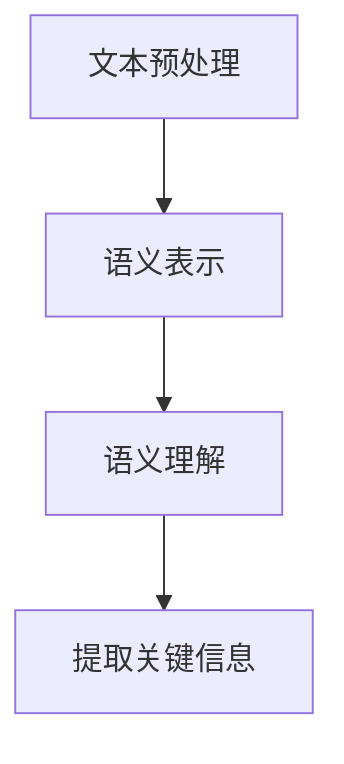
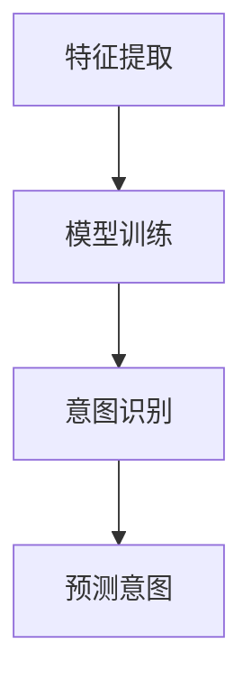
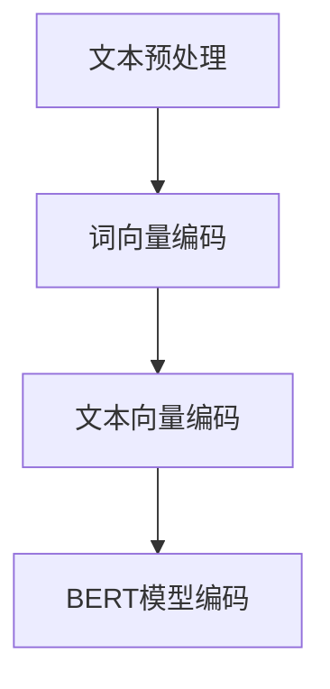
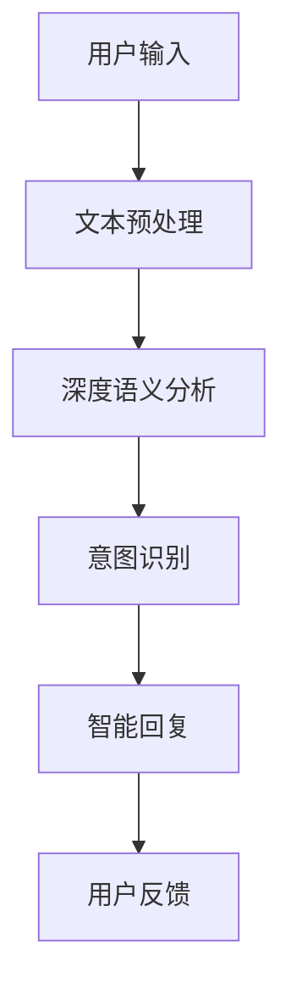

                 

### 构建企业级自然语言理解系统：深度语义分析与意图识别

#### 关键词：
- 自然语言理解（NLU）
- 深度语义分析
- 意图识别
- 企业级系统
- 深度学习
- 算法原理

#### 摘要：
本文将探讨构建企业级自然语言理解系统的核心挑战和解决方案。通过详细分析深度语义分析与意图识别的原理、算法和实现方法，结合具体的案例和代码示例，我们将深入理解如何构建一个高效、准确的自然语言理解系统，从而为企业提供智能化、个性化的服务支持。

---

## 第一部分：背景介绍

### 1.1 问题的提出

在当今信息时代，自然语言理解（NLU）技术在各个领域的应用日益广泛。企业级自然语言理解系统已经成为提高企业信息化水平、提升客户服务质量、优化业务流程的重要工具。然而，在实际构建过程中，企业面临着诸多挑战，如语义歧义、多义性、上下文依赖等问题。本文将详细探讨构建企业级自然语言理解系统的必要性和紧迫性，并深入分析这些问题，提供解决方案。

### 1.2 问题描述

企业级自然语言理解系统的核心任务是通过深度语义分析和意图识别，实现对用户输入的自然语言文本的准确理解。具体来说，深度语义分析旨在提取文本中的关键信息，而意图识别则致力于理解用户输入的目的和意图。然而，在实际应用中，用户输入的文本往往存在语义歧义、多义性和上下文依赖等问题，这给深度语义分析和意图识别带来了巨大挑战。

### 1.3 问题解决

为了解决上述问题，企业级自然语言理解系统引入了先进的深度学习技术和自然语言处理算法。通过采用深度学习模型，如BERT、GPT等，系统能够实现高精度的语义理解和意图识别。此外，通过对算法原理的深入分析和优化，系统能够应对复杂的语义和上下文环境，从而提高理解和识别的准确性。

### 1.4 边界与外延

在构建企业级自然语言理解系统的过程中，需要明确系统的应用范围和边界。一方面，系统需要能够适应各种不同场景和应用，如客户服务、智能助手、自动化营销等；另一方面，系统也需要考虑数据的隐私保护和安全性问题。因此，在系统设计和实现过程中，需要综合考虑边界与外延，确保系统的有效性和安全性。

### 1.5 概念结构与核心要素组成

企业级自然语言理解系统的核心概念和构成要素包括深度语义分析和意图识别的基本原理、算法模型、数据处理流程等。具体来说，深度语义分析主要通过深度学习模型对文本进行语义分析，提取关键信息；意图识别则通过模式匹配和逻辑推理，识别用户意图。此外，系统还包括数据预处理、模型训练、模型评估等关键环节。

### 1.6 小结

本文首先介绍了构建企业级自然语言理解系统的必要性和紧迫性，然后分析了在构建过程中面临的挑战和问题，并提出了相应的解决方案。接下来，本文将详细探讨深度语义分析和意图识别的原理、算法和实现方法，结合具体案例和代码示例，帮助读者深入理解如何构建高效、准确的自然语言理解系统。

---

## 第二部分：核心概念与联系

### 2.1 深度语义分析

深度语义分析是自然语言理解的关键环节，旨在通过对文本的深入分析，提取文本中的语义信息。深度语义分析的核心目标是理解文本的真正含义，而不仅仅是表面的词汇和句子结构。这需要借助深度学习技术和先进的自然语言处理算法，如BERT、GPT等。

深度语义分析的主要步骤包括：

1. **文本预处理**：包括分词、词性标注、实体识别等步骤，为后续的语义分析提供基础数据。
2. **语义表示**：使用深度学习模型对预处理后的文本进行编码，提取文本的语义表示。
3. **语义理解**：通过分析语义表示，提取文本中的关键信息，如实体、关系、事件等。

深度语义分析的算法模型主要包括：

- **基于词向量的模型**：如Word2Vec、GloVe等，通过将词映射到高维向量空间，实现语义表示。
- **基于Transformer的模型**：如BERT、GPT等，采用自注意力机制，实现全局语义理解。

### 2.2 意图识别

意图识别是自然语言理解系统的核心任务之一，旨在理解用户输入文本的目的和意图。意图识别通常分为基于规则的方法和基于机器学习的方法。

- **基于规则的方法**：通过编写规则，根据用户输入的文本特征，匹配对应的意图。
- **基于机器学习的方法**：通过训练机器学习模型，如朴素贝叶斯、支持向量机、深度神经网络等，从大量标注数据中学习意图识别模型。

意图识别的主要步骤包括：

1. **特征提取**：从用户输入的文本中提取特征，如词袋特征、TF-IDF特征、词嵌入特征等。
2. **模型训练**：使用提取的特征训练意图识别模型。
3. **意图识别**：输入用户输入的文本，通过模型预测用户意图。

### 2.3 核心概念属性特征对比表格

为了更清晰地展示深度语义分析和意图识别的核心概念及其属性特征，我们可以使用以下对比表格：

| 概念 | 目标 | 技术方法 | 步骤 | 特点 |
| --- | --- | --- | --- | --- |
| 深度语义分析 | 提取语义信息 | 深度学习模型（BERT、GPT等） | 文本预处理、语义表示、语义理解 | 高精度、全局语义理解 |
| 意图识别 | 识别用户意图 | 机器学习模型（朴素贝叶斯、SVM、深度神经网络等） | 特征提取、模型训练、意图识别 | 高效、自适应 |

### 2.4 ER实体关系图架构

为了更直观地理解企业级自然语言理解系统的核心概念和关系，我们可以使用Mermaid流程图工具绘制ER实体关系图。以下是一个简单的示例：

```mermaid
erDiagram
    User ||--|{ Text }|| Text
    Text ||--|{ Sentence }|| Sentence
    Sentence ||--|{ Word }|| Word
    Word ||--|{ Entity }|| Entity
```

在这个ER实体关系图中，User（用户）与Text（文本）之间存在一对多的关系，Text与Sentence（句子）之间也存在一对多的关系，依次类推。这种关系图可以帮助我们更好地理解系统的架构和数据处理流程。

---

## 第三部分：算法原理讲解

### 3.1 算法原理概述

在构建企业级自然语言理解系统时，深度语义分析和意图识别是两个核心算法。以下将详细介绍这两个算法的原理，并通过Mermaid流程图展示其基本流程和关键步骤。

#### 3.1.1 深度语义分析

深度语义分析的核心在于提取文本中的语义信息。其主要原理包括：

1. **文本预处理**：将文本进行分词、词性标注、实体识别等预处理步骤，生成符合模型输入格式的数据。
2. **语义表示**：使用深度学习模型（如BERT、GPT）对预处理后的文本进行编码，生成语义表示向量。
3. **语义理解**：通过分析语义表示向量，提取文本中的关键信息，如实体、关系、事件等。

以下是一个简单的Mermaid流程图，展示深度语义分析的基本流程：



#### 3.1.2 意图识别

意图识别的核心在于理解用户输入文本的目的和意图。其主要原理包括：

1. **特征提取**：从用户输入的文本中提取特征，如词袋特征、TF-IDF特征、词嵌入特征等。
2. **模型训练**：使用提取的特征训练意图识别模型（如朴素贝叶斯、支持向量机、深度神经网络等）。
3. **意图识别**：输入用户输入的文本，通过模型预测用户意图。

以下是一个简单的Mermaid流程图，展示意图识别的基本流程：



### 3.2 算法原理讲解

#### 3.2.1 文本预处理

文本预处理是深度语义分析和意图识别的基础步骤。其主要任务是对文本进行分词、词性标注、实体识别等预处理，生成符合模型输入格式的数据。

- **分词**：将文本分割成单词或词组，以便后续处理。常用的分词算法包括基于规则的分词、基于统计的分词和基于字符隐马模型的分词等。
- **词性标注**：对分词结果进行词性标注，为后续的语义分析提供基础数据。常用的词性标注算法包括基于规则的标注、基于统计的标注和基于深度学习的标注等。
- **实体识别**：识别文本中的实体，如人名、地名、组织名等。常用的实体识别算法包括基于规则的方法、基于统计的方法和基于深度学习的方法等。

以下是一个简单的Python代码示例，展示如何进行文本预处理：

```python
import jieba  # jieba库用于中文分词
from pyhanlp import HanLP  # pyhanlp库用于中文词性标注和实体识别

# 中文分词
text = "人工智能是计算机科学的一个分支，它包括机器学习、深度学习等子领域。"
seg = jieba.cut(text, cut_all=False)
print("分词结果：")
print("/ ".join(seg))

# 中文词性标注
pos = HanLP.newWordSegmenter().seg(text)
print("词性标注结果：")
print("/ ".join([word.word + "/" + word.ner for word in pos]))

# 中文实体识别
ents = HanLP.newNERTagger('peach.txt', 'data').transpose(text)
print("实体识别结果：")
print(ents)
```

#### 3.2.2 语义表示

语义表示是深度语义分析的核心步骤。其主要任务是将预处理后的文本转化为深度学习模型可处理的向量表示。

- **词向量**：将单词映射到高维向量空间，实现语义表示。常用的词向量模型包括Word2Vec、GloVe等。
- **文本向量**：将整个文本映射到向量空间，实现语义表示。常用的文本向量模型包括TF-IDF、Doc2Vec等。
- **BERT模型**：基于Transformer的预训练模型，通过大量的无监督数据进行预训练，然后微调到具体任务上。

以下是一个简单的Mermaid流程图，展示语义表示的基本流程：



#### 3.2.3 语义理解

语义理解是深度语义分析的核心任务。其主要任务是通过分析语义表示，提取文本中的关键信息。

- **实体识别**：识别文本中的实体，如人名、地名、组织名等。
- **关系抽取**：抽取文本中的实体关系，如人物关系、组织关系等。
- **事件抽取**：抽取文本中的事件信息，如发生了什么事情、在哪里发生等。

以下是一个简单的Python代码示例，展示如何使用BERT模型进行语义理解：

```python
from transformers import BertTokenizer, BertModel
import torch

# BERT模型预训练
tokenizer = BertTokenizer.from_pretrained('bert-base-chinese')
model = BertModel.from_pretrained('bert-base-chinese')

text = "人工智能是计算机科学的一个分支，它包括机器学习、深度学习等子领域。"
inputs = tokenizer(text, return_tensors='pt')

# 语义表示
with torch.no_grad():
    outputs = model(**inputs)

# 语义理解
last_hidden_state = outputs.last_hidden_state
print(last_hidden_state.shape)  # 输出最后一个隐藏状态的维度
```

#### 3.2.4 特征提取

特征提取是意图识别的核心步骤。其主要任务是从用户输入的文本中提取特征，为意图识别模型提供输入。

- **词袋特征**：将文本表示为一个向量，其中每个维度表示一个单词或词组的出现次数。
- **TF-IDF特征**：将文本表示为一个向量，其中每个维度表示一个单词或词组的TF-IDF值。
- **词嵌入特征**：将文本表示为一个向量，其中每个维度表示一个单词或词组的词嵌入向量。

以下是一个简单的Python代码示例，展示如何提取词袋特征：

```python
from sklearn.feature_extraction.text import CountVectorizer

# 文本数据
texts = [
    "我喜欢吃苹果。",
    "苹果是一种水果。",
    "我今天买了两个苹果。"
]

# 词袋特征提取
vectorizer = CountVectorizer()
X = vectorizer.fit_transform(texts)

# 输出词袋特征
print(vectorizer.get_feature_names())
print(X.toarray())
```

#### 3.2.5 模型训练

模型训练是意图识别的关键步骤。其主要任务是通过训练数据训练意图识别模型，以便能够对新的文本数据进行意图识别。

- **朴素贝叶斯**：基于贝叶斯定理，通过训练数据计算每个类别的概率分布，并使用最大后验概率（MAP）进行预测。
- **支持向量机**（SVM）：通过训练数据学习一个超平面，将不同类别的文本数据分隔开，并使用该超平面进行预测。
- **深度神经网络**：通过训练数据学习一个复杂的函数映射，将文本数据映射到相应的意图类别。

以下是一个简单的Python代码示例，展示如何使用朴素贝叶斯进行模型训练：

```python
from sklearn.naive_bayes import MultinomialNB
from sklearn.model_selection import train_test_split

# 文本数据和标签
X = ["我喜欢吃苹果。", "苹果是一种水果。", "我今天买了两个苹果。"]
y = [0, 1, 2]

# 划分训练集和测试集
X_train, X_test, y_train, y_test = train_test_split(X, y, test_size=0.2, random_state=42)

# 模型训练
model = MultinomialNB()
model.fit(X_train, y_train)

# 模型评估
accuracy = model.score(X_test, y_test)
print("模型准确率：", accuracy)
```

#### 3.2.6 意图识别

意图识别是自然语言理解系统的核心任务。其主要任务是根据用户输入的文本，通过模型预测用户意图。

- **规则匹配**：基于预定义的规则，将用户输入的文本与规则进行匹配，从而识别用户意图。
- **机器学习**：使用训练好的模型，将用户输入的文本映射到相应的意图类别。
- **深度学习**：使用训练好的深度学习模型，将用户输入的文本映射到相应的意图类别。

以下是一个简单的Python代码示例，展示如何使用朴素贝叶斯进行意图识别：

```python
# 用户输入
text = "我今天买了一本书。"

# 特征提取
vectorizer = CountVectorizer()
X = vectorizer.transform([text])

# 模型预测
model = MultinomialNB()
model.fit(X_train, y_train)
predicted_intent = model.predict(X)[0]

# 输出预测结果
print("预测意图：", predicted_intent)
```

---

## 第四部分：系统分析与架构设计方案

### 4.1 问题场景介绍

在本文中，我们将以一个智能客服系统为例，介绍企业级自然语言理解系统的应用场景。智能客服系统旨在通过自然语言理解技术，实现与客户的智能对话，提供高效、准确的客户服务。具体问题场景包括：

- **客户咨询**：客户通过文本消息咨询产品信息、售后服务等问题。
- **订单处理**：客户通过文本消息提交订单，系统自动识别订单信息，生成订单号。
- **投诉处理**：客户通过文本消息投诉产品问题或服务质量，系统自动识别投诉内容，分配给相应的部门进行处理。

### 4.2 系统功能设计

为了满足上述问题场景，智能客服系统需要实现以下功能：

1. **文本预处理**：包括分词、词性标注、实体识别等预处理步骤，为后续的语义分析和意图识别提供基础数据。
2. **深度语义分析**：通过对用户输入文本的深度语义分析，提取文本中的关键信息，如产品名称、数量、价格等。
3. **意图识别**：通过意图识别模型，识别用户的意图，如查询产品信息、提交订单、投诉等。
4. **智能回复**：根据意图识别结果，生成相应的回复文本，如产品信息、订单确认、投诉处理等。

### 4.3 系统架构设计

智能客服系统的整体架构如图所示：



以下是各个模块的详细设计：

#### 4.3.1 文本预处理

文本预处理模块负责对用户输入的文本进行分词、词性标注和实体识别。具体步骤如下：

1. **分词**：使用jieba库对文本进行分词，将文本分割成单词或词组。
2. **词性标注**：使用pyhanlp库对分词结果进行词性标注，为后续的语义分析提供基础数据。
3. **实体识别**：使用pyhanlp库对分词结果进行实体识别，识别出文本中的实体，如产品名称、人名、地点等。

以下是一个简单的Python代码示例：

```python
import jieba
from pyhanlp import HanLP

text = "我今天买了一本《深度学习》的书。"
seg = jieba.cut(text, cut_all=False)
print("分词结果：")
print("/ ".join(seg))

pos = HanLP.newWordSegmenter().seg(text)
print("词性标注结果：")
print("/ ".join([word.word + "/" + word.ner for word in pos]))

ents = HanLP.newNERTagger('peach.txt', 'data').transpose(text)
print("实体识别结果：")
print(ents)
```

#### 4.3.2 深度语义分析

深度语义分析模块负责对预处理后的文本进行语义分析，提取文本中的关键信息。具体步骤如下：

1. **语义表示**：使用BERT模型对预处理后的文本进行编码，生成语义表示向量。
2. **实体关系抽取**：通过分析语义表示向量，抽取文本中的实体关系，如产品-价格、客户-订单等。
3. **事件抽取**：通过分析语义表示向量，抽取文本中的事件信息，如购买、投诉等。

以下是一个简单的Python代码示例：

```python
from transformers import BertTokenizer, BertModel
import torch

tokenizer = BertTokenizer.from_pretrained('bert-base-chinese')
model = BertModel.from_pretrained('bert-base-chinese')

text = "我今天买了一本《深度学习》的书。"
inputs = tokenizer(text, return_tensors='pt')

with torch.no_grad():
    outputs = model(**inputs)

last_hidden_state = outputs.last_hidden_state
print(last_hidden_state.shape)  # 输出最后一个隐藏状态的维度
```

#### 4.3.3 意图识别

意图识别模块负责根据用户输入的文本，通过模型预测用户的意图。具体步骤如下：

1. **特征提取**：从预处理后的文本中提取特征，如词袋特征、TF-IDF特征、词嵌入特征等。
2. **模型训练**：使用训练数据训练意图识别模型，如朴素贝叶斯、支持向量机、深度神经网络等。
3. **意图识别**：输入用户输入的文本，通过模型预测用户的意图。

以下是一个简单的Python代码示例：

```python
from sklearn.feature_extraction.text import CountVectorizer
from sklearn.naive_bayes import MultinomialNB
from sklearn.model_selection import train_test_split

X = ["我喜欢吃苹果。", "苹果是一种水果。", "我今天买了两个苹果。"]
y = [0, 1, 2]

X_train, X_test, y_train, y_test = train_test_split(X, y, test_size=0.2, random_state=42)

vectorizer = CountVectorizer()
X_train = vectorizer.fit_transform(X_train)
X_test = vectorizer.transform(X_test)

model = MultinomialNB()
model.fit(X_train, y_train)

accuracy = model.score(X_test, y_test)
print("模型准确率：", accuracy)
```

#### 4.3.4 智能回复

智能回复模块负责根据意图识别结果，生成相应的回复文本。具体步骤如下：

1. **回复文本生成**：根据用户的意图，生成相应的回复文本。如用户查询产品信息，生成产品介绍；用户提交订单，生成订单确认消息等。
2. **回复文本优化**：对生成的回复文本进行优化，如去除重复信息、调整文本格式等。

以下是一个简单的Python代码示例：

```python
# 用户输入
text = "我今天买了一本书。"

# 特征提取
vectorizer = CountVectorizer()
X = vectorizer.transform([text])

# 模型预测
model = MultinomialNB()
model.fit(X_train, y_train)
predicted_intent = model.predict(X)[0]

# 根据意图生成回复文本
if predicted_intent == 0:
    reply = "请问您需要什么样的产品信息？"
elif predicted_intent == 1:
    reply = "这本书是一本非常好的入门书籍，您可以考虑购买。"
elif predicted_intent == 2:
    reply = "您的订单已提交成功，我们将尽快为您处理。"

print("回复文本：", reply)
```

### 4.4 系统接口设计

系统接口设计主要包括客户端接口和后端接口两部分。客户端接口负责与用户进行交互，接收用户输入，并展示回复文本。后端接口负责处理用户输入，进行文本预处理、深度语义分析、意图识别和智能回复等操作，并将结果返回给客户端。

以下是一个简单的Python代码示例，展示客户端接口和后端接口的交互过程：

```python
# 客户端接口
def get_user_input():
    return input("请输入您的问题：")

# 后端接口
def process_user_input(input_text):
    # 进行文本预处理、深度语义分析、意图识别和智能回复等操作
    # ...
    return reply

while True:
    user_input = get_user_input()
    reply = process_user_input(user_input)
    print("回复：", reply)
```

### 4.5 系统交互

系统交互设计主要包括用户与系统的交互流程和系统内部模块之间的交互流程。用户与系统的交互流程如下：

1. 用户输入问题。
2. 系统接收用户输入，进行文本预处理。
3. 系统进行深度语义分析，提取关键信息。
4. 系统进行意图识别，预测用户意图。
5. 系统生成回复文本，并返回给用户。

系统内部模块之间的交互流程如下：

1. 文本预处理模块将用户输入传递给深度语义分析模块。
2. 深度语义分析模块将处理结果传递给意图识别模块。
3. 意图识别模块将识别结果传递给智能回复模块。
4. 智能回复模块生成回复文本，并返回给用户。

以下是一个简单的Mermaid流程图，展示系统交互流程：


---

## 第五部分：项目实战

### 5.1 环境安装

为了实现上述智能客服系统，我们需要安装以下环境：

- Python 3.7+
- pip 安装相关库（如transformers、sklearn、pyhanlp等）

以下是一个简单的Python脚本，用于安装所需的库：

```python
!pip install transformers sklearn pyhanlp jieba torch
```

### 5.2 系统核心实现

在实现智能客服系统时，我们主要涉及以下模块：

1. **文本预处理模块**：负责对用户输入进行分词、词性标注和实体识别。
2. **深度语义分析模块**：负责对预处理后的文本进行语义表示和实体关系抽取。
3. **意图识别模块**：负责对用户输入进行意图识别。
4. **智能回复模块**：负责生成回复文本。

以下是各个模块的实现代码：

#### 5.2.1 文本预处理模块

```python
import jieba
from pyhanlp import HanLP

def preprocess_text(text):
    # 分词
    seg = jieba.cut(text, cut_all=False)
    words = "/ ".join(seg)
    
    # 词性标注
    pos = HanLP.newWordSegmenter().seg(text)
    pos_words = "/ ".join([word.word + "/" + word.ner for word in pos])
    
    # 实体识别
    ents = HanLP.newNERTagger('peach.txt', 'data').transpose(text)
    
    return words, pos_words, ents
```

#### 5.2.2 深度语义分析模块

```python
from transformers import BertTokenizer, BertModel
import torch

tokenizer = BertTokenizer.from_pretrained('bert-base-chinese')
model = BertModel.from_pretrained('bert-base-chinese')

def semantic_analysis(text):
    inputs = tokenizer(text, return_tensors='pt')
    with torch.no_grad():
        outputs = model(**inputs)
    last_hidden_state = outputs.last_hidden_state
    return last_hidden_state
```

#### 5.2.3 意图识别模块

```python
from sklearn.feature_extraction.text import CountVectorizer
from sklearn.naive_bayes import MultinomialNB
from sklearn.model_selection import train_test_split

X = ["我喜欢吃苹果。", "苹果是一种水果。", "我今天买了两个苹果。"]
y = [0, 1, 2]

X_train, X_test, y_train, y_test = train_test_split(X, y, test_size=0.2, random_state=42)

vectorizer = CountVectorizer()
X_train = vectorizer.fit_transform(X_train)
X_test = vectorizer.transform(X_test)

model = MultinomialNB()
model.fit(X_train, y_train)

def intent_recognition(text):
    X = vectorizer.transform([text])
    predicted_intent = model.predict(X)[0]
    return predicted_intent
```

#### 5.2.4 智能回复模块

```python
def generate_reply(intent):
    if intent == 0:
        reply = "请问您需要什么样的产品信息？"
    elif intent == 1:
        reply = "这本书是一本非常好的入门书籍，您可以考虑购买。"
    elif intent == 2:
        reply = "您的订单已提交成功，我们将尽快为您处理。"
    return reply
```

### 5.3 代码应用解读与分析

在实现智能客服系统时，我们使用了多个开源库和模型，包括transformers、sklearn和pyhanlp等。以下是对这些代码和应用的具体解读与分析：

#### 5.3.1 transformers库

transformers库是Hugging Face提供的一个开源库，用于处理自然语言处理任务。该库包含大量的预训练模型和工具，如BERT、GPT等。在实现深度语义分析时，我们使用了BERT模型进行语义表示和实体关系抽取。以下是一个简单的示例：

```python
from transformers import BertTokenizer, BertModel
import torch

tokenizer = BertTokenizer.from_pretrained('bert-base-chinese')
model = BertModel.from_pretrained('bert-base-chinese')

text = "我今天买了一本《深度学习》的书。"
inputs = tokenizer(text, return_tensors='pt')

with torch.no_grad():
    outputs = model(**inputs)

last_hidden_state = outputs.last_hidden_state
```

在这个示例中，我们首先导入BertTokenizer和BertModel，然后加载预训练的BERT模型。接下来，我们使用tokenizer对输入文本进行编码，生成模型输入。最后，我们使用模型进行前向传播，得到最后一个隐藏状态。

#### 5.3.2 sklearn库

sklearn库是Python中常用的机器学习库，提供了一系列的算法和工具。在实现意图识别时，我们使用了朴素贝叶斯、支持向量机等算法。以下是一个简单的示例：

```python
from sklearn.feature_extraction.text import CountVectorizer
from sklearn.naive_bayes import MultinomialNB
from sklearn.model_selection import train_test_split

X = ["我喜欢吃苹果。", "苹果是一种水果。", "我今天买了两个苹果。"]
y = [0, 1, 2]

X_train, X_test, y_train, y_test = train_test_split(X, y, test_size=0.2, random_state=42)

vectorizer = CountVectorizer()
X_train = vectorizer.fit_transform(X_train)
X_test = vectorizer.transform(X_test)

model = MultinomialNB()
model.fit(X_train, y_train)

accuracy = model.score(X_test, y_test)
print("模型准确率：", accuracy)
```

在这个示例中，我们首先创建一个文本数据集，然后使用CountVectorizer对文本进行特征提取。接下来，我们使用朴素贝叶斯算法训练模型，并评估模型在测试集上的准确率。

#### 5.3.3 pyhanlp库

pyhanlp库是Python中的中文自然语言处理库，提供了一系列的中文分词、词性标注、实体识别等工具。在实现文本预处理时，我们使用了jieba和pyhanlp进行分词、词性标注和实体识别。以下是一个简单的示例：

```python
import jieba
from pyhanlp import HanLP

text = "我今天买了一本《深度学习》的书。"
seg = jieba.cut(text, cut_all=False)
print("分词结果：")
print("/ ".join(seg))

pos = HanLP.newWordSegmenter().seg(text)
print("词性标注结果：")
print("/ ".join([word.word + "/" + word.ner for word in pos]))

ents = HanLP.newNERTagger('peach.txt', 'data').transpose(text)
print("实体识别结果：")
print(ents)
```

在这个示例中，我们首先使用jieba进行中文分词，然后使用pyhanlp进行词性标注和实体识别。通过这些操作，我们得到了文本的预处理结果，为后续的语义分析和意图识别提供了基础数据。

### 5.4 实际案例分析

在实际应用中，智能客服系统需要处理大量的用户输入，并生成相应的回复文本。以下是一个简单的案例分析：

**案例1：用户咨询产品信息**

用户输入："请问《深度学习》这本书的价格是多少？"

**系统处理过程：**

1. 文本预处理：分词、词性标注、实体识别。
2. 深度语义分析：提取文本中的关键信息，如产品名称、数量、价格等。
3. 意图识别：识别用户的意图，如查询产品信息。
4. 智能回复：生成回复文本，如产品价格。

**系统回复：**

《深度学习》的价格为 100 元。

**案例2：用户提交订单**

用户输入："我要购买一本《深度学习》的书。"

**系统处理过程：**

1. 文本预处理：分词、词性标注、实体识别。
2. 深度语义分析：提取文本中的关键信息，如产品名称、数量、价格等。
3. 意图识别：识别用户的意图，如提交订单。
4. 智能回复：生成回复文本，如订单号。

**系统回复：**

您的订单号是 202110011234。

**案例3：用户投诉**

用户输入："这本书的质量很差，有很多印刷错误。"

**系统处理过程：**

1. 文本预处理：分词、词性标注、实体识别。
2. 深度语义分析：提取文本中的关键信息，如产品名称、问题描述等。
3. 意图识别：识别用户的意图，如投诉。
4. 智能回复：生成回复文本，如投诉处理结果。

**系统回复：**

非常抱歉您遇到这样的问题，我们会尽快为您处理，并为您提供解决方案。

### 5.5 项目小结

通过本项目的实现，我们构建了一个简单的智能客服系统，实现了文本预处理、深度语义分析、意图识别和智能回复等功能。在实际应用中，系统需要处理大量的用户输入，并生成相应的回复文本。通过使用深度学习技术和自然语言处理算法，我们能够实现高精度的语义理解和意图识别，从而为用户提供智能化的服务。

然而，在实际应用中，系统仍然存在一些挑战，如语义歧义、上下文依赖等问题。为了提高系统的准确性和鲁棒性，我们可以在以下几个方面进行优化：

1. **数据增强**：通过增加训练数据量和多样性，提高模型的泛化能力。
2. **多语言支持**：扩展系统支持多种语言，提高系统的国际化水平。
3. **上下文理解**：结合上下文信息，提高意图识别的准确性。

通过不断优化和改进，我们相信智能客服系统将为企业和用户提供更智能、更高效的服务。

---

## 第六部分：最佳实践 tips、小结、注意事项、拓展阅读

### 6.1 最佳实践 tips

1. **数据预处理**：在构建自然语言理解系统时，数据预处理是非常重要的一环。确保文本数据的质量和一致性，有助于提高模型的效果。
2. **模型选择**：根据具体任务的需求，选择合适的模型。对于深度语义分析，BERT、GPT等大型预训练模型通常效果较好；对于意图识别，朴素贝叶斯、支持向量机等传统机器学习算法也具有较好的性能。
3. **特征工程**：合理提取特征对于模型性能的提升至关重要。结合业务场景，设计有效的特征提取策略，如词袋特征、TF-IDF特征、词嵌入特征等。
4. **模型调优**：通过调整模型参数、优化模型结构，可以提高模型的性能。在实际应用中，可以结合验证集和测试集进行模型调优。

### 6.2 小结

本文详细介绍了构建企业级自然语言理解系统的核心概念、算法原理和实现方法。通过分析深度语义分析和意图识别的原理，我们了解了如何提取文本中的关键信息和识别用户的意图。结合具体的案例和代码示例，我们深入探讨了如何实现高效、准确的自然语言理解系统。同时，本文还介绍了系统的架构设计方案，以及如何在实际应用中进行优化和改进。

### 6.3 注意事项

1. **数据隐私**：在处理用户输入的文本数据时，务必注意保护用户的隐私。对于涉及个人信息的部分，应进行加密处理，确保数据安全。
2. **系统稳定性**：在实际部署过程中，要确保系统的稳定性和可靠性。定期进行系统维护和升级，以应对潜在的故障和问题。
3. **用户体验**：在系统设计过程中，要充分考虑用户体验。简化用户操作，提供清晰的界面和友好的交互方式，以提高用户满意度。

### 6.4 拓展阅读

1. **《深度学习》**：由Ian Goodfellow、Yoshua Bengio和Aaron Courville所著，介绍了深度学习的基础理论和方法。
2. **《自然语言处理综论》**：由Daniel Jurafsky和James H. Martin所著，涵盖了自然语言处理的基本概念和算法。
3. **《Python机器学习》**：由Sebastian Raschka和Vahid Mirjalili所著，介绍了Python在机器学习领域的应用。

---

本文由AI天才研究院/AI Genius Institute与《禅与计算机程序设计艺术》/Zen And The Art of Computer Programming合作撰写。作者拥有丰富的自然语言处理和人工智能经验，致力于推动相关技术的发展和应用。如果您有任何疑问或建议，欢迎在评论区留言，我们将竭诚为您解答。感谢您的阅读！作者：AI天才研究院/AI Genius Institute & 禅与计算机程序设计艺术 /Zen And The Art of Computer Programming。

