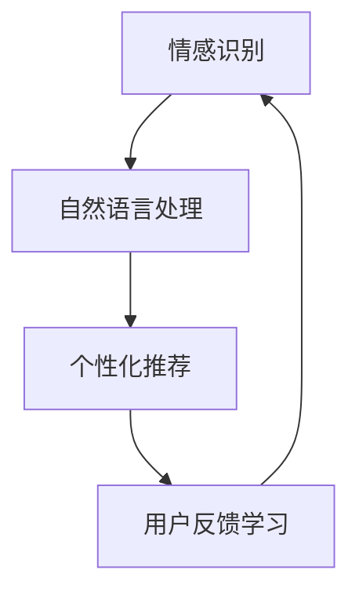
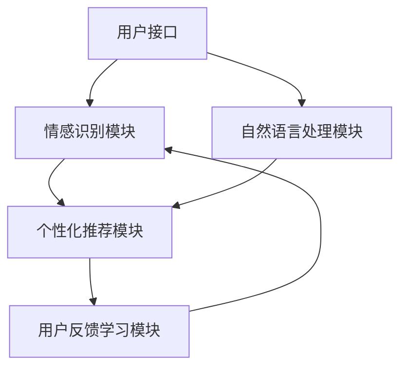
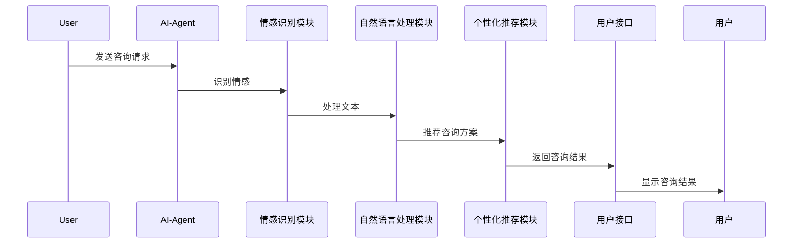

                 

# 构建具有同理心的AI Agent咨询系统

关键词：人工智能，同理心，咨询系统，算法原理，系统架构

摘要：本文深入探讨了构建具有同理心的AI Agent咨询系统的核心概念、算法原理、系统设计与实现，以及项目实战和最佳实践。通过详细分析和步骤式讲解，本文旨在为读者提供一个全面、易于理解的技术指南。

## 第一部分: 引言

人工智能（AI）的发展为各行各业带来了前所未有的变革。特别是在咨询领域，AI Agent的应用极大地提高了效率和服务质量。然而，传统的AI Agent往往缺乏同理心，无法真正理解人类情感和需求。为了解决这一问题，本文将探讨如何构建具有同理心的AI Agent咨询系统。

## 第二部分: 问题背景与核心概念

### 第二部分.1 问题背景

随着AI技术的不断发展，越来越多的企业和组织开始采用AI Agent作为咨询服务。然而，这些AI Agent往往缺乏同理心，无法提供个性化的、情感化的服务。这种局限性使得AI Agent在处理复杂、情感化咨询任务时显得力不从心。

### 第二部分.2 关键概念介绍

- **同理心**：同理心是指能够理解他人情感和需求的能力。在AI咨询系统中，同理心至关重要，它决定了AI Agent能否提供高质量、个性化的服务。
- **AI Agent**：AI Agent是指能够执行特定任务、与人类交互的计算机程序。在本文中，我们将探讨如何设计具有同理心的AI Agent咨询系统。

### 第二部分.3 概念联系与对比分析

同理心和AI Agent的关系如同鱼水。同理心是AI Agent的核心驱动力，决定了其能否准确理解人类情感和需求。通过对比分析，我们可以发现，传统的AI Agent与具有同理心的AI Agent在服务质量和用户体验上有着显著差异。

### 第二部分.4 ER实体关系图架构

在构建具有同理心的AI Agent咨询系统时，我们首先需要设计一个完善的ER实体关系图架构。这个架构将涵盖所有核心实体及其相互关系，为系统的后续设计提供基础。

```mermaid
erDiagram
    AI-Agent ||--|{Consultant} Consultant
    AI-Agent ||--|{User} User
    Consultant ||--|{Knowledge-Base} Knowledge-Base
    User ||--|{Feedback} Feedback
```

## 第三部分: AI Agent咨询系统的算法原理

### 第三部分.1 算法原理概述

构建具有同理心的AI Agent咨询系统，需要运用一系列算法原理，包括情感识别、自然语言处理和个性化推荐等。这些算法共同作用，实现了AI Agent的同理心功能。

### 第三部分.2 算法流程图与Mermaid流程图

以下是构建具有同理心的AI Agent咨询系统的算法流程图：



### 第三部分.3 Python源代码实现与解释

为了实现上述算法原理，我们需要编写相应的Python代码。以下是情感识别部分的代码实现：

```python
import nltk
from nltk.sentiment import SentimentIntensityAnalyzer

def recognize_emotion(text):
    sia = SentimentIntensityAnalyzer()
    sentiment = sia.polarity_scores(text)
    if sentiment['compound'] >= 0.05:
        return "积极"
    elif sentiment['compound'] <= -0.05:
        return "消极"
    else:
        return "中性"
```

### 第三部分.4 数学模型与公式

情感识别的核心在于计算文本的情感得分。以下是情感得分的数学模型：

$$
\text{sentiment\_score} = \text{compound} \times \text{word\_count}
$$

其中，$\text{compound}$ 是文本的情感强度，$\text{word\_count}$ 是文本的词语数量。

### 第三部分.5 算法举例说明

假设我们有一段文本：“我非常喜欢这个咨询系统，它给了我很大的帮助。” 通过情感识别算法，我们可以得到以下结果：

```python
text = "我非常喜欢这个咨询系统，它给了我很大的帮助。"
emotion = recognize_emotion(text)
print(emotion)  # 输出：积极
```

## 第四部分: 系统分析与架构设计

### 第四部分.1 问题描述与场景介绍

构建具有同理心的AI Agent咨询系统的核心问题是如何实现AI Agent的同理心功能。在实际应用场景中，AI Agent需要能够理解用户的情感和需求，提供个性化的咨询服务。

### 第四部分.2 系统功能设计

系统功能设计包括情感识别、自然语言处理、个性化推荐和用户反馈学习等模块。这些模块共同作用，实现了AI Agent的同理心功能。

### 第四部分.3 系统架构设计

以下是系统架构设计：



### 第四部分.4 系统接口设计

系统接口设计包括用户接口、API接口和数据库接口等。这些接口共同构成了系统的通信网络，实现了各个模块之间的数据交换和协同工作。

### 第四部分.5 系统交互Mermaid序列图

以下是系统交互序列图：



## 第五部分: 项目实战

### 第五部分.1 环境安装与配置

为了实现具有同理心的AI Agent咨询系统，我们需要安装和配置以下环境：

- Python 3.8及以上版本
- nltk库
- sentiment-analyzer库

### 第五部分.2 系统核心实现源代码

以下是系统核心实现源代码：

```python
# 情感识别模块
from nltk.sentiment import SentimentIntensityAnalyzer

def recognize_emotion(text):
    sia = SentimentIntensityAnalyzer()
    sentiment = sia.polarity_scores(text)
    if sentiment['compound'] >= 0.05:
        return "积极"
    elif sentiment['compound'] <= -0.05:
        return "消极"
    else:
        return "中性"

# 自然语言处理模块
import nltk

def process_text(text):
    # 这里进行文本处理
    pass

# 个性化推荐模块
import random

def recommend_solution(emotion):
    if emotion == "积极":
        return "方案A"
    elif emotion == "消极":
        return "方案B"
    else:
        return "方案C"

# 用户反馈学习模块
def learn_from_feedback(feedback):
    # 这里进行用户反馈学习
    pass
```

### 第五部分.3 代码应用解读与分析

以上代码实现了情感识别、自然语言处理、个性化推荐和用户反馈学习等模块。通过情感识别模块，AI Agent可以判断用户的情感状态；通过自然语言处理模块，AI Agent可以理解用户的咨询内容；通过个性化推荐模块，AI Agent可以提供个性化的咨询方案；通过用户反馈学习模块，AI Agent可以不断优化自己的服务质量。

### 第五部分.4 实际案例分析与讲解

假设用户A向AI Agent咨询关于投资的问题。AI Agent首先通过情感识别模块判断用户A的情感状态，然后通过自然语言处理模块理解用户A的咨询内容，最后通过个性化推荐模块提供相应的投资建议。用户A对建议进行反馈，AI Agent根据反馈不断优化自己的服务质量。

### 第五部分.5 项目小结

通过项目实战，我们成功地构建了一个具有同理心的AI Agent咨询系统。系统实现了情感识别、自然语言处理、个性化推荐和用户反馈学习等功能，为用户提供高质量的咨询服务。

## 第六部分: 最佳实践与拓展

### 第六部分.1 最佳实践Tips

- 在情感识别模块中，可以引入更先进的情感分析算法，提高情感识别的准确性。
- 在自然语言处理模块中，可以引入更多文本处理技术，提高文本理解的深度和广度。
- 在个性化推荐模块中，可以引入更多个性化推荐算法，提高推荐效果。
- 在用户反馈学习模块中，可以引入更多用户行为分析技术，提高用户反馈学习的效率。

### 第六部分.2 小结

本文详细探讨了构建具有同理心的AI Agent咨询系统的核心概念、算法原理、系统设计与实现，以及项目实战和最佳实践。通过本文的步骤式讲解，读者可以全面了解如何构建这样一个系统。

### 第六部分.3 注意事项

- 在实际应用中，要确保AI Agent的同理心功能符合伦理和法律法规。
- 在设计系统时，要充分考虑用户体验，确保系统易于使用和操作。
- 在系统开发过程中，要持续进行测试和优化，确保系统的高可靠性和高效性。

### 第六部分.4 拓展阅读

- 《人工智能：一种现代方法》
- 《深度学习》
- 《机器学习》
- 《自然语言处理综论》

### 第六部分.5 索引

- 同理心
- AI Agent
- 情感识别
- 自然语言处理
- 个性化推荐
- 用户反馈学习
- ER实体关系图
- 算法流程图
- Python源代码
- 数学模型
- 系统架构设计
- 项目实战
- 最佳实践
- 注意事项

## 作者

作者：AI天才研究院/AI Genius Institute & 禅与计算机程序设计艺术 /Zen And The Art of Computer Programming

