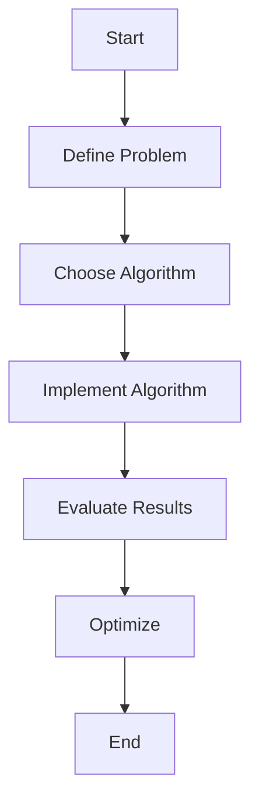

                 

### 目录大纲设计思路与步骤

设计一本关于《构建具有多智能体协同决策能力的系统》的完整目录大纲，需要遵循以下详细步骤，以确保内容既丰富又结构清晰：

#### 1. 明确书的核心内容

首先，我们需要明确这本书的核心内容是什么。对于《构建具有多智能体协同决策能力的系统》来说，核心内容应包括以下几个方面：

- **概念解析**：多智能体协同决策的定义、重要性以及与相关概念的联系。
- **算法原理**：多智能体协同决策的核心算法及其数学模型和原理。
- **系统架构**：构建多智能体协同决策系统的需求分析、架构设计及其实现。
- **实战应用**：通过实际项目展示如何构建和应用多智能体协同决策系统。

#### 2. 梳理章节内容

接下来，我们将根据核心内容，梳理出每个章节的主题：

1. **背景介绍**：包括多智能体协同决策系统的概念、背景、重要性以及当前研究现状和挑战。
2. **核心概念与联系**：详细定义和解释多智能体系统中的关键概念，如智能体、协同、决策等，并通过对比表格和ER图来展示它们之间的联系。
3. **算法原理讲解**：深入讲解多智能体协同决策的算法原理，包括分布式算法、集中式算法、优化算法等，并通过流程图和Python代码示例来解释。
4. **系统分析与架构设计**：分析系统需求，设计系统架构，并使用流程图和类图来展示系统功能和接口设计。
5. **项目实战**：提供一个实际项目案例，展示如何构建和部署多智能体协同决策系统，包括环境安装、核心代码实现、代码解读和分析。
6. **最佳实践与拓展**：总结最佳实践技巧，对项目进行小结，并提出未来研究方向和拓展内容。

#### 3. 细化目录结构

为了确保目录结构清晰，我们将使用markdown格式来标记章节和子章节。每个章节和子章节都会有一个简短的标题，使用不同的`#`层级来表示。

#### 4. 确保内容完整性

在目录大纲中，必须包含以下核心章节：

- **背景介绍**：介绍多智能体协同决策系统的概念、背景、重要性，以及研究现状和挑战。
- **核心概念与联系**：详细定义并对比多智能体系统中的关键概念，如智能体、协同、决策等，并通过对比表格和ER图来展示它们之间的联系。
- **算法原理讲解**：深入讲解多智能体协同决策的算法原理，包括数学模型、公式和Python代码示例。
- **系统分析与架构设计**：分析系统需求，设计系统架构，并使用流程图和类图来展示系统功能和接口设计。
- **项目实战**：提供一个实际项目案例，展示如何构建和部署多智能体协同决策系统，包括环境安装、核心代码实现、代码解读和分析。
- **最佳实践与拓展**：总结最佳实践技巧，对项目进行小结，并提出未来研究方向和拓展内容。

#### 5. 简洁明了

在设计和编写目录大纲时，应保持简洁明了，避免冗余内容。使用统一的markdown格式，确保目录大纲的可读性和一致性。

#### 6. 格式标准化

使用markdown格式来编写目录大纲，每个章节和子章节都使用相应的`#`层级来标记。例如：

```markdown
# 第一部分: 问题背景与概念解析
## 1. 引言：多智能体协同决策的兴起
### 1.1 多智能体协同决策的定义
### 1.2 多智能体协同决策的重要性
### 1.3 研究现状与挑战
```

通过以上步骤，我们可以设计出一个清晰、详细的目录大纲，为后续内容编写打下坚实的基础。

---

### 目录大纲设计示例

```markdown
----------------------------------------------------------------
# 《构建具有多智能体协同决策能力的系统》

## 文章关键词
- 多智能体协同
- 决策系统
- 算法原理
- 系统架构
- 项目实战

## 文章摘要
本文将深入探讨如何构建具有多智能体协同决策能力的系统，从概念解析到算法原理，再到实际项目实战，全面解析多智能体协同决策的技术和应用。

----------------------------------------------------------------

# 第一部分: 问题背景与概念解析

## 1. 引言：多智能体协同决策的兴起
### 1.1 多智能体协同决策的定义
### 1.2 多智能体协同决策的重要性
### 1.3 研究现状与挑战

## 2. 核心概念与联系
### 2.1 多智能体系统基本概念
#### 2.1.1 智能体的定义与分类
#### 2.1.2 协同与合作的区别
#### 2.1.3 决策模型与算法
### 2.2 多智能体系统ER图
```mermaid
erDiagram
    Product ||--|{ Order } Order
    Customer ||--|{ Order } Order
    Store ||--|{ Product } Product
    Product ||--|{ Supplier } Supplier
```
```

## 3. 多智能体协同决策算法原理
### 3.1 算法概述
### 3.2 经典算法讲解
#### 3.2.1 分布式算法
#### 3.2.2 集中式算法
#### 3.2.3 优化算法
### 3.3 算法流程图


## 4. 数学模型与公式
### 4.1 多智能体协同决策数学模型
#### 4.1.1 线性规划模型
$$
\text{Minimize} \quad c^T x \\
\text{Subject to} \quad Ax \le b
$$
#### 4.1.2 动态规划模型
$$
V_t(j) = \min_{i} \{ c_{ij} + V_{t-1}(i) \}
$$
#### 4.1.3 遗传算法模型
$$
\text{Fitness}(x) = \frac{1}{\sum_{i=1}^{n} (x_i - \bar{x})^2}
$$

## 5. 系统分析与架构设计
### 5.1 系统需求分析
### 5.2 系统架构设计
#### 5.2.1 系统功能设计
#### 5.2.2 系统架构设计
#### 5.2.3 系统接口设计
### 5.3 系统类图
```mermaid
classDiagram
    Class1 <|-- Class2
    Class1 --| McGruff: Class3
    Class2 : +int x
    Class2 : +int y
    Class3 : +string name
```

## 6. 多智能体协同决策系统项目实战
### 6.1 环境安装与准备
### 6.2 系统核心实现
#### 6.2.1 源代码解读
```python
# Example of Python code
def calculate_sum(a, b):
    return a + b
```
#### 6.2.2 代码应用与分析
### 6.3 实际案例分析与讲解
### 6.4 项目小结

## 7. 最佳实践与拓展
### 7.1 最佳实践技巧
### 7.2 小结与展望
### 7.3 拓展阅读

----------------------------------------------------------------

## 作者
作者：AI天才研究院/AI Genius Institute & 禅与计算机程序设计艺术 /Zen And The Art of Computer Programming
```markdown

此目录大纲提供了一个详细的框架，涵盖从概念解析到实战应用的各个阶段，确保了内容的完整性和连贯性。每个章节都包含了必要的子章节，通过mermaid图和代码示例使得内容更加具体和易于理解。在编写实际内容时，每个子章节都需要详细阐述，满足字数限制的要求。这样的目录结构不仅有助于读者快速了解全文内容，也能帮助作者组织思路，确保文章的条理清晰。

