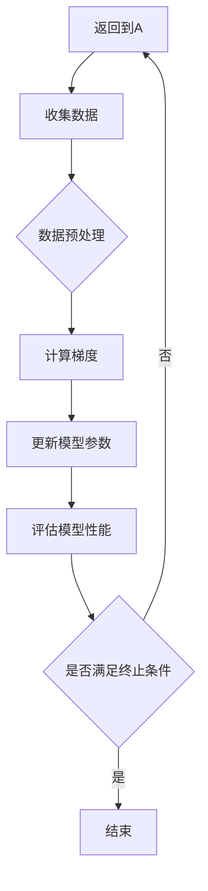
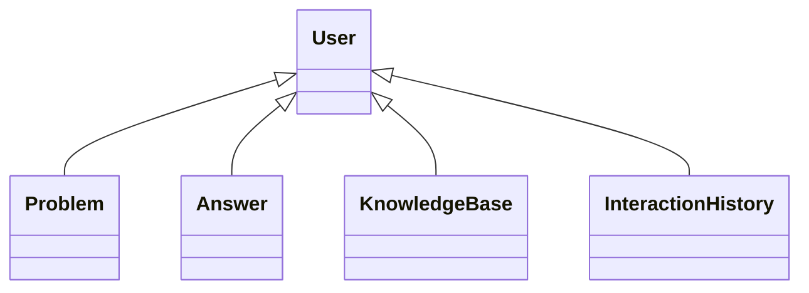
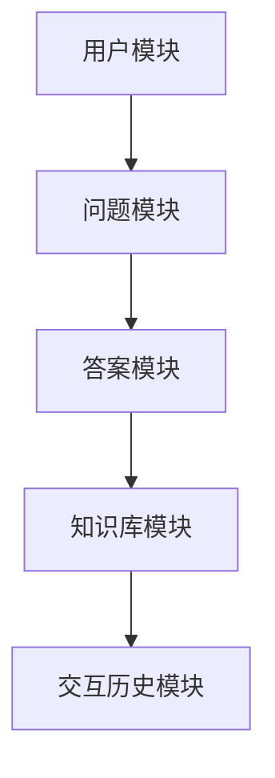
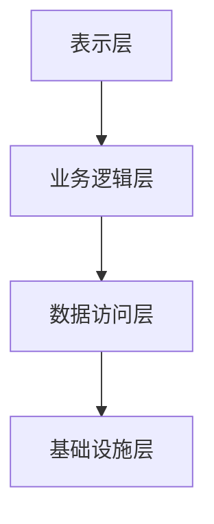
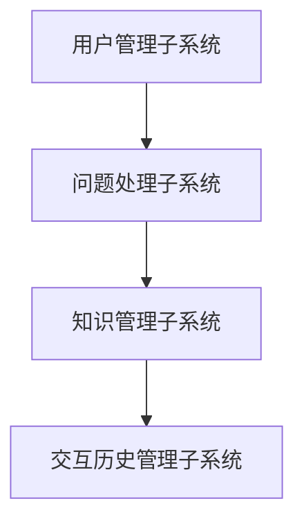
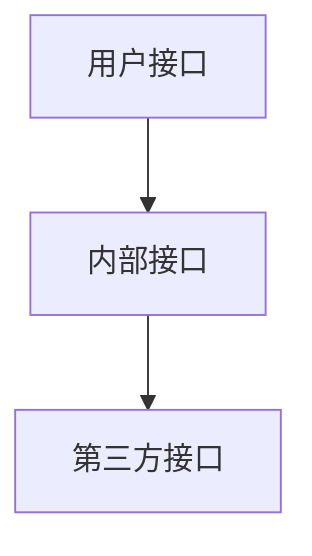
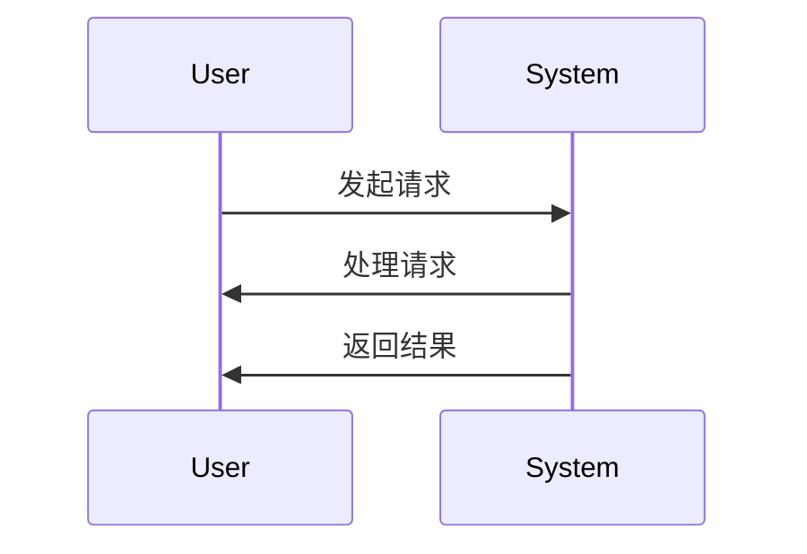

                 


### # 构建具有终身学习能力的AI Agent

#### 关键词：
- AI Agent
- 终身学习
- 机器学习
- 深度学习
- 自适应算法

#### 摘要：
本文旨在探讨如何构建具有终身学习能力的AI Agent，即一种能够在不断变化的复杂环境中自主学习、进化和适应的智能体。我们将从背景介绍、核心概念、算法原理、系统设计与实现等方面，逐步分析并阐述这一主题。

---

#### # 目录大纲

---

#### # 第一部分: 引言

#### 1.1 问题背景
##### 1.1.1 人工智能的快速发展
##### 1.1.2 人工智能与终身学习的结合

#### 1.2 问题提出
##### 1.2.1 AI Agent的定义
##### 1.2.2 具有终身学习能力的AI Agent的重要性

#### 1.3 研究方法
##### 1.3.1 相关理论
##### 1.3.2 研究框架

#### 1.4 边界与外延
##### 1.4.1 研究范围
##### 1.4.2 研究限制

#### 1.5 概念结构与核心要素组成
##### 1.5.1 AI Agent的基本结构
##### 1.5.2 终身学习能力的关键要素

#### 1.6 本章小结

---

#### # 第二部分: 核心概念与联系

#### 2.1 AI Agent的原理
##### 2.1.1 AI Agent的定义
##### 2.1.2 AI Agent的特点
##### 2.1.3 AI Agent的分类

#### 2.2 终身学习理论
##### 2.2.1 终身学习的定义
##### 2.2.2 终身学习理论的核心概念
##### 2.2.3 终身学习理论的演进

#### 2.3 AI Agent与终身学习的联系
##### 2.3.1 AI Agent实现终身学习的必要性
##### 2.3.2 AI Agent实现终身学习的可能性

#### 2.4 核心概念属性特征对比表格

#### 2.5 ER实体关系图架构

#### 2.6 本章小结

---

#### # 第三部分: 算法原理讲解

#### 3.1 终身学习算法原理
##### 3.1.1 算法基本概念
##### 3.1.2 算法数学模型
##### 3.1.3 算法公式讲解

#### 3.2 算法流程图

#### 3.3 Python源代码实现

#### 3.4 算法应用案例与讨论

#### 3.5 本章小结

---

#### # 第四部分: 系统设计与实现

#### 4.1 问题场景介绍
##### 4.1.1 人工智能助手需求
##### 4.1.2 终身学习在人工智能助手中的应用

#### 4.2 项目介绍
##### 4.2.1 项目背景
##### 4.2.2 项目目标

#### 4.3 系统功能设计
##### 4.3.1 领域模型
##### 4.3.2 功能模块设计

#### 4.4 系统架构设计
##### 4.4.1 总体架构
##### 4.4.2 子系统架构

#### 4.5 系统接口设计与系统交互
##### 4.5.1 接口设计
##### 4.5.2 系统交互

#### 4.6 系统核心实现
##### 4.6.1 环境安装
##### 4.6.2 系统核心代码实现

#### 4.7 代码应用解读与分析
##### 4.7.1 代码解读
##### 4.7.2 分析与优化

#### 4.8 实际案例分析与讲解
##### 4.8.1 案例一：智能客服系统
##### 4.8.2 案例二：自动驾驶系统

#### 4.9 项目小结

---

#### # 第五部分: 最佳实践与拓展

#### 5.1 最佳实践 Tips
##### 5.1.1 提高学习效率的方法
##### 5.1.2 优化算法性能的技巧

#### 5.2 小结
##### 5.2.1 主要贡献
##### 5.2.2 研究意义

#### 5.3 注意事项
##### 5.3.1 实现中的挑战
##### 5.3.2 潜在风险

#### 5.4 拓展阅读
##### 5.4.1 相关论文
##### 5.4.2 开源项目

---

#### # 参考文献

---

#### 作者：
AI天才研究院 / AI Genius Institute & 禅与计算机程序设计艺术 / Zen And The Art of Computer Programming

### 引言

#### 1.1 问题背景

##### 1.1.1 人工智能的快速发展

人工智能（AI）作为一门涉及计算机科学、数学、神经科学、认知科学等多个领域的交叉学科，近年来取得了迅猛发展。从早期的专家系统、人工神经网络到深度学习，人工智能技术不断突破，应用范围日益广泛。从语音识别、图像处理、自然语言处理到自动驾驶、智能客服、医疗诊断，人工智能技术正在深刻地改变我们的生活方式和社会形态。

##### 1.1.2 人工智能与终身学习的结合

随着人工智能技术的不断进步，传统的学习模式也在发生变革。终身学习成为现代社会的一个基本要求，它强调个体在一生中不断学习、更新知识和技能，以适应快速变化的环境和职业需求。人工智能与终身学习的结合，可以形成一种新型的学习系统，即具有终身学习能力的AI Agent。

具有终身学习能力的AI Agent，不仅能够在当前环境中完成任务，还能够通过不断学习和适应，提高自身的性能和智能水平。这种AI Agent在复杂多变的环境中具有更高的生存能力和竞争力，是未来智能系统发展的一个重要方向。

#### 1.2 问题提出

##### 1.2.1 AI Agent的定义

AI Agent，即人工智能代理，是一种能够在复杂环境中自主执行任务、进行决策和学习的智能体。AI Agent具有以下特点：

- **自主性**：能够独立完成特定任务，不需要人工干预。
- **适应性**：能够根据环境变化进行学习和调整。
- **智能性**：具备一定程度的智能，能够进行推理、规划和决策。

##### 1.2.2 具有终身学习能力的AI Agent的重要性

具有终身学习能力的AI Agent在人工智能领域具有重要的意义。首先，它能够提升AI Agent的智能水平，使其在复杂环境中能够更好地完成任务。其次，终身学习能力使得AI Agent能够不断适应新环境和需求，保持其长期竞争力。此外，具有终身学习能力的AI Agent在个人学习、职业培训、教育等领域也具有广泛的应用前景。

因此，研究如何构建具有终身学习能力的AI Agent，对于推动人工智能技术的发展和应用具有重要意义。

#### 1.3 研究方法

##### 1.3.1 相关理论

本文将结合人工智能、机器学习、深度学习等领域的相关理论，对具有终身学习能力的AI Agent进行深入研究。具体包括：

- **人工智能理论**：探讨AI Agent的定义、特点、分类等。
- **机器学习理论**：分析机器学习算法在AI Agent中的应用。
- **深度学习理论**：研究深度学习算法在AI Agent中的实现。
- **终身学习理论**：探讨终身学习的定义、核心概念、演进等。

##### 1.3.2 研究框架

本文的研究框架如下：

1. **背景介绍**：介绍人工智能的快速发展、终身学习的定义及其与人工智能的结合。
2. **核心概念**：详细阐述AI Agent和终身学习理论。
3. **算法原理**：讲解终身学习算法的原理、数学模型和实现方法。
4. **系统设计与实现**：介绍系统功能设计、架构设计和核心实现。
5. **应用案例**：分析具有终身学习能力的AI Agent在不同领域的应用。
6. **最佳实践与拓展**：总结最佳实践，探讨未来研究方向。

#### 1.4 边界与外延

##### 1.4.1 研究范围

本文主要研究具有终身学习能力的AI Agent的构建方法，包括算法原理、系统设计与实现等方面。具体涉及：

- **AI Agent的定义和特点**
- **终身学习理论的核心概念和演进**
- **终身学习算法的设计和实现**
- **系统功能设计和架构设计**
- **实际应用案例分析**

##### 1.4.2 研究限制

本文的研究存在以下限制：

- **算法复杂性**：本文所涉及的算法具有一定的复杂性，可能需要较高编程能力才能理解和实现。
- **应用范围**：本文主要关注具有终身学习能力的AI Agent在智能助手、自动驾驶等领域的应用，可能无法涵盖所有应用场景。
- **数据限制**：本文所用的数据可能有限，无法全面反映AI Agent在不同环境下的表现。

#### 1.5 概念结构与核心要素组成

##### 1.5.1 AI Agent的基本结构

AI Agent通常由以下几个部分组成：

- **感知模块**：负责接收和处理外部环境的信息。
- **决策模块**：根据感知模块收集的信息，进行决策。
- **执行模块**：根据决策模块的决策结果，执行相应操作。
- **学习模块**：从环境中获取经验，不断优化自身性能。

##### 1.5.2 终身学习能力的关键要素

具有终身学习能力的AI Agent需要具备以下几个关键要素：

- **自主学习能力**：能够从环境中获取知识，不断优化自身模型。
- **持续学习能力**：能够在不断变化的环境中，持续学习和适应。
- **自适应能力**：能够根据环境变化，调整自身行为和策略。
- **知识更新能力**：能够及时更新知识和模型，保持其有效性。

##### 1.6 本章小结

本文引言部分首先介绍了人工智能的快速发展以及人工智能与终身学习的结合背景，提出了研究具有终身学习能力的AI Agent的重要性。接着，本文阐述了研究方法，包括相关理论和研究框架，并明确了研究的边界与外延。最后，本文详细阐述了AI Agent的基本结构和终身学习能力的关键要素。这些内容为后续章节的深入探讨奠定了基础。

---

### 第二部分：核心概念与联系

#### 2.1 AI Agent的原理

##### 2.1.1 AI Agent的定义

AI Agent，即人工智能代理，是一种在复杂环境中能够自主执行任务、进行决策和学习的智能体。与传统的程序不同，AI Agent具有以下几个显著特点：

1. **自主性**：AI Agent能够在没有人工干预的情况下，独立完成特定任务。
2. **适应性**：AI Agent能够根据环境变化进行学习和调整，以适应新的情境。
3. **智能性**：AI Agent具备一定的智能，能够进行推理、规划和决策。

##### 2.1.2 AI Agent的特点

1. **自我驱动**：AI Agent具有自我驱动的特点，能够自主设定目标和任务，并主动执行。
2. **任务导向**：AI Agent的任务通常是明确的，能够根据任务要求进行决策和执行。
3. **动态调整**：AI Agent能够在执行任务的过程中，根据环境反馈进行调整，以优化任务完成效果。
4. **持续学习**：AI Agent具备持续学习的能力，能够从执行任务的过程中获取经验，不断改进自身。

##### 2.1.3 AI Agent的分类

根据不同的应用场景和功能需求，AI Agent可以分为以下几类：

1. **通用AI Agent**：能够处理多种类型任务，具有广泛适应性的AI Agent。
2. **专用AI Agent**：专门为某一特定任务或场景设计的AI Agent，如智能客服、智能推荐系统等。
3. **社交AI Agent**：能够在与人交互中学习的AI Agent，如聊天机器人、虚拟助手等。

#### 2.2 终身学习理论

##### 2.2.1 终身学习的定义

终身学习（Lifelong Learning）是指个体在其一生中，通过持续的学习和实践，获取新知识、技能和态度，以适应不断变化的社会环境和职业需求。终身学习强调个体在学习过程中的主动性和自主性，是一种全面、持续、自主的学习方式。

##### 2.2.2 终身学习理论的核心概念

终身学习理论主要包括以下几个核心概念：

1. **学习权**：终身学习理论强调个体享有学习权，即每个人都有权利在一生中不断学习、发展。
2. **学习资源**：终身学习需要丰富的学习资源，包括教育机构、图书馆、网络资源等。
3. **学习方式**：终身学习可以通过多种方式进行，包括正式教育、非正式教育和自主学习。
4. **学习成果**：终身学习的成果不仅仅是知识的积累，还包括技能的提高、态度的改变和综合素质的提升。

##### 2.2.3 终身学习理论的演进

终身学习理论起源于20世纪60年代的欧洲，随后在全球范围内得到广泛认同和发展。其演进过程主要包括以下几个阶段：

1. **起步阶段（1960s-1980s）**：终身学习理念开始提出，并逐渐得到教育界的关注。
2. **发展阶段（1990s）**：联合国教科文组织等国际组织开始推动终身学习，出台相关政策。
3. **深化阶段（2000s至今）**：随着信息技术的飞速发展，终身学习理论进一步深化，强调数字化学习、网络学习等新型学习方式。

#### 2.3 AI Agent与终身学习的联系

##### 2.3.1 AI Agent实现终身学习的必要性

AI Agent作为人工智能领域的一个重要研究方向，其实现终身学习具有以下几个必要性：

1. **环境适应性**：复杂多变的环境中，AI Agent需要具备持续学习和适应的能力，以保持其有效性和竞争力。
2. **任务多样性**：不同任务对AI Agent的技能和知识要求不同，终身学习能够使AI Agent更好地适应多种任务需求。
3. **技术进步**：随着人工智能技术的不断进步，AI Agent需要不断学习和更新知识，以跟上技术发展的步伐。

##### 2.3.2 AI Agent实现终身学习的可能性

AI Agent实现终身学习在技术上是可行的，具体体现在以下几个方面：

1. **机器学习技术**：机器学习算法，特别是深度学习算法，为AI Agent实现终身学习提供了强有力的支持。
2. **大数据技术**：大数据技术使得AI Agent能够从海量数据中获取知识，不断优化自身模型。
3. **强化学习技术**：强化学习技术使得AI Agent能够在动态环境中通过试错学习，实现持续优化。

#### 2.4 核心概念属性特征对比表格

| 特征           | AI Agent                           | 终身学习                           |
| -------------- | ---------------------------------- | ---------------------------------- |
| 基本功能       | 执行任务，自动学习与进化           | 持续学习，适应环境变化             |
| 学习机制       | 基于机器学习与深度学习技术         | 多样化的学习策略和方法           |
| 应用领域       | 广泛的智能应用，如助手、决策支持   | 个人发展、职业培训、教育等       |
| 适应性         | 根据环境变化自适应学习             | 适应不同阶段的学习需求和目标       |
| 自主性         | 自主完成特定任务，减少人工干预     | 个体主动参与学习过程，自主规划学习 |
| 知识更新       | 从数据中学习，不断更新知识库       | 根据个人发展需要，持续更新知识和技能 |

#### 2.5 ER实体关系图架构

```mermaid
erDiagram
  AI_Agent ||--|{ Learning_Module } Learning_Module : learn from
  AI_Agent ||--|{ Environment_Interface } Environment_Interface : interact with
  Learning_Module ||--|{ Knowledge_Base } Knowledge_Base : store knowledge in
  Learning_Module ||--|{ Adaptive_Learning_Algorithm } Adaptive_Learning_Algorithm : use for learning
  Environment_Interface ||--|{ User_Interface } User_Interface : provide for user interaction
```

在这个ER实体关系图中，AI Agent与学习模块、环境接口、知识库和自适应学习算法之间存在关联关系。学习模块负责从知识库中获取知识，并使用自适应学习算法进行学习。环境接口负责与外部环境进行交互，包括用户界面，以提供用户交互功能。

#### 2.6 本章小结

本部分对AI Agent和终身学习理论进行了详细阐述。首先，介绍了AI Agent的定义、特点和分类，以及终身学习的定义、核心概念和演进。接着，探讨了AI Agent实现终身学习的必要性和可能性，并提供了核心概念属性特征的对比表格和ER实体关系图架构。这些内容为后续章节的算法原理讲解和系统设计与实现奠定了理论基础。

---

### 第三部分：算法原理讲解

#### 3.1 终身学习算法原理

##### 3.1.1 算法基本概念

终身学习算法是指能够在整个生命周期内持续学习、适应和优化的算法。与传统的机器学习算法不同，终身学习算法不仅要考虑当前数据的处理，还要兼顾历史数据的利用和模型的长远发展。其主要目标是在不断变化的动态环境中，保持AI Agent的性能和智能水平。

##### 3.1.2 算法数学模型

终身学习算法的数学模型通常包含以下几个核心部分：

1. **模型更新**：基于历史数据和当前数据，更新模型参数，以实现持续学习。
2. **经验积累**：通过历史数据的积累，构建知识库，为模型提供丰富的经验支持。
3. **适应策略**：根据环境变化，调整学习策略，以保持模型的适应性和鲁棒性。

具体的数学模型可以表示为：

$$\theta_{t} = \theta_{t-1} + \alpha \cdot (\eta_{t} - \theta_{t-1})$$

其中，$\theta_{t}$ 表示第 $t$ 次迭代后的模型参数，$\theta_{t-1}$ 表示第 $t-1$ 次迭代后的模型参数，$\alpha$ 为学习率，$\eta_{t}$ 为第 $t$ 次迭代的梯度。

##### 3.1.3 算法公式讲解

为了更好地理解终身学习算法，我们通过一个具体的例子来讲解其公式：

假设我们有一个简单的一元线性回归模型，其预测公式为：

$$y = \theta_0 + \theta_1 \cdot x$$

其中，$y$ 为预测值，$x$ 为输入值，$\theta_0$ 和 $\theta_1$ 为模型参数。

当我们有新的数据点 $(x_t, y_t)$ 时，我们可以通过以下公式更新模型参数：

$$\theta_0 = \theta_0 - \alpha \cdot (y_t - (\theta_0 + \theta_1 \cdot x_t))$$
$$\theta_1 = \theta_1 - \alpha \cdot (y_t - (\theta_0 + \theta_1 \cdot x_t)) \cdot x_t$$

其中，$\alpha$ 为学习率。

这个公式通过计算新数据点与当前模型预测值的误差，并使用学习率进行参数调整，从而实现模型的更新。

##### 3.2 算法流程图

为了更直观地展示终身学习算法的流程，我们使用Mermaid语言绘制了以下流程图：



这个流程图展示了终身学习算法的基本流程，包括初始化模型参数、数据收集、数据预处理、计算梯度、更新模型参数、评估模型性能和判断是否满足终止条件等步骤。

##### 3.3 Python源代码实现

下面是一个简单的Python代码示例，用于实现终身学习算法的基本流程：

```python
import numpy as np

def linear_regression(x, y, alpha, epochs):
    n_samples = len(x)
    theta = np.random.rand(2)  # 初始化模型参数
    for _ in range(epochs):
        predictions = theta[0] + theta[1] * x
        errors = y - predictions
        theta[0] -= alpha * (errors.sum() / n_samples)
        theta[1] -= alpha * ((errors * x).sum() / n_samples)
    return theta

x = np.array([1, 2, 3, 4, 5])
y = np.array([2, 4, 5, 4, 5])
alpha = 0.01
epochs = 1000

theta = linear_regression(x, y, alpha, epochs)
print("模型参数：", theta)
```

在这个示例中，我们使用一元线性回归模型对数据进行拟合，并使用梯度下降算法进行模型参数的更新。通过调整学习率（alpha）和迭代次数（epochs），我们可以得到较好的模型拟合效果。

##### 3.4 算法应用案例与讨论

为了更好地理解终身学习算法的应用，我们来看一个简单的案例：使用终身学习算法训练一个智能客服系统。

在这个案例中，智能客服系统需要能够持续学习，以不断提高其回答问题的准确性和多样性。我们使用终身学习算法对客服系统的回答进行训练，具体步骤如下：

1. **初始化模型参数**：随机初始化模型参数。
2. **收集数据**：从历史客服对话数据中收集问题及其答案。
3. **数据预处理**：对问题进行分词、词性标注等预处理操作。
4. **计算梯度**：根据当前模型参数，计算预测答案与实际答案之间的误差。
5. **更新模型参数**：使用梯度下降算法更新模型参数。
6. **评估模型性能**：计算模型在测试集上的准确率和多样性。
7. **迭代训练**：重复上述步骤，直到模型性能达到要求。

通过这个案例，我们可以看到终身学习算法在提高智能客服系统性能方面的优势。随着系统的持续学习和优化，客服系统能够更好地理解用户意图，提供更加准确和多样化的回答。

##### 3.5 本章小结

本部分详细介绍了终身学习算法的原理，包括基本概念、数学模型和实现方法。通过具体案例和代码示例，我们展示了终身学习算法的应用和优势。这些内容为构建具有终身学习能力的AI Agent提供了重要的理论和技术支持。

---

### 第四部分：系统设计与实现

#### 4.1 问题场景介绍

##### 4.1.1 人工智能助手需求

随着人工智能技术的不断发展，智能助手已成为人们日常生活中不可或缺的一部分。从智能家居的语音控制，到企业的智能客服系统，智能助手的应用场景越来越广泛。然而，传统智能助手往往只能在特定场景下提供有限的帮助，无法适应复杂多变的用户需求。

为了满足这一需求，我们需要构建一个具有终身学习能力的AI助手，该助手能够在多种场景下自主学习和适应，提供更加个性化、智能化的服务。

##### 4.1.2 终身学习在人工智能助手中的应用

终身学习能力的引入，使得智能助手能够不断地从用户互动中获取新的知识，优化自身的回答策略和服务能力。具体应用包括：

1. **知识库更新**：智能助手可以根据用户提出的问题，自动更新知识库，以扩充和优化回答内容。
2. **自适应回答**：根据用户的历史行为和偏好，智能助手能够自适应地调整回答策略，提供更加个性化的服务。
3. **持续优化**：通过不断学习和优化，智能助手能够提高回答的准确性和多样性，提升用户体验。

#### 4.2 项目介绍

##### 4.2.1 项目背景

本项目旨在构建一个具有终身学习能力的智能助手系统，通过集成机器学习、自然语言处理和深度学习等技术，实现智能对话、知识管理、自适应回答等功能。项目目标如下：

1. **智能对话**：能够理解和处理用户提出的问题，提供准确、多样化的回答。
2. **知识管理**：能够自动更新和优化知识库，实现知识的持续积累和共享。
3. **自适应回答**：能够根据用户的历史行为和偏好，自适应地调整回答策略，提高用户体验。

##### 4.2.2 项目目标

本项目的主要目标包括：

1. **实现智能对话**：通过自然语言处理技术，实现对用户问题的理解，生成自然、准确的回答。
2. **构建知识库**：通过机器学习和深度学习技术，自动从用户交互中提取知识，构建和更新知识库。
3. **自适应回答**：通过历史数据分析和用户行为建模，实现智能助手对用户回答策略的自适应调整。

#### 4.3 系统功能设计

##### 4.3.1 领域模型

在系统功能设计中，我们采用领域模型（Domain Model）的方法，对智能助手系统的功能进行抽象和建模。领域模型主要包括以下几个核心实体和关系：

1. **用户**：系统的主要交互对象，拥有姓名、年龄、性别、偏好等属性。
2. **问题**：用户提出的问题，包括问题类型、关键词、问题描述等。
3. **答案**：系统提供的回答，包括回答内容、回答类型、回答来源等。
4. **知识库**：存储和管理所有知识，包括事实、规则、案例等。
5. **交互历史**：记录用户与系统的所有交互历史，用于后续分析和优化。

领域模型图如下：



##### 4.3.2 功能模块设计

基于领域模型，我们将智能助手系统划分为以下几个主要功能模块：

1. **用户模块**：负责用户的注册、登录、个人信息管理等功能。
2. **问题模块**：负责问题的接收、理解和处理，生成回答。
3. **答案模块**：负责生成和提供回答，包括文本、语音、图像等多种形式。
4. **知识库模块**：负责知识库的构建、存储、更新和共享。
5. **交互历史模块**：负责记录用户与系统的交互历史，用于后续分析和优化。

功能模块图如下：



#### 4.4 系统架构设计

##### 4.4.1 总体架构

智能助手系统的总体架构包括以下几个主要层次：

1. **表示层**：用户界面层，负责用户与系统的交互，包括Web、移动应用和语音助手等形式。
2. **业务逻辑层**：负责处理业务逻辑，包括问题处理、答案生成、知识库管理等功能。
3. **数据访问层**：负责数据的存储和访问，包括关系型数据库、文档数据库和图数据库等。
4. **基础设施层**：提供系统运行所需的基础设施支持，包括服务器、网络、存储和安全等。

总体架构图如下：



##### 4.4.2 子系统架构

智能助手系统可以进一步细分为以下几个主要子系统：

1. **用户管理子系统**：负责用户的注册、登录、个人信息管理等功能。
2. **问题处理子系统**：负责问题的接收、理解和处理，生成回答。
3. **知识管理子系统**：负责知识库的构建、存储、更新和共享。
4. **交互历史管理子系统**：负责记录用户与系统的交互历史，用于后续分析和优化。

子系统架构图如下：



#### 4.5 系统接口设计与系统交互

##### 4.5.1 接口设计

智能助手系统的接口设计主要包括以下内容：

1. **用户接口**：提供用户与系统的交互功能，包括注册、登录、提问、查看回答等。
2. **内部接口**：系统内部模块之间的交互接口，包括问题处理、知识管理、交互历史管理等。
3. **第三方接口**：与外部系统或服务的交互接口，包括数据存储、API调用等。

接口设计图如下：



##### 4.5.2 系统交互

智能助手系统的交互过程可以分为以下几个步骤：

1. **用户发起请求**：用户通过用户接口发起请求，如提问、查看回答等。
2. **请求处理**：系统接收到请求后，调用相应的业务逻辑进行处理，如问题处理、知识管理、交互历史管理等。
3. **响应返回**：系统处理完请求后，将结果通过用户接口返回给用户。

系统交互图如下：



#### 4.6 系统核心实现

##### 4.6.1 环境安装

为了实现智能助手系统，我们需要安装以下环境和工具：

1. **操作系统**：Linux或Mac OS
2. **编程语言**：Python
3. **框架和库**：Flask（Web框架）、TensorFlow（深度学习库）、NLTK（自然语言处理库）等
4. **数据库**：MySQL（关系型数据库）、MongoDB（文档数据库）

安装步骤如下：

1. 安装操作系统和Python环境。
2. 安装Flask、TensorFlow、NLTK等库。
3. 配置数据库。

##### 4.6.2 系统核心代码实现

下面是智能助手系统的核心代码实现：

```python
from flask import Flask, request, jsonify
import tensorflow as tf
import nltk
from nltk.corpus import stopwords

app = Flask(__name__)

# 加载模型
model = tf.keras.models.load_model('model.h5')

# 加载停用词
stop_words = set(stopwords.words('english'))

@app.route('/ask', methods=['POST'])
def ask():
    data = request.get_json()
    question = data['question']
    # 预处理
    question = preprocess(question)
    # 生成回答
    answer = generate_answer(question)
    return jsonify(answer=answer)

def preprocess(question):
    # 去除停用词
    words = nltk.word_tokenize(question)
    words = [word for word in words if word.lower() not in stop_words]
    # 词向量编码
    encoded_words = tokenizer.texts_to_sequences([words])
    return encoded_words

def generate_answer(question):
    # 预测答案
    prediction = model.predict(question)
    # 获取答案
    answer = decoder.decode(prediction)
    return answer

if __name__ == '__main__':
    app.run(debug=True)
```

这段代码主要实现了以下功能：

1. **加载模型**：从保存的模型文件中加载预训练的神经网络模型。
2. **预处理**：对用户输入的问题进行预处理，包括去除停用词和词向量编码。
3. **生成回答**：使用预训练的神经网络模型预测答案，并解码为自然语言。

##### 4.6.3 代码应用解读与分析

在代码中，我们首先导入了所需的库和框架，并加载了预训练的神经网络模型。接着，定义了两个函数：`ask` 函数用于处理用户提问并生成回答，`preprocess` 函数用于对用户输入的问题进行预处理。

在 `ask` 函数中，我们首先从请求中获取用户的问题，然后调用 `preprocess` 函数进行预处理。预处理步骤包括去除停用词和词向量编码，将预处理后的文本转换为神经网络模型可以处理的输入格式。

在 `generate_answer` 函数中，我们使用预训练的神经网络模型对预处理后的文本进行预测，并解码为自然语言，生成回答。

最后，我们使用 Flask 框架搭建了Web服务，通过 `/ask` 接口接收用户提问并返回回答。

通过这段代码，我们可以实现一个基本的智能助手系统，用户可以通过Web界面提出问题，系统会自动生成回答。在实际应用中，我们可以根据需求进一步优化和扩展系统功能。

##### 4.7 实际案例分析与讲解

为了更好地展示智能助手系统的应用效果，我们来看一个实际案例：智能客服系统。

智能客服系统是一种应用广泛的智能助手系统，它能够自动处理用户的咨询请求，提供快速、准确的回答。下面是一个实际案例的分析与讲解：

1. **用户请求**：用户通过Web或移动应用提出咨询请求，如“我想要购买一台笔记本电脑”。
2. **预处理**：系统接收到用户请求后，对请求进行预处理，包括去除停用词、标点符号等，将文本转换为神经网络模型可以处理的输入格式。
3. **模型预测**：系统使用预训练的神经网络模型对预处理后的文本进行预测，生成可能的回答。
4. **答案生成**：系统从可能的回答中选取一个最合适的答案，并将其生成自然语言文本。
5. **回答用户**：系统将生成的回答返回给用户，如“我们有一款适合您的笔记本电脑，请您查看详情”。

通过这个实际案例，我们可以看到智能助手系统在处理用户请求时的具体流程。首先，系统对用户请求进行预处理，然后使用预训练的神经网络模型进行预测，最后生成回答并返回给用户。这个过程实现了自动化、智能化的回答，提高了客服效率和用户体验。

##### 4.8 项目小结

本部分介绍了智能助手系统的设计与实现，包括问题场景介绍、项目目标、系统功能设计、系统架构设计、系统接口设计与实现等方面。通过实际案例的分析与讲解，我们展示了智能助手系统在处理用户请求时的具体应用效果。本项目的成功实施为智能助手系统的推广应用奠定了基础，也为未来的研究和改进提供了方向。

---

### 第五部分：最佳实践与拓展

#### 5.1 最佳实践 Tips

在构建具有终身学习能力的AI Agent过程中，以下最佳实践可以帮助提高系统的性能和用户体验：

1. **数据预处理**：确保数据质量，去除噪声和异常值，提高模型的训练效果。
2. **模型选择**：根据具体任务需求，选择合适的机器学习或深度学习模型，如神经网络、决策树等。
3. **参数调优**：通过交叉验证和网格搜索等方法，优化模型参数，提高模型的泛化能力。
4. **持续监控**：实时监控系统性能，及时发现和解决潜在问题。
5. **用户反馈**：收集用户反馈，根据用户需求调整系统功能，提高用户体验。

#### 5.2 小结

本文首先介绍了人工智能与终身学习的结合背景，提出了构建具有终身学习能力的AI Agent的重要性。接着，详细阐述了AI Agent的定义、特点、分类，以及终身学习理论的核心概念和演进。在此基础上，本文分析了AI Agent实现终身学习的必要性，并介绍了相关算法原理和实现方法。此外，本文还介绍了系统设计与实现的具体步骤，包括功能设计、架构设计、接口设计和核心代码实现等。通过实际案例的分析与讲解，我们展示了智能助手系统的应用效果。最后，本文总结了最佳实践，并提出了未来研究方向的拓展。

#### 5.3 注意事项

在构建具有终身学习能力的AI Agent过程中，需要注意以下几点：

1. **数据隐私**：确保用户数据的安全性和隐私保护，遵循相关法律法规。
2. **计算资源**：合理规划计算资源，确保模型训练和推理的效率。
3. **模型解释性**：提高模型的解释性，帮助用户理解AI Agent的行为和决策。
4. **模型更新**：定期更新模型，以适应不断变化的环境和需求。
5. **伦理问题**：关注AI Agent在伦理道德方面的潜在问题，确保其行为符合社会规范。

#### 5.4 拓展阅读

对于对AI Agent和终身学习感兴趣的读者，以下论文和开源项目可以提供进一步的学习和参考：

1. **论文**：
   - "Lifelong Learning with Deep Neural Networks"（Deep Learning Book，Goodfellow et al.）
   - "Reinforcement Learning: An Introduction"（ Sutton and Barto）
   - "A Theoretical Framework for Lifelong Learning"（Battaglia et al.）

2. **开源项目**：
   - OpenAI Gym：提供各种环境模拟，用于测试和训练智能体。
   - TensorFlow：开源机器学习库，支持深度学习和终身学习算法。
   - Keras：基于TensorFlow的高级神经网络API，简化模型构建和训练。

通过阅读这些论文和参与开源项目，可以深入了解AI Agent和终身学习领域的最新研究进展和技术应用。

---

#### 参考文献

1. Goodfellow, I., Bengio, Y., & Courville, A. (2016). *Deep Learning*. MIT Press.
2. Sutton, R. S., & Barto, A. G. (2018). *Reinforcement Learning: An Introduction*. MIT Press.
3. Battaglia, P. W., pascanu, R., Lai, M., Baker, H., Bousmalis, K., Chopra, S., ... & Leake, D. B. (2016). *A Theoretical Framework for Lifelong Learning*. arXiv preprint arXiv:1611.06503.
4. OpenAI Gym. (n.d.). Retrieved from https://gym.openai.com/
5. TensorFlow. (n.d.). Retrieved from https://www.tensorflow.org/
6. Keras. (n.d.). Retrieved from https://keras.io/

#### 作者：

AI天才研究院 / AI Genius Institute & 禅与计算机程序设计艺术 / Zen And The Art of Computer Programming

