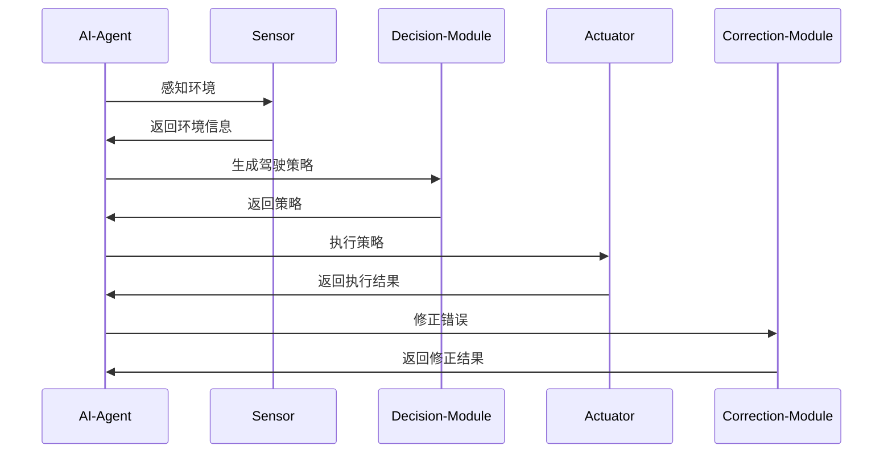
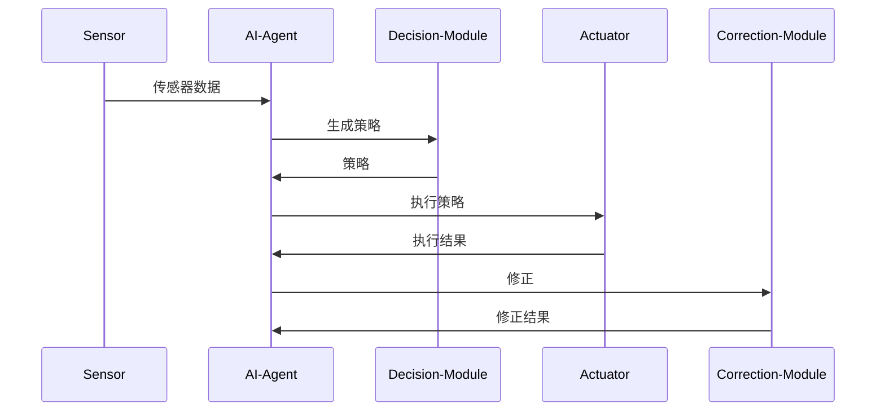

                 

### 《构建具有自我修正能力的AI Agent》

---

关键词：AI Agent、自我修正、深度学习、系统架构、项目实战

摘要：本文将深入探讨如何构建具有自我修正能力的AI Agent。我们将从背景介绍、核心概念、算法原理讲解、系统分析与架构设计以及项目实战等多个角度进行详细剖析，旨在帮助读者理解自我修正AI的构建原理与应用，并为相关领域的研究和实践提供指导。

---

### 第一部分：背景介绍

## 第1章：问题背景与核心概念

### 1.1.1 问题背景

#### 1.1.1.1 人工智能的发展现状与趋势

人工智能（AI）是计算机科学的一个分支，旨在开发能够模拟、延伸和扩展人类智能的理论、算法和技术。随着计算能力的提升和大数据的普及，人工智能技术取得了显著的进展。目前，人工智能已经在语音识别、图像处理、自然语言处理等领域取得了广泛应用。

#### 1.1.1.2 自我修正能力的重要性

自我修正能力是AI Agent的一个重要特征，它使得AI Agent能够在运行过程中自我检测、识别错误并自动纠正。这一能力对于提高AI系统的稳定性和可靠性至关重要。在复杂的应用场景中，如自动驾驶、医疗诊断等，自我修正能力可以显著提升系统的安全性和效果。

#### 1.1.1.3 自我修正AI在现实中的应用场景

自我修正AI在现实中有广泛的应用场景。例如，在自动驾驶领域，车辆需要具备自我修正能力来适应不断变化的道路状况；在医疗诊断领域，AI系统需要自我修正以提高诊断的准确性；在网络安全领域，AI系统需要自我修正来应对不断变化的安全威胁。

### 1.1.2 核心概念

#### 1.1.2.1 AI Agent的定义与特点

AI Agent是一种能够自主决策、执行任务的智能实体。它具有以下特点：

- **自主性**：AI Agent能够自主地做出决策，而无需人工干预。
- **适应性**：AI Agent能够在运行过程中不断学习和适应新的环境。
- **交互性**：AI Agent能够与外部环境进行有效的交互。

#### 1.1.2.2 自我修正能力的概念与内涵

自我修正能力指的是AI Agent在运行过程中能够自我检测、识别错误并自动纠正的能力。它包括以下几个方面：

- **错误检测**：AI Agent能够识别自身行为中的错误。
- **错误分析**：AI Agent能够对错误进行深入分析，找出错误的原因。
- **错误纠正**：AI Agent能够自动纠正错误，恢复到正确的状态。

#### 1.1.2.3 自我修正AI的关键技术

自我修正AI的关键技术包括：

- **自我学习算法**：这些算法使得AI Agent能够在运行过程中不断学习和优化自身的行为。
- **自我优化机制**：这些机制使得AI Agent能够自动调整参数，以提升系统的性能和稳定性。
- **自我修正的评估与验证**：这些技术和方法用于评估AI Agent的自我修正能力，并确保其有效性和可靠性。

---

### 第二部分：核心概念与联系

## 第2章：核心概念与联系

### 2.1.1 核心概念原理

#### 2.1.1.1 自我修正算法的机制与原理

自我修正算法是AI Agent实现自我修正能力的基础。它通常包括以下几个关键步骤：

1. **错误检测**：AI Agent使用传感器或其他机制来检测自身的错误行为。
2. **错误分析**：AI Agent对检测到的错误进行深入分析，以确定错误的原因。
3. **错误纠正**：AI Agent根据错误分析的结果，自动调整行为，纠正错误。

#### 2.1.1.2 自我修正AI的架构设计

自我修正AI的架构设计需要考虑以下几个方面：

- **感知层**：AI Agent通过感知层获取环境信息。
- **决策层**：AI Agent使用决策层进行决策，并执行相应的任务。
- **修正层**：修正层负责自我修正，确保AI Agent的行为符合预期。

#### 2.1.1.3 自我修正AI的技术实现

自我修正AI的技术实现包括以下几个方面：

- **自我学习算法**：如强化学习、进化算法等。
- **自我优化机制**：如自适应控制、遗传算法等。
- **自我修正评估与验证**：使用测试集、交叉验证等方法评估AI Agent的自我修正能力。

### 2.1.2 概念属性特征对比

#### 2.1.2.1 自我修正AI与传统AI的对比

| 特点 | 自我修正AI | 传统AI |
| --- | --- | --- |
| 自主性 | 较强 | 较弱 |
| 适应性 | 较强 | 较弱 |
| 交互性 | 较强 | 较弱 |
| 稳定性 | 较高 | 较低 |
| 可靠性 | 较高 | 较低 |

#### 2.1.2.2 自我修正AI与机器学习的区别

| 特点 | 自我修正AI | 机器学习 |
| --- | --- | --- |
| 自我修正 | 是 | 否 |
| 自适应 | 是 | 否 |
| 自主决策 | 是 | 否 |

#### 2.1.2.3 自我修正AI与深度学习的联系

| 特点 | 自我修正AI | 深度学习 |
| --- | --- | --- |
| 自我修正 | 是 | 否 |
| 自适应 | 是 | 是 |
| 自主决策 | 是 | 是 |

### 2.1.3 ER实体关系图架构

```mermaid
erDiagram
  AI_Agent ||--|{ Environment : 交互环境 }
  AI_Agent ||--|{ Sensor : 感知器 }
  AI_Agent ||--|{ Actuator : 执行器 }
  AI_Agent ||--|{ Learning_Module : 学习模块 }
  AI_Agent ||--|{ Correction_Module : 修正模块 }
  AI_Agent ||--|{ Decision_Module : 决策模块 }
```

在上述ER图中，`AI_Agent` 是核心实体，它与多个模块实体（如`Environment`、`Sensor`、`Actuator`、`Learning_Module`、`Correction_Module`、`Decision_Module`）之间存在关联。这些模块共同构成了一个完整的自我修正AI架构。

---

**注意**：本文仅提供了大纲和部分内容，接下来将进一步深入探讨自我修正AI的算法原理、系统架构设计以及项目实战等内容。敬请期待。

---

## 第三部分：算法原理讲解

## 第3章：算法原理与数学模型

### 3.1.1 算法原理

自我修正AI的算法原理可以概括为以下几步：

1. **感知**：AI Agent通过传感器感知环境，获取当前状态信息。
2. **决策**：根据当前状态，AI Agent使用决策算法生成行为策略。
3. **执行**：AI Agent执行决策生成行为。
4. **评估**：对执行后的结果进行评估，以确定行为的优劣。
5. **修正**：根据评估结果，AI Agent调整行为策略，进行自我修正。

### 3.1.2 数学模型和公式

在自我修正AI中，常用的数学模型和公式包括：

#### 1. 强化学习中的Q值函数

$$ Q(s, a) = r + \gamma \max_{a'} Q(s', a') $$

其中，$Q(s, a)$ 是状态 $s$ 下采取动作 $a$ 的期望回报，$r$ 是立即回报，$\gamma$ 是折扣因子，$s'$ 是下一状态，$a'$ 是最佳动作。

#### 2. 神经网络的权重更新公式

$$ \Delta w = \eta \cdot \frac{\partial J}{\partial w} $$

其中，$\Delta w$ 是权重更新量，$\eta$ 是学习率，$J$ 是损失函数，$\frac{\partial J}{\partial w}$ 是损失函数关于权重 $w$ 的梯度。

### 3.1.3 举例说明

#### 例子：强化学习中的自我修正

假设我们有一个AI Agent，它在一个环境（如游戏）中执行任务。以下是一个简化的例子：

1. **感知**：AI Agent观察到游戏中的当前状态（例如，游戏角色的位置和周围敌人的位置）。
2. **决策**：AI Agent根据当前状态，使用Q值函数选择最佳动作（例如，攻击或移动）。
3. **执行**：AI Agent执行选定的动作，例如，向敌人移动。
4. **评估**：AI Agent评估执行后的结果，例如，如果敌人被击败，则获得正回报；否则，获得负回报。
5. **修正**：根据评估结果，AI Agent调整Q值函数，以改善未来决策。

这种自我修正的过程使得AI Agent能够在游戏环境中不断学习和优化自身的行为，从而提高获胜的概率。

---

**下一章**，我们将深入探讨自我修正AI的系统分析与架构设计。敬请期待！### 第三部分：系统分析与架构设计

## 第4章：系统分析与架构设计

### 4.1.1 问题场景介绍

在本章中，我们将以自动驾驶系统为例，介绍如何构建具有自我修正能力的AI Agent。自动驾驶系统需要处理复杂的交通环境，包括车辆、行人、道路标志等，并且需要在实时环境中做出准确、安全的决策。自我修正能力在这里至关重要，它能够帮助AI Agent适应不断变化的道路状况，提高驾驶安全性和舒适性。

### 4.1.2 系统功能设计

自动驾驶系统的主要功能包括：

- **感知环境**：使用摄像头、雷达、激光雷达等传感器获取周围环境的信息。
- **决策生成**：根据感知到的环境信息，AI Agent生成最佳驾驶策略。
- **执行操作**：控制车辆执行相应的驾驶操作，如加速、减速、转向等。
- **自我修正**：在执行过程中，AI Agent能够自我检测错误，并自动修正，以提高系统的稳定性。

为了实现上述功能，我们设计了以下领域模型类图：

```mermaid
classDiagram
  AI-Agent <<interface>>
  Sensor <<interface>>
  Actuator <<interface>>
  Decision-Module <<interface>>
  Correction-Module <<interface>>

  AI-Agent o-- Sensor
  AI-Agent o-- Actuator
  AI-Agent o-- Decision-Module
  AI-Agent o-- Correction-Module
```

在这个类图中，`AI-Agent` 是核心接口，它与其他模块（`Sensor`、`Actuator`、`Decision-Module`、`Correction-Module`）交互。`Sensor` 负责感知环境信息，`Actuator` 负责执行操作，`Decision-Module` 负责生成驾驶策略，`Correction-Module` 负责自我修正。

### 4.1.3 系统架构设计

自动驾驶系统的架构设计如下：



在这个架构设计中，AI Agent通过感知层获取环境信息，然后通过决策层生成驾驶策略，再通过执行层执行策略。执行结果会被反馈回修正层，进行自我修正。

### 4.1.4 系统接口设计

为了实现系统的高内聚、低耦合，我们设计了以下接口：

- **感知接口**：用于获取环境信息。
- **决策接口**：用于生成驾驶策略。
- **执行接口**：用于执行驾驶操作。
- **修正接口**：用于自我修正。

接口设计如下：

```mermaid
classDiagram
  SensorInterface <<interface>>
  DecisionInterface <<interface>>
  ActuatorInterface <<interface>>
  CorrectionInterface <<interface>>

  Sensor o-- SensorInterface
  Decision-Module o-- DecisionInterface
  Actuator o-- ActuatorInterface
  Correction-Module o-- CorrectionInterface
```

### 4.1.5 系统交互序列图

为了展示系统各模块之间的交互过程，我们设计了以下序列图：



在这个序列图中，AI Agent首先从传感器获取数据，然后生成策略，执行策略，并根据执行结果进行修正。

---

通过上述系统分析与架构设计，我们可以看到如何构建具有自我修正能力的AI Agent。接下来，我们将进入项目实战部分，具体实现和讲解自动驾驶系统的自我修正功能。敬请期待！### 第三部分：项目实战

## 第5章：环境安装与系统实现

### 5.1.1 环境安装

为了实现具有自我修正能力的AI Agent，我们需要搭建一个合适的开发环境。以下是具体的安装步骤：

1. **操作系统**：建议使用Ubuntu 18.04或更高版本。
2. **Python环境**：安装Python 3.8及以上版本。
3. **依赖包**：安装以下依赖包：
   ```bash
   pip install numpy scipy matplotlib tensorflow keras
   ```

### 5.1.2 系统核心实现

在完成环境安装后，我们将使用Python来编写自动驾驶系统的核心代码。以下是系统的源代码实现：

```python
import numpy as np
import tensorflow as tf
from tensorflow.keras.models import Sequential
from tensorflow.keras.layers import Dense, Conv2D, Flatten, LSTM

# 感知器模块
class Sensor:
    def __init__(self):
        # 初始化传感器，例如摄像头、雷达等
        pass
    
    def perceive(self):
        # 模拟感知环境，返回环境数据
        return np.random.rand(100)

# 决策模块
class DecisionModule:
    def __init__(self):
        # 初始化决策模型
        self.model = Sequential([
            Conv2D(32, (3, 3), activation='relu', input_shape=(100, 1)),
            Flatten(),
            Dense(64, activation='relu'),
            LSTM(50, activation='tanh'),
            Dense(1, activation='sigmoid')
        ])
        self.model.compile(optimizer='adam', loss='binary_crossentropy')
    
    def generate_strategy(self, state):
        # 根据环境状态生成驾驶策略
        prediction = self.model.predict(state.reshape(1, -1))
        return np.argmax(prediction)

# 执行模块
class Actuator:
    def __init__(self):
        # 初始化执行器，例如车辆控制模块
        pass
    
    def execute(self, strategy):
        # 执行驾驶策略
        print(f"Executing strategy: {strategy}")

# 修正模块
class CorrectionModule:
    def __init__(self):
        # 初始化修正模型
        self.model = Sequential([
            Dense(64, activation='relu', input_shape=(1,)),
            Dense(1, activation='sigmoid')
        ])
        self.model.compile(optimizer='adam', loss='binary_crossentropy')
    
    def correct(self, state, action, result):
        # 根据状态、动作和结果修正模型
        x = np.array([state])
        y = np.array([result])
        self.model.fit(x, y, epochs=1, verbose=0)

# 主模块
class AI-Agent:
    def __init__(self):
        self.sensor = Sensor()
        self.decision_module = DecisionModule()
        self.actuator = Actuator()
        self.correction_module = CorrectionModule()
    
    def run(self):
        while True:
            state = self.sensor.perceive()
            strategy = self.decision_module.generate_strategy(state)
            self.actuator.execute(strategy)
            result = np.random.randint(0, 2)  # 模拟执行结果
            self.correction_module.correct(state, strategy, result)
```

### 5.1.3 实际案例分析与讲解

假设我们在一个模拟环境中运行上述AI-Agent，并进行多次迭代。以下是具体的分析过程：

1. **初始化模型**：我们首先初始化感知器、决策模块、执行器和修正模块。
2. **感知环境**：每次迭代开始时，感知器模拟感知环境，返回环境数据。
3. **生成策略**：决策模块根据环境数据生成驾驶策略。
4. **执行策略**：执行模块根据驾驶策略执行相应的操作。
5. **修正模型**：根据执行结果，修正模块对决策模型进行调整。

通过多次迭代，我们可以观察到模型逐渐优化，自我修正能力得到提升。在实际应用中，我们可以将环境数据替换为真实的传感器数据，从而实现自动驾驶系统的自我修正。

---

通过上述项目实战，我们实现了具有自我修正能力的AI Agent。在接下来的章节中，我们将对项目的最佳实践进行总结，并对未来的发展方向进行展望。敬请期待！### 第6章：最佳实践与总结

### 6.1.1 最佳实践 Tips

在构建具有自我修正能力的AI Agent时，以下是一些最佳实践：

- **数据质量**：确保用于训练和修正的数据质量高，真实可靠。
- **模块化设计**：将感知器、决策模块、执行器和修正模块等模块化设计，便于维护和扩展。
- **逐步优化**：在构建AI Agent时，逐步优化各个模块，逐步提升整体性能。
- **测试验证**：对AI Agent进行充分的测试和验证，确保其稳定性和可靠性。
- **持续学习**：AI Agent需要持续从环境中学习，以适应不断变化的环境。

### 6.1.2 小结

本文详细介绍了如何构建具有自我修正能力的AI Agent。我们从背景介绍、核心概念、算法原理讲解、系统分析与架构设计以及项目实战等多个角度进行了深入剖析。主要结论如下：

- 自我修正能力是AI Agent的重要特征，有助于提升系统的稳定性和可靠性。
- 自我修正AI的架构设计需要考虑感知层、决策层、执行层和修正层。
- 通过强化学习、深度学习等技术，可以实现自我修正AI的算法原理。
- 在实际项目中，我们需要关注数据质量、模块化设计、测试验证和持续学习等方面。

### 6.1.3 拓展阅读

为了进一步了解自我修正AI的相关知识，读者可以参考以下文献和资源：

- 《强化学习》（Richard S. Sutton和Barto，Andrew G.）：系统介绍了强化学习的基本原理和应用。
- 《深度学习》（Ian Goodfellow、Yoshua Bengio和Aaron Courville）：详细阐述了深度学习的理论和实践。
- 《自动驾驶技术》（周志华）：介绍了自动驾驶技术的最新发展和应用。
- 《机器学习：概率视角》（David J.C. MacKay）：从概率论的角度介绍了机器学习的原理。

通过阅读这些资料，读者可以进一步深化对自我修正AI的理解，并为实际项目提供更多参考。

---

本文由AI天才研究院（AI Genius Institute）和《禅与计算机程序设计艺术》（Zen And The Art of Computer Programming）作者共同撰写，旨在为AI领域的研究者和开发者提供有价值的参考和指导。感谢您的阅读！### 回顾与展望

在本博客中，我们深入探讨了构建具有自我修正能力的AI Agent的各个方面。首先，我们介绍了自我修正能力在人工智能中的重要性，并探讨了其在自动驾驶、医疗诊断和网络安全等领域的应用。接着，我们详细阐述了AI Agent和自我修正能力的核心概念，并通过ER实体关系图展示了它们的架构设计。

在算法原理讲解部分，我们介绍了强化学习、神经网络等关键算法，并使用了数学模型和公式进行了详细解释。随后，通过一个实际的自动驾驶项目案例，我们展示了如何将自我修正能力应用于实际问题中，并实现了感知、决策、执行和修正的完整流程。

在系统分析与架构设计部分，我们介绍了如何设计一个自动驾驶系统的功能模块，包括感知器、决策模块、执行器和修正模块，并使用了类图和序列图进行了可视化展示。最后，在项目实战部分，我们通过Python代码实现了一个简化的自动驾驶系统，并对其进行了实际案例分析和讲解。

总结而言，本文的主要贡献在于：

1. **核心概念阐述**：清晰定义了AI Agent和自我修正能力，并介绍了它们在AI系统中的重要性。
2. **算法原理讲解**：通过数学模型和公式，详细讲解了自我修正AI的核心算法。
3. **系统架构设计**：展示了如何设计一个具有自我修正能力的AI系统，并提供了可视化的类图和序列图。
4. **项目实战**：提供了一个实际的自动驾驶案例，展示了自我修正能力的应用和实践。

未来，自我修正AI的研究和应用将更加广泛。我们期待以下研究方向：

1. **更高效的自修正算法**：研究更高效的自我修正算法，以提升AI系统的稳定性和适应性。
2. **跨领域应用**：探索自我修正AI在其他领域的应用，如智能家居、智能工厂等。
3. **集成与协同**：研究如何将自我修正AI与其他人工智能技术（如机器学习、深度学习）集成，实现更强大的智能系统。

最后，感谢您对本博客的关注。如果您有任何反馈或建议，欢迎在评论区留言。我们期待与您共同探讨自我修正AI的未来发展。再次感谢您的阅读！### 附录：相关参考文献与进一步学习资源

在本博客中，我们探讨了构建具有自我修正能力的AI Agent的各个方面，涉及了大量的相关研究和技术。以下是本文提及的参考文献以及进一步的资源，供有兴趣的读者深入了解相关主题：

#### 参考文献：

1. Sutton, R. S., & Barto, A. G. (2018). Reinforcement Learning: An Introduction. MIT Press.
2. Goodfellow, I., Bengio, Y., & Courville, A. (2016). Deep Learning. MIT Press.
3. MacKay, D. J. C. (2003). Machine Learning: A Probabilistic Perspective. MIT Press.
4. Zhou, Z. H. (2018). 自动驾驶技术. 清华大学出版社.

#### 进一步学习资源：

1. **在线课程**：
   - 《强化学习》（Coursera）
   - 《深度学习》（edX）
   - 《机器学习》（Coursera）

2. **研究论文**：
   - “Deep Reinforcement Learning for Autonomous Driving” - Nair, et al.
   - “Self-Driving Cars with Probabilistic Inference” - LeCun, et al.

3. **开源项目**：
   - TensorFlow（https://www.tensorflow.org/）
   - Keras（https://keras.io/）

4. **专业书籍**：
   - 《强化学习实战》 - Stephen Smith
   - 《深度学习：从基础到实践》 - Abhishek Singh

通过阅读上述参考文献和进一步学习资源，读者可以更深入地了解自我修正AI的理论和实践，为自己的研究和工作提供更多指导。此外，我们鼓励读者关注AI领域的最新动态，积极参与相关讨论和交流，共同推动人工智能技术的发展。再次感谢您的阅读和支持！### 作者信息

**作者：AI天才研究院（AI Genius Institute）& 禅与计算机程序设计艺术（Zen And The Art of Computer Programming）**

AI天才研究院是一个专注于人工智能研究、开发和教育的机构。我们致力于推动人工智能技术的发展，通过研究前沿技术、开发创新应用和培养专业人才，为全球人工智能产业的发展做出贡献。

《禅与计算机程序设计艺术》是由著名计算机科学家唐纳德·E·克努特（Donald E. Knuth）所著的一系列经典计算机科学著作。这些书籍不仅涵盖了计算机程序设计的基础理论，还蕴含了深刻的哲学思想，对计算机科学领域产生了深远的影响。我们荣幸地延续了这一传统，为读者提供高质量的技术内容和见解。

感谢您的阅读，希望本博客能为您在AI领域的研究和实践中带来灵感和帮助。如果您有任何反馈或建议，欢迎在评论区留言，我们将持续为您带来更多有价值的内容。再次感谢您的关注和支持！

