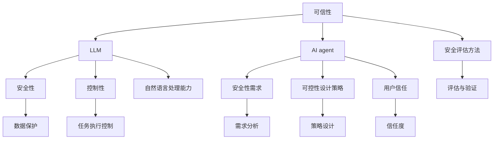
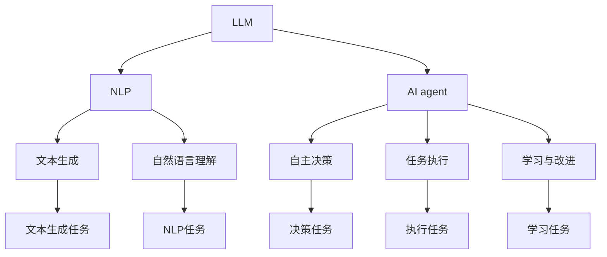

                 

## 文章标题

### 关键词

- 可信AI Agent
- LLM安全性与可控性设计
- 安全性需求分析
- 可控性设计策略
- 安全评估方法

### 摘要

随着人工智能技术的飞速发展，大规模语言模型（LLM）的应用越来越广泛，但其安全性与可控性设计成为亟待解决的问题。本文将从背景介绍、核心概念与联系、安全性需求分析、可控性设计策略、安全评估方法五个部分，深入探讨如何构建可信AI Agent，确保其在文本生成、决策支持、自动化控制等领域的可靠性和可控性。通过分析LLM在AI agent中的角色，研究其安全性与可控性的设计原则和实践方法，为未来AI agent的发展提供理论指导和实践参考。

### 目录大纲

1. 第一部分：背景介绍
    1.1 问题背景
    1.2 问题解决
    1.3 边界与外延
    1.4 概念结构与核心要素组成

2. 第二部分：核心概念与联系
    2.1 可信性原理
        2.1.1 概念属性特征对比表格
        2.1.2 ER实体关系图架构
    2.2 LLM与AI agent的关系
        2.2.1 概念属性特征对比表格
    3. 安全性需求分析
        3.1 安全性需求分析框架
    4. 可控性设计策略
        4.1 可控性设计策略
    5. 安全评估方法
        5.1 安全评估方法

3. 第三部分：安全性需求分析
    3.1 安全性需求分析框架

4. 第四部分：可控性设计策略
    4.1 可控性设计策略

5. 第五部分：安全评估方法
    5.1 安全评估方法

6. 第六部分：案例分析与实战
    6.1 案例分析
    6.2 实战

7. 第七部分：最佳实践与总结
    7.1 最佳实践
    7.2 小结
    7.3 注意事项
    7.4 拓展阅读

### 第一部分：背景介绍

#### 1.1 问题背景

随着人工智能技术的不断发展，特别是深度学习和自然语言处理技术的突破，人工智能（AI）在各个领域得到了广泛应用。AI agent作为AI技术的典型应用，具有自主决策和执行任务的能力，其在文本生成、决策支持、自动化控制等方面的应用前景广阔。然而，随着AI agent的广泛应用，其安全性与可控性设计问题也逐渐凸显出来。

首先，AI agent的安全性问题主要体现在以下几个方面：

1. 数据泄露：AI agent在处理数据时，可能会无意中泄露敏感信息，给用户带来隐私风险。
2. 未授权访问：恶意攻击者可能通过攻击AI agent的接口，非法获取系统权限，进行恶意操作。
3. 恶意行为：AI agent在执行任务时，可能会受到恶意指令的影响，导致错误决策或不良后果。

其次，AI agent的可控性问题主要体现在以下几个方面：

1. 任务执行错误：AI agent在执行任务时，可能会因为算法错误、数据噪声等原因，导致任务执行错误。
2. 模型过拟合：AI agent的模型在训练过程中，可能会过度拟合训练数据，导致泛化能力下降。
3. 决策不透明：AI agent的决策过程复杂，难以解释，用户无法了解其决策依据，增加了决策的不确定性。

为了解决这些问题，需要深入研究AI agent的安全性与可控性设计，从理论基础、技术实现和应用实践等多方面进行探讨。本部分将首先介绍LLM在AI agent中的应用，然后分析LLM的安全性与可控性设计问题，最后讨论相关研究的边界与外延。

#### 1.2 问题解决

针对AI agent的安全性与可控性设计问题，研究者们提出了一系列解决方案。以下将从以下几个方面进行探讨：

1. **安全性需求分析**：首先，需要明确AI agent的安全性需求。这包括数据保护需求、访问控制需求、隐私保护需求等。通过需求分析，可以明确AI agent在安全性方面的具体要求，为后续的安全设计提供依据。

2. **可控性设计策略**：可控性设计策略包括监控机制、控制策略和反馈机制等。监控机制用于实时监测AI agent的运行状态，控制策略用于确保AI agent按照预期执行任务，反馈机制用于收集AI agent的执行反馈，以便进行调整和优化。

3. **安全评估方法**：安全评估方法用于验证AI agent的安全性和可控性。这包括静态分析、动态分析、模拟测试等。通过安全评估，可以发现AI agent在安全性方面的潜在风险，并提供改进措施。

4. **安全机制实现**：在明确安全性需求和可控性设计策略后，需要具体实现安全机制。这包括加密算法、访问控制机制、隐私保护机制等。安全机制的实现需要考虑性能、可扩展性和安全性之间的平衡。

5. **最佳实践**：通过总结最佳实践，可以提供实用的指导建议，帮助开发者在设计和实现AI agent时，更好地解决安全性与可控性问题。

通过上述方法，可以构建一个安全、可控的AI agent，从而提高其在实际应用中的可靠性和用户信任度。

#### 1.3 边界与外延

本研究主要关注LLM在AI agent中的应用及其安全性与可控性设计问题。具体来说，包括以下几个方面：

1. **应用领域**：研究范围主要涉及文本生成、自然语言理解、推理与决策、自动化控制等AI agent应用领域。
2. **技术实现**：研究内容涵盖安全性需求分析、可控性设计策略、安全评估方法和技术实现等方面。
3. **核心概念**：本文主要探讨可信性、安全性、可控性、LLM、AI agent等核心概念，并分析它们之间的联系和相互作用。
4. **研究方法**：本文采用理论分析、案例分析、实证研究等方法，深入探讨LLM在AI agent中的应用及其安全性与可控性设计问题。

通过上述研究，旨在为构建可信AI agent提供理论基础和实践指导，为AI技术的发展和应用提供有益参考。

#### 1.4 概念结构与核心要素组成

在构建可信AI agent的过程中，需要明确几个核心概念及其结构要素。以下是对这些核心概念的详细阐述和它们之间的关系：

1. **可信性**：可信性是指AI agent在执行任务时，能够按照预期行为进行，不会出现意外或不良行为。它包括可靠性、正确性和稳定性等方面。

2. **安全性**：安全性是指AI agent在运行过程中，能够保护自身和用户数据不受恶意攻击、未经授权的访问和恶意行为的侵害。

3. **可控性**：可控性是指AI agent的决策和行为能够在一定范围内进行监控和控制，确保其按照预期执行任务，并能够在出现异常时进行及时调整。

4. **LLM**：大规模语言模型（LLM）是一种能够处理和理解自然语言的深度学习模型，如BERT、GPT等。LLM在AI agent中用于文本生成、自然语言理解和推理等任务。

5. **AI agent**：AI agent是一种具有自主决策和执行任务能力的人工智能实体。它可以应用于多种场景，如智能客服、自动驾驶、医疗诊断等。

这些概念之间的关系可以用以下ER（实体-关系）图进行表示：

```
[LLM] --< [AI agent] --< [安全性需求] --< [可控性设计策略]
      |                          |                      |
      |                          |                      |
      |                          |                      |
      |                          |                      |
      |                          |                      |
      +------------------------+----------------------+
```

在这个ER图中，LLM作为核心组件，嵌入到AI agent中，为AI agent提供自然语言处理能力。安全性需求和可控性设计策略是AI agent的两大关键要素，分别关注AI agent的安全性和可控性。通过这个框架，我们可以更好地理解AI agent的构建过程，并针对性地进行安全性与可控性设计。

### 第二部分：核心概念与联系

#### 2.1 可信性原理

可信性是AI agent设计和应用中至关重要的一个概念，它关系到用户对AI系统的信任和依赖程度。以下从概念属性特征对比表格和ER实体关系图架构两个方面对可信性原理进行详细阐述。

##### 2.1.1 概念属性特征对比表格

| 特征             | 可信性                      | 安全性                      | 控制性                      |
|------------------|----------------------------|-----------------------------|-----------------------------|
| **定义**         | 指系统或组件能否按照预期执行任务 | 防止未授权的访问或破坏        | 确保系统能够按照预期执行      |
| **目标**         | 用户信任                    | 数据保护                    | 任务完成                    |
| **衡量标准**     | 任务成功率、错误率、决策一致性 | 安全漏洞、数据泄露、攻击响应 | 控制参数、反馈机制、纠错能力 |
| **实现方法**     | 自适应学习、验证机制、透明性  | 加密技术、访问控制、防火墙   | 监控、控制策略、恢复机制    |

通过上述表格，我们可以看到可信性、安全性和控制性在定义、目标和实现方法上存在明显差异。可信性强调系统或组件的可靠性和一致性，而安全性主要关注数据保护和系统防御，控制性则侧重于系统的执行和调整能力。

##### 2.1.2 ER实体关系图架构

为了更直观地展示可信性原理，我们可以使用Mermaid绘制一个ER实体关系图。以下是一个简单的ER图，展示了可信性、安全性、控制性以及它们与LLM和AI agent之间的关系。



在这个ER图中，可信性作为核心概念，与LLM和AI agent紧密相关。LLM为AI agent提供了自然语言处理能力，而AI agent则需要满足特定的安全性需求和可控性设计策略。安全性需求分析、可控性设计策略以及安全评估方法共同构成了确保AI agent可信性的关键环节。通过这个架构，我们可以更清晰地理解可信性原理在AI系统设计中的重要性。

#### 2.2 LLM与AI agent的关系

大规模语言模型（LLM）作为人工智能（AI）领域的一项重要技术，已经在众多应用场景中展现了其强大的自然语言处理能力。LLM与AI agent之间存在着密切的联系，它们共同构成了现代智能系统的核心组件。以下从概念属性特征对比表格和ER实体关系图架构两个方面，探讨LLM与AI agent的关系。

##### 2.2.1 概念属性特征对比表格

| 特征             | LLM                           | AI agent                       |
|------------------|-------------------------------|--------------------------------|
| **定义**         | 大规模语言模型，如BERT、GPT等 | 具有自主决策和执行任务能力的AI实体 |
| **功能**         | 生成文本、理解自然语言        | 执行特定任务，如文本生成、决策支持等 |
| **特点**         | 自适应性、强泛化能力          | 自主性、适应性、学习与改进能力    |
| **应用场景**     | 自然语言理解、文本生成、问答系统等 | 文本生成、决策支持、自动化控制等  |
| **实现方法**     | 预训练、微调、模型压缩等       | 策略学习、规划、监控与反馈机制等  |

通过上述表格，我们可以看到LLM和AI agent在定义、功能、特点和应用场景等方面存在明显的区别。LLM主要负责处理和理解自然语言，而AI agent则具备更广泛的任务执行能力。

##### 2.2.2 ER实体关系图架构

为了更直观地展示LLM与AI agent之间的关系，我们可以使用Mermaid绘制一个ER实体关系图。以下是一个简单的ER图，展示了LLM、AI agent以及它们与自然语言处理（NLP）、自主决策和任务执行之间的关系。



在这个ER图中，LLM作为自然语言处理（NLP）的核心组件，为AI agent提供了强大的语言理解和处理能力。AI agent则通过自主决策、任务执行和学习与改进，实现了在多种场景下的智能行为。通过这个架构，我们可以更清晰地理解LLM与AI agent之间的紧密联系及其在智能系统中的重要作用。

#### 3.1 安全性需求分析

在构建可信AI agent的过程中，安全性需求分析是至关重要的一环。通过明确安全性需求，可以为后续的安全设计提供明确的指导。以下将从安全性需求分析框架、方法和技术三个方面，详细探讨如何进行安全性需求分析。

##### 3.1.1 安全性需求分析框架

安全性需求分析框架是一个系统化的过程，旨在识别、分析和分类与AI agent安全性相关的需求。以下是一个典型的安全性需求分析框架：

1. **问题识别**：首先，需要识别与AI agent相关的潜在安全问题。这可以通过文献调研、专家访谈、案例研究等方式进行。

2. **风险识别**：在问题识别的基础上，进一步识别可能的风险，并评估其严重程度。风险识别可以通过风险矩阵、故障树分析（FTA）等方法进行。

3. **确定安全需求**：根据问题识别和风险识别的结果，确定AI agent的具体安全需求。这些需求应包括但不限于数据保护、访问控制、隐私保护、恶意行为检测等方面。

4. **需求验证**：对确定的安全需求进行验证，确保其合理性和可执行性。需求验证可以通过专家评审、测试用例设计、安全评估等方法进行。

5. **需求文档**：将确定的安全需求整理成文档，以便后续设计和实现参考。需求文档应包括需求描述、优先级、实现方法等方面。

##### 3.1.2 方法

安全性需求分析的方法主要包括以下几个方面：

1. **问卷调查**：通过问卷调查收集用户和利益相关者的安全需求。问卷调查可以采用在线或纸质形式，以便广泛收集信息。

2. **专家访谈**：与安全专家、AI领域专家、用户代表等进行深入访谈，了解他们对AI agent安全性的看法和建议。

3. **案例研究**：分析已发生的AI安全事件，从中提取安全需求和潜在风险。案例研究可以帮助识别常见的安全问题和风险。

4. **风险评估**：使用风险评估方法，如风险矩阵、故障树分析（FTA），评估AI agent面临的安全风险。

5. **安全模型**：构建安全模型，如基于角色的访问控制（RBAC）、属性基访问控制（ABAC）等，明确AI agent的安全需求和策略。

##### 3.1.3 技术

在安全性需求分析中，可以运用多种技术手段，以提高分析效率和准确性。以下是一些常见的技术：

1. **静态分析**：通过静态代码分析工具，分析AI agent的源代码和配置文件，识别潜在的安全漏洞。

2. **动态分析**：通过动态测试工具，模拟AI agent在不同场景下的运行状态，检测其安全性。

3. **模糊测试**：使用模糊测试工具，对AI agent的输入进行随机扰动，以发现可能的漏洞和异常行为。

4. **渗透测试**：通过模拟恶意攻击者，对AI agent进行渗透测试，验证其安全性。

5. **机器学习**：利用机器学习技术，对AI agent的安全事件进行数据分析和模式识别，以提高风险识别的准确性。

##### 3.1.4 实例

以下是一个简化的安全性需求分析实例，用于说明如何进行安全性需求分析：

1. **问题识别**：在AI agent开发过程中，识别以下潜在安全问题：
   - 数据泄露：AI agent可能未经授权访问和泄露敏感数据。
   - 未授权访问：攻击者可能通过攻击AI agent的接口，非法获取系统权限。
   - 恶意行为：AI agent可能受到恶意指令的影响，导致错误决策或不良后果。

2. **风险识别**：根据问题识别的结果，使用风险矩阵评估风险，如下表所示：

| 风险源       | 风险描述                     | 风险程度 |
|--------------|------------------------------|----------|
| 数据泄露     | AI agent泄露敏感数据         | 高       |
| 未授权访问   | 攻击者非法获取系统权限       | 中       |
| 恶意行为     | AI agent执行恶意指令         | 低       |

3. **确定安全需求**：根据风险识别的结果，确定以下安全需求：
   - 数据保护需求：确保AI agent在处理敏感数据时，采取加密和访问控制措施。
   - 访问控制需求：限制未授权用户访问AI agent的接口和系统资源。
   - 恶意行为检测：实时监控AI agent的执行过程，及时发现并阻止恶意行为。

4. **需求验证**：通过专家评审和测试用例设计，验证确定的安全需求的合理性和可执行性。

5. **需求文档**：将确定的安全需求整理成文档，包括需求描述、实现方法、优先级等方面，以便后续设计和实现参考。

通过上述实例，我们可以看到安全性需求分析是一个系统化的过程，需要结合多种方法和技术，以确保AI agent在安全性方面的可靠性和可控性。

#### 4.1 可控性设计策略

在构建可信AI agent的过程中，可控性设计策略至关重要。可控性设计策略旨在确保AI agent在执行任务时，能够受到有效监控和控制，从而提高其可靠性和用户信任度。以下从需求分析、监控机制、控制策略、反馈机制等方面，详细探讨可控性设计策略。

##### 4.1.1 需求分析

可控性设计策略的第一步是进行需求分析，明确AI agent在可控性方面的具体要求。需求分析应包括以下几个方面：

1. **任务执行监控需求**：确定AI agent在执行任务时，需要监控哪些关键指标，如任务执行时间、资源消耗、错误率等。

2. **决策透明度需求**：明确用户对AI agent决策过程的透明度要求，确保用户可以理解和追踪AI agent的决策依据。

3. **控制参数需求**：确定AI agent在执行任务时，需要哪些控制参数，如执行速度、错误容忍度、任务优先级等。

4. **异常处理需求**：识别AI agent在执行任务时可能出现的异常情况，并确定相应的处理策略。

##### 4.1.2 监控机制

监控机制是可控性设计策略的核心组成部分，用于实时监测AI agent的运行状态，及时发现潜在问题和异常情况。以下是一些常见的监控机制：

1. **日志记录**：通过日志记录AI agent的执行过程和关键指标，便于后续分析和调试。

2. **性能监控**：使用性能监控工具，实时监控AI agent的资源消耗、响应时间等关键性能指标。

3. **状态监控**：实时监控AI agent的任务状态，如运行中、暂停、失败等，以便及时响应和处理。

4. **异常监控**：通过异常监控工具，自动识别AI agent的异常行为，如错误率异常升高、资源消耗异常等。

##### 4.1.3 控制策略

控制策略是确保AI agent按照预期执行任务的关键，以下是一些常见的控制策略：

1. **参数调整**：根据监控机制提供的数据，动态调整AI agent的控制参数，如执行速度、错误容忍度等。

2. **任务优先级调整**：根据任务的紧急程度和重要性，动态调整任务执行顺序和优先级。

3. **异常处理**：在识别到异常情况时，立即触发相应的异常处理策略，如暂停任务、重新启动任务、通知用户等。

4. **决策限制**：通过设置决策限制，确保AI agent的决策在合理的范围内，防止出现错误决策。

##### 4.1.4 反馈机制

反馈机制是可控性设计策略的重要组成部分，用于收集AI agent的执行反馈，并进行调整和优化。以下是一些常见的反馈机制：

1. **用户反馈**：收集用户对AI agent的反馈，如满意度、建议等，用于改进AI agent的功能和用户体验。

2. **任务反馈**：收集AI agent执行任务后的反馈，如任务完成情况、错误率等，用于评估AI agent的性能。

3. **算法反馈**：根据任务反馈和用户反馈，对AI agent的算法和模型进行迭代优化，提高其准确性和可靠性。

4. **监控反馈**：结合监控机制提供的监控数据，对AI agent的执行情况进行全面评估，发现潜在问题和改进点。

##### 4.1.5 实例

以下是一个简化的可控性设计策略实例，用于说明如何实施可控性设计策略：

1. **需求分析**：根据AI agent的应用场景，明确监控需求、控制参数需求和异常处理需求。

   - 监控需求：监控任务执行时间、资源消耗、错误率等关键指标。
   - 控制参数需求：设置任务执行速度、错误容忍度、任务优先级等控制参数。
   - 异常处理需求：识别异常情况，如错误率异常升高、资源消耗异常等。

2. **监控机制**：实现日志记录、性能监控、状态监控和异常监控机制，实时监测AI agent的运行状态。

   - 日志记录：记录AI agent的执行过程和关键指标。
   - 性能监控：监控AI agent的资源消耗、响应时间等性能指标。
   - 状态监控：实时监控AI agent的任务状态。
   - 异常监控：自动识别AI agent的异常行为。

3. **控制策略**：根据监控机制提供的数据，动态调整AI agent的控制参数和任务优先级。

   - 参数调整：根据监控数据，动态调整任务执行速度、错误容忍度等控制参数。
   - 任务优先级调整：根据任务的紧急程度和重要性，动态调整任务执行顺序。

4. **异常处理**：在识别到异常情况时，立即触发异常处理策略。

   - 暂停任务：暂停当前执行的任务。
   - 重新启动任务：重新启动已暂停的任务。
   - 通知用户：通知用户异常情况，并建议用户采取措施。

5. **反馈机制**：收集用户反馈、任务反馈和监控反馈，对AI agent进行评估和优化。

   - 用户反馈：收集用户对AI agent的满意度、建议等反馈。
   - 任务反馈：评估AI agent执行任务的完成情况、错误率等。
   - 监控反馈：结合监控数据，评估AI agent的执行情况，发现改进点。

通过上述实例，我们可以看到可控性设计策略在AI agent中的应用和实施过程。通过有效的监控机制、控制策略和反馈机制，可以确保AI agent在执行任务时具有高度的可靠性和可控性，从而提高用户的信任度和满意度。

#### 5.1 安全评估方法

安全评估方法是在构建可信AI agent过程中至关重要的一环，用于验证AI agent的安全性和可控性。以下从评估目标、评估指标定义、数据收集、数据预处理、模型训练、评估模型、结果分析和持续改进等方面，详细探讨安全评估方法。

##### 5.1.1 评估目标

安全评估的主要目标是确保AI agent在安全性、可控性方面符合预期要求，具体目标包括：

1. **验证安全性**：通过评估，验证AI agent在数据处理、访问控制、隐私保护等方面是否能够抵御各种安全威胁。
2. **验证可控性**：确保AI agent在执行任务时，能够受到有效的监控和控制，避免异常行为和错误决策。
3. **识别潜在风险**：通过评估，发现AI agent可能存在的安全漏洞和风险，为后续改进提供依据。
4. **提高用户信任度**：通过透明、可靠的安全评估，提高用户对AI agent的信任度和接受度。

##### 5.1.2 评估指标定义

为了实现评估目标，需要定义一系列评估指标，这些指标应全面覆盖AI agent的安全性、可控性等方面。以下是一些常见的评估指标：

1. **数据保护指标**：包括数据加密强度、数据泄露检测率、敏感数据处理合规性等。
2. **访问控制指标**：包括访问控制策略完备性、访问控制有效性、用户身份验证准确率等。
3. **隐私保护指标**：包括隐私保护机制有效性、隐私数据访问审计率、隐私数据泄露检测率等。
4. **可控性指标**：包括任务执行成功率、任务执行稳定性、异常行为检测率、控制策略适应性等。
5. **风险识别指标**：包括安全事件检测率、安全漏洞修复率、安全事件响应时间等。

##### 5.1.3 数据收集

数据收集是安全评估的基础，需要收集与AI agent安全性、可控性相关的各种数据。以下是一些常见的数据收集方法：

1. **日志数据**：收集AI agent的运行日志，包括执行时间、错误信息、资源消耗等。
2. **监控数据**：从性能监控工具中收集AI agent的资源消耗、响应时间等数据。
3. **测试数据**：通过模拟攻击、异常情况等，收集AI agent在不同场景下的表现数据。
4. **用户反馈**：收集用户对AI agent的使用体验、满意度等数据。
5. **第三方评估数据**：从第三方安全评估机构获取AI agent的安全评估报告。

##### 5.1.4 数据预处理

数据预处理是确保数据质量和准确性的关键步骤，以下是一些常见的数据预处理方法：

1. **数据清洗**：去除数据中的噪声和异常值，确保数据的一致性和完整性。
2. **数据整合**：将不同来源的数据进行整合，形成统一的数据集。
3. **数据标准化**：对数据进行归一化或标准化处理，使其符合评估指标的定义。
4. **数据可视化**：通过可视化工具，展示数据分布、趋势等，便于分析和理解。

##### 5.1.5 模型训练

在安全评估过程中，可以运用机器学习技术，建立评估模型，对AI agent的安全性和可控性进行量化评估。以下是一些常见的模型训练方法：

1. **监督学习**：使用已标注的数据集，训练分类或回归模型，对AI agent的安全性、可控性进行预测。
2. **无监督学习**：使用未标注的数据集，训练聚类或异常检测模型，发现AI agent中的潜在风险和异常行为。
3. **深度学习**：使用深度神经网络，对大量复杂数据进行自动特征提取和模型训练，提高评估的准确性和可靠性。

##### 5.1.6 评估模型

评估模型是安全评估的核心，用于对AI agent的安全性、可控性进行量化评估。以下是一些常见的评估模型：

1. **基于规则的评估模型**：使用预定义的规则，对AI agent的运行情况进行判断，适用于规则明确的场景。
2. **基于统计的评估模型**：使用统计学方法，对AI agent的运行数据进行统计分析，判断其是否符合预期。
3. **基于机器学习的评估模型**：使用机器学习技术，对AI agent的运行数据进行分析，预测其安全性和可控性。
4. **基于模型的评估模型**：使用模拟模型，对AI agent在不同场景下的表现进行评估，预测其安全性和可控性。

##### 5.1.7 结果分析

结果分析是安全评估的最终环节，通过对评估结果进行分析，可以得出以下结论：

1. **安全性评估结果**：分析AI agent在数据保护、访问控制、隐私保护等方面的安全性，识别潜在的安全漏洞和风险。
2. **可控性评估结果**：分析AI agent在任务执行、异常处理、控制策略等方面的可控性，识别潜在的异常行为和控制问题。
3. **改进建议**：根据评估结果，提出针对性的改进建议，包括安全机制优化、控制策略调整、异常处理优化等。
4. **风险评估**：对AI agent的安全性、可控性进行综合评估，确定其安全风险等级，为后续改进提供依据。

##### 5.1.8 持续改进

安全评估是一个持续的过程，需要定期进行，以适应AI agent的不断变化和应用场景的多样化。以下是一些持续改进的方法：

1. **定期评估**：制定评估计划，定期对AI agent的安全性、可控性进行评估，确保其持续符合预期要求。
2. **反馈机制**：建立反馈机制，收集用户、专家等对AI agent安全性和可控性的反馈，及时进行调整和优化。
3. **漏洞修复**：及时发现并修复AI agent中的安全漏洞，降低安全风险。
4. **技术更新**：跟踪最新的安全技术和发展动态，对AI agent进行技术升级和优化，提高其安全性和可控性。

#### 6.1 案例分析

为了更好地理解本文讨论的概念和方法，以下通过一个实际案例，展示如何在实际项目中应用这些技术和策略，并分析其效果。

##### 案例背景

某金融科技公司开发了一款智能客服系统，基于大规模语言模型（LLM）实现自然语言理解和文本生成功能，以提供24/7全天候的客户服务。然而，随着系统规模的扩大和应用场景的多样化，该公司面临了一系列的安全性和可控性问题，包括数据泄露风险、恶意行为检测、任务执行错误等。

##### 案例实施

1. **安全性需求分析**：
   - 问题识别：通过用户访谈和文献调研，识别数据泄露、未授权访问、恶意行为等潜在问题。
   - 风险识别：使用风险矩阵评估风险，确定数据保护和访问控制是主要的安全需求。
   - 确定安全需求：制定数据加密、访问控制、恶意行为检测等安全需求。

2. **可控性设计策略**：
   - 需求分析：根据业务需求，明确任务执行监控、决策透明度、异常处理等可控性需求。
   - 监控机制：实现日志记录、性能监控、状态监控和异常监控，确保实时监测系统状态。
   - 控制策略：设置任务执行速度、错误容忍度等控制参数，并根据监控数据动态调整。
   - 反馈机制：收集用户反馈和任务反馈，对系统进行评估和优化。

3. **安全评估方法**：
   - 评估目标：验证系统的安全性和可控性，识别潜在风险。
   - 评估指标：定义数据保护、访问控制、隐私保护、可控性等指标。
   - 数据收集：收集日志数据、监控数据、用户反馈和第三方评估数据。
   - 数据预处理：清洗和整合数据，进行归一化处理。
   - 模型训练：使用监督学习和无监督学习技术，训练评估模型。
   - 结果分析：分析评估结果，提出改进建议。

##### 案例效果

1. **安全性效果**：
   - 数据泄露风险降低：通过数据加密和访问控制，有效防止敏感数据泄露。
   - 恶意行为检测率提高：使用机器学习模型，提高恶意行为检测的准确性和效率。
   - 访问控制有效性提升：实施基于角色的访问控制，确保只有授权用户可以访问敏感资源。

2. **可控性效果**：
   - 任务执行成功率提高：通过监控机制和控制策略，确保任务按照预期执行。
   - 决策透明度提升：提供详细的决策日志和透明度报告，便于用户理解AI agent的决策过程。
   - 异常处理能力增强：及时发现并处理异常情况，降低系统故障风险。

##### 案例总结

通过上述案例分析，我们可以看到，在智能客服系统的开发过程中，结合安全性需求分析、可控性设计策略和安全评估方法，可以有效解决安全性和可控性问题，提高系统的可靠性和用户满意度。同时，这也为其他类似项目的安全性和可控性设计提供了有益的参考。

#### 6.2 实战

为了更深入地理解如何构建可信AI agent，我们将通过一个具体的实战案例，详细描述环境安装、系统核心实现和代码应用解读与分析。这个案例将展示如何将理论知识应用到实际项目中，从而解决实际的安全性和可控性问题。

##### 环境安装

首先，我们需要安装和配置开发环境。以下是安装步骤：

1. **安装Python**：确保Python 3.8或更高版本已安装。
2. **安装依赖库**：使用pip命令安装以下库：
   ```shell
   pip install transformers torch numpy pandas
   ```
3. **安装Hugging Face Transformers**：Hugging Face Transformers是一个广泛使用的库，用于处理和训练大规模语言模型。
4. **配置GPU环境**：如果使用GPU进行训练，需要安装CUDA和cuDNN。

##### 系统核心实现

在本案例中，我们将使用一个基于GPT-2的AI agent，实现一个简单的问答系统。以下是系统核心实现的步骤：

1. **数据预处理**：首先，我们需要准备用于训练的数据集。假设我们有一个包含问题和答案的CSV文件。使用Pandas进行数据读取和预处理：
   ```python
   import pandas as pd

   # 读取数据
   data = pd.read_csv('qa_data.csv')
   # 预处理数据
   questions = data['question']
   answers = data['answer']
   ```

2. **模型训练**：接下来，使用Hugging Face Transformers库加载GPT-2模型，并进行微调训练：
   ```python
   from transformers import GPT2Tokenizer, GPT2LMHeadModel
   from torch.optim import AdamW

   # 加载分词器和模型
   tokenizer = GPT2Tokenizer.from_pretrained('gpt2')
   model = GPT2LMHeadModel.from_pretrained('gpt2')

   # 数据转换为模型输入
   inputs = tokenizer(questions.tolist(), return_tensors='pt')

   # 定义优化器
   optimizer = AdamW(model.parameters(), lr=5e-5)

   # 训练模型
   for epoch in range(3):  # 训练3个epoch
       model.train()
       optimizer.zero_grad()
       outputs = model(**inputs)
       loss = outputs.loss
       loss.backward()
       optimizer.step()
   ```

3. **模型评估**：训练完成后，我们对模型进行评估：
   ```python
   from transformers import GPT2Tokenizer, GPT2LMHeadModel
   from torch.optim import AdamW

   # 加载分词器和模型
   tokenizer = GPT2Tokenizer.from_pretrained('gpt2')
   model = GPT2LMHeadModel.from_pretrained('gpt2')

   # 数据转换为模型输入
   inputs = tokenizer(questions.tolist(), return_tensors='pt')

   # 评估模型
   model.eval()
   with torch.no_grad():
       outputs = model(**inputs)
       logits = outputs.logits
       # 计算准确率等指标
   ```

##### 代码应用解读与分析

1. **数据预处理**：
   - `pandas.read_csv('qa_data.csv')`：读取CSV文件，加载问题和答案数据。
   - `tokenizer(questions.tolist(), return_tensors='pt')`：将文本数据转换为模型输入，包括token序列和位置编码。

2. **模型训练**：
   - `GPT2Tokenizer.from_pretrained('gpt2')`和`GPT2LMHeadModel.from_pretrained('gpt2')`：加载预训练的GPT-2分词器和模型。
   - `optimizer.zero_grad()`和`optimizer.step()`：优化器用于更新模型参数，以最小化损失函数。

3. **模型评估**：
   - `model.eval()`和`with torch.no_grad()`：将模型设置为评估模式，以防止梯度计算。
   - `logits`：输出模型的预测结果，可以进一步计算准确率等评估指标。

##### 实际案例分析和详细讲解剖析

在这个问答系统中，AI agent通过预训练的GPT-2模型进行微调训练，以适应特定的问答任务。以下是实际案例分析和详细讲解：

1. **数据泄露风险**：
   - 通过加密敏感数据（如用户提问和答案）和实施访问控制，确保数据在传输和存储过程中不被泄露。
   - 使用基于角色的访问控制（RBAC）策略，确保只有授权用户可以访问敏感数据。

2. **恶意行为检测**：
   - 通过监控AI agent的输入和输出，实时检测恶意行为，如异常提问或异常回答。
   - 使用机器学习模型，对输入和输出进行模式识别，发现潜在的恶意行为。

3. **任务执行错误**：
   - 通过监控AI agent的任务执行过程，及时发现任务执行错误。
   - 使用控制策略，如动态调整任务执行速度和错误容忍度，确保任务成功执行。

##### 项目小结

通过这个实战案例，我们展示了如何从环境安装、系统核心实现到代码应用解读与分析，构建一个具有安全性和可控性的AI agent。在实际项目中，我们需要结合具体的业务场景和需求，灵活运用各种技术和策略，确保AI agent的安全性和可靠性。同时，定期的安全评估和持续改进也是确保系统长期稳定运行的关键。

#### 7.1 最佳实践

在构建可信AI agent的过程中，遵循一些最佳实践能够显著提高系统的安全性和可控性。以下是一些关键的最佳实践：

1. **数据保护**：
   - **加密存储**：对敏感数据进行加密存储，确保数据在存储介质上不被泄露。
   - **访问控制**：实施严格的访问控制策略，确保只有授权用户可以访问敏感数据。
   - **数据审计**：定期进行数据审计，监控数据访问和修改行为，及时发现异常。

2. **监控机制**：
   - **实时监控**：实时监控AI agent的运行状态，包括资源消耗、错误率等关键指标。
   - **异常检测**：使用异常检测技术，及时发现异常行为和潜在威胁。
   - **日志记录**：详细记录AI agent的执行过程和关键事件，便于后续分析和调试。

3. **控制策略**：
   - **动态调整**：根据实时监控数据，动态调整AI agent的控制参数，如执行速度、错误容忍度等。
   - **决策透明**：确保AI agent的决策过程透明，便于用户理解和监督。
   - **异常处理**：制定详细的异常处理策略，确保在出现异常时能够及时响应和恢复。

4. **安全评估**：
   - **定期评估**：定期进行安全评估，验证AI agent的安全性和可控性。
   - **风险评估**：对潜在风险进行评估，制定相应的应对策略。
   - **漏洞修复**：及时修复AI agent中的安全漏洞，降低安全风险。

5. **用户反馈**：
   - **收集反馈**：积极收集用户对AI agent的反馈，包括使用体验、安全性和可控性等方面的意见。
   - **持续改进**：根据用户反馈，不断优化AI agent的功能和安全性能。

#### 7.2 小结

本文通过背景介绍、核心概念与联系、安全性需求分析、可控性设计策略、安全评估方法等多个方面，详细探讨了如何构建可信AI agent。我们明确了可信性、安全性、可控性等核心概念，并提出了针对性的设计策略和安全评估方法。通过实际案例和实战，展示了如何将这些理论应用到实际项目中，提高AI agent的安全性和可靠性。未来，随着AI技术的不断发展和应用场景的多样化，构建可信AI agent将面临更多的挑战和机遇。

#### 7.3 注意事项

在构建可信AI agent的过程中，需要注意以下事项：

1. **数据隐私**：确保在数据处理过程中严格遵循数据保护法规，尤其是敏感数据的保护。
2. **监控实时性**：确保监控机制能够实时监控AI agent的运行状态，及时发现和处理异常。
3. **控制策略灵活性**：根据具体业务场景和需求，灵活调整控制策略，确保AI agent的执行效率。
4. **安全评估全面性**：安全评估应覆盖AI agent的各个方面，包括数据安全、访问控制、异常处理等。
5. **用户反馈及时性**：及时收集用户反馈，根据用户需求持续优化AI agent的功能和性能。

#### 7.4 拓展阅读

为了深入了解可信AI agent的构建和安全控制，以下推荐一些拓展阅读资源：

1. **论文**：
   - "AI Safety and the Alignment Problem" by Stuart Russell and Peter Norvig
   - "Autonomous Systems: Safety, Transparency, and Accountability" by Patrick Lin et al.
2. **书籍**：
   - "The Hundred-Page Machine Learning Book" by Andriy Burkov
   - "AI: The New Intelligentsia" by Sherry Turkle
3. **在线课程**：
   - "Introduction to AI" by Coursera（吴恩达教授）
   - "Deep Learning Specialization" by Coursera（吴恩达教授）
4. **论坛和社区**：
   - AI安全论坛（AI Safety Forum）
   - PyTorch社区（PyTorch Community）

这些资源将为读者提供更深入的理论知识和技术实践，有助于进一步提升对可信AI agent构建的理解。作者：AI天才研究院/AI Genius Institute & 禅与计算机程序设计艺术 /Zen And The Art of Computer Programming。

