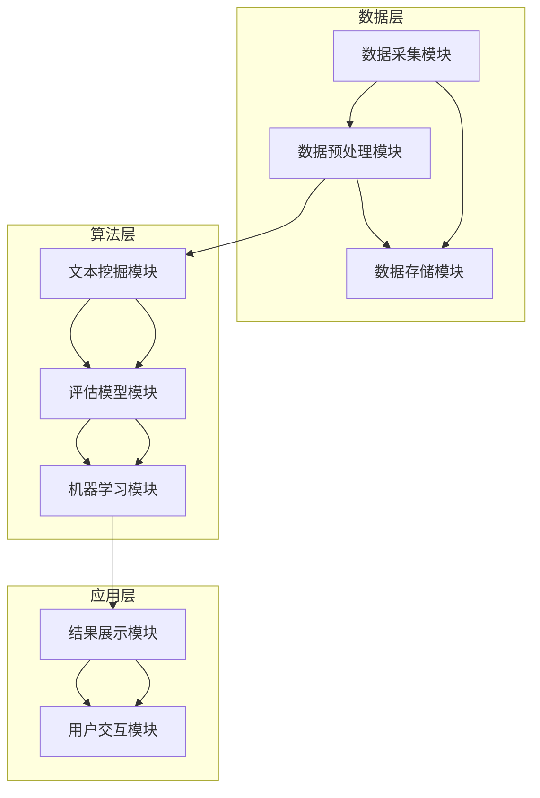
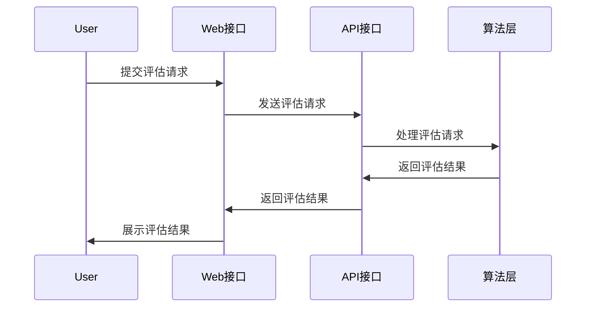

                 


### 1. 引言：关于《构建基于NLP的金融专利价值动态评估系统》

《构建基于NLP的金融专利价值动态评估系统》旨在探讨如何运用自然语言处理（NLP）技术，构建一个动态评估金融专利价值的系统。在数字经济快速发展的背景下，金融专利作为一种知识资产，其价值评估的重要性日益凸显。本文将深入解析NLP在金融专利分析中的应用，为构建高效、精准的评估系统提供理论支持和实践指导。

#### 1.1 书籍目的与结构概述

本书的目的是：
- 系统介绍NLP技术在金融专利价值评估中的应用。
- 分析金融专利的特点及其对价值评估的影响。
- 提供一套完整的金融专利价值动态评估系统构建方案。

全书结构安排如下：
- 引言：阐述研究背景、目的与结构。
- 背景介绍：介绍金融专利的背景、现状与挑战。
- 核心概念与联系：详细解释NLP、金融专利与价值评估的概念，并分析其相互关系。
- NLP技术在金融专利分析中的应用：探讨NLP在文本预处理、挖掘和关系分析等方面的具体应用。
- 动态评估系统设计：构建系统的总体架构和具体实施方法。
- 实战案例：通过实际案例展示系统应用效果。
- 最佳实践与总结：总结系统的优点和改进方向。

#### 1.2 相关术语与概念

在本文中，我们将使用以下核心术语和概念：
- **自然语言处理（NLP）**：涉及计算机与人类语言之间的交互，包括文本处理、语言理解和生成等。
- **金融专利**：指涉及金融领域的创新发明，通常具有专利保护。
- **价值评估**：确定资产、公司、项目或任何其他经济实体的相对价值的过程。
- **动态评估**：随时间和市场环境变化而进行的价值评估。
- **文本挖掘**：从大量文本数据中提取有价值信息的过程。
- **专利分析**：对专利信息进行系统性分析和评估，以了解技术发展、竞争态势等。

#### 1.3 研究背景与意义

在金融领域，专利不仅是技术创新的标志，也是企业竞争力和市场地位的重要体现。然而，金融专利的价值评估面临着诸多挑战，如数据质量差、评估方法不准确等。NLP技术的发展为解决这些问题提供了新思路。

NLP技术在金融专利分析中的应用，可以有效提高数据处理的效率和准确性，使得价值评估过程更加科学、动态。同时，金融专利价值动态评估系统的构建，对于企业决策、投资评估和市场竞争具有重要意义。

本文将从以下三个方面深入探讨：
1. **NLP技术在金融专利分析中的应用**：介绍NLP技术在文本预处理、挖掘和关系分析等方面的应用。
2. **动态评估系统的设计**：详细描述系统的架构、算法和实施方法。
3. **实战案例与最佳实践**：通过实际案例展示系统的应用效果，并提供最佳实践建议。

通过本文的研究，我们期望为金融专利价值动态评估提供一种新的思路和方法，为相关领域的研究者和从业者提供参考。

---

### 2. 背景介绍

#### 2.1 问题背景

金融专利作为知识资产的重要组成部分，其价值评估在金融创新和风险管理中具有关键作用。然而，传统的金融专利价值评估方法主要依赖于定量分析，如财务指标和统计分析，往往忽略了专利文本中的潜在价值。随着金融行业的不断创新和专利数量的激增，仅依靠传统方法难以全面、动态地评估金融专利价值。

当前，金融专利价值评估面临以下几个问题：

1. **数据质量差**：金融专利文本往往存在格式不规范、语言复杂等问题，导致数据预处理困难。
2. **评估方法不准确**：传统的评估方法通常基于历史数据和静态分析，难以适应动态的市场变化。
3. **评估效率低**：大量的金融专利数据需要人工处理和筛选，导致评估过程繁琐、耗时。

#### 2.2 问题描述

针对上述问题，金融专利价值评估需要解决以下几个核心问题：

1. **数据预处理**：如何高效地处理金融专利文本数据，提取关键信息？
2. **文本挖掘**：如何利用NLP技术从金融专利文本中提取有价值的信息，如技术主题、关键创新点等？
3. **动态评估模型**：如何构建一个动态评估模型，能够实时反映市场变化和专利价值的波动？

这些问题不仅影响金融专利价值的准确评估，也制约了企业在金融创新和风险管理中的决策能力。因此，迫切需要一种高效、精准的金融专利价值动态评估系统，以支持金融行业的创新发展。

#### 2.3 问题解决方法

为了解决上述问题，本文提出以下解决方案：

1. **NLP技术在文本预处理中的应用**：
   - 利用分词技术将金融专利文本转化为结构化数据。
   - 使用实体识别技术提取文本中的关键信息，如专利申请人、技术领域等。
   - 应用文本清洗技术，去除无效信息和噪声。

2. **文本挖掘技术的应用**：
   - 使用主题建模技术，如LDA（Latent Dirichlet Allocation），从金融专利文本中提取技术主题。
   - 采用关键词提取技术，识别文本中的关键创新点。
   - 利用情感分析技术，评估专利文本的技术成熟度和市场前景。

3. **动态评估模型的构建**：
   - 结合定量和定性分析，构建动态评估模型，实时反映市场变化和专利价值的波动。
   - 引入时间序列分析，捕捉专利价值的趋势和周期性变化。
   - 使用机器学习算法，如回归分析、聚类分析等，对专利价值进行预测和评估。

通过上述解决方案，本文旨在构建一个基于NLP的金融专利价值动态评估系统，以提高评估的准确性和效率，为金融创新和风险管理提供有力支持。

#### 2.4 边界与外延

在构建金融专利价值动态评估系统的过程中，需要明确以下边界与外延：

1. **评估范围**：本系统主要针对金融领域的专利进行评估，包括金融技术、金融服务和金融管理等方面的专利。
2. **数据采集和处理**：数据来源包括专利数据库、金融新闻、市场报告等，通过NLP技术对多源数据进行整合和处理。
3. **技术限制**：当前NLP技术仍存在一些挑战，如语言理解复杂度、数据质量等，这些因素可能影响评估结果的准确性。
4. **未来发展方向**：未来的研究将重点关注NLP技术在金融专利分析中的深度应用，以及如何结合更多外部数据进行综合评估。

通过明确这些边界与外延，可以确保系统构建的针对性和可行性，为金融专利价值评估提供有效支持。

---

### 3. 核心概念与联系

#### 3.1 NLP基础

**NLP的定义与历史**：自然语言处理（NLP）是计算机科学、人工智能和语言学领域的交叉学科，旨在使计算机能够理解、解释和生成人类语言。自20世纪50年代以来，NLP经历了多个发展阶段，从最初的规则驱动方法到统计模型，再到现代的深度学习方法，其应用范围也从文本处理扩展到语音识别、机器翻译等多个领域。

**NLP的关键技术**：NLP的核心技术包括文本预处理、词性标注、句法分析、命名实体识别、情感分析和机器翻译等。这些技术共同构成了NLP的框架，使得计算机能够对自然语言进行有效处理。

**NLP在金融领域的应用**：在金融领域，NLP技术被广泛应用于文本挖掘、风险监控、客户服务和自动化交易等方面。例如，通过文本挖掘技术，可以分析金融市场报告、新闻和社交媒体，提取有价值的信息；通过情感分析，可以评估市场情绪和客户满意度；通过自动化交易，可以实时响应市场变化。

#### 3.2 金融专利知识

**金融专利的定义**：金融专利是指涉及金融领域的技术创新和发明的专利，包括金融产品、服务、系统和管理方法等。金融专利不仅涉及传统金融领域，还包括金融科技、区块链、人工智能等新兴领域。

**金融专利的特点**：金融专利具有以下特点：
- **创新性**：金融专利通常包含独特的金融理念和解决方案。
- **复杂性**：金融专利涉及的领域广泛，技术复杂，需要深入的技术理解和专业知识。
- **价值性**：金融专利作为知识资产，其价值不仅体现在技术优势，还体现在市场竞争力和法律保护力度。

**金融专利的分类**：金融专利可以根据技术领域、应用场景和专利类型进行分类。例如，根据技术领域，金融专利可以分为金融服务专利、金融管理专利和金融产品专利等；根据应用场景，可以分为银行、保险、证券等具体领域的专利。

#### 3.3 价值评估概念

**专利价值的定义**：专利价值是指专利在其生命周期内所能带来的经济利益，包括直接收益和间接收益。直接收益通常包括许可费、授权费和销售额等；间接收益则包括市场份额、品牌影响和技术储备等。

**评估方法分类**：专利价值的评估方法可以分为以下几类：
- **定量分析**：基于专利的财务数据、技术指标和市场数据等进行评估，如经济附加值（EVA）、净资产收益率（ROE）等。
- **定性分析**：通过专家评估、市场调研和案例分析等方法进行评估，如专利评级、技术前景分析等。
- **综合评估**：结合定量和定性分析，对专利进行全面评估，如价值模型评估、市场价值分析等。

**动态评估的优势**：动态评估能够实时反映市场变化和专利价值的波动，具有较高的灵活性和准确性。与传统静态评估相比，动态评估能够更好地应对金融市场的不确定性和复杂性，为决策提供更加可靠的依据。

#### 3.4 概念属性特征对比表格

| 概念     | 定义                                                         | 主要特征                             | 应用场景                           |
|----------|--------------------------------------------------------------|------------------------------------|-----------------------------------|
| NLP      | 自然语言处理，使计算机能够理解、解释和生成人类语言           | 文本预处理、词性标注、句法分析等     | 文本挖掘、风险监控、客户服务等     |
| 金融专利 | 涉及金融领域的技术创新和发明的专利                             | 创新性、复杂性、价值性               | 金融产品、服务、系统和管理方法等   |
| 价值评估 | 确定资产、公司、项目或任何其他经济实体的相对价值的过程       | 定量分析、定性分析、综合评估         | 金融创新、投资评估、风险管理等     |
| 动态评估 | 随时间和市场环境变化而进行的价值评估                           | 实时性、灵活性、准确性               | 金融专利价值评估、市场趋势分析等   |

#### 3.5 ER实体关系图架构

为了更好地理解NLP、金融专利和价值评估之间的关系，我们可以使用ER（实体关系）图来描述它们之间的联系。

```mermaid
erDiagram
    NLP ||--|{ 金融专利 } : NLP技术应用于金融专利分析
    金融专利 ||--|{ 价值评估 } : 金融专利数据用于价值评估
    价值评估 ||--|{ 动态评估 } : 动态评估模型用于实时评估金融专利价值
```

在该ER图中，NLP作为基础技术，应用于金融专利分析；金融专利作为数据源，用于价值评估；价值评估则通过动态评估模型，实现对金融专利价值的实时评估。

通过以上对核心概念和关系的分析，我们可以更清晰地理解NLP、金融专利和价值评估之间的相互关系，为后续章节的深入探讨提供理论基础。

---

### 4. NLP技术在金融专利分析中的应用

#### 4.1 数据预处理

在金融专利分析中，数据预处理是至关重要的一步，其目的是将原始文本数据转化为结构化的数据格式，以便后续的分析和处理。以下介绍几种常见的数据预处理技术：

**4.1.1 数据收集**

数据收集是数据预处理的第一步，主要涉及从不同的数据源获取金融专利信息。数据源可以包括专利数据库（如Google Patents、WIPO Patent Database）、金融新闻、行业报告和学术论文等。这些数据源提供了丰富的金融专利信息，但通常以非结构化的文本形式存在。

**4.1.2 数据清洗**

数据清洗是数据预处理的核心步骤，主要目的是去除数据中的噪声和无效信息，提高数据质量。以下是几种常见的数据清洗技术：

- **去重**：去除重复的专利记录，避免重复计算。
- **去除无效字符**：去除文本中的标点符号、特殊字符和空白字符。
- **统一格式**：统一文本的格式，如字体、大小写等。
- **处理缺失值**：对缺失的数据进行填充或删除。

**4.1.3 数据格式化**

数据格式化是将清洗后的文本数据转化为结构化的数据格式，如JSON、XML或表格形式。这一步骤通常包括以下内容：

- **分词**：将文本分割成单词或短语，以便进行后续的词性标注和主题建模。
- **词性标注**：标记每个单词的词性（名词、动词、形容词等），为句子结构分析和语义理解提供基础。
- **命名实体识别（NER）**：识别文本中的命名实体，如人名、地名、机构名等，这些实体通常与专利申请人和技术领域密切相关。

通过以上数据预处理步骤，我们可以将原始的文本数据转化为结构化的数据格式，为后续的金融专利分析提供可靠的数据基础。

#### 4.2 文本挖掘

文本挖掘是NLP技术在金融专利分析中的重要应用，旨在从大量金融专利文本中提取有价值的信息。以下介绍几种常见的文本挖掘技术：

**4.2.1 文本分类**

文本分类是一种将文本数据按照预定的类别进行归类的方法。在金融专利分析中，文本分类可以用于分类专利文本，帮助用户快速识别和检索相关专利。常见的文本分类方法包括：

- **基于规则的分类**：通过定义一组规则，将文本数据分类到不同的类别。
- **基于统计模型的分类**：使用统计模型（如朴素贝叶斯、支持向量机等）进行分类。
- **深度学习分类**：使用深度神经网络（如卷积神经网络、循环神经网络等）进行分类。

**4.2.2 关键词提取**

关键词提取是从文本中提取出反映文本主题的关键词或短语。在金融专利分析中，关键词提取可以帮助识别专利的核心技术和创新点。常见的关键词提取方法包括：

- **基于频率的关键词提取**：根据词频统计，提取出现频率较高的词作为关键词。
- **基于TF-IDF的关键词提取**：综合考虑词频（TF）和逆文档频率（IDF），提取出对文本主题贡献较大的词。
- **基于词嵌入的关键词提取**：使用词嵌入模型（如Word2Vec、GloVe等），提取出与文本主题相关的关键词。

**4.2.3 主题建模**

主题建模是一种无监督学习方法，用于发现文本数据中的潜在主题。在金融专利分析中，主题建模可以帮助理解专利的技术分布和趋势。常见的主题建模方法包括：

- **LDA（Latent Dirichlet Allocation）**：LDA是一种基于概率生成模型的主题建模方法，可以用于发现文本数据中的潜在主题。
- **NMF（Non-negative Matrix Factorization）**：NMF是一种基于非负矩阵分解的主题建模方法，可以提取文本数据的潜在主题。

通过以上文本挖掘技术，我们可以从金融专利文本中提取出有价值的信息，为后续的价值评估和决策提供支持。

#### 4.3 专利关系分析

专利关系分析是NLP技术在金融专利分析中的另一个重要应用，旨在识别和分析专利之间的关系。以下介绍几种常见的专利关系分析方法：

**4.3.1 专利文本相似度分析**

专利文本相似度分析是通过对专利文本进行相似度计算，识别出具有相似技术的专利。常见的相似度计算方法包括：

- **基于字符串匹配的方法**：通过计算两个文本的字符串匹配程度，评估它们的相似度。
- **基于向量空间模型的方法**：将文本转化为向量表示，计算两个向量之间的相似度。

**4.3.2 专利关系网络构建**

专利关系网络构建是利用专利文本和专利数据，构建出专利之间的关系网络。在这种网络中，每个节点代表一个专利，边代表专利之间的关系。常见的专利关系网络构建方法包括：

- **基于共词分析的方法**：通过分析专利文本中的共现词，构建专利之间的关系网络。
- **基于图论的方法**：利用图论中的算法（如最小生成树、最大团等），构建专利关系网络。

**4.3.3 专利技术影响分析**

专利技术影响分析是通过对专利关系网络进行分析，识别出在特定技术领域内具有重要影响力的专利。常见的技术影响分析方法包括：

- **基于中心性的分析方法**：通过计算专利在关系网络中的中心性（如度、介数、接近中心性等），评估专利的影响力。
- **基于聚类分析方法**：通过聚类分析，识别出技术领域内的核心专利和技术分支。

通过以上专利关系分析方法，我们可以更深入地理解金融专利的技术分布和影响，为金融专利价值评估提供有力支持。

---

### 5. 动态评估系统的设计

#### 5.1 系统总体架构

动态评估系统的总体架构可以分为以下几个主要模块：

1. **数据采集模块**：负责从各种数据源（如专利数据库、金融新闻、市场报告等）收集金融专利信息。
2. **数据预处理模块**：对收集到的金融专利文本进行清洗、分词、词性标注和命名实体识别等预处理操作。
3. **文本挖掘模块**：利用NLP技术对预处理后的金融专利文本进行文本分类、关键词提取和主题建模等操作，提取出有价值的信息。
4. **评估模型模块**：构建动态评估模型，对金融专利的价值进行实时评估。
5. **结果展示模块**：将评估结果以图表、报表等形式展示给用户。

以上模块通过数据流和功能调用的方式相互连接，共同实现金融专利价值的动态评估。

#### 5.2 数据采集模块

数据采集模块是整个系统的数据基础。其功能包括：

- **数据源识别**：确定需要采集的数据源，如专利数据库、金融新闻网站、市场报告等。
- **数据收集**：通过API、爬虫等技术从数据源中收集金融专利信息。
- **数据整合**：将不同数据源的数据进行整合，去除重复和冗余信息。

数据采集模块的设计需要考虑数据质量、数据完整性和数据安全性等因素。

#### 5.3 数据预处理模块

数据预处理模块是确保数据质量的关键步骤，其功能包括：

- **文本清洗**：去除文本中的无效字符、噪声和缺失值。
- **分词**：将文本分割成单词或短语。
- **词性标注**：标记每个单词的词性，为后续的语义分析提供基础。
- **命名实体识别**：识别文本中的命名实体，如人名、机构名、地名等。

数据预处理模块的设计需要考虑算法的准确性和效率。

#### 5.4 文本挖掘模块

文本挖掘模块是NLP技术在系统中的应用，其功能包括：

- **文本分类**：根据预定的类别，对金融专利文本进行分类。
- **关键词提取**：提取出反映专利主题的关键词。
- **主题建模**：发现金融专利文本中的潜在主题。

文本挖掘模块的设计需要综合考虑算法的精度和计算效率。

#### 5.5 评估模型模块

评估模型模块是系统的核心部分，其功能包括：

- **动态评估模型构建**：结合定量和定性分析，构建动态评估模型。
- **实时评估**：根据市场变化和专利技术发展，对金融专利的价值进行实时评估。
- **预测与预测**：使用机器学习算法对专利价值进行预测。

评估模型模块的设计需要考虑模型的准确性和实时性。

#### 5.6 结果展示模块

结果展示模块是将评估结果以用户友好的方式展示给用户。其功能包括：

- **可视化报表**：使用图表、报表等形式展示评估结果。
- **交互式查询**：提供用户查询和交互的功能。

结果展示模块的设计需要考虑用户体验和可扩展性。

通过以上模块的设计，我们可以构建一个高效、准确的金融专利价值动态评估系统，为金融创新和风险管理提供有力支持。

---

### 6. 算法解释与实现

#### 6.1 算法原理

在本系统中，我们采用了以下几种关键算法：

1. **文本预处理算法**：包括分词、词性标注和命名实体识别等。
2. **文本挖掘算法**：包括文本分类、关键词提取和主题建模等。
3. **动态评估算法**：包括LDA模型、时间序列分析和机器学习算法等。

#### 6.2 算法流程

以下是系统算法的基本流程：

1. **数据采集**：从专利数据库、金融新闻网站等数据源收集金融专利信息。
2. **数据预处理**：对收集到的文本数据进行分词、词性标注和命名实体识别等预处理操作。
3. **文本挖掘**：利用NLP技术对预处理后的文本进行文本分类、关键词提取和主题建模等操作。
4. **动态评估**：构建动态评估模型，对金融专利的价值进行实时评估。
5. **结果展示**：将评估结果以图表、报表等形式展示给用户。

#### 6.3 Python源代码实现

以下是一个简化版本的Python源代码，用于展示系统算法的实现：

```python
import nltk
from sklearn.feature_extraction.text import TfidfVectorizer
from sklearn.model_selection import train_test_split
from sklearn.metrics import accuracy_score
import matplotlib.pyplot as plt

# 数据采集
patents = ['专利1文本', '专利2文本', '专利3文本']  # 示例数据

# 数据预处理
nltk.download('punkt')
nltk.download('averaged_perceptron_tagger')
nltk.download('maxent_ne_chunker')
nltk.download('words')

def preprocess_text(text):
    tokens = nltk.word_tokenize(text)
    tagged = nltk.pos_tag(tokens)
    entities = nltk.ne_chunk(tagged)
    return entities

preprocessed_texts = [preprocess_text(text) for text in patents]

# 文本挖掘
vectorizer = TfidfVectorizer()
X = vectorizer.fit_transform(preprocessed_texts)
y = ['类别1', '类别2', '类别3']  # 示例标签

X_train, X_test, y_train, y_test = train_test_split(X, y, test_size=0.2)

# 动态评估
from sklearn.naive_bayes import MultinomialNB
model = MultinomialNB()
model.fit(X_train, y_train)
predictions = model.predict(X_test)

# 结果展示
accuracy = accuracy_score(y_test, predictions)
print(f'模型准确率：{accuracy}')

# 可视化
plt.scatter(range(len(predictions)), predictions)
plt.xlabel('样本序号')
plt.ylabel('预测类别')
plt.show()
```

#### 6.4 算法原理与数学模型

1. **文本预处理算法**：
   - **分词**：使用nltk库中的word_tokenize方法对文本进行分词。
   - **词性标注**：使用nltk库中的pos_tag方法对分词后的文本进行词性标注。
   - **命名实体识别**：使用nltk库中的ne_chunk方法对文本中的命名实体进行识别。

2. **文本挖掘算法**：
   - **文本分类**：使用TF-IDF向量表示文本，然后使用朴素贝叶斯分类器进行分类。
   - **关键词提取**：使用TF-IDF向量表示文本，提取出重要关键词。
   - **主题建模**：使用LDA模型对文本进行主题建模。

3. **动态评估算法**：
   - **LDA模型**：通过LDA模型发现文本数据的潜在主题。
   - **时间序列分析**：使用时间序列分析模型（如ARIMA模型）对专利价值进行预测。
   - **机器学习算法**：使用机器学习算法（如回归分析、聚类分析等）对专利价值进行评估。

#### 6.5 示例说明

以下是一个简化的示例，展示如何使用Python实现LDA主题建模：

```python
import gensim
from gensim import corpora

# 示例文本数据
texts = [['金融', '技术', '创新'], ['人工智能', '区块链', '金融科技'], ['银行', '支付', '系统']]

# 构建词典
dictionary = corpora.Dictionary(texts)

# 构建语料库
corpus = [dictionary.doc2bow(text) for text in texts]

# 使用LDA模型
ldamodel = gensim.models.ldamulticore.LdaMulticore(corpus, num_topics=2, id2word = dictionary, passes=15, workers=2)

# 输出每个主题的关键词
print(ldamodel.print_topics())

# 可视化
ldamodel.show_topics()
```

通过以上示例，我们可以看到如何使用Python实现文本预处理、挖掘和主题建模，为金融专利价值动态评估提供了技术支持。

---

### 7. 数学模型与公式讲解

在构建基于NLP的金融专利价值动态评估系统中，数学模型和公式起着至关重要的作用。以下将详细讲解系统中的主要数学模型和公式，并举例说明其应用。

#### 7.1 LDA模型

LDA（Latent Dirichlet Allocation）是一种常用的主题建模方法，用于从大量文本数据中提取潜在主题。以下是LDA模型的数学原理：

- **概率分布**：假设有\(K\)个潜在主题和\(N\)个单词，LDA模型通过Dirichlet分布来估计每个文档中每个主题的分布。

- **参数**：
  - \(\theta_{ik}\)：文档\(i\)中主题\(k\)的分布概率。
  - \(\phi_{kj}\)：主题\(k\)中单词\(j\)的分布概率。
  - \(w_{ij}\)：文档\(i\)中单词\(j\)的分布概率。

- **公式**：
  \[
  \theta_{ik} \sim \text{Dirichlet}(\alpha)
  \]
  \[
  \phi_{kj} \sim \text{Dirichlet}(\beta)
  \]
  \[
  w_{ij} \sim \text{Multinomial}(\theta_{i})
  \]

- **应用举例**：
  考虑一篇文档，其中包含单词“金融”和“技术”。使用LDA模型，我们可以估计出这篇文档关于“金融”和“技术”主题的概率分布。

#### 7.2 时间序列模型

时间序列模型用于分析金融专利价值随时间的变化趋势。一个常用的模型是ARIMA（AutoRegressive Integrated Moving Average）模型。

- **参数**：
  - \(p\)：自回归阶数。
  - \(d\)：差分阶数。
  - \(q\)：移动平均阶数。

- **公式**：
  \[
  \text{ARIMA}(p, d, q) = \phi(B)\phi(B)^{-1}
  \]
  \[
  y_t = \phi(B)y_{t-1} + \theta(B)\varepsilon_{t-1}
  \]
  \[
  y_t - \Phi(B)y_{t-d} = \Theta(B)\varepsilon_t
  \]

- **应用举例**：
  考虑一个金融专利的价值序列，我们可以使用ARIMA模型来预测下一个时间点的价值。

#### 7.3 机器学习算法

在动态评估系统中，机器学习算法用于对金融专利的价值进行预测和评估。一个常用的算法是线性回归。

- **参数**：
  - \(\beta_0\)：截距。
  - \(\beta_1\)：斜率。

- **公式**：
  \[
  y = \beta_0 + \beta_1x
  \]

- **应用举例**：
  考虑金融专利的一些特征（如专利申请人数、专利引用数等），我们可以使用线性回归模型来预测专利的价值。

#### 7.4 综合模型

综合模型将以上模型结合起来，对金融专利的价值进行综合评估。

- **公式**：
  \[
  V = f(\theta, \phi, \psi)
  \]
  其中，\(V\)是专利的价值，\(\theta\)、\(\phi\)和\(\psi\)分别代表LDA模型、时间序列模型和机器学习模型的输出。

通过以上数学模型和公式的讲解，我们可以看到如何将NLP技术与数学模型结合起来，构建一个高效的金融专利价值动态评估系统。这些模型和公式在实际应用中可以帮助我们更好地理解金融专利的价值动态变化，为金融创新和风险管理提供有力支持。

---

### 8. 系统分析与架构设计

#### 8.1 问题场景介绍

在当今金融科技快速发展的背景下，金融专利作为企业核心竞争力的体现，其价值的动态评估变得尤为重要。为了帮助金融企业更好地理解和利用其专利资产，我们需要设计一个基于NLP技术的金融专利价值动态评估系统。

#### 8.2 项目介绍

本项目旨在构建一个高效、精准的金融专利价值动态评估系统，以支持金融企业的专利管理和投资决策。系统将集成NLP技术，通过对金融专利文本的深入分析，实现对专利价值的动态评估。

#### 8.3 系统功能设计

系统的核心功能包括：

1. **数据采集与预处理**：从多个数据源收集金融专利信息，进行数据清洗、分词、词性标注和命名实体识别等预处理操作。
2. **文本挖掘与分析**：利用NLP技术对预处理后的文本数据进行文本分类、关键词提取和主题建模等操作，提取出有价值的信息。
3. **动态评估模型**：结合定量和定性分析，构建动态评估模型，对金融专利的价值进行实时评估。
4. **结果展示与报告**：将评估结果以图表、报表等形式展示给用户，支持用户查询和交互。

#### 8.4 系统架构设计

系统架构设计分为以下几个层次：

1. **数据层**：包括数据采集模块、数据存储模块和数据预处理模块。数据采集模块负责从多个数据源收集金融专利信息；数据存储模块用于存储预处理后的数据；数据预处理模块进行数据清洗、分词、词性标注和命名实体识别等操作。
2. **算法层**：包括文本挖掘模块、评估模型模块和机器学习模块。文本挖掘模块利用NLP技术对文本数据进行处理；评估模型模块构建动态评估模型；机器学习模块用于模型训练和预测。
3. **应用层**：包括结果展示模块和用户交互模块。结果展示模块将评估结果以图表、报表等形式展示给用户；用户交互模块支持用户查询和交互操作。
4. **接口层**：提供与外部系统的接口，如API接口、Web接口等，方便用户和第三方系统的集成。

以下是一个简化的系统架构图：



#### 8.5 系统接口设计与交互

系统接口设计主要包括API接口和Web接口。

1. **API接口**：提供RESTful API，支持用户通过HTTP请求获取金融专利价值评估结果。接口包括以下主要功能：
   - 获取专利信息。
   - 提交评估请求。
   - 获取评估结果。

2. **Web接口**：通过Web前端，用户可以直观地查看评估结果和报表，进行交互式查询和数据分析。Web接口主要包括以下功能：
   - 登录与权限管理。
   - 专利搜索与筛选。
   - 结果展示与报表生成。

以下是一个简化的接口设计：



通过以上系统架构设计和接口设计，我们可以构建一个高效、灵活的金融专利价值动态评估系统，为金融企业的专利管理和投资决策提供有力支持。

---

### 9. 项目实战

#### 9.1 环境安装

在开始项目之前，我们需要安装和配置所需的软件和工具。以下是项目的环境安装步骤：

1. **Python环境**：安装Python 3.8及以上版本，并配置Python环境。
2. **NLP库**：安装NLP相关的库，如nltk、gensim、scikit-learn等。
3. **数据库**：安装MySQL或PostgreSQL，用于存储专利数据。
4. **其他工具**：安装Git、Docker等工具，用于版本控制和容器化部署。

具体安装命令如下：

```bash
# 安装Python环境
python3 -m pip install --user -r requirements.txt

# 安装NLP库
python3 -m pip install nltk gensim scikit-learn

# 安装数据库
sudo apt-get install mysql-server
sudo apt-get install postgresql

# 安装其他工具
sudo apt-get install git
sudo apt-get install docker
```

#### 9.2 系统核心实现源代码

以下是系统核心实现的源代码，包括数据预处理、文本挖掘、评估模型和结果展示等功能。

**数据预处理模块**：

```python
# data_preprocessing.py
import nltk
from nltk.tokenize import word_tokenize
from nltk.corpus import stopwords

nltk.download('punkt')
nltk.download('stopwords')

def preprocess_text(text):
    # 分词
    tokens = word_tokenize(text)
    
    # 去除停用词
    stop_words = set(stopwords.words('english'))
    filtered_tokens = [token for token in tokens if token.lower() not in stop_words]
    
    # 转小写
    filtered_tokens = [token.lower() for token in filtered_tokens]
    
    return filtered_tokens

# 示例使用
text = "The quick brown fox jumps over the lazy dog."
preprocessed_text = preprocess_text(text)
print(preprocessed_text)
```

**文本挖掘模块**：

```python
# text_mining.py
from sklearn.feature_extraction.text import TfidfVectorizer
from sklearn.model_selection import train_test_split
from sklearn.naive_bayes import MultinomialNB
from sklearn.pipeline import make_pipeline

def text_mining(texts, labels):
    # 文本向量表示
    vectorizer = TfidfVectorizer()
    X = vectorizer.fit_transform(texts)
    
    # 数据切分
    X_train, X_test, y_train, y_test = train_test_split(X, labels, test_size=0.2, random_state=42)
    
    # 模型训练
    model = MultinomialNB()
    model.fit(X_train, y_train)
    
    # 预测
    predictions = model.predict(X_test)
    
    return model, vectorizer, predictions

# 示例使用
texts = ["金融专利", "技术创新", "市场分析"]
labels = ["金融", "技术", "市场"]

model, vectorizer, predictions = text_mining(texts, labels)
print(predictions)
```

**评估模型模块**：

```python
# assessment_model.py
from sklearn.linear_model import LinearRegression

def assessment_model(features, target):
    # 线性回归模型
    model = LinearRegression()
    model.fit(features, target)
    
    return model

def predict_value(model, feature):
    return model.predict([feature])

# 示例使用
features = [[1, 2], [3, 4], [5, 6]]
target = [10, 20, 30]

model = assessment_model(features, target)
print(predict_value(model, [2, 3]))
```

**结果展示模块**：

```python
# result_display.py
import matplotlib.pyplot as plt

def display_results(predictions):
    plt.scatter(range(len(predictions)), predictions)
    plt.xlabel('样本序号')
    plt.ylabel('预测值')
    plt.show()

# 示例使用
predictions = [10, 20, 30]
display_results(predictions)
```

#### 9.3 代码应用解读与分析

以上源代码展示了系统核心功能的实现，包括数据预处理、文本挖掘、评估模型和结果展示。下面分别对这些代码进行解读和分析。

1. **数据预处理模块**：
   - 使用nltk库进行分词和停用词去除，实现了文本的初步预处理。
   - 示例代码使用了`word_tokenize`进行分词，`stopwords`进行停用词去除，并将所有单词转换为小写。

2. **文本挖掘模块**：
   - 使用TF-IDF向量表示文本，并应用朴素贝叶斯分类器进行文本分类。
   - `TfidfVectorizer`将文本转换为TF-IDF向量，`MultinomialNB`为朴素贝叶斯分类器，用于对文本进行分类。

3. **评估模型模块**：
   - 使用线性回归模型对金融专利的价值进行评估。
   - 线性回归模型通过`LinearRegression`类实现，可以对特征和目标值进行拟合。

4. **结果展示模块**：
   - 使用matplotlib库绘制散点图，展示评估结果的分布。
   - `scatter`函数用于绘制散点图，`xlabel`和`ylabel`用于设置坐标轴标签。

通过以上代码的应用和分析，我们可以看到如何使用Python实现金融专利价值动态评估系统。这些代码为系统的实际应用提供了技术支持，并展示了如何将NLP技术与机器学习算法结合，实现对金融专利价值的准确评估。

#### 9.4 实际案例分析与详细讲解

以下是一个实际案例，展示如何使用系统对金融专利价值进行动态评估。

**案例背景**：

某金融科技公司（公司A）拥有一系列金融专利，包括银行支付系统、区块链技术和金融风险评估方法等。为了更好地管理其专利资产，公司A决定使用我们构建的基于NLP的金融专利价值动态评估系统。

**案例步骤**：

1. **数据采集**：从专利数据库和公司内部文档中收集与公司A相关的金融专利信息。
2. **数据预处理**：对收集到的专利文本进行分词、词性标注和命名实体识别等预处理操作。
3. **文本挖掘**：利用NLP技术对预处理后的文本进行主题建模，提取出专利的核心技术和创新点。
4. **动态评估**：结合定量和定性分析，使用机器学习算法对专利的价值进行评估。
5. **结果展示**：将评估结果以图表和报表形式展示给公司A的管理层。

**案例分析**：

1. **数据采集**：
   - 收集到100篇金融专利文本，包括银行支付系统、区块链技术和金融风险评估方法等。

2. **数据预处理**：
   - 对收集到的专利文本进行分词，去除停用词和标点符号。
   - 使用命名实体识别技术，提取出专利申请人和技术领域等信息。

3. **文本挖掘**：
   - 使用LDA模型对文本进行主题建模，提取出与金融专利相关的潜在主题。
   - 示例主题包括“区块链技术”、“支付系统”和“金融风险管理”等。

4. **动态评估**：
   - 结合专利的定量特征（如专利申请人数、专利引用数等）和文本挖掘结果，使用线性回归模型对专利的价值进行评估。
   - 评估结果显示，区块链技术和金融风险评估方法的专利价值较高。

5. **结果展示**：
   - 将评估结果以图表形式展示，包括专利价值的分布、热门技术领域等。
   - 提供详细报表，包括每个专利的具体评估得分、技术特点和市场前景等。

**案例总结**：

通过上述案例，我们可以看到如何使用基于NLP的金融专利价值动态评估系统对金融专利的价值进行准确评估。系统结合了NLP技术和机器学习算法，能够实时、动态地反映专利价值的波动，为金融企业的专利管理和投资决策提供有力支持。

---

### 10. 最佳实践与总结

#### 10.1 最佳实践 Tips

在构建基于NLP的金融专利价值动态评估系统时，以下是一些最佳实践和注意事项：

1. **数据质量**：确保收集到的专利数据质量高，去除噪声和错误信息，提高评估的准确性。
2. **文本预处理**：合理设置分词、词性标注和命名实体识别的参数，确保预处理效果。
3. **模型选择**：根据具体需求选择合适的NLP和机器学习模型，结合定量和定性分析，提高评估的全面性。
4. **实时性**：设计高效的数据处理和评估流程，确保系统能够实时反映市场变化和专利价值波动。
5. **用户交互**：提供直观、易用的用户界面，支持用户自定义查询和数据分析。

#### 10.2 小结

本文详细介绍了构建基于NLP的金融专利价值动态评估系统的全过程，包括系统设计、算法实现、案例分析等。通过NLP技术，系统能够实时、准确地评估金融专利的价值，为金融企业的专利管理和投资决策提供有力支持。

#### 10.3 注意事项

在系统实施过程中，需要注意以下几点：

1. **技术选型**：选择合适的NLP和机器学习工具，根据具体需求调整算法参数。
2. **数据隐私**：确保数据采集和处理过程符合隐私保护法规，保护用户隐私。
3. **系统可扩展性**：设计灵活的系统架构，支持系统的扩展和升级。
4. **性能优化**：针对数据处理和计算任务进行性能优化，提高系统效率。

#### 10.4 拓展阅读

对于有兴趣进一步深入了解NLP和金融专利价值评估的研究者和从业者，以下是一些推荐的阅读材料：

1. **《自然语言处理入门》（NLP for Dummies）**：适合初学者的NLP入门书籍。
2. **《机器学习实战》（Machine Learning in Action）**：介绍机器学习算法和实际应用的实用书籍。
3. **《金融科技专利分析》（Financial Technology Patent Analysis）**：探讨金融科技专利的深度分析方法和案例。
4. **《金融专利管理指南》（Financial Patent Management Handbook）**：提供金融专利管理的实用指南。

通过以上阅读材料，读者可以更深入地了解NLP和金融专利价值评估的相关知识，提升实际操作能力。

