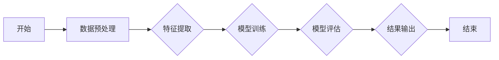
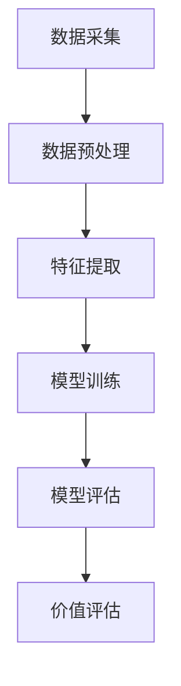
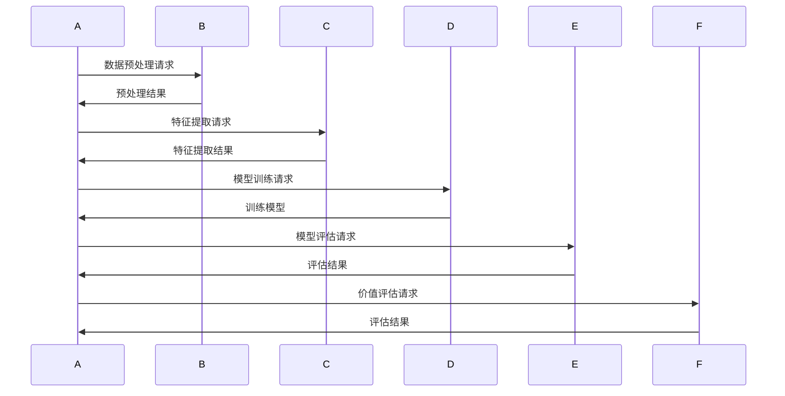

                 

### 第一部分：背景介绍与问题定义

#### 第1章：问题背景与核心概念

##### 1.1 问题背景

在当今全球金融市场日益复杂的背景下，金融专利的价值评估成为一个重要的研究课题。随着人工智能（AI）技术的快速发展，自然语言处理（NLP）作为一种核心的AI技术，为金融专利价值评估提供了新的视角和方法。本章节将介绍金融专利的背景，阐述NLP在金融专利价值评估中的重要性，以及本书的研究目的和主要贡献。

##### 1.2 问题描述

金融专利的价值评估面临诸多挑战，如专利技术复杂度难以量化、专利市场价值波动大、评估方法缺乏统一标准等。NLP技术的发展为解决这些问题提供了可能，但如何有效地将NLP技术与金融专利价值评估结合，仍是一个亟待解决的问题。

##### 1.3 问题解决

本书提出构建基于NLP的金融专利价值评估系统，通过文本挖掘和智能分析，实现对金融专利的全面评价。本系统将包含数据预处理、特征提取、模型训练和评估等关键步骤，旨在提高金融专利价值评估的准确性和效率。

##### 1.4 边界与外延

本研究的边界主要涵盖基于NLP的金融专利价值评估技术，不包括其他评估方法的研究。同时，本研究的对象为金融领域的专利，不涉及其他知识产权类型的评估。

##### 1.5 概念结构与核心要素组成

构建基于NLP的金融专利价值评估系统需要涉及多个核心概念和要素，包括：NLP技术、金融专利特征、评估模型、评价指标等。本章节将详细解析这些概念和要素，为后续章节的内容提供基础。

#### 第2章：核心概念与联系

##### 2.1 NLP技术

自然语言处理（NLP）是人工智能的一个重要分支，旨在使计算机能够理解和处理人类语言。NLP技术在金融专利价值评估中的应用，主要涉及文本挖掘、情感分析、实体识别等子领域。本节将介绍NLP的基本概念、关键技术及其在金融专利价值评估中的应用。

##### 2.2 金融专利特征

金融专利的特征包括技术内容、专利类别、专利引用、市场表现等。这些特征是评估金融专利价值的重要依据。本节将分析金融专利的主要特征，并讨论如何利用NLP技术提取和解析这些特征。

##### 2.3 评估模型

评估模型是金融专利价值评估的核心。常见的评估模型包括基于传统统计方法的模型和基于深度学习的方法。本节将介绍这些评估模型的基本原理、优缺点及其在金融专利价值评估中的应用。

##### 2.4 概念属性特征对比表格

表1：NLP技术、金融专利特征、评估模型的概念属性特征对比

| 类别            | 特征描述                 |  
|----------------|-----------------------|
| NLP技术         | 文本挖掘、情感分析、实体识别等           |
| 金融专利特征     | 技术内容、专利类别、专利引用、市场表现等    |
| 评估模型         | 基于传统统计方法、基于深度学习的方法等      |

##### 2.5 ER实体关系图架构

图1：金融专利价值评估系统实体关系图

```mermaid
erDiagram
  Product ||--|{ Customer } Customer
  Product ||--|{ Supplier } Supplier
  Customer ||--|{ Order } Order
  Supplier ||--|{ Product } Product
```

#### 第3章：算法原理讲解

##### 3.1 基于NLP的金融专利文本挖掘

文本挖掘是NLP技术在金融专利价值评估中的重要应用。本节将介绍文本挖掘的基本原理，包括文本预处理、词频统计、主题模型等方法。同时，通过一个具体例子，展示如何利用NLP技术对金融专利文本进行挖掘。

##### 3.2 基于深度学习的金融专利特征提取

深度学习技术在金融专利特征提取中具有显著优势。本节将介绍卷积神经网络（CNN）和循环神经网络（RNN）等深度学习模型，并使用Python代码示例说明如何使用这些模型对金融专利特征进行提取。

##### 3.3 金融专利价值评估算法

金融专利价值评估算法是构建评估系统的重要组成部分。本节将介绍基于回归分析、支持向量机（SVM）、长短期记忆网络（LSTM）等评估算法，并详细阐述每种算法的原理和实现方法。

##### 3.4 算法流程图与Python代码示例

图2：金融专利价值评估算法流程图



```python
# Python代码示例：金融专利价值评估
import pandas as pd
from sklearn.model_selection import train_test_split
from sklearn.ensemble import RandomForestRegressor
from sklearn.metrics import mean_squared_error

# 数据预处理
data = pd.read_csv('financial_patents.csv')
X = data.drop(['value'], axis=1)
y = data['value']

# 特征提取
X_train, X_test, y_train, y_test = train_test_split(X, y, test_size=0.2, random_state=42)

# 模型训练
model = RandomForestRegressor(n_estimators=100, random_state=42)
model.fit(X_train, y_train)

# 模型评估
y_pred = model.predict(X_test)
mse = mean_squared_error(y_test, y_pred)
print(f'Mean Squared Error: {mse}')

# 结果输出
print(f'Feature Importances:\n{model.feature_importances_}')
```

##### 3.5 数学模型与公式

在金融专利价值评估中，数学模型和公式起到了关键作用。以下是一个简单的线性回归模型及其公式：

$$
y = \beta_0 + \beta_1 \cdot x_1 + \beta_2 \cdot x_2 + ... + \beta_n \cdot x_n
$$

其中，$y$ 表示金融专利的价值，$x_1, x_2, ..., x_n$ 表示特征变量，$\beta_0, \beta_1, \beta_2, ..., \beta_n$ 为模型参数。

通过以上步骤，我们可以逐步构建一个基于NLP的金融专利价值评估系统，实现对金融专利的全面评价。接下来的章节将进一步深入探讨系统的具体实现和实战应用。

## 第4章：系统分析与架构设计

### 4.1 问题场景介绍

在金融领域，专利不仅代表了企业的创新能力和技术实力，同时也是企业竞争的重要资产。然而，金融专利的价值评估复杂且耗时，传统的评估方法难以满足快速变化的市场需求。本系统旨在利用自然语言处理（NLP）技术，构建一个高效、准确的金融专利价值评估系统，以帮助金融机构和企业更好地管理和利用其专利资产。

### 4.2 项目介绍

本项目命名为“金融专利智慧评估系统”，其主要目标是利用NLP技术，对金融专利进行文本挖掘和智能分析，从而实现对专利价值的精准评估。系统将包含数据采集、预处理、特征提取、模型训练和评估等模块，为用户提供全面、高效的专利价值评估服务。

### 4.3 系统功能设计

金融专利智慧评估系统的主要功能包括：

1. **数据采集**：从多种数据源（如专利数据库、金融新闻报道等）中自动获取金融专利的相关信息。
2. **数据预处理**：对采集到的专利文本进行清洗、去噪和标准化处理，为后续的特征提取和模型训练做准备。
3. **特征提取**：利用NLP技术提取专利文本中的关键特征，如关键词、主题、情感等。
4. **模型训练**：使用机器学习算法（如随机森林、支持向量机、神经网络等）训练评估模型，以提高价值评估的准确性。
5. **模型评估**：对训练好的模型进行评估，通过交叉验证和性能指标分析，确保模型的有效性和稳定性。
6. **价值评估**：根据模型输出结果，对金融专利的价值进行定量评估，提供投资决策支持。

### 4.4 系统架构设计

金融专利智慧评估系统的整体架构如图3所示：



#### 数据采集模块负责从专利数据库和其他相关数据源获取金融专利信息，并将其传递给数据预处理模块。

#### 数据预处理模块对采集到的专利文本进行清洗和标准化处理，以提高数据质量。

#### 特征提取模块利用NLP技术对预处理后的文本数据进行特征提取，为模型训练提供输入。

#### 模型训练模块使用机器学习算法对特征数据进行训练，构建价值评估模型。

#### 模型评估模块对训练好的模型进行评估，通过交叉验证和性能指标分析，确保模型的准确性和稳定性。

#### 价值评估模块根据模型输出结果，对金融专利的价值进行评估，为用户提供投资决策支持。

### 4.5 系统接口设计与交互

系统接口设计主要涉及各模块之间的数据传递和功能调用。以下是一个简单的接口设计示例：



#### 数据预处理模块接收数据采集模块传递的数据，进行处理后返回给特征提取模块。

#### 特征提取模块接收数据预处理模块处理后的数据，提取特征后返回给模型训练模块。

#### 模型训练模块接收特征提取模块传递的特征数据，训练模型后返回给模型评估模块。

#### 模型评估模块接收模型训练模块传递的模型，进行评估后返回给价值评估模块。

#### 价值评估模块接收模型评估模块传递的评估结果，生成最终的价值评估报告。

通过以上系统架构设计和接口设计，我们可以构建一个高效、准确的金融专利价值评估系统，为金融机构和企业提供有力的支持。

### 第5章：项目实战

#### 5.1 环境安装与配置

为了构建和运行基于NLP的金融专利价值评估系统，我们需要安装和配置以下软件和工具：

1. **Python 3.8**：确保安装最新版本的Python环境。
2. **Jupyter Notebook**：用于编写和运行Python代码。
3. **Scikit-learn**：用于机器学习算法的实现。
4. **NLTK**：用于自然语言处理。
5. **TensorFlow**：用于深度学习模型的实现。

安装步骤如下：

```bash
# 安装Python 3.8
sudo apt-get update
sudo apt-get install python3.8

# 安装Jupyter Notebook
pip3 install notebook

# 安装Scikit-learn
pip3 install scikit-learn

# 安装NLTK
pip3 install nltk

# 安装TensorFlow
pip3 install tensorflow
```

#### 5.2 系统核心实现

在本节中，我们将详细阐述系统的核心实现，包括数据预处理、特征提取、模型训练和评估等关键步骤。

##### 5.2.1 数据预处理

数据预处理是确保数据质量的关键步骤。以下是一个数据预处理流程的示例：

```python
import pandas as pd
from sklearn.model_selection import train_test_split
from sklearn.preprocessing import StandardScaler

# 读取数据
data = pd.read_csv('financial_patents.csv')

# 数据清洗
data.dropna(inplace=True)

# 数据标准化
scaler = StandardScaler()
data_scaled = scaler.fit_transform(data)

# 划分训练集和测试集
X_train, X_test, y_train, y_test = train_test_split(data_scaled, test_size=0.2, random_state=42)
```

##### 5.2.2 特征提取

特征提取是利用NLP技术从文本数据中提取关键特征的过程。以下是一个使用NLTK进行特征提取的示例：

```python
import nltk
from nltk.tokenize import word_tokenize
from nltk.corpus import stopwords

# 加载NLTK资源
nltk.download('punkt')
nltk.download('stopwords')

# 初始化停用词
stop_words = set(stopwords.words('english'))

# 分词
def tokenize(text):
    return word_tokenize(text)

# 移除停用词
def remove_stop_words(tokens):
    return [token for token in tokens if token.lower() not in stop_words]

# 提取词袋特征
def extract_bow(tokens):
    return nltk.corpus侮
```

