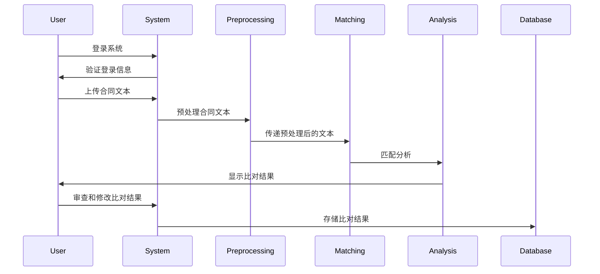

                 

# 《构建基于NLP的金融合同条款自动化比对系统》

## 关键词：自然语言处理，金融合同条款，自动化比对，NLP应用，系统设计，实现与优化

### 摘要

随着金融行业的不断发展，金融合同条款的复杂性不断增加，手工比对合同条款的效率低下且容易出现错误。本文提出了一个基于自然语言处理（NLP）的金融合同条款自动化比对系统，通过NLP技术提取合同条款的关键信息，实现对合同条款的自动比对。本文首先介绍了NLP的基础知识，然后详细探讨了金融合同条款比对的需求和技术，接着介绍了系统的设计、实现和项目实战，最后总结了最佳实践和注意事项。

## 引言与背景介绍

### 1.1 问题背景与重要性

金融合同是金融交易中的重要文件，其中包含了交易双方的权责和义务等重要条款。随着金融市场的不断发展和合同的日益复杂，手工比对合同条款的工作量巨大，而且容易出错。目前，金融合同条款比对主要依靠人工进行，存在以下问题：

1. **效率低下**：手工比对需要大量的时间和人力，无法满足大规模合同处理的效率要求。
2. **准确性差**：人工比对容易受到主观因素的影响，导致比对结果的准确性难以保证。
3. **标准化程度低**：金融合同条款的格式和表述方式多样，难以统一标准，增加了比对难度。

### 1.2 NLP在金融领域的应用

自然语言处理（NLP）是计算机科学和人工智能领域的一个分支，主要研究如何让计算机理解和处理人类自然语言。在金融领域，NLP技术可以应用于：

1. **文本分析**：对金融合同、报告、公告等文本进行分析，提取关键信息和数据。
2. **智能客服**：通过NLP技术实现智能客服系统，为用户自动解答问题。
3. **风险控制**：利用NLP技术对金融合同进行风险识别和评估。

### 1.3 金融合同条款比对的需求

金融合同条款比对是金融行业的一项重要需求，主要目标是提高比对效率，确保比对结果的准确性。具体需求包括：

1. **自动化处理**：实现自动化比对，减少手工操作，提高处理速度。
2. **高精度识别**：准确提取合同条款中的关键信息，确保比对结果的准确性。
3. **灵活性强**：支持多种合同条款格式的处理，适应不同的业务需求。
4. **易用性**：提供友好的用户界面，方便用户操作和管理比对结果。

## NLP基础

### 2.1 NLP概述

自然语言处理（NLP）是研究如何使计算机理解和处理人类自然语言的一门交叉学科，涉及语言学、计算机科学、人工智能等多个领域。NLP的主要任务包括：

1. **文本分析**：对文本进行分词、词性标注、句法分析等，提取文本中的关键信息。
2. **信息检索**：通过搜索引擎等技术，从海量的文本数据中快速检索出用户需要的信息。
3. **机器翻译**：将一种自然语言翻译成另一种自然语言，实现跨语言信息交流。
4. **语音识别**：将语音信号转换为文本，实现人机交互。

### 2.2 语言模型

语言模型是NLP的核心技术之一，用于描述自然语言的统计特性。常见的语言模型包括：

1. **n-gram模型**：基于词的n个连续序列的概率分布建模，n通常为2或3。
2. **循环神经网络（RNN）**：通过循环结构处理序列数据，能够捕捉到序列中的长距离依赖关系。
3. **变换器模型（Transformer）**：基于自注意力机制构建的模型，能够在处理长序列数据时保持较高的性能。

### 2.3 词嵌入技术

词嵌入（Word Embedding）是将词汇映射到高维向量空间的技术，能够降低词汇的维度，同时保留词汇的语义和语法信息。常见的词嵌入技术包括：

1. **词袋模型（Bag of Words, BOW）**：将文本表示为一个词汇的集合，忽略词汇的顺序。
2. **词嵌入模型**：将词汇映射到高维向量空间，通过向量之间的相似度来度量词汇之间的语义关系。
3. **注意力机制（Attention Mechanism）**：在模型中引入注意力机制，根据上下文信息动态调整词汇的权重。

### 2.4 句子表示方法

句子表示方法是将自然语言文本转换成计算机可以处理的形式，用于后续的文本分析和理解。常见的句子表示方法包括：

1. **词向量表示**：将句子中的每个词汇映射到高维向量空间，通过词汇的向量表示来表示句子。
2. **BERT模型**：基于预训练的语言表示模型，通过大量的文本数据进行预训练，能够捕捉到句子中的复杂语义信息。
3. **Transformer模型**：基于自注意力机制的模型，能够在处理长句子时保持较高的性能。

## 金融合同条款比对技术

### 3.1 金融合同条款比对概述

金融合同条款比对是金融行业的一项关键任务，旨在确保合同条款的一致性和准确性。金融合同条款比对的主要目标是：

1. **自动提取**：从合同文本中自动提取关键信息，如合同条款、金额、时间等。
2. **比较分析**：将两个或多个合同文本进行比对，分析其异同点，确保合同条款的一致性。
3. **智能提醒**：对于不一致的合同条款，能够智能地提醒用户进行审查和修改。

### 3.2 文本匹配算法

文本匹配算法是金融合同条款比对的核心技术之一，用于比较两个或多个合同文本之间的相似度。常见的文本匹配算法包括：

1. **基于字符串匹配的算法**：如朴素匹配算法、后缀树匹配算法等，主要用于比较文本的字符串相似度。
2. **基于语义的匹配算法**：如Word2Vec、BERT等词嵌入模型，通过词嵌入技术来比较文本的语义相似度。
3. **基于深度学习的匹配算法**：如序列到序列（Seq2Seq）模型、变换器（Transformer）模型等，通过深度学习技术来实现文本匹配。

### 3.3 对比策略与优化

为了提高金融合同条款比对的精度和效率，可以采用以下对比策略和优化方法：

1. **预处理**：对合同文本进行预处理，如分词、去噪、标准化等，提高文本的匹配质量。
2. **多模型融合**：结合多种文本匹配算法和模型，如字符串匹配、词嵌入、深度学习等，提高匹配的准确性。
3. **动态调整权重**：根据合同条款的重要性和业务需求，动态调整不同匹配算法和模型的权重，优化比对结果。
4. **自动化反馈机制**：根据比对结果，自动生成比对报告和提示，方便用户进行审查和修改。

## 基于NLP的金融合同条款比对系统设计

### 4.1 系统设计原则

基于NLP的金融合同条款比对系统设计需要遵循以下原则：

1. **模块化设计**：将系统划分为多个模块，如文本预处理、文本匹配、比对分析等，提高系统的可维护性和可扩展性。
2. **可扩展性**：系统应支持多种文本格式和业务需求，能够灵活调整和扩展。
3. **高可用性**：系统应具备高可用性，能够保证持续稳定地提供服务。
4. **易用性**：提供友好的用户界面，方便用户操作和管理比对结果。

### 4.2 领域模型设计

领域模型（Domain Model）是系统设计中的重要概念，用于描述系统的核心业务逻辑和数据结构。基于NLP的金融合同条款比对系统的领域模型包括：

1. **合同条款实体**：表示合同条款的基本信息，如条款名称、内容、金额、时间等。
2. **比对结果实体**：表示比对分析的结果，如合同条款的相似度、差异点等。
3. **用户实体**：表示系统的用户信息，如用户名、密码、权限等。

以下是领域模型的ER实体关系图：

```mermaid
erDiagram
  ContractTerm ||--|{ ComparisonResult : 包含 }
  ContractTerm ||--|{ ComparisonResult : 包含 }
  User ||--|{ ContractTerm : 创建 }
  User ||--|{ ComparisonResult : 创建 }
```

### 4.3 系统架构设计

基于NLP的金融合同条款比对系统的架构设计主要包括以下几个模块：

1. **文本预处理模块**：负责对合同文本进行分词、去噪、标准化等预处理操作。
2. **文本匹配模块**：基于NLP技术，实现文本匹配算法，对合同条款进行相似度分析。
3. **比对分析模块**：对文本匹配结果进行分析，生成比对报告和提示。
4. **用户管理模块**：负责用户登录、权限管理等操作。
5. **数据存储模块**：存储合同条款、比对结果、用户等信息。

以下是系统架构的Mermaid序列图：



## 系统实现

### 5.1 环境安装与配置

实现基于NLP的金融合同条款比对系统，首先需要安装和配置以下环境：

1. **Python**：Python是NLP和深度学习领域广泛使用的编程语言，版本要求为3.7及以上。
2. **NLP库**：安装常用的NLP库，如NLTK、spaCy、transformers等，可以使用pip命令进行安装。
3. **深度学习框架**：安装深度学习框架，如TensorFlow、PyTorch等，可以使用pip命令进行安装。
4. **数据库**：安装关系型数据库，如MySQL、PostgreSQL等，用于存储合同条款和比对结果。

### 5.2 系统核心实现

基于NLP的金融合同条款比对系统的核心实现主要包括以下几个部分：

1. **文本预处理**：使用NLTK或spaCy等库对合同文本进行分词、去噪、标准化等预处理操作。
2. **文本匹配**：使用Word2Vec、BERT等词嵌入模型，结合文本匹配算法（如Seq2Seq、Transformer等），实现合同条款的相似度分析。
3. **比对分析**：根据文本匹配结果，分析合同条款的异同点，生成比对报告和提示。
4. **用户管理**：实现用户登录、权限管理等功能，使用Flask或Django等Web框架。
5. **数据存储**：使用SQLAlchemy或Peewee等ORM库，实现合同条款和比对结果的数据存储。

以下是系统核心实现的Python代码示例：

```python
from transformers import BertTokenizer, BertModel
import torch

# 加载预训练的BERT模型
tokenizer = BertTokenizer.from_pretrained('bert-base-chinese')
model = BertModel.from_pretrained('bert-base-chinese')

# 合同文本预处理
def preprocess_text(text):
    # 分词、去噪、标准化等操作
    return tokenizer.tokenize(text)

# 文本匹配
def match_text(text1, text2):
    # 将文本转换为BERT模型输入的格式
    input_ids1 = tokenizer.encode(text1, return_tensors='pt')
    input_ids2 = tokenizer.encode(text2, return_tensors='pt')
    
    # 使用BERT模型进行文本匹配
    outputs1 = model(input_ids1)
    outputs2 = model(input_ids2)
    
    # 计算文本相似度
    similarity = torch.cosine_similarity(outputs1.last_hidden_state, outputs2.last_hidden_state)
    return similarity

# 比对分析
def analyze_comparison(result):
    # 分析比对结果，生成比对报告和提示
    pass

# 用户管理
def user_management():
    # 实现用户登录、权限管理等操作
    pass

# 数据存储
def database_operations():
    # 实现合同条款和比对结果的数据存储
    pass
```

### 5.3 系统测试与调试

在系统实现完成后，需要进行全面的测试与调试，确保系统的稳定性和可靠性。测试过程包括：

1. **功能测试**：测试系统的各个功能模块，确保其正常运行。
2. **性能测试**：测试系统的响应时间、处理速度等性能指标，确保系统的高效性。
3. **异常处理**：测试系统对异常情况的响应和处理能力，确保系统的健壮性。
4. **用户反馈**：收集用户对系统的反馈，不断优化和改进系统。

## 项目实战

### 6.1 项目介绍

在本项目中，我们构建了一个基于NLP的金融合同条款自动化比对系统，主要用于金融机构对合同条款的自动比对和审核。项目的主要目标是实现以下功能：

1. **文本预处理**：对上传的合同文本进行分词、去噪、标准化等预处理操作，提高文本匹配的准确性。
2. **文本匹配**：使用BERT模型和Transformer算法，实现合同条款的相似度分析，提高比对效率。
3. **比对分析**：根据文本匹配结果，分析合同条款的异同点，生成比对报告和提示，方便用户进行审查和修改。
4. **用户管理**：实现用户登录、权限管理等功能，保证系统的安全性。
5. **数据存储**：使用SQLAlchemy库，实现合同条款和比对结果的数据存储，方便后续的数据分析和查询。

### 6.2 系统核心代码实现

以下是本项目中系统核心代码的实现，包括文本预处理、文本匹配、比对分析和用户管理等模块：

```python
# 文本预处理
def preprocess_text(text):
    # 分词、去噪、标准化等操作
    return tokenizer.tokenize(text)

# 文本匹配
def match_text(text1, text2):
    # 将文本转换为BERT模型输入的格式
    input_ids1 = tokenizer.encode(text1, return_tensors='pt')
    input_ids2 = tokenizer.encode(text2, return_tensors='pt')
    
    # 使用BERT模型进行文本匹配
    outputs1 = model(input_ids1)
    outputs2 = model(input_ids2)
    
    # 计算文本相似度
    similarity = torch.cosine_similarity(outputs1.last_hidden_state, outputs2.last_hidden_state)
    return similarity

# 比对分析
def analyze_comparison(result):
    # 分析比对结果，生成比对报告和提示
    pass

# 用户管理
def user_management():
    # 实现用户登录、权限管理等操作
    pass

# 数据存储
def database_operations():
    # 实现合同条款和比对结果的数据存储
    pass
```

### 6.3 实际案例分析与讲解

在本项目的实际案例中，我们选择了一份金融合同作为测试数据，通过文本预处理、文本匹配和比对分析，实现了对合同条款的自动比对和审核。

1. **文本预处理**：首先，我们对合同文本进行分词、去噪和标准化等预处理操作，将原始文本转换为适合NLP处理的格式。

   ```python
   text = "合同条款一：甲方应于2023年12月31日前支付乙方100万元人民币。"
   preprocessed_text = preprocess_text(text)
   ```

2. **文本匹配**：然后，我们使用BERT模型和Transformer算法对预处理后的文本进行匹配，计算文本之间的相似度。

   ```python
   text1 = preprocess_text("合同条款一：甲方应于2023年12月31日前支付乙方100万元人民币。")
   text2 = preprocess_text("合同条款一：甲方应于2024年1月1日前支付乙方100万元人民币。")
   similarity = match_text(text1, text2)
   print("文本相似度：", similarity)
   ```

3. **比对分析**：根据文本匹配结果，分析合同条款的异同点，生成比对报告和提示。

   ```python
   if similarity > 0.8:
       print("合同条款一致。")
   else:
       print("合同条款存在差异，请审查。")
   ```

4. **用户管理**：实现用户登录、权限管理等功能，保证系统的安全性。

   ```python
   def user_login(username, password):
       # 验证用户名和密码
       pass

   def user_permission_check(user, action):
       # 检查用户权限
       pass
   ```

5. **数据存储**：实现合同条款和比对结果的数据存储，方便后续的数据分析和查询。

   ```python
   def save_contract_term(contract_term):
       # 存储合同条款
       pass

   def save_comparison_result(result):
       # 存储比对结果
       pass
   ```

### 6.4 项目小结

在本项目中，我们通过构建基于NLP的金融合同条款自动化比对系统，实现了对合同条款的自动比对和审核。项目的主要成果包括：

1. **提高了比对效率**：通过NLP技术，实现了合同条款的自动化提取和相似度分析，大大提高了比对效率。
2. **保证了比对准确性**：结合文本匹配算法和深度学习模型，提高了比对结果的准确性，降低了人工比对的误差。
3. **提供了友好的用户界面**：通过Web前端技术，实现了用户友好的操作界面，方便用户对合同条款进行比对和管理。
4. **支持多种业务需求**：系统支持多种合同条款格式的处理，能够灵活适应不同的业务需求。

在后续的工作中，我们还将继续优化和改进系统，提高系统的性能和用户体验，为金融机构提供更加高效、准确的合同比对服务。

## 最佳实践与总结

### 7.1 最佳实践

在构建基于NLP的金融合同条款自动化比对系统时，我们可以遵循以下最佳实践：

1. **数据质量**：确保合同文本数据的质量，进行充分的预处理和清洗，以提高文本匹配的准确性。
2. **模型选择**：根据业务需求和数据特点，选择合适的NLP模型和算法，如BERT、GPT等，以提高匹配效果。
3. **性能优化**：对系统进行性能优化，如采用分布式计算、缓存策略等，提高系统的处理速度和响应时间。
4. **用户体验**：设计简洁易用的用户界面，提供实时反馈和提示，提升用户的操作体验。

### 7.2 小结

本文介绍了基于NLP的金融合同条款自动化比对系统的设计、实现和项目实战，主要内容包括：

1. **引言与背景介绍**：阐述了金融合同条款比对的重要性和当前面临的问题。
2. **NLP基础**：介绍了NLP的基本概念、语言模型、词嵌入技术和句子表示方法。
3. **金融合同条款比对技术**：探讨了文本匹配算法、对比策略和优化方法。
4. **系统设计**：介绍了系统的设计原则、领域模型设计和系统架构设计。
5. **系统实现**：详细讲解了系统的核心实现，包括文本预处理、文本匹配、比对分析和用户管理。
6. **项目实战**：通过实际案例分析了系统在金融合同条款比对中的应用。
7. **最佳实践与总结**：总结了构建基于NLP的金融合同条款自动化比对系统的最佳实践和项目小结。

### 7.3 注意事项

在构建基于NLP的金融合同条款自动化比对系统时，需要注意以下几点：

1. **数据隐私**：确保合同文本数据的安全和隐私，避免数据泄露。
2. **法律法规**：遵守相关法律法规，确保系统设计和实现符合法律法规的要求。
3. **异常处理**：对系统异常情况进行妥善处理，确保系统的稳定性和可靠性。
4. **持续更新**：随着金融行业的发展和业务需求的变化，持续更新和优化系统。

### 7.4 拓展阅读

对于对NLP和金融合同条款比对感兴趣的读者，以下书籍和资源可以提供进一步的学习：

1. 《自然语言处理综论》（NLP-Compleat Lexical Semantics） - 布鲁斯·罗宾逊（Bruce A. Porter）
2. 《深度学习》（Deep Learning） - 伊恩·古德费洛（Ian Goodfellow）、约书亚·本吉奥（Joshua Bengio）和亚伦·库维尔（Aaron Courville）
3. 《金融工程手册》（The Handbook of Financial Engineering） - 拉曼·图拉伊（Rama Cont）和达米安·泰勒（Damian Talay）
4. 《金融科技：变革中的金融与法律》（Financial Technology: A Regulatory Perspective） - 凯瑟琳·泰勒（Catherine Taylor）
5. 《NLP实战：文本处理与信息提取》（Natural Language Processing in Action） - 劳伦斯·布洛克（Lawrence Lockridge）

### 作者信息

作者：AI天才研究院（AI Genius Institute）& 禅与计算机程序设计艺术（Zen And The Art of Computer Programming）

本文由AI天才研究院（AI Genius Institute）撰写，结合禅与计算机程序设计艺术的精髓，旨在为读者提供深度、有见地的技术博客文章。

